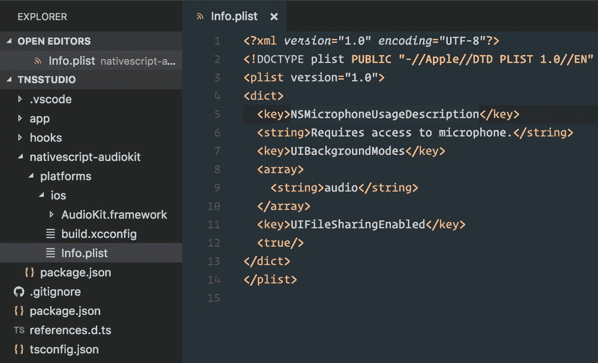
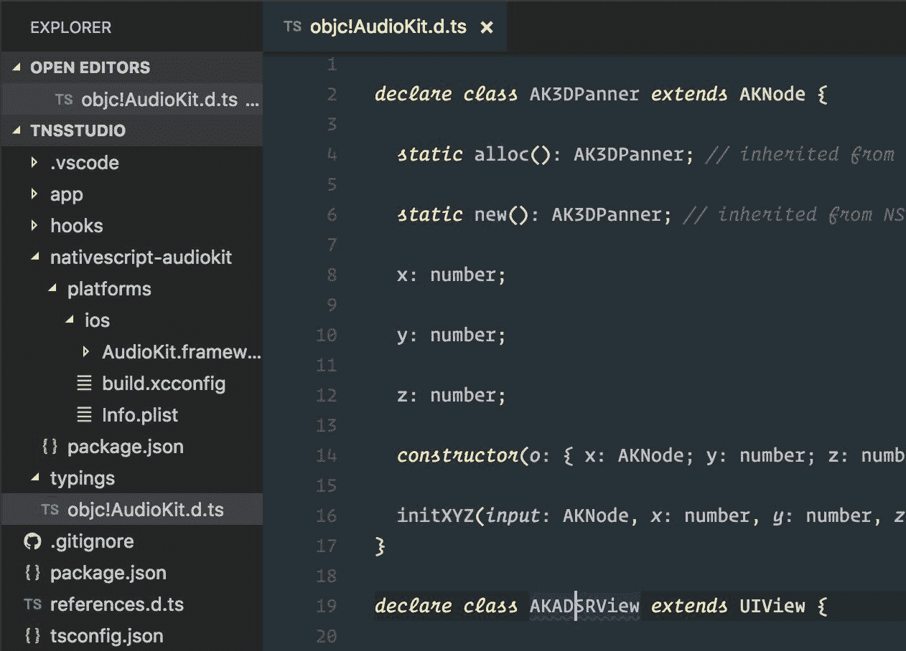
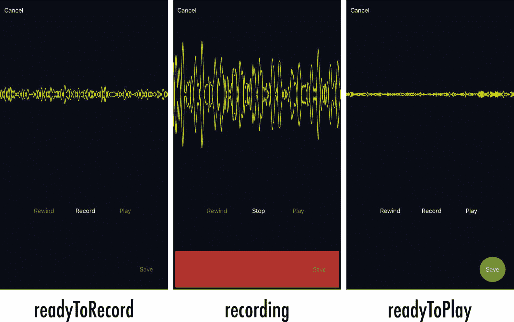
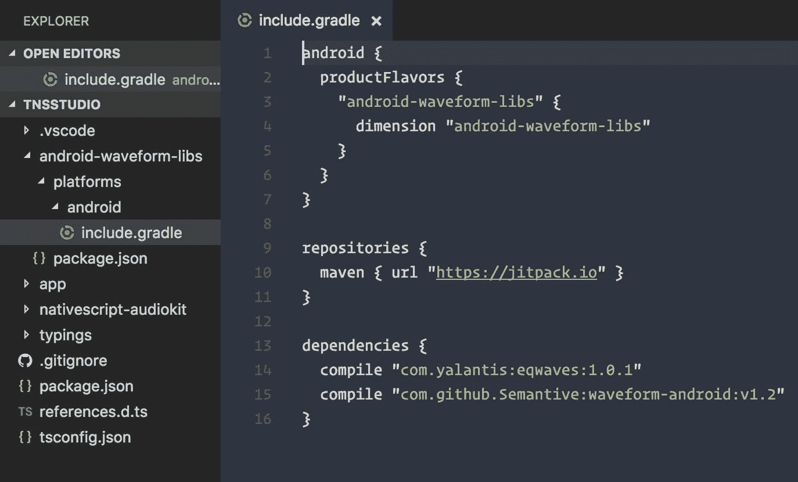
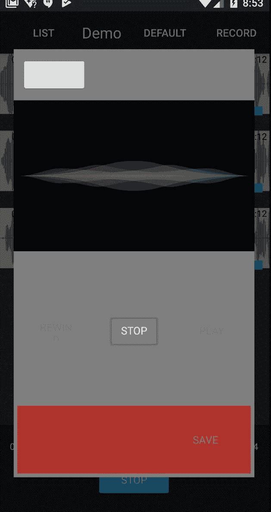
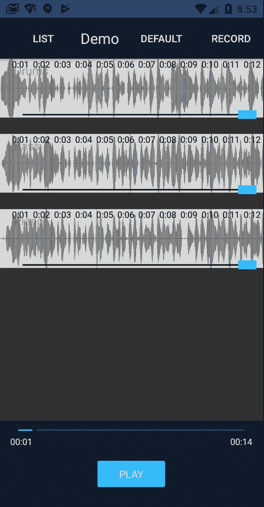

# 第八章：构建 Audio Recorder

录音是我们应用必须处理的性能最密集的操作。它也是拥有访问原生 API 将最有回报的功能之一。我们希望用户能够以尽可能低的延迟记录，以实现最高的音质保真度。此外，此录音可以选择性地在现有的同步播放的预录音轨混合之上发生。

由于我们应用开发的这一阶段将最深入地挖掘平台特定的原生 API，我们将我们的实现分为两个阶段。我们首先构建记录功能的 iOS 特定细节，然后是 Android。

在本章中，我们将涵盖以下内容：

+   使用一致的 API 为 iOS 和 Android 构建功能丰富的跨平台音频录音器

+   集成 iOS 框架库，例如完全用 Swift 构建的 AudioKit ([`audiokit.io`](http://audiokit.io))

+   如何将 Swift/Objective C 方法转换为 NativeScript

+   基于 native APIs 构建 custom reusable NativeScript 视图组件，以及如何在 Angular 中使用它们

+   配置一个可重用的 Angular 组件，该组件可以通过路由使用，也可以通过弹出模态打开

+   集成 Android Gradle 库

+   如何将 Java 方法转换为 NativeScript

+   使用 NativeScript 的 ListView 与多个项目模板

# 第一阶段 – 为 iOS 构建音频录音器

iOS 平台的音频功能令人印象深刻。一群才华横溢的音频爱好者和软件工程师合作，在平台的音频堆栈之上构建了一个开源框架层。这一世界级的工程努力是令人敬畏的 AudioKit ([`audiokit.io/`](http://audiokit.io/))，由无畏的 Aurelius Prochazka 领导，他是音频技术的真正先驱。

AudioKit 框架完全用 Swift 编写，当与 NativeScript 集成时，引入了一些有趣的表面级挑战。

# 挑战绕行 – 将基于 Swift 的库集成到 NativeScript 中

在撰写本文时，如果代码库通过所谓的桥接头正确地将类和类型暴露给 Objective-C，NativeScript 可以与 Swift 一起工作。你可以在这里了解更多关于桥接头的信息：[`developer.apple.com/library/content/documentation/Swift/Conceptual/BuildingCocoaApps/MixandMatch.html`](https://developer.apple.com/library/content/documentation/Swift/Conceptual/BuildingCocoaApps/MixandMatch.html)。 [](https://developer.apple.com/library/content/documentation/Swift/Conceptual/BuildingCocoaApps/MixandMatch.html) 这个桥接头在 Swift 代码库编译成框架时自动生成。Swift 提供了丰富的语言特性，其中一些与 Objective C 没有直接关联。然而，在撰写本文时，可能需要考虑一些因素，尽管 NativeScript 最终可能会提供对最新 Swift 语言增强的全面支持。

AudioKit 利用 Swift 语言所能提供的最佳特性，包括增强的 `enum` 功能。你可以在这里了解更多关于 Swift 语言中扩展的 `enum` 功能：

[`developer.apple.com/library/content/documentation/Swift/Conceptual/Swift_Programming_Language/Enumerations.html`](https://developer.apple.com/library/content/documentation/Swift/Conceptual/Swift_Programming_Language/Enumerations.html)

尤其是在文档中有这样的描述：“它们采用了许多传统上仅由类支持的特性，例如计算属性，以提供有关枚举当前值的额外信息，以及实例方法，以提供与枚举表示的值相关的功能。”

这种 `enum` 在 Objective C 中是陌生的，因此不能在桥接头中提供。任何使用 Swift 的异构 `enum` 的代码在编译时生成桥接头时将被简单地忽略，导致 Objective C 无法与这些代码部分交互。这意味着你将无法在 NativeScript 中使用 Swift 代码库中的方法，这些方法直接使用这些增强结构（*在撰写本文时*）。

为了解决这个问题，我们将分叉 AudioKit 框架，并将 `AKAudioFile` 扩展文件中使用的异构枚举扁平化，这些扩展文件提供了一个强大且方便的导出方法，我们希望用它来保存我们的录音音频文件。我们需要修改的异构 `enum` 看起来是这样的 ([`github.com/audiokit/AudioKit/blob/master/AudioKit/Common/Internals/Audio%20File/AKAudioFile%2BProcessingAsynchronously.swift`](https://github.com/audiokit/AudioKit/blob/master/AudioKit/Common/Internals/Audio%20File/AKAudioFile%2BProcessingAsynchronously.swift)):

```js
// From AudioKit's Swift 3.x codebase

public enum ExportFormat {
  case wav
  case aif
  case mp4
  case m4a
  case caf

  fileprivate var UTI: CFString {
    switch self {
    case .wav:
      return AVFileTypeWAVE as CFString
    case .aif:
      return AVFileTypeAIFF as CFString
    case .mp4:
      return AVFileTypeAppleM4A as CFString
    case .m4a:
      return AVFileTypeAppleM4A as CFString
    case .caf:
      return AVFileTypeCoreAudioFormat as CFString
    }
  }

  static var supportedFileExtensions: [String] {
    return ["wav", "aif", "mp4", "m4a", "caf"]
  }
}
```

这与您可能熟悉的任何*枚举*不同；如您所见，它除了枚举拥有的属性外还包括其他属性。当此代码编译并生成桥接头与 Objective-C 混合或匹配时，桥接头将排除使用此构造的任何代码。我们将将其扁平化，如下所示：

```js
public enum ExportFormat: Int {
  case wav
  case aif
  case mp4
  case m4a
  case caf
}

static public func stringUTI(type: ExportFormat) -> CFString {
  switch type {
  case .wav:
    return AVFileTypeWAVE as CFString
  case .aif:
    return AVFileTypeAIFF as CFString
  case .mp4:
    return AVFileTypeAppleM4A as CFString
  case .m4a:
    return AVFileTypeAppleM4A as CFString
  case .caf:
    return AVFileTypeCoreAudioFormat as CFString
  }
}

static public var supportedFileExtensions: [String] {
  return ["wav", "aif", "mp4", "m4a", "caf"]
}
```

我们将调整`AKAudioFile`扩展的部分，以使用我们的扁平化属性。这将允许我们手动构建可以在应用中使用的`AudioKit.framework`，暴露我们想要使用的方法：`exportAsynchronously`。

我们不会详细介绍手动构建`AudioKit.framework`的细节，因为它在这里有很好的文档：[`github.com/audiokit/AudioKit/blob/master/Frameworks/INSTALL.md#building-universal-frameworks-from-scratch`](https://github.com/audiokit/AudioKit/blob/master/AudioKit/Common/Internals/Audio%20File/AKAudioFile%2BProcessingAsynchronously.swift)。使用我们自定义构建的框架，我们现在已准备好将其集成到我们的应用中。

# 将自定义构建的 iOS 框架集成到 NativeScript

我们现在可以创建一个内部插件，将这个 iOS 框架集成到我们的应用中。将我们构建的定制`AudioKit.framework`放入我们应用的根目录下创建一个`nativescript-audiokit`目录。然后我们在其中添加一个`platforms/ios`文件夹，将框架放入。这将让 NativeScript 知道如何将这些 iOS 特定文件构建到应用中。由于我们希望这个内部插件像任何标准 npm 插件一样被处理，我们还将直接在`nativescript-audiokit`文件夹中添加`package.json`文件，内容如下：

```js
{
  "name": "nativescript-audiokit",
  "version": "1.0.0",
  "nativescript": {
    "platforms": {
      "ios": "3.0.0"
    }
  }
}
```

我们现在将使用以下命令将其添加到我们的应用中（NativeScript 将首先在本地查找，然后找到**nativescript-audiokit**插件）：

```js
tns plugin add nativescript-audiokit
```

这将正确地将自定义构建的 iOS 框架添加到我们的应用中。

然而，我们还需要两个非常重要的项目：

1.  由于 AudioKit 是基于 Swift 的框架，我们希望确保我们的应用包含适当的支持 Swift 库。添加一个新文件，`nativescript-audiokit/platforms/ios/build.xcconfig`：

```js
EMBEDDED_CONTENT_CONTAINS_SWIFT = true
```

1.  由于我们将使用用户的麦克风，我们希望确保在应用属性列表中指示麦克风的使用。我们也将借此机会添加两个额外的属性设置来增强我们应用的能力。因此，总共我们将添加三个属性键，用于以下目的：

    +   让设备知道我们的应用需要访问麦克风，并确保在首次访问时请求用户的权限。

    +   如果应用被放置到后台，继续播放音频。

    +   当手机连接到计算机时，提供查看应用`documents`文件夹的能力。这将允许您通过应用文档直接在 iTunes 中查看记录的文件。这对于集成到桌面音频编辑软件可能很有用。

添加一个新文件，`nativescript-audiokit/platforms/ios/Info.plist`，内容如下：

```js
<?xml version="1.0" encoding="UTF-8"?>
<!DOCTYPE plist PUBLIC "-//Apple//DTD PLIST 1.0//EN" "http://www.apple.com/DTDs/PropertyList-1.0.dtd">
<plist version="1.0">
<dict>
  <key>NSMicrophoneUsageDescription</key>
 <string>Requires access to microphone.</string>
 <key>UIBackgroundModes</key>
 <array>
 <string>audio</string>
 </array>
 <key>UIFileSharingEnabled</key> 
 <true/>
</dict>
</plist>
```

这里有一个截图，更好地说明了我们应用中内部插件的架构：



现在，当 NativeScript 构建 iOS 应用时，它将确保 `AudioKit.framework` 被包含为一个库，并将 `build.xcconfig` 和 `Info.plist` 的内容合并到我们的应用配置中。每次我们更改这个内部插件文件夹（`nativescript-audiokit`）内的文件时，我们都想确保我们的应用能够获取这些更改。为此，我们可以简单地移除并重新添加插件，所以现在让我们这么做：

```js
tns plugin remove nativescript-audiokit
tns plugin add nativescript-audiokit
```

现在，我们准备使用 iOS 的 AudioKit API 来构建我们的音频录制器。

# 设置原生 API 类型检查并生成 AudioKit TypeScript 定义

我们首先想做的事情是安装 `tns-platform-declarations`：

```js
npm i tns-platform-declarations --save-dev
```

现在，我们在项目的根目录中创建一个名为 `references.d.ts` 的新文件，其内容如下：

```js
/// <reference path="./node_modules/tns-platform-declarations/ios.d.ts" />
/// <reference path="./node_modules/tns-platform-declarations/android.d.ts" />
```

这为我们提供了对 iOS 和 Android API 的完整类型检查和智能感知支持。

现在，我们想要为 AudioKit 框架本身生成类型定义。我们可以执行以下命令来生成包含的 `AudioKit.framework` 的类型定义：

```js
TNS_TYPESCRIPT_DECLARATIONS_PATH="$(pwd)/typings" tns build ios
```

我们正在设置环境变量 `TNS_TYPESCRIPT_DECLARATIONS_PATH` 为当前工作目录（`pwd`），并带有 `typings` 文件夹前缀。当 NativeScript 创建 iOS 构建时，它还将为我们的应用可用的所有原生 API 生成类型定义文件，包括第三方库。我们现在将看到在项目中出现一个 `typings` 文件夹，其中包含两个文件夹：`i386` 和 `x86_64`。一个是用于模拟器架构的，另一个是用于设备的。两者都将包含相同的内容，所以我们可以只关注其中一个。打开 `i386` 文件夹，你会找到一个 `objc!AudioKit.d.ts` 文件。

我们只想使用那个文件，所以将其移动到 `typings` 文件夹的根目录：`typings/objc!AudioKit.d.ts`。然后我们可以删除 `i386` 和 `x86_64` 文件夹，因为我们不再需要它们（其他 API 定义文件通过 `tns-platform-declarations` 提供）。我们只是生成这些类型定义来获取 AudioKit 库的类型定义。这是一次性的事情，为了方便与这个本地库集成，所以你可以安全地将这个自定义 `typings` 文件夹添加到源控制中。

请再次检查 `tsconfig.json` 并确保已启用 `"skipLibCheck": true` 选项。我们现在可以修改我们的 `references.d.ts` 文件，以包含 AudioKit 库的附加类型：

```js
/// <reference path="./node_modules/tns-platform-declarations/ios.d.ts" />
/// <reference path="./node_modules/tns-platform-declarations/android.d.ts" />
/// <reference path="./typings/objc!AudioKit.d.ts" />
```

我们的项目结构现在应该看起来像这样：



# 使用 AudioKit 构建录制器

我们将首先创建一个模型，围绕我们与 AudioKit 记录 API 的交互。你可以直接从你的 Angular 组件或服务开始直接编写针对这些 API 的代码，但由于我们希望提供跨 iOS 和 Android 的一致 API，所以有一个更智能的方式来设计这个架构。相反，我们将抽象出一个简单的 API，可以在两个平台上使用，它将在底层调用正确的原生实现。

这里将会有很多与 AudioKit 相关的有趣细节，但请创建 `app/modules/recorder/models/record.model.ts`，如下所示，我们将在稍后解释一些细节：

之后，我们将为此模型添加 `.ios.ts` 后缀，因为它将包含 iOS 特定的实现细节。然而，在第一阶段，我们将直接使用该模型（省略平台后缀）来开发我们的 iOS 录音器。

```js
import { Observable } from 'data/observable';
import { knownFolders } from 'file-system';

// all available states for the recorder 
export enum RecordState {
  readyToRecord,
  recording,
  readyToPlay,
  playing,
  saved,
  finish
}

// available events
export interface IRecordEvents {
  stateChange: string;
}

// for use when saving files
const documentsFilePath = function(filename: string) {
  return `${knownFolders.documents().path}/${filename}`;
}

export class RecordModel extends Observable {

  // available events to listen to
  private _events: IRecordEvents;

  // control nodes 
  private _mic: AKMicrophone;
  private _micBooster: AKBooster;
  private _recorder: AKNodeRecorder;

  // mixers
  private _micMixer: AKMixer;
  private _mainMixer: AKMixer;

  // state
  private _state: number = RecordState.readyToRecord;

  // the final saved path to use 
  private _savedFilePath: string;

  constructor() {
    super();
    // setup the event names
    this._setupEvents();

    // setup recording environment
    // clean any tmp files from previous recording sessions
    (<any>AVAudioFile).cleanTempDirectory();

    // audio setup 
    AKSettings.setBufferLength(BufferLength.Medium);

    try {
      // ensure audio session is PlayAndRecord
      // allows mixing with other tracks while recording
      AKSettings.setSessionWithCategoryOptionsError(
        SessionCategory.PlayAndRecord, 
        AVAudioSessionCategoryOptions.DefaultToSpeaker
      );
    } catch (err) {
      console.log('AKSettings error:', err);
    }

    // setup mic with it's own mixer
    this._mic = AKMicrophone.alloc().init();
    this._micMixer = AKMixer.alloc().init(null);
    this._micMixer.connect(this._mic);
    // Helps provide mic monitoring when headphones are plugged in
    this._micBooster = AKBooster.alloc().initGain(<any>this._micMixer, 0);

    try {
      // recorder takes the micMixer input node
      this._recorder = AKNodeRecorder.alloc()
        .initWithNodeFileError(<any>this._micMixer, null);
    } catch (err) {
      console.log('AKNodeRecorder init error:', err);
    }

    // overall main mixer uses micBooster
    this._mainMixer = AKMixer.alloc().init(null);
    this._mainMixer.connect(this._micBooster);

    // single output set to mainMixer 
    AudioKit.setOutput(<any>this._mainMixer);
    // start the engine!
    AudioKit.start();
  }

  public get events(): IRecordEvents {
    return this._events;
  }

  public get mic(): AKMicrophone {
    return this._mic;
  }

  public get recorder(): AKNodeRecorder {
    return this._recorder;
  }

  public get audioFilePath(): string {
    if (this._recorder) {
      return this._recorder.audioFile.url.absoluteString;
    }
    return '';
  }

  public get state(): number {
    return this._state;
  }

  public set state(value: number) {
    this._state = value;
    // always emit state changes
    this._emitEvent(this._events.stateChange, this._state);
  }

  public get savedFilePath() {
    return this._savedFilePath;
  }

  public set savedFilePath(value: string) {
    this._savedFilePath = value;
    if (this._savedFilePath)
      this.state = RecordState.saved;
  }

  public toggleRecord() {
    if (this._state !== RecordState.recording) {
      // just force ready to record
      // when coming from any state other than recording
      this.state = RecordState.readyToRecord;

      if (this._recorder) {
        try {
          // resetting (clear previous recordings)
          this._recorder.resetAndReturnError();
        } catch (err) {
          console.log('Recorder reset error:', err);
        }
      }
    }

    switch (this._state) {
      case RecordState.readyToRecord:
        if (AKSettings.headPhonesPlugged) {
          // Microphone monitoring when headphones plugged
          this._micBooster.gain = 1;
        }

        try {
          this._recorder.recordAndReturnError();
          this.state = RecordState.recording;
        } catch (err) {
          console.log('Recording failed:', err);
        }
        break;
      case RecordState.recording:
        this.state = RecordState.readyToPlay;
        this._recorder.stop();
        // Microphone monitoring muted when playing back
        this._micBooster.gain = 0;
        break;
    }
  } 

  public togglePlay() {
    if (this._state === RecordState.readyToPlay) {
      this.state = RecordState.playing;
    } else {
      this.stopPlayback();
    }
  }

  public stopPlayback() {
    if (this.state !== RecordState.recording) {
      this.state = RecordState.readyToPlay;
    }
  }

  public save() {
    let fileName = `recording-${Date.now()}.m4a`;
    this._recorder.audioFile
    .exportAsynchronouslyWithNameBaseDirExportFormatFromSampleToSampleCallback(
      fileName, BaseDirectory.Documents, ExportFormat.M4a, null, null, 
      (af: AKAudioFile, err: NSError) => {
        this.savedFilePath = documentsFilePath(fileName);
      });
  }

  public finish() {
    this.state = RecordState.finish;
  }

  private _emitEvent(eventName: string, data?: any) {
    let event = {
      eventName,
      data,
      object: this
    };
    this.notify(event);
  }

  private _setupEvents() {
    this._events = {
      stateChange: 'stateChange'
    };
  }
}
```

`RecordModel` 将表现得有点像状态机，它可能处于以下状态之一：

+   `readyToRecord`: 默认起始状态。必须处于此状态才能进入录音状态。

+   `recording`: 工作室安静！正在录音中。

+   `readyToPlay`: 用户停止了录音，现在有一个可以与混音一起播放的录音文件。

+   `playing`: 用户正在播放带有混音的录音文件。

+   `saved`: 用户选择保存录音，这将启动保存新曲目与活动组合的操作。

+   `finish`: 保存操作完成后，记录器应关闭。

我们接着定义记录器将通过 `IRecordEvents` 提供的事件形状。在这种情况下，我们将有一个单独的事件，`stateChange`，当状态改变时会通知任何监听者（*参见状态设置器*）。我们的模型将扩展 NativeScript 的 `Observable` 类（因此，`RecordModel extends Observable`），这将为我们提供通知 API 来分发我们的事件。

我们接着设置了对我们将使用的各种 AudioKit 组件的多个引用。大部分设计直接来自这个 AudioKit 录音示例：[`github.com/audiokit/AudioKit/blob/master/Examples/iOS/RecorderDemo/RecorderDemo/ViewController.swift`](https://github.com/audiokit/AudioKit/blob/master/Examples/iOS/RecorderDemo/RecorderDemo/ViewController.swift)。我们甚至使用了相同的状态枚举设置（添加了一些额外的设置）。在他们示例中，使用了 AudioKit 的 `AKAudioPlayer` 进行播放；但，在我们的设计中，我们将加载我们的录音文件到我们的多轨播放器设计中以进行播放。我们可以在 iOS 的 `TrackPlayerModel` 中工作 `AKAudioPlayer`；但，`TNSPlayer`（来自 `nativescript-audio` 插件）是跨平台兼容的，并且可以正常工作。我们将在稍后详细说明如何将这些新录音文件加载到我们的设计中，但通知监听者记录器的状态将为我们提供处理所有这些所需的所有灵活性。

你可能会想知道为什么我们进行类型转换：

```js
(<any>AVAudioFile).cleanTempDirectory();
```

好问题。AudioKit 为 Core Foundation 类如 `AVAudioFile` 提供扩展。这些在 Objective-C 中被称为 `Categories`：[`developer.apple.com/library/content/documentation/General/Conceptual/DevPedia-CocoaCore/Category.html`](https://developer.apple.com/library/content/documentation/General/Conceptual/DevPedia-CocoaCore/Category.html)；然而，在 Swift 中，它们被称为 `Extensions`：[`developer.apple.com/library/content/documentation/Swift/Conceptual/Swift_Programming_Language/Extensions.html`](https://developer.apple.com/library/content/documentation/Swift/Conceptual/Swift_Programming_Language/Extensions.html)。

如果你还记得，我们为 AudioKit 生成 TypeScript 定义；但我们只保留了 `objc!AudioKit.d.ts` 文件以供参考。如果我们查看基础定义，我们会看到对 `AVAudioFile` 的扩展。然而，由于我们没有保留这些定义，而是依赖于默认的 `tns-platform-declarations` 定义，这个 `Extension` 对我们的 TypeScript 编译器来说是未知的，所以我们简单地进行了类型转换，因为我们知道 AudioKit 提供了这个。

同样重要的是 `RecordModel` 将音频会话设置为 `PlayAndRecord`，因为这将允许我们在播放混音的同时进行录音：

```js
AKSettings.setSessionWithCategoryOptionsError(
  SessionCategory.PlayAndRecord, 
  AVAudioSessionCategoryOptions.DefaultToSpeaker
);
```

你可能也好奇为什么一些类使用 `init()` 而另一些使用 `init(null)`：

```js
this._mic = AKMicrophone.alloc().init();
this._micMixer = AKMixer.alloc().init(null);
this._micMixer.connect(this._mic);
```

AudioKit 类的一些初始化器接受一个可选参数，例如，`AKMixer` 接受一个可选的 `NSArray` 参数，用于连接 `AVAudioNode`。然而，我们的 TypeScript 定义将这些参数定义为必需的，所以我们只是传递 `null` 给这个参数，并直接使用 `connect` 节点 API。

# 如何将 Swift/ObjC 方法转换为 NativeScript

来自 `RecordModel` 的最后一个有趣点可能是 `save` 方法，它将我们的录音从应用的 `tmp` 目录导出到应用的 `documents` 文件夹，同时将其转换为更小的文件大小 `.m4a` 音频格式：

```js
this._recorder.audioFile
  .exportAsynchronouslyWithNameBaseDirExportFormatFromSampleToSampleCallback(
    fileName, BaseDirectory.Documents, ExportFormat.M4a, null, null, 
    (af: AKAudioFile, err: NSError) => {
      this.savedFilePath = documentsFilePath(fileName);
  });
```

方法名很长，对吧？是的，确实如此；一些 Swift/ObjC 参数化方法名在合并时会变得非常长。Swift 中定义的特定方法如下：

```js
exportAsynchronously(name:baseDir:exportFormat:fromSample:toSample:callback:)
// converted to NativeScript:
exportAsynchronouslyWithNameBaseDirExportFormatFromSampleToSampleCallback
```

由于我们为 AudioKit 生成 TypeScript 定义，它们在这里帮了我们大忙。然而，有时你并没有这样的便利。在 Swift/ObjC 方法中，各种参数在方法名开始和参数名开始之间添加 `With` 时会合并在一起，并且在合并时首字母大写。

# 为原生音频波形显示构建自定义可重用 NativeScript 视图

我们不会为我们的波形显示创建 Angular 组件，而是创建一个自定义的 NativeScript 视图组件，该组件可以访问原生 API，然后我们可以将其注册到 Angular 中，以便在我们的组件中使用。这样做的原因是由于 NativeScript 强大的`view`基类，我们可以扩展它，它为使用底层的原生 API 提供了良好的 API。这个波形显示将与我们刚刚创建的`RecordModel`协同工作，以实现设备麦克风的实时波形反馈显示。这也将非常棒，可以将这个波形显示作为我们的曲目列表上的静态音频文件波形渲染，作为我们主要合成视图的备用视图。AudioKit 提供了类和 API 来完成所有这些。

由于我们希望能够在我们的应用程序的任何地方使用它，我们将在共享模块目录中创建它；然而，请注意，它可以存在于任何地方。在这里这并不那么重要，因为这不是一个需要在`NgModule`中声明的 Angular 组件。此外，由于这将专门与原生 API 一起工作，让我们在新的`native`文件夹中创建它，以可能容纳其他 NativeScript 特定的视图组件。

创建`app/modules/shared/native/waveform.ts`，内容如下，我们将在稍后解释：

```js
import { View, Property } from 'ui/core/view';
import { Color } from 'color';

// Support live microphone display as well as static audio file renders
type WaveformType = 'mic' | 'file';

// define properties
export const plotColorProperty = new Property<Waveform, string>({ name: 'plotColor' });
export const plotTypeProperty = new Property<Waveform, string>({ name: 'plotType' });
export const fillProperty = new Property<Waveform, string>({ name: 'fill' });
export const mirrorProperty = new Property<Waveform, string>({ name: 'mirror' });

export interface IWaveformModel {
  readonly target: any;
  dispose(): void;
}
export class Waveform extends View {
  private _model: IWaveformModel;
  private _type: WaveformType;

  public set type(value: WaveformType) {
    this._type = value;
  }

  public get type() {
    return this._type;
  }

  public set model(value: IWaveformModel) {
    this._model = value;
  }

  public get model() {
    return this._model;
  }

  createNativeView() {
    switch (this.type) {
      case 'mic':
        this.nativeView = AKNodeOutputPlot.alloc()
          .initFrameBufferSize(this._model.target, CGRectMake(0, 0, 0, 0), 1024);
        break;
      case 'file':
        this.nativeView = EZAudioPlot.alloc().init();
        break;
    }
    return this.nativeView;
  }

  initNativeView() {
    if (this._type === 'file') {
      // init file with the model's target
      // target should be absolute url to path of file
      let file = EZAudioFile.alloc()
        .initWithURL(NSURL.fileURLWithPath(this._model.target));
      // render the file's data as a waveform
      let data = file.getWaveformData();
      (<EZAudioPlot>this.nativeView)
        .updateBufferWithBufferSize(data.buffers[0], data.bufferSize);
    }
  }

  disposeNativeView() {
    if (this.model && this.model.dispose) this.model.dispose();
  }

  plotColorProperty.setNative {
    this.nativeView.color = new Color(value).ios;
  }

  fillProperty.setNative {
    this.nativeView.shouldFill = value === 'true';
  }

  mirrorProperty.setNative {
    this.nativeView.shouldMirror = value === 'true';
  }

  plotTypeProperty.setNative {
    switch (value) {
      case 'buffer':
        this.nativeView.plotType = EZPlotType.Buffer;
        break;
      case 'rolling':
        this.nativeView.plotType = EZPlotType.Rolling;
        break;
    }
  }
}

// register properties with it's type
plotColorProperty.register(Waveform);
plotTypeProperty.register(Waveform);
fillProperty.register(Waveform);
mirrorProperty.register(Waveform);
```

我们正在使用 NativeScript 的`Property`类创建几个属性，这将大大方便通过视图绑定属性公开原生视图属性。使用`Property`类定义这些属性的一个便利之处在于，这些设置器只会在`nativeView`定义时被调用，避免了双重调用的属性设置器（一个是通过纯 JS 属性设置器，这是另一种选择，以及当底层的`nativeView`准备好时的另一个设置器）。

当你想通过自定义组件公开可以绑定到视图的本地视图属性时，为它们定义几个`Property`类，并引用你希望用于视图绑定的名称。

```js
// define properties
export const plotColorProperty = new Property<Waveform, string>({ name: 'plotColor' });
export const plotTypeProperty = new Property<Waveform, string>({ name: 'plotType' });
export const fillProperty = new Property<Waveform, string>({ name: 'fill' });
export const mirrorProperty = new Property<Waveform, string>({ name: 'mirror' });
```

通过设置这些`Property`实例，我们现在可以在我们的视图组件类中这样做：

```js
plotColorProperty.setNative {
  this.nativeView.color = new Color(value).ios;
}
```

这只会在`nativeView`准备好时调用一次，这正是我们想要的。你可以在这个由核心团队成员 Alex Vakrilov 撰写的草稿中了解更多关于这个特定语法和记法的信息：

[`gist.github.com/vakrilov/ca888a1ea410f4ea7a4c7b2035e06b07#registering-the-property`](https://gist.github.com/vakrilov/ca888a1ea410f4ea7a4c7b2035e06b07#registering-the-property).

然后，在我们的类定义之后，我们在`Property`实例中注册了该类：

```js
// register properties
plotColorProperty.register(Waveform);
plotTypeProperty.register(Waveform);
fillProperty.register(Waveform);
mirrorProperty.register(Waveform);
```

好的，解释到这里，让我们来看看这个实现的其他元素。

我们还引入了一个有用的接口，我们将在稍后将其应用于`RecordModel`：

```js
export interface IWaveformModel {
  readonly target: any;
  dispose(): void;
}
```

这将帮助定义其他模型要实现的形状，确保它们符合波形显示期望的 API：

+   `target`：定义了与本地类一起使用的键输入。

+   `dispose()`: 每个模型都应该提供此方法来处理视图销毁时的任何清理操作。

这是自定义 NativeScript 3.x 视图生命周期调用执行顺序：

1.  `createNativeView()`: `AnyNativeView;`  // 创建你的原生视图。

1.  `initNativeView()`: `void;`  // 初始化你的原生视图。

1.  `disposeNativeView()`: `void;`  // 清理你的原生视图。

从 NativeScript 的 `View` 类中重写的 `createNativeView` 方法可能是最有趣的：

```js
createNativeView() {
  switch (this.type) {
    case 'mic':
      this.nativeView = AKNodeOutputPlot.alloc()
        .initFrameBufferSize(this._model.target, CGRectMake(0, 0, 0, 0), 1024);
      break;
    case 'file':
      this.nativeView = EZAudioPlot.alloc().init();
      break;
  }
  return this.nativeView;
}
```

在这里，我们允许 `type` 属性确定应该渲染哪种类型的 Waveform 显示。

在 `mic` 的情况下，我们利用 AudioKit 的 `AKNodeOutputPlot`（实际上在底层扩展了 `EZAudioPlot`）来使用我们模型的目标初始化一个波形（即 `audioplot`），这将最终成为我们的 RecordModel 的麦克风。

在 `file` 的情况下，我们直接利用 AudioKit 的 `EZAudioPlot` 创建一个表示音频文件的静态波形。

`initNativeView` 方法，也是从 NativeScript 的 `View` 类中重写的，在其生命周期中第二个被调用，并提供了一种初始化你的原生视图的方式。你可能会发现我们在这里再次调用了设置器。设置器在通过 XML 设置组件绑定并实例化类时首先被调用，即在 `createNativeView` 和 `initNativeView` 被调用之前。这就是为什么我们在私有引用中缓存值的原因。然而，我们还想让这些设置器在 Angular 的视图绑定（当动态变化时）中修改 `nativeView`，这就是为什么我们在设置器中也有 `if (this.nativeView)` 的原因，以便在可用时动态更改 `nativeView`。

当 `View` 被销毁时，会调用 `disposeNativeView` 方法（正如你所猜到的，这也是从 `View` 类的 `{N}` 中重写的），这是调用模型 `dispose` 方法的位置，如果有的话。

# 将自定义 NativeScript 视图集成到我们的 Angular 应用中

要在 Angular 中使用我们的 NativeScript Waveform 视图，我们首先需要注册它。你可以在根模块、根应用程序组件或另一个在启动时初始化的地方（通常不在懒加载模块中）做这件事。为了整洁，我们将在同一目录下的 `SharedModule` 中注册它，所以请在 `app/modules/shared/shared.module.ts` 中添加以下内容：

```js
...
// register nativescript custom components
import { registerElement } from 'nativescript-angular/element-registry';
import { Waveform } from './native/waveform';
registerElement('Waveform', () => Waveform);
...
@NgModule({...
export class SharedModule {...
```

`registerElement` 方法允许我们定义在 Angular 组件中想要使用的组件名称，作为第一个参数，并接受一个解析函数，该函数应该返回用于它的 NativeScript `View` 类。

现在我们来使用我们新的 `IWaveformModel` 并清理一些 `RecordModel` 以便使用它，同时为创建我们的 Android 实现（即将推出！）做准备。让我们将 `RecordModel` 中的几件事情重构到一个公共文件中，以便在 iOS 和 Android（即将推出！）模型之间共享代码。

创建 `app/modules/recorder/models/record-common.ts`：

```js
import { IWaveformModel } from '../../shared/native/waveform';
import { knownFolders } from 'file-system';

export enum RecordState {
  readyToRecord,
  recording,
  readyToPlay,
  playing,
  saved,
  finish
}

export interface IRecordEvents {
  stateChange: string;
}

export interface IRecordModel extends IWaveformModel {
  readonly events: IRecordEvents;
  readonly recorder: any;
  readonly audioFilePath: string;
  state: number; 
  savedFilePath: string;
  toggleRecord(): void;
  togglePlay(startTime?: number, when?: number): void;
  stopPlayback(): void;
  save(): void;
  finish(): void;
}

export const documentsFilePath = function(filename: string) {
  return `${knownFolders.documents().path}/${filename}`;
}
```

这包含了`RecordModel`顶部的几乎所有内容，增加了`IRecordModel`接口，该接口扩展了`IWaveformModel`。由于我们已经构建了 iOS 实现，我们现在有一个模型形状，我们希望我们的 Android 实现遵循这个形状。将这个形状抽象成一个接口将为我们提供一个清晰的路径，当我们暂时转移到 Android 时可以遵循。

为了方便起见，我们还在`app/modules/recorder/models/index.ts`中为我们的模型创建了一个索引，这将也会暴露这个常用文件：

```js
export * from './record-common.model';
export * from './record.model';
```

我们现在可以修改`RecordModel`以导入这些常用项，以及实现这个新的`IRecordModel`接口。由于这个新接口也*扩展*了`IWaveformModel`，它将立即告诉我们我们需要实现`readonly target`获取器和`dispose()`方法，这是与我们的波形视图一起使用所必需的：

```js
import { Observable } from 'data/observable';
import { IRecordModel, IRecordEvents, RecordState, documentsFilePath } from './common';

export class RecordModel extends Observable implements IRecordModel {
  ...
  public get target() {
 return this._mic;
 }

  public dispose() {
 AudioKit.stop();
 // cleanup
 this._mainMixer = null;
 this._recorder = null;
 this._micBooster = null;
 this._micMixer = null;
 this._mic = null;
 // clean out tmp files
 (<any>AVAudioFile).cleanTempDirectory();
 }
  ...
```

`RecordModel`的`target`将是波形视图将使用的麦克风。我们的`dispose`方法将在进行参考清理的同时停止 AudioKit 引擎，并确保清理在录音过程中创建的任何临时文件。

# 创建录音视图布局

当用户在应用程序右上角点击录音时，它会提示用户进行身份验证，然后应用程序路由到录音视图。此外，如果组合中包含轨道，最好在模态弹出窗口中重用这个录音视图以显示，这样用户就不会感觉在录音时离开了组合。然而，当组合是新的时，通过路由导航到录音视图是完全可以的。我们将展示如何做到这一点，但首先让我们使用新的花哨的波形视图和我们的强大新`RecordModel`来设置我们的布局。

在`app/modules/recorder/components/record.component.html`中添加以下内容：

```js
<ActionBar title="Record" icon="" class="action-bar">
  <NavigationButton visibility="collapsed"></NavigationButton>
  <ActionItem text="Cancel" 
    ios.systemIcon="1" android.systemIcon="ic_menu_back" 
    (tap)="cancel()"></ActionItem>
</ActionBar>
<FlexboxLayout class="record">
  <GridLayout rows="auto" columns="auto,*,auto" class="p-10" *ngIf="isModal">
    <Button text="Cancel" (tap)="cancel()" 
      row="0" col="0" class="c-white"></Button>
  </GridLayout>
  <Waveform class="waveform" 
    [model]="recorderService.model" 
    type="mic" 
    plotColor="yellow" 
    fill="false" 
    mirror="true" 
    plotType="buffer">
  </Waveform>
  <StackLayout class="p-5">
    <FlexboxLayout class="controls">
      <Button text="Rewind" class="btn text-center" 
        (tap)="recorderService.rewind()" 
        [isEnabled]="state == recordState.readyToPlay || state == recordState.playing">
      </Button>
      <Button [text]="recordBtn" class="btn text-center" 
        (tap)="recorderService.toggleRecord()" 
        [isEnabled]="state != recordState.playing"></Button>
      <Button [text]="playBtn" class="btn text-center" 
        (tap)="recorderService.togglePlay()" 
        [isEnabled]="state == recordState.readyToPlay || state == recordState.playing">
      </Button>
    </FlexboxLayout>
    <FlexboxLayout class="controls bottom" 
      [class.recording]="state == recordState.recording">
      <Button text="Save" class="btn" 
        [class.save-ready]="state == recordState.readyToPlay" 
        [isEnabled]="state == recordState.readyToPlay"
        (tap)="recorderService.save()"></Button>
    </FlexboxLayout>
  </StackLayout>
</FlexboxLayout>
```

我们使用`FlexboxLayout`是因为我们希望波形视图能够扩展以覆盖全部可用的垂直空间，只留下录音控制位于底部。`FlexboxLayout`是一个非常灵活的布局容器，它提供了与网页上 flexbox 模型相同的大多数 CSS 样式属性。

有趣的是，我们只在以模态形式显示时在`GridLayout`容器内显示一个取消按钮，因为我们需要一个关闭模态的方式。当视图通过模态打开时，会忽略`ActionBar`并且不显示。

当视图通过模态打开时，会忽略`ActionBar`，因此在模态中不显示。`ActionBar`仅在导航视图中显示。

此外，我们的`ActionBar`设置在这里相当有趣，并且是 iOS 和 Android 在 NativeScript 视图布局中差异最大的领域之一。在 iOS 上，`NavigationButton`有一个默认行为，会自动从堆栈中弹出视图并动画回到前一个视图。此外，iOS 上`NavigationButton`上的任何点击事件都被完全忽略，而在 Android 上，点击事件会在`NavigationButton`上触发。由于这个关键差异，我们想通过使用`visibility="collapsed"`来完全忽略`ActionBar`的`NavigationButton`，以确保它永远不会显示。相反，我们使用具有显式点击事件的`ActionItem`，以确保在两个平台上都能触发我们组件的正确逻辑。

iOS 和 Android 上的`NavigationButton`行为不同：

+   **iOS**：`NavigationButton`忽略（点击）事件，当导航到视图时，此按钮默认出现。

+   **Android**：`NavigationButton`（点击）事件被触发。

你可以在这里看到我们使用的波形（自定义 NativeScript）视图。由于它是一个对象，我们使用 Angular 的绑定语法来绑定模型。对于其他属性，我们直接指定它们的值，因为它们是原始值。然而，如果我们想通过用户交互动态更改这些值，我们也可以使用 Angular 的绑定语法。例如，我们可以显示一个有趣的颜色选择器，允许用户实时更改波形的颜色（`plotColor`）。

我们将为我们的记录组件提供特定的样式表，`app/modules/recorder/components/record.component.css`：

```js
.record {
  background-color: rgba(0,0,0,.5);
  flex-direction: column;
  justify-content: space-around;
  align-items: stretch;
  align-content: center;
}

.record .waveform {
  background-color: transparent;
  order: 1;
  flex-grow: 1;
}

.controls {
  width: 100%;
  height: 200;
  flex-direction: row;
  flex-wrap: nowrap;
  justify-content: center;
  align-items: center;
  align-content: center;
}

.controls.bottom {
  height: 90;
  justify-content: flex-end;
}

.controls.bottom.recording {
  background-color: #B0342D;
}

.controls.bottom .btn {
  border-radius: 40;
  height: 62;
  padding: 2;
}

.controls.bottom .btn.save-ready {
  background-color: #42B03D;
}

.controls .btn {
  color: #fff;
}

.controls .btn[isEnabled=false] {
  background-color: transparent;
  color: #777;
}
```

如果你已经在网页上使用过 flexbox 模型，一些 CSS 属性可能看起来很熟悉。一个学习更多关于 flexbox 样式的极好和有趣资源是 Dave Geddes 的 Flexbox Zombies：[`flexboxzombies.com`](http://flexboxzombies.com.)。

到目前为止，我们的 CSS 开始增长，我们可以用 SASS 清理很多东西。我们将很快做到这一点，所以请耐心等待！

现在，让我们看看`app/modules/recorder/components/record.component.ts`中的组件：

```js
// angular
import { Component, OnInit, OnDestroy, Optional } from '@angular/core';

// libs
import { Subscription } from 'rxjs/Subscription';

// nativescript
import { RouterExtensions } from 'nativescript-angular/router';
import { ModalDialogParams } from 'nativescript-angular/directives/dialogs';
import { isIOS } from 'platform';

// app
import { RecordModel, RecordState } from '../models';
import { RecorderService } from '../services/recorder.service';

@Component({
  moduleId: module.id,
  selector: 'record',
  templateUrl: 'record.component.html',
  styleUrls: ['record.component.css']
})
export class RecordComponent implements OnInit, OnDestroy { 
  public isModal: boolean;
  public recordBtn: string = 'Record';
  public playBtn: string = 'Play';
  public state: number;
  public recordState: any = {};

  private _sub: Subscription;

  constructor(
    private router: RouterExtensions,
    @Optional() private params: ModalDialogParams,
    public recorderService: RecorderService
  ) { 
    // prepare service for brand new recording
    recorderService.setupNewRecording();

    // use RecordState enum names as reference in view
    for (let val in RecordState ) {
      if (isNaN(parseInt(val))) {
        this.recordState[val] = RecordState[val];
      }
    }
  }

  ngOnInit() {
    if (this.params && this.params.context.isModal) {
      this.isModal = true;
    }
    this._sub = this.recorderService.state$.subscribe((state: number) => {
      this.state = state;
      switch (state) {
        case RecordState.readyToRecord:
        case RecordState.readyToPlay:
          this._resetState();
          break;
        case RecordState.playing:
          this.playBtn = 'Pause';
          break;
        case RecordState.recording:
          this.recordBtn = 'Stop';
          break;
        case RecordState.finish:
          this._cleanup();
          break;
      }
    });
  }

  ngOnDestroy() {
    if (this._sub) this._sub.unsubscribe();
  }

  public cancel() {
    this._cleanup();
  }

  private _cleanup() {
    this.recorderService.cleanup();
    invokeOnRunLoop(() => {
      if (this.isModal) {
        this._close();
      } else {
        this._back();
      }
    });
  }

  private _close() {
    this.params.closeCallback();
  }

  private _back() {
    this.router.back();
  }

  private _resetState() {
    this.recordBtn = 'Record';
    this.playBtn = 'Play';
  }
}

/**
 * Needed on iOS to prevent this potential exception:
 * "This application is modifying the autolayout engine from a background thread after the engine was accessed from the main thread. This can lead to engine corruption and weird crashes."
 */
const invokeOnRunLoop = (function () {
  if (isIOS) {
    var runloop = CFRunLoopGetMain();
    return function(func) {
      CFRunLoopPerformBlock(runloop, kCFRunLoopDefaultMode, func);
      CFRunLoopWakeUp(runloop);
    }
  } else {
    return function (func) {
      func();
    }
  }
}());
```

从该文件的底部开始，你可能想知道`invokeOnRunLoop`是什么东西*.* 这是一种确保线程安全的好方法，在这些情况下，线程可能会露出其丑陋的一面。在这种情况下，AudioKit 的引擎是从`RecordModel`中的 UI 线程启动的，因为 NativeScript 在 UI 线程上封装了原生调用。然而，当我们的记录视图关闭时（无论是从模态还是导航回退），一些后台线程被调用。用`invokeOnRunLoop`封装我们处理关闭此视图的方式有助于解决这个短暂的异常。这是如何在 NativeScript 中使用 iOS 的`dispatch_async(dispatch_get_main_queue(…))`的答案。

在文件中向上工作时，我们会遇到`this.recorderService.state$.subscribe((state: number) => …`)。在不久的将来，我们将实现一种方法来观察录制`state$`作为可观察对象，这样我们的视图就可以简单地对其状态变化做出反应。

另一个值得注意的点是，将`RecordState`枚举折叠到我们可以用作视图绑定的属性中，以与当前状态进行比较（`this.state = state;`）。

当组件被构建时，`recorderService.setupNewRecording()`将为每次此视图出现时准备我们的服务进行全新录制。

最后，请注意注入`@Optional()private params: ModalDialogParams`*.* 之前，我们提到过*在模态弹出窗口中复用这个记录视图会很好*。有趣的部分在于`ModalDialogParams`只有在组件以模态打开时才提供给组件。换句话说，Angular 的依赖注入不知道任何关于`ModalDialogParams`服务的信息，除非组件通过 NativeScript 的`ModalService`明确打开，所以这将破坏我们原本设置的将此组件路由到的能力，因为 Angular 的 DI 默认无法识别这样的提供者。为了允许这个组件继续作为路由组件工作，我们将简单地标记该参数为`@Optional()`，这样当不可用时会将其值设置为 null，而不是抛出依赖注入错误。

这将允许我们的组件被路由到，以及在一个模态中打开！全面复用！

为了通过路由有条件地导航到这个组件，或者以模态打开它，我们可以进行一些小的调整，记住`RecorderModule`是懒加载的，因此我们希望在打开它作为模态之前懒加载该模块。

打开`app/modules/mixer/components/action-bar/action-bar.component.ts`并做出以下修改：

```js
// angular
import { Component, Input, Output, EventEmitter } from '@angular/core';

// nativescript
import { RouterExtensions } from 'nativescript-angular/router'; 

import { PlayerService } from '../../../player/services/player.service';

@Component({
  moduleId: module.id,
  selector: 'action-bar',
  templateUrl: 'action-bar.component.html'
})
export class ActionBarComponent {
  ...
  @Output() showRecordModal: EventEmitter<any> = new EventEmitter();
  ...
  constructor(
    private router: RouterExtensions,
 private playerService: PlayerService
  ) { }

  public record() {
 if (this.playerService.composition && 
 this.playerService.composition.tracks.length) {
      // display recording UI as modal
 this.showRecordModal.next();
 } else {
      // navigate to it
 this.router.navigate(['/record']);
 }
 }
}
```

在这里，如果组合中包含轨道，我们使用带有组件装饰器`Output`的`EventEmitter`有条件地发出一个事件；否则，我们导航到记录视图。然后我们在视图模板中调整`Button`以使用该方法：

```js
<ActionItem (tap)="record()" ios.position="right">
  <Button text="Record" class="action-item"></Button>
</ActionItem>
```

我们现在可以修改`app/modules/mixer/components/mixer.component.html`以使用名称作为正常事件来使用`Output`：

```js
<action-bar [title]="composition.name" (showRecordModal)="showRecordModal()"></action-bar>
<GridLayout rows="*, auto" columns="*" class="page">
  <track-list [tracks]="composition.tracks" row="0" col="0"></track-list>
  <player-controls [composition]="composition" row="1" col="0"></player-controls>
</GridLayout>
```

现在是时候进行有趣的部分了。由于我们希望能够打开任何组件在模态中，无论它是否是懒加载模块的一部分，让我们向`DialogService`添加一个新方法，可以在任何地方使用。

对`app/modules/core/services/dialog.service.ts`做出以下修改：

```js
// angular
import { Injectable, NgModuleFactory, NgModuleFactoryLoader, ViewContainerRef, NgModuleRef } from '@angular/core';

// nativescript
import * as dialogs from 'ui/dialogs';
import { ModalDialogService } from 'nativescript-angular/directives/dialogs';

@Injectable()
export class DialogService {

  constructor(
 private moduleLoader: NgModuleFactoryLoader,
 private modalService: ModalDialogService
 ) { }

  public openModal(componentType: any, vcRef: ViewContainerRef, context?: any, modulePath?: string): Promise<any> {
 return new Promise((resolve, reject) => {

 const launchModal = (moduleRef?: NgModuleRef<any>) => {
 this.modalService.showModal(componentType, {
 moduleRef,
 viewContainerRef: vcRef,
 context
 }).then(resolve, reject);
 };

      if (modulePath) {
        // lazy load module which contains component to open in modal
        this.moduleLoader.load(modulePath)
 .then((module: NgModuleFactory<any>) => {
 launchModal(module.create(vcRef.parentInjector));
 });
 } else {
        // open component in modal known to be available without lazy loading
        launchModal();
 }
 });
 }
  ...
}
```

在这里，我们注入`ModalDialogService`和`NgModuleFactoryLoader`（实际上它是`NSModuleFactoryLoader`，因为如果你还记得，我们在第五章，*路由和懒加载*中提供了它）来按需加载任何模块以在模态中打开一个组件（在该懒加载的模块中声明）。*它也适用于不需要懒加载的组件*。换句话说，如果提供了路径，它将可选地懒加载任何模块，然后使用其`NgModuleFactory`获取模块引用，我们可以将其作为选项（通过`moduleRef`键）传递给`this.modalService.showModal`以打开在该懒加载模块中声明的组件。

这将在以后再次派上用场；然而，让我们现在就通过以下修改`app/modules/mixer/components/mixer.component.ts`来使用它：

```js
// angular
import { Component, OnInit, OnDestroy, ViewContainerRef } from '@angular/core';
import { ActivatedRoute } from '@angular/router';
import { Subscription } from 'rxjs/Subscription';

// app
import { DialogService } from '../../core/services/dialog.service';
import { MixerService } from '../services/mixer.service';
import { CompositionModel } from '../../shared/models';
import { RecordComponent } from '../../recorder/components/record.component';

@Component({
 moduleId: module.id,
 selector: 'mixer',
 templateUrl: 'mixer.component.html'
})
export class MixerComponent implements OnInit, OnDestroy {

  public composition: CompositionModel;
  private _sub: Subscription;

  constructor(
    private route: ActivatedRoute,
    private mixerService: MixerService,
    private dialogService: DialogService,
 private vcRef: ViewContainerRef
  ) { }

  public showRecordModal() {
 this.dialogService.openModal(
      RecordComponent,
      this.vcRef,
      { isModal: true },
      './modules/recorder/recorder.module#RecorderModule'
    );
 }
  ...
}
```

这将懒加载`RecorderModule`并在弹出模态中打开`RecordComponent`。酷！

# 使用 RecorderService 完成实现

现在，让我们使用`RecorderService`在`app/modules/recorder/services/recorder.service.ts`中完成这个实现：

```js
// angular
import { Injectable } from '@angular/core';
import { Subject } from 'rxjs/Subject';
import { Subscription } from 'rxjs/Subscription';

// app
import { DialogService } from '../../core/services/dialog.service';
import { RecordModel, RecordState } from '../models';
import { PlayerService } from '../../player/services/player.service';
import { TrackModel } from '../../shared/models/track.model';

@Injectable()
export class RecorderService {
  public state$: Subject<number> = new Subject();
  public model: RecordModel;
  private _trackId: number;
  private _sub: Subscription;

  constructor(
    private playerService: PlayerService,
    private dialogService: DialogService
  ) { } 

  public setupNewRecording() {
    this.model = new RecordModel();
    this._trackId = undefined; // reset

    this.model.on(this.model.events.stateChange, this._stateHandler.bind(this));
    this._sub = this.playerService.complete$.subscribe(_ => {
      this.model.stopPlayback();
    });
  }

  public toggleRecord() {
    this.model.toggleRecord();
  }

  public togglePlay() {
    this.model.togglePlay();
  }

  public rewind() {
    this.playerService.seekTo(0); // reset to 0
  }

  public save() {
    this.model.save();
  }

  public cleanup() {
    // unbind event listener
    this.model.off(this.model.events.stateChange, this._stateHandler.bind(this));
    this._sub.unsubscribe();

    if (!this.model.savedFilePath) {
      // user did not save recording, cleanup
      this.playerService.removeTrack(this._trackId);
    }
  }

  private _stateHandler(e) {
    this.state$.next(e.data);

    switch (e.data) {
      case RecordState.readyToRecord:
        this._stopMix();
        break; 
      case RecordState.readyToPlay:
        this._stopMix();
        this._trackId = this.playerService
          .updateCompositionTrack(this._trackId, this.model.audioFilePath);
        break;
      case RecordState.playing:
        this._playMix();
        break;
      case RecordState.recording:
        this._playMix(this._trackId);
        break;
      case RecordState.saved:
        this._handleSaved();
        break;
    }
  }

  private _playMix(excludeTrackId?: number) {
    if (!this.playerService.playing) {
      // ensure mix plays
      this.playerService.togglePlay(excludeTrackId);
    }
  }

  private _stopMix() {
    if (this.playerService.playing) {
      // ensure mix stops
      this.playerService.togglePlay();
    }
    // always reset to beginning
    this.playerService.seekTo(0);
  }

  private _handleSaved() {
    this._sub.unsubscribe();
    this._stopMix();
    this.playerService
      .updateCompositionTrack(this._trackId, this.model.savedFilePath);
    this.playerService.saveComposition();
    this.model.finish();
  } 
}
```

我们录制服务的巅峰是其对模型状态变化的反应能力。这反过来又发出一个 Observable 流，通知观察者（我们的`RecordComponent`）状态变化，以及内部执行控制`RecordModel`和`PlayerService`所需的工作。我们设计的关键是我们希望我们的活动作品曲目在录制时在后台播放，这样我们就可以与混合一起播放。这个情况很重要：

```js
case RecordState.readyToPlay:
  this._stopMix();
  this._trackId = this.playerService
    .updateCompositionTrack(this._trackId, this.model.audioFilePath);
  break;
```

当`RecordModel`处于`readyToPlay`状态时，我们知道已创建录制，现在可以播放。我们停止播放混合，获取录制文件的路径引用。然后，我们更新`PlayerService`以排队播放这条新曲目。我们稍后将展示更新的`PlayerService`，它负责将新文件添加到混合中，但它像我们混合中的其他一切一样添加一个新的`TrackPlayer`。然而，文件目前指向一个临时录制文件，因为我们不希望在用户决定正式提交并保存录制之前保存作品。录制会话将允许用户在录制不满意时重新录制。这就是为什么我们保留对`_trackId`的引用。如果录制已经添加到混合中，我们使用那个`_trackId`在重新录制时排除它，因为我们不希望听到我们正在重新录制的录制：

```js
case RecordState.recording:
  this._playMix(this._trackId);
  break;
```

我们还用它来清理用户选择取消而不是保存的情况：

```js
public cleanup() {
  // unbind event listener
  this.model.off(this.model.events.stateChange, this._stateHandler.bind(this));
  this._sub.unsubscribe();

  if (!this.model.savedFilePath) {
    // user did not save recording, cleanup
    this.playerService.removeTrack(this._trackId);
  }
}
```

让我们看看我们需要对`PlayerService`进行哪些修改以支持我们的录制：

```js
...
import { MixerService } from '../../mixer/services/mixer.service';

@Injectable()
export class PlayerService {

  // default name of new tracks
  private _defaultTrackName: string = 'New Track';
  ...
  constructor(
    private ngZone: NgZone,
    private mixerService: MixerService
  ) { ... }
  ...
  public saveComposition() {
 this.mixerService.save(this.composition);
 }

  public togglePlay(excludeTrackId?: number) {
    if (this._trackPlayers.length) {
      this.playing = !this.playing;
      if (this.playing) {
        this.play(excludeTrackId);
      } else {
        this.pause();
      }
    }
  }

  public play(excludeTrackId?: number) {
    // for iOS playback sync
    let shortStartDelay = .01;
    let now = 0;

    for (let i = 0; i < this._trackPlayers.length; i++) {
      let track = this._trackPlayers[i];
      if (excludeTrackId !== track.trackId) {
        if (isIOS) {
          if (i == 0) now = track.player.ios.deviceCurrentTime;
          (<any>track.player).playAtTime(now + shortStartDelay);
        } else {
          track.player.play();
        }
      }
    }
  }

  public addTrack(track: ITrack): Promise<any> {
 return new Promise((resolve, reject) => {

 let trackPlayer = this._trackPlayers.find((p) => p.trackId === track.id);
 if (!trackPlayer) {
        // new track
 trackPlayer = new TrackPlayerModel();
 this._composition.tracks.push(track);
 this._trackPlayers.push(trackPlayer);
 } else {
        // update track
 this.updateTrack(track);
 }

 trackPlayer.load(
 track,
 this._trackComplete.bind(this),
 this._trackError.bind(this)
 ).then(_ => {
        // report longest duration as totalDuration
 this._updateTotalDuration();
 resolve();
 });
 })
 }  public updateCompositionTrack(trackId: number, filepath: string): number {
 let track;
 if (!trackId) {
      // Create a new track
 let cnt = this._defaultTrackNamesCnt();
 track = new TrackModel({
 name: `${this._defaultTrackName}${cnt ? ' ' + (cnt + 1) : ''}`,
 order: this.composition.tracks.length,
 filepath
 });
 trackId = track.id;
 } else {
      // find by id and update
 track = this.findTrack(trackId);
 track.filepath = filepath;
 }
 this.addTrack(track);
 return trackId;
 }

  private _defaultTrackNamesCnt() {
 return this.composition.tracks
 .filter(t => t.name.startsWith(this._defaultTrackName)).length;
 }
  ...
```

这些更改将支持我们的录制器与活动作品交互的能力。

注意：考虑在模态中重用组件进行懒加载以及通过路由进行懒加载时的注意事项。

如果 Angular 服务旨在在所有懒加载模块以及根模块中共享为单例，则必须在 *根* 级别提供它们。`RecorderService` 在导航到时与 `RecordModule` 懒加载，同时在模态中打开。由于我们现在将 `PlayerService` 注入到我们的 `RecorderService`（它是懒加载的）中，而 `PlayerService` 现在注入 `MixerService`（它也是作为我们应用中的根路由懒加载的），我们将不得不创建一个问题，即我们的服务不再是单例。实际上，如果你尝试导航到 `RecordComponent`，你甚至可能会看到这样的错误：

JS: 错误 Error: Uncaught (in promise): Error: No provider for PlayerService!

为了解决这个问题，我们将从 `PlayerModule` 和 `MixerModule` 中删除提供者（因为这两个模块都是懒加载的）并在我们的 `CoreModule` 中仅提供这些服务：

修改后的 `app/modules/player/player.module.ts` 如下：

```js
...
// import { PROVIDERS } from './services'; // commented out now

@NgModule({
 ...
 // providers: [...PROVIDERS], // no longer provided here
 ...
})
export class PlayerModule {}
```

修改后的 `app/modules/mixer/mixer.module.ts` 如下：

```js
...
// import { PROVIDERS } from './services'; // commented out now

@NgModule({
 ...
 // providers: [...PROVIDERS], // no longer provided here
 ...
})
export class MixerModule {}
```

更新为仅从 `CoreModule` 提供这些服务作为真正的单例，`app/modules/core/core.module.ts` 的代码如下：

```js
...
import { PROVIDERS } from './services';
import { PROVIDERS as MIXER_PROVIDERS } from '../mixer/services';
import { PROVIDERS as PLAYER_PROVIDERS } from '../player/services';

...

@NgModule({
  ...
  providers: [
    ...PROVIDERS,
    ...MIXER_PROVIDERS,
 ...PLAYER_PROVIDERS
  ],
  ...
})
export class CoreModule {
```

这就是解决这些类型问题的方法；但这正是我们为什么建议在第十章 [Chapter 10](https://cdp.packtpub.com/mastering_nativescript_mobile_development/wp-admin/post.php?post=104&action=edit#post_361) 中使用 Ngrx 的原因，即将推出的 `@ngrx/store + @ngrx/effects for State Management`，因为它可以帮助缓解这些依赖注入问题。

在这个阶段，我们的设置运行得很好；但是，当我们开始集成 ngrx 以实现更 Redux 风格的架构时，它可以得到极大的改进和简化。我们已经在这里做了一些反应式的事情，例如我们的 `RecordComponent` 对服务中的 `state$` 可观察对象做出反应；但是，我们需要将 `MixerService` 注入到 `PlayerService` 中，这在架构上感觉有点不合适，因为 `PlayerModule` 实际上不应该依赖于 `MixerModule` 提供的任何东西。再次强调，*这技术上确实可以正常工作*，但是当我们开始在第十章 Chapter 10 中使用 ngrx 时，你将看到我们如何在整个代码库中减少依赖混合。

让我们花点时间放松一下，拍拍自己的背，因为这是一项令人印象深刻的成果。看看我们辛勤工作的成果：



# 第二阶段 – 为 Android 构建音频录音器

信不信由你，我们实际上已经完成了大部分繁重的工作，让这一切在 Android 上工作！这就是 NativeScript 的美妙之处。设计一个有意义的 API，以及一个可以插入/播放底层原生 API 的架构，对于 NativeScript 开发至关重要。在这个阶段，我们只需要将 Android 的组件插入到我们设计的形状中。所以，总结一下，我们现在有以下内容：

+   与`PlayerService`协同工作的`RecorderService`，以协调我们的多轨处理能力

+   一个灵活的波形视图，准备好在底层提供 Android 实现

+   `RecordModel`应该调用适当的底层目标平台 API，并准备好将 Android 的详细信息插入其中

+   定义了模型形状的接口，Android 模型只需实现即可知道它们应该定义哪些 API

让我们开始工作。

我们希望将`record.model.ts`重命名为`record.model.ios.ts`，因为它仅针对 iOS，但在这样做之前，我们希望有一个 TypeScript 定义文件（`.d.ts`），以便我们的代码库可以继续导入为`'record.model'`。这可以通过几种方式完成，包括手动编写一个。然而，tsc 编译器有一个方便的`-d`标志，它可以为我们生成定义文件：

```js
tsc app/modules/recorder/models/record.model.ts references.d.ts -d true
```

这将产生大量的 TypeScript 警告和错误；但在这个情况下，这并不重要，因为我们的定义文件将正确生成。我们不需要生成 JavaScript，只需要定义，所以你可以忽略由此产生的问题墙。

现在我们有两个新文件：

+   `record-common.model.d.ts`（你可以删除它，因为我们不再需要它）

+   `record.model.d.ts`

`RecordModel`导入`record-common.model`文件，这就是为什么也为它生成了定义；但你可以*删除*它。现在，我们有了定义文件，但我们想稍作修改。我们不需要任何`private`声明和/或它包含的任何本地类型；你会注意到它包含了以下内容：

```js
...
readonly target: AKMicrophone;
readonly recorder: AKNodeRecorder;
...
```

由于这些是 iOS 特有的，我们将想要将它们类型化为*any*，这样它们就适用于 iOS 和 Android。这是我们的修改后的样子：

```js
import { Observable } from 'data/observable';
import { IRecordModel, IRecordEvents } from './common';
export declare class RecordModel extends Observable implements IRecordModel {
  readonly events: IRecordEvents;
  readonly target: any;
  readonly recorder: any;
  readonly audioFilePath: string;
  state: number;
  savedFilePath: string;
  toggleRecord(): void;
  togglePlay(): void;
  stopPlayback(): void;
  save(): void;
  dispose(): void;
  finish(): void;
}
```

完美，现在将`record.model.ts`重命名为`record.model.ios.ts`。我们现在已经完成了 iOS 的实现，并确保了最大程度的代码复用来将我们的重点转向 Android。NativeScript 将在构建时使用目标平台后缀文件，所以你永远不需要担心 iOS 特有的代码会出现在 Android 上，反之亦然。

我们之前生成的`.d.ts`定义文件将在 TypeScript 编译器进行 JavaScript 转换时使用，而运行时将使用特定平台的 JS 文件（不带扩展名）。

好的，现在创建`app/modules/recorder/models/record.model.android.ts`：

```js
import { Observable } from 'data/observable';
import { IRecordModel, IRecordEvents, RecordState, documentsFilePath } from './common';

export class RecordModel extends Observable implements IRecordModel {

  // available events to listen to
  private _events: IRecordEvents;

  // recorder 
  private _recorder: any;

  // state
  private _state: number = RecordState.readyToRecord;

  // the final saved path to use 
  private _savedFilePath: string;

  constructor() {
    super();
    this._setupEvents();
    // TODO
  }

  public get events(): IRecordEvents {
    return this._events;
  }

  public get target() {
    // TODO
  }

  public get recorder(): any {
    return this._recorder;
  }

  public get audioFilePath(): string {
    return ''; // TODO
  }

  public get state(): number {
    return this._state;
  }

  public set state(value: number) {
    this._state = value;
    this._emitEvent(this._events.stateChange, this._state);
  }

  public get savedFilePath() {
    return this._savedFilePath;
  }

  public set savedFilePath(value: string) {
    this._savedFilePath = value;
    if (this._savedFilePath)
      this.state = RecordState.saved;
  }

  public toggleRecord() {
    if (this._state !== RecordState.recording) {
      // just force ready to record
      // when coming from any state other than recording
      this.state = RecordState.readyToRecord;
    }

    switch (this._state) {
      case RecordState.readyToRecord:
        this.state = RecordState.recording;
        break;
      case RecordState.recording:
        this._recorder.stop();
        this.state = RecordState.readyToPlay;
        break;
    }
  }

  public togglePlay() {
    if (this._state === RecordState.readyToPlay) {
      this.state = RecordState.playing;
    } else {
      this.stopPlayback();
    }
  }

  public stopPlayback() {
    if (this.state !== RecordState.recording) {
      this.state = RecordState.readyToPlay;
    }
  }

  public save() {
    // we will want to do this
    // this.savedFilePath = documentsFilePath(fileName);
  }

  public dispose() {
    // TODO
  }

  public finish() {
    this.state = RecordState.finish;
  }

  private _emitEvent(eventName: string, data?: any) {
    let event = {
      eventName,
      data,
      object: this
    };
    this.notify(event);
  }

  private _setupEvents() {
    this._events = {
      stateChange: 'stateChange'
    };
  }
}
```

这可能看起来非常像 iOS 端，这是因为它们几乎相同！实际上，这种设置非常出色，所以现在我们只想填写 Android 的具体细节。

# 在我们的 RecordModel 中使用 nativescript-audio 的 TNSRecorder 为 Android

我们可以使用一些花哨的 Android API 和/或库来为我们的录音器，但在这个案例中，我们用于跨平台多轨播放器的**nativescript-audio**插件也提供了一个跨平台录音器。我们甚至可以用它来配合 iOS，但我们想在那里特别使用 AudioKit 强大的 API。然而，在这里的 Android 上，让我们使用插件中的录音器并对`record.model.android.ts`进行以下修改：

```js
import { Observable } from 'data/observable';
import { IRecordModel, IRecordEvents, RecordState, documentsFilePath } from './common';
import { TNSRecorder, AudioRecorderOptions } from 'nativescript-audio';
import { Subject } from 'rxjs/Subject';
import * as permissions from 'nativescript-permissions';

declare var android: any;
const RECORD_AUDIO = android.Manifest.permission.RECORD_AUDIO;

export class RecordModel extends Observable implements IRecordModel {

  // available events to listen to
  private _events: IRecordEvents;

  // target as an Observable
  private _target$: Subject<number>;

  // recorder 
  private _recorder: TNSRecorder;
  // recorder options 
  private _options: AudioRecorderOptions;
  // recorder mix meter handling
  private _meterInterval: number;

  // state
  private _state: number = RecordState.readyToRecord;

  // tmp file path
  private _filePath: string;
  // the final saved path to use 
  private _savedFilePath: string;

  constructor() {
    super();
    this._setupEvents();

    // prepare Observable as our target
    this._target$ = new Subject();

    // create recorder
    this._recorder = new TNSRecorder();
 this._filePath = documentsFilePath(`recording-${Date.now()}.m4a`);
 this._options = {
      filename: this._filePath,
      format: android.media.MediaRecorder.OutputFormat.MPEG_4,
      encoder: android.media.MediaRecorder.AudioEncoder.AAC,
      metering: true, // critical to feed our waveform view
 infoCallback: (infoObject) => {
        // just log for now
        console.log(JSON.stringify(infoObject));
 },
 errorCallback: (errorObject) => {
 console.log(JSON.stringify(errorObject));
 }
 };
  }

  public get events(): IRecordEvents {
    return this._events;
  }

  public get target() {
    return this._target$;
  }

  public get recorder(): any {
    return this._recorder;
  }

  public get audioFilePath(): string {
    return this._filePath;
  }

  public get state(): number {
    return this._state;
  }

  public set state(value: number) {
    this._state = value;
    this._emitEvent(this._events.stateChange, this._state);
  }

  public get savedFilePath() {
    return this._savedFilePath;
  }

  public set savedFilePath(value: string) {
    this._savedFilePath = value;
    if (this._savedFilePath)
      this.state = RecordState.saved;
  }

  public toggleRecord() {
    if (this._state !== RecordState.recording) {
      // just force ready to record
      // when coming from any state other than recording
      this.state = RecordState.readyToRecord;
    }

    switch (this._state) {
      case RecordState.readyToRecord:
        if (this._hasPermission()) {
 this._recorder.start(this._options).then((result) => {
 this.state = RecordState.recording;
 this._initMeter();
 }, (err) => {
 this._resetMeter();
 });
 } else {
 permissions.requestPermission(RECORD_AUDIO).then(() => {
            // simply engage again
 this.toggleRecord();
 }, (err) => {
 console.log('permissions error:', err);
 });
 }
        break;
      case RecordState.recording:
        this._resetMeter();
        this._recorder.stop();
        this.state = RecordState.readyToPlay;
        break;
    }
  }

  public togglePlay() {
    if (this._state === RecordState.readyToPlay) {
      this.state = RecordState.playing;
    } else {
      this.stopPlayback();
    }
  }

  public stopPlayback() {
    if (this.state !== RecordState.recording) {
      this.state = RecordState.readyToPlay;
    }
  }

  public save() {
    // With Android, filePath will be the same, just make it final
    this.savedFilePath = this._filePath;
  }

  public dispose() {
    if (this.state === RecordState.recording) {
 this._recorder.stop();
 }
 this._recorder.dispose();
  }

  public finish() {
    this.state = RecordState.finish;
  }

  private _initMeter() {
 this._resetMeter();
 this._meterInterval = setInterval(() => {
 let meters = this.recorder.getMeters();
 this._target$.next(meters);
 }, 200); // use 50 for production - perf is better on devices
 }

 private _resetMeter() {
 if (this._meterInterval) {
 clearInterval(this._meterInterval);
 this._meterInterval = undefined;
 }
 }

 private _hasPermission() {
 return permissions.hasPermission(RECORD_AUDIO);
 }

  private _emitEvent(eventName: string, data?: any) {
    let event = {
      eventName,
      data,
      object: this
    };
    this.notify(event);
  }

  private _setupEvents() {
    this._events = {
      stateChange: 'stateChange'
    };
  }
}
```

哇！好的，这里有很多有趣的事情在进行。让我们先解决一个必要的事情，确保对于 API 级别 23+的 Android，权限得到正确处理。为此，你可以安装权限插件：

```js
tns plugin add nativescript-permissions
```

我们还想要确保我们的清单文件包含正确的权限键。

打开`app/App_Resources/Android/AndroidManifest.xml`并在正确位置添加以下内容：

```js
<uses-permission android:name="android.permission.READ_EXTERNAL_STORAGE"/>
<uses-permission android:name="android.permission.WRITE_EXTERNAL_STORAGE"/>
<uses-permission android:name="android.permission.INTERNET"/>
<uses-permission android:name="android.permission.RECORD_AUDIO"/>
```

我们使用 nativescript-audio 插件的`TNSRecorder`作为我们的实现，并相应地将其 API 连接起来。`AudioRecorderOptions`提供了一个`metering`选项，允许通过间隔监控麦克风的音量计。

我们整体设计最灵活的地方在于，我们的模型的目标可以是任何东西。在这种情况下，我们创建了一个 RxJS Subject 可观察对象作为`_target$`，然后将其作为我们的目标获取器返回。这允许我们通过`Subject`可观察对象发射麦克风的音量计值，以便我们的波形使用。你很快就会看到我们如何利用这一点。

现在我们已经准备好继续进行 Android 的波形实现。

就像我们对模型所做的那样，我们希望将公共部分重构到一个共享文件中并处理后缀。

创建`app/modules/shared/native/waveform-common.ts`：

```js
import { View } from 'ui/core/view';

export type WaveformType = 'mic' | 'file';

export interface IWaveformModel {
  readonly target: any;
  dispose(): void;
}

export interface IWaveform extends View {
  type: WaveformType;
  model: IWaveformModel;
  createNativeView(): any;
  initNativeView(): void;
  disposeNativeView(): void;
}
```

然后，只需调整`app/modules/shared/native/waveform.ts`以使用它：

```js
...
import { IWaveform, IWaveformModel, WaveformType } from './waveform-common';

export class Waveform extends View implements IWaveform {
  ...
```

在将我们的波形重命名为包含`.ios`后缀之前，让我们先为它生成一个 TypeScript 定义文件：

```js
tsc app/modules/shared/native/waveform.ts references.d.ts -d true --lib es6,dom,es2015.iterable --target es5
```

你可能会再次看到 TypeScript 的错误或警告，但我们不需要担心这些，因为它应该仍然生成了一个`waveform.d.ts`文件。让我们稍微简化一下，只包含适用于 iOS 和 Android 的部分：

```js
import { View } from 'ui/core/view';
export declare type WaveformType = 'mic' | 'file';
export interface IWaveformModel {
  readonly target: any;
  dispose(): void;
}
export interface IWaveform extends View {
  type: WaveformType;
  model: IWaveformModel;
  createNativeView(): any;
  initNativeView(): void;
  disposeNativeView(): void;
}
export declare class Waveform extends View implements IWaveform {}
```

好的，现在，将`waveform.ts`重命名为`waveform.ios.ts`并创建`app/modules/shared/native/waveform.android.ts`：

```js
import { View } from 'ui/core/view';
import { Color } from 'color';
import { IWaveform, IWaveformModel, WaveformType } from './common';

export class Waveform extends View implements IWaveform {
  private _model: IWaveformModel;
  private _type: WaveformType;

  public set type(value: WaveformType) {
    this._type = value;
  }

  public get type() {
    return this._type;
  }

  public set model(value: IWaveformModel) {
    this._model = value;
  }

  public get model() {
    return this._model;
  }

  createNativeView() {
    switch (this.type) {
      case 'mic':
        // TODO: this.nativeView = ?
        break;
      case 'file':
        // TODO: this.nativeView = ?
        break;
    }
    return this.nativeView;
  }

  initNativeView() {
    // TODO
  }

  disposeNativeView() {
    if (this.model && this.model.dispose) this.model.dispose();
  }
}
```

好的，太棒了！这是我们需要的最基本设置，*但我们应该使用哪种原生的 Android 视图？*

如果你正在寻找开源的 Android 库，你可能会遇到一群非常出色的开发者，他们来自乌克兰的**Yalantis**，一家出色的移动开发公司。Roman Kozlov 和他的团队创建了一个开源项目，**Horizon**，它提供了美丽的音频可视化：

[`github.com/Yalantis/Horizon`](https://github.com/Yalantis/Horizon)

[`yalantis.com/blog/horizon-open-source-library-for-sound-visualization/`](https://yalantis.com/blog/horizon-open-source-library-for-sound-visualization/)

就像 iOS 一样，我们也想为可以渲染静态波形文件的 Waveform 视图做好准备。进一步查看开源选项，我们可能会遇到另一支才华横溢的团队——位于波兰广阔首都华沙的**Semantive**。他们为 Android 创建了一个功能强大的 Waveform 视图：

[`github.com/Semantive/waveform-android`](https://github.com/Semantive/waveform-android)

让我们将这两个库集成到我们的 Android Waveform 集成中。

类似于我们为 iOS 集成的 AudioKit，让我们在根目录下创建一个名为`android-waveform-libs`的文件夹，并按照以下设置提供`include.gradle`：



为什么在包含本地库时偏离`nativescript-`前缀？

如果你计划将来将内部插件重构为通过 npm 发布的开源插件，以便社区使用，例如使用[`github.com/NathanWalker/nativescript-plugin-seed`](https://github.com/NathanWalker/nativescript-plugin-seed)，那么使用前缀是一个不错的选择。

有时候，你可能只需要为特定平台集成几个本地库，就像我们在这个案例中一样，所以我们不需要在我们的文件夹上使用`nativescript-`前缀。

我们确保添加`package.json`，这样我们就可以像添加任何其他插件一样添加这些本地库：

```js
{
  "name": "android-waveform-libs",
  "version": "1.0.0",
  "nativescript": {
    "platforms": {
      "android": "3.0.0"
    }
  }
}
```

现在，我们只需将它们作为插件添加到我们的项目中：

```js
tns plugin add android-waveform-libs
```

我们现在已准备好将这些库集成到我们的 Waveform 视图中。

让我们对`app/modules/shared/native/waveform.android.ts`文件进行以下修改：

```js
import { View } from 'ui/core/view';
import { Color } from 'color';
import { Subscription } from 'rxjs/Subscription';
import { IWaveform, IWaveformModel, WaveformType } from './common';
import { screen } from 'platform';

declare var com;
declare var android;
const GLSurfaceView = android.opengl.GLSurfaceView;
const AudioRecord = android.media.AudioRecord;

// Horizon recorder waveform
// https://github.com/Yalantis/Horizon
const Horizon = com.yalantis.waves.util.Horizon;
// various recorder settings
const RECORDER_SAMPLE_RATE = 44100;
const RECORDER_CHANNELS = 1;
const RECORDER_ENCODING_BIT = 16;
const RECORDER_AUDIO_ENCODING = 3;
const MAX_DECIBELS = 120;

// Semantive waveform for files
// https://github.com/Semantive/waveform-android
const WaveformView = com.semantive.waveformandroid.waveform.view.WaveformView;
const CheapSoundFile = com.semantive.waveformandroid.waveform.soundfile.CheapSoundFile;
const ProgressListener = com.semantive.waveformandroid.waveform.soundfile.CheapSoundFile.ProgressListener;

export class Waveform extends View implements IWaveform {
  private _model: IWaveformModel;
  private _type: WaveformType;
  private _initialized: boolean;
 private _horizon: any;
 private _javaByteArray: Array<any>;
 private _waveformFileView: any;
 private _sub: Subscription;

  public set type(value: WaveformType) {
    this._type = value;
  }

  public get type() {
    return this._type;
  }

  public set model(value: IWaveformModel) {
    this._model = value;
    this._initView();
  }

  public get model() {
    return this._model;
  }

  createNativeView() {
    switch (this.type) {
      case 'mic':
        this.nativeView = new GLSurfaceView(this._context);
 this.height = 200; // GL view needs height
        break;
      case 'file':
        this.nativeView = new WaveformView(this._context, null);
 this.nativeView.setSegments(null);
 this.nativeView.recomputeHeights(screen.mainScreen.scale);

        // disable zooming and touch events
 this.nativeView.mNumZoomLevels = 0;
 this.nativeView.onTouchEvent = function (e) { return false; }
        break;
    }
    return this.nativeView;
  }

  initNativeView() {
    this._initView();
  }

  disposeNativeView() {
    if (this.model && this.model.dispose) this.model.dispose();
    if (this._sub) this._sub.unsubscribe();
  }

  private _initView() {
    if (!this._initialized && this.nativeView && this.model) {
      if (this.type === 'mic') {
        this._initialized = true;
 this._horizon = new Horizon(
 this.nativeView,
 new Color('#000').android,
 RECORDER_SAMPLE_RATE,
 RECORDER_CHANNELS,
 RECORDER_ENCODING_BIT
 );

 this._horizon.setMaxVolumeDb(MAX_DECIBELS);
 let bufferSize = 2 * AudioRecord.getMinBufferSize(
 RECORDER_SAMPLE_RATE, RECORDER_CHANNELS, RECORDER_AUDIO_ENCODING);
 this._javaByteArray = Array.create('byte', bufferSize);

 this._sub = this._model.target.subscribe((value) => {
 this._javaByteArray[0] = value;
 this._horizon.updateView(this._javaByteArray);
 });
      } else {
        let soundFile = CheapSoundFile.create(this._model.target, 
 new ProgressListener({
 reportProgress: (fractionComplete: number) => {
 console.log('fractionComplete:', fractionComplete);
 return true;
 }
 }));

 setTimeout(() => {
 this.nativeView.setSoundFile(soundFile);
 this.nativeView.invalidate();
 }, 0);
      }
    }
  }
}
```

我们开始我们的 Android 实现，通过定义对需要访问的各种打包类的`const`引用，以减轻在 Waveform 中每次都要引用完全限定包位置的需要。就像在 iOS 端一样，我们通过允许类型（`'mic'`或`'file'`）驱动使用哪种渲染来设计一个双用途的 Waveform。这使我们能够将这个功能用于我们的实时麦克风可视化记录视图，另一个用于将我们的音轨作为 Waveform 静态渲染（更多内容将在后面介绍！）。

Horizon 库利用 Android 的`GLSurfaceView`作为主要渲染，因此：

```js
this.nativeView = new GLSurfaceView(this._context);
this.height = 200; // GL view needs height
```

在开发过程中，我们发现`GLSurfaceView`至少需要一个高度来限制它，否则它将以全屏高度渲染。因此，我们明确地将自定义 NativeScript 视图的`height`设置为合理的`200`，这将自动为我们处理原生视图的测量。有趣的是，我们还发现有时我们的模型设置器会在`initNativeView`之前触发，有时会在之后。因为模型是初始化我们的 Horizon 视图的关键绑定，我们设计了一个自定义的内部`_initView`方法，其中包含适当的条件，可以从`initNativeView`调用，也可以在我们模型设置器触发后调用。条件(`!this._initialized && this.nativeView && this.model`)确保它只初始化一次。这是处理这些方法调用顺序中任何潜在竞争条件的方法。

本地`Horizon.java`类提供了一个`update`方法，该方法期望一个具有以下签名的 Java 字节数组：

```js
updateView(byte[] buffer)
```

在 NativeScript 中，我们保留了一个表示这个本地 Java 字节数组的结构的引用：

```js
let bufferSize = 2 * AudioRecord.getMinBufferSize(
  RECORDER_SAMPLE_RATE, RECORDER_CHANNELS, RECORDER_AUDIO_ENCODING);
this._javaByteArray = Array.create('byte', bufferSize);
```

通过使用 Android 的`android.media.AudioRecord`类以及我们设置的各个录音设置，我们能够收集到一个初始的`bufferSize`，我们用它来初始化我们的字节数组大小。

我们随后利用我们整体灵活的设计，其中在这个实现中我们的模型目标是 rxjs Subject Observable，这使得我们可以订阅其事件流。对于`'mic'`类型，这个流将是录音的计数值变化，我们用它来填充我们的字节数组，并相应地更新`Horizon`视图：

```js
this._sub = this._model.target.subscribe((value) => {
  this._javaByteArray[0] = value;
  this._horizon.updateView(this._javaByteArray);
});
```

这为我们提供了记录器一个很好的可视化效果，它将随着输入级别的变化而动画化。这里是一个预览；然而，风格仍然有点丑，因为我们还没有应用任何 CSS 润色：



对于我们的静态音频文件波形渲染，我们在`createNativeView`构造过程中使用 Android 上下文初始化`WaveformView`。然后我们使用其 API 对其进行配置，以便在我们的使用中。

在初始化过程中，我们创建了一个`CheapSoundFile`实例，这是`WaveformView`所要求的，并且有趣的是，我们在`setTimeout`内部使用`setSoundFile`，同时调用`this.nativeView.invalidate()`，这是在调用`WaveformView`的 invalidate。这导致原生视图使用处理后的文件进行更新，如下所示（再次，我们将在稍后解决风格润色问题）：



# 摘要

本章介绍了大量关于如何在 iOS 和 Android 上使用原生 API 的工作的强大概念和技术。了解如何使用开源原生库对于充分利用您的应用程序开发并实现您所追求的功能集至关重要。直接从 TypeScript 访问这些 API，让您享受从未离开您首选的开发环境的奢侈，同时以有趣和易于访问的方式与您所爱的语言互动。

此外，学习如何/何时创建自定义 NativeScript 视图，并在您的 Angular 应用程序中与之交互，是充分利用这个技术栈的关键要素之一。

在下一章中，我们将通过增强我们的播放列表视图，添加更多功能，利用在这里学到的一些知识，提供一些额外的精彩内容。
