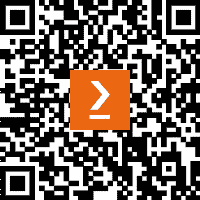

# 前言

这本书是掌握 Nuxt 3 的完整指南，Nuxt 3 是一个简化 Vue.js 开发的渐进式框架。通过一系列精心设计的章节，你将通过构建实际应用逐步探索框架的强大功能。从简单的“Hello Nuxt”应用开始，每一章都逐步介绍更复杂的概念，如路由、布局和高级 SEO 技术。到结束时，你将自信地应对现实世界的挑战，开发可扩展的应用，并利用 Nuxt 3 的力量为你的项目服务。

# 本书面向对象

如果你是一名初级或中级 Vue.js 开发者，对构建 Web 应用有基本了解，并希望扩展你在 Web 开发领域的专业知识，这本书适合你。它将指导你学习 Nuxt，解决实际问题，并实施最佳实践。希望刷新知识或探索 Nuxt 的高级开发者也可以从这本书中受益。

# 本书涵盖内容

*第一章*, *为基本的“Hello Nuxt”应用设置 Nuxt 3 环境*，展示了如何设置 Nuxt 3 环境并创建一个基本的“Hello Nuxt”应用以验证设置成功，为更复杂的项目奠定基础。

*第二章*, *使用 TailwindCSS 构建简单组合并深入了解 Nuxt 3 的项目结构*，探讨了如何构建一个简单的组合，利用 TailwindCSS 进行样式设计，并发现 Nuxt 3 项目结构的复杂性。

*第三章*, *构建房地产列表项目以掌握路由、视图、布局和插件*，深入探讨了如何开发房地产列表项目以理解 Nuxt 3 的动态和嵌套路由、页面布局和插件架构。

*第四章*, *构建天气仪表板以学习数据获取和状态管理*，指导你创建天气仪表板，重点关注 Nuxt UI 组件，掌握数据获取，并使用 Pinia 进行状态管理。

*第五章*, *构建个人发布空间并实现身份验证*，探讨了如何使用 Nuxt 3 和 Supabase 创建一个带有用户身份验证的个人发布平台，涵盖用户注册、登录和安全的帖子管理。

*第六章*, *在优化 SEO 的同时增强食谱分享网站使用 Nuxt 3*，介绍了如何通过高级 Nuxt 3 技术增强食谱分享网站的 SEO，以提升搜索引擎可见性和有机流量。

*第七章*, *构建一个测验游戏应用以学习测试*，考察了如何构建和测试一个测验游戏应用，重点关注单元测试和端到端测试（E2E）以确保功能性和可靠性。

*第八章*，*在 Nuxt 3 单仓库中创建自定义翻译模块*，深入探讨了在单仓库设置中使用 Nuxt 3 构建自定义翻译模块，并探讨了模块化系统架构对大型应用的益处。

# 为了充分利用本书

您应该具备 JavaScript 和 Vue.js 的基本理解，因为 Nuxt 3 是基于这些技术构建的。熟悉 ES6 语法、Vue 组合 API 以及异步编程等概念将特别有用。建议您在计算机上安装 Node.js 和 pnpm，因为本书中的示例和项目设置依赖于这些工具。

| **必需工具** | **版本详情** |
| --- | --- |
| Node.js | >=18.0.0 |
| Pnpm | >= 7 |
| Visual Studio Code (推荐) 或任何其他 IDE |  |

**如果您使用的是本书的数字版，我们建议您亲自输入代码或从** **本书的 GitHub 仓库（下一节中提供链接）** **获取代码。这样做将帮助您避免与代码复制和粘贴相关的任何潜在错误。**

# 下载示例代码文件

您可以从 GitHub 下载本书的示例代码文件[`github.com/PacktPublishing/Nuxt-3-Projects`](https://github.com/PacktPublishing/Nuxt-3-Projects)。如果代码有更新，它将在 GitHub 仓库中更新。

我们还提供了来自我们丰富的图书和视频目录的其他代码包，可在[`github.com/PacktPublishing/`](https://github.com/PacktPublishing/)找到。查看它们吧！

# 代码实战

本书的相关*代码实战*视频可在[`packt.link/hN2JZ`](https://packt.link/hN2JZ)查看。

# 使用的约定

本书使用了多种文本约定。

`文本中的代码`：表示文本中的代码词、数据库表名、文件夹名、文件名、文件扩展名、路径名、虚拟 URL、用户输入和 Twitter 昵称。以下是一个示例：“首先，将新创建的模块目录从`my-module`重命名为`translation`，以更好地反映其目的。”

代码块应如下设置：

```js
// packages/translation/src/module.ts
export default defineNuxtModule<ModuleOptions>({  meta: {
    name: 'translation',
    configKey: 'translation'
  }
  // … rest of code
})
```

任何命令行输入或输出都应如下编写：

```js
$ pnpm --filter demo-website add --workspace translation
```

**粗体**：表示新术语、重要单词或屏幕上看到的单词。例如，菜单或对话框中的单词以**粗体**显示。以下是一个示例：“对于**关于我**部分，我们采用了类似的方法。”

小贴士或重要提示

看起来是这样的。

# 联系我们

欢迎读者反馈。

**总体反馈**：如果您对本书的任何方面有任何疑问，请通过电子邮件发送至 customercare@packtpub.com，并在邮件主题中提及书名。

**勘误**: 尽管我们已经尽一切努力确保内容的准确性，但错误仍然可能发生。如果您在这本书中发现了错误，如果您能向我们报告，我们将不胜感激。请访问[www.packtpub.com/support/errata](http://www.packtpub.com/support/errata)并填写表格。

**盗版**: 如果您在互联网上以任何形式发现了我们作品的非法副本，如果您能提供位置地址或网站名称，我们将不胜感激。请通过 copyright@packt.com 与我们联系，并提供材料的链接。

**如果您有兴趣成为作者**：如果您在某个领域有专业知识，并且您有兴趣撰写或为书籍做出贡献，请访问[authors.packtpub.com](http://authors.packtpub.com)。

# 分享您的想法

一旦您阅读了*Nuxt 3 Projects*，我们很乐意听听您的想法！[请点击此处直接进入此书的亚马逊评论页面并分享您的反馈](https://packt.link/r/1837632545)。

您的评论对我们和科技社区非常重要，并将帮助我们确保我们提供高质量的内容。

# 下载此书的免费 PDF 副本

感谢您购买此书！

您喜欢在旅途中阅读，但无法携带您的印刷书籍到任何地方吗？

您购买的电书是否与您选择的设备不兼容？

别担心，现在，每购买一本 Packt 书籍，您都可以免费获得该书的 DRM 免费 PDF 版本。

在任何地方、任何设备上阅读。直接从您最喜欢的技术书籍中搜索、复制和粘贴代码到您的应用程序中。

优惠不会就此停止，您还可以获得独家折扣、时事通讯和每日免费内容的每日电子邮件。

按照以下简单步骤获取福利：

1.  扫描二维码或访问以下链接



[`packt.link/free-ebook/9781837632541`](https://packt.link/free-ebook/9781837632541)

1.  提交您的购买证明

1.  就这些！我们将直接将您的免费 PDF 和其他福利发送到您的电子邮件。
