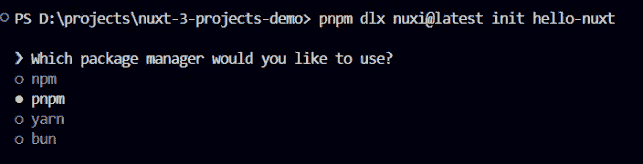
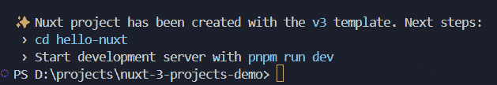
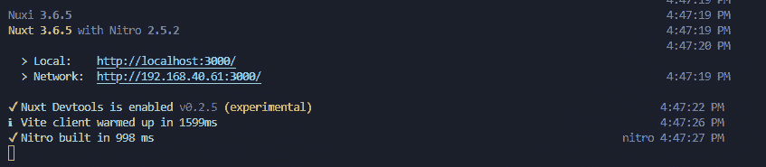
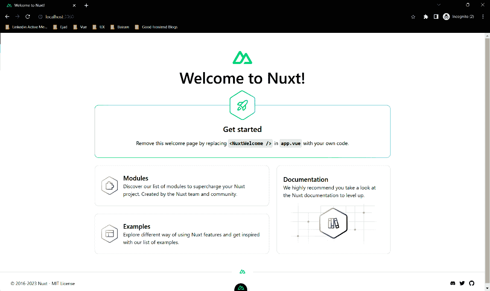
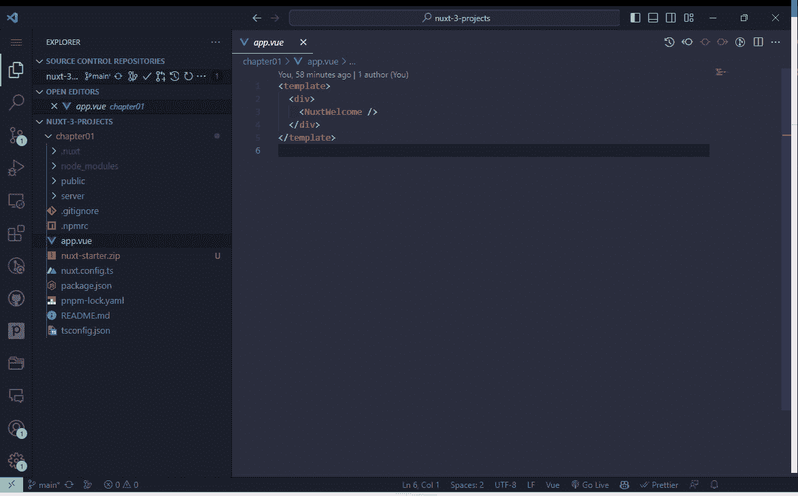
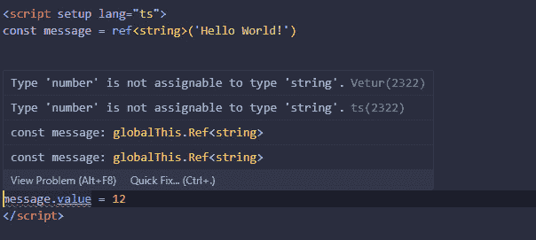
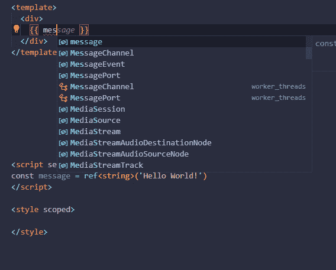
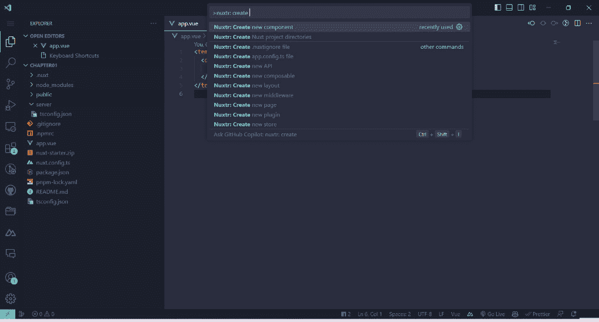
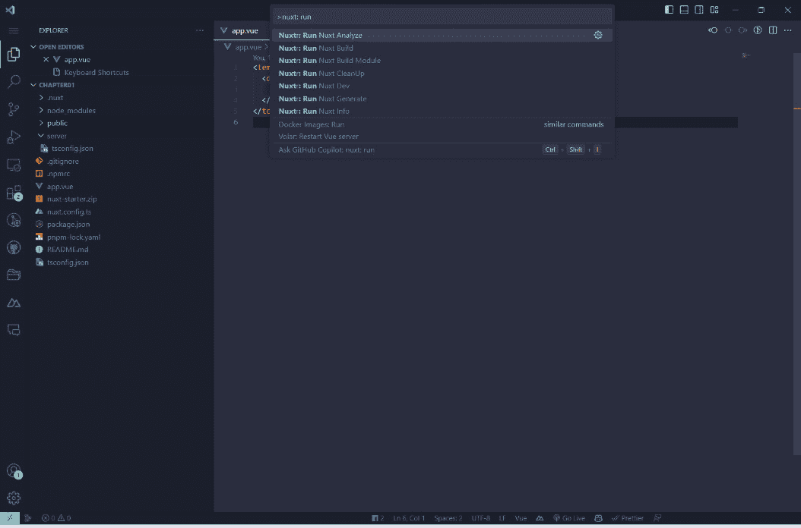
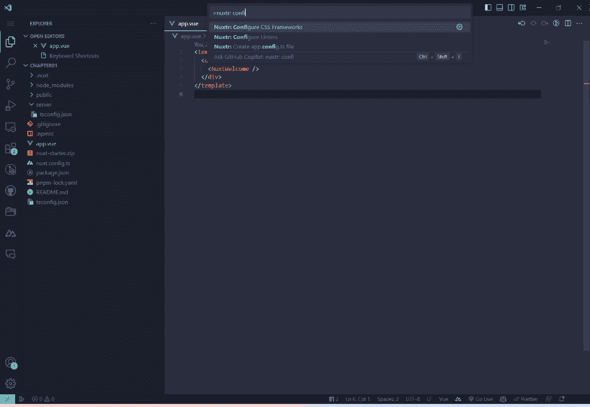

# 第一章：为基本“Hello Nuxt”应用设置您的 Nuxt 3 环境

随着时间的推移，Web 开发经历了变革性的旅程，从静态网页发展到提供无缝用户体验的动态应用。随着对更互动和性能更优的 Web 应用的需求增长，需要能够简化并简化开发过程的框架的需求变得明显。这就是 Nuxt 诞生的背景——一个旨在以尽可能直观的方式构建 Vue.js 应用的框架。

Nuxt 3，框架的最新版本，在 Web 开发方面迈出了重要一步。对于那些多年来一直从事前端开发的人来说，很明显 Nuxt 3 带来了很多好处。除了基本功能，如自动路由和服务器端渲染之外，Nuxt 3 还集成了 TypeScript，提供更好的、无错误的编码。新的 Nitro 引擎提升了性能，使应用程序运行更快、更流畅。借助 Vue 3 的 Composition API，构建组件变得更加直观。此外，改进的模块和新的 DevTools 使开发更加高效。简而言之，Nuxt 3 提供了一套强大的工具，使 Web 开发更快、更简单、更稳健。

在本章中，您将进入 Nuxt 3 的世界，深入了解其起源，探索其背后的思想和核心使命。您将清楚地了解是什么使 Nuxt 独特，以及为什么它成为全球许多开发者的首选。随着您的进步，您还将采取实际步骤设置您第一个 Nuxt 应用程序。到本章结束时，您不仅对 Nuxt 3 的基础及其潜在原则有了更清晰的认识，而且还有一个正在运行的 Nuxt 应用程序，为后续章节的深入探讨奠定了基础。

在本章中，我们将涵盖以下主要主题：

+   理解本书中的代码内容

+   Nuxt 3 简介

+   Nuxt 的架构和功能

+   安装和设置 Nuxt 3 环境

+   创建您的第一个“Hello Nuxt”应用

+   推荐扩展

# 技术要求

为了确保我们在设置和探索 Nuxt 3 的过程中获得无缝体验，必须满足某些先决条件。以下技术和安装是必需的：

+   **Node.js**：v18.10.0 或更高版本。

+   **包管理器**：虽然安装 Node.js 默认提供 npm，但我更喜欢 pnpm，因为它通过在项目间共享包来提高磁盘空间使用效率，并确保依赖项永远不会提升，从而实现更可预测的构建。

+   **文本编辑器**：我推荐使用带有 Vue – Official Extension 的 **Visual Studio Code** (VS Code)，但 https://www.jetbrains.com/webstorm/ 或任何其他编辑器都可以很好地工作

+   **终端**：您需要一个终端来运行 Nuxt 命令。

本章的代码文件可以在[`github.com/PacktPublishing/Nuxt-3-Projects/tree/main/chapter01`](https://github.com/PacktPublishing/Nuxt-3-Projects/tree/main/chapter01)找到。

本章的 CiA 视频可以在[`packt.link/UhVbH`](https://packt.link/UhVbH)找到

# Nuxt 3 简介

在网络开发领域待了一段时间后，你会了解到进化的重要性。这就像观察一个城市的发展。最初只是一些建筑（或者在我们的例子中，是静态网页），现在已经变成了一个繁华的大都市，有摩天大楼、相互连接的交通系统和充满活力的活动中心。同样，我们的网络开发工具也随着时代的发展而发生了变化。Nuxt 在这个工具城市中屹立不倒，尤其是对于那些使用 Vue.js 进行创作的我们。本节将作为 Nuxt 3 的导游，带您穿越其历史街道，繁华的商业区，以及那些让像我们这样的开发者点头称赞的建筑奇迹。

## 网络开发的演变

在网络发展的早期，网站很简单。把它们想象成手绘地图的数字等价物。它们会告诉你方向，但旅程基本上取决于你自己。随着时间的推移，随着网络的不断发展，需求变得更加复杂。网站变成了网络应用，这些应用需要是动态的、响应式的和交互式的。不再仅仅是展示信息；它关乎参与，关乎创造体验。在这个动态的景观中，Vue.js 作为一个灯塔出现，简化了复杂性，让开发者的生活变得稍微容易一些。但正如任何经验丰富的开发者都会告诉你的，总有改进和进化的空间。

## Nuxt 的诞生

这里有一个许多人都能够感同身受的场景：你正深入一个 Vue.js 项目，欣赏其优雅之处，但有时你会想，“这能更加精简吗？一些重复的任务能自动化吗？”这种对效率的追求正是 Nuxt 进入故事的地方。由有远见的 Chopin 兄弟构想，Nuxt 是带有翅膀的 Vue.js。它不仅仅是为了添加功能；它关于智能集成，关于使整个开发过程更加流畅。想象一下，你不需要为每个页面手动设置路由，或者有现成的解决方案来解决 SEO 挑战。Nuxt 就是那种新颖的视角，那种对挑战的创新方法，我们将之视为“只是过程的一部分”。

## 为什么选择 Nuxt？

简而言之，如果你正在使用 Vue.js，Nuxt 就是你的下一步逻辑选择。它带来了一系列增强功能。Nuxt 内置了诸如自动化路由、中间件支持、通用（SSR 和 SPA）渲染以及灵活布局等工具。这意味着更少的样板代码和更高的生产力。Nuxt 无缝扩展了 Vue 的能力，为构建稳固的 Web 应用提供了一个集成、高效的解决方案。

既然我们已经探索了 Nuxt 在 Vue.js 生态系统中的独特优势，我们的下一步是深入研究 Nuxt 3 的架构元素和基础概念。

# Nuxt 的架构和原则

在不断发展的网络开发领域，了解一个工具的内部工作原理可能是掌握它的关键。Nuxt 3，以其复杂的设计和强大的功能，也不例外。对于我们这些经验丰富的人来说，解开这样的复杂性不仅是一种必要性，也是一种热情。让我们开始深入探索 Nuxt 3，剥去层层面纱，揭示其背后的原则和架构。

## 基于 Vue 构建

在其核心，Nuxt 3 是建立在 Vue.js 之上的。虽然反应性和基于组件的架构已经进入了许多现代框架，但 Vue.js 区别于其他框架的是其易用性。它被设计成新手和经验丰富的开发者都能轻松掌握其概念。但除了框架本身之外，Vue 的充满活力和支持性的社区发挥着重要作用。这种积极的社区反馈为 Nuxt 3 创造了完美的基础，使其能够提供丰富的开发体验。

## 通用渲染和静态站点生成

记得那些我们进入一个网站，然后会有一个短暂的空白时刻，内容神奇地出现的日子吗？那就是客户端渲染在起作用。虽然它有其优点，但这种方法有时感觉像是走进一个昏暗的房间，等待灯光慢慢亮起。通用渲染通过合并服务器端和客户端渲染的最好之处，改变了游戏规则。采用这种方法，内容在服务器上预先渲染，进入网站时即可立即访问。一旦页面加载完成，客户端脚本“水合”页面，实现动态交互并提升用户体验。这些好处？

+   更快的初始页面加载

+   改进的 SEO

+   更好的整体用户体验

谈及流畅的网页体验，你是否注意到一些网站运行得很快，似乎没有任何故障？其中许多是静态网站。它们就像一打开就能立即使用的网页，无需额外的加载时间。但现代静态网站不仅仅是提供固定内容；它们可以像任何其他网站一样动态和交互。Nuxt 的**静态站点生成**（**SSG**）功能意味着开发者可以享受到静态网站（速度和安全）和网页应用的动态性。使用 Nuxt，构建静态网站就像构建任何其他应用程序一样直观，但增加了性能和安全的额外优势。

## 性能优化

在网络开发的世界里，速度不仅仅是一种奢侈，更是一种必需品。用户期望网页快速加载，搜索引擎也会奖励快速加载的网站以更好的排名。认识到这一点，Nuxt 3 已经被设计为以性能为核心。但这意味着对开发者和用户来说意味着什么呢？让我们分析一下 Nuxt 3 使用的几个关键性能优化技术，以增强开发者和用户体验：

+   **代码拆分（Code splitting）**：Nuxt 3 利用 Vite 和 Rollup 智能地拆分代码，而不是发送一个大的 JavaScript 包。这意味着用户只需下载当前页面所需的代码，从而减少加载时间。

+   **摇树干（Tree shaking）**：不必要的代码会使应用程序膨胀。摇树干确保只包含最终包中使用的代码。这就像修剪树木的枝条以保持其健康和活力。

+   **链接预取（Link prefetching）**：当用户浏览页面时，Nuxt 3 已经在努力预取链接页面的资源。这种主动方法意味着后续页面几乎可以立即加载。

Nuxt 在底层使用 Vite。Vite 是一个改变我们思考网络开发方式的工具。它几乎可以立即启动，这意味着不再需要等待开始工作。当你更改代码时，Vite 会立即更新它，这样你就可以立即看到你的更改。它有一个直接的构建系统，这意味着花更少的时间去弄清楚事情，有更多的时间进行编码。此外，它被设计成在各个方面都很快，使整个开发过程更加顺畅。

在本节中，我们介绍了 Nuxt 3 的架构、其在渲染方面的优势以及其对性能的关注。随着我们继续前进，我们将从理论转向实践操作，指导你设置你的第一个 Nuxt 3 环境。

# 安装和设置 Nuxt 3 环境

在深入研究 Nuxt 3 之前，设置一个有利的环境是至关重要的。把它想象成在种植树木之前准备土壤。准备得越好，树木在成长过程中就会越健康。在本节中，我们将带你了解前置条件和安装步骤，确保你有一个坚实的基础开始你的 Nuxt 3 之旅。

## 前置条件

要使用 Nuxt 3，你需要安装和设置一些东西。根据 Nuxt 3 官方网站，以下是需要满足的前置条件：

+   **Node.js**：确保你已经安装了 Node.js，并且它的版本至少是 18.10.0。要检查 Node.js 是否已安装以及其版本，请运行以下命令：

    ```js
    $ node –v
    ```

    如果你看到一个版本号，这意味着 Node.js 已安装。如果它低于 18.10.0 或者 Node.js 没有安装，你可以从官方 Node.js 网站下载最新版本：[`nodejs.org/`](https://nodejs.org/)。

+   **包管理器**：虽然 npm 与 Node.js 一起捆绑，但在此指南中，我们将使用 pnpm。它高效且快速，并确保包在项目间共享。要安装它，请运行以下命令：

    ```js
    $ npm install -g pnpm
    ```

+   **代码编辑器**：虽然您可以使用任何代码编辑器，但我们推荐使用 VS Code。它功能丰富，支持大量扩展，并且在开发者社区中得到广泛采用。

在本节中，您设置了您的 Nuxt 3 环境。接下来，您将构建一个“Hello Nuxt”应用程序并探索基本的项目结构。

# 创建您的第一个“Hello Nuxt”应用程序

在本节中，我们将一起迈出第一步 – 那就是创建您自己的第一个 Nuxt 应用程序。到那时，您将拥有一个运行中的应用程序，并对 Nuxt 项目结构有一个基础的了解。

## 初始化 – 创建新 Nuxt 项目的步骤

这里是初始化的步骤：

1.  通过为您的项目指定一个空间来创建一个新的入门项目。打开您的终端（macOS/Linux）或命令提示符（Windows），并运行以下命令：

    ```js
    pnpm:
    ```



图 1.1：使用 pnpm 作为包管理器

1.  在安装依赖项之后，您还可能被询问是否要初始化 Git 仓库。如果您在此过程中不想设置 Git 仓库，当出现此问题时，可以选择不设置。

1.  一旦项目创建完成，您将收到类似以下的消息：



图 1.2：创建项目后

1.  接下来，我们必须前往创建项目的文件夹：

    ```js
    $ cd hello-nuxt
    $ pnpm i
    ```

    注意，您仍然可以使用 npm 或 Yarn 安装依赖项。

1.  要启动项目，我们可以运行以下命令：

    ```js
    $ pnpm dev
    ```

1.  此命令以开发模式启动您的 Nuxt 应用程序。它针对开发者体验进行了优化，这意味着以下说法是正确的：

    1.  **热模块替换**（**HMR**）已激活，因此您的文件中的更改将自动更新应用程序，而无需完全重新加载页面

    1.  错误和警告会在控制台以及通常在您的应用程序上显示的覆盖层中显示

    将启动一个本地开发服务器，通常可通过 [`localhost:3000`](http://localhost:3000) 访问。

1.  构建成功后，终端应显示以下消息：



图 1.3：构建输出

1.  点击链接，哇！您已经有了您的第一个“Hello Nuxt”应用程序！



图 1.4：浏览器上的 Nuxt 应用程序

Nuxt CLI 以一个基本的 Nuxt 应用程序作为我们项目的起点。这包括一个内置的组件，称为 NuxtWelcome。在接下来的章节中，我们将探讨如何修改和扩展这个基础，使其符合我们的特定需求。

1.  最后，让我们打开 VS code 并探索我们的新“Hello Nuxt”项目！

    ```js
    $ code .
    ```

    这将在 VS Code 中打开当前目录。您可能需要设置 VS Code，以便可以从命令行启动。有关如何设置的说明，请参阅[`code.visualstudio.com/docs/setup/mac#_launching-from-the-command-line`](https://code.visualstudio.com/docs/setup/mac#_launching-from-the-command-line)。

现在 VS Code 已打开，让我们发现初始化后创建的默认项目结构。

## 默认项目结构

在 Nuxt 的世界中，一个井然有序的结构从一开始就欢迎您。这种精心设计的设置确保了清晰和效率，引导开发者通过逻辑流程。虽然我们将深入研究启动项目中提供的目录，但重要的是要注意，随着您的项目增长和发展，其他文件夹，如页面、插件、中间件等，也将发挥作用。不要担心，这些将在后续章节中深入探讨。

但现在，让我们熟悉一下 Nuxt 3 项目的底层结构：

+   `README.md`：大多数项目的起点。此文件传统上提供简短介绍，可能包括基本设置或使用说明，使新用户更容易上手。

+   `server`：这里存放自定义服务器端逻辑，增强 Nuxt 的默认服务器功能。我们将在未来的章节中深入探讨其潜力。

+   `tsconfig.json`：为 Nuxt 定制的 TypeScript 配置。无需深入了解其细节。

+   `package.json`：在脚本中，您将找到以下内容：

    +   `dev`：启动开发环境，启用 HMR

    +   `build`：启动带有实时重新加载的本地开发环境

    +   `generate`：对于使用 SSG 的应用程序，此脚本生成应用程序的静态页面

    +   `preview`：在本地预览生成的静态站点

    +   `postinstall`：安装后准备 Nuxt 环境

+   `.npmrc`：保存 npm 的配置设置。无需深入了解其细节。

+   `Public`：静态资产的避难所，您希望 Vite 不要对其进行处理。

+   `pnpm-lock.yaml`：对于 pnpm 用户至关重要，此文件确保跨环境一致地安装包。如果您使用 npm，可能会找到 `package-lock.json`；如果您使用 Yarn，可能会找到 `yarn.lock`。

+   `nuxt.config.ts`：您 Nuxt 项目的基石。此配置文件协调应用程序的各个方面，从全局 CSS 到插件。

+   `App.vue`：您应用程序的核心和灵魂。作为根 Vue 组件，它为应用程序的其他组件设定了舞台：



图 1.5：项目结构

我们刚刚设置了我们的第一个“Hello Nuxt”应用程序，并对其结构进行了初步了解。接下来，我们将介绍一些实用的扩展，使我们的 Nuxt 之旅更加顺畅。

# 推荐扩展

VS Code 市场提供了一系列旨在提高开发体验的扩展程序。对于使用 Nuxt 的人来说，有一些特定的扩展程序脱颖而出，证明了它们在日常编码任务中的价值。在本节中，我们将探讨一些针对 Nuxt 的顶级扩展程序，突出它们如何使你的开发更加顺畅和高效：

+   Vue - 官方

+   Nuxtr

+   Vue VSCode Snippets

+   与 Vue 无关的扩展

让我们详细地了解一下。

## Vue - 官方

Vue - 官方是 VS Code 的扩展程序，它为 Vue 3 项目提供了增强支持。作为 Vue 开发者的综合工具集，Vue - 官方提供了以下功能：

+   在你的 Vue 组件中定义的 `ref` 值为 `name: String`。如果你错误地将数字分配给它，扩展程序将突出显示这种差异，指示类型不匹配：



图 1.6：Vue – 官方：TypeScript 支持

+   在你的 Vue 组件中，当你开始在模板中输入 `{{ me... }}` 时，扩展程序会建议自动完成为 `{{` `message}}`:



图 1.7：Vue – 官方：模板插值

+   `.vue` 文件中，`<script>` 部分可能突出显示为一种颜色方案，而 `<template>` 和 `<style>` 部分将具有不同的调色板，这使得它们之间的区分更加容易。

+   将 `firstName` 重命名为 `givenName`，Vue 官方扩展可以帮助你在组件中跨名称重命名，确保一致性。

+   `<script>` 部分没有适当的缩进或间距，使用 Vue 官方扩展与 Prettier 的集成可以自动格式化代码，使其遵循最佳实践和一致的样式。

## Nuxtr

Nuxtr 是 Nuxt.js 项目的友好编码伴侣。它包含了许多实用工具和命令，使你的编码会话更加顺畅。以下是其核心提供的功能概述：

+   `nuxtr: create`。你将看到可以创建的 Nuxt 文件和文件夹列表，此时你可以选择所需的文件：



图 1.8：Nuxtr – 创建项目文件和文件夹

+   **运行 Nuxt 命令**：只需在命令面板中输入命令的名称：



图 1.9：Nuxtr – 运行 Nuxt 命令

+   **通过你的状态栏激活 Nuxt DevTools**：Nuxt DevTools 是任何 Nuxt 开发者的救命稻草。它为你提供了对应用程序组件的清晰视图，让你能够实时查看状态变化，提供性能指标，甚至跟踪事件。扩展程序与 Nuxt > 3.4.0 兼容。你可以轻松地从状态栏激活它。扩展程序识别你的 Nuxt.js 版本，并在需要时建议更新。

+   **设置 CSS 框架和代码检查器**：你可以集成各种 CSS 框架（Tailwind CSS、UnoCSS 和 Vueitfy），以及代码检查器（Stylelint 和 Eslint）：



图 1.10：设置 CSS 框架和代码检查器

正如我们所见，这些扩展不仅仅是附加组件；它们是能够显著简化你的 Nuxt 开发流程的必要工具。

# 摘要

在本章中，我们深入探讨了 Nuxt 3 的变革性世界及其在现代网络开发中的作用。我们首先讨论了其架构和内置的性能优化，包括代码拆分、摇树优化和链接预取。我们还提到了其服务器端渲染和静态生成页面（SSG）的能力。然后，我们逐步介绍了设置 Nuxt 3 环境的步骤，包括创建“Hello Nuxt”应用的前置条件和初始化步骤。我们还体验了 Nuxt 项目的结构，并讨论了一些推荐的 VS Code 扩展来增强开发体验。

在下一章中，我们将使用 Nuxt 3 和 Tailwind CSS 构建一个简单的个人作品集网站，进一步丰富我们对框架的实践经验。

# 实践问题

设置 Nuxt 3 环境需要哪些先决条件？

+   初始化新的 Nuxt 3 项目时使用哪些命令？

+   解释 Nuxt 3 中服务器端渲染的优点。

+   `nuxt.config.ts` 文件在 Nuxt 项目中扮演什么角色？

+   描述 Nuxt 3 应用的默认项目结构。

+   你如何使用终端在 VS Code 中打开你的 Nuxt 项目？

+   在使用 Nuxt 处理 VS Code 时，有哪些推荐的扩展？

+   Nuxt 3 是如何从建立在 Vue.js 之上获益的？

+   解释 Nuxt 3 如何处理静态生成页面（SSG）。

# 进一步阅读

+   Nuxt 官方文档：[`nuxt.com/docs/getting-started/introduction`](https://nuxt.com/docs/getting-started/introduction)

+   渲染模式：[`nuxt.com/docs/guide/concepts/rendering`](https://nuxt.com/docs/guide/concepts/rendering)

+   Nuxt 的工作原理：[`nuxt.com/docs/guide/going-further/internals`](https://nuxt.com/docs/guide/going-further/internals)

+   TypeScript 与 Nuxt：[`nuxt.com/docs/guide/concepts/typescript`](https://nuxt.com/docs/guide/concepts/typescript)

+   Nuxt 的 VS Code 扩展：[`masteringnuxt.com/blog/the-best-vscode-extensions-for-nuxt-developers`](https://masteringnuxt.com/blog/the-best-vscode-extensions-for-nuxt-developers)
