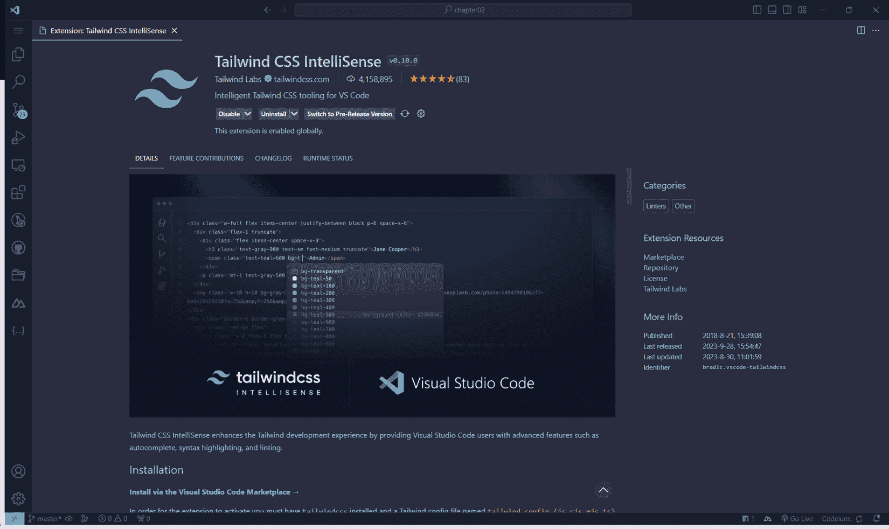
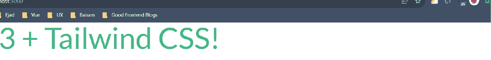
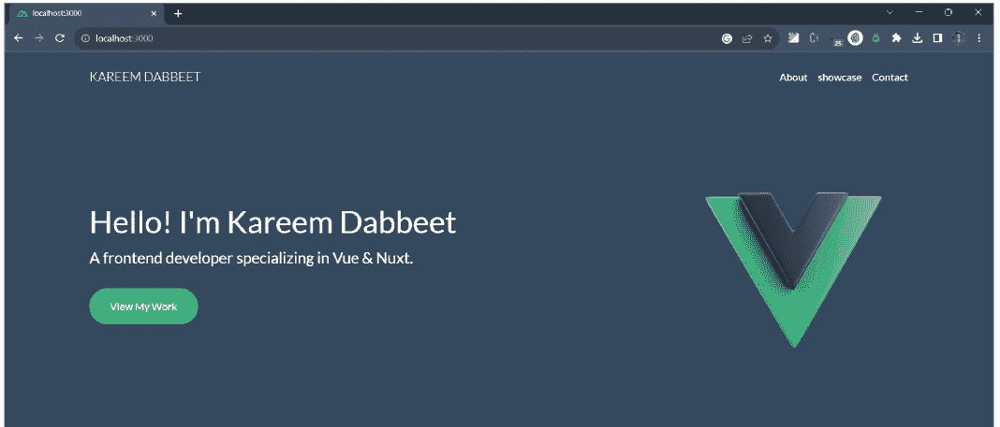
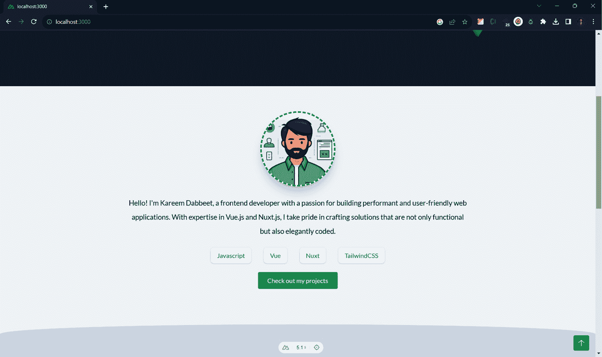
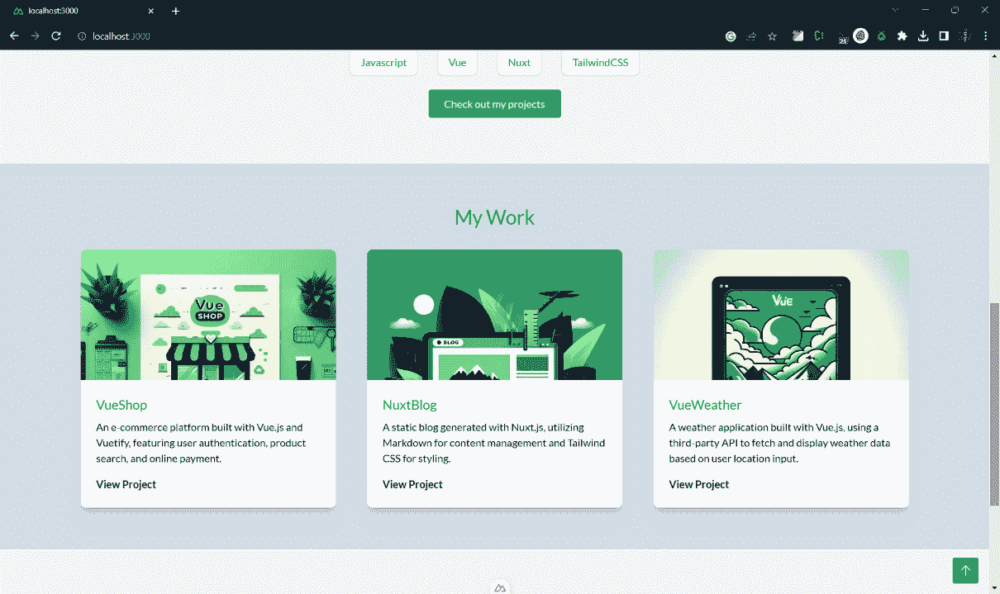
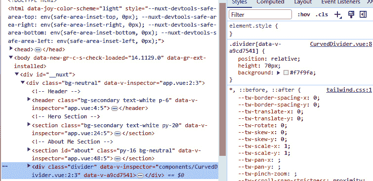
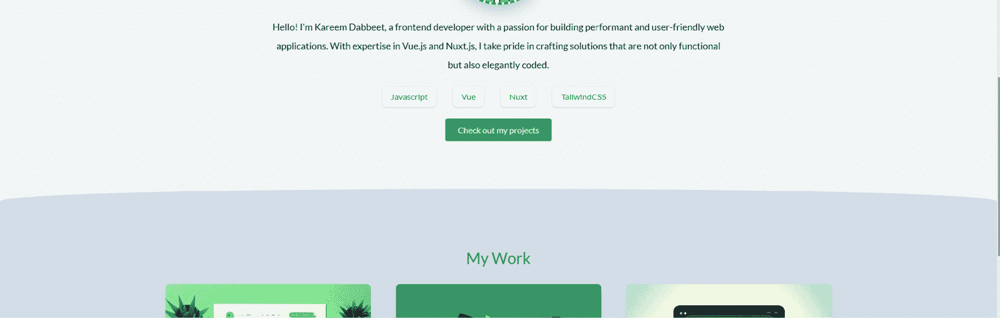
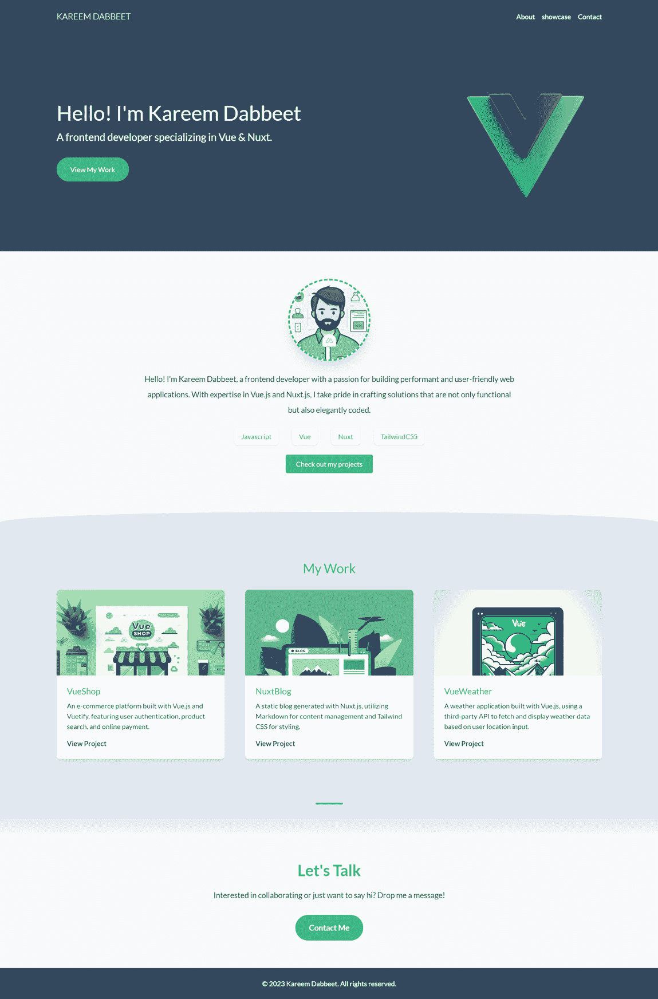

# 第二章：使用 Tailwind CSS 和 Nuxt 3 项目结构深入探究构建简单投资组合

在本章中，我们将结合 Nuxt 3 的强大功能和 Tailwind CSS 的风格效率，构建一个优雅展示您的项目和技能的投資組合。Tailwind CSS 以其以实用工具为主的理念而闻名，使我们能够用最少的自定义 CSS 创建复杂的设计，从而简化开发过程。当与以开发者友好的抽象和强大的 Vue.js 功能著称的 Nuxt 3 结合使用时，我们装备了一个强大的工具集，以构建不仅功能卓越而且视觉上吸引人的投资组合。

在本章中，我们将精心创建一个投资组合，确保每个组件和样式都是精心制作且具有目的性的。我们的目标是确保您的项目不仅得到展示，而且以一种与每位访客产生共鸣的方式讲述，为他们提供不仅仅是视觉体验，而且是一次通过您的技术努力和成就的旅程。

在本章中，我们将涵盖以下主要主题：

+   设置和集成 **TailwindCSS 3**

+   创建网站布局并自定义字体

+   管理位于 `assets` 文件夹中的图片

+   创建 `ProjectShowcase` 和 `SkillChip` 组件

+   在组件的作用域内直接进行样式化

+   创建一个 `useScrollTo` 可组合组件

# 技术要求

本章的代码文件可以在 [`github.com/PacktPublishing/Nuxt-3-Projects/tree/main/chapter02`](https://github.com/PacktPublishing/Nuxt-3-Projects/tree/main/chapter02) 找到。

本章的 CiA 视频可以在 [`packt.link/kCqMV`](https://packt.link/kCqMV) 找到

# 必要的背景知识 - 什么是 Tailwind CSS？

在我们开始编码之旅之前，让我们装备一些关于 Tailwind CSS 的关键知识，Tailwind CSS 是一个以实用工具为主的 CSS 框架，它提供了低级别的实用类，可以直接在您的标记中构建设计。与其他提供预定义组件的 CSS 框架不同，Tailwind 允许在您的设计实现中拥有更多的灵活性和定制性。

想要更深入地了解 Tailwind CSS 及其功能，您可以访问 Tailwind CSS 的官方网站：[`tailwindcss.com/`](https://tailwindcss.com/).

接下来，让我们了解如何设置和集成 Tailwind CSS 到您的项目中。

# 设置和集成 Tailwind CSS

我们将通过从头开始创建一个新的 Nuxt 3 项目来开始我们的投资组合之旅。

## 创建一个新项目

如我们在上一章所学，让我们创建一个名为 `my-portfolio` 的新 Nuxt 3 项目，并在 VS Code 中打开它以继续操作。

在我们进一步导航之前，确保我们的设置成功是明智的。让我们启动我们的开发服务器，并查看我们项目的初始状态：

```js
$ pnpm dev
```

执行 `pnpm dev` 将启动开发服务器，当你使用网络浏览器访问 [`localhost:3000`](http://localhost:3000) 时，你应该会看到默认的 `NuxtWelcome` 组件。这个组件实际上标志着我们的项目已成功设置，我们准备在下一步中整合 Tailwind CSS。

## 安装 Tailwind CSS

在我们开始之前，让我们为我们的开发环境配备一个将增强我们的编码体验的工具——**Tailwind CSS IntelliSense**。如果你使用 **Visual Studio Code**（**VS Code**）作为代码编辑器，请考虑安装 Tailwind CSS IntelliSense 扩展。此扩展通过提供 Tailwind CSS 类的自动补全、语法高亮等功能，提高了你的开发效率，使你更容易应用样式，无需记住或频繁查阅文档。

要安装，只需点击窗口左侧活动栏中的扩展图标，导航到扩展视图，搜索 `Tailwind CSS IntelliSense`，然后点击 **安装**。



图 2.1：Tailwind VS Code 扩展

现在，你的 VS Code 已经通过 Tailwind CSS 功能得到了增强，智能代码补全和错误检查将简化你的开发过程。让我们继续前进，确保我们的编码之旅尽可能顺利！

首先，我们将 Tailwind CSS 集成到我们的项目中。执行以下命令以安装 Nuxt 3 的 Tailwind CSS 模块：

```js
$ pnpm i -D @nuxtjs/tailwindcss
```

安装后，我们将 Nuxt 3 项目指向使用 Tailwind CSS。这需要对 `nuxt.config.ts` 文件进行轻微修改。导航到模块数组，并按以下方式引入 Tailwind CSS 包：

```js
export default defineNuxtConfig({
  devtools: { enabled: true },
  modules: ['@nuxtjs/tailwindcss'],
})
```

将 `'@nuxtjs/tailwindcss'` 添加到模块数组中确保 Tailwind CSS 被我们的 Nuxt 3 项目识别并使用，使我们能够在组件中使用其实用类。

为了使 Tailwind CSS 符合我们项目的美学和功能需求，我们将创建一个名为 `tailwind.config.js` 的配置文件。此文件将作为我们调整或自定义 Tailwind CSS 默认设置的指挥中心。

让我们在项目的根目录下生成 `tailwind.config.js`：

```js
// tailwind.config.js
export default  {
  // Your Tailwind CSS custom configuration goes here
}
```

你也可以运行以下命令来生成相同的文件：

```js
$ pnpm dlx tailwindcss init
```

`tailwind.config.js` 文件将作为我们自定义样式、组件定义和主题调整的载体，确保我们的实用类优化，并在整个项目中保持一致的设计语言。

从我们的通用设置到更具体的设置，以下是我首选的 Tailwind CSS 启动配置：

```js
export default {
  content: [],
  theme: {
    extend: {
      colors: {
        primary: '#42B883',
        secondary: '#35495E',
        neutral: '#F7F9FA'
      },
      container: {
        center: true,
        padding: {
          DEFAULT: '1.5rem',
          lg: '4rem',
          xl: '4rem',
          '2xl': '4rem'
        },
        screens: {
          sm: '576px',
          md: '768px',
          lg: '992px',
          xl: '1200px',
          '2xl': '1400px'
        }
      }
    }
  },
  plugins: []
}
```

深入探讨，让我们看看我选择的配置的每个部分是如何确保我们的项目在视觉和功能上保持平滑、一致和 Vue 主题风格的。

### 颜色自定义

Tailwind CSS 允许我们自定义其默认颜色，为我们提供了在项目中注入自己的品牌或主题颜色的灵活性。通过在配置中指定我们的颜色，例如与 Vue.js 颜色方案相呼应的绿色阴影，我们确保我们的设计既美观又巧妙地向观众传达我们的技术焦点。

### 容器自定义

容器部分确保我们的内容整齐居中，并为内容提供水平填充，以防止内容紧贴视口边缘。默认情况下，我们有 `1.5rem` 的水平填充，对于更大的 `(lg, xl 和 2xl)` 屏幕，填充扩展到 `4rem`，确保我们的内容在所有屏幕尺寸上都是可读的和美观的。

### 屏幕断点

在 Tailwind CSS 配置中的屏幕部分，通过定义断点来利用其响应式设计。断点是视口宽度，页面布局将在这些宽度处发生变化，旨在为各种屏幕尺寸提供最佳的用户体验。

在我们的自定义配置中，我们选择了这些特定的断点，以便与广泛使用的 Bootstrap 框架的断点更紧密地对齐。

在完成配置设置后，让我们通过制作一个简单的布局来测试我们的调整。创建一个 `div` 元素，并应用我们的自定义主色调，以确保我们的颜色配置已正确应用。导航到你的 `app.vue` 文件，清除现有的模板内容。现在，让我们在欢迎标题中注入我们的自定义主色调：

```js
<template>
  <div class="text-7xl text-primary">Nuxt 3 + Tailwind
  CSS!</div>
</template>
```

这个简单的测试使我们能够直观地验证我们的 Tailwind CSS 自定义是否已成功集成到 Nuxt 3 项目中。在实施之后，你应该会看到一个类似于以下描述的屏幕：



图 2.2：配置好的 Tailwind CSS

注意

有时，Tailwind CSS 配置中的更改可能不会立即反映在你的开发环境中。如果颜色没有按预期应用，请停止你的开发服务器并重新启动它，以确保所有配置都已正确加载。

在我们的初始旅程中，我们已经成功设置并集成了 Tailwind CSS 到我们的 Nuxt 3 项目中。我们通过在我们的应用中应用自定义主色调到标题来测试水，确保我们的基础设置稳固且为下一步做好准备。

当我们过渡到下一个部分时，我们将开始创建我们投资组合的布局，确保我们的自定义样式能够无缝地渗透到每个组件和视图中。

# 创建网站布局和自定义字体

进入我们开发传奇的下一部分，我们的重点转向建立我们作品集的视觉基础。在这个关键阶段，从布局结构到字体选择，每一个设计决策都汇聚在一起，通过无缝的用户旅程讲述我们的专业故事。让我们深入探讨如何打造这个视觉之旅，从基本元素——字体开始。

## 嵌入 Lato 字体（或任何 Google 字体）

在我们布局的结构发展中，字体选择起着至关重要的作用，它不仅服务于美观，还增强了我们作品集的可读性和用户体验。我们选择的字体 Lato 以其干净的无衬线字符而闻名，为我们的作品集文本内容提供了专业而亲切的感觉。

要将 Lato 集成到我们的 Nuxt 项目中，我们有几种可行的选择。让我们来分析一下这两种。

### 选项 1 – 手动将字体添加到 nuxt.config.ts

第一种方法涉及从 Google Fonts 获取并使用直接链接。当你在 `<head>` 部分选择 Lato 时。

在 Nuxt 3 中，要在 HTML 的 `<head>` 中插入链接、元标签、脚本或其他元素，我们必须在 `nuxt.config.ts` 文件中的 app 对象内进行配置。下面的配置说明了如何集成外部链接：

```js
export default defineNuxtConfig({
  modules: ['@nuxtjs/tailwindcss'],
  app: {
    head: {
      link: [
        { rel: 'preconnect', href:
          'https://fonts.googleapis.com' },
        { rel: 'preconnect', href:
          'https://fonts.gstatic.com' },
        { rel: 'stylesheet', href:
          'https://fonts.googleapis.com/css2?family=
           Lato:wght@100;300;400;700;900&display=swap' }
      ]
    }
  }
})
```

下面是对前面代码的分解：

+   `preconnect`：此指令建立了到域的早期连接，优化了资源获取，从而提高了加载性能

+   `stylesheet` 链接是我们指定 Lato 字体及其权重（100、300、400、700 和 900），这是我们打算在整个项目中使用的。

### 选项 2 – 使用 `@nuxtjs/google-fonts` 包

将 Google 字体无缝引入我们的 Nuxt 3 项目的另一种替代方法是利用 `@nuxtjs/google-fonts` 模块。此模块可以轻松地将 Google 字体嵌入到我们的网站上。

让我们一步步走过集成过程，然后深入配置 Lato 以适应我们的作品集。

首先安装 `@nuxtjs/google-fonts` 依赖项：

```js
$ pnpm i -D @nuxtjs/google-fonts
```

接下来，我们将在 `nuxt.config.ts` 文件中注册此模块：

```js
export default defineNuxtConfig({
  modules: ['@nuxtjs/tailwindcss', '@nuxtjs/google-fonts'],
})
```

要指定 Google 字体及其相应的权重，请使用 `nuxt.config.ts` 中的 `googleFonts` 属性：

```js
googleFonts: {
  families: {
    Lato: [100, 300, 400, 700, 900]
  }
}
```

这里是一个分解：

+   `families`：此属性是一个对象，您在其中指定要包含在项目中的 Google 字体家族（或家族）。每个字体家族都是一个对象键。

+   `key` 反映了谷歌字体的名称，而 `value` 决定了要加载的字体权重。在我们的上下文中，`Lato: [100, 300, 400, 700, 900]` 意味着我们指示该模块为我们的项目加载具有指定字重（100、300、400、700 和 900）的 Lato 字体家族。

现在你有两个可行的选项可供选择——直接将字体链接嵌入到你的 `nuxt.config.ts` 中，或者使用 `@nuxtjs/google-fonts` 模块——你可以选择最适合你项目需求的方法。配置好我们选择的字体后，让我们转向定制我们的 `tailwind.config.js`，以便在整个设计中识别和使用 Lato。

为了使 Lato 通过 Tailwind CSS 的实用类在整个项目中易于访问，我们修改 `tailwind.config.js`，使其识别 Lato 作为默认的无衬线字体：

```js
theme: {
  extend: {
    fontFamily: {
      sans: ['Lato', 'sans-serif']
    }
  }
}
```

这个调整确保了每次我们应用 Tailwind CSS 的 `font-sans` 实用类（默认应用）时，都会使用 Lato，从而在我们的投资组合中实现一致的排版。

现在我们已经整理好了字体选项，让我们继续下一步，为我们的网站布局基础。

## 创建布局

首先，我们在 `app.vue` 文件中布局主要的 `<div>`，设置一个背景颜色，为我们的投资组合设定整体基调：

```js
<!-- app.vue -->
<div class="bg-neutral">
  <!-- content here -->
</div>
```

在这里，`bg-neutral` 是一个 Tailwind CSS 类，它应用了我们之前在 `tailwind.config.js` 中定义的中性颜色。这作为我们整个投资组合的背景。

接下来，让我们构建标题。这是我们将如何做到的：

```js
<header class="bg-secondary text-white p-6">
  <div class="container mx-auto flex justify-between
  items-center">
    <div class="text-xl font-light uppercase">
      Kareem Dabbeet</div>
    <nav class="hidden md:block">
      <ul class="flex gap-x-4">
        <li>
          <a href="#about"
            class="transition hover:text-primary"> About
          </a>
        </li>
        <!-- more links here -->
      </ul>
    </nav>
  </div>
</header>
```

注意，`hidden md:block` Tailwind CSS 类默认隐藏 `<nav>`，并在中等 (`md:`) 屏幕及更高版本上显示为块状，以适应响应式设计。

但关于标题导航链接呢？我们是否要手动添加并重复每个链接？但如果我们将来想要添加更多的标题链接怎么办？

没有必要每次都手动更新模板。相反，让我们利用 Vue 的动态渲染能力。在你的脚本中，定义一个名为 `headerLinks` 的数组，如下所示：

```js
<script setup lang="ts">
const headerLinks = [
  { name: 'About', link: '#about' },
  { name: 'Portfolio', link: '#portfolio' },
  { name: 'Contact', link: '#contact' }
]
</script>
```

现在，修改你的标题中的 `<li>` 元素，使其循环遍历这个数组，如下所示：

```js
<li v-for="item in headerLinks" :key="item.name">
  <a href="item.link"
    class="transition hover:text-primary">
    {{ item.name }}</a>
</li>
```

通过结合 Tailwind CSS 和 Vue.js，特别是组合 API，我们构建了一个既功能性强又视觉上统一的布局。这也为未来证明和可扩展的代码铺平了道路。


图 2.3：标题部分

在我们的布局经过精心调整并且字体无缝集成之后，让我们将注意力转向下一节中管理 `assets` 文件夹中的图片。

# 管理资产文件夹中的图片

在 Nuxt 3 中，管理样式表、字体或图像等资产是一个简单的过程。该框架为此目的提供了两个主要目录——`public/` 和 `assets/`。

`public/` 目录作为公共服务器，为在应用程序根 URL 公开提供的静态资产提供服务。此目录中的文件以原样提供，无需通过 Vite 或 webpack 等构建工具进行处理。例如，`public/img/` 目录中的图像可以通过 `/img/nuxt.png` 静态 URL 访问。

相反，`assets/`目录用于存储你希望由构建工具（如`public/`目录）处理的文件。`assets/`目录中的文件不会以静态 URL 提供服务。

现在，让我们通过创建一个包含大型 Vue 图片的英雄部分来应用这个方法。

首先，为了在我们的项目中包含图片，我们在`assets/`目录中创建了一个新文件夹，并将其命名为`images`。在这个文件夹中，我们放置了一个名为`vue-logo.webp`的图片文件。

这里是英雄部分的实现：

```js
<!-- Hero Section -->
<section class="bg-secondary text-white py-20">
  <div class="container grid md:grid-cols-2">
    <!-- Text content -->
    <div class="col-span-1 flex flex-col justify-center
    items-start">
      <h1 class="text-5xl mb-4">Hello! I'm Kareem
        Dabbeet</h1>
      <p class="text-2xl mb-8">
        A frontend developer specializing in Vue & Nuxt.
      </p>
      <button
        @click="useScrollTo('portfolio')"
        class="bg-primary text-white px-8 py-4 rounded-full
        hover:bg-opacity-90 transition duration-300">
        View My Work
      </button>
    </div>
    <!-- Image -->
    <div class="col-span-1 flex justify-end">
      
    </div>
  </div>
</section>
```

在英雄部分，你会看到这一行：

```js

```

在这里，`~`符号代表项目根目录，Nuxt 会自动理解在`assets/images`目录中查找`vue-logo.webp`。在构建过程中，Nuxt 将优化此图片，给它一个新的路径，有助于高效的缓存。



图 2.4：英雄部分

对于`avatar.jpeg`，位于`assets/images`文件夹中。图片显示如下：

```js

```

这里是包含头像图片、简介和技能的最终英雄部分：

```js
<!-- About Me Section -->
<section id="about" class="py-16 bg-neutral">
  <div class="container mx-auto text-center">
    <!-- Avatar -->
    
    <!-- About Text -->
    <p class="text-gray-700 max-w-4xl mx-auto text-lg
      leading-loose mb-6 px-4">
      Hello! I'm Kareem Dabbeet, a frontend developer with
      a passion for building performant and user-friendly
      web applications. With expertise in Vue.js and
      Nuxt.js, I take pride in crafting solutions that are
      not only functional but also elegantly coded.
    </p>
    <!-- Skills -->
    <div class="flex flex-wrap justify-center gap-x-8
    gap-y-4 mb-8">
      <span class="text-primary bg-white px-4 py-2
        rounded-lg shadow">Javascript</span>
      <span class="text-primary bg-white px-4 py-2
        rounded-lg shadow">Vue</span>
      <span class="text-primary bg-white px-4 py-2
        rounded-lg shadow">Nuxt</span>
      <span class="text-primary bg-white px-4 py-2
        rounded-lg shadow">Tailwind CSS</span>
    </div>
  </div>
</section>
```

此代码包含三个主要元素：

+   **头像图片**：这显示我们的个人资料图片，以圆形样式呈现，并带有独特的虚线边框

+   **简介**：关于我们的简要介绍，突出我们作为前端开发者的角色以及我们在 Vue.js、Nuxt.js 和其他技术方面的专长

+   **技能**：以风格化的标签形式展示，这些标签展示了我们的主要技术专长

下图显示了此部分的截图：



图 2.5：关于我部分

现在，你是否注意到了我们在`span`元素中列出的技能，几乎具有相同的类。为了使我们的代码更易于维护和更简洁，我们为什么不将这些转换为可重用的 Vue 组件呢？让我们在下一节中深入探讨。

# 创建 ProjectShowcase 和 SkillChip 组件

如果你一直紧跟我们的步骤，你可能会注意到代码中的冗余，尤其是在`span`元素中。这种方法不仅冗长，而且使未来的更改变得困难。

在 Nuxt 中，`components/`目录充当所有 Vue 组件的中心。这些组件可以轻松导入到你的页面中，甚至可以导入到其他组件中。Nuxt 自动识别此目录中的任何组件，从而让你免于手动导入语句。

## 创建 SkillChip 组件

在你的 Nuxt 项目中的`components/`目录下，创建一个名为`SkillChip.vue`的新文件。打开`SkillChip.vue`并将提供的代码复制到这个文件中。此代码定义了你的新 SkillChip 组件的模板：

```js
<template>
  <span class="text-primary bg-white px-4 py-2
  rounded-lg shadow">
    <slot></slot>
  </span>
</template>
```

在这里，`<slot></slot>`标签充当你将在`<skill-chip>`标签之间放置的任何内容的占位符。这使得组件可重用和可定制。

或者，你可以使用我们在前一章中安装的`nuxtr`扩展：

1.  在 VS Code 中，按 *Ctrl* + *Shift* + *P*（或在 Mac 上按 *Cmd* + *Shift* + *P*）打开命令面板。

1.  输入 `nuxtr: 创建新组件` 并选择菜单中出现的第一个选项（它应该与你输入的名称相同）。

1.  当提示时，将组件名称输入为 `SkillChip`。

1.  选择在根级别创建组件。

现在，让我们替换 `SkillChip` 组件中的重复 `span` 元素。更新你的代码如下：

```js
<div class="flex flex-wrap justify-center gap-x-8 gap-y-4
mb-8">
  <skill-chip> Javascript </skill-chip>
  <skill-chip> Vue </skill-chip>
  <skill-chip> Nuxt </skill-chip>
  <skill-chip> Tailwind CSS </skill-chip>
</div>
```

通过这个简单的更改，我们的代码变得更加易于维护，未来添加或修改技能变得轻而易举。

现在我们已经优化了技能列表，让我们将注意力转向展示你的项目。

## 创建 ProjectShowcase 组件

我们的目的是简化在网站上展示多个项目的流程。而不是为每个项目复制 HTML 代码，我们可以通过创建可重用的 `ProjectShowcase` 组件来使这个过程更高效。

首先，让我们设置我们的数据。我们将使用一个对象数组，其中每个对象代表一个具有各种属性的项目，例如名称、描述和链接。

让我们将此数组添加到 `app.vue` 脚本中：

```js
const projects = [
  {
    name: 'VueShop',
    description: 'An e-commerce platform built with Vue.js
                  and Vuetify.',
    image: ' /images/projects/1.jpeg',
    link: '#'
  },
  // ...other projects
];
```

关于图像路径的说明

在 Nuxt 3 中，默认不支持图像路径的动态导入。因此，我们将采取更简单的路线，将我们的项目图片放在公共文件夹中。这样，它们可以通过它们的静态 URL 直接访问，例如 `/images/projects/1.jpeg`。

接下来，创建一个名为 `ProjectShowcase.vue` 的新文件在你的 `components/` 目录中。最初，让我们保持模板为空。在组件的 `<script>` 块中，我们使用 `defineProps` 来指定此组件期望的属性。这是使用 `defineProps` 的一个重要部分，它指定组件将接收一个包含特定字段的项目对象，例如 `name`、`description`、`image` 和 `link`：

```js
<!-- ProjectShowcase.vue -->
<script setup lang="ts">
defineProps<{
  project: {
    name: string
    description: string
    image: string
    link: string
  }
}>()
</script>
```

现在，让我们完善组件的模板。想法是以卡片格式显示每个项目，包含项目的图片、名称、描述以及一个链接到它的链接。

下面是模板代码：

```js
<template>
  <div class="bg-white rounded-lg shadow-lg
  overflow-hidden">
    
    <div class="p-6">
      <h3 class="text-primary text-xl mb-2">
        {{ project.name }}
      </h3>
      <p class="text-gray-700 mb-4">
        {{ project.description }}
      </p>
      <a
        :href="project.link"
        class="text-secondary font-semibold transform
        transition-all duration-300
        hover:text-primary hover:ps-1">View Project
      </a>
    </div>
  </div>
</template>
```

我们组件的模板旨在优雅地展示每个项目。主要元素如下：

+   **项目图片**：显示项目的视觉方面，设置为覆盖卡片的上部

+   **项目详情**：这包括项目的名称、简短描述以及一个可点击的链接来访问它

最后，让我们使用主部分中的 `v-for` 指令将此组件绑定到我们的项目数组中：

```js
  <section id="showcase" class="py-16 bg-slate-200">
      <h2 class="text-primary text-3xl mb-8 text-center">
        My Work</h2>
        <div
          class="container mx-auto grid grid-cols-1
                 md:grid-cols-2 lg:grid-cols-3 gap-12">
          <project-showcase
            v-for="project in projects"
            :key="project.name"
            :project="project"
          />
        </div>
  </section>
```

为了增强你正在工作的项目展示部分，你应该将 `projects` 对象扩展到包含多个项目。以下是你可以采取的步骤：

1.  在你现有的 `projects` 对象中，添加两个更多项目。每个项目条目应包括项目标题和描述等详细信息。

1.  对于你`projects`对象中的每个项目，包含一张图片。将这些图片保存在 Nuxt 项目的`public`文件夹中。这种放置方式确保了图片在你的应用中以静态方式提供服务。

1.  在你的项目条目中，引用相对于`public`文件夹的图片路径。例如，如果你在公共文件夹中有一个名为`project1.jpg`的图片，在你的项目对象中引用它为`/project1.jpg`。

以下图显示了项目展示区域的截图：



图 2.6：项目展示区域

通过这种方式，你已经成功地将项目展示模块化，使其在未来更容易管理和扩展。

# 在组件内部进行样式设置

在构建 UI 时，组件通常具有特定的样式，这些样式不应影响应用的其他部分。在 Vue 组件中使用作用域样式是实现这种隔离的一种方法。

让我们创建一个新的 Vue 组件，命名为`CurvedDivider`，我们可以在“关于我”和项目展示区域之间使用它作为视觉分隔符：

```js
<!-- app.vue --->
<template>
  <!-- previous sections --->
  <!-- About Me Section -->
  <curved-divider />
  <!-- showcase / My Work -->
</template>
```

组件的结构很简单：

```js
<template>
  <div class="divider" />
</template>
```

现在，让我们给这个组件添加一些自定义样式。我们想要设置它的高度和背景颜色，以及添加一个底部的曲线部分。

这里是如何做到这一点的：

```js
<style scoped>
.divider {
  position: relative;
  height: 70px;
  background: #f7f9fa;
}
.divider::before {
  content: '';
  position: absolute;
  bottom: 0;
  width: 100%;
  height: 50px;
  background: #e2e8f0;
  border-radius: 100% 100% 0 0;
}
</style>
```

注意`<style>`标签中的`scoped`属性。当一个`<style>`标签有`scoped`属性时，它的 CSS 只会应用于当前组件的元素。这确保了组件的样式不会泄漏到应用的其他部分。



图 2.7：在 devtools 中检查<style scoped>的表示

注意，样式应用于`.divider[data-v-a9cd7541]`（具有唯一标识符的`divider`类）。

Vue 还支持`SCSS`、`SASS`、`PostCSS`和`LESS`等样式预处理器。你可以使用这些预处理器中的任何一个，并结合`scoped`属性。例如，对于`SCSS`，你会写成`<style lang="scss" scoped>`。

分隔符应该显示如下：



图 2.8：CurvedDivider 组件

我们刚刚探讨了如何在组件内实现作用域样式，这使得我们的代码既可维护又模块化。接下来，我们将深入 Vue 组合式组件的世界，通过创建一个`useScrollTo`组合式来实现更平滑的导航。

# 创建`useScrollTo`组合式

在任何 Vue 应用中，管理可重用状态逻辑至关重要。组合式正是为此目的而设计的。它们允许你将复杂的状态逻辑封装到一个函数中，这个函数可以在你的应用中轻松重用。我们的`useScrollTo`示例通过封装滚动到部分逻辑来展示这一点。

Nuxt 3 通过为组合式提供自动导入功能来增强这一体验。只需将你的组合式放在`composables/`目录下，Nuxt 就会处理其余部分，使手动导入成为过去式。

在创建我们的可组合组件之前，让我们先将标题移动到一个新的组件中。在 `components/` 文件夹内创建一个名为 `BaseHeader.vue` 的文件，并将带有 `headerLinks` 的标题部分从脚本中移动到它里面。

你的 `App.vue` 应该现在看起来像这样：

```js
<template>
  <div class="bg-neutral">
    <!-- Header -->
    <base-header />
    <!-- other content -->
</template>
```

同时，你的 `BaseHeader.vue` 应该包含以下内容：

```js
<template>
  <header class="bg-secondary text-white p-6">
    <!-- header implementation -->
  </header>
</template>
<script setup lang="ts">
const headerLinks = [
  { name: 'About', link: 'about' },
  { name: 'showcase', link: 'showcase' },
  { name: 'Contact', link: 'contact' }
]
</script>
```

现在，创建一个 `composables` 目录，并向其中添加一个 `useScrollTo.ts` 文件，包含以下代码：

```js
export const useScrollTo = (id: string) => {
  const element = document.getElementById(id);
  if (!element) return;
  const position = element.offsetTop;
  window.scrollTo({
    top: position,
    behavior: 'smooth'
  });
};
```

在这里，`useScrollTo` 接收一个元素 ID，找到它，并平滑地滚动到它。

由于 Nuxt 的自动导入功能，在不同的组件中使用这个可组合组件非常容易。它确保你的代码遵循 **不要重复自己**（**DRY**）原则，并保持可维护性。

例如，在 `BaseHeader` 组件中，我们可以这样使用 `useScrollTo`：

```js
<li v-for="item in headerLinks" :key="item.name">
  <button
    class="transition hover:text-primary"
    @click="useScrollTo(item.link)">
    {{ item.name }}
  </button>
</li>
```

我们也可以在我们的应用程序的英雄部分应用相同的可重用逻辑。例如，我们可以将其附加到按钮上，以便在点击时平滑地滚动到投资组合部分。

下面是如何实现它的方法：

```js
<button
  @click="useScrollTo('showcase')"
  class="bg-primary text-white px-8 py-4 rounded-full
         hover:bg-opacity-90 transition duration-300">
  View My Work
</button>
```

使用这种设置，当点击时，英雄部分中的按钮也会平滑地滚动到投资组合部分。所有这些都是在不重复代码的情况下实现的，归功于我们的可组合性和 Nuxt 的自动导入功能。为了总结本章内容并给你一个完整的可视化，你将在下面的图中找到我们项目的最终截图：



图 2.9：最终项目的截图

# 摘要

在 *第二章* 中，我们深入探讨了使用 Tailwind CSS 和 Nuxt 3 构建一个简单但有效的投资组合。我们首先将 Tailwind CSS 集成到我们的 Nuxt 项目中，然后布局我们的网站并自定义其字体。然后，我们探讨了如何在 Nuxt 中管理图像，选择公共文件夹以方便使用。从那里，我们转向创建可重用的 Vue 组件，如 `ProjectShowcase` 和 `SkillChip`，这有助于清理我们的主布局。我们还了解了组件内的作用域样式，确保我们的样式只应用于需要的地方。最后，我们进入了强大的可组合世界，制作了一个 `useScrollTo` 函数，我们能够利用 Nuxt 的自动导入功能在多个组件中使用它。

在即将到来的章节中，我们将通过构建一个房地产列表项目来提高难度。准备好深入探讨路由、视图和布局的基本要素，以创建一个模仿真实项目的多页面应用程序。此外，我们还将探索 Nuxt 插件的强大功能，以进一步扩展我们应用程序的功能。

# 练习题

+   你如何将 Tailwind CSS 集成到 Nuxt 3 项目中？

+   解释 Nuxt 3 中 `public/` 和 `assets/` 目录之间的区别。

+   你如何在 Tailwind CSS 中创建自定义颜色方案？

+   组件的 `<style>` 标签中 scoped 属性的目的是什么？

+   你如何在 Nuxt 3 中导入和使用自定义字体？

+   使用 Vue 的 `<slot>` 元素在组件中的好处是什么？

+   你如何在 Vue 中遍历对象数组以创建组件的多个实例？

+   描述 `defineProps` 函数及其在 Nuxt 3 组件中的用例。

+   你如何在 Nuxt 3 中创建和使用可组合？

+   `useScrollTo` 可组合的作用是什么，以及它是如何实现的？

+   Nuxt 3 的自动导入功能是如何与组件和可组合使用？

# 进一步阅读

+   Tailwind CSS 官方文档：[`tailwindcss.com/docs/installation`](https://tailwindcss.com/docs/installation)

+   Vue 可组合：[`vuejs.org/guide/reusability/composables.html`](https://vuejs.org/guide/reusability/composables.html)

+   Nuxt 可组合目录：[`nuxt.com/docs/guide/directory-structure/composables`](https://nuxt.com/docs/guide/directory-structure/composables)

+   Nuxt 资产目录：[`nuxt.com/docs/getting-started/assets`](https://nuxt.com/docs/getting-started/assets)

+   Nuxt 组件目录：[`nuxt.com/docs/guide/directory-structure/components`](https://nuxt.com/docs/guide/directory-structure/components)
