# 第六章：在使用 Nuxt 3 优化 SEO 的同时增强食谱分享网站

在本章中，我们将使用 Nuxt 3 丰富食谱分享网站，重点关注 SEO（搜索引擎优化）以获得更好的在线可见性。我们将从 Nuxt SEO 开始，这是一个强大的手工制作的 Nuxt 模块集合，旨在增强网站对搜索引擎和受众的吸引力。它简化了复杂的 SEO 任务，确保我们的食谱分享网站在搜索结果中排名靠前。

然后，我们将了解元数据，如 **Open Graph** (**OG**) 标签，以及如何为每个页面自定义它们。我们还将检查 schema 标记的关键作用。这种结构化数据方法有助于为搜索引擎澄清我们的内容，有助于准确和增强的搜索结果展示。

我们还将介绍一个独特功能——使用 Nuxt 组件为每个食谱创建自定义的 `og:image`，使每个分享的食谱在视觉上具有独特性。

此外，我们还将涵盖动态生成 XML 网站地图，这些地图可以引导搜索引擎高效地遍历我们网站的内容。

在本章中，我们将涵盖以下主要主题：

+   为每一页定义元数据

+   实施结构化数据以改善搜索引擎排名

+   优化食谱图片以加快页面加载速度

+   为食谱页面创建自定义的 `og:image`

+   为食谱分享网站生成动态网站地图

# 技术要求

本章的代码文件可在 [`github.com/PacktPublishing/Nuxt-3-Projects/tree/main/chapter06`](https://github.com/PacktPublishing/Nuxt-3-Projects/tree/main/chapter06) 找到。

本章的 CiA 视频可在 [`packt.link/YQ8As`](https://packt.link/YQ8As) 找到

# 必要的背景知识——理解搜索引擎优化（SEO）

当我们准备开始使用 Nuxt 3 增强我们的食谱分享网站并优化 SEO 时，首先了解关键概念至关重要：

+   **SEO 基础**：**SEO** 涉及提高网站在搜索引擎中可见性的技术。它关乎使你的网站易于搜索引擎理解，这有助于使其在搜索结果中排名更高。

+   **原始协议**：此协议增强了社交媒体平台上网络内容的表现方式。通过使用特定的标签，您可以控制内容分享时的显示方式。

+   **Schema 标记**：Schema 标记就像是你网站内容的详细标签，帮助搜索引擎理解你的网站是关于什么的。例如，在食谱分享网站上使用食谱 schema 可以显著改善其在搜索结果中的外观，直接在搜索列表中显示如成分和烹饪时间等丰富片段。

+   **网站地图生成**：网站地图是您网站的路线图，引导搜索引擎到达所有重要页面。只需几行代码，Nuxt 3 就可以生成动态网站地图。

这个背景知识将使你能够有效地利用我们的食谱分享网站上的 Nuxt 3 SEO 功能。有了这些知识，我们就可以有效地使用 Nuxt 3 的 SEO 工具了。让我们继续进行我们仓库的实际应用和探索。

# 探索仓库

让我们花点时间熟悉一下我们仓库根目录下的 `chapter06/starter` 文件夹。这个文件夹旨在为你提供一个良好的起点，其中包含预定义的组件、基本的页面结构、数据和 TypeScript 接口。这些元素旨在为我们食谱分享网站提供一个坚实的基础，使我们能够主要关注增强其 SEO。

注意，我们不会深入探讨这些资源的每个细节，因为我们的主要重点是了解优化我们食谱分享网站所需的 SEO 概念和实践。

# 为每个页面定义元数据

首先，让我们像前几章所做的那样设置我们的新网站。将 Tailwind CSS 和 Google Fonts 模块添加到网站中以增强样式。完成这些步骤后，运行网站并花点时间确保一切正常工作。

## 设置项目结构

为了设置项目，我们将使用来自仓库 `starter` 文件夹的预定义文件和组件。克隆仓库，然后将 `starter` 文件夹的整个内容复制到我们新项目的根目录中。如果你的项目中存在与 `starter` 文件夹中文件名称匹配的现有文件，请用 `starter` 文件覆盖它们。以下是启动内容的分解：

+   `pages/index.vue`：此文件设置主页布局，包括英雄图片和特色食谱等部分

+   `components/RecipeCard.vue` 和 `components/RecipeInfo.vue`：这些 Vue 组件用于在主页上以卡片的形式显示食谱及其详情

+   `data/recipes.ts`：包含食谱的数据结构，将用于填充你网站上的内容

+   `types/index.ts`：为项目中使用的结构提供 TypeScript 定义

+   `pages/recipe/[slug].vue`：一个动态路由，根据其 slug 为每个食谱创建单独的页面

通过将 `starter` 文件夹的内容复制到你的项目中，你可以快速设置食谱分享网站的基础元素，并更多地关注本章概述的 SEO 方面。

开始你的项目以测试进度。你应该能看到你食谱分享网站的主页，类似于以下截图：

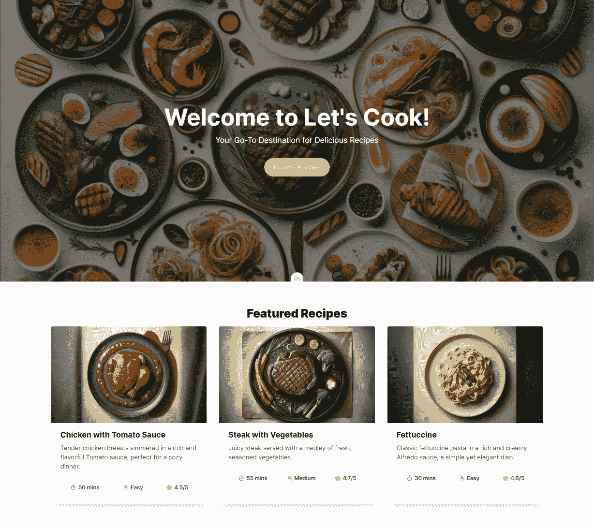

图 6.1：主页

点击主页上列出的任何食谱。由于 Nuxt 实现了动态路由，这应该会带你到所选食谱的详细页面。详细页面将显示有关食谱的更多信息，如 `pages/recipe/[slug].vue` 中定义的那样。

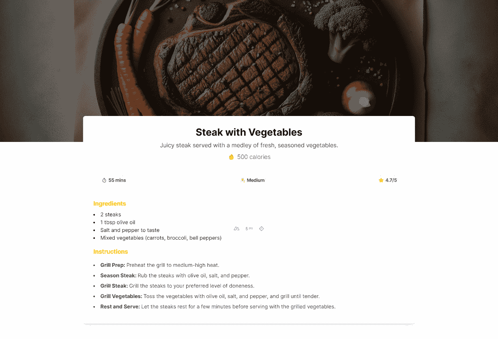

图 6.2：食谱详情页面

在测试了我们的项目并看到我们的主页和食谱详情页面变得生动之后，让我们将注意力转向 SEO。

## 使用 nuxt SEO 设置网站配置

Nuxt SEO 是一个强大的模块，它增强了 Nuxt 网站的 SEO 功能。它简化了配置过程，并确保与各种 SEO 模块兼容。该模块提供了元标签的简化管理以及元数据的最佳实践，包括自动生成的规范 URL 和开放图元标签。这种设置对于优化你的网站搜索引擎存在感和用户参与度至关重要。

要将模块添加到你的项目中，请运行以下命令：

```js
$ pnpm i -d @nuxtjs/seo
```

在你的 `nuxt.config.js` 文件中，将 `@nuxtjs/seo` 添加到模块数组中，然后添加一个 `site` 属性。以下是基于你的配置的示例配置：

```js
export default defineNuxtConfig({
  // Other Nuxt Configurations
  modules: [
    '@nuxtjs/seo',
    '@nuxtjs/tailwindcss',
    '@nuxtjs/google-fonts',
  ],
  site: {
    url: 'http://localhost:3000',
    name: `Let's Cook - Your Go-To Destination for
      Delicious Recipes`,
    description: `Dive into a world of flavors with Let's
      Cook! Discover a diverse array of mouth-watering
      recipes. and find inspiration for your next kitchen
      adventure. Join us and elevate your cooking
      experience!`,
    defaultLocale: 'en'
  }
}
```

如果你打开浏览器开发者工具，你会注意到文档的 `head` 元素中自动生成的一些标签：

+   `UTF-8`：确保你的网站使用 `UTF-8` 字符编码以实现通用字符表示。

+   `Viewport`：设置视口以控制你的网站在不同设备上的显示方式，这对于响应式设计至关重要。

+   `Favicon`：使用 `public` 文件夹中的 `favicon.ico` 来在浏览器标签中显示你网站的图标。

+   `Robots`：指导搜索引擎机器人如何索引你的网站，影响 SEO 和网站可见性。

+   `og:type`：定义 OG 的内容类型。默认值是网站。

+   `url canonical`：与 `site.url` 配置匹配。有助于防止重复内容问题。

+   `og:canonical`：规范 URL 的 OG 版本，这对于社交媒体平台非常重要。

+   `title / og:title / og:site_name`：将页面标题设置为 `site.name`，并在浏览器标签、搜索结果和社交媒体中使用。

+   `meta description / og:description`：提供你网站的简要描述。用于搜索引擎列表和社交媒体分享。

+   `og:locale`：将区域设置为 `site.defaultLocale`，指示 OG 的语言和区域设置。

想象一下，只需用四行代码就能增强你网站的 SEO！此外，`nuxt/seo` 为内部页面提供了一个增强的页面标题功能。如果你没有为页面设置标题，该模块会自动从最后一个 slug 段落生成一个。

例如，如果我们在我们的大蒜食谱页面在浏览器中打开，页面标题会自动变为以下内容：

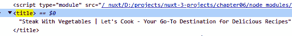

图 6.3：食谱详情页面标题

注意，URL 是 http://localhost:3000/recipe/steak-with-vegetables，标题是最后一个 slug 的首字母大写版本和主要网站标题的组合。这不是很酷吗？这个功能特别方便于管理众多页面，确保每个页面都有一个描述性、SEO 友好的标题，而无需为每个页面手动输入。现在，让我们将注意力转向自定义页面中覆盖元数据。

## 覆盖元数据

如果你检查食谱详情页面的元描述，你会注意到它与主页描述相似。理想情况下，我们应该根据每个特定页面的内容来定制它。为了实现这种定制，我们可以利用`useSeoMeta`组合式。

`useSeoMeta`允许你使用完整的 TypeScript 支持将网站的 SEO 元标签定义为扁平对象。它帮助你避免常见的错误，并确保你的元标签准确有效。

现在，让我们将这个方法应用到我们的`pages/recipe/[slug].vue`组件中：

```js
<script lang="ts" setup>
// other script content
const route = useRoute()
const recipe = recipes.find(item => item.slug ===
route.params.slug)
useSeoMeta({
  description: recipe?.description,
  ogDescription: recipe?.description
})
</script>
```

刷新页面后，更新的描述应该出现在 head 标签中，反映每个食谱页面的具体内容。

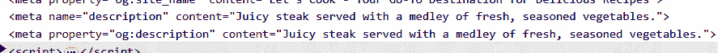

图 6.4：覆盖元描述

现在随着我们的元数据已经为每个食谱页面动态准备并定制，让我们继续学习如何从[Schema.org](http://Schema.org)获取结构化数据，以进一步提高我们网站的搜索引擎排名。

# 实施结构化数据以改善搜索引擎排名

[Schema.org](http://Schema.org)在增强搜索引擎对网站可见性方面发挥着关键作用。它为互联网上的结构化数据提供了一个共享的词汇表，使搜索引擎能够更好地理解和显示你的内容。要检查我们网站的预定义结构化数据，请点击网站上的`nuxt-devtools`图标，按*Ctrl* + *K*或*Command* + *K*，然后输入单词`Schema`。

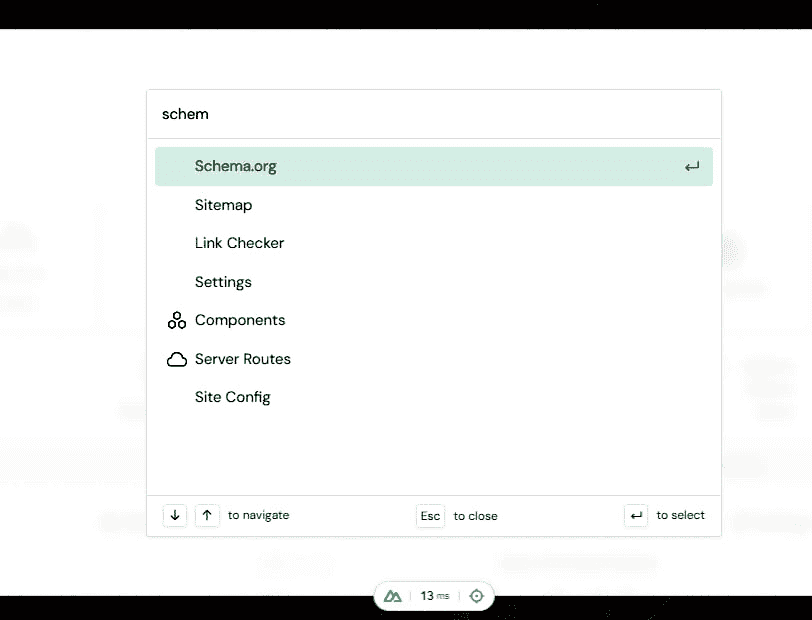

图 6.5：Nuxt Devtools

它应该揭示两个关键对象：

+   **网站对象**：代表整个网站，向搜索引擎提供有关网站性质、重点和一般详细信息的高级信息

+   **网页对象**：描述你网站上的单个页面，提供更具体的数据，如特定页面的内容

这些对象自动从网站配置中生成，利用了`nuxt/seo`模块的力量。进一步推进我们的 SEO 策略，让我们学习如何创建一个食谱节点。

## 创建一个食谱节点

在 SEO 和结构化数据的情况下，“节点”指的是在网页上表示特定类型内容的一组信息，以搜索引擎可以轻松理解和索引的方式结构化。在我们的案例中，食谱节点是一组特定描述食谱的结构化数据，包括如成分、烹饪时间和营养信息等元素。

如果你打开谷歌并搜索“fettuccine alfredo 食谱”这个术语，你会得到与这个类似的结果：


图 6.6：搜索结果中的食谱节点

注意，结果包括带有图片、准备时间、成分、评分等的食谱列表。这个搜索结果中的卡片指的是一个食谱节点。

`nuxt/seo` 模块支持创建各种类型的节点，例如用于菜谱的 `defineRecipe`。您可以在 https://unhead.unjs.io/schema-org/schema/recipe 了解更多关于菜谱节点的内容。

要实现菜谱节点，导航到 `pages/recipe/[slug].vue` 并在脚本中添加以下内容：

```js
<script lang="ts" setup>
useSchemaOrg([
  defineRecipe({
    name: recipe?.title,
    description: recipe?.description,
    image: recipe?.image,
    cookTime: recipe?.cookingTime,
    prepTime: recipe?.prepTime,
    nutrition: recipe?.nutrition,
    recipeYield: recipe?.recipeYield,
    recipeCategory: recipe?.recipeCategory,
    recipeCuisine: recipe?.recipeCuisine,
    aggregateRating: {
      ratingValue: recipe?.ratings
    },
    recipeIngredient: recipe?.recipeIngredient,
    recipeInstructions: recipe?.recipeInstructions
  })
])
</script>
```

下面是对前面代码的分解：

+   `cookTime` 和 `prepTime`: 分别指定烹饪和准备时间。

+   `nutrition`: 详细说明菜谱的营养信息。

+   `recipeYield`: 指示菜谱制作的数量或份量，例如“四份”或“三杯”。

+   `recipeCategory` 和 `recipeCuisine`: 分别将菜谱分类到特定的类别和菜系，帮助用户根据他们的偏好找到相关的菜肴。

+   `aggregateRating`: 显示该菜谱的平均评分值。

+   `recipeIngredient`: 一个字符串数组，列出了所需的食材。

+   `recipeInstructions`: 一个数组，其中每个元素都是一个对象，详细说明了菜谱的特定步骤。每个对象可以包含以下内容：

    +   `name`: 步骤的标题或简要描述（可选）

    +   `text`: 该步骤的详细说明

    +   `image`: 该步骤的可选图片 URL，提供视觉指南

在您的 `pages/recipe/[slug].vue` 文件中实现 `defineRecipe` 函数后，您可以通过重新访问 Nuxt 开发工具来验证其效果：

1.  在浏览器中打开您的 Nuxt 项目。

1.  在 Nuxt Devtools 中搜索 `Schema` 部分。

1.  在这里，您现在应该会看到一个名为 `Recipe` 的新对象，代表您正在查看的特定菜谱页面的结构化数据。

这个 `Recipe` 对象将包含您使用 `defineRecipe` 定义的 所有结构化数据，例如菜谱的名称、描述、烹饪和准备时间、食材和说明。在 Nuxt Devtools 中的这种可视化是一种很好的方式来确认您的结构化数据已被正确实现并被 Nuxt 识别。您还可以使用 [shcema.org](http://shcema.org) 验证器验证该对象：https://validator.schema.org/.

在我们的菜谱节点成功实现并在 Nuxt Devtools 中可见后，现在让我们将注意力转向优化菜谱图片以提高页面加载速度。

# 优化菜谱图片以加快页面加载速度

为了优化菜谱图片并提高页面加载速度，我们将关注图像优化在网页性能中的重要性。大而未优化的图片可以显著减慢页面加载时间，对用户体验和 SEO 产生负面影响。

要优化 Nuxt 中的图片，我们可以使用 `nuxt-img`，这是来自 Nuxt Image 的一个组件，旨在高效地优化和转换图片。它提供了诸如即时图片调整大小、现代格式转换和懒加载（在图片加载时提供一个占位符）等功能，这些都是速度和性能的关键。

在我们的项目中实现 `nuxt-img` 是优化图片的关键步骤。让我们从安装该包开始：

```js
$ pnpm i -d @nuxt/image
```

然后，我们将它添加到 `nuxt.config.ts` 模块中：

```js
export default defineNuxtConfig({
  // other nuxt configuration
  modules: [
    '@nuxtjs/seo',
    '@nuxtjs/tailwindcss',
    '@nuxtjs/google-fonts',
    '@nuxt/image'
  ],
})
```

接下来，我们转到 `pages/recipe/[slug].vue` 文件。在那里，将标准的 `` 标签替换为 `<nuxt-img>` 标签，以利用 Nuxt Image 的功能：

```js
<nuxt-img
  :src="img/recipe.image"
  alt="recipe Image"
  class="absolute w-full h-full object-cover"
/>
```

在实施此更改之前，让我们评估当前图像的大小。打开浏览器开发者工具，导航到图像标签，并在新标签页中打开图像源：

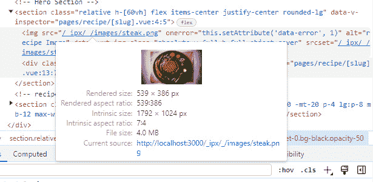

图 6.7：优化前的图像大小

如果你下载图像，你可能会发现它的大小相当可观，可能大约有 4 MB，这对于网络图像来说相当大。现在，让我们将 `format="webp"` 属性添加到 `nuxt-img` 组件中：

```js
<nuxt-img
  format="webp"
  :src="img/recipe.image"
  alt="recipe Image"
  class="absolute w-full h-full object-cover"
/>
```

在进行此更改后，重新进行测试。你可能会注意到图像大小现在显著减小，大约减少了 400 KB，这意味着我们在保持质量的同时实现了 90%的大小缩减。

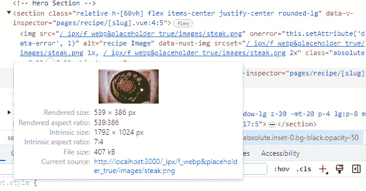

图 6.8：优化后的 Nuxt 图像

Nuxt 图像中的另一个重要功能是 `placeholder`。通过在完整大小的图像加载时显示模糊的占位符图像，这显著提高了用户体验。与传统的逐行加载图像的方法相比，这种方法在视觉上更具吸引力。

要利用此功能，只需将 `placeholder` 属性添加到 `nuxt-img` 组件中——例如，在 `pages/recipe/[slug].vue` 中的图像：

```js
<nuxt-img
  :src="img/recipe.image"
  format="webp"
  placeholder
  alt="recipe Image"
  class="absolute w-full h-full object-cover"
/>
```

添加此属性后，当你访问页面时，你最初会看到图像的模糊版本，它逐渐变得清晰，最终呈现完整的图像，从而实现更平滑的视觉体验。

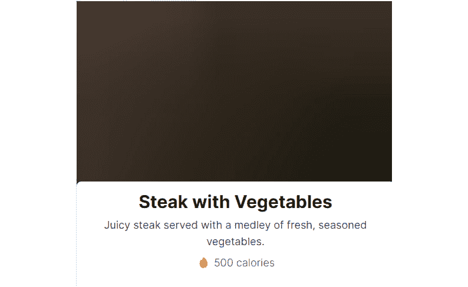

图 6.9：Nuxt 图像占位符

现在，让我们进一步讨论通过指定它们的宽度和高度来优化图像，这在显示较小尺寸的图像时特别有用。

`nuxt-img` 允许你定义宽度和高度属性，确保图像以最适合其显示区域的大小提供服务。这将根据指定的大小创建一个较小的图像，减少不必要的数据传输并提高图像优化。例如，在 `components/RecipeCard.vue` 文件中，让我们将 `img` 标签替换为 `nuxt-img` 并添加 webp 格式、占位符以及 `250px` 的高度，正如我们在 TailwindCSS 类中指定的：

```js
    <nuxt-img
      format="webp"
      class="w-full h-[250px]"
      height="250"
      :src="img/recipe.image"
      alt="Recipe Image"
      placeholder
    />
```

通过将高度设置为 `250` 像素，`nuxt-img` 将图像调整到这些尺寸。这个调整大小操作由 Nuxt Image 在幕后执行，大大减少了文件大小。

在这种情况下，原始图片大小约为 4 MB，首先通过转换为 WebP 格式减小到大约 400 KB，然后，通过指定的高度进一步减小到惊人的约 18 KB 的大小！这种显著减小展示了指定尺寸与 WebP 格式结合使用的效果，展示了 `nuxt-img` 如何优化图片以增强页面加载速度同时保持图片质量。

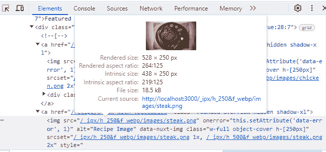

图 6.10：指定大小后的 Nuxt 图片

在优化了我们的食谱图片后，我们现在转向一种创新的方法——使用自定义 Nuxt 组件为每个食谱页面自动生成独特的 OG 图像，从而提高它们在社交媒体上的视觉影响力。

# 为食谱页面创建自定义 og:image

OG 图像（`og:image`）在社交媒体上分享内容时的视觉呈现中起着至关重要的作用。例如，当有人从你的网站分享食谱链接时，`og:image` 通常会作为帖子的视觉亮点出现，吸引注意力并可能为你的网站带来更多流量。

Nuxt 的 `useSeoMeta` 可组合函数允许你为每个页面添加一个 `og:image` 链接，如 Nuxt 文档中更详细地解释：[`nuxt.com/docs/api/composables/use-seo-meta#usage`](https://nuxt.com/docs/api/composables/use-seo-meta#usage)。

然而，在本节中，我们将探索一个更动态和创造性的解决方案。我们不会为每个食谱手动设计图片，而是创建一个 Nuxt 组件来自动生成 OG 图片。`nuxt/seo` 模块的这个功能非常有用，可以动态地将我们的组件转换为 `og:image`，在创建自定义图形设计时节省大量时间和精力。

我们将首先在模板内的 `components/OgImage/CustomTemplate.vue` 中创建一个新的组件，通过添加以下内容：

```js
<template>
  <div class="h-full w-full flex flex-row relative">
    <div class="flex flex-col justify-between w-2/3 p-16
    bg-slate-800">
      
      <h1 class="text-[64px] font-black text-white">
        {{ title }}
      </h1>
      <div class="text-2xl leading-10 font-black
      text-slate-100 mb-4">
        {{ description }}
      </div>
      <p class="text-2xl font-bold text-primary mb-0">
        {{ siteConfig.url }}</p>
    </div>
    
  </div>
</template>
```

模板创建了一个食谱卡片。它结合了网站的标志、食谱的标题和描述、网站 URL 和食谱的图片。

在相同的组件中，添加以下脚本：

```js
<script lang="ts" setup>
const siteConfig = useSiteConfig()
withDefaults(
  defineProps<{
    title: string
    description: string
    image?: string
  }>(),
  { image: '/images/hero.png' }
)
</script>
```

在 `<script>` 部分，我们正在使用 Nuxt 可组合函数动态设置组件的属性：

+   `useSiteConfig`: 来自 `nuxt/seo` 模块的这个可组合函数检索在 `nuxt.config.ts` 中定义的网站配置，使我们能够访问全局网站设置，如 URL。

+   `withDefaults`: 这个 Vue 函数用于为组件的 props 分配默认值。具体来说，它为没有提供特定食谱图片的场景设置了一个默认图片（`'/images/hero.png'`），例如在创建主页的 OG 图像时。

要在我们的主页中使用我们的自定义组件，我们首先需要修改 `pages/index.vue` 中的脚本：

```js
<script setup lang="ts">
defineOgImageComponent('CustomTemplate', {
  title: `Let's Cook`
});
</script>
```

通过这样做，我们为 OG 图片设置了一个自定义标题。由于我们没有指定描述，将使用全局定义在 `nuxt.config.ts` `site` 对象中的默认网站描述。同样，在没有指定菜谱图片的情况下，我们的默认英雄图片将自动选择。

要调试并查看这些更改的结果，请按照以下步骤操作：

1.  导航到 http://localhost:3000/。

1.  点击 Nuxt Devtools 图标。

1.  打开搜索栏（在 Mac 上使用 *Ctrl* + *K* 或 *Command* + *K*），搜索 `og Image`。

1.  您现在应该可以看到 OG 图片的预览，它看起来类似于 *图 6.11*：


图 6.11：Nuxt Devtools – og:image 调试

此过程确认我们的自定义 OG 图片已成功应用于主页。接下来，让我们采用类似的方法为每个菜谱创建一个。

打开 `/pages/recipe/[slug].vue` 文件，并将其附加到脚本中：

```js
defineOgImageComponent('CustomTemplate', {
  title: recipe?.title,
  description: recipe?.description,
  image: recipe?.image
});
```

此代码根据特定的菜谱细节动态设置 OG 图片的标题、描述和图片。当您访问菜谱页面并检查 Nuxt Devtools 中的 **OG Image** 部分，您将看到反映菜谱独特属性的定制图片：

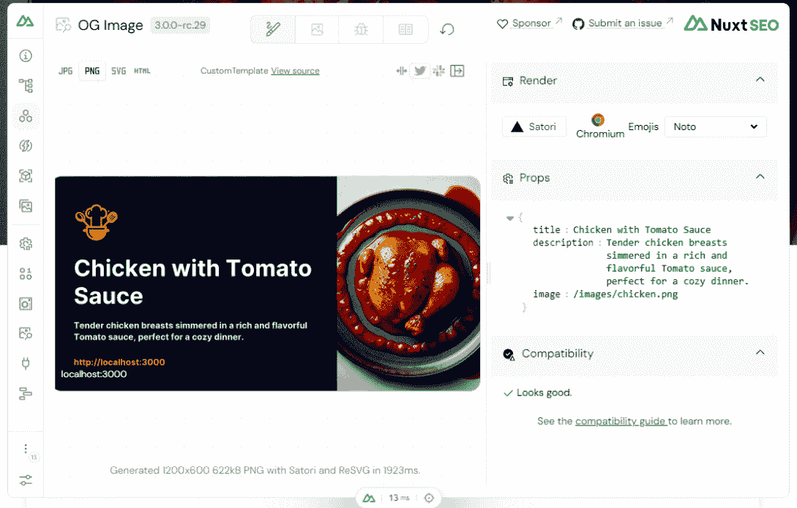

图 6.12：菜谱的 OG 图片

在为每个菜谱个性化 OG 图片后，我们现在继续进行我们的最终任务——为菜谱分享网站生成动态网站地图。

# 为菜谱分享网站生成动态网站地图

由于我们已经为每个菜谱定制了 OG 图片，我们的下一步和最后一步是为我们的菜谱分享网站生成动态网站地图。网站地图至关重要，因为它们指导搜索引擎发现和索引您网站上所有页面，从而增强 SEO。

虽然 `nuxt/seo` 模块会自动为静态页面（如主页和关于页面）创建网站地图，但它不会自动检测动态页面（如单个菜谱）。要查看当前网站地图，请访问 [`localhost:3000/sitemap.xml`](http://localhost:3000/sitemap.xml)。您会注意到它只包含静态页面：

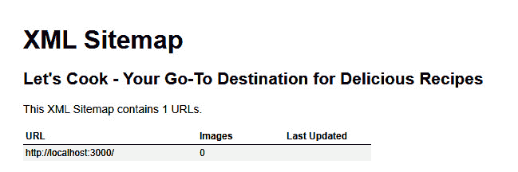

图 6.13：默认的 Sitemap.xml

然而，我们的网站还特色动态菜谱页面，这些页面不会自动包含在此网站地图中。为了解决这个问题，我们需要为 `nuxt/seo` 提供一种识别这些动态页面的方法。我们将通过设置一个 API 端点来获取菜谱列表来实现这一点。然后，此列表可以输入到 `nuxt/seo` 中，以动态生成一个包含静态和动态页面的综合网站地图，确保我们的网站对搜索引擎的完全可见性。

在一个典型的项目中，后端的责任包括创建一个外部 API 来列出动态页面。然而，Nuxt 提供了一种更集成的方法——使用其`server`目录，我们可以在我们的项目中创建一个内部 API。这种方法特别适用于我们这样的场景，我们需要生成一个动态网站地图。

Nuxt 的服务器目录是一个强大的功能，它使我们能够直接在我们的 Nuxt 应用程序中编写服务器端逻辑。它是一个理想的解决方案，用于内部 API 和服务器端功能，无需单独的后端服务。

要在我们的菜谱分享网站上使用此功能，我们将创建一个名为`server/api/__sitemap__/urls.ts`的文件。在这个文件中，我们将使用`defineSitemapEventHandler`定义一个网站地图处理程序，它将根据我们的菜谱数据动态生成 URL：

```js
import recipes from '~/data/recipes'
// server/api/__sitemap__/urls.ts
export default defineSitemapEventHandler(() => {
  return recipes.map(recipe => ({
    loc: `/recipe/${recipe.slug}`,
    _sitemap: 'pages'
  }));
});
```

在 Nuxt 的服务器目录中，`api`文件夹专门用于创建 API，每个文件路径对应一个 API 路由。这个特性允许我们轻松地将服务器端 API 直接集成到 Nuxt 项目中。在我们的案例中，`server/api/__sitemap__/urls.ts`文件将自动转换为可访问的 API 路由。要测试并查看这个新创建的 API 的输出，您可以导航到 http://localhost:3000/api/__sitemap__/urls。当您访问此 URL 时，它将显示为我们动态菜谱页面生成的 URL 列表：

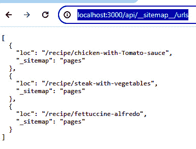

图 6.14：测试内部 API

要将我们动态生成的菜谱 URL 包含在网站地图中，我们将通过添加以下对象来调整`nuxt.config.ts`：

```js
export default defineNuxtConfig({
  // other nuxt configuration
  sitemap: {
    sources: ['http://localhost:3000/api/__sitemap__/urls']
  },
})
```

这行代码指示 Nuxt 使用我们内部 API 的 URL 作为网站地图的来源，将它们与所有自动生成的静态页面结合起来。

现在，在您的浏览器中重新访问[`localhost:3000/sitemap.xml`](http://localhost:3000/sitemap.xml)。您应该看到所有菜谱以及静态页面现在都已正确地列在网站地图中，确保它们可以被搜索引擎发现：

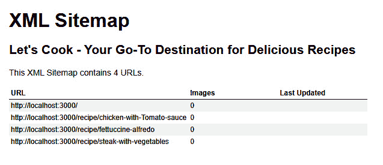

图 6.15：最终的 sitemap.xml 结果

通过这一最终步骤，我们成功完成了我们的项目，通过优化 SEO、动态 OG 图像和有效的网站地图增强了我们的菜谱分享网站。这一成就标志着我们在创建真实世界 Nuxt 项目旅程中的一个重要里程碑！

# 摘要

*第六章*专注于使用 Nuxt 3 提升菜谱分享网站，重点在于 SEO。我们从`nuxt/seo`开始，用于网站配置，高效地添加了关键 SEO 元素，如元标签和 OG 协议，增强了网站在搜索引擎中的可见性。

我们的旅程包括实现 `defineRecipe` 用于结构化数据，提高搜索结果中菜谱的可见性。使用 `nuxt-img` 在优化图片方面至关重要，显著提高了页面加载速度。一个亮点是通过自定义 Nuxt 组件创建动态 OG 图片，为每个共享的菜谱自动生成独特图片，并丰富我们的社交媒体互动。

我们通过利用 Nuxt 的服务器目录创建内部 API，克服了动态网站地图生成的挑战，确保搜索引擎对整个网站可见。

当我们结束这一章节时，我们为 *第七章* 准备，即构建一个学习与测试的问答游戏应用。这次冒险将深入创建一个交互式问答游戏应用，将介绍 Nuxt 3 的测试能力，以构建可扩展、无错误的程序。我们将探索单元测试、Pinia 存储测试、端到端测试，进一步增强我们的 Nuxt 3 开发技能。

# 实践问题

+   你如何使用 `nuxt/seo` 设置规范 URL？

+   你如何在 Nuxt 3 中将图片转换为 WebP 格式？

+   解释如何为图片实现模糊占位符。

+   你如何自定义社交媒体分享的 OG 图片？

+   你如何在 Nuxt Devtools 中测试菜谱节点的实现？

+   在 `nuxt-img` 中指定宽度和高度的重要性是什么？

+   你如何在网站地图中包含动态页面 URL？

+   `useSeoMeta` 的重要性是什么？

+   你如何验证动态生成网站地图的内容？

+   你如何在 Nuxt 页面中添加结构化数据或模式？

# 进一步阅读

+   Nuxt SEO：[`nuxtseo.com/`](https://nuxtseo.com/%20)

+   `useSeoMeta`：[`nuxt.com/docs/api/composables/use-seo-meta`](https://nuxt.com/docs/api/composables/use-seo-meta%0D)

+   Nuxt SEO 支持的节点：[`nuxtseo.com/schema-org/guides/nodes`](https://nuxtseo.com/schema-org/guides/nodes)

+   Nuxt 图像：[`image.nuxt.com/`](https://image.nuxt.com/)

+   OG：[`www.semrush.com/blog/open-graph`](https://www.semrush.com/blog/open-graph)

+   来自外部 API 的动态网站地图 URL：[`nuxtseo.com/sitemap/guides/dynamic-urls#dynamic-urls-from-an-external-api`](https://nuxtseo.com/sitemap/guides/dynamic-urls#dynamic-urls-from-an-external-api)
