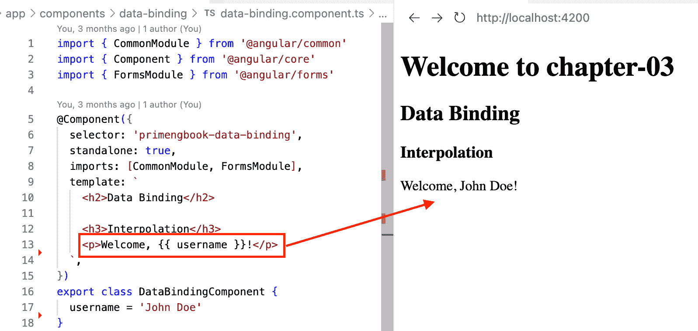

# 第三章：利用 Angular 的功能和改进

欢迎来到激动人心的现代 Angular 开发世界。凭借其快速的六个月发布周期，Angular 发生了巨大的变化，引入了新的功能和更新，以非常有趣的方式改变了我们对待应用程序的方法！

在本章中，我们将探讨 Angular 17，这是撰写本文时的最新 Angular 框架版本，并了解其新功能和改进如何赋予开发者构建前沿 Web 应用程序的能力。我们还将深入研究 Angular 的核心功能，了解它们如何增强开发过程。

在本章中，我们将涵盖以下主题：

+   介绍现代 Angular

+   了解 Angular 的核心功能和改进

+   组织 Angular 项目

# 技术要求

本章包含 Angular 核心功能和概念的多种代码示例。您可以在以下 GitHub 仓库的 `chapter-03` 文件夹中找到相关源代码：[`github.com/PacktPublishing/Next-Level-UI-Development-with-PrimeNG/tree/main/apps/chapter-03`](https://github.com/PacktPublishing/Next-Level-UI-Development-with-PrimeNG/tree/main/apps/chapter-03)。

# 介绍现代 Angular

在我们开始本章之前，让我们花一点时间探索 Angular 框架的历程，并了解它是如何随着时间的推移而演变，成为 Web 开发领域的一股强大力量。从其诞生到最新版本，Angular 不断进化，以满足开发者不断变化的需求，并为构建复杂的 Web 应用程序提供坚实的基础。

Angular 框架最初由 Google 于 2010 年推出，名为 AngularJS（使用 JavaScript）。它在 Web 开发领域是一次变革，提供了一种声明性和强大的方法来构建动态用户界面。然而，随着 Web 技术的进步和开发者对可扩展性和性能的需求增加，Angular 经历了重大转型。

Angular 发展历程中的一个关键时刻是 2016 年发布的 Angular 2（使用 TypeScript）。Angular 2 引入了框架的全面重写，采用了基于组件的架构和响应式编程等现代概念。这一转变为 Angular 的未来增长奠定了基础，并为后续版本做好了准备。

在随后的版本中，Angular 继续优化其功能并引入了新的功能，如包大小优化、向后兼容性、动画、摇树优化和服务器端渲染。值得注意的是，Angular 版本 14 对框架进行了重大改进。它通过引入独立组件强调了更模块化的方法，使开发者能够创建可重用和封装的代码。这种模块化架构彻底改变了开发者对待 Angular 开发的方式，提高了代码的可维护性和可重用性。

理解这些更改可以帮助您利用最新的特性和最佳实践，从而构建更高效和可扩展的应用程序。在下一节中，让我们概述 Angular 最近版本中引入的现有功能和新的改进。

# 了解 Angular 的核心功能和改进

在本节中，让我们探讨一些 Angular 带来的特性和改进，包括数据绑定、组件、服务、指令、管道、信号和控制流。理解 Angular 的一些核心概念非常重要，这样我们才能更好地理解 Angular 和 PrimeNG 在以下章节中的协同工作。

## Angular 数据绑定

**数据绑定**是 Angular 中的一个基本概念，它使组件和视图之间的数据同步成为可能。它允许您在组件中的数据与模板中的 HTML 元素之间建立连接。数据绑定确保组件中的任何更改都会自动反映在视图中，反之亦然。

Angular 支持多种类型的数据绑定。让我们探索每种类型：

+   `{{}}`，用于将组件属性绑定到视图。以下是一个示例：

    ```js
    <p>Welcome, {{ username }}!</p>
    ```

    在代码中，组件的 `username` 属性被插值到 `<p>` 元素中，如下所示：



图 3.1 – 插值示例

+   `[ ]`. 以下是一个示例：

    ```js
    <input [value]="username" />
    ```

    在前面的代码中，`<input>` 元素的价值绑定到组件的 `username` 属性。

+   `()`. 以下是一个示例：

    ```js
    <button (click)="handleClick()">Click me!</button>
    ...
    handleClick() {
      // handle user click event
    }
    ```

    在代码中，组件的 `handleClick()` 方法绑定到 `<button>` 元素的 `click` 事件。

+   `[(ngModel)]` 指令，它将模板中表单控件的价值与组件类中的一个属性同步。以下是一个示例：

    ```js
    // FormsModule needs to be imported for this work on form input
    import { FormsModule } from '@angular/forms'
    <input [(ngModel)]="username" />
    ```

    在代码中，`<input>` 元素的价值绑定到组件的 `username` 属性。任何输入字段中的更改都将更新组件属性，反之亦然。

要在 Angular 中使用数据绑定，您需要定义组件属性并将其绑定到模板中适当的 HTML 元素。让我们看看使用插值和属性绑定的示例：

```js
@Component({
  selector: 'app-greeting',
  template: `
    <p>Welcome, {{ username }}!</p>
    <input [value]="username" />
  `
})
export class GreetingComponent {
  username = 'John Doe';
}
```

在这里，`GreetingComponent` 有一个设置为 `'John Doe'` 的 `username` 属性。`<p>` 元素中的 `{{ username }}` 实例使用插值在模板中显示 `username` 的值。`<input>` 元素中的 `[value]="username"` 实例使用属性绑定来设置输入字段的初始值。

## Angular 组件

当使用 Angular 构建应用程序时，组件在定义应用程序不同部分的用户界面和行为中起着核心作用。在 Angular 中，**组件**封装了渲染用户界面特定部分所需的 HTML 模板、CSS 样式和 TypeScript 代码。通过将应用程序划分为更小、自包含的单元，它促进了可重用性、可维护性和模块化。

在 Angular 的早期版本中，组件通常使用 `@NgModule` 装饰器在 Angular 模块内注册和管理。`@NgModule` 装饰器用于定义一个模块，它是相关组件、指令、服务和其他实体的容器。在 `@NgModule` 中，您可以使用 `declarations` 属性指定属于它的组件。以下是一个示例：

```js
@NgModule({
  declarations: [AppComponent, HeaderComponent, FooterComponent],
  // Other module properties...
})
export class AppModule { }
```

在此代码片段中，`declarations` 属性包括三个组件：`AppComponent`、`HeaderComponent` 和 `FooterComponent`。这些组件可以在模块中使用，也可以导出以在其他模块中使用。

自 Angular v14 以来，我们还有一个新的概念，即独立组件。在 `@NgModule` 下的 `declarations` 数组。让我们从头开始创建一个新的独立组件。

让我们使用 Angular CLI 生成一个新的独立组件：

```js
ng g c alert
...
CREATE src/app/alert/alert.component.scss (0 bytes)
CREATE src/app/alert/alert.component.html (20 bytes)
CREATE src/app/alert/alert.component.spec.ts (547 bytes)
CREATE src/app/alert/alert.component.ts (294 bytes)
```

注意

如果你使用的是低于 v17 的 Angular 版本，确保在生成独立组件时附加 `--standalone`。

命令成功地在指定目录中生成了警报组件，以及与其相关的样式、模板、测试和组件文件：

+   `alert.component.scss`：此文件旨在定义针对警报组件的特定样式

+   `alert.component.html`：此文件旨在包含警报组件的模板代码

+   `alert.component.spec.ts`：此文件用于编写警报组件的测试

+   `alert.component.ts`：此文件是实现警报组件逻辑和行为的主要文件

注意

您可以通过使用 `--inline-style` 和 `--inline-template` 选项来进一步增强应用程序的大小和可维护性，这些选项允许您合并内联样式和模板。这种方法减少了文件依赖性，从而使得应用程序更加精简和易于管理。这种方法还将鼓励您编写更小、更易于维护的组件，因为一个常见的反模式是拥有单一复杂且庞大的组件。

现在我们来详细看看警报组件：

```js
import { Component } from '@angular/core';
import { CommonModule } from '@angular/common';
@Component({
  selector: 'app-alert',
  standalone: true,
  imports: [CommonModule],
  templateUrl: './alert.component.html',
  styleUrls: ['./alert.component.scss']
})
export class AlertComponent {}
```

提供的代码在 Angular 应用程序中定义了一个 `AlertComponent` 实例。让我们分析一下代码：

+   `@Component({ ... })`：这是一个用于定义 Angular 组件的装饰器。它提供了有关组件的元数据。

+   `selector: 'app-alert'`：此属性指定了该组件的 HTML 标签选择器。在这种情况下，该组件可以使用 `<app-alert />` 标签在模板中使用。

+   `standalone: true`：这表示该组件是自包含的，可以通过导入到另一个独立组件或`NgModule`中使用。

+   `imports: [CommonModule]`：此属性指定了应导入此组件的模块或组件。在这种情况下，它导入了`CommonModule`，这是使用通用 Angular 指令所必需的。

+   `templateUrl: './alert.component.html'`：此属性指定了与该组件关联的外部 HTML 模板文件的 URL。

+   `styleUrls: ['./alert.component.scss']`：此属性指定了与该组件关联的外部样式表 URL 数组。

建议在开始新项目时，我们应该利用独立组件，因为它将有助于简化我们构建 Angular 应用程序的方式。对于未来的迁移来说，这也是更好的选择，因为当在 Angular 17 中创建新应用程序时，独立组件将是默认选项。

注意

Angular 仍然支持`NgModule`，你也可以混合使用`NgModule`和独立组件而不会出现任何问题。不仅如此，我们还可以创建独立的指令或管道。

总结来说，Angular 组件是 Angular 应用程序的构建块，提供封装的功能和 UI 表示。通过利用组件的力量，你可以创建可重用和模块化的代码，这有助于促进可维护性和代码组织。现在，让我们探索 Angular 开发中的另一个基本概念：依赖注入。

## 依赖注入

在其核心，**依赖注入（DI**）是一种设计模式，它允许对象从外部源接收其依赖，而不是内部创建。在 Angular 中，DI 系统负责为组件、服务和其他 Angular 构造提供所需的依赖。DI 在解耦组件、促进代码重用、可维护性和可测试性方面发挥着关键作用。

在 Angular 中使用 DI（依赖注入），依赖通常定义为类所依赖的服务或其他组件。这些依赖在类的构造函数中声明，当类实例化时，Angular 的 DI 系统会自动解析并注入适当的实例。

在使用 DI 时，以下是一些最佳实践：

+   **单例服务**：默认情况下，Angular 服务是单例的，这意味着在整个应用程序中只有一个服务实例。这是一个好习惯，因为它确保了数据的一致性和优化了内存使用。

+   `providedIn`属性值为`root`。这确保了服务在应用程序范围内可用，并且如果未使用，则会被摇树优化。

+   **分层注入器**：了解 Angular 有一个分层注入器系统。虽然根提供的服务在应用程序范围内可用，但组件级别提供的服务仅在该组件及其子组件内可用。

+   **基于接口的注入**：有时，根据接口而不是具体类注入服务是有益的。这使得系统更加灵活，并允许更容易地进行测试和模拟。

+   **避免在构造函数中包含复杂逻辑**：由于构造函数是注入的主要位置，请保持其简洁。避免放置可能阻塞组件初始化的复杂逻辑或操作。

在下一节中，我们将深入探讨实际中依赖注入的工作原理。

## Angular 服务

在 Angular 中，**服务**是一个类，它为应用程序中的多个组件提供特定的功能或数据。服务充当组件之间的桥梁，促进数据的共享、与外部 API 的通信以及执行各种业务逻辑操作。它们促进了应用程序中的代码重用、模块化和关注点分离。

要在 Angular 中使用服务，我们首先需要创建服务类。我们可以使用`ng generate service` Angular CLI 命令生成一个新的服务。一旦创建了服务，我们就可以使用依赖注入将其注入到任何组件或另一个服务中。

让我们以一个管理用户相关操作（如从 API 获取用户数据）的`UserService`实例为例。以下是创建`UserService`实例的方法：

```js
import { Injectable } from '@angular/core'
@Injectable({
  providedIn: 'root'
})
export class UserService {
  getUsers(): Observable<User[]> {
    // Fetch user data from API
  }
}
```

在此代码中，`UserService`是通过使用`@Injectable`装饰器创建为一个可注入的服务，这表明这个类有资格进行 DI。然后`providedIn: 'root'`选项确保 Angular 创建一个在整个应用程序中共享的单例服务。

现在，让我们看看如何在组件中使用`UserService`：

```js
import { Component, inject } from '@angular/core'
import { UserService } from './user.service'
@Component({
  selector: 'app-user-list',
  template: `
    <ul>
      <li *ngFor="let user of users$ | async">{{ user.name }}</li>
    </ul>
  `
})
export class UserListComponent {
  private userService = inject(UserService)
  users$ = this.userService.getUsers()
}
```

提供的代码演示了在 Angular 组件中（特别是在`UserListComponent`中）使用`UserService`的 DI。让我们分解它并解释其功能：

+   `private userService = inject(UserService)`: 这个`inject`函数手动注入`UserService`的一个实例，因此`UserListComponent`可以访问其属性和方法。您也可以在`constructor`中运行`inject`。

+   `users$ = this.userService.getUsers()`: 这行代码声明了`users$`属性，其值来自`UserService`实例的`getUser()`方法的结果。

+   `*ngFor="let user of users$ | async"`: 这行代码允许遍历`users$`集合，并为每个项目生成 HTML 元素。`async`管道与订阅`users$`可观察对象结合使用，以处理数据的异步特性。`async`管道在组件销毁时自动取消订阅可观察对象，防止内存泄漏。

注意

在 `users$` 中使用 `$` 的用法是一个模式，表示该属性是一个可观察的。**可观察的** 是来自 RxJS 库的核心功能，它是一种处理随时间异步事件或数据流的机制。你可以在 [`rxjs.dev/guide/observable`](https://rxjs.dev/guide/observable) 上了解更多信息。

## Angular 指令

**指令** 是 Angular 中的一项强大功能，它允许你扩展 HTML 元素的功能。它们用于操作 DOM、应用自定义行为以及动态更改元素的外观或行为。Angular 提供了三种类型的指令：

+   `<app-my-component>`，Angular 解释为创建相应组件的实例，封装其行为、视图和数据交互。组件指令与其他指令的区别在于组件包含模板。

+   `ngStyle` 指令可以同时更改多个样式。

+   `*ngFor` 指令可以用来渲染项目列表，而 `*ngIf` 可以根据布尔表达式有条件地显示或隐藏元素。

要在 Angular 中使用指令，你可以利用 Angular 提供的内置指令，或者创建你自己的自定义指令。让我们看看使用内置的 `ngIf` 指令有条件地显示元素的例子：

```js
<div *ngIf="showMessage">
  <p>This message is shown conditionally.</p>
</div>
```

在代码中，`ngIf` 指令被应用于 `<div>` 元素。`showMessage` 属性被评估，如果它是真值，则 `<div>` 元素及其内容将被渲染。否则，它们将从 DOM 中移除。

你也可以通过运行以下命令来创建自定义指令，以封装特定的行为或样式：

```js
ng g d fallback-image 
```

下面是一个创建自定义指令 `FallbackImageDirective` 的例子，当找不到现有图像时，它会显示一个后备图像：

```js
import { Directive, Input, ElementRef, HostListener, inject } from '@angular/core'
@Directive({
  selector: 'img[fallbackImage]',
  standalone: true
})
export class FallbackImageDirective {
  private el = inject(ElementRef)
  @Input() fallbackImage: string
  @HostListener('error')
  private onError() {
    const img = new Image()
    img.src = this.fallbackImage
    img.onload = () => (this.el.nativeElement.src = this.fallbackImage)
  }
}
```

在此代码中，`FallbackImageDirective` 是使用 `@Directive` 装饰器创建的。它定义了一个选择器 `img[fallbackImage]`，这意味着指令将被应用于具有 `fallbackImage` 属性的图像元素。

下面是一个使用 `FallbackImageDirective` 的例子：

```js

```

`HostListener` 装饰器用于监听宿主元素上的事件。在这种情况下，我们监听 `error` 事件并调用相应的方法。`ElementRef` 允许我们访问宿主元素，从而可以修改其属性，例如 `src` 属性。

## Angular 管道

**管道** 是 Angular 中的一项强大功能，它允许你在模板中直接转换和格式化数据。它们提供了一种方便的方式来执行数据操作，如过滤、排序、格式化等。此外，它们轻量级且可重用，可以串联起来创建复杂的转换。

Angular 提供了一套内置管道，你可以直接使用。让我们看看使用这些管道的一些例子：

+   `date` 管道用于格式化日期。以下是一个例子：

    ```js
    <p>Today is {{ today | date: 'longDate' }}</p>
    ```

    在这里，`today`变量代表当前日期。`date`管道使用`'longDate'`格式来格式化日期，以长格式显示日期，例如`"January 1, 2023"`。

+   `currency`管道用于格式化货币值。以下是一个示例：

    ```js
    <p>The price is {{ price | currency: 'USD' }}</p>
    ```

    在这里，`price`变量代表货币值。`currency`管道使用`'USD'`货币代码将值格式化为货币，例如`"$10.99"`。

+   `uppercase`管道用于将字符串转换为大写。以下是一个示例：

    ```js
    <p>{{ greeting | uppercase }}</p>
    ```

除了内置的管道外，你还可以创建自己的自定义管道以执行自定义数据转换。首先，你可以使用`ng`命令创建一个独立管道：

```js
ng g p reverse
```

注意

如果你正在使用低于 v17 版本的 Angular，在生成独立管道时请确保附加`--standalone`。

然后我们可以添加逻辑来创建一个名为`ReversePipe`的自定义管道，该管道反转字符串：

```js
import { Pipe, PipeTransform } from '@angular/core';
@Pipe({
  standalone: true,
  name: 'reverse'
})
export class ReversePipe implements PipeTransform {
  transform(value: string): string {
    return value.split('').reverse().join('');
  }
}
```

在这个示例中，使用`@Pipe`装饰器创建了一个名为`ReversePipe`的自定义 Angular 管道。该管道接收一个字符串，将其反转，并返回反转后的字符串。实现反转操作的`transform`方法是`PipeTransform`接口所必需的。

然后，如果我们想使用这个自定义管道，我们只需要将其导入组件并像平常一样使用：

```js
@Component({
  selector: 'my-app',
  standalone: true,
  imports: [CommonModule, ReversePipe],
  template: `
    <p> Revere of 'abc' is {{'abc' | reverse}} </p>
  `,
})
```

在这一行代码中，Angular 的管道机制正在使用名为`reverse`的自定义管道来转换字符串`abc`。行`Reverse of 'abc' is {{'abc' | reverse}}`将在 HTML 中渲染为`Reverse of 'abc' is cba`。

注意

管道是可链式的，因此你可以组合不同的管道以创建所需的结果。例如，`{{'abc' | reverse | uppercase}}`将反转字符串并将其转换为大写。最终结果是`CBA`。

## Angular 信号

**Angular 信号**是一个系统，它细粒度地跟踪你的状态在应用中的使用方式和位置，允许框架优化渲染更新。Angular 16 中的这个特性是处理 Angular 中反应性的原生方式。

在大多数情况下，信号就是构建简单应用所需的所有东西。**信号**是一个包含值并允许你监听该值变化的函数。让我们看看以下示例：

```js
import { Component, effect, signal, WritableSignal } from '@angular/core'
@Component({
  standalone: true,
  selector: 'my-app',
  template: `
    <p>Current count is: {{count()}}</p>
    <button (click)="setRandomCount()">Set random count</button>
  `,
})
export class App {
  public count: WritableSignal<number> = signal<number>(4);
  constructor() {
    effect(() => {
      console.log(`The current count is: ${this.count()}`);
    });
  }
  setRandomCount() {
    this.count.set(Math.floor(Math.random() * 10 + 1));
  }
}
```

这个代码块展示了如何使用来自`@angular/core`包的信号和效果来管理状态和副作用。以下是分解：

+   `public count: WritableSignal<number> = signal<number>(4)`: 这一行声明了一个名为`count`的信号，它是一个包含数字的`WritableSignal`实例。`count`的初始值设置为`4`。

+   `setRandomCount() { ... }`：这是一个将`count`设置为 1 到 10 之间的随机数的函数。使用`this.count.set(...)`方法来更新`count`的值。

+   `effect()`是一个操作，每当一个或多个信号值发生变化时就会运行，并将`count`的当前值打印到浏览器控制台日志中。

+   组件的模板显示 `count` 的当前值，以及一个当点击时调用 `setRandomCount` 的按钮。

注意

Angular Signals 自 Angular 17 起被标记为稳定。你可以在 [`angular.io/guide/signals`](https://angular.io/guide/signals) 上了解更多关于 Angular Signals 的信息。

## Angular 控制流

为了提升**开发者体验**（**DX**），Angular 17 引入了一个名为**内置控制流**的新功能。这个功能允许你在 Angular 模板中使用类似 JavaScript 的语法，轻松地显示、隐藏或重复元素。

以 `NgIf` 指令为例。假设我们有一个产品列表，我们想在没有产品可用时显示不同的内容。在控制流功能引入之前，我们会这样处理：

```js
<div *ngIf="products.length; else noProducts">
  Show product list
</div>
<ng-template #noProducts>
  Products are empty!
</ng-template>
```

总体来说，这个代码片段在 `products` 数组有元素时，在 `<div>` 元素内显示“显示产品列表”消息。如果 `products` 数组为空，则显示来自 `ng-template` 块的“产品为空！”消息。这允许根据 `products` 数组的当前状态进行条件渲染。

现在，让我们看看如何使用新的 `@if` 控制流来完成它：

```js
@if (products.length) {
  Show Product List
} @else {
  Products are empty!
}
```

在这个代码片段中，你会注意到我们可以直接使用 `@if`、`@else`，甚至 `@else if` 语法，从而产生更干净、更熟悉的代码。这种方法也展示了类似 JavaScript 的编码风格，增强了 DX 的熟悉感和便捷性。

注意

除了增强 DX 之外，新的控制流与之前的实现相比，还显著提高了应用程序的性能。你可以参考在 [`krausest.github.io/js-framework-benchmark/current.html`](https://krausest.github.io/js-framework-benchmark/current.html) 可用的社区框架基准，以进一步验证。

Angular 团队还提供了一个很好的方法来运行迁移，将现有语法移动到新的控制流。你只需要运行以下命令：

```js
ng generate @angular/core:control-flow
```

此命令将扫描现有的 `NgIf`、`NgFor` 和 `NgSwitch` 的实现，并将它们升级到新的控制流。在最终确定并提交这些更改之前，彻底测试和验证所有功能按预期工作非常重要。

注意

Angular 控制流在 Angular 17 中仍处于开发者预览阶段。你可以在 [`angular.io/guide/control_flow`](https://angular.io/guide/control_flow) 上了解更多关于 Angular 控制流的信息。

到目前为止，我们已经探讨了 Angular 的几个核心功能，这些功能是开发功能强大的 Angular 应用程序的基本构建块。在下一节中，我们将深入探讨有效组织 Angular 项目的宝贵技巧。

# 组织 Angular 项目

组织和构建 Angular 应用程序的目的是提高其可维护性、可扩展性和可重用性。这涉及到如何结构化代码库、在不同文件和文件夹之间分配责任，以及建立命名和组织文件的约定。有效地组织 Angular 项目不仅改善了开发者的体验，还有助于团队更好地协作，并降低了新加入项目的开发者学习曲线。

在组织 Angular 项目时，遵循既定的最佳实践并利用 Angular 推荐的项目结构非常重要。Angular 风格指南提供了组织 Angular 项目的几个最佳实践。您可以在以下位置找到风格指南：[`angular.io/guide/styleguide`](https://angular.io/guide/styleguide)。

风格指南中强调的一个关键原则是**LIFT 方法**，它代表快速定位代码、一眼识别代码、简化结构，以及尝试做到**DRY**（不要重复自己）。让我们逐一介绍 LIFT 原则的各个方面，并提供代码示例以更好地理解：

+   **快速定位代码**：目标是按照一种方式组织代码库，使得你可以轻松地定位文件和模块。一种常见的方法是根据其功能或特性对文件进行分组。以下是一个例子：

    ```js
    app/
      components/
        product/
          product.component.ts
          product.component.html
          product.component.scss
          product.component.spec.ts
      services/
        product.service.ts
      models/
        product.model.ts
    ```

    在这里，相关的文件被分组在`components`、`services`和`models`等目录中。这种结构有助于开发者在开发特定功能时快速找到所需的文件。

+   **一眼识别代码**：重点是使用有意义的和描述性的名称来命名文件、类、变量和函数。这使得理解代码的目的和功能更加容易。以下是一个例子：

    ```js
    // product.component.ts
    export class ProductComponent {
      // Component logic...
    }
    ```

    使用如`ProductComponent`这样的描述性名称可以清楚地传达代码的责任和目的。

+   **简化结构**：目标是保持扁平的目录结构，而不是过度嵌套目录。这简化了导航和维护。以下是一个例子：

    ```js
    app/
      components/
        product/
          product.component.ts
    ```

    在这里，`product.component.ts`文件直接位于`components`目录下，没有不必要的嵌套。

+   **尝试做到 DRY**：这个原则鼓励代码重用和避免重复。它提倡将公共功能提取到可重用的组件、服务或模块中。以下是一个例子：

    ```js
    // shared/ui/loading-spinner.component.ts
    @Component({
      selector: 'app-loading-spinner',
      template: `
        <div class="loading-spinner">
          <!-- Loading spinner template -->
        </div>
      `,
    })
    export class LoadingSpinnerComponent {
      // Component logic...
    }
    ```

    `LoadingSpinnerComponent`可以在应用程序的多个部分中重复使用以显示加载指示器，减少代码重复，并提高一致性。

通过遵循 LIFT 原则，Angular 项目可以从一个组织良好且易于维护的代码库中受益，使开发更加高效，并增强团队成员之间的协作。

除了 LIFT 方法之外，风格指南还提供了以下值得注意的最佳实践：

+   `src/app` 用于特定于应用程序的代码，以及 `src/assets` 用于资源。

+   **使用目录分离关注点**：使用目录来分离关注点并分组相关文件。例如，将一个功能的相关组件、模板、样式和测试放在同一个目录中。这使得定位和维护相关代码变得更加容易。

+   `feature-name.component.ts` 用于组件文件，`feature-name.service.ts` 用于服务文件，以及 `feature-name.spec.ts` 用于测试文件。这种一致性有助于开发者快速定位和识别文件。

+   在目录中使用 `index.ts`) 提供一个中央入口点以导出多个文件。**Barrels** 简化了导入，并使定位和管理相关文件变得更加容易。

+   将功能级别的代码放置在功能模块中。

+   **考虑创建共享目录**：创建一个共享目录来封装常用组件、指令、管道和服务。共享模块简化了共享资源的导入，并促进了代码的重用。

+   **使用懒加载**：对于大型应用程序，考虑使用 **懒加载** 来按需加载功能模块。这提高了初始加载时间，并将代码分离成可管理的块。

记住，Angular 风格指南为每个最佳实践提供了详细的解释和示例，并且是有效组织 Angular 项目的宝贵资源。

注意

这些只是组织 Angular 项目时的最佳实践建议。在架构你的 Angular 项目方面，没有一种“一刀切”的方法。它将始终取决于其他因素，如项目的阶段、截止日期、团队规模等。确保你选择适合你项目的方案。一种推荐策略是从 LIFT 方法开始，这有助于加快应用程序的开发。随着应用程序的扩展，建议应用最佳实践来优化代码并确保其效率。

# 摘要

在本章中，我们涵盖了现代 Angular 开发的关键方面。我们首先介绍了 Angular 的发展历程，强调了其增长和进步。接着，我们讨论了最近 Angular 版本中的核心特性和改进，包括数据绑定、组件、服务、指令、管道和信号。我们还强调了有效组织 Angular 项目的重要性，并强调了使用最佳实践的重要性。

通过深入了解现代 Angular 开发，你现在已经准备好将你的技能提升到下一个层次。在下一章中，我们将专注于将 PrimeNG 集成到你的 Angular 项目中。我们将指导你通过将 PrimeNG 集成到你的 Angular 应用程序中，并利用其功能来增强用户体验的过程。
