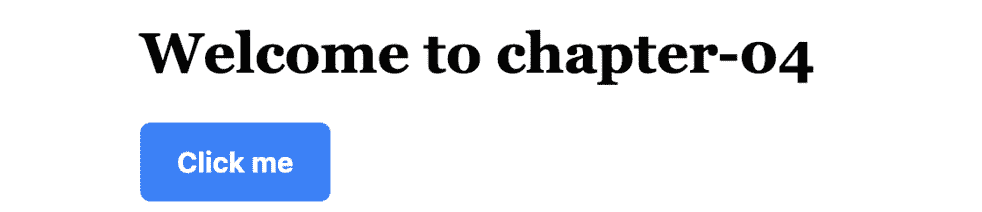
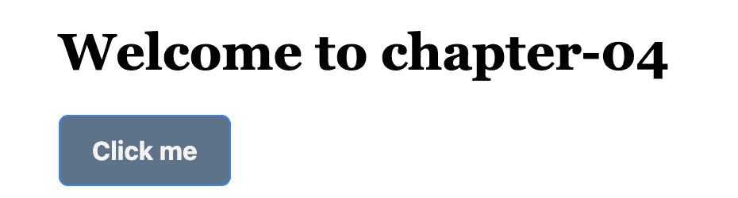
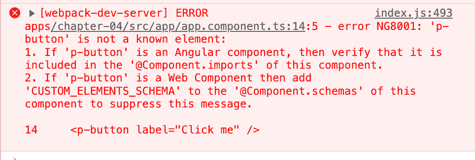

# 第四章：将 PrimeNG 集成到您的 Angular 项目中

在本章中，我们将探讨将 PrimeNG（一个流行的 UI 组件库）集成到您的 Angular 项目中的过程。PrimeNG 提供了一套丰富的预构建组件，可以增强您应用程序的功能和美观。无论您需要整合复杂的数据表、响应式布局还是交互式图表，PrimeNG 都提供了一系列组件以满足您的需求。通过使用 PrimeNG，它将帮助您以稳健、可靠和可访问的方式节省构建基础组件的时间，从而使您能够专注于应用程序而不是构建典型 UI 元素的所有核心组件。

通过遵循本章提供的逐步说明和示例，您将获得将 PrimeNG 无缝集成到您的 Angular 项目中以及轻松创建功能丰富且视觉吸引力的应用程序所需的知识和技能。

本章将涵盖以下主题：

+   将 PrimeNG 组件添加到您的 Angular 项目中

+   配置 PrimeNG 模块和依赖项

+   使用 PrimeNG 组件 API 和指令

+   自定义组件样式和主题

+   解决常见的集成问题

# 技术要求

本章包含各种示例代码，展示如何将 PrimeNG 集成到 Angular 项目中。您可以在以下 GitHub 仓库的`chapter-04`文件夹中找到相关源代码：[`github.com/PacktPublishing/Next-Level-UI-Development-with-PrimeNG/tree/main/apps/chapter-04`](https://github.com/PacktPublishing/Next-Level-UI-Development-with-PrimeNG/tree/main/apps/chapter-04)。

# 将 PrimeNG 组件添加到您的 Angular 项目中

**PrimeNG** 是一个强大的 Angular UI 组件库，它提供了一系列预构建组件，可以增强您应用程序的功能和视觉吸引力。在本节中，我们将探讨如何将 PrimeNG 及其依赖项添加到您的 Angular 项目中，导入必要的样式，并在模板中使用 PrimeNG 组件。

## 安装 PrimeNG

在开始将 PrimeNG 集成到您的 Angular 项目之前，请确保您从一个全新的项目开始。现在按照以下步骤在您的 Angular 项目中安装 PrimeNG：

1.  在您的项目目录中打开一个终端或命令提示符。

1.  运行以下命令以安装 PrimeNG 并将其作为依赖项保存到您的项目中：

    ```js
    npm install primeng
    ```

安装过程完成后，您将在根目录的`package.json`文件中看到`primeng`。

注意

在撰写本书时，我们正在使用 PrimeNG 版本`17.0.0`。如果您有不同的版本并且您的应用程序无法正常工作，您可以尝试使用`yarn add primeng@17.0.0`来安装本书插件的正确版本。

您只需要`primeng`包就可以开始集成。在下一节中，我们将向您的应用程序添加一些样式和主题。

## 将 PrimeNG 样式导入到您的 Angular 应用程序中

主题和核心样式是组件的必要 CSS 文件。您可以在`angular.json`或`src/styles.css`文件中找到可用的主题的全面选择。在本节中，我们将以`lara-light-blue`主题为例。

为了将主题和样式添加到您的`angular.json`文件中，请转到文件的`styles`部分并添加样式，如下所示：

```js
// angular.json
"options": {
   ...
   "styles": [
      "apps/chapter-04/src/styles.scss",
      "node_modules/primeng/resources/themes/lara-light-blue/theme.css",
      "node_modules/primeng/resources/primeng.min.css"
   ],
},
```

除了在`angular.json`文件中添加主题和样式外，您还可以利用`styles.scss`导入样式：

```js
// styles.scss
/* You can add global styles to this file, and also import other style files */
@import 'primeng/resources/themes/lara-light-blue/theme.css';
@import 'primeng/resources/primeng.css';
```

此外，每个主题都有自己的字体家族；建议为您的应用应用一个字体家族以实现统一的风格：

```js
// styles.scss
body {
      font-family: var(--font-family);
}
```

注意

`--font-family`是一个 CSS 变量，也称为 CSS 自定义属性，它们是占位符，可以持有值并在整个 CSS 样式表中使用。您可以在[`developer.mozilla.org/en-US/docs/Web/CSS/Using_CSS_custom_properties`](https://developer.mozilla.org/en-US/docs/Web/CSS/Using_CSS_custom_properties)上了解更多信息。

例如，对于`lara-light-blue`主题，默认字体家族在`theme.css`文件中定义：

```js
// node_modules/primeng/resources/themes/lara-light-blue/theme.css
:root {
   ...
   --font-family:-apple-system, BlinkMacSystemFont, Segoe UI, Roboto, Helvetica, Arial, sans-serif, Apple Color Emoji, Segoe UI Emoji, Segoe UI Symbol;
   ...
}
```

注意

如果您正在使用 Nx Workspace，则使用`project.json`而不是`angular.json`。

## 与 PrimeNG 图标一起工作

**图标**在增强 Web 应用的视觉吸引力和可用性方面发挥着至关重要的作用，提供直观的视觉提示，并帮助用户快速识别和交互各种元素。在本节中，我们将探讨如何在 PrimeNG 中处理图标并利用它提供的庞大图标库。

要使用 PrimeIcons，您需要安装`primeicons`包：

```js
npm install primeicons
```

之后，需要在应用的`styles.scss`文件中导入图标库的 CSS 文件：

```js
// style.scss
@import "primeicons/primeicons.css";
```

注意

要获取 PrimeIcons 的完整列表，请查看此网站：[`primeng.org/icons`](https://primeng.org/icons)。

PrimeIcons 提供了特殊的语法：`pi pi-{icons}`，可以在您的 Angular 组件中使用。您可以将`{icons}`替换为提供的链接中的图标名称，例如`pi pi-user`，以表示它代表一个用户图标。如果您想将 Prime Icons 作为一个独立元素使用，可以使用`i`或`span`元素，如下所示：

```js
<i class="pi pi-user"></i>
<span class="pi pi-user"></span>
```

在此示例中，我们使用`pi-user`图标。您可以用支持的图标库中的任何其他图标名称替换它。

## 添加 PrimeNG 方法

向模板中添加 PrimeNG 有两种方法：PrimeNG 组件和 PrimeNG 指令。为了说明这一点，让我们使用 PrimeNG 的`p-button`元素。

`p-button`组件是一个自包含的 UI 元素，可以在您的整个应用中进行自定义和重用。它具有内置功能，如事件处理，以及各种自定义选项，包括图标支持、标签和样式类。以下是如何使用`p-button`组件的示例：

```js
<p-button label="Click me" />
```

相比之下，`pButton` 指令用于向现有的 HTML 按钮元素添加行为。它允许你通过添加 PrimeNG 特定的功能（如样式和事件处理）来增强按钮元素的功能。以下是如何使用 `pButton` 指令的示例：

```js
<button pButton type="button" label="Click me"></button>
```

在这个例子中，我们使用 `pButton` 指令通过 PrimeNG 特定的功能来增强现有的 HTML 按钮元素。我们将 `type` 属性设置为 `"button"` 并向按钮添加一个 `label`。

当你需要一个可以自定义和在整个应用程序中重用的自包含 UI 元素，并且需要向按钮添加大量内置功能时，建议使用 `p-button` 组件。对于 `pButton` 指令，你可以用它来向现有的 HTML 按钮元素（如 `button`、`input` 或 `tag`）添加行为，并在需要使用 PrimeNG 特定的功能来增强按钮功能时使用它。

## 在模板中使用 PrimeNG 组件

这一节重点介绍如何无缝地将 PrimeNG 组件集成到模板中。我们将学习如何在你的 Web 应用程序中有效地利用 PrimeNG 组件的丰富库。让我们开始吧。

如果你正在使用 `NgModule` 方法，你所需要做的就是将 PrimeNG 模块导入到 `NgModule` 装饰器中：

```js
import { NgModule } from '@angular/core'
import { ButtonModule } from 'primeng/button'
@NgModule({
   imports: [
      // Other module imports
      ButtonModule
   ],
   // Other module configurations
})
export class AppModule { }
```

之前的代码显示我们将 `ButtonModule` 导入到 `AppModule` 中。

一旦导入 PrimeNG 模块，你就可以开始在 Angular 模板中使用 PrimeNG 组件。按照以下步骤来使用 PrimeNG 组件：

1.  打开你想要使用 PrimeNG 组件的组件模板文件（`.html`）。

1.  将 PrimeNG 组件选择器放置在模板中你想组件出现的位置。例如，要添加按钮组件，请使用以下代码：

    ```js
    <p-button label="Click me" />
    ```

    对于独立组件方法，你将需要将 PrimeNG 组件导入到你正在工作的 Angular 组件中：

    ```js
    import { Component } from '@angular/core'
    import { ButtonModule } from 'primeng/button'
    @Component({
       standalone: true,
       imports: [ButtonModule],
       selector: 'primengbook-root',
       template: `
          <h1>Welcome to chapter-04</h1>
          <p-button label="Click me" />
       `
    })
    export class AppComponent {}
    AppComponent, which utilizes ButtonModule from PrimeNG. p-button is an indicator that it’s a PrimeNG button component.
    ```

因此，你将在浏览器上得到一个样式化的按钮：



图 4.1 – PrimeNg 按钮组件

## 使用 PrimeNG 组件 API 和指令

作为开发者，你明白利用强大且可定制的库来简化开发过程的重要性。在这里，我们将了解如何使用 PrimeNG API 和指令以编程方式与组件交互，自定义其行为，并发挥其全部潜力。

每个 PrimeNG 组件都将有其自己的 API 和配置。以 PrimeNG 按钮组件为例：

```js
 <p-button
   label="Click me"
   icon="pi pi-check"
   iconPos="right"
   [disabled]="isDisabled"
/>
```

在这个例子中，我们使用 `label` 输入来设置按钮标签，使用 `icon` 输入来设置按钮上显示的图标，使用 `iconPos` 输入来设置图标位置在标签的右侧，以及使用 `disabled` 输入根据 `isDisabled` 属性的值来禁用按钮。

你可以在以下屏幕截图中看到结果：


图 4.2 – PrimeNG 按钮配置

这里有一些你可以与`p-button`一起使用的其他配置选项：

+   `styleClass`: 设置按钮的 CSS 类

+   `type`: 设置按钮的类型（例如："button"、"submit"、"reset"）

+   `tabIndex`: 设置按钮的 tab 索引

+   `loading`: 表示按钮处于加载状态

+   `loadingIcon`: 设置加载状态时显示的图标

如果你想在点击按钮后触发事件，你可以利用`click`事件发射器来从你的组件中触发一个函数：

```js
<button
   pButton
   label="Click me!"
   [loading]="loading"
   (click)="onClickEvent()"
></button>
...
onClickEvent() {
   this.loading = true
   setTimeout(() => {
      this.loading = false
   }, 2000)
}
```

以下代码展示了带有点击事件处理器的 PrimeNG 按钮：

+   `(click)="onClickEvent()"`: 当用户点击按钮时，将在组件上触发`onClickEvent()`函数

+   `[loading]="loading"`: 在点击后显示按钮的加载状态

让我们看看结果：


图 4.3 – 带点击事件的 PrimeNG 按钮

在按钮被点击后，加载状态被激活，并在按钮的左侧显示加载图标。

通过遵循这些步骤，你可以轻松地将 PrimeNG 组件添加到你的 Angular 项目中。在下一节中，我们将深入了解一些 PrimeNG 配置。

# 配置 PrimeNG 模块和依赖项

PrimeNG 提供了一套全面的配置选项，可以应用于其组件。这些选项使你能够控制组件功能的不同方面和视觉呈现。让我们看看一些常用的配置选项。

## 全局配置

PrimeNG 提供了一个全局配置对象，允许你为应用程序中的所有组件定义默认设置。例如，你可以使用`PrimeNGConfig`对象配置默认区域设置、动画持续时间和其他全局选项。提供的代码片段显示了在引导过程中 PrimeNG 的初始化和配置。

首先，让我们为 PrimeNG 创建全局配置文件：

```js
// shared/providers/primeng.provider.ts
import { APP_INITIALIZER } from '@angular/core'
import { PrimeNGConfig } from 'primeng/api'
const factory = (primengConfig: PrimeNGConfig) => {
   return () => {
      primengConfig.ripple = true
      primengConfig.zIndex = {
         modal: 1100,      // dialog, sidebar
         overlay: 1000,   // dropdown, overlay panel
         menu: 1000,       // overlay menus
         tooltip: 1100,   // tooltip
      }
      // more configuration options
   }
}
export const primeNgProvider = {
   provide: APP_INITIALIZER,
   useFactory: factory,
   deps: [PrimeNGConfig],
   multi: true,
}
```

此代码定义了`primeNgProvider`，这是一个初始化和配置 PrimeNG 的提供者。它使用`@angular/core`中的`APP_INITIALIZER`令牌来确保配置在应用程序启动前应用。

备注

`APP_INITIALIZER`是 Angular 的一个功能，允许你在应用程序启动前运行一些初始化任务。通过向应用程序配置中的`providers`数组提供函数或服务到`APP_INITIALIZER`令牌，Angular 确保这些任务在应用程序完全加载前执行并完成。你可以了解更多信息在[`angular.io/api/core/APP_INITIALIZER`](https://angular.io/api/core/APP_INITIALIZER)。

`factory` 函数是提供者的实现。它接收 `PrimeNGConfig` 对象作为依赖项，并返回一个函数。当此函数在应用程序初始化期间执行时，它配置 PrimeNG 的各个方面。在这个例子中，它启用了涟漪效果（`ripple: true`），这是一种在按钮交互时发生的视觉动画或图形效果，并设置了不同 PrimeNG 组件的 `z-index` 值。

之后，我们可以将 PrimeNg 全局配置添加到应用程序配置文件中：

```js
// app.config.ts
import { ApplicationConfig } from '@angular/core'
import { primeNgProvider } from './shared/providers'
export const appConfig: ApplicationConfig = {
   providers: [primeNgProvider],
}
```

此代码是 Angular 应用程序引导过程的一部分。它提供 `primeNgProvider` 作为提供者，负责初始化和配置 PrimeNg。

通过在应用程序的引导过程中提供 `primeNgProvider` 作为提供者，它确保在应用程序启动之前正确初始化和配置了 PrimeNg，从而允许在应用程序的整个过程中无缝使用 PrimeNg 的组件和功能。

## Angular 动画配置

动画在创建引人入胜和交互式用户界面中起着至关重要的作用。在 Angular 中，动画可以用来使组件生动起来，并提供平滑且视觉上吸引人的用户体验。在本节中，我们将探讨如何在您的 Angular 应用程序中集成和配置动画。

要在您的 Angular 应用程序中启用动画，您需要从 `@angular/platform-browser/animations` 包中导入 `provideAnimations` 函数。此函数提供了在 Angular 中处理动画所需的功能和工具。它利用浏览器底层的动画能力来提供无缝的动画效果。

要导入 `provideAnimations`，您需要将其包含在应用程序配置的 `providers` 数组中：

```js
// app.config.ts
import { ApplicationConfig } from '@angular/core'
import { provideAnimations } from '@angular/platform-browser/animations'
export const appConfig: ApplicationConfig = {
   providers: [
      ...
      provideAnimations()
   ],
}
```

在某些场景下，您可能希望全局禁用应用程序中的动画。这可能是为了优化性能或适应特定的用户偏好。Angular 提供了 `provideNoopAnimations` 函数作为 `provideAnimations` 的替代方案来禁用动画：

```js
// app.config.ts
import { ApplicationConfig } from '@angular/core'
import { provideNoopAnimations } from '@angular/platform-browser/animations'
export const appConfig: ApplicationConfig = {
   providers: [
      ...
      provideNoopAnimations()
   ],
}
```

`provideNoopAnimations` 函数实际上用无操作实现替换了动画功能。这导致在整个应用程序中禁用动画。

在下一节中，我们将进一步探讨如何自定义样式和主题。

# 自定义组件样式和主题

PrimeNg 提供了一系列具有默认样式的组件，这些组件旨在功能性和视觉吸引力。然而，为了与您应用程序的设计实现无缝集成，您可能需要自定义 PrimeNg 组件的外观。在本节中，我们将探讨在 PrimeNG 中自定义组件样式和主题的各种技术，以实现所需的视觉效果和感觉。

## 在组件级别覆盖样式

假设你想要改变 `Button` 组件的背景颜色和边框半径。以下是一个使用 CSS 覆盖 `Button` 组件默认样式的例子：

```js
import { CommonModule } from '@angular/common'
import { Component } from '@angular/core'
import { ButtonModule } from 'primeng/button'
@Component({
   selector: 'primengbook-button-override-styles',
   standalone: true,
   imports: [CommonModule, ButtonModule],
   template: `
      <h2>Button Override Styles</h2>
      <button pButton type="button" label="Custom styles"></button>
   `,
   styles:
      `
         .p-button {
            background-color: #696cff;
            border-radius: 5px;
         }
      `,
})
export class ButtonOverrideStylesComponent {}
```

在这个例子中，我们针对的是 `.p-button` 类，这是应用到所有 `Button` 组件上的类。我们使用 `background-color` 和 `border-radius` 属性来改变 `Button` 组件的外观。让我们看看结果：


图 4.4 – 组件自定义按钮样式

如果你检查浏览器，你会看到样式正在正确地应用：


图 4.5 – 组件自定义按钮样式检查

你可以从检查中看到按钮的背景颜色是 `#696CFF`，这是我们设置在样式部分的颜色代码。

## 全局覆盖样式

在上一节中，我们学习了如何在组件级别添加自定义样式。在本部分，我们将学习如何使用 **CSS 预处理器**全局应用样式。在我们开始之前，让我们快速了解一下 CSS 预处理器是什么。

CSS 预处理器是扩展默认 **层叠样式表**（**CSS**）功能的脚本语言。它们允许开发者使用变量、嵌套规则、混入、函数等，这使得 CSS 更易于维护、主题化和扩展：

+   **变量**：这些允许你在整个样式表中存储想要重用的值。例如，你可以定义一个用于你的主要颜色的变量，并在多个地方使用它：

    ```js
     $primary-color: #5d738a;
    .p-button {
       background-color: $primary-color;
    }
    ```

    这种样式将把所有新的背景颜色应用到所有 PrimeNG 按钮上。

+   **嵌套规则**：这些允许你在其他选择器内部嵌套 CSS 选择器，使你的 CSS 更易于阅读和维护：

    ```js
    nav {
       ul {
          margin: 0;
          padding: 0;
          list-style: none;
       }
       li {
          display: inline;
          margin-right: 5px;
       }
    }
    ```

+   **混入和函数**：这些允许你定义可重用的 CSS 块。它们可以接受参数，允许你自定义输出：

    ```js
    @mixin box-shadow($x, $y, $blur, $color) {
          -webkit-box-shadow: $x $y $blur $color;
              -moz-box-shadow: $x $y $blur $color;
                      box-shadow: $x $y $blur $color;
    }
    button {
          @include box-shadow(0, 0, 5px, #ccc);
    }
    ```

    在混入内部有三个声明，每个声明代表 box-shadow 属性的一个供应商前缀版本。供应商前缀是 *-webkit-* 用于基于 WebKit 的浏览器（例如 Chrome 和 Safari），以及 *-moz-* 用于基于 Mozilla 的浏览器（例如 Firefox）。最后的声明是标准的 `box-shadow` 属性。

    无论你想要在你的元素上应用多少阴影，你只需包含 `box-shadow` 混入即可。它将为你生成以下代码：

    ```js
    button {
          -webkit-box-shadow: 0 0 5px #ccc;
              -moz-box-shadow: 0 0 5px #ccc;
                      box-shadow: 0 0 5px #ccc;
    }
    ```

注意

使用 CSS 预处理器可以极大地提高你的工作效率，尤其是在大型项目中。然而，有一个学习曲线，你必须设置你的开发环境来编译代码。

现在，让我们看看如何应用全局样式的例子：

```js
// styles.scss
@import 'primeng/resources/themes/lara-light-blue/theme.css';
@import 'primeng/resources/primeng.css';
@import 'primeicons/primeicons.css';
:root {
   --font-family: ui-serif, Georgia, Cambria, 'Times New Roman', Times, serif;
}
// Define a variable for primary color
$primary-color: #5d738a;
$text-color: #f8f4ef;
// Define box shadow
@mixin box-shadow($x, $y, $blur, $color) {
      -webkit-box-shadow: $x $y $blur $color;
          -moz-box-shadow: $x $y $blur $color;
                  box-shadow: $x $y $blur $color;
}
.p-button {
   background-color: $primary-color;
   color: $text-color;
   @include box-shadow(0, 0, 5px, #ccc);
}
```

在这个例子中，我们使用一个 CSS 变量来覆盖 `lara-light-blue/theme.css` 中的 `font-family`。之后，我们添加一个 Sass 变量来定义主要颜色和文字颜色值。然后我们通过混入添加 `box-shadow` 属性。

我们正在使用这些变量来全局样式化`Button`组件。让我们检查一下更改：



图 4.6 – 全局自定义按钮样式

在调试浏览器后，你可以看到，除了组件级别的修改样式按钮外，你应用中的所有其他按钮都全局更新了新的样式。

注意

当自定义组件样式或应用主题时，务必彻底测试你的更改，以确保它们不会对你的应用的功能或可用性产生不利影响。此外，请注意，某些组件可能具有特定的 CSS 类或样式，你需要针对这些类或样式来定制其外观。

自定义 PrimeNG 组件的外观是创建一个视觉上吸引人且统一的 Web 应用的重要部分。无论你是在使用 CSS、CSS 预处理器还是 PrimeNG 内置的主题，都有一系列的工具和定制选项可供你使用，以帮助你实现设计目标。通过花时间定制你应用的风格和主题，你可以创建一个既实用又美观的应用。

在下一节中，我们将探讨在使用 PrimeNG 组件时可能出现的常见集成问题，并提供故障排除技巧以克服这些问题。

# 故障排除常见集成问题

将 PrimeNG 集成到你的 Angular 项目中有时会带来它自己的一套挑战。在本节中，我们将探讨 PrimeNG 集成过程中可能出现的常见问题，并提供故障排除技巧以帮助你克服这些问题。通过了解这些挑战并具备必要的调试技能，你可以确保集成过程的顺利进行。

## 冲突或兼容性问题

集成 PrimeNG 时，一个常见问题是遇到与其他库或 Angular 版本冲突或兼容性问题。确保所有依赖项，包括 Angular 和 PrimeNG，彼此兼容是至关重要的。例如，如果你正在使用 Angular 15.x 并且安装了 PrimeNG 16.x，集成 PrimeNG 组件时可能会出现冲突。

注意

以下是从 PrimeNG 官方网站获取的发布周期信息：“PrimeNG 的发布周期与 Angular 保持一致，每 6 个月发布一个新的大版本 PrimeNG，作为开源版本，与最新的 Angular 核心兼容”。你可以在[`primeng.org/lts`](https://primeng.org/lts)查看当前的**长期支持**（**LTS**）详细信息。

如果出现冲突，你可能需要调查具体的冲突版本，并找到解决方案或相应地更新版本。你应该注意检查`package.json`文件以确认依赖项的版本：

```js
// package.json
...
"dependencies": {
      "@angular/animations": "17.0.6",
      "@angular/cdk": "17.0.3",
      "@angular/common": "17.0.6",
      "@angular/compiler": "17.0.6",
      "@angular/core": "17.0.6",
      "@angular/forms": "17.0.6",
      "@angular/platform-browser": "17.0.6",
      "@angular/platform-browser-dynamic": "17.0.6",
      "@angular/router": "17.0.6",
      "install": "⁰.13.0",
      "primeflex": "³.3.1",
      "primeicons": "⁶.0.1",
      "primeng": "17.0.0",
      "rxjs": "~7.8.0",
      "tslib": "².3.0",
      "zone.js": "0.14.2"
},
...
```

如您所见，`primeng` 和 `angular` 使用相同的版本 `17.x`。版本不同并不意味着您的 Angular 应用程序中会有冲突。如果您确实遇到错误，请从官方的 Angular 和 PrimeNG 网站检查版本：[`github.com/angular/angular/releases`](https://github.com/angular/angular/releases) 和 [`github.com/primefaces/primeng/releases`](https://github.com/primefaces/primeng/releases)。

在您检查了想要安装的 Angular 或 PrimeNG 的发布版本之后，使用 `npm` 来更新它：

```js
npm install primeng@17.0.0
```

此命令将更新 `primeng` 到版本 `17.0.0`。

## 缺少或错误的导入

另一个常见的问题是缺少或错误导入 PrimeNG 模块或组件。当在您的模板或代码中使用 PrimeNG 组件时，正确导入必要的模块至关重要。如果您忘记导入所需的模块，组件可能无法按预期工作或抛出错误。请仔细检查您的导入，并确保所有必需的 PrimeNG 模块都已导入到您的 Angular 应用程序中。

让我们看看以下组件：

```js
@Component({
   selector: 'primengbook-button-override-styles',
   standalone: true,
   imports: [CommonModule],
   template: `
      <h2>Button Override Styles</h2>
      <button pButton type="button" label="Custom styles"></button>
   `
})
export class ButtonOverrideStylesComponent {}
```

在前面的代码中，您可以看到我们正在使用 `pButton` 指令方法，并且 VS Code 或编译器没有错误。然而，按钮将不会正确显示，因为您还没有将 `ButtonModule` 从 `primeng` 导入到 `imports` 数组中。以下是修复此问题的方法：

```js
import { ButtonModule } from 'primeng/button'
...
@Component({
   selector: 'primengbook-button-override-styles',
   standalone: true,
   imports: [CommonModule, ButtonModule dependency is correctly added to the imports array in the component.
			Incorrect configuration or setup
			Sometimes, issues arise due to incorrect configuration or setup of PrimeNG features. For example, if you’re using PrimeNG’s animation features, ensure that you have added the `provideAnimations` or `provideNoopAnimations` function as required.
			Additionally, verify that any necessary configuration options are set correctly.
			Do refer to the PrimeNG documentation for detailed instructions on setting up and configuring specific features: [`primeng.org/installation`](https://primeng.org/installation)
			Inspecting console errors and warnings
			When facing integration issues, the browser’s developer console is an invaluable tool for debugging. It provides error messages, warnings, and additional information that can help you identify the root cause of the problem. Inspect the console for any error messages related to PrimeNG components or modules. These error messages often provide valuable insights into the issue at hand. Let’s have a look at the following error:
			

			Figure 4.7 – Sample error in the console log
			Based on the error displayed in the console, the issue appears to be on line 14 in the `app.component.ts` file. The error message indicates that `p-button` is not an Angular component and suggests that you add it to the `imports` array or include `CUSTOM_ELEMENTS_SCHEMA` in the `schemas` array. To resolve this issue, you should add the PrimeNG `ButtonModule` dependency to the component’s `imports` array.
			Using the Angular CLI
			The Angular CLI offers various helpful commands that can aid in troubleshooting. This includes using the `ng build` command to check for build errors or the `ng serve` command to run your application and observe any runtime issues.
			The CLI also provides options for generating component and module schematics, which can assist in setting up PrimeNG components correctly:

```

错误：apps/chapter-04/src/app/components/button-configuration.component.ts:11:5 - 错误 NG8001: 'p-button' 不是一个已知的元素：

1. 如果 'p-button' 是一个 Angular 组件，那么请验证它是否包含在这个组件的 '@Component.imports' 中。

2. 如果 'p-button' 是一个 Web 组件，那么请将 'CUSTOM_ELEMENTS_SCHEMA' 添加到这个组件的 '@Component.schemas' 中以抑制此消息。

11       <p-button

~~~~~~~~~

12          label="点击我！"

~~~~~~~~~~~~~~~~~~~~~~~

...

15          [disabled]="isDisabled"

~~~~~~~~~~~~~~~~~~~~~~~~~~~~~

16       />

~~~~~~

```js

			The previous output from the Angular CLI indicates that we forgot to import `ButtonModule` before using `p-button`.
			Seeking help from the community
			In case you encounter an issue that seems difficult to resolve, don’t hesitate to seek help from the developer community. Online forums, discussion boards, and social media groups dedicated to Angular and PrimeNG are excellent resources for getting assistance. Many experienced developers are willing to share their insights and provide guidance on troubleshooting specific integration issues.
			You can find the dedicated PrimeNG discussions at [`github.com/orgs/primefaces/discussions`](https://github.com/orgs/primefaces/discussions).
			Summary
			In this chapter, we explored the process of integrating PrimeNG into an Angular project. We learned how to add PrimeNG components to our application, configure PrimeNG modules and dependencies, work with PrimeNG component APIs and directives, customize component styles and themes, and troubleshoot common integration issues. By successfully integrating PrimeNG, we can leverage its rich set of UI components and features to enhance our Angular applications.
			Through the chapter, we gained valuable knowledge and skills that are essential for professional developers. Integrating PrimeNG into an Angular project opens up a world of possibilities for creating feature-rich and visually appealing web applications. By harnessing the power of PrimeNG, we can save development time and effort by utilizing pre-built, customizable components, and tapping into advanced functionalities.
			In the next chapter, we will delve into the realm of input components and form controls provided by PrimeNG. We will explore how to work with text inputs, checkboxes, radio buttons, dropdowns, and more, enabling us to create interactive and user-friendly forms. Additionally, we will dive into form validation techniques and learn how to handle user input effectively.

```

# 第二部分：UI 组件和功能

在这部分，您将深入 PrimeNG UI 组件的世界，并探索它们提供的丰富功能集。您将学习如何利用这些组件为您的 Angular 应用程序构建动态和交互式的用户界面。

到这部分结束时，您将对 PrimeNG 的大部分 UI 组件有一个全面的理解，并能够有效地利用它们来增强您应用程序的功能和用户体验。

这部分包含以下章节：

+   *第五章*，*介绍输入组件和表单控件*

+   *第六章*，*使用表格、列表和卡片组件*

+   *第七章*，*使用树、树表和时序组件*

+   *第八章*，*使用导航和布局组件*
