# 第五章：介绍输入组件和表单控件

深入 Angular 和 PrimeNG 的世界，我们即将开始一段关于输入组件和表单控件的旅程。

本章致力于提供对如何在 Angular 应用程序中有效利用各种输入组件和表单控件的综合理解。我们将探讨文本输入、复选框、单选按钮、下拉菜单等的使用。此外，我们还将深入了解表单验证和处理用户输入的复杂性。

通过利用这些输入组件和掌握表单控件，我们将能够创建直观且以用户为中心的应用程序，这在当今的数字景观中至关重要。

本章将涵盖以下主题：

+   介绍输入组件和表单控件

+   处理文本输入、复选框和单选按钮

+   使用下拉菜单、多选和日期选择器

+   实现表单验证

# 技术要求

本章包含各种关于输入组件和 Angular 表单的工作代码示例。您可以在以下 GitHub 仓库的 `chapter-05` 文件夹中找到相关源代码：[`github.com/PacktPublishing/Next-Level-UI-Development-with-PrimeNG/tree/main/apps/chapter-05`](https://github.com/PacktPublishing/Next-Level-UI-Development-with-PrimeNG/tree/main/apps/chapter-05)。

# 介绍输入组件和表单控件

在进入本章的主要内容之前，让我们先通过输入组件和表单控件的概述来设定场景。Angular 提供两种方式来通过表单处理用户输入：模板驱动和响应式表单。这两种方法都有其独特的优势，选择哪一种取决于您应用程序的具体需求。

让我们看看一个简单的 Angular 表单：


图 5.1 – Angular 示例表单

我们将使用这两种方法来重新创建此表单。

## 模板驱动表单

**模板驱动表单**直接在 DOM 中定义控件，然后将它们链接回底层模型。它们的简单性使其成为简单用例的首选。例如，当处理具有少量字段和简单验证规则的表单时，模板驱动表单提供了一种快速且轻松实现表单功能的方法。

使用模板驱动表单，以下是重新创建 *图 5**.1* 的方法：

```js
import { CommonModule } from '@angular/common'
import { Component } from '@angular/core'
import { FormsModule, NgForm } from '@angular/forms'
@Component({
   standalone: true,
   imports: [CommonModule, FormsModule],
   template: `
      <h2>Template Driven Form</h2>
      <form #form="ngForm" (ngSubmit)="onSubmit(form)" novalidate>
         <input name="first" ngModel required />
         <button>Submit</button>
      </form>
      <p>Value: {{ form.value | json }}</p>
   `
})
export default class TemplateDrivenComponent {
   onSubmit(form: NgForm) {
      console.log(form.value) // { first: '' }
   }
}
```

下面是代码中重要部分的分解：

+   `FormsModule`：当您想在 Angular 应用程序中使用模板驱动表单时，会导入此模块。它提供了如 `NgForm` 和 `NgModel` 等指令：

    +   `NgForm`：这是一个自动附加到任何 `<form>` 标签的指令。它跟踪表单的值及其有效性。在表单提交时，它通过其 `value` 属性聚合所有表单控件值。

    +   `NgModel`: 这个指令从一个域模型创建一个`FormControl`实例并将其绑定到表单控件元素。它确保 UI 和组件模型之间的实时同步。

+   `#form="ngForm"`: 这将创建一个名为`form`的局部模板变量，你可以使用它来访问`NgForm`指令实例。这允许你在模板的其他地方使用其属性和方法。

+   `onSubmit(form: NgForm)`: 这是一个在表单提交时被调用的方法。它将表单的值记录到控制台。

## 响应式表单

在**响应式表单**中，你可以在组件类中创建和管理表单控件对象。它们以其健壮性、可扩展性、可重用性和可测试性而闻名，使得它们成为复杂场景和大表单的首选选择。以下是使用响应式表单方法重新创建*图 5.1*的示例：

```js
import { CommonModule } from '@angular/common'
import { Component } from '@angular/core'
import { FormControl, FormGroup, ReactiveFormsModule } from '@angular/forms'
@Component({
   standalone: true,
   imports: [CommonModule, ReactiveFormsModule],
   template: `
      <h2>Reactive Forms</h2>
      <form [formGroup]="profileForm" (ngSubmit)="onSubmit()">
         <input type="text" formControlName="first" />
         <button type="submit">Submit</button>
      </form>
      <p>Value: {{ profileForm.value | json }}</p>
   `
})
export default class ReactiveFormsComponent {
   profileForm = new FormGroup({
      first: new FormControl(''),
   })
   onSubmit() {
      console.log(this.profileForm.value) // { first: '' }
   }
}
```

下面是对代码中重要部分的分解：

+   `ReactiveFormsModule`, `FormControl`, 和 `FormGroup`: 当你想要在 Angular 应用程序中使用响应式表单时，这些被使用。

+   `[formGroup]="profileForm"`: 这用于将组件类中定义的`FormGroup`实例绑定到 DOM 中的表单元素。

+   `formControlName`: 这个指令用于将输入元素链接到`第一个`表单控件。

+   `onSubmit()`: 这是一个在表单提交时被调用的方法。在示例中，提交函数获取`profileForm`的值并将表单值打印到浏览器控制台。

## 使用 PrimeNG 输入组件增强 Angular 表单

输入组件和表单控件是任何交互式应用程序的骨架。它们允许用户与应用程序交互，输入数据，并做出选择。没有这些元素，应用程序将是一个静态实体，无法以美观的方式与用户互动。

PrimeNG 介入以增强标准输入元素。它提供了一套丰富的组件，采用统一的方法来处理用户输入。PrimeNG 的组件旨在易于使用和集成到你的 Angular 应用程序中，同时提供高度的可定制性。

例如，让我们看看 PrimeNG 如何增强之前的响应式表单字段：

```js
import { ButtonModule } from 'primeng/button'
import { InputTextModule } from 'primeng/inputtext'
@Component({
   standalone: true,
   imports: [CommonModule, ReactiveFormsModule, ButtonModule, InputTextModule],
   template: `
      <h2>PrimeNg Reactive Forms</h2>
      <form [formGroup]="profileForm" (ngSubmit)="onSubmit()">
         <input pInputText formControlName="first" />
         <button pButton type="submit">Submit</button>
      </form>
      <p>Value: {{ profileForm.value | json }}</p>
   `,
})
```

在此代码中，`pInputText`和`pButton`是 PrimeNG 指令，它们改进了标准输入字段和按钮，并添加了如主题、样式等附加功能。与*图 5.1*相比，你可以在*图 5.2*中看到新的表单：

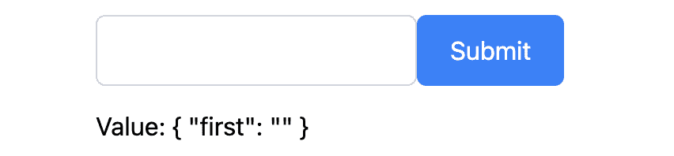

图 5.2 – 带有 PrimeNG 样式的 Angular 表单

总之，理解输入组件和表单控件对于构建交互性和用户友好的应用程序至关重要。Angular 提供了处理用户输入的强大工具，而 PrimeNG 通过一组丰富的可自定义组件增强了这些工具。在接下来的章节中，我们将深入了解如何在 Angular 应用程序中使用这些组件和控制。

# 处理文本输入、复选框和单选按钮

随着我们深入 Angular 和 PrimeNG 的实际应用方面，我们将关注文本输入、复选框和单选按钮的实现。这些表单控件是任何应用程序的基础，使用户能够与应用程序交互并提供必要的数据。

让我们看看这个联系表单组件：

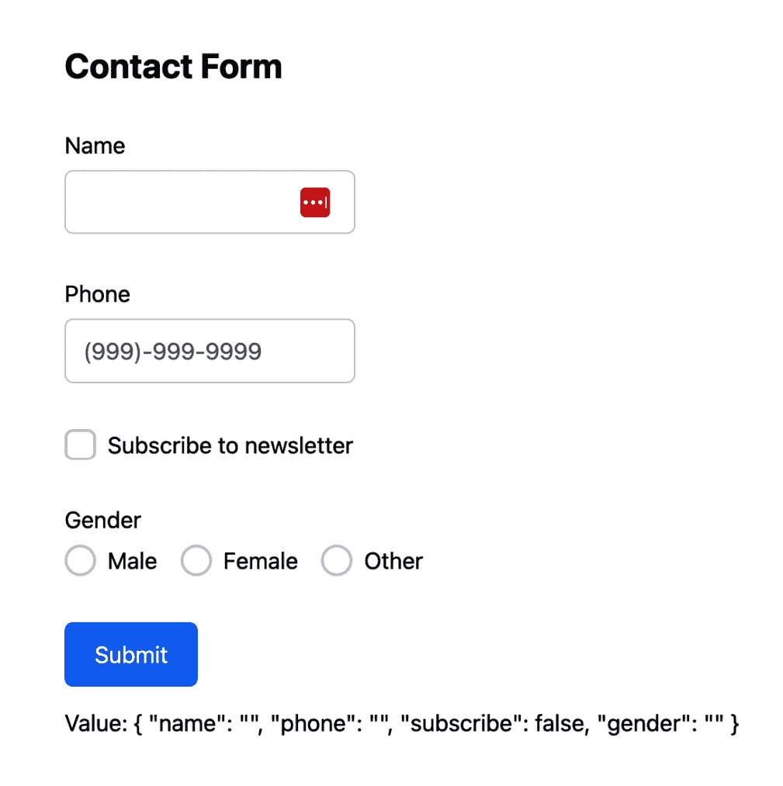

图 5.3 – 示例联系表单

联系表单使用了各种 PrimeNG 组件，如 InputText、InputMask、Checkbox 和 RadioButton。让我们看看每个部分。

## InputText

在您的 Angular 项目中，`pInputText` 指令，您首先需要从 PrimeNG 中导入 `InputTextModule` 模块。您可以通过在组件文件中添加以下 `import` 语句来实现：

```js
import { InputTextModule } from 'primeng/inputtext'
```

接下来，您可以在模板文件中使用 `pInputText` 指令创建一个文本输入字段。这里是我们从 *图 5**.3* 中使用的联系表单示例。

```js
<label for="name">Name</label>
<input pInputText id="name" type="text" formControlName="name" />
```

让我们分解代码：

+   `<label for="name">Name</label>`: 这是一个标准的 HTML 标签元素。`for` 属性将标签与具有 `name` ID 的输入字段关联。

+   `pInputText`: 此指令告诉 Angular 将 PrimeNG 文本输入功能和应用样式应用于此输入字段。

+   `id="name"`: 此属性设置输入字段的 ID，用于将其与标签关联。

+   `type="text"`: 此属性设置输入字段的类型。在这种情况下，它是一个文本字段。

+   `formControlName="name"`: 此属性是 Angular 的响应式表单模块的一部分。它将输入字段绑定到组件类中的名为 `name` 的 `FormControl`。

## InputMask

随着我们深入 PrimeNG 的表单控件，让我们将注意力转向一个提供更受控输入体验的组件：**p-inputMask**。该组件旨在处理遵循特定格式的输入，例如电话号码、日期或社会保障号码。

要在 Angular 项目中使用 `p-inputMask` 组件，您首先需要从 PrimeNG 中导入 `InputMaskModule` 模块。您可以通过在组件文件中添加以下 `import` 语句来实现：

```js
import { InputMaskModule } from 'primeng/inputmask'
```

这里是我们在 *图 5**.3* 中使用的联系表单示例。

```js
<label for="phone">Phone</label>
<p-inputMask
   id="phone"
   mask="(999)-999-9999"
   formControlName="phone"
   placeholder="(999)-999-9999"
/>
```

在这个例子中，我们创建了一个用于电话号码的输入字段。`p-inputMask` 组件用作输入字段，强制执行电话号码格式。让我们进一步分解代码：

+   `<label for="phone">Phone</label>`: 这是一个标准的 HTML 标签元素。`for` 属性将标签与具有 `phone` ID 的输入字段关联。

+   `p-inputMask`: 此 PrimeNG 组件用于将 PrimeNG 样式应用于输入字段，并定义电话号码的输入格式。

+   `mask="(999)-999-9999"`：此属性设置特定字段的输入模式。在这种情况下，掩码由字符 9 表示的占位符组成，表示只能在这些位置输入数字字符。通过应用此掩码，用户被限制在指定位置输入数字，确保数据的一致性和准确性。

+   `formControlName="phone"`：此属性是 Angular 的响应式表单模块的一部分。它将输入字段绑定到组件类中名为`phone`的`FormControl`。

## 复选框

随着我们继续探索 PrimeNG 的表单控件，让我们关注一个允许用户进行二元选择的组件：**p-checkbox**。此组件用于创建复选框，允许用户从一组选项中选择一个或多个选项。

要在您的 Angular 项目中使用`p-checkbox`组件，您首先需要从 PrimeNG 导入`CheckboxModule`模块。您可以通过将以下`import`语句添加到组件文件中来实现：

```js
import { CheckboxModule } from 'primeng/checkbox'
```

这里是我们在上一份联系表单中使用的示例，如图**5**.3 所示：

```js
<p-checkbox
   formControlName="subscribe"
   [binary]="true"
   label="Subscribe to newsletter"
/>
```

让我们分解一下代码：

+   `p-checkbox`：此 PrimeNG 组件用于将 PrimeNG 样式应用于复选框字段。

+   `formControlName="subscribe"`：此属性是 Angular 的响应式表单模块的一部分。它将复选框绑定到组件类中名为`subscribe`的`FormControl`。

+   `[binary]="true"`：此属性将复选框的值设置为`true`或`false`。如果复选框被选中，则值为`true`；否则为`false`。

+   `label="Subscribe to newsletter"`：此属性设置显示在复选框旁边的标签。

## 单选按钮

PrimeNG 的`p-radioButton`是一个 UI 组件，可用于在 Angular 表单中创建单选按钮输入。它是一个有用的组件，允许用户从一组互斥选项中选择一个，例如在调查、偏好选择、表单验证、过滤、排序和逐步过程中。

要在您的 Angular 项目中使用`p-radioButton`组件，您首先需要从 PrimeNG 导入`RadioButtonModule`模块。您可以通过将以下`import`语句添加到组件文件中来实现：

```js
import { RadioButtonModule } from 'primeng/radiobutton'
```

这里是我们在上一份联系表单中使用的示例，如图**5**.3 所示：

```js
<p-radioButton
   ngFor="let gender of genders"
   name="gender"
   value="{{ gender.value }}"
   label="{{ gender.name }}"
   formControlName="gender"
/>
```

让我们分解一下代码：

+   `p-radioButton`：这是我们定义 PrimeNG 单选按钮的地方。

+   `*ngFor="let gender of genders"`：这是 Angular 内置的用于渲染列表的指令。它为`genders`数组中的每个性别创建一个新的单选按钮。

+   `name="gender"`：此属性设置单选按钮组的名称。所有具有相同名称的单选按钮属于同一组，并且一次只能选择一个。

+   `value="{{ gender.value }}"`：此属性设置单选按钮的值。它与当前`gender`对象的`value`属性绑定。

+   `label="{{ gender.name }}"`：此属性设置显示在单选按钮旁边的标签。它与当前 `gender` 对象的 `name` 属性绑定。

+   `formControlName="gender"`：此属性是 Angular 的响应式表单模块的一部分。它将一组单选按钮绑定到组件类中的名为 `gender` 的 `FormControl`。

我们已经了解了一些基本的表单控件，这些控件允许用户与您的应用程序进行交互。在下一节中，我们将介绍更多复杂的组件，如下拉菜单、多选和日期选择器。

# 使用下拉菜单、多选和日期选择器

随着我们继续探索 PrimeNG 的表单控件，我们将进入更复杂的组件领域：下拉菜单、多选和日期选择器。这些组件提供了更高层次的交互性，对于许多类型的应用程序来说是必不可少的。

## 下拉菜单

**下拉菜单**组件（也称为选择框）是网络应用程序中最常用的表单元素之一，允许用户从选项列表中选择单个选项。

PrimeNG 下拉菜单提供了一种直观且交互式的方式来从下拉列表中选择一个选项。它通过提供包括单选、多选、筛选、自定义模板、懒加载以及键盘导航在内的广泛选项，增强了用户体验。凭借其可定制的样式和与 Angular 的无缝集成，PrimeNG 下拉菜单是创建增强型下拉功能在 Angular 应用程序中的强大工具。

要开始使用 PrimeNG 下拉菜单，首先在您的组件中导入 `DropdownModule`：

```js
import { DropdownModule } from 'primeng/dropdown'
```

下面是一个使用模板驱动方法使用 `Dropdown` 组件的基本示例：

```js
<p-dropdown
      [options]="cities"
      ngModel
      optionLabel="name"
      name="city"
/>
```

在这个示例中，`cities` 是一个选项数组，`ngModel` 是一个双向绑定属性，它持有选定的选项。`optionLabel` 属性配置下拉菜单显示每个选项的名称属性作为标签。以下是浏览器中的结果：

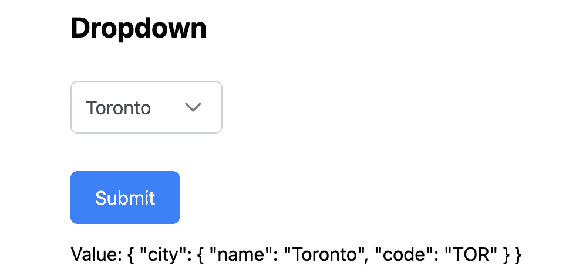

图 5.4 – 示例下拉组件

注意

当选项是简单的原始值，如字符串数组时，您不需要在组件中指定 `optionLabel` 和 `optionValue`。

下拉菜单组件包含了许多功能，使其灵活且适用于各种用例。让我们来看看这些选项。

### 筛选

下拉菜单组件的一个突出特点是它内置的筛选功能。此功能允许用户通过在下拉菜单中键入来缩小选项范围，使得在长列表中找到所需的选项变得更容易。要启用筛选，我们只需将 `filter` 属性设置为 `true`：

```js
<p-dropdown
   [options]="cities"
   ngModel
   optionLabel="name"
   name="cityWithFilter"
   [filter]="true"
/>
```

在将 `filter` 属性添加到下拉菜单组件后，您将拥有在下拉菜单中进行搜索的选项。在这里，我搜索了 `van`，显示了结果 **温哥华**：

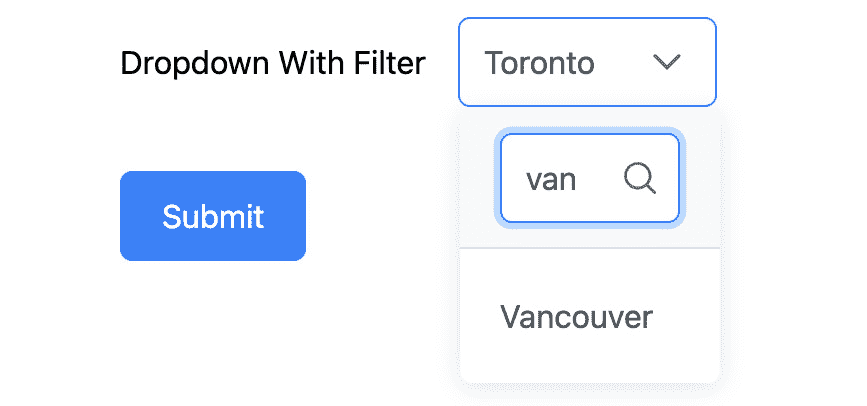

图 5.5 – 带筛选功能的下拉菜单

### 分组

为了更好地组织选项，Dropdown 组件支持分组。我们可以通过使用[group]属性将选项分组到某些类别下：

```js
groupedCities = [
   {
      label: 'Canada',
      value: 'ca',
      items: [
         { label: 'Vancouver', value: 'Vancouver' },
         { label: 'Toronto', value: 'Toronto' },
         { label: 'Montreal', value: 'Montreal' },
         { label: 'Ottawa', value: 'Ottawa' },
      ],
   },
   ...
]
...
<p-dropdown
   [options]="groupedCities"
   ngModel
   name="cityWithGroup"
   placeholder="Select a City"
   [group]="true"
>
   <ng-template let-group pTemplate="group">
      <div>
         <span class="pi pi-map-marker"></span>
         <span>{{ group.label }}</span>
      </div>
   </ng-template>
</p-dropdown>
```

在本例中，城市根据`groupedCities`数组中指定的属性进行分组。`ng-template let-group pTemplate="group"`代码定义了一个带有左侧地图制作图标的分组标题模板。让我们看看结果：

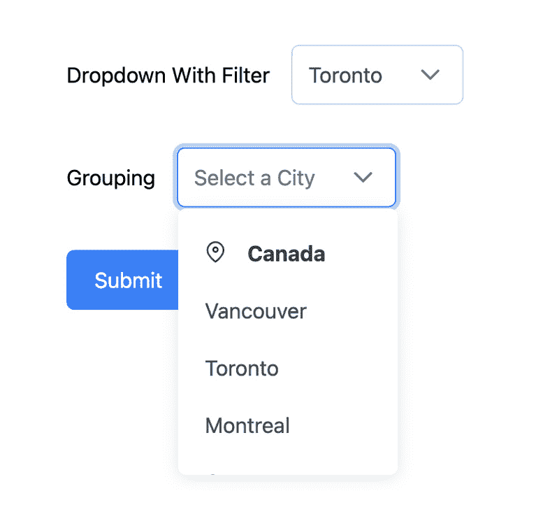

图 5.6 – 带有分组的示例下拉菜单

### 模板化

Dropdown 组件也支持模板化，这意味着我们可以自定义选项的显示方式。让我们看看以下示例：

```js
<p-dropdown
   [options]="cities"
   ngModel
   optionLabel="name"
   name="cityWithTemplate"
   [showClear]="true"
   placeholder="Select a City"
>
   <ng-template pTemplate="selectedItem">
      <div *ngIf="form.value.cityWithTemplate">
         <span class="pi pi-map-marker"></span>
         <span>{{ form.value.cityWithTemplate.name }}</span>
      </div>
   </ng-template>
   <ng-template let-city pTemplate="item">
      <div>
         <span class="pi pi-map-marker"></span>
         <span>{{ city.name }}</span>
      </div>
   </ng-template>
</p-dropdown>
```

在本例中，我们可以看到有两个`ng-template`元素用于支持我们如何样式化选项和所选值：

+   `<ng-template pTemplate="selectedItem">`：这定义了一个用于自定义下拉组件中选中项渲染的模板。它显示了模型中选中城市的`name`属性。

+   `<ng-template let-city pTemplate="item">`：这是选项列表中每个项目的模板。

让我们看看结果：

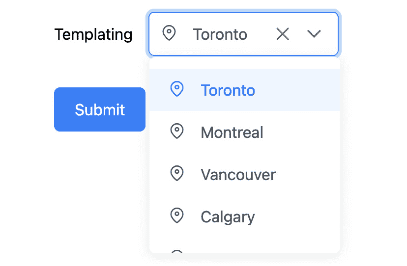

图 5.7 – 带有模板化的示例下拉菜单

我们可以通过左侧带有地图制作图标的方式来查看所选城市的样式。下拉菜单还具备使用组件中的`[showClear]="true"`选项清除所选项的能力。

### 处理事件

PrimeNG 的 Dropdown 组件提供了几个事件，开发者可以利用这些事件来增强其应用程序的功能性和交互性：

+   `onChange`：当下拉值发生变化时发出

+   `onFilter`：当下拉中的数据进行过滤时触发

+   `onFocus`：当下拉获得焦点时触发

+   `onBlur`：当下拉失去焦点时调用

+   `onClick`：当组件被点击时调用

+   `onShow`：当下拉菜单覆盖层变为可见时触发

+   `onHide`：当下拉覆盖层变为隐藏时触发

+   `onClear`：当下拉值被清除时调用

+   `onLazyLoad`：在懒加载模式下调用以加载数据

这里是一个示例，说明您如何使用 PrimeNG Dropdown 的`onChange`事件，当用户选择一个选项时：

```js
<p-dropdown
   [options]="cities"
   ngModel
   optionLabel="name"
   (onChange)="onCityChange($event.value)"
   name="cityWithEvents"
/>
...
onCityChange(value: { name: string; code: string }) {
   alert(`You have selected: ${value.name}`)
}
```

在本例中，每当所选城市发生变化时，都会调用`onCityChange`方法，并在浏览器中显示一个警告。

总结来说，PrimeNG 中的 Dropdown 组件是一个功能强大的工具，提供了从基本选择到高级功能如过滤、分组和模板化等一系列功能。在下一节中，我们将深入探讨 MultiSelect 组件。

注意

您可以使用 Dropdown 组件进行更多功能和配置。请访问[`primeng.org/dropdown`](https://primeng.org/dropdown)获取最新文档。

## MultiSelect

`MultiSelect` 组件是一种选择输入形式，允许用户从下拉列表中选择多个选项，这在需要提供选项列表并允许用户选择多个选项时非常有用。例如，在一个调查表中，你可能会要求用户选择他们精通的所有编程语言。在这种情况下，`MultiSelect` 组件是一个理想的选择。

要开始使用 PrimeNG 的 `MultiSelect` 组件，首先在你的组件中导入 `MultiSelectModule`：

```js
import { MultiSelectModule } from 'primeng/multiselect'
```

这里是一个使用模板驱动方法使用 `MultiSelect` 组件的基本示例：

```js
cities = [
   { name: 'Toronto', code: 'TOR' },
   { name: 'Montreal', code: 'MTL' },
   { name: 'Vancouver', code: 'VAN' },
   { name: 'Calgary', code: 'CGY' },
   { name: 'Ottawa', code: 'OTT' },
   { name: 'Edmonton', code: 'EDM' },
   { name: 'Quebec City', code: 'QUE' },
   { name: 'Winnipeg', code: 'WIN' },
   { name: 'Hamilton', code: 'HAM' },
   { name: 'Kitchener', code: 'KIT' },
]
...
<p-multiSelect
   [options]="cities"
   ngModel
   optionLabel="name"
   name="city"
/>
```

在代码片段中，`cities` 是一个选项数组，您希望将其显示在 `MultiSelect` 列表中，而 `optionLabel` 指示下拉列表显示每个选项的 `name` 属性作为标签。让我们看看结果：

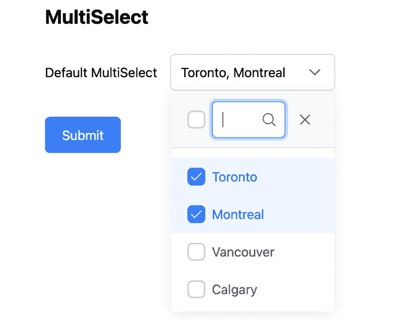

图 5.8 – MultiSelect 示例

在前面的屏幕截图中，我们有一个基本的 `MultiSelect` 组件，其中已选择 **多伦多** 和 **蒙特利尔**。

`MultiSelect` 组件具有一些功能，使其成为创建交互式表单的强大工具。让我们看看其中的一些。

### 过滤

`MultiSelect` 组件的一个突出特点是它内置的过滤功能，允许用户通过在搜索框中输入来缩小下拉列表中的选项。这在处理大量选项时特别有用，例如：

```js
<p-multiSelect [options]="cities" filter attribute to true, you enable the filtering feature. Now, when a user clicks on the MultiSelect box, they will see a search box at the top of the dropdown list.
			Grouping
			For better organization of options, the `MultiSelect` component also supports grouping. We can group options under certain categories by using the `[``group]` attribute:

```

groupedCities = [

{

标签: '加拿大',

值: 'ca',

项目: [

{ 标签: '温哥华', 值: '温哥华' },

{ 标签: '多伦多', 值: '多伦多' },

{ 标签: '蒙特利尔', 值: '蒙特利尔' },

{ 标签: '渥太华', 值: '渥太华' },

],

},

...

]

...

<p-multiSelect

[选项]="groupedCities"

[分组]="true"

ngModel

名称="cityWithGroup"

默认标签="选择一个城市"

<ng-template let-group pTemplate="group">

<div>

<span class="pi pi-map-marker"></span>

<span>{{ group.label }}</span>

</div>

</ng-template>

</p-multiSelect>

```js

			In this example, the cities are grouped according to a property specified in the `groupedCities` array. The code `ng-template let-group pTemplate="group"` defines a template for the group header with a map maker icon on the left. Let’s have a look at the result:
			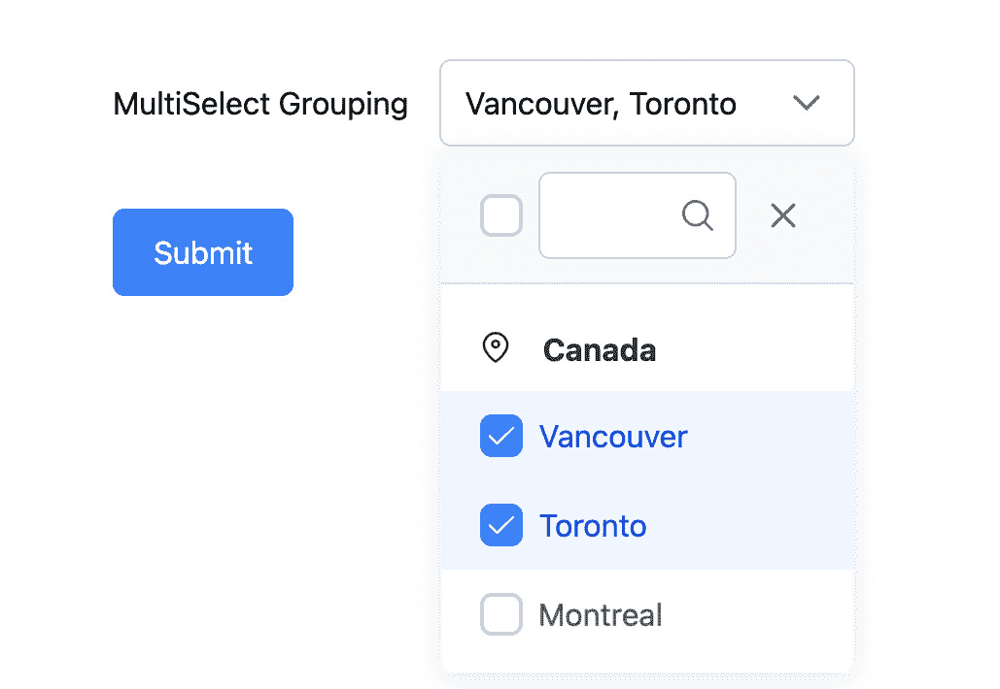

			Figure 5.9 – Sample MultiSelect with grouping
			Templating
			The `MultiSelect` component also supports templating, which allows you to customize the appearance of the options in the dropdown list and the selected items:

```

<p-multiSelect

[选项]="cities"

ngModel

默认标签="选择一个国家"

名称="cityWithTemplating"

选项标签="name"

<ng-template let-cities pTemplate="selectedItems">

<div *ngFor="let city of cities">

<span class="pi pi-map-marker"></span>

<span>{{ city.name }}</span>

</div>

<div *ngIf="cities?.length === 0">选择城市</div>

</ng-template>

<ng-template let-city pTemplate="item">

<div>

<span class="pi pi-map-marker"></span>

<span>{{ city.name }}</span>

</div>

</ng-template>

</p-multiSelect>

```js

			In this code snippet, we use the `ng-template` element to define a template for the items in the selection list. The `let-cities` attribute in `<ng-template let-cities pTemplate="selectedItems">` creates a local variable called `cities` that holds the current selected cities. The `<ng-template let-city pTemplate="item">` attribute tells PrimeNG to use this template for the items in the dropdown list.
			Note
			When checking the PrimeNG documentation, under the `MultiSelect` component, you can find the complete list here: [`primeng.org/multiselect#api.multiselect.templates`](https://primeng.org/multiselect#api.multiselect.templates).
			The PrimeNG `MultiSelect` component is a versatile tool that can enhance the user experience of your forms. In the next section, we will look into the `Calendar` component.
			Calendar
			PrimeNG **Calendar** is a date picker component that allows users to select dates, times, or both. It’s highly customizable, supporting various formats and modes such as inline, button, icon, and input styles.
			To get started with the PrimeNG `Calendar` component, first import `CalendarModule` in your component:

```

导入 { CalendarModule } 从 'primeng/calendar'

```js

			PrimeNG provides the `p-calendar` component for creating date pickers. Here’s a basic example:

```

<p-calendar ngModel 名称="calendar" />

```js

			In this example, `name="calendar"` is a form control in your form and will hold the selected date:
			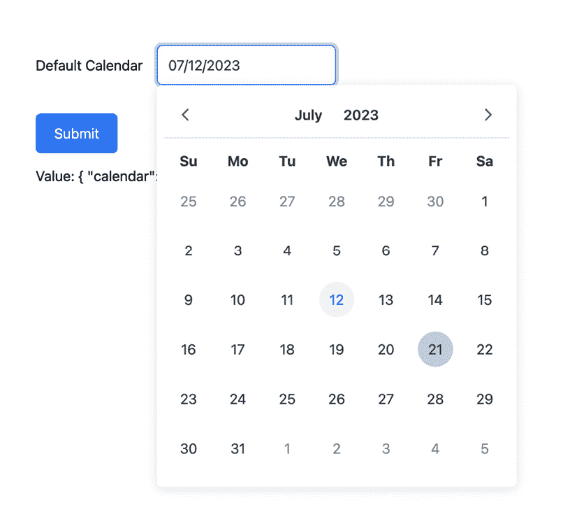

			Figure 5.10 – Sample calendar
			The PrimeNG Calendar component isn’t just a simple date picker. It has a wealth of advanced features that can cater to almost any requirement you might have.
			Format
			The selected date has the default format of `dd/mm/yyyy`. However, you can update the format of the selected date by using the `dateFormat` property. Here is the list of the available options for `dateFormat`:

				*   `d`: Day of month (no leading zero).
				*   `dd`: Day of month (two digits).
				*   `o`: Day of the year (no leading zeros).
				*   `oo`: Day of the year (three digits).
				*   `D`: Day name, short.
				*   `DD`: Day name, long.
				*   `m`: Month of year (no leading zero).
				*   `mm`: Month of year (two digits).
				*   `M`: Month name, short.
				*   `MM`: Month name, long.
				*   `y`: Year (two digits).
				*   `yy`: Year (four digits).
				*   `@`: Unix timestamp (milliseconds (ms) – since 01/01/1970).
				*   `!`: Windows ticks (100ns (nanoseconds) – since 01/01/0001).
				*   `'...'`: Literal text allows you to insert any text as it is in the date string. For example, `'Day: 'dd 'Month: 'MM 'Year: 'yy` will turn into `Day: 08 Month: August` `Year: 2023`.
				*   `''`: If you want to display a single quote within your date string, you must use two single quotes together, for example, `'Today''s date is 'dd/MM/yy` will turn into `Today's date` `is 08/August/2023`.
				*   Any other characters that are not recognized as part of the date format pattern will be treated as literal text and will be displayed as is. For example, if you use the format string `dd+MM+yy`, a date might display as `16+August+2023`.

			Here is an example of changing the format of the selected date:

```

<p-calendar

ngModel

名称="calendarWithFormat"

日期格式="dd-mm-yy"

/>

```js

			In this example, `dateFormat="dd-mm-yy"` indicates the new format of the selected date. Here is the result:

			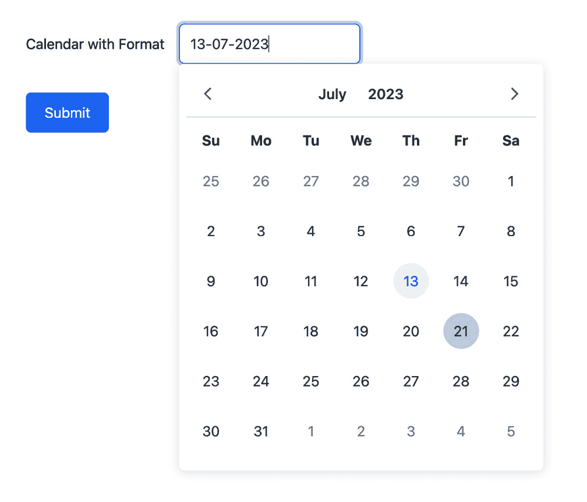

			Figure 5.11 – Sample calendar
			After selecting the date, you can see the format of the selected date changes to `13-07-2023`.
			Range selection
			To enable range selection in the PrimeNG Calendar component, you can use the `selectionMode` attribute along with the `ngModel` directive. The `selectionMode` attribute allows you to specify the mode of selection, including `"single"`, `"multiple"`, and `"range"`. Here’s how you can enable range selection:

```

<p-calendar

ngModel

名称="calendarDateRange"

选择模式="range"

/>

```js

			Here, `calendarDateRange` is an array that will hold the start and end dates of the selected range.
			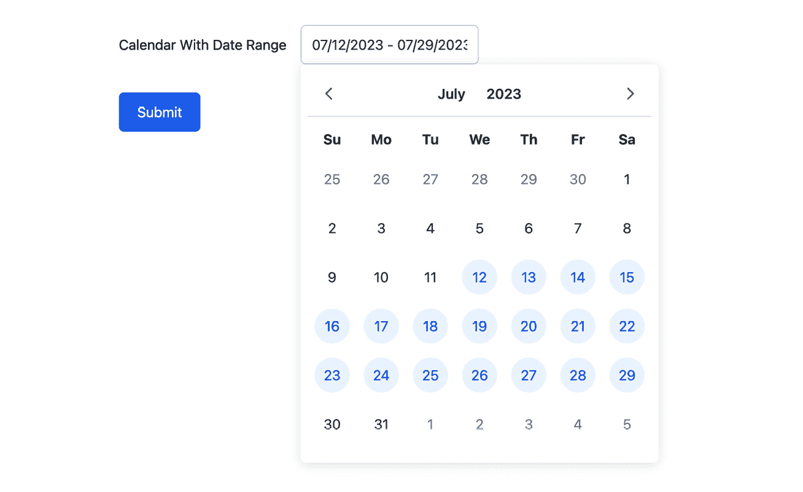

			Figure 5.12 – Sample calendar with date range
			PrimeNG Calendar is a powerful, flexible, and customizable date picker component for Angular applications. It also offers extensive customization options, allowing you to tailor its appearance and behavior to your needs.
			Note
			In this section, we’ve only scratched the surface of what the PrimeNG `Calendar` can do. We encourage you to explore its documentation to learn more about its features and capabilities: [`primeng.org/calendar`](https://primeng.org/calendar).
			In this section, we went through some important input components. In the next section, let’s go through validation and input handling techniques.
			Implementing form validation
			As we venture deeper into the realm of form controls, we come across a critical aspect of any form—**validation**. Ensuring the data entered by users is valid and as expected is paramount to maintaining data integrity and providing a seamless user experience. It’s not just about checking whether a field is empty or not; it’s about ensuring the data is in the right format, within certain limits, or meets any other criteria you set. In this section, we’ll explore how to implement form validation using Angular and PrimeNG.
			Understanding Angular form states
			Before diving into the details of Angular form validation, let’s first discuss some important concepts related to form validation. In Angular, a form is represented by the `FormGroup` class, which contains an organized collection of form controls such as input fields, checkboxes, and dropdowns.
			Angular form validation revolves around the state of the form controls. There are several states that a form control can have:

				*   `pristine`: A form control is considered pristine if the user hasn’t interacted with it yet. It means that the control’s value has not been changed since it was initialized.
				*   `dirty`: A form control becomes dirty once the user interacts with it and modifies its value.
				*   `touched`: A form control is marked as touched when the user focuses on it and then moves away, indicating that they have interacted with the control.
				*   `untouched`: The opposite of touched, an untouched form control means that the user hasn’t interacted with it yet. The difference between `pristine` and `untouched` is that `untouched` refers to a form control that has not been interacted with by the user, while `pristine` indicates a form control that has not been modified.
				*   `valid`: A form control is considered valid if it satisfies all the validation rules defined for it.
				*   `invalid`: If a form control fails to satisfy any of the validation rules, it is marked as invalid.

			These states play a crucial role in form validation, as they help determine the visual feedback to provide to the user and enable or disable form submission based on the validity of the form controls.
			Built-in Angular form validation
			Angular provides a set of built-in validators that cover common form validation scenarios. These validators can be used on form controls to ensure that the user input meets specific requirements. Here are a few examples:

				*   `required`: The `required` validator ensures that a form control has a non-empty value
				*   `minLength` and m`axLength`: These validators validate the minimum and maximum length of a form control’s value, respectively
				*   `pattern`: The `pattern` validator allows you to specify a regular expression pattern that the form control’s value must match

			To apply these validators to a form control, you need to associate them with the control in the component code. For example, if you have an input field for the user’s name that must be filled in and has a minimum length of four characters, you can define the form with validators like this (in a template-driven form):

```

<input

名称="first"

ngModel

必需

最小长度="4"

#name="ngModel"

/>

<ng-container *ngIf="name.invalid && (name.dirty || name.touched)">

<div *ngIf="name.errors?.['required']">

此字段是必需的

</div>

<div *ngIf="name.errors?.['minlength']">

名称长度必须至少为 4 个字符。

</div>

</ng-container>

```js

			Let’s break down the example:

				*   `required`: This indicates that the input must have a value before the form can be submitted.
				*   `minlength="4"`: This specifies that the input value must be at least four characters long.
				*   `#name="ngModel"`: This creates a local template variable called `name`. This allows us to access the properties and methods of the `NgModel` directive within the template.
				*   `*ngIf="name.invalid && (name.dirty || name.touched)"`: The `*ngIf` directive checks if the input is invalid (`name.invalid`) and if the input has been interacted with (`name.dirty` or `name.touched`). If both conditions are true, the content inside `<ng-container>` will be displayed.
				*   `*ngIf="name.errors?.['required']"`: This displays an error message if the input is missing a value (because of the `required` attribute).
				*   `*ngIf="name.errors?.['minlength']"`: This displays an error message if the input value is less than four characters long (because of the `minlength="4"` attribute).

			Now let’s look at validators in reactive forms:

```

contactForm = this.formBuilder.group({

name: ['', [Validators.required, Validators.minLength(4)]],

})

...

<input pInputText id="name" type="text" formControlName="name" />

<ng-container *ngIf="contactForm.controls.name as name">

<div *ngIf="name.dirty && name.hasError('required')">

This field is required

</div>

<div *ngIf="name.dirty && name.hasError('minlength')">

名称长度必须至少为 4 个字符。

</div>

</ng-container>

```js

			Let’s break down the code:

				*   `name: ['', [Validators.required, Validators.minLength(4)]]`: This initializes a form control called `name` with an empty string as its default value. The array that follows specifies the validation rules for this control:
    *   `Validators.required`: This validator ensures that the control has a non-empty value
    *   `Validators.minLength(4)`: This validator ensures that the control’s value is at least four characters long
				*   `*ngIf="contactForm.controls.name as name"`: This checks if the name control exists in `contactForm` and assigns it to a local template variable, `name`
				*   `*ngIf="name.dirty && name.hasError('required'):` This displays an error message if the `name` control has been interacted with (`name.dirty`) and if it’s missing a value (`name.hasError('required')`)
				*   `*ngIf="name.dirty && name.hasError('minlength')"`: This displays an error message if the `name` control has been interacted with and if its value is less than four characters long

			Based on the logic just explained, we can create the entire form with proper validation. *Figure 5**.13* shows a contact form with an invalid state:
			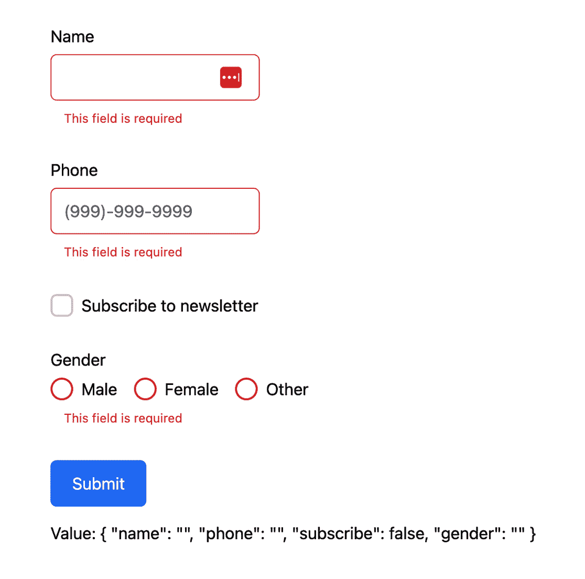

			Figure 5.13 – Sample form validation
			As we can see, the error state indicates that the form requires all of the fields to be filled out before the information can be submitted.
			Crafting custom form validation
			While Angular provides a range of built-in validators, there are times when we need to add something specific to our application. Thankfully, Angular allows us to create custom form validators.
			Here’s a simple example of creating a custom validator that checks whether the name is invalid or not:

```

import { AbstractControl, ValidationErrors, ValidatorFn } from '@angular/forms'

export const invalidNameValidator = (nameRe: RegExp): ValidatorFn => {

return (control: AbstractControl): ValidationErrors | null => {

const invalid = nameRe.test(control.value)

return invalid ? { invalidName: { value: control.value } } : null

}

}

```js

			In the code example, the main function, `invalidNameValidator`, takes a regular expression (`nameRe`) as its argument and returns a custom validator function. This custom validator function checks whether a form control’s value matches the provided regular expression. If the value doesn’t match the pattern, meaning that it’s valid, the function returns `null`, indicating that there are no validation errors.
			Note
			Custom validators return a key-value pair if the validation fails. The key is a string of your choosing that describes the error, and the value is the value of the control.
			To use this validator, we just need to add it to the existing validators:

```

contactForm = this.formBuilder.group({

name: [

'',

[

Validators.required,

Validators.minLength(4),

// 自定义验证器

invalidNameValidator(/test/i),

],

],

...

})

----

<div *ngIf="name.dirty && name.hasError('invalidName')">

名称不能为 "{{ name.errors?.['invalidName'].value }}".

</div>

```js

			Here is the code breakdown:

				*   `invalidNameValidator(/test/i)`: This is a custom validator (as we discussed in the previous section). It checks whether the form control’s value matches the regular expression `/test/i`. If the value matches, the validator will flag it as invalid.
				*   `*ngIf="name.dirty && name.hasError('invalidName')"`: This displays an error message if the `name` control has been interacted with and if the name is invalid.

			Let’s look at the result:
			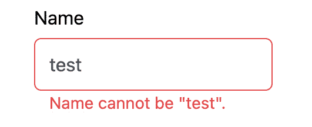

			Figure 5.14 – Custom form validation
			PrimeNG and form validation
			PrimeNG complements Angular’s form validation by providing visual feedback for validation errors. It includes a variety of CSS classes that can be used to highlight invalid fields and display error messages.
			Here’s an example of how to use PrimeNG to display validation errors:

```

<label for="name">名称</label>

<input pInputText id="name" type="text" formControlName="name" />

<ng-container *ngIf="contactForm.controls.name as name">

<small

class="p-error"

ngIf="name.dirty && name.hasError('required')"

此字段为必填项

</small>

<small

class="p-error"

ngIf="name.dirty && name.hasError('minlength')"

名称太短

</small>

</ng-container>

```js

			In this example, if the `name` field is invalid and `dirty`, the `p-error` class is added to the field, and the error message is displayed.
			Form validation is a critical aspect of any application that involves user input. It helps ensure data integrity and enhances the user experience. Angular provides robust support for form validation, and PrimeNG complements this by providing visual feedback for validation errors.
			In this section, we’ve explored how to implement form validation using Angular and PrimeNG. However, this is just the tip of the iceberg. Both Angular and PrimeNG offer a wealth of features for form validation that can cater to almost any requirement We encourage you to explore Angular documentation to learn more: [`angular.io/guide/form-validation`](https://angular.io/guide/form-validation)
			Summary
			In this chapter, we delved into the world of input components and form controls, exploring their usage in Angular applications with PrimeNG. We started by understanding their importance in building interactive applications, setting the foundation for the practical aspects that followed.
			We then navigated through the implementation of basic form controls such as text inputs, checkboxes, and radio buttons, and moved on to more complex ones such as dropdowns, multi-selects, and date pickers. Each section was enriched with code examples, demonstrating the integration of these components into our applications.
			Toward the end, we tackled the crucial topic of form validation. We emphasized the importance of validating user input for enhancing user experience and ensuring data integrity, guiding you through the process with Angular and PrimeNG.
			As we look forward to the next chapter, on data tables and other displaying components, remember that the knowledge gained here is vital for any web developer. Form controls are fundamental to web applications, and understanding their effective use is key to creating user-friendly applications.

```
