# 第九章：使用主题定制 PrimeNG 组件

每个应用程序都有自己的独特身份，其视觉吸引力在定义该身份方面发挥着重要作用。虽然功能至关重要，但应用程序的外观和感觉可以显著影响用户体验。PrimeNG 提供了一个强大的主题系统，允许您定制组件的外观，确保应用程序不仅运行良好，而且看起来也符合要求。

在本章中，您将探索使用主题在 Angular 应用程序中定制 PrimeNG 组件外观的过程。通过掌握这些技术，您将能够根据应用程序的独特品牌和设计要求定制 PrimeNG 组件的视觉表现。

我们还将深入探讨各种主题，如使用预构建主题、创建自定义主题、利用主题设计工具以及覆盖组件样式。您将发现 PrimeNG 主题的强大和灵活性，并学习如何实现统一且个性化的用户界面。

本章将涵盖以下主题：

+   介绍 PrimeNG 主题

+   使用预构建主题

+   创建您自己的自定义主题

+   覆盖组件样式和其他技巧

# 技术要求

本章包含有关 PrimeNG 主题的各种工作代码示例。您可以在以下 GitHub 仓库的`chapter-09`文件夹中找到相关源代码：[`github.com/PacktPublishing/Next-Level-UI-Development-with-PrimeNG/tree/main/apps/chapter-09`](https://github.com/PacktPublishing/Next-Level-UI-Development-with-PrimeNG/tree/main/apps/chapter-09)。

# 介绍 PrimeNG 主题

**主题**在创建视觉吸引力和一致的用户界面中起着至关重要的作用，允许您根据应用程序的品牌和设计要求自定义组件的外观。PrimeNG 提供了一个全面的主题系统，使您能够创建个性化的统一用户界面。

虽然 PrimeNG 主题不仅仅是改变颜色或字体，但它涉及修改组件外观的各个方面，如颜色、字体、间距和其他设计元素。PrimeNG 提供了一系列的工具、资源和指南，以简化主题过程，使开发者能够创建独特且视觉上吸引人的用户界面。

根据应用程序的具体要求，PrimeNG 主题被用于各种场景。以下是一些 PrimeNG 主题证明非常有价值的使用案例：

+   **品牌和定制**：当您需要将 PrimeNG 组件的外观与您应用程序的品牌指南保持一致时，主题允许您创建一致且个性化的外观和感觉。

+   **应用特定设计**：在某些情况下，PrimeNG 组件的默认样式可能不符合您应用程序特定的设计要求。主题化使您能够修改组件的外观，以匹配您应用程序的视觉设计语言，确保用户界面的一致性和和谐。

+   **一致的样式**：在构建由多个开发者或团队参与的大型应用程序时，主题化确保了不同组件之间的视觉样式一致性。通过遵循统一的主题化方法，您可以在整个应用程序中保持一致的用户体验。

在掌握了 PrimeNG 主题的基础知识后，是时候深入了解实际方面了。快速启动主题之旅的最快方法之一是利用 PrimeNG 丰富的预建主题，我们将在下一节中探讨。

# 使用预建主题

PrimeNG **预建主题**是一系列预定义的样式表，定义了 PrimeNG 组件的视觉外观。这些主题基于流行的设计框架，如 Bootstrap 和 Material Design，并附带一系列颜色方案和变体。每个主题都为所有 PrimeNG 组件提供一致的样式，确保您的应用程序具有一致和精致的外观。

预建主题作为 `npm` 分发的一部分随 PrimeNG 一起提供，易于导入，并且可以通过几个简单的步骤应用到您的应用程序中。这些主题也高度可定制，允许您根据项目需求调整颜色、字体和其他视觉属性。

## 何时使用 PrimeNG 预建主题

虽然定制化提供了独特的身份，但在某些情况下，预建主题确实可以挽救局面：

+   **快速原型设计**：当您处于应用程序开发的初期阶段，需要快速设计来可视化功能时

+   **一致的设计语言**：对于需要跨多个应用程序或模块保持一致设计的项目

+   **减少开发时间**：当项目时间表紧张，没有时间进行广泛的设计迭代时

## PrimeNG 预建主题示例

在前面的章节中，我们有机会使用 PrimeNG 主题。在本章中，让我们回顾一下如何将 PrimeNG 主题集成到我们的 Angular 应用程序中。

要使用预建主题，只需将其导入到您的项目中即可。让我们看看如何：

1.  导航到 PrimeNG 内置主题（[`primeng.org/theming#builtinthemes`](https://primeng.org/theming#builtinthemes)），并选择与您的项目氛围产生共鸣的主题。

1.  一旦您选择了主题，将其集成到您的项目中。例如，如果您选择了 `lara-light-blue` 主题，请将以下行添加到 `styles.scss` 或 `styles.css`：

    ```js
    //styles.scss
    @import 'primeng/resources/themes/lara-light-blue/theme.css';
    @import 'primeng/resources/primeng.css';
    ```

    这个导入语句确保了 `lara-light-blue` 主题中定义的样式被应用到你的应用程序中。一旦主题被导入，所有 PrimeNG 组件将自动采用主题定义的样式。

1.  接下来，你可以在应用程序中使用 PrimeNG 组件，例如 `p-button`、`p-card` 和 `p-table` 组件。这些组件将继承预构建主题定义的样式，使它们具有一致且视觉上吸引人的外观。

注意

你的应用程序可能有自定义字体或样式。始终确保主题的 CSS 在默认 PrimeNG CSS 之后加载，以确保主题样式具有优先权。

我们已经探讨了 PrimeNG 预构建主题的便利性，它们提供了大量视觉上吸引人的样式。现在，让我们深入探讨切换主题的话题，我们将学习如何无缝地在不同的 PrimeNG 主题之间切换，以满足我们应用程序的设计需求和偏好。

## 切换主题

PrimeNG 预构建主题的一个关键优势是你可以即时切换到不同的主题。这个特性允许你的应用程序用户选择他们偏好的主题，为他们提供个性化的可定制体验。

要切换主题，通常需要替换项目中主题 CSS 文件的引用。例如，如果你目前使用的是 `lara-blue-light` 主题，并希望切换到 `bootstrap4-light-purple` 主题，你将在 `index.html` 文件中替换 CSS 文件引用。

这里是如何一步步操作的指南：

1.  为了切换主题，你需要将所有主题准备在 `assets` 文件夹中。你可以在 `node_modules/primeng/resources/themes` 文件夹下找到内置 PrimeNG 主题的完整列表：

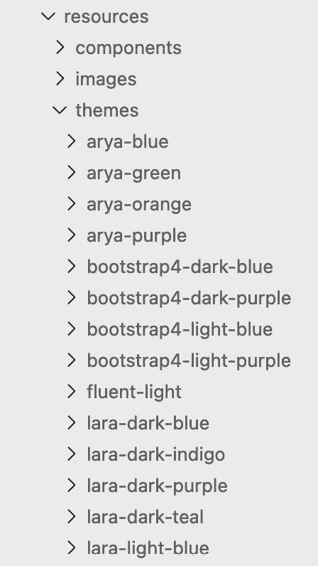

图 9.1 – PrimeNG 内置主题

之后，你可以将你想要在应用程序中使用的主题复制到你的 `assets` 文件夹中：

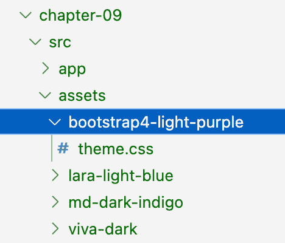

图 9.2 – 复制的内置主题

在这个例子中，我将四个内置主题复制到我们的应用程序中：`bootstrap4-light-blue`、`lara-light-blue`、`md-dark-indigo` 和 `viva-dark`。

1.  将你的默认主题引用添加到 `index.html` 文件中。因此，你将不再在 `style.scss` 文件中设置默认值，而是在 `index.html` 文件中设置：

    ```js
    <!DOCTYPE html>
    <html lang="en">
      <head>
        <meta charset="utf-8" />
        <title>chapter-09</title>
        <base href="/" />
        <meta name="viewport" content="width=device-width, initial-scale=1" />
        <link rel="icon" type="image/x-icon" href="favicon.ico" />
        <link
          id="theme-link"
          rel="stylesheet"
          type="text/css"
          href="assets/lara-light-blue/theme.css"
        />
      </head>
      <body>
        <primengbook-root />
      </body>
    </html>
    ```

    在这段代码中，我们添加了对 `lara-light-blue` 主题的 `theme-link` ID 的引用。

1.  现在，是时候给我们的组件添加切换主题的功能了。以下是代码：

    ```js
    <div class="flex align-items-center" *ngFor="let theme of themes">
      <p-radioButton
        [name]="theme.name"
        [value]="theme.value"
        [(ngModel)]="selectedTheme"
        inputId="{{ theme.value }}"
        (onClick)="changeTheme()"
      />
      <label for="{{ theme.value }}" class="ml-2">{{ theme.name }}</label>
    </div>
    ...
    themes = [
      { name: 'Lara Light Blue', value: 'lara-light-blue' },
      { name: 'Bootstrap4 Light Purple', value: 'bootstrap4-light-purple' },
      { name: 'Viva Dark', value: 'viva-dark' },
      { name: 'Material Dark Indigo', value: 'md-dark-indigo' },
    ]
    selectedTheme = 'lara-light-blue'
    changeTheme() {
      const themeLink = document.getElementById('theme-link')
      themeLink?.setAttribute('href', `assets/${this.selectedTheme}/theme.css`)
    }
    ```

    让我们分解一下代码：

    +   `<div class="flex align-items-center" *ngFor="let theme of themes">`: 这段代码使用 `ngFor` 指令遍历 `themes` 数组。对于数组中的每个主题，它使用 `p-radioButton` 组件创建一个单选按钮输入。

    +   `themes = [...]`：这定义了 `themes` 数组，它包含代表不同主题的对象。每个主题对象都有一个 `name` 属性，表示主题的显示名称，以及一个 `value` 属性，表示主题的唯一标识符。

    +   `selectedTheme`：这表示最初选择的主题值。

    +   `changeTheme() {...}`：当点击单选按钮时调用此方法。它检索具有 `theme-link` ID 的 `link` 元素。之后，它将 `link` 元素的 `href` 属性更新为指向所选主题的 CSS 文件。

让我们看看结果：

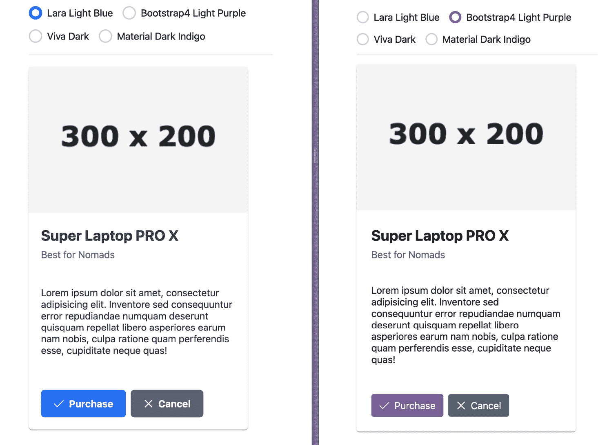

图 9.3 – 切换主题

我们已经设置了一个主题切换器，允许用户使用单选按钮选择主题。当点击单选按钮时，我们将能够切换到所需的主题。您可以看到，在左侧我们正在使用 `Lara Light Blue` 主题，而在右侧，我们正在使用 `Bootstrap4 Light Purple`，这将给我们的用户带来不同的体验。

通常，在 PrimeNG 中使用预构建主题为您提供了方便且高效的方式来设计应用程序。在下一节中，我们将探讨在 PrimeNG 中创建自定义主题的过程，让您能够打造真正个性化且独特的用户体验。

# 创建您自己的自定义主题

虽然 PrimeNG 提供了大量的预构建主题，但可能存在一些情况，您希望拥有一个独特的外观和感觉，更紧密地与您的品牌或特定的设计要求相匹配。这就是自定义主题发挥作用的地方。这些主题允许您根据您的确切规格定制 PrimeNG 组件的外观。

## 什么是 PrimeNG 自定义主题？

PrimeNG 中的**自定义主题**本质上是一组 CSS 样式，它覆盖了 PrimeNG 组件的默认样式。通过创建自定义主题，您有灵活性来定义颜色、字体、间距和其他设计元素，这些元素与您的品牌身份或项目的特定设计语言相匹配。

## 何时使用 PrimeNG 自定义主题？

自定义主题在以下情况下特别有益：

+   您正在构建一个品牌应用程序，其视觉身份需要与其他品牌数字资产保持一致

+   预构建主题与您项目的特定设计要求不匹配

+   您的目标是创建一个独特的用户界面，使其与众不同于典型应用

+   需要遵守特定的可访问性指南，这些指南可能不在默认主题中涵盖

## 如何创建 PrimeNG 自定义主题

创建 PrimeNG 自定义主题可能听起来有些令人畏惧，但有了 PrimeNG 的结构，它相当简单。您有三个选择，每个选择都提供其自身的优点和灵活性。让我们深入了解每个选项：

+   **视觉编辑器**：视觉编辑器是 PrimeNG 提供的一个用户友好的工具，允许您直观地自定义和设计您的主题

+   **命令行 Sass 编译**：如果你更喜欢更手动的方法，你可以选择使用命令行 Sass 工具来编译你的主题

+   **在项目中嵌入 SCSS 文件**：第三种选择是将 SCSS 文件直接嵌入到你的项目目录结构中

注意

截至本书发布时，视觉编辑器目前处于禁用状态。然而，有一个好消息——PrimeTek 团队已经决定开源设计师，使其免费可用。这一激动人心的开发的预期发布时间定于 2024 年第一季度。有关最新信息，请访问官方 PrimeTek 网站。

在所有三种选项中，将生成的主题文件导入到你的项目中至关重要。这确保了自定义主题被正确应用于 PrimeNG 组件，让你能够享受到个性化视觉风格的好处。

选择与你的偏好和项目要求最匹配的选项，开始为你的 PrimeNG 应用程序创建独特且视觉吸引人的主题之旅。

## 通过视觉编辑器创建自定义主题

PrimeNG 的主题世界随着**视觉编辑器**的引入而发生了革命性的变化。你再也不需要深入到 Sass 或 CSS 的代码行中去，以获得组件的完美外观。使用视觉编辑器，创建一个自定义主题就像拖动滑块或从调色板中选择颜色一样直观。

通过其直观的界面，你可以修改主题的各个方面，如颜色、字体、间距等。视觉编辑器提供实时预览，使你在自定义主题时能够轻松看到变化。一旦你对修改满意，你可以导出主题文件，该文件可以直接导入到你的项目中。

使用视觉编辑器创建自定义主题非常简单。以下是一个逐步指南：

1.  导航到 PrimeNG 主题页面并启动视觉编辑器。

1.  从与你期望的外观最接近的预构建主题开始。这为你提供了一个基础，你可以在此基础上进行进一步的定制。在这个例子中，我将选择`lara-light`主题。

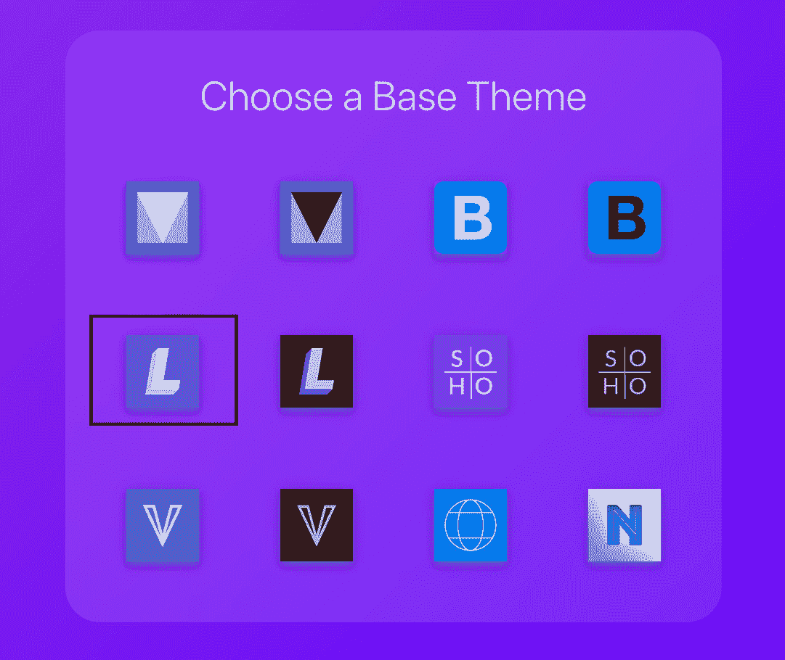

图 9.4 – 选择基本主题

1.  使用视觉编辑器的直观控件来调整颜色、字体和其他设计元素。随着你的更改，你将看到组件的实时预览。

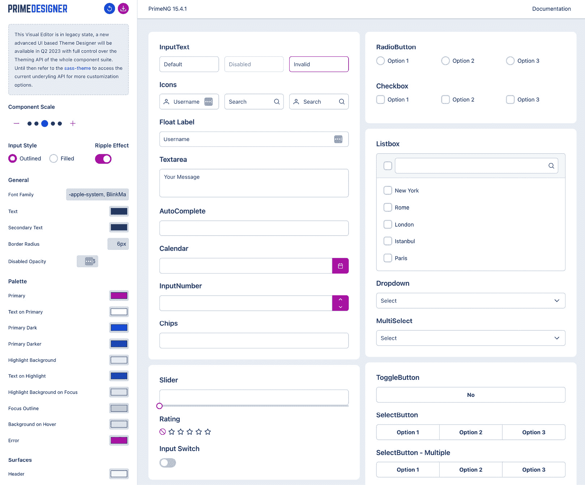

图 9.5 – 定制你的主题

在左侧面板中，你可以修改基本主题。有许多选项供你自定义。

注意

在撰写本书时，当前的视觉编辑器被认为处于遗留状态。一个基于新先进 UI 的 Theme Designer 将很快发布。

1.  一旦你对自定义主题满意，只需导出它即可。视觉编辑器将为你生成所有必要的 CSS 文件。

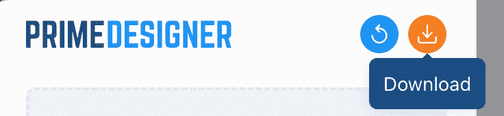

图 9.6 – 下载您的自定义主题

在完成自定义后，您可以通过点击名为`Download`的文件夹来开始下载您的自定义主题`theme.css`。

1.  下载导出的文件后，您可以将它们包含到您的 Angular 项目中。请确保它们在默认 PrimeNG 样式之后加载，以确保您的自定义设置优先。

    如果您的应用程序中只有一个主题，您可以直接将其放入`styles.scss`文件或`index.html`中：

    ```js
    // styles.scss
    @import 'assets/my-awesome-theme/theme.css';
    ```

这里是结果：

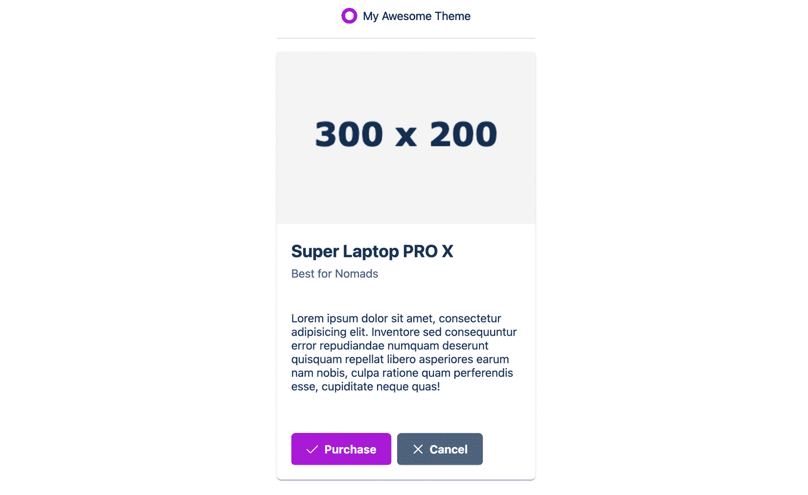

图 9.7 – 应用您的自定义主题

现在，您的应用程序已经具有了您自定义主题的期望外观和感觉。

## 通过 Sass 编译创建自定义主题

第二种方法，使用 Sass 编译，让您完全控制主题自定义过程。您可以手动编辑主题的 SCSS 文件，调整变量以实现所需的视觉风格。一旦您进行了必要的修改，您可以使用命令行 Sass 编译器生成 CSS 输出。然后，可以将编译后的 CSS 文件导入到您的项目中，确保您的自定义主题应用于 PrimeNG 组件。

这里是如何操作的：

1.  从 GitHub 克隆`primeng-sass-theme`仓库：

    ```js
    git clone https://github.com/primefaces/primeng-sass-theme.git
    ```

1.  安装 NPM 包：

    ```js
    cd primeng-sass-theme
    npm install
    ```

1.  在安装必要的包后，我们可以在`themes` | `mytheme`目录下找到所有的 SCSS 文件：

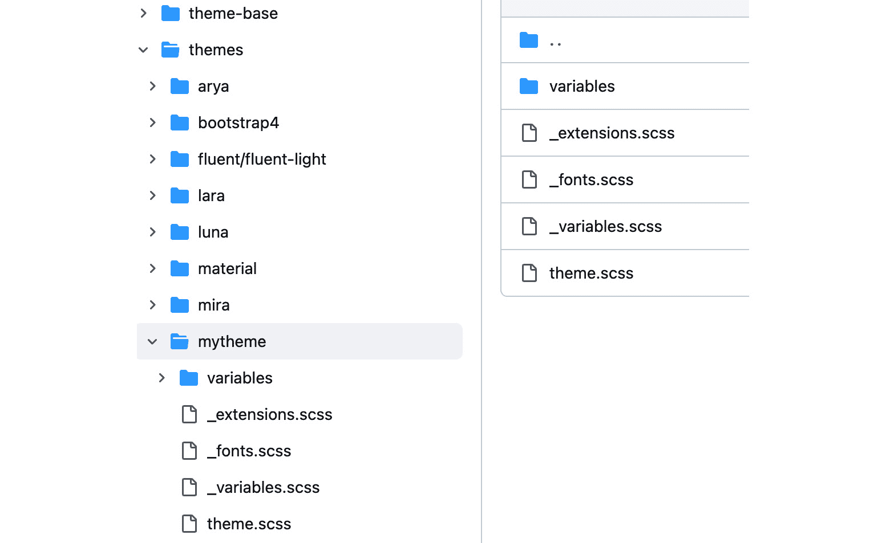

图 9.8 – mytheme 文件夹

在`mytheme`文件夹下，您有几个选项来自定义您的自定义主题：

+   `variables`：您可以在该文件夹下自定义 CSS 变量，更改按钮背景、主要文本颜色、边框半径等

+   `_extension.scss`：如果您想覆盖组件设计，请更新此文件

+   `_font.scss`：这是您可以定义项目自定义字体的地方

+   `theme.scss`：此文件导入主题文件，以及`theme-base`文件夹，以便将所有内容合并

1.  在对您的自定义主题进行更改后，通过运行以下命令来编译您的更改：

    ```js
    sass --update themes/mytheme/theme.scss:themes/mytheme/theme.css
    [2023-09-17 14:33:46] Compiled themes/mytheme/theme.scss to themes/mytheme/theme.css.
    ```

您可以看到，在编译后，我们在`mytheme`文件夹下创建了一个`theme.css`文件，现在可以将其添加到我们的项目中。

## 通过嵌入 SCSS 文件创建自定义主题

这种第三种方法允许您将主题自定义无缝集成到现有的构建环境中。通过将主题 SCSS 文件放置在项目中的指定位置，例如`assets`或`styles`文件夹，您可以在构建过程中利用您的构建工具自动将 SCSS 文件编译成 CSS。

这里是步骤：

1.  将`mytheme`和`theme-base`文件夹复制到我们的`assets`文件夹。此选项使您能够结合 Angular CLI 默认流程。

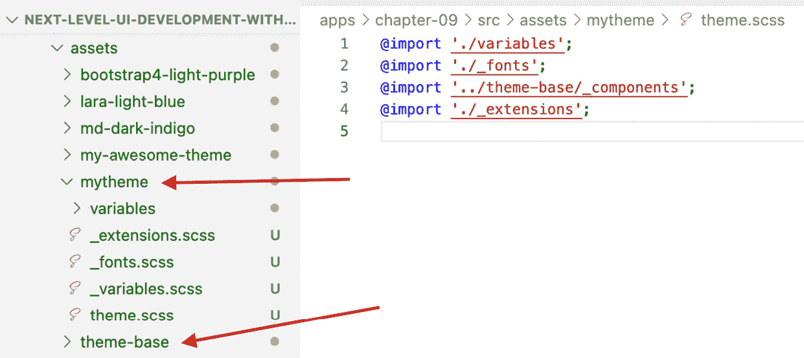

图 9.9 – Angular 项目中的 mytheme

1.  然后，我们只需要从 `mytheme` 导入 `theme.scss` 到 `styles.scss`：

    ```js
    @import 'assets/mytheme/theme.scss';
    ```

1.  最后，当我们修改 `mytheme` 下的任何内容时，Angular CLI 会为我们自然地处理编译，无需任何手动工作。

在掌握 PrimeNG 主题化的旅程中，我们看到了创建自定义主题方法的强大功能和灵活性，使主题定制变得简单且愉快。现在，让我们将重点转移到覆盖组件样式和其他高级样式技术，以真正使我们的 UI 独具特色。

# 覆盖组件样式和其他技巧

虽然 PrimeNG 提供了大量的主题和定制选项，但总会有一些场景需要我们调整某些样式以适应我们应用程序的独特需求。本节将指导您通过覆盖组件样式的流程，并分享一些额外的技巧和窍门来增强您的主题体验。

## 如何覆盖组件样式

在 PrimeNG 中覆盖组件样式与样式任何其他 Angular 组件类似。关键是理解您想要样式的组件的结构并使用特定的 CSS 选择器。以下是我们的做法：

1.  **检查组件**：在您覆盖样式之前，您需要知道您正在针对什么。使用您浏览器的开发者工具检查组件并了解其结构。以下是检查浏览器的一个示例：

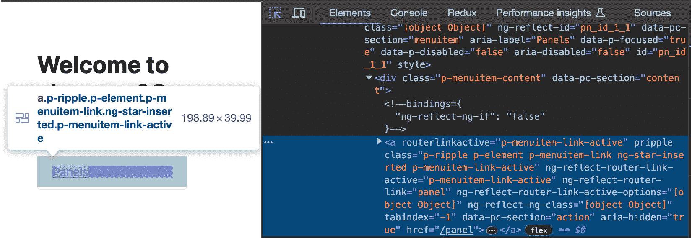

图 9.10 – 浏览器检查示例

在提供的屏幕截图中，您可以观察到位于左侧的 **Panels** 菜单的详细 HTML 元素结构。

1.  `p-menuitem-link-active` 类，允许您选择性地应用 CSS 样式到它上。

1.  `styles.scss` 以将样式应用到您的组件上。例如，为了给活动的路由链接添加下划线，您可以在 `style.scss` 中添加以下 CSS：

    ```js
    .p-menu .p-menuitem-link.p-menuitem-link-active {
      text-decoration: underline;
    }
    ```

1.  `::ng-deep` 伪类确保样式渗透到子组件中。这在尝试样式化 PrimeNG 组件的内部部分时特别有用。以下是一个示例：

    ```js
    :host ::ng-deep my-component .p-button {
        background-color: #333;
        color: #fff;
    }
    ```

    在此示例中，我们可以在我们的组件中覆盖 PrimeNG 按钮的样式，这使得定位和维护变得更加容易。这些更改仅将不同的颜色和背景颜色应用到我们的按钮上，使其与您的应用程序中的其他按钮区分开来。

注意

Angular 团队决定在 Angular 的未来版本中弃用 `::ng-deep`，因此请谨慎使用。您可以在 [`angular.io/guide/component-styles#deprecated-deep--and-ng-deep`](https://angular.io/guide/component-styles#deprecated-deep--and-ng-deep) 找到更多相关信息。

注意

避免使用 `!important`。虽然使用 `!important` 来强制样式可能很有吸引力，但我们应避免这种做法。它会使未来的更改变得困难，并可能导致不可预测的结果。

## 使用 PrimeNG 公共工具

PrimeNG **Utils** 是 PrimeNG 提供的一组实用类，用于帮助您完成常见的样式任务。这些实用类提供了一种快速将特定样式或行为应用于元素的方法，而无需编写自定义 CSS。以下是一些 PrimeNG utils 的简要概述：

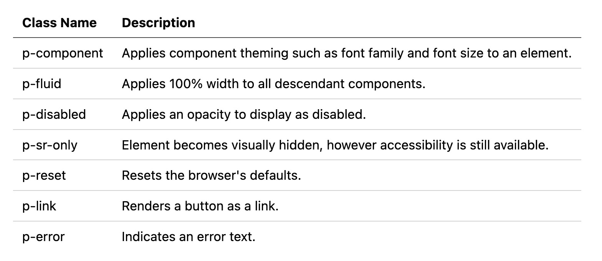

图 9.11 – 常见的 PrimeNG 工具类

## 使用 PrimeNG CSS 变量

在现代网络开发中，CSS 变量（也称为 CSS 自定义属性）已成为创建更灵活和可维护的样式表的有力工具。PrimeNG 通过提供一组定义颜色的 CSS 变量来利用这种力量，这使得您更容易自定义应用程序的主题。

PrimeNG 的颜色系统是基于一组预定义的 CSS 变量构建的。这些变量代表了一系列颜色，从主色和辅助色到各种色调和色调。通过利用这些变量，您可以在整个应用程序中确保颜色使用的统一性，并轻松地根据需要调整外观。

例如，PrimeNG 定义了如 `--primary-color` 这样的主颜色以及如 `--primary-color-text` 这样的主颜色文本。这只是冰山一角，因为还有用于文本颜色、表面和突出显示等变量的变量。

注意

有关颜色变量的完整列表，请访问 [`primeng.org/colors`](https://primeng.org/colors)。

使用这些颜色变量很简单。您不需要在样式表中硬编码颜色值，而是引用 PrimeNG 颜色变量。这不仅确保了一致性，还使得未来的颜色更改变得容易。

以下是一个简单的示例：

```js
.my-custom-button {
    background-color: var(--primary-color);
    border-radius: var(--border-radius);
}
```

在代码中，按钮的背景颜色设置为 PrimeNG 的 `--primary-color`，边框半径设置为 `--border-radius`。如果您将来决定更改主颜色或边框半径，按钮的外观将自动更新，无需修改 `.my-custom-button` 样式。

### 自定义 PrimeNG 颜色变量

CSS 变量的一个主要优点是它们可以被覆盖。如果您希望自定义 PrimeNG 提供的默认颜色，您可以通过在样式表中重新定义变量轻松地做到这一点。

例如，以下是更改主颜色的方法：

```js
// styles.scss
:root {
    --primary-color: #3498db; /* Your desired color */
}
```

通过在根级别设置，您实际上更改了所有使用 `--primary-color` 变量的组件和元素的主颜色。

## 其他技巧和窍门

在本节中，我们将了解一些有价值的技巧、技术和最佳实践，这些将在使用主题时非常有帮助：

+   **全局样式**：如果您想在应用程序中全局应用样式，您可以在全局 CSS 文件中定义它们，并将其包含在您的应用程序中。这样，您可以自定义诸如排版、颜色和布局等常见元素。

+   **保持更新**：PrimeNG 正在积极开发。新版本可能会引入变化。始终检查文档并相应地更新你的样式。

+   **使用基础主题**：在开始一个新项目时，考虑使用预构建的主题作为基础。它为你提供了一个坚实的基础，然后你可以根据需要覆盖特定的部分。你可以查看内置主题的列表：[`primeng.org/theming#builtinthemes`](https://primeng.org/theming#builtinthemes)。

+   `theme-base`:

    ```js
    .p-button {
      ...
        &:enabled:hover {
            ...
            border-color: $buttonHoverBorderColor;
        }
    }
    ```

    从代码中，你可以看到当按钮被悬停时，按钮使用了`$buttonHoverBorderColor`变量来设置边框颜色。这个变量在`mytheme`下的`variables/_button.scss`中声明：

    ```js
    /// Border color of a button in hover state
    /// @group button
    $buttonHoverBorderColor: $primaryDarkColor;
    ```

    当在`_button.scss`中更新`$buttonHoverBorderColor`的值时，它将反映在所有使用此`$buttonHoverBorderColor`变量的组件中，例如按钮悬停状态。

注意

提供的按钮组件变量示例只是一个小子集。更多信息和与按钮相关的完整代码，你可以查看以下链接：[`github.com/primefaces/primeng-sass-theme/blob/main/theme-base/components/button/_button.scss`](https://github.com/primefaces/primeng-sass-theme/blob/main/theme-base/components/button/_button.scss) 和 [`github.com/primefaces/primeng-sass-theme/blob/main/themes/mytheme/variables/_button.scss`](https://github.com/primefaces/primeng-sass-theme/blob/main/themes/mytheme/variables/_button.scss)。

+   **跨浏览器测试**：始终在不同的浏览器中测试你的样式以确保一致性。某些组件可能有浏览器特定的样式。

简而言之，最重要的是要跟上 PrimeNG 和 Angular 团队的变化。如果我们能利用最新的实践来改进我们的应用程序，这将是有益的。现在，让我们总结本章涵盖的关键点，并反思重要的收获。

# 摘要

在本章中，我们深入探讨了 PrimeNG 主题的世界，从理解 PrimeNG 主题的基础到掌握定制组件以适应我们独特需求的艺术。

我们首先介绍了 PrimeNG 主题的概念，强调了它在创建统一且视觉上吸引人的 Angular 应用程序中的重要性。通过利用 PrimeNG 的主题功能，我们可以确保应用程序的一致外观和感觉，从而提升用户体验。

我们随后探索了 PrimeNG 提供的丰富多样的预构建主题。这些主题从浅色到深色，应有尽有，提供了一种快速简单的方式，让我们的应用程序看起来专业，无需进行大量定制。在预构建选项之外，我们学习了如何使用可视化编辑器创建自己的自定义主题。这个强大的工具允许我们调整应用程序外观的每一个细节，确保它与我们的品牌或期望的美学完美契合。

随着我们不断进步，我们讨论了覆盖组件样式和 PrimeNG 提供的实用类的重要性。这些工具为我们提供了调整应用程序外观的灵活性，确保每一个细节都恰到好处。主题化不仅仅是让应用程序“看起来漂亮”。它关乎创造一个一致、直观且引人入胜的用户体验。通过理解和有效利用 PrimeNG 的主题化功能，我们可以打造出不仅外观惊艳，而且能与目标受众产生共鸣的应用程序。这种知识使我们能够提升我们的应用程序，在竞争激烈的市场中脱颖而出。

随着我们过渡到下一章节，我们将把焦点转向性能优化技术。在这里，我们将揭示确保我们的 Angular 应用程序运行顺畅和高效的战略和最佳实践。在主题化的基础现在稳固地掌握在我们手中后，我们准备好应对性能和可扩展性的复杂性。
