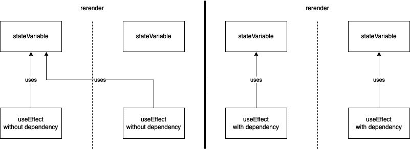

# 第三章：欢迎来到 React Native

在学习完 React 和 React Native 的基础知识后，包括*第一章*“什么是 React Native？”以及 JavaScript 和 TypeScript 的基础知识*第二章*“理解 JavaScript 和 TypeScript 的基础”之后，现在是时候深入 React Native 的世界了。

React Native 最优秀的地方之一是它在使用方式上非常灵活。你可以选择**Expo**，它会为你处理所有原生部分，让你能在几小时内完成你的第一个应用。它还使得在没有 Mac 的情况下构建 iOS 应用成为可能。但你也可以选择裸 React Native 工作流程，这为你提供了将 React Native 应用集成到整个开发环境中的许多选项。

你还可以集成或甚至编写自己的（原生）库。虽然这种灵活性是 React Native 最大的优势之一，但它需要你真正理解在不同场景下发生的事情，以便为你的项目和公司做出正确的选择。

本章将帮助你做到这一点。你将真正理解不同的方法，如何利用它们，以及在何时使用每种方法。

你将在本章的各个部分学习以下内容：

+   通过示例应用了解 React Native 的工作原理

+   传递属性

+   理解类组件、函数组件和 Hooks

+   将不同平台连接到 JavaScript

+   介绍新的 React Native 架构

# 技术要求

为了能够运行本章中的代码，你必须设置以下内容：

+   一个有效的 React Native 开发环境([`reactnative.dev/docs/environment-setup`](https://reactnative.dev/docs/environment-setup)—**React Native 命令行界面** (**CLI**) 快速入门指南)

+   虽然本章的大部分内容也应该在 Windows 上工作，但我建议你在 Mac 上工作

# 通过示例应用了解 React Native 的工作原理

通过实际操作来理解一项技术没有比这更好的方式了。本节包含一个简单的示例应用，该应用将根据静态**JavaScript 对象表示法** (**JSON**)文件显示电影信息。应用将在下一章中进一步开发。目前，它应该包含以下视图：

+   一个主视图，用于显示电影类别列表

+   一个包含类别信息以及该类别最受欢迎的电影（包括标题和海报）的类别详情页面

+   一个包含电影信息（包括标题、海报、评分、上映日期和描述）的电影详情页面

虽然这是一个非常简单的例子，但我们将用它来重点理解底层发生了什么。但让我们先从创建应用开始。我们将使用 React Native 裸工作流程来完全控制，同时不增加任何开销。这意味着我们正在使用官方的 React Native CLI 来初始化我们的项目。这可以通过以下命令完成：

```js
npx react-native init videoexample 
    --template react-native-template-typescript
```

我们使用 TypeScript 模板直接将项目设置为 TypeScript 项目。这包括**TypeScript 编译器**（**tsc**）以及正确的文件扩展名。你将在*第九章*《提高 React Native 开发的基本工具》中了解更多关于模板和其他启动 React Native 项目选项的内容。

前面的命令创建了一个包含新 React Native 项目的`videoexample`文件夹。如果你已经正确设置了所有内容，你可以使用`cd videoexample && npx react-native run-ios`在你的 iOS 模拟器上启动示例应用（iOS 模拟器仅适用于 iOS；在 Windows 上，你可以使用`cd videoexample && npx react-native run-android`来启动 Android 模拟器）。

当你成功启动你的模拟器后，你应该能看到 React Native 默认应用正在运行。它应该看起来像这样：

![图 3.1 – React Native 默认应用

![图 3.1 – React Native 默认应用

![图 3.1 – React Native 默认应用

当你在你的**集成开发环境**（**IDE**）中打开`videoexample`文件夹时，你会看到 React Native CLI 为你创建了很多文件。在接下来的小节中，你将了解它们是什么以及它们的作用。

## 理解 React Native 示例项目

示例项目只有一个屏幕，但从技术上讲，它是一个完整的 Android 和 iOS 应用。这意味着它包含以下内容：

+   `android`：这个文件夹包含原生的 Android 项目。你可以用 Android Studio 打开这个文件夹，就像处理原生 Android 应用一样。它使用 Gradle 作为构建系统，并且很好地集成到 Android Studio 中。你可能在某个时候需要修改以下文件：

    +   `android/app/src/main/AndroidManifest.xml`：Android 清单包含关于应用的基本信息。你可能需要在添加需要用户权限的功能或从推送通知启动应用时编辑此文件。

    +   `android/app/src/main/java/com/<youridentifier>/MainApplication.java & android/app/src/main/java/com/<youridentifier>/MainApplication.java`：这些是应用的主要文件。通常你不需要修改这些文件，但某些库需要在这里进行一些额外的配置才能正确工作。

    +   `android/app/build.gradle`: 此文件定义了你的应用的 Android 构建过程。在大多数情况下，即使你安装了具有原生部分的第三方库，React Native 也会自动处理此过程。但在某些情况下，你可能在这些库之间遇到冲突，或者你必须进行一些额外的配置。在这些情况下，这是你要查看的文件。在 `android/build.gradle` 中还有一个构建文件，你可以为所有子项目/模块添加配置。

+   `iOS`: 此文件夹包含原生 iOS 项目。它由你的应用项目和名为 `<youridentifier>.xcodeproj` 的东西组成：这是你的应用的项目文件。它只包含你的项目。不要在 Xcode 中使用它，因为它不会工作！

+   `<youridentifier>.xcworkspace`: 这是你要工作的文件。它包含你的项目以及 pods 的项目。这是在 Xcode 中要工作的文件。

+   `Podfile`: 在此文件中，你可以定义其他项目的依赖项。这些依赖项通过 `cocoapods` 获取。你可以将 `cocoapods` 视为原生依赖项的 `npm` 或 `yarn` 包。在大多数情况下，所有依赖项都由 React Native 自动处理，但有时你必须调整依赖项（例如，在撰写本文时——例如——在 M1 Mac 上）。如果你必须这样做，`Podfile` 就是你要查看的文件。

关于 cocoapods 的说明

`cocoapods` 是 iOS 开发中一个非常流行的依赖管理工具。尽管如此，它不是苹果官方提供的工具，而是一个开源解决方案。`cocoapods` 团队没有关于 Xcode 或 macOS 即将发布的任何信息，因此 `cocoapods` 有时需要一些时间才能与最新版本良好地协同工作。

+   `node_modules`: 此文件夹在 `npm install` 或 `yarn` 的依赖安装过程中完全自动生成。除非你想修补第三方库，否则你不需要在此处做任何更改。

关于修补库的提示

有时，修补现有的库以修复错误或添加某些功能可能很有用。在这些情况下，你可以维护这个库的自己的分支（这非常耗时）或者你可以使用 `patch-package`。`patch-package` 是一个创建特定 `npm` 依赖项补丁的小工具。你可以在 *第十章**，*大规模、多平台项目的结构* 中了解更多信息。

+   `.eslintrc.js`/`.prettierrc.js`: 一个新的 React Native 项目自带内置的 ESLint 和 Prettier 支持。这些文件包含 ESLint 和 Prettier 的配置。有关这些工具的更多信息，请参阅 *第九章*，*提高 React Native 开发的必备工具*。

+   `.watchmanconfig`: React Native 使用一个名为 `watchman` 的工具来监视项目文件，并在它们发生变化时触发操作。这对于开发过程中的热重载非常重要。在大多数情况下，此文件只是一个空对象。

+   `app.json`：这个文件包含有关你的应用的信息，例如应用名称。

+   `babel.config.js`/`tsconfig.json`：这些文件包含有关 Babel 和 TypeScript 编译器的信息、标准和规则。在大多数情况下，你不需要编辑这些文件。

+   `metro.config.js`：React Native 在开发期间使用名为 Metro 的打包器来创建你的 JavaScript 包。这个打包器运行在你的 Mac 或 PC 上，在你做出更改后重新创建你的应用 JavaScript 包，并将其推送到你的设备或模拟器。这个文件包含`metro`打包器的配置。在大多数情况下，你不需要编辑它。如果你想了解更多关于 Metro 的信息，请访问官方页面：[`facebook.github.io/metro/`](https://facebook.github.io/metro/)。

+   `Index.js`：这是你的 JavaScript 包的入口点。如果你查看代码，你会发现它只是通过 React Native 的`AppRegistry.registerComponent`将`./App`绑定到本地应用。

+   `App.tsx`：这是 React Native 的默认应用。你可以在这里进行更改，并直接在你的模拟器中看到它们。稍后，这个文件将被我们的示例应用替换。

通过了解所有这些文件，你已经学到了很多关于 React Native 的知识。你看到它包含真实本地的项目，具有真实本地的依赖项，使用了大量有用的工具，并且有一个单一的入口点。

我们示例应用的下一步是设置一个工作文件夹结构。

## 结构化示例应用

首先，我总是建议为所有的 JavaScript/TypeScript 代码创建一个`src`文件夹。将所有属于一起的代码放在一个地方总是一个好主意。

对于我们的示例应用，我们在`src`文件夹中创建了以下三个子文件夹：

+   `@types`：在这个文件夹中，你放置你的 TypeScript 类型声明。

+   `components`：这个文件夹包含所有可重用的组件。

+   `containers`：在这里，你可以定义带有自定义动画的`ScrollView`容器。这些容器用于存放视图的内容。

+   `services`：在这个文件夹中，我们将创建我们的服务以连接到电影。在这个例子中，它将使用静态 JSON 文件作为源；稍后，我们将连接到外部**应用程序编程接口**（**API**）。

+   `views`：这个文件夹包含整个页面的视图。在我们的例子中，它包含之前定义的三个视图。

注意

有其他方法来结构化 React Native 项目。特别是对于大型项目，有多个仓库的项目，在某些情况下可能会有更好的解决方案。你将在*第十章*，“结构化大型、多平台项目”中了解到一些。对于我们的示例项目，这种结构绝对是可以的。

为了更深入地了解正在发生的事情，我们尝试在不使用任何第三方库的情况下完成我们示例项目的第一个版本。这只是为了学习目的，并不建议在实际项目中使用。

我们必须决定的第一件事是应用程序的一般架构。在图表中可视化应用程序的不同部分可能非常有帮助，就像你在这里可以看到的那样：


图 3.2 – 示例应用程序架构

如*图 3.2*所示，我们将创建三个视图（`Home.tsx`、`Genre.tsx`和`Movie.tsx`）。由于我们没有使用任何导航库，我们必须使用`App.tsx`的状态在这些视图之间切换。所有三个视图都使用`ScrollContainer`容器来正确放置视图的内容。它们还共享一些可重用组件。

结果是一个非常简单的应用程序，它让我们能够导航我们的电影内容。在下面的屏幕截图中，你可以看到它的样子：


图 3.3 – 示例应用程序截图

你可以在第一页看到一个电影类型的列表，在第二页看到一个单一类型的电影列表，在第三页是电影详情。

现在你已经了解了架构并看到了高级概述，现在是时候深入代码了。我们将关注最有趣的部分，但如果你想看到整个代码，请参阅*技术要求*部分中提到的 GitHub 仓库。让我们从`App.tsx`文件开始。

### 创建根视图

`App.tsx`文件作为我们项目的根组件。它决定哪个视图应该被挂载，并持有全局应用程序状态。请查看以下代码：

```js
const App = () => {
  const [page, setPage] = useState<number>(PAGES.HOME);
  const [genre, setGenre] = useState<IGenre | 
      undefined>(undefined);
  const [movie, setMovie] = useState<IMovie | 
      undefined>(undefined);
  const chooseGenre = (lGenre: IGenre) => {
    setGenre(lGenre);
    setPage(PAGES.GENRE);
  };
  const chooseMovie = (lMovie: IMovie) => {
    setMovie(lMovie);
    setPage(PAGES.MOVIE);
  };
  const backToGenres = () => {
    setMovie(undefined);
    setPage(PAGES.GENRE);
  };
  const backToHome = () => {
    setMovie(undefined);
    setGenre(undefined);
    setPage(PAGES.HOME);
  };
  switch (page) {
    case PAGES.HOME:
      return <Home chooseGenre={chooseGenre} />;
    case PAGES.GENRE:
      return (
        <Genre
          backToHome={backToHome}
          genre={genre}
          chooseMovie={chooseMovie}
        />
      );
    case PAGES.MOVIE:
      return <Movie backToGenres={backToGenres} 
          movie={movie} />;
  }
};
```

如你所见，`App.tsx`文件有三个状态变量。这个状态可以被视为全局状态，因为`App.tsx`文件是应用程序的根组件，并且可以传递给其他组件。它必须包含一个页面来定义哪个视图应该可见，并且它可以包含一个类型和一个电影。

在文件的末尾，你可以找到一个`switch`/`case`语句。根据页面状态，这个`switch/case`决定哪个视图应该被挂载。此外，`App.tsx`文件提供了一些在应用程序中导航的函数（`chooseGenre`、`chooseMovie`、`backToGenres`、`backToHome`），并将它们传递给视图。

重要提示

如你所见，状态变量的直接设置函数（`setPage`、`setGenre`、`setMovie`）并没有传递给任何视图。相反，我们创建了调用这些设置函数的函数。这是最佳实践，因为它保证了我们的状态以可预测的方式被修改。你永远不应该允许你的状态直接从组件外部被修改。你将在*第五章*中了解更多关于*管理状态和连接后端*的内容。

接下来，让我们看看视图。这些是显示内容的页面。

### 根据状态显示内容

`Home`视图是用户打开应用时看到的第一个页面。请查看以下代码：

```js
import {getGenres} from '../../services/movieService';
interface HomeProps {
  chooseGenre: (genre: IGenre) => void;
}
const Home = (props: HomeProps) => {
  const [genres, setGenres] = useState<IGenre[]>([]);
  useEffect(() => {
    setGenres(getGenres());
  }, []);
  return (
    <ScrollContainer>
      <Header text="Movie Genres" />
      {genres.map(genre => {
        return (
          <Pressable onPress={() => 
               props.chooseGenre(genre)}>
               <Text style={styles.genreTitle}>{genre.name}
                   </Text>
          </Pressable>
        );
      })}
    </ScrollContainer>
  );
};
```

在这里，你可以看到多个东西。在代码块顶部，你可以看到我们为`props`组件定义了一个`interface`。这是 TypeScript 声明，说明了应该从父组件（在这种情况下，是`App.tsx`文件）传递给此组件的内容。接下来，我们有一个作为状态变量的类型列表。

这是一个局部状态或组件状态，因为它只在这个组件内部使用。在下一行，我们使用`useEffect`钩子调用我们的`movieService`的`getGenres`方法来获取类型并将它们设置到局部状态。

你将在本章的*理解类组件、函数组件和 Hooks*部分中了解更多关于`useState`和`useEffect`钩子的内容，但到目前为止，重要的是当组件挂载时，带有空数组作为第二个参数的`useEffect`只会被调用一次。

注意

当使用 React 时，经常使用*挂载*和*卸载*这两个术语。**挂载**意味着向渲染树添加之前不存在的组件。一个新挂载的组件可以触发其生命周期函数（类组件）或 hooks（函数组件）。**卸载**意味着从渲染树中移除组件。这也可以触发生命周期函数（类组件）或 Hook 清理（函数组件）。

在`useEffect`钩子之后，你可以看到`return`语句，其中包含`ScrollContainer`容器，该容器包含`Header`组件和一系列`Pressable`实例，每个类型一个。这个列表是用`.map`命令创建的。

重要提示

这种声明性 UI 和 JavaScript 数据处理混合是 React 和 React Native 最大的优势之一，你将经常看到它。但无论何时这样做，都要记住，这将在组件每次重新渲染时进行处理和重新计算。这意味着不应在此处执行昂贵的数据处理操作。

在查看`Home`视图之后，我们也应该看看`Genre`视图。它基本上以相同的方式工作，但有一个很大的不同。`Genre`视图根据从`App.tsx`文件传递的属性获取其数据。在这里看看`Genre.tsx`文件的`useEffect`钩子：

```js
  useEffect(() => {
    if (typeof props.genre !== 'undefined') {
      setMovies(getMoviesByGenreId(props.genre.id));
    }
  }, [props.genre]);
```

你可以看到`movieService`的`getMoviesByGenreId`方法需要从`App.tsx`文件中获取`Genre.tsx`文件中的类型。

整个过程如下：

1.  `App.tsx`文件将`chooseGenre`函数传递给`Home.tsx`文件。

1.  用户点击一个类型并触发`chooseGenre`函数，该函数将类型设置为`App.tsx`状态，并在`App.tsx`文件中将页面设置为`GENRE`，这会导致`Home.tsx`卸载并挂载`Genre.tsx`。

1.  `App.tsx`文件将类型传递给`Genre.tsx`文件。

1.  `Genre.tsx`文件根据 genre ID 获取该类别的电影。

使用相同的模式设置电影并导航到`Movie.tsx`视图。

在这个例子中，`Movie.tsx`页面本身不获取任何数据。它从`App.tsx`文件中传递下来显示的电影数据，并且不需要其他信息。

在理解视图之后，我们现在将查看组件。

### 使用可重用组件

将在不同地方使用的 UI 代码移动到组件中非常重要，至少当项目增长时——这是防止代码重复和 UI 不一致的关键。但即使在较小的项目中，使用可重用组件也是一个好主意，并且可以大大加快开发速度。在这个简单的例子中，我们创建了一个`Header`组件：

```js
interface HeaderProps {
  text: string;
}
const Header = (props: HeaderProps) => {
  return <Text style={styles.title}>{props.text}</Text>;
};
const styles = StyleSheet.create({
  title: {
    fontSize: 18,
    fontWeight: 'bold',
    marginBottom: 16,
  },
});
```

如您所见，这是一个非常简单的组件。它接受一个字符串，并以预定义的方式渲染该字符串，但即使这个简单的组件也能为我们节省很多时间，并防止代码重复。我们不必在`Home.tsx`、`Genre.tsx`和`Movie.tsx`中分别样式化标题文本，我们只需使用`Header`组件，就可以以一致的方式获取我们的标题文本。

重要提示

在可能的情况下使用可重用组件。它们确保 UI 的一致性，并使整个应用程序中的更改易于适应。

在查看组件之后，我们将注意力转向服务。

### 使用服务获取数据

您应该始终将数据获取从应用程序的其他部分抽象出来。这不仅出于逻辑原因，而且如果您必须在此处更改任何内容（因为 API 更改），您不想触及您的视图或组件。

在这个例子中，我们使用两个 JSON 文件作为数据源。您可以在存储库的`assets/data`下找到它们。服务使用这些文件来过滤或列出数据，并将其提供给视图。请查看以下代码：

```js
const genres: IGenre[] = require('../../assets/data/genres.json');
const movies: IMovie[] = require('../../assets/data/movies.json');
const getGenres = (): Array<IGenre> => {
  return genres;
};
const getMovies = (): Array<IMovie> => {
  return movies;
};
const getMovieByGenreId = (genreId: number): 
    Array<IMovie> => {
        return movies.filter(movie => 
            movie.genre_ids.indexOf(genreId) > -1);
};
export {getGenres, getMovies, getMovieByGenreId };
```

如您所见，我们要求在前两行提供两个 JSON 文件。`getGenres`和`getMovies`函数仅返回文件的内容，没有任何过滤。`getMovieByGenreId`函数接受一个数字类型的 genre ID，并在电影的`genre_ids`中过滤出此 ID 的电影。然后它返回过滤后的`movies`数组。

在最后一行，我们导出要导入到我们的视图中的函数。

重要提示

在较大的项目中，使用类似我们这里的 JSON 文件这样的虚拟数据开始工作是非常常见的。这是因为前端部分通常与 API 并行开发，并且有了虚拟数据，前端团队可以确切地知道数据将是什么样子。当 API 准备就绪并且数据服务很好地抽象化后，用真实世界的 API 数据获取替换虚拟数据就不再成问题。我们也会在*第五章*中这样做，*管理状态和连接后端*。

最后，我们将查看容器。

### 使用容器进行页面样式

在我们的示例中，我们只有一个容器，`ScrollContainer`。它具有与组件非常相似的目的，但组件主要是作为视图的一部分使用的部分，而容器用于定义视图的（外部）布局。请查看我们的`ScrollContainer`容器代码：

```js
interface ScrollContainerProps {
  children: React.ReactNode;
}
const ScrollContainer = (props: ScrollContainerProps) => {
  return (
    <SafeAreaView style={styles.backgroundStyle}>
      <ScrollView
        contentInsetAdjustmentBehavior="automatic"
        contentContainerStyle={styles.contentContainer}
        style={styles.backgroundStyle}>
        {props.children}
      </ScrollView>
    </SafeAreaView>
  );
};
```

正如你在界面定义中看到的，我们的`ScrollContainer`容器只接受一个名为`children`的属性，它被定义为`React.ReactNode`。这意味着你可以将组件传递给`ScrollContainer`。此外，React 组件的`children`属性使得在传递所有 JSX 标签之间的内容时，可以使用开闭标签使用此组件，并将这些内容作为`children`属性传递给组件。这正是我们在所有视图中所做的那样。

我们的`ScrollContainer`容器也使用了一个名为`SafeAreaView`的组件。这是由 React Native 提供的，可以处理所有带有刘海（iPhone、三星）的设备、虚拟返回按钮（Android）等不同设备。

现在你已经看过我们第一个示例应用的所有不同部分，是时候进行简短的总结。到目前为止，你已经学会了如何构建一个应用，为什么抽象不同的层很重要，以及如何创建可重用的 UI。

你也已经了解到，React 和 React Native 组件始终由两部分组成：在状态/属性中准备数据，以及使用 JSX 显示数据。也许你也意识到，我们所有的组件都是按照这样的顺序排序的，即数据准备位于组件的顶部，而数据的显示位于底部。我更喜欢这种组件结构方式，因为它使组件的阅读性大大提高。

你也已经知道了一种在组件之间传递属性的方法。因为这是一个非常重要的主题，我们将在下一节中更详细地讨论。

# 传递属性

正如你在示例应用中已经看到的，在应用中传递数据有多种方式。已经建立了一些最佳实践，你绝对应该坚持；否则，你的应用可能会变得非常难以调试和维护。我们在这里列出这些：

+   **永远不要以不可预测的方式从组件外部修改组件的状态**：我知道——我再重复一遍；我们在上一节中提到过，但这非常重要。以不可预测的方式从组件外部修改状态可能会导致错误，尤其是在你与一个开发团队一起在大型项目中工作时。但让我们详细看看。

在这种情况下，“不可预测”意味着你直接将你的状态设置函数传递给其他组件。

为什么这样很糟糕？因为其他组件和可能的其他开发者可以决定将什么放入你的组件状态。很可能 sooner or later，其中之一决定放入一些你的组件在某些边缘情况下无法处理的东西。

解决方案是什么？在多个场景中，你可能需要从组件外部修改组件状态，但如果你必须这样做，请通过传递预定义的函数以可预测的方式进行。然后，这些函数应该验证数据并处理状态修改。

+   你可以使用`PropTypes`。更多信息，请参阅此链接：[`www.npmjs.com/package/prop-types`](https://www.npmjs.com/package/prop-types)。

+   **限制传递的 props 数量**：你传递的属性越多，你的代码就越难阅读和维护，所以如果你认为有必要传递一个属性，请三思。此外，传递对象而不是多个原始数据类型会更好。

在本节介绍传递属性的最好实践之后，我们将在下一节更深入地探讨不同的组件类型和 hooks。

# 理解类组件、函数组件和 Hooks

React 和 React Native 提供了两种不同的编写组件的方式：类组件和函数组件。如今，你可以互换使用这两种变体。两种方式都受到支持，目前没有迹象表明其中任何一种在未来不会被支持。那么，为什么存在两种不同的方式呢？这要归因于历史原因。在 2019 年（React 16.8）引入 hooks 之前，函数组件不能拥有状态或使用任何生命周期方法，这意味着任何需要获取和存储数据的组件都必须是类组件。但是，由于函数组件需要编写的代码更少，它们通常用于显示作为 props 传递的数据。

随着 Hooks 的引入，函数组件的限制发生了变化。**Hooks**是 React 提供的函数，使得在函数组件中也能使用原本仅限于类组件的功能。

今天，是否使用函数组件和 hooks 或类组件和生命周期方法很大程度上取决于你的个人喜好。再次强调，函数组件需要编写的代码更少，但具有面向对象编程（**OOP**）语言经验的开发者可能更喜欢使用类组件。两种方式都是完全可行的，并且在性能方面没有差异。只是在使用类组件时，应用程序的大小会稍微大一些。

在接下来的小节中，我们将探讨不同的语法以及如何处理不同组件类型。我们将从类组件开始。

## 使用类组件和生命周期方法

如前所述，类组件始终能够以可变状态持有动态数据。这种状态可以通过用户交互或生命周期方法中触发的事件来改变。生命周期方法是 React 提供的方法，在组件执行的具体时间点被调用。

最重要的生命周期方法之一是 `componentDidMount`。这个方法在组件被挂载后直接调用，通常用于数据获取。以下代码示例展示了类组件的一个非常基础的例子：

```js
class App extends React.Component {
  constructor() {
    super();
    this.state = {
        num: Math.random() * 100
    };
  }
  render() {
    return <Text>This is a random number:  
        {this.state.num}</Text>;
  }
}
```

类组件有一个 `state` 属性，它在类的构造函数中初始化。这个 `state` 变量可以持有多个对象。在这种情况下，它只包含一个 `num` 属性，该属性使用介于 `0` 和 `100` 之间的随机数进行初始化。组件必须始终有一个 `render` 函数。这个函数包含组件的 JSX。在这个例子中，它只是一个显示随机数给用户的 `Text` 组件。

为了让这个例子更有活力，我们可以启动一个间隔，每秒重新生成一个随机数。这就是生命周期函数发挥作用的地方。我们会使用 `componentDidMount` 生命周期函数来启动间隔，并使用 `componentWillUnmount` 来清理它。请查看以下代码片段：

```js
  componentDidMount = () => {
    this.interval = setInterval(() => {
      this.setState({ num: Math.random() * 100 });
    }, 1000);
  };
  componentWillUnmount = () => {
    clearInterval(this.interval);
  };
```

在 `componentDidMount` 中，我们创建一个间隔，每秒更新 `num` 状态。正如你所看到的，我们并没有直接设置状态，而是使用了 `setState` 方法。记住——直接设置状态只允许在构造函数的初始化中使用。

我们还将间隔的句柄存储在 `this.interval` 中。在 `componentWillUnmount` 中，我们清除 `this.interval`，这样当我们从组件导航离开时，就不会有代码无限运行。

注意

`componentDidMount` 是获取组件中使用的数据的正确位置。

如果你想看到这个例子的运行版本，请查看以下 CodeSandbox 实例：[`codesandbox.io/s/class-component-basic-nz9cy?file=/src/index.js`](https://codesandbox.io/s/class-component-basic-nz9cy?file=/src/index.js)。

在这个简单的例子之后，是时候更仔细地看看生命周期方法了。你现在将了解这里列出的最常用的方法：

+   `componentDidMount()`: 这个方法在组件被挂载后直接调用。在整个组件的生命周期中，它只会被调用一次。它可以用于数据获取、添加处理程序或以任何其他方式填充状态。

+   `componentWillUnmount()`: 这个方法在组件即将卸载之前被调用。在整个组件的生命周期中，它只会被调用一次。它应该用于清理处理程序、间隔、超时或任何其他正在执行的代码。

+   `componentDidUpdate(prevProps)`: 每当组件更新并重新渲染时，都会调用这个方法。在整个组件的生命周期中，它可能被多次调用（很多次）。`componentDidUpdate` 方法接收作为参数传递的先前 props，以便你可以将它们与当前 props 进行比较，以检查发生了什么变化。它可以用于根据组件参数的变化重新获取数据。请注意，在 `componentDidUpdate` 方法中的任何 `setState` 方法都必须被条件包裹。这是为了防止无限循环。

+   `shouldComponentUpdate(nextProps, nextState)`: 这个方法在组件即将进行重新渲染之前被调用。在整个组件的生命周期中，它可能被多次调用（很多次）。它仅为了性能考虑而存在，因为在某些场景下，你可能只想在特定的 props 或 state 部分发生变化时重新渲染组件。这在处理大型应用程序或大量数据列表时特别有用。

还有一些生命周期方法使用得不太频繁。如果你想了解更多，请查看官方文档：[`reactjs.org/docs/react-component.html`](https://reactjs.org/docs/react-component.html)。

在本节中，你学习了类组件的语法以及如何使用生命周期方法。为了进行直接比较，我们将在下一个子节中为带有 Hooks 的函数组件编写相同的示例。

## 使用函数组件和 Hooks

由于我们在本章第一部分的示例应用中使用了函数组件语法，你应该已经熟悉它了。尽管如此，我们仍将查看一个代码示例，就像我们在之前关于类组件的子节中做的那样，如下所示：

```js
const App = () => {
  const [num, setNum] = useState(Math.random() * 100);
  return <Text>This is a random number: {num}</Text>;
};
```

如你所见，即使在这么小的示例中，代码也要短得多。函数组件基本上就是一个在每次重新渲染时运行的函数。但是，有了 Hooks，特别是 `useState` 钩子，函数组件提供了一种在重新渲染之间存储数据的方法。

我们使用 `useState` 钩子将 `num` 变量存储在组件状态中。函数组件必须返回应该渲染的内容。你可以将组件视为一个直接的 `render` 函数。然后我们可以使用 `num` 变量来打印随机数。

重要提示

在函数组件中，不使用 Hooks 或类似机制放入的所有代码都会在每次重新渲染时运行。这基本上和在类组件的 `render` 函数中放入代码一样。这意味着你应该只在那里放置你的声明性 UI 和便宜的数据处理操作。所有其他操作都应该用 Hooks 包裹，以防止性能问题。

接下来，我们将启动一个间隔，每秒更改一次随机数。我们在类组件的示例中也做了同样的事情。以下代码在函数组件中实现了这一点：

```js
  useEffect(() => {
    const interval = setInterval(() => {
      setNum(Math.random() * 100);
      }, 1000);
    return () => clearInterval(interval);
  }, []);
```

我们使用`useEffect` Hook 来启动间隔。`useEffect`间隔接受两个参数。第一个是一个定义应该运行的效果的函数。第二个参数是一个数组，它定义了效果应该运行的时间。它是可选的，如果你不提供它，你的效果将在每次重新渲染时运行。

你可以在其中放置状态变量、其他函数等等。如果你这样做，效果将在数组中的任何一个变量更改时运行。在我们的情况下，我们希望效果在组件挂载时只运行一次。为了实现这一点，我们将使用空数组作为第二个参数。

我们还返回一个清除效果的匿名函数。这是一个清理函数。这个清理函数在组件卸载时运行，并在下次运行效果之前。由于我们只在挂载时运行效果，因此清理函数只在卸载时运行。

如果你想运行这个示例，请查看以下 CodeSandbox 实例：[`codesandbox.io/s/function-component-basic-yhsrlo`](https://codesandbox.io/s/function-component-basic-yhsrlo)。

在这个简单的示例之后，是时候深入探讨最重要的 Hooks 了。我们已经使用了其中两个，它们无疑是其中最重要的。

### 使用无状态函数组件和 useState

`useState` Hook 使得在重新渲染之间存储信息并创建有状态函数组件成为可能。它返回一个包含两个条目的数组。第一个是状态变量，而第二个是状态变量的设置函数。在大多数情况下，你将使用数组解构在一行中访问这两个条目，如下面的代码示例所示：

```js
const [example, setExample] = useState(exampleDefaultValue)
```

`useState`函数还接受一个参数，你可以使用它来定义状态变量的默认值。这是它初始化时得到的值。

要更改状态值，你总是必须使用设置函数。永远不要直接设置值，因为这不会触发任何重新渲染或其他 React 内部操作。

要更改值并触发重新渲染，你可以简单地使用固定值调用设置函数。这就是它的样子：

```js
setExample(newValue)
```

这是你大部分时间会做的事情，但你也可以传递一个更新函数。当你需要根据旧状态进行状态更新时，这非常有用，例如：

```js
setExample(prevValue => prevValue + 1)
```

在这个示例中，我们将传递一个函数，该函数接受前一个值作为单个参数。现在我们可以使用这个值来返回新值，然后这个值将被用于设置函数。这在递增或递减值时特别有用。

现在我们能够在重新渲染之间存储数据，我们将在某些事件之后运行一些函数。

### 使用 useEffect 与效果一起使用

`useEffect` 钩子用于在特定事件之后运行代码。这些事件可以是组件的挂载或组件的更新。`useEffect` 钩子的第一个参数必须是一个函数，当效果被触发时将运行此函数。

第二个参数是一个数组，可以用来限制效果应该触发的事件。这是可选的，当你不提供它时，效果在挂载时运行，并在每次触发重新渲染的更新时运行。如果你提供一个空数组，效果仅在挂载时运行。如果你在数组中提供值，效果仅限于在提供的值之一发生变化时运行。

这里有一件非常重要的事情需要提及。如果你在 `useEffect` 钩子内部使用可以改变重新渲染之间变量的引用和函数，你必须将它们包含在依赖项中。这是因为否则，你可能在 `useEffect` 钩子中有一个指向陈旧数据的引用。请查看以下图表以了解这一点的说明：



图 3.4 – useEffect 中的引用

在图的左侧，你可以看到当你没有在依赖项中包含一个状态变量——你是在你的 `useEffect` 钩子内部访问这个状态变量——会发生什么。在这种情况下，状态变量发生变化并触发了重新渲染，但由于你的 `useEffect` 钩子没有与状态变量建立连接，它不知道发生了变化。

当效果下次运行时——例如，由另一个依赖项的变化触发——你会访问你状态变量的陈旧（旧）版本。这一点非常重要，因为它可能导致非常严重且难以发现的错误。

在图的右侧，你可以看到当你将状态变量包含在 `useEffect` 钩子的依赖项中时会发生什么。现在 `useEffect` 钩子知道状态变量何时发生变化，并更新引用。

这同样适用于你在组件中编写的函数。请始终记住，你编写在函数组件内部且未被钩子包裹的每个函数都会在每次重新渲染时被重新创建。

这意味着如果你想在 `useEffect` 钩子内部访问函数，你也必须将它们添加到依赖项中。否则，你可能会引用这些函数的陈旧版本。但这也导致另一个问题。由于函数在每次重新渲染时都会被重新创建，它会在每次重新渲染时触发你的效果，而这通常是我们不希望看到的。

这就是两个其他钩子发挥作用的地方。在重新渲染之间，你可以缓存值和函数，这不仅解决了我们的 `useEffect` 触发问题，而且显著提高了性能。

### 使用 useCallback 和 useMemo 提高性能

`useCallback` 和 `useMemo` 都是用于在重新渲染之间记忆事物的 Hooks。虽然 `useCallback` 提供了记忆函数的功能，而 `useMemo` 提供了记忆值的功能。这两个 Hooks 的 API 非常相似。你提供一个函数和一个依赖项数组。`useCallback` Hooks 在不执行函数的情况下记忆函数，而 `useMemo` Hooks 执行函数并记忆函数的返回值。

总是要记住，这些 Hooks 是用于性能优化的。特别是关于 `useMemo`，React 文档明确指出，没有语义保证记忆化在所有情况下都有效。这意味着你必须以即使没有记忆化也能正常工作的方式编写你的代码。

你现在已经了解了最常见的 Hooks。你将在 *第五章* 中了解更多，*管理状态和连接后端*。如果你想获得更深入的理解，我可以推荐 React 文档中的官方 Hooks 教程：[`reactjs.org/docs/hooks-reference.html`](https://reactjs.org/docs/hooks-reference.html)。

注意

除了 React 提供的 Hooks，你还可以编写自己的 Hooks 来在函数组件之间共享逻辑。你可以在自定义 Hook 中调用所有 React Hooks。请遵循命名约定，并始终以 `use` 开头你的自定义 Hooks。

在对组件、Hooks 以及 React Native 的 React 部分进行了广泛的探讨之后，现在是我们深入探讨原生部分的时候了。正如你在 *第一章* 中学到的，*什么是 React Native？*，React Native 有一个 JavaScript 部分和一个原生部分。

如你在本章的第一节中学到的，React Native 随带了一个完整的 Android 项目和一个完整的 iOS 项目。现在是时候看看所有这些是如何联系在一起的。

# 将不同平台连接到 JavaScript

在本节的第一个小节中，我们将重点关注 Android 和 iOS，因为这些是最常见的平台。在本节的最后，我们还将探讨如何部署到 Web、Mac、Windows 以及其他平台。

首先，重要的是要理解 React Native 提供了 JavaScript 和原生之间的通信方式。大多数时候，你不需要在原生端做任何改变，因为框架本身或一些社区库已经覆盖了大部分原生功能，但无论如何，理解它是如何工作的仍然很重要。

让我们从 UI 开始。当你用 JavaScript 编写 UI 时，React Native 会将你的 JSX 组件，如 `View` 和 `Text`，映射到 iOS 上的 `UIView` 和 `NSAttributedString` 或 Android 上的 `android.view` 和 `SpannableString` 等原生组件。这些原生组件的样式是通过一个名为 Yoga 的布局引擎来实现的。

虽然 React Native 为 Android 和 iOS 提供了许多组件，但有些场景并不直接支持。一个很好的例子是**可缩放矢量图形**（**SVG**）。React Native 本身并不提供 SVG 支持，但它提供了连接 JavaScript 和原生组件的逻辑，这样每个人都可以创建自己的映射和组件。

接下来，大型 React Native 社区开始发挥作用。几乎每个功能都有开源库提供这些映射，至少对于 Android 和 iOS 是如此。SVG 支持也是如此。有一个维护良好的库叫做 `react-native-svg`，您可以在以下位置找到它：[`github.com/react-native-svg/react-native-svg`](https://github.com/react-native-svg/react-native-svg)。

这个库提供了一个 `<SVG />` JavaScript 组件，底层映射到 Android 和 iOS 上的原生 SVG 实现。

在理解了 UI 映射的工作原理之后，是时候看看 JavaScript 和原生之间的其他通信了。第二个非常常见的用例是数据的传输，例如关于用户手势、传感器信息或其他可以在一方创建并需要传输到另一方的数据。

这是通过连接方法完成的。React Native 提供了一种从 JavaScript 调用原生方法、传递回调函数到原生，并从原生调用这些回调的方法。这就是数据如何双向传输的方式。

虽然 Android 和 iOS 的支持是开箱即用的，但 React Native 并不仅限于这些平台。微软创建了名为 `react-native-windows` 和 `react-native-macos` 的开源项目。这些项目支持许多功能，可以将您的应用程序带到 Windows 和 macOS 平台。

还有一个非常有用的项目叫做 `react-native-web`，它为 React Native 添加了网络支持。一个需要理解的重要事情是，即使您可以使用相同的代码库为所有平台编写代码，您可能仍然希望将其适应特定平台的最佳实践。

例如，如果您针对的是网络，您可能希望优化您的项目以适应搜索引擎，这对于 Android 和 iOS 应用程序来说并不是必要的。处理这些特定平台调整的方法有很多种。最常见的方法将在*第十章**，结构化大规模、多平台项目*中解释。

虽然您可以使用 Android、iOS、Windows、macOS 和网络，但您并不局限于它们。基本上，您可以使用 React Native 为任何平台创建应用程序，您只需自己编写原生部分即可。

很长一段时间以来，JavaScript 和原生之间的所有通信都是通过所谓的桥异步地通过 JSON 完成的。虽然这在大多数情况下都很好用，但在某些情况下可能会导致性能问题。

因此，Facebook 的 React Native 核心团队决定完全重写 React Native 架构。这花费了几年的时间，但在撰写本书时，新的架构已经在主要的 Facebook 应用中推出，并且它也进入了 React Native 开源仓库，可供公众使用。你将在下一节中了解更多关于新架构的内容。

# 介绍新的 React Native 架构

在最后一节中，你学习了 JavaScript 和原生之间的连接是如何工作的。虽然这个基本概念没有改变，但底层实现发生了完全的改变。请查看以下图表：

![图 3.5 – 新的 React Native 架构

![图片/B16694_03_05.jpg]

图 3.5 – 新的 React Native 架构

新的 React Native 架构的核心是称为 **JavaScript 接口**（**JSI**）的东西。它取代了通过桥进行通信的旧方式。虽然通过桥的通信是以序列化的 JSON 的异步方式进行，但 JSI 使得 *JavaScript 能够持有 C++ 主机对象的引用并调用它们的方法*。

这意味着通过 JSI 连接的 JavaScript 对象和 C++ 主机对象将真正地相互了解，这使得同步通信成为可能，并使得 JSON 序列化的需求变得过时。这为所有 React Native 应用带来了巨大的性能提升。

重构的一部分是一个名为 Fabric 的新渲染器，它减少了创建原生 UI 所需的步骤数量。此外，使用 JSI，一个决定将要渲染内容的阴影树直接在 C++ 中创建，同时 JavaScript 也有对其的引用。这意味着 JavaScript 和原生代码都可以与阴影树交互，这极大地提高了 UI 的响应速度。

从 JSI 中受益的重构的第二部分被称为 **Turbo Modules**。它取代了 Native Modules，这是连接原生模块和 JavaScript 模块的方式。虽然旧的 Native Modules 都必须在启动时初始化，因为 JavaScript 没有关于原生模块状态的信息，但 JSI 使得在需要时延迟模块初始化成为可能。

由于 JavaScript 现在可以持有直接的引用，因此也就没有必要与序列化的 JSON 进行交互。这导致 React Native 应用的启动时间显著提升。

此外，还有一个名为 **CodeGen** 的新开发者工具与新的架构一起推出。它使用类型化 JavaScript 生成相应的原生接口文件，以确保 JavaScript 和原生侧之间的兼容性。这在编写包含原生代码的库时非常有用。你将在*第十章**，在“创建自己的库”部分中的“结构化大规模、多平台项目”中了解更多关于此内容。

总的来说，新的架构将为每个 React Native 应用在所有级别上带来巨大的性能提升。将现有应用切换到新架构需要一些时间，而且直到所有常见的开源库都完成切换也需要一些时间。但这是迟早的事，而且这绝对值得付出努力。

# 概述

为了结束本章，让我们简要总结一下本章的内容。你学习了简单 React Native 应用的项目结构是什么样的，以及不同的文件分别用于什么。你还了解了类组件和函数组件，以及最重要的生命周期方法和 Hooks。基于这些，你可以在类组件和函数组件中使用组件状态并触发代码执行。

你还学习了 JavaScript 和原生在 React Native 应用中的连接方式，当前（旧）React Native 架构的问题，以及新的架构是什么。

现在你已经对 React Native 的整体工作原理有了很好的了解，让我们在下一章深入探讨组件、样式、存储和导航。

# 第二部分：使用 React Native 构建世界级应用

在这部分，我们将不仅关注创建应用，还要使用 React Native 创建一流的应用。你将学习在创建具有原生性能和世界级用户体验的应用时，必须注意哪些事项。 

以下章节包含在本节中：

+   *第四章*，*React Native 中的样式、存储和导航*

+   *第五章*，*管理状态和连接后端*

+   *第六章*，*与动画一起工作*

+   *第七章*，*在 React Native 中处理手势*

+   *第八章*，*JavaScript 引擎和 Hermes*

+   *第九章*，*提高 React Native 开发的基本工具*
