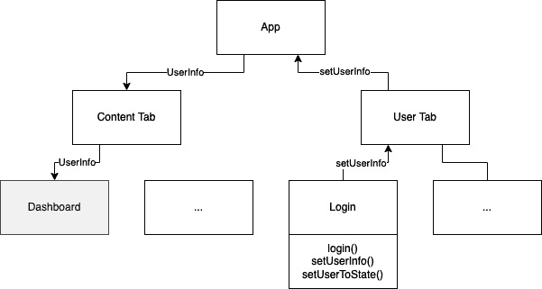
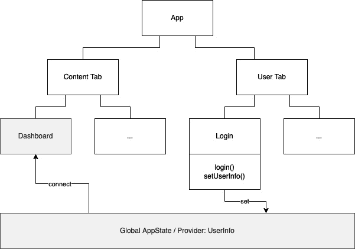
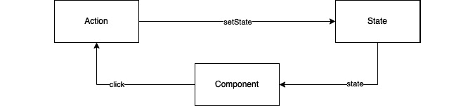
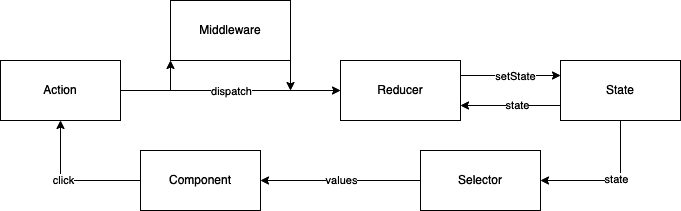
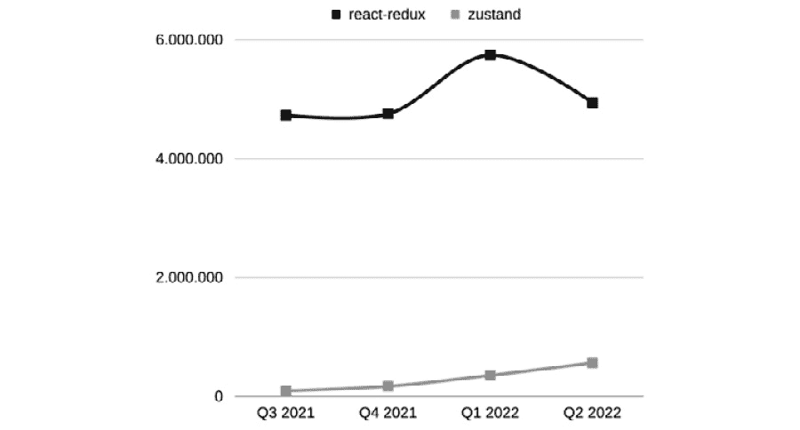

# 第五章：管理状态和连接后端

在上一章中，你学习了如何构建一个运行良好且外观出色的应用程序。在本章中，我们将关注数据。首先，你将学习如何在你的应用程序中处理更复杂的数据。然后，你将了解有关如何通过连接远程后端使你的应用程序与世界其他部分通信的不同选项。

在本章中，我们将涵盖以下主题：

+   管理全局应用程序状态

+   使用全局状态管理解决方案

+   连接到远程后端

# 技术要求

要运行本章中的代码，你必须设置以下内容：

+   一个有效的 React Native 环境 ([bit.ly/prn-setup-rn](http://bit.ly/prn-setup-rn) – React Native CLI 快速入门)。

+   虽然本章的大部分内容也应该在 Windows 上运行，但我建议你在 Mac 上工作。

+   要查看简单示例，你可以使用 [`codesandbox.io/`](https://codesandbox.io/) 并将 `react-native-web` 作为依赖项导入。这提供了所有 React Native 组件并将它们转换为 HTML 标签。

# 管理全局应用程序状态

由于 React Native 基于 React，管理应用程序状态与 React 应用程序没有太大区别。有数十个维护良好且可用的状态管理库，你都可以在 React Native 中使用。然而，在应用程序中，有一个良好的计划和知道如何管理应用程序状态比在 Web 应用程序中更为重要。

虽然等待几秒钟数据出现或新页面加载可能是可以接受的，但在移动应用程序中并非如此。用户习惯于立即看到信息或变化。因此，你必须确保在你的应用程序中也是如此。

在本节中，我们将探讨最流行的状态管理解决方案，但首先，你将了解不同的状态管理模式以及你应该为你的项目使用哪一个。

## 传递属性

虽然在小应用程序和示例项目中仅使用本地组件状态可能运行良好，但这种方法非常有限。有许多用例需要在不同组件之间共享数据。你的应用程序越大，你将拥有的组件就越多，你需要传递数据的层级就越多。

以下图表显示了主要问题：



图 5.1 – 无全局状态管理解决方案的状态管理

上述图表显示了一个非常简单的示例，与我们的示例应用程序非常接近，但你已经可以看到主要问题：应用程序包含两个标签页，一个用于显示内容，另一个提供个人用户区域。第二个标签页包含一个登录功能，该功能被提取到一个登录组件中。

**内容**标签页包含一个仪表板组件，主要用于显示内容。但我们也希望能够适应用户的内容。因此，我们需要在仪表板组件中获取有关用户的信息。

没有全局应用程序状态管理库，如果用户登录，我们将不得不做以下操作：

1.  从**登录**组件传递信息到**用户**标签页。

1.  从`App.js`传递信息。

1.  在`App.js`的状态中设置用户信息。

1.  将用户信息作为属性传递给**内容**标签页。

1.  从**内容**标签页将用户信息传递到**仪表板**组件。

即使在这个简单的例子中，我们也必须包含五个组件来向仪表板组件提供用户信息。当我们谈论复杂的现实世界应用时，可能会有 10 个或更多的层级，你需要通过这些层级传递你的数据。这将是一个难以维护和理解的噩梦。

这种方法还存在另一个问题：当我们把用户信息作为属性传递给`App.js`时，`App.js`会发生变化。这意味着我们会重新渲染**内容**标签页以及可能的大量未因属性更改而改变的子组件。

这尤其重要，因为大型应用程序的全局状态可能会变得相当复杂和庞大。如果你将其与后端应用程序进行比较，你可以将全局应用程序状态视为系统的数据库。

因此，全局状态管理库应该解决两个问题。一方面，它们应该给我们一个在组件之间共享信息并保持我们的应用程序状态管理可维护的选项。另一方面，它们还应该帮助减少不必要的重新渲染，从而优化我们的应用程序性能。

## 使用全局状态提供者/容器

以下图表显示了使用全局状态管理解决方案的数据流预期工作方式：



图 5.2 – 使用全局状态管理解决方案的状态管理

如您所见，全局应用程序状态管理解决方案提供了一个将数据设置到全局位置并连接组件以消费这些数据的选项。虽然这确保了当这些数据发生变化时，连接的组件会自动重新渲染，但它也必须保证只有这些组件会重新渲染，而不是整个组件树。

虽然这是一个好的模式，但也伴随着一些风险。当每个组件都可以连接到你的全局状态时，你必须非常小心地编辑这种状态的方式。

重要提示

绝不允许任何组件直接写入你的状态。无论你使用什么库，你的全局状态提供者都应该始终控制状态如何被更改。

如前所述的信息框中提到，您的全局状态提供者应始终控制状态。这意味着您不应允许任何组件直接设置状态。相反，您的应用状态提供者应提供一些可以改变状态的函数。这确保您始终知道状态可以如何改变。只能以这些方式改变的状态也称为可预测状态。

### 使用可预测状态模式

在处理大型项目时，特别是在有多个开发者参与的项目中，拥有可预测状态尤为重要。想象一下，在一个项目中，任何人都可以简单地从任何组件直接设置状态。当您遇到错误，因为您的状态包含一个无法由您的应用程序处理的无效值时，几乎不可能找出这个值是从哪里来的。此外，当您允许从全局状态提供者外部直接编辑状态时，您无法提供任何中央验证。

当您使用可预测状态模式时，您有三个优点。首先，您可以提供验证并防止无效值写入您的状态。其次，如果您遇到由于无效状态值而导致的错误，您有一个中心点可以开始调试。第三，它更容易为其编写测试。

创建可预测状态的模式如下图中所示：



图 5.3 – 简单的可预测状态管理

如您所见，组件触发任何事件。在这个例子中，用户点击了一个按钮。这个事件触发了一个动作。这可能是一个自定义钩子或由某些状态管理库提供的函数。这个钩子或函数可以执行多项操作，从验证事件到从本地存储解决方案或外部后端获取数据。最后，状态将被设置。

为了让您有一个更好的概念，让我们看看一个具体的例子。该组件是一个重新加载按钮。点击它后，动作从后端获取最新的数据。它处理请求，如果请求成功并提供有效数据，动作将此数据设置在状态中。否则，它设置错误消息并提供代码到状态。

如您所见，这种模式也可以在业务逻辑和 UI 之间提供一层良好的抽象。如果您想要一个更好的抽象，您可以使用我们接下来要讨论的下一个模式。

### 使用状态/动作/还原模式

这个简单的可预测状态管理模式可以扩展。以下图显示了扩展版本，其中添加了还原器和选择器：



图 5.4 – 状态/动作/还原模式

上述图表显示了所谓的 **状态/动作/Reducer** 模式。在这个模式中，动作不是一个函数或 Hook，而是一个被派发的 JavaScript 对象。在大多数情况下，这个动作由 reducer 处理。reducer 接收动作，它可以携带一些数据作为有效负载，并对其进行处理。它可以验证数据，将数据与当前状态合并，并设置状态。

通常，在这个模式中，reducer 不会访问任何其他数据源。它只知道动作和状态。如果你想要在这个模式中获取数据，你可以使用中间件。这个中间件拦截派发的动作，处理其任务，并派发其他动作，然后这些动作被 reducers 处理。

再次，让我们看看一个具体的例子。用户点击了 `FETCH_DATA` 动作。这个 `FETCH_DATA` 动作由中间件处理。中间件获取数据并验证请求。如果一切顺利，它将派发一个带有新数据作为有效负载的 `SET_DATA` 动作。

Reducer 处理这个 `SET_DATA` 动作，可能进行一些数据验证，将数据与当前状态合并，并设置新状态。如果中间件中的数据获取失败，中间件将派发一个带有错误代码和错误消息的有效负载的 `DATA_FETCH_ERROR` 动作。这个动作也被一个 reducer 处理，它为状态设置错误代码和消息。

*图 5.3* 和 *图 5.4* 之间的另一个区别是选择器的存在。这是不同状态管理解决方案中存在的东西，因为它使得只订阅状态的一部分而不是整个状态成为可能。这非常有用，因为它使得在不需要总是重新渲染整个应用的情况下创建复杂的状态对象成为可能。

当我们看一个例子时，这会更清晰。假设你有一个应用程序，其全局状态由一个用户、一个文章数组和一个收藏文章 ID 数组组成。你的应用程序在一个标签页中显示文章，每个文章都有一个按钮可以将其添加到收藏列表中。在第二个标签页中，你显示用户信息。

当你把所有这些都放在同一个全局状态中，而不使用选择器时，如果你的**用户**标签页偏好一篇文章，那么默认情况下，你的**用户**标签页会重新渲染，即使用户页面上没有任何变化。这是因为**用户**标签页也消耗了整个状态，并且这个状态发生了变化。当在用户上使用选择器时，它不会重新渲染，因为**用户**标签页连接到的状态的用户部分没有变化。

如果你使用一个没有选择器的复杂状态，你将不得不创建不同的状态提供者，它们之间完全独立。

现在你已经了解了不同的选项，是时候看看何时需要使用全局状态，或者何时可以使用局部组件状态并简单地传递 props 了。

# 比较局部组件状态和全局应用状态

如果你想在 UI 中显示一些数据，在大多数情况下你必须将其存储在你的状态中。但有趣的问题是：在哪个状态中？本地组件状态还是全局应用程序状态？

这是一个没有简单答案或适用于每种情况的规则的话题。然而，我想给你一些指导原则，以便你可以为所有用例做出良好的决策：

+   **尽量保持全局状态尽可能精简**：全局变量在大多数编程语言中是非常不常见的。这是有原因的。如果可以在应用程序的任何地方设置一切，那么调试和维护它将变得非常困难。此外，全局应用程序状态越大，遇到性能问题的可能性就越大。

+   **表单数据不应成为全局状态的一部分**：当你提供输入字段，如文本字段、开关、日期选择器或其他任何内容时，这些组件的状态不应成为全局应用程序状态的一部分。这些信息属于视图，它提供了这些字段，因此应成为视图组件状态的一部分。

+   **尽量减少向下传递超过三层数据**：在向子组件传递 props 时，你应该尽量避免通过多层传递这些数据。最佳实践是永远不要将组件 props 传递给子组件，而只传递组件的状态。然而，在实践中这可能相当困难，所以我建议坚持不要向下传递超过三层数据。

+   **尽量减少向上传递多层数据**：正如你已经学到的，你可以通过从父组件传递一个函数给子组件，该函数设置父组件的状态，然后从子组件中调用这个函数，从而从子组件传递数据到父组件。由于这可能导致组件之间非常混乱的依赖关系，因此在向上传递数据时应比向下传递数据更加小心。我建议只向上传递一层数据。

+   **对于在应用程序多个区域使用的数据，使用全局应用程序状态**：当数据需要在应用程序的多个区域可用，而这些区域位于完全不同的导航堆栈中时，你应该始终使用全局应用程序状态。

决定哪些数据属于哪个状态可能具有挑战性。这始终是具体情况具体分析，有时，你可能因为需求变化或在使用过程中意识到这不是正确的决定而不得不撤销你的决定。这是可以的。然而，你可以在一开始就考虑为你的数据选择正确的状态解决方案来减少这些努力。

现在我们已经涵盖了理论，是时候看看最流行的解决方案以及如何维护全局应用程序状态了。

# 与全局状态管理解决方案一起工作

从历史上看，我们可能需要从 Redux 开始，因为它是第一个流行的全局状态管理解决方案。在 2015 年推出时，它迅速成为 React 应用程序中全局状态管理的既定标准。它仍然被非常广泛地使用，但特别是在过去 3 年中，一些其他第三方解决方案已经出现。

React 还引入了一个内置的全局状态管理解决方案，它可以用于类组件，也可以用于函数组件。它被称为 **React Context**，由于它随 React 一起提供，我们将首先看看它。

## 使用 React Context

React Context 的概念非常简单：它就像是一个通向组件的隧道，任何其他组件都可以连接到它。一个上下文总是由一个提供者和一个消费者组成。提供者可以被添加到任何现有的组件中，并期望传递一个值属性。所有是提供者组件后代的组件都可以实现一个消费者并消费这个值。

### 使用普通的 React Context 提供者和消费者

以下代码展示了普通的 React Context 示例：

```js
export function App() {
  return (
    <ColorsProvider>
      <ColoredButton />
    </ColorsProvider>
  );
}
```

在您的 `App.js` 文件中，您添加了一个 `ColorsProvider`，它包裹了一个 `ColoredButton` 组件。这意味着在 `ColoredButton` 中，我们将能够实现一个用于 `ColorsProvider` 值的消费者。但让我们先看看 `ColorsProvider` 的实现：

```js
import defaultColors from "defaultColors";
export const ColorContext = React.createContext();
export function ColorsProvider(props) {
  const [colors, setColors] = 
      useState(defaultColors.light);
  const toggleColors = () => {
      setColors((curColors) =>
          curColors === defaultColors.dark ? 
              defaultColors.light : defaultColors.dark
    );
  };
  const value = {
    colors: colors,
    toggleColors: toggleColors
  };
  return <ColorContext.Provider value={value} {...props} />;
} 
```

在这个例子中，`ColorsProvider` 是一个函数组件，它提供了一个具有颜色属性的状态。这个状态使用从 `defaultColors` 导入的默认颜色方案初始化。它还提供了一个 `toggleColors` 函数，该函数可以改变颜色方案。

颜色状态变量和 `toggleColors` 函数随后被打包成一个值对象，并将其传递给 `ColorContext.Provider` 的值属性。`ColorContext` 在第 2 行初始化。

如您所见，该文件有两个导出：`ColorContext` 本身和 `ColorsProvider` 函数组件。您已经学习了如何使用提供者，所以接下来，我们将看看如何消费上下文的值。

注意

`ColorsProvider` 函数组件对于 React Context 的工作并不是必需的。我们也可以将 React Context 的初始化、颜色状态、`toggleColors` 函数以及 `ColorContext.Provider` 直接添加到 `App.js` 文件中。但这是一个最佳实践，我建议将您的上下文提取到单独的文件中。

以下代码展示了 `ColoredButton`，它在我们的 `App.js` 文件中被 `ColorsProvider` 包裹：

```js
function ColoredButton(props) {
  return (
    <ColorContext.Consumer>
      {({ colors, toggleColors }) => {
          return (
              <Pressable
                  onPress={toggleColors}
               style={{
                  backgroundColor: colors ? 
                  colors.background : 
                  defaultColors.background
            }}
          >
            <Text
                style={{
                    color: colors ? colors.foreground : 
                    defaultColors.foreground
              }}
            >
              Toggle Colors
            </Text>
          </Pressable>
        );
      }}
    </ColorContext.Consumer>
  );
}
```

如您所见，我们使用了一个 `ColorContext.Consumer` 组件，它提供了 `ColorsProvider` 的值。这些值可以被使用。在这种情况下，我们使用 `colors` 对象来样式化 `Pressable` 和 `Text` 组件，并将 `toggleColors` 函数传递给 `Pressable` 组件的 `onPress` 属性。

这种实现消费者组件的方法在函数组件和类组件中都可以工作。当与函数组件一起工作时，你可以使用更简单的语法来获取上下文的值。

### 使用 Context 和 React Hooks

以下代码示例展示了之前查看的代码示例的一个小部分：

```js
function ColoredButton(props) {
const {colors, toggleColors} = React.useContext(ColorContext);
  return (
          <Pressable
              onPress={toggleColors}
```

正如你所见，你不需要实现上下文消费者组件，你可以简单地使用 `useContext` Hook 来获取值。这使得代码更短，可读性更强。

虽然这个例子非常简单，但它仍然遵循了最佳实践。正如你所见，`setColors` 函数，即我们状态的设置器，不是公开可用的。相反，我们提供了一个 `toggleColors` 函数，它允许我们以预定义的方式更改状态。此外，我们很好地将状态从 UI 中抽象出来。

Hooks 允许你更进一步。当项目增长并且你想要添加一个额外的抽象层，例如用于外部请求，你可以创建一个自定义 Hook 作为你的中间件。

这是我们将在示例项目中添加的内容。我们将创建一些功能，使用户能够创建一个收藏电影列表，然后在该 **用户** 选项卡中显示。在这个过程中，我们将讨论 React Context 在全局状态管理中的优点和局限性。

以下图展示了我们将要创建的内容：

![图 5.5 – 示例应用 – 收藏电影

![img/B16694_05_05.jpg]

图 5.5 – 示例应用 – 收藏电影

这就是应用应该能够做到的事情。在每部电影详情页，我们将添加一个按钮来将电影添加到 **收藏电影**。如果电影已经是 **收藏电影** 的一部分，按钮将变为 **移除** 按钮，从列表中移除电影。

在 **电影** 列表中，我们想在所有属于 **收藏电影** 列表的电影上添加点赞图标。最后，我们想在 **用户** 选项卡中显示所有电影。

首先，我们必须创建上下文和自定义 Hook，以便能够存储数据。以下代码展示了 `UserProvider`：

```js
export function UserProvider(props: any) {
  const [name, setName] = useState<string>('John');
  const [favs, setFavs] = useState<{[favId: number]: 
      IMovie}>({});
  const addFav = (fav: IMovie): void => {
      if (!favs[fav.id]) {
          const _favs = {...favs};
          _favs[fav.id] = fav;
          setFavs(_favs);
      }
  };
  const removeFav = (favId: number): void => {
      if (favs[favId]) {
          const _favs = {...favs};
          delete _favs[favId];
          setFavs(_favs);
      }
  };
  const value = {
      name, favs, addFav, removeFav,
  };
  return <UserContext.Provider value={value} {...props} />;
}
```

正如你所见，我们有两个状态变量：一个对象，以类似映射的结构存储收藏电影（`favs`）和用户的名字（`name`）。现在你可以忽略 `name`；我们稍后会用到它。

提供者还包含 `addFav` 和 `removeFav` 函数，这是从提供者外部编辑存储的唯一方式。这两个函数以及 `name` 和 `favs` 状态变量被打包到 `value` 变量中，然后传递到提供者的 `value` 属性。

接下来，我们将查看自定义 Hook。这个 Hook 作为中间件和数据选择器，用于在存储之前获取数据，并将数据转换为所需的形式：

```js
export function useUser() {
  const context = React.useContext(UserContext);
  const {name, favs, addFav, removeFav} = context;
  const addFavById = (favId: number): void => {
      const movie = getMovieById(favId);
      if (!movie) {
          return;
      }
      addFav(movie);
  };
  const getFavsAsArray = (): IMovie[] => {
      return Object.values(favs);
  };
  const isFav = (favId: number): boolean => {
    return !!favs[favId];
  };
    return {
        name, favs, getFavsAsArray, removeFav, addFavById, 
        isFav,
    };
}
```

正如我们在之前的 Hooks 示例中所做的那样，我们将使用 `useContext` Hook 来使提供者的数据在我们的自定义 Hook 中可访问。自定义 Hook 包含三个函数。`addFavById` 函数接受一个 `movieId` 并从我们的 `movieService` 中获取电影。这是一个典型的中间件任务。

`getFavsAsArray` 函数提供了一个用户喜欢的电影数组。`isFav` 函数回答了给定 ID 是否属于用户喜欢的电影列表中的问题。这两个函数是典型的选择器。

Hook 返回这三个函数以及来自提供者的 `name`、`favs` 和 `removeFav`。有了这些，我们就可以非常容易地实现我们的需求。

让我们从电影详情页面开始。我们将查看添加的代码的不同部分；如果您想查看整个文件，请访问这本书的 GitHub 仓库：

```js
const Movie = (props: MovieProps) => { 
  const {isFav, addFavById, removeFav} = useUser();
  const _isFav = isFav(props.route.params.movie.id);
  ...
```

在这个组件中，我们需要 `isFav` 函数来检查电影是否已经是用户收藏的一部分。根据这一点，我们希望能够将电影添加到或从用户的收藏中。因此，我们导入 `useUser` Hook，然后使用对象解构来使这些函数可用。我们还存储 `isFav` 信息以供以后使用。

现在我们可以使用这些函数了，我们必须实现按钮本身：

```js
<Pressable
  style={styles.pressableContainer}
  onPress={
      _isFav
      ? () => removeFav(props.route.params.movie.id)
      : () => addFavById(props.route.params.movie.id)
  }>
  <Text style={styles.pressableText}>
    {_isFav ? '👎 Remove from favs' : '👍 Add to favs'}
  </Text>
</Pressable>
```

如您所见，按钮的实现部分相当简单。我们使用我们的 `_isFav` 变量来检查按钮应该显示哪种文本，并决定应该调用哪个函数。`addFavById` 和 `removeFav` 函数可以像组件提供的任何其他函数一样调用。

现在我们已经构建了编辑收藏的功能，下一步是在电影列表中显示这些信息。在电影详情视图中，Hook 的导入工作如下：

```js
const Genre = (props: GenreProps) => {
  const [movies, setMovies] = useState<IMovie[]>([]);
  const {isMovieFav} = useUser();
  ...
```

由于我们不想向状态写入任何内容，因此我们不需要使这些函数可用。而且与电影详情页面相反，我们必须检查多部电影是否有收藏状态，因此在这里创建一个变量来缓存 `isMovieFav` 的结果是没有意义的。

接下来，让我们看看电影列表的 JSX 实现：

```js
  return (
    <ScrollContainer>
      {movies.map(movie => (
          <Pressable
            {isMovieFav(movie.id) ? (
              <Text style={styles.movieTitleFav}>👍</Text>
              ) : undefined}
            <Text style={styles.movieTitle}>{movie.title}
                </Text>
          </Pressable>
        ))}
    </ScrollContainer>
  );
```

在遍历电影时，我们将使用 `isMovieFav` 函数检查每部电影。如果它返回 `true`，我们将添加一个点赞图标。这里只需要进行这个更改。

最后一步是在 **用户** 选项卡中显示 **收藏电影** 的列表。这同样只需要几行代码：

```js
const User = (props: UserProps) => {
  const {getMovieFavsAsArray} = useUser();
  const _movieFavsArray = getMovieFavsAsArray();
  return (
    <ScrollContainer>
      {_movieFavsArray.map(movie => {
        return (
          <Pressable>
            <Text style={styles.movieTitle}>{movie.title}
                </Text>
          </Pressable>
        );
      })}
    </ScrollContainer>
  );
}; 
```

前面的代码展示了整个组件（除了导入和样式）。我们使用 Hook 的 `getMovieFavsAsArray` 函数获取我们喜欢的电影，并将它们存储在一个变量中。然后，我们遍历数组并渲染电影。就这样！我们的示例就完成了。

正如你在本例中看到的，组件的实现部分非常简单，在大多数情况下只需要几行代码。即使在大项目中，只要你的上下文结构良好，这一点也会保持不变。我非常喜欢这种方法，因为它不需要任何外部库，并且有清晰的 UI 组件、中间件和状态提供者之间的分离。它还带来了另一个好处。

在使用 React Context 时，持久化存储的部分并当用户重新打开应用时重新加载数据可以非常有用。这也非常简单。下面的代码片段是 `UserProvider` 的一部分，展示了如何存储和重新加载用户的收藏列表。

在这种情况下，我们使用 `AsyncStorage` 作为本地存储解决方案：

```js
  useEffect(() => {
    AsyncStorage.getItem('HYDRATE::FAVORITE_MOVIES').then
        (value => {
            if (value) {
                setFavs(JSON.parse(value));
           }
      });
  }, []);
   useEffect(() => {
     if (favs !== {}) {
         AsyncStorage.setItem('HYDRATE::FAVORITE_MOVIES', 
             JSON.stringify(favs));
     }
  }, [favs]);
```

由于提供者就像任何其他组件一样工作，它也可以使用 `useEffect` Hook。在这个例子中，我们使用一个效果在提供者挂载时从 `AsyncStorage` 获取 `favs`。我们使用另一个效果在 `favs` 变量每次变化时存储收藏。虽然有很多好处，但不幸的是，这种基于 React Context 的方法有一个很大的限制。

### 理解 React Context 的限制

在这个示例的开始，我告诉你要忽略状态提供者中的 `name` 变量，因为我们需要它在以后使用。现在就是“以后”。如果你已经看过这本书的 GitHub 仓库，你可能已经意识到 `Home` 视图的代码已经发生了变化。

以下代码片段显示了变化：

```js
const Home = (props: HomeProps) => {
  const {name} = useUser();
  ...
  console.log('re-render home');
  return (
    <ScrollContainer>
      <Text style={styles.welcome}>Hello {name}</Text>
  ...
```

这个视图现在导入了 `useUser` Hook，并读取用户的名字，为用户提供一个温馨的欢迎信息。它还包含一个 `console.log`，记录页面的每次重新渲染。当你运行代码示例并添加/删除电影到/从用户的收藏中时，你会意识到 `Home` 组件在 `UserProvider` 中 `favs` 的每次变化时都会重新渲染。

即使在这个组件中我们没有使用 `favs`，这种情况也会发生。这是因为 `UserProvider` 中的状态变化会触发每个子组件的重新渲染，这也包括所有导入自定义 Hook 的组件。

这种限制并不意味着你不能使用 React Context。它在大型项目中也很普遍。但你始终要记住这个限制。我推荐的解决方案是将你的全局状态分割成不同的上下文，每个上下文有不同的提供者。

在这个例子中，我们可以创建一个只包含用户名的 `UserContext`，以及一个只包含收藏列表的 `FavContext`。

你也可以使用 `useMemo`、`React.memo` 或 `componentDidUpdate` 来优化这种方法的表现。但如果你需要这样做，我建议使用另一个提供这些优化功能的解决方案。其中之一是 Zustand，我们将在下一节中探讨。

## 使用 Zustand

**Zustand.js** 是一种非常简洁的状态管理方法。它基于 Hooks，并内置了性能优化的选择器。它还可以以不同的方式扩展，以便你可以用它来实现你喜欢的确切的全局状态管理模式。

注意

如果你想在类组件中使用 Zustand，你不能直接这样做，因为类组件不支持 Hooks。然而，你可以使用 **高阶组件**（**HOC**）模式将类组件包裹在一个函数组件中。然后，你可以在函数组件中使用 Hook，并将 Zustand 状态作为 prop 传递给类组件。

你可以在 React 文档中了解更多关于 HOC 的信息：[`bit.ly/prn-hoc`](https://bit.ly/prn-hoc)。

要创建一个 Zustand 存储，你必须使用 Zustand 提供的 `create` Hook。这创建了一个存储，它持有状态并提供访问状态的功能。为了获得更具体的概念，让我们看看我们的示例项目在由 Zustand 处理全局状态时的样子。

这里显示的代码片段只是摘录。如果你想查看运行示例，请访问这本书的 GitHub 仓库，并选择 `chapter-5-zustand` 标签：

```js
export const useUserStore = create<IUser & UserStoreFunctions>((set, get) => ({
  name: 'John',
  favs: {},
  addFavById: (favId: number) => {
    const _favs = {...get().favs};
    if (!_favs[favId]) {
      const movie = getMovieById(favId);
      if (movie) {
        _favs[favId] = movie;
        set({favs: _favs});
      }
    }
  },
  removeFav: (favId: number) => {
    const _favs = {...get().favs};
    if (_favs[favId]) {
      delete _favs[favId];
      set({favs: _favs});
    }
  },
}));
```

我们使用 Zustand 提供的 `create` 函数来创建存储。我们向 `create` 传递一个函数，该函数可以访问 `get` 和 `set` 参数，并返回存储。这个存储本身是一个对象，可以持有数据对象（状态）和函数（设置器或选择器）作为属性。在这些函数内部，我们可以使用 `get` 来访问状态对象或 `set` 来写入存储的部分。

再次强调，当你将对象作为状态的一部分工作时，你必须创建一个新的对象并将其写入存储以触发重新渲染。如果你只是修改现有的状态对象并将其写回，状态将不会被识别为已更改，因为对象引用没有改变。

提示

当你在状态中使用对象时，总是需要在设置状态之前创建这些对象的副本可能会很烦人。这个问题通过一个名为 `produce` 函数的开源库得到解决，它接受旧状态，允许你进行更改，并自动从它创建一个新的对象。它还作为中间件集成到 Zustand 中。

你可以在 immer.js 的网站上了解更多信息：[`bit.ly/prn-immer`](https://bit.ly/prn-immer)。

在我们的例子中，我们仍然有 `name` 和 `favs` 作为状态属性。为了修改这个状态，我们的 Zustand 存储提供了 `addFavById` 函数和 `removeFav` 函数。`addFavById` 函数不仅将数据写入存储，还会从我们的 `movieService` 中获取给定 ID 的电影。

接下来，我们将看看如何在组件内部连接到存储。我们甚至不需要更改太多代码，就可以在我们的组件中将 React Context 切换到 Zustand。

让我们看看电影视图：

```js
const Movie = (props: MovieProps) => {
  const [addFavById, favs, removeFav] = useUserStore(state 
      => [
          state.addFavById,
          state.favs,
          state.removeFav,
         ], shallow);
  const _isFav = favs[props.route.params.movie.id];
  ...
```

在这里，我们使用我们刚刚使用 Zustand 的 `create` 函数创建的 `useUserStore` 钩子来连接到 Zustand 状态。我们通过数组解构连接到状态的多个部分。由于我们已经在 React Context 示例中实现了函数在 JSX 代码中的使用，所以我们不需要在那里做任何改变。这些函数做的是同样的事情，但来自另一个状态管理解决方案。

然而，当查看 `Home` 视图时，最重要的事情发生了：

```js
const Home = (props: HomeProps) => {
  const name = useUserStore(state => state.name);
  console.log('rerender home');
  ...
```

在这里，我们正在做与 React Context 示例中相同的事情：我们将我们的主页视图连接到全局状态并获取名称。当你运行这个示例时，你会意识到当你添加或删除收藏夹时，`console.log` 将不再被触发。

这是因为 Zustand 只在组件连接到的状态部分发生变化时触发重新渲染，而不是状态中的任何内容发生变化时。这非常有用，因为你不必过多地考虑性能优化。Zustand 提供了这项功能作为默认设置。

由于 Zustand 的简单性和灵活性，它变得越来越受欢迎。如前所述，你不必选择这种简单的 Zustand 方法。你甚至可以用它创建类似 Redux 的工作流程。

谈到 Redux，这是你接下来将要学习的下一个解决方案。

## 与 Redux 一起工作

当涉及到全局状态管理时，Redux 是迄今为止最常用的解决方案。以下图表比较了 react-redux 和 Zustand 的使用情况：



图 5.6 – react-redux 和 Zustand 的每日 npm 下载量

如你所见，`react-redux` 的每日下载量相当稳定，大约在 500 万左右。Zustand 的受欢迎程度正在迅速增长。它从 2021 年第三季度的每日约 10 万次下载增长到 2022 年第二季度的每日约 50 万次下载。这是一个迹象，表明许多新项目更倾向于使用 Zustand 而不是 Redux。

尽管如此，Redux 是一个非常好的解决方案。它遵循一个非常清晰的架构，并围绕它建立了一个庞大的生态系统。Redux 使用状态/动作/还原器模式，并强迫开发者坚持使用它。它可以通过不同的中间件如 `redux-thunk` 或 `redux-saga` 来增强以处理效果。它还提供了出色的开发者工具用于调试。

由于 Redux 是一个非常成熟的技术，市场上有很多关于 Redux 的优秀教程和书籍。因此，本书不会涵盖 Redux 的基本用法。如果你还不了解 Redux 的基础知识，我建议从这里开始学习官方教程：[`bit.ly/prn-redux`](https://bit.ly/prn-redux)。

虽然 Redux 是一个出色的状态管理解决方案，但它有两个巨大的缺点。首先，它为创建和维护流程的所有部分创建了一些额外开销。要在全局状态中提供一个简单的字符串值，你至少需要一个存储、一个 reducer 和一个 action。其次，深度集成 Redux 的应用程序代码可能变得相当难以阅读。

我会推荐 Redux 用于由许多开发者共同工作的庞大应用。在这种情况下，清晰的结构和逻辑层之间的分离是值得额外开销的。应该使用中间件来处理副作用，而`redux-toolkit`可以用来简化代码。这种设置在大规模场景中可以非常有效地工作。

现在你已经学会了如何使用 Redux、Zustand 和 React Context 来处理全局应用程序状态，你已经看到有多个不同的方法可以处理全局状态管理。虽然这些解决方案目前是我的最爱，但还有更多选项可供选择。如果你想寻找不同的选项，我也推荐 MobX、MobX-state-tree、Recoil 和 Rematch。

现在你已经学会了如何在 React Native 应用中处理数据，我们将探讨如何从外部 API 检索数据。

# 连接到远程后端

React Native 允许你使用不同的解决方案连接到在线资源，如 API。首先，你将了解关于纯 HTTP API 连接的内容。在本节的后面部分，我们还将探讨更高级的解决方案，如 GraphQL 客户端和 Firebase 或 Amplify 等 SDK。但让我们先从一些基本的事情开始。

## 理解 React Native 中连接的一般原则

无论你在你的 React Native 应用中使用什么连接解决方案，始终使用**JavaScript 对象表示法**（**JSON**）作为数据传输的格式都是一个好主意。由于 React Native 应用是用 JavaScript 编写的，而 JavaScript 与 JSON 配合得非常好，这是唯一合理的选择。

接下来，无论你使用哪种连接解决方案，都要始终将你的 API 调用封装在服务中。即使你确信你选择的连接解决方案，你可能在几年后想要或必须替换它。

当你将所有代码封装在服务中时，这要简单得多，而不是在应用中的每个地方寻找它。我想在这里提到的最后一件事是，你必须考虑如何保护你的 API。

### 理解安全风险

你始终要记住，React Native 应用完全在客户端运行。这意味着你应用中发送的任何内容都可以被认为是公开可用的。这还包括 API 密钥、凭证或任何其他认证信息。虽然永远不可能有 100%无法攻破的软件，但你至少应该提供一定级别的安全性：

![图 5.7 – 安全努力和泄露的可能性（灵感来源于 https://reactnative.dev/docs/security)

![图片 B16694_05_07.jpg]

图 5.7 – 安全努力和泄露的可能性（灵感来源于 https://reactnative.dev/docs/security）

如你所见，即使是在保护你的应用程序方面的一些努力，也能显著降低泄露的可能性。你应该至少做到以下这些：

+   不要在你的代码中存储你的私有 API 密钥或凭证。

+   不要使用 `react-native-dotenv` 或 `react-native-config` 等工具来存储敏感数据。这些数据也会以纯文本形式发送到客户端。

+   在可能的情况下使用基于用户的密钥或凭证。

+   在生产构建中移除所有控制台输出，以防止暴露密钥。

+   在安全的本地存储解决方案中存储敏感信息（参见 *第四章*，*React Native 中的样式、存储和导航*）的 *存储* 部分）。

当你需要与只提供你一个密钥的第三方 API 一起工作时，你应该创建自己的服务器层，你可以在你的应用程序内部调用它。然后，你可以在服务器上存储你的 API 密钥，将其添加到请求中，从你的服务器调用第三方 API，并将响应提供给你的应用程序。

这样做可以防止你的 API 密钥公开。再次提醒，始终记住你与应用程序一起发布的所有内容都可能被暴露。

提醒到此，让我们开始我们的第一个简单调用，我们将使用 JavaScript Fetch API。

## 使用内置的 Fetch API

React Native 内置了 Fetch API，这对于大多数用例来说已经足够了。它易于使用，易于阅读，并且可以用于所有大小的应用程序。我们将再次使用我们的示例应用程序来查看它是如何工作的。我们将用 The Movie DB 的真实 API 调用替换 `genres.json` 和 `movies.json` 静态文件（[`www.themoviedb.org`](https://www.themoviedb.org)）。请注意，此 API 仅适用于非商业用途且免费，并且在使用时必须遵守使用条款。

你可以在 GitHub 上找到完整的示例代码（`chapter-5-fetch` 标签）。要运行它，你必须注册 [`www.themoviedb.org/`](https://www.themoviedb.org/) 并获取一个 API 密钥。你可以在这里了解更多信息：[`bit.ly/prn-tmd-api`](https://bit.ly/prn-tmd-api)。

现在，让我们看看代码。首先，我们必须为所有 API 信息创建一个常量文件：

```js
export const APIConstants: {
  API_URL: string;
  API_KEY: string;
     } = {
         API_URL: 'https://api.themoviedb.org/3/',
         API_KEY: '<put your api key here - never do that  
             in production>',
};
```

在我们的示例中，我们将基本 URL 和 API 密钥放在这里。这是你可以粘贴从 The Movie DB 获取的 API 密钥的地方。

安全提示

在生产环境中，永远不要像这样将你的 API 密钥放在你的应用程序中。

由于我们已经在 `movieService` 中提取了数据连接，因此这是我们将会进行大部分更改的文件。我们不会读取和过滤本地文件，而是连接到真实的 API。为了使连接更容易，我们首先编写两个辅助函数：

```js
const createFullAPIPath: (path: string) => string = path => {
  return (
    APIConstants.API_URL + path +
        (path.includes('?') ? '&' : '?') +
        'api_key=' + APIConstants.API_KEY
   );
};
async function makeAPICall<T>(path: string): Promise<T> {
  console.log(createFullAPIPath(path));
  const response = await fetch(createFullAPIPath(path));
  return response.json() as Promise<T>;
}
```

`createFullAPIPath` 函数接受请求的路径，并将基本 URL 和用于身份验证的 API 密钥添加到调用中。`makeAPICall` 函数执行获取操作，并从响应 JSON 返回类型化数据。

这些辅助函数用于创建不同的函数，这些函数被导出，以便在应用程序中使用。让我们看看其中之一——`getGenres` 函数：

```js
const getGenres = async (): Promise<Array<IGenre>> => {
  let data: Array<IGenre> = [];
  try {
    const apiResponse = await makeAPICall<{genres: Array
        <IGenre>}>('genre/movie/list',
        );
    data = apiResponse.genres;
  } catch (e) {
        console.log(e);
    }
  return data;
};
```

正如你所见，我们使用 `makeAPICall` 辅助函数来获取数据。我们添加我们期望的数据类型。作为路径，我们只需要传递 API 的相对路径。然后，我们处理响应并返回数据。在生产中，我们不会将错误记录到控制台，而是记录到外部错误报告系统。你将在 *第十三章**，提示和展望* 中了解更多信息。

在我们的应用程序中，还有一件简单的事情需要更改，以便使其再次工作。你可能已经注意到，我们的服务中的函数已更改为 `async` 函数，它们返回承诺而不是直接数据。虽然我们能够同步处理本地数据，但 API 调用始终是异步执行的。

这是一件好事。你不想让你的应用程序在 API 请求的响应到来之前冻结。但是，由于服务函数现在返回承诺，我们必须修改这些函数被调用的地方。

那么，让我们再次看看主页视图——更确切地说，是 `useEffect` 钩子部分：

```js
  useEffect(() => {
    const fetchData = async () => {
      setGenres(await getGenres());
    };
    fetchData();
  }, []); 
```

由于我们无法在 `useEffect` 钩子中直接创建异步函数，所以我们创建了一个异步的 `fetchData` 函数，然后在 `useEffect` 中调用它。在这个函数中，我们等待由 `getGenres` 返回的承诺，并将数据设置在状态中。

类似的变化必须在 `genre` 视图、`movie` 视图以及我们的 Zustand 存储的 `addFavById` 函数中进行。

虽然 Fetch 非常强大，你甚至可以在大型和企业的项目中使用它，但其他一些解决方案也可能很有用。

## 与其他数据获取解决方案一起工作

在本小节中，你将了解其他流行的数据获取解决方案。它们都有各自的优点和缺点，最终你必须决定哪种最适合你的项目。以下解决方案运行良好，维护良好，并且被广泛使用：

+   **Axios**：Axios 是一个用于获取数据的第三方 HTTP 客户端。它的工作方式与 Fetch API 非常相似，但带来了许多附加功能。一旦创建，你可以使用头信息、拦截器等配置你的 Axios 实例。它还提供了出色的错误处理，并允许你取消请求。

+   **Apollo/URQL GraphQL 客户端**：GraphQL 是一种 API 查询语言，在过去的几年中变得非常流行。它相对于 REST API 的优势在于，你可以在客户端控制你想要获取的内容。你还可以在一次调用中获取多个资源。这以最有效的方式获取你所需的确切数据。你可以在[这里](https://bit.ly/prn-advantage-graph)了解更多关于 GraphQL 的信息。

GraphQL 有多种客户端实现。最受欢迎的包括 Apollo 和 URQL。这两个客户端不仅提供数据获取功能，还处理缓存、刷新和 UI 中的数据实际化。虽然这非常有用，但你始终应该确保在用户离线时也能提供出色的用户体验。

+   **React Native Firebase**：Firebase 是一个非常流行的应用开发后端平台。它提供了一系列维护良好的 SDK 服务。React Native Firebase 是针对原生 Android 和 iOS SDK 的包装器。它提供数据获取功能，但仅限于连接到 Firebase 服务的连接。如果你想了解更多关于 Firebase 的信息，可以访问 React Native Firebase 文档：[`bit.ly/prn-firebase`](https://bit.ly/prn-firebase)。

+   **AWS Amplify**：Amplify 是一组可以通过 Amplify SDK 访问的 AWS 服务。与 Firebase 类似，它提供了数据获取功能，但仅限于在 Amplify 中配置的 AWS 服务。如果你想了解更多关于 Amplify 的信息，可以访问 Amplify JavaScript 文档：[`bit.ly/prn-amplify`](https://bit.ly/prn-amplify)。

除了这些解决方案之外，许多服务提供商还提供了他们自己的 SDK，可以用来访问他们的服务。使用这些 SDK 是完全可行的。但再次提醒，始终不要在应用中存储任何 API 密钥或认证信息。

# 摘要

为了总结本章内容，让我们简要回顾一下。在本章中，你学习了如何处理本地和全局状态。你了解了全局状态处理中最流行的概念以及如何决定哪些数据应该存储在你的全局状态或组件或视图的本地状态中。你还了解了如何使用 React Context、Zustand 和 Redux 进行全局状态处理。

在掌握 React Native 中的状态管理后，你学习了如何将你的应用连接到远程后端。你了解了如何使用内置的 Fetch API，如何在服务中提取 API 调用，如何创建和使用辅助函数，以及如何处理异步调用。最后，你学习了数据获取的不同解决方案，如 Axios、GraphQL 客户端和其他 SDK。

现在你已经完成了这本书的前五章，你可以创建一个具有强大技术基础的工作应用。在下一章中，你将学习如何通过美丽的动画让你的应用看起来更美观。
