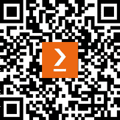

# 前言

在生产中使用 React 构建大规模应用程序可能会因为选择众多和缺乏连贯的资源而令人感到不知所措。这本实践指南旨在分享实践和示例，以帮助解决构建企业级 React 应用程序的这些挑战。

本书提供了一个具体且实用的示例，贯穿全书，以展示书中的概念。你将学习如何从头开始构建现代前端应用程序，使其适用于生产。从了解 React 生态系统概述开始，你将识别可用于解决复杂开发挑战的工具。你将学习如何构建模拟 API、组件和页面，形成一个完整的前端应用程序。本书还将分享测试、保护和以结构化方式打包应用程序的实践。最后，你将学习如何考虑可扩展性将应用程序部署到生产环境。

到本书结束时，你将能够通过遵循行业实践和专家建议，高效地构建生产就绪的应用程序。

# 本书面向的对象

本书面向已经对 JavaScript、React 以及一般意义上的 Web 开发有良好理解的初级 Web 开发者，他们希望有效地构建大规模的 React 应用程序。除了 JavaScript 和 React 的经验外，一些 TypeScript 的经验将是有益的。

# 本书涵盖的内容

*第一章*，*理解 React 应用程序的架构*，教你从架构的角度思考应用程序。它首先介绍了良好架构的重要性及其益处。然后，它讨论了 React 应用程序中的一些良好和不良实践。最后，我们将介绍一个真实 React 应用程序的规划，这个应用程序将在整本书中构建。

*第二章*，*设置和项目结构概述*，涵盖了我们将要构建的应用程序的所有工具和设置。它将介绍 Next.js、TypeScript、ESLint、Prettier、Husky 和 Lint Staged 等工具。最后，它将介绍基于功能的项目结构，这有助于改善代码库的组织。

*第三章*，*构建和记录组件*，介绍了 Chakra UI，这是一个优秀的组件库，我们将用它作为构建 UI 的基石。我们将介绍如何设置它，然后我们将构建可以在整个应用程序中重复使用的组件，以使应用程序的 UI 更加一致。最后，我们将学习如何使用 Storybook 记录这些组件。

*第四章*，*构建和配置页面*，更深入地介绍了 Next.js。首先，我们将介绍基础知识，例如 Next.js 路由和它所支持的渲染策略。然后，我们将学习如何处理共享布局。最后，我们将通过构建我们应用程序的页面来应用这些技术。

*第五章*，*模拟 API*，深入探讨了用于开发和测试的 API 模拟。它首先解释了为什么这很有用。然后，它介绍了 MSW 库，它允许以优雅的方式模拟 API 端点。最后，我们将通过实现我们应用程序的端点来应用我们所学的知识。

*第六章*，*将 API 集成到应用程序中*，教我们如何与后端 API 进行通信。我们将学习如何配置 API 客户端和 React Query，并使用它们来构建我们应用程序的 API 层。然后，我们将通过实现我们应用程序的 API 调用来应用我们所学的知识。

*第七章*，*实现用户身份验证和全局通知*，首先教你如何实现应用程序的身份验证。然后，它演示了如何通过实现我们应用程序的通知系统来处理全局状态。

*第八章*，*测试*，教你如何接近测试 React 应用程序。它涵盖了使用 Jest 的单元测试，使用 Jest 和 React Testing Library 的集成测试，以及使用 Cypress 的端到端测试。

*第八章*，*配置 CI/CD 以进行测试和部署*，涵盖了 GitHub Actions 管道的基础知识。然后，我们将学习如何配置管道以进行代码检查和测试。最后，我们将配置它以部署到 Vercel。

*第十章*，*超越*，涉及一些未涉及的话题。由于应用程序处于 MVP 阶段，有改进的空间，这一章涵盖了其中的一些改进。我们还将了解一些技术改进，这将有助于应用程序进一步扩展。

# 为了充分利用这本书

具有 JavaScript 和 React 的前期经验以及网络开发的基本知识将使你更容易跟随书中的内容。同时，拥有 TypeScript 和 Next.js 的经验是可取的，但即使没有这些经验，也应该能够跟随，因为我们在书中会涵盖基础知识。

| **本书涵盖的软件/硬件** | **操作系统要求** |
| --- | --- |
| React 18 | macOS、Windows 或 Linux |
| Next.js 12 |  |
| TypeScript 4.8 |  |

**如果您使用的是本书的数字版，我们建议您亲自输入代码或从书的 GitHub 仓库（下一节中提供链接）获取代码。这样做将有助于您避免与代码的复制和粘贴相关的任何潜在错误。**

关于设置和要求的更多详细信息，最好查看书中 GitHub 仓库中的 README 文件。

# 下载示例代码文件

您可以从 GitHub 上的[`github.com/PacktPublishing/React-Application-Architecture-for-Production`](https://github.com/PacktPublishing/React-Application-Architecture-for-Production)下载本书的示例代码文件。如果代码有更新，它将在 GitHub 仓库中更新。

我们还有其他来自我们丰富图书和视频目录的代码包，可在[`github.com/PacktPublishing/`](https://github.com/PacktPublishing/)找到。查看它们吧！

# 下载彩色图像

我们还提供了一份包含本书中使用的截图和图表彩色图像的 PDF 文件。您可以从这里下载：[`packt.link/DjfrW`](https://packt.link/DjfrW)。

# 使用的约定

本书使用了多种文本约定。

`文本中的代码`：表示文本中的代码单词、数据库表名、文件夹名、文件名、文件扩展名、路径名、虚拟 URL、用户输入和 Twitter 昵称。以下是一个示例：“让我们创建`.github/workflows/main.yml`文件和初始代码。”

代码块设置如下：

```js
name: CI/CD
on:
  - push
jobs:
# add jobs here
```

当我们希望您注意代码块中的特定部分时，相关的行或项目将以粗体显示：

```js
jobs:
  # previous jobs
  e2e:
    name: E2E Tests
    runs-on: ubuntu-latest
    steps:
      - uses: actions/checkout@v3
      - run: mv .env.example .env
      - uses: cypress-io/github-action@v4
        with:
          build: npm run build
          start: npm run start
```

任何命令行输入或输出都应如下编写：

```js
git clone https://github.com/PacktPublishing/React-Application-Architecture-for-Production.git
```

**粗体**：表示新术语、重要单词或屏幕上看到的单词。例如，菜单或对话框中的单词以粗体显示。以下是一个示例：“当用户点击**应用**按钮时，电子邮件客户端会以正确设置的主题打开。”

提示或重要注意事项

看起来是这样的。

# 联系我们

我们始终欢迎读者的反馈。

**一般反馈**：如果您对本书的任何方面有疑问，请通过电子邮件发送至 customercare@packtpub.com，并在邮件主题中提及书名。

**勘误表**：尽管我们已经尽最大努力确保内容的准确性，但错误仍然可能发生。如果您在这本书中发现了错误，如果您能向我们报告，我们将不胜感激。请访问[www.packtpub.com/support/errata](https://www.packtpub.com/support/errata)并填写表格。

**盗版**：如果您在互联网上以任何形式遇到我们作品的非法副本，如果您能提供位置地址或网站名称，我们将不胜感激。请通过 copyright@packt.com 与我们联系，并提供材料的链接。

**如果您有兴趣成为作者**：如果您在某个领域有专业知识，并且您有兴趣撰写或为书籍做出贡献，请访问[authors.packtpub.com](https://authors.packtpub.com)。

# 分享您的想法

一旦您阅读了《React Application Architecture for Production》，我们非常乐意听到您的想法！请选择[`www.amazon.in/review/create-review/error?asin=1801070539`](https://www.amazon.in/review/create-review/error?asin=1801070539)为这本书并分享您的反馈。

您的评论对我们和科技社区非常重要，并将帮助我们确保我们提供高质量的内容。

# 下载这本书的免费 PDF 副本

感谢您购买这本书！

您喜欢在路上阅读，但又无法携带您的印刷书籍到处走吗？

您的电子书购买是否与您选择的设备不兼容？

不要担心，现在，随着每本 Packt 书籍，您都可以免费获得该书的 DRM 免费 PDF 版本。

在任何地方、任何设备上阅读。直接从您最喜欢的技术书籍中搜索、复制和粘贴代码到您的应用程序中。

优惠不仅限于此，您还可以获得独家折扣、新闻通讯以及每天收件箱中的优质免费内容

按照以下简单步骤获取好处：

1.  扫描下面的二维码或访问以下链接



https://packt.link/free-ebook/9781801070539

1.  提交您的购买证明

1.  就这些！我们将直接将您的免费 PDF 和其他好处发送到您的电子邮件
