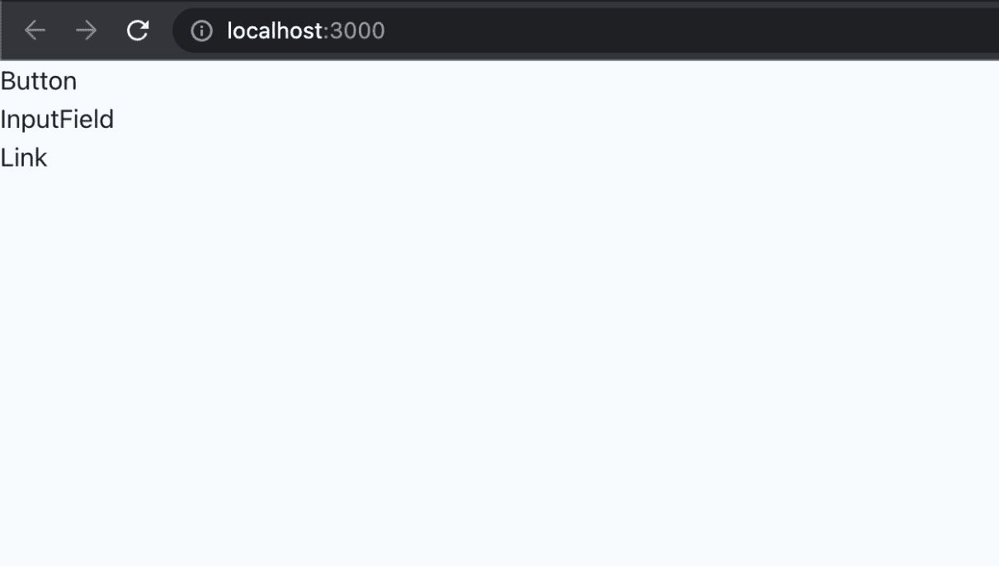
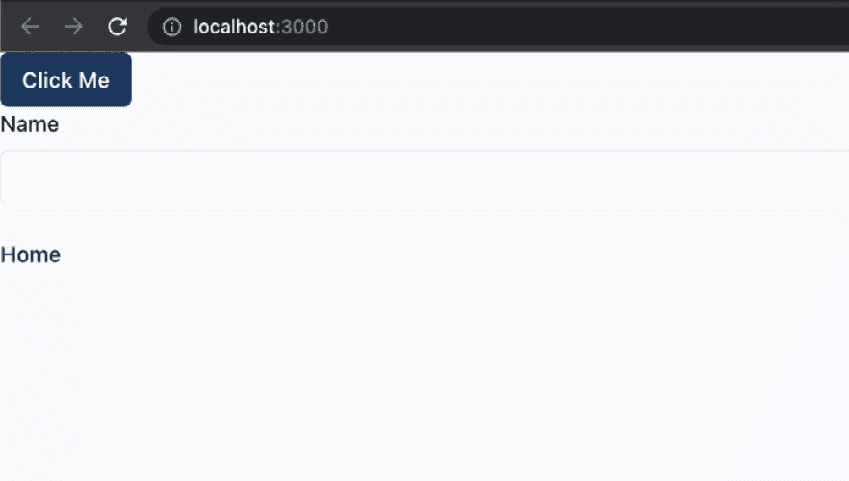
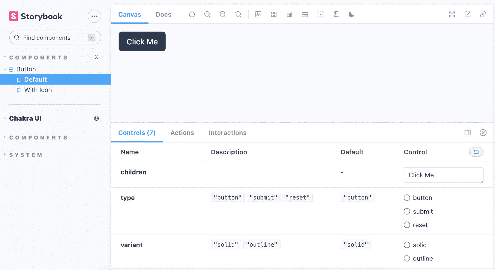

# 第三章：构建和记录组件

在 React 中，一切都是组件。这种范式允许我们将用户界面分割成更小的部分，从而使开发应用程序更容易。它还使组件可重用，因为我们可以在多个地方重用相同的组件。

在本章中，我们将构建一些组件，我们将使用这些组件作为应用程序用户界面的基础。这将使应用程序的 UI 更加一致，更容易理解和维护。我们还将学习如何使用 Storybook（一个优秀的工具，可以作为常见应用程序组件的目录）来记录组件。

在本章中，我们将涵盖以下主题：

+   Chakra UI

+   构建组件

+   Storybook

+   组件文档

到本章结束时，我们将学习如何创建和记录可重用的组件，我们可以使用这些组件来构建应用程序。

# 技术要求

在我们开始之前，我们需要设置项目。为了能够开发项目，您需要在您的计算机上安装以下内容：

+   **Node.js**版本 16 或更高版本以及**npm**版本 8 或更高版本。

安装 Node.js 和 npm 有多种方法。这里有一篇很好的文章，详细介绍了更多内容：

[`www.nodejsdesignpatterns.com/blog/5-ways-to-install-node-js`](https://www.nodejsdesignpatterns.com/blog/5-ways-to-install-node-js)

+   **VSCode**（可选）是目前最流行的 JavaScript/TypeScript 编辑器/IDE，因此我们将使用它。它是开源的，与 TypeScript 有很好的集成，并且您可以通过扩展来扩展其功能。您可以从这里下载：[`code.visualstudio.com/`](https://code.visualstudio.com/).

本章的代码文件可以在以下位置找到：[`github.com/PacktPublishing/React-Application-Architecture-for-Production`](https://github.com/PacktPublishing/React-Application-Architecture-for-Production).

可以使用以下命令在本地克隆存储库：

```js
git clone https://github.com/PacktPublishing/React-Application-Architecture-for-Production.git
```

一旦克隆了存储库，我们需要安装应用程序的依赖项：

```js
npm install
```

我们还需要提供环境变量：

```js
cp .env.example .env
```

在安装了依赖项之后，我们需要选择与本章匹配的代码库的正确阶段。我们可以通过执行以下命令来完成：

```js
npm run stage:switch
```

此命令将为我们显示每个章节的阶段列表：

```js
? What stage do you want to switch to? (Use arrow
 keys)
❯ chapter-02
  chapter-03
  chapter-03-start
  chapter-04
  chapter-04-start
  chapter-05
  chapter-05-start
(Move up and down to reveal more choices)
```

这是第三章，所以如果您想跟随，可以选择`chapter-03-start`，或者选择`chapter-03`来查看章节的最终结果。

一旦选择了章节，所有必要的文件将显示出来以跟随章节。

要跟随本章，您不需要对代码进行任何更改。您可以使用它作为参考，以帮助更好地了解代码库。

关于设置细节的更多信息，请查看`README.md`文件。

# Chakra UI

每当我们为应用程序构建 UI 时，我们必须决定使用什么来为我们的组件进行样式设计。此外，我们还必须考虑我们是否希望从头开始构建所有组件或使用带有预制组件的组件库。

使用组件库的优势在于，它为我们提供了生产力提升，因为我们不需要实现已经实现过的组件，例如按钮、对话框和标签页。此外，一些库默认提供了出色的可访问性，因此我们不必像从头开始构建那样过多地考虑它。这些库可能存在一些成本，例如难以定制或对最终包大小有重大影响。另一方面，它们为我们节省了大量开发时间。

对于我们的应用程序，我们将使用 **Chakra UI**，这是一个基于 **emotion** 和 **styled-system** 组合构建的组件库，它将允许我们以一致的方式在 JavaScript 中编写 CSS。

## Chakra UI 设置

我们已经安装了 Chakra UI 库，现在我们需要对其进行配置。

要使用 Chakra UI，首先，我们需要配置其主题提供者以启用其组件的样式。由于我们所有的提供者和包装器都在 `src/providers/app.tsx` 中定义，我们可以在那里添加 `ChakraProvider`：

```js
import {
  ChakraProvider,
  GlobalStyle,
} from '@chakra-ui/react';
import { ReactNode } from 'react';
import { theme } from '@/config/theme';
type AppProviderProps = {
  children: ReactNode;
};
export const AppProvider = ({
  children,
}: AppProviderProps) => {
  return (
    <ChakraProvider theme={theme}>
      <GlobalStyle />
      {children}
    </ChakraProvider>
  );
};
```

在这里，我们正在将整个应用程序包裹在提供者中，以应用主题和样式到所有 Chakra UI 组件。我们还渲染了 `GlobalStyles` 组件，它将接受来自我们的主题的任何全局样式并将其应用到应用程序中。

Chakra UI 设置和组件非常可定制，可以在自定义主题中配置，我们可以将其传递给提供者。它将覆盖默认的主题配置。让我们在 `src/config/theme.ts` 中配置主题，添加以下内容：

```js
import { extendTheme } from '@chakra-ui/react';
const colors = {
  primary: '#1a365d',
  primaryAccent: '#ffffff',
};
const styles = {
  global: {
    'html, body': {
      height: '100%',
      bg: 'gray.50',
    },
    '#__next': {
      height: '100%',
      bg: 'gray.50',
    },
  },
};
export const theme = extendTheme({ colors, styles });
```

我们正在定义一些将通过 `GlobalStyles` 组件注入的全局样式，我们已经在 `AppProvider` 中添加了它。我们还定义了希望在组件中可用的主题颜色。然后，我们通过使用 `extendTheme` 工具将这些配置与默认主题值结合，该工具将合并所有配置并给我们完整的主题对象。

将主题配置集中化是有用的，因为如果应用程序的品牌发生变化，它很容易使用和更改。例如，我们可以轻松地在单个位置更改主颜色值，并将其应用到整个应用程序，而无需进行任何额外的更改。

# 构建组件

现在 Chakra UI 的设置已经就绪，我们可以构建组件。在本章的起始文件中，我们已经导出了一些默认组件。目前，我们可以在 `src/pages/index.tsx` 中定义的着陆页上渲染它们，如下所示：

```js
import { Button } from '@/components/button';
import { InputField } from '@/components/form';
import { Link } from '@/components/link';
const LandingPage = () => {
  return (
    <>
      <Button />
      <br />
      <InputField />
      <br />
      <Link />
    </>
  );
};
export default LandingPage;
```

要启动应用程序开发服务器，我们需要运行以下命令：

```js
npm run dev
```

这将使新创建的页面在`http://localhost:3000`上可用。开发服务器将监听我们做出的任何更改，并使用最新的更改自动刷新页面。

首页将显示组件。如果我们打开`http://localhost:3000`，我们应该看到以下内容：



图 3.1 – 首页上初始组件的预览

目前组件并没有做太多，所以我们需要专注于它们的实现。

## 按钮

让我们从实现`Button`组件开始，这是每个应用程序中最常见的组件之一。该组件已经在`src/components/button/button.tsx`中创建，但我们需要对其进行修改。

让我们先导入其依赖项：

```js
import { Button as ChakraButton } from '@chakra-ui/react';
import { MouseEventHandler, ReactNode } from 'react';
```

现在，我们可以创建`variants`对象，它将包含我们按钮的所有样式属性，并将相应地应用于默认的 Chakra UI `Button`组件：

```js
const variants = {
  solid: {
    variant: 'solid',
    bg: 'primary',
    color: 'primaryAccent',
    _hover: {
      opacity: '0.9',
    },
  },
  outline: {
    variant: 'outline',
    bg: 'white',
    color: 'primary',
  },
};
```

然后，我们可以为`Button`组件键入属性：

```js
export type ButtonProps = {
  children: ReactNode;
  type?: 'button' | 'submit' | 'reset';
  variant?: keyof typeof variants;
  isLoading?: boolean;
  isDisabled?: boolean;
  onClick?: MouseEventHandler<HTMLButtonElement>;
  icon?: JSX.Element;
};
```

键入组件的属性是一种很好的方式来描述其 API，这对于记录其使用方式非常有用。

现在，我们可以创建`Button`组件，它只是 Chakra UI 提供的默认`Button`组件的包装器：

```js
export const Button = ({
  variant = 'solid',
  type = 'button',
  children,
  icon,
  ...props
}: ButtonProps) => {
  return (
    <ChakraButton
      {...props}
      {...variants[variant]}
      type={type}
      leftIcon={icon}
    >
      {children}
    </ChakraButton>
  );
};
```

然后，我们可以按照以下方式更新`src/pages/index.tsx`中的`Button`组件的使用：

```js
<Button variant="solid" type="button">
  Click Me
</Button>
```

## 输入字段

输入字段组件是我们构建表单时想要使用的输入组件。让我们更改`src/components/form/input-field.tsx`。

首先，我们需要导入所有依赖项：

```js
import {
  FormControl,
  FormHelperText,
  FormLabel,
  forwardRef,
  Input,
  Textarea,
} from '@chakra-ui/react';
import {
  FieldError,
  UseFormRegister,
} from 'react-hook-form';
```

然后，我们为组件的属性定义类型：

```js
export type InputFieldProps = {
  type?: 'text' | 'email' | 'password' | 'textarea';
  label?: string;
  error?: FieldError;
} & Partial<
  ReturnType<UseFormRegister<Record<string, unknown>>>
>;
```

最后，我们实现组件本身：

```js
export const InputField = forwardRef(
  (props: InputFieldProps, ref) => {
    const {
      type = 'text',
      label,
      error,
      ...inputProps
    } = props;
    return (
      <FormControl>
        {label && <FormLabel>{label}</FormLabel>}
        {type === 'textarea' ? (
          <Textarea
            bg="white"
            rows={8}
            {...inputProps}
            ref={ref}
          />
        ) : (
          <Input
            bg="white"
            type={type}
            {...inputProps}
            ref={ref}
          />
        )}
        {error && (
          <FormHelperText color="red">
            {error.message}
          </FormHelperText>
        )}
      </FormControl>
    );
  }
);
```

如您所见，我们正在构建一个输入字段组件，我们可以使用`react-hook-form`库来创建表单，我们将在接下来的章节中学习如何做到这一点。注意我们是如何使用`forwardRef`包装组件的。这将允许我们在必要时传递对组件的引用。

让我们更新其在`src/pages/index.tsx`中的使用：

```js
<InputField label="Name" />
```

## 链接

对于链接，我们将使用 Next.js 提供的`Link`组件。然而，我们希望集中配置和样式，并在所有地方使用它。让我们修改`src/components/link/link.tsx`：

首先，让我们导入所有依赖项：

```js
import { Button } from '@chakra-ui/react';
import NextLink from 'next/link';
import { ReactNode } from 'react';
```

与我们对`Button`组件所做的方式类似，我们希望允许链接接受一些变体，这将向组件应用额外的样式属性：

```js
const variants = {
  link: {
    variant: 'link',
    color: 'primary',
  },
  solid: {
    variant: 'solid',
    bg: 'primary',
    color: 'primaryAccent',
    _hover: {
      opacity: '0.9',
    },
  },
  outline: {
    variant: 'outline',
    color: 'primary',
    bg: 'white',
  },
};
```

然后，我们定义组件属性的类型：

```js
export type LinkProps = {
  href: string;
  children: ReactNode;
  variant?: keyof typeof variants;
  icon?: JSX.Element;
  shallow?: boolean;
};
```

这里是`Link`组件的实现。注意我们是如何使用 Next.js 中的`Link`组件来包装 Chakra UI 中的`Button`组件的：

```js
export const Link = ({
  href,
  children,
  variant = 'link',
  icon,
  shallow = false,
}: LinkProps) => {
  return (
    <NextLink shallow={shallow} href={href} passHref>
      <Button
        leftIcon={icon}
        as="a"
        {...variants[variant]}
      >
        {children}
      </Button>
    </NextLink>
  );
};
```

为什么我们使用 `Button` 组件而不是 Chakra UI 的 `Link`？我们本可以使用 `Link`，但我们希望大多数链接看起来和按钮一样，所以原因只是风格偏好。注意我们是如何将 `as="a"` 传递给 `Button` 的。这将使元素成为一个锚点，这在可访问性方面是正确的，并且该组件将在 DOM 中作为链接元素渲染。

让我们在 `src/pages/index.tsx` 中更新其使用情况：

```js
<Link href="/">Home</Link>
```

注意，我们无法提前预测和构建所有共享组件。有时在我们开发过程中，我们会意识到某些东西需要被抽象化。预测组件的所有边缘情况也很具有挑战性，因此过早地抽象化可能会在长期内使事情变得复杂。

目前，我们已经抽象化了我们将肯定使用的最通用的组件，保持它们原样。

记住，每个组件的实现细节并不重要。如果你不理解它们所做的一切以及它们是如何工作的，那没关系。关键是要点是我们希望抽象出最常见的组件，以便在需要时可以重用它们。

由于大多数组件库都非常通用，提供了许多选项以满足每个人的需求，因此创建我们围绕其默认组件的包装器是一个好主意，以减少默认 API 表面和适应应用程序的需求。这将减少具有太多配置选项和我们将永远不会使用的属性组件的冗余。此外，它将带来一致性，因为开发者被限制在更少的选择范围内。

让我们看看我们的索引页面，其中渲染了组件：



图 3.2 – 登录页面组件预览

太好了！现在你可以尝试使用不同的属性，看看组件的表现如何。

我们的组件工作正常，并准备好在应用程序中使用。然而，有几个问题：

+   我们正在占用索引路由。当我们想用它来执行一些有意义的事情，比如登录页面时，会发生什么？我们将无法使用该页面来预览我们的组件。当然，我们可以创建并使用另一个永远不会被使用的页面，但这也不是一个好的选择。

+   我们不想一起显示所有组件，因为这会很混乱，最好是在隔离状态下尝试它们。

+   我们想尝试组件的属性，但当前的方法无法做到，因为我们必须修改代码。

让我们在下一节中看看如何解决这些问题，并在不更改应用程序代码的情况下隔离开发和尝试组件。

# Storybook

**Storybook** 是一个允许我们在隔离状态下开发和测试 UI 组件的工具。我们可以将其视为制作所有组件目录的工具。它非常适合文档化组件。使用 Storybook 的几个好处包括以下内容：

+   Storybook 允许在无需复制应用确切状态的情况下独立开发组件，使开发者能够专注于他们正在构建的事物

+   Storybook 作为 UI 组件的目录，允许所有利益相关者尝试组件而无需在应用程序中使用它们

Storybook 的配置可以通过以下命令完成：

```js
npx storybook init
```

此命令将安装所有必需的依赖项，并设置位于项目根目录 `.storybook` 文件夹中的配置。

## Storybook 配置

我们已经安装了 Storybook，现在让我们看看配置，它包含两个文件。

第一个文件包含主要配置，它控制 Storybook 服务器的行为以及如何处理我们的故事。它位于 `.storybook/main.js`：

```js
const path = require('path');
const TsconfigPathsPlugin = require('tsconfig-paths-webpack-plugin');
module.exports = {
  stories: ['../src/**/*.stories.tsx'],
  addons: [
    '@storybook/addon-links',
    '@storybook/addon-essentials',
    '@storybook/addon-interactions',
    '@chakra-ui/storybook-addon',
  ],
  features: {
    emotionAlias: false,
  },
  framework: '@storybook/react',
  core: {
    builder: '@storybook/builder-webpack5',
  },
  webpackFinal: async (config) => {
    config.resolve.plugins = config.resolve.plugins || [];
    config.resolve.plugins.push(
      new TsconfigPathsPlugin({
        configFile: path.resolve(
          __dirname,
          '../tsconfig.json'
        ),
      })
    );
    return config;
  },
};
```

主要配置包含以下属性：

+   `stories`：一个表示我们的故事位置的 glob 数组。

+   `addons`：用于增强 Storybook 默认行为的插件列表。

+   `features`：启用 Storybook 的附加功能。

+   `framework`：框架特定的配置。

+   `core`：内部功能配置。

+   `webpackFinal`：扩展默认 webpack 配置的配置。我们通过告诉 Storybook 使用 `tsconfig.json` 文件中的路径来启用绝对导入。

第二个配置文件控制故事在 UI 中的渲染方式。此配置位于 `.storybook/preview.js`：

```js
import { theme } from '../src/config/theme';
export const parameters = {
  actions: { argTypesRegex: '^on[A-Z].*' },
  controls: {
    matchers: {
      color: /(background|color)$/i,
      date: /Date$/,
    },
  },
  controls: { expanded: true },
  chakra: {
    theme,
  },
};
```

注意我们是如何在 `parameters` 中的 `chakra` 属性中传递主题的。这将使 Chakra 主题能够应用于 Storybook 中的组件。

我们可以选择导出装饰器，这将包装所有故事。如果组件依赖于我们希望在所有故事中可用的某些提供者，这很有用。

## Storybook 脚本

我们的故事书设置有两个 npm 脚本：

+   在开发中运行 Storybook

要启动开发服务器，我们可以执行以下命令：

```js
npm run storybook
```

此命令将在 `http://localhost:6006/` 打开 Storybook。

+   为生产构建 Storybook

我们还可以生成并部署故事，以便在不运行开发服务器的情况下可见。要构建故事，我们可以执行以下命令：

```js
npm run storybook:build
```

生成的文件可以在 `storybook-static` 文件夹中找到，并且可以部署到任何地方。

现在我们已经熟悉了设置，是时候为组件编写故事了。

# 组件文档化

如果我们从上一节回忆起来，`.storybook/main.js` 中的配置具有以下 `stories` 属性：

```js
stories: ['../src/**/*.stories.tsx']
```

这意味着 `src` 文件夹中以 `.stories.tsx` 结尾的任何文件都应由 Storybook 选择并作为故事处理。换句话说，我们将将与组件并列放置故事，因此每个组件的结构将类似于以下内容：

```js
components
  my-component
    my-component.stories.tsx
    my-component.tsx
    index.ts
```

我们将根据 **组件故事格式**（**CSF**），一个编写组件示例的开放标准，创建我们的故事。

但首先，什么是故事？根据 CSF 标准，一个故事应该代表一个组件的单个真相来源。我们可以将故事视为一个用户故事，其中组件以相应的状态呈现。

CSF 需要以下内容：

+   默认导出应该定义关于组件的元数据，包括组件本身、组件的名称、装饰器和参数

+   命名导出应定义所有故事

现在，让我们为组件创建故事。

## 按钮故事

要为 `Button` 组件创建故事，我们需要创建一个 `src/components/button/button.stories.tsx` 文件。

然后，我们可以开始添加所需的导入：

```js
import { PlusSquareIcon } from '@chakra-ui/icons';
import { Meta, Story } from '@storybook/react';
import { Button, ButtonProps } from './button';
```

然后，我们创建元配置对象：

```js
const meta: Meta = {
  title: 'Components/Button',
  component: Button,
};
export default meta;
```

注意，我们将其作为默认导出。根据 CSF，这是 Storybook 所要求的。

由于我们可以有多个故事，我们必须创建一个故事模板：

```js
const Template: Story<ButtonProps> = (props) => (
  <Button {...props} />
);
```

然后，我们可以导出第一个故事：

```js
export const Default = Template.bind({});
Default.args = {
  children: 'Click Me',
};
```

我们可以将所需的任何属性传递给附加到故事的 `args` 对象，这将反映在 Storybook 的故事中。

我们可以为另一个故事做同样的事情，其中我们想要有一个带有图标的 `Button` 版本：

```js
export const WithIcon = Template.bind({});
WithIcon.args = {
  children: 'Click Me',
  icon: <PlusSquareIcon />,
};
```

要查看故事，请执行以下命令：

```js
npm run storybook
```

现在，让我们访问 `http://localhost:6006/`：



图 3.3 – 按钮组件故事

然后，我们单独预览了 `Button` 组件。注意底部的控制面板。这为我们提供了一个友好的界面来操作组件的属性，而无需接触代码。

这难道不是比我们在首页上渲染组件时更好吗？我们可以将故事部署到任何地方，并允许非技术人员在没有编码知识的情况下实验组件。

## 练习

为了巩固你对 Storybook 的理解，让我们尝试一些练习。继续创建以下组件的故事：

+   `输入字段`：

    +   默认故事

    +   带有错误故事

+   `链接`：

    +   默认故事

    +   带图标的故事

# 摘要

在本章中，我们的重点是构建我们将重用在我们的应用程序中的基础组件。

我们首先配置了 Chakra UI 提供者和主题。然后，为了测试目的，我们在首页上显示组件。它们没有做什么，所以我们实现了它们。定义共享组件的目的在于我们可以将它们在任何地方重用，这从长远来看使开发更容易。组件在这里所做的事情并不重要。重要的是要考虑将创建共享组件作为应用程序的基础。

我们随后需要在某处预览组件，由于在页面上这样做不是一个非常优雅的解决方案，我们选择了 Storybook。我们介绍了其配置，然后为 `Button` 组件定义了几个故事。这些故事是用 **组件故事格式** （**CSF**） 编写的，这是一种编写组件示例的标准。

作为本章结束时的练习，还有更多的故事需要实现，这应该能够巩固到目前为止的所有学习成果。

在下一章中，当我们开始创建我们的页面时，我们将使用这些组件。
