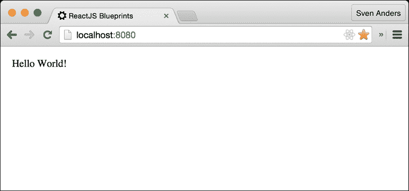
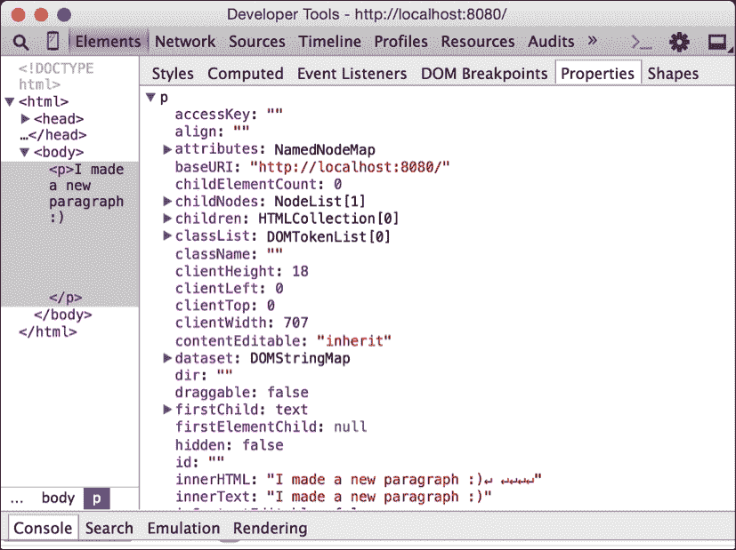
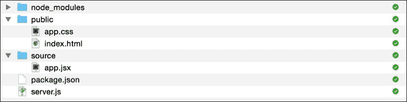

# 第一章. 深入了解 ReactJS

欢迎亲爱的读者！在本书中，您将找到一套蓝图，您可以使用这些蓝图使用 ReactJS 开发现代网络应用程序。

本章将向您介绍 ReactJS，并涵盖如何使用基于组件的架构进行工作。您将学习 ReactJS 中的所有重要概念，例如创建和挂载组件、处理 props 和 states、理解生命周期方法，以及设置高效开发的工作流程。

在本章中，我们将：

+   介绍 ReactJS

+   探索 props 和 states

+   了解所有重要的生命周期方法

+   了解合成事件和虚拟 DOM

+   学习现代 JavaScript 开发者的工作流程

+   组合

+   为我们所有的应用创建基本的脚手架

即使你之前有 ReactJS 的使用经验，也值得阅读这一章，特别是脚手架部分，因为我们将使用这个脚手架来构建本书中大部分的蓝图。

让我们开始吧！

# 介绍 ReactJS

要高效地使用 ReactJS 进行开发，了解它是什么以及它不是什么是至关重要的。ReactJS 不是一个框架。ReactJS 将自己描述为**MVC**（**模型-视图-控制器**）设计模式中的**V**。它是一个视图库，您可以将其与**AngularJS**、**Ember**和**Meteor**等框架结合使用，甚至可以与其他流行的 JavaScript 库，如**Knockout**结合使用。

许多人单独使用**React**，并将其与称为**Flux**的数据流模式结合使用。Flux 背后的想法是建立单向数据流，这意味着数据应该从您的应用程序中的单个点起源并向下流动。我们将在第二章*创建网络商店*中更详细地探讨这个模式。

## 现代 JavaScript 开发

2015 年，JavaScript 在许多年后迎来了第一次重大升级。语法是 JavaScript 2015。你可能知道它叫作 EcmaScript 6。EcmaScript 委员会在 2015 年中决定更改名称，从现在开始，JavaScript 将每年更新一次。现代浏览器正在逐步实现对新特性的支持。

### 注意

关于本书中您将看到的代码的说明。本书将使用 JavaScript 2015。常青浏览器，如 Firefox、Chrome 和 Microsoft Edge，将根据自己的时间表实现新功能，这意味着某些浏览器可能在新功能被其他浏览器支持之前就支持了这些功能，而某些功能可能根本不会被实现。

你很可能会遇到想要利用新语言特性而又不想等待它被实现的情况。向后兼容性也是一个问题，因为你不希望让你的用户落后。

解决这两个问题的方法是使用转译器生成基线 EcmaScript-5 兼容代码，例如**Traceur**或**Babel**。由于 Babel 部分是为了 ReactJS 而构建的，我建议你选择这个，本书中，我们将依赖 Babel 来满足我们的转译需求。

在本书中，我们将通过开发迭代脚手架或基本设置来探索现代开发者的工作流程。在设置和使用这个脚手架时，我们将大量依赖终端、`Node.js`和`npm`。如果你对此不熟悉，不要担心。我们会慢慢来。

# 组件规范

ReactJS 组件有一套内置的方法和属性，你将依赖它们。其中一些用于调试，如`displayName`和`propTypes`；一些用于设置初始数据，如`getInitialState`和`getDefaultProps`；最后，还有一些处理组件生命周期的方法，如`componentDidMount`、`componentShouldUpdate`等。

## Props 和 states

组件内的数据可以来自外部（*props*）或从内部实例化（*states*）。

由于测试性和不可变性的考虑，我们尽可能希望依赖于传递给组件的数据，而不是处理内部状态。然而，有许多原因会让你想要使用内部状态，所以让我们详细了解一下 props 和 states，以及何时使用哪一个。

### Props

让我们看看一个简单的组件：

```js
import React from 'react';
import { render } from 'react-dom';

const App = React.createClass({
  render() {
    return (
      <div>My first component</div>
    );
  }
});

render(<App />, document.querySelector('#app'));
```

当你执行此组件时，你将在浏览器窗口中看到**我的第一个组件**这几个字。

### 注意

注意，应用程序渲染到具有`id` app 的`div`元素。

相应的 HTML 文件需要看起来像这样：

```js
<!DOCTYPE html>
<body>
  <div id="app"></div>
</body>

<script type="text/javascript" src="img/app.js"></script>
```

此组件定义了一个名为`app`的常量，它使用内置的`createClass`方法创建了一个 React 组件。

`render`方法是 ReactJS 组件中唯一必需的方法。你可以避免使用所有其他方法，但这个方法不能省略。在`render`方法中，你可以编写 HTML 和 JavaScript 的组合，称为**JSX**，或者使用 ReactJS 元素组合 HTML 代码。

### 注意

JavaScript 无法理解 JSX，所以当你编写 JSX 代码时，你需要将其转换为 JavaScript，然后在 JavaScript 环境中执行。将 JSX 转换为 JavaScript 最简单的方法是使用 Babel 转译器，因为它会自动完成这项工作。

无论你决定如何做，以下 JSX 代码将被转换：

```js
<div>My first component</div>
```

它将被转换成这样：

```js
React.createElement("div", null, "My first component");
```

`createElement()`方法接受三个参数：`html`标签、一个`null`字段和 HTML 代码。第二个字段实际上是一个具有属性（或`null`）的对象。我们稍后会回到这一点。

让我们引入属性的概念，使这个组件更有趣：

```js
const App = React.createClass ({
  render() {
    return (
      <div>{this.props.greeting}</div>
    );
  }
});

render(<App greeting="Hello world!"/>,
document.querySelector('#app'));
```

所有组件属性都可以通过访问 `this.props` 来使用。在这里，我们设置了一个初始消息，**Hello World**！现在，这就是您执行组件时看到的内容：



Props 不可修改，应被视为不可变。

### 注意

注意，props 是与组件调用一起发送的。

您可以发送任意多的属性，并且它们始终在 `this.props` 下可用。

如果您想发送多个属性，只需按顺序将它们添加到组件调用中：

```js
<App greeting="Hello world" message="Enjoy the day" />
```

您可以通过调用 `getDefaultProps` 来设置组件的初始 props。当您预计某个 prop 将会在组件的生命周期后期某个点可用时，这可能会很有用：

```js
getDefaultProps() {
  return {
    greeting: ""
  }
}
```

如果您通过添加问候语来调用组件，组件将简单地显示一个空页面。如果您没有初始 prop，React 将会抛出一个错误，并抱怨您正在引用一个不存在的属性。

### States

状态类似于 props，但它们是为仅在组件内部可用的变量而设计的。您可以像设置 props 一样设置状态：

```js
setInitialState() {
  return {
    greeting: "Hello world!"
  }
}
```

此外，您还可以使用 `this.state` 来调用变量：

```js
render() {
  return (
    <div>{this.state.greeting}</div>
   );
}
```

与 props 类似，如果您尝试使用一个不存在的状态变量，ReactJS 将会抛出一个错误。

状态主要用于您在组件内部进行更改时，这些更改只在该组件中有意义。让我们通过一个例子来理解这一点：

```js
getInitialState: function () {
  return {
    random_number: 0
  }
},
componentDidMount(){
  setInterval(()=>{
    this.setState({
      random_number: Math.random()*100
    });
  },1000)
},
render() {
  return (
    <div>{this.state.random_number}</div>
  );
}
```

在这里，我们设置一个 `random_number` 变量为 `0`。我们访问内置的 `componentDidMount` 方法，并启动一个每秒为该变量设置新随机数的间隔。在渲染中，我们简单地输出变量。每当状态改变时，ReactJS 都会通过重新渲染输出进行响应。每次您运行 `setState` 时，ReactJS 都会触发组件的重新渲染。注意限制 `setState` 的使用次数，因为如果您过于频繁地使用它们，可能会遇到性能问题。

## render

这是组件中唯一必需的方法。它应该返回一个单一子元素，例如 JSX 结构，但如果您不想渲染任何内容，它也可以返回 `null` 或 `false` 来表示您不想渲染任何内容：

```js
render(){
  return (<div>My component</div>);
}
```

## statics

此对象可以用来定义可以在组件上调用的静态方法：

```js
import React from 'react';
const App = React.createClass ({
  statics: {
    myMethod: (foo) => {
      return foo == "bar";
    }
  },
  render() {
    return null;
  }
});
console.log(App.myMethod('bar'));  // true
```

### 注意

注意，静态方法无法访问组件的 props 或状态。

## propTypes

此对象允许您验证传递给组件的 props。这是一个可选的工具，可以帮助您在开发应用程序时，如果传递给组件的 props 与您的规范不匹配，它将在控制台日志中显示：

```js
propTypes: {
  myOptionalObject: React.PropTypes.object,
  aRequiredString: React.PropTypes.string.isRequired,
  anOptionalNumber: React.PropTypes.number,
  aValueOfAnyKind: React.PropTypes.any,
  customProp: function(props, propName, componentName) {
    if (!/matchme/.test(props[propName])) {
      return new Error('Validation failed!');
    }
  }
}
```

最后一个例子创建了一个自定义验证器，您可以使用它来验证更复杂的数据值。

## displayName

如果您没有明确设置此值，它将自动设置，并用于调试目的：

```js
displayName: "My component Name"
```

# 生命周期方法

生命周期方法是你在组件中可以重写的一组函数。最初，除了`shouldComponentUpdate`（默认为`true`）之外，其他都是空的。

## `componentDidMount`

这是你在应用中会使用到最常见的方法之一。这是你放置任何希望在组件第一次渲染后立即运行的函数的地方。

你可以访问此方法中的当前状态和 props 的内容，但请注意不要在这里运行`setState`，因为这将触发无限更新循环。

值得注意的是，如果你正在开发一个服务器端应用程序，这个组件将不会被调用。在这种情况下，你将不得不依赖`componentWillMount`：

```js
componentDidMount() {
  // Executed after the component is mounted
}
```

## `componentWillMount`

此方法将在组件第一次渲染之前执行。你在这里可以访问当前组件的状态和 props，并且与`componentDidMount`不同，在这里运行`setState`是安全的（ReactJS 会理解在这个方法中状态的变化应该立即设置，而不是触发重新渲染）。

此方法在服务器端和客户端应用程序中都会执行：

```js
componentWillMount() {
  // Executed before the component is mounted 
}
```

## `shouldComponentUpdate`

当组件接收到新的 props 或状态发生变化时，此方法会被调用。

默认情况下，`shouldComponentUpdate`返回一个`true`值。如果你重写它并返回`false`，尽管接收到更新的 props 或新的状态，组件也永远不会更新。如果你创建了一个应该只在满足某些条件或根本不应该更新的组件，这可能会很有用。如果你将此设置为`false`，你可以从速度提升中受益。然而，在使用此方法时应该非常小心，因为粗心使用可能导致难以追踪的 bug。

## `componentWillReceiveProps`

此方法让你比较传入的 props，并且可以在调用渲染方法之前作为响应 props 转换的机会。使用`componentWillReceiveProps(object nextProps)`来调用此方法，以便访问传入的 props。

值得注意的是，如果你在这里调用`setState`，不会触发额外的重新渲染。它不会在初始渲染时被调用。

没有类似的方法来响应纯状态变化，但如果你需要在渲染之前响应状态变化，可以使用`componentWillUpdate`。

此方法在初始渲染时不执行：

```js
componentWillReceiveProps(nextProps) {
  // you can compare nextProps with this.props
  // and optionally set a new state or execute functions
  // based on the new props

}
```

## `componentWillUpdate`

此方法在渲染之前执行，当组件接收到新的 props 或 states，但不在初始渲染时执行。

使用`componentWillUpdate(object nextProps, object nextState)`来调用此方法，以便使用`nextProps`和`nextState`访问传入的 props 和 states。

由于你可以在该方法中评估新的状态，因此在这里调用 `setState` 将触发无限循环。这意味着你无法在这个方法中使用 `setState`。如果你想根据 prop 的变化运行 `setState`，请使用 `componentWillReceiveProps` 代替：

```js
componentWillUpdate (nextProps) {
  // you can compare nextProps with this.props 
  // or nextState with this.state
}
```

## componentDidUpdate

当组件接收到新的 props 或 states 并执行了 render 方法时，此方法会被执行：

```js
componentDidUpdate() {
  // Execute functions after the component has been updated
}
```

## componentWillUnmount

最后的生命周期方法是 `componentWillUnmount`。这个方法在组件从 DOM 中卸载之前被调用。如果你需要清理内存或使计时器失效，这就是你要做的：

```js
componentWillUnmount() {
  // Execute functions before the component is unmounted
  // from the DOM
}
```

# 合成事件和虚拟 DOM

让我们探讨常规 DOM 和虚拟 DOM 之间的差异，以及你在编写代码时需要考虑的事项。

## DOM

**文档对象模型**（**DOM**）是 HTML 文档的编程 API。每次你要求浏览器渲染 HTML 时，它都会解析你所写的代码，将其转换为 DOM，然后在浏览器中显示它。它非常宽容，因此你可以编写无效的 HTML，仍然可以得到你想要的结果，甚至不知道你犯了错误。

例如，假设你写下以下代码行，并用网络浏览器解析它：

```js
       <p>I made a new paragraph! :)
```

在此之后，DOM 将显示以下结构：



关闭标签 `</p>` 会自动为你插入，并且已经创建了一个具有所有相关属性的 `<p>` 标签的 DOM 元素。

ReactJS 并不那么宽容。如果你在 `render` 方法中写下相同的 HTML，它将无法渲染并抛出 `「未终止的 JSX 内容」` 错误。这是因为 JSX 需要严格匹配开标签和闭标签。这实际上是一件好事，因为它可以帮助你编写语法正确的 HTML。

## 虚拟 DOM

虚拟 DOM 实际上是真实 DOM 的一个更简单的实现。

ReactJS 并不直接与 DOM 交互。它使用一个虚拟 DOM 的概念，通过它维护一个较小且更简化的内部元素集，并且只有在元素集的状态发生变化时，才会将更改推送到可见 DOM。这使得你可以在不影响其他元素的情况下切换可见元素的部分，简而言之，这使得 DOM 更新过程非常高效。最好的部分是，这一切都是免费的。你不必担心它，因为 ReactJS 在后台处理一切。

然而，这也意味着你不能在 DOM 中查找更改并直接进行更改，就像你通常使用库（如 **jQuery**）或原生 JavaScript 函数（如 `getElementById()`）那样。

相反，你需要为目标元素附加一个名为 `refs` 的引用。你可以通过在元素中添加 `ref="myReference"` 来实现这一点。现在，你可以通过调用 `React.findDOMNode(this.refs.myReference)` 来获取这个引用。

## 合成事件处理器

每当你调用 ReactJS 中的事件处理器时，它们都会传递一个**SyntheticEvent**实例而不是原生事件处理器。它与原生事件处理器的接口相同，但它具有跨浏览器兼容性，因此你可以使用它而不用担心是否需要在代码中为不同的浏览器实现做出例外。

事件在冒泡阶段被触发。这意味着事件首先被捕获到最深的目标，然后传播到外部元素。

有时，你可能希望立即捕获事件。在这种情况下，在事件后添加`Capture`可以实现这一点。例如，要立即捕获`onClick`，使用`onClickCapture`等等。

你可以通过调用`event.stopPropagation()`或`event.preventDefault()`在适当的地方停止事件传播。

### 注意

可用的所有事件处理器的完整列表可在[`facebook.github.io/react/docs/events.html`](https://facebook.github.io/react/docs/events.html)找到。

## 整合所有内容

当我们将所有这些整合在一起时，我们可以通过引用元素和事件处理器来扩展示例应用：

```js
import React from 'react';
import {render} from 'react-dom';

const App = React.createClass ({

  getInitialState() {
    return {
      greeting: "",
      message: ""
    }
  },

  componentWillMount() {
    this.setState ({
      greeting: this.props.greeting
    });
  },

  componentDidMount() {
    this.refs.input.focus();
  },

  handleClear: function (event) {
    this.refs.input.value="";
    this.setState ({
      message: ""
    });
  },

  handleChange: function (event) {
    this.setState ({
      message: event.target.value
    });
  },

  render: function () {
    return (
      <div>
        <h1>Refs and data binding</h1>
        <h2>{this.state.greeting}</h2>
        Type a message:
        <br/>
        <input type="text" ref="input"
          onChange={this.handleChange} />
        <br/>
        Your message: {this.state.message}
        <br/>
        <input type="button"
          value="Clear"
          onClick={this.handleClear}
        />
      </div>

    );
  }

});

render (
  <App greeting="Let's bind some values" />,
    document.getElementById('#app')
);
```

让我们从结尾开始。就像我们之前做的那样，我们通过渲染一个名为**app**的单个 ReactJS 组件，并传递一个属性到具有`#app` ID 的元素上来初始化我们的应用。

在应用挂载之前，我们为我们的两个状态值设置初始值：`greeting`和`message`。在应用挂载之前，我们将问候状态的设置为其传递给应用的问候属性相同的值。

然后，我们在`render`方法中添加输入框、一个清除按钮以及一些文本，并将`onChange`处理器和`onClick`处理器附加到这些元素上。我们还为输入框添加了`ref`。

在组件挂载后，我们通过其`ref`参数找到消息框，并告诉浏览器将其聚焦。

最后，我们可以进入事件处理器。`onChange`处理器绑定到`handleChange`。它将在每次按键时激活，并保存一个新的消息状态，即输入框的当前内容。然后 ReactJS 将在`render`方法中重新渲染内容。在协调过程中，它将注意到输入框中的值与上一次渲染不同，并确保这个框以更新后的值渲染。同时，ReactJS 也会在**您的消息：**后的空文本元素中填充状态值。

`handleClear`方法简单地重置消息状态并使用`refs`清除输入框。

这个例子稍微有些牵强。它可以缩短很多，并且将属性存储为状态通常是你应该避免的事情，除非你有非常充分的理由这样做。根据我的经验，使用本地状态是你会遇到的最容易出错的代码，也是最难编写测试的代码。

# 组合

组合是将事物组合在一起以形成更复杂的事物，然后将这些事物组合起来以形成更复杂的事物，如此类推的行为。

当创建超出 Hello World 的应用时，知道如何组合 ReactJS 组件至关重要。由许多小部分组成的程序比单一的大型单体应用更容易管理。

使用 ReactJS 组合应用非常简单。例如，我们刚刚创建的 Hello World 应用可以通过以下代码导入到新的组件中：

```js
const HelloWorld = require("./helloworld.jsx");
const HelloWorld = require("./helloworld.jsx");
```

在你的新组件中，你可以这样使用`HelloWorld`变量：

```js
render() {
  return <div>
  <HelloWorld />
</div>
}
```

你创建的每个组件都可以以这种方式导入和使用，这也是选择 ReactJS 的许多吸引人理由之一。

# 使用现代前端工具进行开发

很难过分强调`Node.js`和`npm`在现代 JavaScript 开发中的重要性。这些关键技术是 JavaScript 网络应用开发的核心，我们将在这本书中开发的程序中依赖`Node.js`和`npm`。

`Node.js`适用于 Windows、Mac 和 Linux，安装起来非常简单。我们将在这本书的所有示例中使用`Node.js`和`npm`。我们还将使用 EcmaScript 2015 和转译器将代码转换为与旧浏览器兼容的基线 JavaScript 代码。

如果你之前没有使用过这个工作流程，准备好兴奋吧，因为它不仅会使你更有效率，还会为你打开一个开发者美好世界的大门。

让我们开始吧。

## Browserify

传统的 Web 开发方法需要你手动将脚本添加到`index.html`文件中。这通常包括一系列框架或库，再加上你自己的代码，你按顺序添加它们，以确保它们按正确的顺序加载和执行。这种方法有几个缺点。版本控制变得困难，因为你没有很好的方法来控制你的外部库的新版本是否与你的其他代码兼容。因此，许多网络应用都带有旧的 JavaScript 库。组织你的脚本也是一个问题，因为当你升级时，你必须手动添加和删除旧版本。文件大小也是一个问题，因为许多库包含了你不需要的更多功能。

如果我们有一个工具可以保持你的依赖项更新，在你遇到不兼容问题时通知你，并移除你不需要的代码，那岂不是很好？答案是肯定的，幸运的是，这样的工具确实存在。

唯一的缺点是您必须改变编写代码的方式。您不再编写依赖于全局环境变量的脚本，而是编写自包含的模块化代码，并且您始终在开始时指定您的依赖项。如果您认为这并不是一个很大的缺点，您是对的。事实上，这是一个巨大的改进，因为这使代码易于阅读和理解，并在编写测试时允许轻松的依赖注入。

组装模块化代码的最流行工具是**Browserify**和**Webpack**。

我们将专注于**Browserify**，简单的理由是它非常容易使用，并且具有出色的插件支持。我们将在第六章中查看**Webpack**，*高级 React*。这两个工具都将分析您的应用程序，找出您正在使用的模块，并组装一个包含您在浏览器中加载代码所需所有内容的 JavaScript 文件。

为了使这个功能正常工作，你需要一个基础文件，这是你应用程序的起点。在我们的框架中，我们将称之为`app.jsx`。这个文件将包含对您的模块和它所使用的组件的引用。当您创建新的组件并将它们连接到`app.jsx`或`app.jsx`的子组件时，**Browserify**会将它们添加到包中。

存在许多工具可以增强 Browserify 的包生成。对于 EcmaScript 2015 及更高版本的 JavaScript 代码，我们将使用**Babelify**。这是一个方便的工具，除了将 JavaScript 转换为 EcmaScript 5 之外，它还会将 React 特定的代码（如 JSX）转换为 EcmaScript 5。换句话说，您不需要使用单独的 JSX 转换器来使用 JSX。

我们还将使用**Browser-sync**，这是一个在您编辑时自动重新加载您代码的工具。这极大地加快了开发过程，并且在使用了一段时间之后，您将永远不会想回到手动刷新应用程序。

## 搭建我们的 React 应用程序

我们将采取以下步骤来设置我们的开发工作流程：

1.  创建一个`npm`项目。

1.  安装依赖项。

1.  创建一个服务器文件。

1.  创建一个开发目录。

1.  创建我们的基础`app.jsx`文件。

1.  运行服务器。

首先，请确保您已安装`npm`。如果没有，请访问[`nodejs.org/download/`](https://nodejs.org/download/)并下载安装程序。以下步骤的详细说明如下：

1.  创建一个您希望应用程序排序的目录，并打开一个终端窗口，然后使用`cd`进入该文件夹。

    通过输入`npm init`然后按*Enter*键来初始化您的应用程序。给项目起一个名字，然后回答后续的几个问题，或者直接留空。

1.  我们将使用`npm`获取一些包以开始。运行以下命令将获取这些包并将依赖项添加到您新创建的`package.json`文件中：

    ```js
    npm install –-save babelify@7.2.0 browserify-middleware@7.0.0 express@4.13.3 react@0.14.3 reactify@1.1.1 browser-sync@2.10.0 babel-preset-react@6.3.13 babel-preset-es2015@6.3.13 browserify@12.0.1 react-dom@0.14.3 watchify@3.6.1

    ```

    Babel 需要一个名为`.babelrc`的配置文件。将其添加到以下代码中：

    ```js
    {
      "presets": ["es2015","react"]
    }
    ```

1.  使用您喜欢的文本编辑器创建一个新的文本文件，添加以下代码，并将其保存为`server.js`：

    ```js
    var express = require("express");
    var browserify  = require('browserify-middleware');
    var babelify = require("babelify");
    var browserSync = require('browser-sync');
    var app = express();
    var port = process.env.PORT || 8080;
    ```

    此部分设置我们的应用，使用**express**作为我们的 Web 服务器。它还初始化`browserify`、`babelify`和`browser-sync`。最后，我们将应用设置为在端口`8080`上运行。`process.env.PORT || 8080`这一行代码的意思是您可以覆盖端口，通过在服务器脚本前加上`PORT 8085`来在端口`8085`或您想使用的任何其他端口上运行：

    ```js
    browserify.settings ({
      transform: [babelify.configure({
      })],
      presets: ["es2015", "react"],
      extensions: ['.js', '.jsx'],
      grep: /\.jsx?$/
    });
    ```

    这设置了 Browserify，使用 Babelify 将所有具有`.jsx`文件扩展名的代码转换为 Babel。`0`阶段的配置意味着我们想要使用尚未获得 EcmaScript 委员会批准的实验性代码：

    ```js
    // serve client code via browserify
    app.get('/bundle.js', browserify(__dirname+'/source/app.jsx'));
    ```

    我们希望在`index.html`文件中使用`<script src="img/bundle.js"></script>`引用我们的 JavaScript 包。当 Web 服务器注意到对该文件的调用时，我们告诉服务器发送我们`source`文件夹中的 browserified `app.jsx`文件代替：

    ```js
    // resources
    app.get(['*.png','*.jpg','*.css','*.map'], function (req, res) {
      res.sendFile(__dirname+"/public/"+req.path);
    });
    ```

    使用此配置，我们告诉 Web 服务器从`public.folder`中的任何列出的文件提供服务：

    ```js
    // all other requests will be routed to index.html
    app.get('*', function (req, res) {
      res.sendFile(__dirname+"/public/index.html");
    });
    ```

    这行代码指示当用户访问根路径时，Web 服务器应提供`index.html`：

    ```js
    // Run the server
    app.listen(port,function() {
      browserSync ({
        proxy: 'localhost:' + port,
            files: ['source/**/*.{jsx}','public/**/*.{css}'],
        options: {
          ignored: 'node_modules'
        }
      });
    });
    ```

    最后，使用`browser-sync`运行 Web 服务器，代理您选择的端口。这意味着如果您指定端口`8080`作为端口，您的面向公众的端口将是一个代理端口（通常是`3000`），它将代表您访问`8080`：

    我们告诉`browser-sync`监控我们`source/`文件夹中的所有 JSX 文件和`public/`文件夹中的 CSS 文件。每当这些文件发生变化时，`browser-sync`将更新并刷新页面。我们还告诉它忽略`node_modules/`文件夹中的所有文件。这通常是一个明智的做法，因为该文件夹通常会包含数千个文件，您不希望浪费时间等待这些文件被扫描：

1.  接下来，创建两个名为`public`和`source`的目录。将以下三个文件：`index.html`和`app.css`添加到您的 public 文件夹中，将`app.jsx`添加到您的`source`文件夹中。

    在`index.html`文件中写入以下内容：

    ```js
    <!DOCTYPE html>
    <html>
      <head>
        <title>ReactJS Blueprints</title>
        <meta charset="utf-8">
        <link rel="stylesheet" href="app.css" />

      </head>
      <body>
        <div id="container"></div>
          <script src="img/bundle.js"></script>
      </body>

    </html>
    ```

    在`app.css`文件中写入以下内容：

    ```js
    body {
      background:#eee;
      padding:22px;
    }
    br {
      line-height: 2em;
    }
    h1 {
      font-size:24px;
    }
    h2 {
      font-size:18px;
    }
    ```

    在`app.jsx`文件中写入以下内容：

    ```js
    'use strict';
    import React from 'react';
    import { render } from 'react-dom';
    const App = React.createClass({
      render() {
        return (
          <section>
            <h1>My scaffold</h1>
            <p>Hello world</p>
          </section>
        );
      }
    });

    render (
      <App />,
        document.getElementById('container')
    );
    ```

    您的文件结构现在应该看起来像这样：

    

## 运行应用

前往应用的根目录，输入`node server`，然后按*Enter*。这将启动一个 Node 服务器，几秒钟后，`browser-sync`将打开一个带有位置`http://localhost:3000`的 Web 浏览器。如果您在端口`3000`上运行了其他 Web 服务器或进程，`browser-sync`将选择不同的端口。查看控制台输出以确保它选择了哪个端口。

你将在屏幕上看到`app.jsx`中渲染方法的全部内容。在后台，Browserify 已经使用 Babelify 将你的 JSX 和 ES2015 代码以及导入的依赖项转换为单个`bundle.js`文件，该文件在`http://localhost:3000`上提供。当这个服务器运行时，每次你在这个服务器运行时对代码进行更改，应用程序和 CSS 代码都会被刷新，所以我强烈建议你尝试与代码进行实验，实现一些生命周期方法，尝试使用状态和属性进行工作，并总体上感受一下使用 ReactJS 的工作方式。

如果这是你第一次使用这种配置，我想你现在一定感到一股强烈的兴奋感涌上心头。这种配置非常强大，使用起来也很有趣，最好的是，搭建起来几乎不费吹灰之力。

# 摘要

在本章中，我们探讨了当你使用 ReactJS 开发应用程序时将遇到的所有重要概念。在我们去了解如何设置和构建一个 ReactJS 应用程序之前，我们研究了组件规范、如何组合组件以及生命周期方法。最后，我们回顾了本书蓝图中所使用的搭建结构。

在下一章中，我们将学习我们的第一个蓝图并创建一个网店。我们将通过利用 Flux 模式来探索单向数据流的概念。
