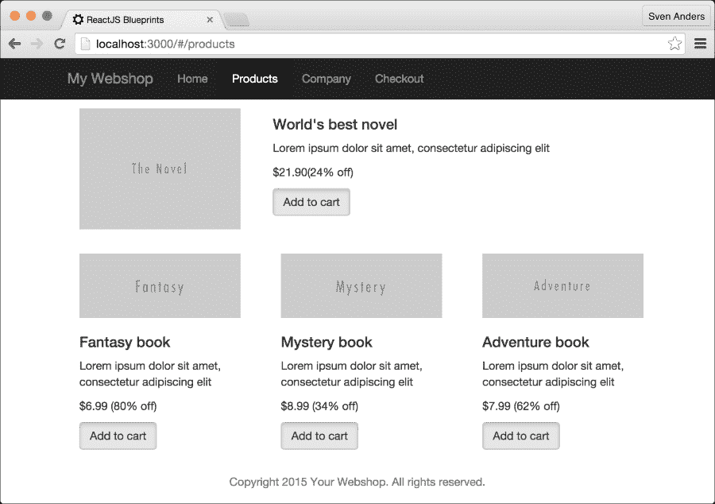

# 第二章 创建网上商店

在 20 世纪 90 年代网络商业化以来，在线销售商品一直是网络的基础。在本章中，我们将探讨如何利用 ReactJS 的力量来创建我们自己的网上商店。

我们将从创建多个不同的组件开始，例如主页、产品页、结账和收据页，我们将通过一个称为**Flux**的概念从数据存储中获取产品。

当我们完成时，你将拥有一个完整的蓝图，你可以在此基础上扩展并应用自己的样式。

让我们开始吧！

# 组件概述

在创建任何类型的网站时，在编写任何代码之前创建一个页面外观的原型通常是有益的。这使得更容易可视化你想要网站看起来什么样，以及你需要创建哪些组件。你可以使用任何类型的原型工具来创建这个，甚至一张纸也行。

通过查看我们的网站原型，我们可以看到我们需要创建以下组件：

+   一个布局组件

+   一个用于主页的首页组件

+   一个带有品牌名称和最重要链接的菜单组件

+   一个公司信息组件

+   一个产品列表组件

+   一个商品组件

+   一个结账组件

+   一个收据组件

这些只是视图组件。除了这些，我们还需要为主要的组件创建数据存储、动作和子组件。例如，对于主页上的产品组件，你需要一个图片元素、描述、价格和一个购买按钮，每次你需要列表或表格时，你都需要创建另一个子组件，等等。

我们将在进行过程中创建这些。让我们看看下面的图片：


前面的原型展示了在桌面和智能手机上查看的产品列表页面。为所有你打算支持的平台绘制原型是值得的。同时，绘制所有不同页面及其可能的状态的草图也是一个好主意。

# 设置商店

我们将使用第一章中的代码，*深入 ReactJS*，作为这个网上商店的基础。复制第一章的代码，并确保它在继续进行更改之前正在运行。

### 小贴士

将代码复制到另一个目录，并通过执行`node server.js`来运行它。它应该启动一个服务器，并自动为你打开一个浏览器窗口。

## 创建布局

首先，我们需要为我们的网上商店创建一个基本的布局。有许多选项可供选择。例如，你可以选择许多开源 CSS 框架中的任何一个，如**Bootstrap**或**Foundation**，或者你可以开辟自己的道路，构建一个基本的网格，并按需引入元素。

为了简化起见，我们将使用 Bootstrap 来构建这个网上商店。这是一个非常流行的框架，易于使用，并且对 React 有很好的支持。

如前所述，我们将使用来自第一章的脚手架，*ReactJS 初探*。此外，我们还需要一些额外的包，最重要的是：`react-bootstrap`、`react-router`、`lodash`、`Reflux`、`superagent`和`react-router-bootstrap`。为了简化起见，将你的`package.json`文件中的依赖关系部分替换为这些值，并在命令行中运行`npm install`：

```js
"devDependencies": {
  "babel-preset-es2015": "6.9.0",
  "babel-preset-react": "6.11.1",
  "babelify": "7.3.0",
  "browser-sync": "2.13.0",
  "browserify": "13.0.1",
  "browserify-middleware": "7.0.0",
  "history": "3.0.0",
  "jsxstyle": "0.0.18",
  "lodash": "4.13.1",
  "react": "15.1.0",
  "react-bootstrap": "0.29.5",
  "react-dom": "15.1.0",
  "react-router": "2.5.2",
  "react-router-bootstrap": "0.23.0",
  "reactify": "1.1.1",
  "reflux": "0.4.1",
  "serve-favicon": "2.3.0",
  "superagent": "2.1.0",
  "uglifyjs": "2.4.10",
  "watchify": "3.7.0"
}
```

`--save-dev`选项将依赖项保存到你的`package.json`文件中的`devDependencies`键下，如前述代码所示。在生产构建中，这些依赖项将不会安装，这使部署更快。我们将在第八章中查看如何创建生产构建，*将你的应用部署到云端*。如果你更愿意将这些包放在常规依赖关系部分，请使用`--save`而不是`--save-dev`，在你的`package.json`中，上述包将位于`dependencies`部分而不是`devDependencies`部分。

我们还需要 Bootstrap，我们将使用**内容分发网络**（**CDN**）来获取它。将以下代码片段添加到你的`index.html`文件的`<head>`部分：

```js
<link rel="stylesheet" type="text/css" href="//netdna.bootstrapcdn.com/bootstrap/3.0.0/css/bootstrap-glyphicons.css" />

<link rel="stylesheet" type="text/css" href="https://maxcdn.bootstrapcdn.com/bootstrap/3.3.5/css/bootstrap.min.css" />
```

你是否想支持旧版本的 Internet Explorer 是你的选择，但如果你这样做，你将需要在你的`index.html`文件的`<head>`部分添加这部分内容：

```js
<!--[if lt IE 9]>
  <script>
    (function() {
      var ef = function(){};
      window.console = window.console || {log:ef,warn:ef,error:ef,dir:ef};
    }());
  </script>
  <script src="img/html5shiv.min.js"></script>
  <script src="img/html5shiv-printshiv.min.js"></script>
  <script src="img/jquery.min.js"></script>
  <script src="img/es5-shim.js"></script>
  <script src="img/es5-sham.js"></script>
<![endif]-->
```

这将在你的代码库中添加一个**polyfill**。polyfill 添加了对旧浏览器不支持 HTML5 功能的支持。

我们还希望使用 Internet Explorer 的现代功能，所以让我们添加以下`meta`标签：

```js
<meta http-equiv="X-UA-Compatible" content="IE=edge">
```

这个设置告诉浏览器根据最新的标准版本进行渲染。这个标签是在*IE8*中引入的，所以如果你的用户使用的是*IE7*或更低版本，这个标签就不会起作用。其他设置包括`IE=5`到`IE=11`和`IE=EmulateIE7`到`IE=EmulateIE11`。使用模拟指令告诉 Internet Explorer 如何在标准和怪癖模式下进行渲染。例如，`EmulateIE9`在标准模式下将页面渲染为*IE9*，在怪癖模式下渲染为*IE5*。

你选择的设置取决于你的目标平台，除非你有非常具体的 IE 版本在心中，否则选择`IE=edge`可能是最安全的选项。

为了让智能手机以正确的比例显示页面，我们还需要添加这个`meta`标签：

```js
<meta name="viewport" content="width=device-width, initial-scale=1">
```

这条通知智能手机浏览器，你希望以 1 倍的比例全宽显示页面。你可以调整比例和宽度，但在大多数情况下，这个设置就是你所需要的。

## 添加你自己的 CSS 代码

我们已经在公共文件夹中有一个 CSS 文件。我们将使用一个非常基本的 CSS 布局，并在很大程度上依赖 Bootstrap。编辑`public/app.css`并将其替换为以下代码：

```js
body {
  background:#eee;
  padding:62px 0 0 0;
}
.row {
  padding:0 0 20px 0;
}
.summary {
  border-bottom: 3px double black;
}
```

填充只是为了确保内容落在菜单内（我们将在下一节*菜单和页脚*中创建的菜单内）。

## 添加路由处理器

让我们打开`app.jsx`文件，移除初始脚手架中的所有内容，并用以下代码替换：

```js
"use strict";

import React from "react";
import Router from "react-router";
import Routes from "./routes.jsx";
import { render } from "react-dom";

render (
  Routes,
  document.getElementById('container')
);
```

在我们的导入部分，我们现在添加`react-router`和一个名为`routes.jsx`的新文件。你会注意到我们通过括号封装来从`react-router`获取`Route`。这被称为**解构**，与使用`var Route = require("react-router").Route`获取它是相同的，后者很容易输入。

接下来，我们通过应用`Router.run`让**路由器**控制我们的应用，给它提供我们新的`routes`文件的内容，然后像之前一样将其挂载到具有`id`容器标签的`<div>`标签上。

当然，要运行这个，你需要创建一个名为`router.jsx`的文件。它应该看起来像这样：

```js
"use strict";

import React from "react";
import Layout from './layout.jsx';
import { Router, Route, browserHistory } from 'react-router'

const Routes = (
  <Router history={browserHistory}>
  <Route handler={Layout} path="/">
  </Route>
  </Router>
);

module.exports = Routes;
```

如你所见，这相当直接，因为我们还没有创建任何路由。同样，我们正在导入`react`、`react-router`和`route`，以及一个名为`layout.jsx`的新文件，它将成为我们的主要路由处理器。

最后，我们将 Routes 的内容导出为 Routes。这是一个必要的步骤，因为这允许你在其他脚本中稍后导入它。你可以通过在模块声明中用`module.exports =`代替`const Routes =`来简化这一点，然后跳过最后一行。这是你的选择，但我认为将代码结构化，先放导入，然后是代码，最后是模块导出，是一个好的实践。

这就是应该放入`layout.jsx`文件的内容：

```js
"use strict";

import React from "react";

const Layout = React.createClass ({
  render() {
    return (
      <div>
        { React.cloneElement(
          this.props.children,
          this.state
        ) }
      </div>
    );
  }
});
```

这个页面完全是空的。我们现在唯一添加的是路由处理器。这就是你的路由更改内容将放置的地方。你围绕它放置的所有内容在切换到新路由时都不会改变，所以这是放置静态元素（如页眉、页脚和边栏）的地方。

当你把这些东西组合在一起时，你就拥有了开始构建你的网店所需的所有部件。你现在已经实现了以下内容：

+   来自第一章的脚手架，*深入 ReactJS*

+   Bootstrap for ReactJS

+   处理路由更改的方法

+   为旧浏览器提供的 polyfill

当你运行这段代码时，如果你的网络浏览器显示一个空白网页，不要气馁。在这个阶段，这是预期的输出。

## 菜单和页脚

是时候开始工作于可见的菜单组件了。让我们从菜单和页脚开始。查看我们的原型，我们看到我们想要构建一个全宽的板块，包含商店的品牌名称和菜单链接，底部则想要一条居中的单行文本，包含版权声明。

我们将通过在`layout.jsx`文件的`import`部分添加以下导入来实现这一点：

```js
import Menu from "./components/menu.jsx";
import Footer from "./components/footer";
```

将`render`函数替换为以下代码片段：

```js
render() {
  return (
    <div>
      <Menu />

        { React.cloneElement (
          this.props.children,
          this.state
        ) }

      <Footer />

    </div>
  );
}
```

接下来，创建一个名为 `components` 的目录，并在其中放置一个名为 `menu.jsx` 的文件。在 `menu.jsx` 文件中添加以下代码：

```js
"use strict";
import React from "react";
import { Nav, NavItem, Navbar, Button };
import { Link } from 'react-router';
import { LinkContainer } from "react-router-bootstrap";
```

这些导入通过解构引入了 `Nav`、`NavItem`、`Navbar`、`Button` 和 `LinkContainer`，正如在第一章 *ReactJS 初探* 中提到的：

```js
const Menu = React.createClass ({
  render() {
    return (
      <Navbar inverse fixedTop>
        <Navbar.Header>
          <Navbar.Brand>
            <Link to="/">My webshop</Link>
          </Navbar.Brand>
          <Navbar.Toggle />
        </Navbar.Header>
```

我们创建一个带有链接品牌名称的 `Navbar` 实例。如果你想用图片代替文本品牌，你可以插入一个 JSX 节点而不是文本字符串，如下所示：

```js
brand={<span class="logo"></span>}.
```

`fixedTop` 选项创建了一个固定在屏幕顶部的 `Navbar` 实例。如果你想有一个浮动的 `Navbar` 实例，请将其替换为 `staticTop`。你也可以添加 `inverse` 以获得黑色 `Navbar` 实例而不是灰色实例：

```js
        <Navbar.Collapse>
          <Nav>
            <LinkContainer  eventKey={1} to="/company">
              <Button bsStyle="link">
                About
              </Button>
            </LinkContainer>

            <LinkContainer  eventKey={2} to="/products">
              <Button bsStyle="link">
                Products
              </Button>
            </LinkContainer>
          </Nav>

          <Nav pullRight>
            <LinkContainer to="/checkout">
              <Button bsStyle="link">
                Your cart: {this.props.cart.length} items
              </Button>
            </LinkContainer>
          </Nav>
        </Navbar.Collapse>
      </Navbar>
```

我们在导航栏中添加了三个导航项，就像我们的原型一样。我们还提供了一个 **right** 关键字，以便你的 `Navbar` 实例中的项目向右对齐。这些链接将重定向到我们尚未制作的页面，因此我们将在下一步制作这些页面：

```js
    );
  }
});
module.exports = Menu;
```

菜单部分就到这里。我们还需要添加页脚，所以请继续在 `components` 文件夹中添加一个名为 `footer.jsx` 的文件，并添加以下代码：

```js
"use strict";
import React from "react";

const Footer = React.createClass({
  render() {
    return (
      <footer className="footer text-center">
        <div className="container">
          <p className="text-muted">Copyright 2015 Your Webshop.
            All rights reserved.
          </p>
        </div>
      </footer>
    );
  }

});
module.exports = Footer;
```

## 创建页面

让我们创建一个名为 `pages` 的子目录，并添加以下文件：

+   `pages/products.jsx`:

    ```js
    "use strict";
    import React from "react";

    const Products = React.createClass ({
      render() {
        return (
          <div />
        );
      }
    });
    module.exports = Products;
    ```

+   `pages/company.jsx`:

    ```js
    "use strict";
    import React from "react";
    import { Grid, Row, Col, Panel } from "react-bootstrap";

    const Company = React.createClass ({
      render() {
        return (
          <Grid>
            <Row>
              <Col xs={12}>
                <Panel>
                  <h1>The company</h1>

                  <p>Contact information</p>
                  <p>Phone number</p>
                  <p>History of our company</p>

                </Panel>
              </Col>
            </Row>
          </Grid>
        );
      }

    });
    module.exports = Company;
    ```

+   `pages/checkout.jsx`:

    ```js
    "use strict";
    import React from "react";

    const Products = React.createClass ({
      render() {
        return (
          <div />
        );
      }
    });
    module.exports = Checkout;
    ```

+   `pages/receipt.jsx`:

    ```js
    "use strict";
    import React from "react";

    const Receipt = React.createClass ({
      render() {
        return (
          <div />
        );
      }
    });
    module.exports = Receipt;
    ```

+   `pages/item.jsx`:

    ```js
    "use strict";
    import React from "react";

    const Item = React.createClass ({
      render() {
        return (
          <div />
        );
      }
    });
    module.exports = Item;
    ```

+   `pages/home.jsx`:

    ```js
    "use strict";
    import React from "react";
    import { Grid, Row, Col, Jumbotron } from "react-bootstrap";
    import { LinkContainer } from "react-router-botstrap";
    import { Link } from 'react-router';

    const Home = React.createClass ({
      render() {
        return (
          <Grid>
            <Row>
              <Col xs={12}>
                <Jumbotron>
                  <h1>My webshop!</h1>

                  <p>
                    Welcome to my webshop.
                    This is a simple information
                    unit where you can showcase
                    your best products or
                    tell a little about your webshop.
                  </p>

                  <p>
                    <LinkContainer to="/products">
                      <Button bsStyle="primary"
                        to="/products">View products</Button>
                    </LinkContainer>
                  </p>
                </Jumbotron>
              </Col>
            </Row>
          </Grid>
        );
      }

    });
    module.exports = Home;
    ```

现在，让我们将我们刚刚创建的链接添加到我们的路由中。打开 `routes.jsx` 文件，并在导入部分添加以下内容：

```js
import Products from "./pages/products.jsx";
import Home from "./pages/home.jsx";
import Company from "./pages/company.jsx";
import Item from "./pages/item.jsx";
import Checkout from "./pages/checkout.jsx";
import Receipt from "./pages/receipt.jsx";
```

将 `<Route handler={Layout} path="/"></Route>` 代码块替换为以下内容：

```js
<Route handler={Layout}>
  <Route name="home"
    path="/"
    handler={Home} />
  <Route name="company"
    path="company"
    handler={Company} />
  <Route name="products"
    path="products"
    handler={Products} />
  <Route name="item"
    path="item/:id"
    handler={Item} />
  <Route name="checkout"
    path="checkout"
    handler={Checkout} />
  <Route name="receipt"
    path="receipt"
    handler={Receipt} />
</Route>
```

我们已经将 `receipt` 页面添加到我们的文件结构和路由中，但它不会在菜单栏中可见，因为你应该只在检查订单后重定向到 `receipt` 页面。

如果你现在运行应用，你会在屏幕顶部看到一个菜单栏，你可以点击它。你会注意到，当你点击任何菜单选项时，应用会路由到所选页面。你还会注意到所选路由将在菜单栏中突出显示，这使得在不查看地址栏中的路由的情况下很容易知道你在哪里。

当你在网页浏览器中的响应式模式下打开应用或在智能手机上打开应用时，你会注意到菜单会折叠，并且出现一个**汉堡**按钮而不是菜单链接。当你点击这个按钮时，菜单会展开并显示下拉菜单中的链接。

## 创建产品数据库

你的商店需要产品，所以我们将为我们的网店提供一组小项目。

这类数据通常存储在某种数据库中。数据库可以是本地或远程自行提供的，或者您可以使用众多基于云的数据库服务中的任何一个。传统上，您会使用基于 **SQL**（**结构化查询语言**）的数据库，但如今，选择 **NoSQL** 基于文档的方法更为常见。这就是我们为我们的网店所采取的方法，我们将简单地使用平面文件来存储数据。

创建一个文件，命名为 `products.json`，保存在 `public` 文件夹中，并添加以下内容：

```js
{
  "products": {
    "main_offering": [
      {
        "World's best novel": {
          "SKU": "NOV",
          "price": "$21.90",
          "savings": "24% off",
          "description": "Lorem ipsum dolor sit amet, consectetur adipiscing elit",
          "image": "http://placehold.it/{size}&text=The Novel"
        }
      }
    ],
    "sale_offerings": [
      {
        "Fantasy book": {
          "SKU": "FAN",
          "price": "$6.99",
          "savings": "80% off",
          "description": "Lorem ipsum dolor sit amet, consectetur adipiscing elit",
          "image": "http://placehold.it/{size}&text=Fantasy"
        }
      },
      {
        "Mystery book": {
          "SKU": "MYS",
          "price": "$8.99",
          "savings": "34% off",
          "description": "Lorem ipsum dolor sit amet, consectetur adipiscing elit",
          "image": "http://placehold.it/{size}&text=Mystery"
        }
      },
      {
        "Adventure book": {
          "SKU": "ADV",
          "price": "$7.99",
          "savings": "62% off",
          "description": "Lorem ipsum dolor sit amet, consectetur adipiscing elit",
          "image": "http://placehold.it/{size}&text=Adventure"
        }
      },
      {
        "Science fiction book": {
          "SKU": "SCI",
          "price": "$5.99",
          "savings": "32% off",
          "description": "Lorem ipsum dolor sit amet, consectetur adipiscing elit",
          "image": "http://placehold.it/{size}&text=Sci-Fi"
        }
      },
      {
        "Childrens book": {
          "SKU": "CHI",
          "price": "$7.99",
          "savings": "12% off",
          "description": "Lorem ipsum dolor sit amet, consectetur adipiscing elit",
          "image": "http://placehold.it/{size}&text=Childrens"
        }
      },
      {
        "Economics book": {
          "SKU": "ECO",
          "price": "$25.99",
          "savings": "7% off",
          "description": "Lorem ipsum dolor sit amet, consectetur adipiscing elit",
          "image": "http://placehold.it/{size}&text=Economics"
        }
      }
    ]
  }
}
```

此文件相当于在 NoSQL 数据库中插入一些产品时您会找到的内容，例如 **MongoDB**。语法是 **JSON**（**JavaScript 对象表示法**），一种开放格式，以属性-值对的形式传输数据。它是简单的且与语言无关的，仅通过查看前面的结构，您就可以轻松理解其数据结构和内容。

字段应该是自解释的，但让我们来了解一下。有两种产品组，一个是主系列，另一个是促销系列。主系列只有一个项目，促销系列有六个。每个列表中的产品都有一个标题、一个 **SKU**（**库存单位**，例如，产品代码）、一个价格、一个方便格式的节省文本、一个描述和一个图片 URL。我们选择插入一个占位符代码来表示图片的像素大小，因为我们希望能够在向用户展示图片时动态更改大小。

我们希望通过访问 `http://localhost:3000/products.json` 来访问此文件，因此我们需要在 `server.js` 中添加一些内容。编辑此文件，并在 `app.listen` 行之前添加以下代码，然后重新启动服务器：

```js
// json
app.get('*.json', function (req, res) {
  res.sendFile(__dirname+"/public/"+req.path);
});
```

当您访问 `http://localhost:3000/products.json` 时，应该提供我们的产品。

## 创建一个数据存储来获取产品

建议与 ReactJS 一起使用的应用程序架构称为 **Flux**。虽然它不是一个框架，但可以看作是一种传输数据的设计模式。

Flux 由三个主要部分组成：调度器、存储和动作。Flux 背后的核心思想是一个称为 *单向数据流* 的概念。这个想法是您的应用应该有一个存储来保存您的数据，并且您的组件应该监听它以获取更新。您通过调度器与之交互，可以将调度器视为传递指令到您的动作的信使。在您的动作中，您可以获取新数据并将其传递给存储，然后存储会向您的组件发射数据。

这种模式避免了常见的多个地方需要更新应用程序状态的问题，这通常会导致难以追踪的 bug。

这可能有点难以消化，所以让我们快速看一下各个组件：

+   **调度器**：这是中心枢纽。它接收动作并向所有已注册的回调发送有效载荷。

+   **动作**：这些是指辅助方法，它们便于将数据传递给分发器。

+   **存储**：这些是逻辑容器，它们在分发器上注册了回调，向所有注册的回调发出状态变化。

+   **视图**：这指的是从存储中获取状态并将数据传递给其组件树中任何后代的 React 组件。

有许多不同的 Flux 实现。对于本章，我选择了 Reflux 作为 Flux 实现，但在 第六章 *高级 React* 中，我们将查看一个名为 **Redux** 的不同实现，以及在 第七章 *Reactagram* 中的替代方案。

Reflux 放弃了单个中央分发器的概念，选择合并分发器和动作的概念。这使得我们可以用更少的代码实现，并导致代码库更容易理解。

让我们创建一个 **Reflux** 实现。

我们已经在章节开头启动应用程序时安装了 *Reflux* 和名为 **Superagent** 的 HTTP 请求库，我们将使用它来获取我们的产品数据，所以我们可以立即开始使用 *Reflux*。

让我们创建我们的第一个存储。创建两个文件夹：`stores` 和 `actions`。创建两个文件，`stores/products.js` 和 `actions/products.js`。

### 注意

`Stores` 和 `Actions` 是常规的 JavaScript 文件，并且与 ReactJS 组件不同，它们不使用 `.jsx` 文件扩展名。

在 `actions/products.js` 中添加以下代码：

```js
"use strict";

import Reflux from 'reflux';

const Actions = {
  FetchProducts: Reflux.createAction("FetchProducts")
};

module.exports = Actions;
```

在这个文件中，我们定义了一个名为 **FetchProducts** 的单个键。然后我们分配了一个同名的 Reflux 动作。虽然可以定义不同的名称，但这可能会导致后续的混淆，因此为了保持代码库的整洁，建议重复键名。

在 `stores/products.js` 中添加以下代码：

```js
"use strict";
import Reflux from 'reflux';
import Request from 'superagent';
import Actions from './actions/products';
```

在这里，我们导入我们刚刚创建的动作以及 `superagent` 和 `reflux`：

```js
const ProductStore = Reflux.createStore ({

  init() {
    this.listenTo(Actions.FetchProducts, this.onFetchProducts);
```

`init()` 方法将只执行一次，并在导入时立即运行。这意味着它将立即执行你在 `init()` 中放入的所有内容：

```js
  },
  onFetchProducts() {
    Request
      .get('/products.json')
      .end((err, res)=> {
        this.trigger(JSON.parse(res.text));
      });
  }
```

在这里，我们简单地访问 `product.json`，当它加载时，我们将结果发出给所有监听这个存储更新的组件。使用 Reflux 的 `this.trigger()` 内置方法发出，它发出括号内传递的对象：

```js
});

module.exports = ProductStore;
```

现在已经处理好了这个问题，下一步是在我们的代码中监听这个存储的更新。打开 `layout.jsx` 并添加以下导入：

```js
import Actions from "./actions/products"
import ProductStore from "./stores/products"
```

然后，在 `render()` 方法之上添加以下代码：

```js
mixins:[
  Reflux.listenTo(ProductStore, 'onFetchProducts')
],
componentDidMount() {
  Actions.FetchProducts();
},
onFetchProducts(data){
  this.setState({products: data.products});
},
```

这很令人兴奋，因为我们终于开始用内容填充我们的应用程序了。现在每当存储发出数据时，这个组件都会接收到并通过状态对象将其传播给其子组件。

## 构建产品列表和项目页面

我们现在要构建的视图将向用户展示您的书名选择。它将以一个全尺寸的主要产品列开始，然后提供三个较小的列中的其他产品。

让我们打开 `pages/products.jsx` 文件，并编写显示产品数据的代码。将文件中的所有内容替换为以下代码：

```js
"use strict";
import React from "react";
import { Grid, Row, Col, Button } from "react-bootstrap";
import { Link } from "react-router";

const Products = React.createClass ({
  propTypes: {
    products: React.PropTypes.object
  },
  getDefaultProps() {
    return {
      products: {
        main_offering: [],
        sale_offerings: []
      }
    }
  },
  render() {
    return (
      <Grid>
        <Offerings productData={this.props.products.main_offering}
        type={"main"} maxProducts={1}/>
        <Offerings productData={this.props.products.sale_offerings}
        type={"ribbon"} maxProducts={3}/>
      </Grid>
    );
  }
});
```

我们期望接收到一个名为 `products` 的 `data` 属性，包含两个列表：一个主要产品和销售产品。您可能还记得这些内容来自 `products.json`，我们在其中定义了它们。在我们的渲染代码中，我们创建了一个 Bootstrap 网格，并使用一个名为 **offerings** 的新组件创建了两个节点。我们向这个组件提供了三个属性：产品列表、类型以及我们想要显示的最大产品数量。在这个上下文中，`type` 是一个字符串，可以是 `main` 或 `ribbon`：

```js
const Offerings = React.createClass ({
  propTypes: {
    type: React.PropTypes.oneOf(['main', 'ribbon']),
    maxProducts: React.PropTypes.number,
    productData: React.propTypes.array
  },
  getDefaultProps() {
    return {
      type: "main",
      maxProducts: 3
    }
  },
  render() {
    let productData = this.props.productData.filter((data, idx)=> {
      return idx < this.props.maxProducts;
    });
    let data = productData.map((data, idx)=> {
      if(this.props.type === "main") {
        return <MainOffering
          {...this.props} key={idx}
          productData={data}/>
      }
      else if(this.props.type === "main") {
        return <RibbonOffering
          {...this.props} key={idx}
          productData={data}/>
      }
    });
    return <Row>{data}</Row>;
  }
});
```

在 `map` 函数中，我们分配了一个新的属性名为 **key**。这是为了帮助 ReactJS 唯一地识别组件。任何带有 key 的组件都将在渲染过程中重新排序和复用。

当您处理 props 时，通常定义一组默认属性来处理数据是个好主意。这也是通过编写易于理解的代码进行文档记录的一种方式。在这个例子中，仅通过查看属性类型和默认属性，就可以很容易地推断出 `maxProducts` 定义了要显示的最大产品数量。然而，`type` 仍然难以理解。正如您所知，它是一个字符串，可以是 `main`。知道它也可以被分配为 *ribbon* 是您需要阅读其余源代码才能理解的事情。在这些情况下，提供可选值在 docblock 代码中可能很有帮助。例如，通过添加如下 docblock 来记录这个属性：`@param {string} type "main"|"ribbon"`。

通过对产品列表应用 `filter` 函数来减少产品数据，通过 `index` 值返回第一个匹配项。然后我们对剩余的数据运行 `map` 函数，如果 `type` 是 `main`，则返回一个 `MainOffering` 组件；如果 `type` 是 `ribbon`，则返回一个 `RibbonOffering` 组件：

```js
const MainOffering = React.createClass ({
  propTypes: {
    productData: React.PropTypes.object
  },
  render() {
    const title = Object.keys(this.props.productData);
    if(this.props.productData[title]){
      (<Col xs={12}>
        <Col md={3} sm={4} xs={12}>
          <p>
            
          </p>
        </Col>
        <Col md={9} sm={8} xs={12}>
          <Link to={"/item/"+this.props.productData[title].SKU}>
            <h4>{title}</h4>
          </Link>

          <p>
            {this.props.productData[title].description}
          </p>

          <p>
            {this.props.productData[title].price}
            {" "}
            ({this.props.productData[title].savings})
          </p>

          <p>
            <Button bsSize="large">Add to cart</Button>
          </p>
        </Col>
      </Col>
    )} else {
      return null;
    }
  }
});
```

`MainOffering` 组件创建了一个全尺寸的列，左侧有一个大型的产品图片，同时也在右侧创建了一个价格、描述和购买按钮。产品图片通过将 `{size}` 模板替换为一个 `string` 值来获得 200 x 150 的尺寸。`Placehold.it` 是一个方便的服务，您可以使用它来显示占位图，直到您有真实图片可以展示。网上有众多此类服务，从简单的，如 `placehold.it`，到展示狗、猫、自然、科技和建筑的服务：

```js
const RibbonOffering = React.createClass ({
  propTypes: {
    productData: React.PropTypes.object
  },
  render() {
    const title = Object.keys(this.props.productData);
    if(this.props.productData) {
      return (<Col md={4} sm={4} xs={12}>
        <Col xs={12}>
          <p>
            
          </p>
        </Col>
        <Col xs={12}>
          <Link to={"/item/"+this.props.productData[title].SKU}>
            <h4>{title}</h4>
          </Link>

          <p>
            {this.props.productData[title].description}
          </p>

          <p>
            {this.props.productData[title].price} 
            {" "}
            ({this.props.productData[title].savings})
          </p>

          <p>
            <Button bsSize="large">Add to cart</Button>
          </p>
        </Col>
      </Col>)
    }
    else {
      return null;
    }
  }
});
```

这里值得提一下，在`render()`方法中，如果`this.props.productData`有标题，我们要么返回一个 ReactJS 节点，要么返回`null`。我们这样做的原因是因为当组件挂载时，`productData`将是未填充的。如果我们此时尝试使用该属性，ReactJS 将返回一个错误。一旦数据在*store*中获取，它就会填充，这可能需要几毫秒，也可能需要更长的时间，这取决于许多因素，但主要取决于延迟，这意味着在组件挂载时数据很可能不可用。无论如何，你不应该依赖这一点，所以最好在数据可用之前不返回任何内容：

```js
module.exports = Products;
```

我们在这个文件中定义了多个组件，但请注意，我们只导出主组件，称为 products。其他组件不会通过解构获得，因为它们没有被导出。

我们已经将项目链接到`item`页面，因此我们需要完善它并在客户访问此页面时检索项目数据。

打开`pages/item.jsx`并将内容替换为以下代码：

```js
"use strict";
import React from "react";
import Reflux from "reflux";
import { Router, State } from "react-router";
import { Grid, Row, Col, Button } from "react-bootstrap";
import CartActions from "../actions/cart";

const Item = React.createClass ({
  mixins: [
    Router.State
  ],
  render() {
    if (!this.props.products) return null;

    // Find the requested product in our product list
    let products = this.props.products.main_offering.concat(this.props.products.sale_offerings);
    let data = products.filter((item)=> {
      return item[Object.keys(item)].SKU ===
        this.props.routeParams.id;
    });
```

在这里，我们利用了所有产品都作为此页面的属性存在的事实，并且它们只是从完整的产品列表中返回一个过滤后的对象列表。过滤基于`this.getParams().id`。这是`react-router`提供的一个内置*mixin*，它获取在`routes.jsx`中定义的`id`键。

**mixin**是一段包含可以在其他代码中包含而不使用继承的方法的代码。这很方便，因为它允许轻松的代码注入和重用。这也存在一些缺点，因为不加批判地使用 mixins 可能会导致你使用的代码来源混淆：

```js
    if(!data.length){
      return (<Grid>
      <Row>
        <Col xs={12}>
          <h1>Product missing</h1>
          <p>
            I'm sorry, but the product could not be found.
          </p>
        </Col>
      </Row>
    </Grid>)} else {
      return (<Grid>
        <Row>
          <Col xs={12}>
            <ProductInfo productData={data[0]}/>
          </Col>
        </Row>
      </Grid>
    )};
  }
});
```

这个返回声明检查新对象列表的长度，并提供项目信息或一个通知客户产品找不到的信息块：

```js
const ProductInfo = React.createClass ({
  propTypes: {
    productData: React.PropTypes.object
  },
  render() {
    const title = Object.keys(this.props.productData);
    if(this.props.productData[title]){
      (<Col xs={12}>
        <Col md={3} sm={4} xs={12}>
          <p>
            
          </p>
        </Col>
        <Col md={9} sm={8} xs={12}>
          <h4>{title}</h4>
          <p>
            {this.props.productData[title].description}
          </p>

          <p>
            {this.props.productData[title].price}
            {" "}
            ({this.props.productData[title].savings})
          </p>

          <p>
            <Button bsSize="large"
              onClick={CartActions.AddToCart.
              bind(null, this.props.productData)}>
              Add to cart
            </Button>
          </p>
        </Col>
      </Col>
    )}
    else {
      return null;
    }
  }
});
module.exports = Item;
```

最后一段代码打印出产品信息。

最终结果应该如下所示：



最后一个拼图部分添加了将项目放入购物车的动作。为此，我们需要创建另一个动作文件和一个购物车存储。

## 创建购物车存储

我们需要向我们的项目中添加两个额外的文件，`actions/cart.js`和`store/carts.js`。创建这些文件并将以下代码添加到`actions`文件中：

```js
"use strict";

import Reflux from "reflux";

const Cart = {
  AddToCart: Reflux.createAction("AddToCart"),
  RemoveFromCart: Reflux.createAction("RemoveFromCart"),
  ClearCart: Reflux.createAction("ClearCart")
};

module.exports = Cart;
```

我们定义了三个动作，一个用于添加项目，一个用于移除它们，第三个用于清空购物车。

打开`store/carts.js`并添加以下代码段：

```js
"use strict";
import Reflux from "reflux";
import CartActions from "../actions/cart";
let _cart = {cart: []};
```

这是我们的`store`对象。在`CartStore`本身之外初始化它使其成为私有的和隐藏的，使得无法直接导入`CartStore`并修改`store`对象。通常，但不是必须的，在这样对象前加上下划线。这仅仅是一种表示我们正在处理一个`private`对象的方式：

```js
const CartStore = Reflux.createStore ({

  init() {
    this.listenTo(CartActions.AddToCart, this.onAddToCart);
    this.listenTo(CartActions.RemoveFromCart, this.onRemoveFromCart);
    this.listenTo(CartActions.ClearCart, this.onClearCart);
  },
```

这些是我们将监听并响应的操作。每当在代码中调用前面的任何操作时，我们将连接到该操作的函数将被执行：

```js
  onAddToCart(item){
    _cart.cart.push(item);
    this.emit();
  },
```

当我们在代码中调用`CartActions.AddToCart`并传递一个项目时，此代码将项目添加到我们的`cart`对象中。然后我们调用`this.emit()`，这是我们的存储发射器。我们也可以直接调用`this.trigger`（这是原生的`Reflux`函数，用于发出数据），但如果你需要在发出数据之前执行任何函数或代码，有一个负责发出数据的单一函数是有益的：

```js
  onRemoveFromCart(item) {
    _cart.cart = _cart.cart.filter((cartItem)=> {
      return item !== cartItem
    });
    this.emit();
  },
```

这个函数使用 JavaScript 内置的`filter`函数从我们的`cart`对象中移除一个项目。`filter`函数在调用时返回一个新数组，排除了我们想要移除的项目。然后我们简单地发出修改后的`cart`对象：

```js
  onClearCart() {
    _cart.cart = [];
    this.emit();
  },
```

这将重置购物车并发出空的`cart`对象：

```js
  emit() {
    this.trigger(_cart);
  }
```

在这个函数中，我们发出`cart`对象。任何监听此存储的组件都将接收到对象并渲染新数据：

```js
});

module.exports = CartStore;
```

我们还希望向用户提供一些关于其购物车状态的指示，所以打开`menu.jsx`并将`Checkout`部分的`NavItemLink`替换为以下代码片段：

```js
<NavItemLink
  to="/checkout">
  Your cart: {this.props.cart.length} items
</NavItemLink>
```

在`render()`之前，添加一个`defaultProps`部分并包含以下代码：

```js
  getDefaultProps() {
    return {
      cart: []
    }
  },
```

所有状态更改都通过`layout.jsx`进行，所以打开此文件并添加以下导入：

```js
import CartStore from "./stores/cart"
```

在`mixins`部分，添加对`cart`存储和当购物车发出数据时要运行的函数的监听器。现在的代码应该看起来像这样：

```js
  mixins: [
    Reflux.listenTo(ProductStore, 'onFetchProducts'),
    Reflux.listenTo(CartStore, 'onCartUpdated')
  ],
  onCartUpdated(data){
    this.setState({cart: data.cart});
  },
```

`Menu`组件需要接收新状态，所以提供以下代码：

```js
<Menu {...this.state} />
```

最后，我们需要将操作添加到**添加到购物车**按钮上。编辑`pages/products.jsx`并将`MainOffering`和`RibbonOffering`中的按钮代码替换为以下代码：

```js
<Button bsSize="large"
  onClick={CartActions.AddToCart.bind(null,
  this.props.productData)}>
  Add to cart
</Button>
```

还需要在导入部分添加以下代码行：

```js
import CartActions from "../actions/cart";
```

你已经设置好了。现在当你点击产品页面上的**添加到购物车**按钮时，购物车将立即更新，菜单计数也将立即更新。


## 结账

如果你的客户不能结账，那么网店有什么用呢？毕竟，他们来这里就是为了这个。让我们设置一个结账屏幕，并让客户输入一个送货地址。

我们需要创建一些新的文件：`stores/customer.js`、`actions/customer.js`和`components/customerdata.jsx`。

打开`actions/customer.js`并添加以下代码：

```js
"use strict";

import Reflux from "reflux";

const Actions = {
  SaveAddress: Reflux.createAction("SaveAddress")
};

module.exports = Actions;
```

这个单一的操作将负责地址管理。

接下来，打开`stores/customer.js`并添加以下代码：

```js
"use strict";
import Reflux from "reflux";
import CustomerActions from "../actions/customer";
let _customer = {customer: [], validAddress: false};
```

就像在`cart.js`中一样，我们在这里定义一个`private`对象来存储存储的状态。正如你可以从对象定义中读到的，我们将存储客户列表和布尔地址验证器。我们还将导入我们刚刚创建的客户操作文件：

```js
const CustomerStore = Reflux.createStore({

  init() {
    this.listenTo(CustomerActions.SaveAddress, this.onSaveAddress);
  },

  onSaveAddress(address) {
    _customer = address;
    this.emit();
  },

  emit() {
    this.trigger(_customer);
  }
});

module.exports = CustomerStore;
```

你可以从 `cart.js` 文件中识别出这段代码的结构。我们监听 `SaveAddress` 动作，并在动作被调用时执行连接的函数。最后，每当状态对象发生变化时，都会调用发射器。

在我们编辑最后一个新文件之前，让我们打开 `checkout.jsx` 并设置我们需要的代码。用以下代码替换当前内容：

```js
"use strict";
import React from "react";
import { Grid, Button, Table, Well } from "react-bootstrap";
import CartActions from "../actions/cart";
import CustomerData from "../components/customerdata";
```

我们从 `React-Bootstrap` 导入两个新函数和两个我们刚刚创建的新文件：

```js
const Checkout = React.createClass ({
  propTypes: {
    cart: React.PropTypes.array,
    customer: React.PropTypes.object
  },
  getDefaultProps() {
    return {
      cart: [],
      customer: {
        address: {},
        validAddress: false
      }
    }
  },
```

在本节中，我们使用两个属性初始化组件：一个 `cart` 数组和一个 `customer` 对象：

```js
  render() {
    let CheckoutEnabled = (this.props.customer.validAddress && this.props.cart.length > 0);
    return (
      <Grid>
        <Well bsSize="small">
          <p>Please confirm your order and checkout your cart</p>
        </Well>

        <Cart {...this.props} />

        <CustomerData {...this.props} />

        <Button disabled={!CheckoutEnabled}
          bsStyle={CheckoutEnabled ? 
          "success" : "default"}>
          Proceed to checkout
        </Button>

      </Grid>
    );
  }
});
```

我们定义一个布尔变量来控制结账按钮是否可见。我们的要求很简单，我们希望购物车中至少有一件商品，并且客户已经输入了有效的姓名地址。

我们然后在 Bootstrap well 中向客户显示一条简单的消息。接下来，我们显示购物车内容（我们将在下面的代码片段中定义），然后，我们展示一系列输入字段，客户可以在其中添加地址。最后，我们显示一个按钮，将用户带到支付窗口：

```js
const Cart = React.createClass ({
  propTypes: {
    cart: React.PropTypes.array
  },
  render() {
    let total = 0;
    this.props.cart.forEach((data)=> {
      total += parseFloat(data[Object.keys(data)].
        price.replace("$", ""));
    });

    let tableData = this.props.cart.map((data, idx)=> {
      return <CartElement productData={data} key={idx}/>
    });

    if (!tableData.length) {
      tableData = (<tr>
        <td colSpan="3">Your cart is empty</td>
      </tr>);
    }
    return <Table striped condensed>
      <thead>
        <tr>
          <th width="40%">Name</th>
          <th width="30%">Price</th>
          <th width="30%"></th>
        </tr>
      </thead>
      <tbody>
        {tableData}
        <tr className="summary" border>
        <td><strong>Order total:</strong></td>
        <td><strong>${total}</strong></td>
        <td>
          {tableData.length ?
            <Button bsSize="xsmall" bsStyle="danger"
              onClick={CartActions.ClearCart}>
              Clear Cart
            </Button> : null}
        </td>
        </tr>
      </tbody>
    </Table>;
  }
});
```

购物车是另一个 React 组件，负责显示包含客户购物车内容的表格，包括订单的总金额。我们初始化一个用于总金额的变量并将其设置为零。然后，我们使用 JavaScript 内置的 `forEach` 函数遍历 `cart` 内容并创建订单总金额。由于价格从 JSON 文件中带有美元符号，我们需要在添加总和之前将其删除（否则 JavaScript 将简单地连接字符串）。我们还使用 `parseFloat` 将字符串转换为浮点数。

实际上，这不是一个理想的解决方案，因为你不想在处理价格时使用浮点数。

### 小贴士

尝试使用 JavaScript 将 0.1 和 0.2 相加，以了解原因（提示：它们不会等于 0.3）。

最佳解决方案是使用整数，并在需要显示小数时除以 100。因此，`products.json` 可以更新为包含一个价格字段，如下所示：`"display_price": "$21.90","price": "2190"`。然后，我们在代码中使用 `price`，但在视图中使用 `display_price`。

接下来，我们再次遍历我们的购物车内容，但这次使用 JavaScript 内置的 `map` 函数。我们返回一个新数组，该数组包含 `CartElement` 节点。然后我们渲染一个表格并插入我们刚刚创建的新数组：

```js
const CartElement = React.createClass ({
  render() {
    const title = Object.keys(this.props.productData);
    if(title) {
      (<tr>
        <td>{title}</td>
        <td>{this.props.productData[title].price}</td>
        <td>
          <Button bsSize="xsmall" bsStyle="danger"
            onClick={CartActions.RemoveFromCart.bind
            (null, this.props.productData)}>
            Remove
          </Button>
        </td>
      </tr>
      )
    }
    else {
      return null
    }
  }
}
);

module.exports = Checkout;
```

`CartElement` 组件应该对你很熟悉，只有一个例外，`onClick` 方法有一个绑定。我们这样做是因为我们想在客户点击**删除**按钮时传递产品数据。绑定中的第一个元素是事件，第二个是数据。我们不需要传递事件，所以我们将其简单地设置为 `null`。

让我们看一下以下截图：


我们还需要添加 `customerdata.jsx` 的代码，让我们打开这个文件并添加以下代码：

```js
"use strict";
import React from "react";
import { FormGroup, FormControl, InputGroup, Button }
  from "react-bootstrap";
  import CustomerActions from "../actions/customer";
  import clone from 'lodash/clone';

const CustomerData = React.createClass ({
  getDefaultProps() {
    return {
      customer: {
        address: {},
        validAddress: false
      }
    }
  },
  getInitialState() {
    return {
      customer:{
        name: this.props.customer.address.name ? 
          this.props.customer.address.name : "",
        address: this.props.customer.address.address ? 
          this.props.customer.address.address : "",
        zipCode: this.props.customer.address.zipCode ? 
          this.props.customer.address.zipCode : "",
        city: this.props.customer.address.city ? 
          this.props.customer.address.city : ""
      },
      validAddress: this.props.customer.validAddress ?
        this.props.customer.validAddress : false
    };
  },
```

这可能看起来有点复杂，但这里的想法是，如果存在，我们将客户名称和地址验证设置为与`this.props`相同，如果不存在，我们使用空字符串的默认值，并将地址验证的布尔值设置为`false`。

我们这样做的原因是我们想显示客户如果选择在结账屏幕上添加数据，但后来决定在继续到结账屏幕之前访问商店的另一个部分时输入的数据。

```js
  validationStateName() {
    if (this.state.customer.name.length > 5)
      return "success";
    else if (this.state.customer.name.length > 2)
      return "warning";
    else 
      return "error";
  },

  handleChangeName(event) {
    let customer = clone(this.state.customer);
    customer.name = event.target.form[0].value;
    this.setState({
      customer,
      validAddress: this.checkAllValidations()
    });
    CustomerActions.SaveAddress(this.state);
  },
```

这是四个类似部分中的第一个，这些部分处理输入验证。验证仅基于字符串长度，但可以替换为任何所需的验证逻辑。

在`handleChangeName`中，我们克隆状态到一个局部变量（确保我们不会意外地手动修改状态），然后，我们从输入字段设置新的名称值。输入值通过`refs`获取，这是 ReactJS 的一个概念。可以将引用设置到任何元素，并通过`this.refs`访问。

接下来，在每次更改时，我们检查我们已设置的所有验证。如果所有验证都有效，我们将地址验证器设置为布尔值`true`。最后，我们保存状态，然后运行将新地址存储在客户存储中的操作。此更改将发出到`layout.jsx`，然后该文件将数据传回此组件以及其他监听客户存储的组件。

```js
  validationStateAddress() {
    if (this.state.customer.address.length > 5)
      return "success";
    else if (this.state.customer.address.length > 2)
      return "warning";
    else 
      return "error";
  },

  handleChangeAddress(event) {
    let customer = clone(this.state.customer);
    customer.address =
      event.target.form[1].value;
    this.setState({
      customer,
      validAddress: this.checkAllValidations()
    });
    CustomerActions.SaveAddress(this.state);
  },

  validationStateZipCode() {
    if (this.state.customer.zipCode.length > 5)
      return "success";
    else if (this.state.customer.zipCode.length > 2)
      return "warning";
    else 
      return "error";
  },

  handleChangeZipCode(event) {
    let customer = clone(this.state.customer);
    customer.zipCode =
      event.target.form[2].value;
    this.setState({
      customer,
      validAddress: this.checkAllValidations()
    });
    CustomerActions.SaveAddress(this.state);
  },

  validationStateCity() {
    if (this.state.customer.city.length > 5)
      return "success";
    else if (this.state.customer.city.length > 2)
      return "warning";
    else 
      return "error";
  },

  handleChangeCity(event) {
    let customer = clone(this.state.customer);
    customer.city =
      event.target.form[3].value;
    this.setState({
      customer,
      validAddress: this.checkAllValidations()
    });
    CustomerActions.SaveAddress(this.state);
  },

  checkAllValidations() {
    return ("success" == this.validationStateName() &&
    "success" == this.validationStateAddress() &&
    "success" == this.validationStateZipCode() &&
    "success" == this.validationStateCity());
  },
```

此函数根据所有验证检查返回布尔值`true`或`false`。

```js
  render() {
    return (
      <div>
        <form>
          <FormGroup>
            <FormControl
              type="text"
              value={ this.state.customer.address.name }
              placeholder="Enter your name"
              label="Name"
              bsStyle={ this.validationStateName() }
              hasFeedback
              onChange={ this.handleChangeName }
            />
          </FormGroup>
```

在这里，我们使用 Bootstrap 的`FormGroup`和`FormControl`函数，并根据验证检查设置样式。我们在这里设置`ref`参数，我们使用它来访问在我们在客户存储中保存名称时的值。每次输入字段更改时，它都会发送到`onChange`处理程序，`handleChangeName`。其余的输入字段相同，只是它们调用不同的更改处理程序和验证器：

```js
        <FormGroup>
            <FormControl
              type="text"
              value={ this.state.customer.address }
              placeholder="Enter your street address"
              label="Street "
              bsStyle={ this.validationStateAddress() }
              hasFeedback
              onChange={ this.handleChangeAddress } />
          </FormGroup>

          <FormGroup>
            <FormControl
              type="text"
              value={ this.state.customer.zipCode }
              placeholder="Enter your zip code"
              label="Zip Code"
              bsStyle={ this.validationStateZipCode() }
              hasFeedback
            onChange={ this.handleChangeZipCode } />

          </FormGroup>
          <FormGroup>

            <FormControl
              type="text"
              value={ this.state.customer.city }
              placeholder="Enter your city"
              label="City"
              bsStyle={this.validationStateCity()}
              hasFeedback
            onChange={this.handleChangeCity}/>

          </FormGroup>
        </form>
      </div>
    );
  }

});
module.exports = CustomerData;
```

为了将新客户存储中的更改从布局传播到子组件，我们需要在`layout.jsx`中进行更改。打开文件并添加以下导入：

```js
import CustomerStore from "./stores/customer" 
```

然后，在 mixins 中添加以下代码行：

```js
Reflux.listenTo(CustomerStore, 'onCustomerUpdated')
```

## 提供收据

下一个逻辑步骤是处理支付并为客户提供一个收据。对于支付，您需要一个支付提供商的账户，例如**PayPal**、**Klarna**、**BitPay**等。集成通常非常直接，如下所示：

1.  您连接到支付提供商提供的数据 API。

1.  传输您的 API 密钥和订单数据。

1.  支付过程完成后，支付提供商将重定向到您的收据页面，并告知支付是否成功。

将支付 API 的连接设置到**结账**按钮上。由于每个支付提供商的集成方式不同，我们将简单地提供一个收据页面而不验证支付。

打开`checkout.jsx`并添加以下导入：

```js
import { LinkContainer } from "react-router-bootstrap";
```

然后，将结账按钮替换为以下代码：

```js
<LinkContainer to="/receipt">
  <Button
    disabled={!CheckoutEnabled}
    bsStyle= {
      CheckoutEnabled ? "success" : "default"
    }>
    Proceed to checkout
  </Button>
</LinkContainer>
```

打开`receipt.jsx`文件，并用以下代码替换内容：

```js
"use strict";
import React from "react";
import { Grid, Row, Col, Panel, Table } from "react-bootstrap";
import Router from "react-router";
import CartActions from "../actions/cart"
const Receipt = React.createClass ({
  mixins: [
    Router.Navigation
  ],
  componentDidMount() {
    if(!this.props.cart.length) {
      this.props.history.pushState('/');
    }
  },
```

在这里，我们调用`history`方法并通知它，如果没有购物车数据，则将客户发送到主页。这是一个简单的验证，用于检查客户是否在预定义路径之外进入了收据页面。

这个解决方案并不非常健壮。当你与支付服务提供商设置时，你会向提供商发送一个标识符。你需要存储这个标识符，并使用它来决定是否显示收据页面以及显示什么内容：

```js
  propTypes: {
    cart: React.PropTypes.array,
    customer: React.PropTypes.object
  },
  getDefaultProps() {
    return {
      cart: [],
      customer: {
        address: {},
        validAddress: false
      }
    }
  },
  componentWillUnmount() {
    CartActions.ClearCart();
  },
  render() {
    let total = 0;
    this.props.cart.forEach((data)=> {
      total += parseFloat(data[Object.keys(data)].
        price.replace("$", ""));
    });
    let orderData = this.props.cart.map((data, idx)=> {
      return <OrderElement productData={data} key={idx}/>
    });

    return (
      <Grid>
        <Row>
          <Col xs={12}>
            <h3 className="text-center">
               Invoice for your purchase</h3>
          </Col>
        </Row>
        <Row>
          <Col xs={12} md={12} pullLeft>
            <Panel header={"Billing details"}>
              {this.props.customer.address.name}<br/>
              {this.props.customer.address.address}<br/>
              {this.props.customer.address.zipCode}<br/>
              {this.props.customer.address.city}
            </Panel>
          </Col>
          <Col xs={12} md={12}>
            <Panel header={"Order summary"}>
              <Table>
                <thead>
                  <th>Item Name</th>
                  <th>Item Price</th>
                </thead>
                {orderData}
                <tr>
                  <td><strong>Total</strong></td>
                  <td>${total}</td>
                </tr>
              </Table>
            </Panel>
          </Col>
        </Row>
      </Grid >
    );
  }
});
```

我们在这里重用了结账页面的代码来显示购物车内容和订单总额。我们还创建了一个新的`OrderElement`组件来显示客户购物车中的项目列表：

```js
const OrderElement = React.createClass ({
  render() {
    const title = Object.keys(this.props.productData);
    if(title) {
      (<tr>
        <td>{title}</td>
        <td>{this.props.productData[title].price}</td>
      </tr>
      )
    }
    else {
      return null;
      }
    }
  }
);

module.exports = Receipt;
```


# 摘要

我们已经完成了第一个蓝图，即网店。你现在拥有了一个使用 ReactJS 构建的完全功能性的商店。让我们看看在本章中我们构建了什么。

首先，我们详细说明了我们需要创建的组件，并制作了一个基本的原型，展示了我们希望网站的外观。我们希望设计能够响应式，内容能够在从最小的智能手机到平板电脑和桌面计算机屏幕的各种设备上可见。

然后，我们着手布局，并选择使用 Bootstrap 来帮助我们实现响应式功能。我们采用了第一章的脚手架，*深入 ReactJS*，并通过添加来自`npm`注册表的一小部分节点模块来扩展它，主要是`react-router`、`react-bootstrap`和基于承诺的请求库`superagent`。

我们基于单向数据流的概念构建了网店，遵循了已建立的 Flux 模式，其中动作返回到存储库，存储库向组件发出数据。此外，我们还设置了所有数据都通过中央应用程序路由，并作为属性传播到子组件。这是一个强大的模式，因为它让你对数据的来源没有任何疑问，并且应用程序的每个部分都可以访问相同的数据和状态。

在制作网店的过程中，我们解决了许多技术难题，例如路由、表单验证和数组过滤。

最终的应用程序是一个基本的可工作的网店，可以进一步开发和设计。

在下一章中，我们将探讨如何使用 ReactJS 开发响应式应用程序！
