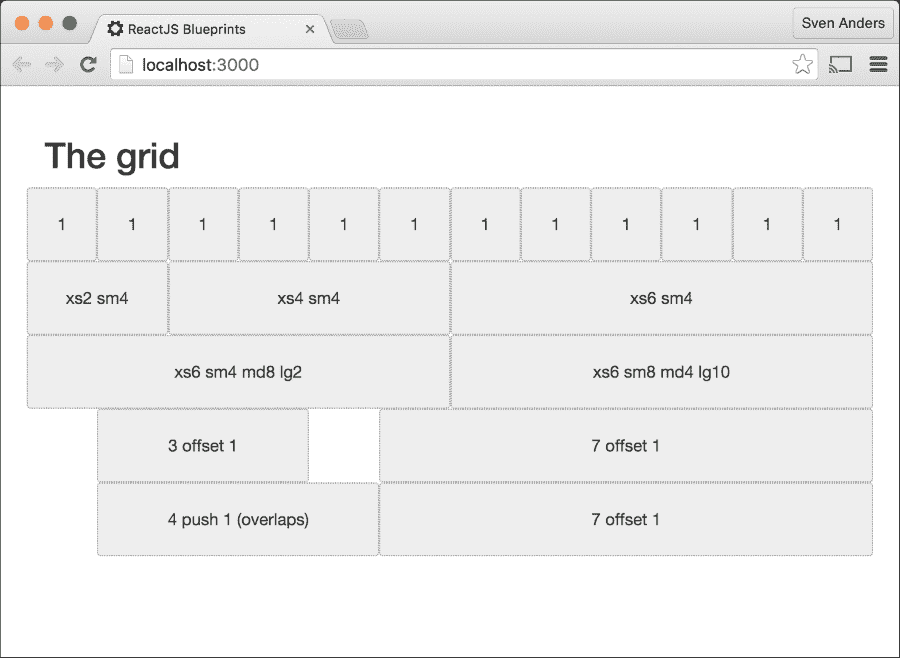
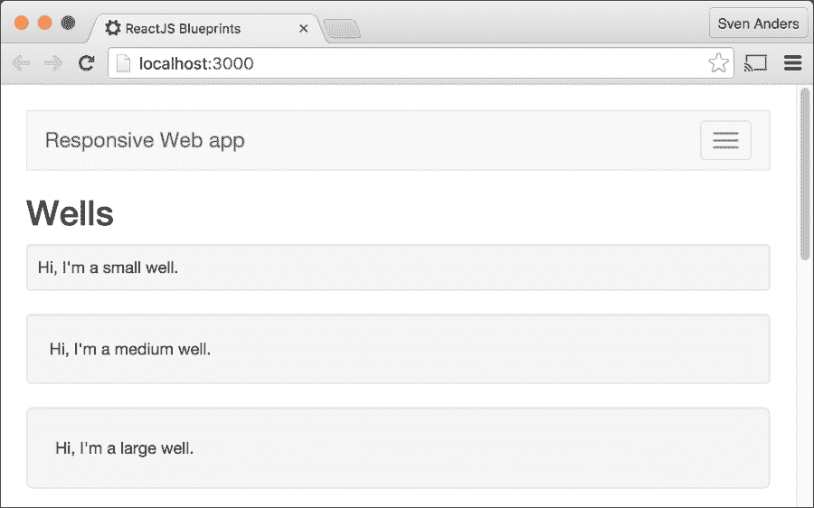
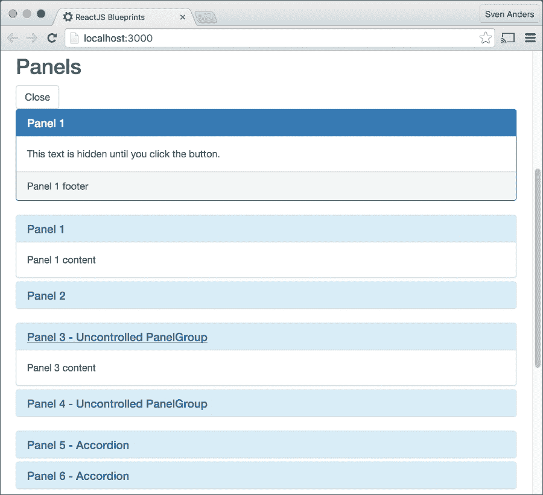
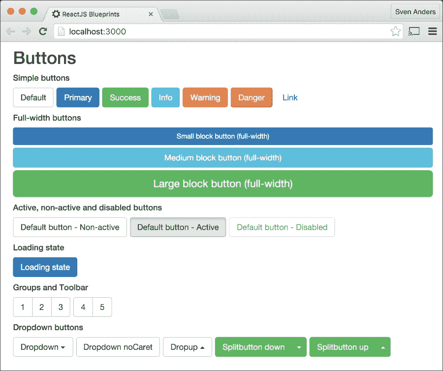
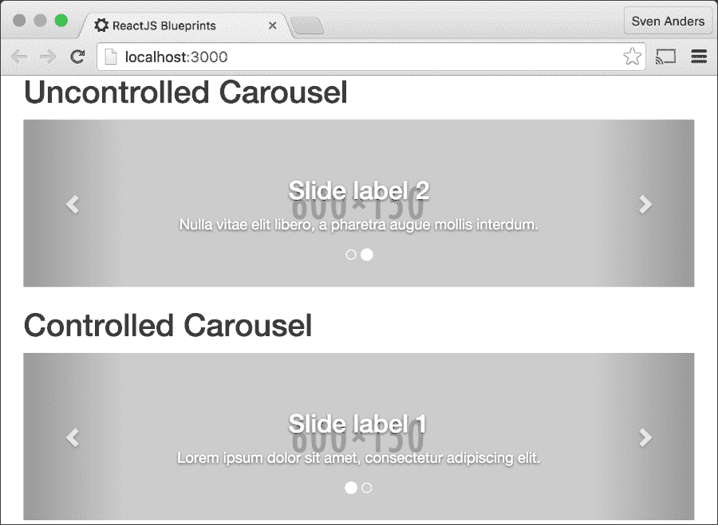
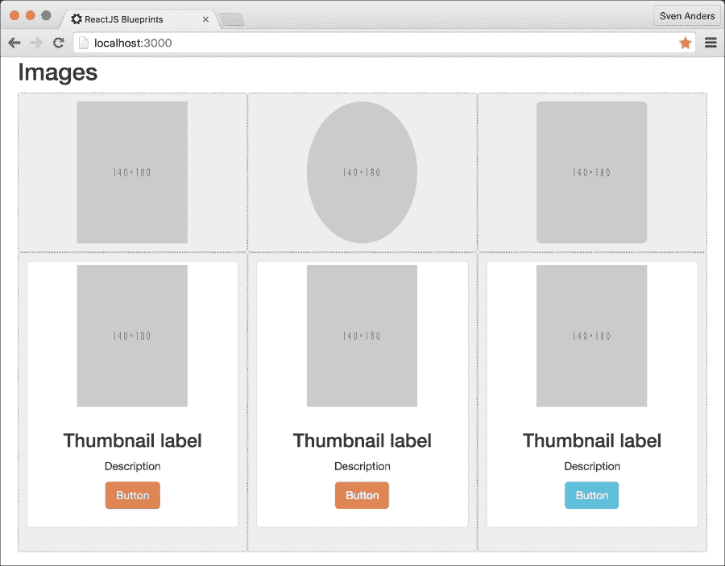
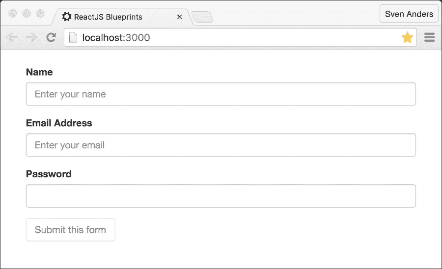

# 第三章：使用 ReactJS 进行响应式 Web 开发

几年前，构建 Web 应用相对容易。您的 Web 应用在具有大致相同屏幕尺寸的台式机和笔记本电脑上查看，并且可以创建一个轻量级的移动版本来服务访问您网站的少量移动用户。如今，情况已经逆转，移动设备同样重要，有时甚至比台式机和笔记本电脑更重要。今天的屏幕尺寸可以从 4 英寸智能手机到 9 英寸平板电脑，以及任何介于两者之间的尺寸。

在本章中，我们将探讨构建适用于任何设备（无论大小或应用是否在桌面或移动浏览器上查看）的 Web 应用的实践。目标是创建一个能够适应用户设置并为每个人提供愉悦体验的应用环境。

“**响应式开发**”这个术语是一个涵盖一系列设计技术（如**自适应**、**流体**、**液体**或**弹性**布局，以及**混合**或**移动**开发）的通用术语。它可以分为两个主要组件：灵活布局和灵活媒体内容。

在这些主题中，我们将涵盖创建响应式 ReactJS 应用所需的所有内容：

+   创建灵活布局

+   选择合适的框架

+   使用 Bootstrap 设置响应式应用

+   创建灵活的网格

+   创建响应式菜单和导航

+   创建响应式井

+   创建响应式面板

+   创建响应式警报

+   嵌入媒体和视频内容

+   创建响应式按钮

+   创建动态进度条

+   创建流体轮播

+   与流体图片和图片元素一起工作

+   创建响应式表单字段

+   使用图标和字体图标

+   创建响应式着陆页

# 创建灵活布局

灵活布局的宽度会根据用户视口的尺寸而变化。视口是用户设备可查看区域的通用术语。它比“窗口”或“浏览器大小”等术语更受欢迎，因为并非所有设备都使用 Windows。您可以设计布局以使用用户宽度的百分比，或者根本不指定任何宽度，让布局无论大小都填满视口。

在我们讨论**灵活布局**的所有优点之前，让我们简要地看看它的对立面，即**固定宽度布局**。

固定宽度意味着将页面的整体宽度设置为预定的像素值，然后考虑到这个限制来设计应用元素。在可联网移动设备爆炸性增长之前，这是开发网络应用的主要设计技术。

固定宽度设计具有一定的优势。主要优势是它让设计师对外观拥有完全的控制权。基本上，用户看到的就是设计师设计的。它也更容易进行结构化，并且与固定宽度的元素（如图片和表单）一起工作，不那么麻烦。

这种设计类型的明显缺点是，你最终得到的是一个僵化的布局，它不会根据用户环境的任何变化而改变。你经常会遇到对于大视口设备来说白空间过多，这会违背某些设计原则，或者对于小视口设备来说设计过宽的情况。

采用固定宽度设计可能适用于某些用例，但它取决于你猜测哪种布局约束对大多数应用用户来说效果最佳的决定，你很可能会排除一个可能非常大的用户群体使用你的应用。

因此，一个响应式应用通常应该设计成一个灵活的布局，以便为你的应用的所有用户保持可用性。

一个*自适应*应用通常指的是当发生变化时易于修改的应用，而*响应式*意味着快速对变化做出反应。这两个术语可以互换使用，当我们使用“响应式”这个术语时，通常意味着它也应该具有自适应的特性。*弹性*和*流体*大致意思相同，通常描述的是基于百分比的布局设计，能够适应浏览器或视口大小的变化。

另一方面，*移动端开发*意味着创建一个专门版本的应用，该版本旨在仅在手机浏览器上运行。这种方法偶尔是可行的，但它伴随着一些权衡，例如维护一个独立的代码库，依赖浏览器嗅探将用户引导到移动版本，以及**搜索引擎优化**（**SEO**）方面的问题，因为你必须为移动版和桌面版维护不同的 URL。

*混合应用*指的是以这种方式开发的移动应用，它们可以托管在利用移动平台**WebView**的本地应用中。你可以将 WebView 视为一个专有的、全屏的浏览器，它被钩在移动平台的本地环境中。这种方法的优点是，你可以使用标准的 Web 开发实践，此外，你还可以访问通常仅限于从移动浏览器内部访问的本地功能。另一个优点是，你可以将你的应用发布到原生应用商店。

使用 ReactJS 开发原生应用是一个有吸引力的提议，而 React Native 项目也提供了一个可行的选择。使用 React Native，你可以将你关于 ReactJS 所学的所有内容应用到开发可以在苹果和安卓设备上运行的应用，并且可以发布到苹果的 App Store 和谷歌的 Play 商店。

## 选择正确的框架

虽然当然可以自己设置一个灵活的布局，但使用响应式框架有很多意义。例如，你可以节省大量时间，使用已经经过多年战斗测试并由一支熟练的设计师团队维护的框架。你还可以利用这样一个广泛使用的响应式框架在网络上拥有大量有用资源的优势。缺点是，你可能需要学习框架期望你如何布局你的页面，有时，你可能不完全同意框架强加给你的设计决策。

考虑到这些因素，让我们来看看一些可供你选择的重大框架：

+   **Bootstrap**: 毫无疑问，Bootstrap 是这个领域的领导者。它非常受欢迎，有大量的资源和扩展可用。与 React-Bootstrap 项目的结合也使得在 ReactJS 中开发网络应用时，这是一个非常明显的选择。

+   **Zurb Foundation**: 基础框架是继 Bootstrap 之后第二大玩家，如果你认为 Bootstrap 不适合你，它是一个自然的选择。这是一个成熟的框架，只需付出很少的努力就能提供很多复杂性。

+   **Pure**: 由 Yahoo! 提供的 Pure 是一个轻量级且模块化的框架。如果你担心其他框架的字节大小（这个大约有 4 KB，而 Bootstrap 大约是 150 KB，Foundation 是 350 KB），它非常合适。

+   **Material Design**: 由 Google 提供的 Material Design 是一个非常有力的竞争者。它带来了很多新的想法，是 Bootstrap 和 Foundation 的一个令人兴奋的替代品。还有一个名为 **Material UI** 的 ReactJS 实现，它将 Material Design 和 ReactJS 结合起来，这使得它成为 Bootstrap 和 React-Bootstrap 的一个有吸引力的替代品。Material Design 在其提供的 UX 元素应该如何表现和交互方面非常具有意见性，而 Bootstrap 和其他框架则给你在设置交互方面提供了更多的自由度。

显然，选择一个适合每个项目的框架并不容易。我们之前没有提到的另一个选择是独自完成，也就是说，完全自己创建网格和灵活布局。这绝对是一个可行的策略，但它也带来了一些缺点。

主要的缺点是，你将无法从多年的调整和测试中受益。尽管大多数现代浏览器都相当强大，但你的代码将在众多浏览器和设备上运行。很可能你的用户会遇到你不知道的问题，因为你没有相同的硬件配置。

最后，你必须决定你是想设计应用程序，还是想创建一个新的灵活 CSS 框架。这个选择应该清楚地说明为什么在本章中我们选择了一个特定的框架来关注，而这个框架就是 Bootstrap。

毫无疑问，Bootstrap 是前面提到的框架中最成熟和最受欢迎的，并且在社区中拥有出色的支持。网络景观仍在以快速的速度发展，您可以确信 Bootstrap 会随着它一起发展。

### 使用 Bootstrap 设置您的应用

我们已经在上一章中查看了一个 Bootstrap 和 React-Bootstrap 的实现，但我们只是略过了您可以做什么。让我们更深入地看看 React-Bootstrap 能为我们提供什么。

通过复制第一章中的脚手架来开始这个项目，*深入 ReactJS*，然后向您的项目中添加 React-Bootstrap。打开终端，转到您的项目根目录，然后使用您喜欢的`dependencies`或`devDependencies`（ whichever you prefer）替换以下列表，然后从命令行运行`npm install`命令：

```js
"devDependencies": {
  "babel-preset-es2015": "6.9.0",
  "babel-preset-react": "6.11.1",
  "babelify": "7.3.0",
  "browser-sync": "2.13.0",
  "browserify": "13.0.1",
  "browserify-middleware": "7.0.0",
  "history": "3.0.0",
  "jsxstyle": "0.0.18",
  "react": "15.1.0",
  "react-bootstrap": "0.29.5",
  "react-dom": "15.1.0",
  "react-router": "2.5.2",
  "reactify": "1.1.1",
  "serve-favicon": "2.3.0",
  "superagent": "2.1.0",
  "uglifyjs": "2.4.10",
  "watchify": "3.7.0"
},
```

此外，您需要下载 Bootstrap CSS 或使用 CDN 将其包含在您的`index.html`文件中。然后，将以下内容添加到`index.html`的`<head>`部分：

```js
<meta http-equiv="X-UA-Compatible" content="IE=edge">
<meta name="viewport" content="width=device-width, initial-scale=1">

<link rel="stylesheet" type="text/css" href="//netdna.bootstrapcdn.com/font-awesome/3.2.1/css/font-awesome.min.css">
<link rel="stylesheet" type="text/css" href="//netdna.bootstrapcdn.com/bootstrap/3.0.0/css/bootstrap-glyphicons.css" />
<link rel="stylesheet" type="text/css" href="//netdna.bootstrapcdn.com/bootstrap/3.3.5/css/bootstrap.min.css" />
```

#### 创建一个灵活的网格

在 Bootstrap 等 CSS 框架的核心中，存在着**网格**的概念。网格是一种结构，允许您以一致的方式水平垂直堆叠内容。它提供了一个可预测的布局框架，当您编码时易于可视化。

网格由两个主要组件组成：行和列。在每一行中，您可以添加一定数量的列，从一列到最多 12 列，具体取决于框架。一些框架，如 Bootstrap，还会添加一个容器，您可以将它包裹在行和列周围。

使用网格非常适合响应式设计。您可以轻松地制作出在大桌面浏览器和小型移动浏览器上看起来都很棒的网络站。

这一切都取决于您如何构建您的列。例如，您可以将列设置为当浏览器宽度小于或等于 320 像素（典型的移动浏览器宽度）时为全宽，当浏览器宽度大于给定的像素大小时为三分之一宽度。您在浏览器尺寸上切换类的方法称为**媒体查询**。所有网格框架都内置了基于媒体查询切换大小的类；您很少需要自己编写媒体查询。

Bootstrap 中的网格系统使用 12 列，并且可以通过初始化为`<Grid fluid={true}>`来选择性地设置为流体。默认情况下是非流体，但值得注意的是，这两种设置都会返回一个响应式网格。主要区别在于流体网格始终具有 100%的宽度，并且会在每次宽度变化时不断调整。非流体网格由媒体查询控制，当视口宽度超过某些阈值时，会改变宽度。

网格列可以通过以下属性来区分：

+   **xs**：这是用于额外小型的设备，如手机（<768 px）

+   **sm**：这是用于小型设备，如平板电脑（≥768 px）的。

+   **md**：这是用于中等设备，如桌面（≥992 px）的。

+   **lg**：这是用于大型设备，如桌面（≥1200 px）的。

你也可以将`push`和`offset`与前面的属性结合使用，例如，你可以使用`xsOffset`来偏移超小设备上可见的列，依此类推。`offset`和`push`之间的区别在于，`offset`将强制其他列移动，而`push`将与其他列重叠。

尺寸向上膨胀。如果你定义了`xs`属性但没有`sm`、`md`或`lg`属性，所有列都将使用`xs`设置。如果你定义了`xs`和`sm`属性，超小视口将使用`xs`属性，而其他所有视口将使用`sm`属性。

让我们看看一个实际例子。在你的`source/examples`文件夹中创建一个文件（如果不存在，请创建该文件夹），命名为`grid.jsx`，并添加以下代码：

```js
'use strict';
import React from 'react';
import {Grid,Row,Col} from "react-bootstrap";
```

在我们的脚本中，我们只导入我们当前需要的部分。在这个例子中，我们需要`Grid`、`Row`和`Col`，所以我们将这些命名并确保它们以这些名称导入并可用。

虽然不指定每个组件的名称而导入所有组件会更方便，但具体指定导入可以使你更容易理解你正在工作的文件中需要什么。这也可能在打包你的 JavaScript 代码以部署时减少体积，因为打包器可以移除所有可用但从未使用过的组件。请注意，这并不适用于当前版本的**Browserify**或**Webpack**（我们将在第六章 Advanced React 中讨论），但 Webpack 至少已经在路上了。

### 小贴士

当你从一个较大的库中导入单个组件时，请使用这种方法导入：

```js
const Row = require('react-bootstrap').Row;
```

这将只导入所需的组件，而忽略库中的其余部分。如果你这样做是一致的，你的包大小将会减小。

让我们看看下面的代码：

```js
const GridExample = React.createClass ({
  render: function () {
    return (
      <div>
        <h2>The grid</h2>

        <Grid fluid={true}>
          <Row>
            <Col xs = { 1 }> 1 </Col>
            <Col xs = { 1 }> 1 </Col>
            <Col xs = { 1 }> 1 </Col>
            <Col xs = { 1 }> 1 </Col>
            <Col xs = { 1 }> 1 </Col>
            <Col xs = { 1 }> 1 </Col>
            <Col xs = { 1 }> 1 </Col>
            <Col xs = { 1 }> 1 </Col>
            <Col xs = { 1 }> 1 </Col>
            <Col xs = { 1 }> 1 </Col>
            <Col xs = { 1 }> 1 </Col>
            <Col xs = { 1 }> 1 </Col>
          </Row>

          <Row>
            <Col xs = { 2 } sm = { 4 }> xs2 sm4 </Col>
            <Col xs = { 4 } sm = { 4 }> xs4 sm4 </Col>
            <Col xs = { 6 } sm = { 4 }> xs6 sm4 </Col>
          </Row>
```

这一行将为超小设备和从小到大的设备显示不同的列尺寸：

### 注意

记住，尺寸是向上膨胀，而不是向下。

```js
          <Row>
            <Col
              xs = { 6 } 
              sm = { 4 } 
              md = { 8 } 
              lg = { 2 }>
             xs6 sm4 md8 lg2
            </Col>
            <Col
              xs = { 6 } 
              sm = { 8 } 
              md = { 4 }>
              xs6 sm8 md4 lg10
            </Col>
          </Row>
```

这一行显示了两个列，它们的宽度根据视口的不同而有很大变化。在智能手机上，列的宽度相等。在小视口中，左侧列覆盖行的一三分之一，而右侧列覆盖剩余部分。在中视口中，左侧列突然成为主导列，但在非常大的视口中，左侧列再次减少到一个更小的比例。

这显然是一个为了展示网格功能而人为设置的例子。对于实际应用来说，这是一个非常奇怪的设置：

```js
          <Row>
            <Col
              xs = { 3 } 
              xsOffset = { 1 }> 
              3 offset 1 
            </Col>
            <Col
              xs = { 7 } 
              xsOffset = { 1 }> 
              7 offset 1 
            </Col>
          </Row>
```

两个列在这里都开始于一个偏移量。这将在每个列的开始处创建一个空白的列：

```js
          <Row>
            <Col
              xs = { 4 }
              xsPush = { 1 }>
              4 push 1 (overlaps)
            </Col>
            <Col
              xs={ 7 }
              xsOffset = { 1 }>
              7 offset 1 
            </Col>
          </Row>
```

`Push`将列移动到右边，但不会强制其他列移动，因此它将覆盖下一个列。这意味着第二列的偏移量将被第一列的内容覆盖：

```js
        </Grid>
      </div>
    );
  }
});

module.exports = GridExample;
```

为了查看这个示例，请打开`app.jsx`并替换内容为以下代码：

```js
'use strict';
import React from 'react';
import ReactDom from 'react-dom';
import GridExample from './examples/grid.jsx';

ReactDom.render ((<div>
    <GridExample />
  </div>),
  document.getElementById('container')
);
```

### 小贴士

在本章中，我们将创建许多组件，并且它们都可以通过在代码头部添加一个`import`语句来添加到`app.jsx`中。ReactJS 要求你在导入组件时首字母大写。你可以通过在括号中添加名称来在渲染代码中使用你给导入的名称。

在创建网格时，在设置时使其可见非常有好处。你可以将其添加到`app.css`中，使其在浏览器中显示：

```js
div[class*="col-"] {
  border: 1px dotted rgba(60, 60, 60, 0.5);
  padding: 10px;
  background-color: #eee;
  text-align: center;
  border-radius: 3px;
  min-height: 40px;
  line-height: 40px;
}
```

这种样式将使查看和调试我们添加的列变得容易。

Bootstrap 的网格系统非常灵活，可以很容易地以你想要的方式构建你的页面。在这个示例中创建的网格在所有你抛向它的设备上都是可见的且流动的。



#### 创建一个响应式菜单和导航栏

这在第二章中进行了广泛介绍，*创建一个网店*，所以我们在这里只设置一个基本的菜单，并参考上一章的细节，了解如何连接到路由器并设置工作链接。

在你的`source/examples`文件夹中创建一个文件，命名为`navbar.jsx`，并添加以下代码：

```js
'use strict';
import React from 'react';
import { Nav,
  Navbar,
  NavBrand,
  NavItem,
  NavDropdown,
  MenuItem
} from 'react-bootstrap';

const Navigation = React.createClass ({
  render() {
    return (
      <Navbar inverse fixedTop>
        <Navbar.Header>
          <Navbar.Brand>
            Responsive Web app
          </Navbar.Brand>
          <Navbar.Toggle/>
        </Navbar.Header>
        <Navbar.Collapse>
```

自动添加`Navbar.Collapse`将使这个导航栏成为一个移动友好的导航栏，当视口小于 768 像素时，它将用**汉堡**按钮替换菜单项：

```js
          <Nav role="navigation" eventKey={0} pullRight>
            <NavItem
              eventKey={ 1 }
              href = "#">
              Link
            </NavItem>
            <NavItem
              eventKey = { 2 }
              href = "#">
              Link
            </NavItem>
            <NavDropdown
              eventKey = { 3 }
              title = "Dropdown"
              id = "collapsible-nav-dropdown">
              <MenuItem eventKey={ 3.1 }>
                Action
              </MenuItem>
              <MenuItem eventKey={ 3.2 }>
                Another action
              </MenuItem>
              <MenuItem eventKey={ 3.3 }>
                Something else here
              </MenuItem>
              <MenuItem divider />
              <MenuItem eventKey={ 3.3 }>
                Separated link
              </MenuItem>
            </NavDropdown>
          </Nav>
          <Nav pullRight>
            <NavItem eventKey = { 1 } href = "#">
              Link Right
            </NavItem>
            <NavItem eventKey = { 2 } href = "#">
              Link Right
            </NavItem>
          </Nav>
        </Navbar.Collapse>
      </Navbar>
    );
  }
});

module.exports = Navigation;
```

你可以在主要的`Navbar`组件上设置以下属性：

+   `defaultExpanded`：如果设置为`true`，这将展开小设备上的`Navbar`

+   `expanded`：这将在运行时设置`Navbar`组件展开（需要`onToggle`）

+   `fixedBottom`：这将固定`Navbar`组件在视口的底部

+   `fixedTop`：这将固定`Navbar`组件在视口的顶部

+   `staticTop`：这将使`Navbar`随着页面浮动

+   `fluid`：这与网格中的`fluid`设置工作方式相同

+   `inverse`：这将反转`Navbar`中的颜色

+   `onToggle`：这是一个当`Navbar`被切换时可以运行的函数

+   `componentClass`：这用于向`Navbar`添加你自己的类

#### 创建响应式井

井是一个可以用于良好效果的嵌入元素。这是一种简单但有效的方式来强调内容。在 Bootstrap 中设置它也非常简单。

在`source/examples`中添加一个新文件，命名为`wells.jsx`，并添加以下代码：

```js
'use strict';
import React from 'react';
import { Well } from 'react-bootstrap';

const Wells = React.createClass ({
  render() {
    return (
      <Well bsSize = "large">
        Hi, I'm a large well.
      </Well>
    );
  }
});

module.exports = Wells;
```

你可以在`Wells`组件上设置以下属性：

+   `bsSize`：井可以是*小*或*大*



#### 创建响应式面板

面板就像一口井，但拥有更多的信息和功能。

它可以有一个标题，也可以是可折叠的，因此它是一个很好的信息展示、表单包含等的候选者。

让我们创建一个基本的面板。在`source/components`中添加一个新文件，命名为`panels.jsx`，并添加以下代码：

```js
'use strict';
import React from 'react';
import { Panel, Button, PanelGroup, Accordion }
  from 'react-bootstrap';

const Panels = React.createClass ({
  getInitialState() {
    return {
      open: false,
      activeKey: 1
    }
  },
  render() {
    return (
      <div>
        <h2>Panels</h2>
        <div>
          <Button
            onClick = { ()=> this.setState ({
              open: !this.state.open })}>
            { !this.state.open ? "Open" : "Close" }
          </Button>
          <Panel
            collapsible
            expanded = { this.state.open }>
              This text is hidden until you click the button.
          </Panel>
```

这个面板默认是关闭的，并由组件的状态变量`open`控制。当你点击按钮时，它执行内部的`setState`函数。状态只是使用相当聪明的`not`运算符反转`open`变量的布尔值。当我们使用它时，我们说我们想要当前值的相反，这可能是`true`或`false`：

```js
        </div>
      </div>
    );
  }
});

module.exports = Panels;
```

我们还可以对面板组件做更多的事情，但让我们先简要看看我们可以在`Panel`上设置哪些其他属性：

+   `header (string)`: 将此添加到`Panel`初始化器中，并传递一个值以给标题添加一些内容。

+   `footer (string)`: 这与标题相同，但会在底部而不是顶部创建信息块。

+   `bsStyle (string)`: 这通过添加上下文类使内容有意义。你可以选择所有常见的 Bootstrap 上下文名称：`primary`、`success`、`danger`、`info`、`warning`以及`default`。

+   `expanded (boolean)`: 这可以是`true`或`false`。这需要与`collapsible`一起使用。

+   `defaultExpanded (boolean)`: 这也可以是`true`或`false`。这不会覆盖`expanded`函数。

你通常会想要显示多个面板并将它们分组在一起。这可以通过添加一个名为`PanelGroup`的组件来实现。

`PanelGroups`是一个包装器，你可以在你想要分组的所有面板周围设置它。如果你想分组两个面板，代码看起来是这样的：

```js
<PanelGroup
  activeKey = { this.state.activeKey }
  onSelect = { (activeKey)=>
  this.setState({ activeKey: activeKey })}
  accordion>

  <Panel
    collapsible 
    expanded = { this.state.open }
    header = "Panel 1 - Controlled PanelGroup" 
    eventKey = "1" 
    bsStyle = "info">
      Panel 1 content
  </Panel>

  <Panel
    collapsible
    expanded = {this.state.open}
    header = "Panel 2 - Controlled PanelGroup"
    eventKey = "2"
    bsStyle = "info">
      Panel 2 content
  </Panel>
</PanelGroup>
```

这是一个受控的`PanelGroup`实例。这意味着在任何时候只有一个面板会打开，这是通过在`PanelGroup`初始化器中添加`activeKey`属性来表示的。当你点击组中的面板时，`onSelect()`方法中的函数会被调用，并更新活动面板状态，然后告诉 ReactJS 打开活动面板并关闭非活动面板。

你也可以通过简单地从`PanelGroup`初始化器中删除`activeKey`和`onSelect`属性，以及从`Panel`初始化器中删除`expanded`属性来创建一个无控制的`PanelGroup`实例：

```js
<PanelGroup accordion>
  <Panel
    collapsible
    header = "Panel 3 - Uncontrolled PanelGroup"
    eventKey = "3"
    bsStyle = "info">
      Panel 3 content
  </Panel>

  <Panel
    collapsible 
    header = "Panel 4 - Uncontrolled PanelGroup"
    eventKey = "4" 
    bsStyle = "info">
      Panel 4 content
  </Panel>
</PanelGroup>
```

它们之间的主要区别在于，在有控制组的情形下，每次只会打开一个面板，但在无控制组的情形下，用户可以关闭所有面板。

最后，如果你只想使用无控制面板组，你可以丢弃`PanelGroup`组件，转而导入`Accordion`组件。`<Accordion />`是`<PanelGroup accordion />`的别名。它实际上并没有节省多少代码，但可能更容易记住。代码看起来是这样的：

```js
<Accordion>
  <Panel
    collapsible
    header = "Panel 5 - Accordion"
    eventKey = "5" 
    bsStyle = "info">
      Panel 5 content
  </Panel>

  <Panel
    collapsible
    header = "Panel 6 - Accordion"
    eventKey = "6"
    bsStyle = "info">
      Panel 6 content
  </Panel>
</Accordion>
```



#### 创建响应式警报

与面板类似，警报是填充了少量附加功能的信息块，非常适合向用户展示及时信息。

让我们看看你可以用警报做什么。

创建一个名为`examples/alerts.jsx`的文件，并添加以下代码：

```js
'use strict';
import React from 'react';
import { Alert, Button } from "react-bootstrap";

const AlertExample = React.createClass ({
  getInitialState() {
    return {
      alertVisible: true
    };
  },
```

这是我们的标志，用于保持警报可见。当这个设置为`false`时，警报会被隐藏：

```js
  render(){
    if(this.state.alertVisible){
    return (<Alert bsStyle="danger" isDismissableonDismiss={()=>{this.setState({alertVisible:false})}}>
```

在这里，有两个需要注意的属性。第一个是`isDismissable`，它渲染一个按钮，允许用户取消警报。这个属性是可选的。

第二个是`onDismiss`，这是一个在用户点击**取消**按钮时被调用的函数。在这种情况下，`alertVisible`标志被设置为 0，并且`render`函数现在返回`null`而不是`Alert`组件：

```js
    <h4>An error has occurred!</h4>
    <p>Try something else and hope for the best.</p>
    <p>
      <Button bsStyle="danger">Do this</Button>
      <span> or </span>
      <Button onClick=
        {()=>{this.setState({alertVisible:false})}}>
        Forget it</Button>
```

**操作**按钮尚未设置任何功能，因此点击它目前是徒劳的。**隐藏**按钮接收一个函数，该函数将`alertVisible`标志设置为 0 并隐藏`Alert`框：

```js
    </p>
    </Alert>)}
    else {
      return null;
    }
  }
});

module.exports = Alerts;
```

#### 响应式嵌入媒体和视频内容

在你的网站上嵌入 YouTube 视频可以是一个值得考虑的添加项，因此让我们创建一个自定义组件来处理这个问题。

对于这个模块，我们还需要另一个依赖项，所以请继续打开终端，导航到根目录，并执行以下`install`命令：

```js
npm install --save classnames

```

`classnames`组件允许你通过简单的`true`和`false`比较动态定义要包含的类，它比依赖于字符串连接和`if...else`语句更容易使用和理解。

创建一个名为`components`的文件夹，并在该文件夹中创建一个名为`media.jsx`的文件，然后添加以下代码：

```js
'use strict';
import React from 'react';
import ClassNames from 'classnames';

const Media = React.createClass ({
  propTypes: {
    wideScreen: React.PropTypes.bool,
    type: React.PropTypes.string,
    src: React.PropTypes.string.isRequired,
    width: React.PropTypes.number,
    height: React.PropTypes.number
  },
  getDefaultProps() {
    return {
      src: "",
      type: "video",
      wideScreen: false,
      allowFullScreen: false,
      width:0,
      height:0
    }
  },
```

我们需要一个属性：YouTube 源。其他的是可选的。如果没有提供宽屏，组件将以 4:3 的宽高比显示视频：

```js
  render() {
    let responsiveStyle = ClassNames ({
      "embed-responsive": true,
      "embed-responsive-16by9": this.props.wideScreen,
      "embed-responsive-4by3": !this.props.wideScreen
    });
    let divStyle, ifStyle;
    divStyle = this.props.height ?
      {paddingBottom:this.props.height} : null;
    ifStyle = this.props.height ?
      {height:this.props.height, width:this.props.width} : null;

    if(this.props.src) {
      if(this.props.type === "video") {
        return (<div className={responsiveStyle}
          style={divStyle}>
          <iframe className="embed-responsive-item"
            src={ this.props.src }
            style={ifStyle}
            allowFullScreen={ this.props.allowFullScreen }>
          </iframe>
        </div>);
      } else {
        return (<div className={ responsiveStyle }
          style={ divStyle }>
          <embed frameBorder='0'
          src={ this.props.src }
          style={ ifStyle }
          allowFullScreen={ this.props.allowFullScreen }/>
        </div>)
      }
    }
    else {
      return null;
    }
  }
});

module.exports = Media;
```

这个片段根据传递的媒体类型返回`iframe`或`embed`元素。响应式类基于 Bootstrap 提供的类，并将媒体自动缩放到任何视口。

打开`app.jsx`并添加以下导入：

```js
import Media from './components/media;
```

然后，将`< Media src="img/x7cQ3mrcKaY"/>`添加到`render()`方法（或你想要显示的任何其他视频）。你也可以添加`wideScreen`可选属性来以 16 x 9 的尺寸显示视频，以及`allowFullScreen`，如果你希望允许用户全屏查看视频。你还可以传递`height`和`width`参数，以便使其与你的布局保持一致。

当然，这个组件不仅限于视频，任何类型的媒体内容都可以。例如，尝试用以下代码替换`app.jsx`中的代码：

```js
'use strict';
import React from 'react';
import ReactDom from 'react-dom';
import Media from './components/media.jsx';
import { Grid, Row, Col } from "react-bootstrap";

ReactDom.render((<Grid fluid={true}>
  <Row>
    <Col xs={12} md={6}>
      <Media type="image/svg+xml"
      src="img/Black-crowned_Night_Heron.svg" />
    </Col>
    <Col xs = { 12 } md = { 6 }>
      <Media
        type = "video"
        src = "//www.youtube.com/embed/x7cQ3mrcKaY" />
    </Col>
  </Row>
</Grid>),
document.getElementById( 'container' )
);
```

这将显示一个两列的网格，一列是 SVG，另一列是 YouTube 的视频。

#### 创建响应式按钮

按钮在任何 Web 应用中都很常见。它们负责你在应用中进行的许多用户交互，因此了解你可用到的多种按钮类型是很有价值的。

您可以选择的选项包括超小号、小号和大号按钮，全宽按钮，激活和禁用状态，分组，上拉和下拉，以及加载状态。让我们看看代码。

创建一个名为`examples/buttons.jsx`的文件，并添加以下代码：

```js
'use strict';
import React from 'react';
import { Button, ButtonGroup, ButtonToolbar, DropdownButton,
  MenuItem, SplitButton } from 'react-bootstrap';

const Buttons = React.createClass({
  getInitialState() {
    return {
      isLoading: false
    }
  },
  setLoading() {
    this.setState({ isLoading: true });
    setTimeout(() => {
      this.setState({ isLoading: false });
    }, 2000);
  },
```

当我们执行`setLoading`时，我们将`isLoading`状态设置为`true`，然后，我们设置一个计时器，在 2 秒后将状态重置为`false`：

```js
  render() {
    let isLoading = this.state.isLoading;

    return (
      <div>
        <h2> Buttons </h2>
        <h5> Simple buttons </h5>
        <ButtonToolbar>
```

`ButtonToolbar`和`ButtonGroup`是您可以用于分组按钮的两个组件。它们之间的主要区别在于`ButtonToolbar`将保留多个内联按钮或按钮组的间距，而`ButtonGroup`则不会：

```js
          <Button> Default </Button>

          <Button bsStyle = "primary"> Primary </Button>

          <Button bsStyle = "success"> Success </Button>

          <Button bsStyle = "info"> Info </Button>

          <Button bsStyle = "warning"> Warning </Button>

          <Button bsStyle = "danger"> Danger </Button>

          <Button bsStyle = "link"> Link </Button>
```

样式提供了视觉重量并标识了按钮的主要操作。最后的样式`link`使按钮看起来像普通链接，但保持了按钮的行为：

```js
        </ButtonToolbar>

        <h5>Full-width buttons</h5>
        <ButtonToolbar>
          <Button
            bsStyle = "primary"
            bsSize = "xsmall"
            block>
            Extra small block button (full-width)
          </Button>
          <Button
            bsStyle = "info"
            bsSize = "small"
            block>
            Small block button (full-width)
          </Button>
          <Button
            bsStyle = "success"
            bsSize = "large"
            block>
            Large block button (full-width)
          </Button>
        </ButtonToolbar>
```

添加`block`属性将其转换为全宽按钮。`bsSize`属性适用于所有按钮，可以是`xsmall`、`small`或`large`：

```js
        <h5> Active, non-active and disabled buttons </h5>
        <ButtonToolbar>
          <Button> Default button - Non-active </Button>
          <Button active> Default button – Active </Button>
```

要设置按钮的激活状态，只需添加`active`属性：

```js
          <Button disabled> Default button – Disabled </Button>
        </ButtonToolbar>
```

添加`disabled`属性会使按钮看起来不可点击，通过将其透明度降低到原始的 50%：

```js
        <h5>Loading state</h5>
        <Button
          bsStyle = "primary"
          disabled = { isLoading }
          onClick = { !isLoading ? this.setLoading : null }>
          { isLoading ? 'Loading...' : 'Loading state' }
        </Button>
```

此按钮接收一个`click`动作并将其传递给`setLoading`函数，如前所述代码所示。只要`isLoading`状态设置为`false`，它将有一个`disabled`属性并显示文本**加载中…**：

```js
        <h5> Groups and Toolbar </h5>
        <ButtonToolbar>
          <ButtonGroup>
            <Button> 1 </Button>
            <Button> 2 </Button>
            <Button> 3 </Button>
          </ButtonGroup>

          <ButtonGroup>
            <Button> 4 </Button>
            <Button> 5 </Button>
          </ButtonGroup>
        </ButtonToolbar>

```

此部分展示了您如何结合`ButtonToolbar`和`ButtonGroup`来保持两套或多套视觉上分组的按钮。您还可以添加到`ButtonGroup`的一个引人注目的效果是`vertical`属性，它将按钮堆叠而不是并排显示：

```js
        <h5> Dropdown buttons </h5>
        <ButtonToolbar>
          <DropdownButton
            title = "Dropdown"
            id = "bg-nested-dropdown">
            <MenuItem
              bsStyle = "link"
              eventKey = "1">
               Dropdown link
            </MenuItem>
            <MenuItem
              bsStyle = "link"
              eventKey = "2">
               Dropdown link
            </MenuItem>
          </DropdownButton>
```

我们最终的按钮集合展示了您可以通过哪些方式添加下拉和分割按钮效果。此前的代码是最简单的下拉按钮集合，您只需将它们包裹在`DropdownButton`组件内部即可：

```js
          <DropdownButton
            noCaret
            title = "Dropdown noCaret"
            id = "bg-nested-dropdown-nocaret">
            <MenuItem
              bsStyle="link"
              eventKey="1">
                Dropdown link
            </MenuItem>
            <MenuItem
              bsStyle = "link"
              eventKey = "2">
                Dropdown link
            </MenuItem>
          </DropdownButton>
```

下一个集合添加了`noCaret`属性，以展示您如何创建一个点击时不会显示任何视觉提示的下拉按钮：

```js
          <DropdownButton
            dropup
            title = "Dropup"
            id="bg-nested-dropup">
              <MenuItem
                bsStyle = "link"
                eventKey = "1">
                  Dropdown link
              </MenuItem>
              <MenuItem
                bsStyle = "link"
                eventKey = "2">
                  Dropdown link
              </MenuItem>
          </DropdownButton>
```

您可以通过添加`dropup`属性将下拉菜单转换为上拉菜单：

```js
          <SplitButton
            bsStyle = "success"
            title="Splitbutton down"
            id="successbutton">
            <MenuItem eventKey = "1"> Action </MenuItem>
            <MenuItem eventKey = "2"> Another action </MenuItem>
          </SplitButton>
          <SplitButton
            dropup
            bsStyle = "success"
            title = "Splitbutton up"
            id = "successbutton">
            <MenuItem eventKey = "1"> Action </MenuItem>
            <MenuItem eventKey = "2"> Another action </MenuItem>
          </SplitButton>
```

同样，您可以通过将按钮包裹在`SplitButton`组件内部而不是`DropdownButton`组件内部来创建分割按钮效果：

```js
        </ButtonToolbar>

      </div>
    );
  }
});

module.exports = Buttons;
```

下面的截图显示了此代码的输出：



#### 创建动态进度条

进度条可以用来显示用户进程的状态以及完成前还有多少工作要做。

创建一个名为`examples/progressbars.jsx`的文件，并添加此代码：

```js
'use strict';
import React from 'react';
import { ProgressBar } from 'react-bootstrap';
let tickInterval;
```

在此组件中，我们想要为进度条创建一个间隔。我们创建一个变量来保存间隔，因为我们希望在`unmount`方法中稍后访问它：

```js
const ProgressBars = React.createClass ({
  getInitialState() {
    return {
      progress: 0
    }
  },
  componentDidMount() {
    tickInterval = setInterval(this.tick, 500);
  },
  componentWillUnmount() {
    clearInterval(tickInterval);
  },
```

当我们挂载组件时，我们创建一个间隔，告诉它每 500 毫秒执行一次我们的 `tick` 方法：

```js
  tick() {
    this.setState({ progress: this.state.progress < 100 ?
      ++this.state.progress : 0 })
  },
```

`tick()` 方法通过向内部 `progress` 变量添加 `1` 来更新它，如果它小于 `100`，或者如果它不是，则重置为 `0`：

```js
  render() {
    return (
      <div>
        <h2> ProgressBars </h2>
        <ProgressBar
          active
          now = { this.state.progress } />

        <ProgressBar
          striped
          bsStyle = "success"
          now = { this.state.progress } />

        <ProgressBar
          now = { this.state.progress }
          label = "%(percent)s%" />
```

所有的进度条现在将更新并显示一个不断增加的进度，直到完全填满，然后重置为 `empty`。

如果您应用 `active` 属性，进度条将动画化。您还可以通过添加 `striped` 属性来提供条纹。

您可以添加自己的自定义标签或使用以下之一来插值当前值：

+   `%(percent)s%`: 这添加了一个百分比值

+   `%(bsStyle)s`: 这显示了当前的样式

+   `%(now)s`: 这显示了当前值

+   `%(max)s`: 这显示了最大值（通过设置 `max={x}` 来配合，其中 *x* 是任何数字）

+   `%(min)s`: 这表示最小值（通过设置 `min={x}` 来配合，其中 *x* 是任何数字）

让我们看看下面的代码片段：

```js
        <ProgressBar>
          <ProgressBar
            bsStyle = "warning"
            now = { 20 }
            key = { 1 }
            label = "System Files" />
          <ProgressBar
            bsStyle="danger"
            active
            striped
            now = { 40 }
            key = { 3 }
            label = "Crunching" />
        </ProgressBar>
```

可以通过将它们包裹在 `ProgressBar` 中来嵌套多个进度条：

```js
      </div>
    );
  }
});

module.exports = ProgressBarExample;
```

#### 创建流体轮播图

轮播图是一个用于循环显示元素（如幻灯片）的组件。其功能相当复杂，但可以用很少的代码实现。

让我们看看它。创建一个名为 `examples/carousels.jsx` 的新文件并添加此代码：

```js
'use strict';
import React from 'react';
import {Carousel,CarouselItem} from 'react-bootstrap';

const Carousels = React.createClass({
  getInitialState() {
    return {
      index: 0,
      direction: null
    };
  },
  handleSelect(selectedIndex, selectedDirection) {
    this.setState({
      index: selectedIndex,
      direction: selectedDirection
    });
  },
```

方向可以是 `prev` 或 `next`：

```js
  render() {
    return (
      <div>
        <h2>Uncontrolled Carousel</h2>
        <Carousel>
          <CarouselItem>
            
            <div className = "carousel-caption">
              <h3> Slide label 1 </h3>
              <p> Lorem ipsum dolor sit amet </p>
            </div>
          </CarouselItem>
          <CarouselItem>
            
            <div className = "carousel-caption">
              <h3> Slide label 2 </h3>
              <p> Nulla vitae elit libero, a pharetra augue. </p>
            </div>
          </CarouselItem>
        </Carousel>
```

我们创建的第一个轮播图是不受控的。也就是说，它自动动画，但可以被用户手动触发：

```js
        <h2>Controlled Carousel</h2>
        <Carousel activeIndex = {this.state.index}
          direction = {this.state.direction}
          onSelect = {this.handleSelect}>
```

第二个轮播图是受控的，并且不会自动动画，直到用户点击左侧或右侧的箭头。当用户点击其中一个箭头时，`handleSelect` 函数会接收到期望的方向并动画化轮播图。

默认情况下，轮播图使用包含的 `Glyphicon` 集中的左右箭头图标。您可以使用 `nextIcon` 和 `prevIcon` 属性指定自己的箭头：

```js
          <CarouselItem>
            
            <div className = "carousel-caption">
              <h3> Slide label 1 </h3>
              <p> Lorem ipsum dolor sit amet </p>
            </div>
          </CarouselItem>
          <CarouselItem>
            
            <div className = "carousel-caption">
              <h3> Slide label 2 </h3>
              <p> Nulla vitae elit libero, a pharetra augue. </p>
            </div>
          </CarouselItem>
        </Carousel
      </div>
    );
  }
});

module.exports = CarouselExample;
```



#### 与流体图像和 `picture` 元素一起工作

响应式图像的主题是一个充满困难的话题。一方面，有简单缩放和以响应方式呈现图像的问题。另一方面，您通常会希望为小型设备下载较小的图像，并为桌面设备提供较大的图像。

让我们先看看如何设置响应式代码。

创建一个名为 `examples/images.jsx` 的文件，并添加以下代码：

```js
'use strict';
import React from 'react';
import { Image, Thumbnail, Button, Grid, Row, Col }
  from 'react-bootstrap';

const Images = React.createClass ({
  render() {
    return (
      <div>
        <h2> Images </h2>
        <Grid fluid = { true }>
          <Row>
            <Col xs={ 12 } sm={ 4 }>
              <Image src="img/140x180" portrait />
            </Col>
            <Col xs={ 12 } sm={ 4 }>
              <Image src="img/140x180" circle />
            </Col>
            <Col xs={ 12 } sm={ 4 }>
              <Image src="img/140x180" rounded />
            </Col>
          </Row>
```

我们将首先定义 `Grid`，然后创建一组三列（在小型移动设备上为两列）。在列中，我们添加三张图片，有三种可用的属性：`portrait`、`circle` 和 `rounded`。

这将很好地适应任何视口。

接下来，我们创建另一行，这次使用一个名为`Thumbnail`的组件而不是`Image`组件。这个组件使我们能够轻松地添加与你的图片一起的任何 HTML 数据，例如标题、描述和操作按钮：

```js
          <Row>
            <Col xs={ 12 } sm={ 4 }>
              <Thumbnail
                src = "http://placehold.it/140x180">
                <h3> Thumbnail label </h3>
                <p> Description </p>
                <p>
                  <Button
                    bsSize = "large"
                    bsStyle = "danger">
                      Button
                  </Button>
                </p>
              </Thumbnail>
            </Col>

            <Col xs={ 12 } sm={ 4 }>
              <Thumbnail
                src="img/140x180">
                  <h3> Thumbnail label </h3>
                  <p> Description </p>
                  <p>
                    <Button
                      bsSize = "large"
                      bsStyle = "warning">
                        Button
                    </Button>
                  </p>
              </Thumbnail>
            </Col>

            <Col xs={ 12 } sm={ 4 }>
              <Thumbnail
                src="img/140x180">
                  <h3> Thumbnail label </h3>
                  <p> Description </p>
                  <p>
                    <Button
                      bsSize = "large"
                      bsStyle = "info">
                        Button
                     </Button>
                  </p>
              </Thumbnail>
            </Col>
          </Row>
        </Grid>
      </div>
    );
  }
});

module.exports = Images;
```

要在你的应用中显示此组件，打开`app.jsx`并添加以下导入：

```js
import Images from './examples/images.jsx';
```

然后，将`<Images />`添加到`render()`方法中。



#### 减少你的足迹

当为小型设备提供服务时，限制它们需要下载以查看应用内容的数据量是一个好主意。毕竟，如果你的目标受众是手机用户，提供可能需要几秒钟才能下载的高分辨率图片可能不是一个好主意。

目前还没有针对这个问题的通用解决方案，但有一些相当不错的处理方法。让我们看看一些你可以用来解决这个问题的方式。

一种选择是查看用户查看你的应用的设备。这被称为**嗅探**，通常意味着识别用户代理和视口大小等指标，以便为桌面和手机提供不同的图片。这种解决方案的问题在于它并不非常可靠。用户代理可以被伪造，而小的视口大小并不自动意味着用户在小型设备上浏览你的应用。

另一种选择是媒体查询（我们将在稍后更深入地讨论）。这对于静态元素效果很好，例如你可以将其放置在菜单、工具栏和其他固定内容中的图片，但对于动态元素则不然。

最近出现的一个相当不错的解决方案是使用一个名为`<picture>`的新元素。此元素允许你动态地使用媒体查询的概念，并根据你指定的要求加载不同的图片。

让我们看看这在 HTML 中是如何工作的：

```js
<picture>
  <source
    media="(min-width: 750px)"
    srcSet="http://placehold.it/500x300" />
  <source
    media="(min-width: 375px)"
    srcSet="http://placehold.it/250x150" />
  
</picture>
```

如果浏览器视口至少为 750 像素，此块将下载并显示大图片；如果视口至少为 375 像素，则显示中等图片；如果不符合这些条件，则显示小图片。此元素可以优雅地缩放，如果用户使用的浏览器不支持此元素，它将显示``元素中命名的图片。

此处的媒体查询相对简单。你可以用你的查询和`include`属性相当有创意，例如方向和像素比。以下是一个匹配竖直模式下的智能手机的媒体查询：

```js
only screen and (max-device-width: 721px) and (orientation: portrait) and (-webkit-min-device-pixel-ratio: 1.5), only screen and (max-device-width: 721px) and (orientation: portrait) and (min-device-pixel-ratio: 1.5), only screen and (max-width: 359px)
```

这个匹配在竖直模式下的视网膜显示屏的表格：

```js
only screen and (min-device-width: 768px) and (max-device-width: 1024px) and (orientation: portrait) and (-webkit-min-device-pixel-ratio: 2)
```

#### 创建一个 React 化的图片元素

我们想在 ReactJS 的范围内工作，所以我们不想使用像之前那样的段，我们跳出常规使用纯 HTML 而不是 ReactJS 组件来显示我们的图片。然而，由于它不存在，我们需要创建一个。

对于这个模块，我们需要另一个依赖项，所以请继续在你的终端中执行以下命令（如果你还没有这样做的话）：

```js
npm install --save classnames

```

接下来，在你的`components`文件夹中创建一个新文件，命名为`picture.jsx`。让我们从以下代码开始：

```js
'use strict';
import React from 'react';
import ClassNames from 'classnames';

const Picture = React.createClass ({
  propTypes: {
    imgSet: React.PropTypes.arrayOf(
      React.PropTypes.shape({
        media: React.PropTypes.string.isRequired,
        src: React.PropTypes.string.isRequired
      }).isRequired
    ),
    defaultImage: React.PropTypes.shape ({
      src: React.PropTypes.string.isRequired,
      alt: React.PropTypes.string.isRequired
    }).isRequired,
    rounded: React.PropTypes.bool,
    circle: React.PropTypes.bool,
    thumbnail: React.PropTypes.bool,
    portrait: React.PropTypes.bool,
    width: React.PropTypes.any,
    height: React.PropTypes.any
  },
  getDefaultProps() {
    return {
      imgSet: [],
      defaultImage: {},
      rounded: false,
      circle: false,
      thumbnail: false,
      portrait: false,
      width: "auto",
      height: "auto"
    }
  },
```

我们将首先添加一组`property`类型及其默认值。请注意，其中两个值，`imgSet`和`defaultImage`，被定义为形状。这是因为我们想在对象内部定义`property`类型，并指导 ReactJS 在忘记某些值或传递错误值类型时通知我们。

我们还需要一些特定于 Bootstrap 的值，你可能从之前的`Image`示例中认出了它们。由于我们正在创建自己的图片组件，我们希望能够添加诸如`rounded`和`portrait`之类的属性，这就是我们确保这样做的方式：

```js
  render() {
    let classes = ClassNames ({
      'img-responsive': this.props.responsive,
      'img-portrait': this.props.portrait,
      'img-rounded': this.props.rounded,
      'img-circle': this.props.circle,
      'img-thumbnail': this.props.thumbnail
    });
```

在这里，我们使用`ClassNames`组件添加正确的 Bootstrap 类，如果我们传递之前提到的属性：

```js
    return (
      <picture>
        { this.props.imgSet.map((img, idx)=> {
          return <source key={ idx }
          media={ img.media }
          srcSet={ img.src } />
        }) }
```

对于`imgSet`中的每个元素，我们添加一个`source`项：

```js
        {  }
```

然后，我们添加默认图片以及`width`和`height`属性。如果您没有指定宽度和高度，它将设置为`auto`。通常设置宽度和高度是一个好主意，因为这使浏览器更容易在最初布局页面，并防止在文档在图片完全下载之前提供时发生跳动：

```js
      </picture>
    )
  }
});

module.exports = Picture;
```

让我们在`examples/images.jsx`中使用这个新组件。打开文件并添加此导入：

```js
import Picture from './../components/picture';
```

在导入行之后立即添加以下变量：

```js
let imgSet = [
  {media: "only screen and (min-width: 650px) and (orientation: landscape)", src: "http://placehold.it/500x300"},
  {media: "only screen and (min-width: 465px) and (orientation: portrait)", src: "http://placehold.it/200x500"},
  {media: "only screen and (min-width: 465px) and (orientation: landscape)", src: "http://placehold.it/250x150"}
];
let defaultImage = {src: "http://placehold.it/100x100",
  alt: "The default image"};
```

最后，在`render()`方法中`</Grid>`标签之前添加此代码：

```js
<Row>
  <Col xs={12}>
    <Picture
      imgSet={ imgSet }
      defaultImage={ defaultImage }
      circle />
  </Col>
</Row>
```

当你在浏览器中重新加载应用程序时，你会在浏览器中看到一个圆形图片，并且根据你的视口大小，你会看到一个尺寸为 500 x 300、200 x 500、250 x 150 或 100 x 100 的图片。调整浏览器大小并尝试不同的设置，以查看它在实际中的工作情况。

#### 创建响应式表单字段

表单很棘手，因为你通常会需要验证输入并在用户做了你没有预料到的事情时提供一些反馈。我们将在这里探讨这两个问题，创建响应式表单并向用户展示反馈。

创建一个新文件，命名为`examples/formfields.jsx`，并添加此代码：

```js
'use strict';
import React from 'react';
import ClassNames from 'classnames';
import { FormGroup, FormControl, InputGroup, ButtonInput }
  from 'react-bootstrap';

const Formfields = React.createClass ({
  getInitialState() {
    return {
      name: '',
      email: '',
      password: ''
    };
  },

  validateEmail() {
    let length = this.state.email.length;
    let validEmail = this.state.email
      .match(/^[^\s@]+@[^\s@]+\.[^\s@]+$/);
    if (validEmail) return 'success';
    else if (length > 5) return 'warning';
    else if (length > 0) return 'error';
  },
```

当这个函数执行时，它会从状态中获取电子邮件字符串，然后使用一个相当复杂的`regex`查询来检查电子邮件是否以正确的格式编写。它几乎不是万无一失的，但已经足够好了。如果电子邮件被认为是有效的，函数将返回`'success'`。如果不是，它将返回`'error'`或`'warning'`，两者都向用户提供视觉线索，表明电子邮件输入不正确：

```js
  validatePassword() {
    let pw = this.state.password;
    if (pw.length < 5) return null;
    let containsNumber = pw.match(/[0-9]/);
    let hasCapitalLetter = pw.toLowerCase() !== pw;
    return containsNumber && hasCapitalLetter ? 'success' : 'error';
  },
```

这个简单的验证函数检查密码是否包含数字和大小写字母。如果包含并且长度为五个字符或更多，它将返回`'success'`。如果不包含，它将返回`'error'`：

```js
  handlePasswordChange() {
    this.setState({password: this.refs.inputPassword.getValue()})
  },
  handleEmailChange() {
    this.setState({email: this.refs.inputEmail.getValue()})
  },
```

这两个函数通过`this.refs`获取输入值并将它们存储为状态变量。如果你想了解更多关于 refs 的信息，请回到第一章，*ReactJS 初探*：

```js
  validateForm() {
    return (this.validateEmail() === this.validatePassword());
  },
```

如果两个验证函数都返回`'success'`字符串，此函数将返回`true`：

```js
  render() {
    return (
      <form>
        <Input type="text" label="Name"
          placeholder="Enter your name"/>
        <Input type="email" label="Email Address"
          placeholder="Enter your email"
            onChange={this.handleEmailChange}
            ref="inputEmail"
            bsStyle={this.validateEmail()}/>
```

第二个输入字段有几个有趣的属性。它有一个`onChange`属性，确保在字段中输入新内容时调用一个函数。它有一个`ref`属性，这样就可以稍后通过`this.refs`找到它。最后，它有一个`bsStyle`属性，可以接收`null`、`'success'`、`'warning'`或`'error'`。它将在`'success'`时将边框变为绿色，在`'warning'`时变为黄色，在`'error'`时变为红色：

```js
        <Input type="password"
          label="Password"
          onChange={ this.handlePasswordChange }
          ref="inputPassword"
          bsStyle={ this.validatePassword() }/>
        <ButtonInput type="submit"
          value="Submit this form"
          disabled={ !(this.validateForm()) }
        />
```

只要验证函数不返回`'success'`，此按钮就会禁用。当它们这样做时，用户被允许继续并按下按钮：

```js
      </form>
    );
  }
});

module.exports = Forms;
```

要在你的应用中显示此组件，打开`app.jsx`并添加此导入：

```js
import Formfields from './examples/formfields.jsx';
```

然后，将`<Formfields />`添加到`render()`方法中。

我们在这里创建的`Formfields`组件可以通过添加更多输入字段和验证器进行扩展。让我们简要地看看你可以使用的不同输入类型：

**选择框**：

```js
<Input type="select"
  label="Select"
  placeholder="select"
  ref="inputSelect">
  <option value="1">First select</option>
  <option value="2">Second select</option>
</Input>
<Input type="select"
  label="Multiple Select"
  multiple
  ref="inputMultipleSelect">
  <option value="1">First select</option>
  <option value="2">Second select</option>
</Input>
```

这两个选择框允许用户一次选择一个或多个项目，通过添加`multiple`属性。

**文件**：

```js
<Input type="file" label="File" help="Instructions"/>
```

`help`中的文本将在文件上传框下方显示。你可以添加一个`onChange`处理程序来立即上传文件。

**复选框**：

```js
<Input type="checkbox"
  label="Checkbox"
  checked={ this.state.inputCheckBoxOne }
  onChange={ this.handleCheckboxChange }
  ref={ CheckBoxOne }
  readOnly={ false }
  ref="inputCheckboxOne"/>
```

由于 ReactJS 会逐字渲染一切，你需要明确控制你的复选框的选中状态，或者完全将其省略。在上面的代码片段中，我们通过在`handleCheckboxChange`中设置`CheckBoxOne`的状态来控制选中状态。

### 备注

注意，如果你提供了`checked`属性，你必须提供一个`onChange`处理程序；否则，ReactJS 将在你的控制台中抛出一个警告。如果你想向复选框提供一个已选值而不控制它，请使用`defaultChecked`属性代替。

**单选按钮**：

```js
<Input type="radio"
  label="Radio"
  checked={ this.state.checkedRadioButton=="RadioOne" }
  onChange={ this.handleRadioChange.bind(null,"RadioOne") }
  readOnly={ false }/>
<Input type="radio"
  label="Radio"
  checked={ this.state.checkedRadioButton=="RadioTwo" }
  onChange={ this.handleRadioChange.bind(null,"RadioTwo") }
  readOnly={ false } />
```

在表单中，只能选择一个单选按钮。与复选框一样，你可以通过添加`checked`属性和`onChange`处理程序来控制选中状态，或者如果你想预先选中单选按钮，可以使用`defaultChecked`。

在前面的代码片段中，我们使用了`bind`而不是`refs`来将值传递给函数。在 JavaScript 中，`bind()`产生一个新的函数，其`this`将设置为传递给`bind()`的第一个参数。我们对此不感兴趣；然而，那只是合成的鼠标点击事件，因此我们将`this`设置为`null`，并使用部分函数应用修复绑定到`bind`的另一个参数。简单来说，我们将单选按钮名称提供给`handleRadioChange`。

`handleRadioChange()`函数看起来像这样：

```js
handleRadioChange(val) {
  this.setState({ checkedRadioButton: val });
}
```

我们之所以这样做，是因为除非为每个单选按钮创建一个唯一的`onChange`处理程序，否则很难知道你需要哪个单选按钮的引用来获取数据。尽管这种情况并不少见，但两种方式都可行。

**文本区域**：

```js
    <Input type="textarea"
      label="Text Area"
      placeholder="textarea" />
```

文本区域是输入字段，你可以在此处输入较长的文本段落。如果你需要在文本输入时应用函数，可以添加一个`onChange`处理程序。



#### 使用 Glyphicons 和 font-awesome 图标

**Glyphicons**是 Bootstrap 附带的大约 200 个符号集合。我们在本章开头将它们添加到`index.html`文件中，当时我们从 CDN 获取 Bootstrap，因此它们已经包含在内，并准备好在你的应用程序中使用。

你可以在任何使用文本字符串的地方使用 Glyphicons，因为它们提供的是字体集而不是图像集。

你可以通过以下代码行将它们添加到你的代码中：

```js
import { Glyphicon } from "react-bootstrap";
```

你可以通过编写`<Glyphicon glyph="cloud"/>`来添加云图标，或者通过编写`<Glyphicon glyph="envelope"/>`来添加信封图标。

你可以使用一组特殊属性轻松地将符号添加到输入元素中：`addonBefore`、`addonAfter`、`buttonBefore`或`buttonAfter`。

例如，如果你想在输入字段前添加美元或欧元符号，该字段作为输入参数接受货币，可以使用如下代码块：

```js
const euro = <Glyphicon glyph = "euro" />;
const usd = <Glyphicon glyph = "usd" />;
<Input type = "text"
  addonBefore={ usd }
  addonAfter = ".00" />
<Input type = "text"
  addonBefore={ euro }
  addonAfter = ".00" />
```

书中附带的所有符号及其外观的完整集合可在本书提供的代码中找到。它在`examples`文件夹中，文件名为`glyphicons.jsx`。如果你导入此文件并将其添加到`app.jsx`中，整个符号集将在你的浏览器中显示。

Bootstrap 还提供了一套名为**font awesome**的图标。我们在本章开头除了 Glyphicons 外还包含了此库。在构建你的应用程序之前，决定使用 font-awesome 或 Glyphicons 图标是有用的，这样你的用户就少下载一个库。

Font-awesome 库没有与 Glyphicons 相当的组件，所以让我们创建一个。在你的`components`文件夹中创建一个名为`fontawesome`的文件，并添加以下代码：

```js
import React from 'react';

const FontAwesome = React.createClass ({
  propTypes: {
    icon: React.PropTypes.string
  },
  getDefaultProps() {
    return {
      icon: ""
    }
  },
  render() {
    if(this.props.icon){
      return (<i className={ "fa fa-" + this.props.icon } />);
    } else {
      return null;
    }
  }
});

module.exports = FontAwesome;
```

上述代码应该非常熟悉。它的作用是获取一个名为`icon`的单个属性，并返回一个 font-awesome 图标元素。它不会验证图标是否存在，因此你需要提前熟悉集合中的 500 多个图标。

要使用此组件，请在`app.jsx`中添加`import FontAwesome from './components/fontawesome.jsx';`导入语句，然后在你的渲染代码中添加`<FontAwesome icon="facebook"/>`以显示 Facebook 图标。你可以像使用 Glyphicon 组件一样使用此组件，包括前面的输入元素示例。

#### 创建响应式着陆页

在开发响应式 Web 应用时，您需要在代码中区分小设备和大型设备。让我们创建一个着陆页，并演示您如何使用代码中的视口大小来展示您的应用内容。

这个应用将完全包含在`app.jsx`中。删除`app.jsx`中的现有代码（或者如果您想保留所做的副本，可以将其重命名为`example.jsx`），并且删除`app.css`中的所有代码。将以下内容添加到`app.jsx`中：

```js
'use strict';
import React from 'react';
import ReactDom from 'react-dom';
import { Grid, Row, Col, Button, Carousel, CarouselItem,
  FormGroup, FormControl, InputGroup } from "react-bootstrap";
import FontAwesome from './components/fontawesome.jsx';
```

我们将依赖于我们之前创建的`FontAwesome`组件：

```js
const App = React.createClass ({
  getInitialState() {
    return {
      vHeight: 320,
      vWidth: 480
    }
  },
```

我们将视口的高度和宽度存储为状态变量：

```js
  componentDidMount() {
    window.addEventListener('resize', (e) => {
      this.calculateViewport();
    }, true);
    this.calculateViewport();
  },
```

状态变量最初将被设置为 320 x 480，但一旦应用挂载，我们将计算实际值。首先，我们将添加一个事件监听器，该监听器将在视口发生变化时执行一个函数。其次，我们将运行该函数第一次：

```js
  calculateViewport() {
    let vHeight = Math.max(document.documentElement.clientHeight,
      window.innerHeight || 0);
    let vWidth = Math.max(document.documentElement.clientWidth,
      window.innerWidth || 0);
    this.setState({
      vHeight: vHeight,
      vWidth: vWidth
    })
  },
```

视口计算将使用最合适的值并将其存储为组件的状态：

```js
  renderSmallForm() {
    return (
      <form style={{ paddingTop: 15 }}>
      <div
        style={{
          width: (this.state.vWidth/2),
          textAlign:'center',
          margin:'0 auto'
        }}>
        <FormGroup>
          <FormControl
            type="text"
            bsSize="large"
            placeholder="Enter your email address" />
          <br/>
          <Button 
            bsSize="large" 
            bsStyle="primary" 
            onClick={ this.handleClick }>
              Sign up
          </Button>
        </FormGroup>
      </div>
    </form>);
  },
```

我们将为着陆页上的表单创建两个`render`函数。请注意，我们将在双大括号内设置所有 CSS，并且宽度将自动设置为视口宽度的一半：

```js
  renderLargeForm() {
    return (
      <form style={{ paddingTop:30 }}>
      <div
        style = {{ width:(this.state.vWidth/2),
        textAlign:'center',
        margin:'0 auto' }}>
        <FormGroup>
          <FormControl
            type="text"
            bsSize="large"
            placeholder = "Enter your email address" /><InputGroup.Button>
                <Button 
                  bsSize = "large" 
                  bsStyle = "primary" 
                  onClick = { this.handleClick }>
                    Sign up
                </Button>
              </InputGroup.Button>
          </FormGroup>
      </div>
    </form>);
  },
```

小表单和大表单之间的主要区别在于，大表单使用输入组在同一水平线上显示输入字段和**提交**按钮。小表单将按钮放在输入字段下方。

我们在我们的表单中添加了一个`onClick`处理程序，所以让我们继续添加这个函数：

```js
handleClick(event){
  // process the input any way you like
  console.log(event.target.form[0].value);
},

```

我们实际上不会处理点击事件以外的日志记录值，但这个函数展示了如何根据用户点击**提交**按钮时发生的事件从表单中获取值。

接下来，我们将编写用于社交图标的功能。

```js
renderSocialIcons() {

    return (<Row>
      <Col xs={12} style={{fontSize:32,paddingTop:35,position:'fixed',
      bottom:10,textAlign:'center'}}>
        <a href="#" style={{color:'#eee'}}><FontAwesome icon="google-plus"/></a>
        <a href="#" style={{paddingLeft:15,color:'#eee'}}><FontAwesome icon="facebook"/></a>
        <a href="#" style={{paddingLeft:15,color:'#eee'}}><FontAwesome icon="twitter"/></a>
        <a href="#" style={{paddingLeft:15,color:'#eee'}}><FontAwesome icon="github"/></a>
        <a href="#" style={{paddingLeft:15,color:'#eee'}}><FontAwesome icon="pinterest"/></a>
      </Col>
    </Row>)
  },
```

社交图标使用`font-awesome`库中的图像。字体大小设置为 32 像素，以便在智能手机上显示大而清晰的按钮，便于用手指点击：

```js
  render() {
    let vWidth = this.state.vWidth;
    let vHeight = this.state.vHeight;
    let formCode = vWidth <= 480 ? 
    this.renderSmallForm() : this.renderLargeForm();
    let socialIcons = vHeight >= 320 ?
    this.renderSocialIcons() : null;
```

这个简单的代码片段在视口高度小于 320 像素时切换小表单和大表单的渲染，并隐藏社交图标：

```js
  return (<div>
    <Grid fluid style = {{
    margin: '0 auto',
    width: '100%',
    minHeight: '100%',
    background: '#114',
    color: '#eee',
    overflow: 'hidden'
    }}>
    <Row style = {{ height: vHeight }}>
      <Col
        sm = {12}
        style = {{ marginTop: (vHeight/20) }}>
```

页眉的顶部将设置为等于视口高度的 1/20 的动态像素值：

```js
        <h1 style = {{ textAlign: 'center' }}>
          Welcome!
        </h1>
        <div style = {{maxHeight: 250,
          maxWidth: 500,
          margin: '0 auto' }}>
          <Carousel>
            <CarouselItem
              style = {{ maxHeight: 250,
              maxWidth: 500 }}>
              
            </CarouselItem>
            <CarouselItem
              style = {{ maxHeight: 250,
              maxWidth: 500 }}>
              
            </CarouselItem>
            <CarouselItem
              style = {{ maxHeight: 250,
              maxWidth: 500 }}>
              
            </CarouselItem>
          </Carousel>
        </div>
      </Col>
      <Col xs = { 12 }>
        { formCode }
      </Col>
      <Col xs = { 12 } >
        <p style = {{ textAlign:'center',
          paddingTop: 15 }}>
          Your email will not be shared and will only be
          used once to notify you when the app 
          launches.
        </p>
      </Col>
    </Row>
    { socialIcons }

```

这就是我们添加`socialIcons`变量的方式。它将是一个 ReactJS 元素或`null`：

```js

</Grid>
  </div>)
  }

});

ReactDom.render ((
  <App />),
  document.getElementById( 'container' )
);
```

我们在这个简单的应用中重用了本章的一些组件，并添加了一些新技术。您可以使用媒体查询和 CSS 得到相同的结果，但您将需要编写更多的代码，并在 JavaScript 和 CSS 之间分割逻辑。在代码中内联编写样式代码看起来可能有些奇怪，但这种方法的主要好处之一是它允许您使用与您的应用其他部分相同的编程语言编写非常高级的样式规则。

# 摘要

在本章中，我们讨论了创建一个适用于任何设备的响应式 Web 应用的各个方面。我们探讨了可用于 ReactJS 的一些不同框架，并深入研究了如何使用 react-bootstrap 来满足我们的需求。在大多数情况下，我们可以通过使用 React-Bootstrap 的组件来完成任务，但在某些情况下，例如图片和媒体，我们也创建了自定义组件。

最后，我们将之前创建的一些组件和一些新技术结合起来，例如程序化内联样式和事件监听器来处理视口调整大小，从而制作了一个简单、响应式的着陆页。

在下一章中，我们将着手开发一个实时搜索应用。我们将介绍数据存储和高效查询的概念，并为用户提供流畅、响应式的体验。翻到下一页开始工作。
