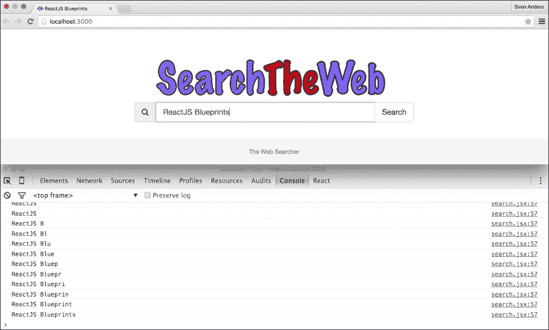
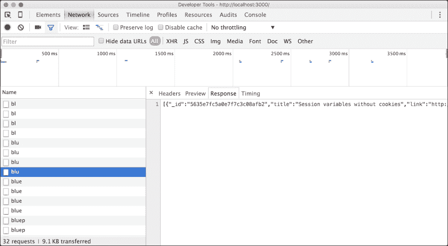
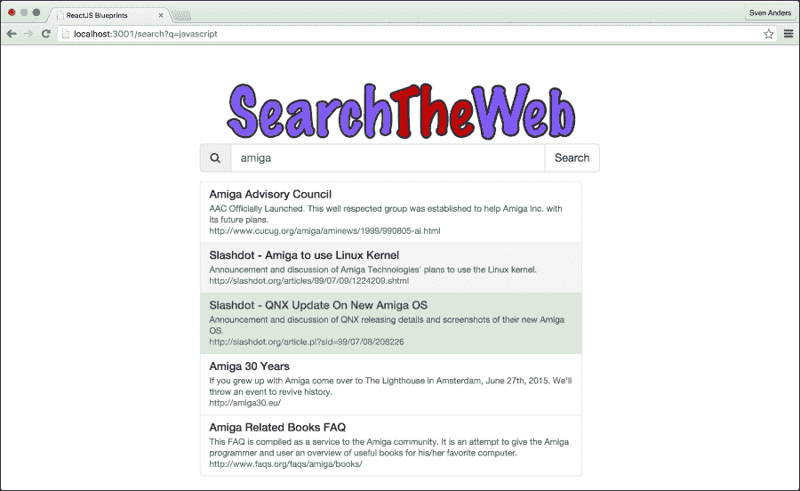
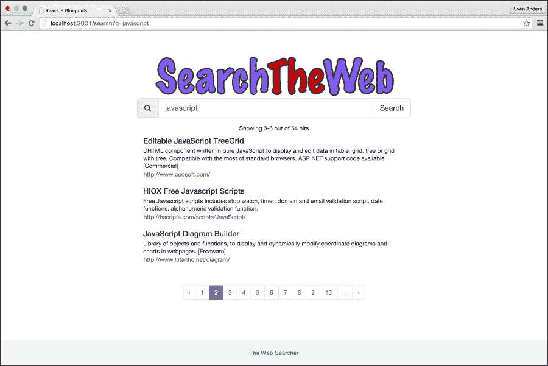

# 第四章：构建实时搜索应用程序

搜索是大多数应用程序中的一个重要功能。根据您正在开发的应用程序类型，您可能只需设置一个用于查找简单关键词的字段，或者您可能需要深入研究模糊算法和查找表的世界。在本章中，我们将创建一个实时搜索应用程序，该应用程序模仿了网络搜索引擎。我们将处理您输入时出现的快速搜索，显示搜索结果并提供无限滚动功能。我们还将创建自己的搜索 API 来处理我们的请求。

这些技术的应用仅限于您的想象力。在这方面，让我们开始吧。

这些是我们将在本章中介绍的主要主题：

+   创建您自己的搜索 API

+   将您的 API 连接到 MongoDB

+   设置 API 路由

+   基于正则表达式的搜索

+   保护您的 API

+   创建 ReactJS 搜索应用程序

+   设置 react-router 以处理非哈希路由

+   监听事件处理器

+   创建服务层

+   连接到您的 API

+   分页

+   无限滚动

# 创建您自己的搜索 API

数据获取是一个充满不确定性的话题，实际上并不存在一种让所有人都觉得合理的推荐方法来处理它。

您可以在以下两种主要策略之间进行搜索：直接查询数据源或查询 API。哪一个更具可扩展性和未来性？让我们从您的搜索控制器角度来探讨这个问题。直接查询数据源意味着在您的应用程序内部设置连接器和相关逻辑。您需要构建一个合适的搜索查询，然后通常需要解析结果。您的数据获取逻辑现在与数据源紧密相连。

查询 API 意味着发送一个搜索查询并检索预格式化的结果。现在，您的应用程序与 API 的联系仅是松散的，更换它通常只是更改 API URL 的问题。

通常，建立松散的联系比建立紧密的联系更可取，因此我们将从创建一个 Node.js API 开始，然后再转向将显示搜索结果给用户的 ReactJS 应用程序。

## 开始使用您的 API

让我们从创建一个空项目开始。创建一个文件夹来存储您的文件，打开终端，并将目录更改为该文件夹。运行 `npm init`。安装程序将向您提出许多问题，但默认值都是可以接受的，所以请继续按下 *Enter* 键，直到命令完成。您将留下一个仅包含 `package.json` 文件的裸骨项目，`npm` 将使用它来存储您的依赖配置。接下来，通过执行以下命令安装 `express`、`mongoose`、`cors`、`morgan` 和 `body-parser`：

```js
npm install --save express@4.12.3 mongoose@4.0.2 body-parser@1.12.3 cors@2.7.1 morgan@1.7.0

```

**Morgan** 是一个为自动记录请求和响应而设计的中间件工具。

**Mongoose** 是一个连接到 **MongoDB** 的实用工具，MongoDB 是一个非常简单且流行的面向文档的非关系型数据库。它非常适合我们想要创建的 API 类型，因为它在查询速度上表现出色，并且默认输出 **JSON** 数据。

在继续之前，请确保您已经在系统上安装了 MongoDB。您可以在终端中输入 `mongo` 来完成此操作。如果已安装，它将显示类似以下内容：

```js
MongoDB shell version: 3.0.7
connecting to: test
>

```

如果它显示错误或 **命令未找到**，您在继续之前需要安装 MongoDB。根据您计算机上安装的操作系统，有不同方法可以完成此操作。如果您使用的是 Mac，可以通过发出 `brew install mongodb` 命令使用 *Homebrew* 安装 MongoDB。如果您没有 Homebrew，您可以访问 [`brew.sh/`](http://brew.sh/) 获取有关如何安装它的说明。Windows 用户以及不想使用 Homebrew 的 Mac 用户可以通过从 [`www.mongodb.org/downloads`](https://www.mongodb.org/downloads) 下载可执行文件来安装 MongoDB。

## 创建 API

在 `root` 文件夹中创建一个名为 `server.js` 的文件，并添加以下代码：

```js
'use strict';
var express = require('express');
var bodyparser = require('body-parser');
var app = express();
var morgan = require('morgan');
var cors = require('cors');
app.use(cors({credentials: true, origin: true}));
var mongoose = require('mongoose');
mongoose.connect('mongodb://localhost/websearchapi/sites');
```

这将设置我们的依赖项并使其准备好使用。我们正在使用 **cors** 库来打开我们的应用以支持跨源请求。当我们不在与应用程序相同的域名和端口上运行 API 时，这是必要的。

我们将创建一个描述我们将要处理的数据类型的模式。在 Mongoose 中，模式映射到 MongoDB 集合，并定义了该集合中文档的形状。

### 注意

注意，这是 Mongoose 的习惯用法，因为 MongoDB 默认是无模式的。

将此模式添加到 `server.js`：

```js
var siteSchema = new mongoose.Schema({
  title: String,
  link: String,
  desc: String
});
```

如您所见，这是一个非常简单的模式，并且所有属性都共享相同的 `SchemaType` 对象。允许的类型有 `String`、`Number`、`Date`、`Buffer`、`Boolean`、`Mixed`、`ObjectId` 和 `Array`。

要使用我们的模式定义，我们需要将我们的 `siteSchema` 对象转换为我们可以工作的模型。为此，我们将它传递给 `mongoose.model(modelName, schema)`：

```js
var searchDb = mongoose.model('sites', siteSchema);
```

接下来，我们需要定义我们的路由。我们将从一个简单的搜索路由开始，该路由接受一个标题作为查询并返回一组匹配的结果：

```js
var routes = function (app) {
  app.use(bodyparser.json());

  app.get('/search/:title', function (req, res) {
    searchDb.find({title: req.params.title}, function (err, data) {
      if (err) return res.status(500)
        .send({
          'msg': 'couldn\'t find anything'
        });
      res.json(data);
    });
  });
};
```

让我们通过启动服务器来完成它：

```js
var router = express.Router();
routes(router);
app.use('/v1', router);
var port = process.env.PORT || 5000;
app.listen(port, function () {
  console.log('server listening on port ' + (process.env.PORT || port));
});
```

在这里，我们告诉 `express` 使用我们定义的路由，并使用 `v1` 作为前缀。API 的完整路径将是 `http://localhost:5000/v1/search/title`。您现在可以通过执行 `node server.js` 来启动 API。

我们已经将 `process.env` 添加到一些变量中。这样做是为了在启动应用程序时轻松覆盖这些值。如果我们想以端口 `2999` 启动应用程序，我们需要使用 `PORT=2999 node server.js` 来启动应用程序。

## 导入文档

将文档插入到 MongoDB 集合中并不复杂。您通过终端登录 MongoDB，选择数据库，然后运行 `db.collection.insert({})`。手动插入文档看起来是这样的：

```js
$ mongo
MongoDB shell version: 3.0.7
connecting to: test
> use websearchapi
switched to db websearchapi
> db.sites.insert({"title": ["Algorithm Design Paradigms"], "link": ["http://www.csc.liv.ac.uk/~ped/teachadmin/algor/algor.html"], "desc": ["A course by Paul Dunne at the University of Liverpool.  Slides and notes in HTML and PS.\r"]})
WriteResult({ "nInserted" : 1 })
>

```

这当然会花费很多时间，而且制作一组标题、链接和描述并不是一项特别有成效的工作。幸运的是，有许多免费和开源的集合可供我们使用。其中一个数据库是[dmoz.org](http://dmoz.org)，我已经下载了数据库的一个样本选择，并以 JSON 格式在[`websearchapi.herokuapp.com/v1/sites.json`](https://websearchapi.herokuapp.com/v1/sites.json)上提供。下载这个集合，并使用`mongoimport`工具导入，如下所示：

```js
mongoimport --host localhost --db websearchapi  --collection sites < sites.json

```

执行时，它将在你的 API 数据库中放置 598 个文档。

## 查询 API

一个`get`查询可以通过你的浏览器执行。只需输入地址和样本 JSON 文件中的一个标题，例如，`http://localhost:5000/v1/search/CoreChain`。

你也可以使用命令行和像**cURL**或**HTTPie**这样的工具。后者旨在使与 Web 服务的命令行交互比 cURL 等人性化，因此绝对值得检查，我们将在本章中使用它来测试我们的 API。

这是先前的查询使用 HTTPie 的输出：

```js
$ http http://localhost:5000/v1/search/CoreChain
HTTP/1.1 200 OK
Connection: keep-alive
Content-Length: 144
Content-Type: application/json; charset=utf-8
Date: Thu, 05 May 2016 11:09:48 GMT
ETag: W/"90-+q3XcPaDzte23IiyDJxmow"
X-Powered-By: Express

[
 {
 "_id": "56336529aed5e6116a772bb0",
 "desc": "JavaScript library for displaying graphs.\r",
 "link": "http://www.corechain.com/",
 "title": "CoreChain"
 }
]

```

这很好，但请注意，我们创建的路由要求标题完全匹配。搜索`corechain`或`Corechain`将不会返回任何结果。查询`Cubism.js`将返回一个结果，但`*Cubism*`将不会返回任何结果。

显然，这不是一个非常友好的查询 API。

## 创建通配符搜索

引入通配符搜索可以使 API 更易于使用，但你不能使用传统的基于 SQL 的方法，例如`LIKE`，因为 MongoDB 不支持这些类型的操作。

另一方面，MongoDB 完全支持正则表达式，因此可以构建一个模仿`LIKE`的查询。

在 MongoDB 中，你可以使用正则表达式对象创建正则表达式：

```js
{ <field>: /pattern/<options> }

```

你也可以使用以下任何一种语法创建正则表达式：

```js
{ <field>: { $regex: /pattern/, $options: '<options>' } }
{ <field>: { $regex: 'pattern', $options: '<options>' } }
{ <field>: { $regex: /pattern/<options> } }

```

以下`<options>`可用于与正则表达式一起使用：

+   `i`：这是为了对大小写不敏感，以匹配大写和小写字符。

+   `m`：对于包含锚点（即，`^`表示开始和`$`表示结束）的模式，对于多行值的字符串，在每行的开始或结束处匹配锚点。如果没有这个选项，这些锚点将只匹配字符串的开始或结束。

+   `x`：这是“扩展”功能，可以忽略`$regex`模式中的所有空白字符，除非它们被转义或包含在`character`类中。

+   `s`：这允许点字符（`.`）匹配所有字符，包括换行符。

使用`x`和`s`需要与`$options`语法一起使用`$regex`。

现在我们知道了这些，让我们先创建一个通配符查询：

```js
  app.get('/search/:title', function (req, res) {
    searchDb.find({title: 
     { $regex: '^' + req.params.title + '*', $options: 'i' } }, 
    function (err, data) {
      res.json(data);
    });
  });
```

### 注意

记住每次更改查询逻辑时都要重新启动您的节点服务器实例。您可以通过使用键盘快捷键（如 *CTRL* + *C*（Mac））中断实例，然后再次运行 `node server.js` 来完成此操作。

此查询返回任何以搜索词开头的标题，并且它将执行不区分大小写的搜索。

如果您移除第一个锚点（`^`），它将匹配字符串中该词的所有出现：

```js
  app.get('/search/:title', function (req, res) {
    searchDb.find({title: 
     { $regex: req.params.title +'*', $options: 'ix' } },
    function (err, data) {
      res.json(data);
    });
  });
```

这是我们将用于快速搜索的查询。它将返回 *立体主义*、*cubism* 和甚至 *ubi* 的命中：

```js
$ http http://localhost:5000/v1/search/ubi
HTTP/1.1 200 OK
Access-Control-Allow-Credentials: true
Connection: keep-alive
Content-Length: 1235
Content-Type: application/json; charset=utf-8
Date: Thu, 05 May 2016 11:07:00 GMT
ETag: W/"4d3-Pr1JAiSI46vMRz2ogRCF0Q"
Vary: Origin
X-Powered-By: Express

[
 {
 "_id": "572b29507d406be7852e8279",
 "desc": "The component oriented simple scripting language with a robust component composition model.\r",
 "link": "http://www.lubankit.org/",
 "title": "Luban"
 },
 {
 "_id": "572b29507d406be7852e82a4",
 "desc": "A specification of a new 'bubble sort' in three or more dimensions, with illustrative images.\r",
 "link": "http://www.tropicalcoder.com/3dBubbleSort.htm",
 "title": "Three Dimensional Bubble Sort"
 },
 {
 "_id": "572b29507d406be7852e82ab",
 "desc": "Comprehensive list of publications by L. Barthe on modelling from sketching, point based modelling, subdivision surfaces and implicit modelling.\r",
 "link": "http://www.irit.fr/~Loic.Barthe/",
 "title": "Publications by Loic Barthe"
 },
 {
 "_id": "572b29507d406be7852e8315",
 "desc": "D3 plugin for visualizing time series.\r",
 "link": "http://square.github.io/cubism/",
 "title": "Cubism.js"
 },
 {
 "_id": "572b29507d406be7852e848a",
 "desc": "Browserling and Node modules.\r",
 "link": "http://substack.net/",
 "title": "Substack"
 },
 {
 "_id": "572b29507d406be7852e848d",
 "desc": "Google tech talk presented by Ryan Dahl creator of the node.js. Explains its design and how to get started with it.\r",
 "link": "https://www.youtube.com/watch?v=F6k8lTrAE2g",
 "title": "Youtube : Node.js: JavaScript on the Server"
 }
]

```

这对我们现在正在构建的应用类型来说已经足够了。构建正则表达式有许多方法，您可以根据需要进一步细化它。通过实现 *soundex*、*模糊匹配* 或 *Levenshtein 距离*，可以实现更高级的匹配，尽管 MongoDB 都不支持这些。

**Soundex** 是一种音位算法，用于通过英语中的发音来索引名称。当您想要进行名称查找并允许用户在拼写略有差异的情况下找到正确结果时，它是非常合适的。

**模糊匹配** 是一种寻找与字符串近似匹配而不是精确匹配的字符串的技术。匹配的接近程度是通过将字符串转换为精确匹配所需的操作来衡量的。一个众所周知且经常使用的算法是 **Levenshtein**。这是一个简单的算法，可以提供良好的结果，但它不受 MongoDB 支持。因此，必须通过检索整个结果集然后对搜索查询中的所有字符串应用算法来测量 Levenshtein 距离。操作的速度会随着数据库中文档数量的线性增长而增长，所以除非您有非常小的文档集，否则这很可能不值得做。

如果您想要这些功能，您需要另寻他处。**Elasticsearch** ([`www.elastic.co/`](https://www.elastic.co/)) 是一个值得考虑的良好替代品。您可以将我们刚刚创建的节点 API 与后端的 `Elasticsearch` 实例轻松结合，而不是使用 MongoDB，或者两者的组合。

## 保护您的 API

目前，如果您将其上线，您的 API 对任何人都是可访问的。这不是一个理想的情况，尽管您可以争辩说，由于您只支持 `GET` 请求，这并不比建立一个简单的网站有太大的不同。

假设您在某个时候添加了 `PUT` 和 `DELETE`。您肯定希望保护它，防止任何人完全访问。

让我们看看通过向我们的应用程序添加令牌来简单保护它的方法。我们将使用 Node.js 身份验证模块 **Passport** 来保护我们的 API。Passport 有超过 300 种不同适用性的策略。我们将选择令牌策略，因此请安装以下两个模块：

```js
npm install --save passport@0.3.0 passport-http-bearer@1.0.1

```

在 `index.js` 文件开头添加以下导入语句：

```js
var passport = require('passport');
var Strategy = require('passport-http-bearer').Strategy;
```

接下来，在 `mongoose.connect` 行下面添加以下代码：

```js
var appToken = '1234567890';

passport.use(new Strategy(
  function (token, cb) {
    console.log(token);
    if (token === appToken) {
      return cb(null, true);
    }
    return cb(null, false);

  })
);
```

你还需要更改路由，所以将搜索路由替换为以下内容：

```js
  app.get('/search/:title',
    passport.authenticate('bearer', {session: false}),
    function (req, res) {
      searchDb.find({title: { $regex: '^' + req.params.title + '*', $options: 'i' } },
      function (err, data) {
        if(err) return console.log('find error:', err);
        if(!data.length)
          return res.status(500)
            .send({
              'msg': 'No results'
            })
        res.json(data);
      });
    });
```

当你重新启动应用时，现在请求将需要用户发送一个包含内容为 *1234567890* 的 bearer token。如果令牌正确，应用将返回 `true` 并执行查询；如果不正确，它将返回一个简单的消息说 **未授权**：

```js
$ http http://localhost:5000/v1/search/react 'Authorization:Bearer 1234567890'
Access-Control-Allow-Credentials: true
Connection: keep-alive
Content-Length: 290
Content-Type: application/json; charset=utf-8
Date: Thu, 05 May 2016 11:15:32 GMT
ETag: W/"122-7QHSA2Gb7qRseLzxE1QBhg"
Vary: Origin
X-Powered-By: Express

[
 {
 "_id": "572b29507d406be7852e8388",
 "desc": "A JavaScript library for building user interfaces.\r",
 "link": "http://facebook.github.io/react/",
 "title": "React"
 },
 {
 "_id": "572b29507d406be7852e8479",
 "desc": "Node.js humour.\r",
 "link": "http://nodejsreactions.tumblr.com/",
 "title": "Node.js Reactions"
 }
]

```

诚然，bearer tokens 提供了一个非常薄弱的安全层。仍然有可能让潜在的攻击者嗅探你的 API 请求并重用你的令牌，但使令牌短暂有效并时不时地更改它们可以帮助提高安全性。为了使其真正安全，它通常与用户身份验证结合使用。

# 创建你的 ReactJS 搜索应用

通过复制 第一章，*ReactJS 深入浅出*，中的脚手架来启动这个项目，你将在 Packt Publishing 网站上找到这个代码文件以及这本书的代码包），然后将 `React-Bootstrap` 添加到你的项目中。打开终端，转到项目根目录，并运行 `npm install` 命令来安装 React-Bootstrap：

```js
npm install --save react-bootstrap@0.29.3 classnames@2.2.5 history@2.1.1 react-router@2.4.0 react-router-bootstrap@0.23.0 superagent@1.8.3 reflux@0.4.1

```

`package.json` 中的 `dependencies` 部分现在应该看起来像这样：

```js
"dependencies": {
  "babel-preset-es2015": "⁶.6.0",
  "babel-preset-react": "⁶.5.0",
  "babel-tape-runner": "².0.0",
  "babelify": "⁷.3.0",
  "browser-sync": "².12.5",
  "browserify": "¹³.0.0",
  "browserify-middleware": "⁷.0.0",
  "classnames": "².2.5",
  "easescroll": "0.0.10",
  "eslint": "².9.0",
  "history": "².1.1",
  "lodash": "⁴.11.2",
  "react": "¹⁵.0.2",
  "react-bootstrap": "⁰.29.3",
  "react-dom": "¹⁵.0.2",
  "react-router": "².4.0",
  "react-router-bootstrap": "⁰.23.0",
  "reactify": "¹.1.1",
  "reflux": "⁰.4.1",
  "serve-favicon": "².3.0",
  "superagent": "¹.8.3",
  "tape": "⁴.5.1",
  "url": "⁰.11.0",
  "basic-auth": "¹.0.3"
}
```

如果 `package.json` 不是这个样子，请更新它，然后在项目根目录下从终端运行 `npm install`。你还需要将 `Bootstrap` CSS 文件添加到你的 `index.html` 文件的 `<head>` 部分中：

```js
<meta http-equiv="X-UA-Compatible" content="IE=edge">
<meta name="viewport" content="width=device-width, initial-scale=1">

<link rel="stylesheet" type="text/css" href="//netdna.bootstrapcdn.com/font-awesome/3.2.1/css/font-awesome.min.css">
<link rel="stylesheet" type="text/css" href="//netdna.bootstrapcdn.com/bootstrap/3.3.5/css/bootstrap.min.css" />
```

将上述代码放在带有 `app.css` 的行之上，这样你就可以覆盖 Bootstrap 的样式。

最后，在 `source` 文件夹内创建一个 `components` 文件夹，然后将来自 第三章，*使用 ReactJS 进行响应式网页开发*，的组件 `fontawesome.jsx` 和 `picture.jsx` 复制到这个文件夹中。

## 设置你的应用

让我们从应用程序的根目录开始，`source/app.jsx`。将内容替换为以下代码：

```js
'use strict';
import React from 'react';
import { Router, Route, DefaultRoute }
  from 'react-router';
import { render } from 'react-dom'
import Search from './components/search.jsx';
import Results from './components/results.jsx';
import Layout from './components/layout.jsx';
import SearchActions from './actions/search.js';
```

为了使应用能够编译，你需要在你 `components` 文件夹中创建这四个文件。我们很快就会这样做。现在，参考以下内容：

```js
import { browserHistory } from 'react-router'
```

上述代码使用浏览器历史库设置了一个路由。这个库的主要优点之一是你可以避免在 URL 中使用哈希标签，因此应用可以引用绝对路径，例如 `http://localhost:3000/search` 和 `http://localhost:3000/search/term`：

```js
render((
  <Router history={ browserHistory }>
    <Route component={Layout}>
      <Route path="/" component={Search}>
        <Route path="search" component={Results}/>
      </Route>
    </Route>
  </Router>
), document.getElementById('container'));
```

让我们为 `SearchActions`、`Search`、`Results` 和完整的 `Layout` 文件创建骨架文件。

创建 `source/actions/search.js` 并添加以下内容：

```js
'use strict';
import Reflux from "reflux";
let actions = {
  performSearch: Reflux.createAction("performSearch"),
  emitSearchData: Reflux.createAction("emitSearchData")
};

export default actions;
```

这设置了我们在 `search.jsx` 中将使用的两个操作。

创建 `source/components/search.jsx` 并添加以下内容：

```js
'use strict';
import React from 'react';
const Search = React.createClass({
  render() {
    return <div/>;
  }
});

export default Search;
```

创建 `source/components/results.jsx` 并添加以下内容：

```js
'use strict';
import React from 'react';
const Results = React.createClass({
  render() {
    return <div/>;
  }
});

export default Results;
```

创建 `source/components/layout.jsx` 并添加以下内容：

```js
'use strict';
import React from 'react';
import Reflux from 'reflux';
import {Row} from "react-bootstrap";
import Footer from "./footer.jsx";

const Layout = React.createClass({
  render() {
    return (<div>

      {this.props.children}
```

此代码传播了我们在 `app.jsx` 中设置的路由层次结构中的页面：

```js
      <Footer />
```

我们还将为我们的应用创建一个基本的固定页脚，如下所示：

```js
      </div>);
  }
});

export default Layout;
```

创建 `source/components/footer.jsx` 并添加以下内容：

```js
'use strict';
import React from 'react';

const Footer = React.createClass({
  render(){
    return (<footer className="footer text-center">
      <div className="container">
        <p className="text-muted">The Web Searcher</p>
      </div>
    </footer>);
  }

});
export default Footer;
```

应用程序现在应该可以编译，您将看到一个页脚消息。我们需要应用一些样式来将其固定在页面底部。打开`public/app.css`并替换其内容为以下样式：

```js
html {
  position: relative;
  min-height: 100%;
}
body {
  margin-top: 60px;
  margin-bottom: 60px;
}
.footer {
  position: absolute;
  bottom: 0;
  width: 100%;
  height: 60px;
  background-color: #f5f5f5;
}
```

将页面设置为 100%最小高度，并将页脚设置为绝对位置在底部，这将确保它保持固定。现在，看看这个：

```js
*:focus {
  outline: none
}
```

上述代码是为了避免在点击焦点部分时出现轮廓边框。接下来，使用以下样式完成`public/app.css`，以使搜索结果突出显示：

```js
.header {
  background-color: transparent;
  border-color: transparent;
}
.quicksearch {
  padding-left: 0;
  margin-bottom: 20px;
  width: 95.5%;
  background: white;
  z-index: 1;
}
.fullsearch .list-group-item{
  border:0;
  z-index: 0;
}
ul.fullsearch li:hover, ul.quicksearch li:active, ul.quicksearch li:focus {
  color: #3c763d;
  background-color: #dff0d8;
  outline: 0;
  border: 0;
}
ul.quicksearch li:hover, ul.quicksearch li:active, ul.quicksearch li:focus {
  color: #3c763d;
  background-color: #dff0d8;
  outline: 0;
  border: 0;
}
.container {
  width: auto;
  max-width: 680px;
  padding: 0 15px;
}
.container .text-muted {
  margin: 20px 0;
}
```

## 创建搜索服务

在您继续为搜索创建视图层之前，您需要一种连接到您的 API 的方法。您可以通过多种方式来完成这项工作，而且这将是您找不到权威答案的情况之一。有些人喜欢将其放在动作层，有些人喜欢放在存储层，有些人可能会非常乐意将其添加到视图层。

我们将借鉴 MVC 架构并创建一个服务层。我们将从您之前创建的`action`文件中访问服务。我们这样做的原因很简单，因为它将搜索分离成我们代码中的一个较小且易于测试的子部分。为了简化开发和便于测试，您总是希望使您的组件尽可能小。

在您的`source`文件夹中创建一个名为`in service`的文件夹，并添加以下三个文件：`index.js`、`request.js`和`search.js`。

让我们从添加`request.js`的代码开始：

```js
'use strict';
import Agent from 'superagent';
```

**SuperAgent**是一个轻量级的客户端 HTTP 请求库，它使得使用 AJAX 比通常要容易得多。它也与**node**完全兼容，这在执行服务器端渲染时是一个巨大的好处。我们将在第九章创建共享应用程序中深入探讨服务器端渲染。查看以下示例：

```js
class Request {

  constructor(baseUrl) {
    this.baseUrl = baseUrl;
  }

  get(query, params) {
    return this.httpAgent(query, 'get', params, null);
  }

  post(url, params, data, options) {
    return this.httpAgent(url, 'post', params, data)
  }

  put(url, params, data) {
    return this.httpAgent(url, 'put', params, data)
  }
```

我们实际上只会在我们的应用程序中使用`get`函数。其他方法已添加为示例。您可以在其中添加或删除内容，甚至将它们合并到一个公共函数中（尽管这会增加使用该函数的复杂性）。

所有操作都发送到`httpAgent`函数：

```js
  httpAgent(url, httpMethod, params, data) {
    const absoluteUrl = this.baseUrl + url;
    let req = AgenthttpMethod
      .timeout(5000);

    let token = '1234567890';

    req.set('Authorization', 'Bearer ' + token);
    req.withCredentials();
```

我们将添加我们在 API 中早期开发的 bearer token 方案。如果您跳过了那部分，您可以删除前面的两行，尽管如果 API 收到 bearer token 但没有处理它的方法，这对 API 来说并不重要。在这种情况下，它将简单地丢弃信息。

值得注意的是，在服务中硬编码 token 非常不安全。为了使其更安全，例如，您可以设置一个方案，在浏览器会话存储中定期创建新的 token，并用查找替换硬编码的变量。让我们看看以下代码片段：

```js
    if (data)
      req.send(data);

    if (params)
      req.query(params);

    return this.sendAgent(req);
  }
```

在我们添加完参数后，我们需要通过`sendAgent`函数发送请求。这个函数返回一个我们可以监听的 promise，它最终要么被拒绝要么被解决。`promise`是一个用于同步的构造。它是对最初未知的结果的代理。当我们在代码中返回一个 promise 时，我们得到一个最终将包含我们想要的数据的对象：

```js
  sendAgent(req) {
    return new Promise(function (resolve, reject) {
      req.end(function (err, res) {
        if (err) {
          reject(err);
        } else if (res.error) {
          reject(res.error);
        }
        else {
          resolve(JSON.parse(res.text));
        }
      });
    });
  }

}

export default Request;
```

我们将要编写的下一个文件是`search.js`：

```js
'use strict';
import Request from './request.js';

}

export default SearchService;
```

这只是导入并扩展我们在`request.js`中创建的代码。由于我们不需要扩展或修改任何请求代码，我们将保持原样。

最后一个文件是`index.js`：

```js
'use strict';
import SearchService from './search.js';
exports.searchService = new SearchService('http://localhost:5000/v1/search/');
```

这是我们指定连接到我们的 API 的端点的地方。前面的设置指定了运行在 localhost 上的 API。如果您想使用外部服务测试您的代码，可以将此替换为[`websearchapi.herokuapp.com/v1/search/`](http://websearchapi.herokuapp.com/v1/search/)的示例接口。

通常，将端点和其他配置细节存储在单独的`configuration`文件中是个好主意。让我们创建一个`config.js`文件，并将其放置在`source`文件夹中：

```js
'use strict';
export const Config = {
  'urls':{
    'search' : 'http://localhost:5000/v1/search/'
  }
};
```

然后，将`service/index.js`的内容更改为以下内容：

```js
import {Config} from '../config.js';
import SearchService from './search.js';
exports.searchService = new SearchService(Config.urls.search); 
```

注意，我们需要从`config.js`中取消对配置名称的引用。这是因为我们使用`exports`而不是`module.exports`作为命名导出。如果我们首先声明变量并使用`module.exports`导出它，我们就不需要取消引用。

差别在于`exports`仅仅是`module`的一个辅助工具。最终，模块将使用`module.exports`，并且`Config`将作为模块的一个命名属性可用。

您也可以使用以下命令导入它：`const Config = require('../config.js')` 或 `import * as Config from '../config.js'`。这两种方式都将设置一个`Config`变量，您可以通过`Config.Config`来访问它。

### 测试服务

我们已经创建了服务，但它是否工作呢？让我们来看看。我们将使用一个小巧而高效的测试框架**Tape**。使用以下命令安装它：

```js
npm install --save babel-tape-runner@2.0.0 tape@4.5.1

```

我们添加`babel-tape-runner`，因为我们整个应用程序都在使用 ECMAScript 6，并且我们希望在测试脚本中也使用它。

在项目的根目录中创建`test/service`文件夹，并添加一个名为`search.js`的文件，并添加以下代码：

```js
import test from 'tape';
import {searchService} from '../../source/service/index.js';
test('A passing test', (assert) => {
  searchService.get('Understanding SoundEx Algorithms')
  .then((result)=> {
    assert.equals(result[0].title,
    "Understanding SoundEx Algorithms","Exact match found for \"Understanding SoundEx Algorithms\"");
    assert.end();
  });
});
```

这个测试将导入搜索服务并在数据库中搜索特定的标题。如果找到精确匹配，它将返回`pass`。您可以通过在终端中进入根文件夹并执行`./.bin/babel-tape-runner test/service/search.js`来运行它。

### 注意

注意，在您开始测试之前，API 服务器必须处于运行状态。

结果应该看起来像这样：

```js
$ ./.bin/babel-tape-runner test/service/search.js 
TAP version 13
# A passing test
ok 1 Exact match found for "Understanding SoundEx Algorithms"

1..1
# tests 1
# pass  1

# ok

```

### 注意

注意，如果您使用`-g`标志全局安装`tape`和`babel-tape-runner`，那么您不需要从`node_modules`指定二进制版本，只需使用`babel-tape-runner test/service/search.js`运行测试即可。为了使运行测试更加容易，您可以在`package.json`文件的`scripts`部分添加一个脚本。如果您将测试命令添加到`tests`脚本中，只需执行`npm test`即可执行测试。

## 设置存储

存储将非常简单。我们将在动作中执行服务调用，所以存储将简单地持有服务调用的结果并将它们传递给组件。

在`source`文件夹中，创建一个新的文件夹并命名为`store`。然后创建一个新的文件，命名为`search.js`并添加以下代码：

```js
"use strict";
import Reflux from "reflux";
import SearchActions from "../actions/search";
import {searchService} from "../service/index.js";
let _history = {};
```

这是存储状态。在存储定义之外设置变量会自动使其成为一个私有变量，只能由存储本身访问，而不能由存储的实例访问。请参考以下代码：

```js
const SearchStore = Reflux.createStore ({

  init() {
    this.listenTo(SearchActions.emitSearchData, this.emitSearchResults)
  },
```

`init()`中的行设置了一个监听器，用于监听`emitSearchData`动作。每当这个动作被调用时，`emitSearchResults`函数就会被执行：

```js
  emitSearchResults(results) {
    if (!_history[JSON.stringify(results.query)])
      _history[JSON.stringify(results.query)] = results.response;
    this.trigger(_history[JSON.stringify(results.query)]);
  }
```

这些行看起来有点复杂，所以让我们从最后一行开始检查逻辑。触发动作在`results.query`键下发出`_history`变量的结果，这是正在使用的搜索词。搜索词被`JSON.stringify`包裹，这是一个将 JSON 数据转换为字符串的方法。这允许我们保留带有空格的查询并将其用作`_history`变量的对象键。

在触发检查之前的两行代码检查搜索词是否已存储在`_history`中，如果没有则添加它。我们目前没有处理历史记录的方法，但可以设想将来可能通过扩展存储添加这样的功能：

```js
});

export default SearchStore;
```

## 创建搜索视图

我们终于准备好开始处理视图组件了。让我们打开`search.jsx`并添加一些内容。我们会添加很多代码，所以我们将一步一步来。

首先，将内容替换为以下代码：

```js
import React, { Component, PropTypes } from 'react';
import {Grid,Col,Row,Button,Input,Panel,ListGroup,ListGroupItem} from 'react-bootstrap';
import FontAwesome from '../components/fontawesome.jsx';
import Picture from '../components/picture.jsx';
```

记得将`FontAwesome`和`Picture`组件从第三章，*使用 ReactJS 进行响应式 Web 开发*，复制到`source/components`文件夹中，让我们看看以下代码片段：

```js
import SearchActions from '../actions/search.js';
import Reflux from 'reflux';
import { findDOMNode } from 'react-dom';
import { Router, Link } from 'react-router'
import Footer from "./footer.jsx";
import SearchStore from "../store/search.js";

const Search = React.createClass ({
  contextTypes: {
    router: React.PropTypes.object.isRequired
  },
  getInitialState() {
    return {
      showQuickSearch: false
    }
  },
```

`QuickSearch`会在你输入时弹出搜索结果集。我们希望最初将其隐藏，让我们看看以下代码：

```js
  renderQuickSearch() {
  },
```

快速搜索目前没有任何作用，让我们看看以下代码片段：

```js
  renderImages() {
  const searchIcon = <FontAwesome style={{fontSize:20}} icon="search"/>;
  const imgSet = [
    {
      media: "only screen and (min-width: 601px)",
      src: " http://websearchapp.herokuapp.com/large.png"
    },
    {
      media: "only screen and (max-width: 600px)",
      src: "http://websearchapp.herokuapp.com/small.png"
    }
  ];
  const defaultImage = {
    src: "http://websearchapp.herokuapp.com/default.png",
    alt: "SearchTheWeb logo"
  };
  return {
    searchIcon: searchIcon,
    logoSet: imgSet,
    defaultImage: defaultImage
  }
},
```

使用`Picture`组件意味着我们可以为桌面和平板用户提供一个高分辨率版本，为移动用户提供一个较小版本。该组件的完整描述可以在第三章，*使用 ReactJS 进行响应式 Web 开发*中找到。现在请参考以下代码：

```js
render() {
  return (<Grid>
    <Row>
      <Col xs={ 12 } style={{ textAlign:"center" }}>
        <Picture 
          imgSet={ this.renderImages().logoSet }
          defaultImage={ this.renderImages().defaultImage }/>
      </Col>
    </Row>
    <Row>
      <Col xs={12}>
        <form>
          <FormGroup>
            <InputGroup>
              <InputGroup.Addon>
                { this.renderImages().searchIcon }
              </InputGroup.Addon>
              <FormControl
                ref="searchInput"
                type="text" />
              <InputGroup.Button>
                <Button onClick={ this.handleSearchButton }>
                  Search
                </Button>
              </InputGroup.Button>
            </InputGroup>
          </FormGroup>
        </form>
        <ListGroup style={{display:this.state.showQuickSearch ?
          'block':'none'}}
          className="quicksearch">
          {this.renderQuickSearch()}
        </ListGroup>
      </Col>
    </Row>
    <Row>
      <Col xs={12}>
        {this.props.children}
```

这将从一个名为 `app.jsx` 的路由设置中传播一个子页面：

```js
      </Col>
    </Row>

  </Grid>);
  }
});

export default Search;
```

屏幕上的事情终于开始了。如果你现在打开你的网络浏览器，你会在屏幕上看到一个标志；在其下方，你会找到一个带有左侧放大镜和右侧**搜索**按钮的搜索字段。

然而，当你开始输入时，没有任何反应，点击**搜索**按钮时也没有出现结果。显然，还有更多工作要做。

让我们具体实现 `QuickSearch` 方法。用以下代码替换空块：

```js
renderQuickSearch(){
  return this.state.results.map((result, idx)=> {
    if (idx < 5) {
      return (<ListGroupItem key={"f"+idx}
        onClick={this.handleClick.bind(null,idx)}
        header={result.title}>{result.desc}
        <br/>
        <a bsStyle="link" style={{padding:0}}
          href={result.link} target="_blank">{result.link}
        </a>
      </ListGroupItem>)
      }
    })
  },
```

此外，用以下代码替换初始状态块：

```js
getInitialState(){
  return {
    showQuickSearch: false,
    results: [],
    numResults: 0
  }
},
```

`QuickSearch` 方法现在遍历状态中的结果，并添加一个带有 `onClick` 处理器、标题、描述和链接的 `ListGroupItem` 项目。我们将 `results` 变量添加到初始状态中，以避免应用程序因为未定义的 `state` 变量而停止。

接下来，我们需要在代码中添加 `onClick` 处理器。为此，添加以下代码：

```js
handleClick(targetIndex) {
  if (this.state.numResults >= targetIndex) {
    window.open(this.state.results[targetIndex].link, "_blank");
  }
},
```

这段代码将强制浏览器加载目标索引中包含的 URL，这对应于 `targetIndex`。

然而，在输入字段中输入任何内容仍然没有任何反应。让我们来解决这个问题。

## 进行搜索

现在的想法是在用户在搜索输入中输入时展示实时搜索。我们已经为这种情况创建了设置；我们只需要将输入动作与行动连接起来。

第一个想法是在输入字段本身添加一个 `onChange` 处理器。这是实现第一个里程碑、展示搜索的最简单方法。它看起来像这样：

```js
<form>
  <FormGroup>
    <InputGroup>
      <InputGroup.Addon>
        { this.renderImages().searchIcon }
      </InputGroup.Addon>
      <FormControl
        ref="searchInput"
        type="text" />
      <InputGroup.Button>
        <Button onClick={ this.handleSearchButton }>
          Search
        </Button>
      </InputGroup.Button>
    </InputGroup>
  </FormGroup>
</form>
```

接下来，你需要在代码中添加一个 `performSearch` 方法，如下所示：

```js
performSearch() {
  console.log(findDOMNode(this.refs.searchInput).value);
},
```

当你开始输入时，控制台日志将立即开始填充值：



这相当不错，但对于一个只包含单个输入字段而没有其他内容的搜索页面，最好不需要手动将焦点放在搜索字段上以便输入值。

让我们删除 `onChange` 处理器，并在用户输入数据时立即开始搜索过程。

将以下两个方法添加到 `search.jsx` 中：

```js
componentDidMount() {
  document.getElementById("container")
  .addEventListener('keypress', this. handleKeypress);
  document.getElementById("container")
  .addEventListener('keydown', this.handleKeypress);
},
componentWillUnmount() {
  document.getElementById("container")
  .removeEventListener('keypress', this.handleKeypress);
  document.getElementById("container").removeEventListener('keydown', this.handleKeypress);
},
```

这将在组件挂载时设置两个事件监听器。`keypress` 事件监听器负责处理普通按键事件，而 `keydown` 事件监听器确保我们可以捕获箭头键输入。

`handleKeypress` 方法相当复杂，所以让我们添加代码并逐步检查它。

当你注册了这些事件监听器后，你将能够捕获用户的每一个按键事件。如果用户按下键 *A*，一个包含大量关于事件信息的对象将被发送到 `handleKeypress` 函数。以下是事件对象中对我们特别感兴趣的属性的一部分：

```js
altKey: false
charCode: 97
ctrlKey: false
keyCode: 97
shiftKey: false
metaKey: false
type: "keypress"
```

它告诉我们这是一个 `keypress` 事件（箭头键将注册为 `keydown` 事件）。`charCode` 参数是 `97`，并且没有使用 *Alt* 键、*Meta* 键、*Ctrl* 键或 *Shift* 键与事件一起使用。

我们可以使用原生的 JavaScript 函数解码 `charCode`。如果您执行 `String.fromCharCode(97)`，您将得到一个包含小写字母 `a` 的字符串。

基于数字处理按键事件是可行的，但将数字映射到更友好的字符串会更好，因此我们将添加一个对象来保存我们的 `charCode` 参数。将此添加到文件顶部，位于导入语句下方但 `createClass` 定义之上：

```js
const keys = {
  "BACKSPACE": 8,
  "ESCAPE": 27,
  "UP": 38,
  "LEFT": 37,
  "RIGHT": 39,
  "DOWN": 40,
  "ENTER": 13
};
```

现在，我们可以输入 `keys.BACKSPACE` 并发送数字 `8`，依此类推。

让我们添加 `handleKeypress` 函数：

```js
handleKeypress (e) {
  if (e.ctrlKey || e.metaKey) {
    return;
  }
```

如果我们检测到用户正在使用 *Ctrl* 或 *Meta* 键（在 Mac 上为 **CMD**），我们将终止函数。这允许用户使用常规的操作系统方法，例如复制/粘贴或 *Ctrl* + *A* 选择所有文本，让我们看一下以下代码片段：

```js
  const inputField = findDOMNode(this.refs.searchInput);
    const charCode = (typeof e.which == "number") ?
    e.which : e.keyCode
```

我们定义一个变量来保存输入字段，这样我们就不必多次查找它。出于兼容性原因，我们还确保通过检查传递给我们的字符类型是否为数字来获取有效的字符代码。请参阅以下内容：

```js
  switch (charCode) {
    case keys.BACKSPACE:
    inputField.value.length <= 0 ?
    this.closeSearchField(e) : null;
    break;
```

我们添加一个 `closeSearchField` 函数，以便即使在搜索结果已填充的情况下也能隐藏搜索结果。我们这样做是因为我们不希望当用户清除所有文本并准备开始新的搜索时，它仍然保持打开状态，让我们看一下以下代码片段：

```js
  case keys.ESCAPE:
    this.closeSearchField(e);
    break;
```

如果用户按下 *Esc* 键，我们还将隐藏搜索结果，让我们看一下以下代码片段：

```js
  case keys.LEFT:
    case keys.RIGHT:
    // allow left and right but don't perform search
    break;
```

这些检查没有任何作用，但它们将防止开关触达 `default` 并因此触发搜索，让我们看一下以下代码片段：

```js
  case keys.UP:
    if (this.state.activeIndex > -1) {
      this.setState(
        {activeIndex: this.state.activeIndex - 1}
      );
    }
    if (this.state.activeIndex < 0) {
      inputField.focus();
      e.preventDefault();
    }
    break;
```

我们为箭头键添加了特殊处理。当用户按下上箭头键时，只要 `activeIndex` 为零或更高，它就会递减。这将确保我们永远不会处理无效的 `activeIndex` 参数（小于 `-1`）：

```js
  case keys.DOWN:
    if (this.state.activeIndex < 5
    && this.state.numResults > (1 + this.state.activeIndex)) {
      this.setState({activeIndex: this.state.activeIndex + 1});
    }
    e.preventDefault();
    break;
```

我们已定义快速搜索的最大结果数为 `5`。此代码片段将确保 `activeIndex` 永远不会超过 `5`：

```js
  case keys.ENTER:
    e.preventDefault();
    if (this.state.activeIndex === -1 ||
      inputField === document.activeElement) {
        if (inputField.value.length > 1) {
          this.context.router.push(null,
          `/search?q=${inputField.value}`, null);
          this.closeSearchField(e);
          SearchActions.showResults();
        }
      }
      else {
        if (this.state.numResults >= this.state.activeIndex) {
          window.open( this.state.results[this.state.activeIndex].link, '_blank');
        }
      }
      break;
```

此开关执行两种操作之一。首先，如果 `activeIndex` 为 `-1`，则表示用户尚未导航到任何快速搜索结果，我们将直接跳转到所有匹配项的结果页面。如果 `activeIndex` 不是 `-1` 但 `inputfield` 仍然具有焦点（`inputField === document.activeElement`），也会发生相同的情况。

其次，如果 `activeIndex` 不是 `-1`，则表示用户已导航到输入字段下方并做出了选择。在这种情况下，我们将用户发送到所需的 URL：

```js
      default:
        inputField.focus();
        this.performSearch();
        if (!this.state.showQuickSearch) {
          this.setState({showQuickSearch: true});
        }
        SearchActions.hideResults();
        break;
    }
  },
```

最后，如果没有一个开关有效，例如，按下了常规键，那么我们将执行搜索。我们还将使用 `SearchActions.hideResults()` 动作隐藏任何潜在的不完整结果。

此代码在添加`hideResults`到我们的操作之前无法编译，所以打开`actions/search.js`并在操作对象中添加这些行：

```js
  hideResults: Reflux.createAction("hideResults"),showResults: Reflux.createAction("showResults"),
```

代码将编译，并且当您在浏览器中开始输入时，输入字段将获得焦点并接收输入。现在是时候将我们的搜索服务连接起来，我们将在您刚刚编辑的`actions`文件中这样做。在文件顶部，在第一个导入下面添加这两行：

```js
import {searchService} from "../service/index.js";
let _history = {};
```

我们将创建一个私有的`_history`变量来保存我们的搜索历史。这并不是严格必要的，但我们将使用它来减少我们将要进行的 API 调用次数。

接下来，添加此片段：

```js
actions.performSearch.listen( (query) => {
  if(_history[JSON.stringify(query)]){
    actions.emitSearchData({query:query,response:
      _history[JSON.stringify(query)]});
  }
  else {
    searchService.get(query)
      .then( (response) => {
        _history[JSON.stringify(query)]=response;
        actions.emitSearchData({query:query,response:response});
      }).catch( (err) => {
      // do some error handling
    })
  }
});
```

此代码将确保每当触发`performSearch`时，我们都会调用我们的 API。每当搜索服务返回结果时，我们将它存储在我们的`_history`对象中，并在我们向搜索服务发送新查询之前，确保有结果准备好。这将节省我们一次 API 调用，并且用户将获得更快的响应。

接下来，添加当我们在文本框中输入或点击按钮时实际执行搜索的代码。用以下代码替换`performSearch()`内部的代码：

```js
performSearch(){
  const val = findDOMNode(this.refs.searchInput).value;
  val.length > 1 ?
    SearchActions.performSearch(val) :
    this.setState({results: []});
},
```

在我们能够在浏览器中看到结果之前，我们还需要做一件事，但您可以通过输入搜索查询并在开发者工具中检查网络流量来验证它是否工作：



要在浏览器中显示我们的结果，我们需要添加一个监听器，它可以对存储中的变化做出反应。

打开`components/search.jsx`并在`getInitialState`之前添加此代码：

```js
mixins: [
  Reflux.listenTo(SearchStore, "getSearchResults")
],
getSearchResults(res) {
  this.setState({results: res, numResults: 
    res.length < 5 ? res.length : 5});
},
```

此代码的作用是告诉 React 在`SearchStore`发出新数据时调用`getSearchResults`。它调用的函数将最多存储五个结果在组件状态中。现在，当您输入某些内容时，一个列表组将出现在搜索字段下方，显示结果。

您可以使用鼠标悬停在任何结果上，然后点击它以访问它所引用的链接。

## 使用箭头键导航搜索结果

由于我们已经对键盘事件做了很多工作，不进一步利用它将是一件遗憾的事情。您在搜索时已经在使用键盘，所以能够使用箭头键导航搜索结果似乎很自然，然后按*Enter*键访问您选择的那一页。

打开`search.jsx`。在`getInitialState`中添加此键：

```js
activeIndex: -1,
```

然后，在`renderQuickSearch`函数中，添加带有`className`的高亮行：

```js
renderQuickSearch() {
  return this.state.results.map((result, idx)=> {
    if (idx < 5) {
      return (<ListGroupItem key={ "f" + idx }
        className={ this.state.activeIndex === idx ? 
 "list-group-item-success":""}
        onClick={this.handleClick.bind(null,idx)}
        header={result.title}>{ result.desc }
        <br/>
        <a bsStyle="link" style={{padding:0}}
          href={ result.link } target="_blank">
          { result.link }
        </a>
      </ListGroupItem>)
    }
  })
},
```

现在，你将能够使用箭头键上下移动，并按*Enter*键访问活动链接。然而，这个解决方案有几个小问题让人感到有些烦恼。首先，当你上下导航时，输入字段保持聚焦。如果你输入其他内容，你会得到一组新的搜索结果，但活动索引将保持不变，如果新结果返回的结果少于上一个结果，可能会超出范围。其次，上下动作将光标移动到输入字段中，这会让人感到不安。

第一个问题很容易解决；只需将`activeIndex:-1`添加到`getSearchResults`函数中即可，但第二个问题需要我们求助于一个老牌的网页开发者技巧。简单地来说，没有方法可以“取消聚焦”输入字段，因此，我们将创建一个隐藏且不可见的输入字段，并将焦点发送到该字段。

在`render`方法中，将此代码添加到输入字段上方：

```js
<input type="text" ref="hiddeninput"
  style={{left:-100000,top:-100000,position: 'absolute',  
  display:'block',height:0,width:0,zIndex:0,
  padding:0,margin:0}}/>
```

然后转到`switch`方法，并将高亮行添加到向下箭头动作中：

```js
  case keys.DOWN:
    if (this.state.activeIndex < 5
    && this.state.numResults > (1 + this.state.activeIndex)) {
      this.setState({activeIndex: this.state.activeIndex + 1});
    }
 findDOMNode(this.refs.hiddeninput).focus();
    e.preventDefault();
    break;
```

当应用重新编译时，你将能够使用箭头键上下导航，并且只有当你导航到顶部时，正确的输入字段才会激活。其余时间，隐藏的输入字段将拥有焦点，但由于它放置在视口之外，没有人会看到它或能够使用它。让我们看看下面的截图：



## 搜索防抖

每个`keypress`类都会向 API 提交一个新的搜索。即使我们有实现的历史变量系统，这也给我们的 API 带来了很大的压力。这对用户来说也不是最好的选择，因为它可能会引发一系列不相关的搜索结果。想象一下，你想要搜索 JavaScript。你可能对 j、ja、jav、Java、javas、javasc、javascri、javascri 和 JavaScript 的结果不感兴趣，但当前的情况就是这样。

幸运的是，通过简单地延迟搜索，我们可以很容易地提高用户体验。转到`switch`语句，并用以下内容替换内容：

```js
default:
  inputField.focus();
 delay(() => {
 if (inputField.value.length >= 2) {
 this.performSearch();
 }
 }, 400);
  if (!this.state.showQuickSearch) {
    this.setState({showQuickSearch: true});
  }
  SearchActions.hideResults();
  break;
```

你还需要`delay`函数，所以将其添加到文件顶部，紧接在导入之后：

```js
let delay = (() => {
  var timer = 0;
  return function (callback, ms) {
    clearTimeout(timer);
    timer = setTimeout(callback, ms);
  };
})();
```

这段代码将确保结果延迟足够长，以便用户在退出前可以输入查询，但不会感觉迟缓。你应该根据需要调整毫秒设置。

## 从快速搜索到结果页面的过渡

现在我们几乎完成了组件的开发。接下来，我们将向`search.jsx`添加最后一段代码，用于处理搜索按钮和准备进入下一页。为此，请添加以下代码：

```js
handleSearchButton(e) {
  const val = findDOMNode(this.refs.searchInput).value;
  if (val.length > 1) {
    this.context.router.push(`/search?q=${val}`);
    this.closeSearchField(e);
    SearchActions.showResults();
  }
},
closeSearchField(e) {
  e.preventDefault();
  this.setState({showQuickSearch: false});
},
```

这段代码将关闭搜索字段，并使用`push`从 react-router 导航到新的路由。

`push`参数由 react-router 的 2.0 分支支持，所以我们只需要在我们的组件中添加一个上下文类型。我们可以通过在组件顶部添加以下行（在`React.createClass`行下方）来完成此操作：

```js
contextTypes: {
  router: React.PropTypes.object.isRequired
},
childContextTypes: {
  location: React.PropTypes.object
},
getChildContext() {
  return { location: this.props.location }
},
```

## 设置结果页面

结果页面的目的是显示所有搜索结果。传统上，你显示 10-20 个结果和分页功能，这允许你显示更多结果，直到达到末尾。

让我们设置结果页面，并从传统的分页器开始。

打开`components/results.jsx`，并用以下内容替换其内容：

```js
import React, { Component, PropTypes } from 'react';
import Reflux from 'reflux';
import {Router, Link, Lifecycle } from 'react-router'
import SearchActions from '../actions/search.js';
import SearchStore from "../store/search.js";
import {Button,ListGroup,ListGroupItem} from 'react-bootstrap';
import {findDOMNode} from 'react-dom';

const Results = React.createClass ({
  contextTypes: {
    location: React.PropTypes.object
  },
```

设置`contextType`对象是为了从 URL 中检索`query`参数。现在看看以下内容：

```js
  getInitialState() {
    return {
      results: [],
      resultsToShow: 10,
      numResults: 0,
      showResults: true
    }
  },
```

在这里我们定义结果默认是可见的。这对于直接访问搜索页面的用户是必要的。我们还定义了每页显示 10 个结果，让我们看看以下代码：

```js
  componentWillMount() {
    SearchActions.performSearch(this.context.location.query.q);
  },
```

我们希望尽可能快地启动搜索，以便向用户显示一些内容。如果我们是从首页继续，结果已经在`_history`变量中准备好了，并且将在组件挂载之前可用。参看以下代码：

```js
  mixins: [
    Reflux.listenTo(SearchStore, "getSearchResults"),
    Reflux.listenTo(SearchActions.hideResults, "hideResults"),
    Reflux.listenTo(SearchActions.showResults, "showResults")
  ],
```

`hideResults`和`showResults`方法是在用户开始新的查询时使用的操作。我们不是将结果向下推送或在上面的结果上方显示快速搜索，而是简单地隐藏现有的结果：

```js
  hideResults() {
    this.setState({showResults: false});
  },
  showResults() {
    this.setState({showResults: true});
  },
```

这些`setState`函数响应前面的操作，如下所示：

```js
  getSearchResults(res) {
    let resultsToShow = this.state.resultsToShow;
    if (res.length < resultsToShow) {
      resultsToShow = res.length;
    }
    this.setState({results: res, numResults: res.length,
      resultsToShow: resultsToShow});
  },
```

当我们检索的结果少于`this.state.resultsToShow`时，我们将状态变量调整为集合中的结果数量，让我们看看以下代码片段：

```js
  renderSearch(){
    return this.state.results.map((result, idx)=> {
      if (idx < this.state.resultsToShow) {
        return <ListGroupItem key={"f"+idx}
          header={result.title}>{result.desc}<br/>
          <Button bsStyle="link" style={{padding:0}}>
            <a href={result.link}
              target="_blank">{result.link}</a>
          </Button>
        </ListGroupItem>
      }
    })
  },
```

这个渲染器几乎与`search.jsx`中的那个相同。主要区别在于我们返回一个具有`link`样式的按钮，并且我们没有检查`activeIndex`属性，让我们看看剩余的代码：

```js
  render() {
    return (this.state.showResults) ? (
      <div>
        <div style={{textAlign:"center"}}>
          Showing {this.state.resultsToShow} out of {this.state.numResults} hits
        </div>
        <ListGroup className="fullsearch">
          {this.renderSearch()}
        </ListGroup>
      </div>
    ): null;
  }
});
export default Results;
```

## 设置分页

让我们先给`getInitialState`添加一个属性和一个`resetState`函数：

```js
getInitialState() {
  return {
    results: [],
    resultsToShow: 10,
    numResults: 0,
    showResults: true,
 activePage: 1
  }
},
resetState() {
  this.setState({
    resultsToShow: 10,
    showResults: true,
    activePage: 1
  })
},
```

需要在`getSearchResults`中添加`resetState`函数：

```js
getSearchResults(res) {
 this.resetState();
  let resultsToShow = this.state.resultsToShow;
  if (res.length < resultsToShow) {
    resultsToShow = res.length;
  }
  this.setState({results: res, numResults: res.length,
  resultsToShow: resultsToShow});
},
```

依次运行两个`setStates`对象完全没有问题。它们将简单地按先来先服务的顺序排队。

接下来，添加一个分页器：

```js
renderPager() {
  return (<Pagination
    prev
    next
    items={Math.ceil(this.state.results.length/this.state.resultsToShow)}
    maxButtons={10}
    activePage={this.state.activePage}
    onSelect={this.handleSelect}/>)
},
```

这个分页器将自动在页面上填充一定数量的按钮，在这个例子中是 10 个。项目的数量由结果数量除以每页显示的项目数量确定。`Math.ceil`向上取整到最接近的整数，所以如果你得到 54 个结果，页数将从 5.4 向上取整到 6。前五页将显示十个结果，最后一页将显示剩余的四个结果。

为了使用分页组件，我们需要将其添加到导入部分，所以用以下内容替换`react-bootstrap`导入：

```js
import {Button,ListGroup,ListGroupItem,Pagination} from 'react-bootstrap';
```

要显示分页器，用以下内容替换`render`：

```js
render() {
 let start = -this.state.resultsToShow +
 (this.state.activePage*this.state.resultsToShow);
 let end=this.state.activePage*this.state.resultsToShow;
  return (this.state.showResults) ? (
    <div>
      <div style={{textAlign:"center"}}>
 Showing {start}-{end} out of {this.state.numResults} hits
      </div>
      <ListGroup className="fullsearch">
        {this.renderSearch()}
      </ListGroup>
 <div style={{textAlign:"center"}}>
 {this.renderPager()}
 </div>
    </div>
    ) : null;
  }
```

然后，添加`handleSelect`函数：

```js
handleSelect(eventKey) {
  this.setState ({
    activePage: eventKey
  });
},
```

这就是你需要设置分页器的所有内容。只有一个问题。当你点击**下一步**时，你会被留在底部位置，作为一个用户，这感觉并不对。让我们用这个依赖项添加一个漂亮的滚动效果：

```js
npm install --save easescroll@0.0.10

```

我们将它添加到导入部分：

```js
import Scroller from 'easescroll';
```

将以下内容添加到`handleSelect`函数中：

```js
handleSelect(event, selectedEvent) {
  this.setState({
    activePage: selectedEvent.eventKey
  });
 Scroller(220, 50, 'easeOutSine');
},
```

有很多滚动变体可供选择。以下是一些你可以尝试的其他设置：

```js
  Scroller(220, 500, 'elastic');
  Scroller(220, 500, easeInOutQuint);
  Scroller(220, 50, 'bouncePast');
```

让我们看看下面的截图：



## 设置无限滚动

**无限滚动**是一个非常受欢迎的功能，而且它很容易在 ReactJS 中实现。让我们回到添加分页器之前代码的状态，并实现无限滚动。

无限滚动通过简单地在你到达页面底部时加载更多项目来工作。没有分页器参与。你只需滚动，然后继续滚动。

让我们看看如何将这个功能添加到我们的代码中。

首先，我们需要向`getInitialState`添加几个属性：

```js
  getInitialState() {
    return {
      results: [],
      resultsToShow: 10,
      numResults: 0,
 threshold: -60,
 increase: 3,
      showResults: true
    }
  },
```

`threshold`变量以像素为单位给出，当达到底部 60 像素时激活。`increase`变量是我们一次将加载多少个项目的数量。它通常与`resultToShow`变量相同，但在这个例子中，三个看起来非常直观。

我们将添加一个事件监听器来挂载（并在我们完成时移除它）：

```js
componentDidMount: function () {
  this.attachScrollListener();
},
componentWillUnmount: function () {
  this.detachScrollListener();
},
attachScrollListener: function () {
  window.addEventListener('scroll', this.scrollListener);
  this.scrollListener();
},
detachScrollListener: function () {
  window.removeEventListener('scroll', this.scrollListener);
},
```

这些事件监听器将监听滚动事件。它也会在组件挂载后立即启动`scrollListener`。

接下来，我们将添加实际的功能：

```js
scrollListener: function () {
  const component = findDOMNode(this);
  if(!component) return;
  let scrollTop;

  if((window.pageYOffset != 'undefined')) {
    scrollTop = window.pageYOffset;
  } else {
    scrollTop = (document.documentElement ||
    document.body.parentNode || document.body).scrollTop;
  }

  const reachedTreshold =  (this.topPosition(self) +
  self.offsetHeight - scrollTop - 
  window.innerHeight < Number(this.state.threshold));

  const hasMore =  (this.state.resultsToShow +
  this.state.increase < this.state.numResults);

  if(reachedTreshold && hasMore) {
```

当我们还有更多结果时，通过`this.state.increase`中的数字增加要显示的结果数量，让我们看看以下代码：

```js
    this.setState ({
      resultsToShow: (this.state.increase +
      this.state.resultsToShow <= this.state.numResults) ?
      this.state.increase + this.state.resultsToShow :
      this.state.numResults
    });
  } else {
    this.setState({resultsToShow: this.state.numResults});
```

当我们不能再增加时，我们将`resultsToShow`设置为与接收到的结果数量相同，让我们看看以下代码片段：

```js
  }
},
topPosition: function (el) {
  if (!el) {
    return 0;
  }
  return el.offsetTop + this.topPosition(el.offsetParent);
},
```

这个函数只是找到组件在视口中的顶部位置。

现在当你向下滚动时，页面将加载新的片段，直到没有更多结果。这绝对可以被认为是一个简单的无限滚动，它既不是无限的，实际上也没有加载更多内容。

然而，很容易修改它，使其不是立即设置新状态，而是发送一个触发服务调用以加载更多数据的动作调用。在这种情况下，监听器需要在新的数据集到达之前断开连接，然后重新连接监听器并设置新的状态，就像我们之前做的那样。如果你确实有无限多的数据要获取，这种方法不会让你失望。

我们接近完成。只剩下一件事要添加。当你直接访问结果页面时，输入字段不会被填充。这不是至关重要，但这是一个很好的功能，所以让我们添加它。

在`results.jsx`中的`componentWillMount`函数中添加以下行：

```js
  SearchActions.setInputText(this.context.location.query.q);
```

然后，再次打开`search.jsx`并添加以下行到 mixins 中：

```js
  Reflux.listenTo(SearchActions.setInputText, "setInputText")
```

在同一文件中，添加设置输入文本的函数：

```js
setInputText(val) {
  findDOMNode(this.refs.searchInput).value = val;
},
```

最后，在`actions/search.js`中，将以下内容添加到`actions`对象中：

```js
  setInputText: Reflux.createAction("setInputText")
```

如果你现在直接导航到结果页面，例如，通过本地访问你的测试站点`http://localhost:3001/search?q=javascript`或远程访问示例应用程序[`websearchapp.herokuapp.com/search?q=javascript`](http://websearchapp.herokuapp.com/search?q=javascript)，你会发现输入字段被设置为你要添加到`q`变量中的任何内容。

# 摘要

在本章中，我们创建了一个可工作的 API，并将其连接到 MongoDB 实例，然后着手制作一个快速搜索应用程序，该应用程序可以实时显示搜索结果。此外，我们还研究了键盘动作和滚动动作的事件监听器，并将它们投入使用。

恭喜！这是一项艰巨的工作。

### 注意

完成的项目可以在网上查看，地址为[`reactjsblueprints-chapter4.herokuapp.com`](https://reactjsblueprints-chapter4.herokuapp.com)。

你可以通过许多方式改进项目。例如，搜索组件相当长，难以维护。将其拆分为多个较小的组件是个好主意。

你还可以实现一个`update`方法，以便将每个搜索结果的点击都存储在你的 MongoDB 实例中。这使得你能够在你用户中查看热门点击。

在下一章中，我们将走出室内，探讨如何制作基于地图的应用程序，并使用 HTML5 地理位置 API。
