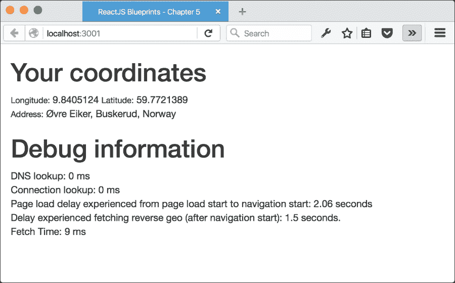
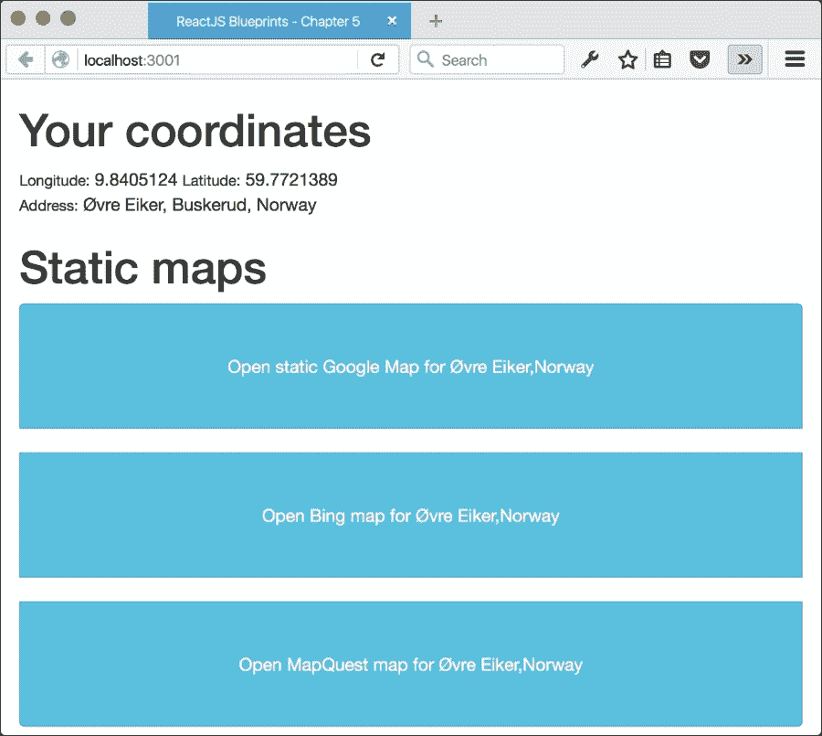
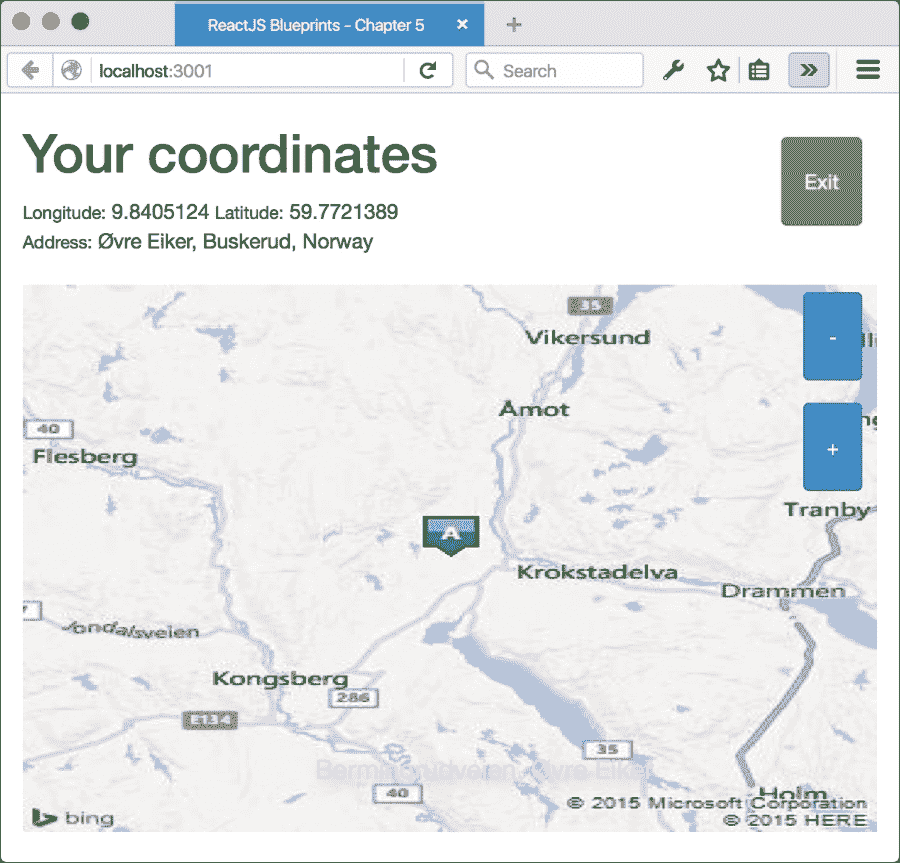
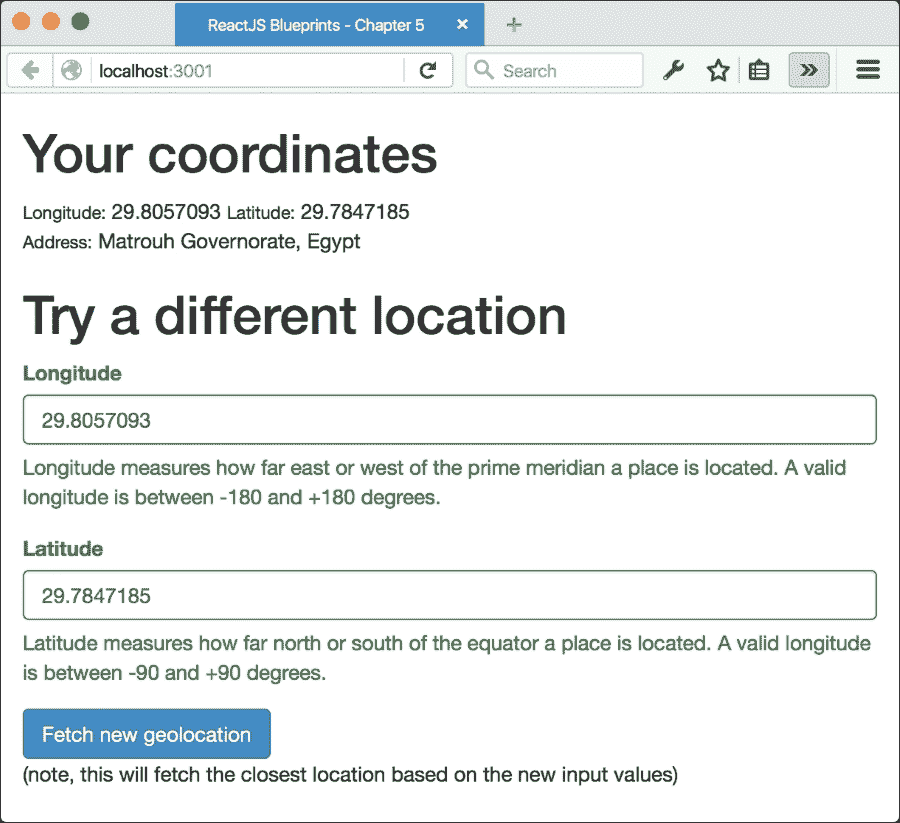
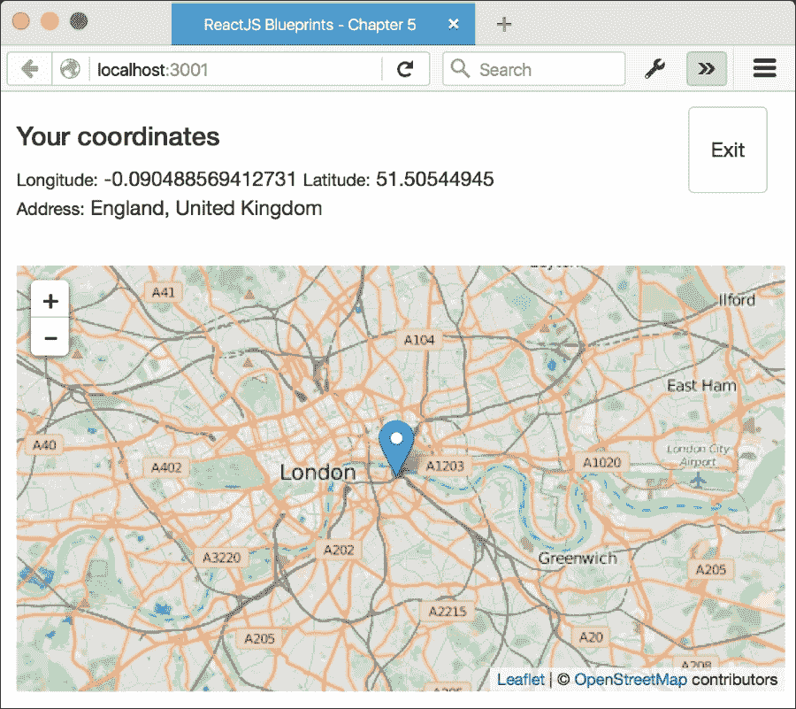

# 第五章：使用 HTML5 API 创建地图应用

在本章中，我们将使用 ReactJS 介绍各种 HTML5 API，并生成一个可以在您的桌面浏览器以及移动设备上运行的基于地图的应用程序。

简而言之，这些是我们将要讨论的主题：

+   有用 HTML5 API 概述

    +   高精度时间 API

    +   震动 API

    +   电池状态 API

    +   页面可见性 API

    +   地理位置 API

+   反向地理定位

+   静态和交互式地图

# HTML5 API 的状态

HTML5 规范增加了一些有用的 API，您可能还没有尝试过。原因很可能是缺乏浏览器支持和知道它们的存在。自从 HTML5 诞生以来，已经引入了许多 API。一些已经达到稳定状态；一些仍在发展中；遗憾的是，一些已经落伍，即将被弃用——比如非常有前途的 getUserMedia API——或者无法获得足够的支持以在所有浏览器上运行。

让我们看看目前最有趣的 API 以及如何使用它们来创建强大的 Web 应用程序。我们将在本章后面创建的地图应用程序中使用其中的一些。

## 高精度时间 API

如果您的网站加载速度过慢，用户会感到沮丧并离开。因此，测量执行时间和页面加载时间是用户体验最重要的方面之一，但遗憾的是，这也是最难调试的问题之一。

由于历史原因，测量页面加载最常用的方法是使用 Date API 来比较时间戳。这在很长一段时间内是最好的工具，但这种方法存在许多问题。

JavaScript 时间因其不准确而臭名昭著（例如，某些版本的 Internet Explorer 如果结果小于某个阈值，就会简单地向下取整时间表示，这使得获取正确测量值几乎成为不可能）。Date API 只能在代码在浏览器中运行时使用，这意味着您无法测量涉及服务器或网络的进程。它还引入了开销和代码的杂乱。

简而言之，您值得一个更好的工具，一个原生的浏览器工具，提供高精度，并且不会使您的代码库变得杂乱。幸运的是，所有这些都已经以**高精度时间 API**的形式提供给您。它提供了以亚毫秒为分辨率的当前时间。与 Date API 不同，它不受系统时钟偏移或调整的影响，并且由于它是原生的，不会创建额外的开销。

该 API 仅公开一个名为`now()`的方法。它返回一个精确到千分之一的毫秒级的时间戳，允许您对代码进行精确的性能测试。

用高分辨率时间 API 替换你代码中使用日期 API 的实例非常简单。例如，以下代码使用了日期 API（可能会记录一个正数、负数或零）：

```js
var mark_start = Date.now();
doSomething(); 
var duration = (Date.now() - mark_start);
```

使用`performance.now()`的类似操作看起来像下一个部分，不仅会更准确，而且始终是正数：

```js
var mark_start = performance.now();
doSomething(); 
var duration = (performance.now() - mark_start);

```

正如所述，高分辨率时间 API 最初只公开了一个方法，但通过**用户时间 API**，你可以访问更多方法，让你可以测量性能而不会在代码库中留下过多的变量：

```js
performance.mark('startTask') 
doSomething(); 
performance.mark('endTask');
performance.measure('taskDuration','startTask','endTask');
```

你可以通过调用`performance.getEntriesByType('measure')`或`performance.getEntriesByType('mark')`来按类型或名称获取现有的标记。你也可以通过调用`performance.getEntries()`来获取所有条目的列表：

```js
performance.getEntriesByName('taskDuration')
```

你可以通过调用`performance.clearMarks()`轻松地移除你设置的任何标记。不带值调用它将清除所有标记，但你也可以通过调用`clearMarks()`并指定要删除的标记来移除单个标记。对于度量也是如此，使用`performance.clearMeasure()`。

使用`performance.mark()`和`performance.measure()`来测量代码的执行时间非常棒，但用它们来测量页面加载仍然相当笨拙。为了帮助调试页面加载，已经开发了一个第三个 API，它进一步扩展了高分辨率时间 API。这被称为**导航时间 API**，它提供了与 DNS 查找、TCP 连接、重定向、DOM 构建等相关度量的信息。

它通过记录页面加载过程中里程碑的时间来实现。有许多以毫秒为单位的事件被给出，可以通过`PerformanceTiming`接口访问。你可以轻松地使用这些记录来计算围绕页面加载时间的许多因素。例如，你可以通过从`timing.navigationStart`减去`timing.loadEventEnd`来测量页面对用户可见的时间，或者通过从`timing.domainLookupStart`减去`timing.domainLookupEnd`来测量 DNS 查找所需的时间。

`performance.navigation`对象还存储了两个属性，可以用来确定页面加载是由重定向、后退/前进按钮还是正常 URL 加载触发的。

所有这些方法结合起来，使你能够找到应用程序中的瓶颈。我们将使用 API 来获取调试信息和突出显示应用程序中加载时间最长的部分。

这些 API 的浏览器支持情况各不相同。**高分辨率时间 API**和**导航时间 API**都受到现代浏览器的支持，但**资源时间 API**不受 Safari 或 Safari Mobile 的支持，因此你需要练习防御性编程，以避免`TypeErrors`阻止你的页面工作。

## 震动 API

振动 API 提供了与移动设备内置振动硬件组件交互的能力。如果 API 不受支持，则不会发生任何操作；因此，在设备不支持它的情况下使用是安全的：

API 通过调用 `navigator.vibrate` 方法来激活。它可以接受一个单独的数字来振动一次，或者一个值数组来交替振动、暂停，然后再振动。传递 `0`、一个空数组或包含所有零的数组将取消任何当前正在进行的振动模式：

```js
// Vibrate for one second
navigator.vibrate(1000);

// Vibrate for two seconds, wait one second, 
// then vibrate for two seconds
navigator.vibrate([2000, 1000, 2000]);

// Any of these will terminate the vibration early
navigator.vibrate();
navigator.vibrate(0);
navigator.vibrate([]);
```

该 API 针对移动设备，自 2012 年以来一直存在。运行 Chrome 或 Firefox 的 Android 设备支持该 API，但在 Safari 或移动设备上没有支持，而且似乎永远不会支持：

这很遗憾，因为振动有许多有效的用例，例如，在用户与按钮或表单控件交互时提供触觉反馈，或者提醒用户有通知：

当然，您也可以用它来娱乐，例如，通过播放流行的旋律：

```js
// Super Mario Theme Intro
navigator.vibrate([125,75,125,275,200,275,125,75,125,275,200,600,200,600]);
// The Darth Vader Themenavigator.vibrate([500,110,500,110,450,110,200,110,170,40,450,110,200,110,170,40,500]);

// James Bond 007
navigator.vibrate([200,100,200,275,425,100,200,100,200,275,425,100,75,25,75,125,75,125,75,25,75,125,100,100]); 
```

一份有趣的振动 API 调音列表可以在 [`gearside.com/custom-vibration-patterns-mobile-devices/`](https://gearside.com/custom-vibration-patterns-mobile-devices/) 找到：

我们将在我们的地图应用中使用振动 API 来响应用户的按钮点击：

## 电池状态 API

电池状态 API 允许您检查设备电池的状态，并触发有关电池电量和状态变化的的事件。这非常有用，因为我们可以使用这些信息来禁用耗电操作，并在电池电量低时推迟 AJAX 请求和其他网络相关流量：

该 API 提供了四种方法和四种事件。方法包括 `charging`、`chargingTime`、`dischargingTime` 和 `level`，事件包括 `chargingchange`、`levelchange`、`chargingtimechange` 和 `dischargingtimechange`：

您可以向您的 `mount` 方法添加事件监听器，以响应电池状态的变化：

```js
componentWillMount() { 
  if("battery" in navigator) {
    navigator.getBattery().then( (battery)=> {
      battery.addEventListener('chargingchange',
        this.onChargingchange);

      battery.addEventListener('levelchange',
        this.onLevelchange);

      battery.addEventListener('chargingtimechange',
        this.onChargingtimechange);

      battery.addEventListener('dischargingtimechange',
        this.onDischargingtimechange);
    });
  }
}
```

如果浏览器不支持电池 API，则不需要添加事件监听器，所以在添加任何事件监听器之前检查 `navigator` 对象是否包含 `battery` 是一个好主意：

```js
onChargingchange(){
  console.log("Battery charging? " + 
    (navigator.battery.charging ? "Yes" : "No"));
},
onLevelchange() {
  console.log("Battery level: " + 
    navigator.battery.level * 100 + "%");
},
onChargingtimechange() {
  console.log("Battery charging time: " + 
    navigator.battery.chargingTime + " seconds");
},
onDischargingtimechange() {
  console.log("Battery discharging time: " + 
    navigator.battery.dischargingTime + " seconds");
}
```

这些函数将在您的电池状态发生变化时随时触发：

电池 API 由 Firefox、Chrome 和 Android 浏览器支持。Safari 和 IE 都不支持它。

我们将在我们的地图应用中使用这个功能来警告用户，如果电池电量低，将切换到静态地图：

## 页面可见性 API

页面可见性 API 允许我们检测我们的页面是否可见或聚焦，隐藏，或者不在聚焦（即，最小化或标签页）：

该 API 没有任何方法，但它暴露了`visibilitychange`事件，我们可以使用它来检测页面可见状态的变化以及两个只读属性，`hidden`和`visibilityState`。当用户最小化网页或切换到另一个标签页时，API 会发送一个关于页面可见性的`visibilitychange`事件。

它可以轻松地添加到你的 React 组件的挂载方法中：

```js
componentWillMount(){   
  document.addEventListener('visibilitychange', 
    this.onVisibilityChange);
}
```

然后，你可以在`onVisibilityChange`函数中监控页面可见性的任何变化：

```js
onVisibilityChange(event){
    console.log(document.hidden);
    console.log(document.visibilityState);
}
```

你可以使用这个功能在用户没有积极使用你的页面时停止执行任何不必要的网络活动。如果你正在显示内容，如不应在没有用户查看页面时切换到下一张幻灯片的图片轮播，或者如果你正在提供视频或游戏内容，你可能也想暂停执行。当用户重新访问你的页面时，你可以无缝地继续执行。

我们在地图应用中不会使用这个 API，但当我们制作一个应该在玩家最小化或切换窗口时暂停的游戏时，我们一定会使用它，在第九章*创建共享应用*中。

浏览器支持非常出色。该 API 被所有主流浏览器支持。

## 地理位置 API

地理位置 API 定义了一个高级接口来定位信息，如纬度和经度，这些信息与托管它的设备相关联。

了解用户的位置是一个强大的工具，可以用来提供本地化内容、个性化广告或搜索结果，以及绘制你周围环境的地图。

该 API 不关心位置来源，因此设备完全决定其信息来源。常见来源包括 GPS、从网络信号推断出的位置、Wi-Fi、蓝牙、MAC 地址、RFID、GSM 小区 ID 等等；它还包括手动用户输入。因为它可以从这么多来源中获取信息，所以该 API 可以在包括手机和桌面电脑在内的多种设备上使用。

该 API 暴露了属于`navigator.geolocation`对象的三种方法：`getCurrentPosition`、`watchPosition`和`clearWatch`。`getCurrentPosition`和`watchPosition`执行相同的任务。区别在于第一个方法执行一次性请求，而后者持续监控设备的变化。

坐标包含以下属性：`latitude`、`longitude`、`altitude`、`accuracy`、`altitudeAccuracy`、`heading`和`speed`。桌面浏览器通常不会报告除`latitude`和`longitude`之外的其他值。

获取位置返回一个包含时间戳和一组坐标的对象。时间戳让你知道位置是在何时被检测到的，这在需要知道数据的新鲜程度时可能很有用：

```js
// Retrieves your current location with all options
var options = {
  enableHighAccuracy: true,
  timeout: 1000,
  maximumAge: 0
};

var success = (pos) => {
  var coords = pos.coords;
  console.log('Your current position is: ' +
  '\nLatitude : ' + coords.latitude +
  '\nLongitude: ' + coords.longitude +
  '\nAccuracy is more or less ' + coords.accuracy + ' meters.'+
  '\nLocation detected: '+new Date(pos.timestamp));
};

var error = (err) => {
  console.warn('ERROR(' + err.code + '): ' + err.message);
};

navigator.geolocation.getCurrentPosition(success, error, options);
```

如果你已经启动了`watchPosition`，可以调用`clearWatch`函数来停止监控：

```js
// Sets up a basic watcher
let watcher=navigator.geolocation.watchPosition(
  (pos) =>{console.log(pos.coords)}, 
  (err)=> {console.warn('ERROR(' + err.code + '): ' + err.message)}, 
  null);

// Removes the watcher
navigator.geolocation.clearWatch(watcher)
```

这个 API 将成为我们地图应用的核心。实际上，除非我们能够获取当前位置，否则我们不会向用户显示任何内容。幸运的是，浏览器支持非常好，因为它被所有主要应用程序支持。

# 创建我们的地图应用

让我们从第一章的基本设置开始。像往常一样，我们将通过添加一些额外的包来扩展脚手架：

```js
npm install --save-dev classnames@2.2.1 react-bootstrap@0.29.3 reflux@0.4.1 url@0.11.0 lodash.pick@3.1.0 lodash.identiy@3.0.0 leaflet@0.7.7

```

这些包中的大多数你应该都很熟悉。我们之前章节中没有使用的是 `url`、`来自 `lodash` 库的两个实用函数`和 leaflet `地图`库。我们将使用 `url` 函数进行 URL 解析和解析。当我们需要组合一个指向我们选择的地图服务的 URL 时，`lodash` 函数将很有用。Leaflet 是一个用于交互式地图的开源 JavaScript 库。当我们向应用中添加交互式地图时，我们将回到它。

`package.json` 中的 `devDependencies` 部分现在应该看起来像这样：

```js
"devDependencies": {
   "babel-preset-es2015": "⁶.3.13",
   "babel-preset-react": "⁶.3.13",
   "babelify": "⁷.2.0",
   "browser-sync": "².10.0",
   "browserify": "¹³.0.0",
   "browserify-middleware": "⁷.0.0",
   "classnames": "².2.1",
   "lodash": "⁴.11.2",
   "react": "¹⁵.0.2",
   "react-bootstrap": "⁰.29.3",
   "react-dom": "¹⁵.0.2",
   "reactify": "¹.1.1",
   "reflux": "⁰.4.1",
   "serve-favicon": "².3.0",
   "superagent": "¹.5.0",
   "url": "⁰.11.0",
   "watchify": "³.6.1"
}
```

让我们打开 `public/index.html` 并添加一些代码：

```js
<link rel="stylesheet" type="text/css" href="//netdna.bootstrapcdn.com/bootstrap/3.3.5/css/bootstrap.min.css"/>
<link rel="stylesheet" 
 href="//cdnjs.cloudflare.com/ajax/libs/leaflet/0.7.7/leaflet.css"/>
```

我们需要 Bootstrap CSS 和 Leaflet CSS 来正确显示我们的地图。

我们还需要应用一些样式，所以打开 `public/app.css` 并将其内容替换为以下样式：

```js
/** SPINNER **/
.spinner {
  width: 40px;
  height: 40px;

  position: relative;
  margin: 100px auto;
}

.double-bounce1, .double-bounce2 {
  width: 100%;
  height: 100%;
  border-radius: 50%;
  background-color: #333;
  opacity: 0.6;
  position: absolute;
  top: 0;
  left: 0;

  -webkit-animation: sk-bounce 2.0s infinite ease-in-out;
  animation: sk-bounce 2.0s infinite ease-in-out;
}

.double-bounce2 {
  -webkit-animation-delay: -1.0s;
  animation-delay: -1.0s;
}

@-webkit-keyframes sk-bounce {
  0%, 100% { -webkit-transform: scale(0.0) }
  50% { -webkit-transform: scale(1.0) }
}

@keyframes sk-bounce {
  0%, 100% {
    transform: scale(0.0);
    -webkit-transform: scale(0.0);
  } 50% {
    transform: scale(1.0);
    -webkit-transform: scale(1.0);
  }
}
```

我们添加的第一组样式是一组弹跳球。这些将在我们首次加载应用内容时显示，因此它们看起来很重要，并且它们向用户传达了正在发生某事。这组代码由 [`tobiasahlin.com/spinkit/`](http://tobiasahlin.com/spinkit/) 提供。在这个网站上，你还可以找到一些使用硬件加速 CSS 动画简单加载旋转器的更多示例。

我们将创建两种不同类型的地图，一种静态的，一种交互式的。我们还将设置缩放和退出按钮，并确保它们在小设备上看起来不错：

```js
/** MAPS **/
.static-map{
  margin: 20px 0 0 0;
}

.map-title {
  color: #DDD;
  position: absolute;
  bottom: 10px;
  margin: 0;
  padding: 0;
  left: 35%;
  font-size: 18px;
  text-shadow: 3px 3px 8px rgba(200, 200, 200, 1);
}

.map-button{
  height: 100px;
  margin-bottom: 20px;
}

.map {
  position: absolute;
  left: 15px;
  right: 0;
  top: 30px;
  bottom: 0;
}

.buttonBack {
  position: absolute;
  padding: 10px;
  width:55px;
  height:60px;
  top: -80px;
  right: 25px;
  z-index: 10;
}

.buttonMinus {
  position: absolute;
  padding: 10px;
  width:40px;
  height:60px;
  top: 25px;
  right: 25px;
}

.buttonPlus {
  position: absolute;
  padding: 10px;
  width:40px;
  height:60px;
  top: 100px;
  right: 25px;
}
```

这些按钮让我们在使用静态地图时可以放大和缩小。它们位于屏幕的右上角，并模仿交互式地图的功能：

```js
@media screen and (max-width: 600px) {
  .container {
    padding: 0;
    margin: 0
  }
  h1{
    font-size:18px;
  }
  .container-fluid{
    padding: 0;
    margin: 0 0 0 20px;
  }
  .map-title {
    left: 15%;
    z-index:10;
    top: 20px;
    color: #666;
  }
}
```

媒体查询对样式进行了一些小的调整，以确保在小设备上地图可见并且有适当的边距。

当你使用 `node server.js` 启动你的服务器时，你应该在浏览器中看到一个空白屏幕。我们准备好继续我们的应用开发。

## 设置地理位置

我们将首先创建一个服务来获取我们的反向地理位置。

在源文件夹中创建一个名为 `service` 的文件夹，并将其命名为 `geo.js`。向其中添加以下内容：

```js
'use strict';
import config from '../config.json';
import utils from 'url';
const lodash = {
  pick: require('lodash.pick'),
  identity: require('lodash.identity')
};
import request from 'superagent';
```

我们需要作为 Bootstrap 过程的一部分安装的实用工具。`url utils` 参数将根据一组键和属性为我们创建一个 URL 字符串。`Lodash pick` 创建一个由所选对象属性组成的对象，而 `identity` 返回提供给它的第一个参数。

我们还需要创建一个 `config.json` 文件，其中包含我们将用于构造 URL 字符串的参数，让我们看一下以下代码片段：

```js
class Geo {
  reverseGeo(coords) {
    const url = utils.format({
      protocol: config.openstreetmap.protocol,
      hostname: config.openstreetmap.host,
      pathname: config.openstreetmap.path,
      query: lodash.pick({
        format: config.openstreetmap.format,
        zoom: config.openstreetmap.zoom,
        addressdetails: config.openstreetmap.addressdetails,
        lat: coords.latitude,
        lon: coords.longitude
      }, lodash.identity)
    });

    const req = request.get(url)
    .timeout(config.timeout)
```

我们使用超时构造我们的请求。Superagent 还有一些其他选项可以设置，例如接受头、查询参数等，让我们看一下以下代码片段：

```js
    const promise = new Promise(function (resolve, reject) {
      req.end(function (err, res) {
        if (err) {
          reject(err);
        } else if (res.error) {
          reject(res.error);
```

在 Superagent 中有一个长期存在的 bug，其中一些错误（4xx 和 5xx）没有按照文档设置在`err`对象中，因此我们需要检查`err`和`res.error`以捕获所有错误，让我们看一下以下代码片段：

```js
        }
        else {
          try {
            resolve(res.text);
          } catch (e) {
            reject(e);
          }
        }
      });
    });

    return promise;
  }
}
export default Geo;
```

我们将通过一个`Promise`实例返回我们的请求。`Promise`是一个用于延迟和异步计算的对象。它表示一个尚未完成但预计将来会完成的操作。

接下来，创建一个名为`config.json`的文件，并将其放置在您的源文件夹中，并添加以下内容：

```js
{
  timeout: 10000,
  "openstreetmap": {
    "name": "OpenStreetMap",
    "protocol": "https",
    "host": "nominatim.openstreetmap.org",
    "path": "reverse",
    "format": "json",
    "zoom": "18",
    "addressdetails": "1"
  }
}
```

OpenStreetMap 是一个由志愿者使用当地知识、GPS 轨迹和捐赠的资源创建的开放许可的世界地图。据报道，有超过 200 万用户使用手动调查、GPS 设备、航空摄影和其他免费资源收集了数据。

我们将在本章的后面部分使用该服务来获取反向地理编码，并将其与 Leaflet 结合使用，以创建一个交互式地图。

让我们确保我们可以检索我们的当前位置和反向地理编码。打开`app.jsx`文件，并用以下代码替换内容：

```js
'use strict';

import React from 'react';
import { render } from 'react-dom';
import { Grid, Row, Col, Button, ButtonGroup,
  Alert, FormGroup, ControlLabel, FormControl }
  from 'react-bootstrap';
import GeoService from './service/geo';
const Geo = new GeoService();

const App = React.createClass({
  getInitialState(){
    return {
      locationFetched: false,
      provider: null,
      providerKey: null,
      mapType: 'static',
      lon: false,
      lat: false,
      display_name: "",
      address: {},
      zoom: 8,
      serviceStatus:{up:true, e:""},
      alertVisible: false
    }
  },
```

我们最终将在我们的应用中使用所有这些状态变量，但我们现在将更新并使用的是`locationFetched`、`lon`和`lat`。第一个变量的状态将决定我们是否会显示加载动画或地理查找的结果，让我们看一下以下代码片段：

```js
  componentDidMount(){
    if ("mark" in performance) performance.mark('fetch_start');
    this.fetchLocation();
  },
```

在调用获取当前位置和反向地理编码的函数之前，我们设置了一个标记：

```js
  fetchLocation(){
    navigator.geolocation.getCurrentPosition(
      (res)=> {
        const coords = res.coords;
        this.setState({
          lat: coords.latitude,
          lon: coords.longitude
        });

        this.fetchReverseGeo(coords);
      },
      (err)=> {
        console.warn(err)
      },
      null);
  },
```

我们使用`navigator.geolocation`的一次性请求来获取用户的当前位置。然后我们将这个位置存储在我们的组件状态中。我们还调用`fetchReverseGeo`函数，并传递坐标：

```js
  fetchReverseGeo(coords){
    Geo.reverseGeo(coords)
      .then((data)=> {
        if(data === undefined){
          this.setState({alertVisible: true})
        }
```

这将在稍后用于显示一个警告：

```js
        else {
          let json = JSON.parse(data);
          if (json.error) {
            this.setState({ alertVisible: true })
          } else {
            if ("mark" in performance) 
              performance.mark("fetch_end");
            if ("measure" in performance) 
              performance.measure("fetch_geo_time",    
                "fetch_start","fetch_end");
```

我们已经完成了数据获取，所以让我们测量它花费了多长时间。我们可以通过使用`fetch_geo_time`关键字在任何时候获取时间，正如它在前面的代码中所示。现在，考虑以下情况：

```js
            this.setState({
              address: json.address,
              display_name: json.display_name,
              lat: json.lat,
              lon: json.lon,
              locationFetched: true
            });

            if ("vibrate" in navigator) navigator.vibrate(500);
```

在我们收到位置后，我们将其存储在我们的组件状态中，对于具有振动支持的网络浏览器和设备，我们发送一个短暂的振动，让用户知道应用已准备好使用。请参阅以下内容：

```js
          }
        }
      }).catch((e) => {
        let message;
        if( e.message ) message = e.message;
        else message = e;
        this.setState({
          serviceStatus: {
            up: false,
            error: message}
          })
    });
  },
```

当我们捕获到一个错误时，我们将错误消息作为我们组件状态的一部分存储。我们可能会以包含消息属性的对象或字符串的形式接收错误，所以我们确保在存储之前检查这一点。接下来是下一部分：

```js
  renderError(){
    return (<Row>
      <Col xs={ 12 }>
        <h1>Error</h1>
        Sorry, but I could not serve any content. 
       <br/>Error message: <strong> 
       { this.state.serviceStatus.error }
       </strong>
      </Col>
    </Row>)
  },
```

如果我们依赖的任何第三方服务出现故障或不可用，我们将短路应用并显示错误消息，正如前面代码所示：

```js
  renderBouncingBalls(){
    return (<Row>
      <Col xs= { 12 }>
        <div className = "spinner">
          <div className = "double-bounce1"></div>
          <div className = "double-bounce2"></div>
        </div>
      </Col>
    </Row>)
  },
```

我们在这个块中展示了 SpinKit 弹跳球。它总是在所有必要的数据完全加载之前显示，让我们看一下以下代码片段：

```js
  renderContent(){
    return (<div>
      <Row>

        <Col xs = { 12 }>
          <h1>Your coordinates</h1>
        </Col>

        <Col xs = { 12 }>
          <small>Longitude:</small>
          { " " }{ this.state.lon }
          { " " }
          <small>Latitude:</small>
          { " " }{ this.state.lat }
          </Col>

          <Col xs={12}>
            <small>Address: </small>
```

我们让用户知道我们得到了一组坐标和现实世界的地址：

```js
            { this.state.address.county?
              this.state.address.county + ", " : "" }
            { this.state.address.state?
              this.state.address.state + ", " : "" }
            { this.state.address.country ?
              this.state.address.country: "" }
            </Col>
        </Row>

        <Row>
          <Col xs={12}>
            {this.state.provider ?
              this.renderMapView() :
              this.renderButtons()}
```

这个`if`-`else`块将根据用户的选择显示世界地图，静态或交互式；或者，它将显示一组按钮和选择新位置的选择项。

我们也可以使用路由在这些选择之间切换。但这意味着需要设置地图路由、主页路由等等。这通常是一个好主意，但并不总是必要的，这个应用展示了如何在不使用路由的情况下构建一个简单的应用，让我们看一下以下代码片段：

```js
            </Col>
        </Row>

        <Row>
          <Col xs={12}>
          {this.state.provider ? <div/> : <div>
            <h3>Debug information</h3>
            {this.debugDNSLookup()}
            {this.debugConnectionLookup()}
            {this.debugAPIDelay()}
            {this.debugPageLoadDelay()}
            {this.debugFetchTime()}
```

我们在这里显示来自高分辨率时间 API 的调试信息。我们将每个部分委托给一个函数。这被称为关注点分离。目的是封装代码部分以增加模块化和简化开发。在阅读代码时，当程序请求`{this.debugDNSLookup()}`时，它返回有关 DNS 查找时间的一些信息。如果我们内联函数，那么理解代码块的目的就会更困难：

```js
            </div>}
          </Col>
        </Row>
     </div>);
  },
  debugPageLoadDelay(){
    return "timing" in performance ?
      <div>Page load delay experienced
        from page load start to navigation start:{" "}
        {Math.round(((performance.timing.loadEventEnd -
          performance.timing.navigationStart) / 1000)
          * 100) / 100} seconds.</div> : <div/>
  },
```

在每个调试函数中，我们检查性能对象是否支持我们想要使用的方法。大多数现代浏览器支持高分辨率时间 API，但用户时间 API 的支持则更加零散。

数学运算将毫秒时间转换为秒：

```js
  debugAPIDelay(){
    return "getEntriesByName" in performance ?
      (<div>Delay experienced fetching reverse geo
        (after navigation start):{" "}
        {Math.round((performance.getEntriesByName(
            "fetch_geo_time")[0].duration / 1000) * 100) / 100}
        {" seconds"}.</div>) : <div/>
  },

  debugFetchTime(){
    return "timing" in performance ?
      <div>Fetch Time: {performance.timing.responseEnd -
      performance.timing.fetchStart} ms.</div> : null
  },

  debugDNSLookup(){
    return "timing" in performance ?
      <div> DNS lookup: {performance.timing.domainLookupEnd -
      performance.timing.domainLookupStart} ms.</div> : null
  },

  debugConnectionLookup(){
    return "timing" in performance ?
      <div>Connection lookup: {performance.timing.connectEnd -
      performance.timing.connectStart} ms. </div> : null
  },

  renderGrid(content){
    return <Grid>
      {content}
      </Grid>
  },

  render() {
    if(!this.state.serviceStatus.up){
      return this.renderGrid(this.renderError());
```

如果发生错误，例如，如果 SuperAgent 请求调用失败，我们将显示错误消息而不是提供任何内容，让我们看一下以下代码：

```js
    }
    else if( !this.state.locationFetched ){
      return this.renderGrid(this.renderBouncingBalls());
```

我们将显示一组弹跳球，直到我们有一个位置和位置，让我们看一下以下代码：

```js
    }
    else {
      return this.renderGrid(this.renderContent());
```

如果一切顺利，我们将渲染内容：

```js
    }
  }
});

render(
  <App greeting="Chapter 5"/>,
  document.getElementById('app')
);
```

当您添加了这段代码后，您应该看到应用以一组弹跳球开始。然后，在它获取了您的位置之后，您应该看到经纬度值以及您的真实位置地址。在此之下，您应该看到一些调试信息。

关于这个组件的慷慨之处有一点要注意：在编写组件或任何代码时，随着你花费的时间增加，重构的需求也会大致增加。这个组件是一个很好的例子，因为它现在包含了很多不同的逻辑。它执行地理位置、调试以及渲染。明智的做法是将它拆分成几个不同的组件，以实现关注点的分离，正如在`renderContent()`方法的注释中所讨论的那样。让我们看一下以下截图：



位置应该相当准确，多亏了 OpenStreetMap 中详尽的现实世界地址列表，将您的当前位置转换为的位置也应该相当接近您所在的位置。

调试信息会告诉您从应用程序加载到视图准备就绪所需的时间。当在本地主机上运行时，**DNS** 和 **连接查找**总是以 0 毫秒的速度加载，瞬间完成。当您在外部服务器上运行应用程序时，这些数字将会增加，并反映查找您的服务器并连接到它所需的时间。

在前面的屏幕截图中，您会注意到页面加载并准备就绪所需的时间并不长。真正慢的部分是您等待应用程序从反向地理定位获取位置数据所需的时间。根据屏幕截图，大约需要 1.5 秒。这个数字通常会在 1-10 秒之间波动，除非您找到一种方法来缓存请求，否则您无法减少它。

现在我们知道我们能够获取用户的位置和地址，让我们创建一些地图。

## 显示静态地图

静态地图只是您选择位置的图像快照。使用静态地图比交互式地图有许多优点，例如：

+   无额外开销。它是一个纯图像，因此它既快又轻量。

+   您可以预先渲染和缓存地图。这意味着对地图提供商的访问次数更少，您可能可以使用更小的数据计划。

+   静态还意味着您对地图有完全的控制权。使用第三方服务通常意味着将一些控制权交给服务。

除了 OpenStreetMap 之外，我们还可以使用许多地图提供商来显示世界地图。其中还包括 Yahoo! 地图、Bing 地图、Google 地图、MapQuest 等。

我们将设置我们的应用程序以连接到这些服务中的一小部分，这样您就可以比较并决定您更喜欢哪一个。

让我们再次打开 `config.json` 并添加更多端点。在文件的结束括号之前添加以下内容（确保在 `openstreetmap` 后面添加逗号）：

```js
"google": {
  "name": "google",
  "providerKey": "",
  "url": "http://maps.googleapis.com/maps/api/staticmap",
  "mapType": "roadmap",
  "pushpin": false,
  "query": {
    "markerColor": "color:purple",
    "markerLabel": "label:A"
  },
  "join": "x"
},

"bing": {
  "name": "bing",
  "providerKey": "",
  "url": "https://dev.virtualearth.net/REST/V1/Imagery/Map/Road/",
  "query": {},
  "pushpin": true,
  "join": ","
},

"mapQuest": {
  "name": "mapQuest",
  "url": "https://www.mapquestapi.com/staticmap/v4/getmap",
  "providerKey": "",
  "mapType": "map",
  "icon": "red_1-1",
  "query": {},
  "pushpin": false
}
```

对于 `Bing` 和 `mapQuest`，在使用它们之前，您需要设置 `providerKey` 键。对于 Bing 地图，请访问 [`www.bingmapsportal.com/`](https://www.bingmapsportal.com/) 上的 **Bing Maps Dev Center**，登录，在 **我的账户** 下选择 **密钥**，并添加一个应用程序以接收一个密钥。

对于 mapQuest，请访问 [`developer.mapquest.com/plan_purchase/steps/business_edition/business_edition_free`](https://developer.mapquest.com/plan_purchase/steps/business_edition/business_edition_free) 并创建一个免费账户。创建一个应用程序并获取您的密钥。

对于 Google，请访问 [`developers.google.com/maps/documentation/static-maps/get-api-key`](https://developers.google.com/maps/documentation/static-maps/get-api-key) 并注册一个免费的 API 密钥。

为了使用端点，我们需要设置一个服务和工厂。创建 `source/service/map-factory.js` 并添加以下代码：

```js
'use strict';

import MapService from './map-service';

const mapService = new MapService();

export default class MapFactory {
  getMap(params) {
    return mapService.getMap(params);
  }
}
```

然后，创建 `source/service/map-service.js` 并添加以下代码：

```js
'use strict';

import config from '../config.json';
import utils from 'url';

export default class MapService {
  getMap( params ) {
    let url;
    let c = config[ params.provider ];
    let size = [ params.width, params.height ].join(c.join);
    let loc = [ params.lat, params.lon ].join(",");
```

我们将在提供者的名称中发送 `param`，我们将根据这个获取配置数据。

地图提供者对如何连接大小参数有不同的要求，因此我们根据配置中的值将宽度和高度连接起来。

所有提供者都同意纬度和经度应该用逗号连接，因此我们以这种格式设置了一个位置变量。请参考以下代码：

```js

   let markers = Object.keys(c.query).length ? 
      Object.keys(c.query).map((param)=> {
      return c.query[param];
    }).reduce((a, b)=> {
      return [a, b].join("|") + "|" + loc;
    }) : "";
```

此代码片段将添加您在`config.json`中配置的任何标记。我们只有在有配置标记的情况下才会使用此变量：

```js
    let key = c.providerKey ? "key=" + c.providerKey : "";
    let maptype = c.mapType ? "maptype=" + c.mapType : "";
    let pushpin = c.pushpin ? "pp=" + loc + ";4;A": "";
    if (markers.length) markers = "markers=" + markers;
```

我们将添加键并从配置中设置地图类型。必应将标记称为推针，因此这个变量仅在必应地图中使用：

```js
    if(params.provider === "bing"){
      url = `${c.url}/${loc}/${params.zoom}?${maptype}&center=${loc}&size=${size}&${pushpin}&${markers}&${key}`;
    }
    else {
      url = `${c.url}?${maptype}&center=${loc}&zoom=${params.zoom}&size=${size}&${pushpin}&${markers}&${key}`;
    }
```

我们将根据是提供必应地图还是其他提供者的地图来设置两个不同的 URL。请注意，我们正在使用 ES6 模板字符串来构建我们的 URL。这些字符串使用反引号组成，并使用`${ }`语法进行字符串替换。

这是一个不同于我们在`source/service/geo.js`中使用的方法，实际上我们也可以在这里采用相同的方法。最后，我们将从`params`中传递`id`变量和完成的地图 URL 到我们的返回函数：

```js
    return {
      id: params.id,
      data: {
        mapSrc: url
      }
    };
  }
}
```

接下来，我们需要为静态地图创建一个视图。我们将创建三个按钮，这将使我们能够使用所有三个地图提供者打开当前位置的地图。您的应用程序应该看起来像以下截图中的那样：



在`source`文件夹下创建一个名为`views`的文件夹，添加一个名为`static-map.jsx`的文件，并添加以下代码：

```js
'use strict';

import React from 'react';
import { render } from 'react-dom';
import { Button } from 'react-bootstrap';

import Map from '../components/static-map.jsx';

const StaticMapView = React.createClass({
  propTypes: {
    provider: React.PropTypes.string.isRequired,
    providerKey: React.PropTypes.string,
    mapType: React.PropTypes.string,
    lon: React.PropTypes.number.isRequired,
    lat: React.PropTypes.number.isRequired,
    display_name: React.PropTypes.string,
    address: React.PropTypes.object.isRequired
  },
  getDefaultProps(){
    return {
      provider: 'google',
      providerKey: '',
      mapType: 'static',
      lon: 0,
      lat: 0,
      display_name: "",
      address: {}
    }
  },

  getInitialState(){
    return {
      zoom: 8
    }
  },

  lessZoom(){
    this.setState({
      zoom: this.state.zoom > 1 ?
       this.state.zoom -1 : 1
    });
  },

  moreZoom(){
    this.setState({
      zoom: this.state.zoom < 18 ? 
       this.state.zoom + 1 : 18
    });
  },

```

如前述代码所示，我们将允许在 1 到 18 之间进行缩放。我们将使用设备的当前高度和宽度来设置我们的地图画布：

```js
 getHeightWidth(){
    const w = window.innerWidth
      || document.documentElement.clientWidth
      || document.body.clientWidth;

    const h = window.innerHeight
      || document.documentElement.clientHeight
      || document.body.clientHeight;
    return { w, h };
  },
```

这些按钮将允许我们增加或减少缩放，或者退出回到主菜单：

```js
  render: function () {
    return (<div>
      <Button
        onClick = { this.lessZoom }
        bsStyle = "primary"
        className = "buttonMinus">
      -</Button>
      <Button
        onClick = { this.moreZoom }
        bsStyle = "primary"
        className = "buttonPlus">
      +</Button>
      <Button
        onClick = { this.props.goBack }
        bsStyle = "success"
        className = "buttonBack">
      Exit</Button>
```

请参考以下代码：

```js
    <div className="map-title" >
      { this.props.address.road }{ ", " }
      { this.props.address.county }
      </div>
       <Map provider = { this.props.provider }
        providerKey = { this.props.providerKey }
        id = { this.props.provider + "-map" }
        lon = { this.props.lon }
        lat = { this.props.lat }
        zoom = { this.state.zoom }
        height = { this.getHeightWidth().h-150 }
        width = { this.getHeightWidth().w-150 }
        />
        </div>)
  }
});
export default StaticMapView;
```

您可能会想知道为什么我们把文件放在`view`文件夹里，而其他文件放在`component`文件夹里。这没有程序上的原因。所有文件都可以放在组件文件夹中，React 也不会介意。目的是为程序员提供有关数据结构的线索，希望这有助于在返回和编辑项目时更容易理解。

接下来，我们需要创建一个名为`static-map`的组件，它将接受地图属性并服务一个有效的图像。

在`components`文件夹中创建一个新文件夹，添加一个名为`static-map.jsx`的新文件，并添加以下代码：

```js
'use strict';

import React from 'react';
import MapFactory from '../service/map-factory';

const factory = new MapFactory();
const StaticMap = React.createClass({
  propTypes: {
    provider: React.PropTypes.string.isRequired,
    providerKey: React.PropTypes.string,
    id: React.PropTypes.string.isRequired,
    lon: React.PropTypes.string.isRequired,
    lat: React.PropTypes.string.isRequired,
    height: React.PropTypes.number.isRequired,
    width: React.PropTypes.number.isRequired,
    zoom: React.PropTypes.number
  },

  getDefaultProps(){
    return {
      provider: '',
      providerKey: '',
      id: 'map',
      lat: "0",
      lon: "0",
      height: 0,
      width: 0,
      zoom: 8
    }
  },

  getLocation () {
    return factory.getMap({
      providerKey: this.props.providerKey,
      provider: this.props.provider,
      id: this.props.id,
      lon: this.props.lon,
      lat: this.props.lat,
      height: this.props.height,
      width: this.props.width,
      zoom: this.props.zoom
    });
  },

  render () {
    const location = this.getLocation();
```

`location`对象包含我们的地图 URL 和`map-factory`参数生成的所有相关数据：

```js
    let mapSrc;
    let style;

    if (!location.data || !location.data.mapSrc) {
      return null;
    }

    mapSrc = location.data.mapSrc;

    style = {
      width: '100%',
      height: this.props.height
    };

    return (
      <div style = { style } 
        className = "map-container">
        
      </div>
    );
  }
});
export default StaticMap;
```

这是我们展示静态地图所需的所有管道。让我们打开`app.jsx`并添加将把这些文件连接在一起的代码。

在`render`方法的上下两行之间，添加一行带有以下代码的新行：

```js
<Row>
  <Col xs = { 12 }>
    { this.state.provider ?
      this.renderMapView() :
      this.renderButtons() }
  </Col>
</Row>
```

在我们之前的应用程序中，我们使用路由来导航前后，但这次我们将完全跳过路由，并使用这些变量来显示应用程序的不同状态。

我们还需要添加两个引用的函数，所以添加以下内容：

```js
renderButtons(){
 return (<div>
    <h2>Static maps</h2>

    <ButtonGroup block vertical>
      <Button 
        className = "map-button" 
        bsStyle = "info" 
        onClick = { this.setProvider.bind(null,'google','static') }>
        Open static Google Map for { this.state.address.state }
        { ", " } 
        { this.state.address.country }</Button>

      <Button 
        className = "map-button" 
        bsStyle = "info" 
        onClick = { this.setProvider.bind(null,'bing','static') }>
        Open Bing map for { this.state.address.state }{ ", " }
        { this.state.address.country }</Button>

      <Button 
        className = "map-button" 
        bsStyle = "info" 
        onClick = { this.setProvider.bind(null,'mapQuest','static') }>
        Open MapQuest map for { this.state.address.state }{ ", " }
        { this.state.address.country }</Button>

    </ButtonGroup>
  </div>)
},

setProvider(provider, mapType){
  let providerKey = "";

  if (hasOwnProperty.call(config[provider], 'providerKey')) {
    providerKey = config[provider].providerKey;
  }

  this.setState({
   provider: provider, 
   providerKey: providerKey, 
   mapType: mapType});

  // provide tactile feedback if vibration is supported
  if ("vibrate" in navigator) navigator.vibrate(50);
},
```

在文件顶部添加这两个导入：

```js
import StaticMapView from './views/static-map.jsx';
import config from './config.json';
```

最后，添加前面代码中引用的两个函数：

```js
renderMapView(){
  return (<StaticMapView { ...this.state }
  goBack={ this.goBack }/>);
},

goBack(){
  this.setState({ provider: null });
},
```

`goBack` 方法只是简单地使提供者变为空。这将切换主视图渲染中是否显示按钮或地图。

当你现在打开应用程序时，你会看到三个不同的按钮，允许你使用 Google Maps、Bing Maps 或 MapQuest 打开你当前位置的地图。图片将显示 Bing Maps 中的当前位置，如下面的截图所示：



没有一些巧妙的硬编码，你不能打开除你自己的位置之外的任何位置。让我们创建一个输入框，让你可以根据经度和纬度选择不同的位置，以及一个选择框，它将方便地将位置设置为预定义的世界上任何城市之一。

将这些函数添加到 `app.jsx`：

```js
  validateLongitude(){
    const val = this.state.lon;
    if (val > -180 && val <= 180) {
      return "success"
    } else {
      return "error";
    }
  },

```

如前述代码所示，有效的经度值介于负 *180* 度和正 *180* 度之间。我们将从 `event` 处理器获取传递给我们的当前值：

```js
handleLongitudeChange(event){
               this.setState({ lon: event.target.value });
},
```

有效的纬度值介于负 *90* 度和正 *90* 度之间：

```js
  validateLatitude(){
    const val = this.state.lat;
    if (val > -90 && val <= 90) {
      return "success"
    } else {
      return "error";
    }
  },
```

当用户点击 **Fetch** 按钮时，我们将执行一个新的反向地理位置搜索：

```js
  handleLatitudeChange(event){
    this.setState({ lat: event.target.value });
  },

  handleFetchClick(){
    this.fetchReverseGeo({
     latitude: this.state.lat, 
     longitude: this.state.lon
    });
  },
```

这是新的地理位置搜索：

```js
  handleAlertDismiss() {
    this.setState({
     alertVisible: false
    });
  },

  handleAlertShow() {
    this.setState({
      alertVisible: true
    });
  },

  handleSelect(e){
    switch(e.target.value){
      case "london": 
         this.fetchReverseGeo({
           latitude: 51.50722, 
           longitude:-0.12750
      });
      case "dublin": 
          this.fetchReverseGeo({
            latitude: 53.347205, 
            longitude:-6.259113
          });
      case "barcelona": 
          this.fetchReverseGeo({
             latitude: 41.386964, 
             longitude: 2.170036
          });
      case "newyork": 
          this.fetchReverseGeo({
             latitude: 40.723189, 
             longitude:-74.003340
          });
      case "tokyo": 
          this.fetchReverseGeo({
             latitude: 35.707743, 
             longitude:139.733580
          });
      case "beijing": 
          this.fetchReverseGeo({
            latitude: 39.895591, 
            longitude:116.413371
          });
    }
  },
```

在 `render()` 中静态地图的标题上方添加以下内容：

```js
<h2>Try a different location</h2>
<FormGroup>
  <ControlLabel>Longitude</ControlLabel>
  <FormControl 
    type="text"
    onChange={ this.handleLongitudeChange }
    defaultValue={this.state.lon}
    placeholder="Enter longitude"
    label="Longitude"
    help="Longitude measures how far east or west of the prime
          meridian a place is located. A valid longitude is
         between -180 and +180 degrees."
    validationState={this.validateLongitude()}
  />
  <FormControl.Feedback />
 </FormGroup>

 <FormGroup>
   <ControlLabel>Latitude</ControlLabel>
   <FormControl type="text"
     onChange={ this.handleLatitudeChange }
     defaultValue={this.state.lat}
     placeholder="Enter latitude"
     label="Latitude"
     help="Latitude measures how far north or south of the equator
         a place is located. A valid longitude is between -90 
         and +90 degrees."
     validationState={this.validateLongitude()}
   />
   <FormControl.Feedback />
 </FormGroup>

{this.state.alertVisible ?
   <Alert bsStyle="danger" 
     onDismiss={this.handleAlertDismiss} 
     dismissAfter={2500}>
     <h4>Error!</h4>

     <p>Couldn't geocode this coordinates...</p>
   </Alert> : <div/>}
```

如果用户尝试获取一组无效的坐标，将只显示此警报。它将在 2,500 毫秒后自动消失，让我们看一下以下代码：

```js
 <Button bsStyle="primary"
         onClick={this.handleFetchClick}>
   Fetch new geolocation
 </Button>

 <p>(note, this will fetch the closest location based on the new
 input values)</p>

<FormGroup>
       <FormControl 
         componentClass="select"
         onChange={this.handleSelect}
         placeholder="select location">
           <option defaultSelected value="">
             Choose a location
           </option>
           <option value="london">London</option>
           <option value="dublin">Dublin</option>
           <option value="tokyo">Tokyo</option>
           <option value="beijing">Bejing</option>
           <option value="newyork">New York</option>
       </FormControl>
     </FormGroup>
```

让我们看一下以下截图：



## 创建交互式地图

交互式地图为在网站上展示地图的用户提供了通常期望的交互级别。

与显示普通图像相比，显示交互式地图有许多好处：

+   你可以设置位于当前视口之外的位置标记。当你想显示一个小地图，但提供可以通过移动或缩放地图发现的位置信息时，这非常完美。

+   交互式地图为用户提供了一个游乐场，这使得他们更有可能在你的网站上花费时间。

+   与静态内容相比，交互式内容通常使应用程序感觉更好。

对于我们的交互式地图，我们将使用 `Leaflet` 和 `OpenStreetMap` 的组合。它们都是开源且免费的资源，这使得它们成为我们新兴地图应用的绝佳选择。

在 `source/views` 中创建一个新文件，并将其命名为 `interactive-map.jsx`。向其中添加以下代码：

```js
'use strict';

import React from 'react';
import {Button} from 'react-bootstrap';
import L from 'leaflet';

   L.Icon.Default.imagePath =
     " https://reactjsblueprints-chapter5.herokuapp.com/images";

const DynamicMapView = React.createClass({
  propTypes: {
    createMap: React.PropTypes.func,
    goBack: React.PropTypes.func.isRequired,
    center: React.PropTypes.array.isRequired,
    lon: React.PropTypes.string.isRequired,
    lat: React.PropTypes.string.isRequired,
    zoom: React.PropTypes.number
  },
 map:{},
  getDefaultProps(){
    return {
      center: [0, 0],
      zoom: 8
    }
  },
  createMap: function (element) {
    this.map = L.map(element);
    L.tileLayer('https://{s}.tile.openstreetmap.org/{z}/{x}/{y}.png',
    {attribution: '&copy; <a href="http://osm.org/copyright">
      OpenStreetMap</a> contributors'}).addTo(this.map);
    return this.map;
  },
```

Leaflet 包使用 `x`、`y` 和 `zoom` 参数从 `openstreetmap.org` 获取图像瓦片。请参考以下代码：

```js
  setupMap: function () {
    this.map.setView([this.props.lat, this.props.lon], 
    this.props.zoom);
    this.setMarker(this.props.lat, this.props.lon);
  },
```

这是我们在创建地图时使用的函数。我们使用选择的纬度、经度和缩放设置视图，并在视图中间添加一个标记。

可以通过向内部 `setMarker` 函数传递 `location` 对象来添加更多标记：

```js
  setMarker(lat,lon){
    L.marker([lat, lon]).addTo(this.map);
  },
  componentDidMount: function () {
    if (this.props.createMap) {
      this.map = this.props.createMap(this.refs.map);
    } else {
      this.map = this.createMap(this.refs.map);
    }

    this.setupMap();
  },
```

在挂载时，我们通过内部函数 `createMap` 创建地图，除非我们通过 `props` 传递外部函数，如下所示：

```js
  getHeightWidth(){
    const w = window.innerWidth
      || document.documentElement.clientWidth
      || document.body.clientWidth;

    const h = window.innerHeight
      || document.documentElement.clientHeight
      || document.body.clientHeight;
    return { w, h };
  },
  render: function () {
    const style = {
      width: '95%',
      height: this.getHeightWidth().h - 200
    };
```

我们使用内联样式将地图的高度设置为视口高度减去 200 像素：

```js
    return (<div>
      <Button
      onClick={this.props.goBack}
      className="buttonBack">
      Exit</Button>
      <div style={style} ref="map" className="map"></div>
      {navigator.battery ?
        navigator.battery.level<0.3 ?
          <div><strong>
             Note: Your battery is running low 
             ({navigator.battery.level*100}% remaining).
             You may want to exit to the main menu and 
             use the static maps instead.</strong></div>
          :<div/>
        :<div/>
      }
```

如果我们注意到设备上的电池电量低，我们将通知用户。为了持续监控电池状态，我们需要设置本章前面描述的事件监听器：

```js
    </div>);
  }
});
export default DynamicMapView;
```

接下来，打开 `app.jsx` 文件，在 `renderButtons()` 函数的末尾添加以下代码片段，位于关闭 `<div />` 标签之上，如下所示：

```js
<h1>Interactive maps</h1>
<ButtonGroup block vertical>
  <Button 
    className="map-button" 
    bsStyle="primary"
    onClick={this.setProvider.bind(null,
      'openstreetmap','interactive')}>
      Open interactive Open Street Map for 	
      {this.state.address.state? this.state.address.state+", ":""}
      {this.state.address.country}
  </Button>

</ButtonGroup>
```

接下来，将 `renderMapView()` 中的代码替换为以下代码：

```js
renderMapView(){
  return this.state.mapType === 'static' ?
    (<StaticMapView {...this.state} goBack={this.goBack}/>) :
    <DynamicMapView {...this.state} goBack={this.goBack}/>;
},
```

最后，将交互式地图视图添加到 `import` 部分：

```js
import DynamicMapView from './views/interactive-map.jsx';
```

让我们看一下以下截图：



现在，您应该能够加载应用程序并点击 **交互式地图** 按钮，然后显示您位置的交互式地图。您可以缩放、移动地图，它同样适用于智能手机、平板电脑以及桌面浏览器。

您可以通过添加新的标记甚至不同的瓦片来扩展此地图。我们在此应用程序中使用了 OpenStreetMap，但切换起来非常容易。查看 [`leaflet-extras.github.io/leaflet-providers/preview/`](https://leaflet-extras.github.io/leaflet-providers/preview/) 了解您可以使用哪些类型的瓦片。

您可以选择众多插件，这些插件可以在 [`leafletjs.com/plugins.html`](http://leafletjs.com/plugins.html) 找到。

# 摘要

在本章中，我们检查了几个有用的 HTML5 API 的状态。然后，我们在创建一个同时提供静态和交互式地图的应用程序时，充分利用了它们。

静态地图配置为使用各种不同的专有服务，而交互式地图配置为使用免费和开源的地图服务 OpenStreetMap，使用名为 Leaflet 的流行库。

您可以通过添加一组查询的标记来扩展交互式地图。例如，您可以使用 Google Maps 这样的服务获取餐厅列表（例如寿司餐厅），并使用 Leaflet 库在每个位置添加鱼标记。可能性是无限的。

### 注意

完成的项目可以在 [`reactjsblueprints-chapter5.herokuapp.com`](https://reactjsblueprints-chapter5.herokuapp.com) 上在线查看。

在下一章中，我们将创建一个需要用户创建账户并登录才能充分利用应用程序所有功能的应用程序。
