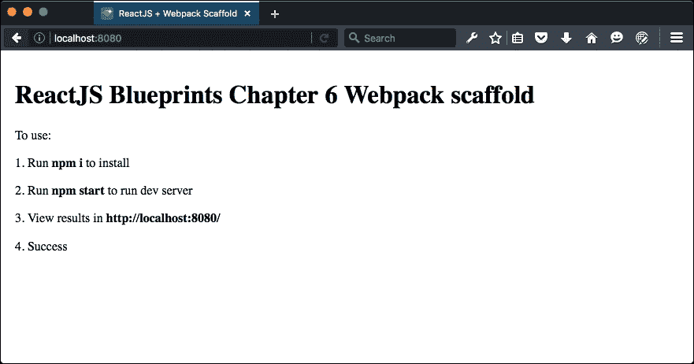
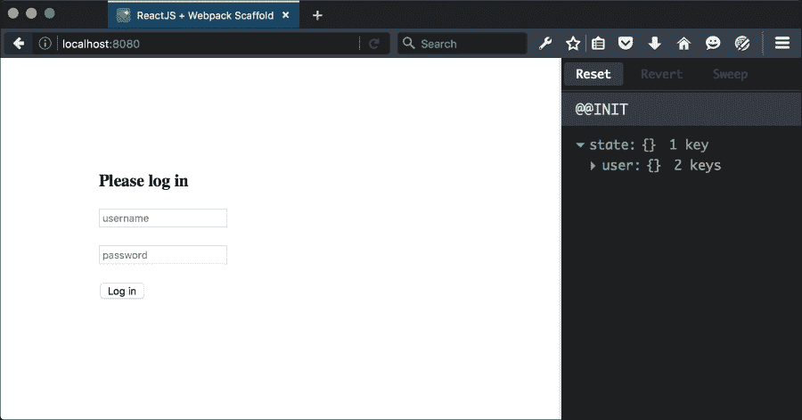
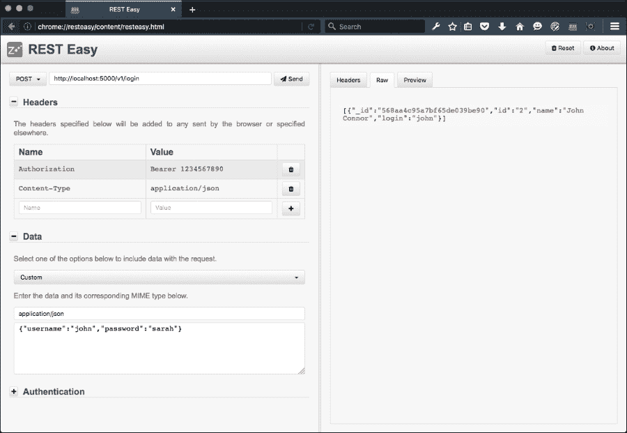

# 第六章. 高级 React

在本章的第一部分，我们将探讨**Webpack**、**Redux**以及如何使用 JavaScript 2015 中引入的新类语法编写组件。使用类语法编写 ReactJS 组件与使用`React.createClass`略有不同，所以我们将探讨这些差异以及它们的优缺点。

在本章的第二部分，我们将编写一个使用 Redux 处理认证的应用程序。

这就是我们将在本章中要讨论的内容：

+   新的打包策略：

    +   Browserify 是如何工作的

    +   Webpack 是如何工作的

    +   一个艰难的选择

+   使用 Webpack 创建一个新的脚手架

    +   Babel 配置

    +   Webpack 配置

    +   添加资源

    +   创建一个 Express 服务器

    +   将 ReactJS 加入其中

    +   启动服务器

+   介绍 Redux

    +   单一存储

    +   Redux 中的 actions

    +   理解 reducers

    +   添加 Devtools

+   创建一个登录 API

# 一种新的打包策略

到目前为止，我们一直在使用 Browserify，但从现在开始，我们将切换到 Webpack。你可能想知道为什么我们要进行这种切换，以及这些技术之间的区别是什么。

让我们更仔细地看看它们两个。

## Browserify 是如何工作的

**Browserify**通过检查你指定的入口点，根据你代码中需要的所有文件和模块构建一个依赖树。每个依赖都被封装在一个`closure`代码中，其中包含模块的源代码、模块依赖的映射和一个键。它注入了原生于*node*但不在 JavaScript 中存在的特性，例如**模块处理**。

简而言之，它能够分析你的源代码，找到并封装所有你的依赖项，并将它们编译成一个单一的包。它性能非常好，是新建项目的优秀启动工具。

在实践中使用它就像编写一组代码并将其发送到 Browserify 一样简单。让我们编写两个相互需要的文件。

让我们将第一个文件命名为`helloworld.js`，并将以下代码放入其中：

```js
module.exports = function () {
  return 'Hello world!';
}
```

让我们将第二个文件命名为`entry.js`，并将以下代码放入其中：

```js
var Hello = require("./helloworld");
console.log(Hello());
```

然后，从命令行将这两个文件传递给 Browserify，如下所示：

```js
browserify entry.js

```

结果将是一个立即调用的函数表达式（简称 IIFE），其中包含你的"`hello world`"代码。IIFE 也被称为匿名自执行函数或简单地指一个在加载时立即执行的代码块。

生成的代码看起来相当难以理解，但让我们试着理解它：

```js
(function e(t, n, r) {
  function s(o, u) {
    if (!n[o]) {
      if (!t[o]) {
        var a = typeof require == "function" && require;
        if (!u && a) return a(o, !0);
        if (i) return i(o, !0);
        var f = new Error("Cannot find module '" + o + "'");
        throw f.code = "MODULE_NOT_FOUND", f
      }
      var l = n[o] = {
        exports: {}
      };
      t[o][0].call(l.exports, function(e) {
        var n = t[o][1][e];
        return s(n ? n : e)
      }, l, l.exports, e, t, n, r)
    }
    return n[o].exports
  }
  var i = typeof require == "function" && require;
  for (var o = 0; o < r.length; o++) s(r[o]);
  return s
})
```

整个第一个块传递模块源代码并执行它。第一个参数接受我们的源代码，第二个是一个缓存（通常是空的），第三个是一个键，将其映射到所需的模块。

内部函数是一个内部`cache`函数。它在函数的末尾使用，用于从缓存中检索函数，或者存储它以便下次请求时可用。在这里，列出了一个所需的模块，以及整个源代码：

```js
({
  1: [function(require, module, exports) {
    var Hello = require("./helloworld");
    console.log(Hello());

  }, {
    "./helloworld": 2
  }],
  2: [function(require, module, exports) {
    module.exports = (function() {
      return 'Hello world!';
    })

  }, {}]
}, {}, [1]);
```

### 注意

注意，这是以三个参数的形式传递到括号中，与 IIFE 函数匹配。

并非你必须完全理解它是如何工作的。重要的是要记住，Browserify 将生成一个包含所有代码的完整静态包，并且还会处理它们之间的关系。

到目前为止，Browserify 看起来非常出色。然而，美中不足的是，如果你想要对你的代码做更多的事情——例如，压缩它或者将*JavaScript 2015*转换为*ECMAScript 5*或者将*ReactJS JSX*代码转换为纯 JavaScript——你需要向它传递额外的转换。

Browserify 有一个庞大的转换生态系统，你可以使用它来转换你的代码。知道如何连接起来是难点，而 Browserify 本身在这个问题上并不完全有意见，这意味着你将不得不自己处理。

让我们添加一个 JavaScript 2015 转换来展示如何使用转换运行 Browserify。将`helloworld.js`更改为以下代码：

```js
import Hello from "./helloworld";
console.log(Hello());
```

现在运行标准的`browserify`命令将导致解析错误。让我们尝试使用我们在我们的脚手架中使用的 Babel 转换器：

```js
browserify entry.js --transform [babelify --presets [es2015]]

```

代码现在将被解析。

### 注意

如果你比较生成的代码，你会注意到 Babel 生成的 JavaScript 2015 代码与 Browserify 使用纯 ECMAScript 5 生成的代码相当不同。它稍微大一点（在这个例子中，它大约大 25%，但这是一个非常小的代码集样本，所以与更现实的代码集相比，差异不会那么显著）。

你可以通过几种方式运行代码。你可以创建一个 HTML 文件并在脚本标签中引用它，或者你只需简单地打开浏览器，将其粘贴到 Chrome 的控制台窗口或 Firefox 的 Scratchpad 中。在任何情况下，结果都是相同的；文本**Hello world!**将出现在你的控制台日志中。

## Webpack 的工作原理

与 Browserify 类似，Webpack 是一个模块打包器。它在操作上与 Browserify 相似，但在底层却大不相同。有很多差异，但关键的区别在于 Webpack 可以动态使用，而 Browserify 则是严格静态的。我们将探讨 Webpack 的工作原理，并展示如何在使用 Webpack 编写代码时从中获得巨大益处。

与 Browserify 一样，使用 Webpack 生成代码是从一个`entry`文件开始的。让我们使用上一个例子中的"`Hello World`"代码（ECMAScript 5 版本）。Webpack 要求你指定一个`output`文件，所以让我们将其写入`bundle.js`，如下所示：

```js
webpack helloworld.js --output-filename bundle.js

```

默认情况下，生成的代码比 Browserify 更冗长，实际上相当易于阅读（添加`-p`参数将生成一个压缩版本）。

运行前面的代码将生成以下代码：

```js
(function(modules) { // webpackBootstrap
  var installedModules = {};
  function __webpack_require__(moduleId) {

  if(installedModules[moduleId])
  return installedModules[moduleId].exports;

  var module = installedModules[moduleId] = {
    exports: {},
    id: moduleId,
    loaded: false
  };
```

与 Browserify 一样，Webpack 生成一个 IIFE。它首先做的事情是设置一个模块缓存，然后检查模块是否已缓存。如果没有，模块将被放入缓存，让我们看看以下代码片段：

```js
  modules[moduleId].call(module.exports, module, module.exports,
    __webpack_require__);
  module.loaded = true;
  return module.exports;
}
```

接下来，它执行 `module` 函数，将其标记为已加载，并返回模块的导出，让我们看一下下面的代码片段：

```js
__webpack_require__.m = modules;
__webpack_require__.c = installedModules;
__webpack_require__.p = "";
return __webpack_require__(0);
})
```

然后，它暴露了模块的对象、缓存以及公共路径，然后返回入口模块，让我们看一下下面的代码片段：

```js
([
  /* 0 */
  /***/ function(module, exports, __webpack_require__) {

  var Hello = __webpack_require__(1);
  console.log(Hello());
```

`Hello` 现在赋值给 `__webpack_require__(1)`。数字指的是下一个模块（因为它从 `0` 开始计数）。现在请参考以下内容：

```js
  /***/ },
  /* 1 */
  /***/ function(module, exports) {

  module.exports = (function () {
    return 'Hello world!';
    })
  }
]);
```

两个模块源本身都作为 IIFE 的参数执行。

到目前为止，Webpack 和 Browserify 看起来非常相似。它们都分析你的入口文件，并将源代码包裹在一个自执行的闭包中。它们还包括缓存策略，并维护一个关系树，以便它可以告诉模块是如何相互依赖的。

实际上，仅通过查看生成的代码，很难看出它们之间有什么不同，除了代码风格不同之外。

然而，有一个很大的不同，那就是 Webpack 如何组织其生态系统和配置策略。虽然配置确实很复杂，稍微难以理解，但很难否认你可以实现的结果。

你可以配置 Webpack 来做（几乎）你想要做的任何事情，包括在保留应用状态的同时，用更新的代码替换浏览器中当前加载的代码。这被称为 **热模块替换** 或简称为 **hmr**。

Webpack 通过编写一个特殊的配置文件来配置，通常称为 `webpack.config.js`。在这个文件中，你指定入口和输出参数、插件、模块加载器和各种其他配置参数。

一个非常基本的 `config` 文件看起来像这样：

```js
var webpack = require('webpack');
module.exports = {
  entry: [
    './entry'
  ],
  output: {
    path: './',
    filename: 'bundle.js'
  }
};
```

它通过从命令行执行以下命令来执行：

```js
webpack --config webpack.config.js

```

或者，如果没有 `config` 参数，Webpack 将自动查找 `webpack.config.js` 的存在。

为了在打包之前转换 `source` 文件，你使用模块加载器。将此部分添加到 Webpack 配置文件中，将确保 Babel 将 JavaScript 2015 代码转换为 ECMAScript 5：

```js
module: {
  loaders: [{
    test: /.js?$/',
    loader: 'babel',
    exclude: /node_modules/,
    query: {
      presets: ['es2015','react']
    }
  }]
}
```

让我们详细回顾一下选项：

+   第一个选项（必需），`test`，是一个正则表达式匹配，告诉 Webpack 这个加载器操作哪些文件。正则表达式告诉 Webpack 查找以 *点* 开头，后跟字母 *js*，然后是任意可选字母 `(?)`，直到末尾 `($)` 的文件。这确保加载器可以读取普通的 JavaScript 文件和 JSX 文件。

+   第二个选项（必需），`loader`，是我们将用于转换代码的包的名称。

+   第三个选项（可选），`exclude`，是另一个正则表达式，用于显式忽略一组文件夹或文件。

+   最后一个选项（可选），`query`，包含为你的加载器设置的特殊配置选项。在我们的例子中，它包含 Babel 加载器的选项。对于 Babel，实际上推荐的方式是将它们设置在一个特殊的文件中，称为 `.babelrc`。我们将在稍后开发的脚手架中这样做。

## 一个艰难的选择——Browserify 或 Webpack

Browserify 因其易于上手而得分，但由于在需要添加转换时复杂性增加，并且总体上比 Webpack 更有限，因此它失去了分数。

Webpack 一开始比较难以掌握，但随着你解开复杂性，它将变得越来越有用。使用 Webpack 的一个重大优势是其能够使用其热重载工具生态系统在运行时替换代码，以及它以强大的、有见地的扩展方式来满足每一个需求。值得注意的是，目前正在努力为 Browserify 开发一个`hmr`模块。您可以在[`github.com/AgentME/browserify-hmr`](https://github.com/AgentME/browserify-hmr)上预览该项目。

它们都是出色的工具，值得学习使用两者。对于某些类型的项目，使用 Browserify 最有意义，而对于其他项目，Webpack 显然是最佳选择。

接下来，我们将创建一个新的基本设置，一个脚手架，我们将在本章后面开发带有 Redux 的登录应用时使用它。

这将会非常有趣！

# 使用 Webpack 创建一个新的脚手架

创建一个新的文件夹，并使用`npm init`初始化它，然后添加以下依赖项：

```js
npm i --save-dev babel-core@6.8.0 babel-loader@6.2.4 babel-plugin-react-transform@2.0.2 babel-preset-es2015@6.6.0 babel-preset-react@6.5.0 react@15.0.2 react-dom@15.0.2 react-transform-catch-errors@1.0.2 react-transform-hmr@1.0.4 redbox-react@1.2.4 webpack@1.13.0 webpack-dev-middleware@1.6.1 webpack-hot-middleware@2.10.0 && npm i --save express@4.13.4

```

除了一个依赖项之外，所有依赖项都将保存为`devDependencies`。当您稍后执行`npm install`命令时，`dependencies`部分和`devDependencies`部分中的所有模块都将被安装。

您可以通过向`npm`提供`dev`或`production`标志来指定要安装的哪个部分。例如，这将仅安装依赖项部分中的包：

```js
npm install --production

```

您的`package.json`文件现在应该看起来像这样：

```js
{
  "name": "chapter6",
  "version": "1.0.0",
  "description": "",
  "main": "index.js",
  "scripts": {
    "test": "echo \"Error: no test specified\" && exit 1"
  },
  "author": "",
  "license": "ISC",
  "devDependencies": {
    "babel-core": "⁶.8.0",
    "babel-loader": "⁶.2.4",
    "babel-plugin-react-transform": "².0.2",
    "babel-preset-es2015": "⁶.6.0",
    "babel-preset-react": "⁶.5.0",
    "react": "¹⁵.0.2",
    "react-dom": "¹⁵.0.2",
    "react-transform-catch-errors": "¹.0.2",
    "react-transform-hmr": "¹.0.4",
    "redbox-react": "¹.2.4",
    "webpack": "¹.13.0",
    "webpack-dev-middleware": "¹.6.1",
    "webpack-hot-middleware": "².10.0"
  },
  "dependencies": {
    "express": "⁴.13.4"
  }
}
```

## Babel 配置

接下来，创建一个新文件，命名为`.babelrc`（点号前没有前缀），并将以下代码添加到其中：

```js
{
  "presets": ["react", "es2015"],
  "env": {
    "development": {
      "plugins": [
        ["react-transform", {
          "transforms": [{
            "transform": "react-transform-hmr",
            "imports": ["react"],
            "locals": ["module"]
          }, {
            "transform": "react-transform-catch-errors",
            "imports": ["react", "redbox-react"]
          }]
        }]
      ]
    }
  }
}
```

这个`配置`文件将由 Babel 使用，以便使用我们刚刚安装的预设（React 和 ES2015）。它还将指示 Babel 我们希望使用哪些转换。将转换放在`env:development`文件中可以确保它不会在生产环境中意外启用。

## Webpack 配置

接下来，让我们添加 Webpack 配置模块。创建一个名为`webpack.config.js`的新文件，并将此代码添加到其中：

```js
var path = require('path');
var webpack = require('webpack');

module.exports = {
  devtool: 'cheap-module-eval-source-map',
  entry: [
    'webpack-hot-middleware/client',
    './source/index'
  ],
```

这将指示 Webpack 首先使用热模块替换作为初始入口点，然后是我们的源根。现在参考以下内容：

```js
  output: {
    path: path.join(__dirname, 'public'),
    filename: 'bundle.js',
    publicPath: '/assets/'
  },
```

我们将输出路径设置为`public`文件夹，这意味着任何被访问的内容都应该位于这个文件夹中。我们还将指示 Webpack 使用`bundle.js`文件名，并指定它应该从`assets`文件夹中访问。

在我们的`index.html`文件中，我们将通过一个指向`assets/bundle.js`的 script 标签来访问该文件，但我们实际上不会在`assets`文件夹中放置一个真实的`bundle.js`文件。

热中间件客户端将确保当我们尝试访问包时，将提供生成的包。

当我们准备好创建用于生产的真实包时，我们将使用生产 `flag` 参数生成一个 `bundle.js` 文件，并将其存储在 `public/assets/bundle.js`：

```js
  plugins: [
    new webpack.optimize.OccurenceOrderPlugin(),
    new webpack.NoErrorsPlugin(),
    new webpack.HotModuleReplacementPlugin()
  ],
```

我们将使用三个插件。第一个确保模块按顺序加载，第二个是为了防止在我们的控制台日志中报告不必要的错误，第三个是为了启用热模块加载器，如下所示：

```js
  module: {
    loaders: [{
      tests: /\.js?$/,
      loaders: ['babel'],
      include: path.join(__dirname, 'source')
    }]
  },
```

我们将添加 Babel 加载器，以便在打包之前将任何 JavaScript 或 JSX 文件进行转换：

```js
  resolve: {
    extensions: ['', '.js', '.jsx']
  }
};
```

最后，我们将告诉 Webpack 解析我们导入的文件，无论它们是否有 `.js` 或 `.jsx` 扩展名。这意味着我们不需要写 `import foo from 'foo.jsx'`，而是可以写 `import foo from 'foo'`。

## 添加资产

接下来，让我们添加 `assets` 文件夹以及我们将引用的文件。我们将在 `root` 文件夹中创建它，而不是创建一个 `public` 文件夹。（实际上我们根本不需要这样做。在开发模式下，这个文件夹不是必须创建的）。

创建文件夹并添加两个文件：`app.css` 和 `favicon.ico`。

`favicon.ico` 并非绝对必要，因此你可以选择去掉它。你可能在电脑周围找到它，或者通过访问如 [`www.favicon.cc`](http://www.favicon.cc) 这样的图标生成网站来创建一个。

它被包含在这里的原因是：如果它不存在，每次你重新加载你的网站时，你会在日志中看到对图标失败的请求，所以它代表了值得去除的日志噪音。

打开 `assets/app.css` 并添加以下代码：

```js
body {
  font-family: serif;
  padding: 50px;
}
```

这只是简单地给主体周围添加了 `50` 像素的通用填充。

接下来，我们需要添加一个 `index.html` 文件。在应用程序的根目录中创建它，并添加以下内容：

```js
<!DOCTYPE html>
<html>
  <head>
    <title>ReactJS + Webpack Scaffold</title>
    <meta charset="utf-8">
    <meta http-equiv="X-UA-Compatible" content="IE=edge">
    <meta name="viewport" content="width=device-width, 
    initial-scale=1">
    <link rel="stylesheet" href="app.css">
  </head>
  <body>
    <div id="app"></div>
    <script src="img/bundle.js"></script>
  </body>
</html>
```

## 创建 Express 服务器

我们还需要创建一个 Express 应用程序来为我们的开发服务器提供动力。将 `server.js` 添加到您的根文件夹中，然后添加以下代码：

```js
var path = require('path');
```

此模块让我们以更舒适和安全的方式连接路径字符串，而不是连接字符串。首先，它消除了我们是否知道目录路径是否有尾随斜杠的担忧。

### 小贴士

当你手动连接字符串时，你几乎总是会在第一次尝试时出错。

我们将使用 Express 网络服务器、Webpack 以及我们刚刚创建的 Webpack 配置：

```js
var express = require('express');
var webpack = require('webpack');
var config = require('./webpack.config');
var port = process.env.PORT || 8080;
```

我们将预设我们将要使用的端口号为 `8080`，除非它被指定为节点的参数。要指定参数，例如端口号，以这种方式启动服务器：`PORT=8081 node server.js`：

```js
var app = express();
var compiler = webpack(config);
```

我们将创建一个名为 `app` 的局部变量，并将其指向一个新的 *Express* 网络服务器实例。我们还将创建另一个名为 `compiler` 的变量，该变量将配置 *Webpack* 使用我们的 `config` 文件。这相当于在命令行上使用 `webpack –config webpack.config.js` 启动 Webpack：

```js
app.use('/', express.static(path.join(__dirname, 'assets')));
```

我们将在 Express 中将 `assets` 文件夹定义为 `static` 文件夹。这是一个内置的中间件，用于配置 Express 在提供的文件夹中查找文件。中间件是一种软件，用于将应用程序粘合在一起或提供额外的功能。静态中间件允许我们在 `index.html` 文件中的链接标签中直接引用 `app.css`，而不是引用 `assets` 文件夹：

```js
app.use(require('webpack-dev-middleware')(compiler, {
  quiet: true,
  noInfo: true,
  publicPath: config.output.publicPath
}));
```

我们将告诉 *Express* 使用 `webpack-dev-middleware` 和 `compiler` 变量，以及一些额外的指令（`noInfo` 将防止控制台日志在每次重新编译时显示 Webpack 编译信息；`publicPath` 指示中间件使用我们在 `config` 文件中定义的路径，而 `quiet` 则抑制 `noInfo` 覆盖的任何其他调试信息）：

```js
app.use(require("webpack-hot-middleware")(compiler, {
  log: console.log,
  path: '/__webpack_hmr',
  heartbeat: 10 * 1000
}));
```

这指示 *Express* 使用 `hot` 中间件包（而前面的一个指示它使用 `dev` 中间件）。`dev` 中间件是 Webpack 的包装器，它将 Webpack 发射到内存中的文件提供服务，而不是将它们捆绑为文件。当我们与 `hot` 中间件包结合使用时，我们获得了在浏览器中重新加载和执行任何代码更改的能力。`heartbeat` 参数告诉中间件应该多久更新一次。

你可以调整心跳频率以更频繁地更新，但所选的数字效果相当不错：

```js
app.get('*', function(req, res) {
  res.sendFile(path.join(__dirname, 'index.html'));
});
```

此部分将每个请求路由到 Express 应用程序的根文件夹：

```js
app.listen(port, 'localhost', function(err) {
  if (err) {
    console.log(err);
    return;
  }
```

最后，我们在选择的端口上启动应用程序：

```js
  console.log('Listening at http://localhost:'+port);
});
```

服务器现在已准备就绪。你现在需要完成设置的所有步骤就是添加一个 ReactJS 组件。我们将使用新的 ES6 基于类的语法，而不是我们至今使用的 `createClass` 语法。

## 将 ReactJS 添加到混合中

添加一个名为 `source` 的新文件夹，并添加一个名为 `index.jsx` 的文件。然后，添加以下代码：

```js
'use strict';
import React, { Component, PropTypes } from 'react';
import { render } from 'react-dom';

class App extends Component {
  render() {
    return <div>
      <h1>ReactJS Blueprints Chapter 6 Webpack scaffold</h1>
      <div>
        To use:
        <p>
          1\. Run <strong>npm i</strong> to install
        </p>
        <p>
          2\. Run <strong>npm start</strong> to run dev server
        </p>
        <p>
          3\. View results in <strong>http://localhost:8080/
          </strong>
        </p>
        <p>
          4\. Success
        </p>
      </div>

    </div>
  }
```

`render` 函数看起来与之前相同。

### 注意

注意，我们也不再使用逗号来分隔我们的函数。在类内部它们不是必需的。

让我们看一下以下代码片段：

```js
}

render(
  <App />,
  document.getElementById('app')
);
```

最后一个函数调用是调用 react-dom 的 `render` 方法，该方法负责用 `app` ID 和源文件的內容填充文档容器。

## 启动服务器

我们现在可以运行服务器并首次看到结果。在终端中执行 `node server.js` 启动应用程序，并在浏览器中打开 `http://localhost:8080`：



现在，你应该会看到你添加到 `source/index.jsx` 中的简介文本。

恭喜！你已经完成了所有必要的步骤，可以开始使用 Webpack 和热重载。

承认，与 `Browserify` 设置相比，这个设置稍微复杂一些，但随着你对源文件进行修改，你将明显感受到增加的复杂性带来的好处；你会在点击 **保存** 按钮后立即看到浏览器中更新的更改。

这比我们之前的方法更优越，因为应用能够保持其状态完整，即使在重新加载代码更改时也是如此。这意味着当你开发一个复杂的应用时，你不需要重复很多状态更改来达到你更改的代码。这将在长期内为你节省大量时间和挫败感。

# 介绍 *Redux*

到目前为止，我们使用 **Reflux** 来处理存储和状态交互，但向前看，我们将使用 *Flux* 架构的不同实现。它被称为 **Redux**，并且作为一个更优越的 *Flux* 实现正在迅速获得认可。

它也因其难以理解而臭名昭著，其简单与复杂性的双重性让新手和经验丰富的开发者都感到困惑。这部分的理由是因为它纯粹是 *Flux* 的函数式方法。

当 ReactJS 在 2013 年晚些时候/2014 年初首次向公众介绍时，你经常会听到它与函数编程一起被提及。

然而，在编写 React 时，并没有内在的要求必须编写函数式代码，并且 JavaScript 本身作为一个多范式语言，既不是严格函数式，也不是严格过程式、命令式，甚至不是面向对象的。

选择函数式方法有许多好处：

+   不允许有副作用，也就是说，操作是无状态的

+   对于给定的输入始终返回相同的输出

+   适合创建递归操作

+   适合并行执行

+   容易建立单一事实来源

+   容易调试

+   容易持久化存储状态以加快开发周期

+   容易创建诸如撤销和重做等功能

+   容易注入用于服务器渲染的存储状态

无状态操作的概念可能是最大的好处，因为它使得推理你应用的状态变得非常容易。我们已经在 第二章 的 *Reflux* 示例中使用了这种方法，在第一个应用中，存储状态只在主应用中更改，然后向下传播到所有应用的子组件。然而，这并不是典型的 *Reflux* 方法，因为它实际上是为了创建许多存储，让子组件分别监听更改而设计的。

应用状态是任何应用中最困难的部分，每个 *Flux* 的实现都试图解决这个问题。*Redux* 通过实际上并不做 *Flux* 来解决这个问题；它实际上使用了 *Flux* 和函数式编程语言 **Elm** 的想法的结合。

*Redux* 有三个部分：**actions**、**reducers** 和 **全局存储**。

## 全局存储

在 *Redux* 中，只有一个全局存储。它是一个对象，持有你整个应用的状态。你通过将你的 `root-reducing` 函数（或简称为 reducer）传递给名为 `createStore` 的方法来创建存储。

而不是创建更多的存储，你使用一个称为**reducer 组合**的概念来分割数据处理逻辑。然后你需要使用一个名为`combineReducers`的函数来创建一个单一的根 reducer。

`createStore`函数是从 Redux 派生出来的，通常在应用的根目录（或你的`store`文件）中调用一次。然后它被传递到你的应用中，并传播到应用的孩子。

改变存储状态的唯一方式是向其发送一个动作。这不同于 Flux dispatcher，因为 Redux 没有。你也可以订阅存储的变化，以便在存储状态改变时更新你的组件。

## 理解 actions

一个动作是一个表示意图改变状态的对象。它必须有一个类型字段，指示正在执行的动作类型。它们可以定义为常量并从其他模块导入。

除了这个要求之外，对象的结构设计完全取决于你。

一个基本的动作对象可以看起来像这样：

```js
{
  type: 'UPDATE',
  payload: {
    value: "some value"
  }
}
```

`payload`属性是可选的，它可以像我们之前讨论过的对象一样工作，或者任何其他有效的 JavaScript 类型，例如函数或原始类型。

## 理解 reducers

**reducer**是一个接受累积值和一个值作为参数的函数，并返回一个新的累积值。换句话说，它根据前一个状态和动作返回下一个状态。

它必须是一个纯函数，没有副作用，并且不会修改现有的状态。

对于较小的应用，从一个单一的 reducer 开始是可以的，但随着你的应用增长，你需要将其拆分成管理状态树特定部分的较小的 reducers。

这就是所谓的**reducer 组合**，它是使用 Redux 构建应用的基石模式。

你从一个单一的 reducer 开始，但随着你的应用增长，你需要将其拆分成管理状态树特定部分的较小的 reducers。因为 reducers 只是函数，你可以控制它们被调用的顺序，传递额外的数据，甚至为常见的任务（如分页）创建可重用的 reducers。

有很多 reducers 是可以的。实际上，这是被鼓励的。

## 安装 Redux

让我们添加*Redux*到我们的脚手架中，看看它是如何工作的。当你开始使用 redux 时，你只需要两个包：`redux`和`react-redux`。我们将在我们的应用中添加一些其他包，以帮助我们在开发应用时进行调试。首先，安装以下依赖项：

```js
npm install --save-dev redux@3.5.2 redux-devtools@3.3.1 react-redux@4.4.5 redux-thunk@2.1.0 isomorphic-fetch@2.2.0 react-bootstrap@0.29.4 redux-devtools-dock-monitor@1.1.1 redux-devtools-log-monitor@1.0.11

```

当完成这项操作后，你的`package.json`文件的`devDepencies`部分应该包含以下包：

```js
"devDependencies": {
  "react-redux": "⁴.4.5",
  "redux": "³.5.2",
  "redux-thunk": "².1.0",
  "redux-devtools": "³.3.1",
  "isomorphic-fetch": "².2.0",
  "react-bootstrap": "⁰.29.4",
  "redux-devtools-dock-monitor": "¹.1.1",
  "redux-devtools-log-monitor": "¹.0.11"
}
```

### 注意

值得注意的是，新版本一直在发布，所以确保你安装的版本号与这些示例编写时的版本号相同是很好的。你可以在安装包时通过将版本号添加到`install`命令中来安装确切的版本号，就像我们在前面的代码片段中所做的那样。

# 创建登录应用

现在我们已经基于 Webpack 创建了一个新的脚手架，并添加了 Redux，让我们继续创建一个使用新库处理身份验证的 app。

## 创建一个动作

我们将从添加一个动作开始。我们将制作的 app 是一个登录 app，在进入时将提示输入用户名和密码。

让我们先创建一个文件夹结构来分离功能。在`source`文件夹内创建一个名为`actions`的文件夹，并添加一个名为`login.js`的文件；然后，添加以下代码：

```js
'use strict';
import fetch from 'isomorphic-fetch';
```

`Fetch`是一个用于获取资源的全新接口。如果你以前使用过`XMLHttpRequest`或者像我们在前面的章节中使用的那样，与**Promises**一起使用**Superagent**，你会认识它。新的 API 支持开箱即用的 Promises，支持通用的请求和响应对象定义。它还提供了诸如**跨源资源共享**（**CORS**）和 HTTP 源头语义等概念的定义。

我们本可以使用 Babel 直接使用`Fetch`，但这个包更可取，因为它将`Fetch`作为一个全局函数添加，它具有一致的 API，可以在服务器和客户端代码中使用。这将在后面的章节中介绍，我们将创建一个同构应用。考虑以下代码：

```js
export const LOGIN_USER = 'LOGIN_USER';
```

这定义了一个单个动作常量，我们可以在需要分发动作时使用。现在看看这个例子：

```js
export function login(userData) {
```

通过这种方式，我们创建并导出一个名为`login`的单个函数，该函数接受一个`userData`对象。现在我们将创建一个名为`body`的变量，它包含用户名和密码：

```js
  const body = { username: userData.username,
    password: userData.password };
```

这并不是严格必要的，因为我们可以轻松地传递`userData`对象，但我们的想法是通过明确地这样做，我们只发送用户名和密码，没有其他内容。当你查看下一部分代码时，这将很容易理解：

```js
  const options = {headers: {
    'Accept': 'application/json',
    'Content-Type': 'application/json',
    'Authorization': 'Bearer 1234567890'
  },
  method: 'post',
  body: JSON.stringify(body)
}
```

我们将使用带有`Accept`头和`Content-Type`的`POST`请求发送，两者都指定我们正在处理 JSON 数据。我们还将发送一个带有 bearer token 的授权头。

你之前在第四章中见过这个 bearer token，*构建实时搜索应用*。我们将引用的 API 与我们当时构建的非常相似。我们将在完成前端代码后查看 API。

主体通过`JSON.stringify()`方法传递，因为我们不能通过 HTTP 发送原始 JavaScript 对象。该方法将对象转换为适当的 JSON 表示形式，如果指定了替换函数，则可选地替换值。看看这个例子：

```js
  return dispatch => {
    return fetch(`http://reactjsblueprints-useradmin.herokuapp.com/v1/login`, options)
      .then(response => response.json())
    .then(json => dispatch(setLoginDetails(json)))
  }
}
```

这是我们的`login`函数的`return`部分。它首先通过`fetch`函数连接到我们的登录 API，该函数返回一个`Promise`。

### 注意

注意到我们正在使用 JavaScript 2015 通过新背引号提供的功能。

当 Promise 解决时，我们通过 fetch API 可用的 `native json()` 方法从对象中获取 JSON 响应。最后，我们通过向一个名为 `setLoginDetails` 的内部函数派发来返回 JSON 数据：

```js
function setLoginDetails(json) {
  if(json.length === 0 ) {
    return {
      type: LOGIN_FAIL,
      timestamp: Date.now()
    }
  }
  return {
    type: LOGIN_USER,
    loginResponse: json,
    timestamp: Date.now()
  }
}
```

如果 `json` 包含有效的响应，`setLoginDetails` 返回一个包含映射到 `LOGIN_USER` 字符串值的 `action` 对象和两个自定义值。记住，一个动作必须始终返回一个 `type`，而它返回的其他任何内容都是可选的，取决于你。如果 `json` 参数为空，函数返回 `LOGIN_FAIL`。

## 创建 reducer

我们接下来要添加的下一个文件是一个 `reducer`。我们将将其放在一个单独的文件夹中。所以，在 `source` 文件夹内创建一个名为 `reducers` 的文件夹，然后添加一个名为 `login.js` 的文件（与 action 相同），然后添加以下代码：

```js
'use strict';
import {
  LOGIN_USER,
  LOGIN_FAIL
} from '../actions/login';
import { combineReducers } from 'redux'
```

我们将导入我们刚刚创建的文件以及来自 Redux 的 `combineReducer()` 方法。目前我们只创建一个 reducer，但我喜欢从一开始就添加它，因为随着应用的扩展，通常会增加更多的 reducer。当你的 reducer 数量增加时，通常有一个 `root` 文件来组合 reducer 是有意义的。接下来，我们将声明一个函数，该函数期望一个 `state` 对象和 `action` 作为其参数：

```js
function user(state = {
  message: "",
  userData: {}
}, action){
```

当 `action.type` 返回一个成功状态时，我们返回状态并添加或更新 `userData` 和 `timestamp` 参数：

```js
switch(action.type) {
  case LOGIN_USER:
    return {
      ...state,
      userData: action.loginResponse[0],
      timestamp: action.timestamp
    };
```

注意，为了在我们的 reducer 中使用扩展运算符，我们需要在我们的 `.babelrc` 配置中添加一个新的 preset。这不是 EcmaScript 6 的一部分，而是作为语言扩展被提出的。打开你的终端并运行以下命令：

```js
npm install –save-dev babel-preset-stage-2

```

接下来，修改 `.babelrc` 中的 presets 部分，使其看起来像这样：

```js
"presets": ["react", "es2015", "stage-2"]
```

我们还会添加一个 *case* 以便在登录失败时记录用户：

```js
    case LOGIN_FAIL:
      return {
        ...state,
        userData: [],
        error: "Invalid login",
        timestamp: action.timestamp
      };
```

最后，我们将添加一个 *default case*。这并不是严格必要的，但通常处理任何未预见的案例，如这种情况，是谨慎的：

```js
      default:
        return state
  }
}

const rootReducer = combineReducers({user});

export default rootReducer
```

## 创建 store

我们接下来要添加的下一个文件是一个 store。在你的 `source` 文件夹内创建一个名为 `stores` 的文件夹，添加 `store.js` 文件，然后添加以下代码：

```js
'use strict';
import rootReducer from '../reducers/login';
```

我们将导入我们刚刚创建的 `reducer`：

```js
import { persistState } from 'redux-devtools';
import { compose, createStore, applyMiddleware } from 'redux';
import thunk from 'redux-thunk';
import DevTools from '../devtools';
```

我们需要从 Redux 中获取一些方法。`devtools` 包仅用于开发，并且在进入生产时必须删除。

在计算机科学中，`thunk` 是一个没有自己的参数的匿名表达式，它被一个参数表达式包裹。`redux-thunk` 包允许你编写返回函数的动作创建器，而不是动作。`thunk` 包可以用来延迟动作的派发，或者只在满足某些条件时派发。内部函数接收 store 方法 `dispatch` 和 `getState()` 作为参数。

我们将使用它来向我们的登录 API 发送异步派发：

```js
const configureStore = compose(
  applyMiddleware(thunk),
  DevTools.instrument()
)(createStore);
const store = configureStore(rootReducer);

export default store;
```

## 添加 devtools

Devtools 是你在应用中处理状态的主要方式。我们将安装默认的日志和坞栏监视器，但如果你觉得它们不适合你，你可以开发自己的。

在你的 `source` 文件夹中添加一个名为 `devtools.js` 的文件，并添加以下代码：

```js
'use strict';
import React from 'react';

import { createDevTools } from 'redux-devtools';

import LogMonitor from 'redux-devtools-log-monitor';
import DockMonitor from 'redux-devtools-dock-monitor';
```

`Monitors` 是独立的包，你可以创建自定义的，让我们看看以下代码：

```js
const DevTools = createDevTools(
```

**Monitors** 可以通过属性单独调整。查看 devtools 的源代码以了解更多关于它们如何构建的信息。在这里，我们将 `LogMonitor` 放在 `DockMonitor` 类内部：

```js
  <DockMonitor toggleVisibilityKey='ctrl-h'
    changePositionKey='ctrl-q'>
    <LogMonitor theme='tomorrow' />
  </DockMonitor>
);

export default DevTools;
```

## 整合文件

是时候将应用整合在一起了。打开 `index.jsx` 并将现有内容替换为以下代码：

```js
import React, { Component, PropTypes } from 'react'
import { Grid, Row, Col, Button, Input } from 'react-bootstrap';
import { render, findDOMNode } from 'react-dom';
import store from './stores/store';
import { login } from './actions/login'
import { Provider } from 'react-redux'
import { connect } from 'react-redux'
import DevTools from './devtools';
```

这添加了我们创建的所有文件以及从 ReactJS 中需要的所有方法。现在参考以下代码：

```js
class App extends Component {

  handleSelect() {
    const { dispatch } = this.props;
    dispatch(
    login(
    {
      username: findDOMNode(this.refs.username).value,
      password: findDOMNode(this.refs.password).value
    }))
  }
```

这个函数使用在 `render()` 方法中定义的 `username` 和 `password` 输入字段的内容，派发我们在 `actions/login.js` 中定义的 `login` 动作，如下所示：

```js
  renderWelcomeMessage() {
    const { user } = this.props;
    let response;
    if(user.userData.name) {
      response = "Welcome "+user.userData.name;
    }
    else {
      response = user.error;
    }
    return (<div>
      { response }
      </div>);
  }
```

这是一小段 JSX 代码，我们用它来在登录尝试后显示欢迎信息或错误信息。现在查看以下代码：

```js
  renderInput() {
    return <form>
      <div>
        <FormGroup>
          <ControlLabel>Username</ControlLabel>
          <FormControl type= "text"
            ref = "username"
            placeholder= "username"
          />
        <FormControl.Feedback />
        </FormGroup>
      </div>

      <div>
        <FormGroup>
          <ControlLabel>Password</ControlLabel>
          <FormControl type= "password"
            ref = "password"
            placeholder= "password"
          />
          <FormControl.Feedback />
        </FormGroup>
      </div>

      <Button onClick={this.handleSelect.bind(this)}>Log in</Button>
    </form>)
  }
```

这些是用于登录用户的输入字段。

### 注意

注意，我们必须自己使用 `.bind(this)` 绑定上下文。

使用 `createClass` 时，绑定是自动创建的，但当你使用 JavaScript 2015 类时，没有这样的魔法存在。JavaScript 的下一个版本可能会带来一个建议的新语法糖（`::`），这意味着我们可以使用 `this.handleSelect` 而不必显式绑定它，但这还远未实现：

```js
  render () {
    const { user } = this.props;
    return (
      <Grid>
        <DevTools store={store} />
        <Row>
          <Col xs={ 12 }>
            <h3> Please log in </h3>
          </Col>

          <Col xs={ 12 }>
            { this.renderInput() }
          </Col>

          <Col xs={ 12 }>
            { this.renderWelcomeMessage() }
          </Col>
        </Row>
      </Grid>
    );
  }
};
```

这个 `render` 块只是向访客提供了一个登录选项。当用户点击 *Enter* 时，应用将尝试登录，并显示欢迎信息或 **无效登录** 信息。

这个函数将应用状态转换为我们可以传递给子组件的一系列属性：

```js
function mapStateToProps(state) {
  const { user } = state;
  const {
    message
  } = user || {
    message: ""
  }

  return {
    user
  }
}
```

这是我们使用 Redux 的 `connect()` 方法定义应用的地方，它将 React 组件连接到 Redux 存储。而不是就地修改组件，它返回一个新的 `component` 类，我们可以渲染它：

```js
const LoginApp = connect(mapStateToProps)(App);
```

我们创建一个新的组件类，它将 `LoginApp` 组件包裹在 `Provider` 组件内部：

```js
class Root extends Component {
  render() {
    return (
      <Provider store={store}>
        <LoginApp />
      </Provider>
    )
  }
}
```

`Provider` 组件是特殊的，因为它负责将存储作为属性传递给子组件。建议你创建一个 `root` 组件，将应用包裹在 `Provider` 中，除非你想手动将存储传递给所有子组件。最后，我们将 `Root` 组件传递给渲染，并要求它显示 `index.html` 中 ID 为 `App` 的 `div` 中的内容：

```js
render(
  <Root />,
  document.getElementById('app')
);
```

做这件事的结果在以下屏幕截图中有说明：



应用本身看起来很不起眼，但值得看看屏幕右侧的 devtools。这是 *Redux dev tools*，它告诉你有一个包含用户对象的 app 状态，该用户对象有两个键。如果你点击 **user**，它将展开并显示它由一个包含空 `message` 字符串和空 `userData` 对象的对象组成。

这正是我们在`source/index.jsx`中配置的方式，所以如果你看到这个，它就是按预期工作的。

### 注意

尝试通过输入用户名和密码来登录。提示：组合*darth/vader*或*john/sarah*可以让你登录。

注意现在你可以通过点击开发者工具栏中的动作按钮立即导航到你的应用状态。

## 处理刷新

你的应用已经准备好了，你可以登录，但如果刷新，你的登录信息就会消失。

虽然如果用户登录后永远不刷新你的页面会很好，但期望用户有这样的行为并不可行，你肯定会留下一些抱怨或离开你的网站的用户，他们永远不会回来。

我们需要做的是在初始化我们的存储时找到一种方法来注入先前状态。幸运的是，这并不难；我们只需要一个安全的地方来存储我们想要在刷新后存活的数据。

为了达到这个目的，我们将使用`sessionStorage`。它与`localStorage`类似，唯一的区别是，虽然存储在`localStorage`中的数据没有设置过期时间，但存储在`sessionStorage`中的任何数据在页面会话结束时都会被清除。

会话持续的时间与浏览器窗口打开的时间一样长，并且它可以在页面重新加载和恢复时存活。

它不支持在新标签页或窗口中打开相同的页面，这是它与，例如，会话 cookie 的主要区别。

我们首先要做的是更改`actions/login.js`并修改`setLoginDetails`函数。用以下代码替换该函数（并注意现在我们将导出它）：

```js
export function setLoginDetails(json) {
  const loginData = {
    type: LOGIN_USER,
    loginResponse: json,
    timestamp: Date.now()
  };
  sessionStorage.setItem('login',JSON.stringify(loginData));
  return loginData;
}
```

然后，我们将进入`index.jsx`并添加函数到我们的导入中。将其添加到从`actions/login`导入的行中，如下所示：

```js
import { login, setLoginDetails } from './actions/login'
```

然后，我们在`App`类中添加一个新函数：

```js
componentWillMount() {
  const { dispatch, } = this.props;
  let storedSessionLogin = sessionStorage.getItem('login');
  if(storedSessionLogin){
    dispatch(
      setLoginDetails(
        JSON.parse(storedSessionLogin).loginResponse)
      );
    }
  }
```

在组件挂载之前，它将检查`sessionStorage`中是否有存储的用户信息条目。如果有，它将分派一个调用`setLoginDetails`的动作，这将简单地设置状态为已登录并显示熟悉的欢迎信息。

这就是你需要做的全部。

除了简单地分派动作之外，还有其他方法可以注入状态。你可以在`mapStateToProps`函数中这样做，并基于`sessionStorage`、会话 cookie 或其他数据源设置初始状态（我们将在制作同构应用时回到这一点）。

# 登录 API

在我们刚刚创建的应用中，我们登录到一个现有的 API。你可能想知道 API 是如何构建的，那么让我们来看看。

要创建 API，开始一个新的项目并执行`npm init`来创建一个空的`package.json`文件。然后，安装以下包：

```js
npm install --save body-parser@1.14.1 cors@2.7.1 crypto@0.0.3 express@4.13.3 mongoose@@4.3.0 passport@0.3.2 passport-http-bearer@1.0.1

```

你的`package.json`文件现在应该看起来像这样：

```js
{
  "name": "chapter6_login_api",
  "version": "1.0.0",
  "description": "Login API for Chapter 6 ReactJS Blueprints",
  "main": "index.js",
  "dependencies": {
    "body-parser": "¹.14.1",
    "cors": "².7.1",
    "crypto": "0.0.3",
    "express": "⁴.13.3",
    "mongoose": "⁴.3.0",
    "passport": "⁰.3.2",
    "passport-http-bearer": "¹.0.1"
  },
  "scripts": {
    "test": "echo \"Error: no test specified\"  "
  },
  "author": "Your name <your@email>",
  "license": "ISC"
}
```

我们将使用**3**来存储我们的用户数据，就像我们在第四章中做的那样，*构建实时搜索应用*，并请参考这一章在你的系统上设置它。

整个 API 是一个单独的 Express 应用程序。在您的应用程序根目录中创建一个名为`index.js`的文件，并添加以下代码：

```js
'use strict';
var express = require('express');
var bodyparser = require('body-parser');
var mongoose = require('mongoose');
var cors = require('cors');
var passport = require('passport');
var Strategy = require('passport-http-bearer').Strategy;

var app = express();
app.use(cors({credentials: true, origin: true}));
```

跨源资源共享（CORS）定义了浏览器和服务器如何交互，以安全地确定是否允许跨源请求。它因让 API 开发者生活变得艰难而闻名，因此安装`cors`包并在您的 Express 应用程序中使用它以减轻痛苦是值得的：

```js
mongoose.connect(process.env.MONGOLAB_URI ||
  'mongodb://localhost/loginapp/users');
```

如果我们的配置文件中存在 MongoLab 实例，我们将使用免费的 MongoLab 实例，如果没有，则使用本地 MongoDB 数据库。我们将使用与第四章中相同的令牌，即*构建实时搜索应用*，但在后面的章节中我们将探讨使其更加安全的方法：

```js
var appToken = '1234567890';

passport.use(new Strategy(
  function (token, cb) {
    //console.log(token);
    if (token === appToken) {
      return cb(null, true);
    }
    return cb(null, false);
  })
);
```

数据库模型非常简单，但可以扩展以添加用户电子邮件地址和更多信息，如果认为值得获取的话。然而，您要求的信息越多，用户注册您服务的可能性就越小：

```js
var userSchema = new mongoose.Schema({
  id: String,
  username: String,
  password: String
});

var userDb = mongoose.model('users', userSchema);
```

我们将使用 AES 256 位加密对所有存储在数据库中的密码进行加密。这是一种非常强大的安全形式（实际上与用于互联网上安全通信的 TLS/SSL 加密相同）：

```js
var crypto = require('crypto'),
  algorithm = 'aes-256-ctr',
  password = '2vdbhs4Gttb2';
```

请参考以下代码行：

```js
function encrypt(text) {
  var cipher = crypto.createCipher(algorithm,password)
  var crypted = cipher.update(text,'utf8','hex')
  crypted += cipher.final('hex');
  return crypted;
}

function decrypt(text) {
  var decipher = crypto.createDecipher(algorithm,password)
  var dec = decipher.update(text,'hex','utf8')
  dec += decipher.final('utf8');
  return dec;
}
```

这些是我们将用于加密和解密用户密码的函数。我们将接受用户密码作为文本，然后加密它并检查加密版本是否存在于我们的数据库中。现在看看这个：

```js
var routes = function (app) {
  app.use(bodyparser.json());

  app.get('/',
    function (req, res) {
      res.json(({"message":"The current version of this API is v1.
        Please access by sending a POST request to /v1/login."}));
    });

  app.get('/login',
   passport.authenticate('bearer', {session: false}),
    function (req, res) {
        res.json(({"message":
          "GET is not allowed. Please POST request with username
          and password."}));
    });
```

此 API 需要`POST`数据，因此我们将向尝试通过`GET`方法访问此 API 的人显示有用的信息，因为使用`GET`方法无法获取任何数据。

我们将查找用户名和密码，并确保将它们转换为小写，因为我们不支持可变大小写字符串：

```js
  app.post('/login',
  passport.authenticate('bearer', {session: false}),
  function (req, res) {
    var username = req.body.username.toLowerCase();
    var password = req.body.password.toLowerCase();

    userDb.find({login: username,
      password: encrypt(password)},
      {password:0},
      function (err, data) {
        res.json(data);
      });
    });
}
```

此外，我们还将指定密码不应是结果集的一部分，通过将字段设置为`0`或`false`来实现。

我们将在数据库中搜索具有请求的用户名和提供的密码的用户（但我们需要确保查找加密版本）。这样，我们永远不知道用户的真实密码。API 将使用`/v1`作为路由前缀：

```js
var router = express.Router();
routes(router);
app.use('/v1', router);
```

注意，您还可以使用`accept`头来区分 API 的版本：

```js
var port = 5000;
app.listen(process.env.PORT || port, function () {
  console.log('server listening on port ' + (process.env.PORT || port));
});
```

最后，我们可以启动 API。当我们尝试发送`GET`请求时，我们得到预期的错误响应，当我们发送带有正确用户名和密码的有效正文时，API 提供它拥有的数据。让我们看看下面的截图：



# 摘要

恭喜！通过这个，您刚刚完成了高级 ReactJS 章节。

您已经学会了 Browserify 和 Webpack 之间的区别，并使用 Webpack 和热模块替换创建了一个新的基本设置，这为您提供了出色的开发者体验。

你还学会了如何使用 JavaScript 2016 类创建 React 组件，以及如何添加流行的状态管理库：Redux。此外，你还编写了另一个 API，这次是用于使用用户名和密码进行用户登录的 API。

给自己点个赞吧，因为这是一章非常重的章节。

### 注意

完成的项目可以在网上查看：[`reactjsblueprints-chapter6.herokuapp.com`](https://reactjsblueprints-chapter6.herokuapp.com)。

在下一章中，我们将利用上一章学到的知识来编写一个高度依赖 Web APIs 和本章中提到的 Webpack/Redux 设置的 Web 应用程序。卷起袖子吧，因为我们将要制作一个围绕拍摄图片的社交网络。
