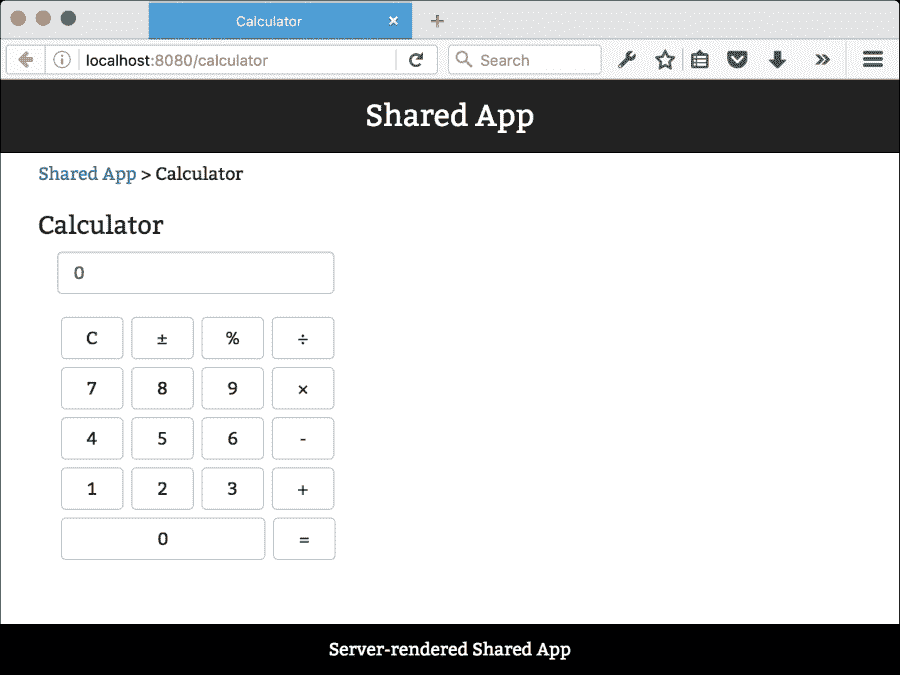

# 第八章。将你的应用部署到云上

在本章中，我们将为我们的应用创建一个生产级管道。这包括将你的配置文件分为开发和生产版本，以及创建一个为 Node.js 服务器准备好的实例。首先，我们将查看如何设置来自第一章的 Browserify 脚手架的生产级部署，即*深入 React*，然后我们将查看如何使用 Webpack 进行相同的操作。

使用云服务器是部署代码最经济的方式。在云服务成为可行的选择之前，你通常会不得不将代码部署到位于单个数据中心中的物理服务器。如果你要将代码部署到多个数据中心，你需要购买或租赁更多的物理服务器，这通常需要相当大的成本。

云服务改变了这一点，因为现在你可以将你的代码部署到全球拥有数据中心的所有云服务提供商。在美国、欧洲和亚洲部署你的应用的成本通常相同，而且相对便宜。

这些是我们将详细讨论的主题：

+   选择云服务提供商

+   为云服务准备 Browserify 应用

+   为云服务准备 Webpack 应用

# 选择云服务提供商

可供选择的大量云服务提供商中，最受欢迎和成熟的提供商包括**Heroku**、**Microsoft Azure**、**Amazon**、**Google App Engine**和**Digital Ocean**。它们各自都有其优点和缺点，因此在决定选择哪一个之前，调查每一个都是值得的。

在这本书中，我们一直使用 Heroku 来部署我们的应用，我们将设置我们的部署以针对这个平台。让我们简要地看看使用 Heroku 的优点和缺点。

优点如下：

+   易于使用。在初始注册后，你通常只需要发出一个单一的 Git push 来部署你的代码。

+   当你的应用流量增加时，易于扩展。

+   为第三方应用和云服务提供出色的插件支持。

+   提供免费的基本层。

+   没有基础设施管理。

现在，缺点如下：

+   可能会变得昂贵。Heroku 提供了慷慨的免费层，但价格阶梯的第一步相当陡峭。

+   供应商锁定问题；从 Heroku 迁移到另一个云服务提供商需要大量工作。

+   基本层曾满足了一段时间，但最近，Heroku 增加了一项政策，即免费实例每 24 小时必须保持 6 小时不活跃。

+   环境会不定期被清除。你无法登录实例并对环境进行本地更改，因为下一次实例刷新时它们将消失。

由于 Heroku 相对容易上手，我们将使用 Heroku 进行部署。

首先在 [`signup.heroku.com/`](https://signup.heroku.com/) 注册一个免费账户。完成此操作后，从 [`toolbelt.heroku.com/`](https://toolbelt.heroku.com/) 下载 Heroku 工具包。你还需要上传你的 SSH 密钥。如果你需要生成 SSH 密钥的帮助，请访问 [`devcenter.heroku.com/articles/keys`](https://devcenter.heroku.com/articles/keys)。

设置完成后，你可以在终端中输入以下命令来创建 Heroku 应用程序：

```js
heroku create <name>

```

你可以省略名称，在这种情况下，Heroku 将为你提供一个随机的名称。请注意，Heroku 需要 Git。如果你已经有了 Git 仓库，Heroku 将自动将配置参数添加到你的 `.git/config` 文件中。如果没有，你稍后必须手动完成。参数看起来像这样：

```js
[remote "heroku"]
  url = https://git.heroku.com/*<name>*.git
  fetch = +refs/heads/*:refs/remotes/heroku/*
```

你可以在 `.git` 文件夹（注意点号）内找到配置文件。文件名为 `config`，所以完整路径是 `.git/config`。

要部署你的应用程序，将文件添加到你的仓库并提交你的更改。然后，执行以下命令：

```js
git push heroku master

```

然后，你的应用程序将基于主分支进行部署。你可以通过输入 `git push heroku yourbranch:master` 来部署其他分支。

# 使用 npm 设置云部署

如果我们立即尝试发布我们的脚手架，我们可能会遇到错误，因为我们没有告诉 Heroku 如何为我们提供应用程序。Heroku 将简单地尝试使用 `npm start` 运行应用程序。

`npm` 包是 Node.js 的基础。我们在前面的章节中简要介绍了它，但鉴于我们现在将严重依赖它，现在是时候更仔细地看看它能为你们做什么了。

你可能听说过或甚至使用过像 **Grunt**、**Gulp** 或 **Broccoli** 这样的任务运行器。它们擅长自动化任务，这样你就可以专注于编写代码，而不是执行重复性任务，例如压缩和打包你的代码、复制和连接样式表等。

然而，对于大多数任务，你最好让 `npm` 为你完成工作。使用 `npm` 脚本，你将拥有自动化常见任务所需的所有功能，而且开销和维护成本更低。

`npm` 包包含一些内置命令，其中之一是 `npm run-script`（简称 `npm run`）。此命令从 `package.json` 中提取脚本对象。传递给 `npm run` 的第一个参数指的是脚本对象中的一个属性。对于你自己创建的任何属性，你需要使用 `npm run` 来运行它们。一些属性名称已被保留，例如 `start`、`stop`、`restart`、`install`、`publish`、`test` 等。它们可以通过简单地执行 `npm start` 等命令来调用。

### 注意

有一点需要注意，如果定义了 `prefoo` 和 `postfoo`，则 `npm run foo` 也会运行它们。你可以通过执行 `npm run prefoo` 或 `postfoo` 来单独运行每个阶段。

执行 `npm run` 命令以查看可用的脚本；你将看到以下输出：

```js
Lifecycle scripts included in webpack-scaffold:
 test
 echo "Error: no test specified" && exit 1
 start
 node server.js

```

这很有趣。我们还没有创建一个启动脚本，但 `npm run` 告诉我们 `npm start` 将运行 `node server.js`。这是 node 的另一个默认设置。如果你没有指定启动脚本，并且根目录中有一个 `server.js` 文件，那么它将被执行。

Heroku 仍然不会运行脚手架，因为 express 服务器配置为使用 Webpack 和热重载启动开发会话。你需要创建一个生产服务器，除了你的开发服务器之外。

你可以通过两种方式之一来处理这个问题：

+   一个选择是在你的服务器代码中引入 `environment` 标志，例如这样：

    ```js
    if(process.env.NODE_ENV !== "development"){
      // production server code
    }
    ```

+   另一个选择是创建一个独立的 `server` 生产文件

两种方法都很好，但使用单独的文件可能更干净，所以我们选择这种方法。

# 准备你的 Browserify 应用以进行云部署

在本节中，我们将使用我们在 第二章 中开发的商店应用，*创建一个网络商店*。该应用使用 Browserify 打包代码并使用 node 运行开发服务器。我们将继续在生产中使用 node，但我们需要设置一个特定的 `server` 文件，以便制作一个生产就绪的应用。

提醒一下，这是我们开始之前商店应用的样子：

```js
├── package.json
├── public
│   ├── app.css
│   ├── bundle.js
│   ├── heroku.js
│   ├── index.html
│   └── products.json
├── server.js
└── source
    ├── actions
    │   ├── cart.js
    │   ├── customer.js
    │   └── products.js
    ├── app.jsx
    ├── components
    │   ├── customerdata.jsx
    │   ├── footer.jsx
    │   └── menu.jsx
    ├── layout.jsx
    ├── pages
    │   ├── checkout.jsx
    │   ├── company.jsx
    │   ├── home.jsx
    │   ├── item.jsx
    │   ├── products.jsx
    │   └── receipt.jsx
    ├── routes.jsx
    └── stores
        ├── cart.js
        ├── customer.js
        └── products.js
```

我们将采取以下步骤使其准备好云部署：

+   创建生产服务器文件

+   安装生产依赖项

+   修改 `package.json`

+   将我们的代码库转换为 EcmaScript 5

## 实际的过程

创建一个名为 `server.prod.js` 的新文件，并将其放在项目的根目录下。将以下代码添加到其中：

```js
var express = require("express");
var app = express();
var port = process.env.PORT || 8080;
var host = process.env.HOST || '0.0.0.0';
```

我们正在定义一个 express 服务器并设置主机和 `port` 变量。默认情况下，在 `0.0.0.0` 上为端口 `8080`。当在本地机器上运行时，这个主机地址在功能上与 localhost 相同，但在服务器上运行时可能会有所不同。如果服务器主机有多个 IP 地址，将 `0.0.0.0` 作为主机将匹配任何请求。使用如 localhost 这样的参数可能会导致服务器无法绑定你的应用并失败启动：

```js
var path = require("path");
var compression = require("compression");
app.use(compression());
```

由于我们将向公众提供文件，因此在提供服务之前用 **GZIP** 压缩它们是值得的。对于文本和脚本文件，节省的量可能非常显著，在许多情况下可达 80-90%。对于流量较低的网站，这种实现已经足够好。对于流量较高的网站，在反向代理级别实现压缩是最佳方式，例如，通过使用 **nginx**。我们将路由所有请求到我们的 `public` 文件夹和所需的文件名：

```js
app.get("*", function (req, res) {
  var file = path.join(__dirname, "public", req.path);
  res.sendFile(file);
});
```

最后，服务器将以调试信息启动，告诉我们已部署应用的地址：

```js
app.listen(port, host, function (err) {
  console.log('Server started on http://'+host+':'+port)
});
```

下一步我们需要做的是创建一个`build`脚本来打包我们的 JavaScript 代码。在运行开发服务器时，代码会自动打包。这个包通常相当大。例如，商店应用的开发包是 1.4 MB。即使启用了压缩，这个文件也可能太大，不适合向用户展示。当部署到生产环境时，我们需要创建一个更小的包，以便您的应用可以更快地下载并准备好使用。幸运的是，这相当简单。

我们将使用 Browserify 和 UglifyJS 的 CLI 版本组合。后者是一个压缩工具，它会删除换行符、缩短变量名，并从我们的包中删除未使用的代码。我们将首先使用 Browserify 打包源文件，然后使用管道运算符（`|`）将输出发送到 UglifyJS。此操作的输出结果然后通过大于运算符（`>`）发送到一个`bundle`文件。

序列的第一部分如下：

```js
./node_modules/.bin/browserify --extension=.jsx source/app.jsx -t [ babelify ]

```

当您运行此命令时，整个包将以字符串形式输出。您可以可选地指定`-o bundle.js`以将结果保存到包文件中。我们不希望这样做，因为我们不需要临时包。

序列的第二部分如下：

```js
./node_modules/.bin/uglifyjs -p 5 -c drop_console=true -m --max-line-len --inline-script

```

我们已经指定了一些参数，让我们看看它们的作用。

`-p`参数跳过源文件名中出现的原始文件名前缀。这里的节省非常小，但仍然值得保留。参数后面的数字是删除的相对路径数。

`-c`选项代表压缩器。如果不指定任何压缩器选项，将使用默认的压缩选项。这可以节省很多字节。

接下来是`drop_console=true`。这告诉 UglifyJS 删除任何控制台日志。如果您在调试应用时使用了这种方法，并且忘记从代码中删除它，这将很有用。

下一个是`-m`，代表混淆。此选项更改并缩短了您的变量和函数名，并且是一个重要的字节节省因素。

最后两个参数不会节省任何字节，但它们仍然很有用。`--max-line-len`参数会在行长度超过给定值时（默认为 32,000 个字符）拆分丑化后的代码。当支持无法处理非常长行的旧浏览器时，这很有用。`--inline-script`参数会转义字符串中`</script`出现的斜杠。

仅运行此命令本身不会生成压缩包，因为我们没有指定输入。如果您将包存储在临时文件中，可以使用小于运算符和文件名（如：`< bundle.js`）将内容发送到前面的命令。

最后，我们将使用大于运算符将结果发送到我们想要的输出位置。

完整的命令序列如下：

```js
NODE_ENV=production browserify --extension=.jsx source/app.jsx -t [ babelify ] | ./node_modules/.bin/uglifyjs  -p 5 -c drop_console=true -m --max-line-len --inline-script > public/bundle.js

```

运行第一部分的结果是一个大约 1.4 MB 的包大小。通过 UglifyJS 处理后，包大小约为 548 KB。如果你去掉选项并使用纯 UglifyJS，最终的包大小大约为 871 KB。

在打包和压缩之后，我们现在可以准备好将我们的应用到云端部署。由于我们使用了压缩，最终的包大小大约为 130 KB。与原始文件大小 1.4 MB 相比，这是一个巨大的胜利。

在我们部署代码之前，我们需要告诉 Heroku 如何启动我们的应用。我们将通过添加一个名为 `Procfile` 的单个文件来完成这项工作。这是一个特殊的文件，如果存在，Heroku 将会读取并执行它。如果不存在，Heroku 将尝试执行 `npm start`；如果失败，则尝试运行 `node server.js`。

添加包含以下内容的 `Procfile` 文件：

```js
web: node server.prod.js
```

完成这些后，提交你的代码并通过执行此命令将代码推送到 Heroku：

```js
git push heroku master

```

最终结果应该与本地应用看起来完全相同，但现在你是在云端运行它。示例应用可在 [`reactjsblueprints-webshop.herokuapp.com/`](https://reactjsblueprints-webshop.herokuapp.com/) 找到。以下截图显示了上述链接的网页：



记住生成压缩后的 Browserify 包的整个命令序列非常困难。我们将将其添加到 `package.json` 中，以便我们可以轻松执行。

打开 `package.json` 并将 `scripts` 部分的内文替换为以下代码：

```js
"scripts": {
  "bundle": "browserify --extension=.jsx source/app.jsx -t [ babelify ] | ./node_modules/.bin/uglifyjs  -p 5 -c drop_console=true -m --max-line-len --inline-script > public/bundle.js",
  "start": "node server.js"
},
```

现在你可以使用 `npm run bundle` 来运行打包操作。

# 将 Webpack 应用部署到云端

在本节中，我们将使用我们在 第六章 中开发的 Webpack 框架，*高级 React*。我们需要添加一些包并做一些修改。

作为提醒，这是我们开始之前的项目文件结构：

```js
├── assets
│   ├── app.css
│   ├── favicon.ico
│   └── index.html
├── package.json
├── server.js
├── source
│   └── index.jsx
└── webpack.config.js
```

让我们先把我们名为 `server.js` 的文件重命名为 `server-development.js`。然后，在项目根目录中创建一个名为 `server-production.js` 的新文件，并添加以下代码：

```js
'use strict';

var path = require('path');
var express = require('express');
var serveStatic = require('serve-static')
var compression = require('compression')
var port = process.env.PORT || 8080;
var host = process.env.HOST || '0.0.0.0';
```

在这里，我们指示服务器使用预配置的 `PORT` 和 `HOST` 变量或默认变量，就像我们在 Browserify 服务器中所做的那样。然后，我们添加了一个错误处理器，以便我们能够优雅地响应错误。这也可以添加到 Browserify 服务器中：

```js
var http = require('http');
var errorHandler = require('express-error-handler');
```

我们还添加了压缩：

```js
var app = express();
app.use(compression());
```

现在我们转向 `assets` 文件：

```js
var cpFile = require('cp-file');
cpFile('assets/index.prod.html', 'public/assets/index.html').then(function() {
  console.log('Copied index.html');
});
cpFile('assets/app.css', 'public/assets/app.css').then(function() {
  console.log('Copied app.css');
});
```

我们将手动复制所需的 `asset` 文件。我们只有两个文件，所以手动操作是可以接受的。如果我们有很多文件要复制，另一种方法可能更有效。一个在不同环境中都兼容的选项是 **ShellJS**。使用这个扩展，你可以在 JavaScript 环境中设置普通 `shell` 命令并执行它们。我们在这个项目中不会这样做，但值得一看。现在参考以下代码行：

```js
var envs = require('envs');
app.set('environment', envs('NODE_ENV', 'production')); 
app.use(serveStatic(path.join(__dirname, 'public', 'assets')));
```

在这里，我们将 `environment` 设置为 `production`，并让 Express 知道我们的静态文件放置在 `./public/assets` 文件夹中，使用 `serve-static` 中间件。这意味着我们可以在文件中引用 `/app.css`，Express 将知道在正确的 `assets` 文件夹中查找它。对于低流量应用，这是一个好的实现，但对于高流量应用，最好使用反向代理来提供静态文件。使用反向代理的主要好处是减轻动态服务器上的负载，将其转移到专门设计来处理资产的其它服务器。我们路由所有请求到 `index.html`。这不会应用于存在于 `static` 文件夹中的文件：

```js
var routes = function (app) {
  app.get('*', function(req, res) {
    res.sendFile(path.join(__dirname, 'public', 'assets','index.html'));
  });
}
```

我们创建 `server` 对象以便将其传递给错误处理器：

```js
var router = express.Router();
routes(router);
app.use(router);

Var server = http.createServer(app);
```

在这里，我们响应错误并条件性地关闭服务器。`server` 对象作为参数传递，以便错误处理器可以优雅地关闭它：

```js
app.use(function (err, req, res, next) {
  console.log(err);
  next(err);
});

app.use( errorHandler({server: server}) );
```

最后，我们启动应用：

```js
app.listen(port, host, function() {
  console.log('Server started at http://'+host+':'+port);
});
```

正如您所注意到的，我们添加了一些新的包。使用以下命令安装这些包：

```js
npm install --save compression@1.6.1 envs@0.1.6 express-error-handler@1.0.1 serve-static@1.10.2 cp-file@3.1.0 rimraf@2.5.1

```

所有在 `server.prod.js` 中需要的模块都需要移动到 `package.json` 的 `dependencies` 部分中。您的依赖部分现在应该看起来像这样：

```js
"devDependencies": {
  "react-transform-catch-errors": "¹.0.1",
  "react-transform-hmr": "¹.0.1",
  "redbox-react": "¹.2.0",
  "webpack-dev-middleware": "¹.4.0",
  "webpack-hot-middleware": "².6.0",
  "babel-core": "⁶.3.26",
  "babel-loader": "⁶.2.0",
  "babel-plugin-react-transform": "².0.0",
  "babel-preset-es2015": "⁶.3.13",
  "babel-preset-react": "⁶.3.13",
  "babelify": "⁷.3.0",
  "uglifyjs": "².4.10",
  "webpack": "¹.12.9",
  "rimraf": "².5.1",
  "react": "¹⁵.1.0",
  "react-dom": "¹⁵.1.0"
},
"dependencies": {
  "compression": "¹.6.1",
  "cp-file": "³.1.0",
  "envs": "⁰.1.6",
  "express": "⁴.13.3",
  "express-error-handler": "¹.0.1",
  "path": "⁰.12.7",
  "serve-static": "¹.10.2"
}
```

Heroku 需要的所有依赖项都必须放在正常的 `dependencies` 部分中，因为 Heroku 会省略 `devDependencies` 中的所有包。

### 小贴士

**云部署的依赖策略**

由于从 `npm` 下载和安装包相当慢，将仅在开发时需要的包放在 `devDependencies` 中，反之亦然，是一种良好的实践。我们在整本书中都这样做，所以希望您已经遵循了这种模式。

我们几乎完成了，但在我们准备好之前，我们需要创建 `webpack.config.js`、`index.html` 的生产版本，并添加构建脚本。

将现有的 `webpack.config.js` 文件重命名为 `Webpack-development.config.js`，然后创建一个名为 `Webpack-production.config.js` 的文件。注意，这意味着您需要将 `server-development.js` 中的 Webpack 导入更改为反映这一更改。

添加以下代码：

```js
'use strict';

var path = require('path');
var webpack = require('webpack');

module.exports = {
  entry: [
    './source/index'
  ],
  output: {
    path: path.join(__dirname, 'public', 'assets'),
    filename: 'bundle.js',
    publicPath: '/assets/'
  },
  plugins: [
    new webpack.optimize.OccurenceOrderPlugin(),
```

此插件重新排序包，以便最常用的包放在顶部。这应该会减小文件大小并使包更高效。我们指定这是一个生产构建，以便 Webpack 利用它拥有的最节省字节的算法：

```js
    new webpack.DefinePlugin({
      'process.env': {
        'NODE_ENV': JSON.stringify('production')
      }
    }),
```

我们还将告诉它使用 UglifyJS 压缩我们的代码：

```js
    new webpack.optimize.UglifyJsPlugin({
      compressor: {
        warnings: false
      }
    })
```

从 Webpack 的 `production` 配置中，我们移除了热加载插件，因为它仅在开发时才有意义：

```js
  ],
  module: {
    loaders: [{
      tests: /\.js?$/,
      loaders: ['babel'],
      include: path.join(__dirname, 'source')
    }]
  },
  resolve: {
    extensions: ['', '.js', '.jsx']
  }
};
```

接下来，将一个名为 `index-production.html` 的文件添加到 `assets` 目录中，并添加以下代码：

```js
<!DOCTYPE html>
<html>
  <head>
    <title>ReactJS + Webpack Scaffold</title>
    <meta charset="utf-8">
    <meta http-equiv="X-UA-Compatible" content="IE=edge">
    <meta name="viewport" content="width=device-width, 
    initial-scale=1">
    <link rel="stylesheet" href="/app.css">
  </head>
  <body>
    <div id="app"></div>
    <script src="img/bundle.js"></script>
  </body>
</html>
```

最后，将这些脚本添加到 `package.json` 中：

```js
"scripts": {
  "test": "echo \"Error: no test specified\" && exit 1",
  "prestart": "npm run build",
  "start": "node server-production.js",
  "dev": "node server-development.js",
  "prebuild": "rimraf public",
  "build": "NODE_ENV=production webpack --config Webpack-production.config.js",
  "predeploy": "npm run build",
  "deploy": "echo Ready to deploy. Commit your changes and run git push heroku master"
},
```

这些脚本让您可以构建和部署您的应用。我们暂时没有提交更改，以便让您知道部署过程已准备就绪。

注意，在构建参数中，我们添加了 `NODE_ENV=production` 以防止 Babel 在构建代码时尝试使用 `hot` 模块替换。控制此功能的配置在 `.babelrc` 文件中。

你的 Webpack 框架现在已准备好用于生产！

在开发时，执行 `npm run dev` 并享受一个具有热重载的流畅开发环境。

在 `npm deploy` 上，构建脚本将被执行，并会通知你何时准备好发布更改。你需要通过 `git add` 和 `git commit` 手动添加更改，然后运行 `git push heroku master`。当然，你可以在部署脚本中自动化这一过程。

构建脚本也可以通过执行 `npm run build` 来触发。在构建脚本之前，我们将首先执行 `rimraf public`。**Rimraf** 是一个环境安全的命令，用于删除 `public` 文件夹及其所有内容。它在 Mac/Linux 上等同于运行 `rm -rf public`。此命令在 Windows 上不存在，因此在那个平台上运行 `rm` 不会起作用，但运行 `rimraf` 将在任一平台上起作用。最后，脚本执行 `webpack` 并构建一个生产包，该包放在 `public/assets/bundle.js` 中。

通常情况下，Webpack 在移除未使用代码方面略有效率，因此最终生成的包大小将小于 Browserify 生成的包。本例中生成的包大约为 132 KB。

### 注意

注意，这并不是一个完全公平的比较，因为我们捆绑在 Browserify 部分的应用程序要大得多。

最终结果可在[`reactjsblueprints-wpdeploy.herokuapp.com/`](https://reactjsblueprints-wpdeploy.herokuapp.com/)找到。


为了参考，我们的文件结构现在看起来是这样的：

```js
├── .babelrc
├── assets
│   ├── app.css
│   ├── favicon.ico
│   ├── index.html
│   └── index-production.html
├── package.json
├── server-development.js
├── server-production.js
├── source
│   └── index.jsx
├── Webpack-development.config.js
└── Webpack-production.config.js
```

这仍然相当易于管理。诚然，在 `prod` 和 `dev` 中分离文件需要更多的人工干预，但与在文件内部使用 `if…else` 循环切换代码相比，这可能是更好的选择。然而，代码组织确实是一个棘手的问题，没有一种通用的设置能令每个人都满意。对于仅涉及几个文件的少量修改，`if…else` 语句可能更适合在生产版本和开发版本中分割文件。

# 摘要

在本章中，我们将云部署添加到了本书中开发的所有两个框架中。两个示例的预览现在可在网上找到。

生成可云部署的应用程序通常意味着尽可能紧密地捆绑我们的代码。随着 HTTP/2 时代的到来，这种策略可能需要重新审视，因为生成一组可以并行下载的文件可能更有益，而不是单个捆绑包，无论它有多小。值得注意的是，非常小的文件从 *gzip* 中获益不大。

使用 Webpack 也可以分割你的代码包。有关 Webpack 代码分割的更多信息，请参阅[`webpack.github.io/docs/code-splitting.html`](https://webpack.github.io/docs/code-splitting.html)。

在下一章中，我们将基于本章中刚刚制作的生成式 Webpack 配置，开发一个流式服务器渲染的应用程序。
