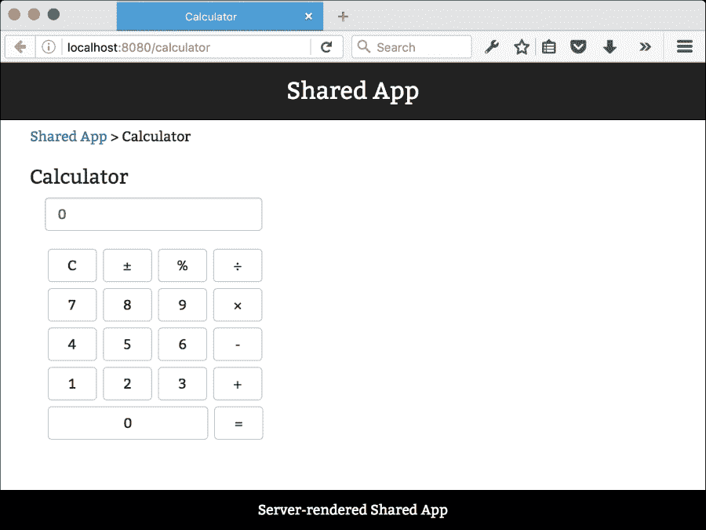
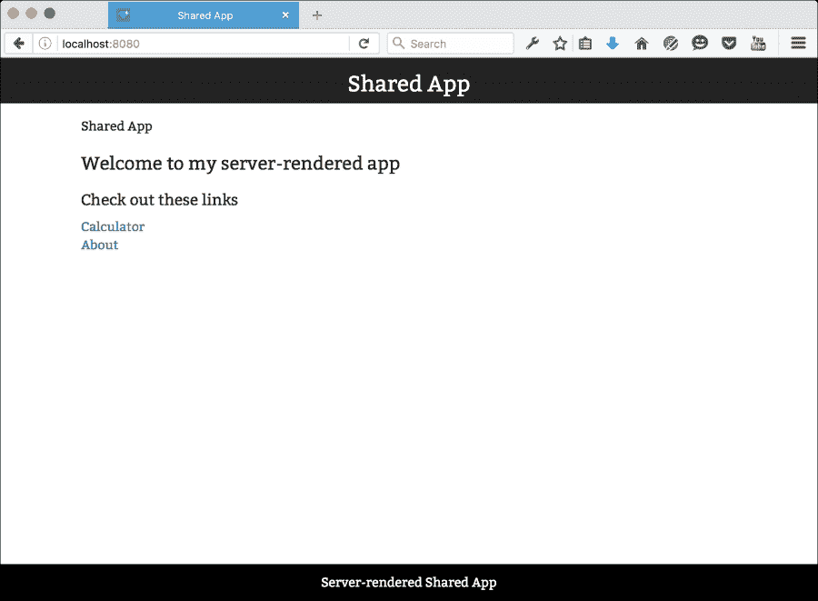
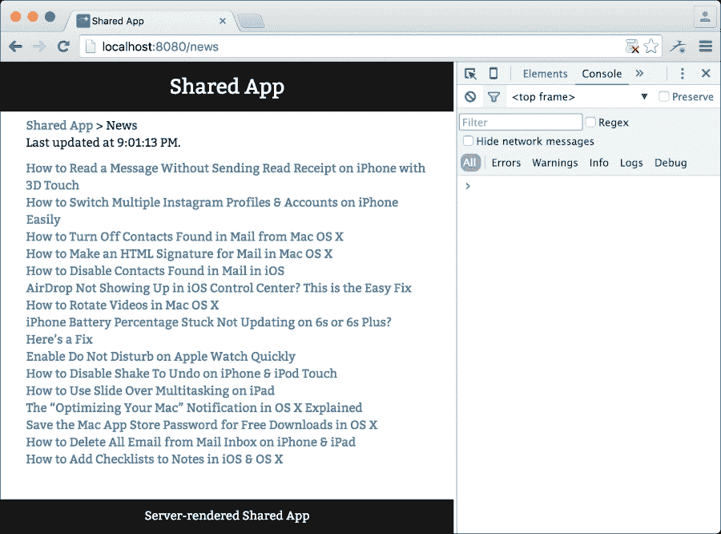

# 第九章。创建共享应用

同构应用是可以在客户端和服务器端运行的 JavaScript 应用程序。其理念是后端和前端应该尽可能共享代码。对于服务器渲染的应用，您也可以在不等待 JavaScript 代码初始化的情况下提前展示内容。

本章分为两个部分：

+   在第一部分，我们将扩展我们在 第八章 中创建的设置，即 *将您的应用部署到云端*，以便它支持组件的预渲染

+   在第二部分，我们将添加 Redux 并从服务器环境中填充您的应用数据

简而言之，以下是我们将要涉及的主题：

+   服务器渲染与客户端渲染

+   术语混淆

+   修改设置以启用服务器渲染

+   流式传输您的预渲染组件

+   将服务器渲染的应用部署到云端

# 服务器渲染与客户端渲染

Node.js 使得在您的后端和前端编写 JavaScript 变得非常容易。我们一直在编写服务器代码，但直到现在，我们的所有应用都是客户端渲染的。

将您的应用作为客户端渲染的应用渲染意味着捆绑您的 JavaScript 文件，并将其与您的图像、CSS 和 HTML 文件一起分发。它可以在任何操作系统上运行的任何类型的 Web 服务器上分发。

客户端渲染的应用通常分为两个步骤：

1.  初始请求加载 `index.html` 以及 CSS 和 JavaScript 文件，要么同步要么异步。

1.  通常，应用随后会发出另一个请求，并根据服务器响应生成适当的 HTML。

对于服务器渲染的应用，第二步通常被省略。初始请求一次性加载 `index.html`、CSS、JavaScript 和内容。应用在内存中，准备提供服务，无需等待客户端解析和执行 JavaScript。

你有时会听到这样的论点，即服务器渲染的应用对于服务于那些设备上没有 JavaScript 或简单地将它关闭的用户是必要的。这不是一个有效的论点，因为我知道的所有调查和统计数据都将用户数量估计在约 1% 左右。

另一个论点是支持搜索引擎机器人，它们通常在解析基于 JavaScript 的内容时遇到困难。这个论点稍微更有道理，但像 Google 和 Bing 这样的主要玩家能够做到这一点，尽管您可能需要添加一个元标签，以便内容可以被索引。

### 注意

**验证机器人是否可以读取您的网站**

您可以使用 Google 的 **Fetch as Googlebot** 工具来验证您的内容是否被正确索引。该工具可在 [`www.google.com/webmasters/tools/googlebot-fetch`](https://www.google.com/webmasters/tools/googlebot-fetch) 获取。或者，您可以参考 [`www.browseo.net/`](http://www.browseo.net/)。

服务器渲染应用的优点如下：

+   拥有慢速计算机的用户不需要等待 JavaScript 代码解析。

+   它还为我们提供了可预测的性能。当你控制渲染过程时，你可以测量加载你的网页所需的时间。

+   不需要用户在他们的设备上安装 JavaScript 运行时。

+   使搜索引擎更容易爬取你的页面。

客户端渲染应用程序的好处如下：

+   需要处理的设置更少

+   服务器和客户端之间没有并发问题

+   通常更容易开发

制作一个服务器端渲染的应用程序比编写客户端渲染的应用程序更复杂，但它带来了实际的好处。我们首先将我们的脚手架准备好以适应云端，然后再添加服务器渲染功能。首先，我们需要澄清术语，因为在实际应用中，你会遇到几个不同的术语来描述服务器和客户端之间共享代码的应用程序。

# 术语混淆

术语**同构**由希腊语单词*isos*（意为“相等”）和*morph*（意为“形状”）组成。这个想法是通过使用同构这个术语，可以很容易地理解这是服务器和客户端之间共享的代码。

在数学中，同构是两个集合之间的一对一映射函数，它保留了集合之间的关系。

例如，一个同构的代码示例可能看起来像这样：

```js
// Module A
function foo(x, y) {
  return x * y;
} 

// Module B
function bar(y, x) {
  return y * x;
}

foo(10, 20) // 200
bar(20, 10) // 200
```

这两个函数不相同，但它们产生相同的结果，因此在乘法中是同构的。

在数学中，同构可能是一个好术语，但显然它并不适合开发 Web 应用程序。我们在这里使用这个术语作为本章的标题，因为它是 JavaScript 社区中目前公认的用于服务器端渲染应用程序的术语。然而，它并不是一个非常好的术语，我们正在寻找一个更好的术语。

在寻找替代品的过程中，术语**通用**已成为许多人的选择。然而，这并不完全理想。一方面，它很容易被误解。与 Web 应用程序相关的通用最接近的定义是：被所有人使用或理解。记住，目标是描述代码共享。但是，通用也可以被理解为描述可以在任何地方运行的 JavaScript 应用程序的术语。这包括不仅限于 Web，还包括原生设备和操作系统。这种混淆在 Web 开发领域普遍存在。

第三个术语是**共享**，即共享 JavaScript。这更合适，因为它暗示了你的代码有一定的意义。当你编写共享 JavaScript 时，意味着你编写的代码打算在多个环境中使用。

在网上搜索代码时，你会发现所有这些术语被交替使用来描述相同的开发 Web 应用的模式。正确的命名很重要，因为它使你的代码对外部观众更容易理解。流行词汇听起来不错，听起来很好听，但使用的流行词汇越多，你的代码库理解起来就越困难。

在本章中，我们将使用“服务器端渲染”一词来表示在将其提供给用户之前渲染 HTML 的代码。我们将使用“客户端渲染”一词来表示将 HTML 的渲染推迟到用户设备的代码。最后，我们将使用“共享代码”一词来描述在服务器和客户端都可以互换使用的代码。

# 开发服务器端渲染应用

在 ReactJS 中开发共享应用比仅仅构建客户端渲染应用需要更多的工作。它还要求你考虑你的数据流需求。

ReactJS 中编写服务器端渲染应用有两个组成部分，可以将其视为一个等式：

*在服务器实例中预渲染组件 + 从服务器到组件的单向数据流 = 好的应用程序和快乐的用户*

在本节中，我们将查看等式的第一部分。我们将在本章的最后部分解决数据流问题。

## 添加包

我们需要从 `npm` 获取更多包以将它们添加到依赖项部分。这是我们需要的依赖项列表：

```js
"devDependencies": {
  "react-transform-catch-errors": "¹.0.1",
  "react-transform-hmr": "¹.0.1",
  "redbox-react": "¹.2.0",
  "webpack-dev-middleware": "¹.4.0",
  "webpack-hot-middleware": "².6.0",
  "babel-cli": "⁶.4.5",
  "babel-core": "⁶.3.26",
  "babel-loader": "⁶.2.0",
  "babel-plugin-react-transform": "².0.0",
  "babel-preset-es2015": "⁶.3.13",
  "babel-preset-react": "⁶.3.13",
  "compression": "¹.6.1",
  "cp-file": "³.1.0",
  "cross-env": "¹.0.7",
  "exenv": "¹.2.0",
  "webpack": "¹.12.9"
},
"dependencies": {
  "express": "⁴.13.3",
  "express-error-handler": "¹.0.1",
  "path": "⁰.12.7",
  "react": "¹⁵.1.0",
  "react-bootstrap": "⁰.29.4",
  "react-breadcrumbs": "¹.3.5",
  "react-dom": "¹⁵.1.0",
  "react-dom-stream": "⁰.5.1",
  "react-router": "².4.1",
  "rimraf": "².5.1",
  "serve-static": "¹.11.0"
}
```

将任何缺少的包添加到 `package.json` 并通过执行 `npm install` 来更新它。

## 添加 CSS

我们需要为我们的页面添加样式，所以我们将使用我们在 第七章 开发 **Reactagram** 时使用的子集，*Reactagram*。将 `assets/app.css` 的内容替换为以下内容：

```js
body { font-family: 'Bitter', serif; padding: 15px;
  margin-top: 50px; padding-bottom: 50px }

.header {  padding: 10px; font-size: 18px; margin: 5px; }

footer{ position:fixed; bottom:0; background: black; width:100%;
  padding:10px; color:white; left:0; text-align:center; }

h1 { font-size: 24px; }

h2 { font-size: 20px; }

h3 { font-size: 17px; }

ul { padding:0; list-style-type: none; }

.nav a:visited, .nav a:link { color: #999; }

.nav a:hover { color: #fff; text-decoration: none; }

.logo { padding-top: 16px; margin: 0 auto; text-align: center; }

#calculator{ min-width:240px; }

.calc { margin:3px; width:50px; }

.calc.wide { width:163px; }

.calcInput { width: 221px; }
```

## 将 Bootstrap CDN 添加到 index.html

由于我们添加了 `react-bootstrap`，因此我们需要添加 Bootstrap CDN 文件。打开 `assets/index.html` 并将其替换为以下内容：

```js
<!DOCTYPE html>
<html>
  <head>
    <title>Shared App</title>
    <meta charset="utf-8">
    <meta http-equiv="X-UA-Compatible" content="IE=edge">
    <meta name="viewport" content="width=device-width, 
    initial-scale=1, maximum-scale=1, user-scalable=no">
    <link async rel="stylesheet" type="text/css"
    href="//maxcdn.bootstrapcdn.com/font-awesome/4.5.0/css/font-awesome.min.css">
    <link async rel="stylesheet" type="text/css" href="https://maxcdn.bootstrapcdn.com/bootstrap/3.3.5/css/bootstrap.min.css" />
    <link async href='https://fonts.googleapis.com/css?family=Bitter'
      rel='stylesheet' type='text/css'>
    <link async rel="stylesheet" href="/app.css">
    <link rel="stylesheet" href="/app.css">
  </head>
  <body>
    <div id="app"></div>
    <script src="img/bundle.js"></script>
  </body>
</html>
```

## 创建组件

我们不能没有一些内容就制作应用程序，所以让我们添加一些页面和路由层次结构。首先，从 `source` 文件夹中删除 `index.jsx`，从 `assets` 文件夹中删除 `index-production.html`。完成这一部分章节后，树结构将如下所示：

```js
├── .babelrc
├── assets
│   ├── app.css
│   ├── favicon.ico
│   └── index.html
├── config.js
├── package.json
├── server-development.js
├── server-production.es6
├── server-production.js
├── source
│   ├── client
│   │   └── index.jsx
│   ├── routes
│   │   └── index.jsx
│   ├── server
│   │   └── index.js
│   └── shared
│       ├── components
│       │   ├── back.jsx
│       │   └── fontawesome.jsx
│       ├── settings.js
│       └── views
│           ├── about.jsx
│           ├── app.jsx
│           ├── calculator.jsx
│           ├── error.jsx
│           └── layout.jsx
├── Webpack-development.config.js
└── Webpack-production.config.js
```

我们需要勤奋地构建我们的应用程序，以便使其易于理解，并注意到客户端和服务器端渲染如何相互配合。

让我们先添加 `client/index.jsx` 的源代码：

```js
import React from 'react';
import { render } from 'react-dom';
import { Router, browserHistory } from 'react-router';
import { routes } from '../routes';

render(
  <Router routes={routes} history={ browserHistory } />,
  document.getElementById('app')
);
```

到目前为止，代码结构应该非常熟悉。

让我们添加我们的路由。创建 `routes/index.jsx` 并添加以下代码：

```js
'use strict';

import React from 'react';

import { Router, Route, IndexRoute }
  from 'react-router'
import App from '../shared/views/app';
import Error from '../shared/views/error';
import Layout from '../shared/views/layout';
import About from '../shared/views/about';
import Calculator from '../shared/views/calculator';

const routes= <Route path="/" name="Shared App" component={Layout} >
  <Route name="About" path="about" component={About} />
  <Route name="Calculator" path="calculator"
    component={Calculator} />
  <IndexRoute name="Welcome" component={App} />
  <Route path="*" name="Error" component={Error} />
</Route>

export { routes };
```

路由将响应 `/`、`/about` 和 `/calculator`，其他所有内容都将路由到 `error` 组件。如果你访问应用程序而没有指定路由（例如，`http://localhost:8080` 没有结束斜杠），`IndexRoute` 函数将应用程序路由到 `Welcome` 组件。

路由被分配到我们将要创建的几个基本视图。

创建 `shared/views/layout.jsx` 并添加以下代码：

```js
import React from 'react'
import { Grid, Row, Col, Nav, Navbar } from 'react-bootstrap';
import Breadcrumbs from 'react-breadcrumbs';
import Settings from '../settings';
export default class Layout extends React.Component {
  render() {
    return (
      <Grid>
        <Navbar componentClass="header"
          fixedTop inverse>
          <h1 center style={{color:"#fff"}} className="logo">
            {Settings.title}
```

我们将从 `Settings` 组件中获取标题。以下组件将创建一个你可以用作导航元素的链接路径：

```js
          </h1>
          <Nav role="navigation" eventKey={0}
          pullRight>
          </Nav>
        </Navbar>
        <Breadcrumbs {...this.props} setDocumentTitle={true} />
```

参数 `setDocumentTitle` 是一个将使组件更改窗口标签页的文档标题为你在的 `child` 组件名称的参数，让我们放置以下代码：

```js
        {this.props.children}
        <footer>
          Server-rendered Shared App
        </footer>
      </Grid>
    )
  }
}
```

创建 `shared/views/app.jsx` 并添加以下代码：

```js
'use strict';
import React from 'react'
import { Row, Col } from 'react-bootstrap';

import { Link } from 'react-router'

export default class Index extends React.Component {
  render() {
    return (
      <Row>
        <Col md={6}>
          <h2>Welcome to my server-rendered app</h2>
          <h3>Check out these links</h3>
          <ul>
            <li><Link to="/calculator">Calculator</Link></li>
            <li><Link to="/about">About</Link></li>
          </ul>
        </Col>
      </Row>
    )
  }
}
```

此组件创建了一个包含两个链接的简单列表。第一个链接到 `About` 组件，第二个链接到 `Calculator` 组件。

创建 `shared/views/error.jsx` 并添加以下代码：

```js
'use strict';
import React from 'react'
import { Grid, Row, Col } from 'react-bootstrap';

export default class Error extends React.Component {
  render() {
    return (
      <Grid>
        <Row>
          <Col md={6}>
            <h1>Error!</h1>
          </Col>
        </Row>

      {this.props.children}
      </Grid>
    )
  }
}
```

如果你在浏览器的 URL 定位器中手动输入错误路径，此组件将显示出来。

创建 `shared/views/about.jsx` 并添加以下代码：

```js
'use strict';
import React from 'react'
import { Row, Col } from 'react-bootstrap';

export default class About extends React.Component {
  render() {
    return (
      <Row>
        <Col md={6}>
          <h2>About</h2>
          <p>
            This app is designed to work as either a client- or
            a server-rendered app. It's also designed to be 
            deployed to the cloud.
          </p>
        </Col>
      </Row>
    )
  }
}
```

`About` 组件是我们应用中的一个简单占位符组件。你可以用它来展示一些关于你应用的信息。

创建 `shared/views/calculator.jsx` 并添加以下代码：

```js
'use strict';
import React from 'react'
import { Row, Col, Button, Input, FormGroup, FormControl, InputGroup } from 'react-bootstrap';

export default class Calculator extends React.Component {
  constructor() {
    super();
    this.state={};
    this.state._input=0;
    this.state.__prev=0;
    this.state._toZero=false;
    this.state._symbol=null;
  }
```

当使用 ES6 类时，`getInitialState` 元素已被弃用，因此我们需要在构造函数中设置初始状态。我们可以通过首先将一个空的 `state` 变量附加到 `this` 上来完成此操作。然后，我们添加三个状态：`_input` 是计算器输入文本框，`_prev` 用于保存要计算的数字，`_toZero` 是一个在计算时用于将输入置零的标志，`_symbol` 是数学运算符号（加、减、除和乘），让我们看看以下代码：

```js
  handlePercentage(){
    this.setState({_input:this.state._input/100, _toZero:true})
  }

  handleClear(){
      this.setState({_input:"0"})
  }

  handlePlusMinus(e){
        this.setState({_input:this.state._input>0 ?
         -this.state._input:Math.abs(this.state._input)});
  }
```

这三个函数直接修改输入的数字。让我们继续到下一个函数：

```js
  handleCalculate(e) {
    const value = this.refs.calcInput.props.value;
    if(this.state._symbol) {
      switch(this.state._symbol) {
        case "+":
          this.setState({_input:(Number(this.state._prev)||0)
          +Number(value),_symbol:null});
        break;
        case "-":
          this.setState({_input:(Number(this.state._prev)||0)
            -Number(value),_symbol:null});
        break;
        case "/":
          this.setState({_input:(Number(this.state._prev)||0)
            /Number(value),_symbol:null});
        break;
        case "*":
          this.setState({_input:(Number(this.state._prev)||0)
            *Number(value),_symbol:null});
        break;
      }
    }
  }
```

当你按下 **计算** 按钮（**=**）时，此函数会被调用。它将检查用户是否激活了数学符号，如果是，它将检查哪个符号是激活的，并在存储的数字和当前数字上执行计算，让我们看看以下代码片段：

```js
  handleClick(e) {
    let input=Number(this.state._input)||"";
    if(this.state._toZero) {
      this.setState({_toZero: false});
      input="";
    }
```

如果输入的数字需要变为零，这个操作将完成这个任务并重置 `_toZero` 标志。现在我们转到 `isNaN`：

```js
    if(isNaN(e.target.value)) {
      this.setState({_toZero:true,
        _prev:this.state._input,
        _symbol:e.target.value
      })
```

使用 `isNaN` 是检查变量是否为数字的高效方法。如果不是，它是一个数学符号，我们通过将符号存储在状态中，要求输入的数字变为零（这样我们不会计算错误的数字），并将当前输入设置为 `_prev` 值（用于计算），让我们看看以下代码片段：

```js
    } else {
      this.setState({_input:input+e.target.value})
```

如果它是一个数字，我们将其添加到 `_input` 状态中，让我们看看以下代码片段：

```js
    }
  }

  handleChange(e) {
    this.setState({_input:e.target.value})
  }

  calc() {
    return (
      <div id="calculator">
        <Col md={12}>
          <FormGroup>
            <InputGroup className="calcInput" >
              <FormControl 
                ref="calcInput" 
                onChange={ this.handleChange.bind(this) }
                value={this.state._input}
              type="text" />
            </InputGroup>
          </FormGroup>
          <Input type="text" className="calcInput"
            ref="calcInput" defaultValue="0"
            onChange={this.handleChange.bind(this)}
             value={this.state._input}/>
```

当使用 `React.createClass` 时，所有函数都会自动绑定到组件上。由于我们正在使用 ES6 类，我们需要手动绑定我们的函数，让我们看看以下代码片段：

```js
          <Button className="calc"
            onClick={this.handleClear.bind(this)}>C</Button>
          <Button className="calc"
            onClick={this.handlePlusMinus.bind(this)}>
            {String.fromCharCode(177)}</Button>
          <Button className="calc"
            onClick={this.handlePercentage.bind(this)}>%</Button>
          <Button className="calc" value="/"
            onClick={this.handleClick.bind(this)}>
            {String.fromCharCode(247)}</Button>
```

一些字符在标准键盘上难以定位。相反，我们可以使用 Unicode 字符代码来渲染它。字符代码及其相应图像的列表在互联网上很容易找到，让我们看看以下代码片段：

```js
          <br/>
          <Button className="calc" value="7"
            onClick={this.handleClick.bind(this)}>7</Button>
          <Button className="calc" value="8"
            onClick={this.handleClick.bind(this)}>8</Button>
          <Button className="calc" value="9"
            onClick={this.handleClick.bind(this)}>9</Button>
          <Button className="calc" value="*"
            onClick={this.handleClick.bind(this)}>
            {String.fromCharCode(215)}</Button>
          <br/>
          <Button className="calc" value="4"
            onClick={this.handleClick.bind(this)}>4</Button>
          <Button className="calc" value="5"
            onClick={this.handleClick.bind(this)}>5</Button>
          <Button className="calc" value="6"
            onClick={this.handleClick.bind(this)}>6</Button>
          <Button className="calc" value="-"
            onClick={this.handleClick.bind(this)}>-</Button>
          <br/>
          <Button className="calc" value="1"
            onClick={this.handleClick.bind(this)}>1</Button>
          <Button className="calc" value="2"
            onClick={this.handleClick.bind(this)}>2</Button>
          <Button className="calc" value="3"
            onClick={this.handleClick.bind(this)}>3</Button>
          <Button className="calc" value="+"
            onClick={this.handleClick.bind(this)}>+</Button>
          <br/>
          <Button className="calc wide" value="0"
            onClick={this.handleClick.bind(this)}>0</Button>
          <Button className="calc"
            onClick={this.handleCalculate.bind(this)}>=</Button>
        </Col>
      </div>
    )
  }

  render() {
    return (
      <Row>
        <Col md={12}>
          <h2>Calculator</h2>
          {this.calc()}
        </Col>
      </Row>
    )
  }
}
```

以下截图显示了刚刚创建的 **计算器** 页面：



接下来，添加两个文件：`config.js` 到 `root` 文件夹，`settings.js` 到 `source/shared`。

将此代码添加到 `config.js`：

```js
'use strict';
const config = {
  home: __dirname
};
module.exports = config;
```

然后，将此代码添加到 `settings.js`：

```js
'use strict';
import config from '../../config.js';

const settings = Object.assign({}, config, {
  title: 'Shared App'
});
module.exports = settings;
```

## 设置服务器端渲染的 Express React 服务器

我们现在已经完成了共享组件的制作，所以现在是时候设置服务器端渲染了。在前面的文件结构中，你可能已经注意到我们添加了一个名为 `server-production.es6` 的文件。我们将保留普通的 ES5 版本，但为了简化我们的代码，我们将使用现代 JavaScript 编写它，并使用 Babel 将其转换为 ES5。

使用 Babel 是我们不得不忍受的事情，直到 node 实现对 ES6/ECMAScript 2015 的完全支持。我们可以选择使用 `babel-node` 来运行我们的 express 服务器，但在生产环境中不建议这样做，因为它会给每个请求增加显著的开销。

让我们看看它应该是什么样子。创建 `server-production.es6` 并添加以下代码：

```js
'use strict';

import path from 'path';
import express from 'express';
import compression from 'compression';
import cpFile from 'cp-file';
import errorHandler from 'express-error-handler';
import envs from 'envs';
import React from 'react';
import ReactDOM from 'react-dom';
import { Router, match, RoutingContext } from 'react-router';
import { routes } from './build/routes';
```

我们将在 Express 服务器中使用客户端路由。我们将设置一个通配符 Express 路由，并在其中实现 react-router 路由，让我们看看以下代码片段：

```js
import settings from './build/shared/settings';
import ReactDOMStream from 'react-dom-stream/server';
```

我们还将实现一个流式 DOM 工具，而不是使用 React 自身的 `renderToString`。`renderToString` 方法是同步的，在 React 网站的服务器端渲染中可能会成为性能瓶颈。流使这个过程变得更快，因为您在发送之前不需要预先渲染整个字符串。对于较大的页面，`renderToString` 可能会引入数百毫秒的延迟，并需要更多的内存，因为它需要为整个字符串分配内存。

`ReactDOMStream` 异步渲染到流中，并允许在响应完全完成之前，浏览器先渲染页面。请参考以下代码：

```js
import serveStatic from 'serve-static';

const port = process.env.PORT || 8080;
const host = process.env.HOST || '0.0.0.0';
const app = express();
const http = require('http');
app.set('environment', envs('NODE_ENV', process.env.NODE_ENV || 'production')); 
app.set('port', port);
app.use(compression());

cpFile('assets/app.css', 'public/assets/app.css').then(function() {
  console.log('Copied app.css');
});
app.use(serveStatic(path.join(__dirname, 'public', 'assets')));

const appRoutes = (app) => {
  app.get('*', (req, res) => {
    match({ routes, location: req.url },
    (err, redirectLocation, props) => {
      if (err) {
        res.status(500).send(err.message);
      }
      else if (redirectLocation) {
        res.redirect(302,
        redirectLocation.pathname + redirectLocation.search);
```

在进行服务器端渲染时，我们需要为错误发送 500 响应，为重定向发送 302 响应。我们可以通过匹配和检查响应状态来实现这一点。如果没有错误，我们继续进行渲染，让我们看看以下代码片段：

```js
      } else if (props) {
        res.write(`<!DOCTYPE html>
          <html>
            <head>
              <meta charSet="utf-8" />
                <meta httpEquiv="X-UA-Compatible"
                  content="IE=edge" />
                  <meta name="viewport" content="width=device-width,
                  initial-scale=1, maximum-scale=1, user-scalable=no"/>
                  <link rel="preload" as="stylesheet" type="text/css"
                  href="//maxcdn.bootstrapcdn.com/font-awesome/4.5.0/css/font-awesome.min.css"/>
                  <link rel="preload" as="stylesheet" type="text/css"
                  href="https://maxcdn.bootstrapcdn.com/bootstrap/3.3.5/css/bootstrap.min.css" />
                  <link rel="preload" as="stylesheet" href='https://fonts.googleapis.com/css?family=Bitter' type='text/css'/>
                  <link rel="preload" as="stylesheet" href="/app.css" />
                  <title>${settings.title}</title>
            </head>
        <body><div id="app">`);
      const stream = ReactDOMStream.renderToString(
        React.createElement(RoutingContext, props));
      stream.pipe(res, {end: false});
      stream.on("end", ()=> {
        res.write(`</div><script
          src="img/bundle.js"></script></body></html>`);
        res.end();
       });''
      }
      else {
        res.sendStatus(404);
```

最后，如果我们找不到任何属性或路由，我们需要发送一个 `404` 状态码，让我们看看剩余的代码：

```js
      }
    });
  });
}
```

当服务器开始渲染时，它将首先写入我们的头部信息。它将异步加载初始 CSS 文件，设置标题和主体，以及第一个 div。然后，我们切换到 `ReactDOMStream`，它将从 `RoutingContext` 开始渲染我们的应用。当流完成时，我们通过包裹我们的 `div` 和 HTML 页面来关闭响应。服务器渲染的内容现在位于 `<div id="app"></div>` 内。当 `bundle.js` 被加载时，它将接管并替换这个 `div` 的内容，除非渲染的设备不支持 JavaScript。

注意，尽管 CSS 文件是异步的，但它们仍然会在加载之前阻塞渲染。可以通过内联 CSS 来绕过这个问题，让我们看看以下代码片段：

```js
const router = express.Router();
appRoutes(router);
app.use(router);

const server = http.createServer(app);
app.use((err, req, res, next) => {
  console.log(err);
  next(err);
});
app.use( errorHandler({server: server}) );

app.listen(port, host, () => {
  console.log('Server started for '+settings.title+' at http://'+host+':'+port);
});
```

最后的部分与之前相同，只是修改为使用新的 JavaScript 语法。你注意到的一件事是我们从名为 `build` 的新文件夹中导入源组件，而不是 `source`。在开发时，我们可以通过在运行时使用 Babel 将源代码转换为 ES5 来避免这个问题；然而，在生产环境中这不可行。相反，我们需要手动将整个源代码转换为 ES5。

首先，让我们在 `webpack.config.dev.js` 中更改两行，并验证它是否在本地构建。

打开文件，将入口处的行 `./source/index` 替换为 `./source/client/index`，并将路径 `path.join(__dirname, 'public', 'assets')` 替换为 `path.join(__dirname, 'assets')`。然后，通过执行 `npm run dev` 来运行项目。

以下截图显示了应用的主页：



你的应用现在应该没有问题地运行，并且 `http://localhost:8080` 应该现在显示 **共享应用** 屏幕。你应该能够编辑 `source` 文件夹中的代码，并看到它在屏幕上实时更新。你也应该能够点击链接并使用计算器执行数学运算。

## 设置 Webpack 用于服务器渲染

打开 `Webpack-production.config.js` 并将其内容替换为以下内容：

```js
'use strict';

var path = require('path');
var webpack = require('webpack');

module.exports = {
  entry: [
    './build/client/index'
  ],
  output: {
    path: path.join(__dirname, 'public', 'assets'),
    filename: 'bundle.js',
    publicPath: '/assets/'
  },
  plugins: [
    new webpack.optimize.OccurenceOrderPlugin(),
    new webpack.DefinePlugin({
      'process.env': {
        'NODE_ENV': JSON.stringify('production')
      }
    }),
    new webpack.optimize.UglifyJsPlugin({
      compressor: {
        warnings: false
      }
    })
  ]
};
```

我们不会依赖 Babel 在运行时转换我们的代码，因此我们可以删除 `module` 和 `resolve` 部分。

## 设置用于服务器渲染的 npm 脚本

打开 `package.json` 并将 `scripts` 部分替换为以下内容：

```js
"scripts": {
  "test": "echo \"Error: no test specified\"",
  "convert": "babel server-production.es6 > server-production.js",
  "prestart": "npm run build",
  "start": "npm run convert",
  "poststart": "cross-env NODE_ENV=production node server-production.js",
  "dev": "cross-env NODE_ENV=development node server-development.js",
  "prebuild": "rimraf public && rimraf build && NODE_ENV=production babel source/ --out-dir build",
  "build": "cross-env NODE_ENV=production webpack --progress --config Webpack-production.config.js",
  "predeploy": "npm run build",
  "deploy": "npm run convert",
  "postdeploy": "echo Ready to deploy. Commit your changes and run git push heroku master"
},
```

这里是一个运行 `npm start` 命令会执行的操作：

1.  运行构建（在它开始之前）。

1.  删除 `public` 和 `build` 文件夹，并将 ES2015 源代码转换为 ES5，然后放入 `builder` 文件夹（预构建过程）。

1.  运行 Webpack 并在 `public/assets` 中创建一个 *bundle*（构建过程）。

1.  运行转换，目的是将 `server-production.es6` 转换为 `server-production.js`（当它启动时）。

1.  运行 Express 服务器（在它启动之后）。

呼呼！这是一个庞大的命令链。编译完成后，服务器启动，你可以访问 `http://localhost:8080` 来测试你的预渲染服务器。你一开始可能甚至不会注意到任何区别，但尝试在浏览器中关闭 JavaScript 并执行刷新操作。页面仍然会加载，你仍然可以导航。然而，计算器将无法工作，因为它需要客户端 JavaScript 才能运行。正如之前所述，目标不是支持无 JavaScript 的浏览器（因为它们很少见）。目标是提供预渲染的页面，这正是它所做到的。

我们还更改了 `npm deploy`。这是它所做的工作：

1.  在部署之前运行构建。

1.  运行 convert，将 `server-production.es6` 转换为 `server-production.js`（一旦部署）。

1.  它会通知你已完成。这一步可以被替换为将其部署到云端（在部署后）。

### 注意

服务器端渲染的应用现在已经完成。你可以在 [`reactjsblueprints-srvdeploy.herokuapp.com/`](https://reactjsblueprints-srvdeploy.herokuapp.com/) 找到演示。

# 将 Redux 添加到你的服务器端渲染应用中

最后一部分是处理数据流。在客户端渲染的应用中，数据流通常是这样处理的：用户通过访问应用的主页来启动一个动作。然后应用路由到视图，渲染过程开始。在渲染后或渲染期间（异步），数据被获取并显示给用户。

在服务器端渲染的应用中，需要在渲染过程开始之前预先获取数据。获取数据的责任从客户端转移到服务器。这需要我们对如何构建我们的应用进行彻底的重新思考。在开始设计你的应用之前做出这个决定是很重要的，因为在你开始实现应用之后改变你的数据流架构是一项成本高昂的操作。

## 添加包

我们需要向我们的项目中添加许多新包。`package.json` 文件现在应该看起来像这样：

```js
"babel-polyfill": "⁶.3.14",
"body-parser": "¹.14.2",
"isomorphic-fetch": "².2.1",
"react-redux": "⁴.2.1",
"redux": "³.2.1",
"redux-logger": "².5.0",
"redux-thunk": "¹.0.3",
```

我们将执行类似于第六章中所述的异构获取，因此我们需要添加 `isomorphic-fetch` 库。这个库将 `fetch` 添加为一个全局函数，使其 API 在客户端和服务器之间保持一致。

我们还将添加 Redux 和一个控制台记录器，而不是我们在第六章中使用的 devtools 记录器。

## 添加文件

我们将向我们的项目中添加许多新文件，并更改一些现有文件。我们将实现的功能是从一个离线新闻 API 异步获取一组新闻条目，该 API 位于 [`reactjsblueprints-newsapi.herokuapp.com/stories`](http://reactjsblueprints-newsapi.herokuapp.com/stories)。它提供了一系列定期更新的新闻故事。

我们将从 `client/index.jsx` 开始。打开这个文件，并用以下代码替换其内容：

```js
'use strict';

import 'babel-polyfill'
import React from 'react';
import ReactDOM from 'react-dom';
import { Router, browserHistory } from 'react-router';
import { Provider } from 'react-redux';
import { routes } from '../routes';
import configureStore from '../shared/store/configureStore';

const initialState = window.__INITIAL_STATE__;
const store = configureStore(initialState);

ReactDOM.render(
  <Provider store={store}>
    <Router routes={routes} history={ browserHistory } />
  </Provider>,
  document.getElementById('app')
)
```

在这里，我们添加 `polyfill` 和与 第六章 中相同的 `Redux` 设置，*高级 React*。我们还添加了对 `window.__INITIAL_STATE__` 的检查，这是我们如何将服务器渲染的内容传输到我们的应用程序。

接下来，打开 `routes/index.jsx` 并用以下代码替换其内容：

```js
import React from 'react';

import { Router, Route, IndexRoute } from 'react-router'
import App from '../shared/views/app';
import Error from '../shared/views/error';
import Layout from '../shared/views/layout';
import About from '../shared/views/about';
import Calculator from '../shared/views/calculator';
import News from '../shared/views/news';
import { connect } from 'react-redux';
import { fetchPostsIfNeeded } from '../shared/actions';
import { bindActionCreators } from 'redux';

function mapStateToProps(state) {
  return {
    receivePosts: {
      posts: ('posts' in state) ? state.posts : [],
      isFetching: ('isFetching' in state)
        ? state.isFetching : true,
      lastUpdated: ('lastUpdated' in state)
        ? state.lastUpdated : null
    }
  }
}

function mapFncsToProps(dispatch) {
  return { fetchPostsIfNeeded, dispatch }
}
```

这些函数负责将状态和函数传递给我们的 `child` 组件。我们将使用它们将新闻故事传递给 `News` 组件以及 `dispatch` 和 `fetchPostsIfNeeded` 函数。接下来，在 `shared` 中添加一个新的文件夹，命名为 `actions`：

```js
const routes= <Route path="/"
  name="Shared App" component={ Layout } >
  <Route name="About"
    path="about" component={ About } />
  <Route name="Calculator"
    path="calculator" component={ Calculator } />
  <Route name="News" path="news" component={
    connect(mapStateToProps, mapFncsToProps)(News) } />
  <IndexRoute name="Welcome" component={ App } />
  <Route path="*" name="Error" component={ Error } />
</Route>
export { routes };
```

在这个文件夹中，添加一个名为 `index.js` 的文件，并添加以下代码：

```js
'use strict';

import { fetchPostsAsync } from '../api/fetch-posts';

export const RECEIVE_POSTS = 'RECEIVE_POSTS';

export function fetchPostsIfNeeded() {
  return (dispatch, getState) => {
    if(getState().receivePosts && getState().receivePosts.length {
      let json=(getState().receivePosts.posts);
      return dispatch(receivePosts(json));
    }
    else return dispatch(fetchPosts());
  }
}
```

这个函数将检查存储的状态是否存在并且有内容；如果没有，它将调用 `fetchPosts()` 的调用。这将确保我们能够利用服务器渲染的状态，并在客户端没有这样的状态时获取内容。参考以下代码中的下一个函数：

```js
export function fetchPosts() {
  return dispatch => {
    return fetchPostsAsync(json =>  dispatch(receivePosts(json)));
  }
}
```

这个函数从我们的 API 文件中返回一个 `fetch` 操作。它调用 `receivePosts()` 函数，这是 Redux 函数，告诉 Redux 存储调用 `RECEIVE_POSTS` 减法器函数。让我们看看下面的代码片段：

```js
export function receivePosts(json) {
  const posts = {
    type: RECEIVE_POSTS,
    posts: json,
    lastUpdated: Date.now()
  };

  return posts;
}
```

下一个我们将添加的文件是 `fetch-posts.js`。在 `shared` 中创建一个名为 `api` 的文件夹，然后添加文件，并添加以下代码：

```js
'use strict';
import fetch from 'isomorphic-fetch'

export function fetchPostsAsync(callback) {
  return fetch(`https://reactjsblueprints-newsapi.herokuapp.com/stories`)
    .then(response => response.json())
    .then(data => callback(data))
}
```

这个函数简单地使用 fetch API 返回一组故事。

接下来，在 `shared` 中添加一个名为 `reducers` 的文件夹，然后添加 `index.js` 文件，并添加以下代码：

```js
'use strict';
import {
  RECEIVE_POSTS
} from '../actions'

function receivePosts(state = { }, action) {
  switch (action.type) {
    case RECEIVE_POSTS:
      return Object.assign({}, state, {
        isFetching: false,
        posts: action.posts,
        lastUpdated: action.lastUpdated
      })
    default:
      return state
  }
}

export default receivePosts;
```

我们的减法器获取新的状态，并返回一个新的对象，其中包含我们获取的帖子集合。

接下来，在 `shared` 中创建一个名为 `store` 的文件夹，添加一个文件并命名为 `configure-store.js`，然后添加以下内容：

```js
import { createStore, applyMiddleware } from 'redux'
import thunkMiddleware from 'redux-thunk'
import createLogger from 'redux-logger'
import rootReducer from '../reducers'

export default function configureStore(initialState) {
  const store = createStore(
    rootReducer,
    initialState,
    applyMiddleware(thunkMiddleware, createLogger())
  )

  return store
}
```

我们创建一个函数，它接受 `initialState` 并返回一个包含我们的减法器和添加异步操作和日志中间件的存储。日志显示在浏览器控制台窗口中的日志数据。

最后两个文件应该放在 `views` 文件夹中。第一个是 `news.jsx`。为此，添加以下代码：

```js
'use strict';

import React, { Component, PropTypes } from 'react'
import { connect } from 'react-redux'
import Posts from './posts';

class App extends Component {
  constructor(props) {
    super(props)
    this.state={};
    this.state._activePost=-1;
  }
```

我们通过将 `_activePost` 设置为 `-1` 来初始化状态。这将防止在用户有时间点击任何帖子之前，组件显示任何帖子的正文。参考以下内容：

```js
  componentDidMount() {
    const { fetchPostsIfNeeded, dispatch } = this.props
    dispatch(fetchPostsIfNeeded())
  }

  handleClickCallback(i) {
    this.setState({_activePost:i});
  }
```

这是 `posts.jsx` 中的回调处理函数。当用户点击新闻标题时，将设置一个新的状态，包含新闻项的 ID，让我们看看下面的代码片段：

```js
  render() {
    const { posts, isFetching, lastUpdated } =
    this.props.receivePosts
    const { _activePost } = this.state;
    return (
      <div>
        <p>
          {lastUpdated &&
            <span>
              Last updated at {new Date(lastUpdated)
              .toLocaleTimeString()}.
            </span>
          }
        </p>
        {posts && isFetching && posts.length === 0 &&
          <h2>Loading...</h2>
        }
        {posts && !isFetching && posts.length === 0 &&
          <h2>Empty.</h2>
        }
        {posts && posts.length > 0 &&
          <div style={{ opacity: isFetching ? 0.5 : 1 }}>
            <Posts posts={posts} activePost={_activePost} 
              onClickHandler={this.handleClickCallback.bind(this)} />
          </div>
        }
```

`Posts` 组件将获得一组帖子、一个活动帖子和一个 `onClick` 处理器。`onClick` 处理器需要绑定 `App` 上下文，否则它将无法使用内部方法，例如 `setState`。如果我们不绑定它，`setState` 将应用于 `Posts` 组件的上下文，让我们看看下面的代码片段：

```js
      </div>
    )
  }
}

App.propTypes = {
  receivePosts: React.PropTypes.shape({
    posts: PropTypes.array.isRequired,
    isFetching: PropTypes.bool.isRequired,
    lastUpdated: PropTypes.number
  }),
  dispatch: PropTypes.func.isRequired,
  fetchPostsIfNeeded: PropTypes.func.isRequired
}
```

我们将使用`propTypes`，这样 React 开发者工具就可以告诉我们是否有任何传入的 props 缺失或类型错误：

```js
function mapStateToProps(state) {
  return {
    receivePosts: {
      posts: ('posts' in state) ?  state.posts : [],
      isFetching: ('isFetching' in state) ?
        state.isFetching : true,
      lastUpdated: ('lastUpdated' in state) ?
        state.lastUpdated : null
    }
  }
}
```

我们导出应用状态，以便当前导入的组件可以使用：

```js
export default connect(mapStateToProps)(App)
```

我们添加到`views`的第二个文件是`posts.jsx`：

```js
'use strict';
import React, { PropTypes, Component } from 'react'

export default class Posts extends Component {
  render() {
    function createmarkup(html) { return {__html: html}; };
    return (
      <ul>
        {this.props.posts.map((post, i) =>
        <li key={i}>
          <a onClick={this.props.onClickHandler.bind(this,i)}> 
          {post.title}</a>
            {this.props.activePost===i ?
            <div style={{marginBottom: 15}}
              dangerouslySetInnerHTML= {createmarkup(post.body)} />:
            <div/>
          }
```

RSS 正文自带 HTML。我们必须明确允许渲染此 HTML，否则 ReactJS 将转义内容。当用户点击标题时，`posts.jsx`中的回调将执行`handleClickCallback`。它将在`news.jsx`中设置一个新的状态，并将此状态作为 prop 传递给`posts.jsx`，表示应该显示此标题的内容，让我们看看以下代码片段：

```js
        </li>
        )}
      </ul>
    )
  }
}

Posts.propTypes = {
  posts: PropTypes.array.isRequired,
  activePost: PropTypes.number.isRequired
}
```

我们还需要在`app.jsx`文件中添加新闻项目的链接。打开文件并添加以下行：

```js
<li><Link to="/news">News</Link></li>
```

通过这些更改，您就可以运行您的应用了。使用`npm run dev`启动它。您应该能够访问`http://localhost:8080`上的首页，并点击新闻链接。它应该显示**加载中**，直到从服务器获取内容。以下是一个说明这一点的截图：



截图显示，即使在浏览器中阻止了 JavaScript，新闻数据也被加载并显示。

## 添加服务器端渲染

现在我们已经很接近了，但在完成之前我们还需要做一些工作。我们需要在我们的 Express 服务器中添加数据获取。让我们打开`server-production.es6`并添加必要的代码以预取数据。

在文件顶部添加以下导入：

```js
import { Provider } from 'react-redux'
import configureStore from './build/shared/store/configure-store'
import { fetchPostsAsync } from './build/shared/api/fetch-posts'
```

然后，将`const approutes`替换为以下代码：

```js
const appRoutes = (app) => {
  app.get('*', (req, res) => {
    match({ routes, location: req.url },
    (err, redirectLocation, props) => {
      if (err) {
        res.status(500).send(err.message);
      }
      else if (redirectLocation) {
        res.redirect(302, redirectLocation.pathname +
          redirectLocation.search);
      }
      else if (props) {

      fetchPostsAsync(posts => {
        const isFetching = false;
        const lastUpdated = Date.now()
        const initialState = {
          posts,
          isFetching,
          lastUpdated
        }

        const store = configureStore(initialState)
```

在这里，我们启动了`fetchPostsAsync`函数。当我们收到结果时，我们使用新闻项目创建一个初始状态，然后使用这个状态创建一个新的 Redux 存储实例，让我们看看以下代码片段：

```js
        res.write(`<!DOCTYPE html>
          <html>
            <head>
              <meta charSet="utf-8" />
              <meta httpEquiv="X-UA-Compatible" content="IE=edge" />
              <meta name="viewport" content="width=device-width,
                initial-scale=1, maximum-scale=1, user-scalable=no"/>
              <link async rel="stylesheet" type="text/css"
                href="//maxcdn.bootstrapcdn.com/font-awesome/4.5.0/css/font-awesome.min.css"/>
              <link async rel="stylesheet" type="text/css" 
                href="https://maxcdn.bootstrapcdn.com/bootstrap/3.3.5/css/bootstrap.min.css" />
              <link async href='https://fonts.googleapis.com/css?family=Bitter'
              rel='stylesheet' type='text/css'/>
              <link async rel="stylesheet" href="/app.css" />
                <title>${settings.title}</title>
            </head>
            <script>
              window.__INITIAL_STATE__ = 
              ${JSON.stringify(initialState)}
            </script>
```

我们将初始状态添加到全局 window 中，这样我们就可以在`client/index.jsx`中获取它，让我们看看剩余的代码：

```js
            <body><div id="app">`);
            const stream = ReactDOMStream.renderToString(
            <Provider store={store}>
            <RoutingContext {...props} />
            </Provider>);
            stream.pipe(res, {end: false});
            stream.on("end", ()=> {
            res.write(`</div><script src="img/bundle.js"></script></body></html>`);
              res.end();
            });''
          })
        } else {
        res.sendStatus(404);
      }
    });
  });
}
```

预取数据所需的所有内容就是这些。现在您应该能够执行`npm start`，然后打开`http://localhost:8080`。尝试在浏览器中关闭 JavaScript，您仍然可以导航并查看新闻列表中的项目。

您还可以创建一个新的 Heroku 实例，运行`npm deploy`，然后推送它。

### 注意

您可以在网上查看一个演示[`reactjsblueprints-shared.herokuapp.com`](https://reactjsblueprints-shared.herokuapp.com)。

## 执行更快的云部署

当您现在推送到 Heroku 时，会发生的情况是 Heroku 将执行`npm start`，启动整个构建过程。这是有问题的，因为如果构建过程耗时过长或资源需求过高，它将失败。

您可以通过将`build`文件夹提交到您的仓库，然后在推送时简单地执行`node server-production.js`来防止这种情况。您可以通过向仓库添加一个特殊的启动文件`Procfile`来实现这一点。在项目根目录中创建此文件，并添加以下行：

```js
web: NODE_ENV=production node server-production.js
```

### 注意

注意，这个文件是针对 Heroku 的。其他云服务提供商可能有一个不同的系统来指定启动程序。

# 最终结构

这就是我们的最终应用程序结构看起来像什么（不包括`build`文件夹，它基本上与`source`文件夹相同）：

```js
├── .babelrc
├── Procfile
├── assets
│   ├── app.css
│   ├── favicon.ico
│   └── index.html
├── config.js
├── package.json
├── server-development.js
├── server-production.es6
├── server-production.js
├── source
│   ├── client
│   │   └── index.jsx
│   ├── routes
│   │   └── index.jsx
│   └── shared
│       ├── actions
│       │   └── index.js
│       ├── api
│       │   └── fetch-posts.js
│       ├── reducers
│       │   └── index.js
│       ├── settings.js
│       ├── store
│       │   └── configure-store.js
│       └── views
│           ├── about.jsx
│           ├── app.jsx
│           ├── calculator.jsx
│           ├── error.jsx
│           ├── layout.jsx
│           ├── news.jsx
│           └── posts.jsx
├── Webpack-development.config.js
└── Webpack-production.config.js
```

服务器结构基本上保持不变，`source`文件夹是唯一一个不断增长的文件夹。这正是它应该的样子。

在开发应用程序时，值得查看结构。它提供了一个宏观视角，可以帮助你发现命名和其他结构问题的不一致性。例如，组件`layout.jsx`真的属于视图吗？`posts.jsx`又如何？它是一个视图组件，但可以争论说它是`news.jsx`的辅助工具，可能属于其他地方。

# 摘要

在本章中，我们修改了我们的 Webpack 脚手架以启用云部署。在章节的第二部分，我们添加了服务器渲染，在第三部分，我们添加了 Redux 和数据的异步预取。

通过这三个项目，你应该能够制作出任何类型的应用程序，无论大小。然而，正如你可能已经注意到的，编写支持服务器渲染的应用程序需要相当多的思考和规划。随着应用程序规模的增加，推理组织和数据获取策略变得更加困难。你将能够使用这种策略制作出非常高效的应用程序，但我建议你花时间思考如何构建你的应用程序。

本章的演示可在[`reactjsblueprints-srvdeploy.herokuapp.com/`](https://reactjsblueprints-srvdeploy.herokuapp.com/)和[`reactjsblueprints-shared.herokuapp.com`](https://reactjsblueprints-shared.herokuapp.com)找到。第一个链接展示了添加服务器渲染后的应用程序状态。第二个链接展示了最终的应用程序，我们在服务器端获取数据并在向用户渲染应用程序之前填充 Redux 存储。

在下一章中，我们将使用 ReactJS 创建一个游戏。我们将使用 HTML5 canvas 技术，并添加 Flowtype 进行静态类型检查。
