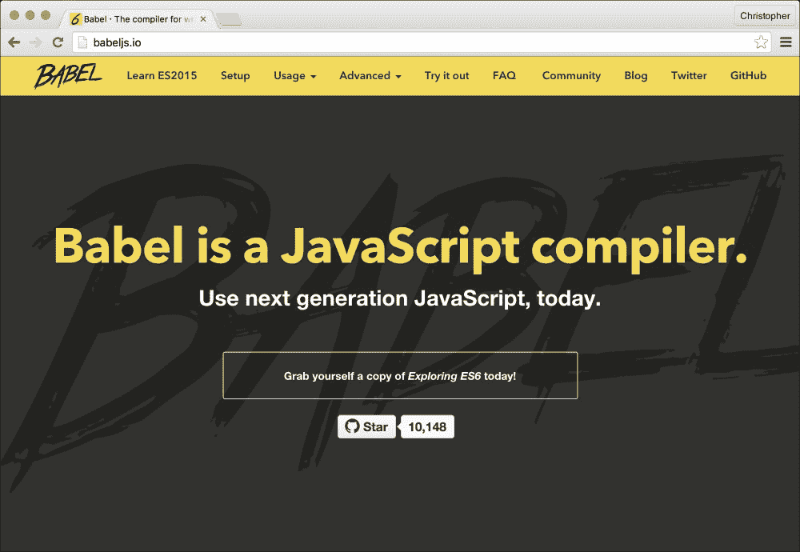
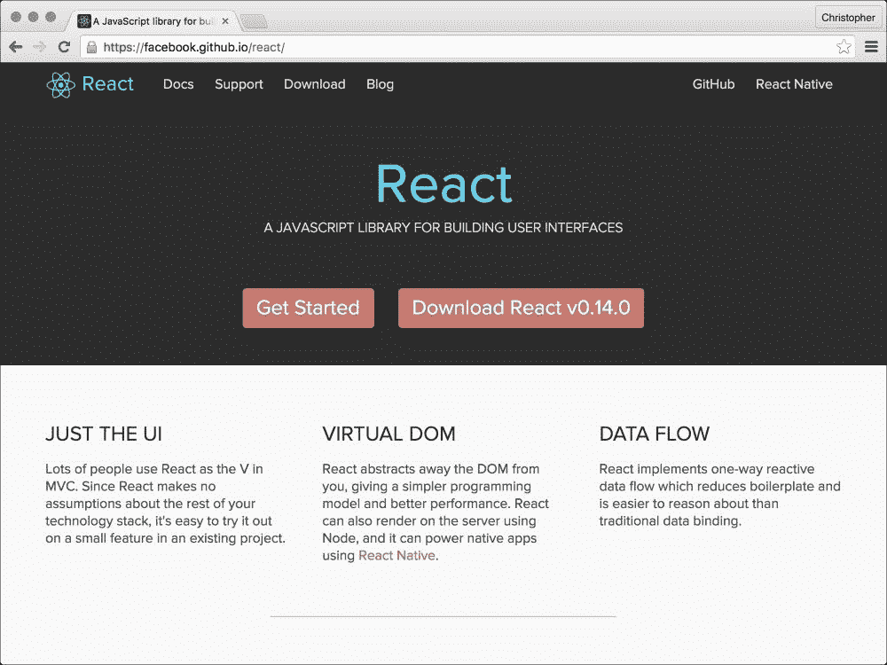
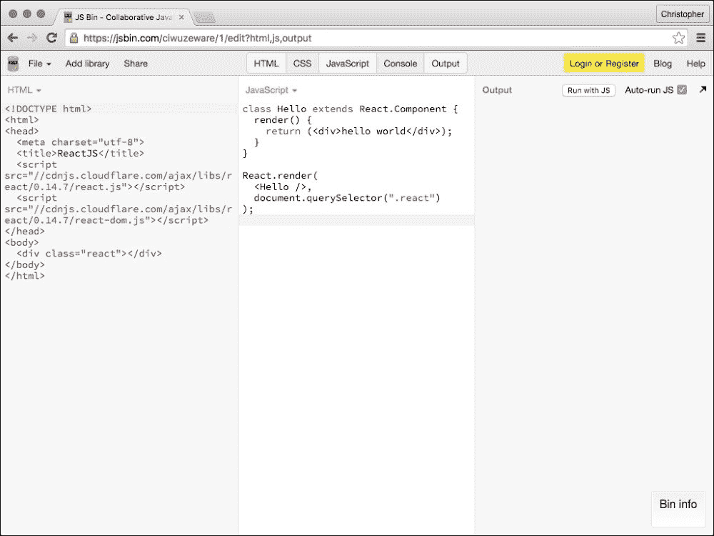

# 第一章. 组件化思维

React 是第一个让我开始思考组件化设计的界面库。React 推崇许多良好的模式和习惯，但对我来说，这一点最为突出。要理解为什么，我们需要思考 React 在底层是如何工作的。React 主要是一个渲染引擎。它是为了生成用户界面而被创建（并使用）的。

接口过去是如何工作的（实际上除了 React 之外仍然如此）是有人会提出一个设计。然后，这个图像文件会被分割成界面每个交互部分的资产。例如，jQuery 这样的库会管理用户交互并连接不同的界面组件，通常还会附带一系列插件。

单个界面组件可以非常干净和完整。然而，当它们组合在一起时，组件之间的交互和共享的可变组件状态往往会使代码库变得混乱。React 被创建的主要原因之一就是为了简化组件之间的交互，使它们保持干净且易于理解。

# 为什么是组件？

基于组件的设计非常强大，尤其是当我们使用不可变数据和单向数据流时。它迫使我停止思考不同技术或工具之间的交互方式。它让我开始思考每个界面元素最重要的功能。

当我们开始构建一个应用程序时，很容易认为每个部分都是整体的一部分。所有界面元素都融合成同一个大画面，直到它变得如此之大，以至于分离出其部分似乎是不可能的。

想象一下，如果你必须建造一艘宇宙飞船。这是一项多么庞大的任务！你需要一些火箭助推器、几对翅膀、生命维持系统等等。现在考虑一下，如果其中一个约束是宇宙飞船的每个活动部件都需要单独测试，你会如何处理？

测试是整体设计系统与将系统设计为大量小部件集合之间的巨大差异。基于组件的设计非常出色，因为它确保每个部分都是可测试的。

# 使用现代 JavaScript

React 组件被巧妙地封装。每个组件都是任何时刻一个专注的标记片段应该呈现的蓝图。它们是可重用的，并且可以根据提供的上下文改变其行为。这让你想起了另一种编程范式吗？

让我们谈谈 JavaScript。JavaScript 有一个原型继承模型。这意味着不同的对象可以有一个共同的架构。一个对象的架构可以源自另一个对象的架构。

这还意味着对原始对象的更改会继承到所有派生对象中。让我用一些代码来解释这一点：

```js
var Page = function(content) {
    this.content = content;
};

Page.prototype.render = function() {
    return "<div>" + this.content + "</div>";
}

var Post = function(tags, content) {
    this.tags = tags;

    Page.call(this, content);
};

Post.prototype = new Page();

Post.prototype.render = function() {
    var page = Page.prototype.render.call(this);

    return "<ul>" + this.renderTags() + "</ul>" + page;
};

Post.prototype.renderTags = function() {
    return "<li>" + this.tags.join("</li></li>") + "</li>";
};

var page = new Page("Welcome to my site!");
var post = new Post(["news"], "A new product!");

Page.prototype.render = function() {
    return "<section>" + this.content + "</section>";
};
```

我首先创建了一个名为 `Page` 的函数，它需要一个 `content` 参数。一个简单的 `render` 方法返回该内容，并用 `div` 标签包裹。这似乎是一个构建网站的不错起点。

接下来，我决定创建第二种类型，称为`Post`。这种类型的对象有标签，所以我创建了一个新的初始化函数来存储它们。我希望`Post`的行为几乎像`Page`类型，所以我调用了`Page`的初始化函数。

要在`Post`中继承`Page`的方法，我需要链接它们的原型。然后我可以选择覆盖`render`方法并为派生类型添加新方法。我还可以更改`Page`类型，这些更改将继承到`Post`类型的对象中。这种连接发生是因为原型是一个引用而不是一个副本。

根据你成长过程中所使用的编程语言，原型继承一开始可能有些棘手。许多新开发者错误地认为面向对象代码意味着面向类代码。动态概念如原型对他们来说很陌生。在过去，这导致了一些库实现了“假装”类。它们创建了使代码看起来像面向类模式的模式。

然后，ES6 添加了`class`关键字。它是刚才展示模式的正式化。它是原型继承的语法捷径。

我们可以将之前的代码简化为：

```js
class Page {
    constructor(content) {
        this.content = content;
    }

    render() {
        return "<div>" + this.content + "</div>";
    }
}

class Post extends Page {
    constructor(tags, content) {
        super(content);
        this.tags = tags;
    }

    render() {
        var page = super.render();

        return "<ul>" + this.renderTags() + "</ul>" + page;
    }

    renderTags() {
        return "<li>" + this.tags.join("</li></li>") + "</li>";
    }
}

var page = new Page("Welcome to my site!");
var post = new Post(["news"], "A new product!");
```

### 注意

如果你尝试使用 Node（最好是版本大于 4.1）运行此代码，你可能在文件顶部需要添加`use strict`。

注意一下事情变得有多清晰？如果你想使用类，那么这种语法捷径是非常棒的！

让我们看看一个典型的 ES5 兼容的 React 组件：

```js
var Page = React.createClass({
    render: function() {
        return <div>{this.props.content}</div>;
    }
});

var Post = React.createClass({
    render: function() {
        var page = <Page content={this.props.content} />
        var tags = this.renderTags();

        return <div><ul>{tags}</ul>{page}</div>;
    },
    renderTags: function() {
        return this.props.tags.map(function(tag, i) {
            return <li key={i}>{tag}</li>;
        });
    }
});

ReactDOM.render(
    <Post tags={["news"]} content="A new product!" />,
    document.querySelector(".react")
);
```

你可能之前见过这种代码。它被称为 JSX，是一种 JavaScript 超集语言。其理念是标记和支撑逻辑被创建并存储在一起。

### 注意

React 组件必须返回一个单一的 React 节点，这就是为什么我们将标签和页面元素包裹在一个`div`元素中。如果你在浏览器中使用 React，你还需要将你的组件渲染到一个现有的 DOM 节点（就像我刚刚将帖子渲染到`.react`中）。

我们将在后面的章节中详细介绍一些具体内容，但这是与之前几乎相同的事情。我们创建了一个名为`Page`的基本组件。它渲染一个属性而不是构造函数参数。

`Post`组件组合了`Page`组件。这种风格的 React 代码不支持组件继承。为此，我们需要 ES6 代码：

```js
class Page extends React.Component {
    render() {
        return <div>{this.props.content}</div>;
    }
}

class Post extends Page {
    render() {
        var page = super.render();
        var tags = this.renderTags();

        return <div><ul>{tags}</ul>{page}</div>;
    }

    renderTags() {
        return this.props.tags.map(function(tag, i) {
            return <li key={i}>{tag}</li>;
        });
    }
}
```

我们仍然可以在`Post`中组合`Page`，但这不是 ES6 的唯一选项。这段代码与之前看到的非 React 版本相似。

在接下来的章节中，我们将学习 ES6 的许多有用特性，这将使我们能够创建现代、表达式的 React 组件。

### 注意

如果你想要提前了解一下，请查看[`babeljs.io/docs/learn-es2015`](http://babeljs.io/docs/learn-es2015)。这是一个学习 ES6 主要特性的绝佳地方！

Babel 是我们将使用的跨编译工具，将 ES6 代码转换为 ES5 代码：



# 编译现代 JavaScript

是时候看看如何将 ES6 和 JSX 代码编译成大多数浏览器都能读取的格式了。为你的 React 组件创建一个文件夹，并在其中运行以下命令：

```js
$ npm init
$ npm install --save browserify babelify
$ npm install --save react react-dom

```

第一个命令将启动一系列问题，其中大部分应该有合理的默认值。第二个命令将下载用于你的 ES6 代码的构建器和跨编译器。将以下组件放在一个名为 `page.js` 的文件中：

```js
import React from "react";

export default class Page extends React.Component {
    render() {
        return <div>{this.props.content}</div>;
    }
}
```

与之前的 `Page` 组件相比，这里有几个重要的区别。我们从 `node_modules` 文件夹中导入主要的 `React` 对象。我们还导出类定义，以便导入此文件立即引用此类。将每个文件限制为单个类是一个好主意。同样，让每个文件定义类型或使用它们也是一个好主意。我们在 `main.js` 中使用这个类：

```js
import React from "react";
import ReactDOM from "react-dom";
import Page from "./page";

ReactDOM.render(
    <Page content="Welcome to my site!" />,
    document.querySelector(".react")
);
```

这段代码从 `node_modules` 文件夹中导入 `React` 和 `ReactDOM`，因此我们可以渲染 `Page` 类。这里我们再次引用 DOM 中的元素。我们可以在 HTML 页面中使用这段 JavaScript：

```js
<!doctype html>
<html lang="en">
    <body>
        <div class="react"></div>
    </body>
    <script src="img/main.dist.js"></script>
</html>
```

最后一步是将 `main.js` 中的 ES6/JSX 代码编译成 `main.dist.js` 中的 ES5 兼容代码：

```js
$ alias browserify=node_modules/.bin/browserify
$ browserify -t babelify main.js -o main.dist.js
```

第一个命令在 `node_modules/.bin` 文件夹中创建 `browserify` 命令的快捷方式。这对于重复调用 `browserify` 非常有用。

### 注意

如果你想要保留那个别名，请确保将其添加到你的 `~/.bashrc`、`~/.zshrc` 或 `~/.profile` 文件中。

第二个命令开始构建。*Browserify* 将所有导入的文件合并成一个文件，以便在浏览器中使用。

我们使用 `babelify` 转换器，因此 ES6 代码变成了 ES5 兼容的代码。Babel 支持 JSX，所以我们不需要额外的步骤。我们指定 `main.js` 作为要转换的文件，并将 `main.dist.js` 作为输出文件。

### 注意

如果你想要将 React 和 ReactDOM 编译成单独的文件，你可以使用 `-x` 开关来排除它们。你的命令应该是这样的：

```js
browserify main.js -t babelify -x react -x react-dom --outfile main.dist.js

```

# 浏览器调试

我们也可以直接在浏览器中使用我们的代码。有时我们可能想在构建步骤之前看到更改的效果。在这种情况下，我们可以尝试以下操作：

```js
$ npm install --save babel-core
$ npm install --save systemjs

```

这些将为我们提供一个基于浏览器的依赖管理器和跨编译器；也就是说，我们可以在一个示例 HTML 文件中使用未打包的源代码：

```js
<!DOCTYPE html>
<html>
    <head>
        <script src="img/browser.js"></script>
        <script src="img/system.js"></script>
    </head>
    <body>
        <div class="react"></div>
        <script>
            System.config({
                "transpiler": "babel",
                "map": {
                    "react": "/examples/react/react",
                    "react-dom": "/examples/react/react-dom",
                    "page": "/src/page"
                },
                "defaultJSExtensions": true
            });

            System.import("main");
        </script>
    </body>
</html>
```

这使用的是之前相同的未处理 `main.js` 文件，但我们在每次更改源代码后不再需要重新构建它。`System` 是对通过 NPM 安装的 *SystemJS* 库的引用。它负责处理导入语句，通过 Ajax 请求加载这些依赖项。

你可能会注意到对 `react` 和 `react-dom` 的引用。我们在 `main.js` 中导入这些，但它们是从哪里来的？Browserify 从 `node_modules` 文件夹中获取它们。当我们跳过 Browserify 步骤时，我们需要让 SystemJS 知道它们的位置。

这些文件最易找到的地方是[`facebook.github.io/react`](https://facebook.github.io/react)。点击下载按钮，解压存档，并将`build`文件夹中的`JS`文件复制到 HTML 页面中引用的位置。

ReactJS 网站是一个下载 ReactJS 和查找如何使用它的文档的好地方：



# 管理常见任务

随着我们 React 组件集合的增长，我们需要将它们全部捆绑在一起的方法。同时，将生成的 JavaScript 代码压缩以减少在浏览器中加载它们所需的时间也是一个好主意。

我们可以使用`package.json`中的脚本执行这类任务：

```js
"scripts": {
    "bundle": "browserify -t babelify main.js -o main.dist.js",
    "minify": "..."
}
```

NPM 脚本对于小型、简单的任务来说很好。当任务变得更加复杂时，我们开始看到使用 NPM 脚本进行此操作的缺点。在这些脚本中使用变量没有简单的方法，因此参数经常被重复。这些脚本也有些不够灵活，坦白说，看起来也不太美观。

有一些工具可以解决这些问题。我们将使用其中之一，名为**Grunt**，来创建灵活、可重复的任务。

Grunt 网站提供了使用 Grunt 的说明以及你可以用来定制工作流程的流行插件列表：


Grunt 是一个 JavaScript 任务运行器。使用它的三个步骤如下：

1.  首先，我们需要安装 CLI 工具。我们将使用它来运行不同的任务。

1.  然后，我们需要安装我们的任务将使用的库，通过 NPM。

1.  最后，我们需要创建一个`gruntfile.js`文件，我们将在这里放置我们的任务。

我们可以使用以下命令安装 CLI 工具：

```js
$ npm install -g grunt-cli

```

### 注意

前面的命令全局安装了 Grunt CLI 工具。如果你不希望这样做，请省略`-g`标志。但是，从现在开始，你需要直接使用`node_modules/.bin/grunt`来别名/运行它。

我们将需要以下任务库：

```js
$ npm install --save-dev grunt
$ npm install --save-dev grunt-browserify
$ npm install --save-dev grunt-contrib-uglify
$ npm install --save-dev grunt-contrib-watch

```

全局 CLI 工具需要一个本地的`grunt`副本。此外，我们还想在 Grunt 中运行 Browserify、Uglify 和文件监视器的粘合库。我们用类似以下的方式配置它们：

```js
module.exports = function(grunt) {
    grunt.initConfig({
        "browserify": {
            "main.js": ["main.es5.js"],
            "options": {
                "transform": [
                    "babelify"
                ],
                "external": [
                    "react", "react-dom"
                ]
            }
        },
        "uglify": {
            "main.es5.js": ["main.dist.js"]
        },
        "watch": {
            "files": ["main.js"],
            "tasks": ["browserify", "uglify"]
        }
    });

    grunt.loadNpmTasks("grunt-browserify");
    grunt.loadNpmTasks("grunt-contrib-uglify");
    grunt.loadNpmTasks("grunt-contrib-watch");

    grunt.registerTask("default", ["browserify", "uglify"]);
};
```

我们可以在`gruntfile.js`中配置每个任务。在这里，我们创建一个`browserify`任务，定义源文件和目标文件。我们包括`babelify`转换，将我们的 ES6 类转换为 ES5 兼容的代码。

### 注意

我已经添加了`external`选项，这样你就可以看到如何使用它。如果你不需要它，只需删除它，然后你的包文件应该包含完整的 React 源代码。

在 ES6 代码转换后，我们可以运行*Uglify*来删除不必要的空白。这减少了文件的大小，因此浏览器可以更快地下载它。我们可以针对 Browserify 创建的文件，并从中创建一个新的压缩文件。

最后，我们创建一个`watch`任务。这个任务会监视`main.js`的变化，并触发 Browserify 和 Uglify 任务。我们需要注册一组默认任务，我们将它们设置为`browserify`和`uglify`。此配置启用以下命令：

```js
$ grunt
$ grunt browserify
$ grunt uglify
$ grunt watch

```

还有其他一些优秀的工具，如 Grunt：

+   [`gulpjs.com`](http://gulpjs.com)

+   [`webpack.github.io`](https://webpack.github.io)

他们使用类似的配置文件，但配置是通过功能组合来完成的。从这个例子中我们可以得到的重要信息是，有一些工具我们可以用来自动化我们本需要手动执行的任务。这使得这些重复性任务变得简单易行！

# 在 JSBin 中进行测试

如果您像我一样，您通常会想要一个快速的地方来测试一些小的组件或 ES6 代码。设置这些构建链或实时浏览器环境需要时间。有一种更快的方法。它被称为 JSBin，您可以在[`jsbin.com`](https://jsbin.com)找到它：



要充分利用 JSBin，请确保将**JavaScript**下拉菜单设置为**ES6/Babel**，并包含来自*CDNJS*的 ReactJS 脚本。这些是预构建的 ReactJS 版本，因此您可以直接从浏览器中创建 React 组件（使用 ES6 功能）。

### 小贴士

**下载示例代码**

您可以从[`www.packtpub.com`](http://www.packtpub.com)上的账户下载此书的示例代码文件。如果您在其他地方购买了此书，您可以访问[`www.packtpub.com/support`](http://www.packtpub.com/support)并注册，以便将文件直接通过电子邮件发送给您。

您可以通过以下步骤下载代码文件：

+   使用您的电子邮件地址和密码登录或注册我们的网站。

+   将鼠标指针悬停在顶部的“支持”标签上。

+   点击“代码下载与勘误”。

+   在搜索框中输入书籍名称。

+   选择您想要下载代码文件的书籍。

+   从下拉菜单中选择您购买此书籍的地方。

+   点击“代码下载”。

您还可以通过点击 Packt Publishing 网站上的书籍网页上的“代码文件”按钮来下载代码文件。您可以通过在搜索框中输入书籍名称来访问此页面。请注意，您需要登录到您的 Packt 账户。

文件下载完成后，请确保使用最新版本的以下软件解压缩或提取文件夹：

+   Windows 上的 WinRAR / 7-Zip

+   Mac 上的 Zipeg / iZip / UnRarX

+   Linux 上的 7-Zip / PeaZip

# 摘要

在本章中，我们看到了基于组件的设计为什么是好的。我们看到了简单的 React 组件的样子。我们看到了 ES5 和 ES6 之间的一些有趣的不同之处，我们还看到了这些差异如何影响 React 组件。

我们还看到了一些方法可以使 ES6 代码以 ES5 兼容的方式运行。我们可以编写适用于常见浏览器的尖端代码。我们甚至可以将这些代码打包成单个高效文件，或者在浏览器中实时调试它。

在下一章中，我们将探讨状态和属性的某些复杂性。我们将从创建可重用 React 组件以在我们的示例应用程序中使用开始。
