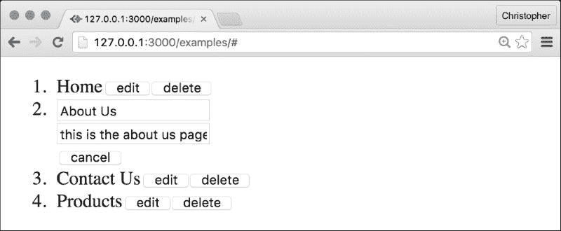

# 第二章：使用属性和状态

在上一章中，我们设置了我们的工作流程。我们解决了如何通过构建步骤编译 ReactJS 和 ES6 代码，直接在我们的浏览器中解释它，甚至使用 JSBin 等服务运行它的问题。现在，我们可以开始为我们的内容管理系统创建组件。

在本章中，我们将开始构建我们的界面。我们将看到连接组件的有趣和有效的方法。本章的重要之处在于学习如何安排复杂层次结构中的组件。我们将嵌套几个组件，并通过自定义数据后端与它们以及我们的数据源进行通信。

# 组件嵌套

让我们思考一下我们想要如何构建我们界面的组件。许多内容管理系统都包含项目列表——这些项目是我们存储在数据库中并从中检索出来的。例如，让我们想象一个可以管理网站页面的系统。

对于这样的系统，我们需要一个入口点——类似于`PageAdmin`的东西，它将我们的持久层连接到我们的界面：

```js
import React from "react";

class PageAdmin extends React.Component {
    render() {
        return <ol>...page objects</ol>;
    }
}

export default PageAdmin;
```

我们也可以将持久层表示为后端类：

```js
class Backend {
    getAll() {
        // ...returns an array of pages
    }

    update(id, property, value) {
        // ...updates a page
    }

    delete(id) {
        // ...deletes a page
    }
}
```

### 注意

之后，我们将探讨持久化这些数据的方法。现在，在这个类中使用静态数据是可以的。

我们可以通过提供一个`Backend`实例作为属性来将`PageAdmin`连接到这个类：

```js
var backend = new Backend();

ReactDOM.render(
    <PageAdmin backend={backend} />,
    document.querySelector(".react")
);
```

现在，我们可以在`PageAdmin`组件中使用`Backend`数据：

```js
class PageAdmin extends React.Component {
    constructor(props) {
        super(props);

        this.state = {
            "pages": []
        };
    }

    componentWillMount() {
        this.setState({
 "pages": this.props.backend.getAll()
 });
    }

    render() {
        return <ol>
            {this.state.pages.map(function(page) {
 return <li key={page.id}>a new page</li>
 })}
        </ol>;
    }
}
```

### 注意

事实上，我们并不真的需要定义一个默认状态，或者将页面对象存储到状态中。我这样做是为了演示使用 ES6 风格组件定义初始组件状态和覆盖状态时的惯用方法。

这里有很多事情在进行中，所以让我们一点一点地分解它：

+   我们创建了一个构造函数。在构造函数中，我们定义了组件的初始状态。我们将状态定义为具有空`pages`数组的对象。

+   React 将在组件的生命周期中调用几个*魔法*方法。我们使用`componentWillMount`来获取页面数组，以便我们有东西可以渲染。我们还把这个页面数组传递给`setState`方法。这是为了存储状态数据和同时更新组件的标记。现在，`this.state.pages`方法将包含来自后端的页面数组。

+   当我们在标记中使用花括号时，它就像一个动态值（就像属性一样）。我们可以使用`Array.prototype.map`方法为页面数组中的每个页面返回一个新的元素。这将返回一个新的`li`组件列表。React 还期望列表中的组件具有特殊的`key`属性，它使用这个属性来识别它们。React 使用这个属性来高效地跟踪它可以删除、添加或更改的组件。

    ### 注意

    代码引用`page.id`。后端返回的页面应该有`id`、`title`和`body`属性，以便这些示例可以工作。

让我们集中讨论如何通过内容管理系统展示每一页。`PageAdmin`会将每一页渲染为一个列表项，因此让我们思考在每个列表项内部我们想要做什么。我认为为每一页提供一个非交互式的摘要是有意义的。想象一下，一个网站中所有页面的表格视图：

+   首页

+   产品

+   服务条款

+   联系我们

所以，页面的一个方面是静态的：页面标题的视图。也许我们还可以包括编辑或删除每个页面的链接。

我们还希望能够更新每一页。我们可能需要某种形式的表单，为可能更新的每个字段提供文本输入。

我们可以在单个组件中表示这两个场景：

```js
import React from "react";

class Page extends React.Component {
    constructor(props) {
        super(props);

        this.state = {
 "isEditing": false
 };
    }

    render() {
 if (this.state.isEditing) {
 return <PageEditor />;
 }

 return <PageView />;
    }
}

export default Page;
```

现在，我们可以根据是否在编辑之间切换不同的组件。当然，我们还需要定义这些新组件：

```js
import React from "react";

class PageEditor extends React.Component {
    render() {
        return <form>
            <input type="text" name="title" />
            <textarea name="body"></textarea>
            <button>back</button>
        </form>;
    }
}

export default PageEditor;
```

注意，如果我们之前使用过 HTML 标记，我们可以以我们可能期望的方式定义输入元素。我们稍后会重新审视这个组件，所以现在不用担心细节。

对于这个组件，预览模式有一点相似：

```js
import React from "react";

class PageView extends React.Component {
    render() {
        return <div>
            {this.props.title}
            <button>edit</button>
            <button>delete</button>
        </div>;
    }
}

export default PageView;
```

这引发了一个有趣的问题。我们如何高效地将属性从一个组件传输到另一个组件？ES6 提供了一个名为*扩展运算符*的语言特性，这是一个很好的工具。首先，我们需要在`PageAdmin`中将页面提供给页面组件：

```js
render() {
    return <ol>
        {this.state.pages.map(function(page) {
            return <li key={page.id}>
                <Page {...page} />
            </li>;
        })}
    </ol>;
}
```

我们正在用我们之前创建的`Page`组件替换`a new page`。我们使用扩展运算符将每个对象键分配为组件属性。我们可以在`Page`中重复这个概念：

```js
render() {
    if (this.state.isEditing) {
        return <PageEditor {...this.props} />;
    }

    return <PageView {...this.props} />;
}
```

`{...this.props}`扩展了页面对象的键。在`PageEditor`和`PageView`组件内部，`page.id`变成了`this.props.id`。这个方法对于传输许多属性非常棒；我们不需要逐个写出每一个。

# 共享组件操作

那么，我们如何从`PageView`类转换为`PageEditor`类？为此，我们需要挂钩到浏览器事件并调整状态：

```js
class Page extends React.Component {
    constructor(props) {
        super(props);

        this.state = {
 "isEditing": false
 };
    }

    render() {
        if (this.state.isEditing) {
            return <PageEditor
                {...this.props}
                onCancel={this.onCancel.bind(this)}
                />;
        }

        return <PageView
            {...this.props}
            onPageEdit={this.onEdit.bind(this)}
            />;
    }

    onEdit() {
 this.setState({
 "isEditing": true
 });
 }

 onCancel() {
 this.setState({
 "isEditing": false
 });
 }
}
```

我们提供了一个方法，允许*子*组件通过传递方法来调用*父*组件中的方法。当一个`PageView`类想要将`Page`放入编辑模式时，它可以调用`this.props.onEdit`。`Page`将知道如何处理。我们将在后续内容中经常看到这个模式，所以在这里移动之前理解它在做什么是很好的！

同样地，我们为`PageEditor`类提供了一个取消编辑模式的方法。在这两种情况下，我们使用`setState`在编辑和查看状态之间切换。

### 备注

我们绑定处理方法，因为否则当方法被调用时`this`将意味着不同的东西。这种绑定方式不是很高效，所以稍后我们会用一种替代方案来重新审视这个问题！

我们可以将这些处理程序连接到每个组件的点击事件：

```js
class PageEditor extends React.Component {
    render() {
        return <form>
            <input type="text" name="title" />
            <textarea name="body"></textarea>
            <button>save</button>
            <button
                onClick={this.onCancel.bind(this)}
                >back</button>
        </form>;
    }

    onCancel(event) {
        event.preventDefault();
        this.props.onCancel();
    }
}
```

在调用通过 props 传递下来的`onCancel`之前，我们需要防止默认表单提交。代码如下：

```js
class PageView extends React.Component {
    render() {
        return <div>
            {this.props.title}
            <button
                onClick={this.props.onEdit}
                >edit</button>
            <button>delete</button>
        </div>;
    }
}
```

现在，你应该能够在浏览器中运行此代码，并在每个页面的编辑和查看方面之间切换。这是一个停下来总结我们所取得的成果的好时机：

1.  我们创建了一个名为 `PageAdmin` 的页面管理的入口点组件。该组件处理获取和持久化页面数据。它使用 `Backend` 类来完成这些操作。它还渲染 `Page` 组件，每个 `Backend` 返回一个页面。

1.  我们创建了一个 `Page` 组件来封装页面数据以及每个页面的编辑和查看方面。`Page` 组件通过回调处理这两个子组件之间的切换。

1.  我们创建了一个 `PageEditor` 组件作为编辑页面数据的接口。它包含一些字段，我们将在下面简要讨论。

1.  最后，我们创建了一个 `PageView` 组件作为查看页面数据和进入编辑模式的接口。我们即将使 **删除** 按钮也能工作。

如果你一直在跟随，你的界面可能看起来像这样：



我们在本章中创建了许多新的函数引用。每次我们使用 `fn.bind(this)`，我们都会创建一个新的函数。如果我们这样做是在渲染方法内部，这就不太高效。我们可以通过创建一个基础组件来解决这个问题：

```js
import React from "react";

class Component extends React.Component {
    bind(...methods) {
        methods.map(
            method => this[method] = this[method].bind(this)
        )
    }
}

export default Component;
```

如果我们扩展这个基础组件（而不是通常的 `React.Component`），那么我们将能够访问 `bind` 方法。它接受一个或多个函数名称，并将它们替换为绑定版本。

现在，我们需要添加更新和删除页面的事件处理器。让我们从 `PageView` 和 `PageEditor` 开始：

```js
import Component from "component";

class PageView extends Component {
    constructor(props) {
        super(props);

        this.bind(
 "onDelete"
 );
    }

    render() {
        return <div>
            {this.props.title}
            <button
                onClick={this.props.onEdit}
                >edit</button>
            <button
                onClick={this.onDelete}
                >delete</button>
        </div>;
    }

    onDelete() {
 this.props.onDelete(
 this.props.id
 );
 }
}
```

我们在删除按钮上添加了一个 `onClick` 处理程序。这将触发一个绑定的 `onDelete` 版本，我们传递正确的：

```js
import Component from "component";

class PageEditor extends Component {
    constructor(props) {
        super(props);

        this.bind(
"onCancel",
 "onUpdate"
 );
    }

    render() {
        return <form>
            <input
                type="text"
                name="title"
                value={this.props.title}
 onChange={this.onUpdate}
               />
           <textarea
               name="body"
               value={this.props.body}
 onChange={this.onUpdate}>
 </textarea>
            <button
                onClick={this.onCancel}>
                cancel
            </button>
        </div>;
    }

 onUpdate() {
 this.props.onUpdate(
 this.props.id,
 event.target.name,
 event.target.value
 );
 }

 onCancel(event) {
 event.preventDefault();
 this.props.onCancel();
 }
}
```

在这里，我们添加了 `onUpdate`，这样我们就可以确定哪个输入发生了变化。它调用带有正确属性名称和值的 `props `onUpdate` 方法。

我们还添加了 `name` 和 `value` 属性给输入，将值设置为相应的属性。这些更新会在输入改变时触发，调用 `onUpdate` 方法。这意味着属性更新将反映在字段中。

这些新的处理程序属性从何而来？我们需要将它们添加到 `PageAdmin` 中：

```js
import Component from "component";

class PageAdmin extends Component {
    constructor(props) {
        super(props);

        this.state = {
            "pages": []
        };

 this.bind(
 "onUpdate",
 "onDelete"
 );
    }

    componentWillMount() {
        this.setState({
            "pages": this.props.backend.getAll()
        });
    }

    render() {
        return <ol>
            {this.state.pages.map(function(page) {
                return <li key={page.id}>
                    <Page
                        {...page}
                        onUpdate={this.onUpdate}
                        onDelete={this.onDelete}
                        />
                </li>;
            })}
        </ol>;
    }

    onUpdate(...params) {
 this.props.backend.update(...params);
 }

 onDelete(...params) {
 this.props.backend.delete(...params);
 }
}
```

最后，我们创建了一些处理更新和删除的方法。这些方法与我们之前在其他类中做的方法一样被绑定。它们还使用剩余/展开操作符作为一点快捷方式！

我们可以使用一组页面和一些数组修改方法来伪造后端数据和操作：

```js
class Backend {
    constructor() {
        this.deleted = [];
 this.updates = [];

 this.pages = [
 {
 "id": 1,
 "title": "Home",
 "body": "..."
 },
 {
 "id": 2,
 "title": "About Us",
 "body": "..."
 },
 {
 "id": 3,
 "title": "Contact Us",
 "body": "..."
 },
 {
 "id": 4,
 "title": "Products",
 "body": "..."
 }
 ];
    }

    getAll() {
        return this.pages
 .filter(page => {
 return this.deleted.indexOf(page.id) == -1
 })
 .map(page => {
 var modified = page;

 this.updates.forEach((update) => {
 if (update[0] == page.id) {
 modified[update[1]] = update[2];
 }
 });
 return modified;
 });
    }

    update(id, property, value) {
        this.updates.push([id, property, value]);
    }

    delete(id) {
        this.deleted.push(id);
    }
}
```

### 小贴士

这绝对不是一个高效的实现。请勿在生产环境中使用此代码。它只是一个示例接口，我们可以用它来测试我们的代码！

`all` 方法返回一个过滤并映射的初始页面数组。`() => {}` 语法是 `(function(){}).bind(this)` 的快捷方式。如果函数只有一个属性，括号是可选的。过滤器检查每个页面的 `id` 是否不在 `deleted` 数组中。在这个模拟的后端中，我们实际上并没有删除页面。我们只是排除了我们不想看到的页面。

我们不是直接更新页面，而是在 `all` 返回数组之前应用更新。这并不高效，但它确实允许我们看到我们的界面在行动。

### 注意

你可以在 [`developer.mozilla.org/docs/Web/JavaScript/Reference/Global_Objects/Array`](https://developer.mozilla.org/docs/Web/JavaScript/Reference/Global_Objects/Array) 上了解更多关于这些数组技巧的信息。这是一个学习 JavaScript 语言特性的好地方。

# 组件生命周期方法

在结束之前，我想展示几个技巧。第一个是我们可以用来自定义组件属性变化时机的一个 *生命周期方法*。我们可以使用这个方法来改变组件的外观，或者刷新内部状态。

例如，我们可以将此方法添加到 `PageEditor` 中：

```js
class PageEditor extends Component {
    constructor(props) {
        super(props);

        this.state = {
            "changed": false
        };

        this.bind(
            "onCancel",
            "onUpdate"
        );
    }

    isChanged(next, previous) {
 return JSON.stringify(next) !== JSON.stringify(previous)
 }

 componentWillReceiveProps(props) {
 this.setState({
 "changed": this.isChanged(props, this.props)
 });
 }

    render() {
        return <div>
            <input
                type="text"
                name="title"
                value={this.props.title}
                onChange={this.onUpdate}
                />
            <textarea
                name="body"
                value={this.props.body}
                onChange={this.onUpdate}>
            </textarea>
            <button
                onClick={this.onCancel}>
                cancel
            </button>
        </div>;
    }

    onUpdate() {
        this.props.onUpdate(
            this.props.id,
            event.target.name,
            event.target.value
        );
    }

 onCancel(event) {
 event.preventDefault();
 this.props.onCancel();
 }
}
```

现在我们可以知道页面何时发生变化，即使变化是立即传播的。

另一个我们可以使用的神奇方法将有助于减少 React 需要执行的比较。它被称为 `shouldComponentUpdate`，我们可以将其添加到 `PageView`：

```js
class PageView extends Component {
    constructor(props) {
        super(props);

        this.bind(
            "onDelete"
        );
    }

    isChanged(next, previous) {
 return JSON.stringify(next) !== JSON.stringify(previous)
 }

 shouldComponentUpdate(props, state) {
 return this.isChanged(props, this.props);
 }

    render() {
        return <div>
            {this.props.title}
            <button
                onClick={this.props.onEdit}
                >edit</button>
            <button
                onClick={this.onDelete}
                >delete</button>
        </div>;
    }

    onDelete() {
        this.props.onDelete(
            this.props.id
        );
    }
}
```

`shouldComponentUpdate` 方法为我们提供了一种告诉 React 不要在此组件中查找变化的方式。在这个规模上，我们不太可能看到巨大的性能提升。但是当我们将此方法添加到更复杂的布局中时，它将极大地减少确定文档应该如何更改所需的工作量。

我们将在构建更复杂的内容管理功能时使用这些技巧。

# 摘要

在本章中，你学习了更多关于 ES6 类以及它们如何在结构和功能上补充 React 组件的知识。我们还探讨了状态和属性的一些有趣用法。

总而言之，我们看到了避免内部组件状态的可能性和好处。属性是组件设计的一个强大工具。我们知道如何对变化的属性做出反应，以及如何减少 React 渲染我们界面所需的工作量。

在下一章中，我们将讨论如何持久化这些数据（到不同类型的本地存储）。我们将看到如何通过事件连接到这些数据存储。
