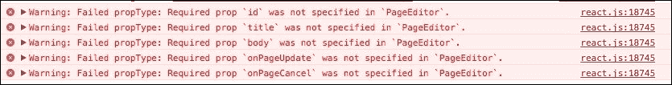

# 第三章：保存和通信数据

在上一章中，我们创建了复杂的组件层次结构。我们创建了一个页面列表以及编辑这些页面的方法。然而，我们并没有停止在某种存储中保存和读取这些数据。

例如，我们可以通过 Ajax 请求发送一个编辑操作以保存到数据库服务器。实际上，这是我们今天使用的应用程序中经常发生的事情。它们总是保存我们的交互，无论我们是否期望它们这样做。

在本章中，您将了解本地数据存储以及如何与它们通信。您还将了解基于事件的架构以及它是如何促进数据单向流动的。

存储数据有许多方法。这是一个丰富且有趣的话题，可以填满几十本书。我甚至可以说，它是商业和应用程序工作的核心。

此外，在可维护的应用程序和不可维护的应用程序中，数据通信的方式可能经常不同。取决于我们如何找到优雅的方式来持久化数据，以使我们的应用程序保持可维护性。

我们在本章中只将探索本地存储。您将能够在页面重新加载后看到您存储的数据，但其他人则看不到。仅凭本章内容，您无法构建一个实用的网站。您将不得不等待我们探索服务器上的 React。

# 验证属性

在我们查看存储数据之前，我还有一个习惯想与您分享。我们在上一章中创建的组件可以很好地协同工作，但我们的目标是使每个组件都是自包含的。我们希望其他人能够重用我们的组件，但如果他们不知道我们的组件期望哪些属性，他们将会遇到问题。

考虑如果我们这样使用`PageAdmin`会发生什么：

```js
ReactDOM.render(
    <PageAdmin backend="ajax" />,
    document.querySelector(".react")
);
```

面对这样的组件，如果没有文档，可能会诱使我们用一些其他配置数据替换`Backend`对象。这对不熟悉该组件的人来说似乎是合理的。而且，如果我们没有仔细研究我们所有的组件，我们也不能期望其他人知道这些属性应该是什么。

我们可以通过添加属性验证来防止这种情况。让我们给`PageEd` `itor`添加一些验证：

```js
PageEditor.propTypes = {
    "id": React.PropTypes.number.isRequired,
    "title": React.PropTypes.string.isRequired,
    "body": React.PropTypes.string.isRequired,
    "onUpdate": React.PropTypes.func.isRequired,
    "onCancel": React.PropTypes.func.isRequired
};
```

我们已经导入了`React`对象，它暴露了一个`PropTypes`对象。这个对象包含一些验证器。当我们对`PageEditor.propTypes`指定一些验证器时，React 会在组件渲染时检查属性的类型。如果我们提供了错误的属性类型或省略了必需的属性，React 将发出警告。

警告看起来是这样的：



有许多类型可供选择，其中简单的一些如下：

+   `React.PropTypes.array`

+   `React.PropTypes.bool`

+   `React.PropTypes.func`

+   `React.PropTypes.number`

+   `React.PropTypes.object`

+   `React.PropTypes.string`

如果你需要一个属性是必需的（这在大多数情况下可能是这样），你可以在末尾添加`.isRequired`。让我们用`PageView`的验证器来继续：

```js
PageView.propTypes = {
    "title": React.PropTypes.string.isRequired,
    "onEdit": React.PropTypes.func.isRequired,
    "onDelete": React.PropTypes.func.isRequired
};
```

这甚至更简单，因为`PageView`使用的属性比`PageEditor`少。此外，`Page`相对简单：

```js
Page.propTypes = {
    "id": React.PropTypes.number.isRequired,
    "onDelete": React.PropTypes.func.isRequired
};
```

我们不需要验证直接通过组件传递的属性。例如，`PageEditor`使用`onUpdate`。它通过`Page`传递，但`Page`不使用它，`PageEditor`使用，所以我们就在那里使用验证器。

然而，如果我们想要验证嵌套结构或更复杂的数据类型呢？我们可以尝试以下方法：

```js
PageAdmin.propTypes = {
    "backend": function(props, propName, componentName) {
 if (props.backend instanceof Backend) {
 return;
 }

 return new Error(
 "Required prop `backend` is not a `Backend`."
 );
 }
};
```

我们期望`backend`属性是`Backend`类的一个实例。如果它不是，我们返回一个`Error`来描述为什么属性无效。我们还可以使用`shape`来验证嵌套属性：

```js
Component.propTypes = {
    "page": React.PropTypes.shape({
 "id": React.PropTypes.number.isRequired,
 "title": React.PropTypes.string.isRequired,
 "body": React.PropTypes.string.isRequired
 })
};
```

我们对属性越具体，坏属性破坏接口的机会就越小。因此，养成总是定义它们的习惯是好的。

# 存储 cookies

你一定听说过 cookies。它们是一种与互联网一样古老的基于浏览器的存储机制，在电影中经常被滑稽地描述。以下是我们的使用方法：

```js
document.cookie = "pages=all_the_pages";
document.cookie = "current=current_page_id";
```

`document.cookie`参数作为一个临时的字符串存储。你可以继续添加新的字符串，其中键和值通过`=`分隔，并且它们将在页面重新加载后存储，也就是说，直到你达到浏览器每个域名可以存储的 cookies 数量限制。如果你多次设置`document.cookie`，将会设置多个 cookies。

你可以用这样的函数再次读取 cookies：

```js
var cookies = {};

function readCookie(name) {
    var chunks = document.cookie.split("; ");

    for (var i = chunks.length - 1; i >= 0; i--) {
        var parts = chunks[i].split("=");
        cookies[parts[0]] = parts[1];
    }

    return cookies[name];
}

export default readCookie;
```

整个 cookie 字符串通过分号读取并分割。然后，每个 cookie 被分割成等号，留下键和值。这些被存储在本地`cookies`对象中。未来的请求只需从本地对象中读取键。可以在任何时刻检查`cookies`对象以查看已设置的 cookies。

尝试[`browsercookielimits.squawky.net`](http://browsercookielimits.squawky.net)来测试你的浏览器可以处理什么。我正在运行一个现代版本的 Chrome，我可能每个域名可以存储 180 个 cookies，总共 4096 字节。4096 字节听起来并不多...

Cookies 通常不用于我们想要存储的数据类型。我们不得不在其他地方寻找。

### 注意

如果你想要了解更多关于如何使用 cookies 的信息，请访问[`developer.mozilla.org/en-US/docs/Web/API/Document/cookie`](https://developer.mozilla.org/en-US/docs/Web/API/Document/cookie)。

# 使用本地存储

我们将要查看的下一类存储是浏览器工具集的一个相对较新的添加。它被称为*本地存储*，它已经存在了一段时间。你可以按照以下方式向其中添加项：

```js
localStorage.setItem("pages", "all_the_pages");
```

从中读取项比 cookies 简单：

```js
localStorage.getItem("pages");
```

这将在页面重新加载或浏览器关闭后持久化数据。你可以存储比 cookies 多得多的数据（默认情况下，从 3MB 到 10MB），并且接口更容易使用。

那么，我们如何使用它来存储我们的页面？让我们对本地存储进行一些抽象：

```js
export default {
    "get": function(key, defaultValue) {
        var value = window.localStorage.getItem(key);

        var decoded = JSON.parse(value);

        if (decoded) {
            return decoded;
        }

        return defaultValue;
    },

    "set": function(key, value) {
        window.localStorage.setItem(
            key, JSON.stringify(value)
        );
    }
};
```

一次，我们导出的是一个对象而不是一个类。这个对象有几个方法，它们都访问`window.localStorage`。直接引用它并不理想，但如果我们在其他地方都使用这种抽象，那么我认为这是可以接受的。

`get`方法从本地存储中拉出一个字符串值，并将其解析为 JSON 字符串。如果该值解析为任何非假值，我们就返回它，否则返回默认值。

`set`方法将值编码为 JSON，并存储它。

然后，我们可以在`Backend`类中使用以下抽象：

```js
import LocalStore from "local-store";

class Backend {
    constructor() {
        this.pages = LocalStore.get("pages", []);
    }

    getAll() {
        return this.pages;
    }

    update(id, property, value) {
        this.pages = this.pages.map((page) => {
 if (page.id == id) {
 page[property] = value;
 }

 return page;
 });

 LocalStore.set("pages", this.pages);
    }

    delete(id) {
        this.pages = this.pages.filter(
 (page) => page.id !== id
 );

 LocalStore.set("pages", this.pages);
    }
}

export default Backend;
```

我们从一个构造函数开始，它从`localStorage`获取任何存储的页面。我们提供了一个默认的空数组，以防`localStorage`中缺少`pages`键。我们将其存储在`this.pages`中，以便我们稍后可以获取和修改它。

`getAll`方法这次要简单得多。它只是返回`this.pages`。而`update`和`delete`方法则更有趣。`update`方法使用`Array.map`方法来应用对受影响页面对象的更新。我们必须将更新后的`pages`数组存储回本地存储，以便持久化更改。

类似地，`delete`修改了`pages`数组（这次使用简短的功能语法）并将修改后的数组存储回本地存储。我们必须用一些初始数据查看本地存储。你可以在开发者控制台中这样做：

```js
localStorage.setItem("pages", JSON.stringify([
    {
       "id": 1,
       "title": "Home",
       "body": "..."
    },
    {
       "id": 2,
       "title": "About Us",
       "body": "..."
    },
    {
       "id": 3,
       "title": "Contact Us",
       "body": "..."
    },
    {
       "id": 4,
       "title": "Products",
       "body": "..."
    }
]));
```

如果你已经做了这些更改，并且刷新了页面，你应该能看到新的后端代码在起作用！

# 使用事件发射器

到目前为止，我们的组件通过方法调用与后端进行通信。这对小型应用来说是可以的，但当事情开始扩展时，我们可能会忘记做一些方法调用。

看看`onUpdate`，例如：

```js
onUpdate(id, field, value) {
    this.props.backend.update(id, field, value);

    this.setState({
        "pages": this.props.backend.getAll()
    });
}
```

每次我们更改页面的状态时，我们都必须从后端获取更新后的页面列表。如果有多个组件向后端发送更新，我们的`PageAdmin`组件将如何知道何时获取新的页面列表？

我们可以转向基于事件的架构来解决这个问题。我们已经遇到过并使用过事件！回想一下我们创建页面编辑表单时做了什么。在那里，我们连接到输入事件，以便在输入值更改时更新页面。

这种架构使我们更接近单向数据流。我们可以想象我们的整个应用就像一个组件树，从单个根组件开始。当一个组件需要更新应用的状态时，我们不需要在组件的位置上编码状态更改。在过去，我们可能不得不引用特定的 CSS 选择器，或者在更新状态时依赖于兄弟元素的定位。

当我们开始使用事件时，任何组件都可以触发应用中的更改。多个组件也可以触发同一种类型的更改。我们将在后面的章节中更详细地探讨这个想法。

我们可以用同样的想法来通知组件数据发生变化。首先，我们需要下载一个事件发射器类：

```js
$ npm install --save eventemitter3

```

现在，`Backend`可以扩展这个功能，提供我们想要的的事件功能：

```js
class Backend extends EventEmitter {
    constructor() {
        super();

        this.pages = LocalStore.get("pages", []);
    }

    getAll() {
        return this.pages;
    }

    update(id, property, value) {
        // ...update a page

        this.emit("update", this.pages);
    }

    delete(id) {
        // ...delete a page

        this.emit("update", this.pages);
    }
}
```

随着每个页面的更新或删除，后端将在自身上发出事件。在我们没有在`PageAdmin`中监听这些事件之前，这什么也不做：

```js
constructor(props) {
    super(props);

    this.bind(
        "onUpdate",
        "onDelete"
    );

    this.state = {
        "pages": this.props.backend.getAll()
    };

    this.props.backend.on("update",
 (pages) => this.setState({pages})
 );
}

onUpdate(id, field, value) {
    this.props.backend.update(id, field, value);
}

onDelete(id) {
    this.props.backend.delete(id);
}
```

现在，我们可以移除对`this.setState`的多次调用，并在`constructor`中使用单个事件监听器来替换它们。我们还在`setState`调用上做了一些有趣的事情。这被称为*对象解构*，它允许`{pages}`变成`{"pages":pages}`。

现在，我们可以开始使用这个后端来处理界面的许多不同部分，并且它们都将拥有准确、实时的数据。在几个不同的窗口中打开页面，并观察它们同时更新！

# 摘要

在本章中，我们探讨了如何保护我们的组件免受错误属性的影响。我们还看到使用 cookie 是多么容易，尽管它们在我们需要的方面有限。幸运的是，我们可以使用本地存储并将其整合到现有的后端和组件中。

最后，我们探索了使用事件将状态变化推送到所有感兴趣的组件。

在下一章中，我们将开始美化我们的组件。我们将探讨如何对它们进行样式化和动画处理，使我们的界面生动起来！
