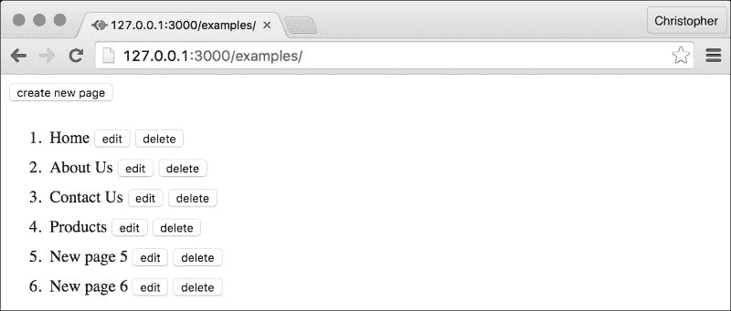
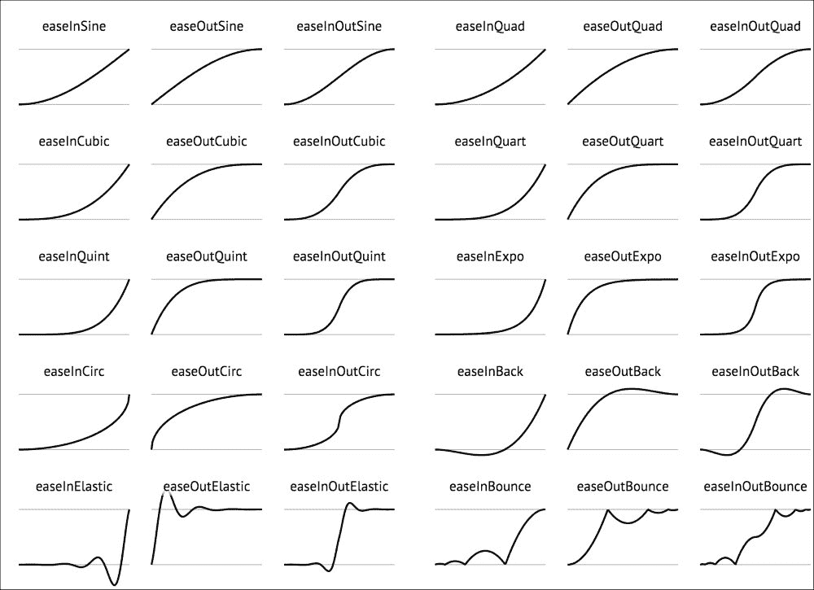

# 第四章 组件的样式和动画

在上一章中，你学习了如何在重新加载页面或重启浏览器后持久化页面。现在，这已经开始成为对我们有用的系统了。不幸的是，它仍然看起来很粗糙，没有样式。

这是因为，到目前为止，我们几乎完全忽略了组件中的样式。在本章中，我们将改变所有这些！

你将学习如何为组件元素添加自定义样式和类名。我们将为新旧组件添加动画。我们甚至将学习如何将两者结合起来创建高度可重用的样式和动画。

# 添加新页面

到目前为止，我们能够更改和从我们的内容管理系统移除页面。我们在上一章结束时通过在本地存储中播种序列化数组来结束，这样我们就可以看到它的实际效果。让我们退一步，通过界面创建新页面的方法。

首先，我们将添加一个`insert`方法并更新`Backend`的`constructor`方法：

```js
constructor() {
    super();

    var pages = LocalStore.get("pages", []);

    this.id = 1;

    this.pages = pages.map((page) => {
        page.id = this.id++;
        return page;
    });
}

insert() {
    this.pages.push({
        "id": this.id,
        "title": "New page " + this.id,
        "body": ""
    });

    this.id++;

    LocalStore.set("pages", this.pages);

    this.emit("update", this.pages);
}
```

页面`id`值对我们来说并不重要，除了在 React 组件的上下文中。因此，当页面从本地存储加载时，重新生成它们是完全可以的。我们跟踪内部`id`值，以便在创建新页面时为新页面分配一个新的`id`值。

`insert`方法将一个新的页面对象推送到页面列表中。然后我们更新本地存储中的`pages`数据，以便在下次需要页面时可用。并且，与`update`和`delete`方法一样，我们发出一个`update`事件，以便所有相关的组件都会更新其状态。

我们可以在`PageAdmin`中使用这个`insert`方法：

```js
onInsert() {
    this.props.backend.insert();
}
```

在`render`方法中，添加以下代码：

```js
render() {
    return <div>
        <div>
 <button onClick={this.onInsert}>
 create new page
 </button>
 </div>
        <ol>
            ...
        </ol>
    </div>;
}
```

除了我们编写的其他代码外，界面看起来是这样的：



# 为组件添加样式

我们有几种方法可以改善我们组件的外观。以`PageView`组件为例。什么可以使它变得更好？也许如果我们增加字体大小并使用无衬线字体，标题将更容易阅读。也许我们可以增加每页周围的边距。

我们有几种不同的方式来样式化我们的组件。第一种是在`PageView`的`render`方法中内联添加样式：

```js
render() {
    var rowStyle = this.props.rowStyle || {
 "fontSize": "18px",
 "fontFamily": "Helvetica"
 };

 var labelStyle = this.props.labelStyle || {
 "whiteSpace": "nowrap"
 };

 var buttonStyle = this.props.buttonStyle || {
 "margin": "0 0 0 10px",
 "verticalAlign": "middle",
 };

    return <div style={rowStyle}>
        <label style={labelStyle}>
            {this.props.title}
        </label>
        <button
            style={buttonStyle}
            onClick={this.props.onEdit}>
            edit
        </button>
        <button
            style={buttonStyle}
            onClick={this.props.onDelete}>
            delete
        </button>
    </div>;
}
```

我们可以为想要我们的组件渲染的每个元素定义一组样式。对于外部的`div`元素，我们定义字体大小和家族。对于`label`标题，我们告诉浏览器不要换行。对于每个按钮，我们添加边距。每个样式对象都可以通过属性覆盖，归因于`var value = value1 || value2`的表示法。这是说如果`value1`是未定义的，则使用`value2`的简写。

我们还应该将这些样式应用到列表项上，以便数字以与标题相同的方式显示：

```js
render() {
    var itemStyle = this.props.itemStyle || {
        "minHeight": "40px",
        "lineHeight": "40px",
 "fontSize": "18px",
 "fontFamily": "Helvetica"

    };

    return <div>
        <div>
            <button
                onClick={this.onInsert}>
                create new page
            </button>
        </div>
        <ol>
            {this.state.pages.map((page, i) => {
                return <li key={i} style={itemStyle}>
                    <Page
                        {...page}
                        onUpdate={this.onUpdate}
                        onDelete={this.onDelete}
                        />);
                </li>;
            })}
        </ol>
    </div>;
}
```

注意`style`对象有两对花括号？这就是我们定义对象作为属性的方式。在这种情况下，它是一个我们想要应用于每个列表项的样式对象。

# 更改和撤销

现在，我们可以为我们的编辑表单设置样式。让我们将修改指示符（星号）替换为一个模拟保存操作的按钮：

```js
constructor(props) {
    super(props);

    this.state = {
        "changed": false
    };

    this.bind(
        "onCancel",
        "onSave",
        "onUpdate",
    );
}

render() {
    var cancelButtonStyle = null;
 var saveButton = null;

 if (this.state.changed) {
 cancelButtonStyle = this.props.cancelButtonStyle || {
 "margin": "0 0 0 10px"
 };

 saveButton = <button
 onClick={this.onCancel}>
 save
 </button>
 }

    return <form>
        <div>
            <input
                type="text"
                onChange={this.onUpdate}
                name="title"
                value={this.props.title}
                />
        </div>
        <div>
            <input
                type="text"
                onChange={this.onUpdate}
                name="body"
                value={this.props.body}
                />
        </div>
        {saveButton}
 <button
 onClick={this.onCancel}
 style={cancelButtonStyle}>
 cancel
 </button>
    </form>;
}

onSave(event) {
    event.perventDefault();
    this.props.onSave();
}
```

这给人一种点击**保存**按钮会保存一些内容的错觉，而保存实际上已经发生。这提出了一个有趣的问题——我们应该让**取消**按钮取消编辑吗？因为现在它只是一个伪装成取消按钮的后退按钮。我们还应该定义一个`onSave`函数并将其传递给这个组件。

要做到这一点，我们需要跟踪其初始状态。但我们在哪里可以获得这个初始状态呢？`PageEditor`组件通过属性接收页面详情，所以当前状态在`PageEditor`中与在`Backend`中相同。

也许我们应该在`PageView`隐藏和`PageEditor`显示时存储状态：

```js
onEdit() {
    this.setState({
        "isEditing": true,
        "title": this.props.title
    });
}
```

当页面进入编辑模式时，我们存储未编辑的标题。我们应该将`onCancel`方法更改为实际取消更改：

```js
onCancel() {
    this.props.onUpdate(
 this.props.id,
 "title",
 this.state.title
 );

    this.setState({
        "isEditing": false
    });
}

onSave() {
    this.setState({
        "isEditing": false
    });
}
```

当调用`onCancel`属性时，我们将页面标题设置为之前存储的未编辑标题。我们需要在构造函数中绑定这个新的`onSave`方法：

```js
constructor(props) {
    super(props);

    this.state = {
        "isEditing": false
    };

    this.bind(
        "onEdit",
        "onDelete",
        "onCancel",
        "onSave"
    );
}
```

这确保了当稍后调用`onSave`属性时，`this`指的是页面组件。我们需要将这个新方法以属性的形式传递给`PageEditor`组件：

```js
render() {
    if (this.state.isEditing) {
        return <PageEditor
            {...this.props}
            onCancel={this.onCancel}
            onSave={this.onSave}
            />;
    }

    return <PageView
        {...this.props}
        onEdit={this.onEdit}
        onDelete={this.onDelete}
        />;
}
```

现在，`PageEditor`的两个按钮不再调用`this.props.onCancel`，而是可以调用它们适用的方法：

```js
if (this.state.changed) {
    cancelButtonStyle = this.props.cancelButtonStyle || {
       "margin": "0 0 0 10px"
    };

    saveButton = <button
        onClick={this. onSave}>
        save
    </button>
}
```

# 动画新组件

目前，新页面只是出现。没有微妙的动画来缓解它们的进入。让我们改变这一点！

我们将使用一个新的 React 组件来完成这个任务，我们可以在 React 的附加组件构建中找到它。回到你在第一章下载的 React 脚本，将所有对`react.js`的引用替换为`react-with-addons.js`。

这使我们能够访问一个名为`CSSTransitionGroup`的新组件：

```js
render() {
    var itemStyle = this.props.itemStyle || {
        "minHeight": "40px",
        "lineHeight": "40px",
 "fontSize": "18px",
 "fontFamily": "Helvetica"
    };

    return <div>
        <div>
            <button
                onClick={this.onInsert}>
                create new page
            </button>
        </div>
        <ol>
            <React.addons.CSSTransitionGroup
                transitionName="page"
                transitionEnterTimeout={150}
                transitionLeaveTimeout={150}>
                {this.state.pages.map((page, i) => {
                    return <li key={i} style={itemStyle}>
                        <Page
                            {...page}
                            onUpdate={this.onUpdate}
                            onDelete={this.onDelete}
                            />
                    </li>;
                })}
            </React.addons.CSSTransitionGroup>
        </ol>
    </div>;
}
```

这个新的容器组件会监视其子组件的变化。当添加新的子组件时，它们会被赋予几个 CSS 类名，这些类名可以应用 CSS 动画。我们需要将这个动画添加到相应的 CSS 样式：

```js
.page-enter {
    opacity: 0.01;
    margin-left: -50%;
}

.page-enter.page-enter-active {
    opacity: 1;
    margin-left: 0;
    transition: all 150ms linear;
}

.page-leave {
    opacity: 1;
    margin-left: 0;
}

.page-leave.page-leave-active {
    opacity: 0.01;
    margin-left: 50%;
    transition: all 150ms linear;
}
```

由于我们指定了`transitionName="page"`，React 在`Page`组件进入和离开`PageAdmin`时添加了`page-enter`和`page-leave`，注意我们样式中的`150ms`与`transitionEnterTimeout={150}`匹配？它们需要相同。React 为这`150ms`添加了类名，如`page-enter-active`，然后移除它们。这确保了过渡只发生一次。

# 使用 CSS 过渡效果

现在是讨论 CSS 过渡的好时机。我们已使用它们从左侧淡入和滑动新的`Page`组件。如果你不熟悉它们通常的工作方式，代码可能会让人困惑且难以更改。

有几件事情你应该知道。第一点是你可以过渡单个 CSS 属性或所有属性：

```js
.background-transition {
    background-color: red;
    font-size: 16px;
    transition-property: background-color;
}

.background-transition:hover {
    background: blue;
    font-size: 18px;
}
```

在这个例子中，我们只想过渡背景颜色。字体大小将立即从 `16px` 跳跃到 `18px`。或者，我们也可以过渡所有 CSS 属性：

```js
.all-transition {
    transition-property: all;
}
```

我们已经看到了过渡持续时间，尽管只是简短地提到了。我们可以使用 `ms` 或 `s` 作为这些的单元：

```js
.background-transition {
    transition-duration: 1s;
}
```

然后是时间函数。这些控制动画如何从 0% 到 100%。它们有时被称为曲线，因为它们通常是这样展示的：



线性是这些时间函数中最基本的，它均匀地从 0% 移动到 100%。它也是默认的 `timing` 函数。

### 备注

你可以在 [`easings.net`](http://easings.net) 看到这些示例。

你也可以定义自己的曲线，形式为 `cubic-bezier(x1, y1, x2, y2)`。这目前有点高级，但无论如何都是好的。

过渡也可以延迟，因此它们只在经过一定时间后才会发生：

```js
.background-transition {
    transition-delay: 1s;
}
```

总体来说，这些样式看起来是这样的：

```js
.background-transition {
    transition-property: background;
    transition-duration: 1s;
    transition-timing-function: linear;
    transition-delay: 0.5s;
}
```

如前所述，你可以将这些属性捆绑成一个更小的集合：

```js
.background-transition {
 transition: background 1s linear 0.5s;
}
```

并非所有属性都可以进行过渡。属性需要有一定的粒度。以下是一些常见的属性：

+   `背景`（应用于颜色和位置）

+   `边框`（应用于颜色、宽度和间距）

+   `底部`

+   `裁剪`

+   `颜色`

+   `裁剪`

+   `字体`（应用于大小和粗细）

+   `高度`

+   `左边距`

+   `字母间距`

+   `行高`

+   `外边距`

+   `最大高度`

+   `最大宽度`

+   `最小高度`

+   `最小宽度`

+   `不透明度`

+   `轮廓`（应用于颜色、偏移和宽度）

+   `内边距`

+   `右边距`

+   `文本缩进`

+   `文本阴影`

+   `顶部`

+   `垂直对齐`

+   `可见性`

+   `宽度`

+   `单词间距`

+   `z-index`

# 使用 Sass 组织样式

样式表是内联组件样式的优秀替代品。CSS 作为一种寻找并应用于元素视觉特性的语言，非常具有表现力。

不幸的是，它也有缺点。CSS 的最大缺点是所有样式都在全局范围内。一些样式是继承的，并且应用于元素的样式经常冲突（并相互抵消）。

在小剂量下，碰撞是可以避免或管理的。在大剂量下，这些碰撞可能会削弱生产力。作为一种权宜之计，CSS 支持使用 `!important` 关键字。这通常会导致丑陋的解决方案，因为每个人都希望他们的样式是最重要的。

此外，还需要重复常见的值。直到最近，CSS 甚至不支持计算值。如果我们想使元素相对于其他元素具有绝对宽度（例如），我们必须使用 JavaScript。

这些是 Sass 试图解决的问题之一。它是一种 CSS 扩展语言（CSS + 其他特性），因此易于学习，也就是说，一旦你了解了 CSS。

Sass 样式表在使用浏览器之前需要编译成 CSS 样式表。安装 Sass 编译器很容易；执行以下命令来安装它：

```js
$ npm install --save node-sass

```

完成这些后，我们就可以使用以下命令编译 Sass 样式表（以 `.scss` 结尾的文件）：

```js
$ node_modules/.bin/node-sass index.scss > index.css

```

考虑以下代码：

```js
$duration: 150ms;
$timing-function: linear;

.page-enter {
    opacity: 0.01;
    margin-left: -50%;

    &.page-enter-active {
        opacity: 1;
        margin-left: 0;
        transition: all $duration $timing-function;
    }
}

.page-leave {
    opacity: 1;
    margin-left: 0;

    &.page-leave-active {
        opacity: 0.01;
        margin-left: 50%;
        transition: all $duration $timing-function;
    }
}
```

以下代码将被转换为 CSS，如下所示：

```js
.page-enter {
    opacity: 0.01;
    margin-left: -50%;
}

.page-enter.page-enter-active {
    opacity: 1;
    margin-left: 0;
    transition: all 150ms linear;
}

.page-leave {
    opacity: 1;
    margin-left: 0;
}

.page-leave.page-leave-active {
    opacity: 0.01;
    margin-left: 50%;
    transition: all 150ms linear;
}
```

如果你更喜欢在浏览器中编译 React 组件，并且想用 Sass 做同样的事情，那么你可以安装以下内容：

```js
$ npm install --save sass.js

```

然后，你需要将以下元素添加到页面的头部：

```js
<script src="img/sass.sync.js"></script>
<style type="text/sass">
    $duration: 150ms;
    $timing-function: linear;

    .page-enter {
        opacity: 0.01;
        margin-left: -50%;

        &.page-enter-active {
            opacity: 1;
            margin-left: 0;
            transition: all $duration $timing-function;
        }
    }

    .page-leave {
        opacity: 1;
        margin-left: 0;

        &.page-leave-active {
            opacity: 0.01;
            margin-left: 50%;
            transition: all $duration $timing-function;
        }
    }
</style>
<script>
    var stylesheets = Array.prototype.slice.call(
 document.querySelectorAll("[type='text/sass']")
 );

 stylesheets.forEach(function(stylesheet) {
 Sass.compile(stylesheet.innerHTML, function(result) {
 stylesheet.type = "text/css";
 stylesheet.innerHTML = result.text;
 });
 });
</script>
```

这是一段 JavaScript 代码，用于查找具有`type="text/sass"`的`style`元素。每个这些样式元素的内容都通过`sass.js`传递，并保存回样式元素。它们的类型被改回`text/css`，这样浏览器就会识别这些样式为 CSS。

### 注意

你应该只在开发中使用这种方法。它会给浏览器带来很多工作，这可以通过在生产环境中预先编译 Sass（使用如 Grunt、Gulp 和 webpack 等工具）来避免。

# 替代方案

我们还可以用几种其他方式来样式化和动画化 React 组件，并且它们都以微妙不同的方式处理这个问题。

## CSS 模块

**CSS 模块**允许你定义只适用于局部上下文中单个元素的样式。它们看起来像常规 CSS 样式，但当它们应用于组件时，会被修改，使得分配给组件的类名是唯一的。你可以在[`glenmaddern.com/articles/css-modules`](http://glenmaddern.com/articles/css-modules)上了解更多关于 CSS 模块的信息。

## React 样式

**React 样式**是一种创建内联样式的方式，作为略微增强的对象。它不支持一些常见的 CSS 选择器，但在其他方面做得很好。你可以在[`github.com/js-next/react-style`](https://github.com/js-next/react-style)上了解更多关于它的信息。

# 摘要

在本章中，你学习了如何对 React 组件进行大小样式化。我们使用了内联样式、CSS 样式表，甚至 Sass 样式表。你还学习了如何使用 CSS 过渡来动画化子组件的进入和退出视图。

最后，我们简要地查看了一些替代技术，这些技术以略有不同的方式完成了我们在本章中做的事情。你可能更喜欢这些方法中的任何一个，但重要的是要认识到我们可以使用许多方法来样式化和动画化组件。

在下一章中，我们将把这些技能应用到深入研究材料设计中。接下来会有很多样式化和动画化的内容！
