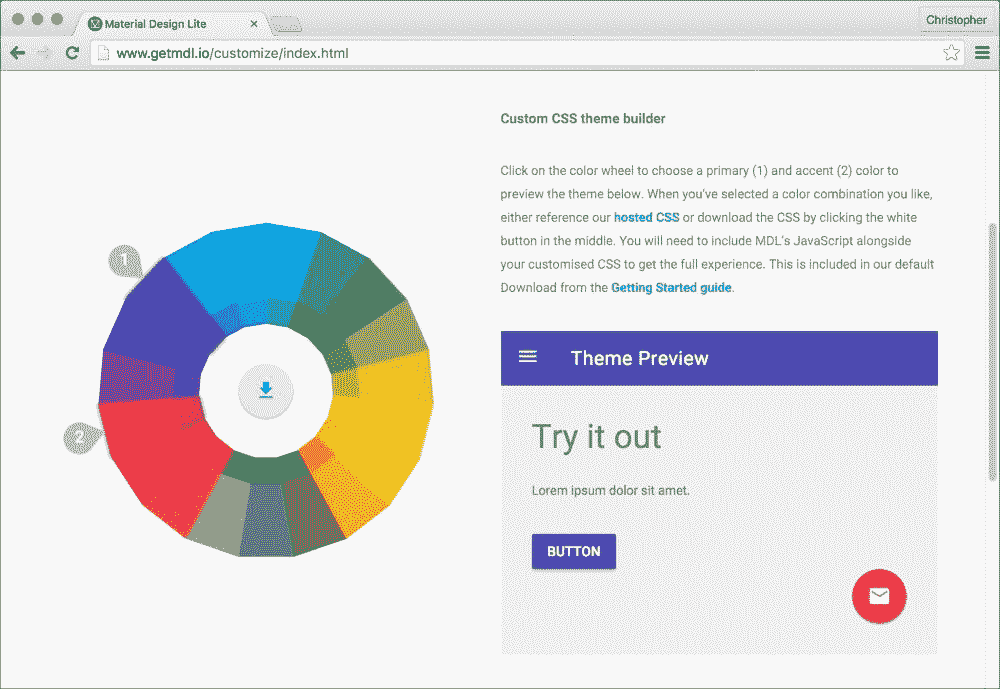
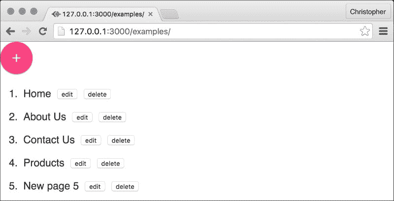
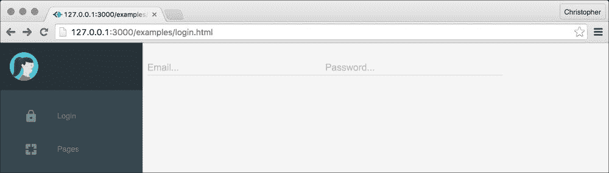
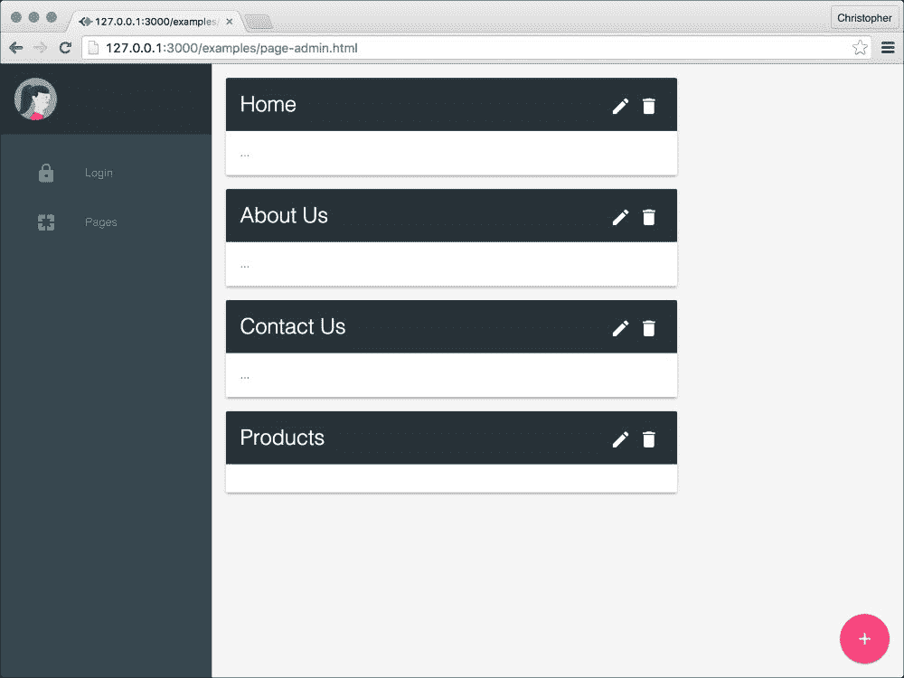
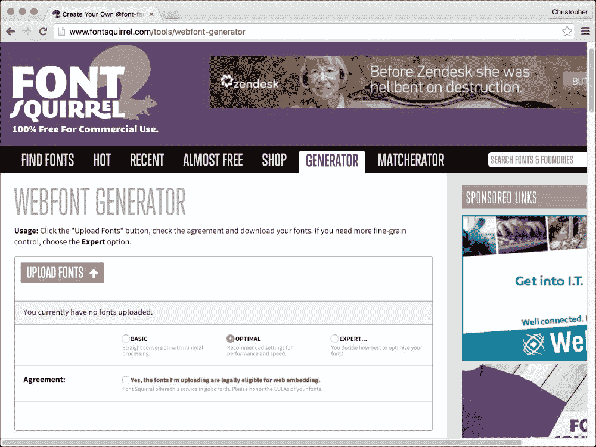
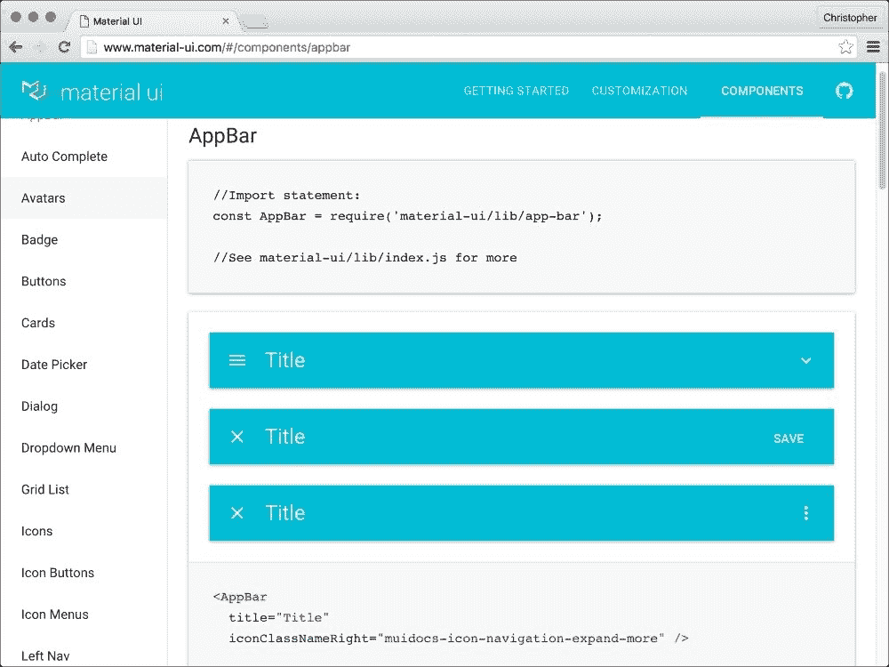

# 第五章。迈向材料设计！

在上一章中，我们探讨了如何样式化和动画化 React 组件的基础。我们可以让组件看起来像我们想要的样子，但我们希望它们看起来如何？

在本章中，我们将探讨所谓的材料设计。你将学习如何用一致的设计语言表达我们的界面，而不仅仅是组件。

你将看到组件式设计和视觉设计模式之间的主要交叉。材料设计非常详细，正如我们在本章中将要看到的。它详细描述了每种类型的组件（或表面）应该如何看起来、感觉和移动。这就是我们通过 React 理解的最小化设计方法的核心。现在，我们将从视觉角度应用这些经验教训。

# 理解材料设计

对我来说，“材料设计”这个名字唤起了时尚或工程的图像，其中不同的质感和图案具有独特的视觉或技术特征。我触摸的一切都是某种材料。我所看到的一切都是某种材料。所有这些材料都遵循物理定律并以熟悉的方式表现。

这些感觉，触摸和视觉，是我们与世界互动的基础。它们是广泛且不言而喻的常数。材料设计是一种旨在弥合物理世界和数字世界之间差距的语言，使用材料作为隐喻。

在这种语言中，材料的表面和边缘为我们提供了基于现实的视觉界面提示。在这种语言中，组件会立即对触摸做出反应，暗示它们可以做什么。

材料设计深受印刷设计的启发。然而，所有的字体、色彩和图像不仅仅是为了美观。它们创造了焦点、层次和意义。它强化了用户作为运动主要驱动的角色，使用有意义的运动来聚焦于界面的重要区域，始终提供适当的反馈。

# 表面

每个对象都由一个材料表面表示。这些对象的大小以**设备无关像素**（或**dp**，简称）来衡量。这是一个衡量用户输入的绝佳单位，因为它允许设计师设计独立于屏幕大小的界面。

它也可以根据设备的屏幕大小转换为绝对单位（如英寸或毫米）。

### 注意

你可以在[`en.wikipedia.org/wiki/Device_independent_pixel`](http://en.wikipedia.org/wiki/Device_independent_pixel)了解更多关于 dp 的信息。

表面被视为 3D 对象，具有宽度、高度和深度。所有表面都有 1 dp 的深度，但它们可以有任意宽度和高度。表面还可以重叠，因此它们之间有垂直偏移。

这种垂直偏移（或高度）允许分层，创造出类似于现实世界的深度感。表面上的内容，如排版和图像，平铺在表面上。把它想象成纸上的墨水，纸张的深度比打印在上面的墨水更容易注意到。

这种分层效果通过投射到下表面的阴影得到强调。屏幕作为光源，因此表面离它越近（在界面中位置越高），它们投射的阴影就越大。

### 注意

您可以在[`www.google.com/design/spec/what-is-material/elevation-shadows.html`](https://www.google.com/design/spec/what-is-material/elevation-shadows.html)了解更多关于高度和分层的信息。

## 交互

表面提供了深度和层次结构，但应用程序的真实价值来自于通过界面呈现的内容。内容驱动交互。

材料表面应该对交互做出响应。播放视频、缩放照片或填写表单应该感觉自然。交互应该感觉自然，并且尽可能模仿现实世界中的感觉。

### 注意

您可以在[`www.google.com/design/spec/animation/responsive-interaction.html`](https://www.google.com/design/spec/animation/responsive-interaction.html)了解更多关于交互的信息。

## 运动

接口对用户交互做出响应的一种方式是通过有效利用运动。动画对移动界面（材料设计诞生的地方）来说并不陌生，但我们谈论的是对动画执行方式的深思熟虑的方法。

就像在现实世界中一样，当涉及到摩擦和动量等概念时，一些物体在交互时移动得更快或更慢。一些元素在按下时会压缩得更深，而其他元素几乎不会移动。

### 注意

您可以在[`www.google.com/design/spec/animation/meaningful-transitions.html`](https://www.google.com/design/spec/animation/meaningful-transitions.html)了解更多关于运动的信息。

## 排版和图标

存在有关如何在材料界面中结构和着色文本内容的指南。大多数示例展示了 Roboto（这是标准的 Android 字体），但规则同样适用于其他清晰的字体。

类似地，还有关于如何通过界面创建和使用图标的指南。存在一套标准的图标（称为系统图标），这将帮助您开始。

### 注意

您可以从[`www.google.com/fonts/specimen/Roboto`](https://www.google.com/fonts/specimen/Roboto)下载 Roboto 字体，以及从[`www.google.com/design/spec/style/icons.html#icons-system-icons`](http://www.google.com/design/spec/style/icons.html#icons-system-icons)获取系统图标。

# 保持清醒

第一次阅读材料设计规范（可在[`www.google.com/design/spec/material-design/introduction.html`](http://www.google.com/design/spec/material-design/introduction.html)找到），你可能会感到有些不知所措。其中有很多细节，知道从哪里开始并不容易。

事实上，你不必记住所有的内容。我第一次阅读时感到非常紧张，但后来我意识到，重点不是要记住所有内容。当然，这有助于你在界面上的每一个选择时做出决定，但它并不是一个工具包或组件库。

材料设计是一种语言——一份活生生的文档。谷歌已经并且将继续对其进行调整，当你学习一门语言时，了解一些单词是有帮助的。然而，你不可能在一天之内学会一门语言，也不可能仅仅通过记忆固定短语就能学好它。

不，要学习一门语言，你需要每天都说它。你需要用心去学习语法，并努力克服你的错误，直到有一天你能够舒适地使用它，而不必有意识地记住每一条规则。在那一天，材料设计对你来说将变得像第二本能一样自然。

### 注意

我鼓励你在继续之前至少阅读一遍材料设计规范。记住，你可以在[`www.google.com/design/spec/material-design/introduction.html`](http://www.google.com/design/spec/material-design/introduction.html)找到它。即使你忘记了其中的一些或大部分内容，也没有关系。阅读它的目的是，当你记住规范的部分内容时，一些决策将对你来说显得更加自然，因为各个部分更容易结合起来。

## 材料设计 lite

说了这么多，还有一些工具可以帮助你开始。我们将首先查看的工具被称为材料设计 lite。超过 120 位贡献者联合起来，在材料设计语言中创建了一套可重用的组件。

名称中的“*lite*”部分主要来自两个方面：

+   它是框架无关的，这意味着你可以使用它而无需包含像 jQuery 或 Angular 这样的东西

+   当它被 gzip 压缩时，它的大小不到 30 KB

让我们通过自定义默认模板的颜色来试一试。前往[`www.getmdl.io/customize/index.html`](http://www.getmdl.io/customize/index.html)并选择几种颜色。材料设计中的调色板由主色和强调色组成。你还可以在你的设计中使用主色的某些色调，但我们现在不必担心这些。

当你从色轮中选择颜色时，你可能注意到一些其他颜色消失了。色轮隐藏了与已选颜色对比度不足的颜色。

你应该选择你想要在设计中使用的颜色。我在下面的截图中选择了两色，标记为**1**和**2**：



在轮子下方，你会看到一个链接元素。这个元素指向一个托管 CSS 文件。如果你将它放置在你的 HTML 页面头部，这些颜色就会应用到你的材料设计元素上。我选择了靛蓝和粉色，这反映在 URL 中：

```js
<link rel="stylesheet" href="https://storage.googleapis.com/code.getmdl.io/1.0.6/material.indigo-pink.min.css" />
```

你可以选择保存此文件并本地提供服务。目前，我将直接将其包含在我的 HTML 页面头部。

我们还需要包含一个 JavaScript 文件，以及一个定义了一些自定义字体的 CSS 文件：

```js
<script src="img/material.min.js"></script>
<link rel="stylesheet" href="https://fonts.googleapis.com/icon?family=Material+Icons">
```

在我们开始应用一些材料设计样式到我们的界面时，让我们给我们的按钮元素添加一些类名。我们将从`PageAdmin`开始：

```js
render() {
    var addButton ClassNames = [
 "mdl-button",
 "mdl-js-button",
 "mdl-button--fab",
 "mdl-js-ripple-effect",
 "mdl-button--colored"
 ].join(" ");

    return (
        <div>
            <div>
                <button
                    onClick={this.onInsert}
                    className={addButtonClassNames}>
                    <i className="material-icons">add</i>
                </button>
            </div>
            <ol>
                {this.state.pages.map((page) => {
                    return <li key={page.id} style={{
                            "fontSize": "18px",
                            "fontFamily": "Helvetica",
                            "minHeight": "40px",
                            "lineHeight": "40px"
                        }}>
                        <Page
                            {...page}
                            onUpdate={this.onUpdate}
                            onDelete={this.onDelete} />
                    </li>;
                })}
            </ol>
        </div>
    );
}
```

所有材料设计轻量级类名都以`mdl-`开头。我们添加了一些定义**浮动操作按钮**（或简称**FAB**）一些视觉样式的类名。

这些样式让我们的**添加**按钮看起来好多了：



然而，这不是一个很好的布局。我们应该更好地定位按钮，并为`Page`组件添加一些边界。实际上，我们应该开始从我们计划拥有的不同部分/页面来思考这个 CMS 界面。

在开始时，这个管理界面不会对所有人开放，所以也许我们应该有一个登录页面。那么，我们如何在这个界面的不同部分之间导航呢？也许我们应该添加一些导航。

当我们访问[`www.getmdl.io/templates/index.html`](http://www.getmdl.io/templates/index.html)时，我们可以看到一些不同的起始布局，我们可以使用。我真的很喜欢**仪表板**布局的外观，所以我认为我们可以基于这个布局来构建导航。

然后，还有**文本密集型网页**布局，它包含一系列卡片组件。这些看起来非常适合我们的`Page`组件。让我们开始工作吧！

## 创建登录页面

我们将首先创建一个简单的登录页面，不包含任何服务器端验证（目前是这样）。我们将将其拆分为单独的`login.html`页面和`login.js`文件：

```js
<!DOCTYPE html>
<html>
    <head>
        <script src="img/browser.js"></script>
        <script src="img/system.js"></script>
        <script src="img/material.min.js"></script>
        <link rel="stylesheet" href="https://storage.googleapis.com/code.getmdl.io/1.0.6/material.indigo-pink.min.css" />
        <link rel="stylesheet" href="https://fonts.googleapis.com/icon?family=Material+Icons" />
        <link rel="stylesheet" href="example.css" />
    </head>
    <body class="
        mdl-demo
        mdl-color--grey-100
        mdl-color-text--grey-700
        mdl-base">
        <div class="react"></div>
        <script>
            System.config({
                "transpiler": "babel",
                "map": {
                    "react": "/examples/react/react",
                    "react-dom": "/examples/react/react-dom"
                },
                "baseURL": "../",
                "defaultJSExtensions": true
            });

            System.import("examples/login");
        </script>
    </body>
</html>
```

我对 SystemJS 的配置做了一些修改。我们不再列出每个单独的文件，现在我们将根目录设置为`baseURL`。这意味着我们需要改变除了`react`和`react-dom`之外的所有内容的导入方式：

```js
import React from "react";
import ReactDOM from "react-dom";
import Nav from "src/nav";
import Login from "src/login";

var layoutClassNames = [
    "demo-layout",
    "mdl-layout",
    "mdl-js-layout",
    "mdl-layout--fixed-drawer"
].join(" ");
ReactDOM.render(
    <div className={layoutClassNames}>
        <Nav />
        <Login />
    </div>,
    document.querySelector(".react")
);
```

再次，我们将使用一些材料设计轻量级**仪表板**类名，这些我们在`example.css`中定义过：

```js
html, body {
    font-family: "Roboto", "Helvetica", sans-serif;
}

.demo-avatar {
    width: 48px;
    height: 48px;
    border-radius: 24px;
}

.demo-layout .mdl-layout__header .mdl-layout__drawer-button {
    color: rgba(0, 0, 0, 0.54);
}

.mdl-layout__drawer .avatar {
    margin-bottom: 16px;
}

.demo-drawer {
    border: none;
    position: fixed;
}

.demo-drawer .mdl-menu__container {
    z-index: -1;
}

.demo-drawer .demo-navigation {
    z-index: -2;
}

.demo-drawer .mdl-menu .mdl-menu__item {
    display: -webkit-box;
    display: -webkit-flex;
    display: -ms-flexbox;
    display: flex;
    -webkit-box-align: center;
    -webkit-align-items: center;
    -ms-flex-align: center;
    align-items: center;
}

.demo-drawer-header {
    box-sizing: border-box;
    display: -webkit-box;
    display: -webkit-flex;
    display: -ms-flexbox;
    display: flex;
    -webkit-box-orient: vertical;
    -webkit-box-direction: normal;
    -webkit-flex-direction: column;
    -ms-flex-direction: column;
    flex-direction: column;
    -webkit-box-pack: end;
    -webkit-justify-content: flex-end;
    -ms-flex-pack: end;
    justify-content: flex-end;
    padding: 16px;
}

.demo-navigation {
    -webkit-box-flex: 1;
    -webkit-flex-grow: 1;
    -ms-flex-positive: 1;
    flex-grow: 1;
}

.demo-layout .demo-navigation .mdl-navigation__link {
    display: -webkit-box !important;
    display: -webkit-flex !important;
    display: -ms-flexbox !important;
    display: flex !important;
    -webkit-box-orient: horizontal;
    -webkit-box-direction: normal;
    -webkit-flex-direction: row;
    -ms-flex-direction: row;
    flex-direction: row;
    -webkit-box-align: center;
    -webkit-align-items: center;
    -ms-flex-align: center;
    align-items: center;
    font-weight: 500;
}

.demo-navigation .mdl-navigation__link .material-icons {
    font-size: 24px;
    color: rgba(255, 255, 255, 0.56);
    margin-right: 32px;
}

.demo-content {
    max-width: 1080px;
}

.demo-card-wide.mdl-card {
    width: 512px;
    min-height: auto !important;
    margin: 16px;
}

.demo-card-wide > .mdl-card__title {
    color: #fff;
    background: #263238;
}

.demo-card-wide > .mdl-card__menu {
    color: #fff;
}

.react {
    position: absolute;
    top: 0;
    left: 0;
    width: 100%;
    height: 100%;
}

.mdl-layout__content {
    overflow: visible !important;
    position: relative;
    z-index: 10 !important;
}

.mdl-button--fab {
    position: fixed;
    bottom: 16px;
    right: 16px;
    z-index: 10 !important;
}
```

这些样式主要来自**仪表板**布局文件，尽管我已经删除了我们不需要的样式。注意`.react`容器元素是如何拉伸到窗口边界的。

### 注意

理想情况下，我们希望将每个组件内部的样式隔离出来。这可以通过多种方式实现（我们之前在上一章中简要讨论过）。尝试将每个这些组件的样式拉入组件本身。如果大部分样式来自打包的 MDL 源文件，这可能有点困难。

让我们来看看`Nav`组件：

```js
import React from "react";
import ReactDOM from "react-dom";

export default (props) => {
    var drawerClassNames = [
        "demo-drawer",
        "mdl-layout__drawer",
        "mdl-color--blue-grey-900",
        "mdl-color-text--blue-grey-50"
    ].join(" ");

    var navClassNames = [
        "demo-navigation",
        "mdl-navigation",
        "mdl-color--blue-grey-800"
    ].join(" ");

    var iconClassNames = [
        "mdl-color-text--blue-grey-400",
        "material-icons"
    ].join(" ");

    var buttonIconClassNames = [
        "mdl-color-text--blue-grey-400",
        "material-icons"
    ].join(" ");

    return (
        <div className={drawerClassNames}>
            <header className="demo-drawer-header">
                
            </header>
            <nav className={navClassNames}>
                <a className="mdl-navigation__link"
                    href="/examples/login.html">
                    <i className={buttonIconClassNames}
                        role="presentation">
                        lock
                    </i>
                    Login
                </a>
                <a className="mdl-navigation__link"
                    href="/examples/page-admin.html">
                    <i className={buttonIconClassNames}
                        role="presentation">
                        pages
                    </i>
                    Pages
                </a>
            </nav>
        </div>
    );
};
```

这个新的`Nav`组件与我们迄今为止创建的其他 React 组件大不相同。首先，它没有内部状态，只渲染静态内容。它不是一个类，而是一个普通的箭头函数。自 React 0.14 以来，将函数传递给`ReactDOM.render`（无论是直接还是间接）已经成为可能。

### 注意

你可能还想将类数组移出使用它们的函数之外，因为它们不太可能经常改变。这样可以将它们与每个组件的动态部分隔离开来，并减少每次组件渲染时的工作量。

为了简化，我将它们留在了`render`函数内部，但你可以根据需要将它们移动到扩展或自定义组件时。

当涉及到无状态组件时，这种风格要简单得多。这是一个随着时间的推移我们将重复的模式，所以请留意它！

然后，我们需要创建`Login`组件：

```js
import React from "react";
import ReactDOM from "react-dom";

export default (props) => {
    var contentClassNames = [
 "mdl-layout__content",
 "mdl-color--grey-100"
 ].join(" ");

 var gridClassNames = [
 "mdl-grid",
 "demo-content"
 ].join(" ");

 var fieldClassNames = [
 "mdl-textfield",
 "mdl-js-textfield"
 ].join(" ");

    return <div className={contentClassNames}>
        <form className={gridClassNames}>
            <div className={fieldClassNames}>
                <input className="mdl-textfield__input"
                       type="text" />
                <label className="mdl-textfield__label"
                       htmlFor="sample1">
                    Email...
                </label>
            </div>
            <div className={fieldClassNames}>
                <input className="mdl-textfield__input"
                       type="text" />
                <label className="mdl-textfield__label"
                       htmlFor="sample1">
                    Password...
                </label>
            </div>
        </form>
    </div>;
};
```

如你所见，输入元素的工作方式与往常一样，增加了几个特殊的 MDL 类。

这为我们提供了一个令人愉悦的登录页面：



## 更新页面管理员

我们需要将类似的变化应用到现在分开的`page-admin.html`和`page-admin.js`文件上。让我们从 HTML 开始：

```js
<!DOCTYPE html>
<html>
    <head>
        <script src="img/browser.js"></script>
        <script src="img/system.js"></script>
        <script src="img/material.min.js"></script>
 <link rel="stylesheet" href="https://storage.googleapis.com/code.getmdl.io/1.0.6/material.indigo-pink.min.css" />
 <link rel="stylesheet" href="https://fonts.googleapis.com/icon?family=Material+Icons">
 <link rel="stylesheet" href="example.css" />
    </head>
    <body class="
 mdl-demo
 mdl-color--grey-100
 mdl-color-text--grey-700
 mdl-base">
        <div class="react"></div>
        <script>
            System.config({
                "transpiler": "babel",
                "map": {
 "react": "/examples/react/react",
 "react-dom": "/examples/react/react-dom"
 },
 "baseURL": "../",
                "defaultJSExtensions": true
            });

            System.import("examples/page-admin");
        </script>
    </body>
</html>
```

这几乎与`login.html`完全相同，只是在这个页面上我们加载了不同的引导文件。然而，在`page-admin.js`中存在显著差异：

```js
import React from "react";
import ReactDOM from "react-dom";
import Nav from "src/nav";
import Backend from "src/backend";
import PageAdmin from "src/page-admin";

var backend = new Backend();

var layoutClassNames = [
 "demo-layout",
 "mdl-layout",
 "mdl-js-layout",
 "mdl-layout--fixed-drawer"
].join(" ");

ReactDOM.render(
    <div className={layoutClassNames}>
 <Nav />
 <PageAdmin backend={backend} />
 </div>,
    document.querySelector(".react")
);
```

我们仍然加载`mdl-`类和 HTML 结构，但我们还包含了之前包含的相同的`Backend`引导。现在`PageAdmin`组件的`render`方法看起来非常不同：

```js
render() {
    var contentClassNames = [
 "mdl-layout__content",
 "mdl-color--grey-100"
 ].join(" ");

 var addButtonClassNames = [
 "mdl-button",
 "mdl-js-button",
 "mdl-button--fab",
 "mdl-js-ripple-effect",
 "mdl-button--colored"
 ].join(" ");

    return (
        <div className={contentClassNames}>
            <button onClick={this.onInsert}
                className={addButtonClassNames}>
                <i className="material-icons">add</i>
            </button>
            {this.state.pages.map((page) => {
    return (
    <Page {...page}
   key={page.id}
   onUpdate={this.onUpdate}
   onDelete={this.onDelete} />
    );
    })}
        </div>
    );
}
```

最后，我们需要更新`PageView`组件：

```js
render() {
    var cardClassNames = [
 "demo-card-wide",
 "mdl-card",
 "mdl-shadow--2dp"
 ].join(" ");

 var buttonClassNames = [
 "mdl-button",
 "mdl-button--icon",
 "mdl-js-button",
 "mdl-js-ripple-effect"
 ].join(" ");

    return (
        <div className={cardClassNames}>
            <div className="mdl-card__title">
                <h2 className="mdl-card__title-text">
                    {this.props.title}
                </h2>
            </div>
            <div className="mdl-card__supporting-text">
                {this.props.body}
            </div>
            <div className="mdl-card__menu">
                <button className={buttonClassNames}
                    onClick={this.props.onEdit}>
                    <i className="material-icons">edit</i>
                </button>
                <button className={buttonClassNames}
                    onClick={this.props.onDelete}>
                <i className="material-icons">delete</i>
            </button>
        </div>
    </div>;
}
```

这些更改对我们的功能没有产生重大影响，除了 CSS 和 HTML 的变化。我们仍然以完全相同的方式创建页面。此外，我们仍然以完全相同的方式编辑和删除它们。我们只是将新的视觉元素应用到已经功能齐全的界面中。

页面管理员部分现在应该看起来像这样：



它比以前好得多！需要注意的是，我们还没有为`PageEdit`组件添加样式，所以请将其视为下一次练习的内容。

### 注意

请仔细注意示例代码文件。自从上一章以来，有很多变化，包括分割示例文件以及使用 SystemJS 以不同的方式加载所有内容。如果不进行这些更改，就无法从上一章的代码继续，并期望本章的示例能够直接工作。

# 替代资源

在我们结束之前，我想分享一些可能对你有帮助的资源。

## Font Squirrel

在本章中，我们使用了 Roboto。更准确地说，MDL 指令告诉我们如何在 Google Webfonts 上嵌入 Roboto 的链接。如果你希望使用自己的自定义字体，那么你可能需要将它们转换。

你可以在 Font Squirrel 转换字体文件：



访问[`www.fontsquirrel.com/tools/webfont-generator`](http://www.fontsquirrel.com/tools/webfont-generator)并上传你的字体文件。你将开始下载转换后的文件，附带一些有用的 CSS 文件以帮助你开始。我们没有时间涵盖所有自定义字体的复杂性，但下载的示例文件应该能让你走上正确的道路。

## 材料 UI

我们在 MDL CSS/JavaScript 和 React 之间创建了一些混合。这不一定总是按你的意愿工作或那么优雅。在这种情况下，请查看[`www.material-ui.com`](http://www.material-ui.com)。

材料 UI 提供了大量的组件供选择，如下面的截图所示：



这是一个构建在 React 之上的材料设计组件目录。我们可能会在我们的 CMS 中使用其中的一些，但我将确保在这样做时进行解释。查看它提供的组件并决定你是否更喜欢比我们迄今为止的代码更纯粹的材料设计方法，这是值得的。

# 摘要

在本章中，我们快速浏览了材料设计的一些概念。你学会了将其视为一种随着时间的推移我们必须学习的不断变化的语言。我们使用一种新的 React 组件形式（一个函数）实现了全局导航组件。我们还实现了一个登录页面，它需要服务器端验证，并且让我们的`PageAdmin`组件看起来更好！

在下一章中，我们将探讨如何在不重新加载页面的情况下更改视图，以及我们可以做一些使体验变得美丽的事情。
