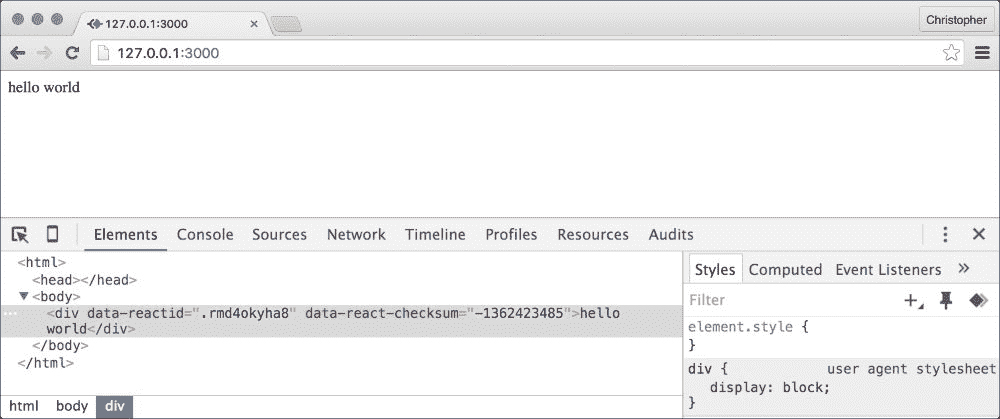
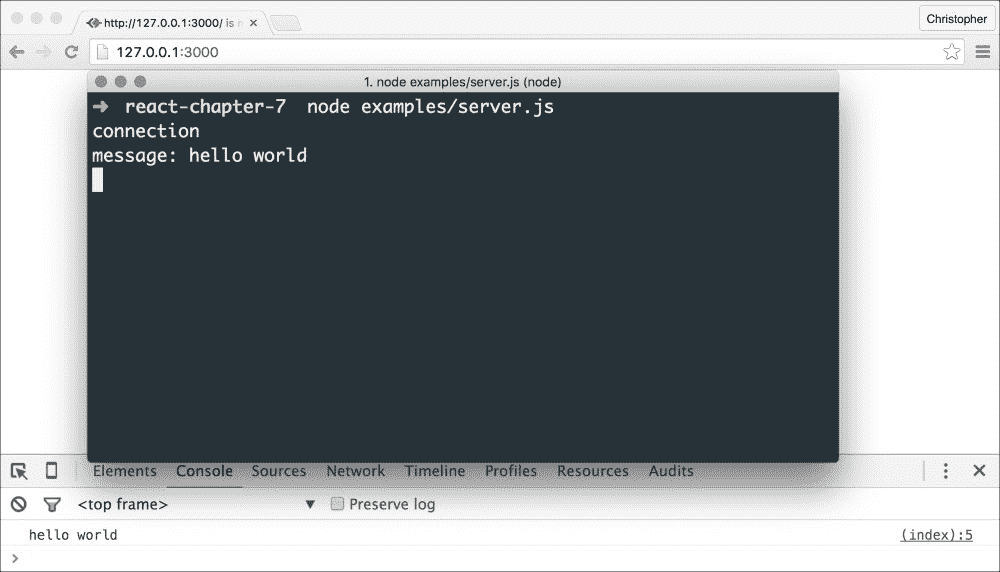

# 第七章. 服务器端渲染

在上一章中，你学习了如何在页面不重新加载的情况下渲染我们 CMS 的不同部分。我们甚至创建了一种方法来查看我们网站的公共页面，使用相同的路由技术。

到目前为止，我们都在浏览器中做所有事情。我们在本地存储中存储页面。我们像在互联网上托管一样使用网站和 CMS，但我们是我们唯一能看到它的人。如果我们想与他人分享我们的创作，我们需要某种服务器端技术。

在本章中，我们将简要了解服务器端 JavaScript 和 React 编程的一些方面。我们将看到 React 如何在浏览器之外工作，以及我们如何能够实时持久化和与他人共享数据。

# 将组件渲染为字符串

React 的一个美妙之处在于它可以在许多地方工作。它的目标是高效渲染界面，但这些界面可以扩展到 DOM 和浏览器之外。

你可以使用 React 来渲染原生移动界面([`facebook.github.io/react-native`](https://facebook.github.io/react-native))，或者甚至渲染纯 HTML 字符串。这在我们想要在不同地方重用组件代码时非常有用。

例如，我们可以为我们的 CMS 构建一个复杂的数据表组件。我们可以将这个组件发送到 iPad 应用程序，或者甚至从 Web 服务器渲染它，以减少页面加载时间。

我们将在本章尝试后者示例。首先，我们需要安装 React 和 React DOM 库的源版本：

```js
$ npm install --save babel-cli babel-preset-react babel-preset-es2015 react react-dom

```

我们已经看到了 React 库的例子，但这些新的（来自 BabelJS）将给我们一种在服务器上使用 ES6 和 JSX 的方法。它们甚至提供了通过 Node.js 直接运行代码的替代方案。通常，我们会使用以下命令来运行服务器端 JavaScript 代码：

```js
$ node server.js

```

但现在，我们可以使用 BabelJS 版本，如下所示：

```js
$ node_modules/.bin/babel-node server.js

```

我们需要告诉 BabelJS 应用哪些代码预设到我们的代码中。默认情况下，它将应用一些 ES6 转换，但不是全部。它也不会处理 JSX，除非我们加载那个预设。我们通过创建一个名为`.babelrc`的文件来实现这一点：

```js
{
  "presets": ["react", "es2015"]
}
```

我们习惯于看到 ES6 的`import`语句，但可能不习惯于 RequireJS 的`require`语句。它们在功能上相似，Node.js 使用它们作为从外部脚本导入代码的一种方式。

我们还需要一个名为`hello-world.js`的文件：

```js
var React = require("react");
var ReactDOMServer = require("react-dom/server");

console.log(
    ReactDOMServer.renderToString(<div>hello world</div>)
);
```

又有新东西了！我们加载了一个新的 React 库，名为`ReactDOMServer`，并从`div`组件中渲染一个字符串。通常我们会在浏览器中使用类似`React.render(component, element)`这样的方法。但在这里，我们只对组件生成的 HTML 字符串感兴趣。考虑运行以下代码：

```js
$ babel-node examples/server.js

```

当我们运行前面的命令时，我们会看到类似以下的内容：

```js
<div data-reactid=".yt0g9w8kxs" data-react-checksum="-1395650246">hello world</div>
```

也许并不完全符合我们的预期，但它看起来像有效的 HTML。我们可以使用它！

# 创建一个简单的服务器

现在我们能够将组件渲染为 HTML 字符串，那么有一种方法可以响应 HTTP 请求并返回 HTML 响应将更有用。

幸运的是，Node.js 还包含了一个小巧的 HTTP 服务器库。我们可以在`server.js`文件中使用以下代码来响应 HTTP 请求：

```js
var http = require("http");

var server = http.createServer(
    function (request, response) {
        response.writeHead(200, {
            "Content-Type": "text/html"
        });

        response.end(
            require("./hello-world")
        );
    }
);

server.listen(3000, "127.0.0.1");

```

要使用 HTTP 服务器库，我们需要引入/导入它。我们创建一个新的服务器，并在回调参数中响应单个 HTTP 请求。

对于每个请求，我们设置内容类型，并使用`hello-world.js`文件的 HTML 值进行响应。服务器监听端口`3000`，这意味着你需要打开`http://127.0.0.1:3000`来看到这个消息。

在我们这样做之前，我们还需要稍微调整`hello-world.js`：

```js
var React = require("react");
var ReactDOMServer = require("react-dom/server");

module.exports = ReactDOMServer.renderToString(
    <div>hello world</div>
);

```

`module.exports = ...`语句是 RequireJS 中我们习惯看到的`export default ...`语句的等效语句。结果是，当这个文件被其他模块引入时，它将返回组件的 HTML 字符串。

如果我们在浏览器中打开 URL（`http://127.0.0.1:3000`），我们应该看到一个`hello world`消息，检查它将显示类似 React HTML 的组件：



### 注意

你可以在[`nodejs.org/api/http.html`](https://nodejs.org/api/http.html)了解更多关于 Node.js HTTP 服务器的信息。

# 创建服务器后端

我们 CMS 仍然缺少的是公开的、持久的页面。到目前为止，我们已经在本地存储中存储了它们，在我们构建 CMS 组件时这是可以接受的。但总有一天，我们希望与世界分享我们的数据。

为了实现这一点，我们需要某种存储机制。即使这种存储只是服务器运行期间在内存中。当然，我们可以使用关系型数据库或对象存储来持久化我们的 CMS 页面。现在，让我们保持简单。一个内存存储（pages 变量）现在应该足够了。

那么，我们应该如何构建这个数据存储结构呢？无论我们选择哪种存储介质，接口都需要与服务器交互以存储和检索数据。我想探讨两种主流选项...

# 通过 Ajax 请求进行通信

Ajax 是一个常用的词。在本章中，我希望你只将其视为一种通过 HTTP 请求从服务器获取数据并将其发送到服务器的手段。

我们刚刚看到了如何响应 HTTP 请求，所以我们已经完成了一半！在这个阶段，我们可以检查请求以确定每个 HTTP 请求的 URL 和方法。浏览器可能会请求类似`GET http://127.0.0.1:3000/pages`的内容来获取所有页面。所以，如果方法匹配`POST`且路径匹配`/pages`，那么我们可以相应地返回适当的页面。

幸运的是，在我们之前已经有其他人走过这条路。例如 ExpressJS 这样的项目已经出现，为我们提供了一些脚手架。让我们来安装 ExpressJS：

```js
$ npm install --save express

```

现在，我们可以将我们的简单 HTTP 服务器转换为基于 ExpressJS：

```js
var app = require("express")();
var server = require("http").Server(app);

app.get("/", function (request, response) {
    response.send(
        require("./hello-world")
    );
});

server.listen(3000);
```

### 注意

记住，每次更改这些 JavaScript 文件后，你都需要重新启动 `node server.js` 命令。

这应该在浏览器中渲染得完全一样。然而，定义新事物的应用程序端点要容易得多：

```js
app.get("/", function (request, response) {
    response.send(
        require("./hello-world")
    );
});

app.get("/pages", function (request, response) {
    response.send(
        JSON.stringify([ /* ... */ ])
    );
});
```

### 注意

`JSON.stringify` 语句将 JavaScript 变量转换为字符串表示形式，这对于通过网络进行通信非常有用。

我们还可以访问 `app.post` 这样的方法来处理 `POST` 请求。为我们的后端数据设计 HTTP 端点非常容易。

然后，在浏览器中，我们需要一种方式来发送这些请求。一个常见的解决方案是使用 jQuery 这样的库。有时这确实是个好主意，但通常只有在你需要比 jQuery 提供的 Ajax 功能更多的时候才这样做。

如果你正在寻找一个轻量级的解决方案，可以尝试 SuperAgent ([`github.com/visionmedia/superagent`](https://github.com/visionmedia/superagent)) 或甚至新的 Fetch API ([`developer.mozilla.org/en/docs/Web/API/Fetch_API`](https://developer.mozilla.org/en/docs/Web/API/Fetch_API))：

```js
var options = {
    "method": "GET"
};

fetch("http://127.0.0.1/pages", options).then(
    function(response) {
        console.log(response);
    }
);
```

使用这种方法，我们可以逐渐用对服务器的调用替换后端中的本地存储部分。在那里，我们可以在数组、关系型数据库或对象存储中存储页面数据。

Ajax 是一种经过时间考验的浏览器和服务器之间通信的方法。它是一个得到良好支持的技巧，对于旧浏览器有许多种垫片（从 iframe 到 flash）。

### 注意

你可以在 [`expressjs.com`](http://expressjs.com) 上了解更多关于 ExpressJS 的信息。

# 通过 WebSocket 进行通信

有时，在浏览器和服务器之间进行快速的双向通信会更好。

在这样的时刻，你可以尝试使用 WebSocket。它们是 Ajax 中传统 HTTP 通信的升级。为了轻松地与之交互，我们需要 Socket.IO 的帮助：

```js
npm install --save socket.io

```

现在，我们可以访问一个新的对象，我们将称之为 `io`：

```js
// ...enable JSX/ES6 compilation

var app = require("express")();
var server = require("http").Server(app);
var io = require("socket.io")(server);

app.get("/", function (request, response) {
    response.send(
        require("./hello-world")
    );
});

// ...define other endpoints

io.on("connection", function (socket) {
 console.log("connection");

 socket.on("message", function (message) {
 console.log("message: " + message);

 io.emit("message", message);
 });
});

server.listen(3000);
```

### 注意

`"message"` 可以是任何内容。你可以通过将其更改为其他内容来发送不同类型的消息。如果你发送一个包含 `"chat message"` 或 `"page command"` 的消息，那么你需要为相同类型的消息添加事件监听器。

我们使用一个指向 HTTP 服务器的引用来创建一个新的 `io` 实例。WebSocket 连接始于一个 HTTP 请求，因此这是一个监听它们的良好位置。

当建立新的 WebSocket 连接时，我们可以开始监听消息。目前，我们只需将消息发送回去。Socket.IO 提供了 WebSocket 客户端脚本，但我们仍然需要连接并发送消息。让我们更新 `hello-world.js`：

```js
var React = require("react");
var ReactDOMServer = require("react-dom/server");

var script = {
 "__html": `
 var socket = io();

 socket.on("message", function (message) {
 console.log(message);
 });

 socket.emit("message", "hello world");
 `
};

module.exports = ReactDOMServer.renderToString(
    <div>
        <script src="img/socket.io.js"></script>
        <script dangerouslySetInnerHTML={script}></script>
    </div>
);
```

在这段代码中，有两个重要的事项需要注意：

+   我们可以使用多行字符串作为 ES6 语法的一部分。对于想要跨越多行的字符串，我们可以使用反引号而不是单引号或双引号。

+   我们可以通过 `dangerouslySetInnerHTML` 属性设置 innerHTML（这是我们需要做的，以便通过这个 HTTP 响应让 JavaScript 在浏览器中渲染）。 

    ### 注意

    你可以在[`facebook.github.io/react/tips/dangerously-set-inner-html.html`](https://facebook.github.io/react/tips/dangerously-set-inner-html.html)了解更多关于`dangerouslySetInnerHTML`的信息。

在我们的 WebSocket 示例中，数据流类似于以下内容：

1.  HTTP 和 WebSocket 服务器监听`http://127.0.0.1:3000`。

1.  对`/`的请求返回一些浏览器脚本。

1.  这些脚本开始向服务器发起连接请求。

1.  服务器接收到这些连接请求，并在连接成功打开后添加新消息的事件监听器。

1.  浏览器脚本为新消息添加事件监听器，并立即向服务器发送消息。

1.  服务器的事件监听器被触发，并将消息重新发送到所有打开的套接字。

1.  浏览器的事件监听器被触发，并将消息写入控制台。

    ### 注意

    在这个例子中，我们将消息（来自服务器）广播到所有打开的套接字。你可以使用类似`socket.emit("message", message)`的方式将消息限制在特定的套接字连接上。请查看 Socket.IO 文档中的示例。

你应该在控制台中看到`hello world`消息：



### 注意

你可以在[`socket.io`](http://socket.io)了解更多关于 Socket.IO 的信息。

# 结构化服务器端应用程序

当涉及到 HTTP 和 WebSocket 服务器时，通常将端点代码与服务器初始化代码分开是一个好主意。有些人喜欢创建单独的路由文件，这些文件可以被`server.js`文件引入。还有一些人喜欢将每个端点作为一个单独的文件，并将路由定义为`server.js`和这些“处理程序”文件之间的粘合剂。

这可能已经足够用于你将要构建的应用程序类型，或者你可能喜欢一个更规定的应用程序结构，例如 AdonisJS ([`adonisjs.com`](http://adonisjs.com))，例如。

Adonis 是一个为 Node.js 应用程序设计的结构优美的 MVC 框架。它使用许多酷炫的技巧（如生成器）来提供一个干净的 API，用于定义模板、请求处理程序和数据库代码。

一个典型的请求可以按以下方式处理：

```js
class HomeController {
    * indexAction (request, response) {
        response.send("hello world");
    }
}

module.exports = HomeController
```

你可以在名为`app/Http/Controllers/HomeController.js`的文件中定义这个类。为了在浏览器访问你的网站主页时渲染此文件，你可以在`app/Http/routes.js`中定义一个路由：

```js
const Route = use("Route");

Route.get("/", "HomeController.indexAction");
```

你可以结合一些持久的关系型数据库存储：

```js
const Database = use("Database");

const users = yield Database.table("users").select("*");
```

总的来说，AdonisJS 为原本开放和可解释的领域提供了很多结构。它让我想起了流行的 PHP 框架 Laravel，而 Laravel 本身又从流行的 Ruby on Rails 框架中汲取了灵感。

### 注意

你可以在[`adonisjs.com`](http://adonisjs.com)了解更多关于 AdonisJS 的信息。

# 摘要

在本章中，你学习了如何在服务器上渲染组件。我们创建了一个简单的 HTTP 服务器，并将其升级以允许多个端点和 WebSocket。最后，我们简要地探讨了如何结构化我们的服务器端代码，并快速了解了 AdonisJS MVC 框架。

在下一章中，你将学习一些流行的 React 设计模式，这些模式可以应用于你的组件和界面。
