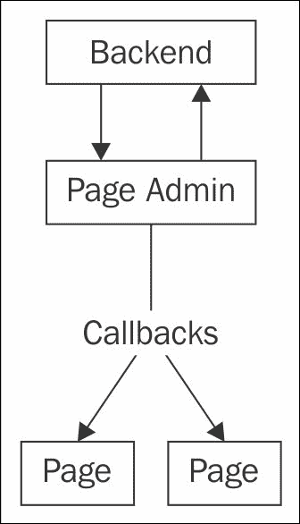
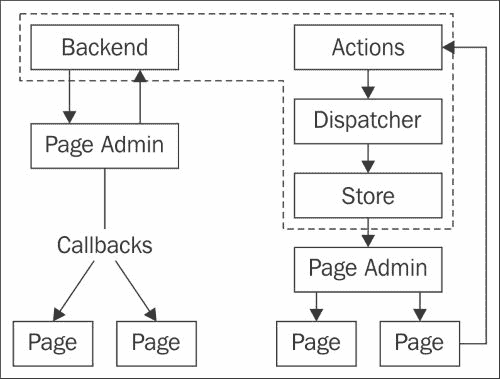
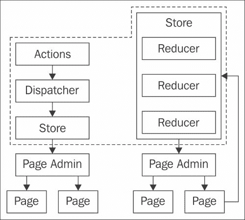

# 第八章。React 设计模式

在上一章中，我们探讨了服务器上的 React。我们创建了一个简单的 HTTP 服务器，随后是多个端点和 WebSocket。

在本章中，我们将回顾一下迄今为止构建的组件架构。我们将探讨几个流行的 React 设计模式以及我们如何对我们的架构进行细微的改进。

# 我们目前的位置

让我们看看迄今为止我们创建的内容以及它们是如何相互作用的。如果你一直密切关注，这些可能对你来说都很熟悉；但请继续关注。

我们将讨论这些交互是如何失败的，以及我们如何改进它们。从我们的界面开始渲染的那一刻起，我们就开始看到以下事情发生：

1.  我们首先创建一个后端对象。我们使用它作为我们应用程序中页面的存储。它具有`add`、`edit`、`delete`和`all`等方法。它还充当事件发射器，在页面更改时通知监听器。

1.  我们创建一个`PageAdmin` React 组件，并将`Backend`对象传递给它。`PageAdmin`组件使用`Backend`对象作为其他页面组件的数据源，所有这些组件都是在`PageAdmin`渲染方法中创建的。`PageAdmin`组件在挂载后立即监听`Backend`的变化。在卸载后停止监听。

1.  `PageAdmin`组件有几个回调，它将这些回调传递给它创建的其他页面组件。这些提供了子组件触发`Backend`对象变化的方式。

1.  通过用户交互，`PageEditor`和`PageView`等组件触发它们从`PageAdmin`接收的回调函数。然后这些函数触发`Backend`对象的变化。

1.  `Backend`中的数据发生变化。同时，`Backend`通知事件监听器数据已更改，而`PageAdmin`就是其中之一。

1.  `PageAdmin`组件将其内部状态更新为`Backend`页面的最新版本，这导致其他页面组件重新渲染。

我们可以这样想象：



我们甚至可以将现有的代码缩减到这个架构的必要部分。让我们在不使用样式或构建链的情况下重新实现列出和添加页面。我们可以将此作为本章后面进行架构改进的起点。这也会是一个回顾我们迄今为止看到的一些新 ES6 特性以及了解一些新特性的好地方。

### 注意

我不想在这里重复整个构建链，但我们确实需要一些帮助来在我们的代码中使用 ES6 和 JSX：

```js
$ npm install --save babel-cli babel-preset-react babel-preset-es2015 eventemitter3 react react-dom

```

我们在`.babelrc`中启用 ES6/JSX 转换器：

```js
{
  "presets": ["react", "es2015"]
}
```

我们可以使用以下命令运行此代码：

```js
$ node_modules/.bin/babel-node index.js

```

这将转换`index.js`中的 ES6/JSX 代码以及它导入的所有文件。

我们从`src/backend.js`文件开始：

```js
import Emitter from "eventemitter3";

class Backend extends Emitter {
    constructor() {
        super();

        this.id = 1;
        this.pages = [];
    }

    add() {
        const id = this.id++;
        const title = `New Page ${id}`;

        const page = {
            id,
            title
        };

        this.pages.push(page);
        this.emit("onAdd", page);
    }

    getAll() {
        return this.pages;
    }
}

export default Backend;
```

`Backend` 是一个具有内部 `id` 和 `pages` 属性的类。`id` 属性作为每个新页面对象的自动递增身份值。它有 `add` 和 `getAll` 方法，分别用于添加新页面和返回所有页面。

在 ES6 中，我们可以定义常量（在定义和分配后不能更改的变量）。当我们需要只定义一次变量时，它们非常有用，因为它们可以防止意外的更改。

我们分配下一个身份值并增加内部 `id` 属性，以便下一个身份值将不同。ES6 模板字符串允许我们插入变量（就像我们对身份值所做的那样）并定义多行字符串。

我们可以使用新的 ES6 对象字面量语法定义具有与定义的局部变量名称匹配的键的对象。换句话说，`{ title }` 与 `{ title: title }` 的意思相同。

每次添加新页面时，`Backend` 都会向任何监听器发出 `onAdd` 事件。我们可以通过以下代码（在 `index.js` 中）看到所有这些操作：

```js
import Backend from "./src/backend";

let backend = new Backend();

backend.on("onAdd", (page) => {
    console.log("new page: ", page);
});

console.log("all pages: ", backend.getAll());

backend.add();
console.log("all pages: ", backend.getAll());
```

在 ES6 中，`let` 关键字与 `var` 的工作方式类似。区别在于 `var` 的作用域是包含函数，而 `let` 的作用域是包含块：

```js
function printPages(pages) {
    for (var i = 0; i < pages.length; i++) {
        console.log(pages[i]);
    }

    // i == pages.length - 1 

    for (let j = 0; j < pages.length; j++) {
        console.log(pages[j]);
    }

    // j == undefined
}
```

如果你运行这个 `Backend` 代码，你应该看到以下输出：

```js
all pages:  []
new page:  { id: 1, title: 'New Page 1' }
all pages:  [ { id: 1, title: 'New Page 1' } ]
```

我们可以将此与 `PageAdmin` 组件（在 `src/page-admin.js` 中）结合使用：

```js
import React from "react";

const PageAdmin = (props) => {
    return (
        <div>
            <a href="#"
                onClick={(e) => {
                    e.preventDefault();
                    props.backend.add();
                }}>
                add page
            </a>
            <ol>
                {props.backend.all().map((page) => {
                    return (
                        <li key={page.id}>
                            {page.title}
                        </li>
                    );
                })}
            </ol>
        </div>
    );
};

export default PageAdmin;
```

这是之前 `PageAdmin` 组件的无状态函数版本。我们可以使用以下代码（在 `index.js` 中）：

```js
import Backend from "./src/backend";
import PageAdmin from "./src/page-admin";
import React from "react";
import ReactDOMServer from "react-dom/server";

let backend = new Backend();

backend.add();
backend.add();
backend.add();

console.log(
    ReactDOMServer.renderToString(
        <PageAdmin backend={backend} />
    )
);
```

这将生成以下输出：

```js
<div data-reactid=".51gm9pfn5s" data-react-checksum="865425333">
    <a href="#" data-reactid=".51gm9pfn5s.0">add page</a>
    <ol data-reactid=".51gm9pfn5s.1">
        <li data-reactid=".51gm9pfn5s.1.$1">New Page 1</li>
        <li data-reactid=".51gm9pfn5s.1.$2">New Page 2</li>
        <li data-reactid=".51gm9pfn5s.1.$3">New Page 3</li>
    </ol>
</div>
```

现在，如果我们将其渲染到 HTML 页面中，我们会点击 **添加页面** 链接，并在 `Backend` 内部的现有页面列表中添加一个新页面。我们还创建了一个 `PageAdmin` 类，以便我们可以在 `componentWillMount` 生命周期方法中添加事件监听器。然后，这个监听器将更新子 `Page` 组件的页面数组。

`PageAdmin` 组件用于渲染 `Page` 组件，这些组件反过来渲染 `PageView` 和 `PageEditor` 组件以显示和编辑页面。我们通过每一层传递回调函数，以便每个组件都可以在不知道它如何存储或操作数据的情况下触发 `Backend` 对象中的更改。

# Flux

在这个阶段，我们遇到了第一个设计模式（以及我们可以做出的改进）。Flux 是 Facebook 提出的一种模式，它定义了界面中数据的流动。

### 注意

Flux 不是一个库，但 Facebook 已经发布了一些工具来帮助实现设计模式。你不必使用这些工具来实现 Flux。要安装它，除了之前的依赖项外，运行 `npm install --save flux`。

我们实现了一个非常接近 Flux 的东西，但我们的实现存在一些劣势。我们的 `Backend` 类做得太多。我们直接调用它来添加和获取页面。当添加新页面时，它会发出事件。它与使用它的组件紧密耦合。

因此，我们很难用一个新的`Backend`类来替换它（除非方法、事件和返回值都完全相同格式）。我们很难使用多个数据后端。我们甚至没有真正实现单向数据流，因为我们从`Backend`发送和接收数据。

Flux 在这里有所不同；它为*制作更改*和*获取数据*定义了单独的对象。我们的`Backend`类成为前者的*分发器*和后者的*存储*。更重要的是，更改应用程序状态的指令采用消息对象的形式（称为*操作*）。

我们可以这样想象：



### 注意

这些代码示例将需要另一个库，您可以使用`npm install --save flux`来安装。

我们可以通过创建一个新的`PageDispatcher`对象来实现这个设计变更（在`src/page-dispatcher.js`中）：

```js
import { Dispatcher } from "flux";

const pageDispatcher = new Dispatcher();

export default pageDispatcher;
```

`Dispatcher`类并不复杂。它有几个方法，我们很快就会用到。重要的是要注意，我们导出的是`Dispatcher`类的一个实例，而不是一个子类。我们只需要一个分发器来处理页面操作。因此，我们将其用作一种单例，尽管我们没有专门编写代码使其成为单例。

### 注意

如果你不太熟悉单例模式，你可以在[`en.wikipedia.org/wiki/Singleton_pattern`](https://en.wikipedia.org/wiki/Singleton_pattern)上了解它。基本思想是我们为某物（或在这种情况下，使用现有类）创建一个类，但我们只创建和使用该类的一个实例。

这个变化的第二部分是一个名为`PageStore`的类，我们在`src/page-store.js`中创建它：

```js
import Emitter from "eventemitter3";
import PageDispatcher from "./page-dispatcher";

class PageStore extends Emitter {
    constructor() {
        super();

        this.id = 1;
        this.pages = [];
    }

    add() {
        // ...add new page
    }

    getAll() {
        return this.pages;
    }
}

const pageStore = new PageStore();

PageDispatcher.register((payload) => {
    if (payload.action === "ADD_PAGE") {
        pageStore.add();
    }

    pageStore.emit("change");
});

export default pageStore;
```

这个类与`Backend`类非常相似。一个显著的变化是我们不再在添加新页面后发出`onAdd`事件。相反，我们在`PageDispatcher`上注册了一种事件监听器，这就是我们知道要将新页面添加到`PageStore`的原因。直接调用`PageStore.add`是可能的，但在这里，我们是在响应发送到`PageDispatcher`的操作时这样做。这些操作看起来是这样的（在`src/index.js`中）：

```js
import PageAdmin from "./src/page-admin";
import PageDispatcher from "./src/page-dispatcher";
import PageStore from "./src/page-store";

PageStore.on("change", () => {
    console.log("on change: ", PageStore.getAll());
});

console.log("all pages: ", PageStore.getAll());

PageDispatcher.dispatch({
    "action": "ADD_PAGE"
});

console.log("all pages: ", PageStore.getAll());
```

### 注意

分发器会在所有注册的存储中触发事件监听器。如果你通过分发器发出一个操作，无论有效负载如何，所有存储都将被通知。

现在，存储不仅管理对象集合（如我们的页面）。它们不是一个应用程序数据库。它们旨在存储所有应用程序状态。也许我们应该更改一些方法来使其更清晰，从`src/page-store.js`开始：

```js
class PageStore extends Emitter {
    constructor() {
        super();

        this.id = 1;
        this.pages = [];
    }

    handle(payload) {
        if (payload.action == "ADD_PAGE") {
            // ...add new page
        }
    }
    getState() {
        return {
            "pages": this.pages
        };
    }
}

const pageStore = new PageStore();

PageDispatcher.register((payload) => {
    if (payload.action === "ADD_PAGE") {
        pageStore.handle(payload);
    }

    pageStore.emit("change");
});
```

我们仍然称这个存储为`PageStore`，但它可以存储除了页面数组之外的其他多种状态。例如，它可以存储过滤和排序状态。对于每个新的操作，我们只需要在`handle`方法中添加一些代码。

我们还需要调整`index.js`中的调用代码：

```js
PageStore.on("change", () => {
    console.log("change: ", PageStore.getState());
});

console.log("all state: ", PageStore.getState());

PageDispatcher.dispatch({
    "action": "ADD_PAGE"
});

console.log("all state: ", PageStore.getState());
```

当我们运行这个程序时，我们应该看到以下输出：

```js
all state:  { pages: [] }
change:  { pages: [ { id: 1, title: 'New Page 1' } ] }
all state:  { pages: [ { id: 1, title: 'New Page 1' } ] }
```

现在，我们需要在`src/page-admin.js`中实现这些变更：

```js
import React from "react";
import PageDispatcher from "./page-dispatcher";
import PageStore from "./page-store";
class PageAdmin extends React.Component {
    constructor() {
        super();
        this.state = PageStore.getState();
       this.onChange = this.onChange.bind(this);
    }
    componentDidMount() {
        PageStore.on("change", this.onChange);
    }
    componentWillUnmount() {
        PageStore.removeListener("change", this.onChange);
    }
    onChange() {
        this.setState(PageStore.getState());
    }
    render() {
        return (
            <div>
                <a href="#"
                    onClick={(e) => {
                        e.preventDefault();

                        PageDispatcher.dispatch({
                            "action": "ADD_PAGE"
                        });
                    }}>
                    add page
                </a>
                <ol>
                    {this.state.pages.map((page) => {
                        return (
                            <li key={page.id}>
                                {page.title}
                            </li>
                        );
                    })}
                </ol>
            </div>
        );
    }
};

export default PageAdmin;
```

最后，我们可以更新`index.js`以反映这些新的变化：

```js
import PageAdmin from "./src/page-admin";
import PageDispatcher from "./src/page-dispatcher";
import PageStore from "./src/page-store";
import React from "react";
import ReactDOMServer from "react-dom/server";

PageDispatcher.dispatch({
    "action": "ADD_PAGE"
});

// ...dispatch the same thing a few more times

console.log(
    ReactDOMServer.renderToString(
        <PageAdmin />
    )
);
```

如果我们运行这段代码，我们会看到与之前实现 Flux 之前相同的输出。

## 使用 Flux 的好处

在某种意义上，我们仍然紧密耦合了渲染界面元素的代码和存储及操作状态的代码。我们只是在它们之间建立了一点点障碍。那么，我们从这种方法中获得了什么？

首先，Flux 是 React 应用程序中流行的设计模式。我们可以谈论动作、调度器和存储，并且可以确信其他 React 开发者会确切地知道我们的意思。这降低了将新开发者引入 React 项目的学习曲线。

我们还分离了状态存储和用户及系统动作。我们有一个单一的、通用的对象，我们可以通过它发送动作。这些动作可能会导致多个存储的变化，进而触发我们界面多个部分的变化。在我们的简单示例中，我们不需要多个存储，但复杂界面可以从多个存储中受益。在这些情况下，一个调度器和多个存储可以很好地协同工作。

### 注意

值得注意的是，虽然我们命名了 Flux 调度器，以便我们可以有多个调度器，但应用程序通常只有一个。数据后端和调度器作为单例也很常见。我选择根据我们开始和结束应用程序的方式偏离这一点。

# Redux

Flux 引导我们将`Backend`类分离成调度器和存储，作为从单个状态存储和实现中解耦的手段。这导致了很多样板代码，我们仍然有一些耦合（到全局调度器和存储对象）。有一些术语可以工作当然很好，但这并不感觉是最好的解决方案。

如果我们能够解耦动作和存储并移除全局对象会怎样？这正是 Redux 试图做到的，同时减少样板代码并带来更好的整体标准。

### 注意

您可以通过运行`npm install --save redux react-redux`来下载 Redux 工具，除了之前的依赖项。Redux 也是一个模式，但这些库中的工具将极大地帮助设置这些事情。

Redux 一开始可能难以理解，但有一些简单的底层事物将它们联系在一起。首先，所有状态都存储在不可变对象中的想法。这种状态应该只通过纯函数进行转换，这些纯函数接受当前状态并产生新的状态。这些纯函数有时也被称为幂等的，这意味着它们可以多次运行（使用相同的输入）并每次都产生完全相同的结果。让我们通过`index.js`中的代码来探讨这个想法：

```js
const transform = (state, action) => {
    let id = 1;
    let pages = state.pages;

    if (action.type == "ADD_PAGE") {
        pages = [
            ...state.pages,
            {
                "title": "New Page " + id,
                "id": id++
            }
        ];
    }

    return {
        pages
    };
};

console.log(
    transform({ "pages": [] }, { "type": "ADD_PAGE" })
);
```

在这里，我们有一个函数，它接受一个初始状态值，并在存在与为 Flux 创建的相同类型的动作的情况下修改它。这是一个没有副作用（side-effects）的纯函数。返回一个新的状态对象，我们甚至使用 ES6 扩展运算符（spread operator）作为将页面连接到一个新数组的方式。这实际上与以下操作相同：

```js
pages = pages.concat({
    "title": "New Page " + id,
    "id": id++
});
```

当我们在数组前缀上使用 `...` 时，其值会像我们逐行写出它们一样展开。这个转换函数被称为 *还原器*，这个名字来源于 *MapReduce* 的 reduce 部分 ([`en.wikipedia.org/wiki/MapReduce`](https://en.wikipedia.org/wiki/MapReduce))。也就是说，Redux 将还原器定义为通过一个或多个还原器将初始状态减少到新状态的一种方式。

我们将这个还原器（reducer）给一个类似于为 Flux 创建的存储：

```js
import { createStore } from "redux";

const transform = (state = { "pages": [] }, action) => {
    // ...create a new state object, with a new page
};

const store = createStore(transform);

store.dispatch({ "type": "ADD_PAGE" });

console.log(
    store.getState()
);
```

存储也充当调度器，所以这更接近我们的原始代码。我们在存储上注册监听器，以便我们可以通知状态的变化。我们可以使用类似于为 Flux 创建的 `PageAdmin` 组件（在 `src/page-admin.js` 中）：

```js
import React from "react";

class PageAdmin extends React.Component {
    constructor(props) {
        super(props);
        this.state = this.props.store.getState();
 this.onChange = this.onChange.bind(this);
    }
    componentDidMount() {
        this.removeListener = 
            this.props.store.register(this.onChange);
    }
    componentWillUnmount() {
        this.removeListener();
    }
    onChange() {
        this.setState(this.props.store.getState());
    }
    render() {
        return (
            <div>
                <a href="#"
                    onClick={(e) => {
                        e.preventDefault();

                        this.props.store.dispatch({
                            "type": "ADD_PAGE"
                        });
                    }}>
                    add page
                </a>
                <ol>
                    {this.state.pages.map((page) => {
                        // ...render each page
                    })}
                </ol>
            </div>
        );
    }
};

export default PageAdmin;
```

此外，我们只需对 `index.js` 进行一些小的修改就可以渲染所有这些内容：

```js
import { createStore } from "redux";
import PageAdmin from "./src/page-admin";
import React from "react";
import ReactDOMServer from "react-dom/server";

const transform = (state = { "pages": [] }, action) => {
    let id = 1;
    let pages = state.pages;

    if (action.type == "ADD_PAGE") {
        pages = [
            ...state.pages,
            {
                "title": "New Page " + id,
                "id": id++
            }
        ];
    }

    return {
        pages
    };
};

const store = createStore(transform);

store.dispatch({ "type": "ADD_PAGE" });

console.log(
    ReactDOMServer.renderToString(
        <PageAdmin store={store} />
    )
);
```

我们可以想象一个 Redux 应用程序是这样的：



因此，我们已经移除了全局依赖。我们几乎回到了起点——从我们的原始代码到 Flux，再到 Redux。

## 使用上下文

随着你构建越来越复杂的组件，你可能会发现所有这些做法的一个令人沮丧的副作用。在 Redux 中，存储（store）充当调度器（dispatcher）的角色。因此，如果你想从组件层次结构深处的组件中分发（dispatch）动作，你需要将存储通过多个可能甚至不需要它的组件传递。

暂时考虑构建我们的 CMS 接口组件，以便直接将动作分发到存储。我们可能会得到一个类似以下的层次结构：

```js
React.render(
    <PageAdmin store={store}>
        {store.getState().pages.map((page) => {
            <Page key={page.id} store={store}>
                <PageView {...page} store={store} />
                <PageEditor {...page} store={store} />
            </Page>
        })}
    </PageAdmin>
    document.querySelector(".react")
);
```

### 注意

那些嵌套组件也可以是 `render` 方法的一部分。

将这些存储逐级传递到界面中的每个组件级别变得令人厌烦。幸运的是，有一个解决这个问题的方法。它被称为 *上下文*，它的工作方式如下。首先，我们创建一个新的组件，并修改 `index.js` 中的渲染方式：

```js
class Provider extends React.Component {
    getChildContext() {
        return {
            "store": this.props.store
        };
    }
    render() {
        return this.props.children;
    }
}

Provider.childContextTypes = {
    "store": React.PropTypes.object
};

console.log(
    ReactDOMServer.renderToString(
        <Provider store={store}>
            <PageAdmin />
        </Provider>
    )
);
```

新组件被称为 `Provider`，它渲染所有嵌套组件而不做任何修改。然而，它确实定义了一个新的生命周期方法，称为 `getChildContext`。这个方法返回一个对象，其中包含我们希望嵌套组件获得的属性值。这些值类似于 `props`；然而，它们是隐式提供给嵌套组件的。

除了 `getChildContext` 之外，我们还需要定义 `Provider.childContextTypes`。这些 `React.PropTypes` 应该与我们从 `getChildContext` 返回的内容相匹配。同样，我们需要修改 `PageAdmin`：

```js
class PageAdmin extends React.Component {
    constructor(props, context) {
        super(props, context);
        this.state = context.store.getState();
        this.onChange = this.onChange.bind(this);
    }
    componentDidMount() {
        this.removeListener =
            this.context.store.register(this.onChange);
    }
    componentWillUnmount() {
        this.removeListener();
    }
    onChange() {
        this.setState(this.context.store.getState());
    }
    render() {
        return (
            <div>
                <a href="#"
                    onClick={(e) => {
                        e.preventDefault();

                        this.context.store.dispatch({
                            "type": "ADD_PAGE"
                        });
                    }}>
                    add page
                </a>
                <ol>
                    {this.state.pages.map((page) => {
                        // ...render each page
                    })}
                </ol>
            </div>
        );
    }
};

PageAdmin.contextTypes = {
    "store": React.PropTypes.object
};

```

当我们定义 `PageAdmin.contextTypes` 时，我们允许层次结构中更高层的组件向 `PageAdmin` 提供它们的上下文。在这种情况下，上下文将包含对存储的引用。为此，我们将 `props.store` 改为 `context.store`。

这在 Redux 架构中是一个常见的现象。它如此普遍，以至于这样的 `Provider` 组件是 Redux 工具的标准组成部分。我们可以用从 *ReactRedux* 导入的 `Provider` 实现来替换我们的 `Provider` 实现：

```js
import { Provider } from "react-redux";

console.log(
    ReactDOMServer.renderToString(
        <Provider store={store}>
            <PageAdmin />
        </Provider>
    )
);
```

我们甚至不需要定义 `Provider.childContextTypes`。然而，我们仍然需要定义 `PageAdmin.contextTypes` 以选择加入提供的环境。

## Redux 的优势

Redux 正在变得越来越受欢迎，这并不令人惊讶。它拥有 Flux 的所有优势（例如真正的单向数据流和减少对单一后端实现的耦合）而没有所有样板代码。关于 Redux 还有更多东西要学习，但我们所涵盖的内容将为你开始构建更好的应用程序打下坚实的基础！

### 注意

你可以在 [`egghead.io/series/getting-started-with-redux`](https://egghead.io/series/getting-started-with-redux) 了解更多关于 Redux 的信息。这是一套由 Redux 创作者制作的精彩视频课程。

# 摘要

在本章中，你学习了我们可以用来构建更好的 React 应用程序的现代架构设计模式。我们从 Flux 模式开始，然后转向 Redux。

在下一章中，我们将探讨如何创建基于插件的组件，以便我们的界面可以被他人扩展。
