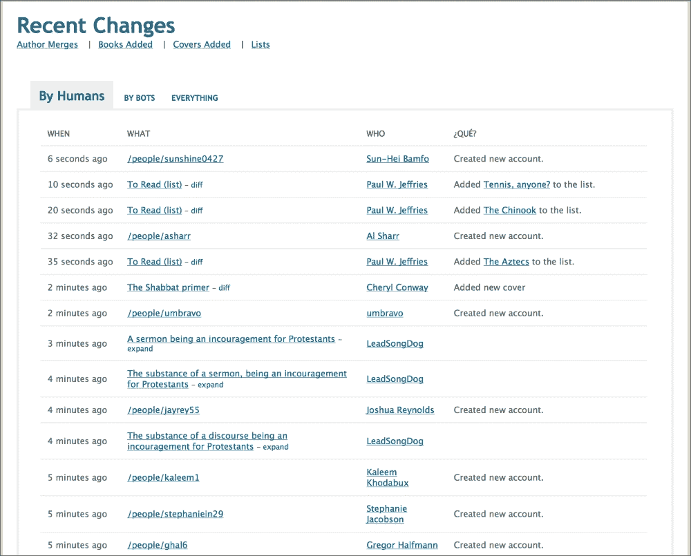
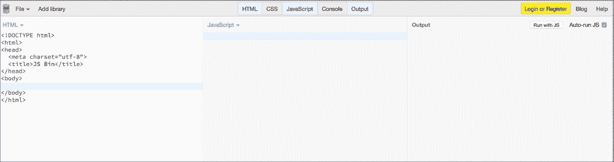
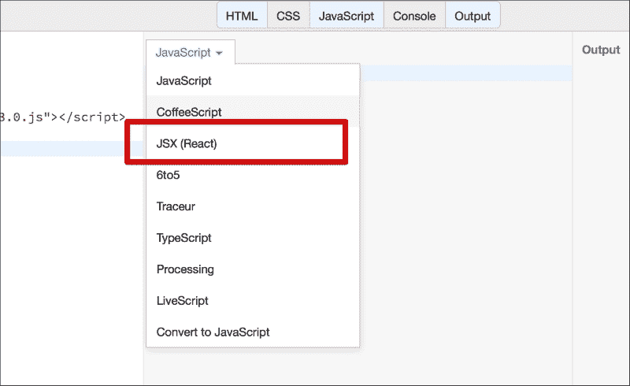
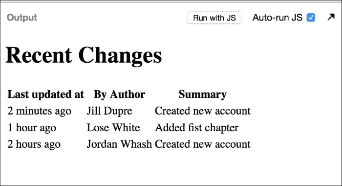

# 第一章：React 入门

在过去几年中，Web 开发领域迎来了**单页应用**（SPA）的巨大发展。早期的开发相对简单——通过重新加载整个页面来执行显示或用户操作的改变。这种做法的问题在于，整个请求从客户端到达服务器并返回客户端需要巨大的往返时间。

然后出现了 AJAX，它向服务器发送请求，可以在不重新加载当前页面的情况下更新页面的一部分。沿着相同的方向，我们看到了 SPA 的出现。

将大量前端内容封装起来，仅一次交付给客户端浏览器，同时基于任何事件与服务器保持小通道的通信；这通常由网络服务器上的轻量级 API 来补充。

这种应用的增长得到了 JavaScript 库和框架如 Ext JS、KnockoutJS、BackboneJS、AngularJS、EmberJS 等的补充，最近还有 React 和 Polymer。

让我们来看看 React 如何融入这个生态系统，并在本章中对其进行介绍。

在本章中，我们将涵盖以下主题：

+   什么是 React 以及为什么我们要使用 React？

+   数据在组件中流动

+   组件根据组件的状态显示视图

+   组件定义了视图的显示，无论包含什么数据，从而减少了显示对状态的依赖和复杂性

+   用户交互可能会通过处理程序改变组件的状态

+   组件被重用和重新渲染

# 什么是 React？

ReactJS 试图从*视图*层解决问题。它可以很好地定义并用作任何*MVC*框架中的*V*。它对如何使用它没有意见。它创建了视图的抽象表示。它在*组件*中分解视图的各个部分。这些组件既包含处理视图显示的逻辑，也包含视图本身。它可以包含用于渲染应用状态的所需数据。

为了避免复杂交互和随后的渲染处理，React 会对应用进行完整的渲染。它保持简单的工作流程。

React 基于这样一个理念：DOM 操作是一个昂贵的操作，应该尽量减少。它还认识到，手动优化 DOM 操作将导致大量*样板代码*，这些代码容易出错、无聊且重复。

React 通过为开发者提供一个虚拟 DOM 来渲染，而不是实际的 DOM，来解决这一问题。它找出真实 DOM 和虚拟 DOM 之间的差异，并执行所需的最小 DOM 操作以实现新状态。

React 也是声明式的。当数据发生变化时，React 概念上点击刷新按钮，并知道只更新更改的部分。

这种简单的数据流，加上极其简单的显示逻辑，使得使用 ReactJS 进行开发变得直接且易于理解。

谁使用 React？如果你使用过 Facebook、Instagram、Netflix、阿里巴巴、Yahoo、E-Bay、可汗学院、AirBnB、索尼和 Atlassian 等任何服务，你已经在 Web 上遇到过并使用过 React。

在不到一年的时间里，React 已经在主要互联网公司的核心产品中得到了采用。

在其首次会议上，React 还宣布了 React Native 的开发。React Native 允许使用 React 开发移动应用程序。它将 React 代码转换为原生应用程序代码，例如 iOS 应用程序的 Objective-C。

在撰写本文时，Facebook 已经在其群组和广告管理器应用中使用了 React Native。

在这本书中，我们将跟随两位开发者迈克和肖恩之间的对话。迈克是 Adequate 咨询的高级开发者，肖恩刚刚加入公司。迈克将指导肖恩，并与他进行结对编程。

# 当肖恩遇到迈克和 ReactJS

在 Adequate 咨询，这是一个晴朗的日子。这也是肖恩在公司第一天。肖恩加入 Adequate 是为了工作于其惊人的产品，并且因为它使用和开发令人兴奋的新技术。

在加入公司后，CTO 雪莉向肖恩介绍了迈克。迈克是 Adequate 的高级开发者，他是个乐天的人，喜欢探索新事物。

“肖恩，这是迈克，”雪莉说，“他将会指导你，也会与你一起进行开发。我们遵循结对编程，所以和他一起你会有很多这样的机会。他是个极好的帮手。”

随着这句话，雪莉离开了。

“嗨，肖恩！”迈克开始说，“你准备好开始了吗？”

“是的，都准备好了！那么我们在做什么？”

“嗯，我们即将开始开发一个使用[`openlibrary.org/`](https://openlibrary.org/)的应用。Open Library 是世界经典文学的集合。它是一个面向所有书籍的开放、可编辑的图书馆目录。它是[`archive.org/`](https://archive.org/)下的一个倡议，列出了免费书籍的标题。我们需要构建一个应用来显示 Open Library 记录的最新更改。你可以称之为**活动**页面。许多人向 Open Library 做出了贡献。我们希望显示这些用户对书籍所做的更改、新增书籍、编辑等，如下面的截图所示：



“哦，太好了！我们用它来构建什么？”

“Open Library 为我们提供了一个整洁的 REST API，我们可以消费它来获取数据。我们只是将要构建一个简单的页面来显示获取的数据，并对其进行格式化以供显示。我一直在尝试并使用 ReactJS 来做这件事。你之前用过它吗？”

“没有。不过，我听说过它。难道不是来自 Facebook 和 Instagram 的那个吗？”

“没错。这是一个定义我们 UI 的绝佳方式。由于应用在服务器上不会有太多逻辑或执行任何显示，所以使用它是一个简单选择。”

“既然你之前没有使用过，让我给你做一个快速介绍。”

"你之前尝试过 JSBin 和 JSFiddle 这样的服务吗？"

"不，但我见过它们。"

"酷。我们将使用其中之一，因此我们不需要在我们的机器上设置任何东西来开始。"

"让我们在你的机器上试一试"，迈克指示道。“打开[`jsbin.com/?html,output`](http://jsbin.com/?html,output)”

"你应该会看到类似标签和代码的选项卡以及它们在相邻面板中的输出。"



"请确保**HTML**、**JavaScript**和**输出**标签被点击，这样我们就可以看到它们的三个框架，以便我们能够编辑 HTML 和 JS 并看到相应的输出。"

"很好。"

"是的，这个的好处是您不需要进行任何设置。你注意到**自动运行 JS**选项了吗？请确保它被选中。此选项会导致 JSBin 重新加载我们的代码并查看其输出，这样我们就不需要不断说**用 JS 运行**来执行并查看其输出了。"

"好的。"

# 需要 React 库

"那么，让我们开始吧。请将页面的标题改为`React JS Example`。接下来，我们需要设置，并在我们的文件中需要 React 库。"

"React 的主页位于[`facebook.github.io/react/`](http://facebook.github.io/react/)。在这里，我们也会找到可供我们使用的下载，以便我们可以将它们包含在我们的项目中。有不同方式来包含和使用这个库。"

我们可以使用 bower 或通过 npm 安装。我们也可以直接从 fb.me 域下载它，作为一个单独的下载。这里有开发版本，它是库的完整版本，以及生产版本，它是其最小化版本。还有一个附加版本。我们稍后会看看这个。"

"让我们从使用开发版本开始，这是 React 源代码的非最小化版本。将以下内容添加到文件标题："

```js
<script src="img/react-0.13.0.js"></script>
```

"完成了。"

"太棒了，让我们看看这看起来怎么样。"

```js
<!DOCTYPE html>
<html>
<head>
  <script src="img/react-0.13.0.js"></script>
  <meta charset="utf-8">
  <title>React JS Example</title>
</head>
<body>

</body>
</html>
```

# 构建我们的第一个组件

"肖恩，我们已经准备好开始了。让我们构建我们的第一个 React 应用。请将以下代码添加到 JSBin 的 JavaScript 部分："

```js
var App = React.createClass({
  render: function(){
    return(React.createElement("div", null, "Welcome to Adequate, Mike!"));
  }
});

React.render(React.createElement(App), document.body);
```

"这就是它。你应该会看到页面的输出部分显示类似以下的内容："

```js
   Welcome to Adequate, Mike!
```

"迈克，我注意到我们正在使用这个 React 对象来创建类？"

"没错。我们正在创建，在 React 中被称为组件的东西。"

"ReactJS 库的入口点是 React 对象。一旦包含了`react.js`库，它就会在全局 JavaScript 命名空间中对我们可用。"

"`React.createClass`创建一个具有给定规范的组件。组件必须实现返回单个子元素的`render`方法，如下所示："

```js
var App = React.createClass({
  render: function(){
    return(React.createElement("div", null, "Welcome to Adequate, Mike!"));
  }
});
```

React 将负责调用组件的`render`方法来生成 HTML。

### 注意

即使渲染方法需要返回一个子元素，这个子元素也可以有一个任意深度的结构来包含完整的 HTML 页面部分。

"在这里，我们使用`React.createElement`来创建我们的内容。这是一个单例方法，允许我们创建一个包含"`Welcome to Adequate, Mike!`"内容的`div`元素。`React.createElement`创建一个`ReactElement`，这是 React 使用的 DOM 元素的内部表示。我们将 null 作为第二个参数传递。这是用来传递和指定元素属性的。目前，我们将其留空以创建一个简单的`div`。"

"`ReactElement`的类型可以是有效的 HTML 标签名，如`span`、`div`、`h1`等，或者是由`React.createClass`本身创建的组件。"

"一旦我们完成了组件的创建，就可以使用`React.render`方法如下显示它："

```js
React.render(React.createElement(App), document.body);
```

"在这里，我们为之前创建的`App`组件创建了一个新的`ReactElement`，然后将其渲染到 HTML 元素——`document.body`中。这被称为`mountNode`，或我们组件的挂载点，它充当根节点。我们不是直接将`document.body`作为组件的容器传递，任何其他 DOM 元素也可以传递。"

"迈克，请将传递给`div`的文本更改为`Hello React World!`。我们应该开始看到变化，并且它应该看起来类似于以下内容："

```js
Hello React World!
```

"很好。"

"迈克，在构建第一个组件的同时，我们还对 React 的顶级 API 有一个概述，即使用`React.createClass`、`React.createElement`和`React.render`。"

"现在，我们刚刚构建的用于显示此问候消息的组件非常简单直接。然而，当构建复杂事物时，语法可能会变得具有挑战性，并且随着构建复杂事物的增长而增长。这就是 JSX 派上用场的地方。"

"JSX 吗？"

"JSX 是 ECMAScript 的 XML-like 语法扩展，没有定义任何语义。它具有简洁且熟悉的语法，与纯 HTML 相似，对于设计师或非程序员来说都很熟悉。它也可以直接从我们的 JavaScript 文件中使用！"

"什么？这不是很糟糕吗？"

"嗯，是时候重新思考最佳实践了。没错，我们将把视图及其 HTML 放入 JavaScript 文件中！"

"让我们看看如何开始使用它。请继续更改我们的 JavaScript 文件内容如下："

```js
var App = React.createClass({
  render: function(){
    return <div>
     Hello, from Shawn!
    </div>;
  }
});

React.render(React.createElement(App), document.body);
```

"正如你所见，我们在这里所做的是，我们没有使用`createElement`，而是直接编写了`div`标签。这非常类似于直接编写 HTML 标记。它也可以直接从 JavaScript 文件中工作。"

"迈克，代码在 JSBin 上抛出了一些错误。"

"哦，对了。我们需要使用 JSX 转换器库，以便 React 和浏览器可以理解语法。在我们的情况下，我们需要将我们使用的 JavaScript 类型更改为用于解释此代码的类型。我们需要做的是从 JavaScript 帧标题的下拉菜单中将类型从**JavaScript**更改为**JSX (React)**，如下所示："



"这就完成了。"

"看起来不错，迈克。它正在工作。"

"现在你将看到以下类似的内容："

```js
Hello, from Shawn!
```

# "回到工作状态"

"肖恩，这是个好开始。现在让我们回到使用 Open Library 的 Recent changes API 构建我们的应用的任务。我们已经准备好了一个基本的原型，而不使用 ReactJS。"

"我们将使用 ReactJS 逐步替换它的部分。"

"这是当前使用服务器端逻辑显示信息的方式，如下所示："


"我们面临的第一项任务是使用 ReactJS 在表格中显示从 Open Library Recent Changes API 获取的信息，类似于现在使用服务器端显示的方式。"

"我们将从 Open Library API 获取数据，类似于以下内容："

```js
var data = [{ "when": "2 minutes ago",
              "who": "Jill Dupre",
              "description": "Created new account"
            },
            {
              "when": "1 hour ago",
              "who": "Lose White",
              "description": "Added fist chapter"
            },
            {
              "when": "2 hours ago",
              "who": "Jordan Whash",
              "description": "Created new account"
            }];
```

"让我们先用这个来原型化我们的应用。在那之前，让我们看看这个应用的简单 HTML 版本。在我们的 `React.render` 方法中，我们开始返回一个表格元素，如下所示："

```js
var App = React.createClass({

  render: function(){
 return <table>
 <thead>
   <th>When</th>
   <th>Who</th>
   <th>Description</th>
 </thead>  
   <tr>
     <td>2 minutes ago</td>
     <td>Jill Dupre</td>
     <td>Created new account</td>
   </tr>
   <tr>
     <td>1 hour ago</td>
     <td>Lose White</td>
     <td>Added fist chapter</td>
   </tr>  
   <tr>
     <td>2 hours ago</td>
     <td>Jordan Whash</td>
     <td>Created new account</td>
   </tr>  
 </table>
  }
});
```

"这应该开始显示我们的三行表格。现在，请从 `React App` 中添加一个标题到这个表格的顶部，如下所示："

```js
…
return <h1>Recent Changes</h1>
           <table>
          ….
          </table>
…
```

"是这样的吗？"肖恩问道。"哦，这没起作用。"

"这是因为 React 会扩展我们的渲染方法，使其始终返回一个单一的 HTML 元素。在这种情况下，在你添加了 `h1` 标题之后，我们的应用开始返回两个元素，这是错误的。你将会遇到很多类似的情况。为了避免这种情况，只需将元素包裹在一个 `div` 或 `span` 标签中。主要思想是我们只想从渲染方法中返回一个元素。"

"明白了。像这样吗？"

```js
…
return <div>
         <h1>Recent Changes</h1>
           <table>
          ….
          </table>
         </div>
…
```

# 显示静态数据

"太棒了！看起来不错。现在，让我们将显示静态信息的表格改为从我们之前拥有的 JSON 数据中获取并显示这些信息。"

"我们将在 `render` 方法本身中定义这些数据，并看看我们将如何使用它来创建我们的表格。我们基本上将只是遍历数据并创建元素，即在我们的情况下，为事件的单个数据集创建表格行。类似于以下内容："

```js
…
  var data = [{ "when": "2 minutes ago",
              "who": "Jill Dupre",
              "description": "Created new account"
            },
            {
              "when": "1 hour ago",
              "who": "Lose White",
              "description": "Added fist chapter"
            },
            {
              "when": "2 hours ago",
              "who": "Jordan Whash",
              "description": "Created new account"
            }];

  var rows = data.map(function(row){
  return  <tr>
     <td>{row.when}</td>
     <td>{row.who}</td>
     <td>{row.description}</td>
   </tr>
  });
…
```

"注意我们在这里是如何使用 `{}` 的。`{}` 在 JSX 中用于在视图模板中嵌入动态信息。我们可以用它来在视图中嵌入 JavaScript 对象，例如，一个人的名字或这个表格的标题。正如你所看到的，我们在这里使用 `map` 函数遍历我们的数据集。然后，我们返回一个由行对象中可用的信息构建的表格行 - 事件创建的详细信息、创建者以及事件描述。"

"我们在这里使用 JSX 语法来构建表格的行。然而，它并不是作为渲染函数的最终返回值使用。"

"没错，肖恩。React 与 JSX 允许我们任意创建元素用于我们的视图，在我们的情况下，从我们的数据集中动态创建。`rows` 变量现在包含了我们之前在另一个地方使用的部分视图。我们也可以在此基础上构建视图的另一个组件。"

"这就是它的美妙之处。React 允许我们动态创建、使用和重用视图的部分。这有助于我们以系统化的方式，部分由部分地构建视图。"

"现在，在我们完成行的构建后，我们可以在最终的渲染调用中使用它们。"

"所以现在，返回语句将看起来类似于以下内容："

```js
…
 return <table>
 <thead>
   <th>When</th>
   <th>Who</th>
   <th>Description</th>
 </thead>  
{rows} 
 </table>
…
```

"下面是如何在构建了静态数据行之后，现在看起来完整的渲染方法："

```js
  render: function(){
  var data = [{ "when": "2 minutes ago",
              "who": "Jill Dupre",
              "description": "Created new account"
            },
            {
              "when": "1 hour ago",
              "who": "Lose White",
              "description": "Added fist chapter"
            },
            {
              "when": "2 hours ago",
              "who": "Jordan Whash",
              "description": "Created new account"
            }];

  var rows = data.map(function(row){
  return  <tr>
     <td>{row.when}</td>
     <td>{row.who}</td>
     <td>{row.description}</td>
   </tr>
  })
 return <table>
 <thead>
   <th>When</th>
   <th>Who</th>
   <th>Description</th>
 </thead>
{rows}
</table>}
```


"这开始看起来像是我们要达到的地方。"

# 传递数据到组件

"我们在渲染方法中定义数据和所有其他内容吗？"

"我正要说到这一点。我们的组件不应该包含这些信息。信息应该作为参数传递给它。"

"React 允许我们将 JavaScript 对象传递给组件。这些对象会在我们调用 `React.render` 方法并创建 `<App>` 组件实例时传递。以下是如何向其传递对象的方法："

```js
React.render(<App title='Recent  Changes'/>, document.body);
```

"注意这里我们使用的是 `<App/>` 语法，而不是 `createElement`。正如我之前提到的，我们可以从我们的组件中创建元素，并使用 JSX 来表示，就像之前做的那样。"

```js
React.render(React.createElement(App), document.body)
```

"前面的代码变成了以下内容："

```js
React.render(<App/>, document.body)
```

"看起来更整洁了"，肖恩说。

"正如你所见，我们正在将表格的标题作为 `title` 参数传递，然后是标题的内容。React 将传递给组件的数据称为 `props`。`props` 是组件的配置选项，在初始化组件时传递给组件。"

"这些 `props` 只是普通的 JavaScript 对象。它们通过 `this.props` 方法使我们能够访问。让我们尝试从 `render` 方法中访问它，如下所示："

```js
…
  render: function(){
   console.log(this.props.title);
  }
…
```

"这应该会将我们传递给组件的标题记录到控制台。"

"现在，让我们尝试将标题以及 JSON 数据从 `render` 方法中抽象出来，并开始将它们传递给组件，如下所示："

```js
       var data = [{ "when": "2 minutes ago",
                           "who": "Jill Dupre",
                           "description": "Created new account"
                         },
                         ….
                        }];  
var headings = ['When', 'Who', 'Description']
<App headings = {headings} data = {data} />
```

"看这里。我们已经从 `render` 方法中提取了数据，现在正在将其传递给我们的组件。"

"我们为我们的表格定义了动态标题，我们将在组件中使用它。"

"在这里，用于传递参数的大括号被用来指定将被评估并用作属性值的 JavaScript 表达式。"

"例如，前面的 JSX 代码将被 React 转换为 JavaScript，如下所示："

```js
React.createElement(App, { headings: headings, data: data });
```

"我们稍后会重新访问 `props`。然而，现在，让我们继续完成我们的组件。"

"现在，使用通过 `props` 传递的数据和标题，我们需要在应用程序的 `render` 方法中生成表格结构。"

"让我们首先生成标题，如下所示："

```js
var App = React.createClass({

  render: function(){
      var headings = this.props.headings.map(function(heading) {
          return(<th>
                 {heading}
                 </th>);
      });
  }
});
```

"注意，我们是如何使用 `this.props.headings` 来访问传递的标题信息的。现在让我们创建与之前类似的表格行："

```js
var App = React.createClass({

  render: function(){
      var headings = this.props.headings.map(function(heading) {
          return(<th>
                 {heading}
                 </th>);
      });

      var rows = this.props.data.map(function(change) {
          return(<tr>
                   <td> { change.when } </td>
                   <td> { change.who } </td>
                   <td> { change.description } </td>
                 </tr>);
      });
  }
});
```

"最后，让我们在我们的表格中将标题和行组合起来。"

```js
var App = React.createClass({

  render: function(){
      var headings = this.props.headings.map(function(heading) {
          return(<th>
                 {heading}
                 </th>);
      });

      var rows = this.props.data.map(function(change) {
          return(<tr>
                   <td> {change.when} </td>
                   <td> {change.who} </td>
                   <td> {change.description} </td>
                 </tr>);
      });

      return(<table>
               {headings}
               {rows}
             </table>);
  }
});

React.render(<App headings = {headings} data = {data} />,
                      document.body);
```

"现在表格显示的是传递的动态标题和 JSON 数据。"

"标题可以改为 `["最后更改时间", "作者", "摘要"]`，我们视图中的表格将自动更新。"

"好吧，肖恩，给我们的表格加一个标题吧。确保从 props 中传递它。"

"好的，” 肖恩说。

"现在，渲染方法将变为以下形式："

```js
…
 return <div>
               <h1>
                 {this.props.title}
               </h1>
               <table>
                 <thead>
                   {headings}
                 </thead>  
                 {rows} 
                </table>
            </div>
…
```

"当调用 `React.render` 时，将变为以下形式："

```js
var title =  'Recent Changes';
React.render(<App headings={headings} data={data} title={title}/>, document.body);
```

"太棒了。你开始上手了。让我们看看完成后的效果怎么样，好吗？"

```js
var App = React.createClass({
  render: function(){
      var headings = this.props.headings.map(function(heading) {
          return(<th>
                 {heading}
                 </th>);
      });

  var rows = this.props.data.map(function(row){
  return  <tr>
     <td>{row.when}</td>
     <td>{row.who}</td>
     <td>{row.description}</td>
   </tr>

  })
 return <div><h1>{this.props.title}</h1><table>
 <thead>
{headings}
 </thead>  
{rows} 
 </table></div>
  }
});
  var data = [{ "when": "2 minutes ago",
              "who": "Jill Dupre",
              "description": "Created new account"
            },
            {
              "when": "1 hour ago",
              "who": "Lose White",
              "description": "Added fist chapter"
            },
            {
              "when": "2 hours ago",
              "who": "Jordan Whash",
              "description": "Created new account"
            }];

var headings = ["Last updated at", "By Author", "Summary"]
var title = "Recent Changes";
React.render(<App headings={headings} data={data} title={title}/>, document.body);
```

"我们再次开始看到以下内容："



"这里就是了，肖恩。我们用 React 做的第一个组件！" 迈克说。

"这看起来太棒了。我迫不及待想尝试 React 中的更多功能！" 肖恩兴奋地喊道。

# 摘要

在本章中，我们从 React 开始，构建了我们的第一个组件。在这个过程中，我们学习了 React 的顶级 API 来构建组件和元素。我们使用 JSX 来构建组件。我们看到了如何使用 React 显示静态信息，然后逐渐用 props 将所有静态信息替换为动态信息。最后，我们能够将所有环节串联起来，使用 React 以 Open Library 的最近更改 API 返回的格式显示模拟数据。

在下一章中，我们将深入探讨 JSX 的内部机制，并继续为最近更改 API 构建我们的应用程序。
