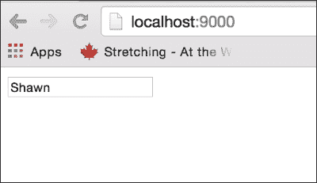
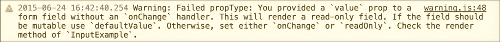
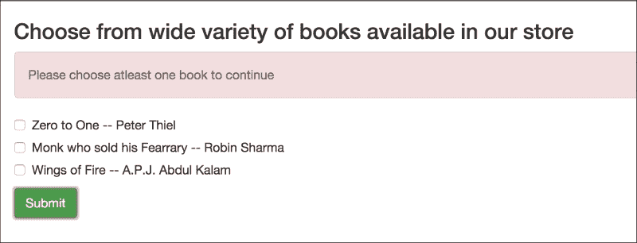
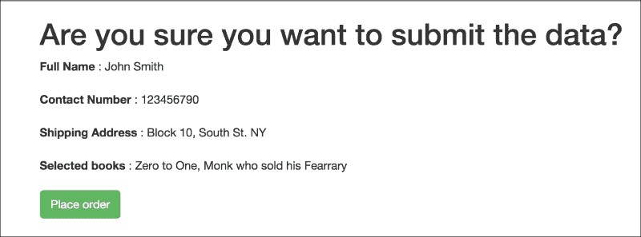

# 第四章。组合动态组件和表单

在上一章中，我们看到了 React 组件的各种生命周期方法，React 组件之间的数据流，以及如何在我们的 React 应用程序中管理状态和属性。

在本章中，我们将专注于多个动态组件和构建使用 React 的表单。

我们将涵盖以下要点：

+   多个动态组件与交互性

+   受控和非受控组件

+   表单元素

+   表单事件和处理程序

在本章结束时，我们将能够创建包含复杂表单的应用程序，这些应用程序使用 React 和动态组件的理解。

迈克和肖恩正在为他们的下一个项目做准备。这个应用程序是一个在线书店的原型，人们可以在这里购买不同的书籍。肖恩很兴奋再次与迈克合作，并学习更多关于 React 的知识。这个项目也是基于 React 的。

# React 中的表单

“肖恩，在这个项目中，将有许多与下订单、获取用户的运输和账单信息等相关的事情。我们现在将处理很多表单。”迈克开始说。

“使用 React 的表单吗？”肖恩兴奋地问道。

“是的。这就是为什么今天我们将只关注表单。让我们看看使用 React 使用表单的内在细节。”迈克说。

# 设置应用程序

“肖恩，我们之前一直在使用 JSBin。但现在我们将本地创建应用程序。我们将使用以下目录结构来存放我们的代码：”

```js
$ tree -L 1
.
├── LICENSE
├── README.md
├── index.html
├── node_modules
├── package.json
├── server.js
├── src
└── webpack.config.js

2 directories, 6 files

```

+   `src`目录将包含所有的 React 组件

+   `webpack.config.js`和`server.js`文件将用于使用 webpack 设置本地开发服务器。

+   `package.json`文件将用于包含我们使用的所有 npm 包的信息

+   `index.html`文件将是应用程序的起点

“让我们看看我们的`index.html`文件。”

```js
// index.html
<html>
  <head>
    <title>Forms in React</title>
    <link rel="stylesheet"  href="https://maxcdn.bootstrapcdn.com/bootstrap/3.3.5/css/bootstrap.min.css" />
  </head>
  <body>
    <div id='root' class="container">
    </div>
  </body>
  <script src="img/bundle.js"></script>
</html>
```

“我们正在使用 bootstrap CSS 来美化我们的应用程序。除此之外，我们还将包含打包后的 JavaScript 作为`static/bundle.js`。Webpack 将打包我们应用程序中的 JavaScript 代码，并将其放置在`static/bundle.js`中。”

### 注意事项

Webpack 是一个模块打包器，它将我们的 JavaScript 代码打包成代表这些模块的静态资源。它还具有其他功能，如热模块替换，我们将在本书中使用这些功能。我们将在第十一章（第十一章。React 工具）中更深入地介绍 webpack 及其配置。

“让我们看看我们的`index.js`文件，它将是 JavaScript 代码的入口点。”

```js
// src/index.js

import ReactDOM from 'react-dom';
import BookStore from './BookStore';

ReactDOM.render(<BookStore />, document.getElementById('root'));
```

“它将在`index.html`中的根容器中渲染我们的`BookStore`组件。现在，唯一剩下的事情就是实际编写我们的`BookStore`组件的代码。让我们开始吧。”

“迈克，在 JSBin 中，我们的 ES6 代码会自动转换为普通 JavaScript。现在会如何转换呢？”肖恩问道。

"非常好的问题。我忘记提到使用 Babel 了。Babel 是一个 JavaScript 转换器，它将我们的 ES6 和 JSX 代码转换为普通 JavaScript。我已经配置了这个应用程序使用 Babel。你可以检查`package.json`和`webpack.config.js`来查看我们如何配置 Babel 将 ES6 代码转换为 ES5 代码。但现在我们不必过于担心这个问题。我们稍后会回来，看看整个设置是如何工作的。"

### 注意

我们将在第十一章 React Tools 中介绍我们如何使用 Babel 和 Webpack。目前，读者不需要担心这个问题，可以直接使用本章源代码中的说明来设置应用程序。在完成本章之前，你也可以查看第十一章 React Tools 以获取更多详细信息。

# 开始使用表单

"在 React 的世界里，表单的行为与正常 HTML 世界略有不同。它们在 React 世界中比其他 DOM 组件要特殊一些。《input`、`textarea`和`option`标签是 React 提供的一些常见输入组件。" 迈克解释道。

"这些表单组件在用户与之交互时会被修改，比如在输入框中添加一些文本，或者选择一个选项。因此，我们需要确保我们正确地管理这些用户交互。" 迈克进一步解释道。

"让我们从一个简单的输入标签开始，了解用户交互。" 迈克说道。

```js
// src/index.js

import React from 'react';
import ReactDOM from 'react-dom';

var InputExample = React.createClass({
  render() {
    return (
      <input type="text" value="Shawn" />
    );
  }
});
ReactDOM.render(<InputExample />,  
                 document.getElementById('root'));
```

"迈克，这里的`import`是什么意思？" 肖恩问道。

"很好，这是我们将在项目中使用的一个 ES6 特性。它用于从其他模块或外部脚本中导入定义的函数。"

### 注意

更多关于导入的信息可以在[`developer.mozilla.org/en/docs/web/javascript/reference/statements/import`](https://developer.mozilla.org/en/docs/web/javascript/reference/statements/import)找到。

"我们还在使用 ES6 中定义函数的新方法。"

```js
// Old way of defining function
render: function() {
  return (
    <input type="text" value="Shwn" />
  );
}

// New way of defining function
render() {
    return (
      <input type="text" value="Shawn" />
    );
  }
```

"使用这种新语法，我们每次定义函数时都不必写`function`这个词。"

"肖恩，通过运行`npm start`来启动我们的应用程序。"

```js
$ npm start

> reactjs-by-example-react-forms@0.0.1 start /Users/prathamesh/Projects/sources/reactjs-by-example/chapter4
> node server.js

Listening at localhost:9000
Hash: 8ec0d12965567260413b
Version: webpack 1.9.11
Time: 1639ms

```

"太棒了，它工作是因为我们已经为启动应用程序配置了`package.json`脚本部分。"

```js
  // package.json
  ……
  "scripts": {
    "start": "node server.js",
    "lint": "eslint src"
  },
……
```

"让我们回到我们的输入框。我们看到一个带有预定义值`Shawn`的正常 HTML 文本输入。一切正常。" 迈克说。



"迈克，我无法编辑它。看起来这个字段是只读的。此外，我在控制台中看到了一个警告。" 肖恩报告说。



# 交互式属性

"没错。它还说明值是一个属性。与值类似，输入字段还支持一些其他属性。" 迈克说。

+   value

+   defaultValue

+   onChange

"正如 React 所警告的那样，我们需要提供`defaultValue`或`onChange`属性来使这个字段可变，让我们来处理这个问题并添加一个`onChange`处理程序。由于我们设置了`value`属性，这个字段是只读的，因为我们已经渲染了一个受控组件。" 迈克解释道。

# 受控组件

"迈克，什么是受控组件？" 肖恩问道。

"这是一个由 React 控制的输入组件。通过提供值`prop`，我们通知 React 这个字段的值是"肖恩"。一旦 React 将其声明为"肖恩"，任何用户输入都不会产生影响，因为值已经在."中设置。迈克解释道。

"我想我们不得不求助于`state`而不是`props`？" 肖恩问道。

"正是这样。当用户与输入字段交互时，我们需要使用`state`和`onChange`事件处理程序来更新值`prop`。你能试一试吗？" 迈克建议。

```js
// src/index.js

var InputExample = React.createClass({
  getInitialState() {
    return (
      { name: '-'}
    );
  },

  handleChange(event) {
    this.setState({ name: event.target.value });
  },

  render() {
    return (
      <input type="text"
             value={this.state.name}
             onChange={this.handleChange} />
    );
  }
});
```

"太棒了。这种基于状态制作输入值并根据用户交互更新状态的模式使得对用户交互做出响应变得非常容易。我们还可以做一些家务事，比如验证输入。" 迈克进一步解释道。

"例如，你可以将所有文本的格式改为大写。" 迈克补充道。

```js
handleChange: function(event) {
  this.setState({name: event.target.value.toUpperCase()});
}
```

# 不受控组件

"React 还有不受控组件，其中没有将`value`属性传递给输入"。

```js
render() {
    return (
      <input type="text" />
    );
  }
```

"在这种情况下，用户输入的值将立即反映在输入中。为了设置一些默认的初始值，我们可以传递默认的`value`属性，这将作为不受控组件的初始值。"。

```js
render() {
    return (
      <input type="text" defaultValue="Shawn"/>
    );
  }
```

"太棒了。这就完成了。"

# 开始使用表单向导

"肖恩，我们今天的任务是构建一个表单向导，模拟用户在使用在线书店时将采取的所有步骤。"

+   我们将从表单开始，用户将选择他们想要购买的书籍。

+   在下一步中，用户将输入与账单和配送地址相关的信息。

+   之后，用户需要选择一个配送方式。

+   最后，用户将确认交易并下订单。

"我们将设计四个不同的表单吗？" 肖恩问道。

"是的。但所有这些都将由一个父组件控制。父组件将跟踪用户所处的状态，并为这一步渲染一个表单。" 迈克解释道。

```js
// src/BookStore.js

import React from 'react';

var BookStore = React.createClass({
  render() {
    switch (step) {
      case 1:
        return <BookList />;
      case 2:
        return <ShippingDetails />;
      case 3:
        return <DeliveryDetails />;
    }
  }
});
```

"我们将如何控制步骤？" 肖恩问道。

"我们稍后再讨论这个点。在那之前，让我们先填入一些细节。让我们为所有表单添加占位符。" 迈克说。

```js
// src/BookStore.js

var BookList = React.createClass({
  render() {
    return(
      <h1> 
        Choose from wide variety of books available in our store.
      </h1>
    );
  }
});

var ShippingDetails = React.createClass({
  render() {
    return(
      <h1>Enter your shipping information.</h1>
    );
  }
});

var DeliveryDetails = React.createClass({
  render() {
    return (
      <h1>Choose your delivery options here.</h1>
    );
  }
});
```

"太好了。现在，让我们确保我们始终从第一步开始。" 迈克解释道。

```js
// src/BookStore.js

……

var BookStore = React.createClass({
  getInitialState() {
    return ({ currentStep: 1 });
  },

  render() {
    switch (this.state.currentStep) {
      case 1:
        return <BookList />;
      case 2:
        return <ShippingDetails />;
      case 3:
        return <DeliveryDetails />;
    }
  }
……

});
```

"既然我们已经确保用户在开始时始终处于第一步，让我们继续完成书店。" 迈克说。

```js
// src/BookStore.js

var BookList = React.createClass({
  getInitialState() {
    return (
      { books: [
        { name: 'Zero to One', author: 'Peter Thiel' },
        { name: 'Monk who sold his Ferrari', author: 'Robin Sharma' },
        { name: 'Wings of Fire', author: 'A.P.J. Abdul Kalam' }
      ] }
    )
  },

  _renderBook(book) {
    return(
      <div className="checkbox">
        <label>
          <input type="checkbox" /> {book.name} -- {book.author}
        </label>
      </div>
    );
  },

  render() {
    return(
      <div>
        <h3> Choose from wide variety of books available in our store </h3>
        <form>
          {this.state.books.map((book) => { 
             return this._renderBook(book); })
          }

          <input type="submit" className="btn btn-success" />
        </form>
      </div>
    );
  }
});
```

"这是我们静态的表单。它对用户交互没有任何反应。下一步将是让它对事件做出响应。" 迈克补充道。

"太酷了，我对我们如何进入下一步很感兴趣。" 肖恩说。

"我们很快就会到达那里。我们先完成其他事情。"迈克通知道。

"好的。在那之前，这里发生了什么？"

```js
this.state.books.map((book) => { return (this._renderBook(book)) })
```

"这被称为**箭头函数语法**来定义函数。它是 ES6 的另一个特性。它是编写函数的简写方式。"

### 注意

更多关于箭头函数的详细信息可以在[`developer.mozilla.org/en/docs/Web/JavaScript/Reference/Functions/Arrow_functions`](https://developer.mozilla.org/en/docs/Web/JavaScript/Reference/Functions/Arrow_functions)找到。

# 表单事件

"现在让我们处理表单的提交。React 为此提供了`onSubmit`事件。"迈克说。

```js
// src/BookStore.js
……
// Updating BookStore component

render() {
    return(
      <div>
        <h3> Choose from wide variety of books available in our store </h3>
        <form onSubmit={this.handleSubmit}>
          {this.state.books.map((book) => { return (this._renderBook(book)) })}

          <input type="submit" className="btn btn-success" />
        </form>
      </div>
    );
  },

handleSubmit(event) {
    console.log(event);
    event.preventDefault();
    console.log("Form submitted");
   }
   ……
```

"现在，下一个任务是获取用户所选的所有书籍。我们可以使用`state`来实现这一点。"迈克解释道。

```js
// src/BookStore.js
……

// Updating BookStore component

getInitialState() {
    return (
      { books: [
        { id: 1, name: 'Zero to One', author: 'Peter Thiel' },
        { id: 2, name: 'Monk who sold his Fearrary', author: 'Robin Sharma' },
        { id: 3, name: 'Wings of Fire', author: 'A.P.J. Abdul Kalam' }
      ],
        selectedBooks: []
      }
    );
  },

_renderBook(book) {
    return (
      <div className="checkbox" key={book.id}>
        <label>
          <input type="checkbox" value={book.name}
                 onChange={this.handleSelectedBooks}/>
          {book.name} -- {book.author}
        </label>
      </div>
    );
  },

  handleSelectedBooks(event) {
    var selectedBooks = this.state.selectedBooks;
    var index = selectedBooks.indexOf(event.target.value);

    if (event.target.checked) {
      if (index === -1)
        selectedBooks.push(event.target.value);
    } else {
      selectedBooks.splice(index, 1);
    }

    this.setState({selectedBooks: selectedBooks });
}
```

"我们为复选框添加了`onChange`处理程序。我们还向复选框提供了`value`prop，它将是书籍的名称。最初，`selectedBooks`状态将通过`getInitialState`函数设置为空数组。`handleSelectedBooks`方法将检查复选框是否被选中。我们使用 React 为复选框输入提供的 checked prop。与 value 类似，它也会随着用户交互而更新。"

最后，我们使用`selectedBooks`的新值更新状态。因此，在任何时候，我们都会在`this.state.selectedBooks`中掌握所选书籍。"迈克解释道。

"太好了！"肖恩说。

# 父子关系

"现在，接下来的步骤是与父组件通信。目前，我们的子组件没有通过 props 进行通信的方法。我们希望与父组件通信，因为我们想将用户所选的书籍发送到父组件。子组件与父组件通信的最简单方法是使用 props。"迈克解释道。

"但是 props 通常是发送给子组件的属性或属性，对吧？子组件如何使用它们与父组件通信？"肖恩问道。

"记住`{}`语法。我们可以将任何有效的表达式作为 prop 传递。我们可以将函数回调作为 prop 传递给子组件。子组件可以调用它来更新父组件的状态。现在让我们更新我们的`BookStore`组件。"迈克解释道。

```js
// src/BookStore.js

……
// Updating BookStore component

  updateFormData(formData) {
    console.log(formData);
  },

  render() {
    switch (this.state.currentStep) {
      case 1:
        return <BookList 
                 updateFormData={this.updateFormData} />;
      case 2:
        return <ShippingDetails  
                 updateFormData={this.updateFormData} />;
      case 3:
        return <DeliveryDetails 
                 updateFormData={this.updateFormData} />;
    }
  }
……

});
```

"我们将`updateFormData`函数作为 prop 传递给所有子组件。这个函数将负责更新表单数据。我们还需要更新`BookList`以便使用它。"

```js
// src/BookStore.js
// Updating BookList component

……
  handleSubmit(event) {
    event.preventDefault();

    this.props.updateFormData({ selectedBooks: 
                                this.state.selectedBooks });
  }
  ……
}); 
```

"每当用户提交第一个表单时，`BookList`组件现在会调用`updateFormData`函数并将当前所选书籍传递给它。"迈克解释道。

"因此，每个表单都会将其数据发送到父组件，我们将使用完整的数据进行最终提交，对吧？"肖恩问道。

"确实如此。我们还需要在父组件中存储传入的数据。"

```js
// src/BookStore.js
// Updating BookStore component

var BookStore = React.createClass({
  getInitialState() {
    return ({ currentStep: 1, formValues: {} });
  },

  updateFormData(formData) {
    var formValues = Object.assign({}, this.state.formValues, formData);
    this.setState({formValues: formValues});  
  },

  render() {
    switch (this.state.currentStep) {
      case 1:
        return <BookList updateFormData={this.updateFormData} />;
      case 2:
        return <ShippingDetails updateFormData={this.updateFormData} />;
      case 3:
        return <DeliveryDetails updateFormData={this.updateFormData} />;
    }
  }
});
```

"我们添加了状态来存储`formValues`。每当用户提交表单时，子表单将调用父级的`updateFormData`函数。这个函数将合并存储在父级`formValues`中的当前数据与传入的`formData`，并将状态重置为新`formValues`。在这种情况下，我们将在`formValues`对象中获得`selectedBooks`，如下所示："迈克说。

```js
 { selectedBooks: ['Zero to One', 'Monk who sold his Ferrary'] }
```

"请注意，我们正在使用另一个 ES6 方法——`Object.assign`。`Object.assign()`方法用于将一个或多个源对象的所有可枚举属性值复制到目标对象中。"

"在我们的情况下，使用`Object.assign`将合并表单值的当前状态与用户交互后更改的新表单值。然后我们将使用这些更新后的数据来更新组件的状态。我们使用`Object.assign`而不是直接修改组件的状态。我们将在接下来的章节中解释为什么这样做比直接修改组件的状态更好。"说迈克。

```js
var formValues = Object.assign({}, this.state.formValues, formData);
```

"有道理。这处理了表单数据的更新。现在，我们如何进入下一个步骤呢？"肖恩问道。

"很简单。每次我们更新表单数据时，我们还需要更新`BookStore`组件的`currentStep`方法。你能试一下吗？"迈克问道。

```js
// src/BookStore.js
// Updating BookStore component

var BookStore = React.createClass({
  updateFormData(formData) {
    var formValues = Object.assign({}, this.state.formValues, formData);
    var nextStep = this.state.currentStep + 1;
    this.setState({currentStep: nextStep, formValues: formValues});
    console.log(formData);
  },

  render() {
    switch (this.state.currentStep) {
      case 1:
        return <BookList updateFormData={this.updateFormData} />;
      case 2:
        return <ShippingDetails updateFormData={this.updateFormData} />;
      case 3:
        return <DeliveryDetails updateFormData={this.updateFormData} />;
    }
  }
});
```

"太好了。你在`updateFormData`回调中更新了步骤`1`。这将把用户带到下一个步骤。"迈克说。

# 表单验证

"肖恩，我认为我们还应该给`BookList`组件添加基本的验证，这样用户就不能在选择一本书之前进入下一个步骤了。"迈克说。

"同意。让我试试。"肖恩回答。

```js
// src/BookStore.js
// Updating BookList component

var BookList = React.createClass({
  getInitialState() {
    return (
      { books: [
        { id: 1, name: 'Zero to One', author: 'Peter Thiel' },
        { id: 2, name: 'Monk who sold his Fearrary', author: 'Robin Sharma' },
        { id: 3, name: 'Wings of Fire', author: 'A.P.J. Abdul Kalam' }
      ],
        selectedBooks: [],
        error: false
      }
    );
  },

  _renderError() {
    if (this.state.error) {
      return (
        <div className="alert alert-danger">
          {this.state.error}
        </div>
      );
    }
  },

  handleSubmit(event) {
    event.preventDefault();

    if(this.state.selectedBooks.length === 0) {
      this.setState({error: 'Please choose at least one book to continue'});
    } else {
      this.setState({error: false});
      this.props.updateFormData({ selectedBooks: this.state.selectedBooks });
    }
  },

  render() {
    var errorMessage = this._renderError();

    return (
      <div>
        <h3> Choose from wide variety of books available in our store </h3>
        {errorMessage}
        <form onSubmit={this.handleSubmit}>
          { this.state.books.map((book) => { return (this._renderBook(book)); })}
          <input type="submit" className="btn btn-success" />
        </form>
      </div>
    );
  }
});
```

"我为验证错误添加了状态。最初，它将被设置为`false`。当用户提交表单后，我们将检查用户是否没有选择任何内容，并设置适当的错误信息。状态将被更新，并相应地显示错误信息。如果用户至少选择了一本书，那么错误状态将被设置为`false`，错误信息将不会显示。我们在 Bootstrap 类的帮助下得到了一个很好的错误信息。"肖恩说。



"太棒了。现在让我们转到第二个表单。我们希望接受用户的发货详情，如地址和联系信息。"迈克说。

# 发货详情步骤

"肖恩，在这个步骤中，我们想要获取用户的发货偏好。它将包含发货地址和客户姓名。"迈克解释说。

"我们也应该添加一个电话号码。"肖恩补充说。

"当然。这就是我们的发货详情表单看起来像。"迈克告知。

```js
// src/BookStore.js
// Adding ShippingDetails component

var ShippingDetails = React.createClass({
  getInitialState() {
    return (
      { fullName: '', contactNumber: '', shippingAddress: '', error: false }
    );
  },

  _renderError() {
    if (this.state.error) {
      return (
        <div className="alert alert-danger">
          {this.state.error}
        </div>
      );
    }
  },

  _validateInput() {
    if (this.state.fullName === '') {
      this.setState({error: "Please enter full name"});
    } else if (this.state.contactNumber === '') {
      this.setState({error: "Please enter contact number"});
    } else if (this.state.shippingAddress === '') {
      this.setState({error: "Please enter shipping address"});
    } else {
      this.setState({error: false});
      return true;
    }

  },

  handleSubmit(event) {
    event.preventDefault();

    var formData = { fullName: this.state.fullName,
                     contactNumber: this.state.contactNumber,
                     shippingAddress: this.state.shippingAddress };

    if (this._validateInput()) {
      this.props.updateFormData(formData);
    }
  },

  handleChange(event, attribute) {
    var newState = this.state;
    newState[attribute] = event.target.value;
    this.setState(newState);
    console.log(this.state);
  },

  render() {
    var errorMessage = this._renderError();

    return (
      <div>
        <h1>Enter your shipping information.</h1>
        {errorMessage}
        <div style={{width: 200}}>
          <form onSubmit={this.handleSubmit}>
            <div className="form-group">
              <input className="form-control"
                     type="text"
                     placeholder="Full Name"
                     value={this.state.fullName}
                     onChange={(event) => this.handleChange(event, 'fullName')} />
            </div>

            <div className="form-group">
              <input className="form-control"
                     type="text"
                     placeholder="Contact number"
                     value={this.state.contactNumber}
                     onChange={(event) => this.handleChange(event, 'contactNumber')}/>
            </div>

            <div className="form-group">
              <input className="form-control"
                     type="text"
                     placeholder="Shipping Address"
                     value={this.state.shippingAddress}
                     onChange={(event) => this.handleChange(event, 'shippingAddress')} />
            </div>

            <div className="form-group">
              <button type="submit"
                      ref="submit"
                      className="btn btn-success">
                Submit
              </button>
            </div>
          </form>
        </div>
      </div>
    );
  }
});
```

"这个组件几乎使用了与我们的第一个表单相同的代码。我们向用户显示用于配送详情的文本框。有验证，所有字段都是必填项。我们使用组件状态中的`onChange`处理程序同步用户输入的数据，并在最后将此状态传递给父组件的`updateFormData`函数。" 迈克解释道。

"现在，在第二步的结尾，我们已经收集了用户选择的书籍列表和配送信息。" 迈克说。

```js
{ selectedBooks: ["Zero to One", "Wings of Fire"],
  fullName: "John Smith",
  contactNumber: "1234567890",
  shippingAddress: "10th Cross, NY" }
```

"我可以看到我们是如何将输入字段的`value`属性分配给它对应的状态的。" 肖恩。

```js
  value={this.state.shippingAddress}
```

"是的。正如我们之前讨论的受控和非受控组件，我们正在确保 UI 反映了基于用户交互的最新状态。" 迈克说。

# 配送详情步骤

"肖恩，下一步是提供各种配送选项。目前，让我们假设用户可以在`Primary`配送（意味着次日送达）和`Normal`配送（意味着 3-4 天送达）之间进行选择。默认情况下，必须选择`Primary`选项。用户也可以选择`Normal`配送选项。你能尝试构建这个最后一步吗？" 迈克问道。

```js
// src/BookStore.js
// Adding DeliveryDetails component

var DeliveryDetails = React.createClass({
  getInitialState() {
    return (
      { deliveryOption: 'Primary' }
    );
  },

  handleChange(event) {
    this.setState({ deliveryOption: event.target.value});
  },

  handleSubmit(event) {
    event.preventDefault();
    this.props.updateFormData(this.state);
  },

  render() {
    return (
      <div>
        <h1>Choose your delivery options here.</h1>
        <div style={{width:200}}>
          <form onSubmit={this.handleSubmit}>
            <div className="radio">
              <label>
                <input type="radio"
                       checked={this.state.deliveryOption === "Primary"}
                       value="Primary"
                       onChange={this.handleChange} />
                Primary -- Next day delivery
              </label>
            </div>
            <div className="radio">
              <label>
                <input type="radio"
                       checked={this.state.deliveryOption === "Normal"}
                       value="Normal"
                       onChange={this.handleChange} />
                Normal -- 3-4 days
              </label>
            </div>

            <button className="btn btn-success">
              Submit
            </button>
          </form>
        </div>
      </div>
    );
  }
});
```

"迈克，根据需要，我通过状态添加了`Primary`作为默认选项。我使用了单选按钮及其`checked`属性，以确保在任何时候只能选择一个单选按钮。此外，使用`onChange`回调更新状态以反映所选选项。最后，调用`updateFormData`函数来更新父表单数据。" 肖恩解释道。

"太好了，肖恩。看起来不错。我想我们可能还需要对我们的`BookStore`组件做一些修改，因为我们现在想在用户完成选择配送选项后显示一个确认页面。" 迈克说。

```js
// src/BookStore.js
// Updating BookStore component

var BookStore = React.createClass({
 render() {
    switch (this.state.currentStep) {
      case 1:
        return <BookList updateFormData={this.updateFormData} />;
      case 2:
        return <ShippingDetails updateFormData={this.updateFormData} />;
      case 3:
        return <DeliveryDetails updateFormData={this.updateFormData} />;
      case 4:
        return <Confirmation data={this.state.formValues}/>;}/>;}/>;
      default:
        return <BookList updateFormData={this.updateFormData} />;
    }
  }
});

// Adding Conformation step

var Confirmation = React.createClass({
  render() {
    return (
      <div>
        <h1>Are you sure you want to submit the data?</h1>
      </div>
    );
  }
});
```

"我们已经将`Confirmation`组件作为最后一步添加，并且将默认表单设置为`BookList`表单，用户可以在其中选择书籍。现在，我们只需要在**确认**页面上显示到最后一步所捕获的所有信息，并将一切实际提交到后端。" 迈克说。

"让我更新一下**确认**页面，以显示用户输入的数据。" 肖恩说。

```js
var Confirmation = React.createClass({
  handleSubmit(event) {
    event.preventDefault();
    this.props.updateFormData(this.props.data);
  },

  render() {
    return (
      <div>
        <h1>Are you sure you want to submit the data?</h1>
        <form onSubmit={this.handleSubmit}>
          <div>
            <strong>Full Name</strong> : { this.props.data.fullName }
          </div><br/>
          <div>
            <strong>Contact Number</strong> : { this.props.data.contactNumber }
          </div><br/>
          <div>
            <strong>Shipping Address</strong> : { this.props.data.shippingAddress }
          </div><br/>
          <div>
            <strong>Selected books</strong> : { this.props.data.selectedBooks.join(", ") }
          </div><br/>
          <button className="btn btn-success">
            Place order
          </button>
        </form>
      </div>
    );
  }
});
```

"迈克，我已经列出了用户选择的所有数据，并提供了一个下单按钮。看起来是这样的。" 肖恩。



"太好了。我已经准备好了成功页面。让我们试试吧。" 迈克。

```js
// src/BookStore.js
// Adding Success step

var Success = React.createClass({
  render() {
    var numberOfDays = "1 to 2 ";

    if (this.props.data.deliveryOption === 'Normal') {
      numberOfDays = "3 to 4 ";
    }
    return (
      <div>
        <h2>
          Thank you for shopping with us {this.props.data.fullName}.
        </h2>
        <h4>
          You will soon get {this.props.data.selectedBooks.join(", ")} at {this.props.data.shippingAddress} in approrximately {numberOfDays} days.
        </h4>
      </div>
    );
  }
});
```

"我们还需要更新`BookStore`以显示成功页面。" 迈克补充说。

```js
// Updating render method of BookStore component

  render() {
    switch (this.state.currentStep) {
      case 1:
        return <BookList updateFormData={this.updateFormData} />;
      case 2:
        return <ShippingDetails updateFormData={this.updateFormData} />;
      case 3:
        return <DeliveryDetails updateFormData={this.updateFormData} />;
      case 4:
        return <Confirmation data={this.state.formValues} updateFormData={this.updateFormData}/>;
      case 5:
        return <Success data={this.state.formValues}/>;
      default:
        return <BookList updateFormData={this.updateFormData} />;
    }
  }
```

"现在，用户确认并下单后，将显示成功页面作为最后一页。我们的表单向导的第一个版本已经完成。" 迈克通知。


# 摘要

在本章中，我们讨论了如何在 React 中开发表单。我们看到了如何使用不同的输入类型和事件处理器来响应用户对这些输入的交互。我们使用状态和属性来管理表单数据从一个步骤流向另一个步骤的流程。我们还看到了如何使用动态组件根据用户当前所在的步骤向用户显示特定的表单。

在下一章中，我们将继续介绍表单向导，并了解混入（mixins）如何帮助我们更好地组织代码。
