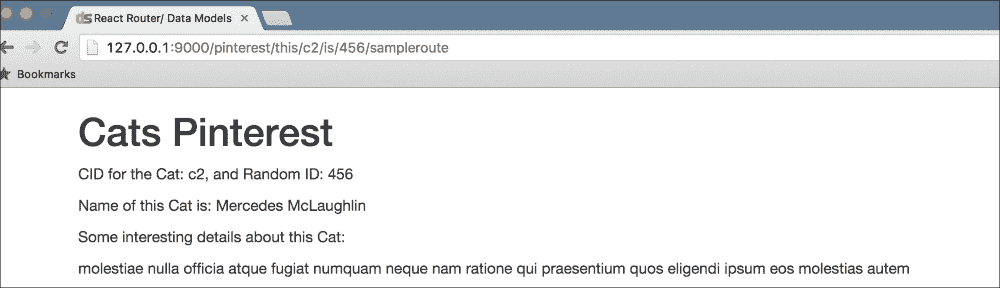
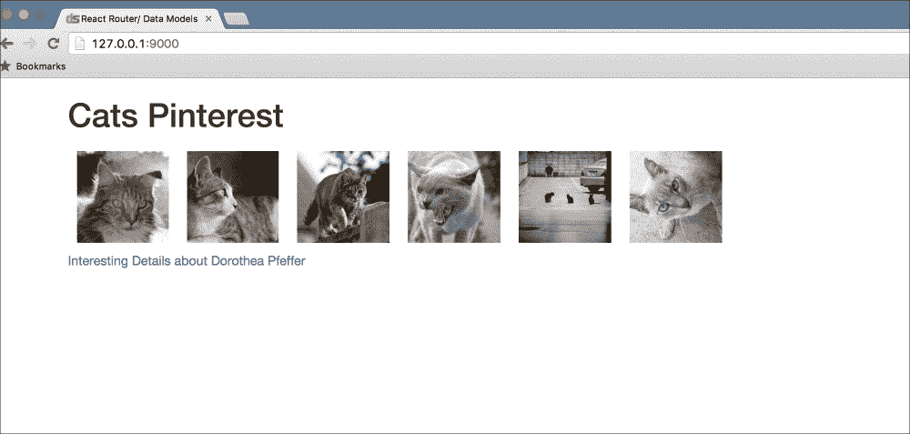
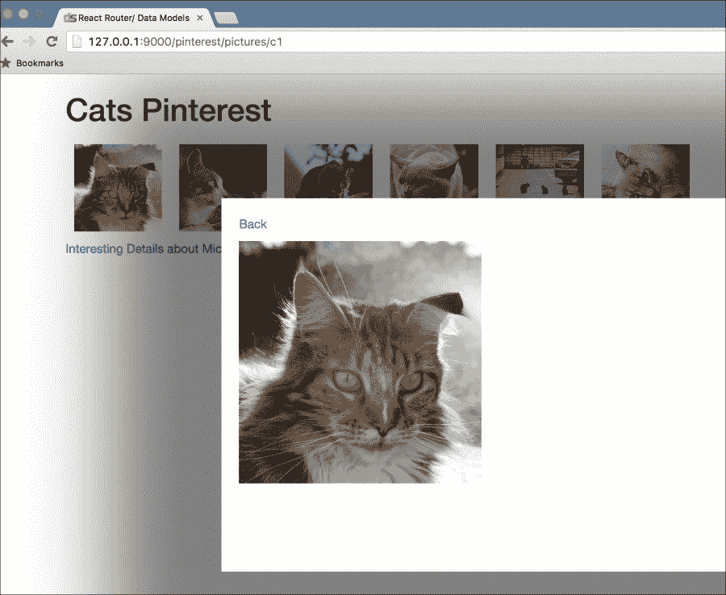

# 第九章：React Router 和数据模型

在上一章中，我们探讨了可以提高 React 应用性能的 React 性能工具。我们探讨了使用 PERF 插件、PureRenderMixin 等，并查看了一些与 React 提供的性能工具相关的问题。

在本章中，我们将更深入地了解 react-router，并在不同级别执行路由。我们将探讨嵌套路由和传递参数，以及 react-router 在执行路由任务时如何维护历史记录。我们还将探讨传递和使用上下文来渲染 React 组件。最后，我们将探索数据模型，并将它们与其他框架混合匹配，用作 React 中的数据模型，例如 Backbone。

在本章中，我们将涵盖以下主题：

+   在你的应用中使用 React

+   使用 react-router 进行路由

+   不同的路由机制

+   设置路由和传递路由上下文

+   React 和数据存储/模型

+   使用 Backbone 模型/集合作为数据存储

在本章结束时，我们将能够开始使用 react-router 和不同的路由模式，并在路由中传递上下文数据。我们还将能够用 Backbone.js 等类似的东西替换纯数据模型的部分。

# 新的冒险

"嗨，Shawn 和 Mike！"Carla 大声说道。

Shawn 和 Mike 吃了一惊。他们刚刚到达，正准备开始新的一天。过去几天他们一直在探索 React。

"我有一些好消息要告诉你们。我们得到了一个新的项目，我们需要构建一个基于猫的兴趣网站。就像说——Pinterest？用户可以喜欢猫的图片和资料。然后他们可以看到并喜欢相关的销售文章，”Carla 继续说。

"哦，不错，”Shawn 回应道。

Shawn 和 Mike 重新集结，开始讨论他们刚刚从 Carla 那里听说的新项目。

"这很好。所以，我想，我们想在面板形状中显示一个小型的 Pinterest 风格的图片画廊吗？"Shawn 询问道。

"正确，”Mike 接着说，“我们还想以大尺寸显示图片，也许在用户点击图片后显示模态窗口。Carla 说她想在页脚中展示随机的猫，这将带我们到一个完整的猫展示页面。”

"你知道什么，我知道我们将要使用的完美东西。让我们今天看看 react-router！我也知道一个完美的示例开始。我们将查看 react-router 中的 Pinterest 示例，[`github.com/rackt/react-router/tree/master/examples/pinterest`](https://github.com/rackt/react-router/tree/master/examples/pinterest)。然后我们将在其基础上构建我们的应用。”

"不错，”Shawn 说，“我可以看到现有的示例中包含了一些我们讨论过的事情，比如模态显示。让我看看这个示例的样子。”

Shawn 看了以下示例：

```js
import React from 'react'
import { render } from 'react-dom'
import { browserHistory, Router, Route, IndexRoute, Link } from 'react-router'
…
const PICTURES = [
  { id: 0, src: 'http://placekitten.com/601/601' },
  { id: 1, src: 'http://placekitten.com/610/610' },
  { id: 2, src: 'http://placekitten.com/620/620' }
]
const Modal = React.createClass({
… // Modal Class implementation
 })

const App = React.createClass({
  componentWillReceiveProps(nextProps) {
// takes care of context in case of Modals
  },
  render() {
// Main render for Modal or Cat Pages
 }
})

const Index = React.createClass({
  render() {
// Index page render 
..
        <div>
          {PICTURES.map(picture => (
            <Link key={picture.id}
              to={{
                pathname: `/pictures/${picture.id}`,
                state: { modal: true, returnTo: this.props.location.pathname }
              }}
            >
              
            </Link>
          ))}
        </div>
.. // Usage of React Router Links
        <p><Link to="/some/123/deep/456/route">Go to some deep route</Link></p>
      </div>
    )
  }
})

const Deep = React.createClass({
  render() {
// Render handler for some deep link
   )
  }
})

const Picture = React.createClass({
  render() {
    return (
      <div>
// Pictures display
        
      </div>
    )
  }
})

// The actual Routing logic using Router Library.
render((
  <Router history={browserHistory}>
    <Route path="/" component={App}>
      <IndexRoute component={Index}/>
      <Route path="/pictures/:id" component={Picture}/>
      <Route path="/some/:one/deep/:two/route" component={Deep}/>
    </Route>
  </Router>
), document.getElementById('example'))
```

"看起来很有趣，”Shawn 说。

"是的，让我们逐一查看我们需要创建的组件。首先，让我们看看我们将如何存储我们的数据并在整个系统中显示猫的数据。目前，图片存储在 `PICTURES` 常量中。我们希望存储更多内容。"

# 创建 Backbone 模型

"所以，肖恩，让我们继续构建我们想要展示的猫的收藏。为了开发目的，我们将使用 lorempixel 服务提供的猫图片，例如，[`lorempixel.com/600/600/cats/`](http://lorempixel.com/600/600/cats/)。这将给我们一个 600 x 600 像素的随机猫图片。"

"接下来，我们将创建一个使用不同于常规对象的数据存储。我们想探索如何将不同的模型流程嵌入到我们的 React 应用中。在我们的例子中，让我们使用 Backbone 模型，而不是 PICTURES 常量。我知道你已经使用过 Backbone。"

"是的，我在我的前一个项目中使用过它。"

"那么，让我们定义我们的 `Cat` 模型。"

```js
const PictureModel = Backbone.Model.extend({
  defaults: {
    src: 'http://lorempixel.com/601/600/cats/',
    name: 'Pusheen',
    details: 'Pusheen is a Cat'
  }
});
```

"在这里，我们存储猫图片的 `src`、它的名字以及一些关于它的细节。正如你所见，我们为这些属性提供了一些默认值。"

"接下来，让我们定义我们的 `Cats` 集合，包含所有的 `Cat` 记录。"

```js
const Cats = new Backbone.Collection;
Cats.add(new PictureModel({src: "http://lorempixel.com/601/600/cats/", 
                                              name: Faker.Name.findName(), 
                                              details: Faker.Lorem.paragraph()}));

Cats.add(new PictureModel({src: "http://lorempixel.com/602/600/cats/", 
                                              name: Faker.Name.findName(), 
                                              details: Faker.Lorem.paragraph()}));
…
```

"在这里，我们使用 `Faker` 模块通过 `Faker.Name.findName()` 创建猫的随机名字，使用 `Faker.Lorem.paragraph()` 添加随机描述，并按需传递源信息。"

"酷，肖恩说。让我看看现在看起来怎么样。"

```js
//models.js
import Backbone from 'backbone';
import Faker from 'faker';

const PictureModel = Backbone.Model.extend({
  defaults: {
    src: 'http://lorempixel.com/601/600/cats/',
    name: 'Pusheen',
    details: 'Pusheen is a Cat'
  }
});

const Cats = new Backbone.Collection;
Cats.add(new PictureModel({src: "http://lorempixel.com/601/600/cats/", name: Faker.Name.findName(), details: Faker.Lorem.paragraph()}));
…
Cats.add(new PictureModel({src: "http://lorempixel.com/606/600/cats/", name: Faker.Name.findName(), details: Faker.Lorem.paragraph()}));

module.exports = {Cats, PictureModel};
```

# 集成定义的 Backbone 模型

"接下来，让我们定义我们的索引，以及我们需要路由如何工作以及路由应该响应哪些路径。从那里，我们将继续构建我们的组件。"

"明白了。"

```js
import React from 'react'
import { render } from 'react-dom'
import { createHistory, useBasename } from 'history'
import { Router, Route, IndexRoute, Link } from 'react-router'
import Backbone from 'backbone';
import Modal from './Modal'
import App from './App'
import { Cats, PictureModel } from './models';
import Picture from './Picture'
import Sample from './Sample'
import Home from './Home'

const history = useBasename(createHistory)({
  basename: '/pinterest'
});

render((
  <Router history={history}>
    <Route path="/" component={App}>
      <IndexRoute component={Home}/>
      <Route path="/pictures/:id" component={Picture}/>
      <Route path="/this/:cid/is/:randomId/sampleroute" component={Sample}/>
    </Route>
  </Router>
), document.getElementById('rootElement'));
```

"所以，我看到的第一件事是我们正在创建一个会话历史记录？"

"正确，我们在这里创建了一个会话历史记录。我们将使用它作为我们的路由器。"

"在这里，我们使用历史模块的 `useBasename` 方法，它提供了在 `base` URL 下运行应用的支撑，在我们的例子中是 `/pinterest`。"

"明白了。"

"接下来，我们将展示我们实际上希望路由如何工作。我们将我们的路由器包装进 `<Router/>` 组件中，并指定不同的 `<Route/>` 作为路径。"

"这被称为**路由配置**，它基本上是一组规则或指令，用于将 URL 匹配到某些 React 组件以便显示。"

"哦，我们可以讨论一下这个配置吗？它看起来很有趣。"

"确实如此。首先，让我们看看 `<IndexRoute component={Home}/>` 做了什么。当我们到达应用的 `/` 页面时，在我们的例子中将是 `/pinterest`，由 `IndexRoute` 定义的组件将被渲染。正如你可能猜到的，要渲染的组件是通过路由的组件参数传递的。请注意，这是在 `App` 组件中显示的，它是所有基础组件。"

与 `IndexRoute` 类似，我们有不同的 `<Route/>` 定义。在我们的示例中，如果你看到 `<Route path="/pictures/:id" component={Picture}/>`，它显示了路由是如何被使用的，以及我们是如何传递相同属性的。在这里，路径属性是一个匹配表达式，组件属性指定了在匹配路由后要显示的组件。

"注意这里的路径是如何定义的，它被指定为一个表达式。"

基于 URL 对路由进行匹配是基于三个组件：

+   路由嵌套

+   路径属性

+   路由优先级

肖恩开始说，“我明白了嵌套的部分。我看到我们已经以嵌套的方式安排了我们的路由，就像一棵树。路由匹配和构建是基于这个树状匹配结构的。"

"对。其次，我们有路径属性。我们可以看到这些示例："

```js
      <Route path="/pictures/:id" component={Picture}/>
      <Route path="/this/:cid/is/:randomId/sampleroute" component={Sample}/>
```

"路径值是一个字符串，它作为一个正则表达式，可以由以下部分组成："

+   `:paramName`: 例如，ID，这是在 URL 中传递的参数，如 `/pictures/12`。`12` 被解析为 `param id`。

+   `()`: 这可以用来指定一个可选的路径，例如 `/pictures(/:id)`，这将匹配 `/pictures` 以及 `/pictures/12`。

+   `*`: 就像正则表达式的情况一样，`*` 可以用来匹配表达式的任何部分，直到下一个 `/`、`?` 或 `#` 出现。例如，为了匹配所有 JPEG 图像，我们可以使用 `/pictures/*.jpg`。

+   `**`: 贪婪匹配，类似于 `*`，但它贪婪地匹配。例如，`/**/*.jpg` 将匹配 `/pictures/8.jpg` 以及 `/photos/10.jpg`。

"明白了。最后，什么是优先级？最可能的是，它应该使用文件中定义的第一个路由，并满足用于匹配路径的条件？"

"没错，" 迈克大声说道。

"哦，在我忘记之前，我们还有一个 `<Redirect>` 路由。这可以用来将一些路由匹配到其他路由操作。例如，我们希望 `/photos/12` 匹配 `/pictures/12` 而不是，我们可以将其定义为代码。"

```js
<Redirect from="/photos/:id" to="/pictures/:id" />
```

"太棒了。"

"接下来，让我们看看我们正在导入和使用的一切，我们将它们定义为组件。"

```js
import React from 'react'
…
import Modal from './Modal'
import App from './App'
import { Cats, PictureModel } from './models';
import Picture from './Picture'
import Sample from './Sample'
import Home from './Home'
```

"让我们首先定义我们的 `App` 组件，它将作为容器："

```js
..
import { Router, Route, IndexRoute, Link } from 'react-router'
import Modal from './Modal'

const App = React.createClass({
  componentWillReceiveProps(nextProps) {
    if ((
            nextProps.location.key !== this.props.location.key &&
            nextProps.location.state &&
            nextProps.location.state.modal
        )) {
      this.previousChildren = this.props.children
    }
  },

  render() {
    let { location } = this.props;
    let isModal = ( location.state && location.state.modal && this.previousChildren );
    return (
        <div>
          <h1>Cats Pinterest</h1>
          <div>
            {isModal ?
                this.previousChildren :
                this.props.children
            }
            {isModal && (
                <Modal isOpen={true} returnTo={location.state.returnTo}>
                  {this.props.children}
                </Modal>
            )}
          </div>
        </div>
    )
  }
});

export {App as default}
```

"我们这里不会改变太多，这是从我们已经看到的示例中来的。"

"我看到了这里的位置使用。这是来自 react-router 吗？"

"正如我们所看到的，我们的 `App` 被包裹在路由器中。路由器通过 props 传递位置对象。位置对象实际上类似于 `window.location`，这是我们使用的 history 模块定义的。`Location` 对象在其上定义了各种特殊属性，我们将利用这些属性，如下所示："

+   `pathname`: URL 的实际路径名

+   `search`: 查询字符串

+   `state`: 从 react-router 传递并绑定到位置的对象

+   `action`: `PUSH`、`REPLACE` 或 `POP` 操作之一

+   `key`: 位置的唯一标识符

"明白了。我看到我们正在使用之前看到的`props.children`。"

```js
  componentWillReceiveProps(nextProps) {
    if ((
            nextProps.location.key !== this.props.location.key &&
            nextProps.location.state &&
            nextProps.location.state.modal
        )) {
      this.previousChildren = this.props.children
    }
  }
```

"我想，当 Modal 显示时，我们将子元素和上一个屏幕存储到`App`对象上。"

"是的。我们首先检查是否显示了一个不同的组件，通过匹配 location 的 key 属性。然后我们检查是否在 location 上传递了状态属性，以及状态中的 modal 是否设置为 true。我们将在 Modal 显示的情况下做这件事。这是我们将状态传递给链接的方式："

```js
<Link … state={{ modal: true .. }}.. />
```

"当我们使用它来显示图片时，我们将查看`Link`对象。"

"明白了，肖恩说。"

"然后我看到我们正在传递子 props 或渲染上一个布局，然后，如果点击 modal，就在其上方显示`Modal`："

```js
           {isModal ?
                this.previousChildren :
                this.props.children
            }
            {isModal && (
                <Modal isOpen={true} returnTo={location.state.returnTo}>
                  {this.props.children}
                </Modal>
            )}
```

"没错！你在这一方面做得越来越好了，迈克兴奋地说。"

"现在，让我们看看我们的主要索引页面组件，好吗？"

```js
// home.js
import React from 'react'
import { Cats, PictureModel } from './models';
import { createHistory, useBasename } from 'history'
import { Router, Route, IndexRoute, Link } from 'react-router'

const Home = React.createClass({
  render() {
    let sampleCat = Cats.sample();
    return (
        <div>
          <div>
            {Cats.map(cat => (
                <Link key={cat.cid} to={`/pictures/${cat.cid}`} state={{ modal: true, returnTo: this.props.location.pathname }}>
                  
                </Link>
            ))}
          </div>
          <p><Link to={`/this/${sampleCat.cid}/is/456/sampleroute`}>{`Interesting Details about ${sampleCat.get('name')}`}</Link></p>
        </div>
    )
  }
});

export {Home as default}
```

"所以肖恩，我们首先导入在`Cats`集合中生成的所有数据。我们将遍历它们并显示带有链接到 Modals 的图片。你可以在这里看到这个过程："

```js
            {Cats.map(cat => (
                <Link key={cat.cid} to={`/pictures/${cat.cid}`} state={{ modal: true, returnTo: this.props.location.pathname }}>
                  
                </Link>
            ))}
```

"是的，我看到我们正在使用`cat`对象的`cid`从 backbone 对象设置键。我们必须为链接指定路径，即它应该链接到的位置，我想？"

"没错。对于每只显示的猫，我们都生成一个唯一的动态路由，例如`/pictures/121`等等。现在，当我们点击它以显示放大后的猫时，我们正在将`modal: true`传递到`<Link/>`的状态中。"

"我们还传递了一个`returnTo`属性，它与从当前`location.pathname`获取的当前路径相关。我们将使用这个`returnTo`属性从状态中设置组件上的回链。我们将在 Modal 上显示一个，这样当点击时我们可以回到主页，并且 Modal 将被关闭。"

"明白了。我看到我们还在这里定义了一个用于样本猫展示页面的链接："

```js
    let sampleCat = Cats.sample();
…
render(
…
          <p><Link to={`/this/${sampleCat.cid}/is/456/sampleroute`}>{`Interesting Details about ${sampleCat.get('name')}`}</Link></p>
…
);
```

"是的，我们打算在这里随机展示一只猫。我们将在样本页面上显示关于猫的详细信息。现在，我想向你展示我们是如何在这里创建链接的："

```js
`/this/${sampleCat.cid}/is/456/sampleroute`

```

"在这里，我们正在创建一个嵌套的随机路由，例如，这可以匹配以下 URL："

```js
/this/123/is/456/sampleroute

```

"`123`和`456`作为位置的参数。"

"很好，肖恩接着说。让我定义 Modal？让我重用示例中的那个。"

```js
import React from 'react'
import { Router, Route, IndexRoute, Link } from 'react-router'

const Modal = React.createClass({
  styles: {
    position: 'fixed',
    top: '20%',
    right: '20%',
    bottom: '20%',
    left: '20%',
    padding: 20,
    boxShadow: '0px 0px 150px 130px rgba(0, 0, 0, 0.5)',
    overflow: 'auto',
    background: '#fff'
  },

  render() {
    return (
      <div style={this.styles}>
        <p><Link to={this.props.returnTo}>Back</Link></p>
        {this.props.children}
      </div>
    )
  }
})

export {Modal as default}
```

"很简单，肖恩。我们还需要定义如何显示图片。让我们定义一下。"

```js
import React from 'react'
import { Cats, PictureModel } from './models';

const Picture = React.createClass({
  render() {
    return (
        <div>
          
        </div>
    )
  }
});

export {Picture as default}
```

"为了显示猫并获取它的详细信息，我们使用从 params 接收到的 ID。这些是通过`params`属性发送给我们的。然后我们从`Cats`集合中获取 ID。"

```js
Cats.get(this.props.params.id)
```

"使用`id`属性，回忆一下我们是如何在定义如下链接时发送 ID 的："

```js
<Route path="/pictures/:id" component={Picture}/>
```

"最后，让我们看看如何使用示例组件来显示猫的信息："

```js
import React from 'react'
import { Cats, PictureModel } from './models';
import { createHistory, useBasename } from 'history'
import { Router, Route, IndexRoute, Link } from 'react-router'

const Sample = React.createClass({
  render() {
    let cat = Cats.get(this.props.params.cid);
    return (
        <div>
          <p>CID for the Cat: {this.props.params.cid}, and Random ID: {this.props.params.randomId}</p>
          <p>Name of this Cat is: {cat.get('name')}</p>
          <p>Some interesting details about this Cat:</p>
          <p> {cat.get('details')} </p>
          </p>
        </div>
    )
  }
});

export {Sample as default};
```

"有了这个，看起来我们已经完成了！让我们看看它看起来怎么样，好吗？"

"首页看起来很整洁。"



"接下来，让我们看看 Modal 和链接与 URL 的样子。"

"这只猫看起来真不错。" 肖恩笑着说。



"哈哈，是的。"

### 注意

注意 URL。点击时，模态链接变成了锚标签上的链接。我们处于同一页面，并且模态被显示。

"最后，我们有样本页面，在这里我们显示猫的详细信息。让我们看看它的样子："



"太棒了！"

# 数据模型和 Backbone

"肖恩，我想讨论一下我们在这里如何使用 Backbone 模型，或者我们如何存储数据。我们从以下代码迁移到使用 Backbone 集合。这帮助我们更好地定义我们的数据："

```js
PICTURES =[{array of objects}]
```

"然而，如果你注意到，我们最终定义了一个静态的对象集合。此外，这个集合是全局的，需要传递给其他部分。"

"这是真的。我也注意到我们为数据在全局范围内有一个固定的 `state`。我相信，我们在这里可能没有做什么。如果我们更新了，`Views` 仍然会保持不变吗？"

"没错！在我们这个案例中，我们以固定的方式发送、使用/修改数据，全局范围内。对这部分应用中的数据进行的任何更新都不会影响我们视图的显示方式，甚至不同组件中已经访问的数据也不会改变。例如，考虑一下 `Home` 组件改变了 `Cats` 常量。首先，它不会与 Sample、Modal 或其他组件同步更改。"

"其次，`Home` 组件对 `Cats` 集合的更改甚至不会改变 `Home` 组件的显示！"

"啊，这相当棘手。我想，我们最终会将所有这些集合状态存储在一个全局组件状态中，比如 `App` 组件，它只渲染一次。" 肖恩接着说。

"是的，我们可以这样做。但问题在于，在这种情况下，我们需要手动维护状态，并将子组件的状态更新到 `App` 组件，等等。想象一下，比如有人点击了一个猫的图片，需要改变猫的状态。事件会在 `Picture` 组件上发生，我们需要手动将事件传播到 `Home` 或 `Modal` 组件，然后再传播到 `App` 组件，以便真正更新全局集合。"

"这不会很好。我相信这将很难跟踪和调试。"

"没错。在我们接下来的重构中，我们将尝试改变这种做法，将其限制在 `App` 中。从长远来看，我们将尝试使用 Flux。"

"哦，对了，我听说过它。它是用于传递或访问数据，以及通过事件或其他方式管理数据变化的吗？"

“嗯，不是完全如此，它帮助我们简化了单向数据流中的数据流。维护的状态会传播到组件中，并按需更新。例如，拥有一只猫的事件可能会改变数据存储，进而改变组件。”

“无论如何，我只是想给你一个关于这个的想法，以及为什么我们稍后会探索 Flux。现在，我们的解决方案按预期工作。”

天色渐晚。在 Adequate LLC 公司又度过了一个有趣的一天。肖恩和迈克合作，使用 react-router 并与之混合 Backbone 模型构建了一个简单的应用程序。

# 摘要

在本章中，我们构建了一个简单的类似 Pinterest 的应用程序，利用 react-router 并对其在不同级别的路由执行时进行了更深入的研究。我们还探讨了嵌套路由、传递参数、react-router 如何维护历史记录等问题，在执行路由任务时。我们还研究了如何传递和使用上下文来渲染 React 组件，以及如何将 Backbone 模型与它混合以维护 Cats 显示数据。

在下一章中，我们将探讨在现有应用程序的基础上添加动画和一些其他显示功能。
