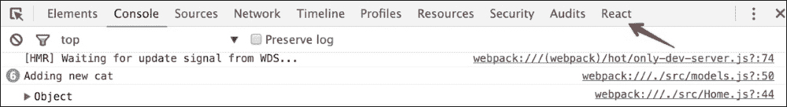
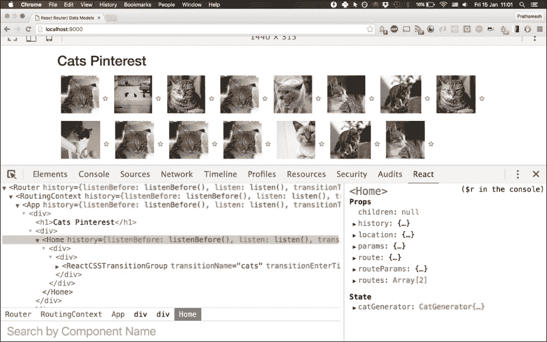
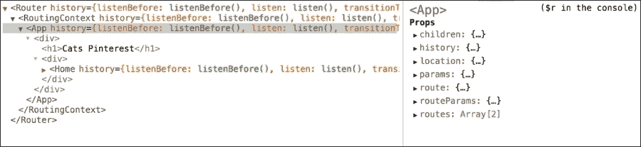
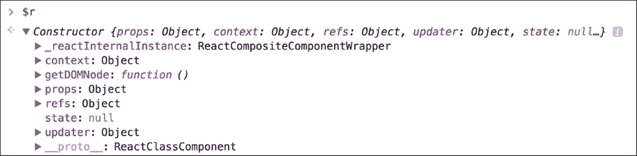
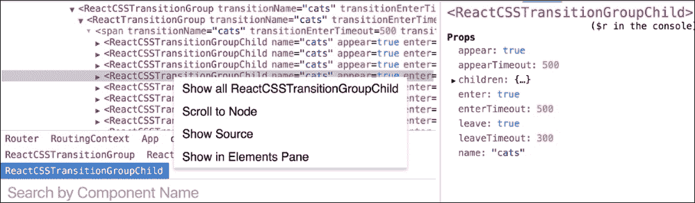

# 第十一章。React 工具

在上一章中，我们学习了如何使用动画插件和 CSS 过渡。我们还探索了不同的事件，并研究了如何通过动画轻松增强我们的应用程序，以创建令人惊叹的效果。

在本章中，我们将探讨 React 生态系统中的各种工具，这些工具在整个应用程序的生命周期中都有用——开发、调试和构建工具。我们将看到这些工具如何使开发 React 应用程序成为一种美好的体验。

在本章中，我们将研究以下工具：

+   Babel

+   ESLint

+   React 开发者工具

+   Webpack

+   使用 Webpack 进行热重载

迈克和肖恩在开始他们的下一个项目之前有一些空闲时间。他们决定利用这段时间学习更多关于他们在 React 项目中迄今为止使用的各种工具，这些工具用于开发、测试和打包应用程序。

# 开发工具

"肖恩，今天我想讨论一下我们在今天构建 React 应用程序过程中所使用的工具。React 是一个非常小的库，它做了一件事情做得很好——渲染 UI。然而，在我们迄今为止的旅程中，我们不得不使用很多其他工具与 React 一起使用。今天是我们讨论所有这些工具的一天。" 迈克说。

"太棒了，迈克！我总是准备好了。让我们开始吧。" 肖恩兴奋地说。

## 使用 Babel 进行 ES6 和 JSX

"肖恩，我们从一开始就使用了 ES6 或 ES2015 代码。我们也非常看好使用 JSX。有时，我们也使用了 ES7 代码，比如我们最新的 Cats Pinterest 项目中函数`bind`操作符。"

```js
// src/Home.js

class Home extends React.Component {
  componentDidMount() {
    this.timer = setInterval(::this.generateCats, 1000);
  }
}
```

"是的，迈克。我喜欢这些新功能的简洁性。" 肖恩说。

"然而，当前的浏览器仍然不理解我们编写的 ES6 或 ES7 代码。我们使用 Babel 将这些代码转换为 ES5 JavaScript，这样当前的浏览器就可以运行。它允许我们今天使用未来的 JavaScript 语法。Babel 还支持 JSX，因此它与 React 一起使用非常方便。" 迈克解释说。

"Babel 非常模块化，并带有插件架构。它为不同的 ES6/ES7 语法提供了插件。通常，我们希望使用特定于 React 和特定于 ES6 的插件。Babel 将这些常见插件组合成称为**预设**的东西。Babel 为 ES6、React 以及未来的语言提案的不同阶段提供了各种插件。"

"我们主要对使用 ES2015 和 React 预设感兴趣，这些预设包含所有与 ES6 和 React 相关的插件。偶尔，我们确实需要一些高级功能，例如 ES7 函数绑定语法，因此我们需要单独配置它。在这种情况下，我们直接使用单个插件，就像我们使用`transform-function-bind`来处理`bind`函数语法一样。" 迈克解释说。

### 注意

所有这些预设和插件都有自己的 npm 包。Babel 就是这样构建的——一个小型核心和庞大的插件架构，周围有许多配置选项。

"因此，我们将不得不分别安装所有这些包。"

```js
npm install babel-core --save
npm install babel-loader --save
npm install babel-preset-react --save
npm install babel-preset-es2015 --save
npm install babel-plugin-transform-function-bind –save

```

"明白了。我也看到了我们 Webpack 配置中的一些 Babel 相关配置。" 肖恩说。

"是的。虽然 Babel 允许我们从命令行转换文件，但我们不想手动转换每个文件。因此，我们已经以这种方式配置了 Webpack，它将在启动应用程序之前使用 Babel 转换我们的 ES6/ES7 代码。它使用 babel-loader 包。等我们今天晚些时候讨论 Webpack 时再详细讨论这个问题吧。" 迈克说。

### 注意

我们在这本书中一直使用 Babel 版本 6。查看有关 Babel 的更多详细信息，请访问[`babeljs.io/`](http://babeljs.io/)。

## ESLint

"肖恩，你看到我们项目中关于 linting 的提交了吗？"

"是的。最初我对这些小小的变化感到很烦恼，但后来我习惯了。"

"**Linting**非常重要，尤其是如果我们想在不同的项目中保持代码质量。幸运的是，使用 ESLint 来 lint React 项目非常容易。它还支持 ES6 语法和 JSX，这样我们也可以 lint 我们的下一代代码。" 迈克说道。

"我们使用 eslint-plugin-react 和 babel-eslint npm 包来 lint ES6 和 React 代码。我们还全局安装了 ESLint npm 包。"

### 注意

查看有关如何开始使用 ESLint 的详细信息，请访问[`eslint.org/docs/user-guide/getting-started`](http://eslint.org/docs/user-guide/getting-started)。

"迈克，我也看到你在`package.json`的`scripts`下添加了 lint 命令。" 肖恩补充道。

```js
// package.json  

"scripts": {
"lint": "eslint src"
}
```

"是的，肖恩。在大项目中，这里那里可能会遗漏一些事情是很常见的。有一个命令来 lint 项目有助于我们找到这些事情。我们需要 eslint、eslint-babel 和 eslint-plugin-react 包来在我们的代码中使用 ESLint。因此，在尝试运行此命令之前，我们需要安装它。"

```js
npm install eslint --save
npm install babel-eslint --save
npm install eslint-plugin-react –save

```

"我们也在使用一些标准的 ESLint 配置选项。这些选项存在于我们项目的`.eslintrc`文件中。我们在这个文件中定义了 ESLint 要检查的规则。我们还启用了 ES6 功能，让 ESLint 将其列入白名单。否则，它会对原生只支持 ES5 的此类代码引发 linting 错误。我们还指定 ESLint 应使用 babel-eslint 作为解析器，以便 ES6 代码能够被 ESLint 正确解析。"

```js
// .eslintrc
{
  "parser": "babel-eslint",
  "env": {
    "browser": true,
    "es6": true,
    "node": true,
    "jquery": true 
  },
  "plugins": [
    "react" 
  ],
  "ecmaFeatures": {
    "arrowFunctions": true,
    "blockBindings": true,
    "classes": true,
    "defaultParams": true,
    "destructuring": true,
    "forOf": true,
    "generators": true,
    "modules": true,
    "spread": true,
    "templateStrings": true,
    "jsx": true
  },
  "rules": {
    "consistent-return": [0],
    "key-spacing": [0],
    "quotes": [0],
    "new-cap": [0],
    "no-multi-spaces": [0],
    "no-shadow": [0],
    "no-alert": [0],
    "no-unused-vars": [0],
    "no-underscore-dangle": [0],
    "no-use-before-define": [0, "nofunc"],
    "comma-dangle": [0],
    "space-after-keywords": [2],
    "space-before-blocks": [2],
    "camelcase": [0],
    "eqeqeq": [2]
  }
}
```

"我们现在已经准备好了。去运行我们的 Pinterest 项目，并修复剩余的 linting 问题。" 迈克说道。

```js
$ npm run lint

> react-router-flux@0.0.1 lint /Users/prathamesh/Projects/sources/reactjs-by-example/chapter11
> eslint src

/reactjs-by-example/chapter11/src/Home.js
 29:20  error  Missing space before opening brace  space-before-blocks

x 1 problem (1 error, 0 warnings)

```

"啊，它抱怨缺少了一个空格。让我快速修复一下。"

```js
// Before  
faveUnfave(event){
    …
}

// After
faveUnfave(event) {
…
}
```

"完美，肖恩！"

### 注意

ESLint 也可以与您的文本编辑器集成。有关更多详细信息，请查看[`eslint.org/docs/user-guide/integrations.html`](http://eslint.org/docs/user-guide/integrations.html)。

# React Dev Tools

"肖恩，React 在提升开发者体验方面非常出色。他们发布了 react-dev-tools 来帮助我们调试我们的应用程序。React 开发者工具是 Chrome 和 Firefox 的插件，这使得调试 React 应用程序变得有趣。"

“一旦安装了插件，你将在运行 React 应用的浏览器控制台中看到一个 **React** 选项卡。有趣的是，这个选项卡也会显示在生产中使用 React 的网站上，例如，Facebook。”



“一旦我们点击 **React** 选项卡，它就会显示我们应用中的所有组件。”



“肖恩，正如你可能注意到的，我们可以在左侧面板中看到所有的组件。在右侧，我们看到左侧面板中选择的组件的属性和状态。因此，我们可以在任何时间点检查 UI 状态。我们不需要添加 `console.log` 语句来查看我们的组件发生了什么。”

“不仅如此，它还为我们提供了一个临时变量——**$r**。控制台中的所选组件在控制台中可用为 **$r**。”



“让我们看看控制台中的 **$r** 能给我们带来什么，这样我们就可以直接在控制台中调试所选组件。”



“它还允许我们滚动到 UI 中的所选组件，以查看组件的实际源代码。它还可以显示特定类型的所有组件。”



“肖恩，你对这些开发工具有什么看法？”迈克问道。

“我非常印象深刻。这真的很棒！从现在开始，我将在每一个 React 项目中使用它们。”肖恩对看到 React 开发工具的力量感到非常兴奋。

### 注意

查看更多关于 React 开发工具的详细信息：[`github.com/facebook/react-devtools`](https://github.com/facebook/react-devtools)

# 构建工具

“肖恩，当创建新的 Web 应用程序时，构建系统可能是我们首先应该关心的事情。它不仅是一个运行脚本的工具，在 JavaScript 世界中，它通常塑造我们应用程序的基本结构。”

以下责任应由构建系统执行：

+   外部依赖以及内部依赖都应该被管理

+   它应该运行编译器/预处理器

+   它应该优化生产环境中的资源

+   开发服务器、浏览器重新加载器和文件监视器应该由它运行

“有很多不同的工具，如 Grunt、Gulp 和 Browserify，可以用作我们构建系统的一部分。每个工具都有其自身的优缺点。然而，我们已经决定在我们的项目中使用 Webpack。”迈克说道。

## 什么是 Webpack？

“Webpack 是一个模块打包器。它将我们的 JavaScript 及其依赖项打包成一个单独的包。”

"与 Browserify 和其他工具不同，Webpack 还可以捆绑其他资源，如 CSS、字体和图像。它支持 CommonJS 模块语法，这在 node.js 和 npm 包中非常常见。因此，它使事情变得更容易，因为我们不需要使用另一个包管理器来处理前端资源。我们可以只使用 npm，并在服务器端代码和前端代码之间共享依赖项。它还足够智能，能够按正确顺序加载依赖项，这样我们就不需要担心显式和隐式依赖项的顺序。"（内联代码不需要翻译）

"因此，Webpack 本身就可以执行 Browserify 以及其他构建工具如 Grunt 和 Gulp 的任务。"（内联代码不需要翻译）

### Note（内联代码不需要翻译）

"本节不会涵盖 Webpack 的所有方面。然而，我们将讨论如何有效地使用 Webpack 与 React 结合。"（内联代码不需要翻译）

## Webpack configuration（内联代码不需要翻译）

"肖恩，在一个典型的 React 应用中，我们在组件中使用 ES6 代码和 JSX。我们还在同一个组件中使用前端资源，使其更易于携带。因此，我们的 Webpack 配置必须正确处理所有这些方面。" 迈克解释道。

"让我们以我们的 Pinterest 应用为例，看看 Webpack 是如何配置来运行它的。"（内联代码不需要翻译）

"首先，我们需要通知 Webpack 关于我们应用的入口点。在我们的例子中，它是`index.js`文件，它将`App`组件挂载到 DOM 中。"（内联代码不需要翻译）

```js
// src/index.js
render((
  <Router history={history}>
    <Route path="/" component={App}>
      <IndexRoute component={Home}/>
      <Route path="/pictures/:id" component={Picture}/>
    </Route>
  </Router>
), document.getElementById('rootElement'));
```

"因此，我们在`webpack.config.js`文件中提到入口点为`src/index.js`。"（内联代码不需要翻译）

```js
// webpack.config.js
path = require('path');
var webpack = require('webpack');

module.exports = {
  // starting point of the application
  entry: [ './src/index']
};
```

"其次，我们需要通知 Webpack 将生成的捆绑代码放在哪里。这是通过添加一个输出配置来完成的。"（内联代码不需要翻译）

```js
// webpack.config.js
var path = require('path');
var webpack = require('webpack');

module.exports = {
  entry: ['./src/index'],
  output: {
    path: path.join(__dirname, 'dist'),
    filename: 'bundle.js',
    publicPath: '/static/'
  }
}
```

"输出选项告诉 Webpack 将编译后的文件写入当前目录的 dist 文件夹。文件名将是`bundle.js`。我们可以通过运行`webpack`命令来查看`bundle.js`的输出。"（内联代码不需要翻译）

```js
$ webpack
Hash: f8496f13702a67943730
Version: webpack 1.12.11
Time: 2690ms
 Asset     Size  Chunks             Chunk Names
bundle.js  1.81 MB       0  [emitted]  main
 [0] multi main 52 bytes {0} [built]
 + 330 hidden modules

```

"这将创建一个包含所有编译代码的`dist/bundle.js`文件。"（内联代码不需要翻译）

"The `publicPath` specifies the public URL address of the output files, when referenced in a browser. This is the path that we use in our `index.html` file, which will be served by the web server to the users."（内联代码不需要翻译）

```js
// index.html
<html>
  <head>
    <title>React Router/ Data Models</title>
    <link rel="stylesheet" href="https://maxcdn.bootstrapcdn.com/bootstrap/3.3.5/css/bootstrap.min.css" type="text/css" />
    <link href="https://maxcdn.bootstrapcdn.com/font-awesome/4.5.0/css/font-awesome.min.css" rel="stylesheet">
  </head>
  <body>
    <div id='rootElement' class="container"></div>
  </body>
  <script src="img/jquery-2.1.4.min.js"></script>
  <script src="img/bootstrap.min.js"></script>
 <script src="img/bundle.js"></script>
</html>
```

### Loaders（内联代码不需要翻译）

"之后，我们必须指定不同的加载器来正确转换我们的 JSX、ES6 代码和其他资源。加载器是对你的应用资源文件应用的一种转换。它们是运行在 node.js 中的函数，它们将资源文件的源作为参数，并返回新的源。我们使用`babel-loader`来处理我们的 ES6 和 JSX 代码。"（内联代码不需要翻译）

```js
// webpack.config.js
module.exports = {
  module: {
    loaders: [
      {
        test: /\.jsx?$/,
        loader: 'babel-loader',
        query: {
          presets: ['es2015', 'react'],
          plugins: ['transform-function-bind']
        },
        include: path.join(__dirname, 'src')
      }]
  }
};
```

"我们通过 npm 安装了`babel-loader`包，并将其包含在`package.json`中。之后，我们在 Webpack 配置中指定了它。测试选项匹配给定的正则表达式。给定的加载器解析这些文件。因此，`babel-loader`将编译`src`目录中由`include`选项指定的源文件中的`.jsx`和`.js`文件。我们还指定`babel-loader`应使用 es2015 和 react 预设以及 function-bind 转换器插件，这样 Babel 就能正确解析我们所有的代码。"（内联代码不需要翻译）

"对于其他类型的资产，如 CSS、字体和图像，我们使用它们自己的加载器。"

```js
// webpack.config.js

module.exports = {
module: {
    loaders: [
      {
        test: /\.jsx?$/,
        loader: 'babel-loader',
        query: {
          presets: ['es2015', 'react'],
          plugins: ['transform-function-bind']
        },
        include: path.join(__dirname, 'src')
      },
      { test: /\.css$/, loader: "style-loader!css-loader" },
      { test: /\.woff(\d+)?$/, loader: 'url?prefix=font/&limit=5000&mimetype=application/font-woff' },
      { test: /\.ttf$/, loader: 'file?prefix=font/' },
      { test: /\.eot$/, loader: 'file?prefix=font/' },
      { test: /\.svg$/, loader: 'file?prefix=font/' },
      { test: /\.woff(2)?(\?v=[0-9]\.[0-9]\.[0-9])?$/, loader: "url-loader?limit=10000&minetype=application/font-woff"},
      { test: /\.(ttf|eot|svg)(\?v=[0-9]\.[0-9]\.[0-9])?$/, loader: "file-loader" }
    ]
  }
};
```

"所有这些加载器都包含在其自己的 npm 包中。我们必须为`style-loader`、`css-loader`、`url-loader`和`file-loader`安装 npm 包，并更新`package.json`。"

### 注意

查阅[`webpack.github.io/docs/using-loaders.html`](https://webpack.github.io/docs/using-loaders.html)以获取有关使用和配置加载器的更多详细信息。

### 热模块替换

"肖恩，Webpack 最酷的特性之一是**热模块替换**（**HMR**）。这意味着每次我们修改一个组件并保存文件时，Webpack 都会在不重新加载浏览器和丢失组件状态的情况下替换页面上的模块。"迈克告知。

"哇！这听起来非常令人印象深刻。"肖恩惊呼。

"为了使热重载工作，我们必须使用出色的 react-hot-loader 包和 webpack-dev-server。webpack-dev-server 包在启动服务器之前，每次文件更改之前都无需重复运行 Webpack，它会为我们使用`webpack.config.js`中提供的`config`选项运行应用。设置 webpack-dev-server 的关键点是配置它以启用热重载。这可以通过添加`hot: true`配置选项来完成。"

```js
// server.js
var webpack = require('webpack');
var WebpackDevServer = require('webpack-dev-server');
var config = require('./webpack.config');

new WebpackDevServer(webpack(config), {
  publicPath: config.output.publicPath,
  hot: true,
  historyApiFallback: true
}).listen(9000, 'localhost', function (err, result) {
  if (err) {
    console.log(err);
  }

  console.log('Listening at localhost:9000');
});
```

"这将确保 webpack-dev-server 将在 localhost 端口`9000`上启动，并启用热重载。它还将使用我们在`webpack.config.js`中定义的所有配置。"迈克说。

"我们将必须修改我们的`package.json`以运行`server.js`脚本。"

```js
// package.json
"scripts": {
    "start": "node server.js",
  }
```

"这将确保`npm start`命令将运行`webpack-dev-server`。"

"我们还需要在我们的 Webpack 配置中进行一些更改，以便使热重载工作。我们必须配置入口选项以包含开发服务器和热重载服务器。"

```js
entry: [
    'webpack-dev-server/client?http://localhost:9000',
    'webpack/hot/only-dev-server',
    './src/index'
]
```

"接下来，我们需要通知 Webpack 使用 hot-loader 与我们已经添加的其他加载器。"

```js
module: {
    loaders: [
      { test: /\.jsx?$/,
        loader: 'react-hot',
        include: path.join(__dirname, 'src')
      }
     .. .. .. 
    ]
  }
```

"最后，Webpack 的热模块替换插件必须包含在配置的插件部分。"

```js
plugins: [
    new webpack.HotModuleReplacementPlugin(),
    new webpack.NoErrorsPlugin()
]
```

"最终的 Webpack 配置看起来像这样"

```js
// webpack.config.js
var path = require('path');
var webpack = require('webpack');

module.exports = {
  devtool: 'eval',
  entry: [
    'webpack-dev-server/client?http://localhost:9000',
    'webpack/hot/only-dev-server',
    './src/index'
  ],
  output: {
    path: path.join(__dirname, 'dist'),
    filename: 'bundle.js',
    publicPath: '/static/'
  },
  plugins: [
    new webpack.HotModuleReplacementPlugin(),
    new webpack.NoErrorsPlugin()
  ],
  resolve: {
    extensions: ['', '.js', '.jsx']
  },
  module: {
    loaders: [
      { test: /\.jsx?$/,
        loader: 'react-hot',
        include: path.join(__dirname, 'src')
      },
      {

        test: /\.jsx?$/,
        loader: 'babel-loader',
        query: {
          presets: ['es2015', 'react'],
          plugins: ['transform-function-bind']
        },
        include: path.join(__dirname, 'src')
      },
      { test: /\.css$/, loader: "style-loader!css-loader" },
      { test: /\.woff(\d+)?$/, loader: 'url?prefix=font/&limit=5000&mimetype=application/font-woff' },
      { test: /\.ttf$/, loader: 'file?prefix=font/' },
      { test: /\.eot$/, loader: 'file?prefix=font/' },
      { test: /\.svg$/, loader: 'file?prefix=font/' },
      { test: /\.woff(2)?(\?v=[0-9]\.[0-9]\.[0-9])?$/, loader: "url-loader?limit=10000&minetype=application/font-woff"},
      { test: /\.(ttf|eot|svg)(\?v=[0-9]\.[0-9]\.[0-9])?$/, loader: "file-loader" }
    ]
  }
};
```

"现在如果我们使用`npm start`启动应用，那么它将使用 webpack-dev-server 的热重载器。肖恩，尝试更改一些代码并检查代码是否在浏览器中更新而无需刷新页面。魔法！！"迈克解释说。

"太好了，迈克。是的，它确实有效。万岁 Webpack 和热重载！"

# 摘要

在本章中，你学习了 React 生态系统中的各种工具——开发、测试和生产工具，我们在应用开发的各个阶段都使用了这些工具。我们讨论了 Babel，JavaScript 转译器，将我们的下一代 JavaScript 代码转换为 ES5。我们还看到了如何使用 ESLint 和 React 开发者工具使 React 开发变得容易。最后，我们看到了如何使用 Webpack 及其强大的加载器和配置选项与 React 一起使用。我们看到了这些工具如何使开发 React 应用成为一种美好的体验。"

在下一章中，我们将深入探讨 Flux 作为架构的应用。我们已了解到在组件间共享数据时会出现问题。我们将学习如何使用 Flux 来克服这些问题。
