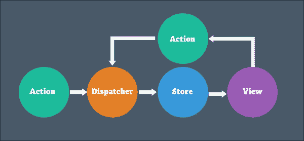
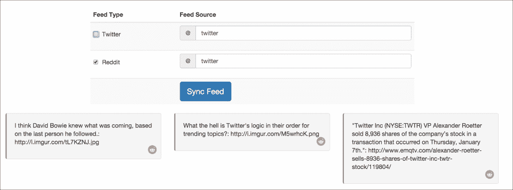
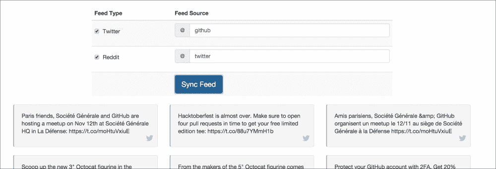

# 第十二章。Flux

在上一章中，我们查看了一系列在应用程序整个生命周期中都有用的 React 生态系统中的工具——开发、测试和生产。我们还看到了 React 如何使用开发者工具来提高开发者体验。我们了解到了可以与 React 一起使用的各种测试工具。为了总结，我们看到了如何使用构建工具，如 Webpack 和 Browserify，以及它们如何与 React 一起使用。

在本章中，我们将深入探讨 Flux 作为一种架构。我们已经看到了在组件间数据共享过程中出现的问题。我们将看到如何通过拥有一个单一的数据存储点来克服这些问题。接下来，我们将检查如何使用 React 来克服这个问题。

分发器充当一个中央枢纽来管理这种数据流和通信以及动作如何调用它们。最后，我们将查看在构建我们的社交媒体追踪器应用程序时发生的完整数据流。

在本章中，我们将涵盖以下主题：

+   Flux 架构

+   存储库

+   动作

+   分发器

+   Flux 实现

在本章结束时，我们将能够开始用 Flux 替换应用程序中具有紧密数据耦合的部分。我们将能够为 Flux 搭建必要的基础，并轻松地在我们的 React 视图中开始使用它。

# Flux 架构和单向流

“嘿，迈克和肖恩！”卡拉在一个晴朗的早晨说道。

“嗨，卡拉，你今天怎么样？”

“太棒了。你之前构建的应用程序很好，客户喜欢它。他们很快会为它添加更多功能。同时，我们还有一个小型应用程序要构建。”

“哦，不错。我们打算构建什么？”迈克问道。

“我们需要构建一种社交追踪器。首先，我们展示用户的 reddits、tweets 等内容。我们稍后会扩展它以显示其他信息。”

“明白了，”肖恩重复道。

“祝你有美好的一天；我将把它留给你。”

“肖恩，你对这个新项目有什么看法？”

“这应该会很有趣。嗯……我们能否探索 Flux 并在应用程序中使用它？我们在构建上一个应用程序时讨论过它。”

“是的，我们可以。这将是一个了解 Flux 如何工作的完美机会。在我们开始使用它之前，让我们先了解一下 Flux 实际上是什么。”

“Flux 是 React 使用单向流的一个简单架构。我们之前讨论过单向流如何适合 React。当数据有任何更改时，React 遵循始终渲染的模型。数据不会像双向绑定的情况那样有其他方向。”

“这并不完全符合**模型-视图-控制器**（**MVC**）的工作方式。它由模型（存储库）、动作和分发器组成，最后是视图（React 视图）。”

“目前还没有完整的 Flux 作为框架的模块，因为它不是为此而设计的。Facebook 提供了 Flux 模块，它由**分发器**组成。其他部分，如**视图**和**存储库**，可以在没有太多支持的情况下完成。让我们一一过一遍，好吗？”

"当然。我相信我们可以讨论它们是如何相互关联的，以及为什么当应用开始增长时它们特别有用。"

"是的。"

"正如您在下面的图像中可以看到的，各种组件相互连接并独立工作。数据在一个循环中以单一流向流动。"

"正如我之前提到的，**分发器**充当中央枢纽。每当视图发生事件时，例如用户点击按钮或 Ajax 调用完成，就会调用动作。动作也可能由**分发器**调用。"

"动作是简单的结构，将有效载荷传递给**分发器**，**分发器**识别**动作**以及从动作和数据中获取的更新当前状态所需的其他细节。"



"然后**分发器**将其传播到存储。**分发器**就像一个回调注册表，所有存储都注册自己。每当发生某些动作时，**分发器**都会通知并回调存储。无论动作是什么，它都会被发送到所有存储。"

"**分发器**不做任何复杂的活动，它只是将有效载荷转发给已注册的存储，并且不处理任何数据。"

"执行逻辑和复杂决策以及数据更改的责任委托给了存储。这有助于将数据更改点集中在单一位置，并避免在应用程序周围进行更改，这些更改更难追踪。"

"在接收到**分发器**的回调后，**存储**根据**动作**类型决定是否需要执行任何操作。基于回调，它可以更新当前存储。它也可以等待其他存储更新。在完成更改后，它继续通知视图。在我们的简单 Flux 版本中，可以通过使用从 events 模块可用的`EventEmitter`模块来实现这一点。"

"与动作类似，视图会注册自己以监听存储中的变化。在某些变化发生时，`EventEmitter`会发出一个事件。根据事件类型，它将调用一个已注册监听该事件的`View`方法。"

"接收事件的**视图**可以根据它可用的任何存储的当前状态更新其自身状态。状态更新然后触发**视图**更新。"

"这个过程通过**视图**事件继续，导致对**动作**和**分发器**等的调用。"

"希望，现在这有点清晰了？" 迈克问道。

"嗯...是的，让我理清思路。我们有动作来执行动作，基于一个事件。然后它通知**分发器**，然后通知任何已注册监听更改的存储。存储根据动作类型更新自己，并通知 React 视图更新自己。"

"正确！让我们立即深入到应用中。我们将基于官方 Flux 示例构建我们的应用。它将这样结构化。"

`js/`

`├── actions`

`│ └── SocialActions.js`

`├── app.js`

`├── components`

`│ └── SocialTracker.react.js`

`├── constants`

`│ └── SocialConstants.js`

`├── dispatcher`

`│ └── AppDispatcher.js`

`├── stores`

`│ └── SocialStore.js`

`└── utils`

`└── someutil.js`

"现在，正如卡拉提到的，我们需要显示来自 Twitter 和 Reddit 的用户数据。对于 Reddit，它可以通过 API 调用公开获取，正如我们很快将看到的。"

"对于 Twitter，我们需要做一些基础设置并创建一个 Twitter 应用。我们可以在[`apps.twitter.com/`](https://apps.twitter.com/)上创建一个新的。我已经为我们的应用创建了一个。"


"然后我们将使用`twitter`模块来访问 Twitter 并从用户那里获取 tweets。让我们设置一个`config.js`文件来存储我们之前创建的访问令牌，如下所示："

```js
module.exports ={
  twitter_consumer_key: 'xxxx',
  twitter_consumer_secret: 'xxxx',
  twitter_access_token_key: 'xxxx',
  twitter_access_token_secret: 'xxxx'
}
```

"这些对应于我们在我们的应用中创建的相对键和秘密。接下来，我们将创建一个客户端，使用前面的凭证访问数据。"

```js
var Twitter = require('twitter');
var config = require('./config');

var client = new Twitter({
  consumer_key: config.twitter_consumer_key,
  consumer_secret: config.twitter_consumer_secret,
  access_token_key: config.twitter_access_token_key,
  access_token_secret: config.twitter_access_token_secret
});
```

"我们将在我们的 express 服务器应用程序中使用这个客户端。正如我说的，对于 Reddit，我们可以直接调用 Reddit API 来访问 reddits。对于 Twitter，它将首先击中我们的 node `App`并返回 tweets 到我们的 React 组件。"

"你想定义这个吗，肖恩？"

"当然。"

```js
var express= require('express');
var app = new (require('express'))();
var port = 3000

app.get('/tweets.json', function (req, res) {
  var params = {screen_name: req.query.username};
  client.get('statuses/user_timeline', params, function (error, tweets, response) {
    if (!error) {
      res.json(tweets);
    } else {
      res.json({error: error});
    }
  });
});
```

"我在这里定义了一个名为`tweets.json`的 JSON 端点。它将调用`client.get()`方法，这是一个 REST API 包装器，用于调用 Twitter API。我们调用`statuses/user_timeline` API 来获取用户的用户时间线，这是从请求中传递给我们的。"

在收到响应后，它将把这个信息发送回调用它的 React 组件。"

"看起来不错。现在，让我们从 App 开始。我们将首先定义 Dispatcher。"

```js
// AppDispatcher.js
var Dispatcher = require('flux').Dispatcher;

module.exports = new Dispatcher();
```

"我们通过从`flux.Dispatcher`中引入它来定义我们的 dispatcher。然后我们将在各个地方使用它。"

# Flux actions

"现在我们需要定义我们将要作为常量在各种地方引用的动作类型，例如从 Actions 发送类型到 store，并在我们的 store 中，决定传递给 store 的动作类型以采取适当的行动。

```js
//SocialConstants.js
var keyMirror = require('keymirror');

module.exports = keyMirror({
  FILTER_BY_TWEETS: null,
  FILTER_BY_REDDITS: null,
  SYNC_TWEETS: null,
  SYNC_REDDITS: null

});
```

"在这里，我们使用[`github.com/STRML/keyMirror`](https://github.com/STRML/keyMirror)包根据键创建对象的关键和值。这将转换为类似于以下的对象。"

```js
{
FILTER_BY_TWEETS: 'FILTER_BY_TWEETS', 
…
}
```

"当添加新键时，这很方便，可以避免再次重复相同的内容。"

"我们现在可以开始使用动作常量了。它们代表我们将要执行的四种动作，如下所示："

+   `SYNC_TWEETS`: 这将获取给定用户的 tweets

+   `SYNC_REDDITS`: 这将获取给定主题的 reddits

+   `FILTER_BY_TWEETS`: 这仅显示 tweets，而不是 tweets 和 reddits

+   `FILTER_BY_REDDITS`: 这仅显示 reddits，而不是 tweets 和 reddits

"接下来，让我们定义将在我们的视图的不同地方调用的动作。"

```js
// file: SocialActions.js
var AppDispatcher = require('../dispatcher/AppDispatcher');
var SocialConstants = require('../constants/SocialConstants');
var assign = require('object-assign');
var JSONUtil = require('../utils/jsonutil');

var SocialActions = {

  filterTweets: function (event) {
    AppDispatcher.dispatch({
      type: SocialConstants.FILTER_BY_TWEETS,
      showTweets: event.target.checked
    });
  },

  filterReddits: function (event) {
    AppDispatcher.dispatch({
      type: SocialConstants.FILTER_BY_REDDITS,
      showReddits: event.target.checked
    });
  },

  syncTweets: function (json) {
    AppDispatcher.dispatch({
      type: SocialConstants.SYNC_TWEETS,
      tweets: json.map((tweet) => {
        return assign(tweet, {type: 'tweet'})
      }),
      receivedAt: Date.now()
    });
  },

  syncReddits: function (json) {
    AppDispatcher.dispatch({
      type: SocialConstants.SYNC_REDDITS,
      reddits: json.data.children.map((child) => {
        return assign(child.data, {type: 'reddit'})
      }),
      receivedAt: Date.now()
    });
  },

  fetchTweets: function (username) {
    fetch(`/tweets.json?username=${username}`)
        .then(JSONUtil.parseJSON)
        .then(json => SocialActions.syncTweets(json)).catch(JSONUtil.handleParseException)
  },

  fetchReddits: function (topic) {
    fetch(`https://www.reddit.com/r/${topic}.json`)
        .then(JSONUtil.parseJSON)
        .then(json => SocialActions.syncReddits(json)).catch(JSONUtil.handleParseException)
  }
};

module.exports = SocialActions;
```

"让我们逐个分析这些动作："

```js
  fetchTweets: function (username) {
    fetch(`/tweets.json?username=${username}`)
        .then(JSONUtil.parseJSON)
        .then(json => SocialActions.syncTweets(json)).catch(JSONUtil.handleParseException)
  }
```

"在这里，我们使用 fetch，这与我们之前使用的 Ajax 类似，用于从我们的`tweets.json` API 获取推文，其中我们传递了需要获取推文的用户名。我们在这里使用我们定义的 JSON 实用方法。"

```js
var JSONUtil = (function () {
  function parseJSON(response){
    return response.json()
  }
  function handleParseException(ex) {
    console.log('parsing failed', ex)
  }
  return {'parseJSON': parseJSON, 'handleParseException': handleParseException}
}());

module.exports = JSONUtil;
```

"它们帮助我们将响应转换为 JSON，或者在失败的情况下记录它们："

"在从 API 接收到成功响应后，我们从同一模块调用`SocialActions.syncTweets(json)`方法。"

```js
  syncTweets: function (json) {
    AppDispatcher.dispatch({
      type: SocialConstants.SYNC_TWEETS,
      tweets: json.map((tweet) => {
        return assign(tweet, {type: 'tweet'})
      }),
      receivedAt: Date.now()
    });
  }
```

"接下来，`syncTweets`接受 JSON。然后，它将 JSON 包装成一个对象有效载荷，发送给分发器。在这个对象中，我们创建了一个推文数组，从有效载荷中。我们还为每个对象标记了类型，以表示它是推文，这样我们就可以在同一个数组中混合和匹配推文和 Reddit，并识别它代表的是推文还是 Reddit。"

```js
assign(tweet, {type: 'tweet'})
```

"我们使用`Object.assign`，它将两个对象合并在一起。我们在这里使用`object-assign`包。"

"现在，我们通知分发器关于最终要传递给存储器的有效载荷，如下所示："

```js
AppDispatcher.dispatch({ payload…});
```

"同样，我们还有一个`syncReddits`方法，如下所示："

```js
  fetchReddits: function (topic) {
    fetch(`https://www.reddit.com/r/${topic}.json`)
        .then(JSONUtil.parseJSON)
        .then(json => SocialActions.syncReddits(json)).catch(JSONUtil.handleParseException)
  }
```

"这从`https://www.reddit.com/r/${topic}.json`获取 Reddit，例如[`www.reddit.com/r/twitter.json`](https://www.reddit.com/r/twitter.json)。"

"在获取数据后，它将数据传递给`SocialActions.syncReddits(json))`，从而为分发器创建有效载荷，如下所示："

```js
  syncReddits: function (json) {
    AppDispatcher.dispatch({
      type: SocialConstants.SYNC_REDDITS,
      reddits: json.data.children.map((child) => {
        return assign(child.data, {type: 'reddit'})
      }),
      receivedAt: Date.now()
    });
  }
```

"请注意，我们在这里传递了类型属性给动作。这是为了通知存储器在接收到有效载荷时采取什么动作。"

"明白了。看到我们如何基于这个对象进行操作会很有趣。"

"是的。接下来，我们有两个简单的方法，将事件传递到存储器中，如下所示："

```js
  filterTweets: function (event) {
    AppDispatcher.dispatch({
      type: SocialConstants.FILTER_BY_TWEETS,
      showTweets: event.target.checked
    });
  },

  filterReddits: function (event) {
    AppDispatcher.dispatch({
      type: SocialConstants.FILTER_BY_REDDITS,
      showReddits: event.target.checked
    });
  },
```

"我们将使用这些方法作为`onClick`方法。点击复选框时，复选框的值——无论是 Reddit 还是 Twitter——将在`event.target.checked`中可用。"

"我们将这些包裹在一个简单的对象中，用动作调用的类型标记它们，并将相同的对象发送给分发器。这样，我们将知道我们将要显示推文、Reddit 还是什么都没有。"

# Flux 存储

"很好，看起来我们现在都准备好创建我们的存储器了。"

"是的，肖恩。我们将从定义我们将不断更新并用作存储器的状态对象开始。"

```js
var AppDispatcher = require('../dispatcher/AppDispatcher');
var EventEmitter = require('events').EventEmitter;
var SocialConstants = require('../constants/SocialConstants');
var assign = require('object-assign');
var _ = require('underscore');

var CHANGE_EVENT = 'change';

var _state = {
  tweets: [],
  reddits: [],
  feed: [],
  showTweets: true,
  showReddits: true
};
```

"我们还定义了一个`CHANGE_EVENT`常量，我们将其用作标识符来*监听*来自存储器事件发射器的*更改*类型的事件。"

"然后我们定义一个方法来更新状态，创建一个新的状态。"

```js
function updateState(state) {
  _state = assign({}, _state, state);
}
```

"这合并了需要更新和合并到现有状态中的新属性，并更新了当前状态。"

"很好，这看起来与 React 的`setState`方法有些相似，”肖恩说。"

"是的。现在我们将定义我们的存储器，它将更新当前状态。"

```js
var SocialStore = assign({}, EventEmitter.prototype, {

  getState: function () {
    return _state;
  },

  emitChange: function () {
    this.emit(CHANGE_EVENT);
  },

  addChangeListener: function (callback) {
    this.on(CHANGE_EVENT, callback);
  },

  removeChangeListener: function (callback) {
    this.removeListener(CHANGE_EVENT, callback);
  }
});
```

"在这里，我们通过继承`EventEmitter`来定义我们的`SocialStore`。这使它能够被组件用来注册监听事件，在我们的例子中是`CHANGE_EVENT`。`addChangeListener`和`removeChangeListener`方法接受应该在事件上调用并移除监听器的方法，如下：`this.on(CHANGE_EVENT, callback);`和`this.removeListener(CHANGE_EVENT, callback);`

"每当我们要通知监听器时，我们调用。"

```js
this.emit(CHANGE_EVENT);
```

"最后，我们的视图可以使用以下函数从存储中获取当前状态："

```js
getState: function () {
    return _state;
  }
```

"最后，Shawn，让我们用我们的单个分发器将这些全部结合起来，如下："

```js
AppDispatcher.register(function (action) {

  switch (action.type) {

    case SocialConstants.FILTER_BY_TWEETS:
      updateState({
        showTweets: action.showTweets,
        feed: mergeFeed(_state.tweets, _state.reddits, action.showTweets, _state.showReddits)
      });
      SocialStore.emitChange();
      break;

    case SocialConstants.FILTER_BY_REDDITS:
      updateState({
        showReddits: action.showReddits,
        feed: mergeFeed(_state.tweets, _state.reddits, _state.showTweets, action.showReddits)
      });
      SocialStore.emitChange();
      break;
    case SocialConstants.SYNC_TWEETS:
      updateState({
        tweets: action.tweets,
        feed: mergeFeed(action.tweets, _state.reddits, _state.showTweets, _state.showReddits)
      });
      SocialStore.emitChange();
      break;

    case SocialConstants.SYNC_REDDITS:
      updateState({
        reddits: action.reddits,
        feed: mergeFeed(_state.tweets, action.reddits, _state.showTweets, _state.showReddits)
      });
      SocialStore.emitChange();
      break;
    default:
    // no op
  }
});
```

"每当`AppDispatcher.dispatch`被有效载荷调用时，前面的方法就会被调用。"

"让我们看看这些操作中的一个。"

```js
    case SocialConstants.SYNC_TWEETS:
      updateState({
        tweets: action.tweets,
        feed: mergeFeed(action.tweets, _state.reddits, _state.showTweets, _state.showReddits)
      });
      SocialStore.emitChange();
      break;
```

"我们在这里所做的就是调用`updateState`来通过提供更新的推文和基于`mergeFeed`方法的更新来更新当前状态。"

"让我们看看它。"

```js
function mergeFeed(tweets, reddits, showTweets, showReddits) {
  let mergedFeed = [];
  mergedFeed = showTweets ? mergedFeed.concat(tweets) : mergedFeed;
  mergedFeed = showReddits ? mergedFeed.concat(reddits) : mergedFeed;

  mergedFeed = _.sortBy(mergedFeed, (feedItem) => {
    if (feedItem.type == 'tweet') {
      let date = new Date(feedItem.created_at);
      return date.getTime();
    } else if ((feedItem.type == 'reddit')) {
      return feedItem.created_utc * 1000;
    }
  })
  return mergedFeed;
};
```

"我根据是否选择了`showTweets`和`showReddits`来组合了各种要处理的操作。"

"所以，这个方法所做的就是接受推文和 reddit 数组数据，以及检查是否选中了显示 reddits 或显示推文。我们根据这些选中的/未选中的字段将这些字段构建到`mergedFeed`数组中。"

"然后，我们使用`underscorejs`的`sortBy`方法对这个混合的推文和 reddits 数据数组`mergedFeed`进行排序，基于两种类型对象的`time`字段。对于推文，这个字段是`created_at`字段，而对于 reddit，它是`created_utc`字段。我们使用 UTC 时间戳来规范化时间以进行比较。"

"回到同步推文操作，在更新状态后，我们在存储上调用发射器方法："

```js
      SocialStore.emitChange();
```

"这会从存储中调用我们的发射器，最终将更新传递给组件。"

"明白了。我认为下一步是创建我们的视图。"

"没错。我们将视图拆分为三个组件——`Header`、`MainSection`和`SocialTracker`容器组件。"

"我们首先从`Header`开始，如下："

```js
var React = require('react');
var ReactBootstrap =  require('react-bootstrap');
var Row =  ReactBootstrap.Row, Jumbotron =  ReactBootstrap.Jumbotron;

var Header = React.createClass({

  render: function () {
    return (
        <Row>
          <Jumbotron className="center-text">
            <h1>Social Media Tracker</h1>
          </Jumbotron>
        </Row>
    );
  }

});

module.exports = Header;
```

"这是一个简单的显示组件，包含标题。"

"啊，Mike。我注意到你正在使用 react-bootstrap 模块。这看起来很整洁。它帮助我们用属性将它们包裹在 React 组件中，而不是在普通元素和 bootstrap 属性中定义。"

"是的。我们在这里使用`Jumbotron`和`Row`。这个`Row`将被包裹在一个 bootstrap 网格组件中。"

"接下来，我们将设置我们的`MainSection`组件，这将显示获取 Twitter 和 Reddit 主题用户名的输入，以及检查它们："

```js
var React = require('react');
…
var SocialActions = require('../actions/SocialActions');
var SocialStore = require('../stores/SocialStore');
var MainSection = React.createClass({

  getInitialState: function () {
    return assign({twitter: 'twitter', reddit: 'twitter'}, SocialStore.getState());
  },

  componentDidMount: function () {
    SocialStore.addChangeListener(this._onChange);
    this.syncFeed();
  },

  componentWillUnmount: function () {
    SocialStore.removeChangeListener(this._onChange);
  },

  render: function () {

    return (
        <Row>
          <Col xs={8} md={8} mdOffset={2}>
            <Table striped hover>
              <thead>
              <tr>
                <th width='200'>Feed Type</th>
                <th>Feed Source</th>
              </tr>
              </thead>
              <tbody>
              <tr>
                <td><Input id='test' type="checkbox" label="Twitter" onChange={SocialActions.filterTweets}
                           checked={this.state.showTweets}/></td>
                <td><Input onChange={this.changeTwitterSource} type="text" addonBefore="@" value={this.state.twitter}/>
                </td>
              </tr>
              <tr>
                <th><Input type="checkbox" label="Reddit" onChange={SocialActions.filterReddits}
                           checked={this.state.showReddits}/></th>
                <td><Input onChange={this.changeRedditSource} type="text" addonBefore="@"
                           value={this.state.reddit}/></td>
              </tr>
              <tr>
                <th></th>
                <td><Button bsStyle="primary" bsSize="large" onClick={this.syncFeed}>Sync Feed</Button>
                </td>
              </tr>
              </tbody>
            </Table>
          </Col>
        </Row>
    );
  },

  changeTwitterSource: function (event) {
    this.setState({twitter: event.target.value});
  },

  changeRedditSource: function (event) {
    this.setState({reddit: event.target.value});
  },

  syncFeed: function () {
    SocialActions.fetchReddits(this.state.reddit);
    SocialActions.fetchTweets(this.state.twitter);
  },

  _onChange: function () {
    this.setState(SocialStore.getState());
  }

});

module.exports = MainSection;
```

"现在组件在这里做了一些事情。首先，它根据存储设置状态。"

```js
  getInitialState: function () {
    return assign({twitter: 'twitter', reddit: 'twitter'}, SocialStore.getState());
  },
```

"它还在跟踪两个不同的字段——Twitter 和 Reddit——用户名信息。我们根据之前看到的字段输入绑定这些值："

```js
  changeTwitterSource: function (event) {
    this.setState({twitter: event.target.value});
  },

  changeRedditSource: function (event) {
    this.setState({reddit: event.target.value});
  },
```

"然后在输入字段上使用这个更改处理程序，就像这样。"

```js
<Input onChange={this.changeTwitterSource} type="text" addonBefore="@" value={this.state.twitter}/>
```

"接下来，我们有 `componentDidMount` 和 `componentWillUnmount` 函数来注册和注销，以便监听来自 `SocialStore` 的事件："

```js
  componentDidMount: function () {
    SocialStore.addChangeListener(this._onChange);
    this.syncFeed();
  },

  componentWillUnmount: function () {
    SocialStore.removeChangeListener(this._onChange);
  },
```

"在这里，我们将 `_onChange` 方法注册为每当 `SocialStore` 发生变化时被调用。`_onChange` 方法反过来根据存储的状态更新组件的当前状态，如下所示："

```js
    this.setState(SocialStore.getState());
```

"接下来，我们指定要为检查/取消检查推特/Reddit 显示和同步推文和 Reddit 调用等事件调用的 `SocialAction` 方法。在调用同步数据时，`syncFeed` 被调用，它从 `SocialActions` 调用相关的同步方法，传入当前的推特名称和 Reddit 主题。"

```js
  syncFeed: function () {
    SocialActions.fetchReddits(this.state.reddit);
    SocialActions.fetchTweets(this.state.twitter);
  },
```

"最后，我们将使用 `SocialTracker` 组件来封装一切，如下所示："

```js
var ArrayUtil = require('../utils/array');
var assign = require('object-assign');
var Header = require('./Header.react');
var MainSection = require('./MainSection.react');
var React = require('react');
var SocialStore = require('../stores/SocialStore');
var SocialActions = require('../actions/SocialActions');
var ReactBootstrap =  require('react-bootstrap');
var Col =  ReactBootstrap.Col, Grid =  ReactBootstrap.Grid, Row =  ReactBootstrap.Row;

var SocialTracker = React.createClass({
  getInitialState: function() {
    return assign({}, SocialStore.getState());
  },
  componentDidMount: function() {
    SocialStore.addChangeListener(this._onChange);
  },
  componentWillUnmount: function() {
    SocialStore.removeChangeListener(this._onChange);
  },
  render: function() {
    return (
        <Grid className="grid">
          <Header/>
          <MainSection/>
          {this.renderFeed()}
        </Grid>
    )
  },

  renderFeed: function() {
    var feed = this.state.feed;
    var feedCollection = ArrayUtil.in_groups_of(feed, 3);
    if (feed.length > 0) {
      return feedCollection.map((feedGroup, index) => {
        console.log(feedGroup);
        return <Row key={`${feedGroup[0].id}${index}`}>
          {feedGroup.map((feed) => {
            if (feed.type == 'tweet') {
              return <Col md={4} key={feed.id}><div className="well twitter"><p>{feed.text}</p></div></Col>;
            } else {
              var display = feed.selftext == "" ? `${feed.title}: ${feed.url}` : feed.selftext;
              return <Col md={4} key={feed.id}><div className="well reddit"><p>{display}</p></div></Col>;
            }
          })}
        </Row>
      });
    } else {
      return <div></div>
    }
  },

  _onChange: function() {
    this.setState(SocialStore.getState());
  }

});

module.exports = SocialTracker;
```

"我们使用了之前用来监听存储更新并更新组件当前状态的相同设置。"

"很好，我看到，剩下的只是遍历信息流并将它们显示出来，”肖恩继续说。

"我看到我们正在以每行三组的格式显示信息流，并根据是否是推文等应用单独的样式。为了分组，我们似乎使用了 `ArrayUtil`。"

```js
var ArrayUtil = (function () {
  function in_groups_of(arr, n) {
    var ret = [];
    var group = [];
    var len = arr.length;
    for (var i = 0; i < len; ++i) {
      group.push(arr[i]);
      if ((i + 1) % n == 0) {
        ret.push(group);
        group = [];
      }
    }
    if (group.length) ret.push(group);
    return ret;
  };

  return {'in_groups_of': in_groups_of}
}());

module.exports = ArrayUtil;
```

"没错。有了这个，看起来我们一切都准备好了。我们最终将按常规显示组件。"

```js
var React = require('react');
var ReactDOM = require('react-dom');
var SocialTracker = require('./components/SocialTracker.react');

ReactDOM.render(
  <SocialTracker />,
  document.getElementById('container')
);
```

"让我们看看它看起来怎么样，好吗？"


"这是它的样子，没有推文："



"当更改推特用户时，它看起来是这样的："



"这看起来很棒，迈克！"

# 摘要

"我们深入研究了 Flux 作为架构。我们看到 Dispatcher 充当中央枢纽来传输我们的数据和动作，以及处理它们的动作。我们看到主要责任是操纵状态和更新状态被委托给了存储本身。最后，我们看到它们是如何结合在一起，并使其在视图中使用和跨组件共享存储变得容易。"
