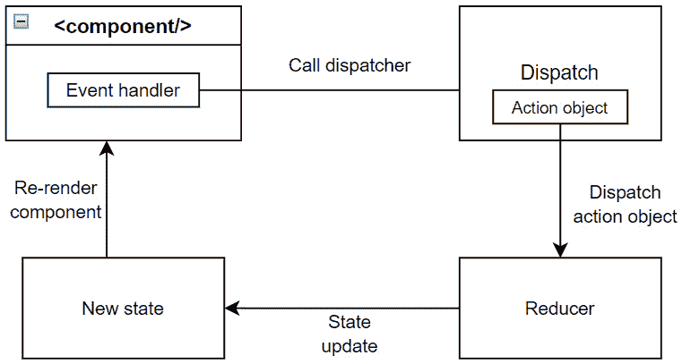
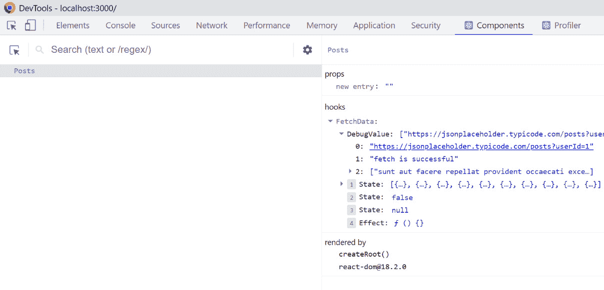

# 第三章：Hooks：将状态和其他特性引入函数组件

Hooks 是在函数组件中引入的，以利用 React 功能的好处，而无需编写任何类和生命周期方法。大多数开发者使用 Redux、Recoil、Mobx 和其他第三方库来管理大型应用程序中的全局状态。但是，当您一起使用 React Hooks，如 `useContext` 和 `useReducer` 时，它成为外部状态管理的更好替代方案。Hooks 比涉及大量样板代码、重复的文件和文件夹的复杂外部库更容易使用。React 还提供了许多其他内置 Hooks，这些 Hooks 可以用于 React 应用程序中的各种用例。如果没有特定的内置 Hooks 可用于处理您的用例，您可以创建自己的 Hook 来满足您的业务需求。Hooks 的常见用例（或横切关注点）包括身份验证、日志记录、缓存、数据获取和错误处理。

在本章中，您将了解 React Hooks、它们的优点以及各种内置 Hooks，这些 Hooks 将 React 功能添加到函数组件中。将通过示例深入解释内置 Hooks，以了解它们在 React 应用程序中的使用。此外，您将获得知识和信心，以回答与第三方 Hooks 相关的问题、创建自己的 Hooks 以及调试 Hooks。

在本章中，我们将涵盖以下主要主题：

+   Hooks 及其目的简介

+   使用 Hooks 进行本地状态管理

+   使用 Hooks 进行全局状态管理

+   在 React 应用程序中执行副作用

+   使用 Ref Hooks 访问 DOM 节点

+   优化应用程序性能

+   了解流行的第三方 Hooks

+   创建自己的 Hooks

+   调试 Hooks

# Hooks 及其目的简介

最初，React 主要与类组件一起使用，但随着时间的推移，组件变得复杂，因为使用了各种模式来重用组件逻辑。随后，Hooks 被引入以简化代码，无需编写任何模式，例如渲染属性和**高阶组件**（**HOCs**）。由于 Hooks 在构建 React 应用程序中现在扮演着重要角色，你可以在 React 面试中期待到几个关于 Hooks 的问题。本节将为您提供关于 Hooks 是什么以及它们的目的的详细答案。

## 什么是 Hooks？

Hooks 是允许组件使用本地状态并执行副作用（或横切关注点）以及其他 React 功能的简单 JavaScript 函数，而无需编写类。Hooks API 是在 React 16.8 中引入的，以将状态逻辑从组件中隔离出来。

简而言之，Hooks 功能是您的函数组件“挂钩”到 React 生命周期和状态的一种方式。

## Hooks 背后的动机是什么？

Hooks 可以解决各种各样的问题。

这里有一些例子：

+   *在组件之间重用状态逻辑的困难*：默认情况下，React 没有提供重用组件逻辑的方法。例如，**渲染属性**和**高阶组件**（HOCs）等编程模式试图解决这个问题。但那些模式需要修改组件层次结构，这使得应用程序变得复杂，有多个包装层，并使代码更难跟踪。

    因此，引入了 Hooks 来将状态逻辑从组件中分离出来，而不需要修改组件层次结构。

+   *理解复杂组件的困难*：随着应用程序的增长，组件变得更加复杂，拥有完整的状态逻辑和副作用。生命周期方法被各种无关逻辑占据，例如数据获取、添加事件监听器或在一个地方移除事件监听器。例如，`componentDidMount` 生命周期方法可以为组件执行数据获取并添加事件监听器。同时，相关的监听器逻辑，如清理，需要在 `componentWillUnmount` 生命周期方法中添加。最终，将大型组件拆分成小型组件变得困难，同时测试它们也变得困难。

    Hooks 可以将大型组件拆分成带有相关代码的小函数，而不是根据生命周期方法来拆分代码。

+   *由类引起的混淆*：类不是 React 特有的，但它们属于 JavaScript。如果你想要处理类组件，首先你应该清楚地了解称为 **this** 的关键字行为，它在其他语言中是不同的。此外，如果你不熟悉使用 ES2022 公共类字段语法，你需要记住在构造函数中绑定事件监听器。所有这些概念在开发者中造成了大量关于正确使用的混淆。

Hooks 对于创建 React 功能非常有帮助，无需编写类，并且可以避免开发社区中的混淆。

## 你能描述 Hook 的使用规则吗？

使用 Hooks 时需要遵循两个主要规则：

+   `useState` 和 `useEffect` Hooks。

+   **仅从 React 函数中调用 Hooks**：你不应该从常规 JavaScript 函数中调用 Hooks。相反，你可以从 React 函数组件或自定义 Hooks 中调用它们。

注意

可以使用名为 `eslint-plugin-react-Hooks` 的 `eslint` 插件（[`www.npmjs.com/package/eslint-plugin-react-hooks`](https://www.npmjs.com/package/eslint-plugin-react-hooks)）来强制执行在 *你能描述 Hook 的使用规则吗* 部分中描述的两个规则。

## 我能否在类组件中使用 Hooks？

你不能在类组件中编写 Hooks。换句话说，Hooks 是为函数组件创建的。然而，你可以在单个组件树中混合类组件和函数组件，而不会引起任何问题。

React 组件通过一个可更新的结构称为 **状态** 来持有数据和跟踪数据变化。在实际应用中，大多数组件使用状态来处理和显示它们 UI 中的数据。在下一节中，我们将讨论与使用状态 Hooks 进行本地状态管理相关的问题及其答案。

# 使用 Hooks 进行本地状态管理

在 React 应用程序内部，有两种 Hooks 可以实现本地状态管理。第一个 Hook，名为 `useState`，可用于简单的状态转换，另一个 Hook，`useReducer`，用于复杂的状态逻辑。基本上，`useState` 在内部使用 `useReducer`。这意味着整个组件状态可以通过 `useReducer` Hook 本身来管理。由于状态是 React 组件的核心构建块，每个开发者都应该清楚地了解如何使用 Hooks 来管理状态。

## 什么是 `useState` Hook？

`useState` Hook 用于向函数组件添加状态。这是 React 中最常用的内置 Hooks 之一。此 Hook 接收初始状态作为参数，相同的初始状态可以是值或函数类型（即初始化函数）。如果初始状态来自昂贵的计算，建议使用初始化函数，它只会在初始渲染时执行。`useState` Hook 返回一个包含两个值的数组：状态变量和用于更新状态的设置函数。

`useState` 的语法表示如下：

```js
const [state, setState] = useState(initialState)
```

让我们以一个使用 `useState` Hook 保留计数器状态的计数器组件为例。设置函数用于更新 `count` 状态变量并重新渲染 UI 以反映任何更改：

```js
import { useState } from "react";
function Counter() {
  const [count, setCount] = useState(0);
  return (
    <>
      <p>You clicked {count} times</p>
      <button onClick={() => setCount(count + 1)}>
        Click me</button>
    </>
  );
}
```

每次点击计数器按钮时，`count` 状态变量将增加一，并且相应的 UI 将使用最新的状态变量值进行更新。

注意

状态设置函数不会更新正在执行的代码中的当前状态。它只会在下一次渲染中可用。

## 是否总是建议使用更新函数？

你可能会听到来自开发者社区的推荐，即始终使用更新函数来更新状态，如果新状态是从先前状态计算得出的。这个规则有助于避免在执行一些状态计算逻辑后出现不可预测的状态。尽管遵循这个规则没有坏处，但并不总是必要的。在大多数情况下，React 会在下一个事件发生之前更新状态变量。也就是说，在事件处理程序开始时，状态不会有过时数据的风险。

但如果你在同一个事件处理程序中执行多个状态更新，那么建议使用更新函数来接收预期的数据结果。在事件处理程序中使用更新函数的编码方式如下：

```js
function handleClick() {
  setCounter(a => a + 1);
  setCounter(a => a + 1);
  setCounter(a => a + 1);
}
```

在此代码中，`a => a + 1` 是一个更新函数。React 将您的更新函数放入队列中，因此对同一状态变量的更新被批处理。在下一个渲染过程中，React 将按相同的顺序调用它们。

## 什么是 useReducer 钩子？如何使用它？

`useReducer` 钩子是 `useState` 钩子的替代品。它用于将自定义状态逻辑（例如，添加、更新和删除状态项）与渲染逻辑分离。换句话说，它有助于将状态管理从组件中提取出来。

此钩子接受三个参数。第一个参数是一个 reducer 函数，指定如何更新状态，第二个参数用于初始状态，第三个参数是一个可选的初始化器函数，用于确定初始状态。相比之下，`useState` 只接受初始状态。

`useReducer` 钩子返回一个包含两个值的数组，当前状态和 dispatch 函数，用于修改状态并触发重新渲染。

让我们通过一个计数器示例来了解此钩子的用法。在这里，您可以使用 reducer 函数通过增加、减少和重置操作来更新计数器状态值：

```js
ffunction reducer(state, action) {
  switch (action.type) {
    case "increment":
      return { count: state.count + 1 };
    case "decrement":
      return { count: state.count - 1 };
    case "reset":
      return { count: action.payload };
    default:
      throw new Error();
  }
}
function init(initialCount) {
  return { count: initialCount };
}
function Counter() {
  const initialCount = 0;
  const [state, dispatch] = useReducer(reducer, initialCount, init);
  return (
    <>
      Count: {state.count}
      <button
        onClick={() => dispatch({ type: "reset", payload: initialCount })}
      >
        Reset
      </button>
      <button onClick={() => dispatch({ type: "decrement" 
        })}>decrement</button>
      <button onClick={() => dispatch({ type: "increment" 
        })}>increment</button>
    </>
  );
}
```

React 一次保存初始状态并忽略后续渲染。因此，如果您通过函数调用推导状态，则需要避免在每个渲染中重新创建初始状态。相反，您可以使用初始化器函数作为 reducer 函数的第三个参数。

在前述代码的第三个参数中，`init` 函数已被用于根据 Hook 中提到的第二个参数的默认值处理初始状态。

前述代码的重要阶段在以下步骤中描述：

1.  当任何按钮点击事件被触发时，相应的事件处理程序将携带一个动作派发到 reducer 函数。

1.  此后，reducer 函数将根据要求将状态更新为新状态。

1.  状态更新将触发组件重新渲染以更新 UI。

*图 3.1* 中的流程图以逐步方式描述了 `useReducer` 钩子的行为：



图 3.1：useReducer 钩子的行为

注意

如果与上一个状态相比状态没有变化，`useReducer` 钩子不会重新渲染子组件。

## 应该在什么情况下使用 useReducer 钩子而不是 useState 钩子？

`useReducer` 和 `useState` 钩子都有助于管理应用程序状态，但 `useReducer` 钩子提供了以下原因的受控且强大的状态管理解决方案：

+   当您需要管理复杂的状态逻辑时，首选 `useReducer` 钩子而不是 `useState`。例如，当状态包含多个嵌套值或下一个状态依赖于前一个状态时，`useReducer` 钩子是一个更好的选择。

+   `useReducer` 钩子可以在单个函数中处理多个动作，而不是使用 `useState` 钩子为每个动作创建单独的函数。

+   `useReducer` 钩子对于优化触发深度或嵌套更新的组件的性能也非常有帮助，因为你可以通过上下文在任何嵌套级别传递 `useReducer` 钩子的 dispatch 函数，而不是将回调函数传递到组件树的每一层。换句话说，它有助于避免在*第二章*中提到的属性钻取问题。此外，dispatch 函数在重新渲染之间不会改变。

注意

由于 `useState` 本身是在底层由 `useReducer` 钩子派生出来的，因此你可以使用 `useReducer` 覆盖所有状态用例。

如果你需要将组件状态与存在于组件树更深层次的多个子组件共享，则建议使用 React 内置的 context 钩子。此钩子主要用于维护应用程序范围内的数据，这被称为全局状态管理。

# 使用 Hooks 进行全局状态管理

`useContext` 钩子通常与 `useState` 钩子一起用于全局状态管理。`useContext` 钩子的主要优势是它解决了属性钻取问题。

`useContext` 钩子的详细常见用法已在*第二章*中解释。因此，本节将主要关注与使用 `useContext` 钩子进行全局状态管理相关的特定用例问题。

## 如何覆盖组件树中特定部分的上下文？

有时，你可能需要用不同的值覆盖组件树中某个部分的上下文。可以通过将这部分包裹在一个具有不同值的 provider 中来覆盖上下文值。

例如，以下代码将蓝色背景应用于除联系页面外的所有页面，而联系页面将使用上下文提供者应用白色背景：

```js
<ColorContext.Provider value="blue">
  <About />
  <Services />
  <Clients />
  <ColorContext.Provider value="white">
    <Contact />
  </ColorContext.Provider>
</ColorContext.Provider>
```

使用 provider 覆盖上下文时，没有对嵌套级别或覆盖次数的限制。

## 如果没有匹配的 provider，上下文值会是什么？

如果在 `useContext` 钩子的调用组件上方没有匹配的 provider，则将返回上下文创建中提到的默认值——即 `createContext(defaultValue)` 中使用的默认值。

如果你指定了一个默认值，你可以避免在页面中任何缺失的 provider 上出现意外的错误。

在类组件中，根据需求，副作用是在不同的生命周期方法中处理的，例如 `componentDidMount`、`componentDidUpdate` 和 `componentWillUnmount`。另一方面，在函数组件中，effect 钩子简化了基于渲染的单点副作用处理。下一节将涵盖关于在 React 应用程序中执行副作用时经常提出的问题。

# 在 React 应用程序中执行副作用

效果是 React 编程中的一个逃生门。React 提供了一些效果钩子，用于在函数组件中实现副作用，如数据获取、订阅、计时器、日志记录、DOM 操作等。这些钩子仅应在您与外部系统同步时使用。有三种类型的钩子可用：

+   **useEffect**：这是一个常用的钩子，用于将组件连接到外部系统。

+   `useEffect` 钩子除了在浏览器重绘屏幕以测量布局之前触发之外，与 `useEffect` 钩子相同。

+   **useInsertionEffect**：此钩子在 React 对 DOM 进行更改之前触发，例如添加动态 CSS。

让我们详细讨论各种效果钩子和它们的特性，以回答面试中提出的问题。

## 反应依赖项如何影响 `useEffect` 钩子内部的逻辑？

`useEffect` 钩子接受一个可选的依赖项参数，该参数接受一个反应值的数组。您不能为您的效果选择依赖项，并且每个反应值都应该声明为依赖项，以避免任何类型的错误。存在不同的场景来传递反应依赖项。

### 传递依赖项数组

如果您在依赖项数组中传递反应值，则效果应在初始渲染之后以及每次具有更改依赖项的重新渲染后运行逻辑。

以下是一个示例，用于传递名称和状态反应依赖项，以了解使用依赖项数组时的 `useEffect` 语法：

```js
useEffect(() => {
  // Runs after first render and every re-render with
     dependency change
}, [name, status]);
```

### 传递空依赖项数组

如果您的效果不使用任何反应值，它仅在初始渲染后运行。在这种情况下，效果钩子如下所示：

```js
useEffect(() => {
  // Runs after initial render only
}, []);
```

### 未传递依赖项数组

如果您跳过传递依赖项数组，则效果将在您的组件每次重新渲染后运行，如下所示：

```js
useEffect(() => {
  // Runs after every re-render
});
```

React 将使用 `Object.is` 比较比较依赖项数组中的每个反应值与其上一个值，以验证更改。

## 在 `useEffect` 钩子内部，设置和清理函数被调用的频率是多少？

在大多数情况下，效果应该有一个清理函数来清除或撤销由其相应的设置代码创建的更改。React 在以下不同的组件生命周期阶段调用设置和清理函数：

+   **挂载**：设置函数中的逻辑在组件被添加到 DOM 或视图中时运行。

+   **重新渲染**：在组件及其依赖项更改的每次重新渲染之后，清理（如果已定义）和设置函数将按顺序调用。在这里，清理函数使用旧属性和状态运行，然后设置代码使用最新的属性和状态运行。

+   **卸载**：在组件从 DOM 或视图中移除后，清理代码将最后一次运行。此清理函数有助于避免不希望的行为，如内存泄漏，并提高性能。

如果在您的 React 应用程序中启用了严格模式，则在第一次实际设置调用之前将有一个额外的仅开发使用的**设置和清理周期**。这是为了确保清理逻辑与设置逻辑相匹配，以避免与设置代码有任何差异。

## 你应该在什么时候从依赖中移除一个对象或一个函数？

如果效果依赖于在渲染过程中创建的对象或函数，那么可能存在一种情况，即效果可能比必要的更频繁地重新运行。这是因为为每次渲染创建的对象或函数是不同的。

让我们通过一个例子更好地理解这个概念。以下是一个根据`Url`和`name`查询参数依赖关系在`useEffect` Hook 中获取用户列表的示例。在这里，查询对象是在渲染过程中创建的，用于构建绝对 URL 路径：

```js
const userUrl = "https://jsonplaceholder.typicode.com/users";
export default function Users() {
  const [users, setUsers] = useState([]);
  const [name, setName] = useState("John");
  const [message, setMessage] = useState("");
  const userQueryOptions = {
    url: userUrl,
    name,
  };
  useEffect(() => {
    const userUrl = buildUserURL(userQueryOptions); //buildUserURL is 
      excluded from code snippet
    fetch(userUrl)
      .then((res) => res.json())
      .then((users) => setUsers(users));
  }, [userQueryOptions]);
  return (
    <>
      Users: {message}
      <input value={message} onChange={(e) => setMessage(e.target.
        value)} />
      <input value={name} onChange={(e) => setName(e.target.value)} />
      {users &&
        users.map((user) => (
          <div>
            Name: {user.name}
            Email: {user.email}
          </div>
        ))}
    </>
  );
}
```

在前面的代码中，由于`message`状态的变化，`userQueryOptions`对象在每次重新渲染时都被重新创建。此外，这个`message`数据与效果内部的反应性元素无关。

通过将对象移动到效果内部并使用`name`字符串替换对象依赖项，可以修复此问题，因为`name`是效果所依赖的唯一反应性值：

```js
useEffect(() => {
  const userOptions = {
    url: userUrl,
    name,
  };
  const userUrl = buildUserURL(userOptions);
  fetch(userUrl)
    .then((res) => res.json())
    .then((users) => setUsers(users));
}, [name]);
```

同样，您可以通过将函数移动到效果 Hook 内部来避免在渲染阶段创建函数。之后，您可以将函数依赖项替换为直接的反应性依赖值。

## `useLayoutEffect` Hook 有什么用？它是如何工作的？

`useLayoutEffect` Hook 是一种在浏览器重绘屏幕之前调用的特殊类型的 effect Hook。此 Hook 主要用于在状态更新时组件闪烁的场景。想象一下网页上的弹出组件。组件首先需要确定元素在视口中的位置，然后才能正确地在屏幕上渲染。

`useLayoutEffect` Hook 的主要目的是为组件提供布局信息以进行渲染。它通过三个简单的步骤工作：

1.  在没有布局信息的情况下渲染初始内容。

1.  在浏览器重绘屏幕之前计算布局大小。

1.  使用正确的布局信息重新渲染组件。

警告

组件将被渲染两次，并在屏幕重绘之前阻止浏览器。这会影响应用程序的性能。因此，建议仅在需要时使用`useLayoutEffect` Hook。

由于效果将在每次渲染后运行，因此提高 React 应用程序性能的主要方法之一是避免不必要的重新渲染。React 中创建了一些内置的 Hooks 来优化性能。让我们在下一节深入探讨这些细节。

# 优化应用程序性能

性能优化对客户体验有巨大影响。尽管 React 应用程序默认具有非常快的 UI，但当应用程序的大小增加时，可能会有性能问题。本节将重点介绍与性能优化钩子相关的问题，这些问题可能是面试官用来从更广泛的角度评估你的技能。

## 什么是记忆化？如何在 React 中实现？

**记忆化**是一种优化技术，通过缓存昂贵的函数调用结果来加速 Web 应用程序。当再次传递相同的输入参数时，它会返回缓存的結果。

在 React 中，这种优化可以通过两个钩子实现：`useMemo` 和 `useCallback`。这些钩子通过在相同输入给出时返回缓存的結果来提高性能，跳过不必要的重新渲染。

## 你能描述一下 useMemo() 钩子吗？

`useMemo()` 钩子用于在重新渲染之间缓存昂贵的计算结果。这个钩子的语法如下：

```js
const cachedValue = useMemo(calculateValue, dependencies)
```

此钩子通过接受两个参数来返回昂贵的计算结果。第一个参数是执行昂贵计算的功能，第二个参数是用于计算的依赖项数组，这些依赖项是响应式值。换句话说，当依赖项值没有变化时，将返回缓存的結果（或上一次渲染存储的值）。否则，将再次执行计算。

让我们通过一个例子来理解这个概念。考虑一个数字的阶乘计算函数，并在其周围应用 `useMemo` 钩子。该组件还执行一个与计算函数无关的增量操作：

```js
import { useState, useMemo } from "react";
function factorial(number) {
  if (number <= 0) {
    return "Number should be positive value.";
  } else if (number === 1) {
    return 1;
  } else {
    return number * factorial(number - 1);
  }
}
export default function CounterFactorial() {
  const [count, setCount] = useState(0);
  const [number, setNumber] = useState(1);
  const factorial = useMemo(() => factorial(number), [number]);
  return (
    <>
      <h2>Counter: {count}</h2>
      <button onClick={() => setCount(count + 1)}>Increment</button>
      <h2>Factorial: {factorial}</h2>
      <input
        type="number"
        value={number}
        onClick={() => setNumber(number + 1)}
      />
    </>
  );
}
```

在前面的代码中，如果你增加计数器的值，由于相应的响应式数字没有被更新，因此与阶乘函数相关的任何重新渲染都不会发生。也就是说，阶乘函数只有在输入数字发生变化时才会被调用，而不会在计数器值增加时被调用。

## useMemo() 钩子的可能用例有哪些？

记忆化有助于优化应用程序性能，一些开发者甚至认为尽可能多地记忆化几乎所有组件都没有害处。然而，这种技术在函数内的简单计算中是不必要的。

有几种常见情况，记忆化非常有用：

+   当在渲染内容时进行昂贵的计算，例如排序、过滤、更改格式等

+   当你将属性传递给 `useMemo` 钩子包装的组件，并且希望在属性没有变化时跳过重新渲染——也就是说，当纯组件可以包装在 `useMemo` 中时

+   当传递给包装组件的值被用作其他钩子的依赖项时

**React DevTools**的**分析器**部分将有助于识别需要添加记忆化的卡顿组件。

## 使用`useMemo`时常见的错误有哪些？你如何纠正它们？

`useMemo` Hook 的使用相当简单，这个 Hook 可能会被广泛用于优化渲染性能。然而，你需要小心以下一些常见的错误：

+   如果你尝试从`useMemo` Hook 返回一个对象，那么要么用括号将其包裹，要么写一个显式的返回语句。

    例如，以下`useMemo` Hook 返回一个未定义的值，因为开括号({)是箭头函数的一部分，但不是对象的一部分：

    ```js
      const findCity = useMemo(() => {
        country: 'USA',
        name: name
      }, [name]);
    ```

    这可以通过为对象添加显式的返回语句来修复，如下所示：

    ```js
    const findCity = useMemo(() => {
      return {
        country: "USA",
        name: name,
      };
    }, [name]);
    ```

+   如果你忘记指定依赖项，那么计算将在每次渲染时重新执行：

    ```js
    const filterCities = useMemo(() => filteredCities(city, country));
    ```

    用于计算的响应式值应传递到依赖项数组中，以避免不必要的渲染：

    ```js
    const filterCities = useMemo(
      () => filteredCities(city, country),
      [city, country]
    );
    ```

+   你不应该在循环中调用`useMemo`。相反，将其包裹或提取到一个新组件下：

    ```js
    {
      products.map((product) => {
        const revenue = useMemo(() => calculateRevenue(product), [product]);
        return (
          <>
            <span>Product: {product.name}</span>
            <span>Revenue: {revenue}</span>
          </>
        );
      });
    }
    ```

    这可以通过在子组件内部提取`useMemo`计算来解决：

    ```js
    {
      products.map((product) => {
        return <Report product={product} />;
      });
    }
    ```

在使用`useMemo` Hook 时，上述点可以作为最佳实践。

## 你应该在什么情况下使用`useCallback` Hook 而不是`useMemo` Hook？

当顶层组件重新渲染时，默认情况下，React 会递归地重新渲染所有子组件。如果子组件有大量的计算，这种情况将影响应用程序的性能。在这种情况下，需要使用 Memo API 或`useMemo` Hook 来优化子组件。

然而，如果你将回调函数作为 prop 传递给子组件，React 将始终重新渲染子组件，因为函数定义或箭头函数在每次重新渲染时都被视为新函数。这违背了记忆化的目的。在这种情况下，`useCallback`有助于优化性能。

`useCallback` Hook 类似于`useMemo` Hook，但它缓存的是回调函数而不是值。你仍然可以使用`useMemo` Hook，但计算函数必须返回另一个函数；也就是说，它需要一个额外的嵌套函数。

让我们通过一个包含`TaxCalculation`作为父组件和`TaxPayer`作为子组件的例子来讨论这个概念。在子组件中，你需要考虑在相同的 props 发送和重新渲染缓慢的情况下跳过重新渲染。

为了跳过重新渲染，首先需要使用记忆函数包裹子组件（`TaxPayer`）：

```js
import { memo } from 'react';
const TaxPayer = memo(function TaxPayer({ onSubmit }) {
  // ...
});
```

如果父组件在`income` prop 发生变化时重新渲染，那么这种变化会导致子组件也重新渲染。当子组件没有进行大量计算且`income` prop 的变化很小的时候，这不会是一个大问题。

然而，如果你将回调函数作为 prop 传递给子组件，它会在每次传递时创建一个新的函数。无论性能影响如何，都应该始终避免这种情况。

为了避免每次新 prop 导致的重新渲染，让我们为 `handleSubmit` 回调函数应用 `useCallback` Hook：

```js
function TaxCalculation({ year, income}) {
  const handleSubmit = useCallback((taxPayerDetails) => {
    post('/tax/' + year, {
      taxPayerDetails,
    income
    });
  }, [year, income]);
  return (
    <div>
      <TaxPayer onSubmit={handleSubmit} />
    </div>
  );
}
```

在前面的代码中，回调函数将被缓存，直到或除非依赖的响应式值发生变化。

类组件中存在的 Ref API 类似，一些 Hooks 在函数组件中也被创建，特别是为了与 DOM 节点交互。下一节将讨论使用 Hooks 访问 DOM 节点的重要概念。

# 使用 ref Hooks 访问 DOM 节点

当你需要与外部系统（或非 React 系统）如内置浏览器 API 交互时，Refs 非常有用。函数组件中有两个内置的 ref Hooks。`useRef` Hook 用于声明一个可以持有任何类型的值的 ref，但主要用于 DOM 节点。`useImperativeHandle` 用于仅暴露所需方法的定制 ref。

请注意，关于 ref 的介绍已经在*第二章*中进行了覆盖。在本节中，我们将超越在*第二章*中已经讨论的关于 ref 的内容。

## 你如何避免重新创建 Ref 内容？

`useRef` Hook 接受初始值（或默认值）作为参数，就像 `useState` Hook 一样。此 Hook 的声明应放在封装组件的顶部。

React 在第一次渲染时保存此初始值，并在后续渲染中忽略它，但如果你为 ref 的初始值创建了一个昂贵的对象，它可能会在每次渲染中不必要地被调用。这将影响应用程序的性能。

使用以下示例可以更好地解释初始 ref 值的声明以及 ref 内容是如何重新创建的：

```js
function CreateBlogArticle() {
  // This is an expensive object to create the article
}
function Blog() {
  const articleRef = useRef(new CreateBlogArticle());
  //...
}
```

在前面的代码中，`CreateBlogArticle()` 函数始终被调用以创建昂贵的对象，即使 React 从第二次渲染开始就忽略了此对象。

可以通过限制 `CreateBlogArticle()` 函数在后续渲染中的调用来解决此问题，如下所示：

```js
function Blog() {
  const articleRef = useRef(null);
  if (articleRef.current === null) {
    articleRef.current = new CreateBlogArticle();
  }
  //...
}
```

现在博客文章对象仅在初始渲染期间计算一次。

## 在渲染方法中能否访问 ref？

是的，你可以在渲染方法中访问 ref 的当前值，但不建议在渲染过程中读取或写入 `ref.current` 值。这是因为屏幕上显示的 ref 值可能不会因为知道更改 ref 不会触发重新渲染而更新，这与状态变量不同。

## 你如何从 ref 实例中公开方法子集？

`useImperativeHandle` 钩子用于从子组件向父组件暴露自定义方法或现有方法的一个子集。这有助于限制父级 ref 只能访问某些函数或属性，而不提供对整个 ref 的访问。常见的用例是创建一个组件，以便在库下共享，消费者只能访问暴露的 API。

假设你正在计划创建一个对话框组件，并想在某个顶级父组件中共享对话框的一些基本功能。在这种情况下，你可以在子组件内部暴露 `open`、`close` 和 `reset` 方法，而不是提供对整个对话框 DOM 节点的访问：

```js
useImperativeHandle(ref, () => ({
  open: () => ref.current.invokeDialog(),
  close: () => ref.current.closeDilaog(),
  reset: () => ref.current.clearData(),
}));
```

使用 `useImperativeHandle` 钩子的组件需要用 `forwardRef` 包装，并且从 `forwardRef` 渲染函数的第二个参数接收 ref。

还有几个内置的钩子，如 `useId`、`useDeferred`、`useTransition` 和 `useSyncExternalStore`，由于它们的使用量很少，所以没有涵盖。让我们快速了解一下它们：

+   `useId`: 这个钩子用于为 HTML 可访问性属性生成唯一的 ID

+   `useDeferred`: 这个钩子用于将 UI 的一部分更新推迟到最新数据可用时进行

+   `useTransition`: 这个钩子通过标记一些状态修改为低优先级来帮助提高用户响应性

+   `useSyncExternalStore`: 这个钩子用于订阅存在于 React 系统之外的外部数据存储

React 提供了几个内置的钩子，但你可以在这些钩子的使用之外，使用 React 社区创建的第三方钩子来覆盖基于你业务需求的具体用例。在下一节中，我们将涵盖与第三方钩子及其相应答案相关的问题。

# 了解流行的第三方钩子

Hooks API 在开发者社区中非常受欢迎，内置的钩子自 2019 年以来一直存在。开发者尝试创建了许多第三方钩子，如 `useImmer`、`useFetch`、`useDebounce`、`useForm`、`useLocalStorage`、Redux Hooks 等，以解决在 Web 开发中观察到的常见用例。如果你想要掌握 Hooks 概念，那么你应该对第三方钩子及其如何解决一些常见问题有一个很好的理解。

## `useImmer` 钩子是什么？它的用途是什么？

`useImmer` 钩子就像 `useState` 钩子一样，但在管理具有嵌层数据的复杂状态时提供了优势。它更新状态的方式就像它是直接可变的，类似于常规 JavaScript。这个钩子基于 Immer 库，通过创建一个新的状态副本来进行修改。

这个钩子可以通过 `use-immer` npm 库安装。像 `useState` 一样，它返回一个元组。元组的第一个值是当前状态，第二个是更新器函数。

让我们看看`UserProfile`组件的示例，并直接更新地址详情，如下所示：

```js
import { useImmer } from "use-immer";
function UserProfile() {
  const [user, setUser] = useImmer({
    name: "Tom",
    address: {
      country: "United States",
      city: "Austin",
      postalCode: 73301,
    },
  });
  function updatePostalCode(code) {
    setUser((draft) => {
      draft.address.postalCode = code;
    });
  }
  return (
    <div className="profile">
      <h1>
        Hello {user.name}, your latest postal code is ({user.address.
          postalCode}
        )
      </h1>
      <input
        onChange={(e) => {
          updatePostalCode(e.target.value);
        }}
        value={user.address.postalCode}
      />
    </div>
  );
}
```

在底层，`Immer`创建了一个临时草稿对象，并将所有更改应用于它。一旦所有突变完成，`Immer`将生成下一个状态对象。

如果你的用例无法由内置钩子或任何第三方钩子满足，那么你可以构建自己的钩子来提供满足你需求的解决方案。在下一节之后，你将能够回答与自定义钩子相关的问题。

# 构建自己的钩子

尽管 React 为常见用例提供了某些内置钩子，如`useState`、`useEffect`、`useContext`等，但你有时可能需要使用钩子来满足无法由内置钩子或第三方库解决的问题。在本节结束时，你将能够回答与自定义钩子及其目的相关的问题，以及如何避免传统方法来共享组件逻辑。

## 什么是自定义钩子？你如何创建它们？

React 自带了几个内置钩子，但它不会限制你在有限场景中使用钩子。你也可以通过将组件逻辑提取到称为**自定义钩子**的单独可重用函数中来创建自己的钩子。这些钩子有助于隐藏组件中的复杂逻辑。它们涵盖了广泛的使用场景，如数据获取、表单处理、在线或离线状态订阅、连接到聊天室、动画等。

通过演示实时示例，可以更好地解释自定义钩子的创建和使用。让我们考虑一个博客网站应用程序，其中你列出特定用户的全部帖子，并同时显示特定帖子的评论。在这里，你需要创建两个名为**Posts**和**Comments**的组件。这两个组件都需要根据给定的 URL 和可选查询参数从服务器获取数据。一旦收到响应，这两个组件都会在屏幕上显示数据。

为了避免在两个组件中都有与数据获取、加载、错误处理等相关逻辑的重复，可以将代码移动到一个以`use`为前缀的单独可重用自定义钩子中。可以在`useFetchData.js`文件中创建名为`useFetchData`的数据获取钩子，如下所示：

```js
import { useState, useEffect } from "react";
const useFetchData = (url, initialData) => {
  const [data, setData] = useState(initialData);
  const [loading, setLoading] = useState(false);
  useEffect(() => {
    setLoading(true);
    fetch(url)
      .then((res) => res.json())
      .then((data) => setData(data))
    .catch((err) => console.log(err))
    .finally(() => setLoading(false));
  }, [url]);
  return {data, loading};
};
export default useFetchData;
```

此后，上述自定义钩子可以在作为`Posts.jsx`文件和`Comments.jsx`文件一部分创建的消费者组件中使用。在**Posts**组件中的使用方式如下：

```js
import useFetchData from './useFetchData.js';
export default function Posts() {
  const url = "https://jsonplaceholder.typicode.com/posts?userId=1";
  const { data, loading} = useFetchData(url, []);
  return (
    <>
      {loading && <p>Loading posts… </p>}
      {data && (
    data.map((item) =>
       <div key={item?.title}>
        <p>
          {item?.title}
                  <br/>
          {item?.body}
        </p>
      </div>
      )
      )}
    </>
  );
}
```

同样，你可以在**Comments**组件中也重用`useFetchData`。在这些更改之后，**Posts**和**Comments**组件的代码变得更加简单、简洁和易于阅读。

## 自定义钩子的好处是什么？

使用自定义钩子的主要优势是代码的可重用性，无需在许多组件中编写重复的逻辑。还有其他一些优势也值得考虑自定义钩子：

+   **可维护性**：使用自定义钩子更容易维护代码。在未来，如果您需要更改钩子的逻辑，您只需更改一个地方，而不会干扰代码的其他部分——即组件或文件。

+   **可读性**：使用自定义钩子而不是在 UI 中实际展示的组件周围包裹多层 HOCs、提供者和消费者以及渲染属性，可以使应用程序的代码变得更加清晰和易于阅读。此外，通过将特定组件逻辑移动到单独的钩子中，组件代码也变得更加简洁。

+   **可测试性**：在 React 应用程序中，您需要为测试容器和展示组件编写单独的测试。如果您的容器使用了多个 HOCs，那么集成测试尤其具有挑战性。复杂性增加，因为您需要测试容器和组件一起执行集成测试。使用自定义钩子可以消除这个问题，因为它们允许您将容器和组件组合成一个单独的组件。

    此外，与 HOCs 相比，编写单元测试和模拟钩子更容易。

+   **社区驱动的钩子**：React 社区已经非常流行，并为他们的特定用例创建了多个钩子。建议的做法是在创建自己的钩子之前，首先检查您正在寻找的钩子是否已经被其他人创建。一些社区驱动的钩子可以在[`usehooks.com/`](https://usehooks.com/)和[`github.com/imbhargav5/rooks`](https://github.com/imbhargav5/rooks)找到。

列出的优势激励了许多 React 开发者创建自定义钩子，以应对他们在 React 应用程序中遇到的独特功能。如果任何第三方开源库已经提供了覆盖您特定场景的钩子，建议重用相同的钩子，而不是通过构建自定义钩子来重新发明轮子。

## 你是否仍然应该考虑使用渲染属性和 HOCs？

渲染属性和 HOCs 都是 React 生态系统中用于在组件之间共享组件状态逻辑的传统高级模式。然而，与这两种传统模式相比，Hooks 要简单得多，并且足以覆盖用例。此外，使用 Hooks，您不需要更改现有的组件结构，也不需要添加更多组件，最终得到一个嵌套的树形结构。

## 你推荐将效果移动到自定义钩子中吗？

当你需要与 React 范围之外的世界交互时，使用 Effect Hooks 来执行应用程序的副作用。一些非 React 系统可以访问 Web API，调用外部 API 等。随着时间的推移，你应该通过实现针对你用例的特定解决方案来减少代码中的副作用数量。标准指南是在没有内置解决方案可用时使用 effect Hooks。这是因为避免副作用可以使你的应用程序更简单、运行更快、更不容易出错。通过将你的副作用移动到自定义 Hook 中，当有解决方案可用时，升级与副作用相关的代码变得更加容易。

随着你的应用程序随着许多自定义 Hook 来满足业务需求而增长，应用程序的复杂性增加，并且有很大可能遇到应用程序中的错误。下一节将介绍如何调试 React 自定义 Hook。

# 故障排除和调试 Hooks

传统的调试方法，如 IDE 和浏览器 DevTools 中的调试器，对于调试自定义 Hook 并不有效。React 提供了 `useDebugValue` Hook，允许开发者通过为它们分配自定义格式化的标签来调试自定义 Hook。在本节结束时，你将了解如何调试自定义 Hook。

## 你如何调试自定义 Hook？

`useDebugValue` Hook 用于扩展与自定义 Hook 内部逻辑相关的数据在 **React DevTools** 中的可视化。这些信息出现在 **React DevTools** 扩展的 **Component Inspector** 选项卡中。

当前的调试信息仅限于显示我们自定义 Hook 内部使用的内置 Hooks 的信息。对于开发者来说，通过逐行计数输出并识别哪个条目映射对应于代码中调用的 Hooks 来读取信息是很困难的。这种困难可以通过为我们的自定义 Hook 添加额外的条目到 **React DevTools** 输出中而得到纠正。

让我们用一个例子来更好地理解这一点。所需的详细信息可以通过在自定义 `useFetchData` Hook 中的 `useDebugValue` Hook 中记录，正如在 *什么是自定义 Hook？如何创建它们？* 部分所创建的那样：

```js
const useFetchData = (url, initialData) => {
    useDebugValue(url);
    const [data, setData] = useState(initialData);
    const [loading, setLoading] = useState(false);
    const [error, setError] = useState(null);
    useDebugValue(error, (err) =>
      err ? `fetch is failed with ${err.message}` :
        "fetch is successful"
    );
    useEffect(() => {
      setLoading(true);
      fetch(url)
        .then((res) => res.json())
        .then((data) => setData(data))
        .catch((err) => setError(err))
        .finally(() => setLoading(false));
    }, [url]);
    useDebugValue(data, (items) =>
      items.length > 0 ? items.map((item) => item.title) :
        "No posts available"
  );
    return {data, loading};
};
```

在前面的代码中，第二次和第三次调试调用使用了一个可选的第二个参数来格式化显示的值。

`FetchData` 自定义 Hook。例如，如果你悬停在 **Posts** 组件上，右侧的 **Hooks** 部分看起来如下：



图 3.2：DevTools 中的 DebugValue 标签

同样，当 API 由于服务不可用而抛出错误时，可以通过 **DebugValue** 标签追踪相应的根本原因。

到目前为止，我们已经讨论了与内置 Hooks 相关的几个问题，然后是关于第三方 Hooks 和自定义 Hooks 的主题。所有这些主题都按照特定的顺序进行覆盖，以便理解各种类型 Hooks 之间的联系。

# 摘要

本章全面介绍了 React 应用程序中的 Hooks。我们首先提供了 Hooks 的介绍，包括 Hooks 的动机以及使用 Hooks 时需要遵循的规则。接下来，我们探讨了在组件中使用 `useState` 和 `useReducer` Hooks 进行状态管理，以及使用 `useContext` Hook 在组件之间共享数据的全局状态管理。此后，我们介绍了如何借助 effect Hooks 在应用程序中执行副作用。

除了常用的内置 Hooks 之外，我们还讨论了使用 ref Hooks 访问 DOM 节点、通过 Hooks 进行性能优化、使用第三方 Hooks，以及根据业务需求创建自定义 Hooks。

在下一章中，我们将介绍一个重要的导航库，称为 React Router，用于在页面之间导航，并了解其丰富的功能。那一章还将讨论支持国际化以及通过传递参数创建动态本地化消息的重要主题。
