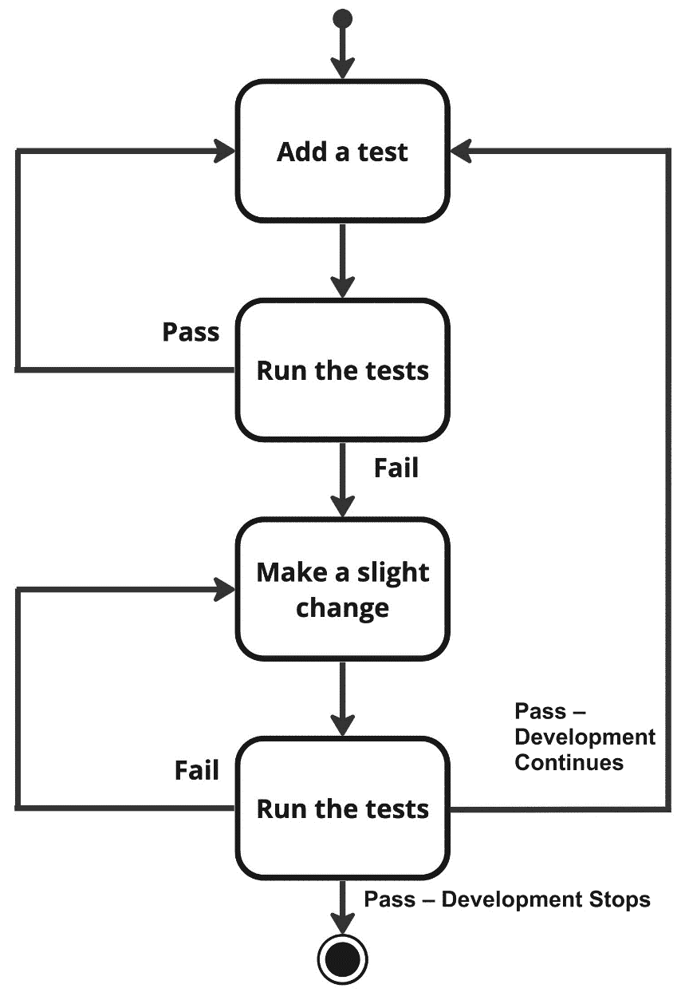
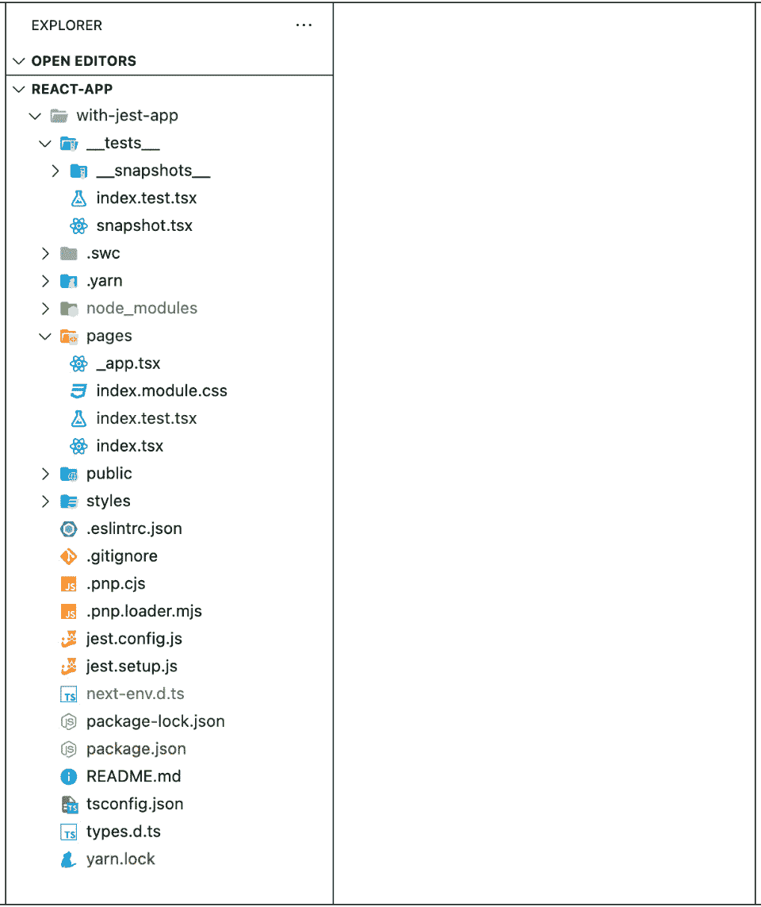
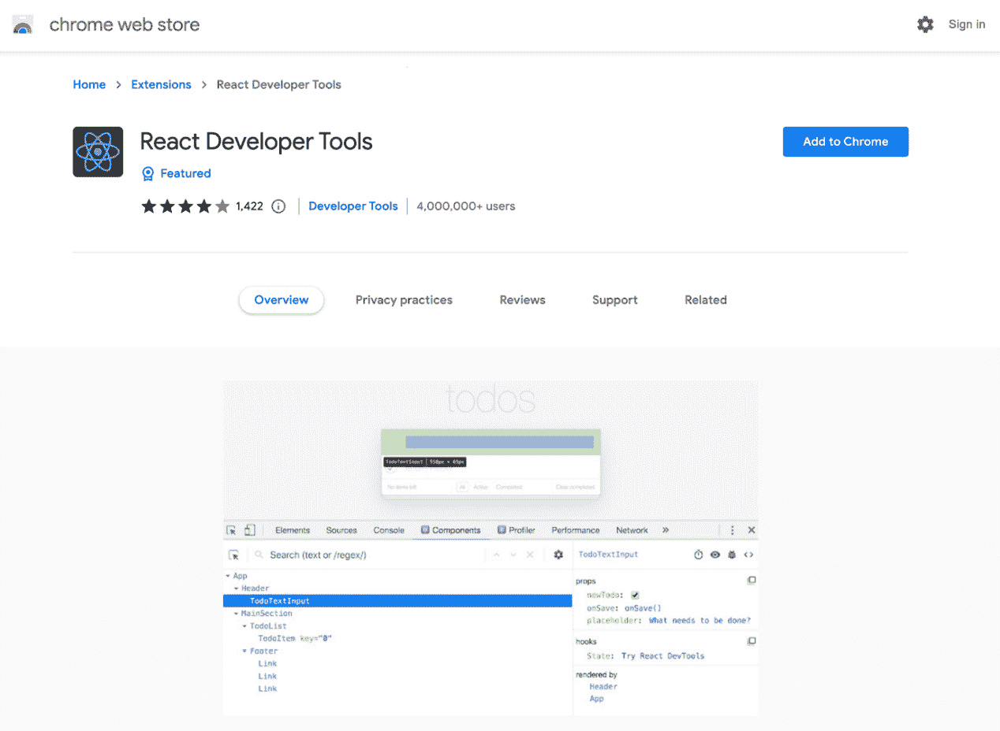

# 第八章：测试和调试 React 应用

React 已经成为网络开发领域最受欢迎的前端库，使程序员能够构建有效、可扩展且易于维护的应用程序。为了确保您的应用程序的稳定性和可靠性，随着项目的规模和复杂性不断增加，全面测试和高效调试变得越来越重要。本章将详细探讨掌握测试和调试 React 应用所需的工具和方法，为您在提高技能的过程中打下基础。

我们将首先讨论 React 测试助手，它有助于测试并提高生产力。然后，我们将回顾目前 JavaScript 和 React 生态系统中最受欢迎和最灵活的测试工具，包括 Enzyme、Jest 和**React 测试库**。通过这样做，您将能够根据您独特的需求和需求选择合适的工具。接下来，我们将详细讨论测试生命周期的设置和拆除阶段。

我们已经专门用一节来讨论解决测试中数据获取和模拟问题的最佳实践，因为它们是应用程序的关键组成部分。我们将深入了解测试用户事件、控制定时器和模拟现实世界交互的细节，为您提供确认应用程序响应性和性能所需的工具。

最后，我们将介绍 React DevTools，这是调试和评估您的 React 应用的必备工具。

到本章结束时，您将具备成功测试和调试您的 React 应用所需的知识、能力和自信。如果您对可用的工具和方法有牢固的掌握，您将能够构建在不断变化的环境中既可靠又健壮的应用程序。因此，让我们踏上成为 React 应用测试和调试专家的旅程，以便您的项目能够经受时间的考验。

在本章中，我们将从软件的角度深入探讨测试和调试的主题，学习测试我们的 React 应用的基本知识、理念和概念。以下内容将涵盖：

+   介绍 React 测试助手

+   测试我们的软件

+   在我们的应用中管理数据

+   使用事件和定时器执行代码

+   使用 React DevTools 进行调试和分析

# 技术要求

您可以在此处找到本章的项目和代码：[`github.com/PacktPublishing/React-Interview-Guide/tree/main/Chapter08`](https://github.com/PacktPublishing/React-Interview-Guide/tree/main/Chapter08)

# 介绍 React 测试助手

在本节中，我们将学习 RTL（寄存器传输级）的基础知识。但首先，让我们尝试理解在编程中测试的含义，以便我们可以了解核心概念和方法论。

## 软件开发中的测试是什么？

在软件开发中，审查软件程序或系统以验证其满足其功能和非功能标准，并认证其整体质量、性能和可靠性，被称为测试。它包括在受控环境下运行程序以找出错误、缺陷或可能的问题，在产品交付给最终客户之前。测试通常在多个级别进行，从单个组件级别到完全集成的系统，它是软件开发生命周期的一个关键部分。

根据项目情况，可能会有任何数量的测试阶段。让我们看看这些测试级别的阶段可能是什么样子：

| **测试阶段** | **描述** |
| --- | --- |
| 单元测试 | 测试独立的代码或其部分被称为单元测试。它保证每个单元都按照其规范操作并按预期行事。 |
| 集成测试 | 测试各种软件单元、模块或组件之间的集成和关系称为集成测试。它保证组件之间能够有效沟通，并且组合的系统作为一个整体运行。 |
| 回归测试 | 回归测试是为了确保新的代码修改或改进不会对已存在的功能产生负面影响。它涉及在软件修改后重新运行早期测试。 |
| 安全测试 | 在安全测试期间，评估产品的安全特性和弱点。它指出了可能的安全问题，如数据泄露、未经授权的访问和编码缺陷。 |
| 功能测试 | 通过功能测试，将软件的功能与声明的需求进行比较。它包括测试多个功能、用例和场景，从最终用户的角度评估程序。 |
| 阿尔法和贝塔测试 | 在将程序分发给选定的小组外部用户之前，内部测试员在受限环境中进行阿尔法测试。贝塔测试涉及将程序提供给更多外部用户，以获取实际用户的反馈并发现任何可能的问题。 |
| 性能测试 | 在性能测试期间，评估软件在各种负载水平下的适应性、速度、可扩展性和稳定性。这包括测试响应速度、资源使用和系统中的限制等变量。 |

表 8.1：软件开发测试阶段

如您所见，在项目生命周期中，我们可以执行许多不同类型的测试。接下来，让我们学习如何在 React 应用程序中进行测试。

## 我们如何在 React 应用程序中进行测试？

在 React 中，测试是确认和验证每个组件以及整个应用程序是否按预期工作并符合设定的标准的方法。这通常涉及测试每个单独的 React 组件、用户交互以及应用程序状态的任何潜在变化。在 React 应用程序中，我们可以以几种方式执行测试，这些通常是单元测试、集成测试和**端到端**（**E2E**）测试。

## 你如何为 React 应用程序设置测试环境？

为了使你的 React 应用程序可靠、可维护且质量最高，你必须设置一个测试环境。如果你的测试环境设置正确，你可以在一个受控、隔离的环境中执行测试，这个环境与生产环境非常相似。这有助于在这些问题影响最终客户之前找到并解决它们。所有测试环境都需要我们开发者为它们编写测试，这被称为**测试驱动开发**（**TDD**）。

下图描述了软件开发工作流程中的 TDD 周期。在这个编程方法中，编码、测试和设计紧密相连。虽然有很多变体，但基本原理保持不变：



图 8.1：软件开发中的 TDD 周期

现在我们已经了解了软件开发中的 TDD 周期，让我们继续探讨测试框架/库，看看我们如何在我们的应用程序中最好地使用它们。

## 你如何选择一个测试框架或库？

当构建 React 应用程序时，考虑一个好的测试库是个好主意。拥有良好的测试结构意味着我们的软件应该按预期运行并满足用户的期望。因此，让我们看看目前可用的几个流行的测试库：

+   **React Testing Library**（**RTL**）：轻量级的 RTL 专注于测试组件的功能。与其他测试框架相比，它提供了一个更直接的 API。

+   **Jest**：流行的测试框架 Jest 已经设置为与 React 一起工作。它具有内置的测试 React 应用程序的功能，例如模拟和快照测试。

+   **Enzyme**：浅渲染、完整 DOM 渲染和快照测试只是 Enzyme 这个强大的测试框架为 React 提供的几个测试工具之一。

+   **Vite**：前端构建工具 Vite 有一个名为**Vitest**的单元测试框架。它是一个具有众多现代特性的优秀单元测试框架，包括对 TypeScript、JSX 和 React 组件测试的支持。

+   **Cypress**：Cypress 是一个基于 JavaScript 的 E2E 高级网页测试自动化解决方案。前端开发人员和 QA 工程师可以使用这个工具构建自动化网页测试，该工具专为开发者设计，并直接在浏览器中运行

在测试方面，我们可以在 React 项目中设置多种方式。每个开发者都有自己的偏好。有些人选择有一个专门的文件夹，其中包含所有测试文件，并且与主要组件分开。其他人更喜欢将测试文件放在与组件相同的文件夹中，在两种情况下，测试文件都遵循与组件相同的命名约定——例如，`index.js` 和 `index.test.js`。

下一个图显示了这两个用例的示例。这是一个 Next.js 项目，它为 Jest 和 RTL 项目设置了默认配置。有一个名为 `__tests__` 的文件夹，其中包含一个名为 `index.test.tsx` 的测试。在 `pages` 文件夹中，紧挨着 `index.tsx` 组件，还有一个 `index.test.tsx` 文件。这两个测试都可以使用 `npm test` 命令运行：



图 8.2：React 项目测试文件结构

现在我们已经对一般的测试约定有了些了解，接下来我们将讨论 RTL 的基本原理。

## React 测试库的基本原理是什么？

在受欢迎的测试工具 RTL 的帮助下，开发人员被敦促以与消费者如何与应用程序交互的方式相似的方法测试他们的组件。RTL 鼓励根据个人观察和执行的内容来测试组件，而不是基于实现的具体细节，确保程序保持可访问性、可管理性和用户友好性。RTL 是一系列包，它可以在 React 和 React Native 项目中使用。因此，了解我们可以使用相同的包来测试我们的网页和移动应用是很好的。

RTL 有许多不同的核心原则，我们应该熟悉它们：

+   `fireEvent` 方法，它允许你启动各种 DOM 事件，如点击、更改或提交，以模仿用户交互。这使你能够通过测试组件对用户交互的反应来验证预期的行为是否显示。

+   `GetByText`、`GetByRole` 和 `GetByTestId` 是一些常用的查询。

+   **自定义渲染**：有一个默认的渲染函数，你可以用它来渲染你的组件，但你也可以设计自己的渲染函数，将你的组件包裹在特定的上下文或提供者中。当你的组件依赖于独特的上下文设置，如主题或本地化时，这非常有帮助。

+   使用 `screen` 可以输出一个对象，它让你能够轻松访问显示的部分和查询方法，无需手动分解。通过使用 `screen`，你可以使你的考试更加简洁，并使其更容易阅读。

+   当与下载数据或依赖于异步活动的组件一起工作时，使用`waitFor`、`waitForElementToBeRemoved`和`find*`搜索。通过确保在继续之前，您的测试等待必要的组件或操作，这些方法有助于管理组件的异步操作。

+   除了`fireEvent`之外，还有`@testing-library/user-event`包。这个包中高级的事件模拟功能更接近用户行为，比基本的`fireEvent`方法更接近。

因此，现在我们已经掌握了使用 React 测试助手来设置强大测试环境的概念，让我们将所学知识应用到实际中，看看我们如何最好地使用这些工具来设置我们的测试环境。这还将是一个查看一些示例测试用例的机会。

# 测试我们的软件

现在，让我们专注于学习如何设置和清理我们的项目和代码库，以隔离测试的影响——也就是说，设置和拆卸。设置和拆卸是在编程的上下文中在每个测试或一系列测试之前和之后采取的操作，尤其是在软件测试中。这样做可以确保我们有良好的测试覆盖率，并且我们的测试是可靠的。在设置和拆卸测试时遵循一种系统的方法至关重要，这保证了测试之间是独立的，不会相互影响，产生精确和可靠的发现。

在自动化测试中，设置和拆卸步骤对于分离特定测试的影响至关重要。在每个测试之前，设置过程有助于建立一致的状态。这一阶段可能包括生成所需对象、连接到数据库或初始化特定设置等任务。通过在每个测试之前执行这些程序，我们保证每个测试都是从相同的起点开始的，无论之前的测试结果如何。这意味着测试的行为不受先前测试的副作用的影响，这对于准确、可靠的测试至关重要。

在测试期间进行的任何修改都可以在拆卸阶段撤销。这可能需要诸如切断数据库访问、删除测试数据或擦除测试期间创建的对象等操作。如果我们每次测试后都进行清理，我们不必担心一个测试期间所做的更改会影响后续的测试。如果没有拆卸步骤，测试最终可能会留下可能影响后续测试行为的某些修改。

由于设置和拆除阶段的存在，每个测试都在相同的起始环境中运行，并且不会对其他测试的环境产生影响，这些阶段共同确保每个测试都是隔离和可重复的。自动化测试的一个指导原则是确保测试是可信的，并且发现的任何缺陷都是归因于正在测试的代码，而不是测试配置或跨测试交互。

我们可以遵循一些规则来帮助我们生成有效的测试计划。让我们逐一了解它们，看看遵循它们如何为我们提供良好的策略：

+   **设置测试环境**：确保所有测试的测试环境相同。这包括测试执行所需的任何先决条件，如软件、设备和网络设置。

+   **版本控制**：使用版本控制工具，如 Git 和 GitHub，来跟踪代码和测试的更改，以便您可以查看新代码或测试可能引起的问题。

+   **创建良好的测试**：选择您希望运行的精确测试，然后列出每个测试的变量和测试条件。

+   **利用测试隔离**：创建测试，使它们不依赖于其他测试。这意味着每个测试都必须有自己的设置和拆除，不能依赖于任何其他测试的结果或状态。

+   **使用监控**：为了收集测试结果并发现测试数据中的任何异常或趋势，请使用日志和监控。

+   **持续改进**：始终根据每个测试周期的发现和建议增强测试和测试环境。

+   **使用方法**：实施每个测试前后执行的设置和拆除程序。这些技术可以用来构建和删除测试所需的资源，例如临时文件或数据库连接。

+   **并行或顺序测试**：按顺序运行测试以确保它们之间没有冲突，或者根据测试类型并行运行以加快过程。

+   **模拟外部函数**：一种将正在评估的代码单元与其依赖项（如外部库、服务或函数）隔离的测试方法称为模拟外部函数。通常，这是为了提供可预测和可控的测试条件。对于各种测试场景，模拟允许您在实际调用之前模仿外部依赖的行为。

现在我们已经学习了为测试设置项目的一些基础知识，是时候更进一步，学习如何为我们的 React.js 项目编写测试了。

## 我们如何为组件、属性和事件编写测试？

一旦你选择了测试框架和库，你就可以开始为你的 React 应用程序开发测试。你将创建各种测试，每个测试都有不同的目的和范围。我们可以编写几种类型的测试，包括组件测试、单元测试、集成测试、事件测试和端到端测试。目标是尽可能多地覆盖所有测试，以设定基准并给你提供信心和信心，即你的应用程序已经实施了彻底的测试。

### 组件测试是什么？

React 组件测试是一种单元测试形式，专门用于单独测试 React 组件。React 组件是 React 应用程序的构建块，定义了 UI、封装了功能并管理了应用程序的状态。测试 React 组件确保它们的行为正确，并满足预期的功能和标准。

在这个代码示例中，我们可以看到名为`Counter.tsx`的组件的组件测试看起来是什么样子。我们有一个配套的`Counter.test.tsx`文件，用于测试按钮的递增和递减。

这里是`Counter.tsx`文件的代码：

```js
import { useState } from 'react';
const Counter = () => {
  const [count, setCount] = useState(0);
  const increment = () => setCount(count + 1);
  const decrement = () => setCount(count - 1);
  return (
    <div>
      <h1>Counter: {count}</h1>
      <button onClick={increment}>Increment</button>
      <button onClick={decrement}>Decrement</button>
    </div>
  );
};
export default Counter;
```

这是我们的测试文件`Counter.test.tsx`的代码：

```js
import { render, screen, fireEvent } from '@testing-library/react';
import '@testing-library/jest-dom/extend-expect';
import Counter from './Counter';
describe('Counter component', () => {
  test('renders Counter component', () => {
    render(<Counter />);
    expect(screen.getByText(/Counter:/i)).toBeInTheDocument();
  });
  test('increases the count when the Increment button is clicked', () => {
    render(<Counter />);
    fireEvent.click(screen.getByText(/Increment/i));
    expect(screen.getByText(/Counter: 1/i)).toBeInTheDocument();
  });
  test('decreases the count when the Decrement button is clicked', () => {
    render(<Counter />);
    fireEvent.click(screen.getByText(/Increment/i));
    fireEvent.click(screen.getByText(/Decrement/i));
    expect(screen.getByText(/Counter: 0/i)).toBeInTheDocument();
  });
});
```

我们现在已经学习了组件和组件测试文件的基础知识。

### 什么是单元测试？

React 单元测试是一种测试方法，专注于单个 React 组件。它们的目的确保每个组件的行为适当，遵循预期的功能和要求，并测试组件的逻辑和输出。单元测试是测试过程中的一个重要方面，因为它们帮助开发者识别和解决最细粒度级别的问题，确保应用程序的每个组件都正常工作。

我们在我们的组件测试示例中看到了单元测试的样子。

### 什么是集成测试？

React 集成测试是一种测试类型，用于验证多个 React 组件之间的正确交互和行为，或者 React 组件与其他系统组件（如 API 或外部服务）之间的交互。与单元测试不同，集成测试分析组件在程序内部如何相互作用，确保总体功能正确且数据在不同系统区域之间流畅流动。

集成测试是在`describe()`函数块作用域内运行的多个测试，正如我们之前组件测试示例中所示。

### 什么是事件测试？

React 事件测试是一种测试形式，专注于确认 React 组件事件处理器的行为和功能。触发 React 应用程序内部指定动作的用户交互或系统事件被称为事件。按钮点击、表单提交、鼠标移动和键盘输入都是事件的例子。通过测试事件处理器，你确保应用程序能够适当地响应用户交互，并在事件触发时采取必要的行动。

### 什么是快照回归测试？

在 React 中，我们可以使用快照测试作为一种确认我们的 UI 没有改变，并且保持与之前相同的方法。这有助于我们检查是否有意外改变可能会影响我们的设计在屏幕上的渲染方式。使用快照测试时，通常会对我们的代码库进行快照，然后与一个包含测试的参考快照文件进行比较。如果快照不相同，测试就会失败，这就是我们如何确保 UI 没有发生变化的。我们可以随时更新快照到最新版本以匹配我们对 UI 所做的任何更改。

### 端到端测试是什么？

端到端测试是一种尝试验证整个程序功能性的测试形式，从 UI 到后端服务和数据库。端到端测试用于模拟现实世界的用户情况，并确保整体结构按计划工作，提供无缝的用户体验和准确的功能。

Cypress 是一个流行的端到端测试库，它不与 React 项目捆绑在一起，但可以作为单独的包安装。您可以从文档中了解更多信息：[`www.cypress.io/`](https://www.cypress.io/)。

我们可以使用我们之前的 Counter 项目示例来查看使用 Cypress 进行端到端测试时的代码样子。它与 Jest 和 RTL 非常相似，这三个包可以无缝协同工作。

让我们来看看我们修改过的 Counter 文件：

```js
import { useState } from 'react';
import './App.css';
function App() {
  const [count, setCount] = useState(0);
  return (
    <div className="App">
      <h1>Counter App</h1>
      <h2 data-testid="counter-display">Count: {count}</h2>
      <button onClick={() => setCount(count + 1)}
        data-testid="increment-button">
        Increment
      </button>
      <button onClick={() => setCount(count - 1)}
        data-testid="decrement-button">
        Decrement
      </button>
    </div>
  );
}
export default App;
```

这是我们的 Counter 测试文件：

```js
describe('Counter App', () => {
  beforeEach(() => {
    cy.visit('/');
  });
  it('increases the counter', () => {
    cy.get('[data-testid="increment-button"]').click();
    cy.get('[data-testid="counter-display"]').
      contains('Count: 1');
  });
  it('decreases the counter', () => {
    cy.get('[data-testid="decrement-button"]').click();
    cy.get('[data-testid="counter-display"]').
      contains('Count: -1');
  });
  it('increases and decreases the counter', () => {
    cy.get('[data-testid="increment-button"]').
      click().click();
    cy.get('[data-testid="decrement-button"]').click();
    cy.get('[data-testid="counter-display"]').
      contains('Count: 1');
  });
});
```

这些示例为我们提供了端到端测试和组件测试之间的比较；相似之处非常明显。

# 管理我们应用程序中的数据

现在，我们将学习如何管理我们应用程序中的数据。这也被称为数据获取和模拟，这是两个需要掌握的重要概念。在进行这个领域的测试时，有必要了解数据获取 API 的工作方式和如何模拟它们的数据。这种知识对于几个原因都是必要的，包括开发效率、独立测试、与外部系统的集成和交互，以及成本和速率限制。

在开发者效率方面，开发者可以通过模拟 API 响应来分离应用程序的部分进行测试和开发。这意味着即使一个功能的后端部分尚未完成，前端开发者仍然可以通过模拟 API 响应来工作。至于独立测试，程序员可以通过模拟 API 提供的数据来确认他们的测试不受其他系统状态或行为的影响，从而产生更可靠和一致的结果。

当我们使用外部系统，如 API 时，我们可以在各种软件系统之间进行通信和交换数据。为了从数据库获取数据、与其他应用程序通信或向用户提供服务，许多当前的应用程序都是建立在 API 之上的。这就是为什么创建、维护和增强这些应用程序需要对这些 API 如何工作的功能性理解。

当我们考虑成本和速率限制时，许多 API 包含使用限制或额外费用。为了防止达到这些限制或浪费不必要的金钱，我们可以在开发和测试期间模拟 API 响应。

要在应用程序或系统中使用数据，必须从数据源（如数据库、API 或文件系统）获取数据。在在线应用程序和其他软件系统中，数据获取通常用于显示、分析或更改数据。它通常涉及向本地存储位置或远程服务器发送查询，处理答案，然后在应用程序中使用这些数据。

在测试、开发或设计流程时，模拟数据指的是创建虚构或模拟数据来复制实际数据的行为。当为系统构建功能、测试代码或设计用户界面时，模拟数据可以用作真实数据的替代品。它使程序员能够在不依赖可能私有的、不可靠的或不可达的外部数据源或实时数据的情况下测试他们的程序和应用程序。

## 我们如何为测试模拟数据？

在测试您的 React 应用程序时，很可能会需要模拟数据来模仿现实世界的情境。这对于测试依赖于 API 或第三方服务的组件特别有帮助。有多个库可用于模拟数据：

+   **Axios Mock Adapter**：Axios Mock Adapter 库拦截 Axios 请求并返回模拟数据

+   **Nock**：Nock 是一个 HTTP 请求拦截器，它返回伪造的数据

+   **JSON Server**：JSON Server 是一个使用 JSON 数据来模拟 REST API 的包

## 为什么我们应该在测试中使用模拟数据？

有许多原因说明为什么在测试中使用模拟数据而不是真实数据是一个好主意。我们可以使用模拟数据来分离我们系统的各个部分，这使得找到问题并测试特定组件变得更加简单，而不会受到其他依赖项的影响。受控的模拟数据确保测试可以重复进行并产生一致的结果，这是另一个优点。开发者也可以通过快速生成模拟数据来验证他们的代码和应用程序，而无需等待访问实际数据。此外，在开发和测试期间，敏感或私人数据可能会被暴露，这对组织来说可能是一个大问题。使用虚拟数据有助于防止这种情况发生。

在下一节中，我们将学习事件和计时器，这是至关重要的学习内容，因为它与编程中的异步或时间依赖性动作相关。异步编程是一种技术，允许你的程序在开始一个可能长时间运行的操作的同时，对其他事件保持响应，而不是需要等待该工作完成。

当那个任务完成时，结果将在你的程序中显示。像 JavaScript 这样的极其灵活的异步和并发编程语言非常强大，因为它与同步一样是单线程的，但与异步不同，它也不会阻塞代码执行，这对我们的 React 应用来说是非常好的。

# 使用事件和计时器的代码执行

现在，让我们继续学习关于事件和计时器的主题。在软件开发中，事件和计时器被实现来跟踪程序外部发生某事的精确时间点。事件和计时器是编程中的关键概念，尤其是在处理异步或时间依赖性动作时。它们也在测试此类系统中发挥着至关重要的作用。让我们更深入地探讨每个主题，以加深这些概念的理解。

## 事件是什么？

事件是在程序执行期间发生的活动或事件，通常由用户的输入、系统变化或其他来源触发。在事件驱动编程中，系统组件通过执行称为事件处理程序或回调的指定例程来对这些事件做出响应。

在测试中模拟事件至关重要，以确保当事件发生时，应用程序能够按预期响应。你可能希望测试你的 Web 应用程序如何响应用户活动，如按钮点击、表单提交或导航事件。通过在测试中模拟这些事件，你可以确保你的应用程序的事件处理程序正常工作，并按计划处理各种情况。

## 计时器是什么？

计时器在编程中发挥作用，因为它们在经过一定时间后或在固定间隔内计划执行某些函数或代码片段。在 JavaScript 中，常见的计时器函数是`setTimeout`和`setInterval`，它们允许你在延迟后立即运行一个函数或在预定义的间隔内定期运行。

计时器可能会使测试变得复杂，因为它们需要异步活动，这可能导致意外的行为或竞争条件。竞争条件，也称为竞争风险，是一种情况，其中软件或其他系统的实质性行为依赖于其他不可控事件的发生顺序或时间。当其中一个或多个替代行为是不希望出现的时候，它就构成了一个错误。

在测试依赖于计时器的代码时，适当地处理计时器至关重要，以确保产生准确和可靠的测试结果。既然我们已经了解了计时器，下一节将在此基础上进一步探讨调试以及如何充分利用我们对计时器的了解，这些知识可以协同使用。

# 使用 React DevTools 进行调试和分析

React DevTools 是一个浏览器插件，提供了各种工具来测试您的 React 应用程序。它允许您调查组件层次结构，查看 React 组件树，并验证组件的 props 和 state。我们将深入了解我们可用的各种调试技术，以及如何使用这些技术来增强我们对所编写代码的信心。

React DevTools 可以在以下图中看到。它可在 Chrome 网络商店中找到：



图 8.3：React DevTools

通过这样，我们已经了解了 React DevTools。接下来，我们将学习如何为我们的自动化测试配置 CI/CD 管道，这是我们调试工具箱中的另一个有用工具。

### 我们如何配置 CI/CD 管道来自动化测试？

为了确保我们的测试在每次代码更改时都运行，我们可以配置一个**持续集成/持续部署（CI/CD）**管道，该管道会自动运行测试。这使我们能够尽早发现问题，并确保我们的代码符合预期的标准。使用 CI/CD 管道自动测试 React 应用程序具有多个优点，包括更高的代码质量、更快的反馈、更大的协作以及更高效的部署流程。这些优势使团队能够更快、更一致地创建高质量的软件，使 CI/CD 管道成为现代软件开发的重要工具。

使用诸如 GitHub、GitLab 或 Bitbucket 之类的代码托管平台，并结合诸如 GitHub Actions、Jenkins、Docker、Kubernetes 或 CircleCI 之类的 CI/CD 测试平台是一种常见的做法。

### 我们如何调试 React 应用程序？

调试 React 应用程序可能很困难，但对于任何 React 开发者来说，这是一项必要的技能。在本小节中，我们将介绍一些调试 React 应用程序的基本策略和技巧。

#### 我们如何利用 IDE/代码编辑器内的调试工具？

如 Visual Studio Code 等流行的代码编辑器包括 JavaScript 和 React 应用程序的调试功能。您可以通过配置启动配置立即在编辑器中调试 React 应用程序，这允许您创建断点、逐步执行代码并检查变量。

#### 我们如何使用 DevTools 设置断点？

调试 React 应用程序始于使用断点，这会在特定时间点中断代码的执行。您可以使用浏览器内置的开发者工具设置断点、分析变量并逐行遍历代码。使用 DevTools 并浏览 **源** 选项卡，在程序中设置断点。定位必要的文件，滚动到您希望设置断点的行，然后单击行号即可。

如果您在设置断点后重新加载页面，代码将在断点处停止。

#### 我们如何使用日志记录跟踪应用程序行为？

另一个用于故障排除 React 应用程序的关键工具是日志记录。您可以使用 `console.log()` 命令输出变量值、跟踪代码流程以及解决问题。

只需在代码中将 `console.log()` 后跟您希望记录的值，即可添加 `console.log()` 语句。

#### 我们如何创建错误边界？

错误边界是 React 组件，可以在组件层次结构的任何位置检测 JavaScript 问题，报告它们，并用回退 UI 替换崩溃的组件。如果单个组件中的未处理错误被错误边界组件包裹，您可以防止应用程序崩溃。

#### 我们如何理解 JavaScript 错误代码？

React 应用程序可能会遇到各种问题，从语法错误到运行时错误。了解这些问题及其相关的错误代码对于有效的故障排除至关重要。例如，React 开发者常见的一个典型问题是 `TypeError: Cannot read property 'propName' of undefined'`。当您尝试访问一个未定义对象的属性时，此错误会发生。

如果您理解错误代码及其相关问题，您可以更快地定位问题并进行修复。

#### 我们如何安装调试器扩展？

浏览器调试器插件也可以帮助您调试 React 应用程序。例如，React DevTools 扩展包含专为调试 React 应用程序开发的工具，例如探索组件层次结构、检查属性和状态以及突出显示浏览器中的选定组件。同样，我们可以使用 Redux DevTools 扩展来调试应用程序的状态变化。使用 Redux 更适用于我们正在处理更复杂的应用程序，该应用程序需要全局状态。

#### 我们如何使用 React 的 ESLint 插件？

ESLint 是一个流行的 JavaScript 代码检查工具，可以帮助您找到并纠正语法错误、可能的错误和代码质量问题。React 的 ESLint 插件添加了针对 React 应用程序定制的额外代码检查规则，帮助您检测常见错误和最佳实践违规。

### 错误监控工具是什么？

被称为错误监控工具的是用于跟踪、识别和报告在开发、测试或部署过程中在应用程序中出现的错误和异常的工具。这些工具帮助程序员定位问题、确定其根本原因并迅速解决它们。为了开发者能够开发出更好的软件，错误监控系统通常包括实时错误跟踪、警报和详尽的错误报告等功能。

可用的错误监控工具相当多，其中一些突出的包括 LogRocket、Sentry 和 Rollbar。

我们已经到达了本节和本章的结尾。我们对测试和调试的了解在面试中将是至关重要的，因为这是许多公司期望开发者擅长的领域。

# 摘要

本章为我们提供了对测试和调试 React 应用程序关键部分的深入理解。我们首先讨论了测试在软件开发中的重要性以及针对 React 应用程序的强大测试环境的必要性。接下来，我们探讨了各种测试框架和库，突出了它们的独特特性以及选择最佳工具时需要考虑的标准。我们还讨论了设置和清理的重要性。

我们在本章中涵盖了为组件、属性和事件构建测试的内容，强调了创建广泛的测试套件以确保我们的 React 应用程序的可靠性和可维护性的必要性。为了将测试过程进一步深化，我们讨论了为测试模拟数据，这使我们能够在不依赖外部依赖的情况下模拟真实世界场景。在测试过程中理解事件和时间也是我们讨论的另一个热点话题。

我们还介绍了 React DevTools，它帮助开发者评估和理解在测试阶段以及 CI/CD 管道中他们的应用程序的内部结构和行为。本章我们还讨论了调试 React 应用程序和使用错误监控工具。对于希望构建高质量、持久应用程序的 React 开发者来说，理解测试和调试的艺术是至关重要的，因为这些技能将使我们成为更好的开发者。在编程世界中，能够解决问题是一种非常受欢迎的品质。

在下一章中，我们将有机会了解一些最现代的 React.js 构建工具。Next.js、Gatsby 和 Remix 是 React.js 开发的三个流行选择，因此让我们进一步扩展我们的知识并掌握这些令人惊叹的库。
