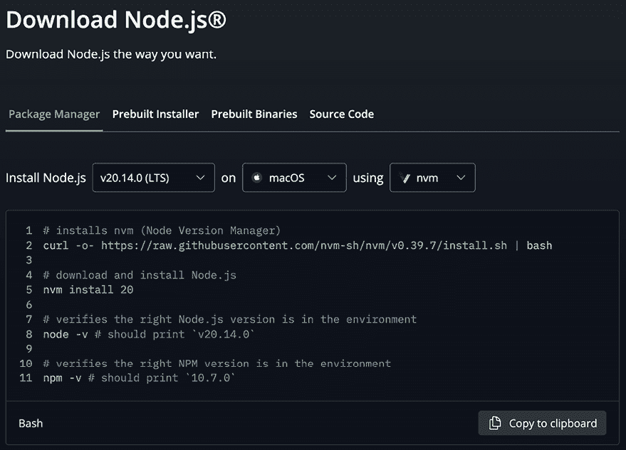
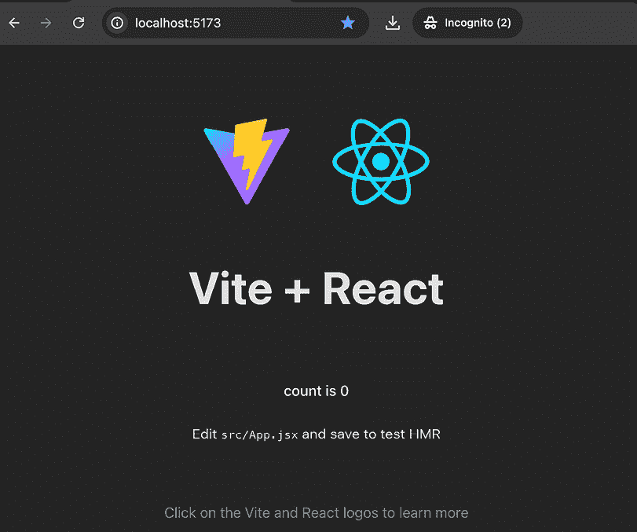

# 前言

作为构建现代、交互式用户界面的最受欢迎的 JavaScript 库，React 是一个需求旺盛的框架，将为您的职业生涯或下一个项目带来真正的价值。但就像任何技术一样，学习 React 可能会有点棘手，找到合适的老师可以使事情变得容易得多。

Maximilian Schwarzmüller 是一位畅销书作者，他帮助全球超过三百万名学生学习如何编程，他的最新 React 视频课程（*React—The Complete Guide*）在 Udemy 上有超过八十万名学生。

Max 编写了这本深入浅出的参考书，旨在帮助您掌握 React 编程的世界。简单的解释、相关的示例和清晰、简洁的方法使这本快速指南成为忙碌开发者的理想资源。

本书提炼了 React 的核心概念，并以其整洁的总结将关键特性汇集在一起，因此完美地补充了其他深入教学资源。因此，无论您刚刚完成 Max 的 React 视频课程并正在寻找一个实用的参考工具，还是您已经使用过各种其他学习材料，现在需要一个单一的学习指南来整合所有内容，这本书都是您在下一个 React 项目中理想的伴侣。此外，本书完全更新至 React 19 版本，因此您可以确信您已经准备好使用最新版本。

# 本书面向对象

本书是为已经对 React 基础知识有一定了解的开发者设计的。它可以作为一个独立资源来巩固理解，也可以作为更深入课程的配套指南。为了从本书中获得最大价值，建议您对 JavaScript、HTML 和 CSS 的基本原理有所了解。

# 本书涵盖内容

*第一章*，*React – 是什么以及为什么*，将重新介绍 React.js。假设 React.js 对您来说并不陌生，本章将阐明 React 解决的问题、存在的替代方案、React 通常的工作方式以及如何创建 React 项目。

*第二章*，*理解 React 组件和 JSX*，将解释 React 应用的总体结构（组件树）以及如何在 React 应用中创建和使用组件。

*第三章*，*组件和属性*，将确保您能够通过使用一个称为“属性”的关键概念来构建可重用组件。

*第四章*，*处理事件和状态*，将涵盖如何在 React 组件中处理状态，有哪些不同的选项（单状态与多状态切片）以及如何执行和利用状态变化进行 UI 更新。

*第五章*，*渲染列表和条件内容*，将解释 React 应用如何渲染内容列表（例如，用户帖子列表）和条件内容（例如，如果输入字段中输入了不正确的值，则发出警报）。

*第六章*，*样式化 React 应用*，将阐明 React 组件如何被样式化，以及如何动态或条件性地应用样式，涉及流行的样式解决方案，如 vanilla CSS、Tailwind CSS、styled components 和 CSS modules 用于作用域样式。

*第七章*，*Portals 和 Refs*，将解释如何通过 React 内置的“refs”功能实现直接的 DOM 访问和操作。此外，你还将学习如何使用 Portals 来优化渲染的 DOM 元素结构。

*第八章*，*处理副作用*，将讨论`useEffect`钩子，解释它是如何工作的，如何根据不同的用例和场景进行配置，以及如何使用这个 React 钩子最优地处理副作用。

*第九章*，*使用表单操作处理用户输入和表单*，将探讨 React 如何通过允许你定义在提交时触发的客户端表单操作来简化处理表单的过程。

*第十章*，*React 幕后和优化机会*，将深入了解 React 的幕后，并深入探讨核心主题，如虚拟 DOM、状态更新批处理和关键优化技术，这些技术有助于你避免不必要的重新渲染周期（从而提高性能）。

*第十一章*，*处理复杂状态*，将解释高级 React 钩子`useReducer`是如何工作的，何时以及为什么你可能想要使用它，以及如何在 React 组件中使用它来管理更复杂的组件状态。此外，还将深入探讨和讨论 React 的 Context API，让你能够轻松地管理全局状态。

*第十二章*，*构建自定义 React 钩子*，将在前几章的基础上，探讨你如何构建自己的自定义 React 钩子，以及这样做的好处是什么。

*第十三章*，*使用 React Router 构建多页应用*，将解释 React Router 是什么，以及这个额外的库如何被用来在 React 单页应用程序中构建多页体验。

*第十四章*，*使用 React Router 管理数据*，将深入探讨 React Router，并探索这个包如何帮助获取和管理数据。

*第十五章*，*使用 Next.js 构建服务器端渲染和全栈应用*，将帮助你理解**服务器端渲染**（**SSR**）的概念，并帮助你使用流行的 Next.js 框架结合你的 React 知识来构建跨越前后端的应用程序。

*第十六章*，*React 服务器组件和服务器操作*，将基于构建全栈 React 应用的想法，并解释你如何在服务器端渲染组件和处理表单提交。

*第十七章*，*理解 React Suspense 和 use()钩子*，将解释 React 如何通过在数据获取时显示回退内容来帮助你提供更好的用户体验。

*第十八章*，*下一步和进一步资源*，将涵盖核心和扩展的 React 生态系统以及哪些资源可能对下一步有帮助。

本书还附带以下可下载的补充内容：

+   每章都附带的速查表

+   一段视频中，作者 Maximilian 在本书完成后为你提供了他的下一步建议

+   一段视频中，作者 Maximilian 分享了他对 React 未来的看法

在*前言*的末尾可以找到获取此内容的说明。

# 与本书保持同步

这本书的版本是在 React 19 发布时编写的，尽管本书中解释的大部分核心概念自 React 18 甚至更早以来就已经存在。因此，本书涵盖的大多数功能都可以被认为是极其稳定且在近期内不太可能发生变化的。

但本书也会涵盖一些相对较新的 React 功能，如服务器组件或服务器操作。虽然这些概念的大幅更改也不太可能，但已经创建了一个 GitHub 文档来跟踪你在阅读本书时应注意的任何更正或偏差：[`github.com/mschwarzmueller/book-react-key-concepts-e2/blob/main/CHANGELOG.md`](https://github.com/mschwarzmueller/book-react-key-concepts-e2/blob/main/CHANGELOG.md)。

# 跟随本书学习

在你能够成功在你的系统上创建和运行 React.js 项目之前，你需要确保你已经安装了**Node.js**和**npm**（默认包含在你的安装中）。

这些可以在[`nodejs.org/en/`](https://nodejs.org/en/)下载。

本站点的首页应自动为你提供适用于你平台和系统的最新安装选项。更多选项，请选择网站导航栏中的**下载**。这将打开一个新页面，你可以通过该页面探索所有主要平台的安装选择，如下面的截图所示：



## 安装 React.js

React.js 项目可以通过多种方式创建，包括包含 webpack、babel 和其他工具的自定义项目设置。本书推荐的方式是使用 Vite 工具。这个工具以及创建 React 应用的流程将在*第一章*，*React – 什么是以及为什么*中介绍，但你也可以参考本节以获取此任务的逐步说明。

执行以下步骤在你的系统上创建 React.js 项目：

1.  打开你的终端（Windows 的 Powershell/命令提示符；Linux 的 bash）。

1.  使用创建目录命令创建一个名为你选择的新的项目文件夹（例如，`mkdir react-projects`），然后使用更改目录命令（例如，`cd react-projects`）进入该目录。

1.  在此文件夹内创建新项目目录的命令如下：

    ```js
    npm create vite@latest my-app 
    ```

运行此命令后，当提示输入时，请选择**React**和**JavaScript**。

1.  完成后，使用`cd`命令导航到您的新的目录：

    ```js
    cd my-app 
    ```

1.  在这个新项目目录中打开终端窗口，并运行以下命令来安装所有必需的依赖项：

    ```js
    npm install 
    ```

1.  完成此命令后，在相同的终端中运行以下命令以启动 Node.js 开发服务器：

    ```js
    npm run dev 
    ```

1.  此命令输出一个您可以访问以预览 React 应用程序的服务器地址。默认地址是`http://localhost:5173`。在地址/位置栏中输入该地址以导航到`localhost:5173`，如下面的截图所示：



1.  当您准备暂时停止开发时，在*步骤 5*中的同一终端中使用*Ctrl* + *C*来退出正在运行的服务器。要重新启动它，只需在该终端中再次运行`npm run dev`命令。在开发过程中，保持`npm run dev`启动并运行，因为它会自动更新加载在`localhost:5173`上的网站，以反映您所做的任何更改。

## 下载示例代码文件

本书代码包托管在 GitHub 上，网址为[`github.com/mschwarzmueller/book-react-key-concepts-e2`](https://github.com/mschwarzmueller/book-react-key-concepts-e2)。我们还有其他来自我们丰富图书和视频目录的代码包，可在[`github.com/PacktPublishing/`](https://github.com/PacktPublishing/)找到。查看它们吧！

## 下载彩色图像

我们还提供了一份包含本书中使用的截图/图表的彩色图像的 PDF 文件。您可以从这里下载：[`packt.link/gbp/9781836202271`](https://packt.link/gbp/9781836202271)。

## 使用的约定

在本书中使用了多种文本约定。

`CodeInText`：表示文本中的代码单词、数据库表名、文件夹名、文件名、文件扩展名、路径名、虚拟 URL、用户输入和 Twitter 昵称。例如：“一旦定义了根入口点，就可以在通过`createRoot()`创建的`root`对象上调用名为`render()`的方法。”

代码块按以下方式设置：

```js
import React from 'react';
import ReactDOM from 'react-dom/client';
import './index.css';
import App from './App.jsx';
const root = ReactDOM.createRoot(document.getElementById('root'));
root.render(<App />); 
```

当我们希望您注意代码块中的特定部分时，相关的行或项目将以粗体显示：

```js
**import** **{ memo }** **from****'react'****;**
import classes from './Error.module.css';
function Error({ message }) {
  console.log('<Error /> component function is executed.');
  if (!message) {
    return null;
  }
  return <p className={classes.error}>{message}</p>;
}
export default **memo****(****Error****);** 
```

任何命令行输入或输出都按以下方式编写：

```js
npm create vite@latest my-react-project 
```

**粗体**：表示新术语、重要单词或屏幕上看到的单词。例如，菜单或对话框中的单词在文本中显示如下。例如：“React 通过从**命令式**方法转换为**声明式**方法，简化了此类 UI 的创建和管理。”

警告或重要注意事项看起来像这样。

小贴士和技巧看起来像这样。

# 联系我们

我们欢迎读者的反馈。

**一般反馈**：请发送电子邮件至`feedback@packtpub.com`，并在邮件主题中提及本书的标题。如果您对本书的任何方面有疑问，请通过`questions@packtpub.com`发送电子邮件给我们。

**勘误**：尽管我们已经尽最大努力确保内容的准确性，但错误仍然可能发生。如果您在这本书中发现了错误，如果您能向我们报告，我们将不胜感激。请访问[`www.packtpub.com/submit-errata`](http://www.packtpub.com/submit-errata) ，点击**提交勘误**，并填写表格。

**盗版**：如果您在互联网上以任何形式遇到我们作品的非法副本，如果您能提供位置地址或网站名称，我们将不胜感激。请通过`copyright@packtpub.com`与我们联系，并提供材料的链接。

**如果您有兴趣成为作者**：如果您在某个领域有专业知识，并且您有兴趣撰写或为书籍做出贡献，请访问[`authors.packtpub.com`](http://authors.packtpub.com) 。

# 分享您的想法

一旦您阅读了*《React 核心概念，第二版》*，我们很乐意听听您的想法！请[点击此处直接进入亚马逊评论](https://packt.link/r/183620227X)页面并分享您的反馈。

您的评论对我们和科技社区都至关重要，并将帮助我们确保我们提供高质量的内容。

# 下载免费 PDF 和补充内容

感谢您购买这本书！

您喜欢随时随地阅读，但无法携带您的印刷书籍到处走？

您的电子书购买是否与您选择的设备不兼容？

别担心，现在，每购买一本 Packt 书籍，您都可以免费获得该书的 DRM 免费 PDF 版本。

在任何地方、任何设备上阅读。直接从您最喜欢的技术书籍中搜索、复制和粘贴代码到您的应用程序中。

此外，通过这本书，您还可以获得补充/额外内容，以便您了解更多。您可以使用这些内容来补充您在书中学到的知识。

优惠远不止于此，您还可以获得独家折扣、时事通讯和每日免费内容的每日邮箱访问权限。

按照以下简单步骤获取福利：

1.  扫描二维码或访问以下链接：

_3_(1).png)

[`packt.link/supplementary-content-9781836202271`](https://packt.link/supplementary-content-9781836202271)

1.  提交您的购买证明。

1.  提交您的书籍代码。您可以在书的第 169 页找到代码。

1.  就这些！我们将直接将您的免费 PDF、补充内容和其它福利发送到您的邮箱

# 补充内容的描述

这本书附带以下额外材料（可通过上述机制获取）：

+   每章都附带的速查表

+   一段作者 Maximilian 在您完成这本书后为您提供的下一步推荐视频

+   一段作者 Maximilian 分享他对 React 未来看法的视频
