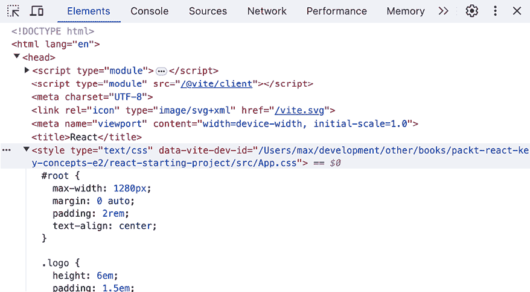

# 第六章：样式化 React 应用

学习目标

到本章结束时，你将能够做到以下几件事情：

+   通过内联样式赋值或使用 CSS 类来样式化 JSX 元素

+   设置内联和类样式，无论是静态的、动态的还是条件性的

+   构建可重用的组件，允许进行样式定制

+   利用 CSS 模块将样式限制在组件范围内

+   理解`styled-components`这个第三方 CSS-in-JS 库背后的核心思想

+   使用 Tailwind CSS 来样式化 React 应用

# 简介

React.js 是一个前端 JavaScript 库。这意味着它全部关于构建（Web）用户界面和处理用户交互。

到目前为止，本书已经广泛探讨了如何使用 React 为 Web 应用添加交互性。状态、事件处理和动态内容是与这一主题相关的关键概念。

当然，网站和 Web 应用不仅仅是关于交互性的。你可以构建一个提供交互性和吸引人的功能的出色 Web 应用，但如果它缺乏吸引人的视觉元素，它可能仍然不受欢迎。展示是关键，网络也不例外。

因此，就像所有其他应用和网站一样，React 应用和网站需要适当的样式，并且在处理 Web 技术时，**层叠样式表**（**CSS**）是首选的语言。

然而，这本书不是关于 CSS 的。它不会解释或教你如何使用 CSS，因为已经有针对这一主题的专用、更好的资源（例如，[`developer.mozilla.org/en-US/docs/Learn/CSS`](https://developer.mozilla.org/en-US/docs/Learn/CSS) 上的免费 CSS 指南）。但本章将教你如何将 CSS 代码与 JSX 和 React 概念（如状态和属性）结合使用。你将学习如何为你的 JSX 元素添加样式，样式自定义组件，并使这些组件的样式可配置。本章还将教你如何动态和条件性地设置样式，并探索流行的第三方库，如 styled-components 和 Tailwind CSS，它们可用于样式化。

# React 应用中的样式是如何工作的？

到目前为止，本书中展示的应用和示例都只有最基本的美化。但至少它们有一些基本的美化，而不是完全没有美化。

但是，那种样式是如何添加的？在使用 React 时，如何将样式添加到用户界面元素（如 DOM 元素）中？

简短的回答是，“就像你对非 React 应用所做的那样。”你可以像对常规 HTML 元素一样，将 CSS 样式和类添加到 JSX 元素中。在你的 CSS 代码中，你可以使用你从 CSS 中知道的所有特性和选择器。在编写 CSS 代码时，你不需要做出任何特定的 React 更改。

到目前为止使用的代码示例（即 GitHub 上托管的活动或其他示例）总是使用常规 CSS 样式，借助 CSS 选择器，将一些基本样式应用到最终用户界面。这些 CSS 规则定义在一个`index.css`文件中，它是每个新创建的 React 项目的一部分（当使用 Vite 创建项目时，如*第一章*，*React – 什么和为什么*所示）。

例如，以下是前一章（*第五章*，*渲染列表和条件内容*）的*活动 5.2*中使用的`index.css`文件：

```js
@import url('https://fonts.googleapis.com/css2?family=Poppins:wght@400;700&family=Rubik:ital,wght@0,300..900;1,300..900&display=swap');
body {
  margin: 0;
  padding: 3rem;
  font-family: 'Poppins', sans-serif;
  -webkit-font-smoothing: antialiased;
  -moz-osx-font-smoothing: grayscale;
  text-align: center;
  background-color: #dff8fb;
  color: #212324;
}
button {
  padding: 0.5rem 1rem;
  font-family: 'Rubik', sans-serif;
  font-size: 1rem;
  border: none;
  border-radius: 4px;
  background-color: #212324;
  color: #fff;
  cursor: pointer;
}
button:hover {
  background-color: #3f3e40;
}
ul {
  max-width: 35rem;
  list-style-type: none;
  padding: 0;
  margin: 2rem auto;
}
li {
  margin: 1rem 0;
  padding: 1rem;
  background-color: #5ef0fd;
  border: 2px solid #212324;
  border-radius: 4px;
} 
```

实际的 CSS 代码及其含义并不重要（如前所述，这本书不是关于 CSS 的）。然而，重要的是这个代码完全不包含 JavaScript 或 React 代码。如前所述，你编写的 CSS 代码完全独立于你在应用中使用 React 的事实。

更有趣的问题是，这些代码实际上是如何应用到渲染的网页上的？它是如何导入到该页面的？

通常，你会在提供的 HTML 文件内部期望找到样式文件导入（通过`<link href="…">`）。由于 React 应用通常是关于构建**单页应用**（见*第一章*，*React – 什么和为什么*），你只有一个 HTML 文件——`index.html`文件。但如果你检查该文件，你不会找到任何指向`index.css`文件的`<link href="…">`导入（只有一些其他导入 favicon 的`<link>`元素），如下面的截图所示：


图 6.1：`index.html`文件的`<head>`部分不包含指向 index.css 文件的`<link>`导入

那么，`index.css`中的样式是如何导入并应用的？

在根入口文件（这是通过`Vite`生成的项目中的`main.jsx`文件）中，你可以找到一个`import`语句：

```js
import React from 'react';
import ReactDOM from 'react-dom/client';
import App from './App.jsx';
**import****'./index.css'****;**
ReactDOM.createRoot(document.getElementById('root')).render(
  <React.StrictMode>
    <App />
  </React.StrictMode>,
); 
```

`import './index.css';`语句导致 CSS 文件被导入，并且定义的 CSS 代码被应用到渲染的网页上。

值得注意的是，这不是标准的 JavaScript 行为。你不能将 CSS 文件导入到 JavaScript 中——至少，如果你只是使用纯 JavaScript 的话。

在 React 应用中，CSS 以这种方式工作，因为代码在加载到浏览器之前会被转换。因此，你不会在浏览器中执行的最终 JavaScript 代码中找到那个`import`语句。相反，在**转换过程**中，转换器识别 CSS 导入，将其从 JavaScript 文件中移除，并将 CSS 代码（或指向可能捆绑和优化的 CSS 文件的适当链接）注入到`index.html`文件中。

你可以通过在浏览器中检查加载的网页的渲染**文档对象模型**（**DOM**）内容来确认这一点。

要做到这一点，请选择 Chrome 开发者工具中的**元素**选项卡，如下所示：



图 6.2：在运行时 DOM 中可以找到注入的 CSS `<style>` 元素

你可以直接在`index.css`文件中，或在由`index.css`文件导入的任何其他 CSS 文件中定义要应用于你的 HTML 元素（即你的组件中的 JSX 元素）的任何样式。

你也可以将额外的 CSS 导入语句添加到`main.jsx`文件或任何其他 JavaScript 文件（包括存储组件的文件）中。然而，重要的是要记住，CSS 样式始终是全局的。无论你是否将 CSS 文件导入到`main.jsx`或组件特定的 JavaScript 文件中，该 CSS 文件中定义的样式都将应用于全局。

这意味着在`goal-list.css`文件中定义的样式，即使可能被导入到`GoalList.jsx`文件中，也可能影响在完全不同的组件中定义的 JSX 元素。在本章的后面部分，你将了解到一些技术，这些技术可以帮助你防止意外的样式冲突并实现样式作用域。

## 使用内联样式

你可以使用 CSS 文件来定义全局 CSS 样式，并使用不同的 CSS 选择器来针对不同的 JSX 元素（或元素组）。

尽管通常不建议这样做，但你也可以通过`style`属性直接在 JSX 元素上设置内联样式。

**注意**

如果你想知道为什么不建议使用内联样式，Stack Overflow 上的以下讨论提供了许多反对内联样式的论点：[`stackoverflow.com/questions/2612483/whats-so-bad-about-in-line-css`](https://stackoverflow.com/questions/2612483/whats-so-bad-about-in-line-css)。

在 JSX 代码中设置内联样式的方式如下：

```js
function TodoItem() {
  return <li style={{color: 'red', fontSize: '18px'}}>Learn React!</li>;
}; 
```

在这个例子中，向`<li>`元素（所有 JSX 元素都支持`style`属性）添加了`style`属性，并通过 CSS 设置了文本的`color`和`size`属性。

这种方法与仅使用 HTML（而不是 JSX）设置内联样式的方法不同。当使用纯 HTML 时，你会这样设置内联样式：

```js
<li style="color: red; font-size: 18px">Learn React!</li> 
```

不同之处在于，`style`属性期望接收一个包含样式设置的 JavaScript 对象——而不是一个普通的字符串。这是必须记住的，因为，如前所述，内联样式通常不常用。

由于`style`对象是一个对象而不是一个普通字符串，它被作为值放在大括号之间——就像数组、数字或任何其他非字符串值一样必须在大括号之间设置（双引号或单引号之间的任何内容都被视为字符串值）。因此，值得注意的是，前面的例子没有使用任何特殊的“双大括号”语法，而是使用一对大括号来包围非字符串值，另一对大括号来包围对象数据。

在`style`对象内部，可以设置底层 DOM 元素支持的任何 CSS 样式属性。属性名称是针对 HTML 元素定义的（即，与你可以用纯 JavaScript 针对和设置的目标和设置的 CSS 属性名称相同），当修改 HTML 元素时。

当在 JavaScript 代码中设置样式（如上面显示的`style`属性）时，必须使用 JavaScript CSS 属性名称。这些名称与你在 CSS 代码中使用的 CSS 属性名称相似，但并不完全相同。当针对由多个单词组成的属性名称（例如，`font-size`）时，会出现差异。在 JavaScript 中针对此类属性时，必须使用驼峰式命名法（`fontSize`而不是`font-size`），因为 JavaScript 属性不能包含破折号。或者，你也可以用引号包裹属性名称（`'font-size'`）。

**注意**

你可以在这里找到有关 HTML 元素样式属性和 JavaScript CSS 属性名称的更多信息：[`developer.mozilla.org/en-US/docs/Web/API/HTMLElement/style`](https://developer.mozilla.org/en-US/docs/Web/API/HTMLElement/style)。

## 通过 CSS 类设置样式

如前所述，通常不建议使用内联样式，因此，在 CSS 文件中定义的 CSS 样式（或在文档`<head>`部分的`<style>`标签之间）更受欢迎。

在这些 CSS 代码块中，你可以编写常规 CSS 代码并使用 CSS 选择器将 CSS 样式应用于特定元素。例如，你可以这样设置页面上的所有`<li>`元素（无论哪个组件可能渲染了它们）的样式：

```js
li {
  color: red;
  font-size: 18px;
} 
```

只要此代码被添加到页面中（因为定义它的 CSS 文件被导入到`main.jsx`等），样式就会被应用。

开发者经常试图针对特定的元素或元素组。而不是将某些样式应用于页面上的所有`<li>`元素，目标可能是仅针对属于特定列表的`<li>`元素。考虑以下渲染到页面的 HTML 结构（它可能分布在多个组件中，但这在这里并不重要）：

```js
<nav>
  <ul>
    <li><a href="…">Home</a></li>
    <li><a href="…">New Goals</a></li>
  </ul>
</nav>
...
<h2>My Course Goals</h2>
<ul>
  <li>Learn React!</li>
  <li>Master React!</li>
</ul> 
```

在这个例子中，导航列表项很可能不会收到与`course goal`列表项相同的样式（反之亦然）。

通常，这个问题会借助 CSS 类和类选择器来解决。你可以像这样调整 HTML 代码：

```js
<nav>
  <ul>
    <li><a href="…">Home</a></li>
    <li><a href="…">New Goals</a></li>
  </ul>
</nav>
...
<h2>My Course Goals</h2>
<ul>
  <li **class****=****"goal-item"**>Learn React!</li>
  <li **class****=****"goal-item"**>Master React!</li>
</ul> 
```

以下 CSS 代码只会针对课程目标列表项，而不会针对导航列表项：

```js
.goal-item {
  color: red;
  font-size: 18px;
} 
```

这种方法在 React 应用中也几乎同样适用。

然而，如果你尝试向 JSX 元素添加 CSS 类，如前一个示例所示，你将在浏览器开发者工具中遇到警告：


图 6.3：React 输出的警告

如前图所示，你不应该将`class`作为属性添加，而应该使用`className`。实际上，如果你将`class`替换为`className`作为属性名，警告就会消失，并且类 CSS 样式将被应用。因此，正确的 JSX 代码如下：

```js
<ul>
  <li **className**="goal-item">Learn React!</li>
  <li **className**="goal-item">Master React!</li>
</ul> 
```

但为什么 React 建议你使用`className`而不是`class`？

这与在处理`<label>`对象时使用`htmlFor`而不是`for`类似（如第四章*处理事件和状态*中讨论的）。就像`for`一样，`class`是 JavaScript 中的一个关键字，因此，`className`被用作属性名。

## 动态设置样式

使用内联样式和 CSS 类（以及通常的全局 CSS 样式），有各种方法可以将样式应用于元素。到目前为止，所有示例都显示了静态样式——也就是说，一旦页面加载完成，样式就不会改变。

虽然大多数页面元素在页面加载后不会改变它们的样式，但你通常也有一些元素应该动态或条件性地设置样式。以下是一些示例：

+   一个待办事项应用，其中不同的待办事项优先级会收到不同的颜色

+   一个输入表单，其中无效的表单元素应在表单提交失败后突出显示

+   一个基于 Web 的游戏，玩家可以为他们的头像选择颜色

在这种情况下，应用静态样式是不够的，应该使用动态样式。动态设置样式很简单。再次强调，这只是应用之前覆盖的 React 关键概念（最重要的是第二章*理解 React 组件和 JSX*和第四章*处理事件和状态*中关于设置动态值的内容）。

这里有一个例子，其中段落的颜色会动态设置为用户在输入字段中输入的颜色：

```js
function ColoredText() {
  const [enteredColor, setEnteredColor] = useState('');
  function handleUpdateTextColor(event) {
    setEnteredColor(event.target.value);
  };
  return (
    <>
      <input type="text" onChange={handleUpdateTextColor}/>
      <p style={{color: enteredColor}}>This text's color changes dynamically!</p>
    </>
  );
}; 
```

在`<input>`字段中输入的文本存储在`enteredColor`状态中。然后使用此状态动态设置`<p>`元素的`color` CSS 属性。这是通过传递一个`style`对象来实现的，其中`color`属性设置为`enteredColor`的值，作为`<p>`元素的`style`属性的值。因此，段落的文本颜色会动态设置为用户输入的值（假设用户将有效的 CSS 颜色值输入到`<input>`字段中）。

你不仅限于内联样式；CSS 类也可以动态设置，如下面的代码片段所示：

```js
function TodoPriority() {
  const [chosenPriority, setChosenPriority] = useState('low-prio');
  function handleChoosePriority(event) {
    setChosenPriority(event.target.value);
  };
  return (
    <>
      <p className={chosenPriority}>Chosen Priority: {chosenPriority}</p>
      <select onChange={handleChoosePriority}>
        <option value="low-prio">Low</option>
        <option value="high-prio">High</option>
      </select>
    </>
  );
}; 
```

在这个例子中，`chosenPriority`状态将在`low-prio`和`high-prio`之间交替，取决于下拉选择。然后状态值作为段落内的文本输出，也用作动态 CSS 类名，应用于`<p>`元素。当然，为了产生任何视觉效果，必须在某个 CSS 文件或`<style>`块中定义`low-prio`和`high-prio` CSS 类。例如，考虑以下`index.css`中的代码：

```js
.low-prio {
  background-color: blue;
  color: white;
}
.high-prio {
  background-color: red;
  color: white;
} 
```

## 条件样式

与**动态样式**密切相关的是**条件样式**。实际上，它们最终只是动态样式的特殊案例。在先前的例子中，内联样式值和类名被设置为等于用户选择或输入的值。

然而，你也可以根据不同的条件动态地派生样式或类名，如下所示：

```js
function TextInput({isValid, isRecommended, ...props}) {
  let cssClass = 'input-default';
  if (isRecommended) {
    cssClass = 'input-recommended';
  }

  if (!isValid) {
    cssClass = 'input-invalid';
  }
  return <input className={cssClass} {...props} />
}; 
```

在这个例子中，围绕标准`<input>`元素构建了一个包装组件。（有关包装组件的更多信息，请参阅*第三章*，*组件和属性*。）这个包装组件的主要目的是为包装的`<input>`元素设置一些默认样式。**包装组件**被构建为提供可以用于应用中任何位置的预样式输入元素。实际上，提供预样式元素是构建包装组件最常见和最受欢迎的使用场景之一。

在这个具体的例子中，默认样式是通过 CSS 类应用的。如果`isValid`属性值为`true`且`isRecommended`属性值为`false`，则`input-default` CSS 类将应用于`<input>`元素，因为两个`if`语句都没有激活。

如果`isRecommended`为`true`（但`isValid`为`false`），则应用`input-recommended` CSS 类。如果`isValid`为`false`，则添加`input-invalid`类。当然，CSS 类必须在某些导入的 CSS 文件中定义（例如，在`index.css`中）。

内联样式也可以以类似的方式设置，如下面的代码片段所示：

```js
function TextInput({isValid, isRecommended, ...props}) {
  let bgColor = 'black';
  if (isRecommended) {
    bgColor = 'blue';
  }
  if (!isValid) {
    bgColor = 'red';
  }
  return <input style={{backgroundColor: bgColor}} {...props} />
}; 
```

在这个例子中，`<input>`元素的背景颜色是基于通过`isValid`和`isRecommended`属性接收到的值有条件地设置的。

## 结合多个动态 CSS 类

在先前的例子中，一次只能动态设置一个 CSS 类。然而，遇到需要合并和添加到元素中的多个动态派生 CSS 类的情况并不少见。

考虑以下示例：

```js
function ExplanationText({children, isImportant}) {
  const defaultClasses = 'text-default text-expl';
  return <p className={defaultClasses}>{children}</p>;
} 
```

在这里，通过简单地将它们组合成一个字符串，就可以向`<p>`元素添加两个 CSS 类。或者，你也可以直接添加包含两个类的字符串，如下所示：

```js
return <p className="text-default text-expl">{children}</p>; 
```

这段代码将能正常工作，但如果目标是基于`isImportant`属性值（在先前的例子中被忽略）向类列表中添加另一个类名呢？

替换默认的类列表很容易，正如你所学到的：

```js
function ExplanationText({children, isImportant}) {
  let cssClasses = 'text-default text-expl';
  if (isImportant) {
    cssClasses = 'text-important';
  }
  return <p className={cssClasses}>{children}</p>;
} 
```

但如果目标不是替换默认类列表呢？如果`text-important`应该作为类添加到`<p>`元素中，除了`text-default`和`text-expl`呢？

`className`属性期望接收一个字符串值，因此传递一个类数组不是一种选择。然而，你可以简单地合并多个类成一个字符串，并且有几种不同的方法可以做到这一点：

+   字符串连接：

    ```js
    cssClasses = cssClasses + ' text-important'; 
    ```

+   使用模板字符串：

    ```js
    cssClasses = `${cssClasses} text-important`; 
    ```

+   数组连接：

    ```js
    cssClasses = [cssClasses, 'text-important'].join(' '); 
    ```

这些示例都可以在`if`语句（`if (isImportant)`）中使用，根据`isImportant`属性值有条件地添加`text-important`类。所有这三种方法以及这些方法的变体都将工作，因为所有这些方法都产生一个字符串。一般来说，任何产生字符串的方法都可以用来生成`className`的值。

## 合并多个内联样式对象

当处理内联样式时，除了 CSS 类，您还可以合并多个样式对象。主要区别在于您不生成包含所有值的字符串，而是一个包含所有组合样式值的对象。

这可以通过使用标准的 JavaScript 技术将多个对象合并为一个对象来实现。最流行的技术涉及使用**扩展运算符**，如下例所示：

```js
function ExplanationText({children, isImportant}) {
  let defaultStyle = { color: 'black' };
  if (isImportant) {
    defaultStyle = { ...defaultStyle, backgroundColor: 'red' };
  }
  return <p style={defaultStyle}>{children}</p>;
} 
```

在这里，您会注意到`defaultStyle`是一个具有`color`属性的对象。如果`isImportant`为`true`，它将被替换为一个包含所有先前属性（通过扩展运算符`...defaultStyle`）以及`backgroundColor`属性的对象。

**注意**

关于扩展运算符的功能和使用，请参阅*第五章*，*渲染列表和条件内容*。

## 使用可定制样式构建组件

如您现在所知，组件可以被重用。这一点得到了支持，因为它们可以通过属性进行配置。同一个组件可以在页面的不同位置使用不同的配置来产生不同的输出。

由于样式可以静态和动态设置，您也可以使组件的样式可定制。前面的示例已经展示了这种定制的作用；例如，在先前的示例中，`isImportant`属性被用来有条件地向段落添加红色背景色。因此，`ExplanationText`组件已经通过`isImportant`属性允许间接的样式定制。

除了这种形式的定制外，您还可以构建接受已持有 CSS 类名或样式对象的属性的组件。例如，以下包装组件接受一个`className`属性，该属性与默认 CSS 类（`btn`）合并：

```js
function Button({children, config, className}) {
  return <button {...config} className={`btn ${className}`}>{children}</button>;
}; 
```

此组件可以用以下方式在另一个组件中使用：

```js
<Button config={{onClick: doSomething}} className="btn-alert">Click me!</Button> 
```

如果这样使用，最终的`<button>`元素将同时接收`btn`和`btn-alert`类。

您不必使用`className`作为属性名；任何名称都可以使用，因为它是您的组件。然而，使用`className`并不是一个坏主意，因为这样您可以保持通过`className`设置 CSS 类的心理模型（对于内置组件，您将没有这样的选择）。

与将属性值与默认 CSS 类名或样式对象合并不同，您可以覆盖默认值。这允许您构建一些带有默认样式的组件，而无需强制使用该样式：

```js
function Button({children, config, className}) {
  let cssClasses = 'btn';
  if (className) {
    cssClasses = className;
  }
  return <button {...config} className={cssClasses}>{children}</button>;
}; 
```

你可以看到，本书中涵盖的所有不同概念是如何在这里汇聚的：属性允许定制，值可以设置、交换和动态条件地更改，因此可以构建高度可重用和可配置的组件。

### 使用固定配置选项进行定制

除了暴露`className`或`style`等属性，这些属性会与组件函数内部定义的其他类或样式合并外，你还可以构建基于其他属性值应用不同样式或类名的组件。

这在前面的示例中已经展示过，其中使用了`isValid`或`isImportant`等属性来有条件地应用某些样式。因此，这种应用样式的做法可以被称为“间接样式”（尽管这不是一个官方术语）。

两种方法在不同的环境中都能发挥作用。例如，对于包装组件，接受`className`或`style`属性（这些可以在组件内部与其他样式合并）使得组件可以像内置组件一样使用（例如，像它所包装的组件）。另一方面，如果你想要构建提供一些预定义变体的组件，间接样式可能非常有用。

一个很好的例子是，一个文本框提供了两个内置主题，可以通过特定的属性进行选择。


图 6.4：根据“mode”属性的值对 TextBox 进行样式化

`TextBox`组件的代码可能看起来像这样：

```js
function TextBox({children, mode}) {
  let cssClasses;
  if (mode === 'alert') {
    cssClasses = 'box-alert';
  } else if (mode === 'info') {
    cssClasses = 'box-info';
  }
  return <p className={cssClasses}>{children}</p>;
}; 
```

这个`TextBox`组件始终返回一个段落元素。如果`mode`属性设置为除`'alert'`或`'info'`之外的任何值，则段落不会接收任何特殊样式。但如果`mode`等于`'alert'`或`'info'`，则会向段落添加特定的 CSS 类。

因此，这个组件不允许通过某些`className`或`style`属性进行直接样式化，但它确实提供了不同的变体或主题，可以通过特定的属性（在这种情况下是`mode`属性）来设置。

# 未限定样式的问题

如果你考虑本章中迄今为止处理的不同示例，那么有一个特定的用例出现得相当频繁：样式仅与特定组件相关。

例如，在前一节的`TextBox`组件中，`'box-alert'`和`'box-info'`是可能只与这个特定组件及其标记相关的 CSS 类。如果应用了`'box-alert'`类的任何其他 JSX 元素（尽管这不太可能），那么它可能不应该与`TextBox`组件中的`<p>`元素以相同的样式进行样式化。

来自不同组件的样式可能会相互冲突并覆盖彼此，因为样式不是限定（即，限制）在特定组件内的。CSS 样式始终是全局的，除非使用内联样式（如前所述，这是不推荐的）。

当与 React 等基于组件的库一起工作时，这种作用域缺失是一个常见问题。随着应用规模和复杂性的增长（或者说，随着越来越多的组件被添加到 React 应用的代码库中），很容易编写冲突的样式。

因此，React 社区成员已经开发了各种解决方案来解决这个问题。以下是最受欢迎的三种解决方案：

+   CSS Modules（在用 Vite 创建的 React 项目中默认支持）

+   样式化组件（使用名为`styled-components`的第三方库）

+   Tailwind CSS（一个流行的 CSS 库）

## CSS Modules 的作用域样式

**CSS Modules**是一种方法，其中单个 CSS 文件与特定的 JavaScript 文件相关联，并且这些文件中定义的组件。这种链接是通过转换 CSS 类名来建立的，使得每个 JavaScript 文件都接收自己的、唯一的 CSS 类名。这种转换作为代码构建工作流的一部分自动执行。因此，给定的项目设置必须通过执行所描述的 CSS 类名转换来支持 CSS Modules。通过 Vite 创建的项目默认支持 CSS Modules。


图 6.5：CSS 模块在实际应用中的表现。在构建工作流中，CSS 类名被转换成唯一的名称

CSS Modules 通过以非常具体和明确的方式命名 CSS 文件来启用和使用：`<anything>.module.css`。`<anything>`是你选择的任何值，但文件扩展名前的`.module`部分是必需的，因为它向项目构建工作流发出信号，即此 CSS 文件应根据 CSS Modules 方法进行转换。

因此，像这样命名的 CSS 文件必须以特定的方式导入到组件中：

```js
import classes from './file.module.css'; 
```

这种`import`语法与本节开头为`index.css`展示的`import`语法不同：

```js
import './index.css'; 
```

当像第二个代码片段中那样导入 CSS 文件时，CSS 代码会被简单地合并到`index.html`文件中并全局应用。当使用 CSS Modules（第一个代码片段）时，导入的 CSS 文件中定义的 CSS 类名会被转换，使得它们对于导入 CSS 文件的 JS 文件来说是唯一的。

由于 CSS 类名被转换，因此它们不再等于你在 CSS 文件中定义的类名，所以你从 CSS 文件中导入一个对象（前例中的`classes`），这个对象通过匹配你在 CSS 文件中定义的 CSS 类名作为键，暴露了所有转换后的 CSS 类名。这些属性的值是转换后的类名（字符串）。

下面是一个完整的示例，从一个特定组件的 CSS 文件（`TextBox.module.css`）开始：

```js
.alert {
  padding: 1rem;
  border-radius: 6px;
  background-color: #f9bcb5;
  color: #480c0c;
}
.info {
  padding: 1rem;
  border-radius: 6px;
  background-color: #d6aafa;
  color: #410474;
} 
```

应该将 CSS 代码归属的组件的 JavaScript 文件（`TextBox.jsx`）看起来像这样：

```js
import classes from './TextBox.module.css';
function TextBox({ children, mode }) {
  let cssClasses;
  if (mode === 'alert') {
    cssClasses = classes.alert;
  } else if (mode === 'info') {
    cssClasses = classes.info;
  }
  return <p className={cssClasses}>{children}</p>;
}
export default TextBox; 
```

**注意**

完整的示例代码也可以在 [`github.com/mschwarzmueller/book-react-key-concepts-e2/tree/06-styling/examples/01-css-modules-intro`](https://github.com/mschwarzmueller/book-react-key-concepts-e2/tree/06-styling/examples/01-css-modules-intro) 找到。

如果你使用浏览器开发者工具检查渲染的文本元素，你会注意到应用到 `<p>` 元素的 CSS 类名并不匹配 `TextBox.module.css` 文件中指定的类名：


图 6.6：CSS 类名因为 CSS 模块的使用而转换

这是因为，如前所述，类名在构建过程中被转换成唯一的。如果其他任何 CSS 文件（由另一个 JavaScript 文件导入），定义了一个具有相同名称的类（在这个例子中是 `info`），那么样式就不会冲突，也不会相互覆盖，因为干扰的类名在应用到 DOM 元素之前会被转换成不同的类名。

实际上，在 GitHub 上提供的示例中，你还可以找到在 `index.css` 文件中定义的另一个 `info` CSS 类：

```js
.info {
  border: 5px solid red;
} 
```

该文件仍然被导入到 `main.jsx` 中，因此其样式被应用到整个文档的全局范围内。尽管如此，`.info` 样式显然没有影响到由 `TextBox` 渲染的 `<p>` 元素（在 *图 6.6* 中文本框周围没有红色边框）。它们没有影响到该元素，因为该元素不再有 `info` 类；该类被构建工作流程重命名为 `_info_1mtzh_8`（尽管你看到的名称将不同，因为它包含一个随机元素）。

值得注意的是，`index.css` 文件仍然被导入到 `main.jsx` 中，正如本章开头所示。`import` 语句没有被改为 `import classes from './index.css';`，CSS 文件也没有被命名为 `index.module.css`。

注意，你还可以使用 CSS 模块将样式范围限定到组件，并且可以将 CSS 模块的使用与常规 CSS 文件混合，这些常规 CSS 文件被导入到 JavaScript 文件中而不使用 CSS 模块（即，不进行范围限定）。

使用 CSS 模块的另一个重要方面是，你只能使用 CSS 类选择器（即，在你的 `.module.css` 文件中），因为 CSS 模块依赖于 CSS 类。你可以编写结合类和其他选择器的选择器，例如 `input.invalid`，但你不能在你的 `.module.css` 文件中添加不使用类的选择器。例如，`input { ... }` 或 `#some-id { ... }` 选择器在这里将不起作用。

CSS 模块是将样式范围限定到（React）组件的一种非常流行的方式，本书的后续许多示例都将使用这种方式。

## 样式组件库

`styled-components` 库是一种所谓的 **CSS-in-JS** 解决方案。CSS-in-JS 解决方案旨在通过将它们合并到同一个文件中来消除 CSS 代码和 JavaScript 代码之间的分离。组件样式将直接定义在组件逻辑旁边。是否偏好分离（如通过使用 CSS 文件强制执行）或保持两种语言紧密相邻，这取决于个人喜好。

由于 `styled-components` 是一个不在新创建的 React 项目中预安装的第三方库，如果你想使用它，你必须将其作为第一步安装。这可以通过 `npm`（在 *第一章* ，*React – 什么和为什么* 中与 Node.js 自动安装）来完成：

```js
npm install styled-components 
```

`styled-components` 库本质上提供了所有内置核心组件的包装组件（例如，围绕 `p`、`a`、`button`、`input` 等）。它将这些包装组件作为 **标记模板** 暴露出来——JavaScript 函数，它们不像常规函数那样被调用，而是通过在函数名后添加反引号（模板字面量）来执行，例如，`` doSomething`text data` ``。

**注意**

当你第一次看到标记模板时，可能会感到困惑，尤其是考虑到它是一个不太常用的 JavaScript 功能。你不太可能经常使用它们。更有可能的是，你以前从未构建过自定义标记模板。你可以在 MDN 的这篇优秀的文档中了解更多关于标记模板的信息：[`developer.mozilla.org/en-US/docs/Web/JavaScript/Reference/Template_literals#tagged_templates`](https://developer.mozilla.org/en-US/docs/Web/JavaScript/Reference/Template_literals#tagged_templates) 。

这里是一个导入并使用 `styled-components` 来设置和作用域样式的组件：

```js
import styled from 'styled-components';
const Button = styled.button`
  background-color: #370566;
  color: white;
  border: none;
  padding: 1rem;
  border-radius: 4px;
`;
export default Button; 
```

这个组件不是一个组件函数，而是一个常量，它存储了执行 `styled.button` 标记模板返回的值。该标记模板返回一个组件函数，该函数生成一个 `<button>` 元素。通过标记模板（即模板字面量内）传递的样式应用于该返回的按钮元素。如果你在浏览器开发者工具中检查按钮，就可以看到这一点：


图 6.7：渲染的按钮元素接收定义的组件样式

在 *图 6.7* 中，你还可以看到 `styled-components` 库如何将你的样式应用到元素上。它从标记模板字符串中提取你的样式定义，并将它们注入到文档 `<head>` 部分的 `<style>` 元素中。然后，通过由 `styled-components` 库生成（并命名）的类选择器应用注入的样式。最后，库将自动生成的 CSS 类名添加到元素（在这种情况下是 `<button>`）上。

`styled-components`库暴露的组件会将你传递给组件的任何额外属性传播到包装的核心组件上。此外，任何插入在开标签和闭标签之间的内容也会插入到包装组件的标签之间。

这就是为什么之前创建的`Button`可以像这样使用，而不需要添加任何额外的逻辑：

```js
import Button from './components/button.jsx';
function App() {
  function handleClick() {
    console.log('This button was clicked!');
  }
  return <Button onClick={handleClick}>Click me!</Button>;
}
export default App; 
```

**注意**

完整的示例代码可以在 GitHub 上找到，地址为[`github.com/mschwarzmueller/book-react-key-concepts-e2/tree/06-styling/examples/02-styled-components-intro`](https://github.com/mschwarzmueller/book-react-key-concepts-e2/tree/06-styling/examples/02-styled-components-intro)。

你可以使用`styled-components`库做更多的事情。例如，你可以动态和有条件地设置样式。不过，这本书并不是主要关于这个库的。它只是 CSS Modules 的许多替代方案之一。因此，如果你想要了解更多，建议你探索官方的`styled-components`文档，你可以在这里找到[`styled-components.com/`](https://styled-components.com/)。

## 使用 Tailwind CSS 库进行样式设计

使用 CSS 模块或`styled-component`库来范围样式是一种非常有用且流行的技术。

但无论你使用哪种方法，你都必须自己编写所有的 CSS 代码。因此，当然你需要了解 CSS。

但如果你不喜欢写 CSS 代码呢？或者你根本就不想写？

在这种情况下，你可以使用许多可用的 CSS 库和框架之一——例如，**Bootstrap** CSS 框架或**Tailwind CSS**库。Tailwind 已经成为 React 项目（对于不想编写自定义 CSS 代码的开发者）非常流行的样式解决方案。

请记住，Tailwind 是一个 CSS 库，实际上并不专注于 React。相反，你可以在任何 Web 项目中使用 Tailwind 来样式化你的 HTML 代码——无论在那里使用的是哪种 JavaScript 库或框架（如果有的话）。

但 Tailwind 是 React 应用的常见选择，因为它的核心哲学与 React 的组件化模型相得益彰。这是因为当使用 Tailwind 进行样式设计时，你通常会通过将许多小的 CSS 类应用到单个 JSX 元素上来组合整体样式：

```js
function App() {
  return (
    <main 
      className="bg-gray-200 text-gray-900 h-screen p-12 text-center">
      <h1 className="font-bold text-4xl">Tailwind CSS is amazing!</h1>
      <p className="text-gray-600">
        It may take a while to get used to it. But it's great for people who don't want to write custom CSS code.
      </p>
    </main>
  );
}
export default App; 
```

当第一次遇到使用 Tailwind CSS 的代码时，长长的 CSS 类列表可能会看起来令人畏惧且混乱。但当你与 Tailwind 一起工作时，你通常会很快习惯它。

此外，因为 Tailwind 的方法提供了许多优势：

+   你不需要详细了解 CSS——理解 Tailwind 语法就足够了，它比从头开始写 CSS 要简单。

+   你通过组合 CSS 类来编写样式——类似于你在 React 中从组件组合用户界面。

+   你不需要在 JSX 文件和 CSS 文件之间切换。

+   样式更改可以非常快速地应用和测试。

如上代码片段所示，Tailwind 的核心思想是它提供了许多可组合的 CSS 类，每个类只做很少的事情。例如，`bg-gray-200`类仅将背景颜色设置为某种灰度的色调，没有其他作用。

因此，所有这些 CSS 类的组合才能达到某种外观，Tailwind CSS 提供了许多这样的类，你可以使用并组合。你可以在官方文档中找到完整的列表，网址为[`tailwindcss.com/docs/utility-first`](https://tailwindcss.com/docs/utility-first)。

当你在 React 项目中使用 Tailwind 时，你可以构建 React 组件，不仅是为了重用逻辑或 JSX 标记，还可以重用样式：

```js
**function****Item****(****{ children }****) {**
**return****<****li****className****=****'p-1 my-2 bg-stone-100'****>****{children}****</****li****>****;**
**}**
function App() {
  return (
    <main className="bg-gray-200 text-gray-900 h-screen p-12 text-center">
      <h1 className="font-bold text-4xl">Tailwind CSS is amazing!</h1>
      <p className="text-gray-600">
        It may take a while to get used to it. But it's great for people who
        don't want to write custom CSS code.
      </p>
      <section className="mt-10 border border-gray-600 max-w-3xl mx-auto p-4 rounded-md bg-gray-300">
        <h2 className="font-bold text-xl">Tailwind CSS Advantages</h2>
        <ul className="mt-4">
          **<****Item****>****No CSS knowledge required****</****Item****>**
          **<****Item****>****Compose styles by combining "small" CSS classes****</****Item****>**
          **<****Item****>**
            **Never leave your JSX code - no need to fiddle around in extra CSS files**
          **</****Item****>**
          **<****Item****>****Quickly test and apply changes****</****Item****>**
        </ul>
      </section>
    </main>
  );
}
export default App; 
```

在这个例子中，`Item`组件被构建为重用应用于`<li>`元素的 Tailwind 样式。

**注意**

你还可以在 GitHub 上找到这个示例项目：[`github.com/mschwarzmueller/book-react-key-concepts-e2/tree/06-styling/examples/03-tailwind`](https://github.com/mschwarzmueller/book-react-key-concepts-e2/tree/06-styling/examples/03-tailwind)。

如果你计划在 React 项目中使用 Tailwind，你必须将其作为第一步安装。官方文档中提供了针对各种项目设置的详细安装说明——这包括 Vite 项目的说明：[`tailwindcss.com/docs/guides/vite`](https://tailwindcss.com/docs/guides/vite)。

安装过程不仅仅是导入一个 CSS 文件那么简单，但仍然相对直接。由于 Tailwind 需要连接到项目构建过程以分析你的 JSX 文件并生成包含所有使用过的类名和样式规则的 CSS 代码，因此它确实需要几个设置步骤。

除了提供许多可组合的实用样式外，Tailwind 还提供了大量的自定义机会和配置选项。因此，关于 Tailwind 的书籍可以写满整本书。然而，当然这不是本书的主题。因此，如果你对在 React 项目中使用 Tailwind 感兴趣，Tailwind 的官方文档（见上面的链接）是一个学习更多的好地方。

## 使用其他 CSS 或 JavaScript 样式库和框架

显然，是否编写自定义 CSS 代码（可能使用 CSS Modules 或`styled-components`进行范围限定）或者是否使用第三方 CSS 库，如 Tailwind CSS，取决于个人喜好。没有对错之分，你会在不同的 React 项目中看到各种方法被使用。

本章中介绍的选择也不是详尽的——还有其他类型的 CSS 和 JavaScript 库：

+   解决非常具体的 CSS 问题的实用库——无论你是在 React 项目中使用它们（例如，`Animate.css`，它有助于添加动画）

+   其他 CSS 框架或库提供了广泛的预建 CSS 类，可以应用于元素以快速实现某种外观（例如，**Bootstrap**）

+   帮助进行样式或特定样式方面（例如，动画）的 JavaScript 库（例如，**Framer Motion**）

一些库和框架有针对 React 的特定扩展或专门支持 React，但这并不意味着你不能使用没有这种扩展的库。

# 概括和关键要点

+   可以使用标准 CSS 来样式化 React 组件和 JSX 元素。

+   CSS 文件通常直接导入到 JavaScript 文件中，这得益于项目构建过程，它提取 CSS 代码并将其注入到文档中（HTML 文件）。

+   作为全局 CSS 样式（使用`element`、`id`、`class`或其他选择器）的替代方案，内联样式可以用来为 JSX 元素应用样式。

+   当使用 CSS 类进行样式化时，你必须使用`className`属性（而不是`class`）。

+   样式可以静态设置，也可以使用与将其他动态或条件值注入 JSX 代码相同的语法动态或条件设置——一对大括号。

+   可以通过设置样式（或 CSS 类）基于 prop 值，或者通过合并接收到的 prop 值与其他样式或类名字符串来构建高度可配置的自定义组件。

+   当仅使用 CSS 时，CSS 类名冲突可能是一个问题。

+   CSS Modules 通过在构建工作流程中将类名转换为唯一的名称（每个组件一个）来解决此问题。

+   或者，可以使用如`styled-components`之类的第三方库。这个库是一个 CSS-in-JS 库，它也有一个优点或缺点（取决于你的偏好），即消除了 JS 和 CSS 代码之间的分离。

+   Tailwind CSS 是 React 项目的另一种流行的样式选择——这是一个允许你通过组合许多小的 CSS 类来编写样式的库。

+   也可以使用其他 CSS 库或框架；React 在这方面没有施加任何限制。

## 接下来是什么？

在样式处理完毕后，你现在能够构建不仅功能性强而且视觉上吸引人的用户界面。即使你经常与专门的网页设计师或 CSS 专家合作，你通常也需要能够设置和分配样式（动态地）并将其传递给你。

由于样式是一个相对独立于 React 的一般概念，下一章将回到更多 React 特定的功能和主题。你将了解** portals**和**refs**，这两个是 React 内置的关键概念。你将发现这些概念解决了哪些问题，以及这两个功能是如何使用的。

## 测试你的知识！

通过回答以下问题来测试您对本章涵盖的概念的理解。您可以将您的答案与以下示例进行比较：[`github.com/mschwarzmueller/book-react-key-concepts-e2/blob/06-styling/exercises/questions-answers.md`](https://github.com/mschwarzmueller/book-react-key-concepts-e2/blob/06-styling/exercises/questions-answers.md)。

1.  React 组件的样式是用哪种语言定义的？

1.  与没有 React 的项目相比，在为元素分配类时，需要牢记哪些重要差异？

1.  如何动态和条件性地分配样式？

1.  在样式上下文中，“限定”是什么意思？

1.  样式如何限定到组件中？简要解释至少一个有助于限定的概念。

# 应用所学知识

现在，您不仅能够构建交互式用户界面，还能够以引人入胜的方式对用户界面元素进行样式设计。您可以根据条件动态地设置和更改这些样式。

在本节中，您将找到两个活动，这些活动允许您将新获得的知识与之前章节中学到的知识相结合来应用。

## 活动六.1：在表单提交时提供输入有效性反馈

在本活动中，您将构建一个基本的表单，允许用户输入电子邮件地址和密码。每个输入字段的输入都会进行验证，并且验证结果会被存储（针对每个单独的输入字段）。

本活动的目的是添加一些通用的表单样式和一些条件样式，一旦提交了无效表单，这些样式就会生效。具体的样式由您决定，但为了突出显示无效的输入字段，必须更改受影响输入字段的背景颜色、边框颜色以及相关标签的文本颜色。

步骤如下：

1.  创建一个新的 React 项目，并向其中添加一个表单组件。

1.  在项目的根组件中输出表单组件。

1.  在表单组件中，输出包含两个输入字段的表单：一个用于输入电子邮件地址，另一个用于输入密码。

1.  为输入字段添加标签。

1.  在表单提交时存储输入的值并检查它们的有效性（您可以在形成自己的验证逻辑方面发挥创意）。

1.  从提供的`index.css`文件中选择合适的 CSS 类（或者您也可以编写自己的类）。

1.  一旦提交了无效值，就将它们添加到无效的输入字段及其标签上。

最终用户界面应如下所示：


图 6.8：最终用户界面，无效输入值以红色突出显示

由于本书不涉及 CSS，并且您可能不是 CSS 专家，您可以使用解决方案中的`index.css`文件，并专注于 React 逻辑来将适当的 CSS 类应用到 JSX 元素上。

**注意**

所有用于此活动的代码文件以及完整解决方案，可以在[`github.com/mschwarzmueller/book-react-key-concepts-e2/tree/06-styling/activities/practice-1`](https://github.com/mschwarzmueller/book-react-key-concepts-e2/tree/06-styling/activities/practice-1)找到。

## 活动六.2：使用 CSS 模块进行样式作用域

在这个活动中，你将使用*活动 6.1*中构建的最终应用程序，并调整它以使用 CSS 模块。目标是迁移所有特定于组件的样式到一个特定于组件的 CSS 文件中，该文件使用 CSS 模块进行样式作用域。

因此，最终的用户界面看起来与上一个活动相同。然而，样式将被限制在`Form`组件中，这样冲突的类名就不会干扰样式。

步骤如下：

1.  完成上一个活动或从 GitHub 获取完成的代码。

1.  识别属于`Form`组件的特定样式，并将它们移动到新的、特定于组件的 CSS 文件中。

1.  将 CSS 选择器更改为类名选择器，并根据需要将类添加到 JSX 元素中（这是因为 CSS 模块需要类名选择器）。

1.  使用本章中解释的特定于组件的 CSS 文件，并将 CSS 类分配给适当的 JSX 元素。

**注意**

所有用于此活动的代码文件以及完整解决方案，可以在[`github.com/mschwarzmueller/book-react-key-concepts-e2/tree/06-styling/activities/practice-2`](https://github.com/mschwarzmueller/book-react-key-concepts-e2/tree/06-styling/activities/practice-2)找到。
