# 第十章：React 背后的场景和优化机会

学习目标

在本章结束时，你将能够做到以下事项：

+   通过`useMemo()`和`useCallback()`钩子避免不必要的代码执行

+   通过 React 的`lazy()`函数按需加载可选代码，仅在需要时

+   使用 React 的开发者工具分析和优化你的应用

+   探索 React 编译器以实现自动性能提升

# 简介

使用到目前为止所涵盖的所有功能，你可以构建非平凡的 React 应用，因此可以构建高度交互和响应式的 UI。

本章虽然介绍了一些新的函数和概念，但不会提供让你能够构建更高级 Web 应用的工具。你将不会学习到像状态或属性这样的突破性、关键概念（尽管你将在后面的章节中学习到更高级的概念）。

相反，本章让你能够深入了解 React 背后的场景。你将学习 React 如何计算所需的 DOM 更新，以及它是如何确保这些更新不会以不可接受的方式影响性能。你还将了解 React 使用的其他一些优化技术——所有这些技术都是为了确保你的 React 应用尽可能流畅地运行。

除了这个幕后场景之外，你还将了解各种内置函数和概念，这些函数和概念可以用来进一步优化应用性能。本章不仅将介绍这些概念，还将解释**为什么**它们存在，**如何**使用它们，以及**何时**使用哪个功能。

# 重新审视组件评估和更新

在探索 React 的内部工作原理之前，简要回顾 React 执行组件函数的逻辑是有意义的。

组件函数会在某些状态（通过`useState()`管理）改变或其父组件函数再次执行时执行。后者发生是因为，如果调用父组件函数，其整个 JSX 代码（指向子组件函数）将被重新评估。因此，在该 JSX 代码中引用的任何组件函数也将再次被调用。

考虑以下组件结构：

```js
function NestedChild() {
  console.log('<NestedChild /> is called.');
  return (
    <p id="nested-child">
      A component, deeply nested into the component tree.
    </p>
  );
}
function Child() {
  console.log('<Child /> is called.');
  return (
    <div id="child">
      <p>
        A component, rendered inside another component, 
        containing yet another component.
      </p>
      <NestedChild />
    </div>
  );
}
function Parent() {
  console.log('<Parent /> is called.');
  const [counter, setCounter] = useState(0);
  function handleIncCounter() {
    setCounter((prevCounter) => prevCounter + 1);
  }
  return (
    <div id="parent">
      <p>
        A component, nested into App, 
        containing another component (Child).
      </p>
      <p>Counter: {counter}</p>
      <button onClick={handleIncCounter}>Increment</button>
      <Child />
    </div>
  );
} 
```

在这个示例结构中，`Parent`组件渲染一个包含两个段落、一个按钮和另一个组件的`<div>`：`Child`组件。该组件随后输出一个包含一个段落和另一个组件的`<div>`：`NestedChild`组件（然后只输出一个段落）。

`Parent`组件还管理一些状态（一个虚拟计数器），每当按钮被点击时，该状态就会改变。所有三个组件通过`console.log()`打印一条消息，只是为了方便在 React 调用每个组件时识别。

以下截图显示了这些组件在按钮点击后的动作：

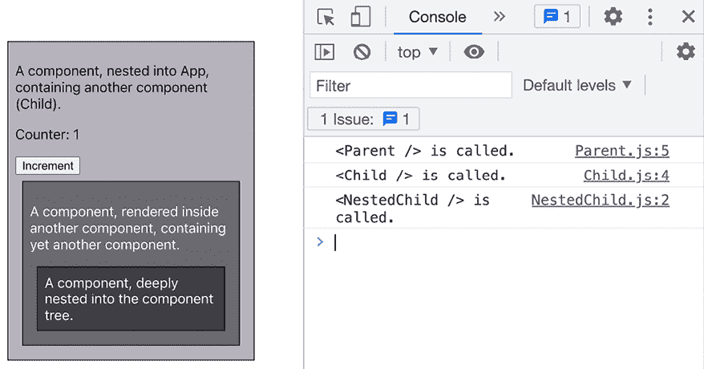

图 10.1：每个组件函数都会执行

在这个屏幕截图中，你可以不仅看到组件是如何嵌套在一起的，还可以看到当点击“增加”按钮时，React 是如何调用所有组件的。即使“子”和“嵌套子”组件没有管理或使用任何状态，它们也会被调用。但既然它们是“父”组件（`Child`）或后代组件（`NestedChild`），而“父”组件确实接收到了状态变化，因此嵌套的组件函数也会被调用。

理解组件函数执行流程的重要性在于，这个流程意味着任何组件函数的调用也会影响其子组件。它还展示了 React 如何频繁地调用组件函数，以及单个状态变化可能影响多少组件函数。

因此，有一个重要的问题需要回答：当调用一个或多个组件函数时，实际的页面 DOM（即浏览器中加载和渲染的网站）会发生什么？DOM 是否被重新创建？渲染的 UI 是否被更新？

## 组件函数被调用时会发生什么

每当组件函数执行时，React 都会评估渲染的 UI（即加载页面的 DOM）是否需要更新。

这很重要：React 会**评估**是否需要更新。它不会自动强制更新！

内部，React 不会用组件（或多个组件）返回的 JSX 代码替换页面 DOM。

这是可以做到的，但这意味着每次组件函数执行都会导致某种形式的 DOM 操作——即使只是用新的、类似的内容替换旧的 DOM 内容。在上面的示例中，每次执行那些组件函数时，都会使用“子”和“嵌套子”JSX 代码来替换当前渲染的 DOM。

正如你在上面的示例中看到的，那些组件函数执行得相当频繁。但返回的 JSX 代码始终相同，因为它是静态的。它不包含任何动态值（例如状态或属性）。

如果实际的页面 DOM 被替换为返回 JSX 代码所表示的 DOM 元素，视觉结果将始终相同。但幕后仍然会有一些 DOM 操作。这是一个问题，因为操作 DOM 是一项性能密集型任务——尤其是在高频操作时。因此，只有在需要时才应该进行 DOM 的删除、添加或更新——而不是不必要的操作。

由于这个原因，React 不会因为组件函数的执行而丢弃当前的 DOM 并替换成新的 DOM（由 JSX 代码表示）。相反，React 首先检查是否需要更新。如果需要，只有需要更改的 DOM 部分才会被替换或更新。

为了确定是否需要更新（以及在哪里），React 使用了一个称为**虚拟 DOM**的概念。

# 虚拟 DOM 与真实 DOM

为了确定是否（以及在哪里）可能需要 DOM 更新，React（特别是`react-dom`包）将当前 DOM 结构与由执行组件函数返回的 JSX 代码隐含的结构进行比较。如果有差异，DOM 将相应更新；否则，保持不变。

然而，正如操作 DOM 相对性能开销较大一样，读取 DOM 也是如此。即使不更改 DOM 中的任何内容，访问它、遍历 DOM 元素并从中推导结构也是您通常希望减少到最小的事情。

如果多个组件函数被执行，并且每个函数都触发一个过程，其中渲染的 DOM 元素被读取并与由调用组件函数隐含的 JSX 结构进行比较，那么在非常短的时间内，渲染的 DOM 将被多次执行读取操作。

对于由数十、数百甚至数千个组件组成的较大 React 应用，在单个秒内可能发生数十次组件函数执行的可能性非常高。如果这导致相同数量的 DOM 读取操作，那么 web 应用对用户来说可能会感觉缓慢或滞后。

这就是为什么 React 不使用真实 DOM 来确定是否需要任何 UI 更新。相反，它内部构建并管理一个虚拟 DOM——这是在浏览器中渲染的 DOM 的内存表示。虚拟 DOM 不是浏览器功能，而是 React 功能。您可以将它想象为一个深度嵌套的 JavaScript 对象，它反映了您的 web 应用的组件，包括所有内置的 HTML 组件，如`<div>`、`<p>`等。（即最终应在页面上显示的实际 HTML 元素）。

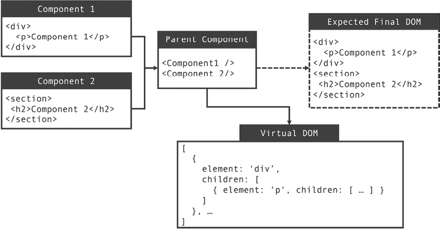

图 10.2：React 管理预期元素结构的虚拟表示

在上面的图中，您可以看到预期的元素结构（换句话说，预期的最终 DOM）实际上存储为一个 JavaScript 对象（或一个包含对象列表的数组）。这是虚拟 DOM，由 React 管理并用于识别所需的 DOM 更新。

**注意**

请注意，虚拟 DOM 的实际结构比图中显示的结构更复杂。上面的图表旨在让您了解虚拟 DOM 是什么以及它可能看起来像什么。它不是 React 管理的 JavaScript 数据结构的精确技术表示。

React 管理这个虚拟 DOM，因为将这个虚拟 DOM 与预期的 UI 状态进行比较，比访问真实 DOM 要少得多，性能开销更小。

每当调用组件函数时，React 会将返回的 JSX 代码与虚拟 DOM 中存储的相关虚拟 DOM 节点进行比较。如果检测到差异，React 将确定需要更新的 DOM 更改。一旦推导出所需的调整，这些更改将应用于虚拟和真实 DOM。这确保了真实 DOM 反映了预期的 UI 状态，而无需不断访问或更新它。

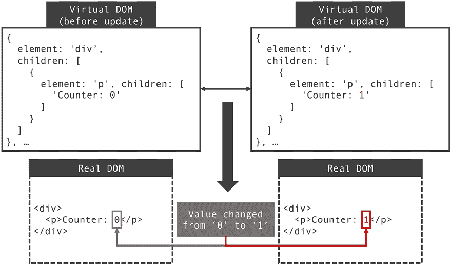

图 10.3：React 通过虚拟 DOM 检测所需的更新

在上面的图中，你可以看到 React 如何首先使用虚拟 DOM 比较当前的 DOM 和预期的结构，然后再去操作真实的 DOM。

作为 React 开发者，你不需要主动与虚拟 DOM 交互。技术上，你甚至不需要知道它的存在以及 React 在内部使用它。但了解你正在使用的工具（在这种情况下是 React）总是有帮助的。了解 React 为你做了各种性能优化，并且你可以在许多其他使你的开发者生活（希望）更轻松的功能之上获得这些优化，这是很好的。

## 状态批处理

由于 React 使用虚拟 DOM 的概念，频繁的组件函数执行并不是一个大问题。但当然，即使比较是在虚拟层面上进行的，仍然有一些内部代码必须执行。即使在虚拟 DOM 的情况下，如果必须进行大量的不必要的（同时相当复杂的）虚拟 DOM 比较，性能可能会下降。

在执行多个连续状态更新时，进行不必要的比较的一个场景是。由于每个状态更新都会导致组件函数再次执行（以及所有潜在的嵌套组件），一起执行（例如，在同一个事件处理函数中）的多个状态更新将导致多次组件函数调用。

考虑这个例子：

```js
function App() {
  const [counter, setCounter] = useState(0);
  const [showCounter, setShowCounter] = useState(false);
  function handleIncCounter() {
    setCounter((prevCounter) => prevCounter + 1);
    setShowCounter(true);
  }
  return (
    <>
      <p>Click to increment + show or hide the counter</p>
      <button onClick={handleIncCounter}>Increment</button>
      {showCounter && <p>Counter: {counter}</p>}
    </>
  );
} 
```

此组件包含两个状态值：`counter`和`showCounter`。当按钮被点击时，计数器增加`1`。此外，`showCounter`被设置为`true`。因此，第一次点击按钮时，`counter`和`showCounter`状态都会发生变化（因为`showCounter`最初为`false`）。

由于有两个状态值被更改，预期 React 会调用`App`组件函数两次——因为每次状态更新都会导致连接的组件函数再次被调用。

然而，如果你在`App`组件函数中添加一个`console.log()`语句（用于跟踪其执行频率），你会看到它只被调用一次，当点击`Increment`按钮时：

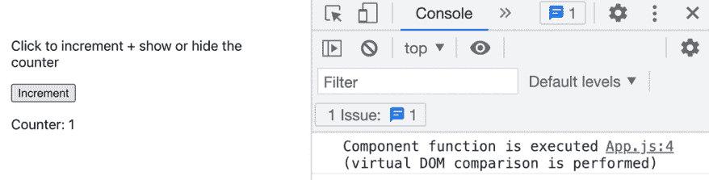

图 10.4：只显示一条控制台日志消息

**注意**

如果你看到两条日志消息而不是一条，请确保你没有使用 React 的“严格模式”。在开发期间运行严格模式时，React 会比通常情况下更频繁地执行组件函数。

如果需要，你可以通过从你的 `main.jsx` 文件中移除 `<React.StrictMode>` 组件来禁用严格模式。你将在本章的末尾了解更多关于 React 严格模式的内容。

这种行为被称为 **状态批处理**。当你的代码中的同一位置（例如，在同一个事件处理函数内部）发起多个状态更新时，React 会执行状态批处理。

这是一个内置的功能，确保你的组件函数不会被调用得比需要的更频繁。这防止了不必要的虚拟 DOM 比较。

状态批处理是一个非常有用的机制。但是，它无法防止另一种不必要的组件评估：当父组件函数被调用时执行的子组件函数。

## 避免不必要的子组件评估

每当组件函数被调用（例如，因为其状态改变），任何嵌套的组件函数也将被调用。请参阅本章的第一部分以获取更多详细信息。

正如你在本章第一部分的例子中所看到的，通常情况下，那些嵌套的组件实际上并不需要再次评估。它们可能不依赖于父组件中改变的状态值。它们甚至可能不依赖于父组件的任何值。

这里有一个例子，其中父组件函数包含一些子组件不使用的状态：

```js
function Error({ message }) {
  if (!message) {
    return null;
  }
  return <p className={classes.error}>{message}</p>;
}
function Form() {
  const [enteredEmail, setEnteredEmail] = useState('');
  const [errorMessage, setErrorMessage] = useState();
  function handleUpdateEmail(event) {
    setEnteredEmail(event.target.value);
  }
  function handleSubmit(event) {
    event.preventDefault();
    if (!enteredEmail.endsWith('.com')) {
      setErrorMessage('Email must end with .com.');
    }
  }
  return (
    <form className={classes.form} onSubmit={handleSubmit}>
      <div className={classes.control}>
        <label htmlFor="email">Email</label>
        <input
          id="email"
          type="email"
          value={enteredEmail}
          onChange={handleUpdateEmail}
        />
      </div>
      <Error message={errorMessage} />
      <button>Sign Up</button>
    </form>
  );
} 
```

**注意**

你可以在 GitHub 上找到完整的示例代码：[`github.com/mschwarzmueller/book-react-key-concepts-e2/tree/10-behind-scenes/examples/03-memo`](https://github.com/mschwarzmueller/book-react-key-concepts-e2/tree/10-behind-scenes/examples/03-memo)。

在这个例子中，`Error` 组件依赖于 `message` 属性，该属性设置为 `Form` 组件中 `errorMessage` 状态存储的值。然而，`Form` 组件还管理一个 `enteredEmail` 状态，该状态没有被 `Error` 组件使用（未通过属性接收）。因此，`enteredEmail` 状态的更改将导致 `Error` 组件再次执行，尽管该组件不需要那个值。

你可以通过向该组件函数添加 `console.log()` 语句来跟踪不必要的 `Error` 组件函数调用：

```js
function Error({ message }) {
  console.log('<Error /> component function is executed.');
  if (!message) {
    return null;
  }
  return <p className={classes.error}>{message}</p>;
} 
```

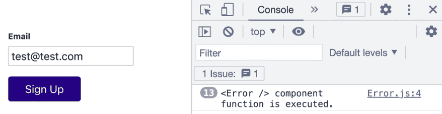

图 10.5：`Error` 组件函数在输入字段上的每次按键都会执行

在前面的屏幕截图中，你可以看到 `Error` 组件函数在输入字段上的每次按键都会执行（即，每次 `enteredEmail` 状态改变时执行一次）。

这与之前你所学的相符，但这也是不必要的。`Error`组件确实依赖于`errorMessage`状态，并且每当该状态发生变化时，都应该重新评估该组件，但显然不需要因为`enteredEmail`状态值更新而执行`Error`组件函数。

正因如此，React 提供了一个内置的函数，你可以用它来控制（并防止）这种行为：`memo()`函数。

`memo`是从`react`导入的，并像这样使用：

```js
**import** **{ memo }** **from****'react'****;**
import classes from './Error.module.css';
function Error({ message }) {
  console.log('<Error /> component function is executed.');
  if (!message) {
    return null;
  }
  return <p className={classes.error}>{message}</p>;
}
export default **memo****(****Error****);** 
```

你用`memo()`包裹应该避免不必要的、由父组件触发的重新评估的组件函数。这会导致 React 检查组件的 props 是否与上一次调用组件函数时有所不同。如果 prop 值相等，React 知道组件函数不需要再次执行。

通过添加`memo()`，可以避免不必要的组件函数调用，如下所示：

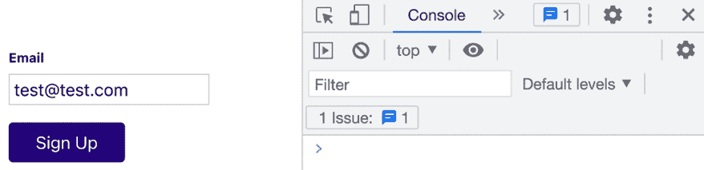

图 10.6：控制台没有出现日志消息

如图中所示，没有消息打印到控制台。这证明了避免了不必要的组件执行（记住：在添加`memo()`之前，许多消息都打印到了控制台）。

`memo()`还接受一个可选的第二个参数，可以用来添加自己的逻辑以确定 prop 值是否已更改。如果你处理的是更复杂的 prop 值（例如，对象或数组），并且可能需要自定义比较逻辑，这可能会很有用，如下面的示例所示：

```js
memo(SomeComponent, function(prevProps, nextProps) {
  return prevProps.user.firstName !== nextProps.user.firstName;
}); 
```

传递给`memo()`的（可选）第二个参数必须是一个函数，该函数自动接收前一个 props 对象和下一个 props 对象。然后，该函数必须返回`true`，如果组件（例如，本例中的`SomeComponent`）应该重新评估，如果不应重新评估则返回`false`。

通常，第二个参数是不需要的，因为`memo()`的默认行为（比较所有 props 的不等性）正是你所需要的。但如果需要更多的定制或控制，`memo()`允许你添加自己的逻辑。

在你的工具箱中有`memo()`后，你会倾向于用`memo()`包裹每一个 React 组件函数。为什么不这样做呢？毕竟，它避免了不必要的组件函数执行。

你当然可以在所有组件上使用它——但这并不一定有帮助，因为使用`memo()`避免不必要的组件重新评估是有代价的：比较 props（旧值与新值）也需要运行一些代码。它不是“免费的”。但这并不是一个巨大的成本。在许多（或所有）组件上使用`memo()`可能不会显著减慢你的应用程序。但如果你有需要大量重新评估的组件，这仍然是多余的。对于接收大量变化的 props 的组件使用`memo()`没有任何实际作用。

因此，如果你有相对简单的属性（即没有需要手动与自定义比较函数比较的深度嵌套对象的属性）并且大多数父组件的状态变化不会影响这些子组件的属性，那么 `memo()` 就非常有意义。即使在那些情况下，如果你有一个相对简单的组件函数（即没有复杂逻辑的函数），使用 `memo()` 仍然可能不会带来任何可衡量的好处。

上面的示例代码（`Error` 组件）是一个很好的例子：从理论上讲，在这里使用 `memo()` 是有意义的。父组件中的大多数状态变化不会影响 `Error`，而且属性比较将会非常简单，因为它只涉及一个属性（`message` 属性，它包含一个字符串）需要比较。但尽管如此，使用 `memo()` 包装 `Error` 很可能并不值得。`Error` 是一个非常基础的组件，其中没有任何复杂的逻辑。如果组件函数频繁调用，这根本无关紧要。因此，在这个位置使用 `memo()` 完全是可以接受的——同样，不使用它也是可以的。

另一个非常适合使用 `memo()` 的地方是位于组件树顶部（或组件树中深度嵌套的组件分支）的组件。如果你能够通过 `memo()` 避免执行该组件的不必要调用，那么你也会隐式地避免执行该组件下所有嵌套组件的不必要调用。这一点在下图中得到了说明：

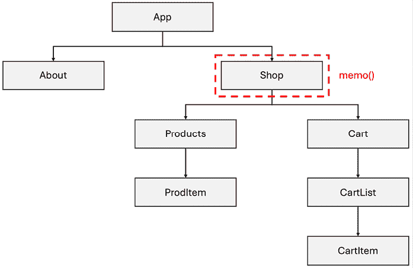

图 10.7：在组件树分支的起始处使用 `memo()`

在前面的图中，`memo()` 被用于 `Shop` 组件，它有多个嵌套的子组件。没有 `memo()` 的情况下，每当 `Shop` 组件函数被调用时，`Products`、`ProdItem`、`Cart` 等也会被执行。有了 `memo()`，假设它能够避免一些 `Shop` 组件函数的不必要调用，所有这些子组件就不再需要评估。

## 避免昂贵的计算

`memo()` 函数可以帮助避免不必要的组件函数执行。正如前文所述，如果组件函数执行了大量工作（例如，对长列表进行排序），这一点尤其有价值。

但作为一个 React 开发者，你也会遇到一些情况，其中你有一个需要因为某些属性值变化而再次执行的工作密集型组件。在这种情况下，使用 `memo()` 无法阻止组件函数再次执行。然而，变化的属性可能并不需要用于组件中作为性能密集型任务执行的部分。

考虑以下示例：

```js
function sortItems(items) {
  console.log('Sorting');
  return items.sort(function (a, b) {
    if (a.id > b.id) {
      return 1;
    } else if (a.id < b.id) {
      return -1;
    }
    return 0;
  });
}
function List({ items, maxNumber }) {
  const sortedItems = sortItems(items);
  const listItems = sortedItems.slice(0, maxNumber);
  return (
    <ul>
      {listItems.map((item) => (
        <li key={item.id}>
          {item.title} (ID: {item.id})
        </li>
      ))}
    </ul>
  );
}
export default List; 
```

`List`组件接收两个 prop 值：`items`和`maxNumber`。然后它调用`sortItems()`按`id`对项目进行排序。之后，排序后的列表限制为一定数量的项目（`maxNumber`）。最后一步，通过 JSX 代码中的`map()`将排序和缩短后的列表渲染到屏幕上。

**注意**

一个完整的示例应用程序可以在 GitHub 上找到，地址为[`github.com/mschwarzmueller/book-react-key-concepts-e2/tree/10-behind-scenes/examples/04-usememo`](https://github.com/mschwarzmueller/book-react-key-concepts-e2/tree/10-behind-scenes/examples/04-usememo)。

根据传递给`List`组件的项目数量，排序可能需要相当长的时间（对于非常长的列表，甚至可能长达几秒钟）。这绝对不是你希望不必要或过于频繁执行的操作。每当`items`发生变化时，都需要对列表进行排序，但如果`maxNumber`发生变化，则不应进行排序——因为这不影响列表中的项目（即，不影响顺序）。但是，根据上面共享的代码片段，`sortItems()`将在两个 prop 值中的任何一个发生变化时执行，无论它是`items`还是`maxNumber`。

因此，当运行应用程序并更改显示的项目数量时，你可以看到多个`"Sorting"`日志消息——这意味着每次更改项目数量时都会执行`sortItems()`。

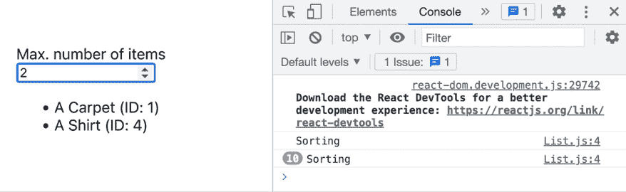

图 10.8：控制台中出现多个“Sorting”日志消息

`memo()`函数在这里无济于事，因为`List`组件函数应该在（并且将会）`items`或`maxNumber`发生变化时执行。`memo()`不能帮助控制组件函数内部的局部代码执行。

为了实现这一点，你可以使用 React 提供的另一个功能：`useMemo()` Hook。

`useMemo()`可以用来包装计算密集型操作。为了正确工作，你还必须定义一个列表，其中包含应导致操作再次执行依赖项。在某种程度上，它与`useEffect()`（它也包装操作并定义依赖项列表）类似，但关键区别在于`useMemo()`与组件函数中的其余代码同时运行，而`useEffect()`在组件函数执行完成后执行包装逻辑。不应使用`useEffect()`来优化计算密集型任务，而应用于副作用。

另一方面，`useMemo()`存在是为了控制性能密集型任务的执行。应用于上述示例，代码可以调整如下：

```js
import { useMemo } from 'react';
function List({ items, maxNumber }) {
  const sortedItems = useMemo(
    function() {
      console.log('Sorting');
      return items.sort(function (a, b) {
        if (a.id > b.id) {
          return 1;
        } else if (a.id < b.id) {
          return -1;
        }
        return 0;
      });
    },
    [items]
  );
  const listItems = sortedItems.slice(0, maxNumber);
  return (
    <ul>
      {listItems.map((item) => (
        <li key={item.id}>
          {item.title} (ID: {item.id})
        </li>
      ))}
    </ul>
  );
}
export default List; 
```

`useMemo()` 包装了一个匿名函数（之前作为命名函数 `sortItems` 存在的函数），其中包含整个排序代码。传递给 `useMemo()` 的第二个参数是函数应再次执行的依赖项数组（当依赖项值发生变化时）。在这种情况下，`items` 是包装函数的唯一依赖项，因此该值被添加到数组中。

使用 `useMemo()` 如此，排序逻辑仅在项目发生变化时执行，而不是在 `maxNumber`（或任何其他内容）发生变化时执行。因此，你会在开发者工具控制台中只看到一次输出“`Sorting`”：

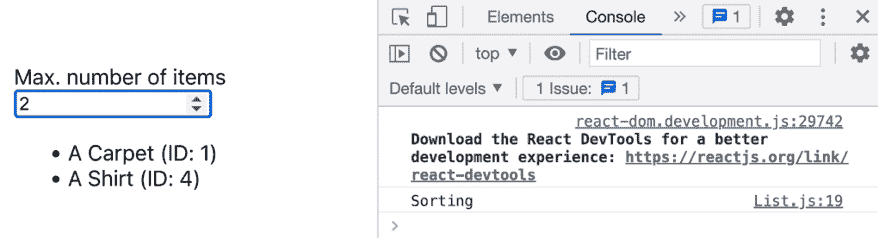

图 10.9：控制台只有一个“排序”输出

`useMemo()` 在控制组件函数内部的代码执行方面非常有用。它可以作为 `memo()`（控制整体组件函数执行）的一个很好的补充。但是，就像 `memo()` 一样，你不应该开始用 `useMemo()` 包装所有的逻辑。仅在使用非常性能密集的计算时使用它，因为检查依赖项变化以及存储和检索过去计算结果（`useMemo()` 内部执行的操作）也会带来性能成本。

## 利用 `useCallback()`

在前面的章节中，你学习了关于 `useCallback()` 的内容。就像 `useMemo()` 可以用于“昂贵”的计算一样，`useCallback()` 可以用来防止不必要的函数重新创建。在本章的上下文中，`useCallback()` 可能很有帮助，因为与 `memo()` 或 `useMemo()` 结合使用时，它可以帮助你避免不必要的代码执行。它可以帮助你处理函数作为属性传递的情况（即你可能使用 `memo()` 的情况）或作为某些“昂贵”计算中的依赖项（即可能通过 `useMemo()` 解决）。

这里有一个例子，说明 `useCallback()` 可以与 `memo()` 结合使用，以防止不必要的组件函数执行：

```js
import { memo } from 'react';
import classes from './Error.module.css';
function Error({ message, onClearError }) {
  console.log('<Error /> component function is executed.');
  if (!message) {
    return null;
  }
  return (
    <div className={classes.error}>
      <p>{message}</p>
      <button className={classes.errorBtn} onClick={onClearError}>X</button>
    </div>
  );
}
export default memo(Error); 
```

`Error` 组件被 `memo()` 函数包装，因此只有在接收到的属性值之一发生变化时才会执行。

`Error` 组件被另一个组件，即 `Form` 组件，这样使用：

```js
function Form() {
  const [enteredEmail, setEnteredEmail] = useState('');
  const [errorMessage, setErrorMessage] = useState();
  function handleUpdateEmail(event) {
    setEnteredEmail(event.target.value);
  }
  function handleSubmit(event) {
    event.preventDefault();
    if (!enteredEmail.endsWith('.com')) {
      setErrorMessage('Email must end with .com.');
    }
  }
  function handleClearError() {
    setErrorMessage(null);
  }
  return (
    <form className={classes.form} onSubmit={handleSubmit}>
      <div className={classes.control}>
        <label htmlFor="email">Email</label>
        <input
          id="email"
          type="email"
          value={enteredEmail}
          onChange={handleUpdateEmail}
        />
      </div>
      <Error message={errorMessage} onClearError={handleClearError} />
      <button>Sign Up</button>
    </form>
  );
} 
```

在这个组件中，`Error` 组件接收对 `handleClearError` 函数的指针（作为 `onClearError` 属性的值）。你可能还记得本章早期（在 *避免不必要的子组件评估* 部分中）的一个非常类似的例子。在那里，`memo()` 被用来确保当 `enteredEmail` 发生变化时，`Error` 组件函数不会被调用（因为它的值在 `Error` 组件函数中根本未使用）。

现在，随着调整后的示例和将 `handleClearError` 函数指针传递给 `Error`，`memo()` 很遗憾不再阻止组件函数的执行了。为什么？因为在 JavaScript 中，函数是对象，而 `handleClearError` 函数在每次 `Form` 组件函数执行时都会被重新创建（这发生在每次状态变化时，包括 `enteredEmail` 状态的变化）。

由于每次状态变化都会创建一个新的函数对象，因此 `handleClearError` 在技术上对于 `Form` 组件的每次执行都是一个不同的值。因此，每当 `Form` 组件函数被调用时，`Error` 组件都会接收到一个新的 `onClearError` 属性值。对于 `memo()` 来说，旧的和新旧的 `handleClearError` 函数对象是不同的，因此它不会阻止 `Error` 组件函数再次运行。

这正是 `useCallback()` 可以帮助的地方：

```js
const handleClearError = useCallback(() => {
  setErrorMessage(null);
}, []); 
```

通过使用 `useCallback()` 包装 `handleClearError`，可以防止函数的重新创建，因此不会将新的函数对象传递给 `Error` 组件。因此，`memo()` 能够检测旧的和新的 `onClearError` 属性值之间的相等性，并再次防止不必要的函数组件执行。

同样，`useCallback()` 可以与 `useMemo()` 结合使用。如果 `useMemo()` 包装的计算密集型操作使用函数作为依赖项，你可以使用 `useCallback()` 来确保这个依赖函数不会被不必要地重新创建。

## 使用 React 编译器

考虑和使用 `memo()`、`useMemo()` 和 `useCallback()` 来防止不必要的组件重新评估可能是一项繁琐的工作。尽管性能优化很重要，但作为一名 React 开发者，你通常希望专注于构建出色的 UI 并在其中实现有用的功能。

正是因此，React 团队开发了一个旨在为你优化代码的编译器——一个可以添加到 React 项目中的独立工具，该工具将自动使用 `memo()` 包装你的组件，在需要时使用 `useMemo()`，并使用 `useCallback()` 包装函数。

因此，当使用此编译器时，你不必再考虑或使用这些优化函数和 Hook 了。

换句话说，React 编译器会为你优化代码。至少，这是理论上的。

然而，在撰写本文时，此编译器仅以实验模式提供。这意味着你不应该将其用于生产，并且可能存在错误或次优编译结果。

尽管如此，你可以在使用 React 19 或更高版本的项目上尝试它（编译器不适用于旧版本的 React）。

将编译器添加到项目中很容易，因为它只是一个额外的依赖项，必须在你的项目中安装：

```js
npm install babel-plugin-react-compiler 
```

**注意**

由于编译器尚未稳定，安装步骤和使用说明可能会随时间而变化。

因此，你应该访问官方 React 编译器文档页面以获取最新细节和说明：[`react.dev/learn/react-compiler`](https://react.dev/learn/react-compiler)。

安装了编译器插件后，你必须调整你的构建过程配置，以便使用编译器。当在一个基于 Vite 的项目上工作时，你只需编辑`vite.config.js`文件，该文件应位于你的根项目文件夹中：

```js
// vite.config.js
const ReactCompilerConfig = { /* ... */ };
export default defineConfig(() => {
  return {
    plugins: [
      react({
        babel: {
          plugins: [
            ["babel-plugin-react-compiler", ReactCompilerConfig],
          ],
        },
      }),
    ],
    // ...
  };
}); 
```

如果你使用的是其他项目设置，可以遵循官方编译器文档页面上的安装说明。

安装了编译器后，它将自动执行以分析和调整你的代码，包括`memo()`或`useMemo()`等优化。请记住，这些优化是在运行`npm run dev`或`npm run build`触发的构建过程中执行的。因此，你的原始源代码不会改变——相反，编译器会在幕后优化你的代码。

一旦 React 编译器稳定，它很可能成为每个 React 项目构建过程的一部分的标准工具。因此，你将不再需要在代码中手动使用`memo()`、`useMemo()`或`useCallback()`。但在那之前，或者在无法使用编译器的 React 项目中，你仍然需要手动优化代码。

# 避免不必要的代码下载

到目前为止，这一章主要讨论了避免不必要的代码执行的战略。但问题不仅在于代码的执行。如果你的网站访客需要下载大量可能根本不会执行的代码，那也不是什么好事。因为每下载一千字节 JavaScript 代码都会减慢你网页的初始加载时间——这不仅是因为下载代码包所需的时间（如果用户在慢速网络且代码包很大，这可能会非常显著），而且因为浏览器必须在你的页面变得交互之前解析所有下载的代码。

因此，社区和生态系统投入了大量努力来减少 JavaScript 代码包的大小。最小化（自动缩短变量名和其他减少最终代码的措施）和压缩可以极大地帮助，因此这是一种常见的技巧。实际上，使用 Vite 创建的项目已经自带了构建工作流程（通过运行`npm run build`启动），这将生成尽可能小的生产优化代码包。

但你也可以采取一些步骤来减少整体代码包的大小：

1.  尽量编写简短和简洁的代码。

1.  在包含第三方库时要深思熟虑，除非你真的需要，否则不要使用它们。

1.  考虑使用代码拆分技术。

第一点应该是相当明显的。如果你写的代码越少，你的网站访客需要下载的代码也就越少。因此，尽量简洁并编写优化后的代码是有意义的。

第二点也应该是有意义的。对于某些任务，你实际上可以通过包含可能比你自己编写的代码更复杂的第三方库来节省代码。但也有一些情况和任务，你可能可以通过编写自己的代码或使用一些内置函数来避免包含第三方库。你至少应该始终考虑这种替代方案，并且只包含你绝对需要的第三方库。

最后一点是 React 可以帮助解决的问题。

## 通过代码拆分（懒加载）减少包大小

React 提供了一个 `lazy()` 函数，可以用来有条件地加载组件代码——这意味着只有在实际需要时（而不是一开始）才会加载。

考虑以下由两个组件协同工作的例子。

`DateCalculator` 组件的定义如下：

```js
import { useState } from 'react';
import { add, differenceInDays, format, parseISO } from 'date-fns';
import classes from './DateCalculator.module.css';
const initialStartDate = new Date();
const initialEndDate = add(initialStartDate, { days: 1 });
function DateCalculator() {
  const [startDate, setStartDate] = useState(
    format(initialStartDate, 'yyyy-MM-dd')
  );
  const [endDate, setEndDate] = useState(
    format(initialEndDate, 'yyyy-MM-dd')
  );
  const daysDiff = differenceInDays(
    parseISO(endDate), 
    parseISO(startDate)
  );
  function handleUpdateStartDate(event) {
    setStartDate(event.target.value);
  }
  function handleUpdateEndDate(event) {
    setEndDate(event.target.value);
  }
  return (
    <div className={classes.calculator}>
      <p>Calculate the difference (in days) between two dates.</p>
      <div className={classes.control}>
        <label htmlFor="start">Start Date</label>
        <input
          id="start"
          type="date"
          value={startDate}
          onChange={handleUpdateStartDate}
        />
      </div>
      <div className={classes.control}>
        <label htmlFor="end">End Date</label>
        <input
          id="end"
          type="date"
          value={endDate}
          onChange={handleUpdateEndDate}
        />
      </div>
      <p className={classes.difference}>
        Difference: {daysDiff} days
      </p>
    </div>
  );
}
export default DateCalculator; 
```

然后，`DateCalculator` 组件由 `App` 组件有条件地渲染：

```js
import { useState } from 'react';
import DateCalculator from './components/DateCalculator.jsx';
function App() {
  const [showDateCalc, setShowDateCalc] = useState(false);
  function handleOpenDateCalc() {
    setShowDateCalc(true);
  }
  return (
    <>
      <p>This app might be doing all kinds of things.</p>
      <p>
        But you can also open a calculator which calculates 
        the difference between two dates.
      </p>
      <button onClick={handleOpenDateCalc}>Open Calculator</button>
      **{showDateCalc &&** **<****DateCalculator** **/>****}**
    </>
  );
}
export default App; 
```

在这个例子中，`DateCalculator` 组件使用第三方库（`date-fns` 库）来访问各种日期相关实用函数（例如，计算两个日期之间差异的函数，或 `differenceInDays`）。

该组件接受两个日期值，并计算这两个日期之间的天数差异——尽管组件的实际逻辑在这里并不重要。重要的是，使用了第三方库和各种实用函数。这给整体代码包增加了相当多的 JavaScript 代码，并且所有这些代码都必须在第一次加载整个网站时下载，即使那时日期计算器甚至都不可见（因为它是有条件渲染的）。

在构建用于生产的应用程序（通过 `npm run build`）后，当预览该生产版本（通过 `npm run preview`）时，你可以在以下屏幕截图中看到下载了一个主要的代码包文件：

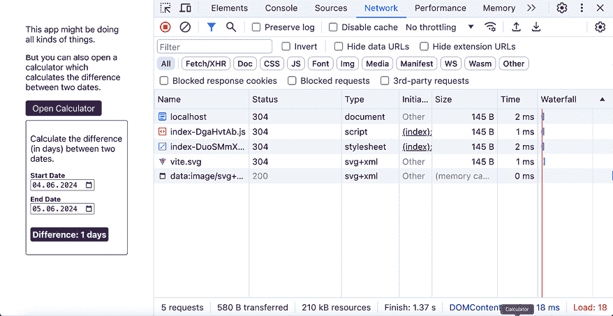

图 10.10：下载了一个主要的包文件

浏览器开发者工具中的“网络”选项卡揭示了发出的网络请求。正如你在屏幕截图中看到的，下载了一个主要的 JavaScript 包文件。当点击按钮时，你不会看到任何额外的请求被发送。这表明所有代码，包括 `DateCalculator` 所需的代码，都是一开始就下载的。

这就是 React 的 `lazy()` 函数进行代码拆分变得有用的地方。

这个函数可以围绕动态导入包装，以便仅在需要时加载导入的组件。

**注意**

动态导入是原生 JavaScript 功能，允许动态导入 JavaScript 代码文件。有关此主题的更多信息，请访问 [`developer.mozilla.org/en-US/docs/Web/JavaScript/Reference/Operators/import`](https://developer.mozilla.org/en-US/docs/Web/JavaScript/Reference/Operators/import)。

在前面的例子中，它将在 `App` 组件文件中这样使用：

```js
import { lazy, useState } from 'react';
**const****DateCalculator** **=** **lazy****(****() =>****import****(**
**'./components/DateCalculator.jsx'**
 **)**
**);**
function App() {
  const [showDateCalc, setShowDateCalc] = useState(false);
  function handleOpenDateCalc() {
    setShowDateCalc(true);
  }
  return (
    <>
      <p>This app might be doing all kinds of things.</p>
      <p>
        But you can also open a calculator which calculates 
        the difference between two dates.
      </p>
      <button onClick={handleOpenDateCalc}>Open Calculator</button>
      {showDateCalc && <DateCalculator />}
    </>
  );
}
export default App; 
```

仅此还不够。你还必须将条件 JSX 代码（其中使用了动态导入的组件）包装在 React 提供的另一个组件 `<Suspense>` 中，如下所示：

```js
import { lazy, **Suspense**, useState } from 'react';
const DateCalculator = lazy(() => import(
    './components/DateCalculator.jsx'
  )
);
function App() {
  const [showDateCalc, setShowDateCalc] = useState(false);
  function handleOpenDateCalc() {
    setShowDateCalc(true);
  }
  return (
    <>
      <p>This app might be doing all kinds of things.</p>
      <p>
        But you can also open a calculator which calculates 
        the difference between two dates.
      </p>
      <button onClick={handleOpenDateCalc}>Open Calculator</button>
      **<****Suspense****fallback****=****{****<****p****>****Loading...****</****p****>****}>**
        {showDateCalc && <DateCalculator />}
      **</****Suspense****>**
    </>
  );
}
export default App; 
```

**注意**

你可以在 GitHub 上找到完成的示例代码：[`github.com/mschwarzmueller/book-react-key-concepts-e2/tree/10-behind-scenes/examples/06-code-splitting`](https://github.com/mschwarzmueller/book-react-key-concepts-e2/tree/10-behind-scenes/examples/06-code-splitting)。

`Suspense` 是 React 内置的一个组件，旨在在加载某些资源或数据时显示回退内容。因此，当用于懒加载时，你必须将其包装在任何使用 React 的 `lazy()` 函数的条件的代码周围。`Suspense` 还有一个必须提供的强制属性，即 `fallback` 属性，它期望一个 JSX 值，该值将在动态加载的内容可用之前作为回退内容渲染。

`lazy()` 导致整体 JavaScript 代码被拆分为多个包。包含 `DateCalculator` 组件（及其依赖项，如 `date-fns` 库代码）的包只有在需要时才会下载——也就是说，当在 `App` 组件中点击按钮时。如果下载需要更长的时间，那么在 `Suspense` 的同时，屏幕上会显示回退内容。

**注意**

React 的 `Suspense` 组件不仅限于与 `lazy()` 函数一起使用。第十四章，*使用 React Router 管理数据*，和第十七章，*理解 React Suspense 与 use() 钩子*，将探讨如何使用 `Suspense` 组件在加载数据时显示回退内容。

添加 `lazy()` 和 `Suspense` 组件后，最初下载的包会更小。此外，如果点击按钮，还会下载更多的代码文件：

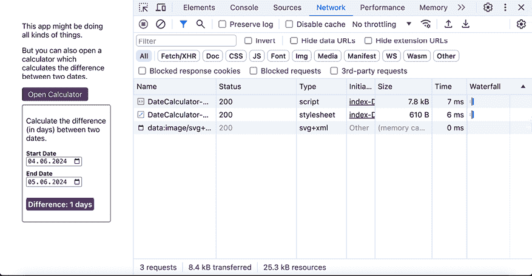

图 10.11：点击按钮后，会下载额外的代码文件

就像迄今为止描述的所有其他优化技术一样，`lazy()` 函数并不是你应该开始围绕所有导入进行包装的函数。如果一个导入的组件非常小且简单（并且不使用任何第三方代码），拆分代码实际上并不值得，尤其是考虑到下载额外包所需的额外 HTTP 请求也带来了一些开销。

在那些一开始就会加载的组件上使用 `lazy()` 也没有意义。只有考虑在条件加载的组件上使用它。

# Strict Mode

在本章中，你学习了关于 React 内部结构和各种优化技术的很多内容。虽然这不是一种优化技术，但仍然相关，React 还提供了一个名为 **Strict Mode** 的功能。

你可能之前遇到过这样的代码：

```js
import React from 'react';
// ... other code ...
root.render(<React.StrictMode><App /></React.StrictMode >); 
```

`<React.StrictMode>` 是 React 提供的另一个内置组件。它不会渲染视觉元素，但它将启用一些额外的检查，这些检查由 React 在幕后执行。

大多数检查都与识别不安全或过时代码（即未来将被移除的功能）的使用相关。但也有一些检查旨在帮助你识别代码中可能存在的问题。

例如，当使用严格模式时，React 将执行组件函数两次，并在组件首次挂载时卸载和重新挂载每个组件。这样做是为了确保你以一致和正确的方式管理你的状态和副作用（例如，确保你的副作用函数中有清理函数）。

**注意**

严格模式（Strict Mode）仅影响你的应用程序及其在开发过程中的行为。一旦你为生产环境构建了应用程序，它就不会再影响你的应用程序。在生产环境中，不会执行额外的检查，例如双重组件函数执行。

启用严格模式构建 React 应用程序有时可能会导致混淆或令人烦恼的错误消息。例如，你可能会想知道为什么你的组件副作用执行得太频繁。

因此，是否使用严格模式是你个人的决定。启用它可以帮助你及早捕获和修复错误。

# 调试代码和 React 开发者工具

在本章的早期，你了解到组件函数可能会非常频繁地执行，并且你可以使用 `memo()` 和 `useMemo()`（以及你不应该总是阻止它们）来防止不必要的执行。

通过在组件函数内部添加 `console.log()` 来识别组件执行是获取组件洞察的一种方法。这是本章使用的方法。然而，对于拥有数十、数百甚至数千个组件的大型 React 应用程序，使用 `console.log()` 可能会变得繁琐。

正因如此，React 团队也构建了一个官方工具来帮助获取应用程序洞察。React 开发者工具是一个可以安装在所有主要浏览器（Chrome、Firefox 和 Edge）上的扩展程序。你可以通过在网络上搜索 `"<你的浏览器> react 开发者工具"`（例如，*chrome react 开发者工具*）来查找并安装该扩展程序。

安装扩展程序后，你可以直接从浏览器内部访问它。例如，当使用 Chrome 时，你可以直接从 Chrome 的开发者工具（可以通过 Chrome 的菜单打开）中访问 React 开发者工具扩展程序。探索特定扩展程序的文档（在你的浏览器扩展商店中）以获取有关如何访问它的详细信息。

React 开发者工具扩展提供了两个区域：一个 `Components` 页面和一个 `Profile` 页面：

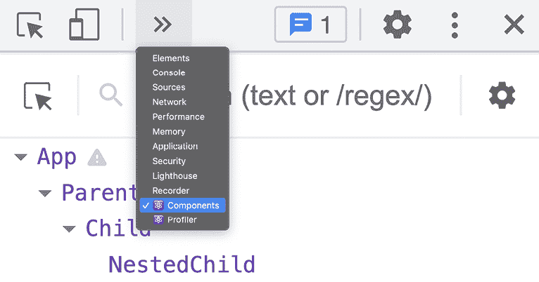

图 10.12：React 开发者工具可以通过浏览器开发者工具访问

`Components`页面可以用来分析当前渲染页面的组件结构。你可以使用这个页面来了解你的组件结构（即“组件树”），组件是如何嵌套在一起的，甚至组件的配置（属性、状态）。

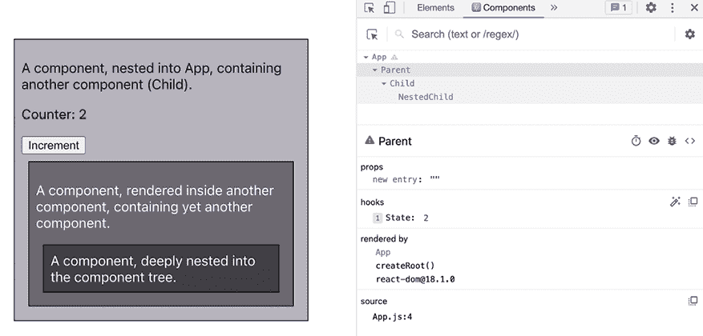

图 10.13：组件关系和数据展示

当尝试理解组件的当前状态、组件与其他组件的关系以及哪些其他组件可能因此影响组件（例如，导致它重新评估）时，这个页面非常有用。

然而，在本章的上下文中，更有用的页面是`Profiler`页面：

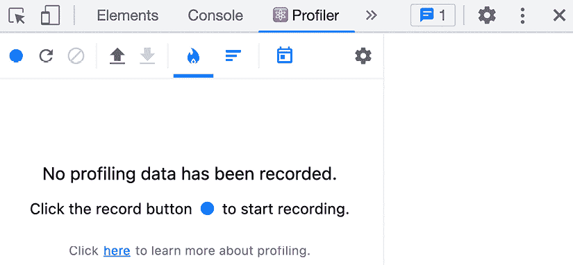

图 10.14：分析器页面（没有收集任何数据）

在这个页面上，你可以开始记录组件评估（即组件函数执行）。你可以通过简单地点击左上角的`Record`按钮（蓝色圆圈）来完成此操作。然后，此按钮将被`Stop`按钮替换，你可以点击它来结束记录。

在记录 React 应用几秒钟（并在该期间与之交互）后，一个示例结果可能看起来像这样：

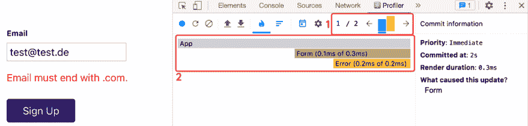

图 10.15：记录完成后，分析器页面显示了各种条形图

这个结果由两个主要区域组成：

+   一系列条形图，表示组件重新评估的次数（每个条形图反映一个影响了零个或多个组件的重新评估周期）。你可以点击这些条形图来探索特定周期更详细的信息。

+   对于所选的评估周期，会显示受影响组件的列表。你可以很容易地识别受影响的组件，因为它们的条形图被着色，并且会显示它们的计时信息。

你可以从*1*（在这种情况下，这个记录会话有两个）选择任何渲染周期来查看哪些组件受到了影响。窗口的底部部分（*2*）通过突出显示它们并用某种颜色标记，显示了所有受影响的组件，并输出了组件重新评估所花费的总时间（例如，`0.1ms of 0.3ms`）。

**注意**

值得注意的是，这个工具还证明组件评估非常快——重新评估一个组件的`0.1ms`对于任何人类来说都太快，以至于无法意识到幕后发生了什么。

在窗口的右侧，你还可以了解更多关于这个组件评估周期的信息。例如，你可以了解它是如何被触发的。在这种情况下，它是由`Form`组件触发的（这与本章前面在*避免不必要的子组件评估*部分讨论的例子相同）。

因此，`Profiler`页面也可以帮助你识别组件评估周期并确定哪些组件受到影响。在这个例子中，如果你将`memo()`函数包裹在`Error`组件周围，你可以看到差异：

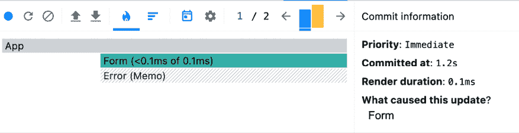

图 10.16：只有表单组件受到影响，而不是错误组件

在将`memo()`函数作为包装器重新添加到`Error`组件（如本章前面所述）之后，你可以使用 React 开发者工具的`Profiler`页面来确认`Error`组件不再被不必要地评估。为此，你应该开始一个新的录制会话并重现之前没有`memo()`时`Error`组件会被再次调用的情景。

在`Profiler`窗口中，`Error`组件上对角线的灰色线条表示该组件未受到其他组件函数调用的任何影响。

因此，可以使用 React 开发者工具来深入了解你的 React 应用和组件。你可以在组件函数中调用`console.log()`的同时使用它们，或者完全替代调用`console.log()`。

# 摘要和关键要点

+   当 React 组件的状态发生变化或父组件被评估时，它们会被重新评估（执行）。

+   React 通过首先使用虚拟 DOM 来计算所需的 UI 更改，从而优化组件评估。

+   同时在同一位置发生的多个状态更新会被 React 批处理在一起。这确保了避免不必要的组件评估。

+   `memo()`函数可以用来控制组件函数的执行。

+   `memo()`函数会查找属性值的变化（旧属性与新属性之间的差异），以确定组件函数是否需要再次执行。

+   `useMemo()`可以用来包装性能密集型计算，并且只有在关键依赖项发生变化时才执行这些计算。

+   由于`memo()`和`useMemo()`也会带来成本（比较操作），因此应谨慎使用它们。

+   当使用 React 19 或更高版本时，你可以安装并启用（实验性的）React 编译器，以在构建过程中自动优化你的代码。

+   可以通过`lazy()`函数（与内置的`Suspense`组件结合使用）的帮助，通过代码拆分来减少初始代码下载的大小。

+   可以通过内置的`<React.StrictMode>`组件启用 React 的严格模式，以执行各种额外检查并检测应用程序中的潜在错误。

+   可以使用 React 开发者工具来深入了解你的 React 应用（例如，组件结构和重新评估周期）。

## 接下来是什么？

作为一名开发者，你应该始终了解并理解你所使用的工具——在本例中是 React。

本章使您更好地了解了 React 在底层的工作原理以及自动实现的优化。此外，您还了解了您可以实施的多种优化技术。

下一章将回到解决您在尝试构建 React 应用程序时可能遇到的实际问题。您将学习更多关于可以用于解决与组件和应用状态管理相关的更复杂问题的技术和功能，而不是优化 React 应用程序。

## 测试您的知识！

通过回答以下问题来测试您对本章涵盖的概念的了解。然后，您可以比较您的答案与可在[`github.com/mschwarzmueller/book-react-key-concepts-e2/blob/10-behind-scenes/exercises/questions-answers.md`](https://github.com/mschwarzmueller/book-react-key-concepts-e2/blob/10-behind-scenes/exercises/questions-answers.md)找到的示例：

1.  为什么 React 使用虚拟 DOM 来检测所需的 DOM 更新？

1.  当组件函数执行时，真实 DOM 会受到什么影响？

1.  哪些组件是`memo()`函数的优秀候选者？哪些组件是不合适的候选者？

1.  `useMemo()`与`memo()`有何不同？

1.  代码拆分和`lazy()`函数背后的理念是什么？

# 应用您所学到的知识

在您对 React 内部结构和可以用于改进您的应用程序的一些优化技术有了新的了解之后，您现在可以在以下活动中应用这些知识。

## 活动十.1：优化现有应用程序

在这个活动中，您将获得一个可以优化多个位置的现有 React 应用程序。您的任务是识别优化机会并实施适当的解决方案。请记住，过多的优化实际上可能导致结果更差。

**注意**

您可以在[`github.com/mschwarzmueller/book-react-key-concepts-e2/tree/10-behind-scenes/activities/practice-1-start`](https://github.com/mschwarzmueller/book-react-key-concepts-e2/tree/10-behind-scenes/activities/practice-1-start)找到这个活动的起始代码。在下载此代码时，您将始终下载整个仓库。请确保然后导航到包含起始代码的子文件夹（在本例中为`activities/practice-1-start`），以使用正确的代码快照。

提供的项目还使用了之前章节中介绍的一些许多功能。花时间分析它并理解提供的代码。这是一个很好的实践，让您看到许多关键概念的实际应用。

下载代码并在项目文件夹中运行`npm install`（安装所有必需的依赖项）后，您可以通过`npm run dev`启动开发服务器。结果，当访问`localhost:5173`时，您应该看到以下 UI：

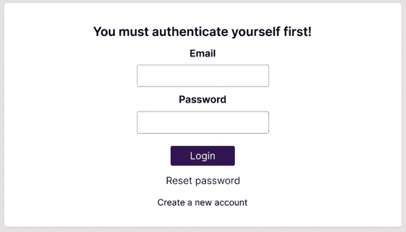

图 10.17：运行中的起始项目

仔细熟悉提供的项目。在 UI 中尝试不同的按钮，在表单输入字段中填写一些示例数据，并分析提供的代码。请注意，此示例项目不会向任何服务器发送任何 HTTP 请求。所有输入的数据一旦输入即被丢弃。

要完成此活动，解决方案步骤如下：

1.  通过寻找不必要的组件函数执行来寻找优化机会。

1.  还应识别组件函数内部不必要的代码执行（其中无法阻止整个组件函数的调用）。

1.  确定哪些代码可以懒加载而不是立即加载。

1.  使用`memo()`函数、`useMemo()` Hook 和 React 的`lazy()`函数来改进代码。

如果你能在浏览器开发者工具的**网络**标签页中看到点击**重置密码**或**创建新账户**按钮时额外的代码获取网络请求，那么你可以知道你提出了一个好的解决方案和合理的调整：

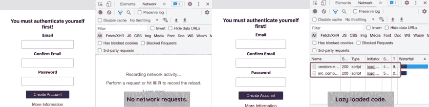

图 10.18：在最终解决方案中，一些代码是懒加载的

此外，当在注册表单（即点击**创建新账户**时切换到的表单）的电子邮件输入字段（**电子邮件**和**确认电子邮件**）中输入时，不应看到任何`Validated password.`控制台消息：

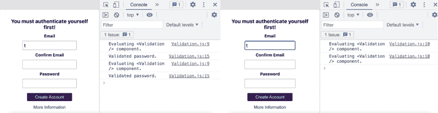

图 10.19：控制台没有“验证密码。”输出

点击**更多信息**按钮时，也不应该有任何控制台输出：

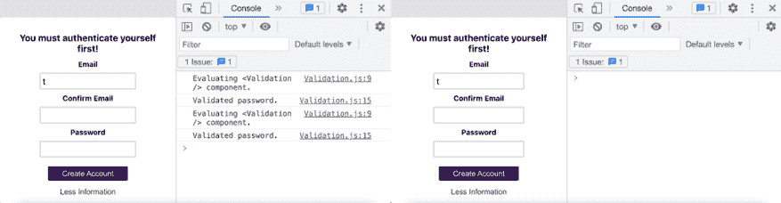

图 10.20：点击“更多信息”时没有控制台消息

**注意**

所有用于此活动的代码文件和解决方案都可以在[`github.com/mschwarzmueller/book-react-key-concepts-e2/tree/10-behind-scenes/activities/practice-1`](https://github.com/mschwarzmueller/book-react-key-concepts-e2/tree/10-behind-scenes/activities/practice-1)找到。
