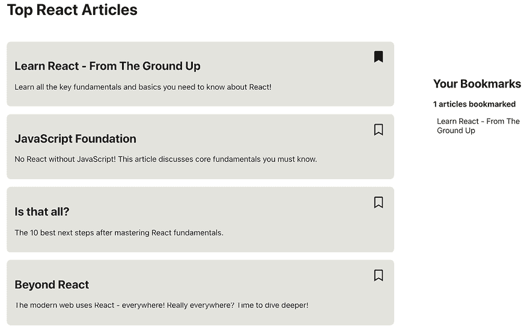
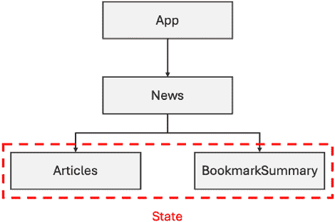
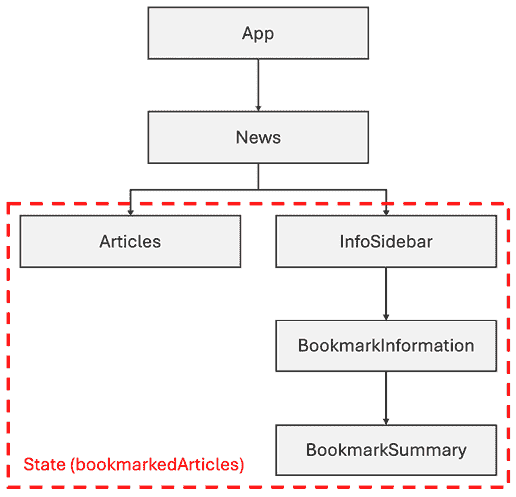
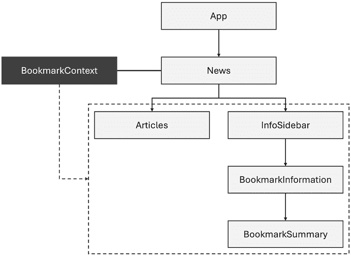
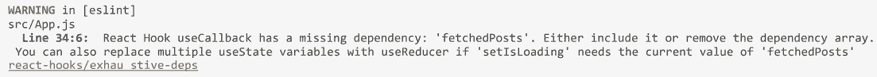
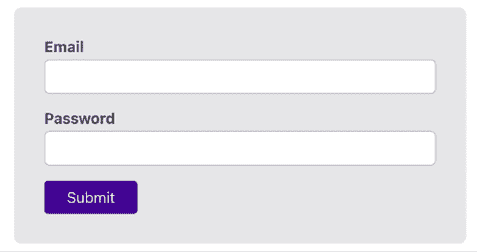

# 第十一章：处理复杂状态

学习目标

到本章结束时，你将能够做到以下几点：

+   管理跨组件或甚至应用级别的状态（而不仅仅是组件特定的状态）

+   在多个组件间分配数据

+   处理复杂的状态值和变化

# 简介

状态是您必须理解（并与之合作）以有效使用 React 的核心概念之一。基本上，每个 React 应用都会在许多组件间使用（许多）状态值来呈现动态、反应式的用户界面。

从包含变化的计数器或用户输入的值的简单状态值，到更复杂的状态值，如多个表单输入的组合或用户身份验证信息，状态无处不在。在 React 应用中，它通常借助`useState()`钩子来管理。

然而，一旦你开始构建更复杂的 React 应用（例如，在线商店、管理仪表板和类似网站），你可能会面临与状态相关的各种挑战。状态值可能在组件 A 中使用，但在组件 B 中更改，或者由多个可能因多种原因而变化的动态值组成（例如，在线商店中的购物车，它是由产品组合而成的，每个产品都有数量、价格，以及可能单独更改的其他属性）。

你可以使用`useState()`、props 以及本书迄今为止涵盖的其他概念来处理所有这些问题。但你会注意到，仅基于`useState()`的解决方案会变得复杂，难以理解和维护。这就是为什么 React 提供了更多工具——为这类问题创建的工具，本章将突出和讨论这些工具。

# 跨组件状态的问题

你甚至不需要构建一个高度复杂的 React 应用，就可能会遇到一个常见问题：跨越多个组件的状态。

例如，你可能正在构建一个新闻应用，用户可以标记某些文章。一个简单的用户界面可能看起来像这样：



图 11.1：一个示例用户界面

正如前图所示，文章列表在左侧，而已标记文章的摘要可以在右侧的侧边栏中找到。

一种常见的解决方案是将这个用户界面拆分成多个组件。具体来说，文章列表可能将作为一个独立的组件——就像书签摘要侧边栏一样。

然而，在这种情况下，这两个组件都需要访问相同的共享状态——即已标记文章的列表。文章列表组件需要访问权限以便添加（或删除）文章。书签摘要侧边栏组件也需要它，因为它需要显示已标记的文章。

这种类型的应用的组件树和状态使用可能看起来像这样：



图 11.2：两个兄弟组件共享相同的状态

在这个图中，你可以看到状态在这两个组件之间是共享的。你还可以看到这两个组件有一个共享的父组件（在这个例子中是 `News` 组件）。

由于状态被两个组件使用，你不会在任何一个组件中管理它。相反，它被*提升*，如*第四章*，*与事件和状态一起工作*（在*提升状态*部分）中所述。当提升状态时，状态值和指向操作状态值的函数的指针通过 props 传递给实际需要访问的组件。

这可行，并且是一个常见的模式。你可以（并且应该）继续使用它。但如果需要访问某些共享状态的组件深深嵌套在其他组件中怎么办？如果前一个例子中的应用组件树看起来像这样？



图 11.3：具有多层状态相关组件的组件树

在这个图中，你可以看到 `BookmarkSummary` 组件是一个深层嵌套的组件。在它和 `News` 组件（管理共享状态）之间，还有两个其他组件：`InfoSidebar` 组件和 `BookmarkInformation` 组件。在更复杂的 React 应用中，像这个例子中这样有多个组件嵌套层级是非常常见的。

当然，即使有这些额外的组件，状态值仍然可以通过 props 传递。你只需要在持有状态的组件和需要状态的组件之间添加 props。例如，你必须通过 props 将 `bookmarkedArticles` 状态值传递给 `InfoSidebar` 组件，这样该组件就可以将其转发给 `BookmarkInformation`：

```js
import BookmarkInformation from
  '../BookmarkSummary/BookmarkInformation.jsx';
import classes from './InfoSidebar.module.css';
function InfoSidebar({ bookmarkedArticles }) {
  return (
    <aside className={classes.sidebar}>
      <BookmarkInformation bookmarkedArticles={bookmarkedArticles} />
    </aside>
  );
}
export default InfoSidebar; 
```

同样的过程在 `BookmarkInformation` 组件内部重复。

**注意**

你可以在 GitHub 上找到完整的示例：[`github.com/mschwarzmueller/book-react-key-concepts-e2/tree/11-complex-state/examples/01-cross-cmp-state`](https://github.com/mschwarzmueller/book-react-key-concepts-e2/tree/11-complex-state/examples/01-cross-cmp-state)。

这种模式被称为**属性钻取**。属性钻取意味着状态值通过 props 在多个组件之间传递。并且它通过根本不需要状态的组件传递——除了将其转发给子组件（如前一个例子中的 `InfoSidebar` 和 `BookmarkInformation` 组件所做的那样）。

作为一名开发者，你通常会想避免这种模式，因为属性钻取有几个弱点：

+   属于属性钻取的组件（例如 `InfoSidebar` 或 `BookmarkInformation`）实际上已经不能再重用了，因为任何想要使用它们的组件都必须为转发状态属性提供一个值。

+   属性钻取还会导致大量的开销代码需要编写（接受 props 和转发 props 的代码）。

+   重构组件变得更加困难，因为必须添加或删除状态 props。

因此，只有当所有涉及的组件仅用于整个 React 应用的特定部分，并且重用或重构它们的可能性很低时，才接受属性钻探。

由于在大多数情况下应避免使用开孔钻探，React 提供了一个替代方案：**上下文** API。

# 使用上下文处理多组件状态

React 的上下文功能允许你创建一个可以轻松地在所需组件之间共享的值，而无需使用属性。



图 11.4：React 上下文附加到组件上，以便将其暴露给所有子组件——无需属性钻探

使用上下文 API 是一个多步骤的过程，其步骤在此处描述：

1.  你必须创建一个应该共享的上下文值。

1.  需要访问上下文对象的组件必须在父组件中提供上下文。

1.  需要访问（读取或写入）的组件必须订阅上下文。

React 内部管理和自动分发上下文值（及其更改）到所有已订阅上下文的组件。

然而，在任何一个组件可以订阅之前，第一步是创建一个上下文对象。这是通过 React 的 `createContext()` 函数完成的：

```js
import { createContext } from 'react';
createContext('Hello Context'); // a context with an initial string value
createContext({}); // a context with an initial (empty) object as a value 
```

此函数接受一个初始值，该值应该被共享。它可以任何类型的值（例如，字符串或数字），但通常是一个对象。这是因为大多数共享值都是实际值和应该操作这些值的函数的组合。所有这些都被组合成一个单独的上下文对象。

当然，如果需要，初始上下文值也可以是一个空值（例如，`null`、`undefined`、空字符串等）。

`createContext()` 还返回一个值：一个上下文对象，应该存储在一个大写变量（或常量）中，因为它实际上是一个 React 组件（React 组件应以大写字母开头）。

这是如何调用 `createContext()` 函数来为本章前面讨论的示例创建上下文对象的方法：

```js
import { createContext } from 'react';
const BookmarkContext = createContext({
  bookmarkedArticles: []
});
export default BookmarkContext; 
```

在这里，初始值是一个包含 `bookmarkedArticles` 属性的对象，该属性包含一个（空的）数组。你也可以只将数组作为初始值存储（即，`createContext([])`），但对象更好，因为在本章的后面部分还会添加更多内容。

这段代码通常放置在一个单独的上下文代码文件中（例如，`bookmark-context.jsx`），通常存储在名为 `store` 的文件夹中（因为上下文功能可以用作中央状态存储）或 `context` 文件夹。然而，这只是一种约定，并不是技术上必需的。你可以在你的 React 应用程序的任何地方放置这段代码。

如果文件只包含上述代码，它可能使用 `.js` 作为文件扩展名，因为它不包含任何 JSX 代码。在本章的后面部分，这将会改变——因此你现在可以使用 `.jsx` 作为扩展名。

当然，这个初始值不是状态的替代品；它是一个永远不会改变的静态值。但这只是与上下文相关的三个步骤中的第一个。下一步是提供上下文。

## 提供和管理上下文值

为了在其他组件中使用上下文值，你必须首先提供该值。这是通过使用`createContext()`返回的值来完成的。

当使用 React 19 或更高版本时，该函数返回一个 React 组件，该组件应包裹所有需要访问上下文值的其他组件。

当使用较旧的 React 版本（即 React 18 或更早版本）时，`createContext()`返回的值是一个包含嵌套`Provider`属性的对象。该属性然后包含一个 React 组件，该组件应包裹所有需要访问上下文值的其他组件。

因此，无论是哪种方式，关键都是用上下文提供者组件包裹组件。

在前面的示例中，使用 React 19 或更高版本时，`createContext()`返回的`BookmarkContext`组件可以在`News`组件中使用，将其包裹在`Articles`和`InfoSidebar`组件周围：

```js
import Articles from '../Articles/Articles.jsx';
import InfoSidebar from '../InfoSidebar/InfoSidebar.jsx';
import BookmarkContext from '../../store/bookmark-context.jsx';
function News() {
  return (
    <BookmarkContext>
      <Articles />
      <InfoSidebar />
    </BookmarkContext>
  );
} 
```

或者，如果使用 React 18 或更低版本：

```js
import Articles from '../Articles/Articles.jsx';
import InfoSidebar from '../InfoSidebar/InfoSidebar.jsx';
import BookmarkContext from '../../store/bookmark-context.jsx';
function News() {
  return (
    <BookmarkContext.Provider>
      <Articles />
      <InfoSidebar />
    </BookmarkContext.Provider>
  );
} 
```

然而，这段代码无法正常工作，因为缺少了一个重要的事项：组件期望一个`value`属性，该属性应包含要分发给感兴趣组件的当前上下文值。虽然你提供了初始上下文值（可能为空），但你还需要通知 React 关于当前上下文值的信息，因为上下文值经常发生变化（毕竟它们经常被用作跨组件状态的替代品）。

因此，当使用 React 19 或更高版本时，代码可以修改如下所示：

```js
import Articles from '../Articles/Articles.jsx';
import InfoSidebar from '../InfoSidebar/InfoSidebar.jsx';
import BookmarkContext from '../../store/bookmark-context.jsx';
function News() {
  const bookmarkCtxValue = {
    bookmarkedArticles: []
  }; // for now, it's the same value as used before, for the initial context
  return (
    <BookmarkContext value={bookmarkCtxValue}>
      <Articles />
      <InfoSidebar />
    </BookmarkContext>
  );
} 
```

或者，如果使用 React 18 或更低版本：

```js
import Articles from '../Articles/Articles.jsx';
import InfoSidebar from '../InfoSidebar/InfoSidebar.jsx';
import BookmarkContext from '../../store/bookmark-context.jsx';
function News() {
  const bookmarkCtxValue = {
    bookmarkedArticles: []
  }; // for now, it's the same value as used before, for the initial context
  return (
    <BookmarkContext.Provider value={bookmarkCtxValue}>
      <Articles />
      <InfoSidebar />
    </BookmarkContext.Provider>
  );
} 
```

使用此代码，一个包含已标记文章列表的对象被分发给感兴趣的子组件。

列表仍然是静态的。但你可以使用你已知的工具来更改这一点：`useState()`钩子。在`News`组件内部，你可以使用`useState()`钩子来管理已标记文章的列表，如下所示：

```js
import { useState } from 'react';
import Articles from '../Articles/Articles.jsx';
import InfoSidebar from '../InfoSidebar/InfoSidebar.jsx';
import BookmarkContext from '../../store/bookmark-context.jsx';
function News() {
  const [savedArticles, setSavedArticles] = useState([]);
  const bookmarkCtxValue = {
    bookmarkedArticles: savedArticles // using the state as a value
  };
  return (
    <BookmarkContext value={bookmarkCtxValue}>
      <Articles />
      <InfoSidebar />
    </BookmarkContext>
  );
} 
```

通过这个更改，上下文从静态变为动态。每当`savedArticles`状态发生变化时，上下文值也会发生变化。

因此，这就是提供上下文时缺失的部分。如果上下文应该是动态的（并且可以从某个嵌套子组件内部更改），上下文值也应包括指向触发状态更新的函数的指针。

对于前面的示例，代码因此调整为如下所示：

```js
import { useState } from 'react';
import Articles from '../Articles/Articles.jsx';
import InfoSidebar from '../InfoSidebar/InfoSidebar.jsx';
import BookmarkContext from '../../store/bookmark-context.jsx';
function News() {
  const [savedArticles, setSavedArticles] = useState([]);
  function addArticle(article) {
    setSavedArticles(
     (prevSavedArticles) => [...prevSavedArticles, article]
    );
  }
  function removeArticle(articleId) {
    setSavedArticles(
      (prevSavedArticles) => prevSavedArticles
        .filter(
          (article) => article.id !== articleId
        )
    );
  }
  const bookmarkCtxValue = {
    bookmarkedArticles: savedArticles,
    bookmarkArticle: addArticle,
    unbookmarkArticle: removeArticle
  };
  return (
    <BookmarkContext value={bookmarkCtxValue}>
      <Articles />
      <InfoSidebar />
    </BookmarkContext>
  );
} 
```

以下是代码片段中更改的两个重要事项：

+   添加了两个新函数：`addArticle`和`removeArticle`。

+   将指向这些函数的属性添加到了`bookmarkCtxValue`：`bookmarkArticle`和`unbookmarkArticle`方法。

`addArticle` 函数将一篇新的文章（应该被书签）添加到 `savedArticles` 状态中。由于新的状态值依赖于前一个状态值（已书签的文章被添加到已书签文章的列表中），因此使用了更新状态值的函数形式。

同样，`removeArticle` 函数通过过滤现有列表，保留所有除具有匹配 `id` 值之外的项目，从而从 `savedArticles` 列表中删除一篇文章。

如果 `News` 组件没有使用新的上下文功能，它将是一个使用状态的组件，就像你在本书中多次看到的。但现在，通过使用 React 的上下文 API，这些现有功能与一个新特性（上下文）结合，创建了一个动态的、可分发的值。

嵌套在 `Articles` 或 `InfoSidebar` 组件（或其子组件）中的任何组件都将能够访问这个动态上下文值，以及上下文对象中的 `bookmarkArticle` 和 `unbookmarkArticle` 方法，而无需任何属性传递。

**注意**

你不必创建动态上下文值。你也可以将静态值分发给嵌套组件。这种情况是可能的，但很少见，因为大多数 React 应用通常需要可以在组件间变化的动态状态值。

## 在嵌套组件中使用 Context

上下文创建并提供了之后，它就准备好被需要访问或更改上下文值的组件使用了。

为了使上下文值对上下文组件内部的组件（例如，前一个示例中的 `BookmarkContext`）可用，React 提供了一个 `use()` 钩子，它可以被使用。

然而，这个钩子仅在 React 19 或更高版本中可用。在使用较旧 React 版本的项目中，你将使用 `useContext()` 钩子来访问某些上下文值。该钩子也在 React 19 中仍然得到支持，因此你可以使用这两个钩子中的任何一个来获取上下文值。

`use()` 钩子比 `useContext()` 钩子更灵活一些，因为与其他任何钩子不同，它实际上也可以在 `if` 语句或循环内部使用。此外，钩子不仅可以用来获取上下文值——因此你将在 *第十七章* 中再次看到 `use()`，即 *理解 React Suspense 与 use() 钩子*。

如前所述，当使用 React 19 时，如果你试图获取上下文值，可以使用 `use()` 和 `useContext()`。`use()` 和 `useContext()` 都需要一个参数：通过 `createContext()` 创建的上下文对象，即该函数返回的值。因此，你将得到传递给上下文提供组件的值（即为其 `value` 属性设置的值）。当使用 React 19 或更高版本时，由于 `use()` 更灵活，并且输入更少，你可以忽略 `useContext()` 并使用 `use()` 钩子来访问上下文值。

对于前面的例子，上下文值可以在`BookmarkSummary`组件中使用，如下所示：

```js
import { use } from 'react'; // or import useContext for React < 19
import BookmarkContext from '../../store/bookmark-context.jsx';
import classes from './BookmarkSummary.module.css';
function BookmarkSummary() {
  const bookmarkCtx = use(BookmarkContext);
  // React < 19: const bookmarkCtx = useContext(BookmarkContext);
  const numberOfArticles = bookmarkCtx.bookmarkedArticles.length;
  return (
    <>
      <p className={classes.summary}>
        {numberOfArticles} articles bookmarked
      </p>
      <ul className={classes.list}>
        {bookmarkCtx.bookmarkedArticles.map((article) => (
          <li key={article.id}>{article.title}</li>
        ))}
      </ul>
    </>
  );
}
export default BookmarkSummary; 
```

在这个代码中，`use()`接收从`store/bookmark-context.jsx`文件导入的`BookmarkContext`值。然后它返回上下文中存储的值，即在前面的代码示例中找到的`bookmarkCtxValue`。正如你可以在那个片段中看到的那样，`bookmarkCtxValue`是一个具有三个属性的对象：`bookmarkedArticles`、`bookmarkArticle`（一个方法）和`unbookmarkArticle`（也是一个方法）。

这个返回的对象被存储在`bookmarkCtx`常量中。每当上下文值改变（因为`News`组件中的`setSavedArticles`状态更新函数被执行），React 将再次执行这个`BookmarkSummary`组件，因此`bookmarkCtx`将持有最新的状态值。

最后，在`BookmarkSummary`组件中，通过`bookmarkCtx`对象访问`bookmarkedArticles`属性。然后使用这篇文章列表来计算已标记文章的数量，输出简短摘要，并在屏幕上显示列表。

类似地，`BookmarkContext`可以通过`use()`在`Articles`组件中使用：

```js
import { use } from 'react';
// other imports
function Articles() {
  const bookmarkCtx = use(BookmarkContext); 
  // or: const bookmarkCtx = useContext(BookmarkContext)
  return (
    <ul>
      {dummyArticles.map((article) => {
        const isBookmarked = bookmarkCtx.bookmarkedArticles.some(
          (bArticle) => bArticle.id === article.id
        );
        // default icon: Empty bookmark icon, because not bookmarked
        let buttonIcon = <FaRegBookmark />;
        if (isBookmarked) {
          buttonIcon = <FaBookmark />;
        }
        return (
          <li key={article.id}>
            <h2>{article.title}</h2>
            <p>{article.description}</p>
            <button>{buttonIcon}</button>
          </li>
        );
      })}
    </ul>
  );
} 
```

在这个组件中，上下文被用来确定给定的文章是否当前被书签标记（为了改变按钮的图标和功能，需要这个信息）。

这就是上下文值（无论是静态的还是动态的）如何在组件中被读取。当然，它们也可以像下一节讨论的那样被更改。

## 从嵌套组件更改上下文

React 的上下文特性通常用于在多个组件之间共享数据，而不使用 props。因此，一些组件必须操纵这些数据也是相当常见的。例如，购物车的上下文值必须可以从显示产品项的组件内部进行调整（因为这些可能有一个“添加到购物车”按钮）。

然而，要从嵌套组件内部更改上下文值，你不能简单地覆盖存储的上下文值。以下代码不会按预期工作：

```js
const bookmarkCtx = use(BookmarkContext);
// Note: This does NOT work
bookmarkCtx.bookmarkedArticles = []; // setting the articles to an empty array 
```

这段代码不起作用。正如你不应该尝试通过简单地分配一个新值来更新状态一样，你也不能通过分配新值来更新上下文值。这就是为什么在*提供和管理上下文值*部分添加了两个方法（`bookmarkArticle`和`unbookmarkArticle`）到上下文值中。这两个方法指向触发状态更新的函数（通过`useState()`提供的状态更新函数）。

因此，在可以通过按钮点击进行标记或取消标记文章的`Articles`组件中，应该调用这些方法：

```js
// This code is part of the Article component function
// default action => bookmark article, because not bookmarked yet
let buttonAction = () => bookmarkCtx.bookmarkArticle(article);
// default button icon: Empty bookmark icon, because not bookmarked
let buttonIcon = <FaRegBookmark />;
if (isBookmarked) {
  buttonAction = () => bookmarkCtx.unbookmarkArticle(article.id);
  buttonIcon = <FaBookmark />;
} 
```

`bookmarkArticle`和`unbookmarkArticle`方法在存储在`buttonAction`变量中的匿名函数内部被调用。这个变量被分配给`<button>`的`onClick`属性（参见前面的代码片段）。

使用此代码，可以成功更改上下文值。多亏了上一节（*在嵌套组件中使用上下文*）中采取的步骤，每当上下文值更新时，它也会自动反映在用户界面上。

**注意**

完成的示例代码可以在 GitHub 上找到，地址为[`github.com/mschwarzmueller/book-react-key-concepts-e2/tree/11-complex-state/examples/02-cross-cmp-state-with-context`](https://github.com/mschwarzmueller/book-react-key-concepts-e2/tree/11-complex-state/examples/02-cross-cmp-state-with-context)。

# 高效使用上下文 API

能够创建、提供、访问和更改上下文很重要——最终，正是这些事情允许您在应用程序中使用 React 的上下文 API。但随着您的应用程序（以及因此可能也是您的上下文值）变得更加复杂，设置和管理您的上下文高效也很重要，例如，通过获得适当的 IDE 支持。

## 获得更好的代码自动完成

在 *使用上下文处理多组件状态* 这一部分，通过`createContext()`创建了一个上下文对象。该函数接收一个初始上下文值——一个包含`bookmarkedArticles`属性的对象，在前面的例子中。

在这个例子中，初始上下文值并不重要。它不常使用，因为无论怎样，它都会在`News`组件内部被新的值覆盖。然而，根据您使用的**集成开发环境**（IDE），在定义具有与最终上下文值相同形状和结构的初始上下文值时，您可以得到更好的代码自动完成。

因此，由于在 *提供和管理上下文值* 这一部分中向上下文值添加了两种方法，因此这些方法也应添加到`store/bookmark-context.jsx`中的初始上下文值中：

```js
const BookmarkContext = createContext({
  bookmarkedArticles: [],
  bookmarkArticle: () => {},
  unbookmarkArticle: () => {}
});
export default BookmarkContext; 
```

这两种方法被添加为空函数，因为实际的逻辑是在`News`组件中设置的。这些方法仅添加到这个初始上下文值中，以提供更好的 IDE 自动完成。因此，这一步是可选的。

## 上下文或提升状态？

到目前为止，您现在有两个管理跨组件状态的工具：

+   您可以提升状态，正如本书前面所描述的（在第四章 *与事件和状态一起工作* 的 *提升状态* 部分）。

+   或者，您可以使用本章中解释的 React 的上下文 API。

在每种情况下，您应该使用哪种方法？

最终，如何管理这取决于您，但有一些简单的规则您可以遵循：

+   如果您只需要在组件嵌套的一到两层之间共享状态，请提升状态。

+   如果您有长链组件（即组件的深层嵌套）并且有共享状态，请使用上下文 API。一旦您开始使用大量的属性传递，就是考虑 React 的上下文功能的时候了。

+   如果你有一个相对扁平的组件树但想要重用组件（即，你不想使用 props 将状态传递给组件），也可以使用上下文 API。

## 将上下文逻辑外包到单独的组件中

通过之前解释的步骤，你已经拥有了通过上下文管理跨组件状态所需的一切。

但你可以考虑一种模式来管理你的动态上下文值和状态：创建一个专门的组件来提供（和管理）上下文值。

在前面的例子中，`News` 组件被用来提供上下文并管理其（动态的、基于状态的）值。虽然这样做是可行的，但如果组件需要处理上下文管理，它们可能会变得不必要地复杂。因此，创建一个专门的组件来处理这一点可以导致代码更容易理解和维护。

对于前面的例子，这意味着在 `store/bookmark-context.jsx` 文件中，你可以创建一个看起来像这样的 `BookmarkContextProvider` 组件：

```js
export function BookmarkContextProvider({ children }) {
  const [savedArticles, setSavedArticles] = useState([]);
  function addArticle(article) {
    setSavedArticles(
      (prevSavedArticles) => [...prevSavedArticles, article]
    );
  }
  function removeArticle(articleId) {
    setSavedArticles((prevSavedArticles) =>
      prevSavedArticles.filter((article) => article.id !== articleId)
    );
  }
  const bookmarkCtxValue = {
    bookmarkedArticles: savedArticles,
    bookmarkArticle: addArticle,
    unbookmarkArticle: removeArticle,
  };
  return (
    <BookmarkContext value={bookmarkCtxValue}>
      {children}
    </BookmarkContext>
  );
} 
```

此组件包含与通过状态管理一系列书签文章相关的所有逻辑。它创建了与之前相同的上下文值（包含文章列表以及更新该列表的两个方法）。

`BookmarkContextProvider` 组件做了一件事。它使用特殊的 `children` prop（在第三章的 *Components and Props* 部分的 *特殊的`children` prop* 小节中介绍）来包裹在 `BookmarkContextProvider` 组件标签之间传递的任何内容，用 `BookmarkContext` 包裹。

这允许在 `News` 组件中使用 `BookmarkContextProvider` 组件，如下所示：

```js
import Articles from '../Articles/Articles.jsx';
import InfoSidebar from '../InfoSidebar/InfoSidebar.jsx';
import { BookmarkContextProvider } from '../../store/bookmark-context.jsx';
function News() {
  return (
    <BookmarkContextProvider>
      <Articles />
      <InfoSidebar />
    </BookmarkContextProvider>
  );
}
export default News; 
```

`News` 组件现在不再管理整个上下文值，而是简单地导入 `BookmarkContextProvider` 组件，并将该组件包裹在 `Articles` 和 `InfoSidebar` 组件周围。因此，`News` 组件更加精简。

**注意**

这种模式完全是可选的。它既不是官方的最佳实践，也不会带来任何性能上的好处。它仅仅是一个可以帮助你保持组件函数简洁和精炼的模式。

值得注意的是，还有一个相关的模式用于消费上下文。然而，该模式依赖于构建自定义的 React Hook——这个概念将在下一章中介绍。因此，提到的上下文消费模式也将放在下一章中介绍。

## 结合多个上下文

尤其是在更大、功能更丰富的 React 应用程序中，你可能会需要处理多个可能彼此无关的上下文值。例如，一个在线商店可能会使用一个上下文来管理购物车，另一个上下文来管理用户认证状态，还有另一个上下文值来跟踪页面分析。

React 完全支持这种用例。你可以根据需要创建、管理、提供和使用尽可能多的上下文值。你可以在单个上下文中管理多个（相关或不相关的）值，或者使用多个上下文。你可以在同一个组件或不同组件中提供多个上下文。这完全取决于你和你应用程序的需求。

你也可以在同一个组件中使用多个上下文（这意味着你可以多次调用`use()`或`useContext()`，并使用不同的上下文值）。

# `useState()`的局限性

到目前为止，本章已经探讨了跨组件状态复杂性。但在某些情况下，一些状态仅在单个组件内部使用时，状态管理也可能具有挑战性。

在大多数情况下（当然，目前它也是唯一被介绍的工具），`useState()`是状态管理的一个很好的工具。因此，`useState()`应该是你管理状态的首选。但是，如果你需要根据另一个状态变量的值推导出新的状态值，例如在这个例子中，`useState()`可能会达到其极限：

```js
setIsLoading(fetchedPosts ? false : true); 
```

这个简短的片段是从一个组件中提取的，该组件向服务器发送 HTTP 请求以获取一些博客文章：

```js
function App() {
  const [fetchedPosts, setFetchedPosts] = useState(null);
  const [isLoading, setIsLoading] = useState(false);
  const [error, setError] = useState();
  const fetchPosts = useCallback(async function fetchPosts() {
    **setIsLoading****(fetchedPosts ?** **false** **:** **true****);**
    try {
      const response = await fetch(
        'https://jsonplaceholder.typicode.com/posts'
      );
      if (!response.ok) {
        throw new Error('Failed to fetch posts.');
      }
      const posts = await response.json();
      setIsLoading(false);
      setError(null);
      setFetchedPosts(posts);
    } catch (error) {
      setIsLoading(false);
      setError(error.message);
      setFetchedPosts(null);
    }
  }, []);
  useEffect(
    function () {
      fetchPosts();
    },
    [fetchPosts]
  );
  return (
    <>
      {isLoading && <p>Loading...</p>}
      {error && <p>{error}</p>}
      {fetchedPosts && <BlogPosts posts={fetchedPosts} />}
    </>
  );
} 
```

**注意**

你可以在 GitHub 上找到完整的示例代码：[`github.com/mschwarzmueller/book-react-key-concepts-e2/tree/11-complex-state/examples/04-complex-usestate`](https://github.com/mschwarzmueller/book-react-key-concepts-e2/tree/11-complex-state/examples/04-complex-usestate)。

在初始化请求时，只有在没有获取到数据之前，`isLoading`状态值（负责在屏幕上显示加载指示器）才应该设置为`true`。如果之前已经获取了数据（即`fetchedPosts`不是`null`），那么应该仍然在屏幕上显示这些数据，而不是某个加载指示器。

初看之下，这段代码可能看似没有问题。但实际上，它违反了与`useState()`相关的一个重要规则：你不应该引用当前状态来设置新的状态值。如果你需要这样做，你应该使用状态更新函数的函数形式（参见第四章“基于前一个状态正确更新状态”部分）。 

然而，在前面的例子中，这个解决方案不起作用。如果你切换到函数状态更新形式，你只能访问你试图更新的状态的当前值。你不能（安全地）访问其他状态的当前值。在前面的例子中，另一个状态（`fetchedPosts`而不是`isLoading`）被引用。因此，你必须违反上述规则。

这种违规也有实际后果（在这个例子中）。以下代码片段是`fetchPosts`函数的一部分，该函数被`useCallback()`包装：

```js
const fetchPosts = useCallback(async function fetchPosts() {
  setIsLoading(fetchedPosts ? false : true);
  setError(null);
  try {
    const response = await fetch(
      'https://jsonplaceholder.typicode.com/posts'
    );
    if (!response.ok) {
      throw new Error('Failed to fetch posts.');
    }
    const posts = await response.json();
    setIsLoading(false);
    setError(null);
    setFetchedPosts(posts);
  } catch (error) {
    setIsLoading(false);
    setError(error.message);
    setFetchedPosts(null);
  }
}, []); 
```

这个函数发送 HTTP 请求，并根据请求的状态更改多个状态值。

`useCallback()` 用于避免与 `useEffect()` 相关的无限循环（参见 *第八章* ，*处理副作用* ，了解更多关于 `useEffect()` ，无限循环和 `useCallback()` 作为补救措施的信息）。通常，`fetchedPosts` 应该作为依赖项添加到传递给 `useCallback()` 函数的第二个参数 `dependencies` 数组中。然而，在这个例子中，这不可能完成，因为 `fetchedPosts` 在 `useCallback()` 包装的函数内部被更改，因此状态值不仅是一个依赖项，而且还被积极更改。这导致无限循环。

因此，在终端中显示了一个警告，并且没有达到在数据之前获取数据时不显示加载指示器的预期行为：



图 11.5：在终端中输出关于缺少依赖项的警告

如果你有多个人相关联的状态值相互依赖，那么像刚才描述的问题很常见。

一个可能的解决方案是将多个单独的状态片段（`fetchedPosts`，`isLoading` 和 `error`）移动到一个单一的组合状态值（即一个对象）。这将确保所有状态值都组合在一起，并且因此在使用功能状态更新形式时可以安全地访问。状态更新代码可以如下所示：

```js
setHttpState(prevState => ({
  fetchedPosts: prevState.fetchedPosts,
  isLoading: prevState.fetchedPosts ? false : true,
  error: null
})); 
```

这个解决方案将有效。然而，通过 `useState()` 管理的越来越复杂（且嵌套）的状态对象通常是不希望的，因为它可以使状态管理变得有点困难，并膨胀你的组件代码。

因此，React 提供了 `useState()` 的一个替代方案：`useReducer()` Hook。

# 使用 useReducer() 管理状态

就像 `useState()` 一样，`useReducer()` 也是一个 React Hook。并且就像 `useState()` 一样，它是一个可以触发组件函数重新评估的 Hook。但是，当然，它的工作方式略有不同；否则，它将是一个多余的 Hook。

`useReducer()` 是一个 Hook，旨在用于管理复杂的状态对象。你很少（可能永远）会使用它来管理简单的字符串或数字值。

这个 Hook 采取两个主要参数：

+   Reducer 函数

+   一个初始状态值

这引发了一个重要问题：什么是 reducer 函数？

## 理解 Reducer 函数

在 `useReducer()` 的上下文中，reducer 函数是一个接收两个参数的函数：

+   当前状态值

+   已分发的动作

除了接收参数外，reducer 函数还必须返回一个值：新的状态。它被称为 reducer 函数，因为它将旧状态（与一个动作结合）减少到新状态。

为了使这一切更容易理解并推理，以下代码片段展示了如何与这样的 reducer 函数结合使用 `useReducer()`：

```js
const initialHttpState = {
  data: null,
  isLoading: false,
  error: null,
};
function httpReducer(state, action) {
  if (action.type === 'FETCH_START') {
    return {
      ...state, // copying the existing state
      isLoading: state.data ? false : true,
      error: null,
    };
  }
  if (action.type === 'FETCH_ERROR') {
    return {
      data: null,
      isLoading: false,
      error: action.payload,
    };
  }
  if (action.type === 'FETCH_SUCCESS') {
    return {
      data: action.payload,
      isLoading: false,
      error: null,
    };
  }
  return initialHttpState; // default value for unknown actions
}
function App() {
  useReducer(httpReducer, initialHttpState);
  // more component code, not relevant for this snippet / explanation
} 
```

在这个片段的底部，你可以看到`useReducer()`是在`App`组件函数内部被调用的。像所有 React Hooks 一样，它必须在组件函数或其他 Hooks 内部调用。你还可以看到之前提到的两个参数（reducer 函数和初始状态值）被传递给`useReducer()`。

`httpReducer`是 reducer 函数。该函数接受两个参数（`state`，即旧状态，和`action`，即发送的动作）并为不同的动作类型返回不同的状态对象。

这个 reducer 函数负责处理所有可能的状态更新。因此，整个状态更新逻辑都是从组件中外包出去的（注意，`httpReducer`是在组件函数外部定义的）。

但组件函数当然必须能够触发定义的状态更新。这就是动作变得重要的地方。

**注意**

在这个例子中，reducer 函数是在组件函数外部创建的。你也可以在组件函数内部创建它，但这样做并不推荐。如果你在组件函数内部创建 reducer 函数，它将每次组件函数执行时都会被重新创建。这会不必要地影响性能，因为 reducer 函数不需要访问任何组件函数的值（状态或属性）。

## 发送动作

之前显示的代码是不完整的。在组件函数中调用`useReducer()`时，它不仅仅接受两个参数。相反，这个 Hook 还返回一个值——一个恰好有两个元素的数组（就像`useState()`一样，尽管元素是不同的）。

因此，`useReducer()` 应该这样使用（在`App`组件中）：

```js
const [httpState, dispatch] = useReducer(
  httpReducer, 
  initialHttpState
); 
```

在这个片段中，使用数组解构将两个元素（总是恰好两个！）存储在两个不同的常量中：`httpState`和`dispatch`。

返回数组中的第一个元素（在这个例子中是`httpState`）是 reducer 函数返回的状态值。每当 reducer 函数再次执行时，它就会被更新（这意味着 React 会调用组件函数）。在这个例子中，元素被称作`httpState`，因为它包含与 HTTP 请求相关的状态值。但说到底，你如何命名这个元素取决于你。

第二个元素（在这个例子中是`dispatch`）是一个函数。这是一个可以调用来触发状态更新（即再次执行 reducer 函数）的函数。当执行时，`dispatch`函数必须接收一个参数——即将在 reducer 函数内部（通过 reducer 函数的第二个参数）可用的动作值。以下是如何在组件中使用`dispatch`的示例：

```js
dispatch({ type: 'FETCH_START' }); 
```

在这个例子中，元素被称作`dispatch`，因为它是一个用于向 reducer 函数发送动作的函数。就像之前一样，名称由你决定，但`dispatch`是一个常用的名称。

那个动作值的形状和结构完全取决于你，但通常设置为一个包含`type`属性的对象。`type`属性在 reducer 函数中用于执行不同类型的动作。因此，`type`充当动作标识符。你可以在`httpReducer`函数内部看到`type`属性的使用：

```js
function httpReducer(state, action) {
  if (action.type === 'FETCH_START') {
    return {
      ...state, // copying the existing state
      isLoading: state.data ? false : true,
      error: null,
    };
  }
  if (action.type === 'FETCH_ERROR') {
    return {
      data: null,
      isLoading: false,
      error: action.payload,
    };
  }
  if (action.type === 'FETCH_SUCCESS') {
    return {
      data: action.payload,
      isLoading: false,
      error: null,
    };
  }
  return initialHttpState; // default value for unknown actions
} 
```

你可以根据需要向动作对象添加任意多的属性。在前面的例子中，一些状态更新通过访问`action.payload`从动作对象中提取一些额外数据。在一个组件内部，你会像这样传递数据与动作：

```js
dispatch({ type: 'FETCH_SUCCESS', payload: posts }); 
```

再次强调，属性名（`payload`）由你决定，但将额外数据与动作一起传递允许你执行依赖于组件函数生成数据的状态更新。

这是整个`App`组件函数的完整、最终代码：

```js
// code for httpReducer etc. did not change
function App() {
  const [httpState, dispatch] = useReducer(
    httpReducer, 
    initialHttpState
  );
  // Using useCallback() to prevent an infinite loop in useEffect() 
  const fetchPosts = useCallback(async function fetchPosts() {
    dispatch({ type: 'FETCH_START' });
    try {
      const response = await fetch(
        'https://jsonplaceholder.typicode.com/posts'
      );
      if (!response.ok) {
        throw new Error('Failed to fetch posts.');
      }
      const posts = await response.json();
      dispatch({ type: 'FETCH_SUCCESS', payload: posts });
    } catch (error) {
      dispatch({ type: 'FETCH_ERROR', payload: error.message });
    }
  }, []);
  useEffect(
    function () {
      fetchPosts();
    },
    [fetchPosts]
  );
  return (
    <>
      <header>
        <h1>Complex State Blog</h1>
        <button onClick={fetchPosts}>Load Posts</button>
      </header>
      {httpState.isLoading && <p>Loading...</p>}
      {httpState.error && <p>{httpState.error}</p>}
      {httpState.data && <BlogPosts posts={httpState.data} />}
    </>
  );
} 
```

在这个代码片段中，你可以看到如何派发不同的动作（具有不同的`type`和有时`payload`属性）。你还可以看到`httpState`值被用来根据状态显示不同的用户界面元素（例如，如果`httpState.isLoading`为`true`，则显示`<p>Loading…</p>`）。

# 摘要和关键要点

+   状态管理可能有其挑战——尤其是在处理跨组件（或全局）状态或复杂状态值时。

+   跨组件状态可以通过提升状态或使用 React 的上下文 API 来管理。

+   当你进行大量的属性钻探（通过 props 在多个组件层之间传递状态值）时，上下文 API 通常是首选的。

+   当使用上下文 API 时，你使用`createContext()`来创建一个新的上下文对象。

+   创建的上下文对象是一个必须包裹在应该访问上下文的组件树部分的组件。

+   当使用 React 18 或更早版本时，上下文对象本身不是一个组件，而是一个提供嵌套`Provider`属性的对象，该属性是一个组件。

+   组件可以通过`use()`（在 React 19 或更高版本中）或`useContext()`钩子访问上下文值。

+   对于管理复杂状态值，`useReducer()`可以是一个比`useState()`更好的替代方案。

+   `useReducer()`利用一个将当前状态和已派发的动作转换为新的状态值的 reducer 函数。

+   `useReducer()`返回一个包含恰好两个元素的数组：状态值和一个派发函数，用于派发动作。

## 接下来是什么？

能够有效地管理简单和复杂的状态值非常重要。本章介绍了两个帮助完成这项任务的关键工具。

通过上下文 API 的`use()`、`useContext()`和`useReducer()`钩子，引入了三个新的 React 钩子。结合本书迄今为止涵盖的所有其他钩子，这些标志着作为 React 开发者日常工作中所需的最后一个 React 钩子。

尽管作为 React 开发者，你不仅限于内置的 Hooks，你还可以构建自己的 Hooks。下一章将最终探讨这是如何工作的，以及为什么你可能想要首先构建自定义 Hooks。

## 测试你的知识！

通过回答以下问题来测试你对本章涵盖的概念的理解。然后，你可以将你的答案与在[`github.com/mschwarzmueller/book-react-key-concepts-e2/blob/11-complex-state/exercises/questions-answers.md`](https://github.com/mschwarzmueller/book-react-key-concepts-e2/blob/11-complex-state/exercises/questions-answers.md)中可以找到的示例进行比较：

1.  使用 React 的上下文 API 可以解决哪些问题？

1.  使用上下文 API 时，必须采取哪三个主要步骤？

1.  在什么情况下，`useReducer()`可能比`useState()`更可取？

1.  当使用`useReducer()`时，动作的作用是什么？

# 应用所学知识

将你对上下文 API 和`useReducer()` Hook 的知识应用于一些实际问题。

## 活动内容 11.1：将应用迁移到上下文 API

在这个活动中，你的任务是改进现有的 React 项目。目前，该应用没有使用上下文 API 构建，因此跨组件状态是通过提升状态来管理的。在这个项目中，某些组件出现了 prop drilling（属性钻取）的问题。因此，目标是调整应用，使其使用上下文 API 进行跨组件状态管理。

**注意**

您可以在[`github.com/mschwarzmueller/book-react-key-concepts-e2/tree/11-complex-state/activities/practice-1-start`](https://github.com/mschwarzmueller/book-react-key-concepts-e2/tree/11-complex-state/activities/practice-1-start)找到此活动的起始代码。下载此代码时，您将始终下载整个存储库。请确保导航到包含起始代码的子文件夹（在本例中为`activities/practice-1-start`），以使用正确的代码快照。

提供的项目还使用了之前章节中介绍的一些功能。花时间分析它并理解提供的代码。这是很好的实践，让你能够看到许多关键概念的实际应用。

下载代码并在项目文件夹中运行`npm install`（安装所有必需的依赖项）后，您可以通过`npm run dev`启动开发服务器。因此，访问`localhost:5173`时，您应该看到以下用户界面：


图 11.6：运行中的起始项目

要完成此活动，步骤如下：

1.  为购物车项目创建一个新的上下文。

1.  为上下文创建一个`Provider`组件，并在那里处理所有与上下文相关的状态变化。

1.  提供上下文（借助`Provider`组件），并确保所有需要访问上下文的组件都能访问到。

1.  移除旧逻辑（状态提升的地方）。

1.  在所有需要访问上下文的组件中使用上下文。

完成活动后，用户界面应与*图 11.6*中所示的用户界面相同。确保用户界面与实现 React 的上下文功能之前完全一样。

**注意**

所有用于此活动的代码文件和解决方案都可以在[`github.com/mschwarzmueller/book-react-key-concepts-e2/tree/11-complex-state/activities/practice-1`](https://github.com/mschwarzmueller/book-react-key-concepts-e2/tree/11-complex-state/activities/practice-1)找到。

## 活动 11.2：用 useReducer()替换 useState()

在这个活动中，你的任务是替换`Form`组件中的`useState()`钩子为`useReducer()`。只使用一个单独的 reducer 函数（因此只调用一次`useReducer()`），并将所有相关的状态值合并到一个状态对象中。

**注意**

你可以在[`github.com/mschwarzmueller/book-react-key-concepts-e2/tree/11-complex-state/activities/practice-2-start`](https://github.com/mschwarzmueller/book-react-key-concepts-e2/tree/11-complex-state/activities/practice-2-start)找到这个活动的起始代码。在下载此代码时，你将始终下载整个仓库。请确保然后导航到包含起始代码的子文件夹（在这个例子中是`activities/practice-2-start`），以使用正确的代码快照。

提供的项目还使用了前面章节中介绍的一些功能。花时间分析它并理解提供的代码。这是很好的练习，让你能够看到许多关键概念的实际应用。

下载代码并在项目文件夹中运行`npm install`（安装所有必需的依赖项）后，你可以通过`npm run dev`启动开发服务器。结果，当你访问`localhost:5173`时，你应该看到以下用户界面：



图 11.7：运行中的起始项目

在提供的起始项目中，用户在点击`提交`按钮时会得到三个结果之一：

1.  如果一个或两个输入字段没有接收任何输入，错误消息会告诉用户填写表单。

1.  如果用户在两个输入字段中输入了值，但至少有一个输入包含无效值，则会显示不同的错误消息。

1.  如果用户在两个输入字段中输入了有效的值，则输入的值将在开发者工具的 JavaScript 控制台中打印出来。

要完成这个活动，解决方案步骤如下：

1.  删除（或注释掉）`Form`组件中使用`useState()`钩子进行状态管理的现有逻辑。

1.  添加一个处理两个动作（电子邮件更改和密码更改）的 reducer 函数，并返回一个默认值。

1.  根据派发的动作类型（如果需要，还有负载）更新状态对象。

1.  使用`useReducer()`钩子与 reducer 函数。

1.  在`Form`组件中派发适当的动作（带有适当的数据）。

1.  在需要的地方使用状态值。

完成活动后，用户界面应与*图 11.7*中显示的相同。确保用户界面与您实现 React 的上下文功能之前完全一致。

**注意**

所有用于此活动的代码文件和解决方案都可以在[`github.com/mschwarzmueller/book-react-key-concepts-e2/tree/11-complex-state/activities/practice-2`](https://github.com/mschwarzmueller/book-react-key-concepts-e2/tree/11-complex-state/activities/practice-2)找到。
