# 第十五章：服务器端渲染与使用 Next.js 构建全栈应用程序

学习目标

到本章结束时，你将能够做到以下几件事情：

+   描述客户端和服务器端 React 之间的区别

+   确定要构建哪种类型的 React 应用程序

+   使用 Next.js 框架构建全栈 React 应用程序

+   解释 Next.js 的关键特性和优势

# 简介

到目前为止，在这本书中，你已经学到了很多关于构建客户端 React 应用程序的知识，即，在网站访问者的浏览器中执行（转换后的）React 代码的应用程序。

这是有意义的，因为 React 最初是为了通过在客户端运行 JavaScript 代码来简化构建交互性和反应性 UI 的过程而创建的。到目前为止，大多数 React 特性，包括本书中介绍到的（例如，状态、上下文和路由），都是为了实现这一目的。

但是，正如你将在本章和接下来的章节中了解到的那样，你实际上也可以在服务器端执行 React 代码。有一些 React 特性可能只能在服务器端使用——例如，将在第十六章中详细介绍的 React 服务器组件，即*React 服务器组件与服务器操作*。

本章将带你开始学习服务器端 React，简要解释什么是**服务器端渲染**（**SSR**），并介绍 Next.js，这是一个流行的、功能丰富的 React 全栈框架，允许你混合后端和前端代码。你将学习如何创建 Next.js 应用程序以及如何使用核心 Next.js 功能，如基于文件的路由。

# 客户端 React 应用程序的问题是什么？

**单页应用程序**（**SPAs**）和客户端 React 的大优势在于，你可以构建高度反应性和交互式的 Web UI。UI 可以几乎瞬间更新，可以避免可见的页面重新加载和切换，因此你的用户可以享受到类似移动应用的用户体验。

但是，这种对客户端代码（以及因此 JavaScript）的依赖也有潜在的缺点：

+   如果用户禁用了 JavaScript，网站将几乎无法使用。

+   初始获取的 HTML 文档几乎是空的——数据获取和内容渲染仅在最初的 HTTP 请求和响应之后进行。

第一个点可能不是很重要，因为只有一小部分用户会禁用 JavaScript，你可以通过`<noscript>`标签显示适当的警告信息。

但是，第二个点可能具有重大影响。由于初始 HTML 文档几乎是空的，用户在所有 JavaScript 代码被获取并执行之前将看不到任何内容。虽然大多数用户可能不会注意到明显的延迟，但根据用户的设备和互联网连接，这可能会花费一些用户几秒钟的时间。

此外，搜索引擎爬虫（例如，谷歌的爬虫）在索引你的页面时，并不一定会等待所有客户端 JavaScript 代码被获取和执行。因此，这些爬虫可能会看到一个几乎空白的页面，从而对你的网站进行较差的排名（或者根本不进行索引）。

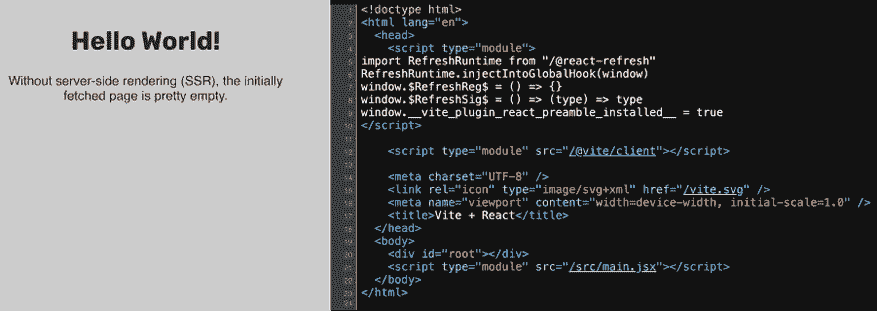

图 15.1：页面内容在页面源代码中无处可寻（即，获取的 HTML 文档）

*图 15.1*显示了典型 React 应用的页面源代码（可以通过右键点击网站进行检查）。如图所示，在`<body>`标签之间几乎没有内容。标题（`"Hello World!"`）及其下的文本在该源代码中缺失。内容之所以缺失，是因为它不是初始 HTTP 响应的一部分。相反，它是在页面加载后（以及从服务器下载了该代码之后）由转换后的 React 代码渲染的。

当然，这些缺点在所有情况下可能并不重要。如果你正在构建一些公司内部的应用程序，或者一个隐藏在登录之后（因此无论如何都不会被索引）的 UI，或者如果你只针对拥有快速设备和网络连接的用户，你可能不需要担心这些潜在的问题。

但如果你正在构建一个面向公众的网站，其中搜索引擎索引很重要，或者可能会被使用慢速设备或网络连接的用户访问，你可能想要考虑消除这些缺点。这正是**SSR**能够提供帮助的地方。

# 理解服务器端渲染（SSR）

当使用 React 时，SSR 指的是在用户访问你的网站时，在处理传入 HTTP 请求的服务器上渲染网页和因此你的 React 组件的过程。

启用 SSR 后，服务器将渲染你的 React 组件树，从而生成由你的组件及其 JSX 指令产生的实际 HTML 代码。正是这完成的 HTML 代码随后被发送回客户端。因此，网站访客将收到一个不再空白的 HTML 文件，而是包含实际页面内容。搜索引擎爬虫也会看到这些内容并相应地索引页面。

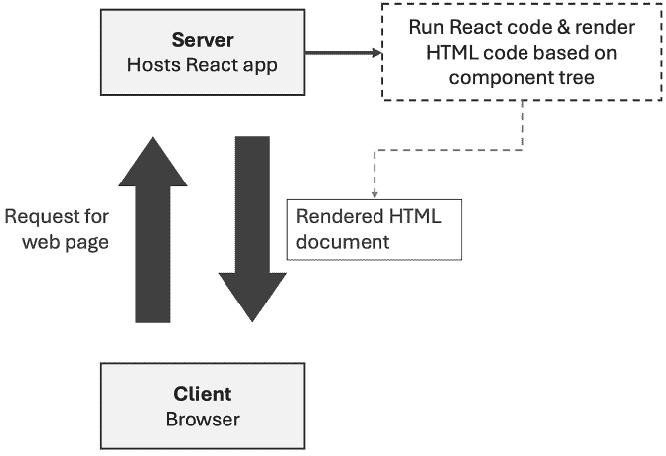

图 15.2：React SSR 的实际应用

最好的是，你不会失去 React 的客户端优势，因为，当启用 SSR 时，React 仍然像以前一样在客户端工作！一旦收到那个初始 HTML 文档，它将接管控制权，并为用户提供与没有 SSR 时相同的 SPA 体验。尽管技术上讲，在使用 SSR 时，React 将在客户端以略微不同的方式初始化。它不会在那里重新渲染整个 DOM，而是会**水合**服务器上渲染的页面内容。**水合**意味着 React 将将你的组件结构连接到基于该结构渲染的 HTML 代码（当然，是基于相同的结构渲染的），并使其具有交互性。

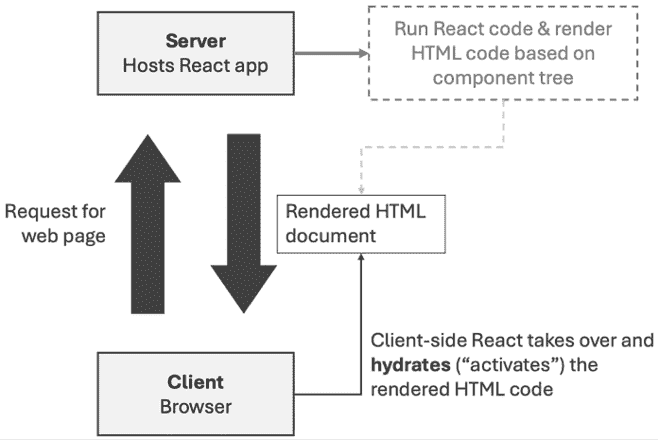

图 15.3：在收到渲染的 HTML 代码后，React 在客户端水合代码

因此，你将获得两者的最佳之处：对于浏览器发送的初始 HTTP 请求，将获得非空、预渲染的页面，并且用户将享受到高度反应性的 Web 应用程序。

# 在 React 应用程序中添加 SSR

极其重要的是要理解，启用了 SSR 的 React 应用程序需要在两个环境（服务器和浏览器）中执行代码，而客户端 React 应用程序仅依赖于浏览器。因此，要使用 SSR，必须将服务器端环境添加到 React 项目中——仅仅调整几个地方的 React 代码是不够的。

例如，标准的基于 Vite 的项目默认不支持 SSR。因此，如果你想支持 SSR，你必须编辑你的 Vite 项目设置（以及一些项目代码文件）以启用在客户端和服务器端执行 React 代码。例如，你必须添加一些处理传入 HTTP 请求并在服务器端触发 React 代码执行的代码。

**注意**

手动启用 SSR 需要后端开发和构建过程配置知识——除了你需要了解的 React 知识之外。

幸运的是，正如你将在本章中了解到的那样，你通常不需要经历那个设置过程。相反，你可以依赖像 Next.js 这样的框架来为你做繁重的工作。

如果你对手动配置基于 Vite 的项目中的 SSR 感兴趣，官方的 Vite SSR 文档是一个学习更多知识的好地方：[`vitejs.dev/guide/ssr`](https://vitejs.dev/guide/ssr)。

此外，你可以探索以下根据官方 Vite SSR 指令设置的演示项目：[`github.com/mschwarzmueller/book-react-key-concepts-e2/tree/15-ssr-next-intro/examples/02-ssr-enabled`](https://github.com/mschwarzmueller/book-react-key-concepts-e2/tree/15-ssr-next-intro/examples/02-ssr-enabled)。

手动启用 SSR 是一个非平凡的过程，需要高级的 Node.js 和后端开发知识，这是官方 React 文档建议使用 Next.js 等框架创建新 React 项目的原因之一（见[`react.dev/learn/start-a-new-react-project`](https://react.dev/learn/start-a-new-react-project)）。

但这并非唯一原因。

## 服务器端数据获取并非易事

除了非平凡的设置过程之外，启用 SSR 的项目还可能遇到另一个可能的问题：服务器端数据获取困难。

如果你正在构建一个需要在某些组件中获取数据（例如，通过`useEffect()`，如第八章*处理副作用*中所示）的 React 应用，你会发现当组件在服务器上渲染时，数据并未被获取。相反，数据获取只会发生在客户端。服务器端渲染的 HTML 标记将不包含依赖于获取数据的内 容。

这种行为的原因是 React 组件函数仅在服务器端执行一次——即，仅在服务器上执行了第一次组件渲染周期。你可以将 SSR 视为仅生成初始页面快照。后续的状态更新将被忽略，并且通过`useEffect()`触发的影响函数（副作用）在服务器端也不会执行。因此，依赖于影响函数和后续状态更新的数据获取在服务器端将不会工作。

考虑这个例子，其中`Todos`组件函数使用`useEffect()`从[`jsonplaceholder.typicode.com/`](https://jsonplaceholder.typicode.com/)获取一些（模拟）待办事项数据：

```js
import { **useEffect**, useState } from 'react';
import { loadTodos, saveTodo } from '../todos.js';
function Todos() {
  const [todos, setTodos] = useState();
  **useEffect****(****() =>** **{**
    **async****function****fetchTodos****() {**
      **// sends HTTP request to jsonplaceholder.typicode.com**
      **const** **todos =** **await****loadTodos****();**
      **setTodos****(todos);**
    **}**
    **fetchTodos****();**
  **}, []);**
  async function addTodoAction(fd) {
    const todo = {
      title: fd.get('title'),
    };
    const savedTodo = await saveTodo(todo);
    setTodos((prevTodos) => [savedTodo, ...prevTodos]);
  }
  return (
    <section>
      <h2>Manage your todos</h2>
      <form action={addTodoAction}>
        <input type="text" name="title" />
        <button type="submit">Add Todo</button>
      </form>
      {(!todos || todos.length === 0) && (
        <p>No todos found.</p>
      )}
      {todos && todos.length > 0 && (
        <ul>
          {todos.map((todo) => (
            <li key={todo.id}>{todo.title}</li>
          ))}
        </ul>
      )}
    </section>
  );
} 
```

**注意**

你可以在 GitHub 上找到完整的示例代码：[`github.com/mschwarzmueller/book-react-key-concepts-e2/tree/15-ssr-next-intro/examples/03-ssr-data-fetching`](https://github.com/mschwarzmueller/book-react-key-concepts-e2/tree/15-ssr-next-intro/examples/03-ssr-data-fetching)。

当在服务器上运行此代码时，不会出现任何错误。相反，应用将按预期运行并从后端服务器获取模拟的待办事项。

然而，在服务器上生成的 HTML 文档将不包含获取的待办事项。相反，它只会包含回退文本（`"No todos found"`）。

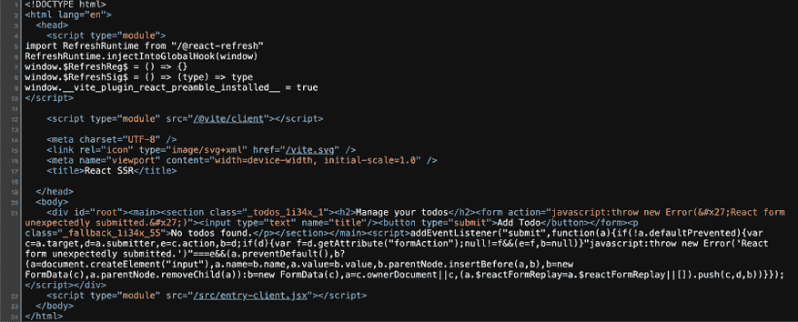

图 15.4：渲染的 HTML 不包含实际的待办事项

生成的标记不包含获取的待办事项，因为，如上所述，React 组件函数仅在服务器端执行一次（并且传递给`useEffect()`的函数根本不执行）。

由于这种行为，你无法轻松执行异步操作，例如，在启用 SSR 时，在 React 组件中使用`useEffect()`获取数据。因此，服务器端渲染的 HTML 内容将永远不会包含那些数据。

虽然您可以想出解决该问题的方法（例如，在执行组件函数之前在服务器上执行数据获取操作），但这将是 Next.js 和一个称为 **React 服务器组件**（**RSC**）的概念解决的问题。

# 介绍 Next.js

Next.js 是一个 React 框架——即建立在 React 之上并添加额外功能和模式的框架。具体来说，Next.js 添加了诸如基于文件的路由、内置 SSR 或自动缓存以改进性能等功能。尽管如此，最重要的是，它解锁了两个关键的 React 概念：**React 服务器组件**（**RSC**）和 **服务器操作**。正如您将学到的，这些功能使服务器端 React 代码能够执行异步操作，例如在服务器上获取和渲染数据。

因此，Next.js 可以节省您手动启用 SSR 的麻烦，并且额外解锁了其他有助于在服务器上获取数据的强大功能。

**注意**

此外，还有一些替代的 React 框架，如 Remix/React Router（它们被合并以将可选的全栈 React 框架功能引入 React Router）或 TanStack Start。

Next.js 不仅存在了很长时间，而且还是本书撰写时最受欢迎（按使用量衡量）的全栈框架。

本章将引导您开始使用 Next.js，并提供其核心概念的简要概述。接下来的第十六章（*第十六章*，*React 服务器组件与服务器操作*）将在此基础上进一步深入探讨。

## 创建 Next.js 项目

要使用 Next.js，您必须首先创建一个 Next.js 项目。技术上，它仍然是一个 React 项目，这意味着您将能够使用 React 功能，如组件、属性、状态、Hooks 或 JSX。但这是一个已经安装了 `next` 包的项目，并且需要 Next.js 的特定文件夹结构。您不能将 Next.js 安装到现有的（基于 Vite 的）React 项目中并开始在那里使用它。需要对项目配置和结构进行重大调整。Next.js 带有自己的构建过程，并且底层不使用 Vite。因此，创建一个全新的项目更有意义。

要开始一个新的 Next.js 项目，您应该在系统终端或命令提示符（在您希望创建新项目文件夹的系统位置）中运行以下命令：

```js
npx create-next-app@latest first-next-app 
```

运行此命令后，您需要在终端中进行一些选择（例如，如果您想使用 TypeScript）。

您可以通过简单地按 *Enter* 键来确认所有这些选择，从而接受默认选项。但是，您应该确保您选择 `No` 以用于 TypeScript（除非您知道如何使用它）和 `Yes` 以用于 **App Router**。您可以在 GitHub 上找到一个（略微清理过的）起始项目：[`github.com/mschwarzmueller/book-react-key-concepts-e2/tree/15-ssr-next-intro/examples/04-nextjs-intro`](https://github.com/mschwarzmueller/book-react-key-concepts-e2/tree/15-ssr-next-intro/examples/04-nextjs-intro)。

在创建的项目文件夹内，可以通过以下方式启动开发服务器：

```js
npm run dev 
```

虽然命令与 Vite 项目相同，但服务器默认会针对不同的端口。Next.js 项目使用 `localhost:3000` 而不是 `localhost:5173`（Vite）作为预览开发服务器。

就像在基于 Vite 的项目中一样，当您在项目代码上工作时，应保持此过程运行。底层构建过程会自动重新加载并更新预览网站，当您对代码进行更改时。

**注意**

Next.js 是一个成熟、稳定的框架，它从未停止创新和变化。

到 2022 年底，所谓的 **App Router** 被引入作为一种新的构建和结构化 Next.js 应用程序的方法（旧的方法现在被称为 Pages Router）。当然，这本书涵盖了新的 App Router 方法。

截至 2024 年中（本书撰写时），尽管 App Router 方法被标记为稳定，但它仍然经常收到新功能和更改。

因此，尽管可能性不大，但本书中解释的概念和代码可能会随着时间的推移而改变或损坏。上述设置过程也可能发生变化。在这种情况下，将在 GitHub 的 Changelog 文档中添加一条注释（包含如何调整代码的说明）：[`github.com/mschwarzmueller/book-react-key-concepts-e2/blob/main/CHANGELOG.md`](https://github.com/mschwarzmueller/book-react-key-concepts-e2/blob/main/CHANGELOG.md)。

一个新创建的 Next.js 项目会自动安装所有依赖（`npm install` 是项目创建过程的一部分自动执行）并具有如下项目结构：

+   一个包含与路由相关的文件的 `app/` 文件夹（参见下一节）

+   一个 `public/` 文件夹，可以用来存储应该以静态方式提供（即，在构建过程中不被更改）的资产

+   用于配置项目和 Next.js 特定行为的 `jsconfig.json` 和 `nextjs.config.mjs` 文件

+   用于管理项目依赖的 `package.json` 和 `package-lock.json` 文件

因此，除了 `app/` 文件夹外，它与您从 Vite 知道的结构并没有太大的不同。然而，值得注意的是，Next.js 与 Vite 不同，它不强制要求 `.jsx` 作为包含 JSX 代码的 JavaScript 文件的文件扩展名。您可以使用它，但不必使用。例如，起始项目使用 `page.js` 和 `layout.js`，而不是 `page.jsx` 和 `layout.jsx`，尽管这些文件包含 JSX 代码。

就像基于 Vite 的项目一样，Next.js 项目自带一个构建工作流程，当运行开发服务器或构建生产版本（你可以通过 `npm run build` 来做）时，它会自动处理和转换你的代码文件。

就像几乎所有现代的 React 项目设置一样，Next.js 项目因此支持将样式文件（如 `globals.css`）或图片导入到 JavaScript 文件中。它还允许你在导入时省略或设置文件扩展名。此外，Next.js 还支持 CSS Modules。

换句话说：你可以在 Next.js 项目中以几乎与在 Vite 基于的项目中相同的方式进行工作。

## 使用基于文件的路线

在基于 Vite 的项目中，当涉及到项目结构时，你拥有很高的灵活性。在 `src/` 文件夹内，你可以创建任何你选择的子文件夹和文件。这些文件和文件夹的名称实际上并不重要（只要它们是有效的并且使用了正确的扩展名）。

当使用 React Router 时，你会在你的 JSX 代码文件中设置路由，并为任何路由加载和渲染存储在任何文件中的任何组件（参见 *第十三章*，*使用 React Router 的多页应用*）。

在 Next.js 项目中，这略有不同，因为 Next.js 使用文件系统来定义路由——你不需要在代码中设置路由。因此，尽管你仍然拥有很多灵活性，但必须遵循一些关于项目结构和文件名的路由相关规则——否则，应用将崩溃并且无法按预期工作。

Next.js 通过其内置的路由器实现了基于文件的路由。这个路由器分析你的文件系统，根据你在项目中的文件和文件夹结构推导出支持的路线、它们的 URL 路径以及要加载和渲染的 React 组件。

当使用 App Router 方法时，因此你必须将所有应作为页面加载的组件存储在 `app/` 文件夹（或嵌套文件夹）内的 `page.js` 文件中。由于所有路线组件文件都必须命名为 `page.js`，因此父文件夹的名称定义了组件将被加载的路线路径。

例如，你可能有一个如图 *图 15.5* 所示的文件和文件夹结构：

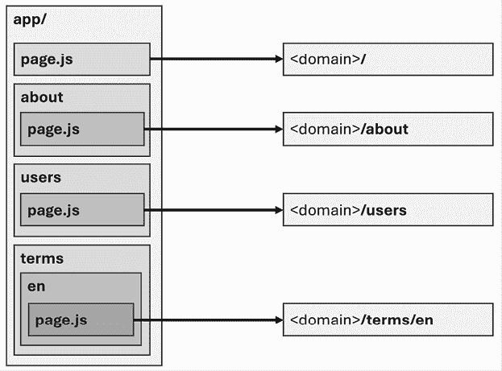

图 15.5：在 Next.js 中，page.js 文件包含路线组件。文件夹名称决定了路径

在 *图 15.5* 中，你可以看到通过文件系统定义了四个路线：根路线（`/`）、`/about`、`/users` 和 `/terms/en` 路线。对于每个路线，存储在相应 `page.js` 中的组件将被加载并渲染到屏幕上。

例如，你可能有一个像这样的 `app/page.js` 文件：

```js
export default function Home() {
  return (
    <main>
      <h1>Hello Next.js World </h1>
      <p>Build fullstack React applications with ease!</p>
      <p>
        Learn more about Next.js in{' '}
        <a href="https://www.udemy.com/course/nextjs-react-the-complete-guide/">
          my course
        </a>{' '}
        or the <a href="https://nextjs.org/">official documentation</a>.
      </p>
    </main>
  );
} 
```

正如你所见，一个常规的 React 组件函数存储在这个 `page.js` 文件中。组件函数的名称并不重要——重要的是它是一个文件 `page.js` 内导出的组件函数。因此，如果用户访问 `<domain>/`（或只是 `<domain>`，不带斜杠），屏幕上将会显示以下内容：

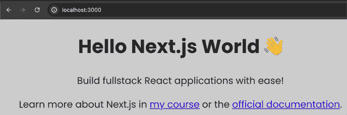

图 15.6：Next.js 路由器加载存储在 app/page.js 文件中的组件，并渲染其内容

因此，你可以轻松地添加所需数量，可能嵌套的，路由——只需创建文件夹、子文件夹和 `page.js` 文件即可。

## 使用 Next.js 进行服务器端渲染

除了提供内置的基于文件的路由器（以及将在本章和下一章中探讨的许多其他功能）之外，Next.js 还有一个其他关键优势：它默认实现 SSR。你不需要添加任何文件，更改任何配置，或调整任何代码来在服务器上渲染 React 组件——相反，它从一开始就工作。

因此，当用户访问 `<domain>/` 时，`app/page.js` 文件组件（例如上述示例中的 `Home` 组件）将在服务器端进行评估和渲染。发送到浏览器的就是完成的 HTML 代码。而且，就像基于 Vite 的具有自定义 SSR 的项目一样，Next.js 也会在服务器上渲染 `page.js` 内可能使用的所有子组件。

此外，当使用 Next.js 构建网站时，你仍然在构建 React 应用程序。这就是为什么一旦完成 SSR，Next.js 应用程序在客户端就会变得交互式。技术上，正如你将在下一章（*React 服务器组件 & 服务器操作*）中了解到的那样，它们将以与基于 Vite 的 SSR 启用的 React 应用程序（其中 React 在客户端刷新服务器端渲染的标记）不同的方式变得交互式，但最终，你的网站用户将获得类似 SPA 的用户体验。

因此，如果你想构建一个支持 SSR 的 React 应用程序，建议依靠像 Next.js 这样的框架，而不是手动设置 SSR。

此外，你将能够使用其他有用的功能，例如基于文件的路由系统，特别是因为它不仅限于通过 `page.js` 文件定义路由。例如，它还简化了定义布局的过程。

## 与布局一起工作

正如之前提到的，当涉及到路由时，文件名和存储这些文件的位置很重要。

例如，你还会在上述示例的 `app/` 文件夹中找到 `page.js` 文件旁边的 `layout.js` 文件。

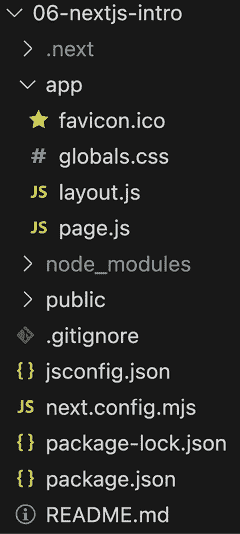

图 15.7：除了 `page.js` 文件、样式文件和 favicon 之外，在 `app/` 文件夹中还可以找到 `layout.js` 文件

就像 `page.js` 一样，`layout.js` 是一个保留的文件名——即该文件以特殊方式由 Next.js 处理。

这个`layout.js`文件也导出一个组件函数，但创建的组件不会为特定的路径渲染。相反，它被用作所有同级或嵌套页面的包装器。因此，`layout.js`文件可以用来定义将在多个页面之间共享的 JSX 代码。

由于它被设计为包装组件，`layout.js`导出的组件函数必须使用特殊的`children`属性（见*第三章*，*组件与属性*）来定义被包装页面内容应该显示的位置。

例如，你可以使用`app/layout.js`文件来定义一个全局布局，在`<main>`内容上方添加导航栏：

```js
export default function RootLayout(**{ children }**) {
  return (
    <html lang="en">
      <body>
        <header>
          <nav>
            <ul>
              <li><a href="/">Home</a></li>
              <li><a href="/events">Events</a></li>
            </ul>
          </nav>
        </header>
        <main>**{children}**</main>
      </body>
    </html>
  );
} 
```

在这个示例代码片段中，还值得注意的是，`RootLayout`组件渲染了`<html>`和`<body>`元素。在基于 Vite 的项目中，你不会这样做。在那里，你而是在`index.html`文件中定义一个位置，以便将渲染的 HTML 注入其中（通过`react-dom`包暴露的`createRoot()`函数；见*第二章*，*理解 React 组件与 JSX*）。

Next.js 不依赖于这样的`index.html`文件；相反，它强制你在`app/`文件夹的顶层定义一个根`layout.js`文件。然后，这个根布局必须定义渲染的 HTML 页面的总体结构。然而，该文件中没有`<head>`部分，因为 Next.js 将在幕后管理和注入该部分。此外，Next.js 还会将 JavaScript 和 CSS 导入插入到渲染的 HTML 文档中。

如果你想要有嵌套布局，并且这些布局只包装一些页面，你可以添加更多（嵌套）`layout.js`文件。这样的布局是可选的；然而，根布局（`app/layout.js`）是必需的。

在一个包含`app/page.js`文件和`app/events/page.js`文件的项目中，使用类似于前一个代码示例中的`layout.js`文件，网站用户可以访问这两个页面并看到共享的导航。

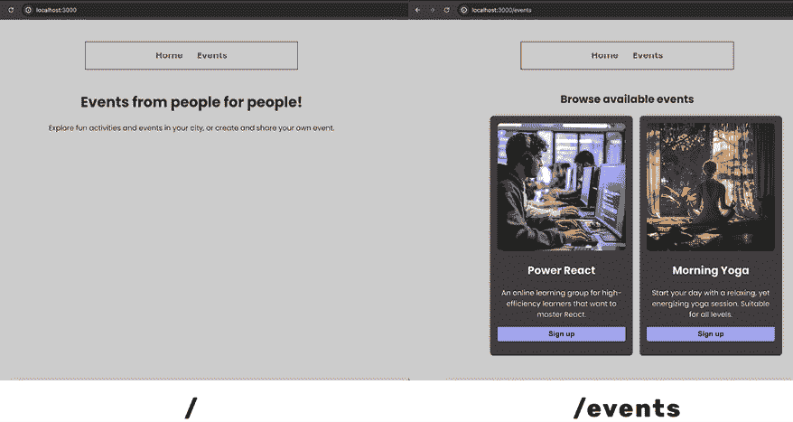

图 15.8：当用户从/到/events 导航时，共享的标题保持不变

在*图 15.8*中，主要内容（由`page.js`文件定义）发生变化，但共享的导航（在`layout.js`中设置）保持不变。

虽然共享 JSX 标记是使用布局的最常见用例，但你也可以通过将 CSS 文件导入到`layout.js`文件中来共享样式：

```js
**import****'./globals.css'****;**
export default function RootLayout({ children }) {
  return (
    <html lang="en">
      Unchanged JSX code…
    </html>
  );
} 
```

在这个和上面的示例中，组件函数被命名为`RootLayout`——这个名称并不重要，但它必须是一个导出的组件。

当然，如果你在共享导航栏的布局中添加了有效链接，那么这些布局将变得更加有用...

## 管理内部导航

在前面的代码示例中，使用`<a>`元素创建了不同 Next.js 应用程序页面之间的链接。

然而，就像其他 React 应用程序一样，Next.js 应用程序在完成初始页面加载后将成为单页应用程序（SPA）。因此，出于与在基于 Vite 的 React 项目中使用 React Router 时相同的原因，不建议使用 `<a>` 标签创建内部链接（比较 *第十三章*，*使用 React Router 的多页应用程序*）。

与 React Router 类似，Next.js（负责 Next.js 项目的路由）提供了一个特殊的 `Link` 组件，你应该用于内部链接（而不是 `<a>` 元素）：

```js
**import****Link****from****'next/link'****;**
export default function RootLayout({ children }) {
  return (
    <html lang="en">
      <body>
        <header>
          <nav>
            <ul>
              <li>**<****Link****href****=****"/"****>****Home****</****Link****>**</li>
              <li>**<****Link****href****=****"/events"****>****Events****</****Link****>**</li>
            </ul>
          </nav>
        </header>
        <main>{children}</main>
      </body>
    </html>
  );
} 
```

`<Link>` 组件接受一个 `href` 属性，该属性设置为目标路径。内部，Next.js 将捕获链接点击，并通过加载和渲染所需的 `page.js` 组件来相应地更新浏览器地址栏和网站 UI。

### 突出显示活动链接和使用“use client”指令

如果你想在链接指向当前激活页面时以不同的方式样式化链接，你不会在 React Router 中找到内置的 `NavLink` 组件。相反，你必须通过根据当前激活路径动态设置 `Link` 组件的 `className` 属性来添加自己的逻辑。

要找出当前激活的路径，你可以使用 Next.js 提供的 `usePathname()` 钩子：

```js
import { usePathname } from 'next/navigation';
const path = usePathname(); 
```

例如，你可以调整 `layout.js` 文件，使其看起来像这样：

```js
import Link from 'next/link';
**import** **{ usePathname }** **from****'next/navigation'****;**
import './globals.css';
export default function RootLayout({ children }) {
  **const** **path =** **usePathname****();**
  return (
    <html lang="en">
      <body>
        <header>
          <nav>
            <ul>
              <li>
                <Link 
                  href="/" 
                  **className****=****{path** **===** **'/'** **? '****active****'** **:** **''}>**
                  Home
                </Link>
              </li>
              <li>
                <Link
                  href="/events"
                  **className****=****{path.startsWith(**
                    **'/****events****'**
                  **) ? '****active****'** **:** **''}**
                >
                  Events
                </Link>
              </li>
            </ul>
          </nav>
        </header>
        <main>{children}</main>
      </body>
    </html>
  );
} 
```

然而，如果你运行这段代码，你会得到一个错误消息：

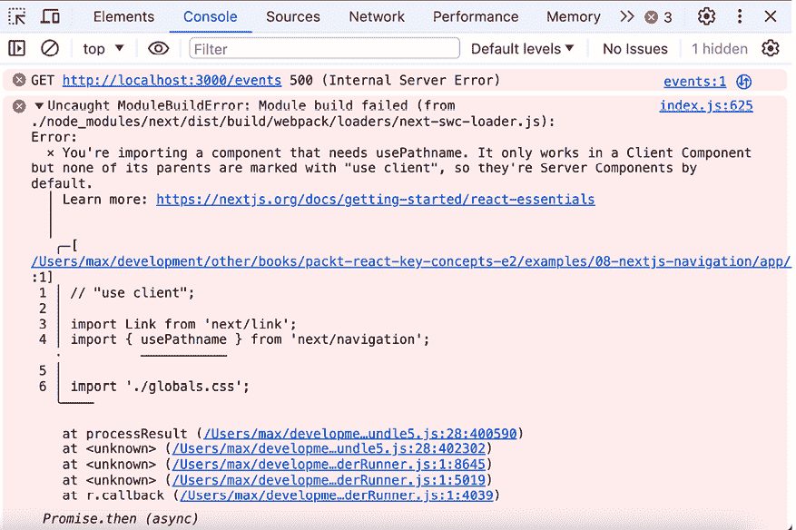

图 15.9：Next.js 对服务器组件中 Hook 的使用提出警告

这个错误消息听起来相当晦涩，因为它提到了 `Client Component` 和 `Server Components`。这两个都是将在下一章（*React 服务器组件与服务器操作*）中探讨的关键 React 概念。

对于当前章节，了解这个问题的修复方法就足够了，即在 `app/layout.js` 文件的顶部添加 `"use client"` 指令：

```js
**"use client"****;**
import Link from 'next/link';
import { usePathname } from 'next/navigation';
import './globals.css';
export default function RootLayout({ children }) {
  const path = usePathname();
  // return JSX code
} 
```

`"use client"` 是一个所谓的 **指令**，即一个“告诉”React 和 Next.js 该文件必须以特殊方式处理的指令。添加它将消除 *图 15.9* 中显示的错误消息，从而启用路径感知的 `Link` 样式。正如之前提到的，这个指令的具体影响将在下一章中探讨。

在 Next.js 项目中，无论你计划在组件中使用 React 或 Next.js 提供的哪个 Hook，都必须添加 `"use client"` 指令。

**注意**

你可能会想知道为什么对于使用 Hooks 的组件来说需要 `"use client"`。毕竟，在使用基于 Vite 的项目中的 SSR 时，这个指令并不是必需的。

原因是 Next.js 在本节开头介绍的技术上并不使用 SSR。相反，Next.js（当使用 App Router 时）使用一个名为 React Server Components 的 React 功能。这个关键特性将在下一章中详细探讨。在那里，你还将了解到为什么在某些组件中需要 `"use client"`。

## 创建和使用常规组件

在前几节中提到的 `Link` 组件是 Next.js 提供的组件。但当然，你也可以构建你自己的组件——毕竟它仍然是一个 React 应用。

除了作为页面（`page.js`）或布局（`layout.js`）暴露的组件外，你可以在你选择的任何文件（任何名称）中创建和使用组件函数。

例如，你可以在 `app/` 文件夹旁边添加一个 `components/` 文件夹，并在其中添加一个 `MainNavigation.js` 文件。然后，这个文件可以包含一个新的 `MainNavigation` 组件，该组件返回与导航相关的 JSX 代码：

```js
'use client';
import Link from 'next/link';
import { usePathname } from 'next/navigation';
export default function MainNavigation() {
  const path = usePathname();

  return (
    <header>
      <nav>
        <ul>
          <li>
            <Link href="/" className={path === '/' ? 'active' : ''}>
              Home
            </Link>
          </li>
          <li>
            <Link
              href="/events"
              className={path === '/events' ? 'active' : ''}
            >
              Events
            </Link>
          </li>
        </ul>
      </nav>
    </header>
  );
} 
```

请注意，必须在 `MainNavigation.js` 文件顶部添加 `"use client"`，因为组件函数中使用了 `usePathname()` 钩子。

将代码移动到这个新添加的 `MainNavigation` 组件中后，在 `layout.js` 文件中，可以移除 `"use client"`，因为该文件中不再使用 `usePathname()` 钩子。它在子组件（在 `<MainNavigation/>` 内部）中使用，但 React 并不关心这一点。

因此，更新后的 `layout.js` 文件看起来是这样的：

```js
import './globals.css';
import MainNavigation from '../components/MainNavigation';
export default function RootLayout({ children }) {
  return (
    <html lang="en">
      <body>
        <MainNavigation />
        <main>{children}</main>
      </body>
    </html>
  );
} 
```

多亏了构建、外包和使用自定义的 `MainNavigation` 组件，因此更新后的 `layout.js` 文件再次包含了一个精简且简洁的组件函数。

**注意**

除了与路由相关的文件外，如何构建你的 Next.js 项目以及如何命名你的文件完全取决于你。

如前所述，你可以在你选择的任何位置（任何名称的文件夹）中存储自定义（非页面）组件在 `components/` 文件夹中。你可以将这个 `components/` 文件夹放入 `app/` 文件夹或根项目文件夹中。

你也可以完全不使用 `components/` 文件夹，而是将组件存储在位于你的 `page.js` 文件旁边的文件中。因为如果一个文件不是命名为 `page.js`，它就不会被视为页面——所以不会意外地在你的项目中创建你不想要的路线。如果你有 `app/components/MainNavigation.js` 但没有 `app/components/page.js` 文件，就不会有 `/components` 路由。未命名为 `page.js`（或其他保留文件名——见即将到来的部分 *其他文件名约定*）的文件将被 Next.js（用于路由目的）简单地忽略。

你可以在官方文档中找到更多关于 Next.js 项目组织的信息和想法：[`nextjs.org/docs/app/building-your-application/routing/colocation`](https://nextjs.org/docs/app/building-your-application/routing/colocation)。

## 处理动态路由

正如你在 *第十三章* 中学到的，*使用 React Router 的多页应用*，在 *从静态到动态路由* 部分中，许多 React 应用也需要支持动态路由。

例如，你可能希望允许你的用户访问 `/events/e1` 来查看 ID 为 `e1` 的活动的详细信息，以及 `/events/e2` 来查看 ID 为 `e2` 的活动（等等）。

这是一个如此常见的需求，Next.js 当然支持它。你可以在 Next.js 应用程序中通过创建一个文件夹（在`app/`文件夹中的某个位置）并使用方括号包裹其名称来添加动态路由——例如，`app/events/[eventId]`。当然，你仍然需要在那个文件夹中创建一个`page.js`文件来实际创建路由。

方括号之间的部分（例如，`eventId`）完全由你决定。但方括号告诉 Next.js 你正在设置一个动态路由。

方括号之间的文件夹名称充当一个标识符，可以用来检索 URL 中编码的具体值（例如，检索`/events/e1`中的`e1`）。

每个用作页面（或布局）的组件都会接收到一个由 Next.js 自动设置的`params`属性。如果它是一个动态路由文件夹或某些嵌套子文件夹中的页面或布局，则`params`属性将包含一个解析为包含所选标识符（如`eventId`）作为键和具体 URL 路径值（如`e1`）作为这些键的值的对象。由于`params`包含一个`Promise`，因此必须对它使用`await`来访问其底层对象。

例如，`app/events/[eventId]/page.js`文件将确保在访问`/events/e1`、`/events/e2`等时，在`page.js`文件中导出的组件被渲染。然后，该页面组件可以使用以下代码输出事件详情：

```js
// getEventById is a custom dummy function to load event data
import { getEventById } from '@/lib/events'; 
export default async function EventDetailsPage(**{ params }**) {
  **// params.eventId exists because of folder name => [eventId]**
  **const** **{ eventId } =** **await** **params;** 
  const event = getEventById(eventId);
  return (
    <div id="event-details">
      <header>
        
        <h1>{event.title}</h1>
        <p>
          {event.location} | {event.date}
        </p>
      </header>
      <p>{event.description}</p>
      <p>
        <button>Register</button>
      </p>
    </div>
  );
} 
```

在这个例子中，自动提供的`params`属性用于获取访问 URL 中编码的`eventId`。如果文件夹名称中使用的是除`eventId`之外的标识符，则将使用该替代名称来访问路径值（例如，对于`[id]/page.js`，你会访问（`await`）`params.id`）。

因此，用户可以访问这个动态路由，探索所选事件 ID 的事件详情。


图 15.10：为/events/e1 加载并显示事件详情

**注意**

你可以在 GitHub 上找到完整的示例代码，包括`lib/events.js`文件：[`github.com/mschwarzmueller/book-react-key-concepts-e2/tree/15-ssr-next-intro/examples/08-nextjs-dynamic-routes`](https://github.com/mschwarzmueller/book-react-key-concepts-e2/tree/15-ssr-next-intro/examples/08-nextjs-dynamic-routes)。

当然，当使用动态路由时，你通常还需要在应用程序的一些部分中使用指向这些动态路径的链接。因此，在这个例子中，`app/events/page.js`文件包含代码，动态渲染一个事件项列表，其中每个项都有一个链接到其详情页面：

```js
import Link from 'next/link';
import { getEvents } from '@/lib/events';
export default function EventsPage() {
  const events = getEvents();
  return (
    <div id="events">
      <h2>Browse available events</h2>
      <ul>
        {events.map((event) => (
          <li key={event.id}>
            
            <div>
              <h2>{event.title}</h2>
              <p>{event.description}</p>
              <p>
                <Link 
                  **href****=****{****`/****events****/${****event.id****}`**}>Explore Event</Link>
              </p>
            </div>
          </li>
        ))}
      </ul>
    </div>
  );
} 
```

点击这些链接将用户带到特定事件 ID 的事件详情页面。

**注意**

当使用 Next.js 时，静态路由、动态路由和嵌套路由是你需要了解的最重要路由类型。你将在大多数路由中使用它们。

此外，Next.js 还提供其他（更高级和特定）的路由类型和功能，如果你决定深入研究 Next.js，这些内容值得探索：[`nextjs.org/docs/app/building-your-application/routing`](https://nextjs.org/docs/app/building-your-application/routing)。

除了通过使用适当的文件夹名称启用不同的路由类型之外，Next.js 还提供额外的保留文件名。

## 其他文件命名约定

Next.js 不仅提供各种路由类型和与路由相关的功能，还提供了比 `page.js` 和 `layout.js` 更多的保留文件名。

因此，当使用 Next.js App Router 时，你应该也意识到以下保留文件名也存在：

+   `loading.js` 文件可以添加到 `page.js` 和 `layout.js` 文件旁边或上方，以定义在页面（或布局）组件获取数据时应显示的组件。

+   `error.js` 文件可以添加到与 `loading.js` 文件相同的位置，以在兄弟或子页面中抛出错误时渲染回退错误组件。

+   `not-found.js` 文件可以被添加以显示回退内容，以防网站访客尝试加载不存在的路由或资源。

+   `route.js` 文件可以被添加来设置不渲染组件而是返回数据（例如，在 JSON 格式）的路由。

你可以在官方文档中了解更多关于这些文件类型以及更多的文件命名约定：[`nextjs.org/docs/app/building-your-application/routing#file-conventions`](https://nextjs.org/docs/app/building-your-application/routing#file-conventions)。

你也将在下一章中看到一些这些文件类型的实际应用。

# 深入学习 Next.js

到目前为止，你已经有了坚实的 Next.js 基础，但如前所述，你可以借助官方文档深入了解 Next.js。

在那里，除了了解更多关于路由、路由类型和文件名之外，你还可以探索 Next.js 如何帮助缓存、样式或管理页面元数据。由于这本书主要关于 React 本身，而不是 Next.js，在这里涵盖所有这些主题会迅速使这本书膨胀。

因此，本章重点在于建立一个坚实的 React SSR 和 Next.js 基础。本章涵盖的基本内容将有助于理解下一章中更高级的 React 和 Next.js 功能，如 React 服务器组件。此外，得益于这些基础知识，你还将能够借助官方文档或专门的 Next.js 书籍或课程快速学习更多关于 Next.js 的知识。

# 摘要和关键要点

+   默认情况下，基于 Vite 的 React 应用（如大多数不使用 Next.js 或类似框架的 React 应用）仅支持客户端渲染。

+   没有服务器端渲染（SSR）时，一个相对空白的 `index.html` 文件会被发送到客户端。

+   这可能会导致不良的用户体验（如果用户长时间看到空页面）或次优的搜索引擎排名。

+   您可以通过手动调整 React 项目（代码和构建过程）以支持组件在服务器端执行来启用 SSR。

+   为了避免自定义 SSR 设置工作并利用许多其他好处，您可以使用像 Next.js 这样的框架。

+   Next.js 项目自带内置 SSR 支持，可以通过`npx create-next-app`命令创建。

+   现代 Next.js 使用 App Router 方法，该方法利用一个`app/`目录，该目录用于通过文件系统设置路由。

+   在`app/`目录内，您通过创建包含`page.js`文件的文件夹来定义页面（例如，`app/about/page.js`添加了对`/about`路由的支持）。

+   要在页面之间共享 JSX 代码（以及逻辑或样式），您可以添加`layout.js`文件。

+   Next.js 还提供其他保留的文件名来处理加载数据时显示的回退内容或处理错误。

+   您可以通过 Next.js 的`Link`组件在页面之间建立链接。

+   当使用 React Hooks（如`useState()`或 Next.js 的`useRouter()`）时，您必须在使用 Hook 的文件顶部添加`"use client"`指令。

+   除了静态页面（如`app/events/page.js`或`app/about/page.js`），您还可以通过将文件夹名称用方括号括起来来设置动态页面（例如，`app/events/[eventId]/page.js`）。

+   动态路径参数值可以通过 Next.js 在加载的页面组件中使用特殊`params`属性来提取，该属性由 Next.js 设置在组件上。

+   在使用 SSR 时，异步操作可能会出现问题——或者至少，它们不能在服务器上渲染的组件中执行，这迫使客户端代码执行它们。至少当不使用 React Server Components 时是这样。

## 接下来是什么？

到目前为止，您已经了解了关于 React 应用中的 SSR 和 Next.js 的很多知识。您能够创建 Next.js 项目，定义路由，渲染页面组件，添加导航，并处理动态路径。

您还了解到 Next.js 自带内置 SSR。因此，当网站访客发送请求时，所有 React 组件（内置和自定义，页面和非页面）都在服务器上渲染。

然而，现代 Next.js 并没有止步于此——与本章开头介绍的定制 SSR 设置不同，使用 App Router 的 Next.js 项目通过解锁 React 的**React Server Component**功能帮助在服务器端进行异步数据获取。下一章将详细介绍这个功能和**Server Actions**！

## 测试您的知识！

通过回答以下问题来测试您对本章涵盖的概念的理解。然后，您可以比较您的答案与可以在[`github.com/mschwarzmueller/book-react-key-concepts-e2/blob/15-ssr-next-intro/exercises/questions-answers.md`](https://github.com/mschwarzmueller/book-react-key-concepts-e2/blob/15-ssr-next-intro/exercises/questions-answers.md)找到的示例：

1.  SSR 可以提供哪两个主要优势？

1.  SSR 有哪些潜在的缺点或弱点？

1.  Next.js 如何帮助进行 SSR？

1.  在使用“App Router”时，Next.js 中是如何配置路由的？

1.  Next.js 中的页面组件有什么特别之处？

1.  布局组件在 Next.js 中的用途是什么？

1.  在 Next.js 项目中，您可以在哪里存储非页面（和非布局）React 组件？

1.  何时何地需要添加 `"use client"` 指令？

# 应用所学知识

在了解了关于 Next.js 的所有新知识后，是时候将其应用到实际演示项目中了——一个将在服务器上渲染的演示应用程序。

在下一节中，您将找到一个活动，让您练习使用 Next.js。一如既往，您还需要运用之前章节中介绍的一些概念。

## 活动 15.1：迁移基于 Vite 的 React Router 应用

在这个活动中，您的任务是建立在 *活动 13.1* 中的基于 Vite 的应用程序之上。该应用程序是用 Vite 和 React Router 构建的。您的任务是将其从 Vite 和 React Router 迁移到 Next.js。

因此，您应该创建一个新的 Next.js 项目（使用 App Router），并在该项目中重新构建相同的应用程序。

**注意**

您可以在以下位置找到此活动的起始代码：[`github.com/mschwarzmueller/book-react-key-concepts-e2/tree/15-ssr-next-intro/activities/practice-1-start`](https://github.com/mschwarzmueller/book-react-key-concepts-e2/tree/15-ssr-next-intro/activities/practice-1-start) 。在下载此代码时，您将始终下载整个存储库。请确保然后导航到包含起始代码的子文件夹（在这种情况下是 `activities/practice-1-start`）以使用正确的代码快照。

由于您的任务是迁移在 *活动 13.1* 中构建的项目，您可能还想使用该活动的完成代码。您可以在以下位置找到它：[`github.com/mschwarzmueller/book-react-key-concepts-e2/tree/13-routing/activities/practice-1`](https://github.com/mschwarzmueller/book-react-key-concepts-e2/tree/13-routing/activities/practice-1) 。

下载代码并在项目文件夹中运行 `npm install` 以安装所有必需的依赖项后，解决方案步骤如下：

1.  如果您创建了一个新的 Next.js 项目（即，如果您没有使用提供的起始快照），请清理 `layout.js` 和 `page.js` 文件，以删除除组件函数之外的所有内容。

1.  创建两条新路由：一条是 `/products` 路由，另一条是 `/products/<some-id>` 路由。

1.  将 `data.js` 文件迁移到 Next.js 项目中（例如，在根项目文件夹中的 `lib/` 文件夹中）。

1.  更新页面组件以加载和显示 `data.js` 文件提供的数据。

1.  创建一个新的 `components/` 文件夹，并将 `MainNavigation` 组件迁移（复制）到这个文件夹中。

1.  更新 `MainNavigation` 组件（以及任何需要它的其他组件）以使用 Next.js 的 `Link` 组件。

1.  使用 `usePathname()` 钩子来突出显示活动链接——别忘了 `"use client"` 指令！

1.  将`index.css`文件中的样式迁移到`globals.css`文件中。确保该文件被导入到根布局文件中。

预期的结果应如图下所示截图所示：

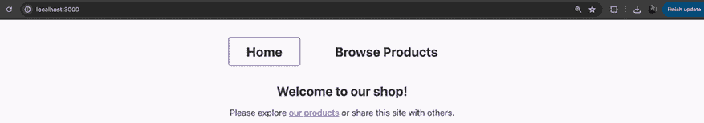

图 15.11：主页内容

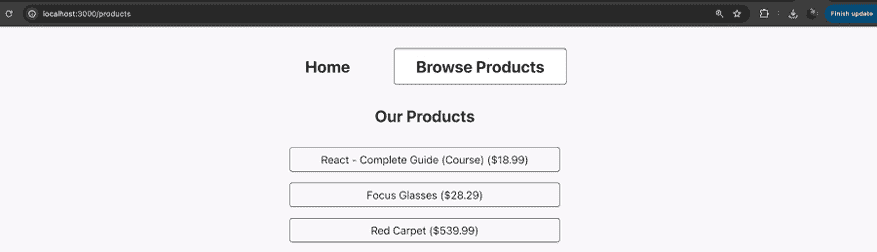

图 15.12：/products 页面内容

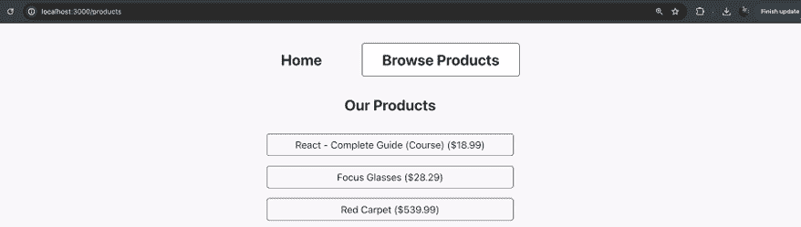

图 15.13：/products/<some-id>页面内容

**注意**

您可以在此处找到此活动的完整代码以及一个示例解决方案：[`github.com/mschwarzmueller/book-react-key-concepts-e2/tree/15-ssr-next-intro/activities/practice-1`](https://github.com/mschwarzmueller/book-react-key-concepts-e2/tree/15-ssr-next-intro/activities/practice-1) .
