# 第十六章：React 服务器组件 & 服务器操作

学习目标

到本章结束时，你将能够做到以下几点：

+   创建和使用 **React 服务器组件** ( **RSCs** )

+   描述 RSCs 如何（以及何时）执行并渲染到屏幕上

+   在 RSCs 的帮助下获取数据并执行异步操作

+   通过构建和使用客户端组件绘制服务器-客户端边界

+   在服务器端使用服务器操作执行数据突变

+   根据服务器操作更新 **用户界面** ( **UI** )

# 简介

在前一章中，你了解到你可以使用 **服务器端渲染** ( **SSR** ) 在服务器上渲染 React 组件。SSR 确保用户在他们的初始 HTTP 请求时收到一个完全填充的 HTML 文档，而不是一个几乎空白的页面外壳。你还被介绍了 Next.js，并学习了如何使用该框架构建带有 SSR（以及许多其他有用功能）的 React 应用程序。

本章基于前一章的内容——特别是，你将了解由 Next.js 解锁的两个关键 React 功能：**React 服务器组件** ( **RSCs** ) 和 **服务器操作** .

在本章中，你将了解这两个功能如何帮助数据获取和突变，以及为什么你无法在每一个 React 项目中使用它们，尽管它们在技术上属于 React——而不是 Next.js。

**注意**

RSCs 和服务器操作是相对较新的 React 功能。在本章中，你将了解到在自定义 React 项目中支持它们是棘手的。

虽然不太可能，但有关 RSCs 或服务器操作的概念或功能可能会发生变化。也有可能支持这些功能在自定义项目中变得更加容易。

因此，这本书附带了一份专门的文档，跟踪你应该注意的任何重大变化：[`github.com/mschwarzmueller/book-react-key-concepts-e2/blob/main/CHANGELOG.md`](https://github.com/mschwarzmueller/book-react-key-concepts-e2/blob/main/CHANGELOG.md) .

# 服务器端数据获取的问题

如果你有一个启用了 SSR 的 React 应用程序，无论是通过手动启用它，例如在一个基于 Vite 的项目中，还是通过使用像 Next.js 这样的框架，你的 React 组件函数将在服务器上执行。因此，这些组件所需的所有数据都应该在服务器上获取。

但正如前一章中解释的，在 *服务器端数据获取并非易事* 部分中，使用 `useEffect()` 发送 HTTP 请求或尝试通过 `useState()` 更新 UI 在使用 SSR 时不起作用。在服务器上，React 只调用组件函数一次——当状态改变时不会重新执行它们。它也不会调用你的效果函数。

这是一个严重的限制，因为许多 React 应用需要从某些后端或数据库中获取数据。无法在服务器上获取和渲染这些数据意味着网站访客将再次收到不完整的 HTML 文档（并等待在客户端获取数据），而搜索引擎爬虫将看不到网页的最重要内容。

这也是 React 引入**RSCs**的原因之一。

# 介绍 RSCs

尽管名为 RSCs，但它们并不一定是运行在服务器上的组件。相反，它们的定义特征是，在任何情况下，它们的组件功能都不会在客户端执行！

因此，RSCs 可能会在服务器上执行，但它们也可能在构建过程中被调用，因此在构建时预先生成组件。不过，它们肯定不会在浏览器中执行。

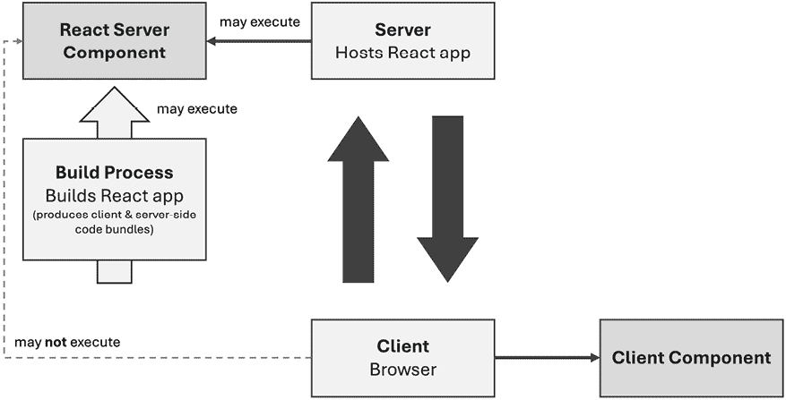

图 16.1：RSCs 不能从客户端调用

但 RSCs 的目的是什么？它们是如何创建和使用的？

## 理解 RSCs

RSCs 背后的核心思想是你可以构建在浏览器之外渲染的组件（例如，在服务器上）。因此，这些组件可以执行在浏览器中无法运行的代码——例如，因为使用了 Node.js 特定的 API，或者依赖于必须不向客户端暴露的凭据（例如，数据库凭据）的代码。

与通过 SSR 渲染的“正常”组件（客户端组件）不同，RSCs 可以在初始页面加载后（在服务器上）进行渲染。因此，RSCs 不仅仅是关于渲染初始页面快照。此外，RSCs 还可以在服务器端获取数据。在本章的后面部分，“RSCs 与服务器端渲染”部分将更详细地探讨 RSCs 与通过 SSR 渲染的“正常”组件之间的关系。

因此，RSCs 解决了重要问题：它们允许你将前端和后端 React 代码交织在一起。在过去，在 RSCs 之前，你通常必须构建单独的后端和前端 Web 应用程序，而现在你可以构建集成的全栈应用程序，将服务器端和客户端的 React 代码融合在一起。

因此，使用 RSCs 提供了各种优势：

+   构建完全集成的全栈应用程序变得更加容易，其中后端和前端紧密相连并使用相同的服务器。

+   在组件内部进行异步服务器端数据获取成为可能：与客户端（或使用 SSR）不同，React 允许你在组件函数中使用`async/await`并返回`Promise`值。

+   网站访客下载的客户端 JavaScript 包更小，因为 RSCs 的代码被省略了。

+   由于操作及其代码可以外包给服务器（或构建过程），因此运行计算密集型操作或使用大型第三方库变得更加容易。

+   不应被网站用户访问的代码或凭据可以移动到 RSCs 中。

例如，多亏了 RSC，您可以创建如下组件：

```js
import pg from 'pg'; // pg package (more info: node-postgres.com)
const { Client } = pg

const client = new Client({
  user: 'username',
  password: 'your-password',
  host: 'my.database-server.com',
  port: 5334,
  database: 'demo',
});
async function ProductsPage() {
  await client.connect();
  const res = await client.query('SELECT * FROM products'); 
  await client.end();
  return (
    <ul>
      {res.rows.map(row => <li key={row.id}>{row.title}</li>)}
    </ul>
  );
} 
```

`ProductsPage` 组件包含代码，该代码会连接到 PostgreSQL 数据库以从那里获取产品数据。

没有 RSC，这种组件将无法构建和使用。您将不允许使用 `async/await`，`pg` 包可能依赖于浏览器中不可用的某些 API，并且您会在客户端代码捆绑中暴露数据库凭证。

在构建 RSC 时，所有这些操作都是允许的。React 明确允许您在构建 RSC 时返回一个 `Promise`（因此可以使用 `async/await`）。由于代码保证永远不会出现在客户端，因此连接到数据库也是安全的。

因此，您可以轻松构建完全集成的全栈应用程序，其中后端和前端代码无缝融合。

然而，使用 RSC 既是简单又是复杂的，下一节将进行解释。

## 创建和使用 RSC

在使用 App Router 的 Next.js 项目中，所有 React 组件，无论它们是作为页面使用还是嵌套在其他组件中，默认情况下都是 RSC。

如您在 Next.js 项目中检查任何 React 组件函数时可以看出的，它们实际上并没有什么特别之处。它们看起来就像普通的 React 组件：

```js
export default function ServerComponentInfo() {
  return <p>This is a React Server Component.</p>;
} 
```

您可以使用 `async/await` 与它们一起使用，但您不必这样做。您可以使用服务器端 API 和包，但您不必这样做。因此，创建 RSC 是简单的——它们毕竟只是普通组件。

使用它们也是一样——您像使用 React 组件一样使用它们：作为自定义 JSX 元素：

```js
<ServerComponentInfo /> 
```

如您所见，您无法分辨出这是一个特殊类型的组件。它是按照您在这本书中学到的全部内容创建和使用的。

尽管如此，本书其他章节中使用的所有其他组件，在基于 Vite 的 React 项目中，都不是 RSC。它们是普通组件或**客户端组件**。

那么，是什么让 Next.js 项目的组件变得特殊？为什么 React 提供的功能在 Next.js 项目中可用，但在其他 React 项目（例如基于 Vite 的项目）中不一定可用？

## 在 React 项目中解锁 RSC

RSC（React Server Components）是 React 提供的功能，而不是 Next.js。然而，并非所有 React 项目都能使用这个功能。

原因在于此，以及为什么 RSC 在 Next.js 项目中可用，是因为 Next.js 的构建过程以及 Next.js 在幕后对这些组件（以及整个 React 项目代码）所做的事情。从高层次来看，您可以认为 Next.js 做了以下事情：

+   构建工作流程和捆绑过程将服务器和客户端组件分离，以确保没有 RSC 代码出现在客户端。

+   当需要时，Next.js 会调用这些 API 端点（即客户端代码可以发送请求的 URL 地址），在服务器上触发 RSC 组件函数，并返回允许客户端 React 代码更新 UI 的指令。

+   当导航到新页面时，Next.js 会调用这些端点。

+   Next.js 将 API 响应（其中包含这些渲染指令）传递给 React，React 使用返回的指令按需更新 UI。

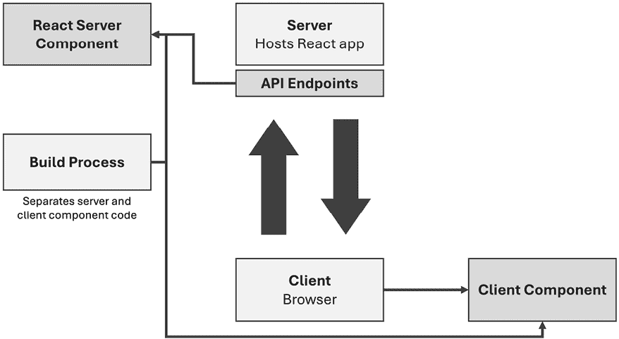

图 16.2：客户端和服务器组件代码是分开的；通信通过 HTTP 请求进行

从技术上讲，这要复杂一些，但为了本书的目的和为了使用此功能，不需要深入了解内部机制——就像您在使用`useState()`时不需要了解内部具体发生了什么一样。

您可以通过运行您在此处找到的演示 Next.js 项目来验证所提到的点：[`github.com/mschwarzmueller/book-react-key-concepts-e2/tree/16-rsc-server-actions/examples/01-rsc-intro`](https://github.com/mschwarzmueller/book-react-key-concepts-e2/tree/16-rsc-server-actions/examples/01-rsc-intro)。

此演示应用程序由两个基本的页面组件文件组成：`app/page.js`和`app/info/page.js`。主页面组件（位于`app/page.js`中的`Home`组件）输出一个`ServerComponentInfo`组件：

```js
import ServerComponentInfo from '../components/ServerComponentInfo';
export default function Home() {
  return <ServerComponentInfo />;
} 
```

该组件随后简单地输出一些静态、硬编码的内容：

```js
import Link from 'next/link';
export default function ServerComponentInfo() {
  return (
    <div id="rsc-info">
      <p>This is a React Server Component.</p>
      <p><Link href="/info">Learn More</Link></p>
    </div>
  );
} 
```

`Home`和`ServerComponentInfo`组件都是 RSC——仅仅因为它们是 Next.js 项目中的组件。如前所述，Next.js 项目中的所有组件默认都是服务器组件。如果这些组件是 Vite-based React 项目的一部分，并且该项目未设置以支持 RSCs，则这些组件将变为“普通”组件（客户端组件）。

在相同的演示项目中，还有一个用于`/info`页面的组件。该组件包含一些在非 RSC 组件中无法工作的代码：

```js
import fs from 'node:fs/promises';
export default async function InfoPage() {
  const info = await fs.readFile('data/rsc-info.json', 'utf-8');
  const { summary } = JSON.parse(info);

  return (
    <div id="info-page">
      <h1>Understanding React Server Components</h1>
      <p>
        {summary}
      </p>
    </div>
  );
} 
```

由于以下原因，此代码在本书之前看到的任何（基于 Vite 的）React 项目中都无法工作：

+   `InfoPage`组件使用 Node 的`fs`包从`rsc-info.json`文件（项目的一部分）加载数据。

+   该组件使用`async/await`，因此返回一个`Promise`，最终产生 JSX 代码（即 React 元素）。

在不支持 RSCs 的项目中，由于所有代码都在浏览器中运行，因此无法使用服务器端 API。同样，也不允许在组件中返回`Promise`。在非 RSCs 中，这不会被视为有效的组件函数返回值。尽管如此，当与 RSCs 一起工作时，这两者都是允许且可能的。

如同在*理解 RSCs*部分所述，使用服务器端功能（如 Node.js API）是因为`InfoPage`组件，就像 Next.js 项目中的所有组件一样，是一个 RSC。对于 RSCs，React 也支持使用`async/await`。

因此，正如预期的那样，您在客户端 JavaScript 代码包中找不到`InfoPage`组件的代码。您可以通过访问`/info`页面来验证这一点。如果您在浏览器开发者工具中打开**网络**选项卡，然后重新加载页面，您将看到发送到服务器的所有 HTTP 请求。这包括所有在 React 应用的客户端需要的 JavaScript 代码文件的请求。

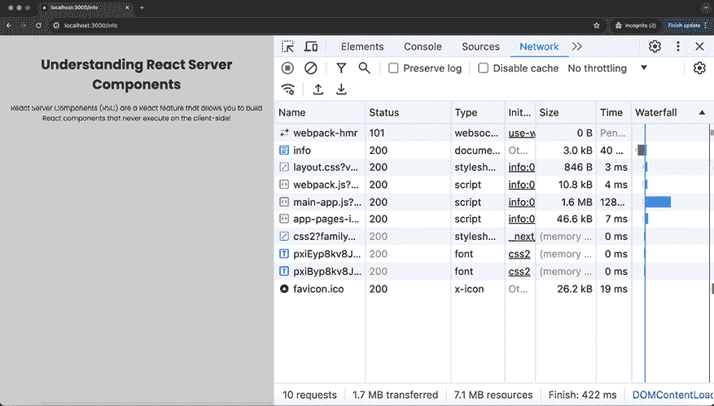

图 16.3：访问/info 时，会向服务器发送对 CSS、JS 和一些其他文件的请求

如果您浏览所有请求的 JavaScript 文件并搜索下载的代码文件中的`rsc-info.json`，您在任何文件中都不会找到匹配项。这证明了这部分代码，它是`InfoPage`组件函数的一部分，并没有出现在任何客户端代码包中。

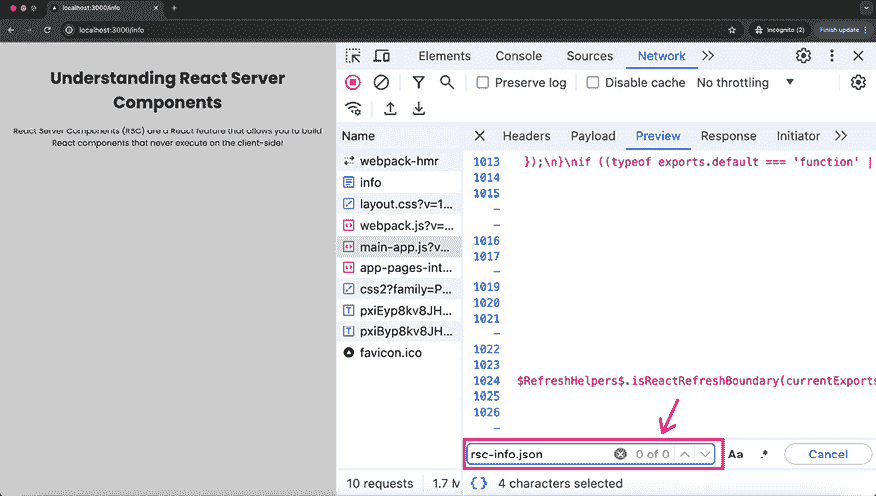

图 16.4：RSC 代码中包含的数据源文件名在客户端找不到

那么，从`rsc-info.json`文件获取的内容是如何显示在屏幕上的呢？

如果您使用不同于 Chrome 或 Edge 的浏览器，这个问题就会得到解答。这是必需的，因为 Chrome/Edge 的开发者工具中的**网络**选项卡存在一个 bug，在某些情况下会导致请求的响应被隐藏。

相反，例如，您可以使用 Firefox 访问根页面（`/`）。在那里，点击页面上的链接导航到`/info`页面。在此过程中，将发送一个新的 HTTP 请求。如果您检查该请求及其响应（在 Firefox 的浏览器开发者工具中），您将看到服务器返回的序列化 RSC 指令。

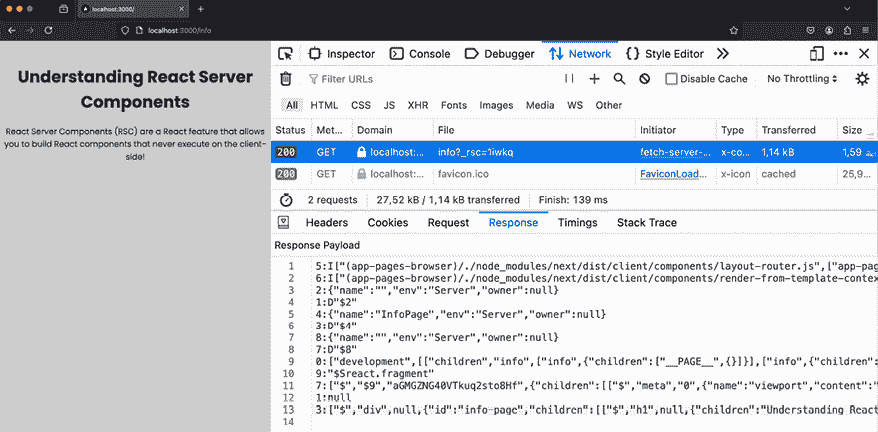

图 16.5：客户端 React 的序列化指令从服务器接收

如您所见，接收到的响应不是 HTML 内容。相反，是一系列序列化指令，由 React 在客户端（即在浏览器中）转换为 DOM 元素。

因此，正如您所了解的，构建和使用 RSC 很简单，但准备项目来处理它们则不是。相反，您需要一个将客户端和服务器代码分离的构建过程，以及调用服务器组件函数的服务器端 API 端点。您还需要客户端代码，当服务器组件应该被渲染时，它会向这些 API 端点发送请求。

## RSC 和服务器操作不能在所有项目中使用

到目前为止，在这本书中，每当介绍一个新的 React 特性时，您都可以简单地将其用于您的 React 项目，无论该项目是由 Vite 创建和管理，还是由其他工具（例如**create-react-app**）创建。

使用 RSCs（React Server Components）和服务器操作，情况就不同了。由于幕后有许多必须完成的事情（参见上一节），尽管这些是 React 提供的功能，但你不能直接在任何 React 项目中使用它们。相反，为了解锁这些功能，你必须有一个配置了支持这些功能的项目的。

因此，在本书撰写之时，RSCs 和服务器操作实际上只能借助集成并积极支持这些功能的框架来使用——例如，Next.js 框架。

当然，从技术上讲，你可以自己设置一个支持这两个功能的项目，但这需要关于后端开发和构建工作流程配置的高级知识。因此，大多数需要这些功能的 React 项目都依赖于像 Next.js 这样的框架。由于无论在哪种项目中使用 RSCs 和服务器操作，使用方式总是相同的，因此本书将忽略自定义设置部分，而是专注于如何使用这两个核心概念。

## RSCs 与服务器端渲染对比

初看起来，使用 RSCs 可能看起来与 SSR（服务器端渲染）的 React 组件相似。毕竟，这两个概念都是关于在浏览器之外运行一些代码。

但尽管这些概念听起来相似，它们实际上相当不同。

SSR 主要是在接收到请求时将组件树渲染成 HTML。它最终是创建一个初始页面快照。

此外，在构建交互式 Web 应用时，SSR 的一个关键部分是预渲染的 HTML 快照在客户端被激活——如前一章所述（参见“理解服务器端渲染（SSR）”部分和“图 15.3”）。

因此，在使用 SSR 时，整个组件树及其所有组件函数在服务器端以及客户端都会被评估。服务器端和客户端代码之间没有分割——它是在两边都是同一个应用和同一个组件树。因此，你也不能在 React 组件中有任何仅服务器端的代码。

使用 RSCs 时，情况就不同了。它们组件函数的代码，如前几节所述，永远不会出现在客户端。

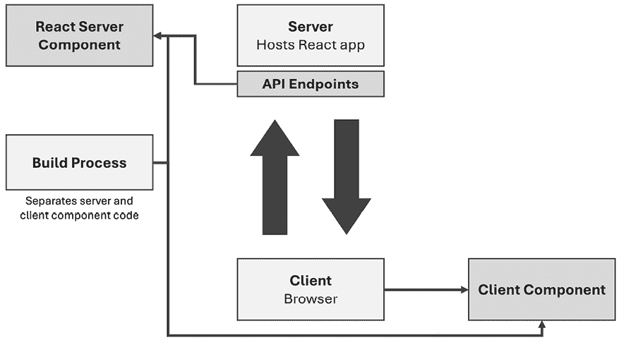

图 16.6：RSCs 不会被激活；相反，它们的输出是通过 HTTP 请求请求的

这就是为什么启用了 SSR 的项目并不自动支持 RSCs。另一方面，你可以设置一个支持 RSCs 但同时也为某些组件使用 SSR 的项目——这些组件应该在服务器上预渲染，但同时也需要在客户端上使用（例如，因为它们增加了页面的交互性）。这些类型的组件将在下一节中探讨。

值得注意的是，RSCs，就像 SSR（服务器端渲染）项目中的服务器端渲染组件一样，每个请求只执行一次。然而，与通过 SSR 渲染的“正常”组件不同，RSCs 可以在应用程序运行时按需执行。它们不仅限于被调用以创建初始页面快照。

尽管如此，有一个重要的问题：在所有组件都在服务器上渲染的 React 应用程序中，你如何添加交互性，例如处理用户输入？毕竟，用户交互是在浏览器中发生的。

## RSCs 与客户端组件

RSCs（React Server Components）提供了一些令人信服的优势（参见*理解 RSCs*部分），但它们也引入了一个可能的大问题：如果所有组件代码都“生活”并在服务器上执行，那么就没有空间进行客户端交互。

### 并非所有组件都应该是 RSCs

如果你有一个需要管理某些状态（例如，仅在用户交互时显示的购物车）的组件，那么该状态和 UI 必须由客户端 React 进行管理和更新。因为那（以及现在）是 React 的主要卖点之一：你可以用它来构建高度反应性和交互式的 UI。但这个目标显然与 RSCs 的理念相冲突，在 RSCs 中，没有组件代码到达浏览器，并且组件在每个请求中只渲染一次。

正因如此，React 允许你通过在包含应在客户端运行的组件函数的文件顶部添加 `'use client'` 指令来定义所谓的**服务器-客户端边界**。

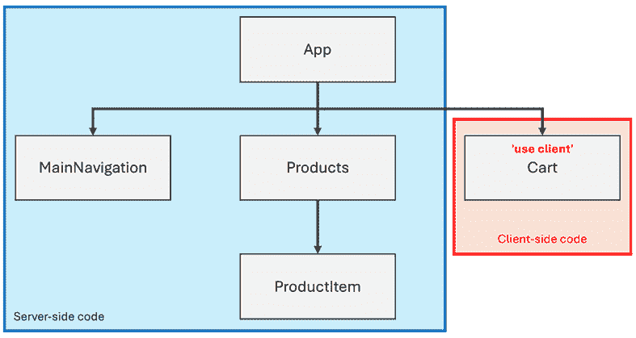

图 16.7：`'use client'` 指令在服务器端和客户端代码之间创建了一个边界

你已经在上一章的*突出显示活动链接和使用`'use client'`指令*部分遇到了 `'use client'`。当时，这个指令并没有太多意义。现在，随着你对 RSCs 的新认识，这个指令背后的目的将变得更加清晰。

在组件文件中添加 `'use client'` 后，该文件中定义的组件将成为客户端组件。客户端组件在服务器上也会预先渲染，但它们的代码也会在客户端上执行。正如前一章所述，它们会被激活。因此，与服务器组件的代码不同，客户端组件的代码会到达客户端：

```js
'use client';
import { useState } from 'react';
export default function Cart() {
  const [isVisible, setIsVisible] = useState(false);
  function handleCartVisibility() {
    setIsVisible((prevState) => !prevState);
  }
  return (
    <div id="cart">
      <button onClick={handleCartVisibility}>
        {isVisible ? 'Hide Cart' : 'Show Cart'}
      </button>
      {isVisible && <p>Cart Items</p>}
    </div>
  );
} 
```

在这个例子中，`Cart` 组件是一个客户端组件，因为文件顶部添加了 `'use client'`。这是必需的，因为 `Cart` 组件使用了 `useState()` 钩子，它只能在浏览器中工作。

每当你向组件文件添加 `'use client'` 指令时，该文件中的组件函数将被包含在客户端代码包中。因此，组件函数可以在浏览器中（并且将会）执行——因此你可以使用依赖于在该处运行的功能，如 `useState()` 或在用户输入时运行的代码（例如，如果按下了 `<button>`）。

这也是为什么 Next.js 会在你尝试在一个未通过`'use client'`标记为客户端组件的组件中使用 Hook 时显示错误。

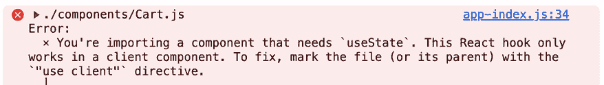

图 16.8：Next.js 对在 RSC 中使用 useState() Hook 表示不满

这个错误发生是因为你试图构建一个不可能的东西：一个只在服务器上评估但也能响应用户输入并更新一些状态的组件。由于后者，正如你在*第四章*，*与事件和状态一起工作*中学到的，通常会导致 UI 更新，代码需要在客户端执行——这显然与只在服务器上运行组件代码的目标相冲突。

因此，每当你有需要在浏览器中运行的组件时，都必须添加`'use client'`。

**注意**

当然，在未实现 RSC 的项目中，你不需要添加`'use client'`指令。这就是为什么在早期章节中你未在其他任何 React 项目中看到它。

### ‘use client’也会影响子组件！

在组件文件中使用`'use client'`指令有一个非常重要的含义：所有嵌套组件也会变成客户端组件——即使你不在它们的组件文件中使用`'use client'`。

这在技术上是有必要的，因为客户端组件的 JSX 代码在每次客户端组件函数再次调用时（例如，由于某些状态变化）都会重新评估，并且那里使用的所有自定义组件都会重新执行——这是你在*第十章*，*React 幕后和优化机会*中学到的。

结果，所有嵌套在客户端组件内部的组件都必须是客户端组件，因为否则它们的代码在客户端不可用。

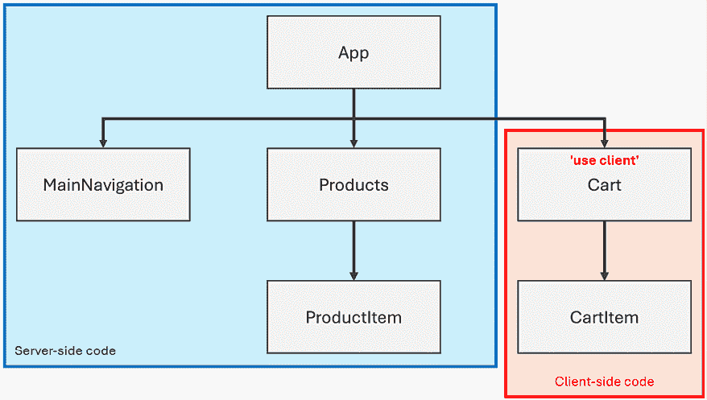

图 16.9：客户端组件的子组件也变成了客户端组件

为了保持客户端代码包小而高效，通常最好最大化服务器组件的数量，从而最小化客户端组件的数量。由于客户端组件的嵌套组件会自动成为客户端组件，因此你应该尽量将服务器-客户端边界（即`'use client'`的使用）尽可能向下移动到组件树中。理想情况下，只有你的组件树的叶子使用 React Hooks 或处理用户输入。换句话说：只有在你必须的时候才使用`'use client'`，并尽量减少它影响组件的数量。

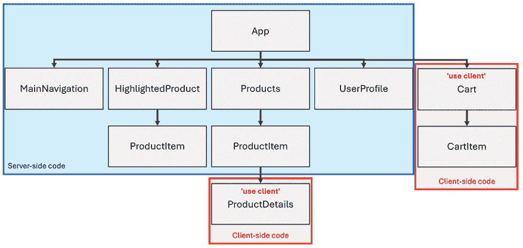

图 16.10：大多数组件都是 RSC

*图 16.10*显示了一个示例组件树，其中只有所有组件的一小部分是客户端组件。

因此问题是这样的：如何在支持 RSC 的 React 项目中结合和优化服务器和客户端组件的使用？

### 结合 RSC 和客户端组件

通常，你最终会得到大多数组件不需要是客户端组件的 React 项目（因此，它们应该是 RSCs），但有些组件函数需要在浏览器中运行（即，它们确实需要 `'use client'`）。

你可以将 `'use client'` 标记视为组件树中组件类型从服务器组件切换到客户端组件的点（参见 *图 16.9* 和 *图 16.10*）。

因此，React 允许你在同一个项目中结合这两种组件，尽管你需要遵循一些重要的规则：

+   服务器组件可以导入并渲染客户端组件（即在它们的 JSX 代码中输出客户端组件）。

+   客户端组件不得直接导入并渲染依赖于服务器功能的服务器组件。

+   客户端组件可以通过 props 隐式渲染服务器组件（例如，通过 `children` prop）。

为了使这些规则更加具体，每个情况都将通过一个具体的例子来展示。

#### 在服务器组件中输出客户端组件

你可以在服务器组件的 JSX 代码中使用客户端组件而不会出现问题。

考虑以下 `UserTodos` 组件的例子，它允许用户通过 `localStorage` 本地存储管理一系列待办事项：

```js
'use client';
import { useEffect, useRef, useState } from 'react';
export default function UserTodos() {
  const todoRef = useRef(null);
  const [todos, setTodos] = useState([]);
  useEffect(() => {
    const storedTodos = localStorage.getItem('todos');
    setTodos(storedTodos ? JSON.parse(storedTodos) : []);
  }, []);
  function handleAddTodo(event) {
    event.preventDefault();
    const todo = todoRef.current.value.trim();
    const newTodo = {
      id: new Date().getTime(),
      text: todo,
    };
    setTodos((prevTodos) => [...prevTodos, newTodo]);
    const storedTodos = localStorage.getItem('todos');
    localStorage.setItem(
      'todos',
      JSON.stringify(
        storedTodos 
          ? [...JSON.parse(storedTodos), newTodo] 
          : [newTodo]
      )
    );
  }
  return (
    <>
      <form onSubmit={handleAddTodo}>
        <input type="text" placeholder="Your to-do" ref={todoRef} />
        <button type="submit">Add</button>
      </form>
      <ul>
        {todos.map((todo) => (
          <li key={todo.id}>{todo.text}</li>
        ))}
      </ul>
    </>
  );
} 
```

由于使用了 `localStorage`（一个浏览器 API）、refs、状态（通过 `useState()` 的 `todos`）和事件监听器（通过 `onSubmit` 的 `submit`），这必须是一个客户端组件。这就是为什么在文件顶部添加了 `'use client'` 的原因。

然而，这个组件可以在服务器组件中使用而不会出现问题：

```js
import UserTodos from '../components/UserTodos';
export default function Home() {
  return (
    <main>
      <h1>Manage your to-dos with ease!</h1>
      <UserTodos />
    </main>
  );
} 
```

这是因为客户端组件也可以在服务器上渲染——它们只是不是专属于那个环境（与 RSCs 不同，RSCs 是）。换句话说：客户端组件在服务器上的渲染方式与所有组件在不支持 RSCs 的 SSR 项目中一样（例如，前一个章节中的基于 Vite 的 SSR 启用项目）。在第一次请求时渲染一个初始快照，之后客户端 React 接管并使组件活动化。

**注意**

在前面的例子中，数据是通过 `useEffect()` 从 `localStorage` 加载的。这样做是为了确保代码在服务器上运行。由于 `localStorage` 在那里不可用，如果不使用 `useEffect()` 包装访问它，将会导致错误。

由于 `useEffect()` 在服务器上被忽略，这是一种安全地使用浏览器专用 API 的方法。

#### 在客户端组件中输出服务器组件

如同在 *“use client” 也会影响子组件* 部分所述，你不能将服务器组件导入客户端组件并在那里渲染它们。

尽管在许多情况下，你不会得到错误。例如，你可能有一个如下定义的客户端 `Cart` 组件：

```js
**'use client'****;**
import { useState } from 'react';
import CartItem from './CartItem';
export default function Cart() {
  const [isVisible, setIsVisible] = useState(false);
  function handleCartVisibility() {
    setIsVisible((prevState) => !prevState);
  }
  return (
    <div id="cart">
      <button onClick={handleCartVisibility}>
        {isVisible ? 'Hide Cart' : 'Show Cart'}
      </button>
      {isVisible && (
        <ul>
          **<****CartItem****title****=****{****'****Book****'****}****quantity****=****{1}** **/>**
          **<****CartItem****title****=****{****'****Pen****'****}****quantity****=****{2}** **/>**
          **<****CartItem****title****=****{****'****Pencil****'****}****quantity****=****{5}** **/>**
        </ul>
      )}
    </div>
  );
} 
```

与 `Cart` 不同，`CartItem` 组件函数可能是一个服务器组件（即，它没有通过 `'use client'` 标记）：

```js
export default function CartItem({ title, quantity }) {
  return (
    <li>
      <article>
        <h2>{title}</h2>
        <p>Quantity: {quantity}</p>
      </article>
    </li>
  );
} 
```

这段代码之所以能正常工作，是因为之前作为服务器组件（`CartItem`）的组件，一旦被导入并用于客户端组件文件中，就简单地变成了客户端组件。

然而，如果你尝试导入并使用一个使用服务器组件特定功能（如 Node.js API 或 `async/await`）的服务器组件，你将会遇到错误信息。

例如，以下调整后的 `DynamicCartItem` 组件试图使用 Node 的 `fs` 包从文件中加载购物车项：

```js
import fs from 'node:fs/promises';
export default async function DyncamicCartItem({ id }) {
  const data = await fs.readFile(`data/cart.json`, 'utf8');
  const storedCart = JSON.parse(data);
  const cartItem = storedCart.find((item) => item.id === id);
  return (
    <li>
      <article>
        <h2>{cartItem.title}</h2>
        <p>Quantity: {cartItem.quantity}</p>
      </article>
    </li>
  );
} 
```

在 `Cart` 组件中导入和使用此组件将导致错误。

尝试运行此代码会导致屏幕上显示错误信息，因为 React 无法自动将 `CartItem` 转换为客户端组件（由于使用了 RSC 独有的功能）。因此，它会抱怨你在客户端侧尝试使用的某些服务器端代码（例如某些 Node.js API）。

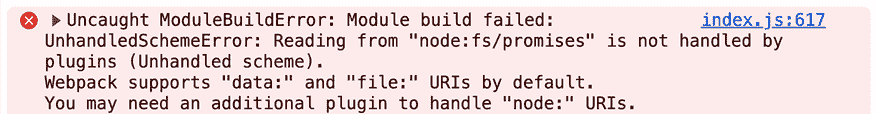

图 16.11：React 对在浏览器中使用 Node.js API 的使用表示不满

因此，在这种情况下，你需要重新构建你的应用程序，以便再次得到有效的组件组合。例如，通过将服务器组件作为 prop 传递给客户端组件，而不是直接导入和渲染它们。

#### 通过 Props 渲染服务器组件

你不能在客户端组件中导入和使用执行某些服务器端专用操作（如使用 Node.js API）的服务器组件。

但你可以修改你的客户端组件代码，使其不直接导入和使用服务器组件。相反，你可以期待从服务器组件作为 prop 获取——例如，通过你在 *第三章* 中学到的特殊 `children` prop：

```js
'use client';
import { useState } from 'react';
export default function Cart(**{ children }**) {
  const [isVisible, setIsVisible] = useState(false);
  function handleCartVisibility() {
    setIsVisible((prevState) => !prevState);
  }
  return (
    <div id="cart">
      <button onClick={handleCartVisibility}>
        {isVisible ? 'Hide Cart' : 'Show Cart'}
      </button>
      {isVisible && **<****ul****>****{children}****</****ul****>**}
    </div>
  );
} 
```

这个调整后的 `Cart` 组件仍然是一个客户端组件。然而，由于它不再直接导入和渲染 `DynamicCartItem` 服务器组件，React 才会满意。

相反，`DynamicCartItem` 组件现在是这样导入并在 `Home` 组件中输出的：

```js
import DyncamicCartItem from '../components/DynamicCartItem';
import Cart from '../components/Cart';
export default function Home() {
  return (
    <>
      <header>
        <Cart>
          <DyncamicCartItem id={1} />
          <DyncamicCartItem id={2} />
          <DyncamicCartItem id={3} />
        </Cart>
      </header>
      <main>
        <h1>Some dummy app</h1>
      </main>
    </>
  );
} 
```

`DynamicCartItem` 元素作为 `children` prop 的值传递给 `Cart` 组件。

这可能一开始看起来不太直观，但理解这一点至关重要，这是因为 `DynamicCartItem` 组件现在作为另一个服务器组件（`Home` 组件）的一部分被渲染。这是渲染过程的结果，然后作为值传递给 `Cart` 组件。因此，该组件在其组件树的部分中不包括 `DynamicCartItem` 组件。相反，`Cart` 和 `DynamicCartItem` 都是 `Home` 组件的直接子组件。

整个应用程序组件树看起来会是这样：

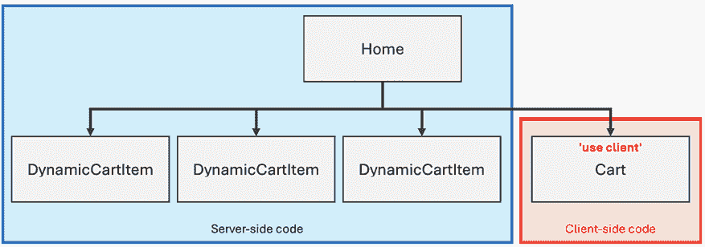

图 16.12：`DynamicCartItem` 和 `Cart` 都是 `Home` 组件的直接子组件

尽管在完成后的 UI 中，`DynamicCartItem` 可能看起来像是 `Cart` 的子组件，但从技术上讲，它并不是。

理解这一点很重要：将一个组件包裹在另一个组件中（`<Cart><DynamicCartItem /></Cart>`）会导致与在另一个组件内部渲染组件不同的组件树结构。

因此，这是一个在可能需要将服务器组件包含在客户端组件中的情况下有用的模式。

总体来说，你可以根据需要组合 RSCs 和客户端组件。此外，Next.js 还提供了一些额外的功能，可以帮助处理 RSCs 和通过 RSCs 的数据获取。

## 使用 Next.js 进行高级数据获取

如前所述，在 *理解 RSCs* 部分中，通过 RSCs 进行数据获取与在客户端组件中进行数据获取相比提供了各种优势。你不必使用 `useEffect()` 向单独的后端 API 发送 HTTP 请求，你可以直接访问数据库，可以使用 `async/await` 等。因此，在可能的情况下，绝对建议通过 RSCs 获取数据。

当使用 Next.js 时，基于 RSC 的数据获取变得更加容易，因为 Next.js 帮助在等待数据到达时显示回退内容。

### 使用 Next.js 管理加载状态

当使用 Next.js（带有 App Router）时，你可以在 `app/` 文件夹内定义 `loading.js` 文件来设置在兄弟或嵌套服务器组件加载数据时将被渲染的组件。Next.js 通过检查组件是否返回一个尚未解决的 `Promise` 来确定组件是否正在加载数据。

**注意**

下一章将更深入地探讨处理加载状态和显示回退内容。它将探索 React 的 Suspense 功能，该功能允许在数据流进时进行细粒度的加载状态管理。

考虑这个 `GoalsPage` 组件的例子，它从文件中获取数据：

```js
import fs from 'node:fs/promises';
async function fetchGoals() {
  await new Promise((resolve) => setTimeout(resolve, 3000)); // delay
  const goals = await fs.readFile('./data/user-goals.json', 'utf-8');
  return JSON.parse(goals);
}
export default async function GoalsPage() {
  const fetchedGoals = await fetchGoals();
  return (
    <>
    <h1>Top User Goals</h1>
    <ul>
      {fetchedGoals.map((goal) => (
        <li key={goal}>{goal}</li>
      ))}
    </ul>
    </>
  );
} 
```

执行实际数据获取的功能（`fetchGoals()`）内置了延迟来模拟缓慢的数据库或网络连接。

如果项目中没有添加 `loading.js` 文件，用户将在请求的页面渲染之前盯着一个空白或过时的页面几秒钟。

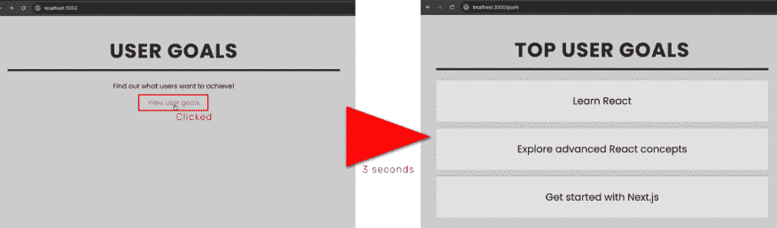

图 16.13：点击链接后，新页面需要三秒钟才能加载

这种行为发生是因为新页面尚未准备好，无法渲染，因为它仍在获取数据。

为了提高用户体验，可以在缓慢的 `app/goals/page.js` 文件旁边添加一个 `loading.js` 文件（如果需要，也可以在某个父文件夹中，因为 `loading.js` 也会为子路由显示其内容）。

在新创建的 `app/goals/loading.js` 文件中，创建了一个常规的 React 组件。像 Next.js 项目中的所有组件一样，这是一个默认的 RSC：

```js
export default function LoadingGoals() {
  return <p id="fallback">Loading user goals, please wait...</p>;
} 
```

组件名称（`LoadingGoals`）并不重要。但这个组件现在确保在用户等待`GoalsPage`加载和渲染时，屏幕上显示`Loading user goals, please wait…`的回退文本。

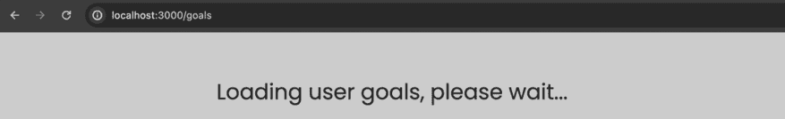

图 16.14：在页面过渡期间显示加载回退内容

当然，你可以显示任何你选择的回退内容——它不必像这个例子中那样只是简单的文本。

因此，当使用 Next.js 时，添加`loading.js`文件来定义回退组件可以极大地提高网站用户的体验。

除了获取数据外，许多 React 应用程序在某个时候也需要修改数据。

# 从数据获取到数据修改

到目前为止，你已经学到了很多关于 RSCs、客户端组件以及它们如何（以及如何不能）一起工作的知识。在*理解 RSCs*部分，你还了解了一些 RSCs 提供的优势。

当然，你也可能想修改数据，而不仅仅是加载和显示它。

## 使用服务器操作处理数据修改

React 不仅提供对 RSCs 的支持；它还允许你向应用程序添加所谓的**服务器操作**。

服务器操作建立在客户端（表单）操作相同的概念之上，这些操作在*第九章*，*使用表单操作处理用户输入和表单*中介绍并解释了。然而，正如其名称所暗示的，服务器操作将在服务器端执行，而不是在客户端。

因此，你可以使用服务器操作在服务器上检索提交的用户输入并对其进行处理。例如，你可以将提交的数据存储在文件或数据库中。

因此，当目标是为构建完全集成的全栈 React 应用程序时，服务器操作是一个重要的构建块。通常，仅数据获取是不够的，这就是为什么存在服务器操作功能。通过同时拥有 RSCs 和服务器操作，你能够在服务器上获取和修改数据，同时在需要时仍然启用交互式的客户端用户体验。

## 在 React 项目中解锁服务器操作

与 RSCs 一样，你无法在所有 React 项目中使用服务器操作。相反，需要特殊的项目设置才能使用此功能。例如，Next.js 项目支持服务器操作（当使用 App Router 时）。就像 RSCs 一样，你可以认为 Next.js 做以下事情：

+   构建工作流程和捆绑过程将属于服务器操作的代码分离出来，以便它不会最终出现在客户端捆绑中。

+   Next.js 设置 API 端点，触发服务器操作函数，并返回这些函数中定义的任何返回值。

+   当需要时（例如，提交与服务器操作连接的表单时——如下一节所示），Next.js 会调用这些端点。

因此，对于不使用 Next.js 的自定义项目来说，服务器操作（如 RSCs）可能难以支持。虽然完全有可能创建既支持服务器操作也支持 RSCs 的自定义项目，但这并非易事。

幸运的是，在使用服务器操作（在支持它们的项目中）时并不复杂。

## 定义和触发服务器操作

如同在*处理数据突变与服务器操作*章节中提到的，服务器操作与你在*第九章*中已经了解的客户表单操作非常相似。

但在创建服务器操作时，有两个关键差异必须考虑：

+   服务器操作函数必须是异步的——（即，它必须使用`async/await`）。没有同步的服务器操作。

+   在服务器操作函数中，在函数体开始时，你必须添加`'use server'`指令。

因此，一个有效的服务器操作可以像这样定义和使用：

```js
export default function UserFeedback() {
  **async****function****saveFeedback****(****formData****) {**
    **'use server'****;**
    **const** **feedback = formData.****get****(****'feedback'****);**
    **console****.****log****(feedback);**
  **}**
  return (
    <form **action****=****{saveFeedback}**>
      <p>
        <label htmlFor="feedback">Your feedback</label>
        <textarea id="feedback" name="feedback" rows={3} />
      </p>
      <p><button>Submit</button></p>
    </form>
  );
} 
```

如你所见，除了它必须是异步的并且使用`'use server'`指令之外，这个动作函数看起来与你在*第九章*中看到的类似。它接收一个`formData`对象，该对象将由 React 在表单提交时提供，并且你将`action`函数作为`<form>`元素上`action`属性的值设置。

如前文所述，如果你在浏览器下载的代码文件中搜索这段代码，你将找不到它——这段代码实际上只在服务器端运行。

**注意**

前面的示例中的`UserFeedback`组件是一个 RSC。

如果你仔细想想，这可能会有些奇怪。毕竟，这个组件确实处理了一些用户输入和交互。那么为什么它不需要`'use client'`就能工作呢？

由于服务器操作（绑定到`<form>`的`action`属性）是特殊的。React 在 RSCs 内部明确支持这种模式。`'use client'`确实对于任何其他类型的用户输入处理（例如，如果你依赖于`onSubmit`或`onChange`属性）都是必需的。但是，通过`action`属性绑定服务器操作是支持的。

此外，重要的是要理解`'use server'`指令仅用于标记操作为服务器操作。例如，你不能用它来标记组件为服务器组件。

当然，前面的示例服务器操作目前仅将输入记录到控制台。更实际的操作可能会将数据存储到某个地方，并将用户重定向到其他页面。

## 处理用户输入和更新 UI

考虑这个前面示例的更新版本：

```js
**import** **{ storeFeedback }** **from****'../lib/feedback-db'****;**
function UserFeedback() {
  async function saveFeedback(formData) {
    'use server';
    const feedback = formData.get('feedback');
    **storeFeedback****(feedback);**
  }
  return (
    <form **action****=****{saveFeedback}**>
      <p>
        <label htmlFor="feedback">Your feedback</label>
        <textarea id="feedback" name="feedback" rows={3} />
      </p>
      <p><button>Submit</button></p>
    </form>
  );
} 
```

`saveFeedback()`服务器操作现在通过`storeFeedback()`函数存储提取的反馈。

这个函数定义如下：

```js
import fs from 'node:fs/promises';
export async function storeFeedback(text) {
  const storedFeedback = await fs.readFile('data/user-feedback.json');
  const feedback = JSON.parse(storedFeedback);
  feedback.push({ id: new Date().getTime(), text });
  await fs.writeFile(
    'data/user-feedback.json', 
    JSON.stringify(feedback)
  );
} 
```

在实际应用中，数据可能会存储在数据库中。在这个简单的例子中，它只是简单地存储在`user-feedback.json`文件中，该文件是 Next.js 项目的一部分。

正如你可以从图中看出，你可以在 RSC 内部直接访问文件或数据库，同样地，你也能在 Server Action 内部直接编辑文件或发送数据库查询。

你也可以通过编程方式在之后更新 UI，将用户导航到不同的页面。在一个 Next.js 应用中，你可以使用 Next.js 提供的`redirect()`函数来触发这种导航操作——例如，在存储提交的反馈文本后：

```js
**import** **{ redirect }** **from****'next/navigation'****;**
import { storeFeedback } from '../lib/feedback-db';
export default function UserFeedback() {
  async function saveFeedback(formData) {
    'use server';
    const feedback = formData.get('feedback');
    await storeFeedback(feedback);
    **redirect****(****'/thanks'****)**
  }
  // same JSX code as before, hence omitted
} 
```

当构建全栈应用时，这是一个非常常见的模式，因为你通常希望用户提交数据后导航到不同的页面。

但你也可以使用不同的模式，根据表单提交更新包含表单的 UI。

## Server Actions 和 useActionState()

你可能还记得*第九章*中的`useActionState()` Hook，*使用表单操作处理用户输入和表单*。这个 Hook 可以用来从一个（表单）操作中推导出一些组件状态。这个状态反过来可以用来根据操作的结果更新 UI。

由于 Server Action 是一种特殊的表单操作，你可以使用相同的 Hook 根据 Server Action 及其返回值更新 UI。

例如，你可以在`UserFeedback`组件中使用`useActionState()`，如下所示：

```js
**import** **{ useActionState }** **from****'react'****;**
import { redirect } from 'next/navigation';
import { storeFeedback } from '../lib/feedback-db';
import FeedbackForm from './FeedbackForm';
export default function UserFeedback() {
  async function saveFeedback(prevState, formData) {
    'use server';
    const feedback = formData.get('feedback');
    **if** **(!feedback || feedback.****trim****() ===** **''****) {**
      **return** **{** **error****:** **'Please provide some feedback!'** **};**
    **}**
    await storeFeedback(feedback);
    redirect('/thanks');
  }
  **const** **[formState, formAction] =** **useActionState****(saveFeedback, {**
    **error****:** **null****,**
  **});**
  return (
    <form action={formAction}>
      <p>
        <label htmlFor="feedback">Your feedback</label>
        <textarea id="feedback" name="feedback" rows={3} />
      </p>
      **{formState.error &&** **<****p****id****=****"error"****>****{formState.error}****</****p****>****}**
      <p>
        <button>Submit</button>
      </p>
    </form>
  );
} 
```

然而，使用此代码会导致错误：

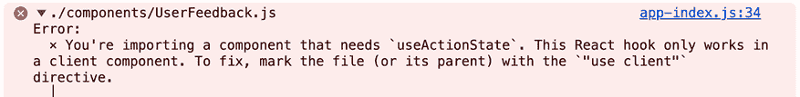

图 16.15：React 对在 RSC 中使用 Hook 表示抱怨

这是一个你已经从*Not All Components Should Be RSCs*部分和*图 16.8*中知道的错误信息。React 不允许在 RSC 中使用 Hooks——而`UserFeedback`是一个 RSC。

解决方案当然是直接的：只需在`UserFeedback.js`文件的顶部添加`'use client'`指令：

```js
**'use client'****;**
import { useActionState } from 'react';
import { redirect } from 'next/navigation';
import { storeFeedback } from '../lib/feedback-db';
import FeedbackForm from './FeedbackForm';
export default function UserFeedback() {
  // component code didn't change, hence omitted
} 
```

但应用了这个更改后，你会遇到另一个错误信息：

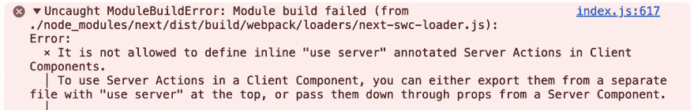

图 16.16：React 现在对同一文件中同时使用‘use server’和‘use client’表示抱怨

这个错误信息发生是因为`UserFeedback`组件文件当前正在使用`'use client'`和`'use server'`指令——在不同的地方，但同一个文件中。

换句话说：你只能在 RSC 内部定义 Server Action（因此使用`'use server'`），而不能在客户端组件内部。

解决这个问题的可能方法是将反馈表单和`useActionState()` Hook 移动到一个新的组件中，该组件将作为`UserFeedbackForm`的子组件使用。然后，可以将 Server Action 函数通过 props 传递给这个新添加的组件。

例如，你可以创建一个看起来像这样的`FeedbackForm`组件：

```js
'use client';
import { useActionState } from 'react';
export default function FeedbackForm(**{action}**) {
  const [formState, formAction] = useActionState(**action**, {
    error: null,
  });
  return (
    <form action={formAction}>
      <p>
        <label htmlFor="feedback">Your feedback</label>
        <textarea id="feedback" name="feedback" rows={3} />
      </p>
      {formState.error && <p id="error">{formState.error}</p>}
      <p>
        <button>Submit</button>
      </p>
    </form>
  );
} 
```

这个`FeedbackForm`组件期望一个`action`属性，然后将其作为值传递给`useActionState()`。因此，`FeedbackForm`组件可以在`UserFeedback`组件中使用，如下所示：

```js
import { redirect } from 'next/navigation';
import { storeFeedback } from '../lib/feedback-db';
**import****FeedbackForm****from****'./FeedbackForm'****;**
export default function UserFeedback() {
  async function saveFeedback(prevState, formData) {
    'use server';
    const feedback = formData.get('feedback');
    if (!feedback || feedback.trim() === '') {
      return { error: 'Please provide some feedback!' };
    }
    await storeFeedback(feedback);
    redirect('/thanks');
  }
  return **<****FeedbackForm****action****=****{saveFeedback}** **/>**;
} 
```

如果你运行这段代码，应用程序将没有任何问题运行。所以，就像 RSCs 一样，关键在于提出一个有效的组件结构。

这是一种绝对有效的解决问题的方式。但如果你不想将 `UserFeedback` 组件拆分成多个组件并将表单外包给 `FeedbackForm`，也有另一种可能的解决方案。

## 将服务器操作存储在单独的文件中

你可以直接在 RSCs 中定义服务器操作。正如你在上一章中学到的，你还可以通过 props 将它们传递。

作为一种替代方案，React 也允许将它们存储在单独的文件中。这样做可以让你构建更精简的组件，因为服务器操作代码被移出了组件函数。此外，React 允许将存储在单独文件中的服务器操作导入到客户端组件文件中。

考虑到之前的代码示例，你可以在 Next.js 项目文件夹中将 `saveFeedback()` 服务器操作移动到单独的 `actions/feedback.js` 文件中——尽管，文件和文件夹的名称完全由你决定。然后，你可以在该文件中将 `'use server'` 指令从服务器操作中移出，并将其放在文件顶部：

```js
'use server';
import { redirect } from 'next/navigation';
import { storeFeedback } from '../lib/feedback-db';
export async function saveFeedback(prevState, formData) {
  const feedback = formData.get('feedback');
  if (!feedback || feedback.trim() === '') {
    return { error: 'Please provide some feedback!' };
  }
  await storeFeedback(feedback);
  redirect('/thanks');
} 
```

在文件顶部添加 `'use server'` 指令可以让你在同一文件中创建多个服务器操作函数。然后你可以将它们导出并用于可能需要的任何其他文件中。

例如，你可以将 `saveFeedback()` 操作导入到 `UserFeedback` 组件中，这样现在就不需要单独的 `FeedbackForm` 子组件了。由于外部存储的服务器操作可以无问题地导入到客户端组件文件中，最终的 `UserFeedback.js` 文件看起来像这样：

```js
'use client';
**import** **{ saveFeedback }** **from****'../actions/feedback'****;**
import { useActionState } from 'react';
export default function UserFeedback() {
  const [formState, formAction] = useActionState(**saveFeedback**, {
    error: null,
  });
  return (
    <form action={formAction}>
      <p>
        <label htmlFor="feedback">Your feedback</label>
        <textarea id="feedback" name="feedback" rows={3} />
      </p>
      {formState.error && <p id="error">{formState.error}</p>}
      <p>
        <button>Submit</button>
      </p>
    </form>
  );
} 
```

因此，将服务器操作存储在单独的文件中不仅会导致组件更精简，还可以帮助防止不必要的组件重构。

尽管如此，无论你选择哪种方法，你都可以使用服务器操作来处理服务器上的表单提交。因此，结合 RSCs，你可以构建无缝融合客户端和服务器代码的全栈应用程序。

# 摘要和关键要点

+   React 支持两种特殊的服务器端功能：RSCs 和服务器操作。

+   这两个功能在 React 项目中不可用，除非项目被特别配置以支持它们——通常，因此你需要使用支持这些功能的框架（例如 Next.js）。

+   RSCs 是那些永远不会在客户端渲染的组件——相反，它们可能在服务器上（通过 HTTP 请求启动）或构建过程中渲染。

+   RSCs 返回客户端 React 会获取的渲染指令。

+   由于 RSCs 从不在客户端运行，你可以在其中使用专用于服务器的 API 和功能。

+   React 还允许 RSCs 返回 `Promise` 值，因此你可以在 RSCs 中使用 `async/await` 并无问题地异步获取数据。

+   为了构建在渲染后 UI 可能发生变化的交互式网站，你也可以通过使用`'use client'`指令将组件标记为客户端组件。

+   只有客户端组件可以使用像`useState()`这样的 Hooks 或设置事件监听器。

+   客户端组件也会在服务器上预渲染，但与 RSCs 不同，它们也可能在客户端执行。

+   你可以在 RSCs 内部导入和使用客户端组件。

+   当将服务器组件导入客户端组件时，如果可能，服务器组件会自动成为客户端组件。

+   如果 RSC 无法转换为客户端组件（例如，因为它使用了`async/await`），你需要重新构建组件树。

+   你可以通过 props 将服务器组件传递给客户端组件（无需转换）。

+   React 通过服务器操作帮助处理服务器上的表单提交。

+   服务器操作类似于客户端操作（见*第九章*）但必须是异步的（`async/await`）并使用`'use server'`指令。

+   你可以在 RSCs 内部或单独的文件中定义服务器操作——在后一种情况下，你可以将`'use server'`指令移动到文件顶部以在同一个文件中定义多个服务器操作。

## 接下来是什么？

在本章中，你了解了 RSCs 和服务器操作。你了解到创建和使用它们相对简单，但在项目中支持它们并不容易——因此，像 Next.js 这样的框架通常被用来利用这些功能。

本章让你了解了 RSCs 和服务器操作在幕后是如何工作的，以及这些功能提供了哪些优势。在本章中，你还了解了客户端组件以及如何结合服务器和客户端组件。最后，讨论了服务器操作，并展示了定义和使用服务器操作的不同方法。

下一章将在此基础上构建，并探讨 React 的**Suspense**功能如何在数据流式传输时显示回退内容方面可能有所帮助。

## 测试你的知识！

通过回答以下问题来测试你对本章涵盖的概念的了解。然后，你可以将你的答案与可以在[`github.com/mschwarzmueller/book-react-key-concepts-e2/blob/16-rsc-server-actions/exercises/questions-answers.md`](https://github.com/mschwarzmueller/book-react-key-concepts-e2/blob/16-rsc-server-actions/exercises/questions-answers.md)找到的示例进行比较。:

1.  React 服务器组件的标志性特征是什么？

1.  React 服务器组件解决了哪些问题？

1.  如何在 Next.js 项目中创建和使用 React 服务器组件？

1.  为什么 React 服务器组件和服务器操作不能在所有 React 项目中使用？

1.  服务器端渲染（SSR）和 React 服务器组件（RSCs）之间的关键区别是什么？

1.  `'use client'`指令的目的是什么？

1.  `'use client'`指令如何影响子组件？

1.  服务器组件和客户端组件的组合规则是什么？

1.  你如何在 Next.js 中使用 RSCs 获取数据的同时处理加载状态？

1.  React 中的服务器动作是什么，它们与客户端动作有何不同？

1.  如何触发服务器动作？

1.  如何在服务器动作之后更新 UI？

1.  你能否在单独的文件中定义服务器动作？

# 应用所学知识

在了解了关于 Next.js 的所有新知识后，是时候将其应用到实际演示项目中——一个将在服务器上渲染的演示应用程序。

在下一节中，你将找到一个活动，让你练习使用 Next.js。一如既往，你还需要应用前面章节中介绍的一些概念。

## 活动十六点一：构建一个迷你博客

在这个活动中，你的任务是构建一个非常简单的博客网站（使用 Next.js），允许用户创建和查看博客文章。每篇博客文章应包括标题、日期和正文文本。博客文章标题和日期列表应在起始页（`/`）上渲染；点击文章后，用户应被带到详情页（`/blog/<some-id>`），显示完整的博客文章数据。`/blog/new`页应显示一个表单，可以用来创建新文章。

文章应存储在`posts.json`文件中（可能只是存储文章对象的数组）。创建新文章后，用户应被重定向到该文章的详情页。如果用户留空标题或正文字段（或两者都留空），则应在表单下方显示错误消息。

**注意**

你可以在[`github.com/mschwarzmueller/book-react-key-concepts-e2/tree/16-rsc-server-actions/activities/practice-1-start`](https://github.com/mschwarzmueller/book-react-key-concepts-e2/tree/16-rsc-server-actions/activities/practice-1-start)找到这个活动的起始项目快照。下载此代码时，你将始终下载整个仓库。请确保然后导航到包含起始代码的子文件夹（在这个例子中是`activities/practice-1-start`），以使用正确的代码快照。

在提供的起始项目中，你可以探索`globals.css`文件，以了解你可能想要使用的元素和元素结构，以利用提供的样式。当然，你也可以设置并使用你自己的样式。

下载代码并在项目文件夹中运行`npm install`以安装所有必需的依赖项后，解决方案步骤如下：

1.  为三个页面添加三个新的`page.js`文件（以及适当的文件夹结构）：`/`、`/blog/new`和`/blog/<some-id>`。

1.  在根项目文件夹的`data/`文件夹中添加一个新的`posts.json`文件。该文件最初应存储一个空数组。

1.  在`/blog/new`页面上输出一个包含标题和正文输入字段的`<form>`。

1.  在单独的文件中创建一个新的服务器操作，并将其导入并“连接”到`<form>`。服务器操作应检索输入的标题和正文文本，创建一个新的对象，该对象还包括 ID 和创建日期快照，并将这些数据存储在`posts.json`文件中。数据必须以不会丢失现有博客文章的方式存储。

1.  更新服务器操作以实现输入验证，并在提交按钮上方输出验证结果。

1.  在起始页面获取博客文章，并输出博客文章列表（标题和日期）。每篇文章都应该是可点击的，并带用户到详情页面。

1.  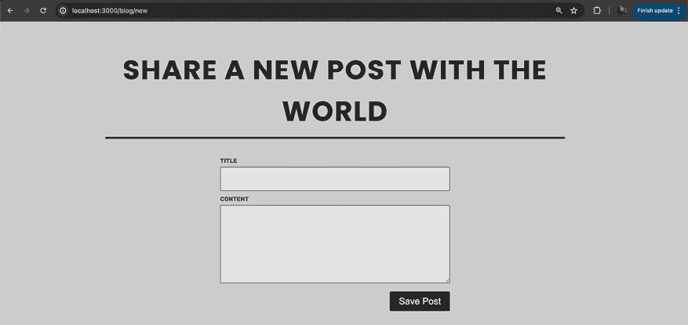

1.  最后，在创建博客文章后，从服务器操作内部将用户重定向到适当的详情页面。

最终页面应如下截图所示：

在详情页面上，通过使用 ID 获取并输出博客文章的详细信息。

图 16.17：主页，显示博客文章列表


图 16.18：/blog/new 页面，等待用户输入

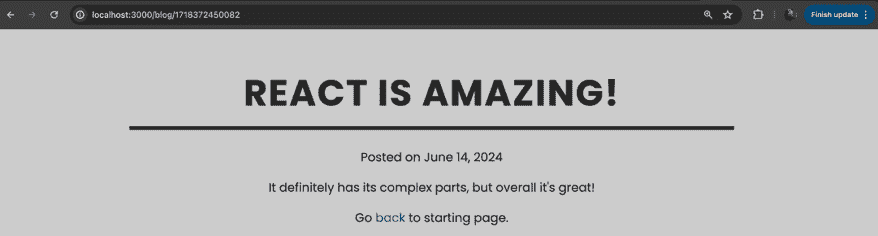


**注意**

您可以在此处找到此活动的完整代码和一个示例解决方案：[`github.com/mschwarzmueller/book-react-key-concepts-e2/tree/16-rsc-server-actions/activities/practice-1`](https://github.com/mschwarzmueller/book-react-key-concepts-e2/tree/16-rsc-server-actions/activities/practice-1)。
