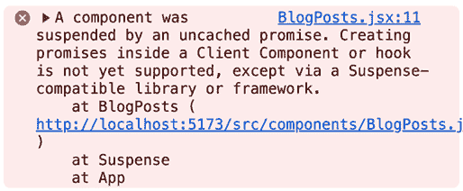
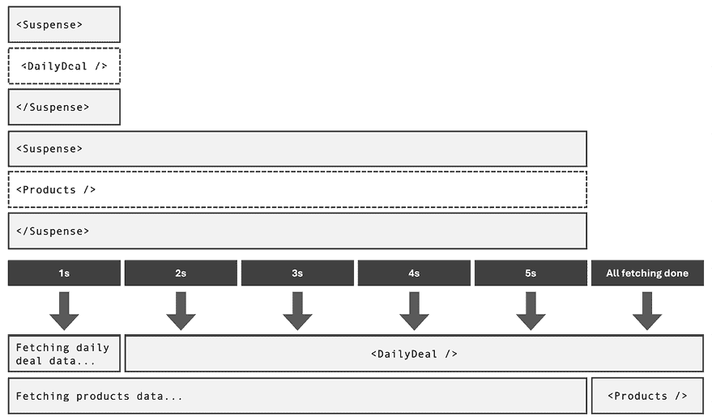
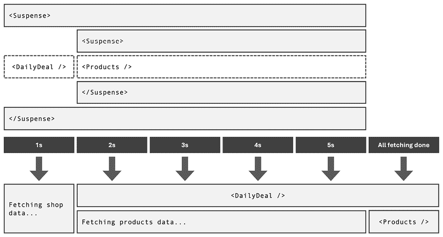
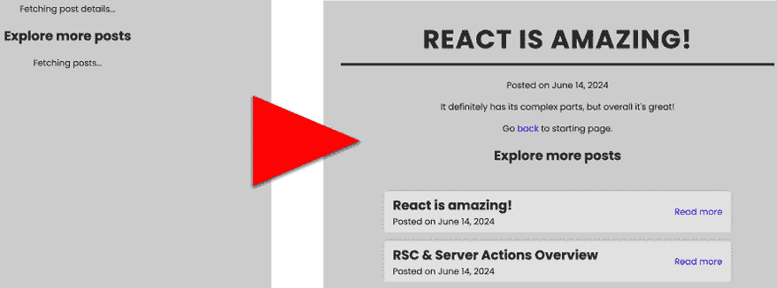

# 第十七章：理解 React Suspense 与 use() 钩子

学习目标

到本章结束时，你将能够做到以下内容：

+   描述 React 的 Suspense 功能的目的和功能

+   使用 RSCs 与 Suspense 一起显示细粒度的回退内容

+   使用 React 的 `use()` 钩子为客户端组件提供 Suspense

+   为数据获取和回退内容应用不同的 Suspense 策略

# 简介

在 *第十章* ，*React 和优化机会背后的场景* 中，在 *通过代码拆分（懒加载）减少包大小* 部分中，你学习了 React 的 `<Suspense>` 组件及其如何在懒加载和代码拆分的上下文中使用，以在下载代码包时显示回退内容。

如该处所述，`Suspense` 组件的目的是简化显示回退内容的过程，这反过来可以提高用户体验。由于大多数用户都不喜欢盯着过时的内容或空白页面，因此拥有一个显示替代内容的内置功能非常方便。

在本章中，你将了解到 React 的 `Suspense` 组件不仅限于用于代码拆分。相反，它还可以用于数据获取，在数据加载时显示一些临时内容（例如，从数据库中）。然而，正如你也将学到的，`Suspense` 只能在以特定方式获取数据时用于数据获取。

此外，本章将重新探讨在 *第十一章* ，*处理复杂状态* 中引入的 `use()` 钩子。正如你将学到的，除了用于获取上下文值之外，这个钩子还可以与 `Suspense` 一起使用。

# 使用 Suspense 显示细粒度的回退内容

当获取数据或下载资源（例如，代码文件）时，可能会出现加载延迟——这些延迟可能导致糟糕的用户体验。因此，你应该考虑在等待请求的资源时显示一些临时的回退内容。

因此，为了简化在等待某些资源时渲染回退内容的过程，React 提供了其 `Suspense` 组件。如 *第十章* ，*React 和优化机会背后的场景* 所示，你可以将 `Suspense` 组件用作围绕 React 元素的包装器，这些元素会获取一些代码或数据。例如，当在代码拆分的情况下使用它时，你可以显示一些临时的回退内容，如下所示：

```js
import { lazy, **Suspense**, useState } from 'react';
const DateCalculator = lazy(() => import(
    './components/DateCalculator.jsx'
  )
);
function App() {
  const [showDateCalc, setShowDateCalc] = useState(false);
  function handleOpenDateCalc() {
    setShowDateCalc(true);
  }
  return (
    <>
      <p>This app might be doing all kinds of things.</p>
      <p>
        But you can also open a calculator which calculates 
        the difference between two dates.
      </p>
      <button onClick={handleOpenDateCalc}>Open Calculator</button>
      **<****Suspense****fallback****=****{****<****p****>****Loading...****</****p****>****}>**
        {showDateCalc && <DateCalculator />}
      **</****Suspense****>**
    </>
  );
} 
```

在这个例子（它来自一个基于 Vite 的常规 React 项目）中，React 的 `Suspense` 组件被包裹在条件渲染的 `DateCalculator` 组件周围。`DateCalculator` 是通过 React 的 `lazy()` 函数创建的，该函数用于按需（即按需）加载属于此组件的代码包。

因此，整个其他页面的内容从一开始就全部显示出来。在获取代码的过程中，只有条件性显示的`DateCalculator`组件被替换为回退内容（`<p>Loading...</p>`），而其他内容保持不变。因此，`Suspense`在非常细粒度级别上渲染一些回退 JSX 代码。与用临时内容替换整个页面或组件标记不同，这里只替换了 UI 的一小部分。

当然，`Suspense`因此提供了一种在获取数据时也很希望拥有的功能——毕竟，延迟在那里也经常发生。

## 使用 Next.js 进行数据获取的 Suspend

如前一章中所述，在*使用 Next.js 管理加载状态*部分，数据获取的过程也常常伴随着等待时间，这可能会对用户体验产生负面影响。这就是为什么，在同一部分中，你学习了 Next.js 允许你定义一个`loading.js`文件，该文件包含一些在延迟期间渲染的回退组件。

然而，使用这种方法实际上是用加载回退组件内容替换了整个页面（或该页面的主要区域）。但这并不总是理想的——你可能在获取数据时更希望在一个更细粒度级别上显示一些加载回退内容。

幸运的是，在 Next.js 项目中，你可以像前一个示例中那样使用`Suspense`，将其包裹在获取数据的组件周围。由于 Next.js 支持 HTTP 响应流，它能够在数据可用时立即渲染页面的其余部分，并将依赖于获取数据的内 容流式传输到客户端。在数据加载并可用之前，`Suspense`将渲染其定义的回退内容。

因此，回到第十六章*React 服务器组件与服务器操作*中*使用 Next.js 管理加载状态*的例子，你可以通过将数据获取代码外包给一个单独的`UserGoals`组件来利用`Suspense`：

```js
import fs from 'node:fs/promises';
async function fetchGoals() {
  await new Promise((resolve) => setTimeout(resolve, 3000)); // delay
  const goals = await fs.readFile('./data/user-goals.json', 'utf-8');
  return JSON.parse(goals);
}
export default async function UserGoals() {
  const fetchedGoals = await fetchGoals();
  return (
    <ul>
      {fetchedGoals.map((goal) => (
        <li key={goal}>{goal}</li>
      ))}
    </ul>
  );
} 
```

然后，可以在`GoalsPage`组件中将`UserGoals`组件包裹在`Suspense`中，如下所示：

```js
import { Suspense } from 'react';
import UserGoals from '../../components/UserGoals';
export default async function GoalsPage() {
  return (
    <>
      <h1>Top User Goals</h1>
      <Suspense fallback={
        <p id="fallback">Fetching user goals...</p>}
      >
        <UserGoals />
      </Suspense>
    </>
  );
} 
```

此代码现在利用 React 的`Suspense`组件在`UserGoals`组件获取数据时显示回退段落。

**注意**

你可以在 GitHub 上找到完整的演示项目代码：[`github.com/mschwarzmueller/book-react-key-concepts-e2/tree/17-suspense-use/examples/02-data-fetching-suspense`](https://github.com/mschwarzmueller/book-react-key-concepts-e2/tree/17-suspense-use/examples/02-data-fetching-suspense)。

因此，当用户导航到`/goals`时，他们立即看到标题（`<h1>`元素）与回退内容的组合。不再需要单独的`loading.js`文件。


图 17.1：回退内容作为目标页面的一部分显示，而不是完全替换它

然而，在这种情况下使用 `Suspense` 的优势不仅仅是 `loading.js` 文件不再需要。相反，现在可以非常细致地管理数据获取和回退内容。

例如，在一个更复杂的在线商店应用程序中，你可能有一个这样的组件：

```js
function ShopOverviewPage() {
  return (
    <>
      <header>
        <h1>Find your next deal!</h1>
        <MainNavigation />
      </header>
      <main>
        <Suspense fallback={<DailyDealSkeleton />}>
          <DailyDeal />
        </Suspense>
        <section id="search">
          <h2>Looking for something specific?</h2>
          <Search />
        </section>
        <Suspense fallback={<p>Fetching products...</p>}>
          <Products />
        </Suspense>
      </main>
    </>
  );
} 
```

在这个例子中，`<header>` 和 `<section id="search">` 元素始终可见并渲染。另一方面，`<DailyDeal />` 和 `<Products />` 只在它们的数据被获取后渲染。在此之前，将显示各自的回退内容。


图 17.2：最初显示占位符，直到加载的数据流进并渲染到屏幕上

`<DailyDeal />` 和 `<Products />` 将独立于彼此加载和渲染，因为它们被两个不同的 `Suspense` 块包裹。因此，用户将立即看到页眉和搜索区域，然后最终看到每日特价和产品——尽管这两个中的任何一个都可能先加载和渲染。

这些示例中重要的是，被 `Suspense` 包裹的组件是使用 `async/await` 的 RSCs。正如你将在下一节中学习的，并非所有 React 组件都会与 `Suspense` 组件交互。但在 Next.js 项目中，React Server Components 会。

## 在其他 React 项目中使用 `Suspense`—可能，但棘手

上一节探讨了如何在 Next.js 项目中使用 `Suspense` 来利用 RSCs 进行数据获取。

然而，`Suspense` 不是一个 Next.js 特有的功能或概念——相反，它是 React 本身提供的。因此，你可以在任何 React 项目中使用它来在数据获取时显示回退内容。

至少，这是理论上的。但实际情况是，你无法与所有组件和数据获取策略一起使用它。

### `Suspense` 与 `useEffect()` 不兼容

由于通过 `useEffect()` 获取数据是一种常见策略，你可能会倾向于将 `Suspense` 与此 Hook 结合使用，在数据通过效果函数加载时显示一些回退内容。

例如，以下 `BlogPosts` 组件使用 `useEffect()` 来加载和显示一些博客文章：

```js
import { useEffect, useState } from 'react';
function BlogPosts() {
  const [posts, setPosts] = useState([]);
  useEffect(() => {
    async function fetchBlogPosts() {
      // simulate slow network
      await new Promise((resolve) => setTimeout(resolve, 3000));
      const response = await fetch(
        'https://jsonplaceholder.typicode.com/posts'
      );
      const posts = await response.json();
      setPosts(posts);
    }
    fetchBlogPosts();
  }, []);
  return (
    <ul>
      {posts.map((post) => (
        <li key={post.id}>{post.title}</li>
      ))}
    </ul>
  );
} 
```

你可以将这个组件用 `Suspense` 包裹，如下所示：

```js
import { Suspense } from 'react';
import BlogPosts from './components/BlogPosts.jsx';
function App() {
  return (
    <>
      <h1>All posts</h1>
      <Suspense fallback={<p>Fetching blog posts...</p>}>
        <BlogPosts />
      </Suspense>
    </>
  );
} 
```

但不幸的是，这不会按预期工作。在数据获取时，不会渲染任何内容，而是显示回退内容。

这种行为的原因是 `Suspense` 的目的是在组件渲染过程中获取数据时挂起——而不是在某个效果函数内部获取数据时。

这有助于回忆 `useEffect()` 的工作原理（来自 *第八章* ，*处理副作用*）：效果函数在组件函数执行之后执行，即，在第一个组件渲染周期完成后。

因此，在通过 `useEffect()` 获取数据时，你不能使用 `Suspense` 来显示回退内容。相反，在这些情况下，你需要手动管理并使用执行数据获取的组件中的某些加载状态（即通过手动管理不同的状态片段，如 `isLoading` ——例如，如在第十一章 *处理复杂状态* 中所述，在 *useState() 的局限性* 和 *使用 useReducer() 管理状态* 部分中展示）。

### 在渲染过程中获取数据——错误的方式

由于 `Suspense` 的目的是在组件在渲染过程中获取数据时显示回退内容，你可以尝试重新编写 `BlogPosts` 组件，使其看起来像这样：

```js
async function BlogPosts() {
  await new Promise((resolve) => setTimeout(resolve, 3000));
  const response = await fetch(
    'https://jsonplaceholder.typicode.com/posts'
  );
  const posts = await response.json();
  return (
    <ul>
      {posts.map((post) => (
        <li key={post.id}>{post.title}</li>
      ))}
    </ul>
  );
} 
```

但尝试使用此代码将在浏览器开发者工具中产生错误：


图 17.3：React 在客户端对异步组件发出警告

React 不支持在客户端组件中使用 `async/await`。只有 React Server Components 可以使用该语法（因此返回承诺）。因此，未设置以支持 RSCs 的常规 React 项目无法使用此解决方案。

当然，你可以想出一个（有问题的）替代方案，如下所示：

```js
function BlogPosts() {
  const [posts, setPosts] = useState([]);
  new Promise(() => setTimeout(() => {
    return fetch(
      'https://jsonplaceholder.typicode.com/posts'
    ).then(response => response.json())
     .then(fetchedPosts => setPosts(fetchedPosts));
  }, 3000));
  return (
    <ul>
      {posts.map((post) => (
        <li key={post.id}>{post.title}</li>
      ))}
    </ul>
  );
} 
```

但这种方法已经在第八章 *处理副作用* 中的 *问题是什么？* 部分中被弃用——该代码创建了一个无限循环。

所以，如果不与 RSCs（React Server Components）一起工作，将数据获取作为组件渲染过程的一部分是非常困难的。

### 获取 Suspense 支持颇具挑战性

由于 `Suspense` 需要在渲染过程中进行数据获取，这很难手动设置，因此 React 文档（[`react.dev/reference/react/Suspense#displaying-a-fallback-while-content-is-loading`](https://react.dev/reference/react/Suspense#displaying-a-fallback-while-content-is-loading)）本身提到：“只有启用 `Suspense` 的数据源才会激活 `Suspense` 组件”，进一步说明这些数据源包括：

+   使用像 Relay 和 Next.js 这样的 `Suspense` 启用框架进行数据获取

+   使用 `lazy()` 懒加载组件代码

+   使用 `use()` 读取 Promise 的值

在同一页面上，官方文档强调：“尚未支持使用非意见化框架启用 `Suspense` 的数据获取。”

**注意**

文档可能会随着时间的推移而改变——React 也是如此。但即使在你阅读此内容时，确切的措辞可能有所不同，使用 `Suspense` 的方式以及它不能在没有特殊库或 `lazy()` 等功能的情况下使用的事实，极不可能改变。

这章是在 React 19 发布时编写的。你可以访问这本书的官方变更日志，以了解自那时以来是否有什么重大变化：[`github.com/mschwarzmueller/book-react-key-concepts-e2/blob/main/CHANGELOG.md`](https://github.com/mschwarzmueller/book-react-key-concepts-e2/blob/main/CHANGELOG.md)。

因此，除非你打算构建自己的具有 `Suspense` 功能的库，否则你必须坚持使用 `Suspense` 进行代码拆分（通过 `lazy()`），使用与 `Suspense` 集成的第三方框架或库，或者探索 `use()` 钩子的使用。

当然，`lazy()` 函数（以及如何与 `Suspense` 一起使用）已经在 *第十章* 的 *Behind the Scenes of React and Optimization Opportunities* 部分的 *Reducing Bundle Sizes via Code Splitting (Lazy Loading)* 中进行了介绍。但其他两个选项——具有 `Suspense` 功能的库和 `use()` 钩子——又是如何的呢？

### 使用支持库进行数据获取的 Suspense

如你在 *Using Suspense for Data Fetching with Next.js* 部分所学，当使用 Next.js 时，你可以使用 `Suspense` 进行数据获取。但尽管 Next.js 是支持 `Suspense` 的最受欢迎的 React 框架之一，但它并不是你唯一的选择。

例如，TanStack Query（之前称为 React Query）是另一个流行的第三方库，它为数据获取解锁了 `Suspense`。这个库与 Next.js 不同，不是一个旨在帮助构建全栈 React 应用或运行服务器端代码的库。相反，TanStack Query 是一个专注于帮助客户端数据获取、数据变更和异步状态管理的库。由于它在客户端运行，因此它也适用于没有集成 SSR 和 RSC 的 React 项目——尽管你也可以在这样项目中使用它。

TanStack Query 是一个复杂且功能丰富的库——我们可能可以写一本书来专门介绍它。但以下简短的代码片段（来自一个基于 Vite 的项目，而不是 Next.js 项目）展示了如何借助该库获取数据：

```js
import { useSuspenseQuery } from '@tanstack/react-query';
async function fetchPosts() {
  await new Promise((resolve) => setTimeout(resolve, 3000));
  const response = await fetch('https://jsonplaceholder.typicode.com/posts');
  const posts = await response.json();
  return posts;
}
function BlogPosts() {
  const {data} = useSuspenseQuery({
    queryKey: ['posts'],
    queryFn: fetchPosts
  });
  return (
    <ul>
      {data.map((post) => (
        <li key={post.id}>{post.title}</li>
      ))}
    </ul>
  );
} 
```

在这个例子中，`BlogPosts` 组件使用 TanStack Query 的 `useSuspenseQuery()` 钩子，结合自定义的 `fetchPosts()` 函数，通过 HTTP 请求获取数据。正如钩子的名字所暗示的，它与 React 的 `Suspense` 组件集成。

因此，`BlogPosts` 组件可以像这样被 `Suspense` 包裹：

```js
import { Suspense } from 'react';
import BlogPosts from './components/BlogPosts.jsx';
function App() {
  return (
    <>
      <h1>All posts</h1>
      <Suspense fallback={<p>Fetching blog posts...</p>}>
        <BlogPosts />
      </Suspense>
    </>
  );
} 
```

正如你所知，`Suspense` 的使用方式与 `lazy()` 或 Next.js 中的使用方式相同。因此，其功能和使用方式没有改变——如果你正在将 `Suspense` 包裹在一个与 `Suspense` 集成的组件周围（例如 `BlogPost` 通过 TanStack Query 的 `useSuspenseQuery()` 钩子），则可以使用 `Suspense` 在数据获取过程进行时输出一些后备内容。

**注意**

你可以在 GitHub 上找到完整的示例项目：[`github.com/mschwarzmueller/book-react-key-concepts-e2/tree/17-suspense-use/examples/05-tanstack-query`](https://github.com/mschwarzmueller/book-react-key-concepts-e2/tree/17-suspense-use/examples/05-tanstack-query)。

当然，这只是一个简单的例子。你可以用 TanStack Query 做更多的事情，还有其他可以与 `Suspense` 一起使用的库。重要的是要理解，除了 Next.js 之外，还有其他选择。但也要牢记，并非所有代码（以及并非所有库）都适用于 `Suspense`。

除了使用直接与 `Suspense` 集成的库（如通过 `useSuspenseQuery()` 钩子的 TanStack Query），你还可以借助 React 的内置 `use()` 钩子使用 `Suspense` 进行数据获取。

### 渲染时使用数据

React 提供的 `use()` 钩子不仅限于访问上下文值，如第十一章 *处理复杂状态* 中所示——相反，它还可以用来从承诺中读取值。

因此，你可以在组件的渲染过程中使用 `use()` 钩子来提取和使用承诺的值。`use()` 将自动与任何包装的 `Suspense` 组件交互，并让它了解数据获取过程的当前状态（即承诺是否已解决）。

因此，可以从 *渲染时获取数据——错误方式* 部分的示例调整为使用 `use()` 钩子，如下所示：

```js
**import** **{ use }** **from****'react'****;**
async function fetchPosts() {
  await new Promise((resolve) => setTimeout(resolve, 3000));
  const response = await fetch(
    'https://jsonplaceholder.typicode.com/posts'
  );
  const posts = await response.json();
  return posts;
}
function BlogPosts() {
  **const** **posts =** **use****(****fetchPosts****());**
  return (
    <ul>
      {posts.map((post) => (
        <li key={post.id}>{post.title}</li>
      ))}
    </ul>
  );
} 
```

`BlogPosts` 组件现在不再是一个使用 `async/await` 的组件。相反，它使用导入的 `use()` 钩子来读取调用 `fetchPosts()` 生成的承诺的值。

如前所述，`use()` 与 `Suspense` 交互，因此 `BlogPosts` 可以像这样被 `Suspense` 包装：

```js
import { Suspense } from 'react';
import BlogPosts from './components/BlogPosts.jsx';
function App() {
  return (
    <>
      <h1>All posts</h1>
      <Suspense fallback={<p>Fetching blog posts...</p>}>
        <BlogPosts />
      </Suspense>
    </>
  );
} 
```

当运行此代码时，它可能按预期工作（取决于你使用的 React 版本），但更有可能不会产生任何结果，甚至在浏览器开发者工具中显示错误消息：



图 17.4：use() 钩子仅与由 Suspense 兼容库创建的承诺一起工作

如此错误消息所述，`use()` 钩子不打算与像上一个例子中创建的常规承诺一起使用。相反，它应该用于由 *Suspense 兼容* 库或框架提供的承诺。

**注意**

如果你想要违背官方建议并尝试构建支持 `use()` 和 `Suspense` 的承诺，你可以探索官方 React 文档中链接的官方 `Suspense` 示例项目（[`19.react.dev/reference/react/Suspense`](https://19.react.dev/reference/react/Suspense)）——例如，这个项目：[`codesandbox.io/p/sandbox/strange-black-6j7nnj`](https://codesandbox.io/p/sandbox/strange-black-6j7nnj)。

请注意，正如文档中提到的，该演示项目使用的是不稳定 API，可能无法与未来的 React 版本兼容。

因此，再次强调，需要第三方框架或库的支持。无论你尝试使用`Suspense`与在渲染过程中获取数据的组件（无论是否使用`use()`）一起使用，你最终都需要帮助。

换句话说：为了利用`Suspense`，你需要直接通过一个与`Suspense`兼容的库或框架获取数据，或者你需要在一个由与`Suspense`兼容的库或框架生成的 promise 上使用`use()` Hook。

其中一个这样的框架又是 Next.js。除了在 RSC 周围使用`Suspense`（如*使用 Next.js 进行数据获取的 suspense*部分所示），你还可以将`Suspense`与 Next.js 生成的 promise 的`use()` Hook 结合使用。

#### 使用 Next.js 创建的 promise 与 use()结合使用

Next.js 项目能够创建与`use()`和`Suspense`一起工作的 promise。更准确地说，你在 RSC 中创建并传递给（客户端）组件的任何 promise 都符合`use()`能用的 promise。

考虑以下示例代码：

```js
import fs from 'node:fs/promises';
import UserGoals from '../../components/UserGoals';
async function fetchGoals() {
  await new Promise((resolve) => setTimeout(resolve, 3000)); // delay
  const goals = await fs.readFile('./data/user-goals.json', 'utf-8');
  return JSON.parse(goals);
}
export default function GoalsPage() {
  **const** **fetchGoalsPromise =** **fetchGoals****();**
  return (
    <>
      <h1>Top User Goals</h1>
      <UserGoals **promise****=****{fetchGoalsPromise}** />
    </>
  );
} 
```

在这个代码片段中，通过调用`fetchGoals()`创建了一个 promise，并将其存储在一个名为`fetchGoalsPromise`的常量中。然后，创建的 promise（`fetchGoalsPromise`）被作为`promise` prop 的值传递给`UserGoals`组件。

此外，这个`UserGoals`组件与另一个组件一起定义在`UserGoals.js`文件中，如下所示：

```js
import { use, Suspense } from 'react';
function Goals({ fetchGoalsPromise }) {
  const goals = use(fetchGoalsPromise);
  return (
    <ul>
      {goals.map((goal) => (
        <li key={goal}>{goal}</li>
      ))}
    </ul>
  );
}
export default function UserGoals({ promise }) {
  return (
    <Suspense fallback={<p id="fallback">Fetching user goals...</p>}>
      <Goals fetchGoalsPromise={promise} />
    </Suspense>
  );
} 
```

在这个代码示例中，`UserGoals`组件使用`Suspense`包裹`Goals`组件，并将接收到的`promise` prop 值（通过`fetchGoalsPromise` prop）转发给该组件。然后，`Goals`组件通过`use()` Hook 读取该 promise 值。

由于 promise 是在由 Next.js 管理的 RSC（`GoalsPage`）中创建的，React 不会对此代码提出异议——Next.js 创建了与`use()`一起工作的 promise。相反，它会在数据获取时显示后备内容（`<p id="fallback">Fetching user goals...</p>`），一旦数据到达并被流式传输到客户端，就会渲染最终的用户界面。

如前所述，任何未被`Suspense`包裹的元素（例如，本例中的`<h1>`元素）将立即显示。


图 17.5：当通过`use()`获取数据时，后备文本显示在标题旁边

值得注意的是，`UserGoals`和`Goals`也都是 RSC（React Server Components），尽管如此，它们仍然可以使用`use()` Hook。

通常，Hooks 不能在 RSC 中使用，但`use()` Hook 是特殊的。正如它可以在`if`语句或循环中使用（如第十一章*处理复杂状态*中所述），它可以在服务器和客户端组件中执行。

然而，当与服务器组件一起工作时，你也可以简单地使用`async/await`而不是`use()`。因此，`use()`钩子实际上只有在客户端组件中读取 promise 值时才真正有用——在那里，`async/await`不可用。

#### 在客户端组件中使用 use()

除了用于访问上下文之外，`use()`钩子被引入是为了帮助在客户端组件中读取 promise 值——即在你不能使用`async/await`的情况下。

考虑这个更新的*用户目标*示例，其中管理了一些状态并触发了一个副作用：

```js
**'use client'****;**
import { use, Suspense, **useEffect,****useState**  } from 'react';
// sendAnalytics() is a dummy function that just logs to the console
import { sendAnalytics } from '../lib/analytics';
function Goals({ fetchGoalsPromise }) {
  **const** **[mainGoal, setMainGoal] =** **useState****();**
  const goals = use(fetchGoalsPromise);
  function handleSetMainGoal(goal) {
    setMainGoal(goal);
  }
  return (
    <ul>
      {goals.map((goal) => (
        <li
          key={goal}
          id={goal === mainGoal ? 'main-goal' : undefined}
          onClick={() => handleSetMainGoal(goal)}
        >
          {goal}
        </li>
      ))}
    </ul>
  );
}
export default function UserGoals({ promise }) {
  **useEffect****(****() =>** **{**
    **sendAnalytics****(****'user-goals-loaded'****, navigator.****userAgent****);**
  **}, []);**
  return (
    <Suspense fallback={<p id="fallback">Fetching user goals...</p>}>
      <Goals fetchGoalsPromise={promise} />
    </Suspense>
  );
} 
```

在这个例子中，`Goals`组件使用`useState()`来管理用户标记为主要目标的目标信息。此外，`UserGoals`组件（使用`Suspense`）利用`useEffect()`钩子在一旦组件渲染时发送一个分析事件（即在挂起的`Goals`组件显示之前）。由于使用了所有这些客户端特有的功能，需要`use client`指令。

因此，`async/await`不能在`Goals`和`UserGoals`组件中使用。但由于`use()`钩子可以在客户端组件中使用，它为这种情况提供了一种可能的解决方案。而且，由于这个例子来自 Next.js 应用程序，React 不会对`use()`消耗的 promise 类型提出异议。相反，这段示例代码会导致在获取目标数据时显示后备内容。

# Suspense 使用模式

如你所学，`Suspense`组件可以包裹在那些在渲染过程中获取数据的组件周围——只要它们以合规的方式进行。

当然，在许多项目中，你可能会有多个组件需要获取数据，并且在获取数据的同时应该显示一些后备内容。幸运的是，你可以根据需要频繁地使用`Suspense`组件——你甚至可以将多个`Suspense`组件相互组合。

## 一起揭示内容

到目前为止，在所有示例中，`Suspense`总是包裹在恰好一个组件周围。但没有任何规则阻止你将`Suspense`包裹在多个组件周围。

例如，以下代码是有效的：

```js
function Shop() {
  return (
    <>
      <h1>Welcome to our shop!</h1>
      <Suspense fallback={<p>Fetching shop data...</p>}>
        <DailyDeal />
        <Products />
      </Suspense>
    </>
  );
} 
```

在这个代码片段中，`DailyDeal`和`Products`组件的数据获取是同时开始的。由于这两个组件都被一个单一的`Suspense`组件包裹，后备内容在两个组件完成数据获取之前会显示。所以，如果一个组件（例如`DailyDeal`）在一秒后完成，而另一个组件（`Products`）需要五秒，这两个组件只有在五秒后才会被揭示（并替换后备内容）。


图 17.6：数据并行获取，并通过 Suspense 显示后备内容，直到所有组件完成

## 尽快揭示内容

当然，有些情况下，您可能希望为多个组件显示后备内容，但又不希望等待所有组件完成数据获取后才显示任何获取的内容。

在这种情况下，您可以使用 `Suspense` 多次：

```js
function Shop() {
  return (
    <>
      <h1>Welcome to our shop!</h1>
      <Suspense fallback={<p>Fetching daily deal data...</p>}>
        <DailyDeal />
      </Suspense>
      <Suspense fallback={<p>Fetching products data...</p>}>
        <Products />
      </Suspense>
    </>
  );
} 
```

在这个调整后的代码示例中，`DailyDeal` 和 `Products` 分别被两个不同的 `Suspense` 组件包裹。因此，每个组件的内容将在可用时被揭示，独立于其他组件的数据获取状态。



图 17.7：每个组件在完成数据获取后用最终内容替换其后备内容

## 嵌套挂起内容

除了并行获取数据外，您还可以使用嵌套的 `Suspense` 组件创建更复杂的加载顺序。

考虑这个例子：

```js
function Shop() {
  return (
    <>
      <h1>Welcome to our shop!</h1>
      <Suspense fallback={<p>Fetching shop data...</p>}>
        <DailyDeal />
        <Suspense fallback={<p>Fetching products data...</p>}>
          <Products />
        </Suspense>
      </Suspense>
    </>
  );
} 
```

在这种情况下，最初，显示文本为“获取商店数据”的段落。幕后，`DailyDeal` 和 `Products` 组件中的数据获取开始。

一旦 `DailyDeal` 组件完成数据获取，其内容将被显示。同时，在 `DailyDeal` 下方，如果 `Products` 组件仍在获取数据，则渲染嵌套 `Suspense` 块的后备。

最后，一旦 `Products` 获取了其数据，内部 `Suspense` 组件的后备内容将被移除，并渲染 `Products` 组件。



图 17.8：嵌套的 `Suspense` 块导致顺序数据获取和内容揭示

因此，如您所见，您可以使用 `Suspense` 多次。此外，您可以将不同的 `Suspense` 组件组合起来，以便您可以创建所需的精确加载顺序和用户体验。

# 您应该通过 `Suspense` 还是 `useEffect()` 获取数据？

如您在本章中学习到的，您可以使用 `Suspense` 与 RSCs、`Suspense` 启用的库或 `use()` 钩子（这也需要支持库）一起获取数据，并在数据获取过程中显示一些后备内容。

或者，如第十一章*处理复杂状态*中所述，您也可以通过 `useEffect()` 和 `useState()` 或 `useReducer()` 手动获取数据并显示后备内容。在这种情况下，您实际上管理着决定是否在您的应用中显示某些加载后备内容的自身状态；使用 `Suspense`，React 会为您完成这项工作。

因此，选择哪种方法取决于你。使用 `Suspense` 可以节省相当多的代码，因为你不需要手动管理这些不同的状态片段。结合 Next.js 或 TanStack Query 这样的框架或库，数据获取可以比通过 `useEffect()` 手动进行时变得显著更容易。此外，`Suspense` 与 RSCs 和 SSR 集成，因此可以用于在服务器端获取数据——与 `useEffect()` 不同，它对服务器端没有影响（没有开玩笑）。

然而，如果你没有使用支持 `Suspense` 或 `use()` -启用承诺的库或框架，你除了回退到 `useEffect()`（因此不使用 `Suspense` 进行数据获取）之外，没有太多选择。随着未来 React 版本的更新，它们可能会提供帮助构建与 `use()` 一起工作的承诺的工具。但到目前为止，这基本上是在使用（正确的）库和 `Suspense` 或不使用库和 `useEffect()` 之间做出决定。

# 摘要和关键要点

+   `Suspense` 组件可用于在数据获取或代码下载时显示回退内容。

+   对于数据获取，`Suspense` 仅与在渲染过程中通过 `Suspense` 启用的数据源获取数据的组件一起工作。

+   类似于 TanStack Query 和 Next.js 这样的库和框架支持使用 `Suspense` 进行数据获取。

+   使用 Next.js，你可以将 `Suspense` 包裹在使用 `async/await` 的服务器组件周围。

+   或者，`Suspense` 可以包裹在使用 React 的 `use()` 钩子读取承诺值的组件周围。

+   `use()` 应仅用于读取以 `Suspense` 为目的解决的承诺的值——例如，由与 `Suspense` 兼容的第三方库创建的承诺。

+   当使用 Next.js 时，在 RSCs 中创建并通过 props 传递给（客户端）组件的承诺可以通过 `use()` 消费。

+   `use()` 钩子有助于在需要使用客户端特定功能（如 `useState()`）的组件中读取值和使用 `Suspense`。

+   `Suspense` 可以包裹任意数量的组件以同时获取数据和显示内容。

+   `Suspense` 也可以嵌套以创建复杂的加载序列。

## 接下来是什么？

React 的 `Suspense` 功能非常有用，因为它有助于在代码或数据正在获取时精确地显示回退内容。同时，当涉及到数据获取时，使用 `Suspense` 可能很棘手，因为它仅与在渲染过程中通过 `use()` 钩子以正确方式获取数据的组件一起工作（例如，如果传递给钩子的承诺是 `Suspense` 兼容的）。

正因如此，本章还探讨了如何使用 `Suspense` 和 `use()` 与 Next.js 一起，以及该框架如何简化使用 `Suspense` 和 `use()` 获取数据和显示回退内容的过程。

尽管可能很复杂，但`Suspense`可以帮助创建出色的用户体验，因为它允许你在资源挂起时轻松显示后备内容。

本章还总结了作为 React 开发者你必须知道的 React 核心功能列表。当然，你总是可以深入研究，探索更多模式和第三方库。下一章（也是最后一章）将分享一些资源和可能的下一步行动，你可以在完成这本书后深入研究。

# 测试你的知识！

通过回答以下问题来测试你对本章涵盖的概念的了解。然后，你可以将你的答案与[`github.com/mschwarzmueller/book-react-key-concepts-e2/blob/17-suspense-use/exercises/questions-answers.md`](https://github.com/mschwarzmueller/book-react-key-concepts-e2/blob/17-suspense-use/exercises/questions-answers.md)中可以找到的示例进行比较：

1.  React 的`Suspense`组件的目的是什么？

1.  组件需要如何获取数据才能与`Suspense`一起工作？

1.  在使用 Next.js 时，`Suspense`可以如何使用？

1.  `use()`钩子的目的是什么？

1.  `use()`钩子可以读取哪种类型的承诺？

1.  列出三种使用多个组件的`Suspense`方法。

# 应用你所学的知识

在了解了关于 Next.js 的所有新知识之后，是时候将其应用到实际的演示项目中了。

在下一节中，你将找到一个活动，让你练习使用 Next.js 和`Suspense`。一如既往，你还需要应用前面章节中介绍的一些概念。

## 活动十七点一：在迷你博客中实现 Suspense

在这个活动中，你的任务是建立在*活动 16.1*完成的工程之上。在那里，建立了一个非常简单的博客。现在，你的任务是增强这个博客，以便在博客文章列表或单个博客文章的详细信息加载时显示一些后备内容。为了证明你的知识，你应该在起始页面（`/`）上通过`async/await`获取数据，并在`blog/<some-id>`页面上通过`use()`钩子获取数据。

此外，还应将可用的博客文章列表显示在单个博客文章的详细信息下方。当然，在获取该列表数据时，必须显示一些后备文本——尽管，该文本应独立于博客文章详细信息的后备内容显示。

**注意**

你可以在[`github.com/mschwarzmueller/book-react-key-concepts-e2/tree/17-suspense-use/activities/practice-1-start`](https://github.com/mschwarzmueller/book-react-key-concepts-e2/tree/17-suspense-use/activities/practice-1-start)找到这个活动的起始项目快照。在下载此代码时，你将始终下载整个仓库。请确保然后导航到包含起始代码的子文件夹（在这种情况下是`activities/practice-1-start`），以使用正确的代码快照。

在提供的起始项目中，您将找到用于获取所有博客帖子和一个单个帖子的函数。这些函数包含人工延迟以模拟缓慢的服务器。

在项目文件夹中下载代码并运行 `npm install` 以安装所有必需的依赖项后，解决方案步骤如下：

1.  将获取和显示博客帖子列表的逻辑外包到一个单独的组件中。

1.  在起始页面上使用该组件，并使用 React 的 `Suspense` 组件在获取博客帖子时显示一些合适的后备内容。

1.  此外，将获取和渲染单个博客帖子详情的逻辑外包到一个单独的客户端 (!) 组件中。在 `/blog/<some-id>` 页面上输出这个新创建的组件。

1.  将获取博客详情的承诺传递给新创建的组件，并使用 `use()` 钩子来读取其值。同时，利用 `Suspense` 组件输出一些后备内容。

1.  重新使用获取并渲染博客帖子列表的组件，并在 `/blog/<some-id>` 页面下方输出它。使用 `Suspense` 来显示一些后备内容，独立于博客帖子详情的数据获取状态。

最终页面应如以下截图所示：


图 17.9：在获取博客帖子时显示后备内容



图 17.10：在获取博客帖子详情和博客帖子列表时显示后备内容

**注意**

您可以在此处找到此活动的完整代码和示例解决方案：[`github.com/mschwarzmueller/book-react-key-concepts-e2/tree/17-suspense-use/activities/practice-1`](https://github.com/mschwarzmueller/book-react-key-concepts-e2/tree/17-suspense-use/activities/practice-1) .
