# 第三章：抽屉 - 导航控制的位置

在本章中，你将学习以下食谱：

+   抽屉类型

+   抽屉项目状态

+   抽屉项目导航

+   抽屉部分

+   AppBar 交互

# 简介

Material-UI 使用抽屉向用户提供应用程序的主要导航。`Drawer`组件就像一个物理抽屉，当它未被使用时可以移出视图。

# 抽屉类型

在你的应用程序中，你将使用以下三种类型的`Drawer`组件，如下所示：

+   **临时**：一个在执行操作时关闭的短暂抽屉。

+   **持久**：一个可以打开并保持打开状态直到明确关闭的抽屉。

+   **永久**：一个始终可见的抽屉。

# 如何实现...

假设你想要在应用程序中支持不同类型的抽屉。你可以使用`variant`属性来控制`Drawer`组件类型。以下是代码：

```js
import React, { useState } from 'react';

import Drawer from '@material-ui/core/Drawer';
import Grid from '@material-ui/core/Grid';
import Button from '@material-ui/core/Button';
import List from '@material-ui/core/List';
import ListItem from '@material-ui/core/ListItem';
import ListItemIcon from '@material-ui/core/ListItemIcon';
import ListItemText from '@material-ui/core/ListItemText';

export default function DrawerTypes({ classes, variant }) {
  const [open, setOpen] = useState(false);

  return (
    <Grid container justify="space-between">
      <Grid item>
        <Drawer
          variant={variant}
          open={open}
          onClose={() => setOpen(false)}
        >
          <List>
            <ListItem
              button
              onClick={() => setOpen(false)}
            >
              <ListItemText>Home</ListItemText>
            </ListItem>
            <ListItem
              button
              onClick={() => setOpen(false)}
            >
              <ListItemText>Page 2</ListItemText>
            </ListItem>
            <ListItem
              button
              onClick={() => setOpen(false)}
            >
              <ListItemText>Page 3</ListItemText>
            </ListItem>
          </List>
        </Drawer>
      </Grid>
      <Grid item>
        <Button onClick={() => setOpen(!open)}>
          {open ? 'Hide' : 'Show'} Drawer
        </Button>
      </Grid>
    </Grid>
  );
}
```

`variant`属性默认为`temporary`。当你首次加载此屏幕时，你将只会看到切换抽屉显示的按钮：

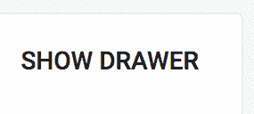

当你点击此按钮时，你会看到一个临时抽屉：

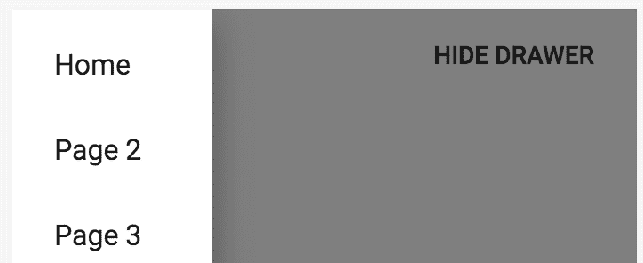

# 它是如何工作的...

在你开始更改`variant`属性之前，让我们先浏览一下这个示例中的代码，从`Drawer`标记开始，如下所示：

```js
<Drawer
  variant={variant}
  open={open}
  onClose={() => setOpen(false)}
>
  <List>
    <ListItem
      button
      onClick={() => setOpen(false)}
    >
      <ListItemText>Home</ListItemText>
    </ListItem>
    <ListItem
      button
      onClick={() => setOpen(false)}
    >
      <ListItemText>Page 2</ListItemText>
    </ListItem>
    <ListItem
      button
      onClick={() => setOpen(false)}
    >
      <ListItemText>Page 3</ListItemText>
    </ListItem>
  </List>
</Drawer>
```

`Drawer`组件接受一个`open`属性，当为`true`时显示抽屉。`variant`属性决定了要渲染的抽屉类型。之前显示的截图是一个临时抽屉，默认的变体值。`Drawer`组件的子组件是`List`，其中抽屉中显示的每个项目都会被渲染。

接下来，让我们看看用于切换`Drawer`组件显示的`Button`组件：

```js
<Button onClick={() => setOpen(!open)}>
  {open ? 'Hide' : 'Show'} Drawer
</Button>
```

当你点击此按钮时，你的组件的`open`状态会切换。同样，按钮的文本也会根据`open`状态的值切换。

现在让我们尝试将`variant`属性的值更改为`permanent`。以下是抽屉渲染后的样子：

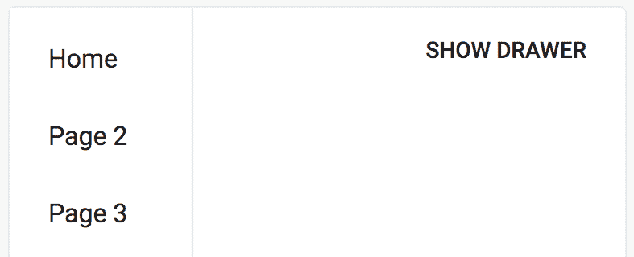

永久抽屉，正如其名所示，始终可见，并且始终位于屏幕上的同一位置。如果你点击显示抽屉按钮，你的组件的`open`状态会被切换为`true`。你会看到按钮的文本改变，但由于`Drawer`组件使用的是`permanent`变体，所以`open`属性没有效果：

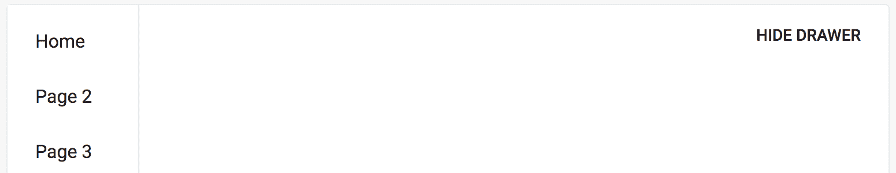

接下来，让我们尝试使用`persistent`变体。持久抽屉与永久抽屉类似，在用户与应用程序交互时它们会保持在屏幕上可见，并且它们与临时抽屉类似，可以通过更改`open`属性来隐藏。

让我们将`variant`属性更改为`persistent`。当屏幕首次加载时，抽屉不可见，因为组件的`open`状态是`false`。尝试点击 SHOW DRAWER 按钮。抽屉被显示，看起来像永久抽屉。如果您点击 HIDE DRAWER 按钮，组件的`open`状态将切换到`false`，抽屉将被隐藏。

当您希望用户能够控制抽屉的可见性时，应使用持久抽屉。例如，使用临时抽屉时，用户可以通过点击覆盖层或按*Esc*键来关闭抽屉。当您希望将左侧导航作为页面布局的组成部分时，永久抽屉非常有用——它们始终可见，其他项目则围绕它们布局。

# 还有更多...

当您点击抽屉中的任何项目时，事件处理器会将组件的`open`状态设置为`false`。这可能不是您想要的，可能会让您的用户感到困惑。例如，如果您使用的是持久抽屉，那么您的应用可能有一个位于抽屉外的按钮来控制抽屉的可见性。如果用户点击抽屉项目，他们可能不会期望抽屉关闭。

为了解决这个问题，您的事件处理器可以考虑`Drawer`组件的一个变体：

```js
<List>
  <ListItem
    button
    onClick={() => setOpen(variant !== 'temporary')}
  >
    <ListItemText>Home</ListItemText>
  </ListItem>
  <ListItem
    button
    onClick={() => setOpen(variant !== 'temporary')}
  >
    <ListItemText>Page 2</ListItemText>
  </ListItem>
  <ListItem
    button
    onClick={() => setOpen(variant !== 'temporary')}
  >
    <ListItemText>Page 3</ListItemText>
  </ListItem>
</List>
```

现在，当您点击这些项目中的任何一个时，只有当`variant`属性是`temporary`时，`open`状态才会更改为`false`。

# 参见

+   `Drawer` 示例：[`material-ui.com/demos/drawers/`](https://material-ui.com/demos/drawers/)

+   `Drawer` API 文档：[`material-ui.com/api/drawer/`](https://material-ui.com/api/drawer/)

# 抽屉项目状态

在`Drawer`组件中渲染的项目很少是静态的。相反，抽屉项目是根据组件的状态渲染的，这允许您对项目的显示方式有更多的控制。

# 如何做到这一点...

假设您有一个使用`Drawer`组件渲染抽屉导航的组件。您不想直接在组件标记中写入`items`状态，而是希望将`items`状态存储在组件的状态中。例如，在响应用户的权限检查时，项目可能会被禁用或完全隐藏。

这里有一个使用组件状态中的`item`对象数组的示例：

```js
import React, { useState } from 'react';

import Drawer from '@material-ui/core/Drawer';
import Grid from '@material-ui/core/Grid';
import Button from '@material-ui/core/Button';
import List from '@material-ui/core/List';
import ListItem from '@material-ui/core/ListItem';
import ListItemIcon from '@material-ui/core/ListItemIcon';
import ListItemText from '@material-ui/core/ListItemText';
import Typography from '@material-ui/core/Typography';

import HomeIcon from '@material-ui/icons/Home';
import WebIcon from '@material-ui/icons/Web';

export default function DrawerItemState() {
  const [open, setOpen] = useState(false);
  const [content, setContent] = useState('Home');
  const [items] = useState([
    { label: 'Home', Icon: HomeIcon },
    { label: 'Page 2', Icon: WebIcon },
    { label: 'Page 3', Icon: WebIcon, disabled: true },
    { label: 'Page 4', Icon: WebIcon },
    { label: 'Page 5', Icon: WebIcon, hidden: true }
  ]);

  const onClick = content => () => {
    setOpen(false);
    setContent(content);
  };

  return (
    <Grid container justify="space-between">
      <Grid item>
        <Typography>{content}</Typography>
      </Grid>
      <Grid item>
        <Drawer open={open} onClose={() => setOpen(false)}>
          <List>
            {items
              .filter(({ hidden }) => !hidden)
              .map(({ label, disabled, Icon }, i) => (
                <ListItem
                  button
                  key={i}
                  disabled={disabled}
                  onClick={onClick(label)}
                >
                  <ListItemIcon>
                    <Icon />
                  </ListItemIcon>
                  <ListItemText>{label}</ListItemText>
                </ListItem>
              ))}
          </List>
        </Drawer>
      </Grid>

      <Grid item>
        <Button onClick={() => setOpen(!open)}>
          {open ? 'Hide' : 'Show'} Drawer
        </Button>
      </Grid>
    </Grid>
  );
}
```

点击 SHOW DRAWER 按钮时，抽屉看起来是这样的：

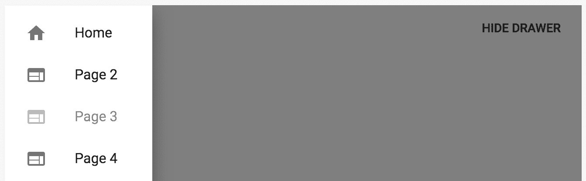

如果您选择这些项目中的任何一个，抽屉将关闭，屏幕内容将更新；例如，在点击页面 2 后，您应该看到以下截图类似的内容：


# 它是如何工作的...

让我们从查看组件的状态开始：

```js
const [open, setOpen] = useState(false);
const [content, setContent] = useState('Home');
const [items] = useState([
  { label: 'Home', Icon: HomeIcon },
  { label: 'Page 2', Icon: WebIcon },
  { label: 'Page 3', Icon: WebIcon, disabled: true },
  { label: 'Page 4', Icon: WebIcon },
  { label: 'Page 5', Icon: WebIcon, hidden: true }
]);
```

`open`状态控制`Drawer`组件的可见性，`content`状态是屏幕上显示的文本，取决于哪个抽屉项被点击。`items`状态是一个用于渲染抽屉项的对象数组。每个对象都有一个`label`属性和一个`Icon`属性，分别用于渲染项目文本和图标。

为了保持 React 组件大写命名约定，`Icon`属性被大写。这使得在阅读代码时更容易区分 React 组件和其他数据。

`disabled`属性用于将项目渲染为禁用状态；例如，通过将此属性设置为`true`，将第 3 页标记为禁用：


这可能是由于用户在此特定页面上存在权限限制或其他原因。因为这是通过组件状态而不是静态渲染来控制的，所以你可以使用任何你喜欢的机制（如 API 调用）在任何时候更新任何菜单项的`disabled`状态。`hidden`属性使用相同的原则，只是当此值为`true`时，项目根本不会渲染。在这个例子中，第 5 页没有渲染，因为它被标记为隐藏。

接下来，让我们看看如何根据`items`状态渲染`List`项，如下所示：

```js
<List>
  {items
    .filter(({ hidden }) => !hidden)
    .map(({ label, disabled, Icon }, i) => (
      <ListItem
        button
        key={i}
        disabled={disabled}
        onClick={onClick(label)}
      >
        <ListItemIcon>
          <Icon />
        </ListItemIcon>
        <ListItemText>{label}</ListItemText>
      </ListItem>
    ))}
</List>
```

首先，`items`数组被过滤以移除`hidden`项。然后，使用`map()`渲染每个`ListItem`组件。将`disabled`属性传递给`ListItem`，当渲染时它将显示为禁用状态。`Icon`组件也来自列表项状态。`onClick()`事件处理程序隐藏抽屉并更新`content`标签。

当点击禁用列表项时，`onClick()`处理程序不会执行。

# 还有更多...

你可能希望将列表项的渲染分离成独立的组件。这样，你可以在其他地方使用列表项。例如，你可能希望在其他地方使用相同的渲染逻辑来渲染按钮列表。以下是一个如何将`ListItems`组件提取为独立组件的示例：

```js
const ListItems = ({ items, onClick }) =>
  items
    .filter(({ hidden }) => !hidden)
    .map(({ label, disabled, Icon }, i) => (
      <ListItem
        button
        key={i}
        disabled={disabled}
        onClick={onClick(label)}
      >
        <ListItemIcon>
          <Icon />
        </ListItemIcon>
        <ListItemText>{label}</ListItemText>
      </ListItem>
    ));
```

`ListItems`组件将返回一个`ListItem`组件的数组。它接受一个作为数组属性的`items`状态来渲染。它还接受一个`onClick()`函数属性。这是一个高阶函数，它接受要显示的`label`组件作为参数，并返回一个新函数，当项目被点击时将更新内容。

这是新的 JSX 标记的示例，已更新为使用新的`ListItems`组件：

```js
<Grid container justify="space-between">
  <Grid item>
    <Typography>{content}</Typography>
  </Grid>
  <Grid item>
    <Drawer open={open} onClose={() => setOpen(false)}>
      <List>
        <ListItems items={items} onClick={onClick} />
      </List>
    </Drawer>
  </Grid>

  <Grid item>
    <Button onClick={() => setOpen(!open)}>
      {open ? 'Hide' : 'Show'} Drawer
    </Button>
  </Grid>
</Grid>
```

在此组件中不再有列表项渲染代码。相反，`ListItems`作为`List`的子组件被渲染。你传递给它要渲染的项目和`onClick()`处理程序。现在你有一个通用的`ListItems`组件，可以在你应用中显示列表的任何地方使用。它将在任何使用位置一致地处理`Icon`、`disabled`和显示逻辑。

# 参见

+   `Drawer` 示例：[`material-ui.com/demos/drawers/`](https://material-ui.com/demos/drawers/)

+   `Drawer` API 文档：[`material-ui.com/api/drawer/`](https://material-ui.com/api/drawer/)

# 抽屉项目导航

如果你的 Material-UI 应用使用`react-router`等路由器在页面之间导航，你可能希望将链接作为`Drawer`项目。为此，你必须集成来自`react-router-dom`包的组件。

# 如何操作...

假设你的应用由三个页面组成。为了在页面之间导航，你希望在`Drawer`组件中为用户提供链接。以下是代码的样子：

```js
import React, { useState } from 'react';
import { Route, Link } from 'react-router-dom';

import { withStyles } from '@material-ui/core/styles';
import Drawer from '@material-ui/core/Drawer';
import Grid from '@material-ui/core/Grid';
import Button from '@material-ui/core/Button';
import List from '@material-ui/core/List';
import ListItem from '@material-ui/core/ListItem';
import ListItemIcon from '@material-ui/core/ListItemIcon';
import ListItemText from '@material-ui/core/ListItemText';
import Typography from '@material-ui/core/Typography';

import HomeIcon from '@material-ui/icons/Home';
import WebIcon from '@material-ui/icons/Web';

const styles = theme => ({
  alignContent: {
    alignSelf: 'center'
  }
});

function DrawerItemNavigation({ classes }) {
  const [open, setOpen] = useState(false);

  return (
    <Grid container justify="space-between">
      <Grid item className={classes.alignContent}>
        <Route
          exact
          path="/"
          render={() => <Typography>Home</Typography>}
        />
        <Route
          exact
          path="/page2"
          render={() => <Typography>Page 2</Typography>}
        />
        <Route
          exact
          path="/page3"
          render={() => <Typography>Page 3</Typography>}
        />
      </Grid>
      <Grid item>
        <Drawer
          className={classes.drawerWidth}
          open={open}
          onClose={() => setOpen(false)}
        >
          <List>
            <ListItem
              component={Link}
              to="/"
              onClick={() => setOpen(false)}
            >
              <ListItemIcon>
                <HomeIcon />
              </ListItemIcon>
              <ListItemText>Home</ListItemText>
            </ListItem>
            <ListItem
              component={Link}
              to="/page2"
              onClick={() => setOpen(false)}
            >
              <ListItemIcon>
                <WebIcon />
              </ListItemIcon>
              <ListItemText>Page 2</ListItemText>
            </ListItem>
            <ListItem
              component={Link}
              to="/page3"
              onClick={() => setOpen(false)}
            >
              <ListItemIcon>
                <WebIcon />
              </ListItemIcon>
              <ListItemText>Page 3</ListItemText>
            </ListItem>
          </List>
        </Drawer>
      </Grid>
      <Grid item>
        <Button onClick={() => setOpen(!open)}>
          {open ? 'Hide' : 'Show'} Drawer
        </Button>
      </Grid>
    </Grid>
  );
}

export default withStyles(styles)(DrawerItemNavigation);
```

当你首次加载屏幕时，你会看到显示抽屉按钮和主页内容：

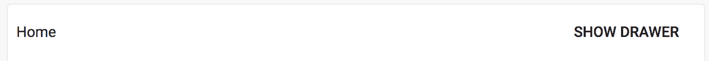

这是抽屉打开时的样子：


如果你点击第 2 页，它指向`/page2`，抽屉应该关闭，并且你应该被带到第二页。以下是它的样子：

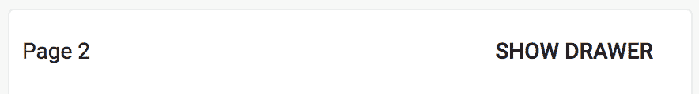

如果你点击第 3 页或主页，你应该能看到类似的内容。屏幕左侧的内容会更新。

# 它是如何工作的...

让我们先看看基于活动`Route`组件`render`内容的`Route`组件：

```js
<Grid item className={classes.alignContent}>
  <Route
    exact
    path="/"
    render={() => <Typography>Home</Typography>}
  />
  <Route
    exact
    path="/page2"
    render={() => <Typography>Page 2</Typography>}
  />
  <Route
    exact
    path="/page3"
    render={() => <Typography>Page 3</Typography>}
  />
</Grid>
```

每个应用中的`path`都会使用一个`Route`组件。`render()`函数返回当`path`属性与当前 URL 匹配时应在`Grid`项中渲染的内容。

接下来，让我们看看`Drawer`组件中的一个`ListItem`组件，如下所示：

```js
<ListItem
  component={Link}
  to="/"
  onClick={() => setOpen(false)}
>
  <ListItemIcon>
    <HomeIcon />
  </ListItemIcon>
  <ListItemText>Home</ListItemText>
</ListItem>
```

默认情况下，`ListItem`组件将渲染一个`div`元素。它接受一个`button`属性，当为`true`时，将渲染一个`button`元素。你都不需要这些。相反，你希望列表项是`react-router`将处理的链接。`component`属性接受一个自定义组件来使用；在这个例子中，你想要使用来自`react-router-dom`包的`Link`组件。这将渲染适当的链接，同时保持正确的样式。

你传递给`ListItem`组件的属性也会传递给你的自定义组件，在这个例子中，是`Link`组件。这意味着必需的`to`属性被传递给`Link`组件，指向`/`。同样，`onClick`处理程序也被传递给`Link`组件，这很重要，因为你想在点击链接时关闭临时抽屉。

# 更多内容...

当你的抽屉中的项是链接时，你可能想要为活动链接提供一个视觉指示。挑战在于你想使用 Material-UI 主题样式来样式化活动链接。以下是修改后的示例：

```js
import React, { useState } from 'react';
import clsx from 'clsx';
import { Switch, Route, Link, NavLink } from 'react-router-dom';

import { withStyles } from '@material-ui/core/styles';
import Drawer from '@material-ui/core/Drawer';
import Grid from '@material-ui/core/Grid';
import Button from '@material-ui/core/Button';
import List from '@material-ui/core/List';
import ListItem from '@material-ui/core/ListItem';
import ListItemIcon from '@material-ui/core/ListItemIcon';
import ListItemText from '@material-ui/core/ListItemText';
import Typography from '@material-ui/core/Typography';

import HomeIcon from '@material-ui/icons/Home';
import WebIcon from '@material-ui/icons/Web';

const styles = theme => ({
  alignContent: {
    alignSelf: 'center'
  },
  activeListItem: {
    color: theme.palette.primary.main
  }
});

const NavListItem = withStyles(styles)(
  ({ classes, Icon, text, active, ...other }) => (
    <ListItem component={NavLink} {...other}>
      <ListItemIcon
        classes={{
          root: clsx({ [classes.activeListItem]: active })
        }}
      >
        <Icon />
      </ListItemIcon>
      <ListItemText
        classes={{
          primary: clsx({
            [classes.activeListItem]: active
          })
        }}
      >
        {text}
      </ListItemText>
    </ListItem>
  )
);

const NavItem = props => (
  <Switch>
    <Route
      exact
      path={props.to}
      render={() => <NavListItem active={true} {...props} />}
    />
    <Route path="/" render={() => <NavListItem {...props} />} />
  </Switch>
);

function DrawerItemNavigation({ classes }) {
  const [open, setOpen] = useState(false);

  return (
    <Grid container justify="space-between">
      <Grid item className={classes.alignContent}>
        <Route
          exact
          path="/"
          render={() => <Typography>Home</Typography>}
        />
        <Route
          exact
          path="/page2"
          render={() => <Typography>Page 2</Typography>}
        />
        <Route
          exact
          path="/page3"
          render={() => <Typography>Page 3</Typography>}
        />
      </Grid>
      <Grid item>
        <Drawer
          className={classes.drawerWidth}
          open={open}
          onClose={() => setOpen(false)}
        >
          <List>
            <NavItem
              to="/"
              text="Home"
              Icon={HomeIcon}
              onClick={() => setOpen(false)}
            />
            <NavItem
              to="/page2"
              text="Page 2"
              Icon={WebIcon}
              onClick={() => setOpen(false)}
            />
            <NavItem
              to="/page3"
              text="Page 3"
              Icon={WebIcon}
              onClick={() => setOpen(false)}
            />
          </List>
        </Drawer>
      </Grid>
      <Grid item>
        <Button onClick={() => setOpen(!open)}>
          {open ? 'Hide' : 'Show'} Drawer
        </Button>
      </Grid>
    </Grid>
  );
}

export default withStyles(styles)(DrawerItemNavigation);
```

现在，当屏幕首次加载并打开抽屉时，它应该看起来类似于以下截图：

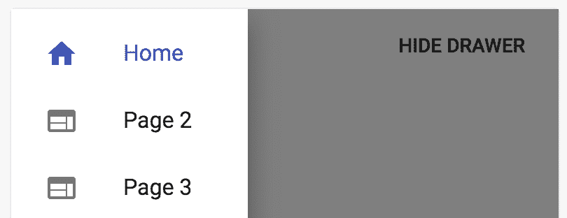

由于主页链接处于活动状态，它使用 Material-UI 主题的基色进行样式化。如果你点击页面 2 链接然后再次打开抽屉，它应该看起来类似于以下截图：

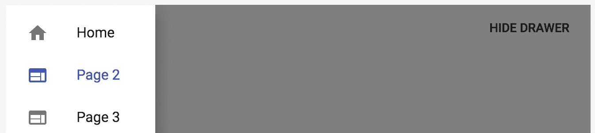

让我们看看你添加的两个新组件，从`NavItem`开始：

```js
const NavItem = props => (
  <Switch>
    <Route
      exact
      path={props.to}
      render={() => <NavListItem active={true} {...props} />}
    />
    <Route path="/" render={() => <NavListItem {...props} />} />
  </Switch>
);
```

此组件用于根据当前 URL 确定项目是否处于活动状态。它使用来自`react-router-dom`的`Switch`组件。`Switch`组件不仅会渲染`Route`组件，而且只会渲染与当前 URL 匹配的第一个路由。`NavItem`中的第一个`Route`组件是特定路径（因为它使用了`exact`属性）。如果这个`Route`组件匹配，它将渲染一个将`active`属性设置为 true 的`NavListItem`组件。因为它在`Switch`组件中，所以第二个`Route`组件将不会被渲染。

另一方面，如果第一个`Route`组件不匹配，第二个`Route`组件将始终匹配。这将渲染一个不带`active`属性的`NavListItem`组件。现在，让我们看一下`NavListItem`组件，如下所示：

```js
const NavListItem = withStyles(styles)(
  ({ classes, Icon, text, active, ...other }) => (
    <ListItem component={NavLink} {...other}>
      <ListItemIcon
        classes={{
          root: clsx({ [classes.activeListItem]: active })
        }}
      >
        <Icon />
      </ListItemIcon>
      <ListItemText
        classes={{
          primary: clsx({
            [classes.activeListItem]: active
          })
        }}
      >
        {text}
      </ListItemText>
    </ListItem>
  )
);
```

`NavListItem`组件现在负责在`Drawer`组件中渲染`ListItem`组件。它接受一个`text`属性和一个`Icon`属性来分别渲染标签和图标，就像在你增强之前一样。`active`属性用于确定应用于`ListItemIcon`和`ListItemText`组件的类。如果`active`为 true，则将应用`activeListItem` CSS 类到这两个组件上。这就是你能够根据 Material-UI 主题样式化活动项的方式。

`clsx()`函数在 Material-UI 中被广泛使用——这不是一个额外的依赖。它允许你动态地更改元素的类，而无需在标记中引入自定义逻辑。例如，`clsx({ [classes.activeListItem]: active })`语法只有在`active`为 true 时才会应用`activeListItem`类。另一种方法将涉及在你的组件中引入更多的逻辑。

最后，让我们看一下`activeListItem`类，如下所示：

```js
const styles = theme => ({
  alignContent: {
    alignSelf: 'center'
  },
  activeListItem: {
    color: theme.palette.primary.main
  }
});
```

`activeListItem`类通过使用`theme.palette.primary.main`值来设置颜色 CSS 属性。这意味着如果主题发生变化，抽屉中的活动链接将被相应地样式化。

# 参见

+   React Router 文档：[`reacttraining.com/react-router/`](https://reacttraining.com/react-router/)

+   `Drawer`演示：[`material-ui.com/demos/drawers/`](https://material-ui.com/demos/drawers/)

+   `Drawer` API 文档：[`material-ui.com/api/drawer/`](https://material-ui.com/api/drawer/)

# 抽屉部分

当你在你的`Drawer`中有大量项时，你可能想要将你的抽屉分成几个部分。当你有大量的抽屉项而没有部分时，你最终不得不在项本身中放入部分名称，这会导致混乱和不自然的抽屉项标签。

# 如何做到这一点...

假设你正在开发一个应用程序，该应用程序有用于管理 CPU、内存、存储和网络不同方面的屏幕。你可以在相关的部分中显示抽屉项，而不是有一个平面的抽屉项列表，这样可以更容易地进行导航。以下是实现这一点的代码：

```js
import React, { useState } from 'react';

import { withStyles } from '@material-ui/core/styles';
import Drawer from '@material-ui/core/Drawer';
import Grid from '@material-ui/core/Grid';
import Button from '@material-ui/core/Button';
import List from '@material-ui/core/List';
import ListItem from '@material-ui/core/ListItem';
import ListItemIcon from '@material-ui/core/ListItemIcon';
import ListItemText from '@material-ui/core/ListItemText';
import ListSubheader from '@material-ui/core/ListSubheader';
import Typography from '@material-ui/core/Typography';

import AddIcon from '@material-ui/icons/Add';
import RemoveIcon from '@material-ui/icons/Remove';
import ShowChartIcon from '@material-ui/icons/ShowChart';

const styles = theme => ({
  alignContent: {
    alignSelf: 'center'
  }
});

const ListItems = ({ items, onClick }) =>
  items
    .filter(({ hidden }) => !hidden)
    .map(({ label, disabled, Icon }, i) => (
      <ListItem
        button
        key={i}
        disabled={disabled}
        onClick={onClick(label)}
      >
        <ListItemIcon>
          <Icon />
        </ListItemIcon>
        <ListItemText>{label}</ListItemText>
      </ListItem>
    ));

const DrawerSections = withStyles(styles)(({ classes }) => {
  const [open, setOpen] = useState(false);
  const [content, setContent] = useState('Home');
  const [items] = useState({
    cpu: [
      { label: 'Add CPU', Icon: AddIcon },
      { label: 'Remove CPU', Icon: RemoveIcon },
      { label: 'Usage', Icon: ShowChartIcon }
    ],
    memory: [
      { label: 'Add Memory', Icon: AddIcon },
      { label: 'Usage', Icon: ShowChartIcon }
    ],
    storage: [
      { label: 'Add Storage', Icon: AddIcon },
      { label: 'Usage', Icon: ShowChartIcon }
    ],
    network: [
      { label: 'Add Network', Icon: AddIcon, disabled: true },
      { label: 'Usage', Icon: ShowChartIcon }
    ]
  });

  const onClick = content => () => {
    setOpen(false);
    setContent(content);
  };

  return (
    <Grid container justify="space-between">
      <Grid item className={classes.alignContent}>
        <Typography>{content}</Typography>
      </Grid>
      <Grid item>
        <Drawer open={open} onClose={() => setOpen(false)}>
          <List>
            <ListSubheader>CPU</ListSubheader>
            <ListItems items={items.cpu} onClick={onClick} />
            <ListSubheader>Memory</ListSubheader>
            <ListItems items={items.memory} onClick={onClick} />
            <ListSubheader>Storage</ListSubheader>
            <ListItems items={items.storage} onClick={onClick} />
            <ListSubheader>Network</ListSubheader>
            <ListItems items={items.network} onClick={onClick} />
          </List>
        </Drawer>
      </Grid>

      <Grid item>
        <Button onClick={() => setOpen(!open)}>
          {open ? 'Hide' : 'Show'} Drawer
        </Button>
      </Grid>
    </Grid>
  );
});

export default DrawerSections;
```

当你点击 SHOW DRAWER 按钮时，你的抽屉应该看起来像这样：


这个抽屉中有许多添加和使用项。部分使你的用户更容易扫描这些项。

# 它是如何工作的...

让我们先看看你的组件状态，如下所示：

```js
const [open, setOpen] = useState(false);
const [content, setContent] = useState('Home');
const [items] = useState({
  cpu: [
    { label: 'Add CPU', Icon: AddIcon },
    { label: 'Remove CPU', Icon: RemoveIcon },
    { label: 'Usage', Icon: ShowChartIcon }
  ],
  memory: [
    { label: 'Add Memory', Icon: AddIcon },
    { label: 'Usage', Icon: ShowChartIcon }
  ],
  storage: [
    { label: 'Add Storage', Icon: AddIcon },
    { label: 'Usage', Icon: ShowChartIcon }
  ],
  network: [
    { label: 'Add Network', Icon: AddIcon, disabled: true },
    { label: 'Usage', Icon: ShowChartIcon }
  ]
});
```

与`items`状态是一个平面的项数组不同，它现在是一个对象，其中数组按类别分组。这些是你想要渲染的抽屉部分。接下来，让我们看看用于渲染`items`状态和部分标题的`List`标记：

```js
<List>
  <ListSubheader>CPU</ListSubheader>
  <ListItems items={items.cpu} onClick={onClick} />
  <ListSubheader>Memory</ListSubheader>
  <ListItems items={items.memory} onClick={onClick} />
  <ListSubheader>Storage</ListSubheader>
  <ListItems items={items.storage} onClick={onClick} />
  <ListSubheader>Network</ListSubheader>
  <ListItems items={items.network} onClick={onClick} />
</List>
```

当你需要在上面的列表项之上有一个标签时，使用`ListSubheader`组件。例如，在存储标题下面，你有`ListItems`组件，它从`items.storage`状态渲染项。

# 还有更多...

当你有大量的抽屉项和部分时，你仍然可以用需要解析的信息量压倒你的用户。一个解决方案是拥有可折叠的部分。为此，你可以在`ListSubheader`组件中添加一个`Button`组件，使其可点击。

下面是代码的样子：

```js
<ListSubheader>
  <Button
    disableRipple
    classes={{ root: classes.listSubheader }}
    onClick={toggleSection('cpu')}
  >
    CPU
  </Button>
</ListSubheader>
```

当你点击按钮时通常会发生的水波效应在这里被禁用了，因为你希望标题文本仍然看起来像标题文本。这也需要在`listSubheader`类中进行一些 CSS 定制：

```js
const styles = theme => ({
  alignContent: {
    alignSelf: 'center'
  },
  listSubheader: {
    padding: 0,
    minWidth: 0,
    color: 'inherit',
    '&:hover': {
      background: 'inherit'
    }
  }
});
```

当点击部分标题按钮时，它会切换部分的状态，进而切换部分项的可见性。以下是`toggleSection()`函数：

```js
const toggleSection = name => () => {
  setSections({ ...sections, [name]: !sections[name] });
};
```

这是一个高阶函数，它返回一个新的函数作为按钮的`onClick`处理程序。`name`参数是要切换的部分状态名称。

这是添加以支持切换部分的新状态：

```js
const [sections, setSections] = useState({
  cpu: true,
  memory: false,
  storage: false,
  network: false
});
```

当屏幕首次加载时，CPU 部分将是唯一有可见项的部分，因为它是最初状态为`true`的唯一状态。接下来，让我们看看当相应的部分状态为`false`时，`ListItems`是如何实际折叠的：

```js
const ListItems = ({ items, visible, onClick }) => (
  <Collapse in={visible}>
    {items
      .filter(({ hidden }) => !hidden)
      .map(({ label, disabled, Icon }, i) => (
        <ListItem
          button
          key={i}
          disabled={disabled}
          onClick={onClick(label)}
        >
          <ListItemIcon>
            <Icon />
          </ListItemIcon>
          <ListItemText>{label}</ListItemText>
        </ListItem>
      ))}
  </Collapse>
);
```

`ListItems`组件现在接受一个`visible`属性。这个属性被`Collapse`组件使用，当隐藏组件时，它将使用折叠动画隐藏其子元素。最后，这是使用新的`ListItems`组件的方法：

```js
<ListItems
  visible={sections.cpu}
  items={items.cpu}
  onClick={onClick}
/>
```

当屏幕首次加载时，并点击 SHOW DRAWER 按钮，你应该看到类似这样的东西：


现在用户需要解析的信息少多了。他们可以点击部分标题来查看列表项，并且可以再次点击来折叠部分；例如，他们可以折叠 CPU 部分并展开内存部分：

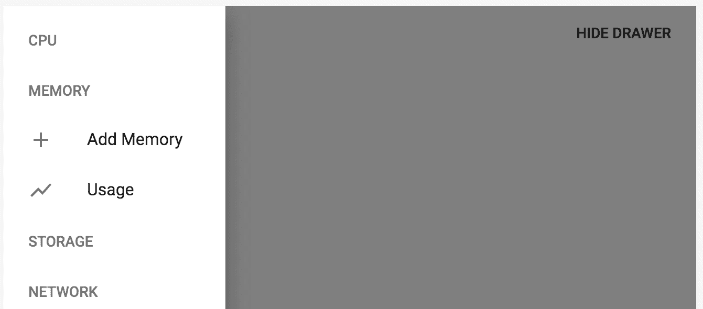

# 参见

+   `Drawer` 演示：[`material-ui.com/demos/drawers/`](https://material-ui.com/demos/drawers/)

+   `Drawer` API 文档：[`material-ui.com/api/drawer/`](https://material-ui.com/api/drawer/)

# `AppBar`交互

在应用中每个页面的顶部放置一个切换`Drawer`组件可见性的按钮是一个常见的地方。此外，通过在抽屉中选择项目，`AppBar`组件的标题需要改变以反映此选择。`Drawer`和`AppBar`组件通常需要相互交互。

# 如何实现...

假设你有一个包含一些项目的`Drawer`组件。你还有一个带有菜单按钮和标题的`AppBar`组件。菜单按钮应该切换抽屉的可见性，点击抽屉中的项目应该更新`AppBar`中的标题。以下是实现这一功能的代码：

```js
import React, { useState, Fragment } from 'react';

import { withStyles } from '@material-ui/core/styles';
import AppBar from '@material-ui/core/AppBar';
import Toolbar from '@material-ui/core/Toolbar';
import Typography from '@material-ui/core/Typography';
import Button from '@material-ui/core/Button';
import Drawer from '@material-ui/core/Drawer';
import List from '@material-ui/core/List';
import ListItem from '@material-ui/core/ListItem';
import ListItemIcon from '@material-ui/core/ListItemIcon';
import ListItemText from '@material-ui/core/ListItemText';
import IconButton from '@material-ui/core/IconButton';
import MenuIcon from '@material-ui/icons/Menu';

const styles = theme => ({
  root: {
    flexGrow: 1
  },
  flex: {
    flex: 1
  },
  menuButton: {
    marginLeft: -12,
    marginRight: 20
  },
  toolbarMargin: theme.mixins.toolbar
});

const MyToolbar = withStyles(styles)(
  ({ classes, title, onMenuClick }) => (
    <Fragment>
      <AppBar>
        <Toolbar>
          <IconButton
            className={classes.menuButton}
            color="inherit"
            aria-label="Menu"
            onClick={onMenuClick}
          >
            <MenuIcon />
          </IconButton>
          <Typography
            variant="title"
            color="inherit"
            className={classes.flex}
          >
            {title}
          </Typography>
        </Toolbar>
      </AppBar>
      <div className={classes.toolbarMargin} />
    </Fragment>
  )
);

const MyDrawer = withStyles(styles)(
  ({ classes, variant, open, onClose, setTitle }) => (
    <Drawer variant={variant} open={open} onClose={onClose}>
      <List>
        <ListItem
          button
          onClick={() => {
            setTitle('Home');
            onClose();
          }}
        >
          <ListItemText>Home</ListItemText>
        </ListItem>
        <ListItem
          button
          onClick={() => {
            setTitle('Page 2');
            onClose();
          }}
        >
          <ListItemText>Page 2</ListItemText>
        </ListItem>
        <ListItem
          button
          onClick={() => {
            setTitle('Page 3');
            onClose();
          }}
        >
          <ListItemText>Page 3</ListItemText>
        </ListItem>
      </List>
    </Drawer>
  )
);

function AppBarInteraction({ classes }) {
  const [drawer, setDrawer] = useState(false);
  const [title, setTitle] = useState('Home');

  const toggleDrawer = () => {
    setDrawer(!drawer);
  };

  return (
    <div className={classes.root}>
      <MyToolbar title={title} onMenuClick={toggleDrawer} />
      <MyDrawer
        open={drawer}
        onClose={toggleDrawer}
        setTitle={setTitle}
      />
    </div>
  );
}

export default withStyles(styles)(AppBarInteraction);
```

这是首次加载时的屏幕截图：

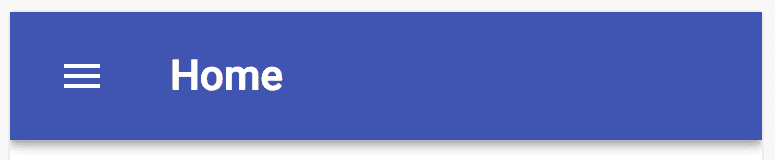

当你点击标题左侧的菜单图标按钮时，你会看到抽屉：

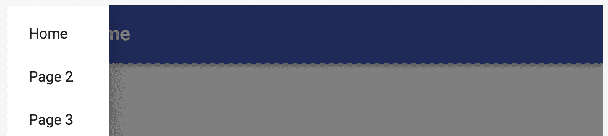

如果你点击页面 2 的项目，抽屉将关闭，`AppBar`的标题将改变：

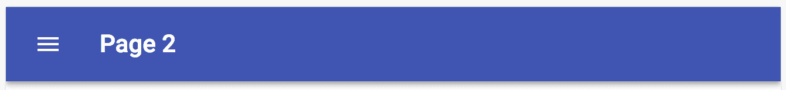

# 它是如何工作的...

此示例定义了三个组件，如下所示：

+   `MyToolbar`组件

+   `MyDrawer`组件

+   主应用组件

让我们逐一分析这些，从`MyToolbar`开始：

```js
const MyToolbar = withStyles(styles)(
  ({ classes, title, onMenuClick }) => (
    <Fragment>
      <AppBar>
        <Toolbar>
          <IconButton
            className={classes.menuButton}
            color="inherit"
            aria-label="Menu"
            onClick={onMenuClick}
          >
            <MenuIcon />
          </IconButton>
          <Typography
            variant="title"
            color="inherit"
            className={classes.flex}
          >
            {title}
          </Typography>
        </Toolbar>
      </AppBar>
      <div className={classes.toolbarMargin} />
    </Fragment>
  )
);
```

`MyToolbar`组件渲染一个接受`title`属性和`onMenuClick()`属性的`AppBar`组件。这两个属性都用于与`MyDrawer`组件交互。当抽屉项目被选中时，`title`属性会改变。`onMenuClick()`函数会在你的主应用组件中改变状态，导致抽屉显示。接下来，让我们看看`MyDrawer`：

```js
const MyDrawer = withStyles(styles)(
  ({ classes, variant, open, onClose, setTitle }) => (
    <Drawer variant={variant} open={open} onClose={onClose}>
      <List>
        <ListItem
          button
          onClick={() => {
            setTitle('Home');
            onClose();
          }}
        >
          <ListItemText>Home</ListItemText>
        </ListItem>
        <ListItem
          button
          onClick={() => {
            setTitle('Page 2');
            onClose();
          }}
        >
          <ListItemText>Page 2</ListItemText>
        </ListItem>
        <ListItem
          button
          onClick={() => {
            setTitle('Page 3');
            onClose();
          }}
        >
          <ListItemText>Page 3</ListItemText>
        </ListItem>
      </List>
    </Drawer>
  )
);
```

`MyDrawer`组件与`MyToolbar`类似，是函数式的。它接受属性而不是维护自己的状态。例如，`open`属性用于控制抽屉的可见性。`onClose()`和`setTitle()`属性是在点击抽屉项目时被调用的函数。

最后，让我们看看包含所有状态的 app 组件：

```js
function AppBarInteraction({ classes }) {
  const [drawer, setDrawer] = useState(false);
  const [title, setTitle] = useState('Home');

  const toggleDrawer = () => {
    setDrawer(!drawer);
  };

  return (
    <div className={classes.root}>
      <MyToolbar title={title} onMenuClick={toggleDrawer} />
      <MyDrawer
        open={drawer}
        onClose={toggleDrawer}
        setTitle={setTitle}
      />
    </div>
  );
}
```

`title`状态传递给`MyDrawer`组件，以及`toggleDrawer()`函数。`MyDrawer`组件接收抽屉状态以控制可见性，`toggleDrawer()`函数以改变可见性，以及`setTitle()`函数以更新`MyToolbar`中的标题。

# 更多...

如果您想要一个可以通过应用栏中的相同菜单按钮切换的持久抽屉的灵活性怎么办？让我们给传递给`MyDrawer`的`AppBarInteraction`组件添加一个`variant`属性。这可以从`temporary`更改为`persistent`，菜单按钮仍然按预期工作。

当您点击菜单按钮时，这是一个持久抽屉的样子：

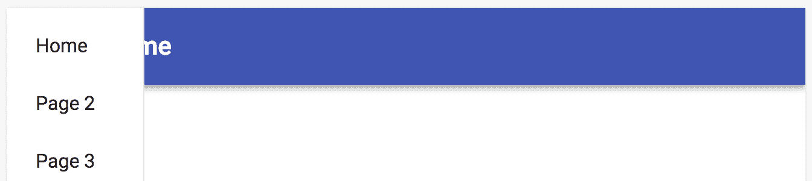

抽屉覆盖了应用栏。另一个问题是，如果您点击任何抽屉项目，抽屉将关闭，这对持久抽屉来说并不理想。让我们修复这两个问题。

首先，让我们解决导致抽屉出现在应用栏上面的`z-index`问题。您可以创建一个看起来像这样的 CSS 类：

```js
aboveDrawer: {
  zIndex: theme.zIndex.drawer + 1
}
```

您可以将此类应用于`MyToolbar`中的`AppBar`组件，如下所示：

```js
<AppBar className={classes.aboveDrawer}>
```

现在当您打开抽屉时，它出现在`AppBar`下面，正如预期的那样：

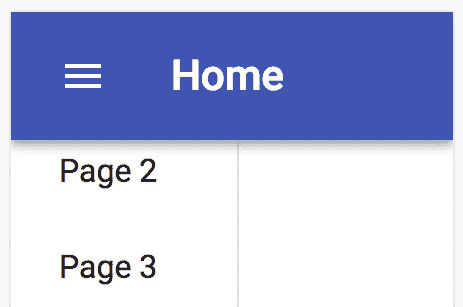

现在您只需调整边距。当抽屉使用`persistent`变体时，您可以将`toolbarMargin`类添加到`<div>`元素中，作为`Drawer`组件中的第一个元素：

```js
<div
  className={clsx({
    [classes.toolbarMargin]: variant === 'persistent'
  })}
/>
```

在`clsx()`函数的帮助下，`toolbarMargin`类仅在需要时添加——也就是说，当抽屉处于持久状态时。现在它看起来是这样的：

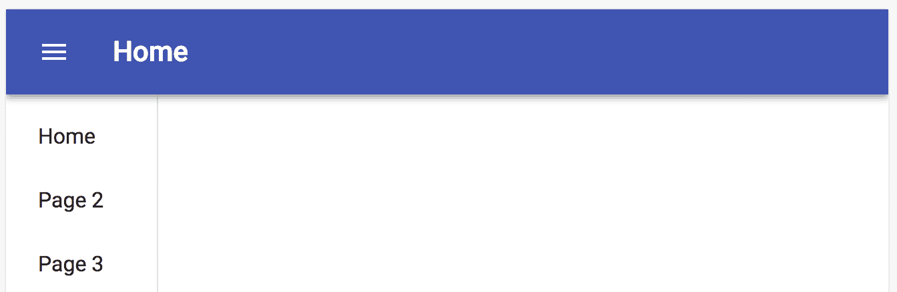

最后，让我们修复当点击抽屉项目时抽屉关闭的问题。在主应用组件中，您可以添加一个看起来像以下代码块的新方法：

```js
const onItemClick = title => () => {
  setTitle(title);
  setDrawer(variant === 'temporary' ? false : drawer);
};
```

`onItemClick()`函数负责设置应用栏中的文本，如果抽屉是临时的，它还会关闭抽屉。要使用这个新函数，您可以将`MyDrawer`中的`setTitle`属性替换为`onItemClick`属性。然后您可以在列表项中使用它，如下所示：

```js
<List>
  <ListItem button onClick={onItemClick('Home')}>
    <ListItemText>Home</ListItemText>
  </ListItem>
  <ListItem button onClick={onItemClick('Page 2')}>
    <ListItemText>Page 2</ListItemText>
  </ListItem>
  <ListItem button onClick={onItemClick('Page 3')}>
    <ListItemText>Page 3</ListItemText>
  </ListItem>
</List>
```

现在当您在持久状态下的抽屉中点击项目时，抽屉将保持打开。唯一关闭它的方法是在应用栏标题旁边的菜单按钮上点击。

# 参见

+   `Drawer`演示：[`material-ui.com/demos/drawers/`](https://material-ui.com/demos/drawers/)

+   `AppBar`演示：[`material-ui.com/demos/app-bar/`](https://material-ui.com/demos/app-bar/)

+   `Drawer` API 文档：[`material-ui.com/api/drawer/`](https://material-ui.com/api/drawer/)

+   `AppBar` API 文档：[`material-ui.com/api/app-bar/`](https://material-ui.com/api/app-bar/)
