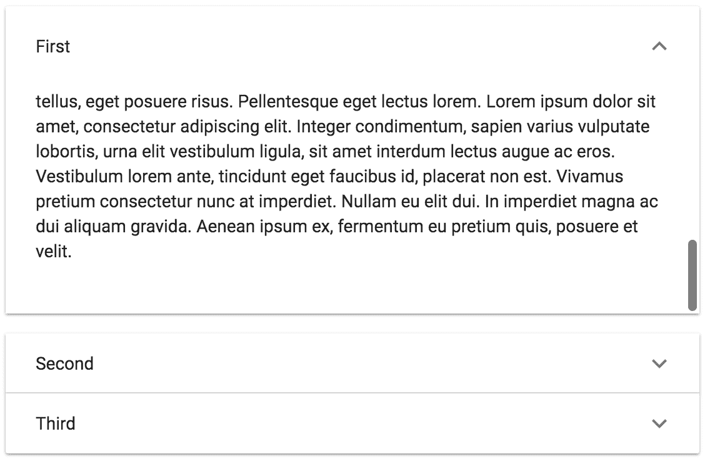

# 第五章：展开面板 - 将内容分组到面板部分

在本章中，你将学习以下内容：

+   状态化展开面板

+   格式化面板标题

+   可滚动面板内容

+   懒加载面板内容

# 简介

展开面板是内容的容器。通常，你的 Material-UI 应用程序中的屏幕被分成几个部分，以便用户可以心理上组织他们正在查看的信息。`ExpansionPanel` 组件是创建这些部分的一种方式。你甚至可以将展开面板与其他组织组件（如标签页）结合使用，为用户提供一致的组织布局。

# 状态化展开面板

你可以使用组件状态来控制展开面板的各个方面。例如，每个面板可以表示为数组中的一个对象，其中每个对象都有面板标题和面板内容属性。你还可以控制其他方面，如可见性和禁用面板。

# 如何实现...

假设你的组件有一个用于渲染展开面板的状态。面板本身是数组中的对象。以下是实现这一功能的代码：

```js
import React, { useState, Fragment } from 'react';

import ExpansionPanel from '@material-ui/core/ExpansionPanel';
import ExpansionPanelSummary from '@material-ui/core/ExpansionPanelSummary';
import ExpansionPanelDetails from '@material-ui/core/ExpansionPanelDetails';
import Typography from '@material-ui/core/Typography';
import ExpandMoreIcon from '@material-ui/icons/ExpandMore';

export default function StatefulExpansionPanels() {
  const [panels] = useState([
    {
      title: 'First Panel Title',
      content: 'First panel content...'
    },
    {
      title: 'Second Panel Title',
      content: 'Second panel content...'
    },
    {
      title: 'Third Panel Title',
      content: 'Third panel content...'
    },
    {
      title: 'Fourth Panel Title',
      content: 'Fourth panel content...'
    }
  ]);

  return (
    <Fragment>
      {panels
        .filter(panel => !panel.hidden)
        .map((panel, index) => (
          <ExpansionPanel
            key={index}
            disabled={panel.disabled}
          >
            <ExpansionPanelSummary expandIcon={<ExpandMoreIcon />}>
              <Typography>{panel.title}</Typography>
            </ExpansionPanelSummary>
            <ExpansionPanelDetails>
              <Typography>{panel.content}</Typography>
            </ExpansionPanelDetails>
          </ExpansionPanel>
        ))}
    </Fragment>
  );
}
```

当你加载屏幕时，你会看到以下内容：


当前两个面板展开时，它们看起来是这样的：


第三面板无法展开，因为它已被禁用。

# 它是如何工作的...

状态定义了展开面板的所有内容。这包括面板 `标题`、当面板展开时显示的 `内容`、`disabled` 属性以及面板是否 `隐藏`：

```js
const [panels] = useState([
  {
    title: 'First Panel Title',
    content: 'First panel content...'
  },
  {
    title: 'Second Panel Title',
    content: 'Second panel content...'
  },
  {
    title: 'Third Panel Title',
    content: 'Third panel content...'
  },
  {
    title: 'Fourth Panel Title',
    content: 'Fourth panel content...'
  }
]);
```

`disabled` 属性将面板标记为禁用。这意味着用户可以看到面板 `标题`，但不能展开它。它也被视觉上标记为不可展开。`hidden` 属性确保面板根本不会被渲染。这在你不希望用户知道它的情况下非常有用。

接下来，让我们看看根据组件状态渲染每个面板的代码：

```js
{panels
  .filter(panel => !panel.hidden)
  .map((panel, index) => (

      }>
       {panel.title}

       {panel.content}

   ))}
```

`filter()` 调用从数组中移除了设置 `hidden` 属性为 true 的面板。

使用 `hidden` 属性隐藏面板的替代方法是完全从数组中移除它们。这完全取决于个人喜好——切换属性值与从数组中添加和移除值。

每个面板都使用 `map()` 函数映射到 `ExpansionPanel` 组件。展开面板使用 `ExpansionPanelSummary` 组件作为标题，内容则放入 `ExpansionPanelDetails` 组件中。

# 还有更多...

你也可以使用状态来控制面板是否展开。例如，你可以使用 `ExpansionPanel` 组件创建一个 *手风琴* 小部件——始终有一个面板是打开的，打开另一个面板会关闭任何打开的内容。

第一步是添加一个 `expanded` 状态来确定在任何给定时间哪个面板是打开的：

```js
const [expanded, setExpanded] = useState(0);
const [panels] = useState([
  {
    title: 'First Panel Title',
    content: 'First panel content...'
  },
  {
    title: 'Second Panel Title',
    content: 'Second panel content...'
  },
  {
    title: 'Third Panel Title',
    content: 'Third panel content...'
  },
  {
    title: 'Fourth Panel Title',
    content: 'Fourth panel content...'
  }
]);
```

`expanded` 状态默认为 `0`，这意味着第一个面板默认展开。随着展开的面板发生变化，`expanded` 状态也会改变以反映展开面板的索引。接下来，你将为 `ExpansionPanel` 组件添加一个 `onChange` 处理器：

```js
const onChange = expanded => () => {
  setExpanded(expanded);
};
```

这是一个高阶函数——它接受你想要展开的面板的索引，并返回一个在给定面板被点击时设置展开状态的函数。最后，你可以将新的 `expanded` 状态和 `onChange` 处理器添加到 `ExpansionPanel` 组件中：

```js
<ExpansionPanel
  key={index}
  expanded={index === expanded}
  disabled={panel.disabled}
  onChange={onChange(index)}
>
  <ExpansionPanelSummary expandIcon={<ExpandMoreIcon />}>
    <Typography>{panel.title}</Typography>
  </ExpansionPanelSummary>
  <ExpansionPanelDetails>
    <Typography>{panel.content}</Typography>
  </ExpansionPanelDetails>
</ExpansionPanel>
```

`expanded` 属性基于当前面板的索引，等于组件的展开状态。如果它们相等，则面板已展开。`onChange` 处理器也被分配给 `ExpansionPanel`，当面板被点击时，它会更改展开状态。

# 参见

+   `ExpansionPanel` 演示：[`material-ui.com/demos/expansion-panels/`](https://material-ui.com/demos/expansion-panels/)

+   `ExpansionPanel` API 文档：[`material-ui.com/api/expansion-panel/`](https://material-ui.com/api/expansion-panel/)

+   `ExpansionPanelSummary` API 文档：[`material-ui.com/api/expansion-panel-summary/`](https://material-ui.com/api/expansion-panel-summary/)

+   `ExpansionPanelDetails` API 文档：[`material-ui.com/api/expansion-panel-details/`](https://material-ui.com/api/expansion-panel-details/)

# 格式化面板标题

`ExpansionPanel` 组件中的标题可以格式化。通常，`Typography` 组件用于渲染面板标题内的文本。这意味着你可以使用 `Typography` 的属性来自定义你的面板标题的外观。

# 如何做到这一点...

假设你想要你的 `ExpansionPanel` 标题中的文本相对于每个面板内容部分的文本更加突出。你可以在 `ExpansionPanelSummary` 组件中更改 `Typography` 组件的 `variant` 属性。以下是实现此功能的代码：

```js
import React, { Fragment } from 'react';

import ExpansionPanel from '@material-ui/core/ExpansionPanel';
import ExpansionPanelSummary from '@material-ui/core/ExpansionPanelSummary';
import ExpansionPanelDetails from '@material-ui/core/ExpansionPanelDetails';
import Typography from '@material-ui/core/Typography';

import ExpandMoreIcon from '@material-ui/icons/ExpandMore';

const FormattingPanelHeaders = () => (
  <Fragment>
    <ExpansionPanel>
      <ExpansionPanelSummary expandIcon={<ExpandMoreIcon />}>
        <Typography variant="subtitle1">Devices</Typography>
      </ExpansionPanelSummary>
      <ExpansionPanelDetails>
        <Typography>Devices content...</Typography>
      </ExpansionPanelDetails>
    </ExpansionPanel>
    <ExpansionPanel>
      <ExpansionPanelSummary expandIcon={<ExpandMoreIcon />}>
        <Typography variant="subtitle1">Networks</Typography>
      </ExpansionPanelSummary>
      <ExpansionPanelDetails>
        <Typography>Networks content...</Typography>
      </ExpansionPanelDetails>
    </ExpansionPanel>
    <ExpansionPanel>
      <ExpansionPanelSummary expandIcon={<ExpandMoreIcon />}>
        <Typography variant="subtitle1">Storage</Typography>
      </ExpansionPanelSummary>
      <ExpansionPanelDetails>
        <Typography>Storage content...</Typography>
      </ExpansionPanelDetails>
    </ExpansionPanel>
  </Fragment>
);

export default FormattingPanelHeaders;
```

这是屏幕加载时面板的外观：


这是面板展开时的外观：


# 它是如何工作的...

要使标题文本相对于 `ExpansionPanelDetails` 组件中的文本更加突出，你只需更改用于标题的 `Typography` 组件的 `variant` 属性。在这种情况下，你正在使用 `subtitle1` 变体，但这里还有许多其他变体可供选择。

# 还有更多...

除了格式化标题文本外，你还可以添加其他组件，例如图标。让我们修改示例以包含每个面板标题的图标。首先，你需要导入所需的图标：

```js
import DevicesIcon from 'material-ui/icons/Devices';
import NetworkWifiIcon from 'material-ui/icons/NetworkWifi';
import StorageIcon from '@material-ui/icons/Storage';
```

然后，你将在面板标题中添加一个新的图标样式，该样式在图标和文本之间添加空间：

```js
const styles = theme => ({
  icon: {
    marginRight: theme.spacing(1)
  }
});
```

最后，这里提供了包含您已导入的图标在适当的面板标题中的标记：

```js
<Fragment>
  <ExpansionPanel>
    <ExpansionPanelSummary expandIcon={<ExpandMoreIcon />}>
      <DevicesIcon className={classes.icon} />
      <Typography variant="subtitle1">Devices</Typography>
    </ExpansionPanelSummary>
    <ExpansionPanelDetails>
      <Typography>Devices content...</Typography>
    </ExpansionPanelDetails>
  </ExpansionPanel>
  <ExpansionPanel>
    <ExpansionPanelSummary expandIcon={<ExpandMoreIcon />}>
      <NetworkWifiIcon className={classes.icon} />
      <Typography variant="subtitle1">Networks</Typography>
    </ExpansionPanelSummary>
    <ExpansionPanelDetails>
      <Typography>Networks content...</Typography>
    </ExpansionPanelDetails>
  </ExpansionPanel>
  <ExpansionPanel>
    <ExpansionPanelSummary expandIcon={<ExpandMoreIcon />}>
      <StorageIcon className={classes.icon} />
      <Typography variant="subtitle1">Storage</Typography>
    </ExpansionPanelSummary>
    <ExpansionPanelDetails>
      <Typography>Storage content...</Typography>
    </ExpansionPanelDetails>
  </ExpansionPanel>
</Fragment>  
```

图标在 `ExpansionPanelSummary` 组件中位于 `Typography` 组件之前。现在面板看起来是这样的：


当它们展开时，它们看起来是这样的：


通过结合图标和排版，你可以让你的展开面板的标题更加突出，使你的内容更容易导航。

# 参见

+   `ExpansionPanel` 示例：[`material-ui.com/demos/expansion-panels/`](https://material-ui.com/demos/expansion-panels/)

+   `ExpansionPanel` API 文档：[`material-ui.com/api/expansion-panel/`](https://material-ui.com/api/expansion-panel/)

+   `ExpansionPanelSummary` API 文档：[`material-ui.com/api/expansion-panel-summary/`](https://material-ui.com/api/expansion-panel-summary/)

+   `ExpansionPanelDetails` API 文档：[`material-ui.com/api/expansion-panel-details/`](https://material-ui.com/api/expansion-panel-details/)

# 可滚动面板内容

当展开时，`ExpansionPanel` 组件的高度会改变，以便所有内容都能在屏幕上显示。在你面板中有大量内容的情况下，这并不理想，因为面板标题对用户不可见。你不必滚动整个页面，可以使得面板内的内容可滚动。

# 如何做到这一点...

假设你有三个面板，每个面板都有几段文字。而不是让每个面板调整其高度以适应内容，你可以使面板具有固定高度并可滚动。以下是代码：

```js
import React, { Fragment } from 'react';

import { withStyles } from '@material-ui/core/styles';
import ExpansionPanel from '@material-ui/core/ExpansionPanel';
import ExpansionPanelSummary from '@material-ui/core/ExpansionPanelSummary';
import ExpansionPanelDetails from '@material-ui/core/ExpansionPanelDetails';
import Typography from '@material-ui/core/Typography';

import ExpandMoreIcon from '@material-ui/icons/ExpandMore';

const styles = theme => ({
  panelDetails: {
    flexDirection: 'column',
    height: 150,
    overflow: 'auto'
  }
});

const IpsumContent = () => (
  <Fragment>
    <Typography paragraph>
      Lorem ipsum dolor sit amet, consectetur adipiscing elit. Integer
      ultricies nibh ut ipsum placerat, eget egestas leo imperdiet.
      Etiam consectetur mollis ultrices. Fusce eu eros a dui maximus
      rutrum. Aenean at dolor eu nunc ultricies placerat. Sed finibus
      porta sapien eget euismod. Donec eget tortor non turpis
      hendrerit euismod. Phasellus at commodo augue. Maecenas
      scelerisque augue at mattis pharetra. Aenean fermentum sed neque
      id feugiat.
    </Typography>

    <Typography paragraph>
      Aliquam erat volutpat. Donec sit amet venenatis leo. Nullam
      tincidunt diam in nisi pretium, sit amet tincidunt nisi aliquet.
      Proin quis justo consectetur, congue nisi nec, pharetra erat. Ut
      volutpat pulvinar neque vitae vestibulum. Phasellus nisl risus,
      dapibus at sapien in, aliquam tempus tellus. Integer accumsan
      tortor id dolor lacinia, et pulvinar est porttitor. Mauris a est
      vitae arcu iaculis dictum. Sed posuere suscipit ultricies.
      Vivamus a lacus in dui vehicula tincidunt.
    </Typography>

    <Typography paragraph>
      In ut velit laoreet, blandit nisi id, tempus mi. Mauris interdum
      in turpis vel tempor. Vivamus tincidunt turpis vitae porta
      dignissim. Quisque condimentum augue arcu, quis tincidunt erat
      luctus sit amet. Sed quis ligula malesuada, sollicitudin nisl
      nec, molestie tellus. Donec commodo consequat gravida. Mauris in
      rhoncus tellus, eget posuere risus. Pellentesque eget lectus
      lorem. Lorem ipsum dolor sit amet, consectetur adipiscing elit.
      Integer condimentum, sapien varius vulputate lobortis, urna elit
      vestibulum ligula, sit amet interdum lectus augue ac eros.
      Vestibulum lorem ante, tincidunt eget faucibus id, placerat non
      est. Vivamus pretium consectetur nunc at imperdiet. Nullam eu
      elit dui. In imperdiet magna ac dui aliquam gravida. Aenean
      ipsum ex, fermentum eu pretium quis, posuere et velit.
    </Typography>
  </Fragment>
);

const ScrollablePanelContent = withStyles(styles)(({ classes }) => (
  <Fragment>
    <ExpansionPanel>
      <ExpansionPanelSummary expandIcon={<ExpandMoreIcon />}>
        <Typography>First</Typography>
      </ExpansionPanelSummary>
      <ExpansionPanelDetails className={classes.panelDetails}>
        <IpsumContent />
      </ExpansionPanelDetails>
    </ExpansionPanel>
    <ExpansionPanel>
      <ExpansionPanelSummary expandIcon={<ExpandMoreIcon />}>
        <Typography>Second</Typography>
      </ExpansionPanelSummary>
      <ExpansionPanelDetails className={classes.panelDetails}>
        <IpsumContent />
      </ExpansionPanelDetails>
    </ExpansionPanel>
    <ExpansionPanel>
      <ExpansionPanelSummary expandIcon={<ExpandMoreIcon />}>
        <Typography>Third</Typography>
      </ExpansionPanelSummary>
      <ExpansionPanelDetails className={classes.panelDetails}>
        <IpsumContent />
      </ExpansionPanelDetails>
    </ExpansionPanel>
  </Fragment>
));

export default ScrollablePanelContent;
```

为了简洁起见，`Typography` 组件中的段落内容已被截断——你可以在本书的 GitHub 仓库中查看完整文本。

当第一个面板展开时，它看起来是这样的：


如果你将鼠标指针移至展开面板的内容上，你现在可以滚动内容到段落的底部，在面板内。以下是内容已滚动到底部时的样子：



# 它是如何工作的...

`IpsumContent` 组件只是一个方便的组件，它包含段落内容，这样你就不必在每一个面板中重复它。让我们先看看这个例子中使用的样式：

```js
const styles = theme => ({
  panelDetails: {
    flexDirection: 'column',
    height: 150,
    overflow: 'auto'
  }
});
```

面板内容使用弹性盒模型样式来布局其内容。默认情况下，它根据行方向流动，所以如果你想内容从上到下流动，你必须将 `flexDirection` 样式设置为 `column`。接下来，你可以为你的面板内容设置一个固定高度——在这个例子中，它是 `150px`。最后，将 `overflow` 样式设置为 `auto` 将启用面板内容的垂直滚动。

然后，你可以将 `panelDetails` 类应用到每个 `ExpansionPanelContent` 组件上：

```js
<ExpansionPanelDetails className={classes.panelDetails}>
  <IpsumContent />
</ExpansionPanelDetails>  
```

# 参见

+   `ExpansionPanel` 示例：[`material-ui.com/demos/expansion-panels/`](https://material-ui.com/demos/expansion-panels/)

+   `ExpansionPanel` API 文档：[`material-ui.com/api/expansion-panel/`](https://material-ui.com/api/expansion-panel/)

+   `ExpansionPanelSummary` API 文档：[`material-ui.com/api/expansion-panel-summary/`](https://material-ui.com/api/expansion-panel-summary/)

+   `ExpansionPanelDetails` API 文档：[`material-ui.com/api/expansion-panel-details/`](https://material-ui.com/api/expansion-panel-details/)

# 懒加载面板内容

如果你正在渲染默认全部折叠的展开面板，你不需要预先填充`ExpansionPanelDetails`组件。相反，你可以等待用户展开面板——然后你可以进行任何必要的 API 调用以渲染内容。

# 如何做到这一点...

假设你有一个根据索引值获取内容的 API 函数。例如，如果第一个面板被展开，`index`值将是`0`。你需要能够在面板展开时调用这个函数，提供相应的`index`值。下面是代码的样子：

```js
import React, { useState, Fragment } from 'react';

import ExpansionPanel from '@material-ui/core/ExpansionPanel';
import ExpansionPanelSummary from '@material-ui/core/ExpansionPanelSummary';
import ExpansionPanelDetails from '@material-ui/core/ExpansionPanelDetails';
import Typography from '@material-ui/core/Typography';
import ExpandMoreIcon from '@material-ui/icons/ExpandMore';

const fetchPanelContent = index =>
  new Promise(resolve =>
    setTimeout(
      () =>
        resolve(
          [
            'First panel content...',
            'Second panel content...',
            'Third panel content...',
            'Fourth panel content...'
          ][index]
        ),
      1000
    )
  );

export default function LazyLoadingPanelContent() {
  const [panels, setPanels] = useState([
    { title: 'First Panel Title' },
    { title: 'Second Panel Title' },
    { title: 'Third Panel Title' },
    { title: 'Fourth Panel Title' }
  ]);

  const onChange = index => e => {
    if (!panels[index].content) {
      fetchPanelContent(index).then(content => {
        const newPanels = [...panels];
        newPanels[index] = { ...newPanels[index], content };
        setPanels(newPanels);
      });
    }
  };

  return (
    <Fragment>
      {panels.map((panel, index) => (
        <ExpansionPanel key={index} onChange={onChange(index)}>
          <ExpansionPanelSummary expandIcon={<ExpandMoreIcon />}>
            <Typography>{panel.title}</Typography>
          </ExpansionPanelSummary>
          <ExpansionPanelDetails>
            <Typography>{panel.content}</Typography>
          </ExpansionPanelDetails>
        </ExpansionPanel>
      ))}
    </Fragment>
  );
}
```

当屏幕首次加载时，四个面板看起来是这样的：


尝试展开第一个面板。它立即展开，但大约一秒钟内没有任何内容。然后内容出现：


# 它是如何工作的...

让我们从`fetchPanelContent()` API 函数开始：

```js
const fetchPanelContent = index =>
  new Promise(resolve =>
    setTimeout(
      () =>
        resolve(
          [
            'First panel content...',
            'Second panel content...',
            'Third panel content...',
            'Fourth panel content...'
          ][index]
        ),
      1000
    )
  );
```

由于这只是一个模拟，它直接返回一个 promise。它使用`setTimeout()`来模拟延迟，类似于使用真实 API 时的体验。promise 解析为从数组中查找的字符串值，基于`index`参数。

接下来，让我们看看当`ExpansionPanel`展开时被调用的`onChange`处理函数：

```js
const onChange = index => (e) => {
  if (!panels[index].content) {
    fetchPanelContent(index).then(content => {
      const newPanels = [...panels];
      newPanels[index] = { ...newPanels[index], content };
      setPanels(newPanels);
    });
  }
};
```

首先，这个函数检查展开的面板在其状态中是否有任何`content`。如果没有，你知道你必须通过调用`fetchPanelContent()`来获取它。当返回的 promise 解析时，你可以调用`setPanels()`来更新面板数组并在适当的索引处设置内容。

你组件的其余部分只是根据面板数组渲染`ExpansionPanel`组件，使用`content`状态作为面板内容。当内容更新时，它会在渲染的内容中反映出来。

# 还有更多...

你可以通过这个示例进行一些改进。首先，你可以在内容加载时在面板内显示进度指示器，这样用户就会知道有事情在进行中。第二个改进可以在面板展开和折叠时进行——这应该避免。

让我们从进度指示器开始。为此，你需要一个实用组件以及为`ExpansionPanelDetails`组件设置的样式：

```js
const MaybeProgress = ({ loading }) =>
  loading ? <LinearProgress /> : null;

const useStyles = makeStyles(theme => ({
  panelDetails: { flexDirection: 'column' }
}));
```

`MaybeProgress` 组件接受一个 `loading` 属性，当该属性为 true 时，将生成一个 `LinearProgress` 组件。否则，不会渲染任何内容。`flexDirection` 样式设置为 `column`；否则，`LinearProgress` 组件将不会显示。现在让我们修改 `LazyLoadingPanelContent` 生成的标记，使其使用这两个新增功能：

```js
return (
  <Fragment>
    {panels.map((panel, index) => (
      <ExpansionPanel key={index} onChange={onChange(index)}>
        <ExpansionPanelSummary expandIcon={<ExpandMoreIcon />}>
          <Typography>{panel.title}</Typography>
        </ExpansionPanelSummary>
        <ExpansionPanelDetails className={classes.panelDetails}>
          <MaybeProgress loading={!panel.content} />
          <Typography>{panel.content}</Typography>
        </ExpansionPanelDetails>
      </ExpansionPanel>
    ))}
  </Fragment>
);
```

`panelDetails` 类现在被 `ExpansionPanelDetails` 组件使用。此组件的第一个子元素现在是 `MaybeProgress`。加载属性为 true，直到 API 调用填充给定面板的内容状态。这意味着进度指示器将在内容加载前可见。

在内容加载之前，展开的第一个面板看起来是这样的：


一旦加载完成，内容将替换进度指示器进行渲染。最后，确保在面板折叠时不会发起加载内容的 API 调用。这需要对 `onChange()` 处理器进行调整：

```js
const onChange = index => (e, expanded) => {
  if (!panels[index].content && expanded) {
    fetchPanelContent(index).then(content => {
      const newPanels = [...panels];
      newPanels[index] = { ...newPanels[index], content };
      setPanels(newPanels);
    });
  }
};
```

传递给此函数的第二个参数 `expanded` 告诉你面板是否正在展开。如果此值为 false，则表示面板已折叠，不应发起 API 调用。此条件已添加以查找已为该面板加载的内容。

# 参见

+   `ExpansionPanel` 示例：[`material-ui.com/demos/expansion-panels/`](https://material-ui.com/demos/expansion-panels/)

+   `ExpansionPanel` API 文档：[`material-ui.com/api/expansion-panel/`](https://material-ui.com/api/expansion-panel/)

+   `ExpansionPanelSummary` API 文档：[`material-ui.com/api/expansion-panel-summary/`](https://material-ui.com/api/expansion-panel-summary/)

+   `ExpansionPanelDetails` API 文档：[`material-ui.com/api/expansion-panel-details/`](https://material-ui.com/api/expansion-panel-details/)
