# 第十一章：文本 - 收集文本输入

在本章中，你将了解以下主题：

+   使用状态控制输入

+   占位符和辅助文本

+   验证和错误显示

+   密码字段

+   多行输入

+   输入装饰

+   输入掩码

# 简介

Material-UI 有一个灵活的文本输入组件，可以以多种方式使用来收集用户输入。它的用法范围从收集简单的单行文本输入到带有图标的掩码输入。

# 使用状态控制输入

`TextField`组件可以通过 React 组件的`state`来控制，就像常规 HTML 文本输入元素一样。与其他类型的表单控件一样，实际值通常是起点——随着更多功能的添加，每个表单控件的状态会变得更加复杂。

# 如何做到这一点...

就像任何其他文本输入元素一样，你需要为`TextField`组件提供一个`onChange`事件处理器来更新输入的状态。没有这个处理器，用户输入时输入的值不会改变。让我们看看一个例子，其中渲染了三个文本字段，并且它们各自由自己的状态控制：

```js
import React, { useState } from 'react';

import { makeStyles } from '@material-ui/styles';
import TextField from '@material-ui/core/TextField';
import Grid from '@material-ui/core/Grid';

const useStyles = makeStyles(theme => ({
  container: { margin: theme.spacing.unit * 2 }
}));

export default function ControllingInputWithState() {
  const classes = useStyles();
  const [first, setFirst] = useState('');
  const [second, setSecond] = useState('');
  const [third, setThird] = useState('');

  return (
    <Grid container spacing={4} className={classes.container}>
      <Grid item>
        <TextField
          id="first"
          label="First"
          value={first}
          onChange={e => setFirst(e.target.value)}
        />
      </Grid>
      <Grid item>
        <TextField
          id="second"
          label="Second"
          value={second}
          onChange={e => setSecond(e.target.value)}
        />
      </Grid>
      <Grid item>
        <TextField
          id="third"
          label="Third"
          value={third}
          onChange={e => setThird(e.target.value)}
        />
      </Grid>
    </Grid>
  );
}
```

当你首次加载屏幕时，你会看到以下内容：

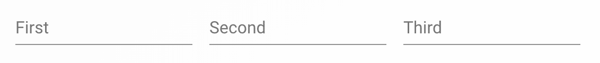

如果你输入每个文本字段，你将更新屏幕上组件的状态：

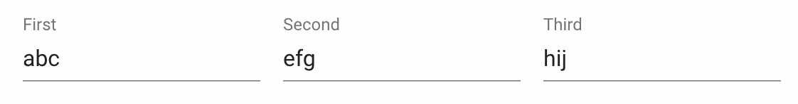

# 它是如何工作的...

使用`useState()`创建的设置函数：`setFirst()`、`setSecond()`和`setThird()`，通过改变组件在`onChange`事件中使用的状态来改变`TextField`组件的值。

`TextField`组件是一个方便的抽象，它建立在其他 Material-UI 组件（如`FormControl`和`Input`）之上。你可以通过用这些组件中的任何一个替换`TextField`来达到完全相同的结果。但你会得到更多的代码来维护。

# 还有更多...

如果，除了只在组件状态中保留`TextField`值之外，你还保留了`id`和`label`信息呢？将永远不会改变的价值作为状态存储可能会显得有些混乱，但权衡是你可以让状态数据驱动组件渲染的内容，而不是不得不反复重复相同的`TextField`组件。

首先，让我们改变组件状态的结构，如下所示：

```js
const [inputs, setInputs] = useState([
  { id: 'first', label: 'First', value: '' },
  { id: 'second', label: 'Second', value: '' },
  { id: 'third', label: 'Third', value: '' }
]);
```

与使用具有字符串属性的对象来保存文本字段值不同，`inputs`状态是一个对象数组。它是一个数组，这样组件就可以在保持顺序的同时遍历值。每个对象都有渲染`TextField`所需的一切。让我们看看更新的标记：

```js
<Grid container spacing={4} className={classes.container}>
  {inputs.map(input => (
    <Grid item key={input.id}>
      <TextField
        id={input.id}
        label={input.label}
        value={input.value}
        onChange={onChange}
      />
    </Grid>
  ))}
</Grid>
```

每个`Grid`项现在映射到`inputs`数组中的一个元素。如果你需要添加、删除或更改这些文本字段中的任何一个，你可以通过更新状态来实现。最后，让我们看看`onChange()`的实现：

```js
const onChange = ({ target: { id, value } }) => {
  const newInputs = [...inputs];
  const index = inputs.findIndex(input => input.id === id);

  newInputs[index] = { ...inputs[index], value };

  setInputs(newInputs);
};
```

`onChange()` 函数更新数组中的一个项目，即 `inputs` 数组。首先，它根据文本字段的 `id` 找到要更新的项目的 `index`。然后，它使用文本字段的值更新 `value` 属性。

功能与之前完全相同，但采用了更少 JSX 标记的方法。

# 相关内容

+   `TextField` 示例：[`material-ui.com/demos/text-fields/`](https://material-ui.com/demos/text-fields/)

+   `TextField` API 文档：[`material-ui.com/api/text-field/`](https://material-ui.com/api/text-field/)

# 占位符和辅助文本

至少，文本字段应该有一个标签，以便用户知道要输入什么。但仅有的标签可能会非常令人困惑——尤其是如果你在同一屏幕上有多个文本字段。为了帮助用户理解要输入什么，你可以利用 `placeholder` 和 `helperText`，除了 `label` 之外。

# 如何做到这一点...

让我们编写一些代码，展示你可以与 `TextField` 组件一起使用的各种 `label`、`placeholder` 和 `helperText` 配置：

```js
import React from 'react';

import { withStyles } from '@material-ui/core/styles';
import Grid from '@material-ui/core/Grid';
import TextField from '@material-ui/core/TextField';

const styles = theme => ({
  container: { margin: theme.spacing(2) }
});

const PlaceholderAndHelperText = withStyles(styles)(({ classes }) => (
  <Grid container spacing={4} className={classes.container}>
    <Grid item>
      <TextField label="The Value" />
    </Grid>
    <Grid item>
      <TextField placeholder="Example Value" />
    </Grid>
    <Grid item>
      <TextField helperText="Brief explanation of the value" />
    </Grid>
    <Grid item>
      <TextField
        label="The Value"
        placeholder="Example Value"
        helperText="Brief explanation of the value"
      />
    </Grid>
  </Grid>
));

export default PlaceholderAndHelperText;
```

这是四个文本字段的模样：

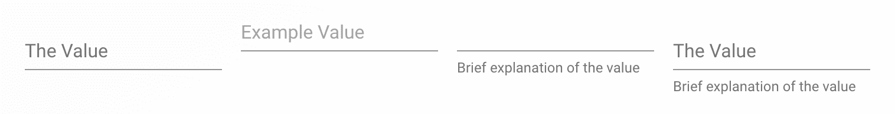

# 它是如何工作的...

让我们逐一查看这些文本字段，并分析它们的优缺点。

首先，有一个只包含 `label` 组件的文本字段：

```js
<TextField label="The Value" />
```

当你只有 `label` 时，它将显示在用户输入文本的位置：


当用户导航到文本字段并获得焦点时，`label` 缩小并移开：

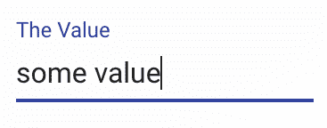

下一个文本字段使用 `placeholder` 属性指定占位文本：

```js
<TextField placeholder="Example Value" />
```

如果可能的话，`placeholder` 文本应向用户提供一个有效值的示例：

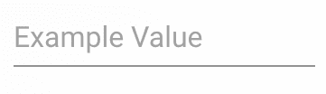

当用户开始输入文本时，`placeholder` 值消失：


下一个文本字段提供了 `helperText` 属性的值：

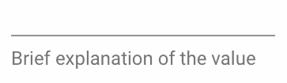

文本字段的辅助文本在静态意义上是始终可见的，即使用户开始输入也不会移动。最后，文本字段可以具有所有三个帮助用户确定应提供什么值的属性：

+   一个告诉用户值是什么的标签

+   提供示例值的占位文本

+   提供更多解释为什么需要值的辅助文本

当你结合这三个属性时，你正在增加用户理解应输入什么内容的可能性。当文本字段未获得焦点时，标签和辅助文本是可见的：

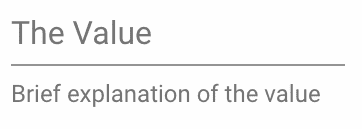

当文本字段获得焦点时，标签缩小，占位符值被揭示：

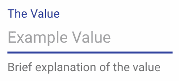

# 相关内容

+   `TextField` 示例：[`material-ui.com/demos/text-fields/`](https://material-ui.com/demos/text-fields/)

+   `TextField` API 文档：[`material-ui.com/api/text-field/`](https://material-ui.com/api/text-field/)

# 验证和错误显示

即使有辅助文本、占位符和标签，用户也难免会输入一些不太正确的东西。并不是他们试图搞砸事情（公平地说，有些人确实如此）；而是错误总是会发生。当出现错误时，文本输入字段需要标记为处于错误状态。

# 如何做到这一点...

假设你有两个输入：一个电话号码和一个电子邮件地址，并且你想要确保用户提供的值是正确的。

请注意：验证并不完美。幸运的是，这个组件可以工作，只要你需要它，你仍然会得到所有的 Material-UI 组件。

这是实现它的代码：

```js
import React, { useState } from 'react';

import { makeStyles } from '@material-ui/styles';
import Grid from '@material-ui/core/Grid';
import TextField from '@material-ui/core/TextField';

const useStyles = makeStyles(theme => ({
  container: { margin: theme.spacing(2) }
}));

export default function ValidationAndErrorDisplay() {
  const classes = useStyles();
  const [inputs, setInputs] = useState([
    {
      id: 'phone',
      label: 'Phone',
      placeholder: '999-999-9999',
      value: '',
      error: false,
      helperText: 'Any valid phone number will do',
      getHelperText: error =>
        error
          ? 'Woops. Not a valid phone number'
          : 'Any valid phone number will do',
      isValid: value =>
        /^[\+]?[(]?[0-9]{3}[)]?[-\s\.]?[0-9]{3}[-\s\.]?[0-9]{4,6}$/.test(
          value
        )
    },
    {
      id: 'email',
      label: 'Email',
      placeholder: 'john@acme.com',
      value: '',
      error: false,
      helperText: 'Any valid email address will do',
      getHelperText: error =>
        error
          ? 'Woops. Not a valid email address'
          : 'Any valid email address will do',
      isValid: value => /\S+@\S+\.\S+/.test(value)
    }
  ]);

  const onChange = ({ target: { id, value } }) => {
    const newInputs = [...inputs];
    const index = inputs.findIndex(input => input.id === id);
    const input = inputs[index];
    const isValid = input.isValid(value);

    newInputs[index] = {
      ...input,
      value: value,
      error: !isValid,
      helperText: input.getHelperText(!isValid)
    };

    setInputs(newInputs);
  };

  return (
    <Grid container spacing={4} className={classes.container}>
      {inputs.map(input => (
        <Grid item key={input.id}>
          <TextField
            id={input.id}
            label={input.label}
            placeholder={input.placeholder}
            helperText={input.helperText}
            value={input.value}
            onChange={onChange}
            error={input.error}
          />
        </Grid>
      ))}
    </Grid>
  );
}
```

`ValidationAndErrorDisplay` 组件将在屏幕上渲染两个 `TextField` 组件。这是屏幕首次加载时的样子：

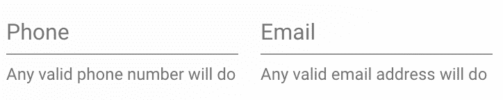

电话和电子邮件文本字段只是带有标签、辅助文本和占位符的常规文本字段。例如，当电话字段获得焦点时，它看起来像这样：

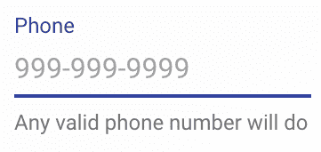

当你开始输入时，文本字段的值会与电话格式的正则表达式进行验证。以下是当字段具有无效电话号码值时的样子：

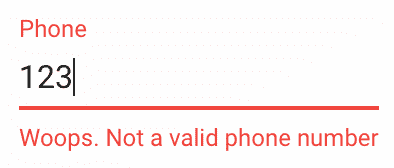

然后，一旦你有一个有效的电话号码值，文本字段的状况就会恢复到正常：

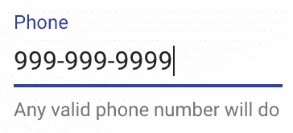

电子邮件字段的工作方式相同——唯一的区别是用于验证值格式的正则表达式。

# 它是如何工作的...

让我们先看看 `ValidationAndErrorDisplay` 组件的状态：

```js
const [inputs, setInputs] = useState([
  {
    id: 'phone',
    label: 'Phone',
    placeholder: '999-999-9999',
    value: '',
    error: false,
    helperText: 'Any valid phone number will do',
    getHelperText: error =>
      error
        ? 'Woops. Not a valid phone number'
        : 'Any valid phone number will do',
    isValid: value =>
      /^[\+]?[(]?[0-9]{3}[)]?[-\s\.]?[0-9]{3}[-\s\.]?[0-9]{4,6}$/.test(
        value
      )
  },
  {
    id: 'email',
    label: 'Email',
    placeholder: 'john@acme.com',
    value: '',
    error: false,
    helperText: 'Any valid email address will do',
    getHelperText: error =>
      error
        ? 'Woops. Not a valid email address'
        : 'Any valid email address will do',
    isValid: value => /\S+@\S+\.\S+/.test(value)
  }
]);
```

`inputs` 数组通过 `render()` 方法映射到 `TextField` 组件。这个数组中的每个对象都有直接映射到 `TextField` 组件的属性。例如，`id`、`label`、`placeholder`——这些都是 `TextField` 的属性。每个对象都有两个帮助验证文本字段值的函数。首先，`getHelperText()` 返回默认的辅助文本，或者如果 `error` 参数为真，则替换辅助文本的错误文本。`isValid()` 函数将 `value` 参数与正则表达式进行验证，如果匹配则返回 `true`。

接下来，让我们看看 `onChange()` 处理程序：

```js
const onChange = ({ target: { id, value } }) => {
  const newInputs = [...inputs];
  const index = inputs.findIndex(input => input.id === id);
  const input = inputs[index];
  const isValid = input.isValid(value);

  newInputs[index] = {
    ...input,
    value: value,
    error: !isValid,
    helperText: input.getHelperText(!isValid)
  };

  setInputs(newInputs);
};
```

随着用户输入，此函数会更新给定文本字段的值状态。它还会调用 `isValid()` 函数，并将更新后的值传递给它。如果值无效，则将 `error` 状态设置为 `true`。`helperText` 状态也会通过 `getHelperText()` 更新，这同样取决于值的有效性。

# 还有更多...

如果这个例子可以被修改，以至于您不需要将错误信息作为状态存储，或者不需要一个函数来更改文本框的辅助文本？为了做到这一点，您可以引入一个新的`TextField`抽象，该抽象处理设置`error`属性，并在值无效时更改`helperText`组件。以下是新的组件：

```js
const MyTextField = ({ isInvalid, ...props }) => {
  const invalid = isInvalid(props.value);

  return (
    <TextField
      {...props}
      error={invalid}
      helperText={invalid || props.helperText}
    />
  );
};
```

与返回`true`表示数据有效的函数不同，`MyTextField`组件期望一个`isInvalid()`属性，当数据有效时返回`false`，当数据无效时返回错误信息。然后，`error`属性可以使用这个值，这将改变文本框的颜色以指示它处于错误状态，而`helperText`属性可以使用`isInvalid()`函数返回的字符串，或者传递给组件的`helperText`属性。

接下来，让我们看看`ValidationAndErrorDisplay`组件现在使用的状态：

```js
const [inputs, setInputs] = useState([
  {
    id: 'phone',
    label: 'Phone',
    placeholder: '999-999-9999',
    value: '',
    helperText: 'Any valid phone number will do',
    isInvalid: value =>
      value === '' ||
      /^[\+]?[(]?[0-9]{3}[)]?[-\s\.]?[0-9]{3}[-\s\.]?[0-9]{4,6}$/.test(
        value
      )
        ? false
        : 'Woops. Not a valid phone number'
  },
  {
    id: 'email',
    label: 'Email',
    placeholder: 'john@acme.com',
    value: '',
    helperText: 'Any valid email address will do',
    isInvalid: value =>
      value === '' || /\S+@\S+\.\S+/.test(value)
        ? false
        : 'Woops. Not a valid email address'
  }
]);
```

输入不再需要`getHelperText()`函数或`error`状态。`isInvalid()`函数在值无效时返回错误辅助文本。接下来，让我们看看`onChange()`处理程序：

```js
const onChange = ({ target: { id, value } }) => {
  const newInputs = [...inputs];
  const index = inputs.findIndex(input => input.id === id);

  newInputs[index] = {
    ...inputs[index],
    value: value
  };

  setInputs(newInputs);
};
```

现在，它不需要接触`error`状态，也不必担心更新辅助文本，或者调用任何验证函数——所有这些现在都由`MyTextField`处理。

# 参见

+   `TextField`演示：[`material-ui.com/demos/text-fields/`](https://material-ui.com/demos/text-fields/)

+   `TextField` API 文档：[`material-ui.com/api/text-field/`](https://material-ui.com/api/text-field/)

# 密码字段

密码字段是一种特殊的文本输入类型，在输入时隐藏单个字符。Material-UI `TextField`组件通过改变`type`属性的值来支持这种类型的字段。

# 如何做到这一点...

这里有一个简单的例子，它将常规文本输入转换为防止在屏幕上显示值的`password`输入：

```js
import React, { useState } from 'react';

import TextField from '@material-ui/core/TextField';

export default function PasswordFields() {
  const [password, setPassword] = useState('12345');

  const onChange = e => {
    setPassword(e.target.value);
  };

  return (
    <TextField
      type="password"
      label="Password"
      value={password}
      onChange={onChange}
    />
  );
}
```

这里是首次加载时的屏幕样子：

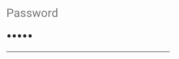

如果您更改密码字段的值，任何新的字符都将保持隐藏，尽管实际输入的值存储在`PasswordFields`组件的`password`状态中。

# 它是如何工作的...

`type`属性告诉`TextField`组件使用密码 HTML `input`元素。这就是为什么用户在输入时值保持隐藏，或者如果字段预先填充了密码值。有时，密码字段可以被自动填充。

# 还有更多...

您可以使用`autoComplete`属性来控制浏览器如何自动填充密码值。这个值的一个常见用例是在用户名字段填写后，自动在登录屏幕上填充密码字段。以下是一个在屏幕上具有用户名和密码字段时如何使用此属性的示例：

```js
import React, { useState } from 'react';

import { makeStyles } from '@material-ui/styles';
import Grid from '@material-ui/core/Grid';
import TextField from '@material-ui/core/TextField';

const useStyles = makeStyles(theme => ({
  container: { margin: theme.spacing(2) }
}));

export default function PasswordFields() {
  const classes = useStyles();
  const [username, setUsername] = useState('');
  const [password, setPassword] = useState('');

  return (
    <Grid container spacing={4} className={classes.container}>
      <Grid item>
        <TextField
          id="username"
          label="Username"
          autoComplete="username"
          InputProps={{ name: 'username' }}
          value={username}
          onChange={e => setUsername(e.target.value)}
        />
      </Grid>
      <Grid item>
        <TextField
          id="password"
          type="password"
          label="Password"
          autoComplete="current-password"
          value={password}
          onChange={e => setPassword(e.target.value)}
        />
      </Grid>
    </Grid>
  );
}
```

第一个 `TextField` 组件使用了 `autoComplete` 的 `username` 值。它还向 `InputProps` 传递了 `{ name: 'username' }`，以便在 `<input>` 元素上设置 `name` 属性。你需要这样做的原因是，在第二个 `TextField` 组件中，`autoComplete` 的 `current-password` 值告诉浏览器根据 `username` 字段值查找密码。

并非所有浏览器都实现了这一功能。为了使任何凭据能够自动填充到文本字段中，它们必须使用原生的浏览器凭据记住工具保存。

# 参见

+   `TextField` 演示：[`material-ui.com/demos/text-fields/`](https://material-ui.com/demos/text-fields/)

+   `TextField` API 文档：[`material-ui.com/api/text-field/`](https://material-ui.com/api/text-field/)

# 多行输入

对于某些字段，用户需要提供多行文本值的能力。`multiline` 属性有助于实现这一目标。

# 如何实现...

假设你有一个可能需要多行文本的字段，由用户提供。您可以指定 `multiline` 属性以允许这样做：

```js
import React, { useState } from 'react';

import TextField from '@material-ui/core/TextField';

export default function MultilineInput() {
  const [multiline, setMultiline] = useState('');

  return (
    <TextField
      multiline
      value={multiline}
      onChange={e => setMultiline(e.target.value)}
    />
  );
}
```

当屏幕首次加载时，文本字段看起来像一个普通字段，因为它默认只有一行：


你可以在这个文本字段中输入你需要的任意多行。新行通过按下 *Enter* 键开始：

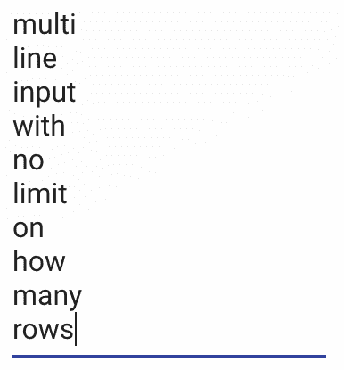

# 它是如何工作的...

`multiline` 布尔属性用于向 `TextField` 组件指示该字段需要 `multiline` 支持。在先前的示例中，如果你计划在一个拥挤的空间中使用 `multiline` 输入，比如屏幕上有许多其他字段或是在对话框中，你可能会遇到一些问题：

+   当用户按下 *Enter* 键时，字段的高度会改变，向组件添加更多行。这可能会引起布局问题，因为其他元素会被移动。

+   如果字段从一行开始并且看起来像常规的单行文本输入，那么用户可能不会意识到他们可以在字段中输入多行文本。

# 还有更多...

为了帮助防止动态大小的 `multiline` 文本字段可能引起的问题，您可以指定 `multiline` 文本字段使用的行数。以下是如何使用 `rows` 属性的示例：

```js
<TextField
  multiline
  rows={5}
  label="Address"
  value={multiline}
  onChange={e => setMultiline(e.target.value)}
/>
```

现在，文本字段将正好有五行：

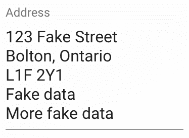

如果用户输入超过五行的文本，将显示垂直滚动条——文本的高度不会改变，并且不会影响其他周围组件的布局。您可以通过使用 `rowsMax` 属性而不是 `rows` 来对 `TextField` 组件施加相同类型的高度限制。区别在于文本字段将从一个行开始，并在用户添加新行时增长。但如果将 `rowsMax` 设置为 `5`，文本字段将不会超过五行。

# 参见

+   `TextField` 演示：[`material-ui.com/demos/text-fields/`](https://material-ui.com/demos/text-fields/)

+   `TextField` API 文档：[`material-ui.com/api/text-field/`](https://material-ui.com/api/text-field/)

# 输入装饰

Material-UI `Input` 组件具有允许你自定义其外观和行为属性的属性。想法是你可以用其他 Material-UI 组件装饰输入，以扩展基本文本输入的功能，使其对应用用户有意义。

# 如何实现...

假设你的应用有几个屏幕，这些屏幕都有密码输入。你的应用用户喜欢在输入密码时能够看到密码。默认情况下，值将被隐藏，但如果输入组件本身有一个切换值可见性的按钮，这将使你的用户感到高兴。

这里是一个示例，展示了一个通用的组件，它将为密码字段添加一个可见性切换按钮：

```js
import React, { useState } from 'react';

import TextField from '@material-ui/core/TextField';
import IconButton from '@material-ui/core/IconButton';
import InputAdornment from '@material-ui/core/InputAdornment';

import VisibilityIcon from '@material-ui/icons/Visibility';
import VisibilityOffIcon from '@material-ui/icons/VisibilityOff';

function PasswordField() {
  const [visible, setVisible] = useState(false);

  const toggleVisibility = () => {
    setVisible(!visible);
  };

  return (
    <TextField
      type={visible ? 'text' : 'password'}
      InputProps={{
        endAdornment: (
          <InputAdornment position="end">
            <IconButton onClick={toggleVisibility}>
              {visible ? <VisibilityIcon /> : <VisibilityOffIcon />}
            </IconButton>
          </InputAdornment>
        )
      }}
    />
  );
}

export default function InputAdornments() {
  const [password, setPassword] = useState('');

  return (
    <PasswordField
      value={password}
      onChange={e => setPassword(e.target.value)}
    />
  );
}
```

如果你开始输入而不点击切换可见性按钮，你会看到这样的效果：

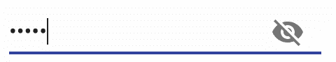

如果我们点击切换可见性按钮，密码字段看起来是这样的：

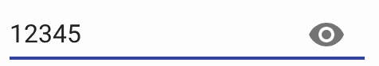

# 它是如何工作的...

让我们更仔细地看看 `PasswordField` 组件：

```js
function PasswordField() {
  const [visible, setVisible] = useState(false);

  const toggleVisibility = () => {
    setVisible(!visible);
  };

  return (
    <TextField
      type={visible ? 'text' : 'password'}
      InputProps={{
        endAdornment: (
          <InputAdornment position="end">
            <IconButton onClick={toggleVisibility}>
              {visible ? <VisibilityIcon /> : <VisibilityOffIcon />}
            </IconButton>
          </InputAdornment>
        )
      }}
    />
  );
}
```

这个组件维护一个名为 `visible` 的状态。`PasswordField` 维护这个状态而不是父组件的原因是关注点分离原则。例如，父组件可能需要访问密码字段的值。这个值作为属性传递到 `PasswordField`。然而，只有 `PasswordField` 关心 `visibility` 状态。因此，通过将其封装在这个组件中，你简化了任何使用 `PasswordField` 的代码。

这个抽象的另一个有价值的方面是装饰本身。`type` 属性随着 `visible` 状态的变化而变化——这是显示或隐藏密码值的机制。`endAdornment` 属性传递给 `TextField` 渲染的 `Input` 组件，通过 `InputProps` 传递。这就是你如何向字段添加组件的方式。在这个例子中，你正在向输入的右侧（末端）添加一个图标按钮。这里的图标根据可见性状态变化，并且当点击时，会调用 `toggleVisible()` 方法来实际改变可见性状态。

# 还有更多...

你可以使用输入装饰来做的不仅仅是显示密码字段的值按钮。例如，在一个需要验证的字段中，你可以使用输入装饰来帮助可视化字段的状态。假设你需要验证用户输入的电子邮件字段。你可以创建一个组件形式的抽象，根据用户提供的验证结果改变组件的颜色和装饰。这个组件看起来是这样的：

```js
const ValidationField = props => {
  const { isValid, ...rest } = props;
  const empty = props.value === '';
  const valid = isValid(props.value);
  let startAdornment;

  if (empty) {
    startAdornment = null;
  } else if (valid) {
    startAdornment = (
      <InputAdornment position="start">
        <CheckCircleIcon color="primary" />
      </InputAdornment>
    );
  } else {
    startAdornment = (
      <InputAdornment position="start">
        <ErrorIcon color="error" />
      </InputAdornment>
    );
  }

  return (
    <TextField
      {...rest}
      error={!empty && !valid}
      InputProps={{ startAdornment }}
    />
  );
};
```

`ValidationField` 的想法是获取一个 `isValid()` 函数属性，并使用它来测试值属性。如果它返回 `true`，则 `startAdornment` 是一个勾选标记。如果 `isValid()` 返回 `false`，则 `startAdornment` 是一个红色的 *x*。以下是组件的使用方法：

```js
<ValidationField
  label="Email"
  value={this.state.email}
  onChange={this.onEmailChange}
  isValid={v => /\S+@\S+\.\S+/.test(v)}
/>
```

`ValidationField` 组件几乎可以与 `TextField` 一样使用。唯一的增加是 `isValid` 属性。任何状态都在 `ValidationField` 之外处理，这意味着 `isValid()` 会在值更改时被调用，并将更新组件的外观以反映数据的有效性。作为额外的奖励：你实际上不需要在任何地方存储任何类型的错误状态，因为 `ValidationField` 从值和 `isValid` 属性中推导出它所需的一切。

这是带有无效电子邮件地址的字段看起来像什么：

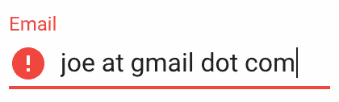

这是带有有效电子邮件地址的字段看起来像什么：

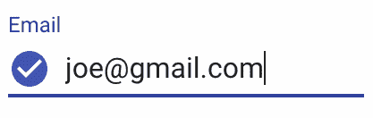

# 参见

+   `TextField` 演示：[`material-ui.com/demos/text-fields/`](https://material-ui.com/demos/text-fields/)

+   `TextField` API 文档：[`material-ui.com/api/text-field/`](https://material-ui.com/api/text-field/)

+   `IconButton` API 文档：[`material-ui.com/api/icon-button/`](https://material-ui.com/api/icon-button/)

+   `InputAdornment` API 文档：[`material-ui.com/api/input-adornment/`](https://material-ui.com/api/input-adornment/)

# 输入掩码

一些文本输入需要具有特定格式的值。使用 Material-UI `TextField` 组件，你可以添加掩码功能，这有助于引导用户提供正确的格式。

# 如何操作...

假设你有一个电话号码和电子邮件字段，并且你想要为每个字段提供一个输入掩码。以下是你可以如何使用来自 `react-text-mask` 的 `MaskedInput` 组件与 `TextField` 组件一起添加掩码功能：

```js
import React, { Fragment, useState } from 'react';
import MaskedInput from 'react-text-mask';
import emailMask from 'text-mask-addons/dist/emailMask';

import { makeStyles } from '@material-ui/styles';
import TextField from '@material-ui/core/TextField';

const useStyles = makeStyles(theme => ({
  input: { margin: theme.spacing.unit * 3 }
}));

const PhoneInput = ({ inputRef, ...props }) => (
  <MaskedInput
    {...props}
    ref={ref => {
      inputRef(ref ? ref.inputElement : null);
    }}
    mask={[
      '(',
      /[1-9]/,
      /\d/,
      /\d/,
      ')',
      ' ',
      /\d/,
      /\d/,
      /\d/,
      '-',
      /\d/,
      /\d/,
      /\d/,
      /\d/
    ]}
    placeholderChar={'\u2000'}
  />
);

const EmailInput = ({ inputRef, ...props }) => (
  <MaskedInput
    {...props}
    ref={ref => {
      inputRef(ref ? ref.inputElement : null);
    }}
    mask={emailMask}
    placeholderChar={'\u2000'}
  />
);

export default function InputMasking() {
  const classes = useStyles();
  const [phone, setPhone] = useState('');
  const [email, setEmail] = useState('');

  return (
    <Fragment>
      <TextField
        label="Phone"
        className={classes.input}
        value={phone}
        onChange={e => setPhone(e.target.value)}
        InputProps={{ inputComponent: PhoneInput }}
      />
      <TextField
        label="Email"
        className={classes.input}
        value={email}
        onChange={e => setEmail(e.target.value)}
        InputProps={{ inputComponent: EmailInput }}
      />
    </Fragment>
  );
}
```

这是屏幕首次加载时的样子：

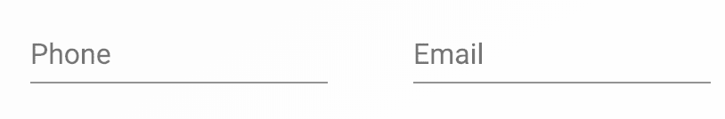

当你开始在电话字段中输入值时，格式掩码就会出现：

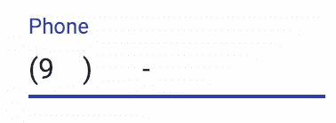

这就是完成后的值看起来像什么——用户永远不需要输入 `(`，`)` 或 `-`：

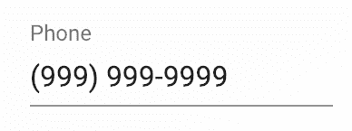

这就是完成后的电子邮件值看起来像什么：

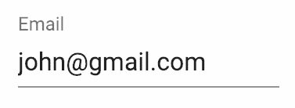

在电子邮件输入中，用户实际上必须输入 `@` 和 `.`，因为掩码不知道电子邮件地址的任何部分有多少个字符。然而，它确实阻止用户将这两个字符放在错误的位置。

# 它是如何工作的...

为了使这起作用，你创建了一个 `PhoneInput` 组件和一个 `EmailInput` 组件。每个组件的想法是围绕 `MaskedInput` 组件提供基本的抽象。让我们更详细地看看每个组件，从 `PhoneInput` 开始：

```js
const PhoneInput = ({ inputRef, ...props }) => (
  <MaskedInput
    {...props}
    ref={ref => {
      inputRef(ref ? ref.inputElement : null);
    }}
    mask={[
      '(',
      /[1-9]/,
      /\d/,
      /\d/,
      ')',
      ' ',
      /\d/,
      /\d/,
      /\d/,
      '-',
      /\d/,
      /\d/,
      /\d/,
      /\d/
    ]}
    placeholderChar={'\u2000'}
  />
);
```

传递给`PhoneInput`的属性大部分被转发到`MaskedInput`。由于名称不同，`ref`属性需要显式设置。`placeholder`属性被设置为空白。`mask`属性是最重要的——这是用户在开始输入时看到的模式。传递给`mask`的值是一个包含正则表达式和字符串字符的数组。字符串字符是用户开始输入时显示的内容——在电话号码的情况下，这些是`(`、`)`和`-`字符。正则表达式是与用户输入匹配的动态部分。对于电话号码，任何数字都可以，但不允许符号和字母。

现在我们来看看`EmailInput`组件：

```js
const EmailInput = ({ inputRef, ...props }) => (
  <MaskedInput
    {...props}
    ref={ref => {
      inputRef(ref ? ref.inputElement : null);
    }}
    mask={emailMask}
    placeholderChar={'\u2000'}
  />
);
```

这与`PhoneInput`采用相同的方法。主要区别在于，不是传递一个字符串数组和正则表达式，而是使用从`react-text-mask`导入的`emailMask`函数。

现在你有了这两个掩码输入，你可以通过将它们传递给`inputComponent`属性来使用它们：

```js
<TextField
  label="Phone"
  className={classes.input}
  value={phone}
  onChange={e => setPhone(e.target.value)}
  InputProps={{ inputComponent: PhoneInput }}
/>
<TextField
  label="Email"
  className={classes.input}
  value={email}
  onChange={e => setEmail(e.target.value)}
  InputProps={{ inputComponent: EmailInput }}
/>
```

# 参见

+   `TextField`演示：[`material-ui.com/demos/text-fields/`](https://material-ui.com/demos/text-fields/)

+   `TextField` API 文档：[`material-ui.com/api/text-field/`](https://material-ui.com/api/text-field/)

+   React 文本掩码：[`github.com/text-mask/text-mask`](https://github.com/text-mask/text-mask)
