# 第十三章：选择 - 从选项中进行选择

在本章中，你将了解以下内容：

+   抽象复选框组

+   自定义复选框项

+   抽象单选按钮组

+   使用单选按钮类型

+   将复选框替换为开关

+   使用状态控制选择

+   选择多个项目

# 简介

任何包含用户交互的应用程序都涉及用户进行选择。这可以从简单的开/关开关到允许选择多个项目的多个项目选择。Material-UI 有不同类型的选择组件，最适合特定的用户场景。

# 抽象复选框组

复选框通常向用户提供一组相关的选项，用户可以选择或取消选择。Material-UI 的`Checkbox`组件提供了基本的功能，但你可能想要一个更高级别的功能，可以在整个应用程序中重用。

# 如何实现...

让我们为复选框选项组创建一个抽象。以下是`CheckboxGroup`组件的代码：

```js
import React, { useState } from 'react';

import FormLabel from '@material-ui/core/FormLabel';
import FormControl from '@material-ui/core/FormControl';
import FormGroup from '@material-ui/core/FormGroup';
import FormControlLabel from '@material-ui/core/FormControlLabel';
import FormHelperText from '@material-ui/core/FormHelperText';
import Checkbox from '@material-ui/core/Checkbox';

const CheckboxGroup = ({ values, label, onChange }) => (
  <FormControl component="fieldset">
    <FormLabel component="legend">{label}</FormLabel>
    <FormGroup>
      {values.map((value, index) => (
        <FormControlLabel
          key={index}
          control={
            <Checkbox
              checked={value.checked}
              onChange={onChange(index)}
            />
          }
          label={value.label}
        />
      ))}
    </FormGroup>
  </FormControl>
);

export default function AbstractingCheckboxGroups() {
  const [values, setValues] = useState([
    { label: 'First', checked: false },
    { label: 'Second', checked: false },
    { label: 'Third', checked: false }
  ]);

  const onChange = index => ({ target: { checked } }) => {
    const newValues = [...values];
    const value = values[index];

    newValues[index] = { ...value, checked };

    setValues(newValues);
  };

  return (
    <CheckboxGroup
      label="Choices"
      values={values}
      onChange={onChange}
    />
  );
}
```

当你首次加载屏幕时，你会看到以下内容：

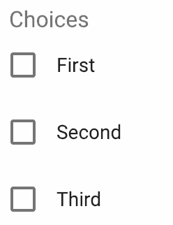

当你选择前两个选项时，它看起来是这样的：

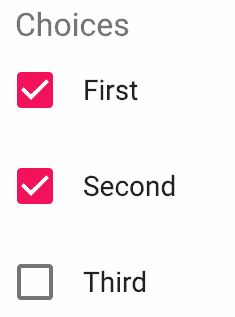

# 它是如何工作的...

让我们更详细地看看`CheckboxGroup`组件：

```js
const CheckboxGroup = ({ values, label, onChange }) => (
  <FormControl component="fieldset">
    <FormLabel component="legend">{label}</FormLabel>
    <FormGroup>
      {values.map((value, index) => (
        <FormControlLabel
          key={index}
          control={
            <Checkbox
              checked={value.checked}
              onChange={onChange(index)}
            />
          }
          label={value.label}
        />
      ))}
    </FormGroup>
  </FormControl>
);
```

这是允许你在应用程序的各个屏幕上渲染复选框选项组的抽象。有几个 Material-UI 组件涉及到渲染一组复选框——`CheckboxGroup`为你处理这些，所以你只需要传递一个包含`values`、`label`和`onChange`处理程序的数组。

接下来，让我们看看你的应用程序组件是如何渲染`CheckboxGroup`的：

```js
<CheckboxGroup
  label="Choices"
  values={values}
  onChange={onChange}
/>
```

你只需要关注结构化值数组，并在你的应用程序需要渲染一组相关复选框选项时将其传递给`CheckboxGroup`组件。最后，让我们看看`state`和用于切换值选中状态的`onChange()`处理程序：

```js
const [values, setValues] = useState([
  { label: 'First', checked: false },
  { label: 'Second', checked: false },
  { label: 'Third', checked: false }
]);

const onChange = index => ({ target: { checked } }) => {
  const newValues = [...values];
  const value = values[index];

  newValues[index] = { ...value, checked };

  setValues(newValues);
};
```

`checked`属性根据索引参数和`target.checked`值进行更改。

# 还有更多...

让我们在这个例子中添加一个`List`组件，这样你可以更好地可视化当复选框被选中/取消选中时发生的状态变化。以下是你需要导入的附加 Material-UI 组件：

```js
import List from '@material-ui/core/List';
import ListItem from '@material-ui/core/ListItem';
import ListItemIcon from '@material-ui/core/ListItemIcon';
import ListItemText from '@material-ui/core/ListItemText';
import Typography from '@material-ui/core/Typography';
```

策略是让这个列表渲染已选中项的标签。让我们在`CheckboxGroup`组件下方渲染这个列表：

```js
<Fragment>
  <CheckboxGroup
    label="Choices"
    values={values}
    onChange={onChange}
  />
  <Typography variant="h6">Selection</Typography>
  <List>
    {values
      .filter(value => value.checked)
      .map((value, index) => (
        <ListItem key={index}>
          <ListItemText>{value.label}</ListItemText>
        </ListItem>
      ))}
  </List>
</Fragment>
```

在`values`上的`filter()`调用只会包含`checked`属性为`true`的值。当屏幕首次加载时，你会看到一个空列表，因为没有默认选中任何内容：

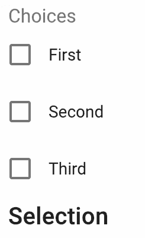

当你开始进行选择时，你会看到选择列表随着应用程序状态的变化而变化：

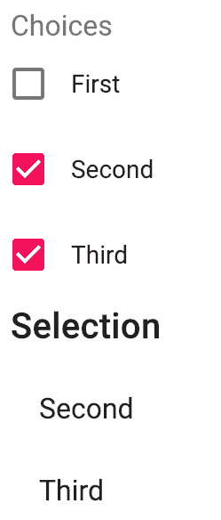

# 参见

+   选择演示：[`material-ui.com/demos/selection-controls/`](https://material-ui.com/demos/selection-controls/)

+   `Checkbox` API 文档：[`material-ui.com/api/checkbox/`](https://material-ui.com/api/checkbox/)

+   `FormHelperText` API 文档：[`material-ui.com/api/form-helper-text/`](https://material-ui.com/api/form-helper-text/)

+   `FormControlLabel` API 文档：[`material-ui.com/api/form-control-label/`](https://material-ui.com/api/form-control-label/)

+   `FormGroup` API 文档：[`material-ui.com/api/form-group/`](https://material-ui.com/api/form-group/)

+   `FormControl` API 文档：[`material-ui.com/api/form-control/`](https://material-ui.com/api/form-control/)

+   `FormLabel` API 文档：[`material-ui.com/api/form-label/`](https://material-ui.com/api/form-label/)

# 定制复选框项

Material-UI `Checkbox`组件的默认外观试图与原生的浏览器复选框输入元素相似。你可以更改组件的选中和不选中状态所使用的图标。即使你更改了`Checkbox`使用的图标，任何颜色更改仍然会被尊重。

# 如何做到这一点...

下面是一些导入几个 Material-UI 图标并使用它们来配置`Checkbox`组件使用的图标的代码：

```js
import React, { useState, useEffect } from 'react';

import FormGroup from '@material-ui/core/FormGroup';
import FormControlLabel from '@material-ui/core/FormControlLabel';
import Checkbox from '@material-ui/core/Checkbox';

import AccountBalance from '@material-ui/icons/AccountBalance';
import AccountBalanceOutlined from '@material-ui/icons/AccountBalanceOutlined';
import Backup from '@material-ui/icons/Backup';
import BackupOutlined from '@material-ui/icons/BackupOutlined';
import Build from '@material-ui/icons/Build';
import BuildOutlined from '@material-ui/icons/BuildOutlined';

const initialItems = [
  {
    name: 'AccountBalance',
    Icon: AccountBalanceOutlined,
    CheckedIcon: AccountBalance
  },
  {
    name: 'Backup',
    Icon: BackupOutlined,
    CheckedIcon: Backup
  },
  {
    name: 'Build',
    Icon: BuildOutlined,
    CheckedIcon: Build
  }
];

export default function CustomizingCheckboxItems() {
  const [items, setItems] = useState({});

  useEffect(() => {
    setItems(
      initialItems.reduce(
        (state, item) => ({ ...state, [item.name]: false }),
        {}
      )
    );
  }, []);

  const onChange = e => {
    setItems({ [e.target.name]: e.target.checked });
  };

  return (
    <FormGroup>
      {initialItems.map(({ name, Icon, CheckedIcon }, index) => (
        <FormControlLabel
          key={index}
          control={
            <Checkbox
              checked={items[name]}
              onChange={onChange}
              inputProps={{ name }}
              icon={<Icon fontSize="small" />}
              checkedIcon={<CheckedIcon fontSize="small" />}
            />
          }
          label={name}
        />
      ))}
    </FormGroup>
  );
}
```

当屏幕首次加载时，复选框看起来是这样的：

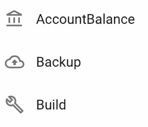

这些复选框是未选中的。当它们被选中时，它们看起来是这样的：

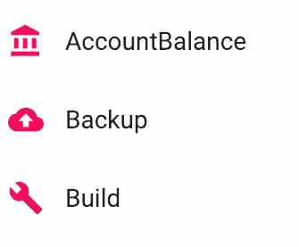

# 它是如何工作的...

让我们一步步分析这里发生的事情。`initialItems`数组是构建复选框的起点：

```js
const initialItems = [
  {
    name: 'AccountBalance',
    Icon: AccountBalanceOutlined,
    CheckedIcon: AccountBalance
  },
  {
    name: 'Backup',
    Icon: BackupOutlined,
    CheckedIcon: Backup
  },
  {
    name: 'Build',
    Icon: BuildOutlined,
    CheckedIcon: Build
  }
];
```

每个项目都有一个`name`组件来标识复选框，以及选中/未选中的`Icon`组件。接下来，让我们看看`CustomizingCheckboxItems`组件的状态是如何初始化的：

```js
const [items, setItems] = useState({});

useEffect(() => {
  setItems(
    initialItems.reduce(
      (state, item) => ({ ...state, [item.name]: false }),
      {}
    )
  );
}, []);
```

状态通过减少`initialItems`数组初始化为一个对象。对于数组中的每个项目，该组件的状态将有一个属性初始化为 false。属性的名称基于项目的`name`属性。例如，组件状态在减少后可能看起来像这样：

```js
{
  AccountBalance: false,
  Backup: false,
  Build: false
}
```

这些属性用于存储每个复选框的选中状态。接下来，让我们看看每个`Checkbox`组件是如何根据`initialItems`数组渲染的：

```js
<FormGroup>
  {initialItems.map(({ name, Icon, CheckedIcon }, index) => (
    <FormControlLabel
      key={index}
      control={
        <Checkbox
          checked={items[name]}
          onChange={onChange}
          inputProps={{ name }}
          icon={<Icon fontSize="small" />}
          checkedIcon={<CheckedIcon fontSize="small" />}
        />
      }
      label={name}
    />
  ))}
</FormGroup>
```

定制每个复选框的关键属性是`icon`和`checkedIcon`。这些属性分别使用项目数组中的`Icon`和`CheckIcon`属性。

# 还有更多...

由于你用来定制`Checkbox`组件的图标是 Material-UI 组件，你可以更改复选框的颜色，并且它将像没有自定义图标一样工作。例如，你可以将此示例中复选框的颜色设置为默认值：

```js
<Checkbox
  color="default"
  checked={items[name]}
  onChange={onChange}
  inputProps={{ name }}
  icon={<Icon fontSize="small" />}
  checkedIcon={<CheckedIcon fontSize="small" />}
/>
```

这是所有复选框都被选中时的样子：

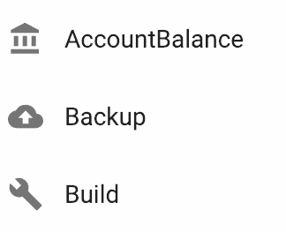

当复选框从未选中变为选中时，颜色设置为默认值，颜色不会改变。不过，这并不重要，因为图标从轮廓主题变为填充主题。仅形状的变化就足以表明项目已被选中。

让我们尝试一下`primary`，只是为了好玩：

```js
<Checkbox
  color="primary"
  checked={items[name]}
  onChange={onChange}
  inputProps={{ name }}
  icon={<Icon fontSize="small" />}
  checkedIcon={<CheckedIcon fontSize="small" />}
/>
```

如果所有选项都被选中，看起来是这样的：

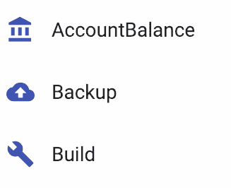

# 参见

+   `选择`演示：[`material-ui.com/demos/selection-controls/`](https://material-ui.com/demos/selection-controls/)

+   `Checkbox` API 文档：[`material-ui.com/api/checkbox/`](https://material-ui.com/api/checkbox/)

+   `FormControlLabel` API 文档：[`material-ui.com/api/form-control-label/`](https://material-ui.com/api/form-control-label/)

+   `FormGroup` API 文档：[`material-ui.com/api/form-group/`](https://material-ui.com/api/form-group/)

# 抽象单选按钮组

**单选按钮组**与复选框组类似。关键区别在于单选按钮用于只应选择一个值的情况。此外，与复选框组一样，单选按钮组需要几个可以在整个应用程序中封装和重用的 Material-UI 组件。

# 它是如何工作的...

下面是一些代码，它捕获了将单选按钮组组合成一个组件所需的所有组件：

```js
import React, { useState } from 'react';

import Radio from '@material-ui/core/Radio';
import { default as MaterialRadioGroup } from '@material-ui/core/RadioGroup';
import FormControlLabel from '@material-ui/core/FormControlLabel';
import FormControl from '@material-ui/core/FormControl';
import FormLabel from '@material-ui/core/FormLabel';

const options = [
  { label: 'First', value: 'first' },
  { label: 'Second', value: 'second' },
  { label: 'Third', value: 'third' }
];

const RadioGroup = ({ value, options, name, label, onChange }) => (
  <FormControl component="fieldset">
    <FormLabel component="legend">{label}</FormLabel>
    <MaterialRadioGroup
      name={name}
      value={value}
      onChange={onChange}
      disabled
    >
      {options.map((option, index) => (
        <FormControlLabel
          key={index}
          control={<Radio />}
          value={option.value}
          label={option.label}
        />
      ))}
    </MaterialRadioGroup>
  </FormControl>
);

export default function AbstractingRadioButtonGroups() {
  const [value, setValue] = useState('first');

  const onChange = e => {
    setValue(e.target.value);
  };

  return (
    <RadioGroup
      value={value}
      options={options}
      name="radio1"
      label="Pick One"
      onChange={onChange}
    />
  );
}
```

当您首次加载屏幕时，您会看到以下内容：

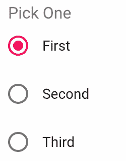

如果您点击第三个选项，组件看起来是这样的：

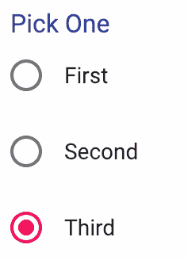

因为这些选项都属于同一个单选组，所以一次只能选择一个选项。

# 它是如何工作的...

让我们更仔细地看看这个例子中的`RadioGroup`组件：

```js
const RadioGroup = ({ value, options, name, label, onChange }) => (
  <FormControl component="fieldset">
    <FormLabel component="legend">{label}</FormLabel>
    <MaterialRadioGroup name={name} value={value} onChange={onChange}>
      {options.map((option, index) => (
        <FormControlLabel
          key={index}
          control={<Radio />}
          value={option.value}
          label={option.label}
        />
      ))}
    </MaterialRadioGroup>
  </FormControl>
);
```

`options`属性应该有一个数组值，然后映射到`FormControlLabel`组件。`control`属性使用`Radio`组件来渲染每个单选控制。与复选框组不同，`onChange`属性位于`MaterialRadioGroup`组件上，而不是每个单独的`Radio`上。这是因为只有一个活动值，由`MaterialRadioGroup`管理。

由于我们正在创建一个同名的组件，所以使用`MaterialRadioGroup`别名导入 Material-UI 的`RadioGroup`组件。只要您清楚哪些包拥有哪些组件，这就可以了。

接下来，让我们看看`RadioGroup`组件是如何渲染的：

```js
<RadioGroup
  value={value}
  options={options}
  name="radio1"
  label="Pick One"
  onChange={onChange}
/>
```

`name`属性是连接一切的关键。确保同一组中的单选按钮具有相同的名称非常重要。这种抽象通过只要求在一个地方提供名称来为您处理这个问题。下面是`options`数组的样子：

```js
const options = [
  { label: 'First', value: 'first' },
  { label: 'Second', value: 'second' },
  { label: 'Third', value: 'third' }
];
```

单选组的理念是它们始终只有一个值。`options` 数组中的值属性是允许的值——但只有一个处于活动状态。在下面的例子中，最后要查看的是 `onChange` 处理器和应用程序组件的状态结构：

```js
const [value, setValue] = useState('first');

const onChange = e => {
  setValue(e.target.value);
};
```

这是设置初始单选选择的步骤。当它改变时，值状态会更新为所选单选按钮的值。

# 更多内容...

你可以通过在 `FormControl` 组件上设置 `disabled` 属性来禁用整个单选按钮组：

```js
<FormControl component="fieldset" disabled>
  ...
</FormControl>
```

当你禁用控件时，你将无法与之交互。下面是这种情况的示例：

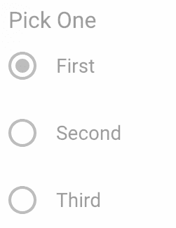

在其他场景中，你可能只想禁用一个选项。你可以在 `RadioGroup` 组件中通过检查 `options` 数组中的 `disabled` 属性来实现这一点：

```js
<FormControlLabel
  key={index}
  control={<Radio disabled={option.disabled} />}
  value={option.value}
  label={option.label}
/>
```

这是如何在 `options` 数组中禁用选项的方法：

```js
const options = [
  { label: 'First', value: 'first' },
  { label: 'Second', value: 'second', disabled: true },
  { label: 'Third', value: 'third' }
];
```

这是禁用第二个选项后单选组的样式：

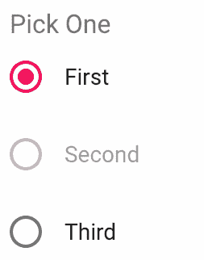

当第二个选项被禁用时，没有方法可以激活它，因为用户无法与之交互。

注意禁用默认激活的选项。这可能会使用户感到困惑。你可以激活组中的另一个选项，但之后你将无法激活最初激活的选项。

# 参见

+   `选择`演示：[`material-ui.com/demos/selection-controls/`](https://material-ui.com/demos/selection-controls/)

+   `Radio` API 文档：[`material-ui.com/api/radio/`](https://material-ui.com/api/radio/)

+   `RadioGroup` API 文档：[`material-ui.com/api/radio-group/`](https://material-ui.com/api/radio-group/)

+   `FormControlLabel` API 文档：[`material-ui.com/api/form-control-label/`](https://material-ui.com/api/form-control-label/)

+   `FormControl` API 文档：[`material-ui.com/api/form-control/`](https://material-ui.com/api/form-control/)

+   `FormLabel` API 文档：[`material-ui.com/api/form-label/`](https://material-ui.com/api/form-label/)

# 单选按钮类型

有许多单选按钮方面可以自定义，以创建您自己的单选按钮组。虽然从多个选项中选择单个值的基本原则没有改变，但您可以设计单选按钮组以适应任何应用程序。

# 如何实现...

假设根据你屏幕的布局，并且为了与你的应用程序中的其他屏幕保持一致，你需要创建一个具有以下设计特性的单选组：

+   单行用于展示选项

+   每个选项都有图标和文本

+   主要主题颜色用于选中的选项

下面是一些实现此功能的代码：

```js
import React, { Fragment, useState } from 'react';

import Radio from '@material-ui/core/Radio';
import RadioGroup from '@material-ui/core/RadioGroup';
import FormControlLabel from '@material-ui/core/FormControlLabel';
import FormControl from '@material-ui/core/FormControl';
import FormLabel from '@material-ui/core/FormLabel';

import Car from '@material-ui/icons/DirectionsCar';
import CarOutlined from '@material-ui/icons/DirectionsCarOutlined';
import Bus from '@material-ui/icons/DirectionsBus';
import BusOutlined from '@material-ui/icons/DirectionsBusOutlined';
import Train from '@material-ui/icons/Train';
import TrainOutlined from '@material-ui/icons/TrainOutlined';

export default function RadioButtonTypes() {
  const [value, setValue] = useState('train');

  const onChange = e => {
    setValue(e.target.value);
  };

  return (
    <FormControl component="fieldset">
      <FormLabel component="legend">Travel Mode</FormLabel>
      <RadioGroup name="travel" value={value} onChange={onChange} row>
        <FormControlLabel
          value="car"
          control={
            <Radio
              color="primary"
              icon={<CarOutlined />}
              checkedIcon={<Car />}
            />
          }
          label="Car"
          labelPlacement="bottom"
        />
        <FormControlLabel
          value="bus"
          control={
            <Radio
              color="primary"
              icon={<BusOutlined />}
              checkedIcon={<Bus />}
            />
          }
          label="Bus"
          labelPlacement="bottom"
        />
        <FormControlLabel
          value="train"
          control={
            <Radio
              color="primary"
              icon={<TrainOutlined />}
              checkedIcon={<Train />}
            />
          }
          label="Train"
          labelPlacement="bottom"
        />
      </RadioGroup>
    </FormControl>
  );
}
```

这是屏幕首次加载时单选组的样式：

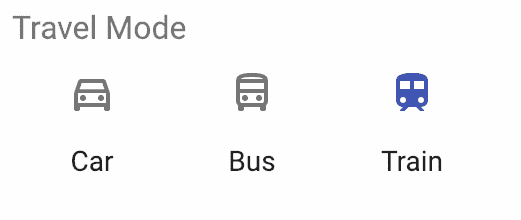

你可以通过点击其他图标或标签来更改默认选择。图标状态会更新以反映更改：

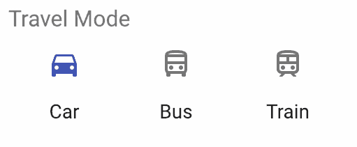

# 它是如何工作的...

看起来我们能够满足为单选按钮组设定的标准。让我们通过代码来查看每个要求是如何满足的。首先，组是水平渲染的，每个单选按钮都在同一行。这是通过向`RadioGroup`组件传递`row`属性来实现的：

```js
<RadioGroup
  name="travel"
  value={value}
  onChange={onChange}
  row
>
```

每个单选按钮的标签都显示在每个单选按钮下方，因为这与组的行布局更协调。这是通过设置`FormControlLabel`的`labelPlacement`属性值来实现的。当单选按钮被选中时，它使用 Material-UI 主题的默认颜色。它还使用自定义图标来表示选中状态和未选中状态：

```js
<Radio
  color="primary"
  icon={<BusOutlined />}
  checkedIcon={<Bus />}
/>
```

这两个增强功能都是由`Radio`组件处理的。

# 参见

+   `Selection`演示：[`material-ui.com/demos/selection-controls/`](https://material-ui.com/demos/selection-controls/)

+   `Radio` API 文档：[`material-ui.com/api/radio/`](https://material-ui.com/api/radio/)

+   `RadioGroup` API 文档：[`material-ui.com/api/radio-group/`](https://material-ui.com/api/radio-group/)

+   `FormControlLabel` API 文档：[`material-ui.com/api/form-control-label/`](https://material-ui.com/api/form-control-label/)

+   `FormControl` API 文档：[`material-ui.com/api/form-control/`](https://material-ui.com/api/form-control/)

+   `FormLabel` API 文档：[`material-ui.com/api/form-label/`](https://material-ui.com/api/form-label/)

# 用开关替换复选框

Material-UI 有一个与复选框非常相似的控制组件，称为开关。这两个组件之间的主要视觉区别是开关更强调开关/关断动作。在移动环境中，用户可能更习惯于`Switch`组件。在其他任何环境中，你可能最好坚持使用常规的`Checkbox`组件。

# 如何做到这一点...

假设你不想创建一个抽象一组`Checkbox`组件的组件，而是想用`Switch`组件做同样的事情。以下是代码：

```js
import React, { Fragment, useState } from 'react';

import FormLabel from '@material-ui/core/FormLabel';
import FormControl from '@material-ui/core/FormControl';
import FormGroup from '@material-ui/core/FormGroup';
import FormControlLabel from '@material-ui/core/FormControlLabel';
import FormHelperText from '@material-ui/core/FormHelperText';
import Switch from '@material-ui/core/Switch';

const SwitchGroup = ({ values, label, onChange }) => (
  <FormControl component="fieldset">
    <FormLabel component="legend">{label}</FormLabel>
    <FormGroup>
      {values.map((value, index) => (
        <FormControlLabel
          key={index}
          control={
            <Switch
              checked={value.checked}
              onChange={onChange(index)}
            />
          }
          label={value.label}
        />
      ))}
    </FormGroup>
  </FormControl>
);

export default function ReplacingCheckboxesWithSwitches() {
  const [values, setValues] = useState([
    { label: 'First', checked: false },
    { label: 'Second', checked: false },
    { label: 'Third', checked: false }
  ]);

  const onChange = index => ({ target: { checked } }) => {
    const newValues = [...values];
    const value = values[index];

    newValues[index] = { ...value, checked };
    setValues(newValues);
  };

  return (
    <SwitchGroup
      label="Choices"
      values={values}
      onChange={onChange}
    />
  );
}
```

这是屏幕首次加载时开关组的外观：


这是所有开关都打开时开关组的外观：


# 它是如何工作的...

在任何可以使用`Checkbox`组件的地方，你同样可以使用`Switch`组件。这段代码是从本章早期部分的“抽象复选框组”部分摘取的。`Checkbox`组件被替换成了`Switch`组件。

# 更多内容...

而不是为处理 `Checkbox` 和 `Switch` 组件编写不同的代码路径，你可以增强 `SwitchGroup` 组件以接受一个 `checkbox` 布尔属性，当 `true` 时，使用 `Checkbox` 作为控制而不是 `Switch`。以下是新的 `SwitchGroup` 的外观：

```js
const SwitchGroup = ({ values, label, onChange }) => (
  <FormControl component="fieldset">
    <FormLabel component="legend">{label}</FormLabel>
    <FormGroup>
      {values.map((value, index) => (
        <FormControlLabel
          key={index}
          control={
            <Switch
              checked={value.checked}
              onChange={onChange(index)}
            />
          }
          label={value.label}
        />
      ))}
    </FormGroup>
  </FormControl>
);
```

以下是一个示例，展示了两种版本的控件并排渲染：

```js
<Fragment>
  <SwitchGroup
    label="Switch Choices"
    values={values}
    onChange={this.onChange}
  />
  <SwitchGroup
    label="Switch Choices"
    values={values}
    onChange={onChange}
    checkbox
  />
</Fragment>
```

第二个 `SwitchGroup` 组件使用 `checkbox` 属性来渲染 `Checkbox` 组件而不是 `Switch` 组件。以下是结果的外观：

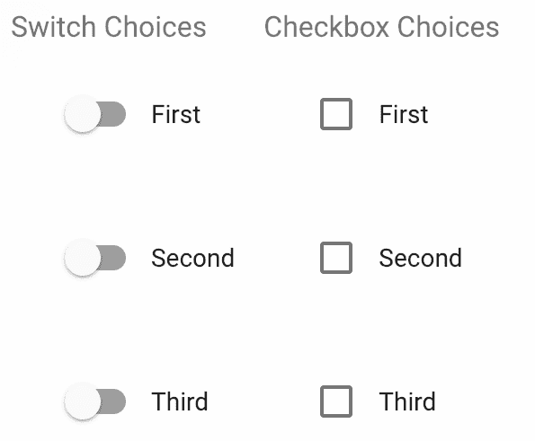

如果你选择开关选项组或复选框选项组中的第一个选项，你会看到以下内容：

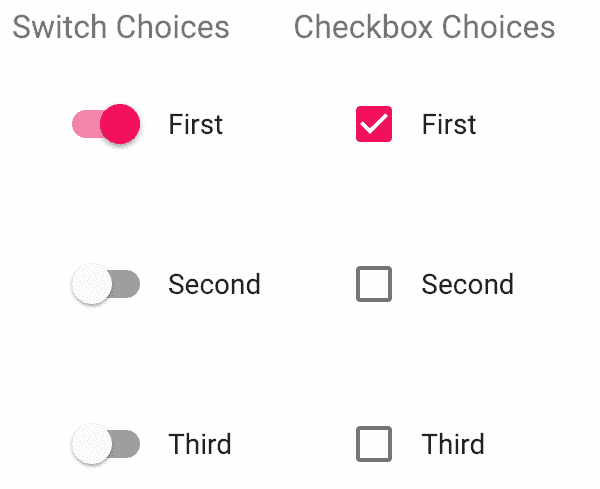

它们都进行了更新，因为这两个领域共享相同的应用状态。

# 参见

+   `选择` 演示：[`material-ui.com/demos/selection-controls/`](https://material-ui.com/demos/selection-controls/)

# 使用状态控制选择框

一些表单涉及从值列表中进行选择。这有点像从单选按钮组中选择单选按钮选项。使用 Material-UI `Select` 组件，你得到的东西更像是传统的 HTML 选择元素。通常，Web 应用程序表单有几个相互依赖的选择框。在 React/Material-UI 应用程序中，这些选择框通过 `state` 组件进行控制。

# 如何实现...

假设你的屏幕上有两个选择框——一个类别选择框和一个产品选择框。最初，只有类别选择框被填充并启用。产品选择框依赖于类别选择框——一旦选择了一个类别，产品选择框就会被启用并填充适当的产 品。以下是实现此功能的代码：

```js
import React, { Fragment, useState } from 'react';

import { makeStyles } from '@material-ui/styles';
import InputLabel from '@material-ui/core/InputLabel';
import MenuItem from '@material-ui/core/MenuItem';
import FormHelperText from '@material-ui/core/FormHelperText';
import FormControl from '@material-ui/core/FormControl';
import Select from '@material-ui/core/Select';

const useStyles = makeStyles(theme => ({
  control: { margin: theme.spacing(2), minWidth: 200 }
}));

export default function ControllingSelectsWithState() {
  const classes = useStyles();

  const [categories, setCategories] = useState([
    { label: 'Category 1', id: 1 },
    { label: 'Category 2', id: 2 },
    { label: 'Category 3', id: 3 }
  ]);

  const [products, setProducts] = useState([
    { label: 'Product 1', id: 1, category: 1 },
    { label: 'Product 2', id: 2, category: 1 },
    { label: 'Product 3', id: 3, category: 1 },
    { label: 'Product 4', id: 4, category: 2 },
    { label: 'Product 5', id: 5, category: 2 },
    { label: 'Product 6', id: 6, category: 2 },
    { label: 'Product 7', id: 7, category: 3 },
    { label: 'Product 8', id: 8, category: 3 },
    { label: 'Product 9', id: 9, category: 3 }
  ]);

  const setters = {
    categories: setCategories,
    products: setProducts
  };
  const collections = { categories, products };

  const onChange = e => {
    const setCollection = setters[e.target.name];
    const collection = collections[e.target.name].map(item => ({
      ...item,
      selected: false
    }));
    const index = collection.findIndex(
      item => item.id === e.target.value
    );

    collection[index] = { ...collection[index], selected: true };
    setCollection(collection);
  };

  const category = categories.find(category => category.selected) || {
    id: ''
  };
  const product = products.find(product => product.selected) || {
    id: ''
  };

  return (
    <Fragment>
      <FormControl className={classes.control}>
        <InputLabel htmlFor="categories">Category</InputLabel>
        <Select
          value={category.id}
          onChange={onChange}
          inputProps={{
            name: 'categories',
            id: 'categories'
          }}
        >
          <MenuItem value="">
            <em>None</em>
          </MenuItem>
          {categories.map(category => (
            <MenuItem key={category.id} value={category.id}>
              {category.label}
            </MenuItem>
          ))}
        </Select>
      </FormControl>
      <FormControl
        className={classes.control}
        disabled={category.id === ''}
      >
        <InputLabel htmlFor="Products">Product</InputLabel>
        <Select
          value={product.id}
          onChange={onChange}
          inputProps={{
            name: 'products',
            id: 'values'
          }}
        >
          <MenuItem value="">
            <em>None</em>
          </MenuItem>
          {products
            .filter(product => product.category === category.id)
            .map(product => (
              <MenuItem key={product.id} value={product.id}>
                {product.label}
              </MenuItem>
            ))}
        </Select>
      </FormControl>
    </Fragment>
  );
}
```

当屏幕首次加载时，你会看到以下内容：

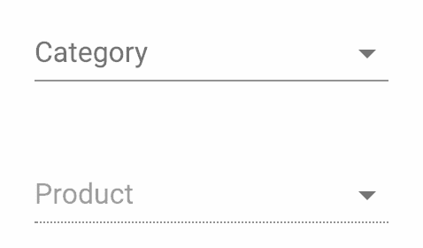

类别选择框填充了可供你选择的选项。产品选择框处于禁用状态，因为没有选择任何类别。以下是类别选择框打开时的外观：

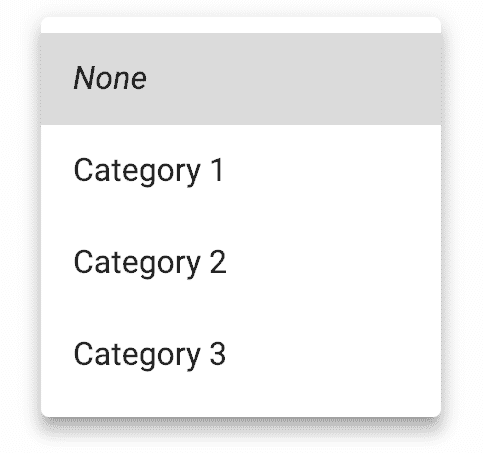

一旦你选择了一个类别，你应该能够打开产品选择框并做出产品选择：

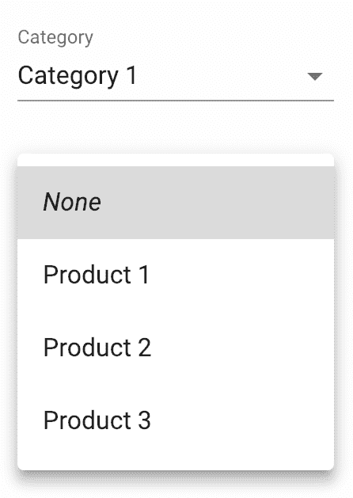

# 它是如何工作的...

本例中的两个 `Select` 组件存在状态依赖。也就是说，产品选择的状 态依赖于类别选择的状 态。这是因为产品选择中显示的选项是根据所选类别进行筛选的。让我们更仔细地看看这个状态：

```js
const [categories, setCategories] = useState([
  { label: 'Category 1', id: 1 },
  { label: 'Category 2', id: 2 },
  { label: 'Category 3', id: 3 }
]);

const [products, setProducts] = useState([
  { label: 'Product 1', id: 1, category: 1 },
  { label: 'Product 2', id: 2, category: 1 },
  { label: 'Product 3', id: 3, category: 1 },
  { label: 'Product 4', id: 4, category: 2 },
  { label: 'Product 5', id: 5, category: 2 },
  { label: 'Product 6', id: 6, category: 2 },
  { label: 'Product 7', id: 7, category: 3 },
  { label: 'Product 8', id: 8, category: 3 },
  { label: 'Product 9', id: 9, category: 3 }
]);
```

`categories` 和 `products` 数组代表屏幕上两个选择框的选项。选中的选项用 `selected` 布尔属性值 `true` 标记。默认情况下没有选项被选中。两个选择框都使用相同的 `onChange()` 处理器：

```js
const setters = {
  categories: setCategories,
  products: setProducts
};
const collections = { categories, products };

const onChange = e => {
  const setCollection = setters[e.target.name];
  const collection = collections[e.target.name].map(item => ({
    ...item,
    selected: false
  }));
  const index = collection.findIndex(
    item => item.id === e.target.value
  );

  collection[index] = { ...collection[index], selected: true };
  setCollection(collection);
};
```

要使用的数组取决于`e.target.name`的值——它将是类别或产品。一旦使用适当的数组初始化了集合值，`selected`属性就被设置为每个值的`false`。然后，根据`e.target.value`查找选中的值，并将`selected`属性设置为`true`。

接下来，让我们分析`ControllingSelectsWithState`组件其余部分发生的情况。首先，从组件状态中查找`category`和`product`的选中项：

```js
const category = categories.find(category => category.selected) || {
  id: ''
};
const product = products.find(product => product.selected) || {
  id: ''
};
```

您必须确保始终将这些常量分配给具有`id`属性的对象，因为稍后会有所期待。空字符串将匹配空值选项，因此它默认被选中。接下来，让我们看看类别选项是如何渲染的：

```js
{categories.map(category => (
  <MenuItem key={category.id} value={category.id}>
    {category.label}
  </MenuItem>
))}
```

这是对`categories`数组中的值到`MenuItem`组件的直接映射。选择`category`中的选项永远不会改变；换句话说，产品选项根据选中的类别改变——让我们看看这是如何实现的：

```js
{products
  .filter(product => product.category === category.id)
  .map(product => (
    <MenuItem key={product.id} value={product.id}>
      {product.label}
    </MenuItem>
  ))}
```

在将每个产品映射到`MenuItem`组件之前，使用`filter()`根据选中的类别过滤`products`数组。

# 相关内容

+   `Selection` 示例：[`material-ui.com/demos/selects/`](https://material-ui.com/demos/selects/)

+   `InputLabel` API 文档：[`material-ui.com/api/input-label/`](https://material-ui.com/api/input-label/)

+   `MenuItem` API 文档： [`material-ui.com/api/menu-item/`](https://material-ui.com/api/menu-item/)

+   `FormHelperText` API 文档：[`material-ui.com/api/form-helper-text/`](https://material-ui.com/api/form-helper-text/)

+   `FormControl` API 文档：[`material-ui.com/api/form-control/`](https://material-ui.com/api/form-control/)

+   `Select` API 文档：[`material-ui.com/api/select/`](https://material-ui.com/api/select/)

# 选择多个项目

用户可以从`Select`组件中选择多个值。这涉及到使用数组作为选中的值状态。

# 如何实现...

这里有一些渲染具有多个值的`Select`的代码。您可以选择您喜欢的任意多个值：

```js
import React, { useState } from 'react';

import { makeStyles } from '@material-ui/styles';
import Select from '@material-ui/core/Select';
import Input from '@material-ui/core/Input';
import InputLabel from '@material-ui/core/InputLabel';
import MenuItem from '@material-ui/core/MenuItem';
import FormControl from '@material-ui/core/FormControl';

const options = [
  { id: 1, label: 'First' },
  { id: 2, label: 'Second' },
  { id: 3, label: 'Third' },
  { id: 4, label: 'Fourth' },
  { id: 5, label: 'Fifth' }
];

const useStyles = makeStyles(theme => ({
  formControl: {
    margin: theme.spacing(1),
    minWidth: 100,
    maxWidth: 280
  }
}));

export default function SelectingMultipleItems() {
  const classes = useStyles();
  const [selected, setSelected] = useState([]);

  const onChange = e => {
    setSelected(e.target.value);
  };

  return (
    <FormControl className={classes.formControl}>
      <InputLabel htmlFor="multi">Value</InputLabel>
      <Select
        multiple
        value={selected}
        onChange={onChange}
        input={<Input id="multi" />}
      >
        {options.map(option => (
          <MenuItem key={option.id} value={option.id}>
            {option.label}
          </MenuItem>
        ))}
      </Select>
    </FormControl>
  );
}
```

这是首次打开选择时的样子：

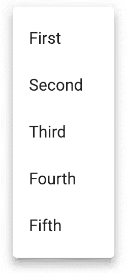

这是选中了第一个、第三个和第五个选项时的样子：

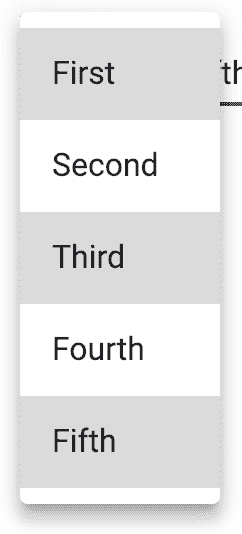

现在您已经做出了选择，您可以在菜单外的屏幕上点击某个位置来关闭它，或者您可以按*E**sc* 键。您将在文本输入中看到您的选择：

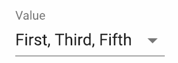

# 它是如何工作的...

让我们从查看`Select`组件是如何渲染的开始：

```js
<Select
  multiple
  value={selected}
  onChange={onChange}
  input={<Input id="multi" />}
>
  {options.map(option => (
    <MenuItem key={option.id} value={option.id}>
      {option.label}
    </MenuItem>
  ))}
</Select>
```

`options` 数组的值被映射到 `MenuItem` 组件，就像任何其他的 `Select` 一样。`multiple` 属性告诉组件允许用户进行多项选择。`SelectingMultipleItems` 组件的 `selected` 状态是一个数组，它包含选中值。这个数组由 `onChange` 处理程序填充：

```js
const onChange = e => {
  setSelected(e.target.value);
};
```

因为使用了 `multiple` 属性，`e.target.value` 是一个包含选中值的数组——你可以直接使用这个值来更新选中状态。

# 还有更多...

而不是让选中的项目以逗号分隔的 `test` 列表形式显示，你可以通过将选中的值映射到 `Chip` 组件来使项目突出。让我们创建一个将处理此功能的组件：

```js
function Selected({ selected }) {
  const classes = useStyles();

  return selected.map(value => (
    <Chip
      key={value}
      label={options.find(option => option.id === value).label}
      className={classes.chip}
    />
  ));
}
```

以下代码块展示了如何在 `Select` 组件的 `renderValue` 属性中使用此组件：

```js
<Select
  multiple
  value={selected}
  onChange={onChange}
  input={<Input id="multi" />}
  renderValue={selected => <Selected selected={selected} />}
>
  {options.map(option => (
    <MenuItem key={option.id} value={option.id}>
      {option.label}
    </MenuItem>
  ))}
</Select>
```

现在，当你进行多项选择时，它们将以 `Chip` 组件的形式渲染：

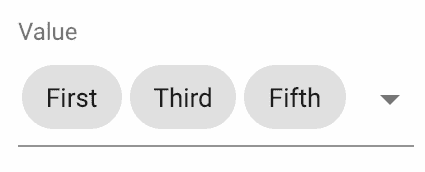

# 参见

+   `Selection` 示例：[`material-ui.com/demos/selects/`](https://material-ui.com/demos/selects/)

+   `Select` API 文档：[`material-ui.com/api/select/`](https://material-ui.com/api/select/)

+   `Input` API 文档：[`material-ui.com/api/input/`](https://material-ui.com/api/input/)

+   `InputLabel` API 文档：[`material-ui.com/api/input-label/`](https://material-ui.com/api/input-label/)

+   `MenuItem` API 文档：[`material-ui.com/api/menu-item/`](https://material-ui.com/api/menu-item/)

+   `FormControl` API 文档：[`material-ui.com/api/form-control/`](https://material-ui.com/api/form-control/)

+   `Chip` API 文档：[`material-ui.com/api/chip/`](https://material-ui.com/api/chip/)
