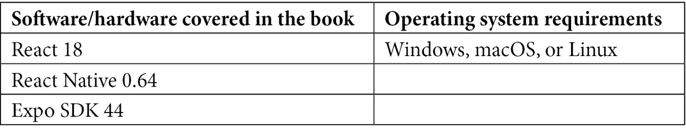

# 前言

本书将通过展示如何将基本和高级 React 模式应用于创建跨平台应用，帮助你将 React 知识提升到新的水平。React 的概念将以新开发者和老开发者都能理解的方式描述；虽然不需要有 React 的先验经验，但这会有所帮助。

在本书的 10 个章节中，你将使用 React 或 React Native 创建一个项目。这些章节中创建的项目实现了流行的 React 功能，如用于复用逻辑的 Hooks、用于状态管理的 context API 和 Suspense。对于路由，使用了流行的库，如 React Router 和 React Navigation；而 JavaScript 测试框架 React Testing Library 和 Cypress 用于编写应用的单元和集成测试。一些更高级的章节还涉及 GraphQL 服务器，并使用 Expo 帮助你创建 React Native 应用。

# 本书面向对象

本书面向希望探索 React 工具和框架以构建跨平台应用的 JavaScript 开发者。对 Web 开发、ECMAScript 和 React 的基本了解将有助于理解本书中涵盖的关键概念。

本书支持的 React 版本包括：

+   React - v18.0

+   React Native - v0.64

# 本书涵盖内容

*第一章**，在 React 中创建单页应用*，将探讨构建可扩展的 React 项目的基石。将讨论如何组织文件、使用的包和工具的最佳实践，并在实践中学习。在构建单页应用的过程中，你将了解 React 架构。此外，webpack 和 Babel 用于编译代码。

*第二章**，使用可复用组件和路由在 React 中创建投资组合*，将解释如何在整个应用程序中设置和复用 React 组件的样式。我们将构建一个 GitHub 卡应用来展示如何在 JavaScript 中使用 CSS 并复用组件和样式。此外，你还将学习如何使用 React Router v6 实现导航。

*第三章**，构建动态项目管理板*，将介绍如何通过使用 Hooks 复用组件中的应用状态逻辑。你将学习如何构建自定义 Hooks 并与 Web API 交互以制作可拖拽组件。引入了 Styled Components，以便以可扩展的方式为 React 组件设置样式。

*第四章**，使用 Next.js 构建服务器端渲染的社区动态*，将讨论路由，从设置基本路由、动态路由处理到如何为服务器端渲染设置路由。因此，在基于 Stack Overflow 构建应用程序的过程中，将使用 React 网络框架 Next.js。

*第五章**，使用 Context 和 Hooks 构建个人购物清单应用程序*，将向您展示如何使用 React 上下文 API 与 Hooks 处理应用程序中的数据流。我们将创建一个个人购物清单，以了解如何使用 Hooks 和上下文 API 从父组件到子组件以及反之亦然访问和更改数据。

*第六章**，使用 React Testing Library 和 Cypress 构建探索 TDD 的应用程序*，将重点关注使用断言和快照进行单元测试。你将学习如何管理测试覆盖率，并使用 Cypress 框架实现视觉集成测试。我们将构建一个酒店评论应用程序，以了解如何测试组件和数据流。

*第七章**，使用 Next.js 和 GraphQL 构建全栈电子商务应用程序*，将使用 GraphQL 为应用程序提供后端。本章将向您展示如何使用 Next.js 设置全栈 React 应用程序，包括一个基本的 GraphQL 服务器。我们将构建一个电子商务应用程序，以了解如何创建服务器、向其发送请求以及处理身份验证。

*第八章**，使用 React Native 和 Expo 构建动画游戏*，将讨论动画和手势，这是真正区分移动应用程序和 Web 应用程序的因素。本章将解释如何实现它们。此外，将通过构建一个具有动画和手势响应功能的卡片游戏应用程序来展示 iOS 和 Android 之间手势的差异。

*第九章**，使用 React Native 和 Expo 构建全栈社交媒体应用程序*，将涵盖扩展和构建 React Native 应用程序，这与使用 React 创建的 Web 应用程序略有不同。本章将概述如何在构建全栈社交媒体应用程序的同时使用移动设备的原生 API，例如使用相机。我们将通过构建全栈社交媒体应用程序来检查 React Native 的最佳实践。

*第十章**，使用 React 和 Three.js 创建虚拟现实应用程序*，将讨论如何通过创建一个允许用户在虚拟世界中四处张望并在其中创建组件的全景查看器来开始使用 React 和 Three.js。你将构建的应用程序将看起来像可以在虚拟现实（VR）中玩的游戏。

# 为了充分利用这本书

本书中的所有项目都是使用 React 或 React Native 创建的。本书的大部分章节需要具备 JavaScript 的先验知识。尽管本书描述了 React 和相关技术的所有概念，但我们建议您在需要了解更多关于某个功能时参考 React 文档。在下一节中，您可以找到有关为本书设置机器以及如何下载每章代码的一些信息。



对于本书中创建的应用程序，您需要在您的机器上至少安装 Node.js v14.19.1，以便运行 npm 命令。如果您尚未在您的机器上安装 Node.js，请访问[`nodejs.org/en/download/`](https://nodejs.org/en/download/)，在那里您可以找到 macOS、Windows 和 Linux 的下载说明。

安装 Node.js 后，请在您的命令行中运行以下命令以检查安装的版本：

+   对于 Node.js（应该是 v14.19.1 或更高版本）：

    ```js
    node -v
    ```

+   对于 npm（应该是 v6.14.14 或更高版本）：

    ```js
    npm -v
    ```

**如果您正在使用本书的数字版，我们建议您亲自输入代码或从本书的 GitHub 仓库（下一节中提供链接）获取代码。这样做将帮助您避免与代码复制和粘贴相关的任何潜在错误。**

本书的内容使用的是截至 2022 年 4 月本书完成时的最新可用版本。在此日期之后的任何更新可能无法与本书中描述的功能兼容。建议您遵循官方的 React 和 React Native 文档以获取有关本书发布后发布的功能的更多信息。

# 下载示例代码文件

您可以从 GitHub 下载本书的示例代码文件[`github.com/PacktPublishing/React-Projects-Second-Edition`](https://github.com/PacktPublishing/React-Projects-Second-Edition)。如果代码有更新，它将在 GitHub 仓库中更新。

我们还有其他来自我们丰富的图书和视频目录的代码包，可在[`github.com/PacktPublishing/`](https://github.com/PacktPublishing/)找到。查看它们吧！

# 下载彩色图像

我们还提供了一份包含本书中使用的截图和图表彩色图像的 PDF 文件。您可以从这里下载：[`static.packt-cdn.com/downloads/9781801070638_ColorImages.pdf`](https://static.packt-cdn.com/downloads/9781801070638_ColorImages.pdf)。

# 使用的约定

本书使用了多种文本约定。

`文本中的代码`：表示文本中的代码单词、数据库表名、文件夹名、文件名、文件扩展名、路径名、虚拟 URL、用户输入和 Twitter 昵称。以下是一个示例：“如果我们查看`App.js`中此组件的源代码，我们会看到`return`函数中已经有一个 CSS `header`元素。”

代码块设置如下：

```js
.App-logo {
  height: 40vmin;
  pointer-events: none;
}
```

当我们希望您注意代码块中的特定部分时，相关的行或项目将以粗体显示：

```js
  import './Header.css';
- function Header() {
+ function Header({ logo }) {
    return (
      <header className='App-header'>
```

任何命令行输入或输出都应如下编写：

```js
npx create-react-app chapter-2
```

**粗体**：表示新术语、重要单词或您在屏幕上看到的单词。例如，菜单或对话框中的单词以粗体显示。以下是一个示例：“从**管理**面板中选择**系统信息**。”

小贴士或重要注意事项

看起来像这样。

# 联系我们

我们始终欢迎读者的反馈。

**一般反馈**：如果您对本书的任何方面有疑问，请通过电子邮件发送至 customercare@packtpub.com，并在邮件主题中提及书名。

**勘误**：尽管我们已经尽最大努力确保内容的准确性，但错误仍然可能发生。如果您在这本书中发现了错误，我们将不胜感激，如果您能向我们报告，我们将不胜感激。请访问[www.packtpub.com/support/errata](http://www.packtpub.com/support/errata)并填写表格。

**盗版**：如果您在互联网上发现我们作品的任何非法副本，我们将不胜感激，如果您能提供位置地址或网站名称，我们将不胜感激。请通过 copyright@packt.com 与我们联系，并提供材料的链接。

**如果您有兴趣成为作者**：如果您在某个领域有专业知识，并且您有兴趣撰写或为书籍做出贡献，请访问[authors.packtpub.com](http://authors.packtpub.com)。

# 分享您的想法

一旦您阅读了《React Projects》，我们很乐意听到您的想法！请[点击此处直接访问此书的亚马逊评论页面](https://packt.link/r/1801070636)并分享您的反馈。

您的评论对我们和科技社区都至关重要，并将帮助我们确保我们提供高质量的内容。
