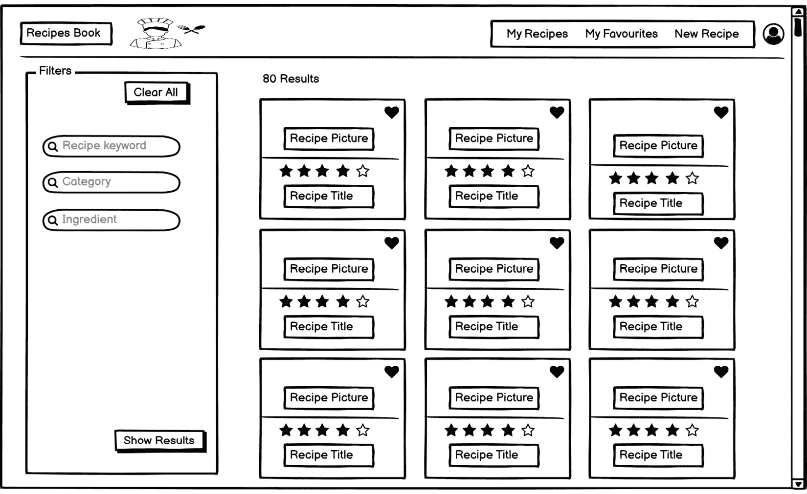
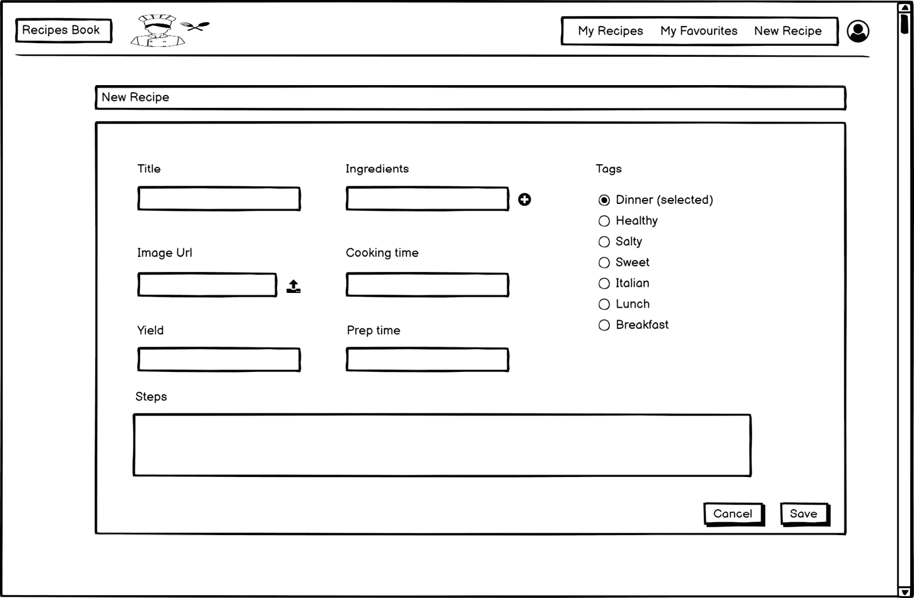
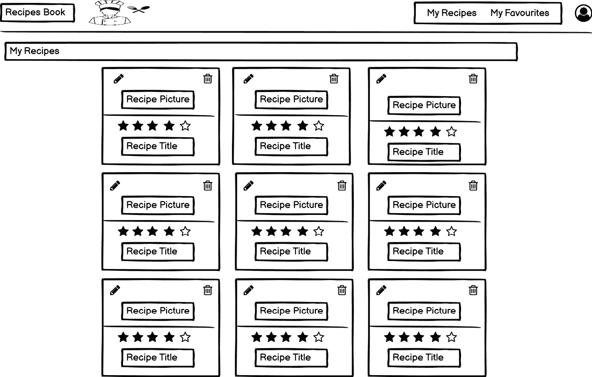
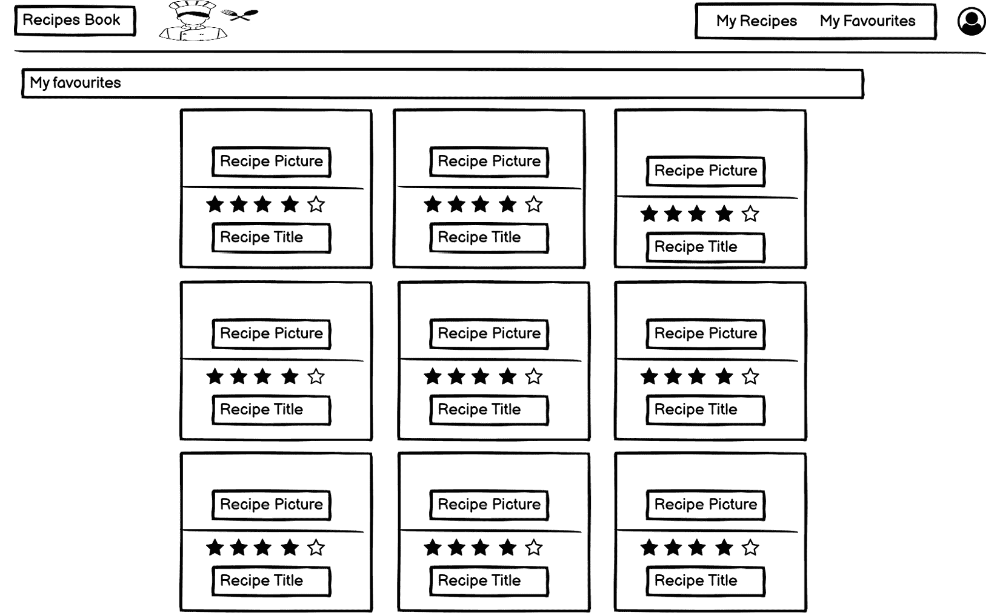
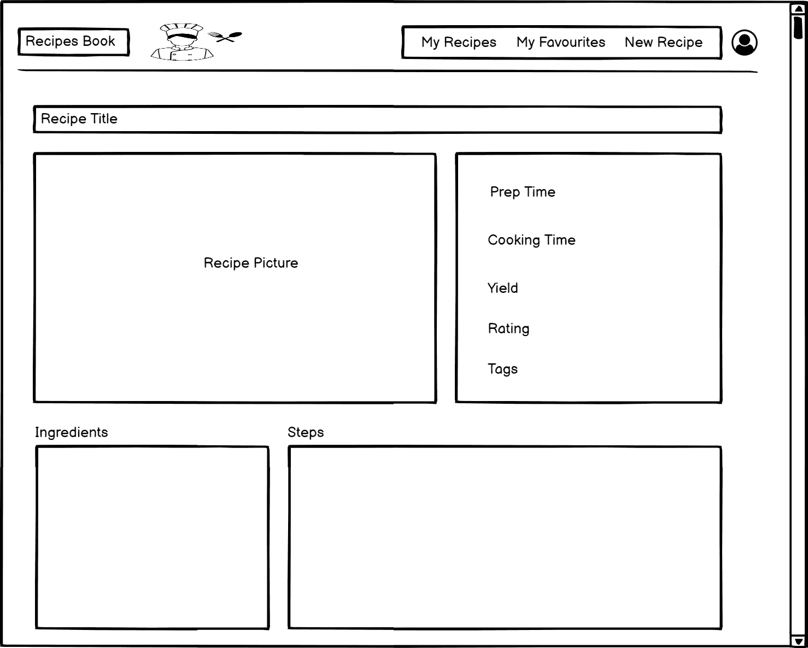
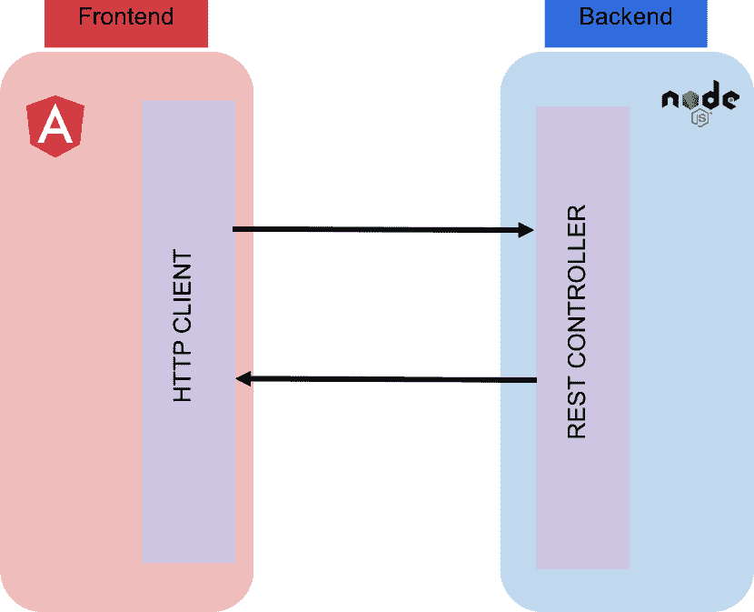
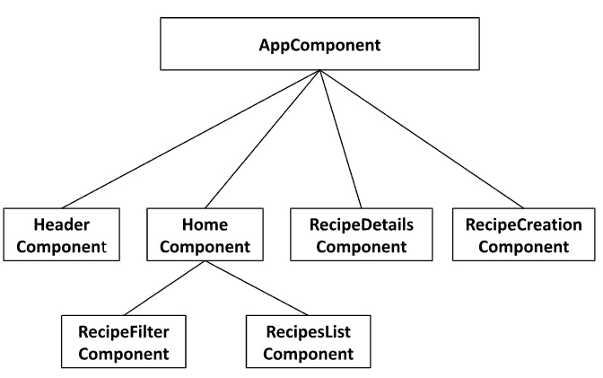

# 第二章：漫步我们的应用

现在，我们离深入了解响应式模式又近了一步，但在我们这样做之前，让我们展示我们将在这本书中构建的应用。

我们将首先解释技术要求，然后分析应用的用户界面，以便您了解其用户故事。此外，我们将展示应用架构的概述和组件树的视觉表示。到本章结束时，我们将准备好所有必需的组件以开始实现我们的应用。

在本章中，我们将涵盖以下主要主题：

+   分析我们应用的用户界面

+   审查我们的应用架构

+   审查我们的应用组件

# 技术要求

虽然我们在这个章节中不会创建项目，但在继续之前，你应该了解其要求。

我们将使用**Angular** **18**作为我们的前端，所以请确保您遵循[`angular.dev/tools/cli/setup-local`](https://angular.dev/tools/cli/setup-local)中的先决条件。这些先决条件包括环境设置以及安装和使用 Angular 所需的技术。

我们还将使用**Bootstrap**版本 5.0.0（[`getbootstrap.com/`](https://getbootstrap.com/）），这是一个用于开发响应式 Web 应用的工具包，以及**RxJS**的 7.8.1 版本。

您还将能够在本书的 GitHub 存储库中找到创建此项目的所有代码：[https://github.com/PacktPublishing/Reactive-Patterns-with-RxJS-and-Angular-Signals-Second-Edition](https://github.com/PacktPublishing/Reactive-Patterns-with-RxJS-and-Angular-Signals-Second-Edition)。

# 分析我们应用的用户界面

作为一名美食爱好者，我希望这个应用像一本菜谱书，允许用户和家常厨师浏览和分享美味的食物菜谱。该应用的主要目标是提供用餐灵感，并帮助用户完成以下任务：

+   分享他们的菜谱

+   将收藏的菜谱固定以方便查找

+   区分高分菜谱

+   根据某些标准过滤菜谱

应用由六个界面组成。让我们逐一解决这些界面。

## 视图一 – 登录页面

第一页包含按受欢迎程度排序的可用菜谱列表：

图 2.1 – 登录页面视图

在此视图中，用户可以进行以下操作：

+   根据某些标准设置过滤器，快速搜索菜谱（在左侧）

+   清除过滤器列表

+   查看最受欢迎的菜谱

+   通过点击星级数量来评分菜谱

+   通过点击心形图标将菜谱添加到收藏夹

+   通过点击查看菜谱的详细信息

+   查看菜谱的总数

## 视图二 – 新菜谱界面

此页面包含一个创建新菜谱的表单：

图 2.2 – 新菜谱视图

在此视图中，用户可以通过点击页面右上角的**新建食谱**菜单项来创建新的食谱。将打开一个包含食谱详细信息的表单，以便填写信息并保存。以下是一些详细信息：

+   **标题**：食谱的标题

+   **成分**：准备食谱所需的成分

+   **图片 URL**：准备好的美食的好图片

+   **烹饪时间**：烹饪食物所需的时间

+   **产量**：此餐可以服务的人数

+   **准备时间**：准备食物所需的时间

+   **标签**：描述食谱的关键标签

+   **步骤**：准备和烹饪食物所需的步骤

## 视图三 – 我的食谱界面

此页面包含用户创建的食谱列表。此屏幕可通过点击位于右上角的**我的食谱**菜单项访问。用户可以通过点击编辑和删除图标来编辑和删除食谱：

图 2.3 – 我的食谱视图

## 视图四 – 我的收藏界面

此页面包含用户喜欢的食谱列表，可通过点击位于右上角的**我的收藏**菜单项访问：

图 2.4 – 我的收藏视图

## 视图五 – 修改食谱界面

当**新建食谱**界面允许用户创建新的食谱时，**修改食谱**界面允许用户编辑现有的食谱。此页面可通过点击**我的食谱**界面旁边的**编辑**按钮访问，看起来就像*图 2.2*。

## 视图六 – 食谱详情界面

此页面包含所选食谱的所有详细信息。此屏幕可通过在着陆页上点击显示的食谱访问：

图 2.5 – 食谱详情视图

现在我们已经详细说明了我们应用的用户界面，让我们看看应用的架构。

# 审查我们应用的架构

食谱应用的前端层将使用 Angular 18 实现，并将与基于 Node.js 的 RESTful 后端进行通信。

注意

与后端相关的内容不是本书的主题，也不会详细说明。您可以在 GitHub 仓库中找到一个名为`recipes-book-api`的现成假后端：[`github.com/PacktPublishing/Reactive-Patterns-with-RxJS-for-Angular-17-2nd-Edition`](https://github.com/PacktPublishing/Reactive-Patterns-with-RxJS-for-Angular-17-2nd-Edition)。

食谱应用的前端可插入任何 RESTful 后端。因此，您可以使用几乎任何其他技术作为后端。所有通信将通过 HttpClient 模块执行，并请求后端的 REST 控制器：

图 2.6 – 食谱架构书

现在我们已经了解了目标应用的大致情况，让我们分解我们的应用的不同 Angular 组件。

# 检查我们的应用组件

一个 Angular 应用由我们创建的所有组件组成，具有树状结构。在下面的图中，你可以找到我们的食谱应用的组件树，这对于理解应用的结构非常重要：

图 2.7 – 组件概览

让我们分解这些组件：

+   `AppComponent`: 应用的父组件

    `HeaderComponent`: 代表应用头部，包含用户空间、菜单和标志

+   `HomeComponent`: 代表包含`RecipeFilterComponent`和`RecipesListComponent`的着陆页的组件：

    +   `RecipeFilterComponent`: 代表包含标准字段和`RecipesListComponent`的筛选区域的组件：`RecipesListComponent`: 包含食谱列表的组件

+   `RecipesDetailsComponent`: 包含一个食谱详细信息的组件

+   `RecipesCreationComponent`: 包含一个表单，用于创建包含所有必填字段的食谱

你现在对我们的应用将包含的组件有了更好的理解。

# 摘要

在本章中，我们解释了我们将要工作的食谱应用的功能，以及 UI 的外观和感觉。我们还阐明了应用架构以及构成应用的组件。

现在所有这些方面都清晰了，让我们一起来探索我们的第一个响应式模式，我们将在下一章中介绍。

# 第二部分：深入响应式模式

在本部分，你将学习在不同实际场景中最常用的响应式模式，例如从后端 API 获取数据、处理服务器错误、过滤数据以及在下拉列表中提供自动完成搜索结果。每个响应式模式都将通过涉及我们的食谱应用的示例来支持。

你还将学习最佳实践和需要避免的陷阱，并深入了解最新的 Angular 特性，例如独立组件和新的内置控制流语法。

本部分包括以下章节：

+   *第三章*, *以流的形式获取数据*

+   *第四章*, *响应式处理错误*

+   *第五章*, *合并流*

+   *第六章*, *转换流*

+   *第七章*, *在 Angular 组件之间共享数据*
