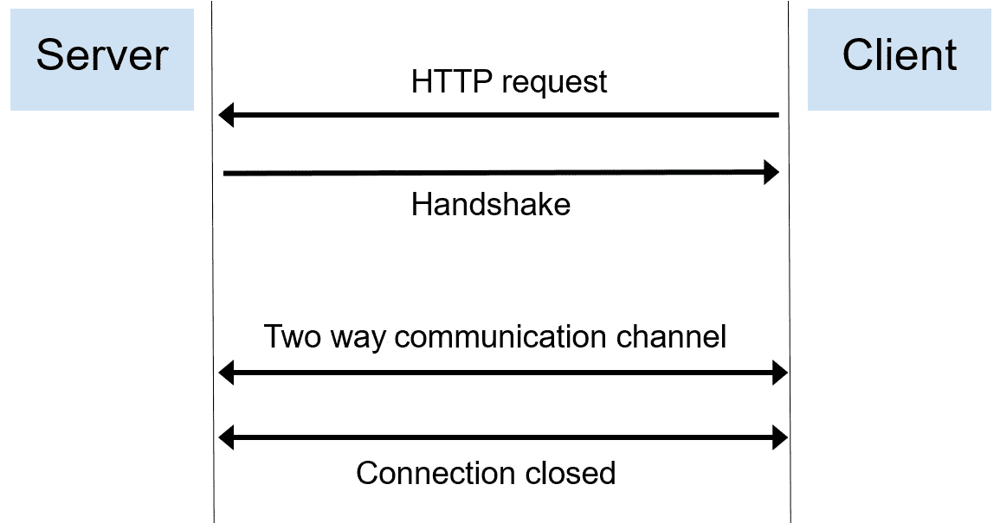
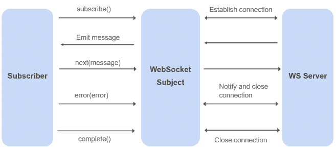

# 第十二章：处理实时更新

**实时**指的是应用程序能够立即处理和响应数据或事件的能力，没有任何明显的延迟或延迟。这在当今是一个非常热门的话题，因为对实时功能的需求在 Web 应用程序中不断增长，尤其是在实时金融交易、实时跟踪系统、实时监控、分析和医疗保健等领域。最终，你获取数据越快，你就能越快做出反应和决策，从而提高获得更高利润的机会。

那么，你如何在前端处理实时消息并自动更新 UI 中显示的数据？这正是本章将要涵盖的内容。我们将首先解释实时要求，然后我们将向您介绍实现消费实时更新的反应式模式的各个步骤。最后，我们将学习用于处理重连的反应式模式。

在本章中，我们将涵盖以下主要主题：

+   定义实时要求

+   学习用于消费实时消息的反应式模式

+   学习用于处理重连的反应式模式

# 技术要求

本章假设您对 RxJS 有基本的了解。

我们使用了 `ws` 库，这是一个 WebSocket Node.js 库，以便在我们的后端支持 WS。更多详情，请查看此链接：[`github.com/websockets/ws`](https://github.com/websockets/ws)。

本章的源代码可在[`github.com/PacktPublishing/Reactive-Patterns-with-RxJS-for-Angular-16-2nd-Edition/tree/main/Chap12`](https://github.com/PacktPublishing/Reactive-Patterns-with-RxJS-for-Angular-16-2nd-Edition/tree/main/Chap12)找到。

# 定义实时要求

在网络上发布实时数据有两种技术可用：

+   **拉取技术**：这是客户端发起请求以获取最新数据版本的地方。**HTTP 轮询**和**HTTP 长轮询**是这种拉取技术实现的两个例子。

+   **推送技术**：这是服务器将更新推送到客户端的地方。**WebSocket** 和 **服务器发送事件**是这种推送技术的两种实现。

我们不会详细讨论或比较这些技术，因为这不是本章的目标；然而，一般来说，推送技术相比拉取技术具有更低的延迟。因此，我们将使用推送技术和 WebSocket 作为我们需求的实现。

简而言之，WebSocket 协议是一种有状态的通信协议，它在一个客户端和服务器之间建立了一个低延迟的双向通信通道。这样，消息可以在服务器和客户端之间来回发送。

下图说明了 WebSocket 通信流程：



图 12.1 – WebSocket 通信

如上图所示，WebSocket 通信有三个步骤：

1.  **打开连接**：在这个步骤中，客户端发出一个 HTTP 请求来告诉服务器将发生协议升级（从 HTTP 到 WebSocket）。如果服务器支持 WebSocket，则协议切换将被接受。

1.  **建立通信通道**：一旦完成协议升级，将创建一个双向通信通道，服务器和客户端之间开始发送和接收消息。

1.  **关闭连接**：当通信结束时，将发出一个请求来关闭连接。

在这个层面，这就是你需要了解的所有关于 WebSocket 的内容。现在，让我们快速回顾一下我们将在应用中做什么。

在我们的食谱应用中，`RecipesListComponent` 负责显示食谱列表。我们将在 `RecipesListComponent` 渲染后延迟 5 秒模拟添加一个新的食谱（辣子鸡的食谱）。然后，UI 应立即更新，通过在 `RecipesList` 页面上渲染来包括这个新食谱。

你将在 `recipes-book-api` 文件夹下找到一个现成的 WebSocket 后端；这是在建立连接 5 秒后向前端推送新食谱的。我们还将使用后端中的计时器来模拟新食谱的到达。然后 `RecipesListComponent` 应该消费来自 WebSocket 服务器的消息，并将新接收到的食谱推送到已显示的食谱列表中。UI 应自动更新，无需触发任何 **刷新** 按钮来获取更新。

因此，无需多言，在下一节中，让我们看看如何使用 RxJS 的 `WebSocketSubject` 来实现所有这些。

# 学习用于消费实时消息的反应式模式

RxJS 有一种特殊类型的主题称为 `WebSocketSubject`；这实际上是对 W3C WebSocket 对象的包装，它在浏览器中可用。它允许你通过 WebSocket 连接与 WebSocket 服务器进行通信，发送和消费数据。

让我们探索 `WebSocketSubject` 的功能，并学习如何在我们项目中使用它来消费实时消息。

## 创建和使用 WebSocketSubject

为了使用 `WebSocketSubject`，你必须调用 `webSocket` 工厂函数，它产生这种特殊类型的主题，并接受你的 WebSocket 服务器端点作为输入。以下是其函数签名：

```js
webSocket<T>(urlConfigOrSource: string | WebSocketSubjectConfig<T>): WebSocketSubject<T>;
```

它接受两种类型的参数，以下两种之一：

+   表示你的 WebSocket 服务器端点 URL 的字符串

+   一个包含你的端点 URL 以及其他属性的 `WebSocketSubjectConfig` 类型的特殊对象（我们将在 *学习用于处理* *重连* 的反应式模式部分详细探讨 `WebSocketSubjectConfig`）

以下代码是调用 `webSocket` 工厂函数并使用第一种类型参数的示例：

```js
import { webSocket } from "rxjs/webSocket";
const subject = webSocket("ws://localhost:8081");
```

下一段代码是使用第二种类型的参数调用 `webSocket` 工厂函数的示例：

```js
import { webSocket } from 'rxjs/webSocket';
const subject$ = webSocket({url:'ws://localhost:8081'});
```

在我们这个例子中，我们端点的 URL 是 `ws://localhost:8081`。你可以使用 `wss` 来进行安全的 WebSocket 连接（这和安全的 HTTP 连接中的 HTTPS 相同）。

在本章中，我们将使用这两种类型的参数。

现在我们来看一下如何在下一节中建立 WebSocket 的连接。

### 打开连接

现在你有了 `WebSocketSubject` 的参考，你应该订阅它：

```js
import { webSocket } from 'rxjs/webSocket';
const subject$ = webSocket({url:'ws://localhost:8081'});
subject$.subscribe();
```

这将建立与你的 `ws` 端点的连接，并允许你开始接收和发送数据。当然，如果你不订阅，连接将不会创建。

### 监听来自服务器的传入消息

`WebSocketSubject` 仅仅是一个常规的 RxJS 主题，你可以注册回调来监听和处理来自 WebSocket 服务器的传入消息。

为了监听消息，你应该从 `webSocket` 工厂函数订阅生成的 `WebSocketSubject` 并注册一个回调，如下所示：

```js
const subject$ = webSocket('ws://localhost:8080');
// Listen to messages from the server
const subscription = subject$.subscribe(msg => {
  console.log('Message received from the socket'+ msg);
});
```

在这里，我们只是订阅 WebSocket 主题以与 WebSocket 服务器建立连接，并将接收到的任何消息记录到控制台。

### 向服务器推送消息

要向服务器发送消息，我们只需使用 `subject` 类型中可用的 `next` 方法：

```js
// Push messages to the server
subject$.next('Message to the server');
```

### 处理错误

你也可以像往常一样使用 `catchError` 来捕获来自服务器的错误，并通过调用 `error` 方法将错误推送到服务器。以下是一个示例：

```js
// Push errors to the server
subject$.error('Something wrong happens')
// Handle incoming errors from the server
subject$.pipe(catchError(error=>of('Something wrong happens')))
```

然而，请注意，当你发送错误时，服务器将收到这个错误的通知，然后连接将被关闭。因此，之后将不会发出任何内容。

### 关闭连接

你可以使用 `unsubscribe` 或 `complete` 来关闭连接：

```js
// Close the connection
subject$.complete();
//or
subject$.unsubscribe();
```

因此，为了总结我们讨论的内容，只有 `WebSocketSubject` 的创建是特定于这种特殊类型的主题。然而，所有其他使用的 API（`subscribe`、`unsubscribe`、`complete`、`catchError`、`next` 等）与常规主题使用的相同。以下图示展示了整个过程：



图 12.2 – WebSocketSubject 可能的事件

现在我们已经涵盖了各种 WebSocket 操作，从创建和建立连接到发送消息、处理错误以及消费传入的消息，让我们来探讨一个你应该注意的常见陷阱。

### 连接管理

在这一点上，你应该注意一个特定的行为。如果同一个 `WebSocketSubject` 实例有多个订阅者，那么它们将共享相同的连接以节省资源。然而，如果我们有两个不同的 `WebSocketSubject` 实例，即使它们引用的是同一个端点，它们也会建立两个不同的连接。

以下代码解释了两种用例的连接管理：

```js
const firstSubject$ = webSocket('ws://localhost:8080');
const  secondSubject$ = webSocket('ws://localhost:8080');
// the first subscriber, opens the WebSocket connection
const subscription1 = firstSubject$.subscribe(msg => {
});
// the second subscriber, uses the already opened WebSocket
   connection
const subscription2 = firstSubject$.subscribe(msg => {
});
//this subscriber opens a new connection
const subscription3 = secondSubject$.subscribe(msg => {
});
```

让我们解释一下这段代码中发生的事情。首先，我们创建了两个名为`firstSubject$`和`secondSubject$`的`WebSocketSubject`实例，它们都引用了同一个`ws`端点。

然后，我们创建了一个订阅`firstSubject$`；这个第一个订阅将打开 WebSocket 连接。接着，我们为同一个 Observable，即`firstSubject$`，创建了一个第二个订阅；这个第二个订阅将使用已经打开的 WebSocket 连接。

然而，对`secondSubject$`的订阅将打开一个新的 WebSocket 连接。为什么？因为它是对 WebSocket 主题的新引用，尽管它引用了与`firstSubject$`相同的`ws`端点。

现在，如果我们有多个共享相同连接的订阅者，并且其中一个订阅者决定完成，那么除非没有更多的订阅者监听，否则连接将被释放，正如以下代码块中描述的那样：

```js
const subject$ = webSocket('ws://localhost:8080');
// the first subscriber, opens the WebSocket connection
const subscription1 = subject$.subscribe(msg => {});
// the second subscriber, uses the already opened WebSocket connection
const subscription2 = subject$.subscribe(msg => {});
// the connection stays open
subscription1.unsubscribe();
// closes the connection
subscription2.unsubscribe();
```

这就是你需要知道的所有内容，以便使基本场景工作。简单，对吧？

现在，让我们看看将我们的食谱应用部署到位的推荐模式。

## WebSocketSubject 在行动

既然我们已经知道了如何创建到`ws`端点的连接，那么现在是时候探索在`RecipesApp`中消费实时消息的不同步骤了。特别是，我们将建立与 WebSocket 服务器的连接，一旦新的食谱被发送到前端，我们将在 UI 中更新它。让我们深入了解满足这一要求所需的各个步骤。

### 第一步 - 创建实时服务

第一步是将与`WebSocketSubject`的所有交互隔离到一个单独的 Angular 服务中。为此，我们将在`src/app/core/services`路径下创建一个名为`RealTimeService`的 Angular 服务。`RealTimeService`将如下所示：

```js
import { Injectable } from '@angular/core';
import { webSocket, WebSocketSubject } from 'rxjs/webSocket';
import { environment } from '../../../environments/environment';
import { Recipe } from '../model/recipe.model';
export const WS_ENDPOINT = environment.wsEndpoint;
@Injectable({
  providedIn: 'root'
})
export class RealTimeService {
  private socket$: WebSocketSubject<Recipe[]> | undefined;
  private messagesSubject$ = new
    BehaviorSubject<Observable<Recipe[]>>(EMPTY);
  private getNewWebSocket(): WebSocketSubject<Recipe[]> {
    return webSocket(WS_ENDPOINT);
  }
  sendMessage(msg: Recipe[]) {
    this.socket$?.next(msg);
  }
  close() {
    this.socket$?.complete();
  } }
```

让我们分析一下在定义的服务中，代码层面的具体操作：

+   我们有一个私有属性`socket$`，其类型为`WebSocketSubject<Recipe[]>|undefined`，因为我们将从后端接收包含一个或多个食谱的数组。`socket$`包含我们将使用`getNewWebSocket()`方法创建的 WebSocket 主题的引用。

+   我们有一个名为`messagesSubject$`的私有`BehaviorSubject`，它负责将 WebSocket 服务器发送的最新消息传输给新的订阅者。我们为`messagesSubject$`提供了类型`Observable<Recipe[]>`，因为它将发出包含一系列食谱对象的 Observable。最初，我们将其设置为`EMPTY`，这是一个立即完成而不发出任何值的 Observable。

+   我们有一个名为`getNewWebSocket()`的私有方法，它调用`webSocket`工厂函数，传入一个名为`WS_ENDPOINT`的常量作为输入，并返回`WebSocketSubject`。

    `WS_ENDPOINT` 代表在 `src/environments/environment.ts` 文件中定义的 WebSocket 服务器端点，作为 `wsEndpoint`。请注意，URL 是特定于环境的配置，这意味着它们可以从一个环境更改为另一个环境（例如，开发、测试和生产）。在 `environment.ts` 文件中定义端点 URL 是 Angular 应用程序中的常见做法，因为它提供了一个集中位置来处理特定于环境的配置设置，因此您可以轻松地在环境之间切换，而无需修改应用程序代码。

+   我们有一个公共方法 `sendMessage()`，它将作为输入发送的消息发送到套接字，该套接字将消息转发到服务器。

+   最后，我们有一个公共方法 `close()`，它通过完成主题来关闭连接。

然后，我们将添加 `connect()` 方法，该方法将以响应式的方式监听传入的消息，并将消息作为如下所示发送给订阅者：

```js
  public connect(): void {
      if (!this.socket$ || this.socket$.closed) {
      this.socket$ = this.getNewWebSocket();
      const messages = this.socket$.pipe(
        tap({
          error: error => console.log(error),
        }), catchError(_ => EMPTY));
      this.messagesSubject$.next(messages);
    }
  }
```

让我们分解这个方法中正在发生的事情。如果 `socket$` 未定义（尚未创建）或已关闭，则 `socket$` 将由 `getNewWebSocket` 方法产生的新 `WebSocketSubject` 填充。

然后，我们将组合 `tap` 和 `catchError` 操作符；`tap` 操作符用于在发生错误或连接关闭时记录消息，而 `catchError` 操作符处理错误并返回一个空的可观察对象。

管道操作返回的可观察对象将被存储在一个名为 `messages` 的常量中。`messagesSubject$` 可观察对象将发出消息的可观察对象（因此，它是一个可观察对象的可观察对象）：

之后，我们将通过在 `RealTimeService` 中定义的 `messages$` 公共可观察对象提供 `messagesSubject$` 可观察对象的只读副本，如下所示：

```js
  public messages$ = this.messagesSubject$.pipe(
  switchAll(), catchError(e => { throw e }));
```

我们使用了 `SwitchAll` 操作符来展平可观察对象的可观察对象，我们将订阅 `messages$` 在每个需要消费实时更新的组件中。我们为什么要这样做？想法是保护 `Subject$` 和传入的消息免受任何外部更新的影响，并将消息作为只读形式暴露给消费者。这样，任何对消费实时消息感兴趣的组件都必须订阅 `messages$`，而与套接字相关的所有逻辑都将在这个服务中私下处理。

### 第二步 – 触发连接

在放置服务之后，我们应该调用 `connect` 方法。由于我们希望 `connect` 方法只触发一次，我们将在注入 `RealTimeService` 之后从根组件 `src/app/app.component.ts` 中调用它。以下是需要添加的代码：

```js
constructor(private service: RealTimeService ) {
this.service.connect();
}
```

### 第三步 – 定义发出实时更新的可观察对象

接下来，我们应该在适当的 Angular 组件中调用 `messages$` 可观察对象。由于我们希望用最新的食谱更新列表，我们应该在 `RecipesListComponent` 中定义可观察对象。

但是等等！我们已经在 `RecipesListComponent` 中有一个名为 `recipes$` 的 Observable，它从 `RecipesService` 获取食谱列表：

```js
recipes$=this.service.recipes$;
```

我们能否使用这个现有的 Observable 而不是创建一个新的？当然可以！

我们的目标是首先显示 `recipes$` 发射的食谱列表，然后无缝地结合 `messages$` 发射的任何新添加的食谱。我们可以使用 RxJS 中的 `combineLatest` 操作符来实现这一点。

`combineLatest` 操作符将多个 Observables 的最新值合并到一个数组中，并在任何源 Observable 发射值时发射一个新的数组。通过利用这个操作符，我们可以将 `recipes$` 和 `messages$` 结合如下：

```js
recipes$=combineLatest([this.service.recipes$,
this.realTimeservice.messages$]).pipe(map(([recipes,
updatedRecipes]) => {
    // Merge or concatenate the two arrays into a single
       array
    return [...recipes, ...updatedRecipes];
  }));
```

在代码中，我们结合了 `recipes$` 和 `messages$`，然后使用 `map` 操作符提取每个发射的最新值。然后我们将这些值合并到一个数组中，然后返回。这确保了 `recipes$` 一致地发射包含所有食谱的统一数组。

#### 使用 `scan` 操作符防止数据丢失

现在，让我们快速考虑一个场景，即一个 ID 为 12 的食谱最初被推送到并添加到食谱列表中。如果之后从服务器推送另一个 ID 为 14 的食谱，那么最新的推送食谱（ID 14）将覆盖之前的（ID 12）。因此，ID 12 的食谱将会丢失。为了防止这种数据丢失，我们可以使用 `scan` 操作符。

RxJS 中的 `scan` 操作符类似于 JavaScript 中的 `reduce` 函数。它对 Observable 序列应用一个累加函数，并返回每个中间结果，每次源 Observable 发射新值时都会发射累加的值。用更简单的术语来说，它持续地对源 Observable 发射的每个值应用一个函数，随着时间的推移积累这些值，并发射中间结果。这个操作符对于维护状态、累加值或对 Observable 流执行任何类型的带状态转换非常有用。

因此，在我们的情况下，我们可以如下使用 `scan` 操作符：

```js
  recipes$ = combineLatest([
    this.service.recipes$,
    this.realTimeService.messages$
  ]).pipe(
    scan((acc: Recipe[], [recipes, updatedRecipes]:
    [Recipe[], Recipe[]]) => {
      // Merge or concatenate the two arrays into a single
         array
      return acc.length === 0 &&
        updatedRecipes.length === 0 ? recipes : [...acc,
          ...updatedRecipes,];
    }, [])
  );
```

在这种情况下，`scan` 确保所有发射的食谱，包括从 `this.service.recipes$` 流中获取的初始食谱和从 `this.realTimeService.messages$` 收到的任何后续更新，都被累积到一个数组中。这防止了如果使用简单的映射操作可能发生的数据丢失。因此，`recipes$` Observable 流包含了一个全面且最新的食谱列表，反映了其整个生命周期中从两个来源的所有变化。

### 第四步 - 订阅发射实时更新的 Observable

最后，我们只需在我们的组件模板中使用异步管道订阅 `recipes$` Observable，这在 `recipes-list.component.html` 中已经完成：

```js
@if ( recipes$ | async; as recipes) {
....
}
```

然而，我们还有一个需要考虑的调整！既然我们已经确定`messages$`在`recipes$`发出后的 5 秒延迟后发出，就有一个小问题：`combineLatest`只在两个 Observables 都发出值时才发出。

为了在等待`messages$`发出时绕过这段短暂的延迟，在`RealTimeService`中，我们可以在`messages$`主题上使用`startWith()`运算符来提供一个空数组的初始值，如下所示：

```js
  public messages$ =
  this.messagesSubject$.pipe(switchAll(), startWith([]),
  catchError(e => { throw e }));
```

执行此代码后，您会注意到在显示 11 个菜谱后的 5 秒内，ID 为`12`的菜谱（辣子鸡）将被添加到我们卡片列表的第二页上。如果之后推送另一个菜谱，它将被累积到当前的菜谱列表中。

注意，在 UI 频繁更新的情况下，强烈建议将更改检测策略设置为`onPush`以优化性能，如下所示：

```js
@Component({
  selector: 'app-recipes-list',
  standalone: true,
  changeDetection: ChangeDetectionStrategy.OnPush
})
```

就这样！您将能够使用这种模式以响应式的方式消费实时更新。

到目前为止，您可能想知道如何处理重新连接。当服务器重启或连接因任何原因崩溃时，这个主题会在幕后恢复丢失的连接吗？

答案是`WebSocketSubject`。

然而，您可以使用 RxJS 轻松地在您的 Web 应用程序中实现这一点。让我们在下一节中学习您如何做到这一点。

# 学习处理重新连接的响应式模式

当 WebSocket 服务器的连接丢失时，通道将被关闭，`WebSocketSubjet`将不再发出值。在实时世界的预期行为中，这不是预期的行为。在大多数情况下，重新连接功能是必需的。

因此，让我们假设，例如，在断开连接后，系统每 3 秒尝试重新连接一次。在这种情况下，解决方案是拦截 socket 的关闭并重试连接。我们如何拦截连接的关闭？

这一切都要归功于`WebSocketSubjectConfig`，它负责自定义 socket 生命周期中的某些行为。RxJS 中的`WebSocketSubjectConfig`接口提供了几个属性，您可以使用这些属性来配置 WebSocketSubject。这些属性允许您自定义 WebSocket 通信的各个方面：

```js
export interface WebSocketSubjectConfig<T> {
  url: string;
  protocol?: string | Array<string>;
  /** @deprecated Will be removed in v8\. Use {@link
  deserializer} instead. */
  resultSelector?: (e: MessageEvent) => T;
  openObserver?: NextObserver<Event>;
  serializer?: (value: T) => WebSocketMessage;
  deserializer?: (e: MessageEvent) => T;
  closeObserver?: NextObserver<CloseEvent>;
  closingObserver?: NextObserver<void>;
  WebSocketCtor?: { new(url: string,
  protocols?:string|string[]): WebSocket };
  binaryType?: 'blob' | 'arraybuffer';
}
```

让我们解释`WebSocketSubjectConfig`中可用的不同属性：

+   `url`：此属性指定要连接的 WebSocket 端点的 URL（我们已经在本章中解释并使用了这个属性）。

+   `protocol`：此属性指定 WebSocket 握手期间要使用的子协议（参见图 12**.1**）。它可以是单个字符串或表示子协议的字符串数组。

+   `resultSelector`：此属性指定一个函数，该函数接受 WebSocket 事件作为输入，并返回由`WebSocketSubject`发出的值。它通常用于从 WebSocket 事件中提取特定数据；然而，它已被弃用，将在 RxJS 的版本 8 中删除。

+   `closeObserver`: 这个属性指定了一个监听 WebSocket 连接关闭的观察者对象。它可以用来处理清理任务或在连接关闭时执行操作。

+   `openObserver`: 这个属性指定了一个监听 WebSocket 连接打开的观察者对象。它可以用来在连接成功建立时执行操作。

+   `binaryType`: 这个属性指定了 WebSocket 消息的二进制类型。它可以是 JavaScript 类型`blob`或`arraybuffer`之一。默认情况下，它设置为`blob`。

+   `serializer`: 这个属性指定了一个用于在通过 WebSocket 连接发送之前序列化输出消息的函数。它通常用于将对象或复杂的数据结构转换为字符串。

+   `deserializer`: 这个属性指定了一个用于在 WebSocket 连接上接收到的消息进行反序列化的函数。它通常用于将接收到的字符串解析回对象或其他数据类型。

这些属性提供了对 RxJS 中 WebSocket 通信的灵活性和控制力。您可以根据具体需求自定义它们，以优化应用程序中的 WebSocket 交互。

注意

每个属性的完整描述都可以在官方文档链接中找到：[`bit.ly/RxJS-WebSocket`](http://bit.ly/RxJS-WebSocket)。

为了从`WebSocketSubjectConfig`中受益，你应该调用`webSocket`工厂函数，它接受第二种类型的参数。以下代码使用`WebSocketSubjectConfig`创建`WebSocketSubject`，并简单地拦截关闭事件以显示自定义消息：

```js
private getNewWebSocket() {
  return webSocket({
    url: WS_ENDPOINT,
    closeObserver: {
      next: () => {
        console.log('[RealTimeService]: connection
                    closed');
      }
    },
  });
}
```

现在我们知道了如何拦截连接的关闭，让我们学习如何重试重新连接。我们可以使用`retryWhen`操作符结合`delayWhen`操作符来设置两次连续连接之间的延迟，以在`Observable`完成之后有条件地重新订阅。

因此，让我们创建一个函数，该函数将尝试为每个可配置的`RECONNECT_INTERVAL`重新连接到给定的可观察对象；我们将在每次重新连接尝试时在浏览器控制台记录日志：

```js
    private reconnect(observable: Observable< Recipe[] >):
    Observable< Recipe[] > {
      return observable.pipe(retryWhen(errors =>
        errors.pipe(
          tap(val => console.log('[Data Service]
            Try to reconnect', val)),
              delayWhen(_ => timer(RECONNECT_INTERVAL)))));
    }
```

这个`reconnect`函数将被用作 RxJS 自定义操作符，在`RealTimeService`的`connect()`方法中处理套接字关闭后的重新连接，如下所示：

```js
public connect(cfg: { reconnect: boolean } = { reconnect: false }): void {
  if (!this.socket$ || this.socket$.closed) {
    this.socket$ = this.getNewWebSocket();
    const messages = this.socket$.pipe(cfg.reconnect ?
    this.reconnect : o => o,
      tap({
        error: error => console.log(error),
      }), catchError(_ => EMPTY))
    this.messagesSubject$.next(messages);
  }
}
```

如您所见，`connect`函数中添加了一个新的布尔参数`reconnect`，用于区分重新连接和第一次连接。这优化了代码，避免了添加额外的函数。

然后，您只需在拦截连接关闭时调用`connect`函数并传递`reconnect: true`即可：

```js
    private getNewWebSocket() {
      return webSocket({
        url: WS_ENDPOINT,
        closeObserver: {
          next: () => {
            console.log('[DataService]: connection
                        closed');
            this.socket$ = undefined;
            this.connect({ reconnect: true });
          }
        },
      });
```

以这种方式，在连接关闭后，您将看到客户端每 3 秒尝试连接服务器的许多输出请求。

在实时世界的世界中，重连能力是必不可少的。这就是我们如何使用 RxJS 在几行代码中处理它的。许多开发者不知道 RxJS 提供了这个功能，它使你能够消费来自 WebSocket 的实时消息，并添加许多第三方库来处理这个需求，而且它也是现成的。因此，在这种情况下选择 RxJS，就少了一个依赖！

# 摘要

在本章中，我们深入探讨了以响应式方式从 WebSocket 服务器消费实时消息的实践演示。我们首先概述了需求并提供了实现背景。随后，我们探讨了 WebSocketSubject 的功能，并详细描述了从建立连接到处理来自套接字的传入消息的逐步过程。接下来，我们将这些概念应用于食谱应用中的实际场景，从而获得了实现实时功能并确保稳健连接控制的最佳实践见解。

最后，我们通过在响应式方式中引入重连机制，利用 WebSocketSubjectConfig 和 RxJS 运算符实现了无缝的连接管理，从而扩展了我们的理解。

现在，随着我们接近本书的最后一章，让我们转换思路，专注于测试可观察对象。

# 第五部分：最终润色

在这部分，你将了解测试响应式流的多种策略。我们将探讨它们的优点以及何时使用每种策略，并通过实际示例巩固你的学习。

本部分包括以下章节：

+   *第十三章*，*测试 RxJS 可观察对象*
