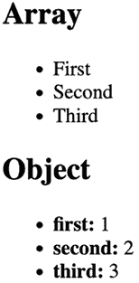
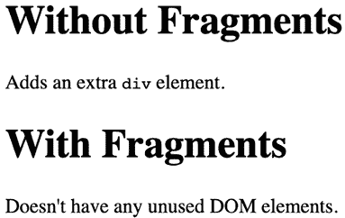
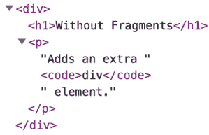

# 第二章：使用 JSX 渲染

本章将向您介绍 **JSX**，这是一种嵌入在您的 JavaScript 代码中的 XML/HTML 标记语法，用于声明您的 React 组件。在最基本的层面上，您将使用 HTML 标记来描述您的 UI 的各个部分。构建 React 应用程序涉及将这些 HTML 标记片段组织成组件。在 React 中，创建一个组件允许您定义超出基本 HTML 标记的自定义元素。这些自定义元素或组件使用 JSX 定义，然后将其转换为浏览器可以识别的标准 HTML 元素。能够创建和重用自定义组件是 React 的核心特性，它使得更动态和复杂的 UI 成为可能。这正是 React 引人入胜的地方——拥有自己的 JSX 标签，可以使用 JavaScript 表达式使您的组件生动起来。JSX 是用于描述使用 React 构建的 UI 的语言。

在本章中，我们将涵盖以下内容：

+   您的第一个 JSX 内容

+   渲染 HTML

+   创建您自己的 JSX 元素

+   使用 JavaScript 表达式

+   构建 JSX 片段

# 技术要求

本章的代码可以在配套 GitHub 仓库的以下目录中找到：[`github.com/PacktPublishing/React-and-React-Native-5E/tree/main/Chapter02`](https://github.com/PacktPublishing/React-and-React-Native-5E/tree/main/Chapter02)。

# 您的第一个 JSX 内容

在本节中，我们将实现必做的 `Hello World` JSX 应用程序。这个初步的探索只是开始——这是一个简单而有效的方法来熟悉语法及其功能。随着我们的进展，我们将深入研究更复杂和细微的示例，展示 JSX 在构建 React 应用程序中的强大和灵活性。我们还将讨论是什么使得这种语法适用于声明式 UI 结构。

## Hello JSX

不再拖延，这是您的第一个 JSX 应用程序：

```js
import * as ReactDOM from "react-dom";
const root = ReactDOM.createRoot(document.getElementById("root"));
root.render(
  <p>
    Hello, <strong>JSX</strong>
  </p>
); 
```

让我们来看看这里发生了什么。

`render()` 函数接受 JSX 作为参数，并将其渲染到传递给 `ReactDOM.createRoot()` 的 DOM 节点。

在此示例中，实际的 JSX 内容渲染了一个包含一些粗体文本的段落。这里没有发生什么特别的事情，所以我们完全可以直接将这个标记作为纯字符串插入到 DOM 中。然而，此示例的目的是展示将 JSX 渲染到页面上的基本步骤。

在底层，JSX 并不是由网络浏览器直接理解的，需要转换成浏览器可以执行的标准的 JavaScript 代码。这种转换通常使用像 **Vite** 或 **Babel** 这样的工具来完成。当 Vite 处理 JSX 代码时，它会将 JSX 编译成 `React.createElement()` 调用。这些调用创建代表虚拟 DOM 元素的 JavaScript 对象。例如，上面示例中的 JSX 表达式被编译成这样：

```js
import * as ReactDOM from "react-dom";
const root = ReactDOM.createRoot(document.getElementById("root"));
root.render(
  React.createElement(
    "p",
    null,
    "Hello, ",
    React.createElement("strong", null, "JSX")
  )
); 
```

`React.createElement` 的第一个参数是元素的类型（例如，用于 DOM 元素的字符串 `div` 或 `p`，或用于复合组件的 React 组件）。第二个参数是一个包含此元素属性的对象，任何后续参数都是此元素的子元素。这种转换由 Vite 在幕后完成，你永远不会编写这样的代码。

由 `React.createElement()` 创建的这些对象，称为 **React 元素**，以对象格式描述了 UI 组件的结构和属性，React 可以处理这些对象。然后，React 使用这些对象构建实际的 DOM 并保持其更新。这个过程涉及一个协调算法，它以高效的方式更新 DOM 以匹配 React 元素。当组件的状态发生变化时，React 计算出更新 DOM 所需的最小更改集，而不是重新渲染整个组件。这使得更新更加高效，也是使用 React 的关键优势之一。

在我们继续更深入的代码示例之前，让我们花一点时间回顾一下我们的 `Hello World` 示例。JSX 内容简短且简单。它也是声明性的，因为它描述了要渲染的内容，而不是如何渲染。具体来说，通过查看 JSX，你可以看到这个组件将渲染一个段落和一些粗体文本。如果以命令式方式完成，可能需要更多步骤，并且它们可能需要按特定顺序执行。

我们刚刚实现的示例应该让你对声明性 React 有一定的感觉。随着我们在本章以及整本书的进展，JSX 标记将变得更加复杂。然而，它始终会描述 UI 中的内容。

`render()` 函数告诉 React 以最有效的方式将你的 JSX 标记更新到 UI 上。这就是 React 如何让你能够声明 UI 的结构，而无需考虑执行更新屏幕上元素的有序步骤，这种方法往往会导致错误。React 默认支持任何 HTML 页面上都能找到的标准 HTML 标签，例如 `div`、`p`、`h1`、`ul`、`li` 等。

现在我们已经发现了 JSX 是什么，它是如何工作的，以及它遵循的声明性理念，让我们探索如何渲染纯 HTML 标记，以及我们应该遵循哪些约定。

# 渲染 HTML

最终，React 组件的职责是在 DOM 浏览器中渲染 HTML。这就是为什么 JSX 默认支持 HTML 标签。在本节中，我们将查看一些渲染可用 HTML 标签的代码。然后，我们将介绍在 React 项目中使用 HTML 标签时通常遵循的一些约定。

## 内置 HTML 标签

当我们渲染 JSX 时，元素标签引用 React 组件。由于为 HTML 元素创建组件会很麻烦，React 提供了 HTML 组件。我们可以在 JSX 中渲染任何 HTML 标签，输出将正如我们所期望的那样。

现在，让我们尝试渲染一些这些标签：

```js
import * as ReactDOM from "react-dom";
const root = ReactDOM.createRoot(document.getElementById("root"));
root.render(
  <div>
    <button />
    <code />
    <input />
    <label />
    <p />
    <pre />
    <select />
    <table />
    <ul />	
  </div>
); 
```

对于这个示例，不必担心渲染输出的格式。我们确保可以渲染任意 HTML 标签，并且它们会按照预期渲染，无需任何特殊的定义和导入。

你可能已经注意到了周围的 `<div>` 标签，它将所有其他标签作为其子元素分组。这是因为 React 需要一个根元素来渲染。在章节的后面，你将学习如何在不将相邻元素包裹在父元素中的情况下渲染它们。

使用 JSX 渲染的 HTML 元素紧密遵循常规 HTML 元素语法，但在大小写敏感性和属性方面有一些细微的差异。

## HTML 标签约定

当你在 JSX 标记中渲染 HTML 标签时，预期你会使用小写字母来表示标签名。实际上，将 HTML 标签名称大写将会失败。标签名是区分大小写的，并且非 HTML 元素名称是大写的。这样，就可以轻松地扫描标记并区分内置的 HTML 元素和其他所有元素。

你还可以传递 HTML 元素任何它们的标准属性。当你传递它们意料之外的东西时，会记录一条关于未知属性的警告。以下是一个说明这些概念的示例：

```js
import * as ReactDOM from "react-dom";
const root = ReactDOM.createRoot(document.getElementById("root"));
root.render(
  <button title="My Button" foo="bar">
    My Button
  </button>
);
root.render(<Button />); 
```

当你运行这个示例时，它将无法编译，因为 React 不了解 `<Button>` 元素；它只知道 `<button>`。

你可以使用任何有效的 HTML 标签作为 JSX 标签，只要你记住它们是区分大小写的，并且需要传递正确的属性名称。除了只有属性值的简单 HTML 标签外，你还可以使用更语义化的 HTML 标签来描述页面内容的结构。

## 描述 UI 结构

JSX 能够以将它们组合在一起形成完整 UI 结构的方式描述屏幕元素。让我们看看一些声明比单个段落更复杂结构的 JSX 标记：

```js
import * as ReactDOM from "react-dom";
const root = ReactDOM.createRoot(document.getElementById("root"));
root.render(
  <section>
    <header>
      <h1>A Header</h1>
    </header>
    <nav>
      <a href="item">Nav Item</a>
    </nav>
    <main>
      <p>The main content...</p>
    </main>
    <footer>
      <small>&copy; 2024</small>
    </footer>
  </section>
); 
```

这个 JSX 标记描述了一个相当复杂的 UI 结构。然而，由于它是 HTML，HTML 适合简洁地表达层次结构，因此它比命令式代码更容易阅读。这就是我们希望在 UI 需要改变时如何思考——不是作为一个单独的元素或属性，而是作为一个整体 UI。

下面是渲染后的内容看起来像什么：


图 2.1：使用 JSX 语法描述 HTML 标签结构

在这个标记中有许多描述 UI 结构的语义元素。例如，`<header>` 元素描述了标题所在的页面顶部部分，而 `<main>` 元素描述了主要页面内容所在的位置。这种复杂结构使开发者更容易推理。但在我们开始实现动态 JSX 标记之前，让我们创建一些自己的 JSX 组件。

# 创建自己的 JSX 元素

组件是 React 的基本构建块。实际上，它们可以被看作是 JSX 标记的词汇表，允许你通过可重用、封装的元素创建复杂界面。在本节中，我们将深入了解如何创建自己的组件并在其中封装 HTML 标记。

## 封装 HTML

我们创建新的 JSX 元素，以便我们可以封装更大的结构。这意味着我们不需要输入复杂的标记，可以使用自定义标签。React 组件返回用于标签位置的 JSX。让我们看看以下示例：

```js
import * as ReactDOM from "react-dom";
function MyComponent() {
  return (
    <section>
      <h1>My Component</h1>
      <p>Content in my component...</p>
    </section>
  );
}
const root = ReactDOM.createRoot(document.getElementById("root"));
root.render(<MyComponent />); 
```

这就是渲染后的输出效果：


图 2.2：一个渲染封装 HTML 标记的组件

这是我们在 React 中实现的第一个组件，所以让我们花点时间分析一下这里发生了什么。我们创建了一个名为 `MyComponent` 的函数，在它的返回语句中我们放置了我们的 HTML 标签。这就是我们创建一个用作新 JSX 元素的 React 组件的方法。正如你在对 `render()` 的调用中看到的那样，你正在渲染一个 `<MyComponent>` 元素。

这个组件封装的 HTML 是从我们创建的函数中返回的。在这种情况下，当 JSX 由 `react-dom` 渲染时，它被一个 `<section>` 元素和它内部的所有内容所替换。

当 React 渲染 JSX 时，你使用的任何自定义元素都必须在相同的作用域内有相应的 React 组件。在前面的示例中，`MyComponent` 函数是在与 `render()` 调用相同的作用域中声明的，所以一切按预期工作。通常，你会导入组件，将它们添加到适当的作用域中。随着你通过本书的进展，你会看到更多关于这一点的内容。

HTML 元素如 `<div>` 常常包含嵌套子元素。让我们看看我们是否可以用我们创建的 JSX 元素做到同样的事情，这些元素是通过实现组件来创建的。

## 嵌套元素

使用 JSX 标记描述具有父子关系的 UI 结构是有用的。子元素是通过在另一个组件（父组件）内部嵌套它们来创建的。

例如，一个 `<li>` 标签仅当它是 `<ul>` 标签或 `<ol>` 标签的子元素时才是有效的 – 你可能也会用你自己的 React 组件创建类似的嵌套结构。为此，你需要使用 `children` 属性。让我们看看这是如何工作的。以下是 JSX 标记：

```js
import * as ReactDOM from "react-dom";
import MySection from "./MySection";
import MyButton from "./MyButton";
const root = ReactDOM.createRoot(document.getElementById("root"));
root.render(
  <MySection>
    <MyButton>My Button Text</MyButton>
  </MySection>
); 
```

你正在导入你自己的两个 React 组件：`MySection` 和 `MyButton`。

现在，如果你查看 JSX 标记，你会注意到`<MyButton>`是`<MySection>`的子元素。你也会注意到`MyButton`组件接受文本作为其子元素，而不是更多的 JSX 元素。

让我们看看这些组件是如何工作的，从`MySection`开始：

```js
export default function MySection(props) {
  return (
    <section>
      <h2>My Section</h2>
      {props.children}
    </section>
  );
} 
```

此组件渲染一个标准的`<section>`HTML 元素，一个标题，然后是`{props.children}`。正是这个最后的部分允许组件访问嵌套元素或文本并将它们渲染出来。

在前面的例子中使用的两个大括号用于 JavaScript 表达式。我将在下一节中详细介绍 JSX 标记中找到的 JavaScript 表达式语法的更多细节。

现在，让我们看看`MyButton`组件：

```js
export default function MyButton(props) {
  return <button>{props.children}</button>;
} 
```

此组件使用与`MySection`完全相同的模式；它获取`{props.children}`的值并将其包裹在标记中。React 会为你处理细节。在这个例子中，按钮文本是`MyButton`的子元素，而`MyButton`又是`MySection`的子元素。然而，按钮文本通过`MySection`透明地传递。换句话说，我们不需要在`MySection`中编写任何代码来确保`MyButton`获取其文本。*真是太酷了，对吧？*下面是渲染输出的样子：


图 2.3：使用子 JSX 值渲染的按钮元素

现在，你已经知道了如何构建自己的 React 组件，在标记中引入新的 JSX 标签。我们在本章中查看的组件到目前为止都是静态的。也就是说，一旦我们渲染了它们，它们就再也没有更新过。JavaScript 表达式是 JSX 的动态部分，根据条件给出不同的输出。

# 使用 JavaScript 表达式

正如你在前面的章节中看到的，JSX 有一个特殊的语法，允许你嵌入 JavaScript 表达式。每当 React 渲染 JSX 内容时，标记中的表达式都会被评估。这个特性是 JSX 动态性的核心；它使得组件的内容和属性能够根据不同的数据或状态条件进行变化。每次 React 渲染或重新渲染 JSX 内容时，这些嵌入的表达式都会被评估，使得显示的 UI 能够反映当前的数据和状态。你还将学习如何将数据集合映射到 JSX 元素。

## 动态属性值和文本

一些 HTML 属性或文本值是静态的，这意味着当 JSX 标记重新渲染时，它们不会改变。其他值，即属性或文本的值，基于在应用程序其他地方找到的数据。记住，React 只是视图层。让我们看一个例子，这样你就可以感受到 JSX 标记中 JavaScript 表达式语法的样子：

```js
import * as ReactDOM from "react-dom";
const enabled = false;
const text = "A Button";
const placeholder = "input value...";
const size = 50;
const root = ReactDOM.createRoot(document.getElementById("root"));
root.render(
  <section>
    <button disabled={!enabled}>{text}</button>
    <input placeholder={placeholder} size={size} />
  </section>
); 
```

任何有效的 JavaScript 表达式，包括嵌套的 JSX，都可以放在大括号`{}`之间。对于属性和文本，这通常是变量名或对象属性。注意，在这个例子中，`!enabled`表达式计算出一个布尔值。下面是渲染输出的样子：


图 2.4：动态更改按钮的属性值

如果你正在跟随可下载的配套代码，我强烈推荐这样做，请尝试调整这些值，看看渲染的 HTML 如何变化：[`github.com/PacktPublishing/React-and-React-Native-5E/tree/main/Chapter02`](https://github.com/PacktPublishing/React-and-React-Native-5E/tree/main/Chapter02)

原始的 JavaScript 值在 JSX 语法中使用起来非常直接。显然，我们可以在 JSX 中使用更复杂的数据类型，例如对象和数组，以及函数来处理事件。让我们来探讨一下。

## 事件处理

在 React 中，你可以轻松地将函数传递给组件的属性，以处理用户交互，如按钮点击、表单提交和鼠标移动。这允许你创建交互式和响应式的用户界面。React 提供了一种方便的方法，可以直接使用类似 `addEventListener` 和 `removeEventListener` 方法在传统 JavaScript 中使用的语法将事件处理器附加到组件上。

为了说明这一点，让我们考虑一个例子，其中我们想在 React 组件中处理一个按钮点击事件：

```js
import * as ReactDOM from "react-dom";
const handleClick = () => {
  console.log("Button clicked!");
};
const root = ReactDOM.createRoot(document.getElementById("root"));
root.render(
  <section>
    <button onClick={handleClick}>Click me</button>
  </section>
); 
```

在这个例子中，我们定义了一个名为 `handleClick` 的函数，当按钮被点击时会调用该函数。然后我们将这个函数作为事件处理器附加到 `<button>` 组件的 `onClick` 属性上。每当按钮被点击时，React 将调用 `handleClick` 函数。

与在传统 JavaScript 中使用 `addEventListener` 和 `removeEventListener` 相比，React 抽象掉了一些复杂性。使用 React 的事件处理，你不必担心手动将事件监听器附加到或从 DOM 元素中移除。React 管理着**事件委托**，并为组件内部的事件处理提供了一种更**声明式**的方法。

React 默认实现事件委托以优化性能。它不是将事件处理器附加到每个单独的元素上，而是将单个事件处理器附加到应用程序的根（或父组件）上。当一个事件在子元素上触发时，它会在组件树中向上冒泡，直到达到具有事件处理器的父组件。然后 React 的合成事件系统根据事件对象的 target 属性确定哪个组件应该处理该事件。这允许 React 高效地管理事件，而无需将处理器附加到每个元素上。

通过使用这种方法，你可以轻松地将事件传递给子组件，在父组件中处理它们，甚至通过多层嵌套组件传播事件。这有助于构建模块化和可重用的组件架构。我们将在下一章中看到这一点。

除了`onClick`事件外，React 还支持许多其他事件，如`onChange`、`onSubmit`、`onMouseOver`以及所有标准事件。你可以将事件处理器附加到各种元素上，如按钮、输入字段、复选框等。

注意，React 提倡单向数据流，这意味着数据从父组件流向子组件。要从子组件向父组件传递数据或信息，你可以定义回调作为 props，并用必要的数据调用它们。在本书的后续章节中，我们将更深入地探讨 React 中的事件处理以及如何创建自定义回调。

## 将集合映射到元素

有时候，你需要编写 JavaScript 表达式来改变你的标记结构。在前面的章节中，你学习了如何使用 JavaScript 表达式语法动态更改 JSX 元素的属性值。那么，当你需要根据 JavaScript 集合添加或删除元素时怎么办呢？

在整本书中，当我提到 JavaScript 集合时，我指的是普通对象和数组，或者更普遍地说，任何可*迭代*的东西。

动态控制 JSX 元素的最佳方式是将它们从集合中映射出来。让我们看看如何做到这一点的一个例子：

```js
import * as ReactDOM from "react-dom";
const array = ["First", "Second", "Third"];
const object = {
  first: 1,
  second: 2,
  third: 3,
};
const root = ReactDOM.createRoot(document.getElementById("root"));
root.render(
  <section>
    <h1>Array</h1>
    <ul>
      {array.map((i) => (
        <li key={i}>{i}</li>
      ))}
    </ul>
    <h1>Object</h1>
    <ul>
      {Object.keys(object).map((i) => (
        <li key={i}>
          <strong>{i}: </strong>
          {object[i]}
        </li>
      ))}
    </ul>
  </section>
); 
```

第一个集合是一个名为`array`的数组，其中包含字符串值。向下到 JSX 标记，你可以看到对`array.map()`的调用，它返回一个新数组。映射函数实际上返回一个 JSX 元素（`<li>`），这意味着数组中的每个项目现在都在标记中表示。

评估这个表达式的结果是数组。不用担心——JSX 知道如何渲染元素数组。为了提高性能，给数组中的每个组件分配一个唯一的`key` prop 至关重要，这样 React 就可以在后续的重新渲染中高效地管理更新。

对象集合使用相同的技巧，但你必须调用`Object.keys()`然后映射这个数组。将集合映射到页面上的 JSX 元素的好处是，你可以根据收集到的数据来控制 React 组件的结构。

这意味着你不必依赖于命令式逻辑来控制 UI。

下面是渲染输出的样子：



图 2.5：将 JavaScript 集合映射到 HTML 元素的结果

JavaScript 表达式让 JSX 内容生动起来。React 评估表达式，并根据已经渲染的内容和变化更新 HTML 内容。理解如何利用这些表达式非常重要，因为这是任何 React 开发者日常活动中最常见的事情之一。

现在，是时候学习如何在不依赖 HTML 标签的情况下将 JSX 标记分组在一起了。

# 构建 JSX 片段

片段是一种将标记块组合在一起的方法，而无需向你的页面添加不必要的结构。例如，一个常见的做法是让 React 组件返回被 `<div>` 元素包裹的内容。这个元素没有任何实际用途，只会给 DOM 增加杂乱。

让我们看看一个例子。这里有组件的两个版本。一个使用包装元素，另一个使用新的片段功能：

```js
import * as ReactDOM from "react-dom";
import WithoutFragments from "./WithoutFragments";
import WithFragments from "./WithFragments";
const root = ReactDOM.createRoot(document.getElementById("root"));
root.render(
  <div>
    <WithoutFragments />
    <WithFragments />
  </div>
); 
```

渲染的两个元素是 `<WithoutFragments>` 和 `<WithFragments>`。以下是它们渲染后的样子：



图 2.6：片段有助于渲染更少的 HTML 标签，而没有任何视觉差异

现在让我们比较这两种方法。

## 使用包装元素

第一种方法是将兄弟元素包裹在 `<div>` 中。以下是源代码的样子：

```js
export default function WithoutFragments() {
  return (
    <div>
      <h1>Without Fragments</h1>
      <p>
        Adds an extra <code>div</code> element.
      </p>
    </div>
  );
} 
```

这个组件的本质是 `<h1>` 和 `<p>` 标签。然而，为了从 `render()` 方法中返回它们，你必须用 `<div>` 标签将它们包裹起来。实际上，使用浏览器开发者工具检查 DOM 会发现 `<div>` 标签除了添加另一个结构层级外，并没有做任何事情：



图 2.7：DOM 中的另一个结构层级

现在，想象一个包含大量这些组件的应用——那将有很多无用的元素！让我们看看如何使用片段来避免不必要的标签。

## 使用片段

让我们看看 `WithFragments` 组件，其中我们避免了使用不必要的标签：

```js
export default function WithFragments() {
  return (
    <>
      <h1>With Fragments</h1>
      <p>Doesn't have any unused DOM elements.</p>
    </>
  );
} 
```

与将组件内容包裹在 `<div>` 中的做法不同，这里使用的是 `<>` 元素。这是一个特殊的元素类型，表示只需要渲染其子元素。`<>` 是 `React.Fragment` 组件的简写。如果你需要向片段传递一个键属性，就不能使用 `<>` 语法。

如果你检查 DOM，可以看到与 `WithoutFragments` 组件相比的差异。


图 2.8：片段中的更少 HTML

随着在 JSX 标记中使用片段的出现，页面上渲染的 HTML 更少了，因为我们不需要使用 `<div>` 等标签来仅仅是为了将元素组合在一起。相反，当组件渲染片段时，React 会知道在组件被使用的地方渲染片段的子元素。

因此，片段使 React 组件能够仅渲染必要的元素；不再会有无用的元素出现在渲染的页面上。

# 概述

在本章中，你学习了 JSX 的基础知识，包括其声明性结构，这有助于编写更易于维护的代码。然后，你编写了一些代码来渲染基本的 HTML，并学习了如何使用 JSX 描述复杂结构；每个 React 应用至少包含一些结构。

然后，你花了一些时间学习如何通过实现自己的 React 组件来扩展 JSX 标记的词汇量，这就是你如何将 UI 设计为一系列较小的部分并将它们粘合在一起形成一个整体的方式。接着，你学习了如何将动态内容引入 JSX 元素属性，以及如何将 JavaScript 集合映射到 JSX 元素，从而消除了控制 UI 显示的命令式逻辑的需求。最后，你学习了如何渲染 JSX 内容的片段，这可以防止使用不必要的 HTML 元素。

现在你已经对通过在 JavaScript 模块中嵌入声明性 XML 来渲染 UI 的感觉有了了解，是时候进入下一章了，我们将更深入地探讨组件、属性和状态。
